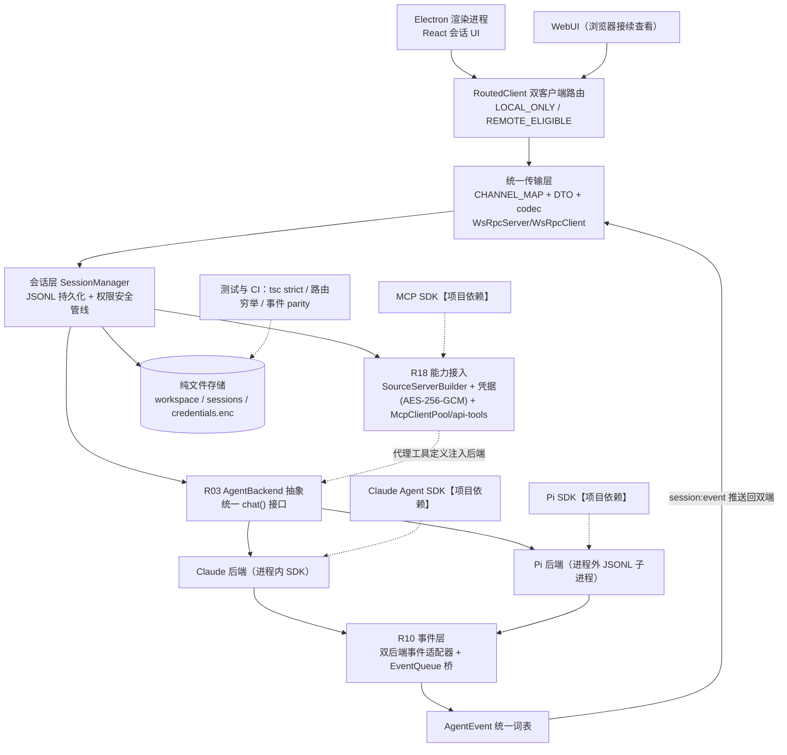

# Craft Agents 项目故事包（面试版 · 八模块骨架 + 九阶段织入）

> 生成：2026-08-30｜依据：`Craft-定稿.md`（口径唯一真相源）+ `Craft-复现文档.md`（机制与测试事实）+ `三项目联动-步6.md`（联动素材）+ skill workflow.md Step 1c / story-methodology.md。
> **结构说明**：按 skill Step 1c 八模块组织；story-methodology 九阶段开发故事主线织入各模块（落点见下表）；文末另附一段连贯「开发故事主线」口述稿。

## 九阶段 × 模块落点交叉表

| 方法论阶段 | 落点 |
| --- | --- |
| 0 问题定义与设计哲学 | M1 事实卡 · M2 业务故事 |
| 1 核心架构决策（骨架） | M3 骨架选型表 · 架构走读 |
| 2 能力分层 | M3 架构图与依赖口径 · M8 速查 |
| 3 逐模块开发顺序与动因 | M5 开发顺序时间线 |
| 4 关键设计决策与反例 | M4 各点第③问 why-not |
| 5 评测与迭代闭环 | M4「评测与迭代闭环」小节 |
| 6 安全与治理 | M4「安全与治理」小节 |
| 7 踩坑与失败恢复 | M4 各点第⑤问失败恢复 |
| 8 落地与演进 | M1 能力边界表 · M7 多项目联动 |

## 真实性标签图例

- 【本人实际参与】：R 点与简历材料支撑的内容——本项目全部自研模块均属此类（个人独立开发）。
- 【项目整体架构】：R 点描述的系统能力，讲机制时用，不等于个人职责声明。
- 【待确认】：材料里没有的细节（起止时间、开发节奏），需本人回填。
- 【前沿认知】：方法论/论文认知，项目未实现（评测方法论等）。
- 【项目依赖】：第三方 SDK（Claude Agent SDK、Pi SDK、MCP SDK、ws 等）。

## 红线（全程生效）

1. 效果全定性，不编造任何指标/数字/百分比/用户量/日期/团队/业务反馈/事故。
2. 不虚构使用主体：使用者=本人；「深度研究工作台」是个人项目场景，不是服务过的企业。
3. Scope Boundary 内：评测/采样/度量不冒认（事件类型职责外）；MCP 只到统一转换层；多任务并行=异步并发非线程并行；文件系统级隔离非多租户。
4. 未实现不写成已实现；R24 分层验证体系已换出，只作 OPTIONAL 加固，不当已实现能力讲。
5. 工程措辞只说「工业级工程实践风格」，不说「工业级/企业级」。
6. 口述纪律：内部引注（R 编号/防线编号/模块文件名）只进脑子不进嘴；「R10」本文指 AgentEvent 事件流，MiniCode 的 R10=写前确认 diff，同号不同物。

---

## M1 · 项目事实卡（阶段 0 + 阶段 8）

| 字段 | 内容 | 标签 |
| --- | --- | --- |
| 项目名称 | Craft Agents（复现工程名自定，避开商标词根） | 【本人实际参与】【待确认：最终仓库名】 |
| 业务用户 | 本人——技术调研、论文/文档阅读、方案比较、行业信息汇总 | 【本人实际参与】 |
| 原工作流与痛点 | 浏览器开一堆标签页+笔记软件手动拼：多任务并行时资料互相串台；想换模型得改整条调用链；搜索 API/抓取/文档各自散装接；桌面与网页两套逻辑；分钟级研究任务执行像黑盒 | 【本人实际参与】 |
| 项目目标 | 把研究任务做成可配置（按阶段选模型）、可运行（任务隔离并行）、可接入（外部能力统一进）、可复用（一套逻辑多端跑）的多端 Agent 工作台 | 【本人实际参与】 |
| 系统输入 | 用户研究问题与附件；配置（模型连接、Workspace defaults、Source 配置与凭据）；外部能力（搜索 API/网页抓取/本地文档/MCP） | 【本人实际参与】 |
| 核心流程 | 双端 UI → 统一传输路由 → 会话层（持久化+权限管线）→ 后端抽象 chat() → 统一事件流 → 工具执行 → 流式呈现与结构化错误恢复 | 【项目整体架构】 |
| 系统输出 | 流式文本、工具过程卡、权限确认对话框、结构化错误卡、完成+用量汇总；session.jsonl 持久记录；多端一致视图 | 【项目整体架构】 |
| 我的实际职责 | 全部自研模块的设计与实现（个人独立开发）；第三方 SDK 只做接入与观测 | 【本人实际参与】 |
| 协作边界 | 无团队——单人开发。「我一个人维护、迭代快，更需要把契约和边界锁死，否则 bug 追不回。」 | 【本人实际参与】 |
| 已知技术与事实 | TypeScript strict / Bun workspace 四包 / Electron 39 / React 18 / ws / Claude Agent SDK 0.3.220（锁版）/ Pi 0.80.6（锁版）/ MCP SDK；AgentEvent 联合定义于 core/types/message.ts:550 | 【本人实际参与】【项目依赖】 |
| 已知风险/例外 | Pi 是全场最高危追问点（防线必背）；MCP 只到统一转换层（先发自爆）；行为评测未实现（诚实交底） | 【本人实际参与】 |
| 已知结果 | 定性：五切面机制各自带必备测试（工厂路由/Pi 协议集成/双会话隔离/三层头优先级/路由穷举/事件 parity 等）；tsc 全仓 strict + CI | 【本人实际参与】 |
| 待确认 | 真实起止时间、开发节奏（几轮迭代、每天投入） | 【待确认】 |

### 能力边界表（阶段 8 · 落地与演进）

| 层级 | 内容 |
| --- | --- |
| 已实现（五切面 MUST/MUST-lite） | 后端抽象+Pi 子进程；Session/Workspace 隔离；统一能力接入核心链（Source→凭据→Client/Pool→工具+Skill 加载 lite）；统一传输核心链（protocol/CHANNEL_MAP/WsRpc/RoutedClient/WebUI 覆写/headless）；AgentEvent 事件流+双后端适配+EventQueue+typed_error 恢复 |
| 理解可扩展（OPTIONAL） | R18：OAuth 授权流程/McpPoolServer HTTP 端点/OpenAPI 导入/Token 刷新；R12：心跳/seq 事件重放/make-before-break 重订阅/thin-client；工程底座：channel-map-parity 双向守卫/ESLint 边界规则/check-raw-sends（R24 遗产降级项） |
| 前沿认知（未实现） | 行为评测（采样策略+判定标准+裁判模型三个独立问题）、LLM 裁判/pass^k、技能自动进化、多租户行级隔离、跨端无缝续接会话状态 |
| 明确不做 | RAG/VectorDB；多 Agent 编排（多任务=多 Session）；复杂 Memory；评测底座；i18n |

---

## M2 · 业务故事（阶段 0 展开）

**用户是谁、原来怎么工作**：使用者是我自己。做技术调研时要同时推进好几个问题——比如比较两套 Agent 框架、读三篇论文、汇总一个行业的公开信息。原来的做法是浏览器开一堆标签页、笔记软件里手动拼：两个任务都搜了类似关键词，搜索结果和网页原文混在同一处，回头找不到哪条结论属于哪个问题；想给抓取/整理这类吃 token 的步骤换个便宜模型、分析综合再换强模型，发现前端耦合着一家 SDK，换模型=改整条调用链；每接一个新的外部能力（一个搜索 API、一个 MCP server）都要改一遍代码，凭据散落在各处；想在通勤路上用网页看一眼进度，发现桌面和网页是两套逻辑。

**为什么低效/有风险**：任务混杂→结论不可信；耦合 SDK→切换成本高；散装接入→重复劳动+凭据乱放；两套逻辑→维护翻倍；分钟级长任务执行黑盒→中途出错（搜索 API 超时、抓取失败）只能整个断掉重来。

**项目改变什么**：一个研究任务一个 Session+独立工作区（互不串台、可并行）；后端抽象让换模型收敛为配置层改动；统一能力接入层把 MCP/API/本地源统一转成工具、凭据集中注入；统一传输层让桌面与 Web 复用同一套会话/文件/模型逻辑；统一事件流让长任务全程可见、结构化错误有统一恢复入口。

**成功长什么样（定性）**：并行推三个研究任务互不污染；抓取阶段用快省模型、分析阶段切强推理模型，只动配置；新接一个 MCP server 是加一份 Source 配置；网页端看到和桌面一致的会话与流式进度；一个搜索 API 超时呈现为一张可重试的错误卡而不是整场崩掉。

**业务闭环走读（输入→处理→输出→反馈）**：输入一句研究问题（选某个工作区/会话）→ 会话层持久化并把请求经统一传输路由到后端抽象 → 后端按当前模型连接产出统一事件流（文本增量/工具启动与结果/权限请求）→ 会话层把事件广播到双端 UI 并写入 JSONL → 工具执行前过权限管线（人工裁决）→ 外部能力经统一接入层调用（凭据按 Source 注入）→ 输出流式答案+工具卡+完成汇总 → 反馈：错误以结构化错误卡呈现，可按类型重试；历史会话可回看、可恢复。

**我的角色与边界**：个人独立开发，全部自研模块从设计到实现一人完成；没有团队、没有外部用户、没有任何业务反馈——面试永远这么讲，不编。

---

## M3 · 架构与数据流（阶段 1 骨架 + 阶段 2 分层）

> 个人项目：图中自研模块均为【本人实际参与·个人独立开发】；三个 SDK 节点为【项目依赖】，只做接入与观测，不认领其内部实现。

### 输入/输出/状态/异常表

| 维度 | 内容 |
| --- | --- |
| 输入 | 用户消息/附件；模型连接与 Workspace defaults 配置；Source 配置+凭据（手动粘贴 token 录入） |
| 处理 | RoutedClient 按通道分类路由 → WsRpc 编解码 → 会话层（持久化+权限管线）→ AgentBackend.chat() → 事件适配 → AgentEvent 流 → UI 按 type 分流渲染 |
| 输出 | 流式文本/工具卡/权限对话框/错误卡/完成+用量；session.jsonl 逐事件记录；多端一致视图 |
| 状态 | Session 状态（status/isArchived/isFlagged）；turnId 归组与 parentToolUseId 工具树；EventQueue 缓冲与收流状态 |
| 异常 | 外部来源错误→typed_error 错误卡（canRetry 决定重试入口）；未知事件类型→default 丢弃+日志不崩流；坏 JSONL 行→容错不断流；Pi 子进程崩溃→进程隔离不拖垮宿主；未分类通道→路由穷举测试在 CI 拦下 |

### 依赖关系口径（范围控制定版，全文唯一说法）

依赖关系：**R03→R10**（R10 消费 R03 的事件产出、定义契约）；**R08、R18 相互独立**（与事件层仅在运行时汇合）；**R12 最后汇总承载**到多端。施工顺序按 R03→R10→R08→R18→R12 线性排——**这是施工顺序，不是严格代码依赖**，被追问依赖结构按本句答。五个点是「Agent 工程五个切面」，不是半个 Agent Runtime。

### 骨架选型对比表（阶段 1）

| 决策 | 选了什么 | 放弃了什么 | 为什么 |
| --- | --- | --- | --- |
| 构建运行 | Bun workspace（core/shared/pi-agent-server + apps/electron/webui） | npm+构建链全家桶 | dev 直跑 TS；monorepo 分层对齐「多端复用」诉求 |
| 服务形态 | Electron 主进程内嵌 WS server + headless 入口 | 独立云端后端 | 同一套 server 两种载体，把「多端复用」变成可当场演示的事实；个人项目不引运维面 |
| 第二后端 | Pi 进程外 JSONL 子进程 | 进程内直连 SDK | 重依赖隔离、崩了不拖垮宿主；凭据永远只在宿主进程 |
| 存储 | 纯文件（JSONL+config.json+credentials.enc） | 数据库/ORM | 会话可移植（{{SESSION_PATH}}）、部署零依赖；单机个人场景引 DB 无增量价值只有运维成本 |

### 架构走读（一段话）

用户在桌面或网页发一句研究问题：请求先进 RoutedClient，每条通道早已被强制归类（需要本地 OS 能力的走本地、跟工作区内容走的可远端），经统一 envelope 编码到达会话层；会话层落 JSONL、把消息交给当前配置的后端——Claude 走进程内 SDK 流、Pi 走子进程 JSONL 协议，两家方言各自被事件适配器翻译成同一份 AgentEvent 词表（Pi 的异步事件先经 EventQueue 桥成可迭代的流）；UI 拿到事件按 type 分流渲染，文本增量拼字、工具出卡、权限请求弹对话框（工具执行前安全管线拦截、人工裁决）；需要外部数据时后端拿的是统一接入层转出的代理工具，凭据按 Source 注入、从不落日志；中途搜索 API 超时，前端收到的是带 canRetry 和建议动作的结构化错误卡，按一下重试继续，而不是一行红字全场崩。

---

## M4 · 技术故事（逐点五问；阶段 4/5/6/7 织入）

> 按 bullet 顺序 R03→R08→R18→R12→R10 展开；每点五问：①业务问题 ②机制链 ③why-not 反例 ④边界 ⑤失败与恢复。

### R03 · AgentBackend 抽象 + Pi 进程外第二后端

1. **业务问题**：研究流程天然分阶段——抓取整理要快和省，分析综合要强推理；而前端耦合单一模型 SDK，换后端或增换服务商都要改动整个调用链。
2. **机制链**：AgentBackend 统一接口（chat() 返回 AsyncGenerator&lt;AgentEvent&gt;、abort/forceAbort、redirect 双分支、runMiniCompletion 标题生成等）；BaseAgent 抽象类持有公共状态并委托 PermissionManager/SourceManager/PromptBuilder/UsageTracker 四个精简模块；DRIVER_REGISTRY 工厂按 provider（anthropic|pi）实例化；MODEL_REGISTRY 静态能力字段+driver.fetchModels+supportsBranching 表达能力。Pi 第二后端：主进程 spawn 子进程，stdin/stdout 每行一个 JSON（init/prompt/abort），子进程遇 MCP/API/session 工具不发外部请求，而是发 tool_execute_request 让宿主经 McpClientPool 执行、结果回写（pendingToolExecutions Map 关联）——凭据永远只在宿主。必备测试：工厂按 provider 路由与未知 provider 抛错、Pi 协议集成（握手/事件序列/abort/工具代理回写/坏行容错）、redirect 双分支语义各一例。
3. **why-not**：为什么不直接把 SDK 包一层？——包一层只解决「能调」，抽象解决「可换」：接口承载配置控制与生命周期，换后端=换配置；抽象必然屏蔽特有能力，用配置标记+运行时能力白名单兜底，不为单家服务商破坏统一接口。为什么不引完整 Runtime？——后端抽象非完整 Runtime，会话调度/工具分发/权限编排由其他模块承担。Pi 为什么必须子进程？——重依赖隔离+凭据边界，进程内直连两个都做不到。
4. **边界**：R03 只管「谁能被换」；事件词表归 R10（R03 只负责把 Pi 原生事件送入统一事件管线）；「按阶段换模型」是配置层手动选择，不是自动路由（被问自动切换就用这句画界）。
5. **失败与恢复**：Pi 协议集成测试覆盖坏 JSONL 行容错不断流；子进程隔离保证重依赖崩溃不拖垮宿主——这是「为什么进程外」的运行时证据。

### R08 · Session/Workspace 隔离

1. **业务问题**：多个研究任务并行推进时，搜索结果、网页原文、中间结论与偏好配置在单一上下文互相混杂，结论不可信且任务无法并行。
2. **机制链**：Workspace 定义环境（rootPath 支持任意磁盘位置+defaults：model/默认连接/启用 sources/permissionMode/workingDirectory/thinkingLevel）；Session 隔离状态（每会话一个目录+session.jsonl+attachments 等子目录、状态字段）；隔离语义落地为一件事——每会话 workingDirectory 默认指向会话目录，工具执行 cwd 按会话注入，两个并行任务的搜索结果/下载/中间产物物理分家；persistence-queue 每会话串行化+临时文件 rename 原子落盘+header 元数据签名比对；{{SESSION_PATH}} token 让会话目录移动/换机不烂；生命周期 create（slug 唯一化）/archive（保留数据仅标记）/delete（整目录 rm）。必备测试：双会话同工作区互不可见（cwd/文件）、sanitizeSessionId 拒绝 `../` 与绝对路径、并发持久化最终一致、{{SESSION_PATH}} 往返。
3. **why-not**：Session 与 Workspace 为什么不合一？——同一工作区可跑多个会话，任务结束销毁 Session 不破坏工作区积累的资料；合一起来「环境」和「过程」就没法分开演进。为什么不引 DB 做多租户？——文件系统级隔离对单机个人场景足够，行级权限需上层 DB/RLS，平台不提供（主动交底）。
4. **边界**：隔离使任务可并行（异步并发非线程并行，被问「并行」就补这句）；不做多 Agent 编排（任务粒度即 Session 粒度）；不做跨任务 Memory（演进方向）。
5. **失败与恢复**：sanitizeSessionId 是调用方校验之外的第二道闸（defense-in-depth），拒绝路径穿越类输入；header 签名比对保证外部手改的名/状态不被内存旧值覆盖。

### R18 · 统一能力接入层

1. **业务问题**：搜索 API、网页抓取、本地文档、MCP 工具等第三方研究能力各自为政接入，凭据与配置散落，每接一个能力需改造一遍代码。
2. **机制链**：Source 三型目录制（mcp/api/local，每源一个目录：config.json+guide.md）；SourceServerBuilder 产出 stdio 或 http/sse 两种 SDK 兼容配置，三层头叠加优先级（配置静态头<凭据库多头凭据<Authorization: Bearer 最高），声称已认证但 token 缺失→返回 null（needs re-auth）；凭据存储 AES-256-GCM 加密文件（CRAFT01 式 64B 头，以机器标识作为 KDF 输入 PBKDF2 派生密钥，机器绑定拷走解不开）；McpClientPool 中央池代理工具 `mcp__{slug}__{tool}`（单一代码路径/跨会话共享连接/无凭据缓存文件/运行时切换不重启）；api-tools 每 API 源生成一个灵活工具（入参 path/method/params，鉴权自动注入）；Skill=SKILL.md frontmatter（含 requiredSources）+使用逻辑（lite）。必备测试：三层头优先级快照、缺 token 返回 null、Authorization 三态拼接、凭据加解密往返+换机器解密失败、pool 同步后代理名与原始名映射。
3. **why-not**：为什么不自研 MCP 协议？——用官方 SDK 的 Client 连 server+转成代理工具定义，到此为止；JSON-RPC/握手/传输层没深做（先发自爆，抢在被问前）。为什么不做 OAuth 完整流程？——凭据手动粘贴录入，getToken 钩子预留接口即可（自托管个人场景不引授权舞蹈的复杂度）。为什么不建技能市场？——Skill 只讲 SKILL.md 加载与 requiredSources 校验，市场是发散方向。
4. **边界**：效果是「统一接入与调用」不说「调度」；具体研究工具（搜索聚合、抓取清洗）是自建适配器非平台原生；MCP 讲到统一转换层（L2 口径）。
5. **失败与恢复**：已认证但 token 缺失→返回 null 触发 needs re-auth，而不是带着空凭据半调用；SERVER_BUILD_ERRORS 常量统一错误匹配，构造失败可归类呈现。

### R12 · IPC/WebSocket 统一传输层

1. **业务问题**：桌面端是主力工作台（长任务、大屏分析），Web 端负责随时接续查看进度；两端各自维护一套会话/文件/模型连接逻辑导致功能不同步、维护成本翻倍。
2. **机制链**：protocol 包四件——RPC_CHANNELS 线格式通道表（稳定 API 契约）、BroadcastEventMap 类型化推送表、共享 DTO、envelope 核心五型（handshake/handshake_ack/request/response/event/error，codec 对二进制做 base64 标注）；**路由穷举表**：每条通道必须归 LOCAL_ONLY（需要本地 OS/Electron）或 REMOTE_ELIGIBLE（跟工作区内容走）恰好其一，穷举测试强制新通道先分类否则 CI 红；WsRpcServer 一类两用（本地 127.0.0.1 无鉴权/远端 0.0.0.0 握手 token 鉴权，重复注册直接抛）；buildClientApi 按 CHANNEL_MAP 运行时生成客户端代理（invoke/listener/transform 三种条目、点号嵌套命名空间），替代手写 preload；RoutedClient 双客户端按分类路由；WebUI 只写覆写层（原生文件对话框→input[type=file]、主题→matchMedia），浏览器 cookie 随 WS upgrade 自动携带；headless 入口同一 server 无窗口启动。必备测试：路由穷举（分类完备/总数相等/零交集）、LOCAL_ONLY 强制本地路由、codec 往返含二进制、明文 ws:// 拒绝。（OPTIONAL-lite：心跳/seq 重放/make-before-break/thin-client——时间紧可砍，routing 穷举永远必做。）
3. **why-not**：为什么不用 Express？——WS server 自写很小，框架反而是包袱。为什么不做「跨端无缝续接会话状态」？——那依赖共享持久化层，不是传输层的职责，别把效果说越界。为什么运行时生成代理而不是手写 preload？——通道表是单一事实源，手写必然漂移。
4. **边界**：传输层抽象，不是多端 Runtime；文件系统差异（桌面本地直连/Web 服务端代理）收敛在 DTO 与路由层，上层零改动。
5. **失败与恢复**：新通道忘分类→路由穷举测试当场红（把「漏决策」拦在 CI）；非 localhost 明文 ws:// 直接抛错（token 明文防护）。

### R10 · AgentEvent 统一事件流与生命周期

1. **业务问题**：深度研究任务链路长（分钟级），用户需要全程看到「现在搜到哪、读到哪、分析到哪」；外部来源天然易错（搜索 API 超时、抓取失败、MCP 工具报错），错误不能只是一行红字断掉整个任务；缺乏统一事件契约则 UI 解析逻辑分散。
2. **机制链**：AgentEvent 可辨识联合类型（core/types/message.ts:550，源码 21 型；面试口径只讲五类核心：文本增量 text_delta/text_complete、工具 tool_start/tool_result、权限请求 permission_request、结构化错误 typed_error、完成 complete+usage；类型定义里还有 status/info 等辅助事件，被问「还有吗」再承认）；turnId 归组一轮（取自 API message.id）、parentToolUseId 挂嵌套工具树——**该字段可选：Claude 后端原生透传，Pi 后端当时用 sub-turn 隔离近似，词表跨后端对齐但字段填充度按后端能力不同**；BaseEventAdapter 提供共享状态（turnIndex/currentTurnId、三个状态 Map、startTurn 生命周期钩子），Claude 适配器 stream_event→text_delta 实时推、pendingText 延迟等 stop_reason 再发 text_complete，Pi 适配器按头注释映射表转换并处理压缩竞态；**EventQueue**（enqueue/drain/complete/reset）把 Pi 异步回调桥成 AsyncGenerator——push 变 pull；typed_error 结构化（code/title/message/details/actions/canRetry/originalError）→UI 错误卡+重试入口。必备测试：双后端适配器快照（Pi fixture→统一事件形状）、turnId 归组与工具树、EventQueue 往返三例、session-event-message parity（事件字段↔StoredMessage 字段一致）、未知事件类型容错。
3. **why-not**：EventQueue 是不是 async generator 换皮？——不是：换皮只需要 yield，EventQueue 做的是缓冲、完成信号与 reset 生命周期，因为两个后端 SDK 的消费方式根本不同（Claude 同步 for-await、Pi 异步回调），队列让双后端出同一个 AsyncGenerator 接口。为什么不做成 FSM 状态机？——没有显式状态转移表，「生命周期」指事件间关联与状态流转（turn 归组/工具树/错误恢复），不硬贴重词。为什么不追全 21 型？——核心五类+status/info 必做，辅助型按需选，词表按需扩展。
4. **边界**：评测/采样/度量是消费侧能力，不是该类型职责（被问评测→「采样+判定+裁判三个独立问题，事件流只是行为可复现的数据基础」）；恢复由消费侧（UI/会话层）按类型决策——协议提供信息基础与统一恢复入口，不是自动重试；**permission_request 不是事件适配器发的**——会话层安全管线在工具执行前拦截后发出（PreToolUse 拦截→permission_request→用户裁决→放行或记 block reason）；R10 依赖 R03 后端提供事件源——契约定义中间格式，不是事件源头。
5. **失败与恢复**：外部来源超时→typed_error 错误卡（title+details 可展开+actions 按钮），canRetry 决定重试入口；未知事件类型→default 分支丢弃+日志，不崩流（前向兼容的现实答案）。

### 评测与迭代闭环（阶段 5）

- **确定性验证信号**：tsc 全仓 strict 零错误、路由穷举测试、session-event-message parity、各点必备测试全绿是合并门槛；CI frozen-lockfile→typecheck→lint→test。「工程验证」说人话：**保证我频繁改代码时不会把自己写崩**。
- **事件契约的工程价值**：事件流结构化之后，每轮执行可回放、回归问题可定位——这是**行为可复现的数据基础，不是行为评测本身**。
- **诚实交底**：行为评测=采样策略+判定标准+裁判模型三个独立问题，每个都是一整块活；未实现就说没实现（【前沿认知】）。
- **指标口径**：测试与机制是「做了这些用例」的构建事实，不包装成「效果好」；不报任何效果数字。

### 安全与治理（阶段 6）

- **凭据**：统一入口即治理边界——凭据按 Source 注入、集中存 AES-256-GCM 加密文件；⚠️ 口径：机器标识是 KDF **输入**不是密钥本身（配合 salt 经 PBKDF2 多轮派生），被追问加密细节按这句讲。
- **权限**：工具注册时配置权限；工具执行前会话层安全管线拦截→permission_request→用户裁决→放行或记 block reason（人工在环）。
- **路径**：sanitizeSessionId 剥离路径成分（第二道闸）。
- **传输**：非 localhost 明文 ws:// 直接拒绝（token 不走明文）。
- **日志**：结构化（requestId/sessionId/backend）；凭据/token 绝不入日志。

---

## M5 · 我的 STAR 故事

### 开发顺序时间线（阶段 3 · 动因从依赖与风险推断，日期【待确认】）

| 顺序 | 模块 | 进场动因 | 解决什么 | 留下什么边界 |
| --- | --- | --- | --- | --- |
| 1 | 地基（monorepo+core 类型+最小会话 UI+Claude 端到端） | 没有骨架什么都没法谈 | 一条端到端流先跑通 | 类型层从此是全项目的公共语言 |
| 2 | R03 后端抽象 | 一切的地基：先定「谁能被换」 | 换模型=换配置；Pi 进程外接入 | 接口出流（AsyncGenerator），流的样子留给下一块 |
| 3 | R10 事件层 | 紧随 R03 消费其事件产出、定义契约 | 双后端同词表、长任务可见、错误可恢复入口 | 「换完之后 UI 还认」；评测不在此层 |
| 4 | R08 Session 隔离 | 独立块：多任务开始互相串台时进场 | 一任务一 Session+独立工作区 | 文件系统级隔离；不做编排/Memory |
| 5 | R18 能力接入 | 独立块：每接一个外部能力改一遍代码时进场 | Source→凭据→Client/Pool→工具统一链 | 统一转换层；OAuth/技能市场不做 |
| 6 | R12 传输层 | 收尾汇总承载：把前四块送进多端 | 一套会话/文件/模型逻辑双端复用 | 传输抽象非多端 Runtime；路由穷举守门 |

### 五条 STAR（30 秒电梯版 + 90 秒标准版 + 3 分钟深挖指引）

**R03 · 模型解耦**
- 30 秒：「研究流程不同阶段需要不同模型，而前端耦合单一 SDK，换模型要改整个调用链。我设计了 AgentBackend 抽象，把 Claude、Pi 统一成 provider-agnostic 的 chat() 接口——换后端收敛为配置层改动，Pi 是进程外 JSONL 子进程接入、工具调用代理回宿主。」
- 90 秒：30 秒版 + 抽象的代价（屏蔽特有能力→配置标记+运行时能力白名单兜底）+ Pi 子进程的凭据边界（工具代理回宿主、凭据只在宿主）+ 边界（后端抽象非完整 Runtime）。
- 3 分钟：90 秒版 → 深挖指引：M4-R03（接口形状/Pi 协议/工厂与能力三件套）+ 防线 Pi 条（§5-1）。
- 第一人称「你到底做了什么」：「接口定义、工厂、两个后端实现、Pi 的子进程协议和工具代理，都是我写的；SDK 本身只是被接入。」
- 【待确认】：无关键悬空——Pi 细节按防线背。

**R08 · 任务隔离**
- 30 秒：「多个研究任务并行时，搜索结果、原文、中间结论混在一个上下文里互相污染。我以 Session 和 Workspace 为边界做了状态隔离——一个研究任务一个 Session 加独立工作区，工具执行的 working directory 按会话注入，两个任务的产物物理分家。」
- 90 秒：30 秒版 + Session vs Workspace 分开的理由（同一工作区跑多会话、销毁 Session 不破坏资料）+ 持久化细节（串行队列/原子落盘/路径可移植化）。
- 3 分钟：90 秒版 → M4-R08 + 防线「多开窗口反杀」（隔离的是工具上下文/目录/偏好，不是 UI 窗口）。
- 第一人称：「隔离体系、JSONL 存储、生命周期管理都是我写的；『多任务并行』指异步并发，隔离保障的是状态不串。」
- 【待确认】：无。

**R18 · 能力接入**
- 30 秒：「搜索 API、抓取、本地文档、MCP 各自为政，每接一个改一遍代码、凭据到处放。我做了统一能力接入层：MCP/API/本地数据源统一转换成 Agent 可调用工具，凭据按 Source 注入、权限注册时配置——统一入口即治理边界。」
- 90 秒：30 秒版 + SourceServerBuilder 三层头优先级与 needs re-auth + 凭据 AES-256-GCM 机器绑定加密（机器标识作 KDF 输入）+ Source 与 Skill 分离。
- 3 分钟：90 秒版 → M4-R18 + 防线 MCP 自爆（「只到统一转换层」第一句主动说）。
- 第一人称：「转换层、凭据存储、中央池都是我写的；MCP 协议本身用官方 SDK，不自研——这是我主动交底的边界。」
- 【待确认】：无。

**R12 · 多端复用**
- 30 秒：「桌面是主力工作台、网页负责随时接续，两端各自维护一套逻辑必然不同步。我做了统一传输层：统一 RPC channel、DTO 与路由规则，Electron IPC 和 WebSocket 只是可替换的传输边界——同一套会话、文件、模型连接逻辑多端复用。」
- 90 秒：30 秒版 + 路由穷举的灵魂细节（每条通道必须显式分类，新通道没分类 CI 就红）+ WebUI 只写覆写层的实物证据 + 文件系统差异收敛在 DTO 与路由。
- 3 分钟：90 秒版 → M4-R12 + 防线多端真话（「重点不是两个产品，是传输层只写一遍」）。
- 第一人称：「协议包、路由表、服务端、客户端生成、WebUI 覆写层全是我写的；穷举测试是我最得意的一条门禁。」
- 【待确认】：Web 端部署与否按真话口径（桌面为主，Web 是验证复用的第二载体）。

**R10 · 事件契约**
- 30 秒：「深度研究任务一跑几分钟，文本增量、工具进度、权限确认、外部来源错误混杂呈现，UI 解析分散、错误难恢复。我基于可辨识联合类型设计了 AgentEvent 事件流协议——文本增量、工具启动/结果、权限请求、结构化错误与完成状态——实现了执行过程的标准化实时呈现与结构化错误的统一恢复入口。」
- 90 秒：30 秒版 + turnId/工具树关联（parentToolUseId 可选、Claude 透传 Pi 近似）+ EventQueue 桥（push 变 pull，不是 generator 换皮）+ typed_error 错误卡与重试入口（恢复由消费侧决策）。
- 3 分钟：90 秒版 → M4-R10 + 防线四件套（五类口径/turnId/EventQueue 反换皮/permission_request 出处）。
- 第一人称：「事件联合类型、双后端适配器、EventQueue、parity 测试都是我写的；评测不是这块的职责，我没实现评测就说没实现。」
- 【待确认】：无。

---

## M6 · 追问树（10 轮 × ≥2 层）

> 每轮：主问 → 二层追问 → 简答 → 展开答 → 不确定时诚实答。素材取自定稿 §5/§7，对话体改写。

**第 1 轮 · 业务判断**
- 主问：「个人做这个研究工作台，是伪需求吗？」
- 二层：「这些功能浏览器插件不都有了？」「现在真的在用吗？」
- 简答：真需求——我自己的研究流程里多任务串台、换模型成本、执行黑盒是天天遇到的疼点。
- 展开：插件解决不了「任务隔离+按阶段选模型+错误可恢复」的组合；成功标准是定性的：并行任务互不污染、换模型只动配置、长任务全程可见。
- 诚实答：「使用主体就是我自己，没有任何用户数据——我不编。」
- 二层追问「在用吗」：「桌面端是我日常主力，Web 端是验证传输层复用的第二个载体。」

**第 2 轮 · 架构选型**
- 主问：「为什么是 Electron+Bun+纯文件这套骨架？」
- 二层：「为什么不用 Web 全家桶？」「为什么不数据库？」
- 简答：骨架服务于两个真实诉求——多端复用与单人可维护。
- 展开：Bun workspace 让 dev 直跑 TS、四包分层对齐复用；Electron 内嵌 server+headless 入口把「同一套逻辑两种载体」变成可演示事实；纯文件让会话可移植、部署零依赖——引 DB 只有运维成本没有增量价值。
- 诚实答：「如果哪天真要多机共享，我会先加一层服务端持久化，而不是现在就预支。」

**第 3 轮 · 事件口径**
- 主问：「事件到底有几种？就五类？」
- 二层：「类型定义里还有别的？」「为什么面试只说五类？」
- 简答：面试口径五类核心——文本增量、工具启动/结果、权限请求、结构化错误、完成状态。
- 展开：「五类是内容事件的类别口径，完成状态是收尾态；底层是可辨识联合类型，类型定义里还有状态提示、用量更新这类辅助事件，按需扩展。」（防「就这？」也防背全表）
- 诚实答：被追问具体字段→锁死五类+turnId 关联+typed_error 五字段+一个真实例子。

**第 4 轮 · 事件关联**
- 主问：「turnId 和工具树具体怎么关联？」
- 二层：「Pi 后端的嵌套工具怎么表示？」「字段缺失 UI 会不会崩？」
- 简答：一轮事件用 turnId 归组，parentToolUseId 让嵌套工具挂对父节点、UI 画树不画平铺。
- 展开：**该字段可选——Claude 后端原生透传，Pi 后端当时用 sub-turn 隔离近似**；词表跨后端对齐、字段填充度按后端能力不同，UI 兼容可选字段。
- 诚实答：「主动承认 Pi 弱项好过被戳穿——turnId 保证一轮归组，嵌套关联讲 Claude 路径是扎实的。」

**第 5 轮 · EventQueue 反换皮**
- 主问：「EventQueue 是不是就是 async generator 换皮？」
- 二层：「那为什么不直接 yield？」「Claude 后端为什么不需要它？」
- 简答：不是。换皮只需要 yield；EventQueue 做缓冲、完成信号、reset 生命周期。
- 展开：Pi 是子进程异步事件回调，chat() 消费面是 AsyncGenerator——队列把 push 变 pull；Claude 是同步 for-await 消费 SDK 流，本来就不需要。结构性差异收敛在适配层。
- 诚实答：push/pull 概念接不住就退工程动机：「两个后端 SDK 消费方式不同，EventQueue 把回调变成可迭代。」

**第 6 轮 · 安全（凭据/路径/传输）**
- 主问：「凭据怎么管的？」
- 二层：「机器标识就是密钥吧？」「路径穿越防了吗？」
- 简答：凭据按 Source 集中注入，AES-256-GCM 加密文件、机器绑定，拷走解不开。
- 展开：⚠️ 机器标识是 KDF **输入**（配合 salt 经 PBKDF2 派生密钥），不是密钥本身；权限在工具注册时配置、执行前安全管线人工裁决；sessionId 过 sanitize（防 `../`）；非 localhost 明文 ws:// 直接拒绝。
- 诚实答：「加密细节我讲到派生模型这层，没做硬件级密钥保护——自托管个人场景的边界。」

**第 7 轮 · 失败恢复**
- 主问：「工具执行到一半外部 API 挂了，用户体验是什么？」
- 二层：「任务能自动恢复吗？」「未知的新事件类型来了怎么办？」
- 简答：收到的是 typed_error 结构化错误——错误卡带 title、可展开 details、建议动作，canRetry 决定有没有重试入口。
- 展开：恢复由消费侧（UI/会话层）按类型决策，协议提供信息基础与统一恢复入口，**不是自动重试**；未知事件类型 default 丢弃+日志，不崩流。
- 诚实答：「自动恢复策略没做，做的是把恢复所需的信息结构化——这是我能防守的边界。」

**第 8 轮 · 评测边界**
- 主问：「事件流都能回放了，怎么不做评测？」
- 二层：「研究质量怎么衡量？」「有数据吗？」
- 简答：「评测管线=采样策略+判定标准+裁判模型三个独立问题，每个都是一整块活；事件流是行为可复现的数据基础，评测是消费侧能力，不在这个类型职责内。」
- 展开：工程层的验证是确定性信号（tsc strict/路由穷举/parity/必备测试）——「保证我频繁改代码时不会把自己写崩」。
- 诚实答：「我没实现就说没实现。」（诚实交底本身是加分。）

**第 9 轮 · 单人真实度**
- 主问：「一个人做这么多，是不是 AI 生成的/过度设计？」
- 二层：「五个切面是不是把半个 Runtime 都做了？」「哪来的时间？」
- 简答：「五个点是 Agent 工程五个切面，不是半个 Agent Runtime——每个点都按 MUST/OPTIONAL 分了层，OPTIONAL 的就是没做。」
- 展开：单人防御叙事：「我一个人维护、迭代快，更需要把契约和边界锁死，否则 bug 追不回。事件契约、传输路由这些边界一次锁对，后面高频改的是实现不是契约。这不是团队规模决定的，是单人高频迭代决定的。」范围纪律：未选点**不得实现、不得形成可调用入口**——半成品比缺失更危险。
- 诚实答：开发节奏与时间投入【待确认】——按真实情况答，不编强度。

**第 10 轮 · 多端真实度**
- 主问：「Web 端做了吗？是不是伪需求？」
- 二层：「那为什么不直接只做桌面？」
- 简答：真话——桌面为主，Web 端是验证「同一套会话/模型逻辑能否复用」的第二个载体。
- 展开：重点不是两个产品，是传输层只写一遍；真实场景是不在电脑前用网页接续看任务进度/补结论；文件系统差异收敛在 DTO 与路由层。
- 诚实答：「WebUI 是接续查看面，不是全功能对等——README 里如实写。」

---

## M7 · 多项目联动

### 能力演进时间线（本段新增能力）

> MiniCode（实习）解决了「一个 Agent 怎么干活且可控」（执行循环/工具契约/写前确认/会话记录）；**Craft 这一段新增**：模型后端解耦、研究任务 Session/Workspace 隔离、外部能力统一接入（ServerBuilder）、IPC/WebSocket 统一传输多端复用、AgentEvent 统一事件流（流式渲染/错误恢复契约）——「一个 Agent 工程怎么扩展、怎么不崩」。HappyClaw 再往上走「多用户产品化」（认证授权/双入口值守/人设治理）。【本人实际参与·个人独立开发】

### 方法复用线（本项目的腿）

- **复用线 B（工具：契约→接入→治理）**：MiniCode 自建工具手写 Schema 双头校验 → **Craft：工具来自外部 MCP/API/本地源，schema 上游自带，改为 ServerBuilder 统一转换+凭据注入** → HappyClaw：SDK 托管工具做声明式治理+留痕。口语版：「一开始自己写工具，校验得自己管两头；第二个项目工具从外面接进来、人家自带说明，改成统一接进来；第三个项目工具干脆是 SDK 给的，管的变成怎么管住它。」
- **复用线 C（不可逆变更须人确认）**：MiniCode 写文件先出 diff → **Craft：工具执行前权限管线拦截、permission_request 人工裁决**（对象是工具执行这个动作）→ HappyClaw：人设修改确认短语。原则一致：确认由人完成，不让模型自行通过。
- **复用线 E（工程安全递进）**：**Craft：统一事件契约（结构化错误带恢复入口）+传输通道分类穷举**——回答「改代码不会把自己写崩」→ HappyClaw：认证+授权双支柱——回答「行为边界可控」。口语版：「我个人项目没人帮我回归测试，第一反应是把『别把自己改崩』锁死——事件长什么样、通道怎么分类，契约先定死，出错时有结构化信息能恢复；到第三个项目，面对多人共用，锁的是『谁能动什么』。」

### 本项目视角三分钟段落（联动稿第二段）

> 「第二段是 Craft，难在『一个 Agent 工程怎么扩展、怎么不崩』。我做模型后端解耦（按任务阶段换模型）、Session/Workspace 任务隔离、ServerBuilder 把 MCP/API/本地源统一转成工具、IPC/WebSocket 一套传输逻辑多端复用、统一事件流（长链路执行实时呈现、错误结构化可恢复）。教训：单人高频迭代更需要把契约和边界锁死，否则 bug 追不回。」

### 交叉追问（≥10 轮，两行体）

1. 「你就是把 Claude Code 复述了三遍？」→「Claude Code 是业界典型形态，不是我的作品；我做的是拿三个不同问题域理解 AI 应用落地，属于我的是每个项目里的设计取舍——比如双后端事件怎么统一、通道怎么强制分类。」
2. 「三个项目共用了一套底子吧？」→「零共享。主体技术和运行环境都不同，连执行循环都各是各的；概念长得像是因为用同一套工程思维做不同的事，不是搬代码。」
3. 「三套 R 编号是一套体系吗？」→「那是我整理选点的内部标签，不是一套体系——最典型是 R10：MiniCode 的 R10 是写前确认 diff，Craft 的 R10 是 AgentEvent 统一事件流与生命周期，完全不同的东西。」
4. 「开源框架已经做了执行循环和工具封装，你的增量在哪？」→「框架管通用执行层。我的增量在设计层：外部能力统一接入、多端复用、事件契约统一——Pi 只是接进来的第二个后端，接入之后怎么让 UI 认两家方言才是我做的。」
5. 「个人项目搞这么多工程体系，过度设计吧？」→「单人防御叙事：我一个人维护、迭代快，更需要把契约和边界锁死；事件契约、通道分类一次锁对，后面高频改的是实现不是契约。」
6. 「Craft 和 HappyClaw 都有工程质量，差别是什么？」→「Craft 锁数据契约与呈现边界（事件契约+通道分类穷举，错误有结构化恢复入口）；HappyClaw 锁行为边界与数据归属（认证+授权）。都是把安全/质量当工程问题，但锁的东西不同。」
7. 「工具处理为什么三个项目三个方案？」→「问题变了方案跟着变：自建工具要手写契约、外部工具自带 schema 只需统一转换、SDK 工具重心变成治理——不是推翻自己。」
8. 「权限确认在 Craft 和 MiniCode 里一样吗？」→「原则一样（不可逆变更由人确认），对象不同：MiniCode 是文件写入出 diff，Craft 是工具执行前安全管线发权限请求、用户裁决——形态随对象变。」
9. 「实习参与和个人独写，信哪个？」→「互补不互贬：实习证明在真实团队环境把子系统做扎实，个人项目证明端到端判断力。」
10. 「一句话总结这三段？」→「从跑通到工程化再到可治理、可信任——岗位要的全链路，我从三个切面各做了一段。」
11. 「最不满意哪个、重做会改什么？」→按联动 N3（选 HappyClaw 演成长，不挑最弱项自我贬低）。

> 红线：三项目非同源——只连能力成长，绝不共享代码库/服务/模型/接口；不编造协作与团队。

---

## M8 · 技术速查表

| 概念 | 朴素类比 | 严格定义 | 在我项目哪里 |
| --- | --- | --- | --- |
| AgentEvent | 后端说话的「统一语法」 | 可辨识联合类型事件协议（五类核心+辅助型），UI 按 type 分流 | core/types/message.ts AgentEvent 联合 |
| 可辨识联合类型 | 带 kind 标签的快递包裹 | 每成员带字面量判别字段，switch 收窄类型安全 | 全部事件类型的组织方式 |
| EventQueue | 传送带：上游扔、下游取 | enqueue/drain/complete/reset——把异步回调桥成 AsyncGenerator（push→pull） | shared/agent/backend/event-queue.ts |
| typed_error | 带说明书和售后按钮的报错 | AgentError{code,title,message,details[],actions[],canRetry,originalError} | 错误卡渲染与重试入口 |
| turnId | 一轮对话的订单号 | 归组同一轮事件（取自 API message.id） | 事件关联字段 |
| parentToolUseId | 工具的「父任务编号」 | 嵌套工具调用挂父节点的可选字段（Claude 透传/Pi 近似） | 工具树渲染 |
| AgentBackend | 万能插座 | provider-agnostic chat() 接口+生命周期+配置控制 | shared/agent/backend/types.ts |
| DRIVER_REGISTRY | 插座转换头注册表 | Record<'anthropic'\|'pi', ProviderDriver> 工厂 | backend/factory.ts |
| SourceServerBuilder | 外接设备转接头工厂 | 把 MCP/API/Local Source 转成 SDK 兼容配置/代理工具 | sources/server-builder.ts |
| Source vs Skill | 插头 vs 说明书 | Source=连接/凭据/配置；Skill=使用逻辑（SKILL.md requiredSources） | sources/ 与 skills/ |
| MCP | 外部工具的 USB 标准 | 工具带 schema 声明、运行时发现（tools/list）、server 独立进程 | 官方 SDK Client+转换层（不自研协议） |
| CHANNEL_MAP | 快递分拣表 | 通道→LOCAL_ONLY/REMOTE_ELIGIBLE 分类，穷举测试守门 | protocol/routing.ts + 穷举测试 |
| RoutedClient | 双路快运调度 | 按通道分类把请求发往本地或远端 client | transport/routed-client.ts |
| DTO | 两端签收单的统一格式 | RPC handler 与客户端共享的数据形状 | protocol/dto.ts |
| Session vs Workspace | 会议记录 vs 办公室 | Session=会话状态与生命周期；Workspace=工作目录/偏好/数据源环境 | sessions/ 与 workspaces/ |
| parity 测试 | 两本账逐项对账 | 事件字段↔StoredMessage 字段一致性的测试 | session-event-message-parity 测试 |
| 路由穷举 | 每条路都必须上地图 | 新通道未分类→测试红，强制显式决策 | protocol/routing 穷举测试 |
| KDF 机器绑定 | 用机器指纹调出钥匙的配方 | 机器标识作为 KDF 输入（非密钥本身），PBKDF2 派生 AES-256-GCM 密钥 | credentials/backends/secure-storage.ts |
| AsyncGenerator | 拉一节吐一节的水管 | 异步可迭代流；双后端统一消费面 | chat() 返回类型 |

### 边界对照精选

| 边界 | 一句话 |
| --- | --- |
| Deep Research vs RAG | 我主打实时抓取+多源核对，离线语料检索不是主诉求；语料密集型研究会切 RAG（场景选择非缺陷） |
| Agent / Skill / Tool / MCP | Agent 消费工具；Tool 是可调用函数（带 schema）；MCP 是工具的托管与发现标准；Skill 是使用逻辑（requiredSources 引用 Source） |
| Agent Runtime / Trace / Eval | 后端抽象≠完整 Runtime（调度/分发/编排归其他模块）；事件流=Trace 数据基础；Eval 未实现（消费侧能力） |
| 传输层抽象 vs 多端 Runtime | R12 只统一通道与形状；不做多端状态同步 Runtime（跨端无缝续接依赖共享持久化，非传输层） |

---

## 开发故事主线（口述稿 · 第一人称 · 约 750 字）

> 口述纪律：不带任何内部编号与文件名；被追问再进对应模块。

我做这个研究工作台，起点是我自己的疼：调研一个问题要同时开好几摊——读论文、比方案、汇总行业信息——所有搜索结果和结论混在一个上下文里，回过头来根本分不清哪条属于哪个问题；想给不同阶段换模型，发现改一处动全身。所以我先想清楚不做什么：不做 RAG、不做多 Agent 编排、不做记忆系统——我要解决的是研究过程的工程问题，不是知识库问题。

骨架很快定下来：一个桌面工作台加一个网页接续端，底下同一套服务。我先跑通了最小的一条链：用户发一句话，模型流式回字。然后做的第一件正经事是后端抽象——把「用哪家模型」从代码里拔出来，变成一个统一的对话接口。接口定完马上发现新问题：接口出的是流，但两家后端吐出来的流长得完全不一样。于是紧接着做事件层：定一份统一的事件词表，每家后端写一个适配器把方言翻译过来；其中一家是子进程异步吐事件的，我就写了个队列把「往上推」变成「往下拉」。这两块是连着做的——先定谁能被换，再定换完之后界面还认不认。

接下来两块是各自独立的：一个是任务隔离，一个研究任务一个会话加独立工作区，工具的工作目录按会话注入，两个任务的文件物理分家；另一个是能力接入，搜索 API、抓取、MCP 这些外部能力统一转成工具，凭据集中加密存放。印象最深的一个决策反例在接入层：我本来可以把每家凭据的来源做得更「聪明」，后来收敛成三层叠加优先级——配置静态头、凭据库、请求头，谁覆盖谁定死，还加了「声称已认证但拿不到 token 就返回需要重新认证」这条规矩，宁可报错不给半吊子调用。另一个反例是存储：我克制住了引数据库的冲动，纯文件加会话目录，换来的是整个数据目录拷到哪都能跑。

最后一块是传输层，把前面所有东西送到两个端。这里我做了最较真的一件事：每一条通信通道都必须显式声明它是「只能本地」还是「可以远端」，写了个穷举测试，新加通道不分类测试直接红。有人可能觉得小题大做，但单人开发最大的风险就是加东西时顺手——这道门禁逼着每个决策都被显式做过。

安全上我没有做安全系统的幻想，做的是边界：凭据机器绑定加密、权限在工具注册时配置、工具执行前人工确认、明文连接直接拒绝。踩过的坑主要在子进程那块——异步事件和同步消费面对不上，靠队列和容错测试爬出来的；再就是路径处理，Windows 的路径分隔符教会了我什么叫可移植化。

现在能做的：并行任务不串台、换模型只动配置、长任务全程可见、错误有结构化的恢复入口、两个端跑同一套逻辑。不能做的我也明说：评测没做——采样、判定、裁判是三个独立问题，事件流只是行为可复现的数据基础。如果继续演进，我会先补评测管线的第一块：采样回放。这个项目教给我的，是把「能跑」做成「敢一直改」的那套纪律。
