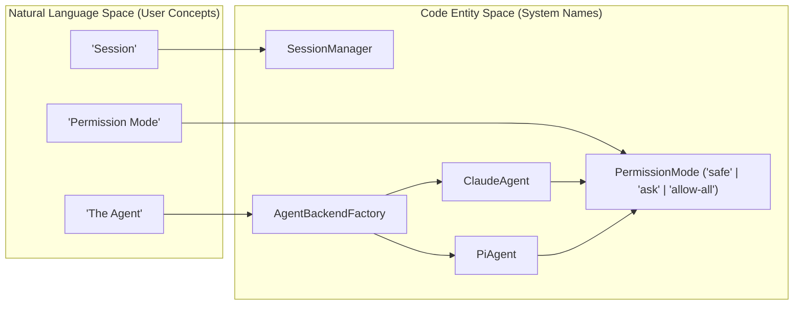
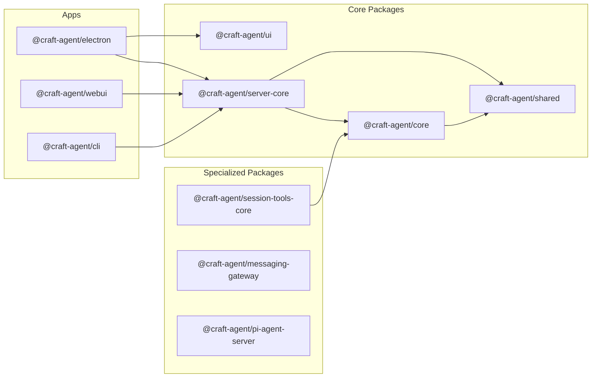
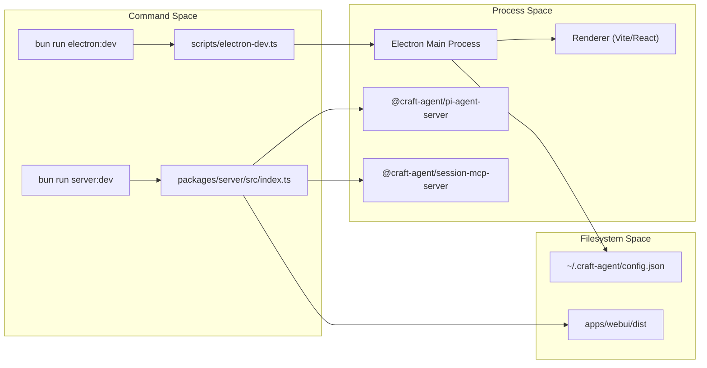
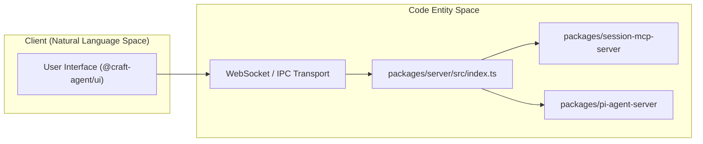
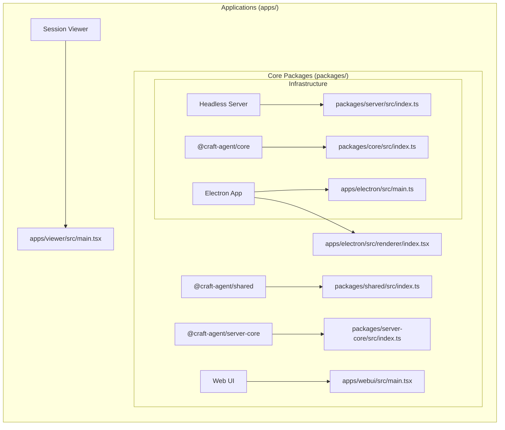
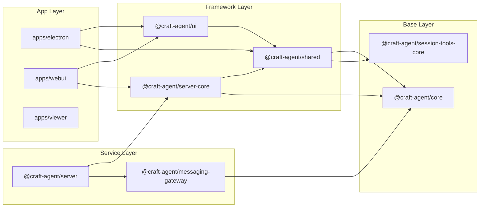
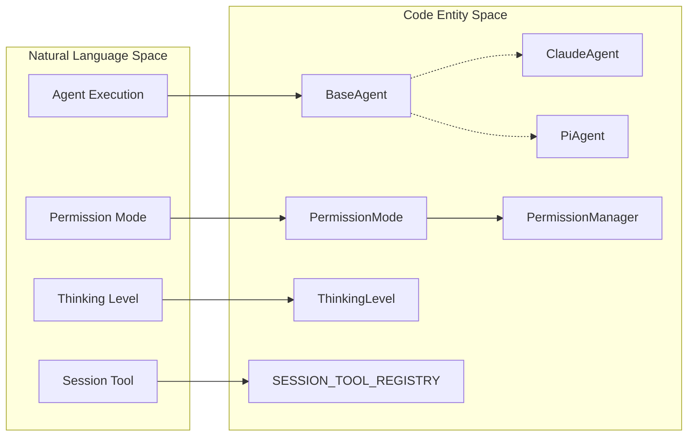
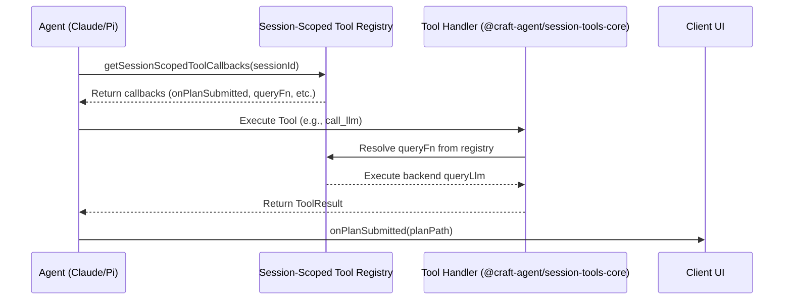
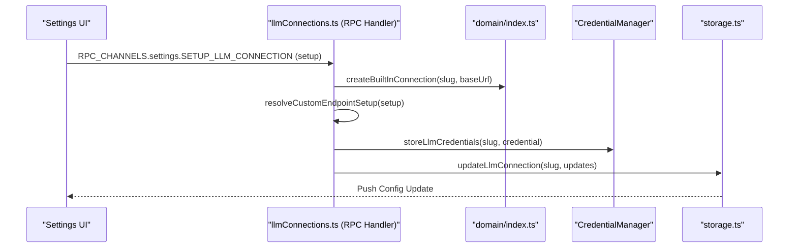
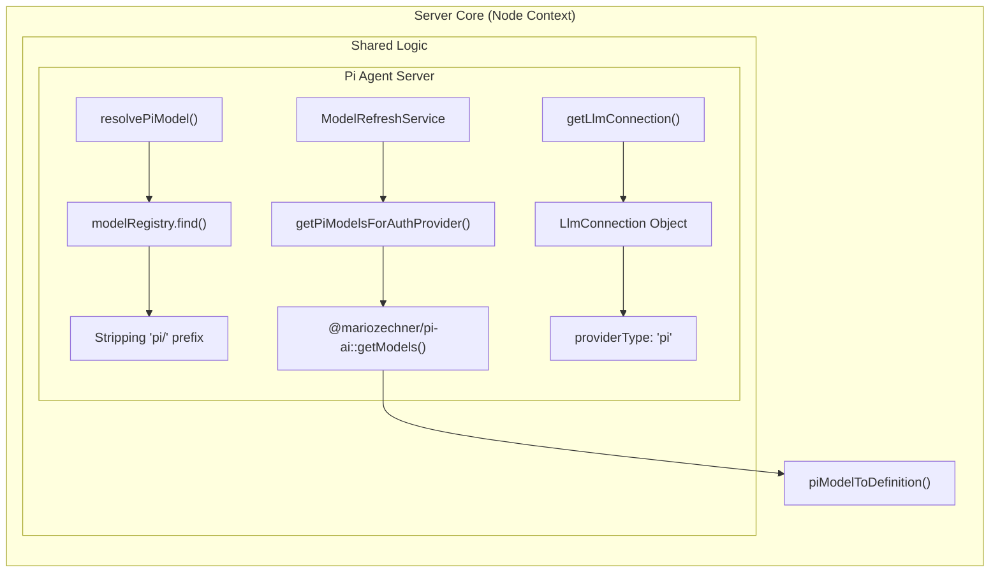

# Craft Agents 中文技术手册

> 基于 Craft Agents OSS (commit `8981384b`) 完整翻译与深度源码分析
> 项目地址：https://github.com/craft-ai-agents/craft-agents-oss

---

## 目录

### 第一部分：项目概述与快速上手

1. [项目概述](#craft-agents概述) — 平台定位、核心能力、系统概念图
2. [快速开始](#快速开始) — 环境准备、安装、开发工作流
3. [Monorepo 结构](#monorepo-结构) — 工作区布局、包角色、依赖图

### 第二部分：核心架构

4. [核心架构](#核心架构) — 系统总览、执行模型、LLM 集成、协议层
5. [Agent 执行引擎](#agent-执行引擎) — BaseAgent、ClaudeAgent、权限模式、思考级别
6. [LLM 连接与模型配置](#llm-连接与模型配置) — Provider 抽象、连接 Slug、模型发现
7. [会话与工作区管理](#会话与工作区管理) — 工作区、会话、存储布局、JSONL
8. [协议与传输层](#协议与传输层) — IPC/WebSocket、DTO、路由、流式传输
9. [系统提示词与代理提示](#系统提示词与代理提示) — 上下文文件发现、权限注入、缓存优化

### 第三部分：应用程序

10. [应用程序](#应用程序) — Electron、WebUI、CLI、Viewer 总览
11. [Electron 桌面应用](#electron-桌面应用) — 三进程安全模型、原生集成、构建流水线
12. [渲染器 UI 组件](#渲染器-ui-组件) — AppShell、ChatDisplay、富文本输入、引导流程
13. [WebUI 应用](#webui-应用) — Web API 适配器、认证流程、状态管理
14. [会话查看器与 CLI](#会话查看器与-cli) — Markdown 渲染、CLI 命令架构

### 第四部分：共享库

15. [包：共享库](#包共享库) — 核心包生态系统总览
16. [core：类型与存储](#craft-agentcore-类型与存储) — 消息模型、事件系统、批注、错误处理
17. [ui：组件库](#craft-agentui-组件库) — Markdown 管道、Turn 模型、标注系统
18. [session-tools-core：会话工具框架](#craft-agentsession-tools-core-会话工具框架) — 工具处理器、认证框架、MCP 包装器
19. [消息网关](#消息网关) — Telegram、Lark、WhatsApp 多平台集成
20. [服务器基础设施](#服务器基础设施) — server-core、Pi Agent Server

### 第五部分：专题

21. [Sources、Skills 与 MCP 集成](#sources-skills-与-mcp-集成) — Server-Builder、凭据管理、工具工厂
22. [认证与 OAuth](#认证与-oauth) — Claude PKCE、Token 刷新、通用 OAuth
23. [自动化](#自动化) — 事件驱动工作流、Cron 调度、Webhook
24. [国际化（i18n）](#国际化i18n) — 多语言支持、复数规则、维护工具
25. [构建、CI/CD 与工具链](#构建cicd-与工具链) — 测试验证、开发者工具
26. [构建系统与分发](#构建系统与分发) — Electron 打包、服务器构建、安装脚本
27. [测试与验证](#测试与验证) — Bun 测试、类型检查、CI 工作流
28. [术语表](#术语表) — 代码库术语、技术名词、缩写表

### 第六部分：深度源码分析

29. [Agent 执行引擎深度分析](#agent-执行引擎深度分析) — 模板方法、PreToolUse 管道、会话恢复策略
30. [核心类型与存储层深度分析](#核心类型与存储层深度分析) — 运行时/持久化双模型、事件系统、批注系统
31. [系统提示词构建深度分析](#系统提示词构建深度分析) — 静态/动态分离、权限模式注入、缓存策略
32. [会话管理与协议层深度分析](#会话管理与协议层深度分析) — JSONL 设计、纵深防御、原子写入
33. [LLM 连接与 MCP 集成深度分析](#llm-连接与-mcp-集成深度分析) — 依赖注入、声明式同步、MidStream 差异化
34. [跨模块架构洞察](#跨模块架构洞察) — 核心设计原则、设计模式总结

---

# Craft Agents：概述
相关源文件
- [README.md](https://github.com/craft-ai-agents/craft-agents-oss/blob/8981384b/README.md?plain=1)
- [bun.lock](https://github.com/craft-ai-agents/craft-agents-oss/blob/8981384b/bun.lock)
- [package.json](https://github.com/craft-ai-agents/craft-agents-oss/blob/8981384b/package.json)

Craft Agents 是一个面向 Agent 的软件平台，旨在为与大语言模型（LLM）的交互提供以文档为中心、高生产力的界面。与标准聊天界面不同，Craft Agents 专注于多会话管理、通过模型上下文协议（MCP）进行深度工具集成，以及用于自主操作的强大权限系统。

由 [craft.do](https://www.craft.do) 团队构建，它作为 Claude Code 等工具的非 CLI 替代方案，提供流畅的 UI 用于多任务处理和连接外部服务（如 Slack、Linear 和 Gmail）[README.md14-23](https://github.com/craft-ai-agents/craft-agents-oss/blob/8981384b/README.md?plain=1#L14-L23)

## 核心能力

- **多会话收件箱**：一款桌面应用程序，将 Agent 交互组织为"待办"、"进行中"和"已完成"等状态 [README.md86](https://github.com/craft-ai-agents/craft-agents-oss/blob/8981384b/README.md?plain=1#L86-L86)[README.md113-115](https://github.com/craft-ai-agents/craft-agents-oss/blob/8981384b/README.md?plain=1#L113-L115)
- **多提供商支持**：在 Anthropic（Claude）、Google AI Studio、ChatGPT 和 GitHub Copilot 之间无缝切换 [README.md88-89](https://github.com/craft-ai-agents/craft-agents-oss/blob/8981384b/README.md?plain=1#L88-L89)
- **MCP 与源集成**：通过粘贴 OpenAPI 规范或 MCP 配置连接到任何 API 或服务。本地 MCP 服务器作为子进程运行 [README.md29-44](https://github.com/craft-ai-agents/craft-agents-oss/blob/8981384b/README.md?plain=1#L29-L44)
- **权限模式**：三种不同的安全级别——`safe`（只读）、`ask`（需要批准）和 `allow-all`（自主操作）[README.md131-135](https://github.com/craft-ai-agents/craft-agents-oss/blob/8981384b/README.md?plain=1#L131-L135)
- **原生工具**：内置支持文件差异对比、后台任务和文档转换（PDF、Office 等）[README.md96-98](https://github.com/craft-ai-agents/craft-agents-oss/blob/8981384b/README.md?plain=1#L96-L98)

## 系统概念图

以下图表将高级用户概念与其底层实现的代码实体连接起来。

### 概念到代码的桥梁：Agent 执行



**来源：**[README.md131-135](https://github.com/craft-ai-agents/craft-agents-oss/blob/8981384b/README.md?plain=1#L131-L135)[package.json122-125](https://github.com/craft-ai-agents/craft-agents-oss/blob/8981384b/package.json#L122-L125)[package.json136-140](https://github.com/craft-ai-agents/craft-agents-oss/blob/8981384b/package.json#L136-L140)

## Monorepo 组织

该项目采用 Bun 驱动的 Monorepo 结构，使用工作空间来分离面向用户的应用程序和核心逻辑之间的关注点 [package.json18-22](https://github.com/craft-ai-agents/craft-agents-oss/blob/8981384b/package.json#L18-L22)

### Monorepo 结构：应用与包



**来源：**[package.json18-22](https://github.com/craft-ai-agents/craft-agents-oss/blob/8981384b/package.json#L18-L22)[bun.lock116-125](https://github.com/craft-ai-agents/craft-agents-oss/blob/8981384b/bun.lock#L116-L125)[bun.lock132-140](https://github.com/craft-ai-agents/craft-agents-oss/blob/8981384b/bun.lock#L132-L140)

### 核心工作空间角色

| 工作空间 | 用途 | 关键依赖 |
| --- | --- | --- |
| `apps/electron` | 主桌面应用程序（React + Electron）。 | `@craft-agent/server-core`、`@craft-agent/ui` |
| `packages/server-core` | 无头服务器逻辑、RPC 处理程序和传输层。 | `@craft-agent/core`、`@craft-agent/shared` |
| `packages/core` | 核心类型（`Message`、`Session`）和存储抽象。 | `zod`、`uuid` |
| `packages/ui` | 共享 React 组件库和 Markdown 处理管道。 | `shiki`、`framer-motion`、`lucide-react` |
| `packages/shared` | LLM 连接管理和通用工具。 | `@anthropic-ai/claude-agent-sdk` |

关于目录布局和依赖关系的深入分析，请参阅 [Monorepo 结构](/craft-ai-agents/craft-agents-oss/1.2-monorepo-structure)。

## 快速开始

要开始开发，您需要 **Bun** 运行时。该仓库支持用户"一键安装"，而开发者可以使用标准脚本从源代码构建：

1. `bun install` 获取依赖 [README.md80](https://github.com/craft-ai-agents/craft-agents-oss/blob/8981384b/README.md?plain=1#L80-L80)
2. `bun run electron:start` 启动桌面应用 [README.md81](https://github.com/craft-ai-agents/craft-agents-oss/blob/8981384b/README.md?plain=1#L81-L81)
3. `bun run server:dev` 运行无头服务器 [package.json30](https://github.com/craft-ai-agents/craft-agents-oss/blob/8981384b/package.json#L30-L30)

详细的设置说明、环境变量要求和平台特定的前置条件，请参阅 [快速开始](/craft-ai-agents/craft-agents-oss/1.1-getting-started)。

---

**来源：**

- [package.json18-22](https://github.com/craft-ai-agents/craft-agents-oss/blob/8981384b/package.json#L18-L22) - 工作空间定义
- [package.json30-35](https://github.com/craft-ai-agents/craft-agents-oss/blob/8981384b/package.json#L30-L35) - 服务器构建和启动脚本
- [README.md14-23](https://github.com/craft-ai-agents/craft-agents-oss/blob/8981384b/README.md?plain=1#L14-L23) - 项目动机和许可证
- [README.md84-99](https://github.com/craft-ai-agents/craft-agents-oss/blob/8981384b/README.md?plain=1#L84-L99) - 功能列表
- [README.md131-135](https://github.com/craft-ai-agents/craft-agents-oss/blob/8981384b/README.md?plain=1#L131-L135) - 权限模式定义
- [bun.lock116-140](https://github.com/craft-ai-agents/craft-agents-oss/blob/8981384b/bun.lock#L116-L140) - 内部工作空间依赖映射

---

# Getting-Started

# 快速开始
相关源文件
- [bun.lock](https://github.com/craft-ai-agents/craft-agents-oss/blob/8981384b/bun.lock)
- [package.json](https://github.com/craft-ai-agents/craft-agents-oss/blob/8981384b/package.json)
- [scripts/install-server.sh](https://github.com/craft-ai-agents/craft-agents-oss/blob/8981384b/scripts/install-server.sh)

本页面提供有关设置 Craft Agents Monorepo、配置开发环境以及启动各种应用目标（Electron、WebUI 和无头服务器）的技术说明。

## 前置条件

代码库使用现代 TypeScript 技术栈构建，需要以下工具：

- **Bun（>= 1.0）**：用作主要运行时、包管理器和测试运行器 [scripts/install-server.sh7-36](https://github.com/craft-ai-agents/craft-agents-oss/blob/8981384b/scripts/install-server.sh#L7-L36)
- **Python 3**：专门用于运行文档工具冒烟测试（PDF、XLSX、DOCX 等）[package.json41](https://github.com/craft-ai-agents/craft-agents-oss/blob/8981384b/package.json#L41-L41)
- **Node.js/npm**：虽然 Bun 是主要驱动程序，但一些底层工具（如 `electron-builder` 和 `eslint`）可能使用 Node.js 环境 [package.json73-103](https://github.com/craft-ai-agents/craft-agents-oss/blob/8981384b/package.json#L73-L103)

## 安装

Craft Agents 使用 Bun Workspaces 管理 `apps/` 和 `packages/` 之间的依赖关系 [package.json18-22](https://github.com/craft-ai-agents/craft-agents-oss/blob/8981384b/package.json#L18-L22)

1. **克隆仓库。**
2. **安装依赖**：

```
bun install
```

此命令安装所有工作空间依赖并处理 `trustedDependencies`（如 `electron`、`sharp` 和 `koffi`）[package.json8-17](https://github.com/craft-ai-agents/craft-agents-oss/blob/8981384b/package.json#L8-L17)
3. **同步密钥（可选）**：
对于内部开发，提供了一个脚本来同步环境密钥 [package.json68](https://github.com/craft-ai-agents/craft-agents-oss/blob/8981384b/package.json#L68-L68)
```
bun run sync-secrets
```

## 环境变量

系统依赖多个环境变量来定位资源和配置安全性。

| 变量 | 描述 | 默认值/示例 |
| --- | --- | --- |
| `CRAFT_SERVER_TOKEN` | 用于 RPC 认证的安全令牌 [scripts/install-server.sh82](https://github.com/craft-ai-agents/craft-agents-oss/blob/8981384b/scripts/install-server.sh#L82-L82) | 通过 `--generate-token` 生成 |
| `CRAFT_WEBUI_DIR` | 编译后的 WebUI 静态资源路径 [package.json90](https://github.com/craft-ai-agents/craft-agents-oss/blob/8981384b/package.json#L90-L90) | `apps/webui/dist` |
| `CRAFT_BUNDLED_ASSETS_ROOT` | 用于资源发现的 Electron 应用根目录路径 [package.json30](https://github.com/craft-ai-agents/craft-agents-oss/blob/8981384b/package.json#L30-L30) | `$PWD/apps/electron` |
| `CRAFT_DEBUG` | 启用详细日志记录和开发者工具 [package.json30](https://github.com/craft-ai-agents/craft-agents-oss/blob/8981384b/package.json#L30-L30) | `true` |
| `CRAFT_RPC_PORT` | 无头服务器监听的端口 [scripts/install-server.sh93](https://github.com/craft-ai-agents/craft-agents-oss/blob/8981384b/scripts/install-server.sh#L93-L93) | `9100` |

## 开发工作流

Monorepo 支持三个主要目标：Electron 桌面应用、WebUI（浏览器）和无头服务器。

### 1. Electron 桌面应用程序

Electron 应用需要对其 `main`、`preload` 和 `renderer` 进程进行多步骤构建。

- **快速开始（开发模式）**：

```
bun run electron:dev
```

此命令执行 `scripts/electron-dev.ts`，负责协调构建和启动 [package.json64](https://github.com/craft-ai-agents/craft-agents-oss/blob/8981384b/package.json#L64-L64)
- **手动构建与启动**：

```
bun run electron:build  # 构建 main、preload、renderer 和资源
bun run electron:start  # 启动构建好的应用
```
[package.json62-63](https://github.com/craft-ai-agents/craft-agents-oss/blob/8981384b/package.json#L62-L63)

### 2. WebUI 和无头服务器

要运行基于浏览器的界面，您必须启动服务器和用于前端的 Vite 开发服务器。

- **带 WebUI 的服务器**：

```
bun run server:dev:webui
```

此命令构建所需的子进程（`session-mcp-server`、`pi-agent-server`），构建 WebUI，并在 `packages/server/src/index.ts` 启动服务器 [package.json91](https://github.com/craft-ai-agents/craft-agents-oss/blob/8981384b/package.json#L91-L91)
- **仅 WebUI 前端**：

```
bun run webui:dev
```

启动 `apps/webui` 的 Vite 开发服务器 [package.json85](https://github.com/craft-ai-agents/craft-agents-oss/blob/8981384b/package.json#L85-L85)

### 3. 无头服务器设置

对于仅服务器部署，使用提供的安装脚本：

```
bash scripts/install-server.sh
```

此脚本自动执行依赖安装、构建子进程并生成 `CRAFT_SERVER_TOKEN` [scripts/install-server.sh54-68](https://github.com/craft-ai-agents/craft-agents-oss/blob/8981384b/scripts/install-server.sh#L54-L68)

## 系统架构与数据流

以下图表说明了开发命令与生成的进程树之间的关系。

### 构建与执行流程



**来源：**[package.json30](https://github.com/craft-ai-agents/craft-agents-oss/blob/8981384b/package.json#L30-L30)[package.json64](https://github.com/craft-ai-agents/craft-agents-oss/blob/8981384b/package.json#L64-L64)[package.json89-91](https://github.com/craft-ai-agents/craft-agents-oss/blob/8981384b/package.json#L89-L91)[scripts/install-server.sh82-85](https://github.com/craft-ai-agents/craft-agents-oss/blob/8981384b/scripts/install-server.sh#L82-L85)

### 应用连接性

此图表映射了组件之间的逻辑网络连接以及处理它们的特定代码实体。



**来源：**[package.json89-91](https://github.com/craft-ai-agents/craft-agents-oss/blob/8981384b/package.json#L89-L91)[scripts/install-server.sh93-94](https://github.com/craft-ai-agents/craft-agents-oss/blob/8981384b/scripts/install-server.sh#L93-L94)[bun.lock136-140](https://github.com/craft-ai-agents/craft-agents-oss/blob/8981384b/bun.lock#L136-L140)

## 验证和测试

在贡献之前，请运行验证套件确保环境正确配置：

- **完整验证**：`bun run validate:dev`（运行类型检查、共享包测试和文档工具冒烟测试）[package.json42](https://github.com/craft-ai-agents/craft-agents-oss/blob/8981384b/package.json#L42-L42)
- **类型检查**：`bun run typecheck:all` [package.json28](https://github.com/craft-ai-agents/craft-agents-oss/blob/8981384b/package.json#L28-L28)
- **文档工具**：`bun run test:doc-tools`（需要 Python 3）[package.json41](https://github.com/craft-ai-agents/craft-agents-oss/blob/8981384b/package.json#L41-L41)

**来源：**

- [package.json1-100](https://github.com/craft-ai-agents/craft-agents-oss/blob/8981384b/package.json#L1-L100)
- [scripts/install-server.sh1-107](https://github.com/craft-ai-agents/craft-agents-oss/blob/8981384b/scripts/install-server.sh#L1-L107)
- [bun.lock1-180](https://github.com/craft-ai-agents/craft-agents-oss/blob/8981384b/bun.lock#L1-L180)

---

# Monorepo-Structure

# Monorepo 结构
相关源文件
- [package.json](https://github.com/craft-ai-agents/craft-agents-oss/blob/8981384b/package.json)
- [packages/core/package.json](https://github.com/craft-ai-agents/craft-agents-oss/blob/8981384b/packages/core/package.json)
- [packages/server-core/package.json](https://github.com/craft-ai-agents/craft-agents-oss/blob/8981384b/packages/server-core/package.json)
- [packages/server/package.json](https://github.com/craft-ai-agents/craft-agents-oss/blob/8981384b/packages/server/package.json)
- [packages/shared/package.json](https://github.com/craft-ai-agents/craft-agents-oss/blob/8981384b/packages/shared/package.json)

Craft Agents 仓库以 **Bun Workspaces** 管理的 Monorepo 形式组织。这种架构允许在高级用户应用程序和共享核心逻辑之间进行清晰的分离，确保不同的接口（Electron、Web、CLI）使用相同的底层 Agent 执行引擎和存储抽象。

## 工作空间布局

仓库分为两个主要目录：`apps/` 和 `packages/`。

| 目录 | 用途 | 关键示例 |
| --- | --- | --- |
| `apps/` | 面向用户产品的入口点。 | `apps/electron`、`apps/webui`、`apps/viewer` |
| `packages/` | 内部库和共享服务。 | `@craft-agent/core`、`@craft-agent/shared`、`@craft-agent/ui` |

根目录的 `package.json` 定义了这些工作空间并管理用于测试和构建的全局脚本 [package.json18-22](https://github.com/craft-ai-agents/craft-agents-oss/blob/8981384b/package.json#L18-L22)

### 依赖解析

工作空间依赖使用 `workspace:*` 协议连接在一起。例如，`@craft-agent/shared` 直接依赖于本地源代码中的 `@craft-agent/core` 和 `@craft-agent/session-tools-core` [packages/shared/package.json68-69](https://github.com/craft-ai-agents/craft-agents-oss/blob/8981384b/packages/shared/package.json#L68-L69) 这允许在不需要将包发布到注册表的情况下，对整个技术栈进行实时类型检查和开发。

### 源代码到代码实体映射：工作空间入口点

以下图表将逻辑系统名称映射到 Monorepo 结构中的特定入口点文件。

**图表：系统入口点映射**



来源：[package.json18-22](https://github.com/craft-ai-agents/craft-agents-oss/blob/8981384b/package.json#L18-L22)[packages/core/package.json7-13](https://github.com/craft-ai-agents/craft-agents-oss/blob/8981384b/packages/core/package.json#L7-L13)[packages/shared/package.json7-8](https://github.com/craft-ai-agents/craft-agents-oss/blob/8981384b/packages/shared/package.json#L7-L8)[packages/server/package.json6-9](https://github.com/craft-ai-agents/craft-agents-oss/blob/8981384b/packages/server/package.json#L6-L9)

---

## 包的角色与职责

### @craft-agent/core

整个系统的基础。它定义了基本数据模型（Messages、Turns、Sessions）和底层存储抽象 [packages/core/package.json5](https://github.com/craft-ai-agents/craft-agents-oss/blob/8981384b/packages/core/package.json#L5-L5) 它被设计为一个"纯"包，具有最少的外部依赖，提供每个其他包使用的基础类型 [packages/core/package.json11-12](https://github.com/craft-ai-agents/craft-agents-oss/blob/8981384b/packages/core/package.json#L11-L12)

### @craft-agent/shared

此包包含 Electron 客户端和无头服务器共用的主要业务逻辑。它处理：

- **Agent 逻辑**：`ClaudeAgent` 和 `PiAgent` 的实现 [packages/shared/package.json16](https://github.com/craft-ai-agents/craft-agents-oss/blob/8981384b/packages/shared/package.json#L16-L16)
- **认证**：OAuth 流程和凭据管理 [packages/shared/package.json20-22](https://github.com/craft-ai-agents/craft-agents-oss/blob/8981384b/packages/shared/package.json#L20-L22)
- **配置**：LLM 连接管理和存储迁移 [packages/shared/package.json23-26](https://github.com/craft-ai-agents/craft-agents-oss/blob/8981384b/packages/shared/package.json#L23-L26)
- **MCP 集成**：管理模型上下文协议池和工具发现 [packages/shared/package.json28](https://github.com/craft-ai-agents/craft-agents-oss/blob/8981384b/packages/shared/package.json#L28-L28)

### @craft-agent/server-core

提供可复用的基础设施用于运行 Craft Agent 后端 [packages/server-core/package.json5](https://github.com/craft-ai-agents/craft-agents-oss/blob/8981384b/packages/server-core/package.json#L5-L5) 它封装了 `WebSocket` 传输层、用于设置和文件的 RPC 处理程序，以及会话管理的领域逻辑 [packages/server-core/package.json11-21](https://github.com/craft-ai-agents/craft-agents-oss/blob/8981384b/packages/server-core/package.json#L11-L21)

### @craft-agent/ui

共享 React 组件库。它包含聊天界面的 UI 基础元素，包括 Markdown 渲染管道（使用 `remark`/`rehype`）以及在 Electron 应用和 WebUI 中使用的复杂 `TurnCard` 组件。

来源：[packages/core/package.json1-13](https://github.com/craft-ai-agents/craft-agents-oss/blob/8981384b/packages/core/package.json#L1-L13)[packages/shared/package.json1-66](https://github.com/craft-ai-agents/craft-agents-oss/blob/8981384b/packages/shared/package.json#L1-L66)[packages/server-core/package.json1-22](https://github.com/craft-ai-agents/craft-agents-oss/blob/8981384b/packages/server-core/package.json#L1-L22)[packages/server/package.json1-32](https://github.com/craft-ai-agents/craft-agents-oss/blob/8981384b/packages/server/package.json#L1-L32)

---

## 内部依赖图

依赖流通常从专门的应用程序向下流向基础核心。

**图表：依赖流与数据传播**



### 关键连接细节

1. **服务器组合**：`@craft-agent/server` 包是一个薄包装器，将 `@craft-agent/server-core` 与 `@craft-agent/messaging-gateway` 结合在一起，提供功能齐全的无头实例 [packages/server/package.json27-31](https://github.com/craft-ai-agents/craft-agents-oss/blob/8981384b/packages/server/package.json#L27-L31)
2. **共享逻辑**：Electron 主进程和服务器都使用 `@craft-agent/shared` 来执行 Agent 轮次，确保跨平台的一致行为 [packages/shared/package.json15-19](https://github.com/craft-ai-agents/craft-agents-oss/blob/8981384b/packages/shared/package.json#L15-L19)
3. **UI 隔离**：`@craft-agent/ui` 包依赖于 `@craft-agent/shared` 提供的类型和常量，但对传输层（IPC 与 WebSocket）保持无关。

来源：[packages/server/package.json27-32](https://github.com/craft-ai-agents/craft-agents-oss/blob/8981384b/packages/server/package.json#L27-L32)[packages/server-core/package.json26-33](https://github.com/craft-ai-agents/craft-agents-oss/blob/8981384b/packages/server-core/package.json#L26-L33)[packages/shared/package.json67-83](https://github.com/craft-ai-agents/craft-agents-oss/blob/8981384b/packages/shared/package.json#L67-L83)[packages/core/package.json1-21](https://github.com/craft-ai-agents/craft-agents-oss/blob/8981384b/packages/core/package.json#L1-L21)

---

# Core-Architecture

# 核心架构
相关源文件
- [packages/core/package.json](https://github.com/craft-ai-agents/craft-agents-oss/blob/8981384b/packages/core/package.json)
- [packages/shared/src/agent/claude-agent.ts](https://github.com/craft-ai-agents/craft-agents-oss/blob/8981384b/packages/shared/src/agent/claude-agent.ts)
- [packages/shared/src/protocol/dto.ts](https://github.com/craft-ai-agents/craft-agents-oss/blob/8981384b/packages/shared/src/protocol/dto.ts)

Craft Agents 架构围绕解耦的多进程模型设计，将 **Agent 执行引擎**与**用户界面**分离。这种分离允许灵活的部署（Electron 桌面、Web 或 CLI），同时通过统一的协议和存储层为 Agent 维护一致的有状态环境。

### 系统概述

系统通过将消息路由到集中的 `SessionManager` 并通过专门的 Agent 后端执行它们，来桥接"自然语言空间"（用户意图）和"代码实体空间"（工具执行）。

#### 组件关系图

以下图表说明了核心包和类如何交互以处理用户请求。

**Agent 流程：请求到执行**

```

```

**来源：**[packages/shared/src/protocol/dto.ts167-185](https://github.com/craft-ai-agents/craft-agents-oss/blob/8981384b/packages/shared/src/protocol/dto.ts#L167-L185)[packages/shared/src/agent/claude-agent.ts165-180](https://github.com/craft-ai-agents/craft-agents-oss/blob/8981384b/packages/shared/src/agent/claude-agent.ts#L165-L180)

---

### Agent 执行模型

执行模型以 `BaseAgent` 抽象为中心。系统目前支持两个主要实现：`ClaudeAgent`（使用 Anthropic SDK）和 `PiAgent`（内部模型路由器）。Agent 不仅仅是 LLM 包装器；它们是有状态的协调器，管理：

- **权限模式：**由 `ModeManager` 执行，控制 Agent 是否可以自动执行工具（`allow-all`）、必须询问（`ask`）或受到限制（`safe`）。
- **思考级别：**管理推理工作量（例如 `adaptive` 思考）和 token 预算。
- **工具使用：**协调对模型上下文协议（MCP）服务器和内部会话范围工具的调用。

详情请参阅 [Agent 执行引擎](/craft-ai-agents/craft-agents-oss/2.1-agent-execution-engine)。

**来源：**[packages/shared/src/agent/claude-agent.ts45-55](https://github.com/craft-ai-agents/craft-agents-oss/blob/8981384b/packages/shared/src/agent/claude-agent.ts#L45-L55)[packages/shared/src/agent/claude-agent.ts135-163](https://github.com/craft-ai-agents/craft-agents-oss/blob/8981384b/packages/shared/src/agent/claude-agent.ts#L135-L163)

---

### LLM 后端集成

Craft Agents 使用"连接"抽象来处理各种 LLM 提供商。系统使用存储在 `config.json` 中的**连接标识符**（例如 `anthropic`、`bedrock`、`custom-pi`），而不是硬编码 API 密钥。

- **模型选择：**支持自动模型分层（小/中/大）或用户显式覆盖。
- **提供商目录：**`PiAgent` 后端为内部和外部模型提供统一目录，包括对自定义 OpenAI 兼容端点的支持。

详情请参阅 [LLM 连接与模型配置](/craft-ai-agents/craft-agents-oss/2.2-llm-connections-and-model-configuration)。

**来源：**[packages/shared/src/agent/claude-agent.ts25-26](https://github.com/craft-ai-agents/craft-agents-oss/blob/8981384b/packages/shared/src/agent/claude-agent.ts#L25-L26)[packages/shared/src/agent/claude-agent.ts17-22](https://github.com/craft-ai-agents/craft-agents-oss/blob/8981384b/packages/shared/src/agent/claude-agent.ts#L17-L22)

---

### 会话与工作空间抽象

**会话**是对话历史、工具输出和状态的主要隔离边界。**工作空间**定义了这些会话存在的环境（文件系统访问、特定 MCP 工具和偏好设置）。

- **存储布局：**所有内容都持久化在 `~/.craft-agent/` 下，会话以 JSONL 文件存储，以确保在长时间运行的 Agent 任务期间的持久性。
- **上下文管理：**`SessionManager` 处理这些实体的生命周期，包括分支会话和管理"工作目录"。

详情请参阅 [会话与工作空间管理](/craft-ai-agents/craft-agents-oss/2.3-session-and-workspace-management)。

**来源：**[packages/shared/src/protocol/dto.ts46-104](https://github.com/craft-ai-agents/craft-agents-oss/blob/8981384b/packages/shared/src/protocol/dto.ts#L46-L104)[packages/shared/src/agent/claude-agent.ts56-58](https://github.com/craft-ai-agents/craft-agents-oss/blob/8981384b/packages/shared/src/agent/claude-agent.ts#L56-L58)

---

### 协议与传输层

**协议层**使用结构化的请求/响应和事件驱动模式定义前端和后端之间的契约。

- **DTO：**在 `dto.ts` 中定义的数据传输对象确保了 IPC（Electron）和 WebSocket（WebUI）边界之间的类型安全。
- **流式传输：**Agent 事件（文本增量、工具启动、错误）实时流式传输，为用户提供即时反馈。

详情请参阅 [协议与传输层](/craft-ai-agents/craft-agents-oss/2.4-protocol-and-transport-layer)。

**来源：**[packages/shared/src/protocol/dto.ts1-25](https://github.com/craft-ai-agents/craft-agents-oss/blob/8981384b/packages/shared/src/protocol/dto.ts#L1-L25)[packages/shared/src/protocol/dto.ts167-185](https://github.com/craft-ai-agents/craft-agents-oss/blob/8981384b/packages/shared/src/protocol/dto.ts#L167-L185)

---

### 系统提示词构建

Agent 的"智能"由动态构建的系统提示词引导。此提示词不是静态的；它在运行时通过收集以下内容组装而成：

- **上下文文件：**在当前工作空间中发现 `AGENTS.md` 或 `CLAUDE.md`。
- **环境元数据：**注入当前日期、操作系统和可用工具。
- **权限上下文：**关于 Agent 应如何基于活动 `PermissionMode` 行为的说明。

详情请参阅 [系统提示词与 Agent 提示](/craft-ai-agents/craft-agents-oss/2.5-system-prompt-and-agent-prompting)。

**来源：**[packages/shared/src/agent/claude-agent.ts10-11](https://github.com/craft-ai-agents/craft-agents-oss/blob/8981384b/packages/shared/src/agent/claude-agent.ts#L10-L11)[packages/shared/src/agent/claude-agent.ts27](https://github.com/craft-ai-agents/craft-agents-oss/blob/8981384b/packages/shared/src/agent/claude-agent.ts#L27-L27)

---

### 架构映射：代码到概念

以下表格将高级架构概念映射到代码库中的主要实现文件。

| 概念 | 主要代码实体 | 文件路径 |
| --- | --- | --- |
| **Agent 逻辑** | `ClaudeAgent` | [packages/shared/src/agent/claude-agent.ts](https://github.com/craft-ai-agents/craft-agents-oss/blob/8981384b/packages/shared/src/agent/claude-agent.ts) |
| **协议类型** | `SessionEvent`、`Session` | [packages/shared/src/protocol/dto.ts](https://github.com/craft-ai-agents/craft-agents-oss/blob/8981384b/packages/shared/src/protocol/dto.ts) |
| **状态管理** | `SessionManager` | （引用自 [packages/shared/src/protocol/dto.ts](https://github.com/craft-ai-agents/craft-agents-oss/blob/8981384b/packages/shared/src/protocol/dto.ts)） |
| **安全引擎** | `ModeManager` | [packages/shared/src/agent/mode-manager.ts](https://github.com/craft-ai-agents/craft-agents-oss/blob/8981384b/packages/shared/src/agent/mode-manager.ts) |
| **存储逻辑** | `loadStoredConfig`、`Workspace` | [packages/shared/src/config/storage.ts](https://github.com/craft-ai-agents/craft-agents-oss/blob/8981384b/packages/shared/src/config/storage.ts) |

**来源：**[packages/shared/src/agent/claude-agent.ts1-20](https://github.com/craft-ai-agents/craft-agents-oss/blob/8981384b/packages/shared/src/agent/claude-agent.ts#L1-L20)[packages/shared/src/protocol/dto.ts46-80](https://github.com/craft-ai-agents/craft-agents-oss/blob/8981384b/packages/shared/src/protocol/dto.ts#L46-L80)

---

# Agent-Execution-Engine

# Agent 执行引擎
相关源文件
- [packages/shared/src/agent/backend/types.ts](https://github.com/craft-ai-agents/craft-agents-oss/blob/8981384b/packages/shared/src/agent/backend/types.ts)
- [packages/shared/src/agent/base-agent.ts](https://github.com/craft-ai-agents/craft-agents-oss/blob/8981384b/packages/shared/src/agent/base-agent.ts)
- [packages/shared/src/agent/claude-agent.ts](https://github.com/craft-ai-agents/craft-agents-oss/blob/8981384b/packages/shared/src/agent/claude-agent.ts)
- [packages/shared/src/agent/diagnostics.ts](https://github.com/craft-ai-agents/craft-agents-oss/blob/8981384b/packages/shared/src/agent/diagnostics.ts)
- [packages/shared/src/agent/errors.ts](https://github.com/craft-ai-agents/craft-agents-oss/blob/8981384b/packages/shared/src/agent/errors.ts)
- [packages/shared/src/agent/llm-tool.ts](https://github.com/craft-ai-agents/craft-agents-oss/blob/8981384b/packages/shared/src/agent/llm-tool.ts)
- [packages/shared/src/agent/options.ts](https://github.com/craft-ai-agents/craft-agents-oss/blob/8981384b/packages/shared/src/agent/options.ts)
- [packages/shared/src/agent/pi-agent.ts](https://github.com/craft-ai-agents/craft-agents-oss/blob/8981384b/packages/shared/src/agent/pi-agent.ts)
- [packages/shared/src/agent/session-scoped-tool-callback-registry.ts](https://github.com/craft-ai-agents/craft-agents-oss/blob/8981384b/packages/shared/src/agent/session-scoped-tool-callback-registry.ts)
- [packages/shared/src/agent/session-scoped-tools.ts](https://github.com/craft-ai-agents/craft-agents-oss/blob/8981384b/packages/shared/src/agent/session-scoped-tools.ts)
- [packages/shared/src/agent/session-self-management-bindings.ts](https://github.com/craft-ai-agents/craft-agents-oss/blob/8981384b/packages/shared/src/agent/session-self-management-bindings.ts)
- [packages/shared/src/utils/summarize.ts](https://github.com/craft-ai-agents/craft-agents-oss/blob/8981384b/packages/shared/src/utils/summarize.ts)

Agent 执行引擎是负责 Craft Agents 中 AI Agent 生命周期、编排和执行的核心组件。它提供了一个与提供商无关的抽象层，允许系统在不同的 LLM 后端（如 Claude 或 Pi）之间切换，同时保持工具、权限和会话管理的一致行为。

## 核心抽象：BaseAgent

所有 Agent 实现都继承自 `BaseAgent` 抽象类。此类集中了与特定 LLM 提供商无关的共享逻辑，确保跨不同后端的一致体验 [packages/shared/src/agent/base-agent.ts162](https://github.com/craft-ai-agents/craft-agents-oss/blob/8981384b/packages/shared/src/agent/base-agent.ts#L162-L162)

`BaseAgent` 将专门的任务委托给多个核心模块：

- **PermissionManager**：处理敏感操作的用户审批 [packages/shared/src/agent/base-agent.ts51](https://github.com/craft-ai-agents/craft-agents-oss/blob/8981384b/packages/shared/src/agent/base-agent.ts#L51-L51)
- **SourceManager**：管理外部数据源和 MCP 服务器 [packages/shared/src/agent/base-agent.ts52](https://github.com/craft-ai-agents/craft-agents-oss/blob/8981384b/packages/shared/src/agent/base-agent.ts#L52-L52)
- **UsageTracker**：跟踪 token 消耗和成本 [packages/shared/src/agent/base-agent.ts56](https://github.com/craft-ai-agents/craft-agents-oss/blob/8981384b/packages/shared/src/agent/base-agent.ts#L56-L56)
- **ConfigWatcherManager**：监控工作空间配置文件的更改 [packages/shared/src/agent/base-agent.ts55](https://github.com/craft-ai-agents/craft-agents-oss/blob/8981384b/packages/shared/src/agent/base-agent.ts#L55-L55)

### 自然语言到代码实体的映射

以下图表说明了高级 Agent 概念如何映射到代码库中的特定类和文件。

**概念到实体的桥梁**



来源：[packages/shared/src/agent/base-agent.ts162](https://github.com/craft-ai-agents/craft-agents-oss/blob/8981384b/packages/shared/src/agent/base-agent.ts#L162-L162)[packages/shared/src/agent/claude-agent.ts165](https://github.com/craft-ai-agents/craft-agents-oss/blob/8981384b/packages/shared/src/agent/claude-agent.ts#L165-L165)[packages/shared/src/agent/pi-agent.ts121](https://github.com/craft-ai-agents/craft-agents-oss/blob/8981384b/packages/shared/src/agent/pi-agent.ts#L121-L121)[packages/shared/src/agent/mode-manager.ts52](https://github.com/craft-ai-agents/craft-agents-oss/blob/8981384b/packages/shared/src/agent/mode-manager.ts#L52-L52)[packages/shared/src/agent/thinking-levels.ts70](https://github.com/craft-ai-agents/craft-agents-oss/blob/8981384b/packages/shared/src/agent/thinking-levels.ts#L70-L70)

---

## Agent 实现

### ClaudeAgent

`ClaudeAgent` 使用 `@anthropic-ai/claude-agent-sdk` 原生运行 Agent。它处理 Craft Agents 内部事件与 Anthropic SDK 消息格式之间的转换 [packages/shared/src/agent/claude-agent.ts1](https://github.com/craft-ai-agents/craft-agents-oss/blob/8981384b/packages/shared/src/agent/claude-agent.ts#L1-L1)

- **配置修复**：它包含一个强大的 `ensureClaudeConfig` 工具，在启动 SDK 子进程之前修复 `~/.claude.json` 损坏（如 Windows 上常见的 UTF-8 BOM 问题）[packages/shared/src/agent/options.ts36](https://github.com/craft-ai-agents/craft-agents-oss/blob/8981384b/packages/shared/src/agent/options.ts#L36-L36)
- **事件适配**：使用 `ClaudeEventAdapter` 将 SDK 事件映射为 `AgentEvent` 类型 [packages/shared/src/agent/claude-agent.ts116](https://github.com/craft-ai-agents/craft-agents-oss/blob/8981384b/packages/shared/src/agent/claude-agent.ts#L116-L116)

### PiAgent

`PiAgent` 作为 `pi-agent-server` 子进程的薄 RPC 客户端 [packages/shared/src/agent/pi-agent.ts4-9](https://github.com/craft-ai-agents/craft-agents-oss/blob/8981384b/packages/shared/src/agent/pi-agent.ts#L4-L9)

- **子进程生命周期**：它生成子进程并通过 stdin/stdout 使用 JSONL 进行通信 [packages/shared/src/agent/pi-agent.ts121-132](https://github.com/craft-ai-agents/craft-agents-oss/blob/8981384b/packages/shared/src/agent/pi-agent.ts#L121-L132)
- **代理工具**：由于 Pi Agent 在单独的进程中运行，它使用代理机制将 MCP 和会话范围工具调用路由回主进程 [packages/shared/src/agent/pi-agent.ts65-74](https://github.com/craft-ai-agents/craft-agents-oss/blob/8981384b/packages/shared/src/agent/pi-agent.ts#L65-L74)

---

## 权限模式

引擎支持三种主要权限模式，决定了工具（特别是 `bash` 或 `file_write` 等破坏性工具）的执行方式 [packages/shared/src/agent/mode-manager.ts52](https://github.com/craft-ai-agents/craft-agents-oss/blob/8981384b/packages/shared/src/agent/mode-manager.ts#L52-L52)

| 模式 | 行为 |
| --- | --- |
| **安全模式** | 默认模式。所有潜在有害的工具都需要通过 `PermissionCallback` 获得用户的明确批准 [packages/shared/src/agent/mode-manager.ts54](https://github.com/craft-ai-agents/craft-agents-oss/blob/8981384b/packages/shared/src/agent/mode-manager.ts#L54-L54) |
| **询问模式** | 类似于安全模式，但会提示用户几乎每个工具交互，以提供最大程度的监督。 |
| **全部允许模式** | 危险模式，Agent 可以在不确认的情况下执行任何工具。 |

来源：[packages/shared/src/agent/backend/types.ts64-83](https://github.com/craft-ai-agents/craft-agents-oss/blob/8981384b/packages/shared/src/agent/backend/types.ts#L64-L83)[packages/shared/src/agent/mode-manager.ts45-55](https://github.com/craft-ai-agents/craft-agents-oss/blob/8981384b/packages/shared/src/agent/mode-manager.ts#L45-L55)

---

## 思考级别

思考级别控制模型的"推理"工作量。对于 Claude 模型，这映射到 `adaptive` 思考类型和 `effort` 级别 [packages/shared/src/agent/claude-agent.ts140-163](https://github.com/craft-ai-agents/craft-agents-oss/blob/8981384b/packages/shared/src/agent/claude-agent.ts#L140-L163)

| 思考级别 | 模型配置 |
| --- | --- |
| **禁用** | `maxThinkingTokens: 0` 或 `type: 'disabled'` [packages/shared/src/agent/claude-agent.ts147-150](https://github.com/craft-ai-agents/craft-agents-oss/blob/8981384b/packages/shared/src/agent/claude-agent.ts#L147-L150) |
| **低/中/高** | 映射到 SDK 中支持模型的 `low`、`medium` 和 `high` 工作量 [packages/shared/src/agent/claude-agent.ts153-158](https://github.com/craft-ai-agents/craft-agents-oss/blob/8981384b/packages/shared/src/agent/claude-agent.ts#L153-L158) |

来源：[packages/shared/src/agent/thinking-levels.ts70](https://github.com/craft-ai-agents/craft-agents-oss/blob/8981384b/packages/shared/src/agent/thinking-levels.ts#L70-L70)[packages/shared/src/agent/claude-agent.ts135-163](https://github.com/craft-ai-agents/craft-agents-oss/blob/8981384b/packages/shared/src/agent/claude-agent.ts#L135-L163)

---

## 会话生命周期与工具

### 会话范围工具

像 `call_llm`、`spawn_session` 和 `browser_tool` 这样的工具被限定在特定会话范围内。它们的回调注册在中央 `sessionScopedToolCallbackRegistry` 中 [packages/shared/src/agent/session-scoped-tool-callback-registry.ts85](https://github.com/craft-ai-agents/craft-agents-oss/blob/8981384b/packages/shared/src/agent/session-scoped-tool-callback-registry.ts#L85-L85)

**工具执行数据流**



来源：[packages/shared/src/agent/session-scoped-tools.ts1-16](https://github.com/craft-ai-agents/craft-agents-oss/blob/8981384b/packages/shared/src/agent/session-scoped-tools.ts#L1-L16)[packages/shared/src/agent/session-scoped-tool-callback-registry.ts22-82](https://github.com/craft-ai-agents/craft-agents-oss/blob/8981384b/packages/shared/src/agent/session-scoped-tool-callback-registry.ts#L22-L82)[packages/shared/src/agent/llm-tool.ts1-15](https://github.com/craft-ai-agents/craft-agents-oss/blob/8981384b/packages/shared/src/agent/llm-tool.ts#L1-L15)

### 中断与中止

引擎区分两种类型的执行停止：

1. **硬中止**：由用户或系统错误（如 `network_error`）触发。这会停止 LLM 流并清理资源 [packages/shared/src/agent/errors.ts132-140](https://github.com/craft-ai-agents/craft-agents-oss/blob/8981384b/packages/shared/src/agent/errors.ts#L132-L140)
2. **交接中断**：当工具需要用户输入（如权限请求或 OAuth 流程）时发生。Agent 的状态被保留，但执行暂停，直到 `PermissionCallback` 或 `AuthCallback` 返回 [packages/shared/src/agent/backend/types.ts67-95](https://github.com/craft-ai-agents/craft-agents-oss/blob/8981384b/packages/shared/src/agent/backend/types.ts#L67-L95)

### 错误诊断

当执行失败时，引擎运行 `runErrorDiagnostics`。此工具检查常见的故障模式，如计费问题（HTTP 402）、过期令牌或不可达的 MCP 服务器，为用户提供可操作的恢复步骤 [packages/shared/src/agent/diagnostics.ts25-31](https://github.com/craft-ai-agents/craft-agents-oss/blob/8981384b/packages/shared/src/agent/diagnostics.ts#L25-L31)

来源：[packages/shared/src/agent/errors.ts39-58](https://github.com/craft-ai-agents/craft-agents-oss/blob/8981384b/packages/shared/src/agent/errors.ts#L39-L58)[packages/shared/src/agent/diagnostics.ts58-118](https://github.com/craft-ai-agents/craft-agents-oss/blob/8981384b/packages/shared/src/agent/diagnostics.ts#L58-L118)

---
# LLM Connections and Model Configuration

# LLM 连接与模型配置
相关源文件
- [apps/electron/src/renderer/components/automations/AutomationActionRow.tsx](https://github.com/craft-ai-agents/craft-agents-oss/blob/8981384b/apps/electron/src/renderer/components/automations/AutomationActionRow.tsx)
- [apps/electron/src/renderer/components/automations/types.ts](https://github.com/craft-ai-agents/craft-agents-oss/blob/8981384b/apps/electron/src/renderer/components/automations/types.ts)
- [packages/pi-agent-server/src/model-resolution.ts](https://github.com/craft-ai-agents/craft-agents-oss/blob/8981384b/packages/pi-agent-server/src/model-resolution.ts)
- [packages/server-core/src/handlers/rpc/llm-connections.ts](https://github.com/craft-ai-agents/craft-agents-oss/blob/8981384b/packages/server-core/src/handlers/rpc/llm-connections.ts)
- [packages/shared/src/config/__tests__/llm-connections.test.ts](https://github.com/craft-ai-agents/craft-agents-oss/blob/8981384b/packages/shared/src/config/__tests__/llm-connections.test.ts)
- [packages/shared/src/config/llm-connections.ts](https://github.com/craft-ai-agents/craft-agents-oss/blob/8981384b/packages/shared/src/config/llm-connections.ts)
- [packages/shared/src/config/models-pi.ts](https://github.com/craft-ai-agents/craft-agents-oss/blob/8981384b/packages/shared/src/config/models-pi.ts)
- [packages/shared/src/config/models.ts](https://github.com/craft-ai-agents/craft-agents-oss/blob/8981384b/packages/shared/src/config/models.ts)
- [packages/shared/tests/llm-connections.test.ts](https://github.com/craft-ai-agents/craft-agents-oss/blob/8981384b/packages/shared/tests/llm-connections.test.ts)

Craft Agents 中的 LLM 连接是命名的提供者配置，定义了系统与 AI 后端之间的通信方式。该系统处理特定于提供者的 SDK、认证机制和模型选择逻辑，确保会话可以"锁定"到特定连接，同时允许工作区定义自己的默认值 [packages/shared/src/config/llm-connections.ts1-7](https://github.com/craft-ai-agents/craft-agents-oss/blob/8981384b/packages/shared/src/config/llm-connections.ts#L1-L7)

## 提供者与连接架构

系统区分**提供者类型**（后端实现）和**认证类型**（凭证机制）。

### 提供者类型

- `anthropic`：使用 Claude Agent SDK 直接集成 Anthropic Messages API [packages/shared/src/config/llm-connections.ts44](https://github.com/craft-ai-agents/craft-agents-oss/blob/8981384b/packages/shared/src/config/llm-connections.ts#L44-L44)
- `pi`：通过 `@mariozechner/pi-ai` SDK 集成 Pi 统一 LLM API，支持超过 20 个提供者（OpenAI、Google、DeepSeek 等）[packages/shared/src/config/llm-connections.ts45](https://github.com/craft-ai-agents/craft-agents-oss/blob/8981384b/packages/shared/src/config/llm-connections.ts#L45-L45)
- `pi_compat`：用于自定义端点（Ollama、自托管 vLLM）的专用模式，使用 Pi SDK 的流式适配器 [packages/shared/src/config/llm-connections.ts46](https://github.com/craft-ai-agents/craft-agents-oss/blob/8981384b/packages/shared/src/config/llm-connections.ts#L46-L46)

### 认证类型

系统支持多种认证模式，从简单密钥到复杂的云 IAM 角色：

- **基于令牌**：`api_key`、`api_key_with_endpoint`、`bearer_token`[packages/shared/src/config/llm-connections.ts82-86](https://github.com/craft-ai-agents/craft-agents-oss/blob/8981384b/packages/shared/src/config/llm-connections.ts#L82-L86)
- **OAuth**：基于浏览器的流程，用于 GitHub Copilot 或 ChatGPT 等服务 [packages/shared/src/config/llm-connections.ts84](https://github.com/craft-ai-agents/craft-agents-oss/blob/8981384b/packages/shared/src/config/llm-connections.ts#L84-L84)
- **云/企业**：`iam_credentials`（AWS）、`service_account_file`（GCP）和 `environment` 变量 [packages/shared/src/config/llm-connections.ts85-88](https://github.com/craft-ai-agents/craft-agents-oss/blob/8981384b/packages/shared/src/config/llm-connections.ts#L85-L88)
- **无认证**：用于本地提供者如 Ollama [packages/shared/src/config/llm-connections.ts89](https://github.com/craft-ai-agents/craft-agents-oss/blob/8981384b/packages/shared/src/config/llm-connections.ts#L89-L89)

### 数据流：连接设置

下图说明了连接设置请求如何从 UI 通过 RPC 层到达持久存储。

**LLM 连接配置流程**



来源：[packages/server-core/src/handlers/rpc/llm-connections.ts52-145](https://github.com/craft-ai-agents/craft-agents-oss/blob/8981384b/packages/server-core/src/handlers/rpc/llm-connections.ts#L52-L145)[packages/shared/src/config/llm-connections.ts134-181](https://github.com/craft-ai-agents/craft-agents-oss/blob/8981384b/packages/shared/src/config/llm-connections.ts#L134-L181)

## 模型选择与发现

Craft Agents 使用两种不同的模式来管理连接中的可用模型：

1. **自动同步**：系统从提供者获取最新模型列表（例如通过 Pi SDK 的 `getModels`）[packages/shared/src/config/llm-connections.ts93](https://github.com/craft-ai-agents/craft-agents-oss/blob/8981384b/packages/shared/src/config/llm-connections.ts#L93-L93)
2. **用户定义的三级分类**：用户手动选择"最佳"、"均衡"和"快速"模型，无论提供者更新如何都会保留此列表 [packages/shared/src/config/llm-connections.ts94](https://github.com/craft-ai-agents/craft-agents-oss/blob/8981384b/packages/shared/src/config/llm-connections.ts#L94-L94)

### 小模型解析（`getMiniModel`）

对于标题生成和摘要等内部任务，系统使用 `getMiniModel()` 来查找最高效的可用模型 [packages/shared/tests/llm-connections.test.ts4-6](https://github.com/craft-ai-agents/craft-agents-oss/blob/8981384b/packages/shared/tests/llm-connections.test.ts#L4-L6)

- **Anthropic**：搜索包含"haiku"的模型 [packages/shared/tests/llm-connections.test.ts26-33](https://github.com/craft-ai-agents/craft-agents-oss/blob/8981384b/packages/shared/tests/llm-connections.test.ts#L26-L33)
- **Pi/OpenAI**：搜索"mini"或"flash"变体 [packages/shared/tests/llm-connections.test.ts37-43](https://github.com/craft-ai-agents/craft-agents-oss/blob/8981384b/packages/shared/tests/llm-connections.test.ts#L37-L43)
- **拒绝列表**：明确跳过已知在某些认证上下文中不稳定或受限的模型，如 `codex-mini-latest` [packages/shared/src/config/models-pi.ts58-59](https://github.com/craft-ai-agents/craft-agents-oss/blob/8981384b/packages/shared/src/config/models-pi.ts#L58-L59)[packages/shared/tests/llm-connections.test.ts157-168](https://github.com/craft-ai-agents/craft-agents-oss/blob/8981384b/packages/shared/tests/llm-connections.test.ts#L157-L168)

## Pi 提供者目录

Pi 提供者（`pi`）充当许多二级 LLM 的桥梁。由于 Pi SDK（`@mariozechner/pi-ai`）依赖于 `stream` 等 Node.js 模块，这会破坏浏览器构建，因此模型解析通过依赖注入来处理 [packages/shared/src/config/llm-connections.ts10-13](https://github.com/craft-ai-agents/craft-agents-oss/blob/8981384b/packages/shared/src/config/llm-connections.ts#L10-L13)

- **解析器注册**：主进程在启动时调用 `registerPiModelResolver` [packages/shared/src/config/llm-connections.ts32-34](https://github.com/craft-ai-agents/craft-agents-oss/blob/8981384b/packages/shared/src/config/llm-connections.ts#L32-L34)
- **动态发现**：使用 `getPiModelsForAuthProvider(piAuthProvider)` 获取模型 [packages/shared/src/config/models-pi.ts89-91](https://github.com/craft-ai-agents/craft-agents-oss/blob/8981384b/packages/shared/src/config/models-pi.ts#L89-L91)
- **Bedrock 映射**：AWS Bedrock 需要带区域前缀的推理配置文件（例如 `us.anthropic...`）。系统自动将裸 Anthropic ID 映射到这些区域变体 [packages/shared/src/config/llm-connections.test.ts135-159](https://github.com/craft-ai-agents/craft-agents-oss/blob/8981384b/packages/shared/src/config/llm-connections.test.ts#L135-L159)[packages/shared/src/config/models-pi.ts82-84](https://github.com/craft-ai-agents/craft-agents-oss/blob/8981384b/packages/shared/src/config/models-pi.ts#L82-L84)

**代码实体映射：Pi 模型解析**



来源：[packages/shared/src/config/llm-connections.ts24-34](https://github.com/craft-ai-agents/craft-agents-oss/blob/8981384b/packages/shared/src/config/llm-connections.ts#L24-L34)[packages/shared/src/config/models-pi.ts27-40](https://github.com/craft-ai-agents/craft-agents-oss/blob/8981384b/packages/shared/src/config/models-pi.ts#L27-L40)[packages/pi-agent-server/src/model-resolution.ts19-26](https://github.com/craft-ai-agents/craft-agents-oss/blob/8981384b/packages/pi-agent-server/src/model-resolution.ts#L19-L26)

## 自定义端点（`pi_compat`）

自定义端点允许用户连接到本地 LLM 服务器（Ollama、vLLM）或 OpenAI 兼容的 API。

- **协议配置**：用户指定 API 协议（`openai-completions` 或 `anthropic-messages`）[packages/shared/src/config/llm-connections.ts102](https://github.com/craft-ai-agents/craft-agents-oss/blob/8981384b/packages/shared/src/config/llm-connections.ts#L102-L102)
- **能力提示**：由于自定义端点可能不支持功能发现，用户可以手动标记 `supportsImages`[packages/shared/src/config/llm-connections.ts111](https://github.com/craft-ai-agents/craft-agents-oss/blob/8981384b/packages/shared/src/config/llm-connections.ts#L111-L111)
- **路由**：`resolveCustomEndpointSetup` 工具确定自定义端点是否需要 API 密钥或可以使用 `authType: 'none'` 运行 [packages/server-core/src/handlers/rpc/llm-connections.ts111-118](https://github.com/craft-ai-agents/craft-agents-oss/blob/8981384b/packages/server-core/src/handlers/rpc/llm-connections.ts#L111-L118)

## 迁移与回填

随着连接模式的演进，`storage.ts` 在启动时执行自动迁移：

- **旧版提供者类型**：像 `bedrock` 或 `vertex` 这样的旧类型会迁移到统一的 `pi` 提供者，并设置适当的 `piAuthProvider` [packages/shared/src/config/llm-connections.ts48-49](https://github.com/craft-ai-agents/craft-agents-oss/blob/8981384b/packages/shared/src/config/llm-connections.ts#L48-L49)
- **中期行为**：在引入 `midStreamBehavior`（steer 或 queue）之前创建的连接，通过 `resolveMidStreamBehavior` 使用特定于提供者的默认值进行回填 [packages/shared/src/config/llm-connections.ts184-189](https://github.com/craft-ai-agents/craft-agents-oss/blob/8981384b/packages/shared/src/config/llm-connections.ts#L184-L189)

| 字段 | 描述 | 默认值 / 迁移 |
| --- | --- | --- |
| `slug` | 连接的唯一 ID | 用户定义或自动生成 |
| `providerType` | `anthropic` \| `pi` \| `pi_compat` | 从旧版 `type` 迁移 |
| `authType` | 凭证机制 | 由 `providerType` 决定 |
| `midStreamBehavior` | `steer`（中断）或 `queue` | Claude 为 `steer`，其他为 `queue` |

来源：[packages/shared/src/config/llm-connections.ts51-128](https://github.com/craft-ai-agents/craft-agents-oss/blob/8981384b/packages/shared/src/config/llm-connections.ts#L51-L128)[packages/server-core/src/handlers/rpc/llm-connections.ts78-89](https://github.com/craft-ai-agents/craft-agents-oss/blob/8981384b/packages/server-core/src/handlers/rpc/llm-connections.ts#L78-L89)

---

# Session and Workspace Management

# 会话与工作区管理
相关源文件
- [apps/electron/src/renderer/App.tsx](https://github.com/craft-ai-agents/craft-agents-oss/blob/8981384b/apps/electron/src/renderer/App.tsx)
- [apps/electron/src/renderer/components/app-shell/input/FreeFormInput.tsx](https://github.com/craft-ai-agents/craft-agents-oss/blob/8981384b/apps/electron/src/renderer/components/app-shell/input/FreeFormInput.tsx)
- [apps/electron/src/shared/types.ts](https://github.com/craft-ai-agents/craft-agents-oss/blob/8981384b/apps/electron/src/shared/types.ts)
- [packages/server-core/src/handlers/session-manager-interface.ts](https://github.com/craft-ai-agents/craft-agents-oss/blob/8981384b/packages/server-core/src/handlers/session-manager-interface.ts)
- [packages/server-core/src/sessions/SessionManager.ts](https://github.com/craft-ai-agents/craft-agents-oss/blob/8981384b/packages/server-core/src/sessions/SessionManager.ts)
- [packages/shared/src/config/storage.ts](https://github.com/craft-ai-agents/craft-agents-oss/blob/8981384b/packages/shared/src/config/storage.ts)
- [packages/shared/src/config/validators.ts](https://github.com/craft-ai-agents/craft-agents-oss/blob/8981384b/packages/shared/src/config/validators.ts)
- [packages/shared/src/sessions/index.ts](https://github.com/craft-ai-agents/craft-agents-oss/blob/8981384b/packages/shared/src/sessions/index.ts)
- [packages/shared/src/sessions/storage.ts](https://github.com/craft-ai-agents/craft-agents-oss/blob/8981384b/packages/shared/src/sessions/storage.ts)
- [packages/shared/src/sessions/types.ts](https://github.com/craft-ai-agents/craft-agents-oss/blob/8981384b/packages/shared/src/sessions/types.ts)

Craft Agents 中的会话与工作区管理为 AI 交互提供了结构化环境，确保对话（会话）被隔离、持久化，并限定在特定的本地目录（工作区）范围内。该系统处理代理的生命周期、JSONL 格式的消息记录持久化，以及特定环境的工具和模型配置。

## 核心概念

### 工作区

**工作区**是一个目录范围的环境。它作为一组会话的根目录，并定义文件系统访问的安全边界。

- **存储**：工作区在全局 `config.json` 中定义，通常对应于代理允许读/写文件的本地文件夹 [packages/shared/src/config/storage.ts58-59](https://github.com/craft-ai-agents/craft-agents-oss/blob/8981384b/packages/shared/src/config/storage.ts#L58-L59)
- **配置**：每个工作区可以有自己的 `config.json`（在工作区目录内），包含特定的思考级别、权限模式和本地 MCP 服务器设置 [packages/shared/src/config/storage.ts122-127](https://github.com/craft-ai-agents/craft-agents-oss/blob/8981384b/packages/shared/src/config/storage.ts#L122-L127)

### 会话

**会话**（或对话线程）表示与代理的单个交互流。

- **持久化**：会话存储为包含 `session.jsonl` 文件的目录 [packages/shared/src/sessions/storage.ts5-7](https://github.com/craft-ai-agents/craft-agents-oss/blob/8981384b/packages/shared/src/sessions/storage.ts#L5-L7)
- **隔离**：每个会话维护自己的工作目录、已启用的工具（来源）和模型偏好 [packages/shared/src/sessions/types.ts130-147](https://github.com/craft-ai-agents/craft-agents-oss/blob/8981384b/packages/shared/src/sessions/types.ts#L130-L147)

## 存储布局

应用程序将数据存储在用户主目录下的 `~/.craft-agent/` 中。

| 文件/目录 | 用途 |
| --- | --- |
| `config.json` | 全局应用程序状态：活动工作区、LLM 连接和 UI 偏好设置 [packages/shared/src/config/storage.ts52-92](https://github.com/craft-ai-agents/craft-agents-oss/blob/8981384b/packages/shared/src/config/storage.ts#L52-L92) |
| `config-defaults.json` | 启动时从捆绑资源同步的默认设置 [packages/shared/src/config/storage.ts95-108](https://github.com/craft-ai-agents/craft-agents-oss/blob/8981384b/packages/shared/src/config/storage.ts#L95-L108) |
| `preferences.json` | 用户特定的身份信息（姓名、时区、语言）[packages/shared/src/config/validators.ts116-123](https://github.com/craft-ai-agents/craft-agents-oss/blob/8981384b/packages/shared/src/config/validators.ts#L116-L123) |
| `workspaces/` | 如果在其他地方未定义，工作区元数据的默认位置 [packages/shared/src/config/storage.ts6-11](https://github.com/craft-ai-agents/craft-agents-oss/blob/8981384b/packages/shared/src/config/storage.ts#L6-L11) |

### 会话目录结构

每个会话存储在 `{workspaceRootPath}/sessions/{sessionId}/` 中 [packages/shared/src/sessions/storage.ts70-74](https://github.com/craft-ai-agents/craft-agents-oss/blob/8981384b/packages/shared/src/sessions/storage.ts#L70-L74)

| 子路径 | 内容 |
| --- | --- |
| `session.jsonl` | 第 1 行：`SessionHeader`（元数据）；第 2 行起：`StoredMessage`[packages/shared/src/sessions/types.ts7-10](https://github.com/craft-ai-agents/craft-agents-oss/blob/8981384b/packages/shared/src/sessions/types.ts#L7-L10) |
| `attachments/` | 用户上传的文件 [packages/shared/src/sessions/storage.ts97-99](https://github.com/craft-ai-agents/craft-agents-oss/blob/8981384b/packages/shared/src/sessions/storage.ts#L97-L99) |
| `plans/` | "安全模式"执行计划的 Markdown 文件 [packages/shared/src/sessions/storage.ts92-95](https://github.com/craft-ai-agents/craft-agents-oss/blob/8981384b/packages/shared/src/sessions/storage.ts#L92-L95) |
| `data/` | 数据转换工具的 JSON 输出 [packages/shared/src/sessions/storage.ts104-108](https://github.com/craft-ai-agents/craft-agents-oss/blob/8981384b/packages/shared/src/sessions/storage.ts#L104-L108) |
| `downloads/` | 代理检索的二进制文件（PDF、图片）[packages/shared/src/sessions/storage.ts109-113](https://github.com/craft-ai-agents/craft-agents-oss/blob/8981384b/packages/shared/src/sessions/storage.ts#L109-L113) |

## 会话生命周期与管理

`server-core` 中的 `SessionManager` 类是会话操作的中央协调器。它实现了 `ISessionManager` 接口 [packages/server-core/src/handlers/session-manager-interface.ts29-30](https://github.com/craft-ai-agents/craft-agents-oss/blob/8981384b/packages/server-core/src/handlers/session-manager-interface.ts#L29-L30)

### 实现图：会话创建与执行

此图展示了 `SessionManager` 如何将自然语言请求桥接到代码级的 `AgentBackend`。

标题：会话初始化与后端映射

来源：[packages/server-core/src/sessions/SessionManager.ts45-46](https://github.com/craft-ai-agents/craft-agents-oss/blob/8981384b/packages/server-core/src/sessions/SessionManager.ts#L45-L46)[packages/shared/src/sessions/storage.ts177-191](https://github.com/craft-ai-agents/craft-agents-oss/blob/8981384b/packages/shared/src/sessions/storage.ts#L177-L191)[packages/server-core/src/sessions/SessionManager.ts81-90](https://github.com/craft-ai-agents/craft-agents-oss/blob/8981384b/packages/server-core/src/sessions/SessionManager.ts#L81-L90)

### 关键函数

- **`createSession`**：初始化目录结构并生成人类可读的 ID（例如 `250520-swift-river`）[packages/shared/src/sessions/storage.ts165-168](https://github.com/craft-ai-agents/craft-agents-oss/blob/8981384b/packages/shared/src/sessions/storage.ts#L165-L168)
- **`saveSession`**：序列化 `SessionHeader` 并使用 `sessionPersistenceQueue` 将新消息追加到 JSONL 文件，确保原子写入 [packages/shared/src/sessions/storage.ts44-59](https://github.com/craft-ai-agents/craft-agents-oss/blob/8981384b/packages/shared/src/sessions/storage.ts#L44-L59)
- **`loadSession`**：读取 JSONL 文件，解析头部元数据并将后续行解析为消息数组 [packages/shared/src/sessions/jsonl.ts43-44](https://github.com/craft-ai-agents/craft-agents-oss/blob/8981384b/packages/shared/src/sessions/jsonl.ts#L43-L44)

## 工作区切换与配置管理

工作区允许用户在不同项目之间切换，每个项目都有自己的允许目录和工具集。

### 工作区数据流

此图说明了全局配置如何映射到特定的 `Workspace` 实体。

标题：工作区配置映射

来源：[packages/shared/src/config/storage.ts52-60](https://github.com/craft-ai-agents/craft-agents-oss/blob/8981384b/packages/shared/src/config/storage.ts#L52-L60)[packages/core/src/types/index.ts16-17](https://github.com/craft-ai-agents/craft-agents-oss/blob/8981384b/packages/core/src/types/index.ts#L16-L17)[packages/shared/src/sessions/storage.ts5-13](https://github.com/craft-ai-agents/craft-agents-oss/blob/8981384b/packages/shared/src/sessions/storage.ts#L5-L13)

### 工作区切换逻辑

当用户在 UI 中切换工作区时（通过 Electron 渲染器中的 `windowWorkspaceIdAtom` [apps/electron/src/renderer/atoms/sessions.ts52](https://github.com/craft-ai-agents/craft-agents-oss/blob/8981384b/apps/electron/src/renderer/atoms/sessions.ts#L52-L52)），会发生以下操作：

1. `SessionManager` 过滤会话列表，仅显示 `workspaceRootPath` 匹配新工作区的会话 [packages/server-core/src/handlers/session-manager-interface.ts44](https://github.com/craft-ai-agents/craft-agents-oss/blob/8981384b/packages/server-core/src/handlers/session-manager-interface.ts#L44-L44)
2. `PrivilegedExecutionBroker` 将其允许的路径更新为新工作区根目录，以维护安全边界 [packages/server-core/src/sessions/SessionManager.ts22-23](https://github.com/craft-ai-agents/craft-agents-oss/blob/8981384b/packages/server-core/src/sessions/SessionManager.ts#L22-L23)
3. 发现并初始化特定于新工作区的本地 MCP 来源 [packages/shared/src/config/storage.ts126](https://github.com/craft-ai-agents/craft-agents-oss/blob/8981384b/packages/shared/src/config/storage.ts#L126-L126)

## 状态持久化

### JSONL（JSON Lines）格式

Craft Agents 使用 JSONL 作为会话记录格式，以实现高效的消息追加，无需重写整个文件。

- **头部**：第一行是 `SessionHeader`，包含 `model`、`permissionMode` 和 `tokenUsage` 等元数据 [packages/shared/src/sessions/types.ts26-56](https://github.com/craft-ai-agents/craft-agents-oss/blob/8981384b/packages/shared/src/sessions/types.ts#L26-L56)
- **消息**：每一后续行都是一个 `StoredMessage` [packages/shared/src/sessions/types.ts94](https://github.com/craft-ai-agents/craft-agents-oss/blob/8981384b/packages/shared/src/sessions/types.ts#L94-L94)

### 草稿与未发送状态

输入草稿（当前正在输入的文本）和待处理附件主要在渲染进程中通过 Jotai atoms 和 `local-storage` 管理，以确保即使在未发送到服务器的情况下也能在会话切换时保持持久化 [apps/electron/src/renderer/components/app-shell/input/FreeFormInput.tsx19](https://github.com/craft-ai-agents/craft-agents-oss/blob/8981384b/apps/electron/src/renderer/components/app-shell/input/FreeFormInput.tsx#L19-L19)

### 持久化队列

为防止高频更新（例如流式工具输出）期间的竞态条件和文件损坏，`sessionPersistenceQueue` 序列化给定会话的所有磁盘 I/O [packages/shared/src/sessions/storage.ts59](https://github.com/craft-ai-agents/craft-agents-oss/blob/8981384b/packages/shared/src/sessions/storage.ts#L59-L59)

来源：

- `packages/server-core/src/sessions/SessionManager.ts`
- `packages/shared/src/sessions/storage.ts`
- `packages/shared/src/sessions/types.ts`
- `packages/shared/src/config/storage.ts`
- `packages/server-core/src/handlers/session-manager-interface.ts`

---

# Protocol and Transport Layer

# 协议与传输层
相关源文件
- [apps/electron/src/transport/__tests__/channel-map-parity.test.ts](https://github.com/craft-ai-agents/craft-agents-oss/blob/8981384b/apps/electron/src/transport/__tests__/channel-map-parity.test.ts)
- [apps/electron/src/transport/channel-map.ts](https://github.com/craft-ai-agents/craft-agents-oss/blob/8981384b/apps/electron/src/transport/channel-map.ts)
- [packages/server-core/package.json](https://github.com/craft-ai-agents/craft-agents-oss/blob/8981384b/packages/server-core/package.json)
- [packages/shared/src/protocol/channels.ts](https://github.com/craft-ai-agents/craft-agents-oss/blob/8981384b/packages/shared/src/protocol/channels.ts)
- [packages/shared/src/protocol/dto.ts](https://github.com/craft-ai-agents/craft-agents-oss/blob/8981384b/packages/shared/src/protocol/dto.ts)
- [packages/shared/src/protocol/routing.ts](https://github.com/craft-ai-agents/craft-agents-oss/blob/8981384b/packages/shared/src/protocol/routing.ts)

Craft Agents 架构使用统一协议进行前端（Electron 渲染器或 WebUI）和后端（Electron 主进程或独立服务器）之间的通信。该层抽象了底层传输——无论是 Electron 的进程间通信（IPC）还是 WebSocket——使相同的应用逻辑能够在桌面和 Web 环境中运行。

## 架构概览

该协议基于请求-响应（RPC）和事件驱动（Listener）模型构建。系统区分**仅本地**操作（例如管理原生窗口、系统主题）和**可远程**操作（例如代理聊天、工作区中的文件系统访问）。

### 通信路径

1. **Electron IPC 路径**：桌面应用程序使用。预加载脚本中的 `ElectronAPI` 桥接将函数调用映射到 IPC `invoke` 或 `send` 调用 [apps/electron/src/transport/channel-map.ts1-6](https://github.com/craft-ai-agents/craft-agents-oss/blob/8981384b/apps/electron/src/transport/channel-map.ts#L1-L6)
2. **WebSocket 路径**：WebUI 和远程工作区连接使用。命令被序列化为类 JSON-RPC 帧，并通过 `@craft-agent/server-core` 管理的 WebSocket 连接发送 [packages/server-core/package.json11](https://github.com/craft-ai-agents/craft-agents-oss/blob/8981384b/packages/server-core/package.json#L11-L11)

### 数据流图

下图说明了来自 UI 的请求如何通过不同的传输提供者到达核心逻辑。

**传输抽象层**

来源：`apps/electron/src/transport/channel-map.ts`、`packages/shared/src/protocol/routing.ts`

## 通道映射与路由

系统使用集中式的通道名称注册表来确保客户端和服务器之间的一致性。

### RPC 通道

通道按领域命名空间组织在 `RPC_CHANNELS` 中 [packages/shared/src/protocol/channels.ts6-20](https://github.com/craft-ai-agents/craft-agents-oss/blob/8981384b/packages/shared/src/protocol/channels.ts#L6-L20) 关键命名空间包括：

- `sessions:*`：创建聊天、发送消息和接收流式事件 [packages/shared/src/protocol/channels.ts20-50](https://github.com/craft-ai-agents/craft-agents-oss/blob/8981384b/packages/shared/src/protocol/channels.ts#L20-L50)
- `workspaces:*`：管理本地和远程工作区配置 [packages/shared/src/protocol/channels.ts60-65](https://github.com/craft-ai-agents/craft-agents-oss/blob/8981384b/packages/shared/src/protocol/channels.ts#L60-L65)
- `llmConnections:*`：配置 API 密钥和模型设置 [packages/shared/src/protocol/channels.ts176-188](https://github.com/craft-ai-agents/craft-agents-oss/blob/8981384b/packages/shared/src/protocol/channels.ts#L176-L188)

### 路由逻辑

每个通道在路由表中被分类为两个类别之一 [packages/shared/src/protocol/routing.ts2-9](https://github.com/craft-ai-agents/craft-agents-oss/blob/8981384b/packages/shared/src/protocol/routing.ts#L2-L9)：

| 类别 | 描述 | 示例通道 |
| --- | --- | --- |
| **LOCAL_ONLY** | 从根本上需要本地操作系统或 Electron API。永远不会代理到远程服务器。 | `window:openWorkspace`、`theme:getSystemPreference`、`update:check` |
| **REMOTE_ELIGIBLE** | 在"拥有"工作区的服务器上运行的领域逻辑。 | `sessions:sendMessage`、`fs:listDirectory`、`LLM_Connection:list` |

来源：`packages/shared/src/protocol/channels.ts`、`packages/shared/src/protocol/routing.ts`

## 数据传输对象（DTO）

为确保线路上的类型安全性，协议定义了严格的 DTO。这些类型在服务器实现和客户端 API 之间共享。

### Session DTO

`Session` 接口表示对话的运行时状态，通过 UI 特定的标志（如 `isProcessing` 和 `hasUnread`）扩展了核心持久化模型 [packages/shared/src/protocol/dto.ts46-68](https://github.com/craft-ai-agents/craft-agents-oss/blob/8981384b/packages/shared/src/protocol/dto.ts#L46-L68)

### 会话事件

服务器使用 `SessionEvent` 类型的可区分联合向客户端推送更新 [packages/shared/src/protocol/dto.ts167](https://github.com/craft-ai-agents/craft-agents-oss/blob/8981384b/packages/shared/src/protocol/dto.ts#L167-L167)：

- `text_delta`：用于流式传输的增量 AI 响应块 [packages/shared/src/protocol/dto.ts168](https://github.com/craft-ai-agents/craft-agents-oss/blob/8981384b/packages/shared/src/protocol/dto.ts#L168-L168)
- `tool_start` / `tool_result`：代理工具执行的生命周期事件 [packages/shared/src/protocol/dto.ts170-171](https://github.com/craft-ai-agents/craft-agents-oss/blob/8981384b/packages/shared/src/protocol/dto.ts#L170-L171)
- `typed_error`：面向 UI 的结构化错误报告 [packages/shared/src/protocol/dto.ts173](https://github.com/craft-ai-agents/craft-agents-oss/blob/8981384b/packages/shared/src/protocol/dto.ts#L173-L173)

来源：`packages/shared/src/protocol/dto.ts`

## 实现细节

### ElectronAPI 桥接

在 Electron 应用中，`CHANNEL_MAP` 作为将高级 API 方法映射到线路格式字符串的唯一真实来源 [apps/electron/src/transport/channel-map.ts19](https://github.com/craft-ai-agents/craft-agents-oss/blob/8981384b/apps/electron/src/transport/channel-map.ts#L19-L19)

**代码实体映射：API 到 IPC**

来源：`apps/electron/src/transport/channel-map.ts`、`packages/shared/src/protocol/channels.ts`

### 服务器传输

`@craft-agent/server-core` 包提供 WebSocket 实现。它处理：

1. **认证**：验证传入 WebSocket 连接的令牌。
2. **编解码**：编码和解码二进制或 JSON 负载。
3. **推送**：管理活动连接注册表以广播 `unreadSummaryChanged` 等事件 [packages/shared/src/protocol/channels.ts24](https://github.com/craft-ai-agents/craft-agents-oss/blob/8981384b/packages/shared/src/protocol/channels.ts#L24-L24)

### 一致性测试

为防止前端接口和后端处理程序之间的漂移，一致性测试确保 `ElectronAPI` 接口中定义的每个方法在 `CHANNEL_MAP` 中都有对应的条目 [apps/electron/src/transport/__tests__/channel-map-parity.test.ts36-38](https://github.com/craft-ai-agents/craft-agents-oss/blob/8981384b/apps/electron/src/transport/__tests__/channel-map-parity.test.ts#L36-L38) 不需要 IPC 的方法（例如纯本地状态检查）被明确排除在此要求之外 [apps/electron/src/transport/__tests__/channel-map-parity.test.ts15-31](https://github.com/craft-ai-agents/craft-agents-oss/blob/8981384b/apps/electron/src/transport/__tests__/channel-map-parity.test.ts#L15-L31)

来源：`apps/electron/src/transport/__tests__/channel-map-parity.test.ts`、`packages/server-core/package.json`

---

# System Prompt and Agent Prompting

# 系统提示词与代理提示
相关源文件
- [packages/shared/CLAUDE.md](https://github.com/craft-ai-agents/craft-agents-oss/blob/8981384b/packages/shared/CLAUDE.md?plain=1)
- [packages/shared/src/agent/options.ts](https://github.com/craft-ai-agents/craft-agents-oss/blob/8981384b/packages/shared/src/agent/options.ts)
- [packages/shared/src/prompts/system.ts](https://github.com/craft-ai-agents/craft-agents-oss/blob/8981384b/packages/shared/src/prompts/system.ts)

本页详细介绍了 Craft Agents 生态系统中系统提示词的构建和注入。系统提示词是全局指令、工作区特定上下文、权限约束和用户偏好的动态组合，定义了代理的行为和操作边界。

## 提示词构建概览

系统提示词不是静态字符串，而是运行时生成的多层复合体。构建过程将本地环境数据与全局安全和操作规则集成。

### 系统提示词生成数据流

下图说明了各种组件如何贡献于发送给 LLM 的最终系统提示词。

**系统提示词组装管道**

**来源：**[packages/shared/src/prompts/system.ts1-180](https://github.com/craft-ai-agents/craft-agents-oss/blob/8981384b/packages/shared/src/prompts/system.ts#L1-L180)[packages/shared/src/agent/mode-types.ts1-20](https://github.com/craft-ai-agents/craft-agents-oss/blob/8981384b/packages/shared/src/agent/mode-types.ts#L1-L20)

---

## 上下文文件发现（AGENTS.md / CLAUDE.md）

Craft Agents 通过在工作目录中搜索特定的 Markdown 文件来优先提供本地项目上下文。这允许开发者向代理提供项目特定的规则、文件夹结构和技术栈。

### 搜索策略

系统查找匹配 `agents.md` 或 `claude.md`（不区分大小写）的文件 [packages/shared/src/prompts/system.ts42](https://github.com/craft-ai-agents/craft-agents-oss/blob/8981384b/packages/shared/src/prompts/system.ts#L42-L42)

1. **本地上下文：**`findProjectContextFile` 搜索直接工作目录 [packages/shared/src/prompts/system.ts63-72](https://github.com/craft-ai-agents/craft-agents-oss/blob/8981384b/packages/shared/src/prompts/system.ts#L63-L72)
2. **Monorepo 上下文：**`findAllProjectContextFiles` 递归搜索目录树中的上下文文件，启用 monorepo 中包特定的指令 [packages/shared/src/prompts/system.ts102-148](https://github.com/craft-ai-agents/craft-agents-oss/blob/8981384b/packages/shared/src/prompts/system.ts#L102-L148)
3. **优先级排序：**文件按深度排序；较浅的文件（根级别）具有更高优先级 [packages/shared/src/prompts/system.ts131-136](https://github.com/craft-ai-agents/craft-agents-oss/blob/8981384b/packages/shared/src/prompts/system.ts#L131-L136)

### 约束与性能

- **大小限制：**单个上下文文件限制为 10KB，以防止提示词膨胀 [packages/shared/src/prompts/system.ts15](https://github.com/craft-ai-agents/craft-agents-oss/blob/8981384b/packages/shared/src/prompts/system.ts#L15-L15)
- **数量限制：**单次搜索最多发现 30 个上下文文件 [packages/shared/src/prompts/system.ts18](https://github.com/craft-ai-agents/craft-agents-oss/blob/8981384b/packages/shared/src/prompts/system.ts#L18-L18)
- **缓存：**由于 glob 遍历开销较大，结果以 5 分钟 TTL 缓存在 `contextFileCache` 中 [packages/shared/src/prompts/system.ts80-81](https://github.com/craft-ai-agents/craft-agents-oss/blob/8981384b/packages/shared/src/prompts/system.ts#L80-L81)
- **排除项：**`node_modules`、`.git` 和 `dist` 等标准目录在发现过程中被忽略 [packages/shared/src/prompts/system.ts24-36](https://github.com/craft-ai-agents/craft-agents-oss/blob/8981384b/packages/shared/src/prompts/system.ts#L24-L36)

**来源：**[packages/shared/src/prompts/system.ts14-148](https://github.com/craft-ai-agents/craft-agents-oss/blob/8981384b/packages/shared/src/prompts/system.ts#L14-L148)

---

## 权限模式注入

代理的操作"安全级别"通过系统提示词严格执行。这确保 LLM 理解其在文件系统访问和工具执行方面的边界。

| 模式 | 提示词影响 | 行为 |
| --- | --- | --- |
| `safe` | 高限制 | 代理被告知不能执行破坏性操作或访问敏感文件。 |
| `ask` | 事务性 | 代理被指示解释其计划，并在每次工具调用时等待用户确认。 |
| `allow-all` | 完全自主 | 代理被授权执行工具序列而不中断。 |

这些模式的配置在 `PERMISSION_MODE_CONFIG` 中定义，并注入核心系统提示词，以确保代理的内部"推理"与 UI 的权限状态保持一致。

**来源：**[packages/shared/src/agent/mode-types.ts1-25](https://github.com/craft-ai-agents/craft-agents-oss/blob/8981384b/packages/shared/src/agent/mode-types.ts#L1-L25)[packages/shared/CLAUDE.md22-23](https://github.com/craft-ai-agents/craft-agents-oss/blob/8981384b/packages/shared/CLAUDE.md?plain=1#L22-L23)

---

## 工作区与用户偏好

提示词进一步通过工作区特定设置和全局用户偏好进行个性化。

1. **工作区偏好：**`formatPreferencesForPrompt` 函数从工作区配置中提取"首选语言"、"编码风格"或"文档要求"等设置 [packages/shared/src/prompts/system.ts1](https://github.com/craft-ai-agents/craft-agents-oss/blob/8981384b/packages/shared/src/prompts/system.ts#L1-L1)
2. **功能标志：**检查 `FEATURE_FLAGS` 对象以启用或禁用特定提示词部分，例如实验性工具功能或新的 UI 特性 [packages/shared/src/prompts/system.ts8](https://github.com/craft-ai-agents/craft-agents-oss/blob/8981384b/packages/shared/src/prompts/system.ts#L8-L8)
3. **环境元数据：**提示词包含 `APP_VERSION`、当前操作系统和 `APP_ROOT`，以赋予代理环境感知能力 [packages/shared/src/prompts/system.ts6-9](https://github.com/craft-ai-agents/craft-agents-oss/blob/8981384b/packages/shared/src/prompts/system.ts#L6-L9)

**来源：**[packages/shared/src/prompts/system.ts1-12](https://github.com/craft-ai-agents/craft-agents-oss/blob/8981384b/packages/shared/src/prompts/system.ts#L1-L12)

---

## 技术实现：`ClaudeAgent` 与 `PiAgent`

构建逻辑在不同后端实现之间略有差异，以满足特定提供者的需求。

### 代码实体关系图

此图将高级提示概念映射到实现它们的具体类和文件。

**提示实现映射**

### SDK 集成（Claude Code）

对于 `ClaudeAgent`，系统还必须管理底层的 `claude` 二进制配置。

- **配置修复：**在启动 SDK 子进程之前，`ensureClaudeConfig()` 检查 `~/.claude.json` 是否损坏、UTF-8 BOM 问题（在 Windows 上常见）或空文件，这些问题会导致 SDK 传输崩溃 [packages/shared/src/agent/options.ts36-114](https://github.com/craft-ai-agents/craft-agents-oss/blob/8981384b/packages/shared/src/agent/options.ts#L36-L114)
- **二进制发现：**代理使用 `setPathToClaudeCodeExecutable` 指向原生二进制文件，这对于打包的 Electron 构建至关重要 [packages/shared/src/agent/options.ts162-165](https://github.com/craft-ai-agents/craft-agents-oss/blob/8981384b/packages/shared/src/agent/options.ts#L162-L165)

**来源：**[packages/shared/src/agent/options.ts36-165](https://github.com/craft-ai-agents/craft-agents-oss/blob/8981384b/packages/shared/src/agent/options.ts#L36-L165)[packages/shared/CLAUDE.md29-34](https://github.com/craft-ai-agents/craft-agents-oss/blob/8981384b/packages/shared/CLAUDE.md?plain=1#L29-L34)

---

## 调试与工具

### `print-system-prompt`

为辅助开发和调试，代码库包含一个实用工具（通常通过 CLI 或内部调试日志调用），用于打印完全组装的系统提示词。这允许开发者准确查看发送给 LLM 的指令，包括：

- 注入的 `CLAUDE.md` 内容。
- 当前的 `PERMISSION_MODE`。
- 活动的 `FEATURE_FLAGS`。

### 缓存失效

可以使用 `invalidateContextFileCache(directory)` 手动清除或使特定目录的上下文文件缓存失效。这通常在用户切换工作区或更新项目上下文文件时触发 [packages/shared/src/prompts/system.ts84-92](https://github.com/craft-ai-agents/craft-agents-oss/blob/8981384b/packages/shared/src/prompts/system.ts#L84-L92)

**来源：**[packages/shared/src/prompts/system.ts74-92](https://github.com/craft-ai-agents/craft-agents-oss/blob/8981384b/packages/shared/src/prompts/system.ts#L74-L92)[packages/shared/src/utils/debug.ts1-10](https://github.com/craft-ai-agents/craft-agents-oss/blob/8981384b/packages/shared/src/utils/debug.ts#L1-L10)

---

# Applications

# 应用程序
相关源文件
- [apps/cli/package.json](https://github.com/craft-ai-agents/craft-agents-oss/blob/8981384b/apps/cli/package.json)
- [apps/electron/package.json](https://github.com/craft-ai-agents/craft-agents-oss/blob/8981384b/apps/electron/package.json)
- [apps/viewer/package.json](https://github.com/craft-ai-agents/craft-agents-oss/blob/8981384b/apps/viewer/package.json)
- [apps/webui/package.json](https://github.com/craft-ai-agents/craft-agents-oss/blob/8981384b/apps/webui/package.json)

Craft Agents monorepo 提供了多个面向用户的接口来与代理核心交互。这些接口从功能丰富的桌面体验到轻量级的 Web 界面、基于终端的 CLI，以及用于共享会话记录的专用会话查看器。

## 应用全景

这些应用程序通过 `@craft-agent/ui` 和 `@craft-agent/core` 包尽可能共享逻辑，同时提供特定于平台的能力（如 Electron 中的原生文件系统访问或 WebUI 中的基于浏览器的可访问性）。

### 组件到代码映射

下图说明了面向用户的应用概念如何映射到代码库中的特定包和入口点。

"应用程序入口点"

来源：[apps/electron/package.json18-20](https://github.com/craft-ai-agents/craft-agents-oss/blob/8981384b/apps/electron/package.json#L18-L20)[apps/cli/package.json7-9](https://github.com/craft-ai-agents/craft-agents-oss/blob/8981384b/apps/cli/package.json#L7-L9)[apps/webui/package.json13-15](https://github.com/craft-ai-agents/craft-agents-oss/blob/8981384b/apps/webui/package.json#L13-L15)[apps/viewer/package.json14-16](https://github.com/craft-ai-agents/craft-agents-oss/blob/8981384b/apps/viewer/package.json#L14-L16)

---

## Electron 桌面应用程序

Craft Agents 的主要分发形式是基于 Electron 的桌面应用程序。它提供了最集成的体验，包括本地文件系统索引、原生通知和自动更新。

- **架构**：使用三进程模型（主进程、预加载和渲染器）以确保安全性和性能 [apps/electron/package.json18-20](https://github.com/craft-ai-agents/craft-agents-oss/blob/8981384b/apps/electron/package.json#L18-L20)
- **主进程**：处理原生操作系统集成、窗口管理，并托管 `@craft-agent/server-core` 实例 [apps/electron/package.json41](https://github.com/craft-ai-agents/craft-agents-oss/blob/8981384b/apps/electron/package.json#L41-L41)
- **渲染器**：基于 React 的 UI，使用共享的 `@craft-agent/ui` 组件，并通过 IPC 桥接与主进程通信。

详情请参阅 [Electron 桌面应用程序](/craft-ai-agents/craft-agents-oss/3.1-electron-desktop-application)。

---

## WebUI 应用程序

WebUI 是 Craft Agents 界面的浏览器版本。它设计为由服务器的无头实例提供服务，或在无法进行桌面安装的环境中使用。

- **技术栈**：使用 Vite、React 和 Jotai 构建，用于状态管理 [apps/webui/package.json8-18](https://github.com/craft-ai-agents/craft-agents-oss/blob/8981384b/apps/webui/package.json#L8-L18)
- **连接方式**：与使用内部 IPC 的 Electron 应用不同，WebUI 通过 WebSocket 连接到 `@craft-agent/server-core` 后端 [apps/webui/package.json14-15](https://github.com/craft-ai-agents/craft-agents-oss/blob/8981384b/apps/webui/package.json#L14-L15)
- **共享 UI**：通过使用与 Electron 渲染器相同的组件库来镜像桌面界面。

详情请参阅 [WebUI 应用程序](/craft-ai-agents/craft-agents-oss/3.2-webui-application)。

---

## 会话查看器与 CLI

除了主要的聊天界面外，仓库还包含用于终端交互和会话记录共享的专用工具。

### 应用通信流

此图展示了不同应用程序如何与 `server-core` 逻辑交互。

"应用通信架构"

来源：[apps/cli/package.json18](https://github.com/craft-ai-agents/craft-agents-oss/blob/8981384b/apps/cli/package.json#L18-L18)[apps/electron/package.json78](https://github.com/craft-ai-agents/craft-agents-oss/blob/8981384b/apps/electron/package.json#L78-L78)[apps/webui/package.json14](https://github.com/craft-ai-agents/craft-agents-oss/blob/8981384b/apps/webui/package.json#L14-L14)

### CLI（命令行界面）

`craft-cli` 是由 Bun 运行时驱动的终端客户端。它允许开发者直接从 shell 与代理服务器交互，非常适合自动化或快速查询 [apps/cli/package.json8-12](https://github.com/craft-ai-agents/craft-agents-oss/blob/8981384b/apps/cli/package.json#L8-L12)

### 会话查看器

查看器是一个轻量级的只读 React 应用程序，专门用于渲染会话记录。它具有高性能的 Markdown 管道，支持 Shiki 语法高亮和 GFM，用于共享 AI 生成的见解 [apps/viewer/package.json29-32](https://github.com/craft-ai-agents/craft-agents-oss/blob/8981384b/apps/viewer/package.json#L29-L32)

详情请参阅 [会话查看器与 CLI](/craft-ai-agents/craft-agents-oss/3.3-session-viewer-and-cli)。

---

## 应用汇总

| 应用程序 | 路径 | 运行时 | 主要传输方式 |
| --- | --- | --- | --- |
| **Electron** | `apps/electron` | Node.js / Chromium | IPC / 本地桥接 |
| **WebUI** | `apps/webui` | Browser | WebSocket |
| **CLI** | `apps/cli` | Bun | 内部 / RPC |
| **Viewer** | `apps/viewer` | Browser | 静态 / JSON 导入 |

来源：[apps/electron/package.json1-5](https://github.com/craft-ai-agents/craft-agents-oss/blob/8981384b/apps/electron/package.json#L1-L5)[apps/webui/package.json1-6](https://github.com/craft-ai-agents/craft-agents-oss/blob/8981384b/apps/webui/package.json#L1-L6)[apps/cli/package.json1-9](https://github.com/craft-ai-agents/craft-agents-oss/blob/8981384b/apps/cli/package.json#L1-L9)[apps/viewer/package.json1-7](https://github.com/craft-ai-agents/craft-agents-oss/blob/8981384b/apps/viewer/package.json#L1-L7)

---
# Electron Desktop Application

# Electron 桌面应用
相关源文件
- [apps/electron/package.json](https://github.com/craft-ai-agents/craft-agents-oss/blob/8981384b/apps/electron/package.json)
- [apps/electron/src/preload/bootstrap.ts](https://github.com/craft-ai-agents/craft-agents-oss/blob/8981384b/apps/electron/src/preload/bootstrap.ts)
- [apps/electron/src/renderer/App.tsx](https://github.com/craft-ai-agents/craft-agents-oss/blob/8981384b/apps/electron/src/renderer/App.tsx)
- [apps/electron/src/renderer/components/app-shell/input/FreeFormInput.tsx](https://github.com/craft-ai-agents/craft-agents-oss/blob/8981384b/apps/electron/src/renderer/components/app-shell/input/FreeFormInput.tsx)
- [apps/electron/src/shared/types.ts](https://github.com/craft-ai-agents/craft-agents-oss/blob/8981384b/apps/electron/src/shared/types.ts)
- [packages/shared/src/config/storage.ts](https://github.com/craft-ai-agents/craft-agents-oss/blob/8981384b/packages/shared/src/config/storage.ts)
- [packages/shared/src/unified-network-interceptor.ts](https://github.com/craft-ai-agents/craft-agents-oss/blob/8981384b/packages/shared/src/unified-network-interceptor.ts)

Electron 应用是 Craft Agents 的主要桌面界面。它采用多进程架构，为 Agent 执行和用户交互提供安全、高性能的运行环境。该应用与宿主操作系统深度集成，提供文件系统访问、自动更新和系统通知等原生功能。

## 架构概览

该应用遵循标准的 Electron 安全模型，将职责分散到三种不同的进程类型中：

1. **主进程**：管理应用生命周期、原生窗口管理以及本地 Agent 服务器。
2. **预加载脚本**：作为特权主进程和非特权渲染进程之间的安全桥梁。
3. **渲染进程**：基于 React 的单页应用（SPA），提供用户界面。

### 进程交互图

下图说明了各进程之间的关系及所使用的通信协议。

**来源：**

- 进程入口点：[apps/electron/package.json5](https://github.com/craft-ai-agents/craft-agents-oss/blob/8981384b/apps/electron/package.json#L5-L5)[apps/electron/package.json18-21](https://github.com/craft-ai-agents/craft-agents-oss/blob/8981384b/apps/electron/package.json#L18-L21)
- 预加载实现：[apps/electron/src/preload/bootstrap.ts1-38](https://github.com/craft-ai-agents/craft-agents-oss/blob/8981384b/apps/electron/src/preload/bootstrap.ts#L1-L38)
- 渲染器入口：[apps/electron/src/renderer/App.tsx1-54](https://github.com/craft-ai-agents/craft-agents-oss/blob/8981384b/apps/electron/src/renderer/App.tsx#L1-L54)

## 三进程安全模型

### 主进程

主进程（[apps/electron/src/main/index.ts](https://github.com/craft-ai-agents/craft-agents-oss/blob/8981384b/apps/electron/src/main/index.ts)）是入口点。它负责初始化 `server-core`，该模块处理 Agent 执行、存储和工具调用的业务逻辑。它还管理 `electron-log`[apps/electron/package.json58](https://github.com/craft-ai-agents/craft-agents-oss/blob/8981384b/apps/electron/package.json#L58-L58) 和 `electron-updater`[apps/electron/package.json59](https://github.com/craft-ai-agents/craft-agents-oss/blob/8981384b/apps/electron/package.json#L59-L59) 等原生集成。

### 预加载与引导

`bootstrap.ts` 脚本[apps/electron/src/preload/bootstrap.ts1-38](https://github.com/craft-ai-agents/craft-agents-oss/blob/8981384b/apps/electron/src/preload/bootstrap.ts#L1-L38)使用 `contextBridge` 向渲染器暴露类型安全的 `ElectronAPI`[apps/electron/src/shared/types.ts216-250](https://github.com/craft-ai-agents/craft-agents-oss/blob/8981384b/apps/electron/src/shared/types.ts#L216-L250)。它处理本地和远程传输模式之间的切换。

- **普通模式**：使用 `RoutedClient`[apps/electron/src/preload/bootstrap.ts132](https://github.com/craft-ai-agents/craft-agents-oss/blob/8981384b/apps/electron/src/preload/bootstrap.ts#L132-L132) 将请求路由到本地服务器或远程工作空间。
- **瘦客户端模式**：通过 `CRAFT_SERVER_URL` 触发，直接通过 `WsRpcClient`[apps/electron/src/preload/bootstrap.ts82-89](https://github.com/craft-ai-agents/craft-agents-oss/blob/8981384b/apps/electron/src/preload/bootstrap.ts#L82-L89) 连接到远程服务器。

### 渲染进程

渲染器是使用 Vite 打包的 React 应用。它使用 **Jotai** 进行原子状态管理，特别是会话元数据（`sessionAtomFamily`）和后台任务[apps/electron/src/renderer/App.tsx38-54](https://github.com/craft-ai-agents/craft-agents-oss/blob/8981384b/apps/electron/src/renderer/App.tsx#L38-L54)。`AppShell` 组件作为布局根组件，而 `event-processor.ts` 处理将流式 Agent 事件转换为 UI 更新的复杂逻辑[apps/electron/src/renderer/App.tsx11-13](https://github.com/craft-ai-agents/craft-agents-oss/blob/8981384b/apps/electron/src/renderer/App.tsx#L11-L13)。

关于 UI 架构的详细信息，请参阅[渲染器 UI 组件](/craft-ai-agents/craft-agents-oss/3.1.1-renderer-ui-components)。

**来源：**

- API 定义：[apps/electron/src/shared/types.ts216-250](https://github.com/craft-ai-agents/craft-agents-oss/blob/8981384b/apps/electron/src/shared/types.ts#L216-L250)
- 传输逻辑：[apps/electron/src/preload/bootstrap.ts60-154](https://github.com/craft-ai-agents/craft-agents-oss/blob/8981384b/apps/electron/src/preload/bootstrap.ts#L60-L154)
- 状态管理：[apps/electron/src/renderer/App.tsx38-54](https://github.com/craft-ai-agents/craft-agents-oss/blob/8981384b/apps/electron/src/renderer/App.tsx#L38-L54)

## 原生集成与拦截器

### 统一网络拦截器

一个专门的脚本 `unified-network-interceptor.ts` 被注入到 SDK 子进程中。它修补 `globalThis.fetch` 以：

- 将 `_intent` 和 `_displayName` 等元数据注入到工具模式中[packages/shared/src/unified-network-interceptor.ts7-12](https://github.com/craft-ai-agents/craft-agents-oss/blob/8981384b/packages/shared/src/unified-network-interceptor.ts#L7-L12)
- 处理 Anthropic 和 OpenAI 格式的 SSE（服务器发送事件）[packages/shared/src/unified-network-interceptor.ts10-13](https://github.com/craft-ai-agents/craft-agents-oss/blob/8981384b/packages/shared/src/unified-network-interceptor.ts#L10-L13)
- 强制执行应用配置中定义的代理设置[packages/shared/src/unified-network-interceptor.ts52-98](https://github.com/craft-ai-agents/craft-agents-oss/blob/8981384b/packages/shared/src/unified-network-interceptor.ts#L52-L98)

### 存储与配置

应用将其配置（连接、工作空间、主题）存储在 `~/.craft-agent/config.json`[packages/shared/src/config/storage.ts94](https://github.com/craft-ai-agents/craft-agents-oss/blob/8981384b/packages/shared/src/config/storage.ts#L94-L94)。启动时，它会将 `config-defaults.json` 从打包资源同步到用户配置目录，以确保应用最新的默认值[packages/shared/src/config/storage.ts130-157](https://github.com/craft-ai-agents/craft-agents-oss/blob/8981384b/packages/shared/src/config/storage.ts#L130-L157)。

**来源：**

- 拦截器逻辑：[packages/shared/src/unified-network-interceptor.ts1-35](https://github.com/craft-ai-agents/craft-agents-oss/blob/8981384b/packages/shared/src/unified-network-interceptor.ts#L1-L35)
- 配置同步：[packages/shared/src/config/storage.ts130-157](https://github.com/craft-ai-agents/craft-agents-oss/blob/8981384b/packages/shared/src/config/storage.ts#L130-L157)

## 构建与分发流水线

构建过程使用 `esbuild` 处理 Node.js 组件（主进程/预加载），使用 `Vite` 处理渲染器。

| 目标 | 命令 | 输出 |
| --- | --- | --- |
| **主进程** | `build:main` | `dist/main.cjs` |
| **预加载** | `build:preload` | `dist/bootstrap-preload.cjs` |
| **渲染器** | `build:renderer` | `dist/index.html` + 静态资源 |
| **macOS (DMG)** | `dist:mac` | `scripts/build-dmg.sh` |
| **Windows (EXE)** | `dist:win` | `scripts/build-win.ps1` |

该流水线包含一个 `build:copy` 步骤[apps/electron/package.json24](https://github.com/craft-ai-agents/craft-agents-oss/blob/8981384b/apps/electron/package.json#L24-L24)，将打包的资源（如 `AGENTS.md` 或默认主题）移动到分发文件夹中，然后执行 `build:validate` 步骤[apps/electron/package.json25](https://github.com/craft-ai-agents/craft-agents-oss/blob/8981384b/apps/electron/package.json#L25-L25)以确保完整性。

**来源：**

- 构建脚本：[apps/electron/package.json17-34](https://github.com/craft-ai-agents/craft-agents-oss/blob/8981384b/apps/electron/package.json#L17-L34)
- 资源管理：[packages/shared/src/config/storage.ts135-144](https://github.com/craft-ai-agents/craft-agents-oss/blob/8981384b/packages/shared/src/config/storage.ts#L135-L144)

---

# Renderer UI Components

# 渲染器 UI 组件
相关源文件
- [apps/electron/resources/release-notes/0.8.11.md](https://github.com/craft-ai-agents/craft-agents-oss/blob/8981384b/apps/electron/resources/release-notes/0.8.11.md?plain=1)
- [apps/electron/src/renderer/components/apisetup/ApiKeyInput.tsx](https://github.com/craft-ai-agents/craft-agents-oss/blob/8981384b/apps/electron/src/renderer/components/apisetup/ApiKeyInput.tsx)
- [apps/electron/src/renderer/components/app-shell/AppShell.tsx](https://github.com/craft-ai-agents/craft-agents-oss/blob/8981384b/apps/electron/src/renderer/components/app-shell/AppShell.tsx)
- [apps/electron/src/renderer/components/app-shell/ChatDisplay.follow-ups.ts](https://github.com/craft-ai-agents/craft-agents-oss/blob/8981384b/apps/electron/src/renderer/components/app-shell/ChatDisplay.follow-ups.ts)
- [apps/electron/src/renderer/components/app-shell/ChatDisplay.tsx](https://github.com/craft-ai-agents/craft-agents-oss/blob/8981384b/apps/electron/src/renderer/components/app-shell/ChatDisplay.tsx)
- [apps/electron/src/renderer/components/app-shell/MainContentPanel.tsx](https://github.com/craft-ai-agents/craft-agents-oss/blob/8981384b/apps/electron/src/renderer/components/app-shell/MainContentPanel.tsx)
- [apps/electron/src/renderer/components/app-shell/__tests__/ChatDisplay.follow-ups.test.ts](https://github.com/craft-ai-agents/craft-agents-oss/blob/8981384b/apps/electron/src/renderer/components/app-shell/__tests__/ChatDisplay.follow-ups.test.ts)
- [apps/electron/src/renderer/components/onboarding/CredentialsStep.tsx](https://github.com/craft-ai-agents/craft-agents-oss/blob/8981384b/apps/electron/src/renderer/components/onboarding/CredentialsStep.tsx)
- [apps/electron/src/renderer/components/ui/rich-text-input.tsx](https://github.com/craft-ai-agents/craft-agents-oss/blob/8981384b/apps/electron/src/renderer/components/ui/rich-text-input.tsx)
- [apps/electron/src/renderer/context/AppShellContext.tsx](https://github.com/craft-ai-agents/craft-agents-oss/blob/8981384b/apps/electron/src/renderer/context/AppShellContext.tsx)
- [apps/electron/src/renderer/hooks/useOnboarding.ts](https://github.com/craft-ai-agents/craft-agents-oss/blob/8981384b/apps/electron/src/renderer/hooks/useOnboarding.ts)
- [apps/electron/src/renderer/pages/ChatPage.tsx](https://github.com/craft-ai-agents/craft-agents-oss/blob/8981384b/apps/electron/src/renderer/pages/ChatPage.tsx)
- [apps/electron/src/renderer/pages/settings/AiSettingsPage.tsx](https://github.com/craft-ai-agents/craft-agents-oss/blob/8981384b/apps/electron/src/renderer/pages/settings/AiSettingsPage.tsx)
- [apps/electron/src/renderer/pages/settings/AppSettingsPage.tsx](https://github.com/craft-ai-agents/craft-agents-oss/blob/8981384b/apps/electron/src/renderer/pages/settings/AppSettingsPage.tsx)
- [apps/electron/src/renderer/pages/settings/WorkspaceSettingsPage.tsx](https://github.com/craft-ai-agents/craft-agents-oss/blob/8981384b/apps/electron/src/renderer/pages/settings/WorkspaceSettingsPage.tsx)
- [packages/shared/src/auth/state.ts](https://github.com/craft-ai-agents/craft-agents-oss/blob/8981384b/packages/shared/src/auth/state.ts)

Electron 渲染进程承载着一个基于 React 的单页应用，作为 Craft Agents 的主要界面。UI 围绕多面板 Shell 结构构建，管理会话、工作空间和 AI 交互。

## 核心布局与 Shell

`AppShell` 组件是 UI 树的根组件，编排全局导航状态并向应用的其他部分提供 `AppShellContext`。

### AppShell 架构

Shell 管理三个主要区域：

1. **左侧边栏（`LeftSidebar`）**：包含工作空间切换、全局导航（聊天、资源、技能、自动化）和设置入口[apps/electron/src/renderer/components/app-shell/AppShell.tsx76](https://github.com/craft-ai-agents/craft-agents-oss/blob/8981384b/apps/electron/src/renderer/components/app-shell/AppShell.tsx#L76-L76)
2. **导航面板**：根据当前激活的导航显示列表（例如，聊天的 `SessionList`）[apps/electron/src/renderer/components/app-shell/AppShell.tsx72](https://github.com/craft-ai-agents/craft-agents-oss/blob/8981384b/apps/electron/src/renderer/components/app-shell/AppShell.tsx#L72-L72)
3. **主内容区域（`MainContentPanel`）**：渲染所选实体的详情视图，例如活跃会话的 `ChatPage`[apps/electron/src/renderer/components/app-shell/MainContentPanel.tsx39](https://github.com/craft-ai-agents/craft-agents-oss/blob/8981384b/apps/electron/src/renderer/components/app-shell/MainContentPanel.tsx#L39-L39)

### 数据流与状态管理

渲染器使用 **Jotai** 进行原子状态管理，并使用 React Context（`AppShellContext`）暴露 IPC 封装的函数和会话数据。

| 实体 | 实现 | 角色 |
| --- | --- | --- |
| **状态 Atom** | `sessionMetaMapAtom` | 存储工作空间中所有会话的轻量级元数据[apps/electron/src/renderer/atoms/sessions.ts89](https://github.com/craft-ai-agents/craft-agents-oss/blob/8981384b/apps/electron/src/renderer/atoms/sessions.ts#L89-L89) |
| **Context** | `AppShellContext` | 提供统一的回调函数，如 `onSendMessage` 和 `onSelectWorkspace`[apps/electron/src/renderer/context/AppShellContext.tsx33-162](https://github.com/craft-ai-agents/craft-agents-oss/blob/8981384b/apps/electron/src/renderer/context/AppShellContext.tsx#L33-L162) |
| **导航** | `NavigationState` | 定义当前视图（导航器 + 详情）的可区分联合类型[apps/electron/src/renderer/contexts/NavigationContext.tsx109-116](https://github.com/craft-ai-agents/craft-agents-oss/blob/8981384b/apps/electron/src/renderer/contexts/NavigationContext.tsx#L109-L116) |

**组件层级图**

来源：[apps/electron/src/renderer/components/app-shell/AppShell.tsx1-156](https://github.com/craft-ai-agents/craft-agents-oss/blob/8981384b/apps/electron/src/renderer/components/app-shell/AppShell.tsx#L1-L156)[apps/electron/src/renderer/components/app-shell/MainContentPanel.tsx1-60](https://github.com/craft-ai-agents/craft-agents-oss/blob/8981384b/apps/electron/src/renderer/components/app-shell/MainContentPanel.tsx#L1-L60)[apps/electron/src/renderer/context/AppShellContext.tsx1-33](https://github.com/craft-ai-agents/craft-agents-oss/blob/8981384b/apps/electron/src/renderer/context/AppShellContext.tsx#L1-L33)

---

## 聊天界面（`ChatDisplay`）

`ChatDisplay` 是渲染器中最复杂的组件，负责渲染对话轮次并处理流式 AI 响应。

### 消息渲染流水线

消息使用 `@craft-agent/ui` 中的 `groupMessagesByTurn` 按"轮次"（User、Assistant、System 或 AuthRequest）进行分组[apps/electron/src/renderer/components/app-shell/ChatDisplay.tsx48-64](https://github.com/craft-ai-agents/craft-agents-oss/blob/8981384b/apps/electron/src/renderer/components/app-shell/ChatDisplay.tsx#L48-L64)

- **Assistant 轮次**：通过 `TurnCard` 渲染，支持流式 Markdown 和可折叠的"思考"块[apps/electron/src/renderer/components/app-shell/ChatDisplay.tsx20-21](https://github.com/craft-ai-agents/craft-agents-oss/blob/8981384b/apps/electron/src/renderer/components/app-shell/ChatDisplay.tsx#L20-L21)
- **覆盖层**：`ChatDisplay` 管理一个覆盖层栈，用于特殊内容如代码预览（`CodePreviewOverlay`）、终端输出（`TerminalPreviewOverlay`）和多文件差异对比（`MultiDiffPreviewOverlay`）[apps/electron/src/renderer/components/app-shell/ChatDisplay.tsx28-36](https://github.com/craft-ai-agents/craft-agents-oss/blob/8981384b/apps/electron/src/renderer/components/app-shell/ChatDisplay.tsx#L28-L36)

### 流式处理与事件处理

渲染器通过 `window.electronAPI` 桥接监听 Agent 事件。当 Agent 流式输出响应时，`StreamingMarkdown` 组件会增量更新 UI[apps/electron/src/renderer/components/app-shell/ChatDisplay.tsx20](https://github.com/craft-ai-agents/craft-agents-oss/blob/8981384b/apps/electron/src/renderer/components/app-shell/ChatDisplay.tsx#L20-L20)

**轮次数据流**

来源：[apps/electron/src/renderer/components/app-shell/ChatDisplay.tsx131-200](https://github.com/craft-ai-agents/craft-agents-oss/blob/8981384b/apps/electron/src/renderer/components/app-shell/ChatDisplay.tsx#L131-L200)[apps/electron/src/renderer/pages/ChatPage.tsx42-81](https://github.com/craft-ai-agents/craft-agents-oss/blob/8981384b/apps/electron/src/renderer/pages/ChatPage.tsx#L42-L81)

---

## 富文本输入与命令系统

`FreeFormInput`（实现为 `RichTextInput`）提供了一个高保真文本区域，支持提及、斜杠命令和附件。

### 输入功能

- **提及**：使用 `@` 提及资源/技能，使用 `#` 提及标签。通过 `parseMentions` 和 `findMentionMatches` 解析[apps/electron/src/renderer/components/ui/rich-text-input.tsx5-14](https://github.com/craft-ai-agents/craft-agents-oss/blob/8981384b/apps/electron/src/renderer/components/ui/rich-text-input.tsx#L5-L14)
- **智能粘贴**：自动将长文本粘贴（阈值：100 行）转换为文件附件，以防止上下文窗口污染[apps/electron/src/renderer/components/ui/rich-text-input.tsx21](https://github.com/craft-ai-agents/craft-agents-oss/blob/8981384b/apps/electron/src/renderer/components/ui/rich-text-input.tsx#L21-L21)
- **IME 支持**：处理 IME 组合期间的 Escape 键，以避免意外取消消息[apps/electron/src/renderer/components/ui/rich-text-input.tsx37-43](https://github.com/craft-ai-agents/craft-agents-oss/blob/8981384b/apps/electron/src/renderer/components/ui/rich-text-input.tsx#L37-L43)

### 附件处理

附件以 `FileAttachment` 对象的形式管理。`ChatInputZone` 处理本地文件选择和拖放，而 `AppShellContext` 提供 `hydrateDraftAttachments` 来从磁盘读取文件内容，然后发送给 Agent[apps/electron/src/renderer/context/AppShellContext.tsx52-55](https://github.com/craft-ai-agents/craft-agents-oss/blob/8981384b/apps/electron/src/renderer/context/AppShellContext.tsx#L52-L55)

来源：[apps/electron/src/renderer/components/ui/rich-text-input.tsx45-85](https://github.com/craft-ai-agents/craft-agents-oss/blob/8981384b/apps/electron/src/renderer/components/ui/rich-text-input.tsx#L45-L85)[apps/electron/src/renderer/components/app-shell/ChatDisplay.tsx66-67](https://github.com/craft-ai-agents/craft-agents-oss/blob/8981384b/apps/electron/src/renderer/components/app-shell/ChatDisplay.tsx#L66-L67)

---

## 引导流程与配置

引导流程是由 `useOnboarding` 钩子管理的状态机，引导用户完成初始提供商设置。

### 引导步骤

1. **提供商选择**：用户在 Anthropic、OpenAI 或 Craft Agents（Pi）后端之间进行选择[apps/electron/src/renderer/hooks/useOnboarding.ts12-22](https://github.com/craft-ai-agents/craft-agents-oss/blob/8981384b/apps/electron/src/renderer/hooks/useOnboarding.ts#L12-L22)
2. **凭据输入**：由 `ApiKeyInput`（用于 API 密钥）或 `OAuthConnect`（用于基于浏览器的流程）处理[apps/electron/src/renderer/components/onboarding/CredentialsStep.tsx13-19](https://github.com/craft-ai-agents/craft-agents-oss/blob/8981384b/apps/electron/src/renderer/components/onboarding/CredentialsStep.tsx#L13-L19)
3. **验证**：`ApiKeyInput` 组件在主进程验证连接时提供"验证中"状态[apps/electron/src/renderer/components/apisetup/ApiKeyInput.tsx35](https://github.com/craft-ai-agents/craft-agents-oss/blob/8981384b/apps/electron/src/renderer/components/apisetup/ApiKeyInput.tsx#L35-L35)

### LLM 连接管理

连接在 `AiSettingsPage` 中定义。用户可以配置：

- **默认模型**：每个连接的模型列表[apps/electron/src/renderer/pages/settings/AiSettingsPage.tsx63-88](https://github.com/craft-ai-agents/craft-agents-oss/blob/8981384b/apps/electron/src/renderer/pages/settings/AiSettingsPage.tsx#L63-L88)
- **中途切换行为**：控制 Agent 在会话期间如何处理模型切换[apps/electron/src/renderer/pages/settings/AiSettingsPage.tsx185](https://github.com/craft-ai-agents/craft-agents-oss/blob/8981384b/apps/electron/src/renderer/pages/settings/AiSettingsPage.tsx#L185-L185)
- **凭据健康状态**：当密钥损坏或缺失时显示警告[apps/electron/src/renderer/pages/settings/AiSettingsPage.tsx118-145](https://github.com/craft-ai-agents/craft-agents-oss/blob/8981384b/apps/electron/src/renderer/pages/settings/AiSettingsPage.tsx#L118-L145)

**连接配置映射**

| 代码实体 | 用途 |
| --- | --- |
| `ApiKeySubmitData` | 连接参数的 DTO（API 密钥、基础 URL、模型）[apps/electron/src/renderer/components/apisetup/ApiKeyInput.tsx39-58](https://github.com/craft-ai-agents/craft-agents-oss/blob/8981384b/apps/electron/src/renderer/components/apisetup/ApiKeyInput.tsx#L39-L58) |
| `LlmConnectionSetup` | 发送到主进程进行持久化的最终配置对象[apps/electron/src/renderer/hooks/useOnboarding.ts137-192](https://github.com/craft-ai-agents/craft-agents-oss/blob/8981384b/apps/electron/src/renderer/hooks/useOnboarding.ts#L137-L192) |
| `BASE_SLUG_FOR_METHOD` | 设置方法与其默认连接 ID 模板的映射[apps/electron/src/renderer/hooks/useOnboarding.ts94-100](https://github.com/craft-ai-agents/craft-agents-oss/blob/8981384b/apps/electron/src/renderer/hooks/useOnboarding.ts#L94-L100) |

来源：[apps/electron/src/renderer/hooks/useOnboarding.ts1-91](https://github.com/craft-ai-agents/craft-agents-oss/blob/8981384b/apps/electron/src/renderer/hooks/useOnboarding.ts#L1-L91)[apps/electron/src/renderer/components/apisetup/ApiKeyInput.tsx1-83](https://github.com/craft-ai-agents/craft-agents-oss/blob/8981384b/apps/electron/src/renderer/components/apisetup/ApiKeyInput.tsx#L1-L83)[apps/electron/src/renderer/pages/settings/AiSettingsPage.tsx1-58](https://github.com/craft-ai-agents/craft-agents-oss/blob/8981384b/apps/electron/src/renderer/pages/settings/AiSettingsPage.tsx#L1-L58)

---

## 设置与工作空间管理

渲染器提供三个主要设置类别，每个类别映射到一个专用的页面组件。

### 页面注册表

- **`AppSettingsPage`**：全局设置，如通知、代理配置和自动更新检查[apps/electron/src/renderer/pages/settings/AppSettingsPage.tsx95-115](https://github.com/craft-ai-agents/craft-agents-oss/blob/8981384b/apps/electron/src/renderer/pages/settings/AppSettingsPage.tsx#L95-L115)
- **`AiSettingsPage`**：LLM 连接和默认思考级别[apps/electron/src/renderer/pages/settings/AiSettingsPage.tsx12-58](https://github.com/craft-ai-agents/craft-agents-oss/blob/8981384b/apps/electron/src/renderer/pages/settings/AiSettingsPage.tsx#L12-L58)
- **`WorkspaceSettingsPage`**：工作空间特定的身份信息（名称、图标）、默认权限模式和本地 MCP 服务器路径[apps/electron/src/renderer/pages/settings/WorkspaceSettingsPage.tsx51-76](https://github.com/craft-ai-agents/craft-agents-oss/blob/8981384b/apps/electron/src/renderer/pages/settings/WorkspaceSettingsPage.tsx#L51-L76)

### 权限模式

工作空间定义了 `permissionMode`（例如 `safe`、`ask`、`allow-all`）。`WorkspaceSettingsPage` 允许用户配置"模式切换"，通过 `Shift+Tab` 键盘快捷键限制可用的模式[apps/electron/src/renderer/pages/settings/WorkspaceSettingsPage.tsx95-98](https://github.com/craft-ai-agents/craft-agents-oss/blob/8981384b/apps/electron/src/renderer/pages/settings/WorkspaceSettingsPage.tsx#L95-L98)

来源：[apps/electron/src/renderer/pages/settings/AppSettingsPage.tsx1-39](https://github.com/craft-ai-agents/craft-agents-oss/blob/8981384b/apps/electron/src/renderer/pages/settings/AppSettingsPage.tsx#L1-L39)[apps/electron/src/renderer/pages/settings/WorkspaceSettingsPage.tsx1-45](https://github.com/craft-ai-agents/craft-agents-oss/blob/8981384b/apps/electron/src/renderer/pages/settings/WorkspaceSettingsPage.tsx#L1-L45)

---

# WebUI Application

# WebUI 应用
相关源文件
- [apps/webui/package.json](https://github.com/craft-ai-agents/craft-agents-oss/blob/8981384b/apps/webui/package.json)
- [apps/webui/src/App.tsx](https://github.com/craft-ai-agents/craft-agents-oss/blob/8981384b/apps/webui/src/App.tsx)
- [apps/webui/src/adapter/web-api.ts](https://github.com/craft-ai-agents/craft-agents-oss/blob/8981384b/apps/webui/src/adapter/web-api.ts)
- [apps/webui/src/index.html](https://github.com/craft-ai-agents/craft-agents-oss/blob/8981384b/apps/webui/src/index.html)
- [apps/webui/src/login.html](https://github.com/craft-ai-agents/craft-agents-oss/blob/8981384b/apps/webui/src/login.html)
- [apps/webui/src/main.tsx](https://github.com/craft-ai-agents/craft-agents-oss/blob/8981384b/apps/webui/src/main.tsx)
- [apps/webui/tsconfig.json](https://github.com/craft-ai-agents/craft-agents-oss/blob/8981384b/apps/webui/tsconfig.json)

WebUI 应用是 Craft Agents 的基于浏览器的前端，旨在镜像 Electron 桌面应用的功能和美学。它使用 **Vite** 和 **React** 构建，利用共享组件库和一个专门的适配器，将 Electron 特定的 IPC 调用转换为基于 WebSocket 的 RPC 调用。

## 架构概览

WebUI 被架构为 Electron 渲染器核心逻辑的轻量包装器。它通过提供 `ElectronAPI` 接口的 Web 兼容实现，复用了相同的状态管理（Jotai）、组件和业务逻辑。

### 组件复用策略

该应用通过以下方式实现了与桌面应用近乎完全一致的功能：

1. **共享 UI 组件**：使用 `@craft-agent/ui` 作为视觉层[apps/webui/package.json15](https://github.com/craft-ai-agents/craft-agents-oss/blob/8981384b/apps/webui/package.json#L15-L15)
2. **路径别名**：在 `tsconfig.json` 中将 `@/*` 映射到 Electron 渲染器的源目录[apps/webui/tsconfig.json17](https://github.com/craft-ai-agents/craft-agents-oss/blob/8981384b/apps/webui/tsconfig.json#L17-L17)
3. **延迟加载**：`ElectronApp` 仅在使用 `web-api` 适配器对环境进行 polyfill 后才加载[apps/webui/src/App.tsx16-19](https://github.com/craft-ai-agents/craft-agents-oss/blob/8981384b/apps/webui/src/App.tsx#L16-L19)

### 数据流：从浏览器到服务器

下图说明了 WebUI 如何弥合浏览器环境和无头服务器之间的差距。

**WebUI 传输架构**

来源：[apps/webui/src/adapter/web-api.ts14-17](https://github.com/craft-ai-agents/craft-agents-oss/blob/8981384b/apps/webui/src/adapter/web-api.ts#L14-L17)[apps/webui/src/App.tsx112-116](https://github.com/craft-ai-agents/craft-agents-oss/blob/8981384b/apps/webui/src/App.tsx#L112-L116)[apps/webui/src/adapter/web-api.ts7-9](https://github.com/craft-ai-agents/craft-agents-oss/blob/8981384b/apps/webui/src/adapter/web-api.ts#L7-L9)

## Web API 适配器

`createWebApi` 函数是 WebUI 兼容层的核心。它初始化一个 `WsRpcClient`，并使用 `buildClientApi` 构建一个匹配 `ElectronAPI` 类型的代理对象[apps/webui/src/adapter/web-api.ts66-85](https://github.com/craft-ai-agents/craft-agents-oss/blob/8981384b/apps/webui/src/adapter/web-api.ts#L66-L85)

### 功能 Polyfill

由于许多 Electron API（如原生文件对话框或窗口控件）在浏览器中不存在，适配器提供了以下覆盖实现：

| Electron API | Web 实现 | 文件引用 |
| --- | --- | --- |
| `openFileDialog` | 创建一个隐藏的 `<input type="file">` 并返回文件名 | [apps/webui/src/adapter/web-api.ts23-41](https://github.com/craft-ai-agents/craft-agents-oss/blob/8981384b/apps/webui/src/adapter/web-api.ts#L23-L41) |
| `openUrl` | 使用浏览器的 `window.open` 并进行安全检查 | [apps/webui/src/adapter/web-api.ts89-101](https://github.com/craft-ai-agents/craft-agents-oss/blob/8981384b/apps/webui/src/adapter/web-api.ts#L89-L101) |
| `getSystemTheme` | 使用 `window.matchMedia('(prefers-color-scheme: dark)')` | [apps/webui/src/adapter/web-api.ts51-53](https://github.com/craft-ai-agents/craft-agents-oss/blob/8981384b/apps/webui/src/adapter/web-api.ts#L51-L53) |
| `switchWorkspace` | 调用 `window:switchWorkspace` RPC 在服务器上注册客户端 | [apps/webui/src/adapter/web-api.ts147-149](https://github.com/craft-ai-agents/craft-agents-oss/blob/8981384b/apps/webui/src/adapter/web-api.ts#L147-L149) |
| `closeWindow` | 空操作（大多数情况下浏览器无法以编程方式关闭标签页） | [apps/webui/src/adapter/web-api.ts126](https://github.com/craft-ai-agents/craft-agents-oss/blob/8981384b/apps/webui/src/adapter/web-api.ts#L126-L126) |

来源：[apps/webui/src/adapter/web-api.ts1-178](https://github.com/craft-ai-agents/craft-agents-oss/blob/8981384b/apps/webui/src/adapter/web-api.ts#L1-L178)

## 登录与认证流程

WebUI 使用基于 Cookie 的认证系统，而不是 CLI 环境中通常使用的 Bearer 令牌。

1. **静态登录页面**：一个独立的 `login.html` 收集服务器令牌[apps/webui/src/login.html231-236](https://github.com/craft-ai-agents/craft-agents-oss/blob/8981384b/apps/webui/src/login.html#L231-L236)
2. **凭据交换**：登录表单向 `/api/auth` 发送 POST 请求，设置安全的会话 Cookie。
3. **配置获取**：加载主应用时，`App.tsx` 调用 `/api/config` 获取 WebSocket URL（`wsUrl`）[apps/webui/src/App.tsx75-85](https://github.com/craft-ai-agents/craft-agents-oss/blob/8981384b/apps/webui/src/App.tsx#L75-L85)
4. **WebSocket 升级**：`WsRpcClient` 连接到 `wsUrl`。浏览器自动将会话 Cookie 附加到 WebSocket 升级请求中，允许服务器认证连接[apps/webui/src/adapter/web-api.ts7-9](https://github.com/craft-ai-agents/craft-agents-oss/blob/8981384b/apps/webui/src/adapter/web-api.ts#L7-L9)

**认证序列**

来源：[apps/webui/src/App.tsx75-87](https://github.com/craft-ai-agents/craft-agents-oss/blob/8981384b/apps/webui/src/App.tsx#L75-L87)[apps/webui/src/adapter/web-api.ts7-9](https://github.com/craft-ai-agents/craft-agents-oss/blob/8981384b/apps/webui/src/adapter/web-api.ts#L7-L9)[apps/webui/src/login.html227-240](https://github.com/craft-ai-agents/craft-agents-oss/blob/8981384b/apps/webui/src/login.html#L227-L240)

## 状态管理

WebUI 使用 **Jotai** 进行原子状态管理，与 Electron 渲染器直接共享。

- **初始化**：`Root` 组件将应用包装在 `JotaiProvider` 中[apps/webui/src/main.tsx55-57](https://github.com/craft-ai-agents/craft-agents-oss/blob/8981384b/apps/webui/src/main.tsx#L55-L57)
- **工作空间上下文**：`windowWorkspaceIdAtom` 用于跟踪活跃工作空间，进而驱动 `ThemeProvider`[apps/webui/src/main.tsx42-49](https://github.com/craft-ai-agents/craft-agents-oss/blob/8981384b/apps/webui/src/main.tsx#L42-L49)
- **响应性**：由于 `web-api` 适配器实现了与 Electron IPC 相同的 `on...` 事件订阅模式，监听服务器端推送（如新消息或会话更新）的 Jotai 原子在浏览器中的行为完全一致[apps/webui/src/adapter/web-api.ts116-122](https://github.com/craft-ai-agents/craft-agents-oss/blob/8981384b/apps/webui/src/adapter/web-api.ts#L116-L122)

来源：[apps/webui/src/main.tsx1-60](https://github.com/craft-ai-agents/craft-agents-oss/blob/8981384b/apps/webui/src/main.tsx#L1-L60)[apps/webui/src/adapter/web-api.ts131-140](https://github.com/craft-ai-agents/craft-agents-oss/blob/8981384b/apps/webui/src/adapter/web-api.ts#L131-L140)

## 引导过程

应用的入口点是 `main.tsx`，它执行以下步骤：

1. **国际化设置**：使用 `setupI18n` 和浏览器语言检测器初始化国际化[apps/webui/src/main.tsx15](https://github.com/craft-ai-agents/craft-agents-oss/blob/8981384b/apps/webui/src/main.tsx#L15-L15)
2. **API 注入**：`App` 组件获取配置，创建 `web-api` 适配器，并将其注入到 `window.electronAPI` 中[apps/webui/src/App.tsx112-116](https://github.com/craft-ai-agents/craft-agents-oss/blob/8981384b/apps/webui/src/App.tsx#L112-L116)
3. **渲染器挂载**：API 就绪后，使用 `React.Suspense` 延迟加载核心 `ElectronApp` 组件[apps/webui/src/App.tsx144-148](https://github.com/craft-ai-agents/craft-agents-oss/blob/8981384b/apps/webui/src/App.tsx#L144-L148)

来源：[apps/webui/src/main.tsx1-60](https://github.com/craft-ai-agents/craft-agents-oss/blob/8981384b/apps/webui/src/main.tsx#L1-L60)[apps/webui/src/App.tsx63-149](https://github.com/craft-ai-agents/craft-agents-oss/blob/8981384b/apps/webui/src/App.tsx#L63-L149)

---

# Session Viewer and CLI

# 会话查看器与 CLI
相关源文件
- [apps/cli/package.json](https://github.com/craft-ai-agents/craft-agents-oss/blob/8981384b/apps/cli/package.json)
- [apps/cli/src/commands.test.ts](https://github.com/craft-ai-agents/craft-agents-oss/blob/8981384b/apps/cli/src/commands.test.ts)
- [apps/cli/src/index.ts](https://github.com/craft-ai-agents/craft-agents-oss/blob/8981384b/apps/cli/src/index.ts)
- [apps/viewer/package.json](https://github.com/craft-ai-agents/craft-agents-oss/blob/8981384b/apps/viewer/package.json)

Craft Agents 生态系统包含专门的工具，用于在主要的 Electron 或 WebUI 环境之外与 Agent 会话进行交互和共享。**查看器**是一个轻量级 React 应用，专门用于高保真渲染会话记录，而 **craft-cli** 提供了基于终端的界面，用于与无头服务器交互。

## 1. 会话查看器应用

查看器应用（`apps/viewer`）专为查看和共享会话记录而设计。它利用共享的 `@craft-agent/ui` 组件库，确保与主应用的视觉一致性，同时针对只读消费进行了优化。

### 技术栈与流水线

查看器使用了一个复杂的 Markdown 渲染流水线来处理 LLM 生成的复杂输出，包括数学公式、代码块和 GitHub Flavored Markdown（GFM）。

| 功能 | 实现 |
| --- | --- |
| **Markdown 解析** | `react-markdown`[apps/viewer/package.json29](https://github.com/craft-ai-agents/craft-agents-oss/blob/8981384b/apps/viewer/package.json#L29-L29) |
| **语法高亮** | `shiki`[apps/viewer/package.json32](https://github.com/craft-ai-agents/craft-agents-oss/blob/8981384b/apps/viewer/package.json#L32-L32) |
| **GFM 支持** | `remark-gfm`[apps/viewer/package.json31](https://github.com/craft-ai-agents/craft-agents-oss/blob/8981384b/apps/viewer/package.json#L31-L31) |
| **HTML 处理** | `rehype-raw`[apps/viewer/package.json30](https://github.com/craft-ai-agents/craft-agents-oss/blob/8981384b/apps/viewer/package.json#L30-L30) |
| **样式** | `tailwindcss` 配合 `@tailwindcss/typography`[apps/viewer/package.json22-34](https://github.com/craft-ai-agents/craft-agents-oss/blob/8981384b/apps/viewer/package.json#L22-L34) |

### 数据流：记录渲染

查看器是一个使用 Vite 构建的独立 Web 应用[apps/viewer/package.json36](https://github.com/craft-ai-agents/craft-agents-oss/blob/8981384b/apps/viewer/package.json#L36-L36)。它从 `@craft-agent/core` 导入核心类型，以保持与会话对象的模式兼容性[apps/viewer/package.json15](https://github.com/craft-ai-agents/craft-agents-oss/blob/8981384b/apps/viewer/package.json#L15-L15)。

**来源：**

- [apps/viewer/package.json1-38](https://github.com/craft-ai-agents/craft-agents-oss/blob/8981384b/apps/viewer/package.json#L1-L38)

---

## 2. Craft CLI（`craft-cli`）

`craft-cli` 是一个使用 **Bun** 运行时构建的终端客户端[apps/cli/package.json23](https://github.com/craft-ai-agents/craft-agents-oss/blob/8981384b/apps/cli/package.json#L23-L23)。它通过 WebSocket 与运行中的 Craft Agent 服务器（通常是 `@craft-agent/server-core`）进行通信[apps/cli/src/index.ts5-8](https://github.com/craft-ai-agents/craft-agents-oss/blob/8981384b/apps/cli/src/index.ts#L5-L8)。

### 命令架构

CLI 使用自定义参数解析器 `parseArgs` 来处理全局标志和命令特定的参数[apps/cli/src/index.ts43-158](https://github.com/craft-ai-agents/craft-agents-oss/blob/8981384b/apps/cli/src/index.ts#L43-L158)

#### 全局标志

- `--url`：服务器的 WebSocket URL（例如 `ws://localhost:3000`）[apps/cli/src/index.ts70-72](https://github.com/craft-ai-agents/craft-agents-oss/blob/8981384b/apps/cli/src/index.ts#L70-L72)
- `--token`：服务器的认证令牌[apps/cli/src/index.ts73-75](https://github.com/craft-ai-agents/craft-agents-oss/blob/8981384b/apps/cli/src/index.ts#L73-L75)
- `--workspace`：目标工作空间 ID[apps/cli/src/index.ts76-78](https://github.com/craft-ai-agents/craft-agents-oss/blob/8981384b/apps/cli/src/index.ts#L76-L78)
- `--json`：启用原始 JSON 输出用于脚本编写[apps/cli/src/index.ts82-84](https://github.com/craft-ai-agents/craft-agents-oss/blob/8981384b/apps/cli/src/index.ts#L82-L84)

### 客户端-服务器通信

CLI 使用 `CliRpcClient` 在服务器上调用远程过程[apps/cli/src/index.ts11](https://github.com/craft-ai-agents/craft-agents-oss/blob/8981384b/apps/cli/src/index.ts#L11-L11)

**CLI 到服务器交互图**

**来源：**

- [apps/cli/src/index.ts5-8](https://github.com/craft-ai-agents/craft-agents-oss/blob/8981384b/apps/cli/src/index.ts#L5-L8)
- [apps/cli/src/index.ts164-184](https://github.com/craft-ai-agents/craft-agents-oss/blob/8981384b/apps/cli/src/index.ts#L164-L184)
- [apps/cli/package.json16-19](https://github.com/craft-ai-agents/craft-agents-oss/blob/8981384b/apps/cli/package.json#L16-L19)

---

## 3. 实现细节

### 参数解析与验证

CLI 支持复杂的命令结构，包括用于会话管理和直接 Agent 执行的子命令。如果缺少标志，解析逻辑会回退到环境变量，如 `CRAFT_SERVER_URL` 和 `CRAFT_SERVER_TOKEN`[apps/cli/src/index.ts149-156](https://github.com/craft-ai-agents/craft-agents-oss/blob/8981384b/apps/cli/src/index.ts#L149-L156)

**实体映射：CLI 逻辑到代码**

### 关键函数

- `parseArgs(argv: string[])`：将命令行参数提取到结构化的 `CliArgs` 接口中[apps/cli/src/index.ts43-158](https://github.com/craft-ai-agents/craft-agents-oss/blob/8981384b/apps/cli/src/index.ts#L43-L158)
- `resolveWorkspace(client, explicit?)`：在未提供工作空间时自动选择一个，确保客户端在发送消息之前绑定到正确的上下文[apps/cli/src/index.ts164-184](https://github.com/craft-ai-agents/craft-agents-oss/blob/8981384b/apps/cli/src/index.ts#L164-L184)
- `out(data, jsonMode)`：标准化的输出辅助函数，在格式化打印和原始 JSON 之间切换[apps/cli/src/index.ts190-198](https://github.com/craft-ai-agents/craft-agents-oss/blob/8981384b/apps/cli/src/index.ts#L190-L198)

### 测试

CLI 在 `apps/cli/src/commands.test.ts` 中包含一个使用 `bun:test` 的全面测试套件。它验证：

- 标志解析（例如 `--timeout`、`--json`、`--tls-ca`）[apps/cli/src/commands.test.ts23-42](https://github.com/craft-ai-agents/craft-agents-oss/blob/8981384b/apps/cli/src/commands.test.ts#L23-L42)
- 环境变量回退[apps/cli/src/commands.test.ts55-77](https://github.com/craft-ai-agents/craft-agents-oss/blob/8981384b/apps/cli/src/commands.test.ts#L55-L77)
- 子命令参数隔离（例如 `session create --mode safe`）[apps/cli/src/commands.test.ts107-116](https://github.com/craft-ai-agents/craft-agents-oss/blob/8981384b/apps/cli/src/commands.test.ts#L107-L116)

**来源：**

- [apps/cli/src/index.ts43-205](https://github.com/craft-ai-agents/craft-agents-oss/blob/8981384b/apps/cli/src/index.ts#L43-L205)
- [apps/cli/src/commands.test.ts8-154](https://github.com/craft-ai-agents/craft-agents-oss/blob/8981384b/apps/cli/src/commands.test.ts#L8-L154)
- [apps/cli/package.json11-15](https://github.com/craft-ai-agents/craft-agents-oss/blob/8981384b/apps/cli/package.json#L11-L15)

---

# Packages: Shared Libraries

# 包：共享库
相关源文件
- [packages/core/package.json](https://github.com/craft-ai-agents/craft-agents-oss/blob/8981384b/packages/core/package.json)
- [packages/shared/package.json](https://github.com/craft-ai-agents/craft-agents-oss/blob/8981384b/packages/shared/package.json)
- [packages/ui/package.json](https://github.com/craft-ai-agents/craft-agents-oss/blob/8981384b/packages/ui/package.json)

Craft Agents 代码库建立在一组模块化的内部包之上，这些包将核心逻辑、UI 组件、工具定义和消息协议解耦。这些包使得相同的 Agent 功能可以在 Electron 桌面应用、WebUI 和无头服务器环境之间共享。

### 包生态系统概览

共享库被组织成专门的工作空间，每个工作空间处理系统的特定层级。

| 包 | 用途 | 主要导出 |
| --- | --- | --- |
| `@craft-agent/core` | 基础类型和存储接口。 | `Message`、`Session`、`Turn`[packages/core/package.json11-12](https://github.com/craft-ai-agents/craft-agents-oss/blob/8981384b/packages/core/package.json#L11-L12) |
| `@craft-agent/shared` | 业务逻辑、Agent 编排和认证。 | `Agent`、`MCP`、`Auth`、`Protocol`[packages/shared/package.json14-65](https://github.com/craft-ai-agents/craft-agents-oss/blob/8981384b/packages/shared/package.json#L14-L65) |
| `@craft-agent/ui` | React 组件库和 Markdown 流水线。 | `SessionViewer`、`TurnCard`、`Markdown`[packages/ui/package.json9-18](https://github.com/craft-ai-agents/craft-agents-oss/blob/8981384b/packages/ui/package.json#L9-L18) |
| `@craft-agent/session-tools-core` | 面向 Agent 技能的模式驱动工具框架。 | Zod 到 JSON 模式转换，工具处理器。 |
| `messaging-gateway` | 用于外部聊天应用的多平台适配器。 | Telegram、WhatsApp、Lark 集成。 |

### 依赖关系图

下图说明了内部包之间的关系以及它们所封装的外部 SDK。

**包依赖流**

来源：[packages/core/package.json14-17](https://github.com/craft-ai-agents/craft-agents-oss/blob/8981384b/packages/core/package.json#L14-L17)[packages/shared/package.json67-83](https://github.com/craft-ai-agents/craft-agents-oss/blob/8981384b/packages/shared/package.json#L67-L83)[packages/ui/package.json20-22](https://github.com/craft-ai-agents/craft-agents-oss/blob/8981384b/packages/ui/package.json#L20-L22)

---

## [@craft-agent/core：类型与存储](/craft-ai-agents/craft-agents-oss/4.1-@craft-agentcore:-types-and-storage)

`@craft-agent/core` 包是 monorepo 的基石。它定义了所有其他包使用的通用数据结构，确保 `Session` 或 `Turn` 无论是在 Electron 应用中保存到磁盘，还是通过 WebSocket 流式传输到 WebUI，都具有一致的结构。

主要职责：

- **类型定义**：`Message`、`Session` 和 `Turn` 对象的规范定义。
- **存储抽象**：用于持久化 Agent 状态和用户偏好的接口。
- **UUID 管理**：使用 `uuid` 进行标准化的会话和消息跟踪。

详情请参阅 [@craft-agent/core：类型与存储](/craft-ai-agents/craft-agents-oss/4.1-@craft-agentcore:-types-and-storage)。

来源：[packages/core/package.json2-12](https://github.com/craft-ai-agents/craft-agents-oss/blob/8981384b/packages/core/package.json#L2-L12)

---

## [@craft-agent/ui：组件库](/craft-ai-agents/craft-agents-oss/4.2-@craft-agentui:-component-library)

`@craft-agent/ui` 包为 Craft Agents 提供了视觉语言。它是一个基于 React 的库，利用 Tailwind CSS 和 Radix UI 提供高性能的聊天界面。

主要组件包括：

- **`SessionViewer`**：渲染完整对话历史的主容器[packages/ui/package.json12](https://github.com/craft-ai-agents/craft-agents-oss/blob/8981384b/packages/ui/package.json#L12-L12)
- **`TurnCard`**：用于显示单个 Agent "轮次"的专用组件，包括思考块和工具执行结果[packages/ui/package.json13](https://github.com/craft-ai-agents/craft-agents-oss/blob/8981384b/packages/ui/package.json#L13-L13)
- **Markdown 流水线**：使用 `unified`、`remark` 和 `rehype` 的复杂渲染引擎，支持 GFM、KaTeX 数学公式和 Mermaid 图表[packages/ui/package.json45-51](https://github.com/craft-ai-agents/craft-agents-oss/blob/8981384b/packages/ui/package.json#L45-L51)

详情请参阅 [@craft-agent/ui：组件库](/craft-ai-agents/craft-agents-oss/4.2-@craft-agentui:-component-library)。

来源：[packages/ui/package.json9-18](https://github.com/craft-ai-agents/craft-agents-oss/blob/8981384b/packages/ui/package.json#L9-L18)[packages/ui/package.json29-57](https://github.com/craft-ai-agents/craft-agents-oss/blob/8981384b/packages/ui/package.json#L29-L57)

---

## [@craft-agent/session-tools-core：会话工具框架](/craft-ai-agents/craft-agents-oss/4.3-@craft-agentsession-tools-core:-session-tool-framework)

该包管理 Agent 用于与世界交互的"技能"和"工具"。它使用模式驱动的方法，工具使用 Zod 定义，然后自动转换为 JSON 模式供 LLM 使用。

主要功能：

- **工具处理器**：执行特定操作的逻辑，如 `submit-plan`、`source-test` 或 `script-sandbox`。
- **MCP 封装**：与 Model Context Protocol（MCP）集成，允许 Agent 使用外部 MCP 服务器作为工具。

详情请参阅 [@craft-agent/session-tools-core：会话工具框架](/craft-ai-agents/craft-agents-oss/4.3-@craft-agentsession-tools-core:-session-tool-framework)。

来源：[packages/shared/package.json69](https://github.com/craft-ai-agents/craft-agents-oss/blob/8981384b/packages/shared/package.json#L69-L69)[packages/shared/package.json28](https://github.com/craft-ai-agents/craft-agents-oss/blob/8981384b/packages/shared/package.json#L28-L28)

---

## [消息网关](/craft-ai-agents/craft-agents-oss/4.4-messaging-gateway)

消息网关允许 Craft Agents 存在于专用的桌面和 Web 应用之外。它充当一个规范化层，将平台特定的事件（来自 Telegram、WhatsApp 或 Lark）转换为内部的 `Message` 格式。

**网关架构**

详情请参阅 [消息网关](/craft-ai-agents/craft-agents-oss/4.4-messaging-gateway)。

来源：[packages/shared/package.json63](https://github.com/craft-ai-agents/craft-agents-oss/blob/8981384b/packages/shared/package.json#L63-L63)

---# @craft-agent/core: Types and Storage

# @craft-agent/core: 类型与存储
相关源文件
- [apps/electron/resources/release-notes/0.9.2.md](https://github.com/craft-ai-agents/craft-agents-oss/blob/8981384b/apps/electron/resources/release-notes/0.9.2.md?plain=1)
- [apps/electron/src/renderer/event-processor/handlers/text.ts](https://github.com/craft-ai-agents/craft-agents-oss/blob/8981384b/apps/electron/src/renderer/event-processor/handlers/text.ts)
- [packages/core/package.json](https://github.com/craft-ai-agents/craft-agents-oss/blob/8981384b/packages/core/package.json)
- [packages/core/src/types/index.ts](https://github.com/craft-ai-agents/craft-agents-oss/blob/8981384b/packages/core/src/types/index.ts)
- [packages/core/src/types/message.ts](https://github.com/craft-ai-agents/craft-agents-oss/blob/8981384b/packages/core/src/types/message.ts)

`@craft-agent/core` 包是 Craft Agents 单体仓库的基础库。它定义了在 Electron 应用、WebUI 和无头服务器中通用的领域模型。其主要职责包括定义核心消息和会话模式、提供持久化的存储抽象，以及导出用于消息处理和 ID 生成的工具函数。

该包被组织为三个主要的子导出，定义在 [packages/core/package.json9-13](https://github.com/craft-ai-agents/craft-agents-oss/blob/8981384b/packages/core/package.json#L9-L13)：

- **`.` (Main):** 核心逻辑的入口点。
- **`./types`:** 领域模型的全面 TypeScript 定义。
- **`./utils`:** 用于 ID 生成和数据映射等常见操作的辅助函数。

## 核心领域模型

领域模型弥合了代理运行时执行与磁盘持久化存储之间的差距。它围绕三个主要实体展开：**Sessions（会话）**、**Turns（轮次）** 和 **Messages（消息）**。

### 消息角色与结构

消息是通信的原子单元。每条消息都被分配一个 `MessageRole`，该角色决定了它如何被引擎处理以及在 UI 中渲染 [packages/core/src/types/message.ts8-17](https://github.com/craft-ai-agents/craft-agents-oss/blob/8981384b/packages/core/src/types/message.ts#L8-L17)

| 角色 | 描述 |
| --- | --- |
| `user` | 由人类用户提供的输入。 |
| `assistant` | 由 AI 代理生成的响应。 |
| `tool` | 工具执行的输出（例如，shell 命令、文件读取）。 |
| `plan` | 代理生成的高级执行计划。 |
| `auth-request` | 请求用户凭据或 OAuth 流程的交互式请求。 |
| `status` / `info` | 系统级通知或状态变更。 |

### 会话与轮次跟踪

一个 `Session` 代表一个连续的对话线程。每个会话通过 UUID 标识。在一个会话内，交互被分组为 `Turns`（轮次）。

- **Turn ID：** 单个请求-响应周期的唯一标识符。这对于将流式 `text_delta` 事件匹配到 UI 中正确的消息气泡至关重要 [apps/electron/src/renderer/event-processor/handlers/text.ts24-40](https://github.com/craft-ai-agents/craft-agents-oss/blob/8981384b/apps/electron/src/renderer/event-processor/handlers/text.ts#L24-L40)
- **Parent Tool Use ID：** 用于嵌套由特定工具调用产生的消息，从而允许分层对话视图。

### 实体关系：从自然语言到代码

下图说明了自然语言概念（如“聊天历史”）如何映射到 `@craft-agent/core` 包中的特定 TypeScript 接口和类。

**概念到实体的映射**

来源: [packages/core/src/types/session.ts17-22](https://github.com/craft-ai-agents/craft-agents-oss/blob/8981384b/packages/core/src/types/session.ts#L17-L22)[packages/core/src/types/message.ts233-255](https://github.com/craft-ai-agents/craft-agents-oss/blob/8981384b/packages/core/src/types/message.ts#L233-L255)

## 存储与持久化

Craft Agents 对数据采用双重表示策略：**运行时对象**（针对 UI 和执行进行优化）和 **存储对象**（针对磁盘空间和序列化进行优化）。

### 消息映射

`messageToStored` 和 `storedToMessage` 工具函数处理这两种状态之间的转换 [packages/core/src/types/index.ts58](https://github.com/craft-ai-agents/craft-agents-oss/blob/8981384b/packages/core/src/types/index.ts#L58-L58)

- **StoredMessage：** 移除临时 UI 状态（如 `isStreaming` 或 `isPending`），并确保存储附件引用的是磁盘路径而非 base64 字符串 [packages/core/src/types/message.ts233-246](https://github.com/craft-ai-agents/craft-agents-oss/blob/8981384b/packages/core/src/types/message.ts#L233-L246)
- **StoredAttachment：** 包含 `storedPath`、`thumbnailPath` 和 `mimeType` 等元数据，允许系统在本地 `~/.craft-agent/` 存储目录中定位文件 [packages/core/src/types/message.ts233-246](https://github.com/craft-ai-agents/craft-agents-oss/blob/8981384b/packages/core/src/types/message.ts#L233-L246)

### 数据流：消息生命周期

此图跟踪了一条消息从在 UI 中创建到持久化到磁盘的全过程。

**消息持久化流程**

来源: [apps/electron/src/renderer/event-processor/handlers/text.ts79-148](https://github.com/craft-ai-agents/craft-agents-oss/blob/8981384b/apps/electron/src/renderer/event-processor/handlers/text.ts#L79-L148)[packages/core/src/types/message-mapper.ts1-58](https://github.com/craft-ai-agents/craft-agents-oss/blob/8981384b/packages/core/src/types/message-mapper.ts#L1-L58)

## 注释与上下文徽章

核心包为富文本交互定义了复杂的类型，允许代理引用工作区或对话的特定部分。

### 内容徽章

`ContentBadge` 对象表示内联 UI 元素，如 `@mentions` 或 `#labels`。它们存储 `rawText`（例如 `@linear`）以及 `iconDataUrl` 等元数据，以确保即使在离线时也能正确渲染 [packages/core/src/types/message.ts84-108](https://github.com/craft-ai-agents/craft-agents-oss/blob/8981384b/packages/core/src/types/message.ts#L84-L108)

### 注释 (V1)

`AnnotationV1` 接口支持使用 `AnnotationSelector` 将元数据锚定到消息或文件的特定部分 [packages/core/src/types/message.ts204-227](https://github.com/craft-ai-agents/craft-agents-oss/blob/8981384b/packages/core/src/types/message.ts#L204-L227)

- **选择器：** 支持 `text-quote`（精确字符串匹配）、`text-position`（偏移量）和 `block`（特定 UI 元素，如代码块或 Mermaid 图表）[packages/core/src/types/message.ts155-189](https://github.com/craft-ai-agents/craft-agents-oss/blob/8981384b/packages/core/src/types/message.ts#L155-L189)
- **意图和状态：** 跟踪注释的生命周期（例如 `pending` -> `resolved`）及其目的（例如 `highlight`、`comment`）[packages/core/src/types/message.ts130-135](https://github.com/craft-ai-agents/craft-agents-oss/blob/8981384b/packages/core/src/types/message.ts#L130-L135)

## 工作区与配置

核心包通过 `Workspace` 和 `StoredConfig` 类型定义了代理环境的结构 [packages/core/src/types/workspace.ts1-14](https://github.com/craft-ai-agents/craft-agents-oss/blob/8981384b/packages/core/src/types/workspace.ts#L1-L14)

- **RemoteServerConfig：** 定义了核心如何连接到外部 MCP（Model Context Protocol）服务器 [packages/core/src/types/workspace.ts9](https://github.com/craft-ai-agents/craft-agents-oss/blob/8981384b/packages/core/src/types/workspace.ts#L9-L9)
- **认证元数据：** 处理各种工具的认证模式，包括 `bearer`、`basic` 和 `oauth` [packages/core/src/types/message.ts22-37](https://github.com/craft-ai-agents/craft-agents-oss/blob/8981384b/packages/core/src/types/message.ts#L22-L37) 最近的更新 (v0.9.2) 改进了认证状态的持久性，确保工具的 `lastTestedAt` 时间戳被正确存储为整数，以防止 UI 闪烁 [apps/electron/resources/release-notes/0.9.2.md11](https://github.com/craft-ai-agents/craft-agents-oss/blob/8981384b/apps/electron/resources/release-notes/0.9.2.md?plain=1#L11-L11)

来源: [packages/core/src/types/message.ts1-255](https://github.com/craft-ai-agents/craft-agents-oss/blob/8981384b/packages/core/src/types/message.ts#L1-L255)[packages/core/src/types/index.ts1-67](https://github.com/craft-ai-agents/craft-agents-oss/blob/8981384b/packages/core/src/types/index.ts#L1-L67)[apps/electron/src/renderer/event-processor/handlers/text.ts1-148](https://github.com/craft-ai-agents/craft-agents-oss/blob/8981384b/apps/electron/src/renderer/event-processor/handlers/text.ts#L1-L148)[apps/electron/resources/release-notes/0.9.2.md1-15](https://github.com/craft-ai-agents/craft-agents-oss/blob/8981384b/apps/electron/resources/release-notes/0.9.2.md?plain=1#L1-L15)

---

# @craft-agent/ui: Component Library

# @craft-agent/ui: 组件库
相关源文件
- [packages/ui/package.json](https://github.com/craft-ai-agents/craft-agents-oss/blob/8981384b/packages/ui/package.json)
- [packages/ui/src/components/chat/TurnCard.tsx](https://github.com/craft-ai-agents/craft-agents-oss/blob/8981384b/packages/ui/src/components/chat/TurnCard.tsx)
- [packages/ui/src/components/chat/UserMessageBubble.tsx](https://github.com/craft-ai-agents/craft-agents-oss/blob/8981384b/packages/ui/src/components/chat/UserMessageBubble.tsx)
- [packages/ui/src/components/overlay/GenericOverlay.tsx](https://github.com/craft-ai-agents/craft-agents-oss/blob/8981384b/packages/ui/src/components/overlay/GenericOverlay.tsx)
- [packages/ui/src/components/overlay/PreviewOverlay.tsx](https://github.com/craft-ai-agents/craft-agents-oss/blob/8981384b/packages/ui/src/components/overlay/PreviewOverlay.tsx)

`@craft-agent/ui` 包是一个共享的 React 组件库，旨在为所有 Craft Agents 应用程序（Electron、WebUI 和 Viewer）提供一致的视觉语言和交互模型 [packages/ui/package.json2-5](https://github.com/craft-ai-agents/craft-agents-oss/blob/8981384b/packages/ui/package.json#L2-L5) 它封装了会话渲染、注释等 AI 原生交互的复杂逻辑，以及支持技术内容（LaTeX、Mermaid 和语法高亮）的高性能 Markdown 管道。

## 核心架构与设计系统

该库基于现代技术栈构建，使用 **Tailwind CSS** 进行样式设计，使用 **Framer Motion** 实现流畅的 UI 过渡 [packages/ui/package.json42-53](https://github.com/craft-ai-agents/craft-agents-oss/blob/8981384b/packages/ui/package.json#L42-L53) 它对复杂组件遵循“无头”原则，同时为聊天界面提供高度定制化、精致的 UI 元素。

### Markdown 渲染管道

Markdown 实现是一个使用 `unified`、`remark` 和 `rehype` 的复杂管道。它旨在处理标准 GitHub Flavored Markdown (GFM) 以及专门的技术块。

| 特性 | 实现实体 | 目的 |
| --- | --- | --- |
| **解析器** | `remark-gfm` | 支持表格、任务列表和删除线 [packages/ui/package.json49](https://github.com/craft-ai-agents/craft-agents-oss/blob/8981384b/packages/ui/package.json#L49-L49) |
| **数学公式** | `remark-math` / `rehype-katex` | 使用 KaTeX 渲染 LaTeX 方程式 [packages/ui/package.json45-50](https://github.com/craft-ai-agents/craft-agents-oss/blob/8981384b/packages/ui/package.json#L45-L50) |
| **语法高亮** | `shiki` | 高质量、主题感知的代码高亮 [packages/ui/package.json51](https://github.com/craft-ai-agents/craft-agents-oss/blob/8981384b/packages/ui/package.json#L51-L51) |
| **图表** | `beautiful-mermaid` | 直接在聊天中渲染 Mermaid 图表 [packages/ui/package.json24](https://github.com/craft-ai-agents/craft-agents-oss/blob/8981384b/packages/ui/package.json#L24-L24) |
| **JSON** | `@uiw/react-json-view` | JSON 工具输出的交互式探索器 [packages/ui/package.json26](https://github.com/craft-ai-agents/craft-agents-oss/blob/8981384b/packages/ui/package.json#L26-L26) |

### “Turn” 模型

UI 围绕 `Turn`（轮次）的概念展开，它代表对话中的单次交互。

- **UserMessageBubble：** 显示用户输入，包括 @mentions（来源/技能）和文件附件 [packages/ui/src/components/chat/UserMessageBubble.tsx4-12](https://github.com/craft-ai-agents/craft-agents-oss/blob/8981384b/packages/ui/src/components/chat/UserMessageBubble.tsx#L4-L12)
- **TurnCard：** 助手响应的主要容器。它处理复杂状态，如“思考中”指示器、工具执行日志和注释覆盖层 [packages/ui/src/components/chat/TurnCard.tsx40-68](https://github.com/craft-ai-agents/craft-agents-oss/blob/8981384b/packages/ui/src/components/chat/TurnCard.tsx#L40-L68)

**来源:**[packages/ui/package.json20-57](https://github.com/craft-ai-agents/craft-agents-oss/blob/8981384b/packages/ui/package.json#L20-L57)[packages/ui/src/components/chat/TurnCard.tsx1-40](https://github.com/craft-ai-agents/craft-agents-oss/blob/8981384b/packages/ui/src/components/chat/TurnCard.tsx#L1-L40)

---

## 会话可视化

`SessionViewer` 是编排整个对话历史渲染的顶层组件。它消费 `Turn` 对象并根据消息类型将其映射到专门的 UI 组件。

### 组件映射与数据流

下图说明了如何将来自 `@craft-agent/core` 的原始会话数据转换为 `@craft-agent/ui` 中的可视化组件。

标题：会话数据到 UI 的映射

**来源:**[packages/ui/src/components/chat/TurnCard.tsx40-68](https://github.com/craft-ai-agents/craft-agents-oss/blob/8981384b/packages/ui/src/components/chat/TurnCard.tsx#L40-L68)[packages/ui/src/components/chat/UserMessageBubble.tsx18-19](https://github.com/craft-ai-agents/craft-agents-oss/blob/8981384b/packages/ui/src/components/chat/UserMessageBubble.tsx#L18-L19)

---

## 注释与交互系统

UI 库的一个关键特性是能够注释 AI 生成的文本。该系统允许用户在 `TurnCard` 中选择文本并触发后续操作（例如“解释这个”、“重构这个”）。

### 实现细节

- **几何计算：** `computeAnnotationOverlayGeometry` 计算文本选择的精确像素坐标，以放置 UI "chips" 和高亮覆盖层 [packages/ui/src/components/chat/TurnCard.tsx67](https://github.com/craft-ai-agents/craft-agents-oss/blob/8981384b/packages/ui/src/components/chat/TurnCard.tsx#L67-L67)
- **状态机：** `useAnnotationInteractionController` 管理选择、悬停和活动注释模式之间的复杂转换 [packages/ui/src/components/chat/TurnCard.tsx78](https://github.com/craft-ai-agents/craft-agents-oss/blob/8981384b/packages/ui/src/components/chat/TurnCard.tsx#L78-L78)
- **Portal：** 必要时，注释岛通过 React Portal 渲染，以逃离溢出容器 [packages/ui/src/components/chat/TurnCard.tsx62](https://github.com/craft-ai-agents/craft-agents-oss/blob/8981384b/packages/ui/src/components/chat/TurnCard.tsx#L62-L62)

### 注释流程

标题：注释交互逻辑

**来源:**[packages/ui/src/components/chat/TurnCard.tsx52-78](https://github.com/craft-ai-agents/craft-agents-oss/blob/8981384b/packages/ui/src/components/chat/TurnCard.tsx#L52-L78)[packages/ui/src/components/annotations/follow-up-state.ts1-10](https://github.com/craft-ai-agents/craft-agents-oss/blob/8981384b/packages/ui/src/components/annotations/follow-up-state.ts#L1-L10)

---

## 覆盖层与预览组件

该库为“覆盖层”提供了统一的系统——用于检查工具输出、代码差异或终端日志的全屏或模态视图。

### PreviewOverlay

`PreviewOverlay` 组件作为所有专门预览的基础 [packages/ui/src/components/overlay/PreviewOverlay.tsx2-16](https://github.com/craft-ai-agents/craft-agents-oss/blob/8981384b/packages/ui/src/components/overlay/PreviewOverlay.tsx#L2-L16) 它提供：

- **响应式布局：** 自动在居中模态窗口（桌面端）和全屏视图（移动端/小窗口）之间切换 [packages/ui/src/components/overlay/PreviewOverlay.tsx93-94](https://github.com/craft-ai-agents/craft-agents-oss/blob/8981384b/packages/ui/src/components/overlay/PreviewOverlay.tsx#L93-L94)
- **头部徽章：** 显示工具类型（例如“FileCode”）和文件路径，并带有“打开”操作 [packages/ui/src/components/overlay/PreviewOverlay.tsx41-55](https://github.com/craft-ai-agents/craft-agents-oss/blob/8981384b/packages/ui/src/components/overlay/PreviewOverlay.tsx#L41-L55)
- **错误处理：** 用于显示工具执行失败的 `OverlayErrorBanner` [packages/ui/src/components/overlay/PreviewOverlay.tsx127-131](https://github.com/craft-ai-agents/craft-agents-oss/blob/8981384b/packages/ui/src/components/overlay/PreviewOverlay.tsx#L127-L131)

### 专门的覆盖层

- **GenericOverlay：** 一个回退选项，自动检测内容类型（JSON、Markdown、代码）并通过 `CodeBlock` 应用语法高亮 [packages/ui/src/components/overlay/GenericOverlay.tsx42-63](https://github.com/craft-ai-agents/craft-agents-oss/blob/8981384b/packages/ui/src/components/overlay/GenericOverlay.tsx#L42-L63)
- **差异模式：** 支持 `originalContent` 与 `modifiedContent` 的并排比较 [packages/ui/src/components/overlay/GenericOverlay.tsx159-174](https://github.com/craft-ai-agents/craft-agents-oss/blob/8981384b/packages/ui/src/components/overlay/GenericOverlay.tsx#L159-L174)

**来源:**[packages/ui/src/components/overlay/PreviewOverlay.tsx1-90](https://github.com/craft-ai-agents/craft-agents-oss/blob/8981384b/packages/ui/src/components/overlay/PreviewOverlay.tsx#L1-L90)[packages/ui/src/components/overlay/GenericOverlay.tsx1-40](https://github.com/craft-ai-agents/craft-agents-oss/blob/8981384b/packages/ui/src/components/overlay/GenericOverlay.tsx#L1-L40)

---

## 共享工具与辅助函数

### 附件与徽章渲染

该库包含用于在聊天中渲染丰富元数据的辅助函数：

- **FileBadgeIcon：** 根据扩展名（例如 TS、PY、RS）确定文件附件的适当 SVG 图标 [packages/ui/src/components/chat/UserMessageBubble.tsx131-147](https://github.com/craft-ai-agents/craft-agents-oss/blob/8981384b/packages/ui/src/components/chat/UserMessageBubble.tsx#L131-L147)
- **ContentBadges：** 专门的内联徽章，用于 `@mentions`，如技能 (✦)、来源 (⊕) 和上下文 (⚙) [packages/ui/src/components/chat/UserMessageBubble.tsx26-29](https://github.com/craft-ai-agents/craft-agents-oss/blob/8981384b/packages/ui/src/components/chat/UserMessageBubble.tsx#L26-L29)

### Markdown 剥离

对于工具提示或预览片段等 UI 元素，该库提供了 `stripMarkdown`，在保留核心文本内容的同时移除格式字符 [packages/ui/src/components/chat/TurnCard.tsx100-124](https://github.com/craft-ai-agents/craft-agents-oss/blob/8981384b/packages/ui/src/components/chat/TurnCard.tsx#L100-L124)

**来源:**[packages/ui/src/components/chat/UserMessageBubble.tsx24-147](https://github.com/craft-ai-agents/craft-agents-oss/blob/8981384b/packages/ui/src/components/chat/UserMessageBubble.tsx#L24-L147)[packages/ui/src/components/chat/TurnCard.tsx100-124](https://github.com/craft-ai-agents/craft-agents-oss/blob/8981384b/packages/ui/src/components/chat/TurnCard.tsx#L100-L124)

---

# @craft-agent/session-tools-core: Session Tool Framework

# @craft-agent/session-tools-core: 会话工具框架
相关源文件
- [packages/session-mcp-server/package.json](https://github.com/craft-ai-agents/craft-agents-oss/blob/8981384b/packages/session-mcp-server/package.json)
- [packages/session-tools-core/package.json](https://github.com/craft-ai-agents/craft-agents-oss/blob/8981384b/packages/session-tools-core/package.json)
- [packages/session-tools-core/src/context.ts](https://github.com/craft-ai-agents/craft-agents-oss/blob/8981384b/packages/session-tools-core/src/context.ts)
- [packages/session-tools-core/src/handlers/source-test.ts](https://github.com/craft-ai-agents/craft-agents-oss/blob/8981384b/packages/session-tools-core/src/handlers/source-test.ts)
- [packages/session-tools-core/src/types.ts](https://github.com/craft-ai-agents/craft-agents-oss/blob/8981384b/packages/session-tools-core/src/types.ts)

`@craft-agent/session-tools-core` 包提供了一个模式驱动的框架，用于定义和执行会话作用域的代理工具。它作为与本地工作区、源配置和会话状态交互的工具的共享逻辑层。通过抽象执行上下文，它允许相同的工具处理器在进程内（在 Electron 主进程中）或进程外（通过 MCP 服务器）运行 [packages/session-tools-core/src/context.ts4-8](https://github.com/craft-ai-agents/craft-agents-oss/blob/8981384b/packages/session-tools-core/src/context.ts#L4-L8)

## 架构与执行模型

该框架围绕“Context”模式构建。工具处理器不直接访问全局状态或文件系统；相反，它们在 `SessionToolContext` 上操作 [packages/session-tools-core/src/context.ts151-190](https://github.com/craft-ai-agents/craft-agents-oss/blob/8981384b/packages/session-tools-core/src/context.ts#L151-L190)

### 上下文抽象

`SessionToolContext` 提供：

- **会话信息：** `sessionId`、`workspacePath` 以及计划、源和技能的路径 [packages/session-tools-core/src/context.ts156-172](https://github.com/craft-ai-agents/craft-agents-oss/blob/8981384b/packages/session-tools-core/src/context.ts#L156-L172)
- **文件系统：** 一个 `FileSystemInterface`，允许工具可移植且可测试，无需直接依赖 Node.js `fs` [packages/session-tools-core/src/context.ts69-90](https://github.com/craft-ai-agents/craft-agents-oss/blob/8981384b/packages/session-tools-core/src/context.ts#L69-L90)
- **回调：** 一个 `SessionToolCallbacks` 接口，用于向宿主应用程序通知计划提交或认证请求等事件 [packages/session-tools-core/src/context.ts45-59](https://github.com/craft-ai-agents/craft-agents-oss/blob/8981384b/packages/session-tools-core/src/context.ts#L45-L59)
- **凭据管理：** 访问 `CredentialManagerInterface`，用于检查、获取和刷新令牌 [packages/session-tools-core/src/context.ts101-116](https://github.com/craft-ai-agents/craft-agents-oss/blob/8981384b/packages/session-tools-core/src/context.ts#L101-L116)

### 工具数据流：从自然语言到代码实体

下图说明了用户的自然语言请求如何转换为工具调用，并由框架实体处理。

**图表：工具执行流程**

来源: [packages/session-tools-core/src/handlers/source-test.ts60-142](https://github.com/craft-ai-agents/craft-agents-oss/blob/8981384b/packages/session-tools-core/src/handlers/source-test.ts#L60-L142)[packages/session-tools-core/src/context.ts151-210](https://github.com/craft-ai-agents/craft-agents-oss/blob/8981384b/packages/session-tools-core/src/context.ts#L151-L210)[packages/session-mcp-server/package.json5-10](https://github.com/craft-ai-agents/craft-agents-oss/blob/8981384b/packages/session-mcp-server/package.json#L5-L10)

## 核心工具处理器

该包包含几个关键处理器，用于管理工作区配置和代理规划的生命周期。

### 源管理：`source_test`

`handleSourceTest` 函数是外部集成（源）的综合验证器。它执行：

1. **模式验证：** 确保 `config.json` 具有必需字段 [packages/session-tools-core/src/handlers/source-test.ts77-89](https://github.com/craft-ai-agents/craft-agents-oss/blob/8981384b/packages/session-tools-core/src/handlers/source-test.ts#L77-L89)
2. **图标处理：** 下载或验证源图标 [packages/session-tools-core/src/handlers/source-test.ts107-111](https://github.com/craft-ai-agents/craft-agents-oss/blob/8981384b/packages/session-tools-core/src/handlers/source-test.ts#L107-L111)
3. **连接测试：** 探测 API 或 MCP 端点以验证可达性 [packages/session-tools-core/src/handlers/source-test.ts120-135](https://github.com/craft-ai-agents/craft-agents-oss/blob/8981384b/packages/session-tools-core/src/handlers/source-test.ts#L120-L135)
4. **自动激活：** 如果成功，它可以在会话中自动启用该源 [packages/session-tools-core/src/handlers/source-test.ts173-182](https://github.com/craft-ai-agents/craft-agents-oss/blob/8981384b/packages/session-tools-core/src/handlers/source-test.ts#L173-L182)

### 规划：`submit_plan`

当代理生成计划（通常是 Markdown 格式）时，它使用 `submit_plan` 工具。这会调用 `onPlanSubmitted` 回调，宿主应用程序使用该回调在 UI 中渲染计划并跟踪执行进度 [packages/session-tools-core/src/context.ts47-51](https://github.com/craft-ai-agents/craft-agents-oss/blob/8981384b/packages/session-tools-core/src/context.ts#L47-L51)

### 验证：`config_validate`

`ValidatorInterface` 定义了用于验证工作区各个部分的方法，包括源、技能、权限和自动化 [packages/session-tools-core/src/context.ts127-138](https://github.com/craft-ai-agents/craft-agents-oss/blob/8981384b/packages/session-tools-core/src/context.ts#L127-L138)

| 工具名称 | 处理器函数 | 目的 |
| --- | --- | --- |
| `source_test` | `handleSourceTest` | 源的综合验证和激活 [packages/session-tools-core/src/handlers/source-test.ts60](https://github.com/craft-ai-agents/craft-agents-oss/blob/8981384b/packages/session-tools-core/src/handlers/source-test.ts#L60-L60) |
| `submit_plan` | `callbacks.onPlanSubmitted` | 持久化并发出新代理计划的信号 [packages/session-tools-core/src/context.ts51](https://github.com/craft-ai-agents/craft-agents-oss/blob/8981384b/packages/session-tools-core/src/context.ts#L51-L51) |
| `config_validate` | `validators.validateConfig` | 验证全局 `config.json` [packages/session-tools-core/src/context.ts128](https://github.com/craft-ai-agents/craft-agents-oss/blob/8981384b/packages/session-tools-core/src/context.ts#L128-L128) |

来源: [packages/session-tools-core/src/handlers/source-test.ts1-60](https://github.com/craft-ai-agents/craft-agents-oss/blob/8981384b/packages/session-tools-core/src/handlers/source-test.ts#L1-L60)[packages/session-tools-core/src/context.ts40-140](https://github.com/craft-ai-agents/craft-agents-oss/blob/8981384b/packages/session-tools-core/src/context.ts#L40-L140)

## 认证框架

该框架通过发出 `AuthRequest` 对象来处理复杂的认证流程（API Keys、OAuth2、PKCE）。这些请求由宿主（例如 Electron）拦截以显示原生 UI 提示 [packages/session-tools-core/src/types.ts41-52](https://github.com/craft-ai-agents/craft-agents-oss/blob/8981384b/packages/session-tools-core/src/types.ts#L41-L52)

**图表：认证请求映射**

来源: [packages/session-tools-core/src/types.ts64-112](https://github.com/craft-ai-agents/craft-agents-oss/blob/8981384b/packages/session-tools-core/src/types.ts#L64-L112)[packages/session-tools-core/src/context.ts54-59](https://github.com/craft-ai-agents/craft-agents-oss/blob/8981384b/packages/session-tools-core/src/context.ts#L54-L59)

### 认证类型

- **Credential：** 用于静态令牌（Bearer、Basic、自定义头）[packages/session-tools-core/src/types.ts64-81](https://github.com/craft-ai-agents/craft-agents-oss/blob/8981384b/packages/session-tools-core/src/types.ts#L64-L81)
- **OAuth：** 标准 OAuth 2.0 与 PKCE [packages/session-tools-core/src/types.ts86-88](https://github.com/craft-ai-agents/craft-agents-oss/blob/8981384b/packages/session-tools-core/src/types.ts#L86-L88)
- **服务特定 OAuth：** 针对 Google、Slack 和 Microsoft 的专门流程，包括服务特定的范围（例如 `gmail`、`outlook`、`messaging`）[packages/session-tools-core/src/types.ts93-112](https://github.com/craft-ai-agents/craft-agents-oss/blob/8981384b/packages/session-tools-core/src/types.ts#L93-L112)

## MCP 服务器包装器

`@craft-agent/session-mcp-server` 包提供了一个独立的可执行文件，将这些核心工具包装成 Model Context Protocol (MCP) 服务器 [packages/session-mcp-server/package.json5-10](https://github.com/craft-ai-agents/craft-agents-oss/blob/8981384b/packages/session-mcp-server/package.json#L5-L10)

- **传输：** 使用 `stdio` 传输与代理后端通信 [packages/session-mcp-server/package.json5](https://github.com/craft-ai-agents/craft-agents-oss/blob/8981384b/packages/session-mcp-server/package.json#L5-L5)
- **桥接：** 它通过将函数调用转换为 JSON-RPC 消息和通过 `stderr` 发送的 `__CALLBACK__` 消息来实现 `SessionToolContext` [packages/session-tools-core/src/types.ts158-164](https://github.com/craft-ai-agents/craft-agents-oss/blob/8981384b/packages/session-tools-core/src/types.ts#L158-L164)
- **构建：** 编译为 CommonJS 以兼容标准 Node.js 环境 [packages/session-mcp-server/package.json6-12](https://github.com/craft-ai-agents/craft-agents-oss/blob/8981384b/packages/session-mcp-server/package.json#L6-L12)

来源: [packages/session-mcp-server/package.json1-25](https://github.com/craft-ai-agents/craft-agents-oss/blob/8981384b/packages/session-mcp-server/package.json#L1-L25)[packages/session-tools-core/src/context.ts4-8](https://github.com/craft-ai-agents/craft-agents-oss/blob/8981384b/packages/session-tools-core/src/context.ts#L4-L8)

---

# Messaging-Gateway

# 消息网关
相关源文件
- [packages/messaging-gateway/package.json](https://github.com/craft-ai-agents/craft-agents-oss/blob/8981384b/packages/messaging-gateway/package.json)
- [packages/messaging-whatsapp-worker/package.json](https://github.com/craft-ai-agents/craft-agents-oss/blob/8981384b/packages/messaging-whatsapp-worker/package.json)

消息网关是多平台集成层，允许 Craft Agents 跨各种外部消息服务进行通信。它提供了统一的接口，用于处理来自 Telegram、Lark (Feishu) 和 WhatsApp 的传入消息，将它们规范化为代理核心的标准格式，并将代理响应路由回相应的平台。

## 架构概述

网关作为 `@craft-agent/messaging-gateway` 包中的集中式枢纽运行，管理不同平台适配器的生命周期。虽然一些适配器在进程内运行（Telegram、Lark），但 WhatsApp 集成使用专门的 worker 子进程来隔离复杂的 `Baileys` 库及其依赖项。

### 网关数据流

下图说明了消息如何从外部平台流经网关并进入代理核心。

**消息规范化与路由流程**

**来源:**

- [@craft-agent/messaging-gateway/package.json1-27](https://github.com/craft-ai-agents/craft-agents-oss/blob/8981384b/@craft-agent/messaging-gateway/package.json#L1-L27)
- [@craft-agent/messaging-whatsapp-worker/package.json1-22](https://github.com/craft-ai-agents/craft-agents-oss/blob/8981384b/@craft-agent/messaging-whatsapp-worker/package.json#L1-L22)

---

## 平台集成

网关支持三个主要消息平台，每个平台都使用特定的 SDK 和架构模式实现。

### 1. Telegram (Grammy)

Telegram 集成使用 `grammy` 库构建。它处理 bot 令牌认证、webhook 或长轮询设置，并将 Telegram 消息对象（文本、照片、文档）映射到内部代理协议。

- **实现：** 在 `@craft-agent/messaging-gateway` 中管理。
- **关键依赖：** `grammy` [[packages/messaging-gateway/package.json21](https://github.com/craft-ai-agents/craft-agents-oss/blob/8981384b/[packages/messaging-gateway/package.json#L21-L21)]

### 2. Lark / Feishu (Node SDK)

Lark 集成支持国际 Lark 平台和中国飞书等效平台。它使用官方 `@larksuiteoapi/node-sdk` 处理事件订阅和消息发送。

- **实现：** 在 `@craft-agent/messaging-gateway` 中管理。
- **关键依赖：** `@larksuiteoapi/node-sdk` [[packages/messaging-gateway/package.json20](https://github.com/craft-ai-agents/craft-agents-oss/blob/8981384b/[packages/messaging-gateway/package.json#L20-L20)]

### 3. WhatsApp (Baileys Worker)

由于 WhatsApp Web 桥接（涉及管理 socket 状态和复杂加密）的资源密集性，WhatsApp 集成被解耦为单独的 worker 包。

- **Worker：** `@craft-agent/messaging-whatsapp-worker` 使用 `Baileys` 库（`@whiskeysockets/baileys`）运行子进程 [[packages/messaging-whatsapp-worker/package.json16](https://github.com/craft-ai-agents/craft-agents-oss/blob/8981384b/[packages/messaging-whatsapp-worker/package.json#L16-L16)]。
- **IPC 契约：** 主网关和 WhatsApp worker 之间的通信受 `src/protocol.ts` 中定义的严格协议约束 [[packages/messaging-whatsapp-worker/package.json9](https://github.com/craft-ai-agents/craft-agents-oss/blob/8981384b/[packages/messaging-whatsapp-worker/package.json#L9-L9)]。
- **Worker 入口点：** 实际执行逻辑位于 `src/worker.ts` [[packages/messaging-whatsapp-worker/package.json10](https://github.com/craft-ai-agents/craft-agents-oss/blob/8981384b/[packages/messaging-whatsapp-worker/package.json#L10-L10)]。

---

## IPC 协议与规范化

网关的一个关键作用是确保代理核心不需要理解特定于平台的模式。

### protocol.ts IPC 契约

WhatsApp worker 通过类似 JSON-RPC 的 IPC 契约与主进程通信。这确保了跨进程边界的类型安全。

| 消息类型 | 方向 | 描述 |
| --- | --- | --- |
| `INIT` | Main -> Worker | 使用凭据初始化 Baileys socket。 |
| `QR_CODE` | Worker -> Main | 发送 base64 二维码供用户认证。 |
| `INCOMING_MSG` | Worker -> Main | 规范化的消息数据（文本、发送者 ID）。 |
| `SEND_MSG` | Main -> Worker | 向特定 JID 分发消息的命令。 |

### 消息规范化

所有平台的传入数据在到达 `@craft-agent/server-core` 之前都会转换为标准的内部格式。此规范化包括：

1. **发送者识别：** 将平台特定的 ID（例如 Telegram ChatID、WhatsApp JID）映射到唯一的 `platform_user_id`。
2. **内容提取：** 剥离平台特定的格式并提取原始文本或媒体附件。
3. **上下文映射：** 识别消息是否属于现有会话，或者是否需要创建新会话。

**来源:**

- [@craft-agent/messaging-whatsapp-worker/package.json5-11](https://github.com/craft-ai-agents/craft-agents-oss/blob/8981384b/@craft-agent/messaging-whatsapp-worker/package.json#L5-L11)
- [@craft-agent/messaging-gateway/package.json15-18](https://github.com/craft-ai-agents/craft-agents-oss/blob/8981384b/@craft-agent/messaging-gateway/package.json#L15-L18)

---

## 配置与生命周期

消息网关由 `@craft-agent/server-core` 在服务器引导过程中初始化。

### 网关初始化序列

### 依赖项

网关依赖于多个内部工作区包才能运行：

- `@craft-agent/core`：提供消息和会话的共享类型 [[packages/messaging-gateway/package.json16](https://github.com/craft-ai-agents/craft-agents-oss/blob/8981384b/[packages/messaging-gateway/package.json#L16-L16)]。
- `@craft-agent/shared`：提供工具函数和日志记录 [[packages/messaging-gateway/package.json19](https://github.com/craft-ai-agents/craft-agents-oss/blob/8981384b/[packages/messaging-gateway/package.json#L19-L19)]。
- `@craft-agent/server-core`：提供代理执行上下文 [[packages/messaging-gateway/package.json18](https://github.com/craft-ai-agents/craft-agents-oss/blob/8981384b/[packages/messaging-gateway/package.json#L18-L18)]。

**来源:**

- [@craft-agent/messaging-gateway/package.json15-22](https://github.com/craft-ai-agents/craft-agents-oss/blob/8981384b/@craft-agent/messaging-gateway/package.json#L15-L22)
- [@craft-agent/messaging-whatsapp-worker/package.json1-11](https://github.com/craft-ai-agents/craft-agents-oss/blob/8981384b/@craft-agent/messaging-whatsapp-worker/package.json#L1-L11)

---

# Server-Infrastructure

# 服务器基础设施
相关源文件
- [packages/pi-agent-server/package.json](https://github.com/craft-ai-agents/craft-agents-oss/blob/8981384b/packages/pi-agent-server/package.json)
- [packages/server-core/package.json](https://github.com/craft-ai-agents/craft-agents-oss/blob/8981384b/packages/server-core/package.json)
- [packages/server/package.json](https://github.com/craft-ai-agents/craft-agents-oss/blob/8981384b/packages/server/package.json)

Craft Agents 服务器基础设施为代理执行、状态管理和多平台通信提供后端运行时。它被设计为一个模块化系统，核心逻辑与特定传输层解耦，允许相同的后端支持独立 Bun 服务器、Electron 桌面应用程序和 WebUI。

### 架构概述

基础设施分为三个主要包，处理服务器生命周期的不同方面：

1. **`@craft-agent/server-core`**：基础库，包含领域逻辑、RPC 处理器和与传输无关的服务。
2. **`@craft-agent/server`**：一个独立的无头服务器包装器，使用 `server-core` 通过 WebSocket 提供网络可访问的代理环境。
3. **`@craft-agent/pi-agent-server`**：一个专门的进程外服务器，专用于 Pi 后端，通过 `stdio` 使用 JSONL 进行通信。

### 服务器基础设施组件

下图说明了服务器包如何相互关联以及与外部客户端的关系。

**服务器包关系**

来源: [`packages/server/package.json27-31](https://github.com/craft-ai-agents/craft-agents-oss/blob/8981384b/`packages/server/package.json#L27-L31)[`packages/server-core/package.json9-21](https://github.com/craft-ai-agents/craft-agents-oss/blob/8981384b/`packages/server-core/package.json#L9-L21)[`packages/pi-agent-server/package.json5-9](https://github.com/craft-ai-agents/craft-agents-oss/blob/8981384b/`packages/pi-agent-server/package.json#L5-L9)

---

## [@craft-agent/server-core: Headless Server](/craft-ai-agents/craft-agents-oss/5.1-@craft-agentserver-core:-headless-server)

`@craft-agent/server-core` 包是服务器端逻辑的核心。它负责管理会话生命周期、协调 LLM 连接和处理文件操作。它提供了可重用的基础设施，可以嵌入到不同的运行时中。

主要职责包括：

- **传输层：** 实现 WebSocket 服务器和消息协议的编解码器 [packages/server-core/package.json11](https://github.com/craft-ai-agents/craft-agents-oss/blob/8981384b/packages/server-core/package.json#L11-L11)
- **RPC 处理器：** 处理特定类型请求的离散模块，例如 `llm-connections`、`settings`、`automations` 和 `files` [packages/server-core/package.json13-19](https://github.com/craft-ai-agents/craft-agents-oss/blob/8981384b/packages/server-core/package.json#L13-L19)
- **领域服务：** 管理代理状态和工作区交互的核心业务逻辑 [packages/server-core/package.json16-17](https://github.com/craft-ai-agents/craft-agents-oss/blob/8981384b/packages/server-core/package.json#L16-L17)
- **WebUI 服务：** 为基于浏览器的界面提供静态资产的逻辑 [packages/server-core/package.json21](https://github.com/craft-ai-agents/craft-agents-oss/blob/8981384b/packages/server-core/package.json#L21-L21)

详情请参阅 [@craft-agent/server-core: Headless Server](/craft-ai-agents/craft-agents-oss/5.1-@craft-agentserver-core:-headless-server)。

来源: [`packages/server-core/package.json1-38](https://github.com/craft-ai-agents/craft-agents-oss/blob/8981384b/`packages/server-core/package.json#L1-L38)

---

## 独立无头服务器

`@craft-agent/server` 包提供了一个设计用于在 Bun 环境中运行的独立二进制文件。它作为 `@craft-agent/server-core` 的薄包装器，并集成了 `@craft-agent/messaging-gateway` 以支持多平台（例如 Telegram、Slack）。

| 特性 | 描述 |
| --- | --- |
| **运行时** | Bun (>=1.0.0) [`packages/server/package.json14](https://github.com/craft-ai-agents/craft-agents-oss/blob/8981384b/`packages/server/package.json#L14-L14) |
| **二进制文件** | `craft-server` [`packages/server/package.json8](https://github.com/craft-ai-agents/craft-agents-oss/blob/8981384b/`packages/server/package.json#L8-L8) |
| **入口点** | `src/index.ts` [`packages/server/package.json6](https://github.com/craft-ai-agents/craft-agents-oss/blob/8981384b/`packages/server/package.json#L6-L6) |
| **令牌认证** | 支持 `--generate-token` 用于安全的客户端访问 [`packages/server/package.json24](https://github.com/craft-ai-agents/craft-agents-oss/blob/8981384b/`packages/server/package.json#L24-L24) |

有关运行和配置独立服务器的详情，请参阅 [Getting Started](/craft-ai-agents/craft-agents-oss/1.1-getting-started)。

来源: [`packages/server/package.json1-39](https://github.com/craft-ai-agents/craft-agents-oss/blob/8981384b/`packages/server/package.json#L1-L39)

---

## Pi Agent Server

`@craft-agent/pi-agent-server` 是一个专门设计的进程外组件，用于与 Pi 后端接口。它作为单独的进程运行，以隔离 Pi 代理核心的复杂依赖项和资源需求。

主服务器和 Pi Agent Server 之间的通信通过 `stdio` 使用 JSONL (JSON Lines) 进行。此包处理：

- **模型解析：** 将请求映射到特定的 Pi 支持模型 [`packages/pi-agent-server/package.json17-19](https://github.com/craft-ai-agents/craft-agents-oss/blob/8981384b/`packages/pi-agent-server/package.json#L17-L19)
- **工具注册：** 注册 Pi 代理可以调用的会话特定工具。
- **元数据模式：** 在 Pi 提供程序框架内处理 Craft 特定的元数据。

**Pi 服务器交互流程**

来源: [`packages/pi-agent-server/package.json5-10](https://github.com/craft-ai-agents/craft-agents-oss/blob/8981384b/`packages/pi-agent-server/package.json#L5-L10)[`packages/pi-agent-server/package.json17-19](https://github.com/craft-ai-agents/craft-agents-oss/blob/8981384b/`packages/pi-agent-server/package.json#L17-L19)

详情请参阅 [Pi Agent Server](/craft-ai-agents/craft-agents-oss/5.2-pi-agent-server)。

---# @craft-agent/server-core: Headless Server
相关源文件
- [packages/server-core/package.json](https://github.com/craft-ai-agents/craft-agents-oss/blob/8981384b/packages/server-core/package.json)
- [packages/server-core/src/handlers/rpc/automations.ts](https://github.com/craft-ai-agents/craft-agents-oss/blob/8981384b/packages/server-core/src/handlers/rpc/automations.ts)
- [packages/server-core/src/handlers/rpc/files.ts](https://github.com/craft-ai-agents/craft-agents-oss/blob/8981384b/packages/server-core/src/handlers/rpc/files.ts)
- [packages/server-core/src/handlers/rpc/llm-connections.ts](https://github.com/craft-ai-agents/craft-agents-oss/blob/8981384b/packages/server-core/src/handlers/rpc/llm-connections.ts)
- [packages/server-core/src/handlers/rpc/settings.ts](https://github.com/craft-ai-agents/craft-agents-oss/blob/8981384b/packages/server-core/src/handlers/rpc/settings.ts)
- [packages/server-core/src/handlers/session-manager-interface.ts](https://github.com/craft-ai-agents/craft-agents-oss/blob/8981384b/packages/server-core/src/handlers/session-manager-interface.ts)
- [packages/server-core/src/sessions/SessionManager.ts](https://github.com/craft-ai-agents/craft-agents-oss/blob/8981384b/packages/server-core/src/sessions/SessionManager.ts)

`@craft-agent/server-core` 包为 Craft Agent 生态系统提供了基础的、可复用的服务器基础设施。它抽象了传输层、RPC 处理、会话管理和领域逻辑，使其能够驱动 Electron 桌面应用程序和 WebUI 所使用的独立 Headless WebSocket 服务器。

## 目的和范围

server-core 充当 Agent 宿主的"大脑"。它管理 Agent 会话的生命周期，在工作区边界内处理文件系统操作，编排 LLM 连接，并为客户端提供统一的 RPC 接口。通过将传输层（WebSocket/IPC）与领域逻辑解耦，它确保了不同部署目标之间的一致行为。

### 主要职责

- **传输与协议：** 实现基于 WebSocket 的 RPC 服务器，支持自定义编解码器用于二进制数据（如文件附件）[packages/server-core/package.json11](https://github.com/craft-ai-agents/craft-agents-oss/blob/8981384b/packages/server-core/package.json#L11-L11)
- **会话编排：** 管理 `SessionManager`，负责处理 Agent（Claude、Pi）的执行、工具调用和持久化 [packages/server-core/src/sessions/SessionManager.ts29-136](https://github.com/craft-ai-agents/craft-agents-oss/blob/8981384b/packages/server-core/src/sessions/SessionManager.ts#L29-L136)
- **RPC 处理器：** 提供模块化的处理器，用于 LLM 连接、设置、自动化和文件操作 [packages/server-core/src/handlers/rpc/index.ts1-21](https://github.com/craft-ai-agents/craft-agents-oss/blob/8981384b/packages/server-core/src/handlers/rpc/index.ts#L1-L21)
- **静态资源服务：** 包含提供 WebUI 静态资源的基础设施 [packages/server-core/package.json21](https://github.com/craft-ai-agents/craft-agents-oss/blob/8981384b/packages/server-core/package.json#L21-L21)

---

## 架构和数据流

服务器基础设施采用分层架构，其中传输层将传入消息路由到特定的 RPC 处理器，然后处理器与领域服务和 `SessionManager` 交互。

### 系统组件图

此图将高级自然语言概念映射到实现它们的特定代码实体。

标题：Server-Core 架构映射

来源：[packages/server-core/src/transport/index.ts1-10](https://github.com/craft-ai-agents/craft-agents-oss/blob/8981384b/packages/server-core/src/transport/index.ts#L1-L10)[packages/server-core/src/handlers/rpc/llm-connections.ts48-51](https://github.com/craft-ai-agents/craft-agents-oss/blob/8981384b/packages/server-core/src/handlers/rpc/llm-connections.ts#L48-L51)[packages/server-core/src/handlers/rpc/files.ts32-33](https://github.com/craft-ai-agents/craft-agents-oss/blob/8981384b/packages/server-core/src/handlers/rpc/files.ts#L32-L33)[packages/server-core/src/sessions/SessionManager.ts29-105](https://github.com/craft-ai-agents/craft-agents-oss/blob/8981384b/packages/server-core/src/sessions/SessionManager.ts#L29-L105)

---

## 会话管理

`SessionManager` 是 Agent 交互的核心引擎。它实现了 `ISessionManager` 接口，确保不同的宿主环境（Electron 与 Headless）提供一致的会话行为。

### 会话生命周期和执行流程

下图说明了消息如何从客户端通过 RPC 层进入执行引擎。

标题：消息执行流程（代码实体空间）

来源：[packages/server-core/src/sessions/SessionManager.ts81-90](https://github.com/craft-ai-agents/craft-agents-oss/blob/8981384b/packages/server-core/src/sessions/SessionManager.ts#L81-L90)[packages/server-core/src/handlers/rpc/settings.ts77-80](https://github.com/craft-ai-agents/craft-agents-oss/blob/8981384b/packages/server-core/src/handlers/rpc/settings.ts#L77-L80)[packages/server-core/src/handlers/session-manager-interface.ts81-90](https://github.com/craft-ai-agents/craft-agents-oss/blob/8981384b/packages/server-core/src/handlers/session-manager-interface.ts#L81-L90)

### `SessionManager` 中的关键方法

| 方法 | 描述 | 来源 |
| --- | --- | --- |
| `createSession` | 使用工作区特定的默认值初始化新会话。 | [packages/server-core/src/handlers/session-manager-interface.ts46](https://github.com/craft-ai-agents/craft-agents-oss/blob/8981384b/packages/server-core/src/handlers/session-manager-interface.ts#L46-L46) |
| `sendMessage` | 用户输入的主入口点；触发 Agent 推理。 | [packages/server-core/src/handlers/session-manager-interface.ts81-90](https://github.com/craft-ai-agents/craft-agents-oss/blob/8981384b/packages/server-core/src/handlers/session-manager-interface.ts#L81-L90) |
| `updateSessionModel` | 为活动会话切换 LLM 或连接。 | [packages/server-core/src/handlers/session-manager-interface.ts75](https://github.com/craft-ai-agents/craft-agents-oss/blob/8981384b/packages/server-core/src/handlers/session-manager-interface.ts#L75-L75) |
| `respondToPermission` | 处理用户对工具执行的"允许/拒绝"响应。 | [packages/server-core/src/handlers/session-manager-interface.ts107-113](https://github.com/craft-ai-agents/craft-agents-oss/blob/8981384b/packages/server-core/src/handlers/session-manager-interface.ts#L107-L113) |

---

## RPC 处理器

服务器逻辑被划分为在引导期间注册的功能处理器。

### LLM 连接（`llm-connections.ts`）

管理 AI 提供商的配置。

- **设置：** `RPC_CHANNELS.settings.SETUP_LLM_CONNECTION` 处理内置连接（Anthropic、OpenAI）和自定义端点的创建 [packages/server-core/src/handlers/rpc/llm-connections.ts52-70](https://github.com/craft-ai-agents/craft-agents-oss/blob/8981384b/packages/server-core/src/handlers/rpc/llm-connections.ts#L52-L70)
- **自定义端点：** 支持 `pi_compat` 用于自定义 Anthropic 风格的消息 API [packages/server-core/src/handlers/rpc/llm-connections.ts106-118](https://github.com/craft-ai-agents/craft-agents-oss/blob/8981384b/packages/server-core/src/handlers/rpc/llm-connections.ts#L106-L118)
- **模型获取：** 与 `getModelRefreshService` 集成，从提供商更新可用模型 [packages/server-core/src/handlers/rpc/llm-connections.ts10](https://github.com/craft-ai-agents/craft-agents-oss/blob/8981384b/packages/server-core/src/handlers/rpc/llm-connections.ts#L10-L10)

### 文件操作（`files.ts`）

提供对本地文件系统的安全访问。

- **路径验证：** 所有操作使用 `validateFilePath` 和 `getWorkspaceAllowedDirs` 进行验证，防止目录遍历攻击 [packages/server-core/src/handlers/rpc/files.ts37](https://github.com/craft-ai-agents/craft-agents-oss/blob/8981384b/packages/server-core/src/handlers/rpc/files.ts#L37-L37)
- **二进制支持：** `READ_BINARY` 和 `READ_ATTACHMENT` 处理用于 PDF 渲染和 Agent 上下文的原始数据 [packages/server-core/src/handlers/rpc/files.ts106-118](https://github.com/craft-ai-agents/craft-agents-oss/blob/8981384b/packages/server-core/src/handlers/rpc/files.ts#L106-L118)
- **图像处理：** 使用 `sharp`（通过 `platform.imageProcessor`）生成缩略图和调整图像大小以适应 LLM API 限制 [packages/server-core/src/handlers/rpc/files.ts86-102](https://github.com/craft-ai-agents/craft-agents-oss/blob/8981384b/packages/server-core/src/handlers/rpc/files.ts#L86-L102)

### 自动化（`automations.ts`）

编排后台任务和定时提示。

- **配置互斥锁：** 使用 `withConfigMutex` 防止并发写入 `automations.json` 导致数据覆盖 [packages/server-core/src/handlers/rpc/automations.ts17-22](https://github.com/craft-ai-agents/craft-agents-oss/blob/8981384b/packages/server-core/src/handlers/rpc/automations.ts#L17-L22)
- **操作执行：** 支持 `webhook` 操作和 `prompt` 操作（通过 `SessionManager.executePromptAutomation`）[packages/server-core/src/handlers/rpc/automations.ts109-152](https://github.com/craft-ai-agents/craft-agents-oss/blob/8981384b/packages/server-core/src/handlers/rpc/automations.ts#L109-L152)

---

## 传输和引导

服务器通过 `bootstrap` 模块初始化，该模块将平台服务和传输层连接在一起。

### 传输层

`RpcServer` 管理客户端连接。它使用自定义编解码器处理 `Uint8Array` 负载，这对于服务器和 WebUI 之间高效传输文件附件和图像至关重要 [packages/server-core/src/handlers/rpc/files.ts110-112](https://github.com/craft-ai-agents/craft-agents-oss/blob/8981384b/packages/server-core/src/handlers/rpc/files.ts#L110-L112)

### 初始化序列

1. **平台设置：** 调用 `setSessionPlatform` 提供日志记录和图像处理实现 [packages/server-core/src/sessions/SessionManager.ts111-114](https://github.com/craft-ai-agents/craft-agents-oss/blob/8981384b/packages/server-core/src/sessions/SessionManager.ts#L111-L114)
2. **管理器初始化：** `SessionManager.initialize()` 加载现有会话并监视配置更改 [packages/server-core/src/handlers/session-manager-interface.ts35](https://github.com/craft-ai-agents/craft-agents-oss/blob/8981384b/packages/server-core/src/handlers/session-manager-interface.ts#L35-L35)
3. **处理器注册：** `llmConnections`、`files`、`automations` 和 `settings` 的处理器被附加到 `RpcServer` [packages/server-core/src/handlers/rpc/index.ts1-21](https://github.com/craft-ai-agents/craft-agents-oss/blob/8981384b/packages/server-core/src/handlers/rpc/index.ts#L1-L21)

来源：[packages/server-core/src/transport/index.ts](https://github.com/craft-ai-agents/craft-agents-oss/blob/8981384b/packages/server-core/src/transport/index.ts)[packages/server-core/src/bootstrap/index.ts](https://github.com/craft-ai-agents/craft-agents-oss/blob/8981384b/packages/server-core/src/bootstrap/index.ts)[packages/server-core/src/handlers/rpc/index.ts](https://github.com/craft-ai-agents/craft-agents-oss/blob/8981384b/packages/server-core/src/handlers/rpc/index.ts)

---

# Pi Agent Server
相关源文件
- [apps/electron/src/renderer/components/automations/AutomationActionRow.tsx](https://github.com/craft-ai-agents/craft-agents-oss/blob/8981384b/apps/electron/src/renderer/components/automations/AutomationActionRow.tsx)
- [apps/electron/src/renderer/components/automations/types.ts](https://github.com/craft-ai-agents/craft-agents-oss/blob/8981384b/apps/electron/src/renderer/components/automations/types.ts)
- [packages/pi-agent-server/package.json](https://github.com/craft-ai-agents/craft-agents-oss/blob/8981384b/packages/pi-agent-server/package.json)
- [packages/pi-agent-server/src/index.ts](https://github.com/craft-ai-agents/craft-agents-oss/blob/8981384b/packages/pi-agent-server/src/index.ts)
- [packages/pi-agent-server/src/model-resolution.ts](https://github.com/craft-ai-agents/craft-agents-oss/blob/8981384b/packages/pi-agent-server/src/model-resolution.ts)

Pi Agent Server 是 Pi SDK（`@mariozechner/pi-coding-agent`）的进程外执行环境。它将重量级依赖和 ESM 特定模块与主 Electron 进程隔离，通过 `stdio` 上的行分隔 JSON（JSONL）协议进行通信 [packages/pi-agent-server/src/index.ts1-15](https://github.com/craft-ai-agents/craft-agents-oss/blob/8981384b/packages/pi-agent-server/src/index.ts#L1-L15)。它处理 Pi Agent 后端的模型解析、工具执行和会话管理。

## 架构和数据流

服务器作为主 Electron 进程的子进程生成。它封装了 Pi SDK 以管理 `AgentSession` 生命周期，并将事件转发回 UI [packages/pi-agent-server/src/index.ts9-11](https://github.com/craft-ai-agents/craft-agents-oss/blob/8981384b/packages/pi-agent-server/src/index.ts#L9-L11)

### 系统通信映射

此图将"Agent 请求"的自然语言概念桥接到 Pi Agent Server 中的特定代码实体。

来源：[packages/pi-agent-server/src/index.ts1-15](https://github.com/craft-ai-agents/craft-agents-oss/blob/8981384b/packages/pi-agent-server/src/index.ts#L1-L15)[packages/pi-agent-server/src/index.ts132-150](https://github.com/craft-ai-agents/craft-agents-oss/blob/8981384b/packages/pi-agent-server/src/index.ts#L132-L150)[packages/pi-agent-server/src/model-resolution.ts19-24](https://github.com/craft-ai-agents/craft-agents-oss/blob/8981384b/packages/pi-agent-server/src/model-resolution.ts#L19-L24)

## 模型解析和自定义端点

服务器实现了多层解析策略，将 Craft 模型 ID 映射到 Pi SDK 模型定义。

### 解析逻辑

`resolvePiModel` 函数遵循以下优先级：

1. **自定义端点**：如果 `preferCustomEndpoint` 处于活动状态，它首先检查 `custom-endpoint` 提供商 [packages/pi-agent-server/src/model-resolution.ts29-32](https://github.com/craft-ai-agents/craft-agents-oss/blob/8981384b/packages/pi-agent-server/src/model-resolution.ts#L29-L32)
2. **精确提供商匹配**：使用特定的 `piAuthProvider` 执行查找，以避免不同提供商之间相同模型 ID 的歧义（例如 OpenAI 与 Azure）[packages/pi-agent-server/src/model-resolution.ts38-48](https://github.com/craft-ai-agents/craft-agents-oss/blob/8981384b/packages/pi-agent-server/src/model-resolution.ts#L38-L48)
3. **全局扫描**：遍历 `PiModelRegistry` 中所有已注册的模型 [packages/pi-agent-server/src/model-resolution.ts56-61](https://github.com/craft-ai-agents/craft-agents-oss/blob/8981384b/packages/pi-agent-server/src/model-resolution.ts#L56-L61)
4. **常见回退**：尝试 `anthropic`、`openai` 和 `google` 等标准提供商 [packages/pi-agent-server/src/model-resolution.ts64-70](https://github.com/craft-ai-agents/craft-agents-oss/blob/8981384b/packages/pi-agent-server/src/model-resolution.ts#L64-L70)

### 自定义端点支持

服务器可以为自定义端点（如本地 LLM、OpenRouter）注册任意模型。

- **API 类型**：支持 `openai-completions` 和 `anthropic-messages` 协议 [packages/pi-agent-server/src/index.ts93-94](https://github.com/craft-ai-agents/craft-agents-oss/blob/8981384b/packages/pi-agent-server/src/index.ts#L93-L94)
- **规范化**：模型 ID 在解析前会去除 `pi/` 前缀 [packages/pi-agent-server/src/model-resolution.ts25-26](https://github.com/craft-ai-agents/craft-agents-oss/blob/8981384b/packages/pi-agent-server/src/model-resolution.ts#L25-L26)

来源：[packages/pi-agent-server/src/model-resolution.ts19-73](https://github.com/craft-ai-agents/craft-agents-oss/blob/8981384b/packages/pi-agent-server/src/model-resolution.ts#L19-L73)[packages/pi-agent-server/src/index.ts92-94](https://github.com/craft-ai-agents/craft-agents-oss/blob/8981384b/packages/pi-agent-server/src/index.ts#L92-L94)

## 工具注册和元数据

Pi Agent Server 支持"原生"工具（在服务器内实现）和"代理"工具（在主进程中实现）。

| 工具类别 | 实现 | 描述 |
| --- | --- | --- |
| **原生文件系统** | `createReadToolDefinition`、`createWriteToolDefinition` 等 | 标准 Pi SDK 工具，用于文件操作 [packages/pi-agent-server/src/index.ts29-35](https://github.com/craft-ai-agents/craft-agents-oss/blob/8981384b/packages/pi-agent-server/src/index.ts#L29-L35) |
| **原生 Web** | `createWebFetchTool`、`createSearchTool` | 用于浏览和搜索 Web 的工具 [packages/pi-agent-server/src/index.ts76-78](https://github.com/craft-ai-agents/craft-agents-oss/blob/8981384b/packages/pi-agent-server/src/index.ts#L76-L78) |
| **代理工具** | `ProxyToolDef` | 主进程通过 `register_tools` 消息注册的工具 [packages/pi-agent-server/src/index.ts152-157](https://github.com/craft-ai-agents/craft-agents-oss/blob/8981384b/packages/pi-agent-server/src/index.ts#L152-L157) |

### Craft 元数据模式

为确保与 Craft 内部工具生态系统的兼容性，服务器使用 `allowCraftMetadataProperties` 和 `stripCraftMetadata`。这允许 Pi SDK 处理包含 Craft 特定元数据（如 `intent` 或 `displayName`）的工具，而不会出现模式验证错误 [packages/pi-agent-server/src/index.ts79](https://github.com/craft-ai-agents/craft-agents-oss/blob/8981384b/packages/pi-agent-server/src/index.ts#L79-L79)

来源：[packages/pi-agent-server/src/index.ts24-36](https://github.com/craft-ai-agents/craft-agents-oss/blob/8981384b/packages/pi-agent-server/src/index.ts#L24-L36)[packages/pi-agent-server/src/index.ts76-80](https://github.com/craft-ai-agents/craft-agents-oss/blob/8981384b/packages/pi-agent-server/src/index.ts#L76-L80)[packages/pi-agent-server/src/index.ts152-157](https://github.com/craft-ai-agents/craft-agents-oss/blob/8981384b/packages/pi-agent-server/src/index.ts#L152-L157)

## 会话生命周期和协议

服务器通过异步 JSONL 协议管理会话。

### 入站消息处理

服务器监听 `stdin` 上的 `InboundMessage` 类型：

- `init`：配置工作区、凭据和初始模型 [packages/pi-agent-server/src/index.ts96-119](https://github.com/craft-ai-agents/craft-agents-oss/blob/8981384b/packages/pi-agent-server/src/index.ts#L96-L119)
- `prompt`：提交用户消息，可选的系统提示覆盖和图像 [packages/pi-agent-server/src/index.ts135](https://github.com/craft-ai-agents/craft-agents-oss/blob/8981384b/packages/pi-agent-server/src/index.ts#L135-L135)
- `update_runtime_config`：在会话期间动态更改模型或端点设置 [packages/pi-agent-server/src/index.ts121-130](https://github.com/craft-ai-agents/craft-agents-oss/blob/8981384b/packages/pi-agent-server/src/index.ts#L121-L130)
- `abort`：停止当前 Agent 执行 [packages/pi-agent-server/src/index.ts139](https://github.com/craft-ai-agents/craft-agents-oss/blob/8981384b/packages/pi-agent-server/src/index.ts#L139-L139)

### 会话执行流程

此图映射了单次提示执行中涉及的代码实体。

来源：[packages/pi-agent-server/src/index.ts135](https://github.com/craft-ai-agents/craft-agents-oss/blob/8981384b/packages/pi-agent-server/src/index.ts#L135-L135)[packages/pi-agent-server/src/index.ts172-174](https://github.com/craft-ai-agents/craft-agents-oss/blob/8981384b/packages/pi-agent-server/src/index.ts#L172-L174)[packages/pi-agent-server/src/system-prompt-override.ts1-5](https://github.com/craft-ai-agents/craft-agents-oss/blob/8981384b/packages/pi-agent-server/src/system-prompt-override.ts#L1-L5)

## 配置和环境

服务器需要特定的初始化参数才能在 Craft 生态系统中运行：

- **工作区上下文**：`workspaceRootPath` 和 `workingDirectory` 定义了文件系统边界 [packages/pi-agent-server/src/index.ts102-105](https://github.com/craft-ai-agents/craft-agents-oss/blob/8981384b/packages/pi-agent-server/src/index.ts#L102-L105)
- **思考级别**：支持通过 `THINKING_TO_PI` 将 Craft 思考级别映射到 Pi 特定配置 [packages/pi-agent-server/src/index.ts74](https://github.com/craft-ai-agents/craft-agents-oss/blob/8981384b/packages/pi-agent-server/src/index.ts#L74-L74)
- **身份验证**：处理多种凭据类型，包括 `api_key`、`oauth` 和 `iam`（用于 Bedrock）[packages/pi-agent-server/src/index.ts87-90](https://github.com/craft-ai-agents/craft-agents-oss/blob/8981384b/packages/pi-agent-server/src/index.ts#L87-L90)

### Bedrock 集成

由于 Bun 的打包限制，Bedrock 提供商必须预注册，以防止 `@mariozechner/pi-ai/bedrock-provider` 的动态导入失败 [packages/pi-agent-server/src/index.ts49-56](https://github.com/craft-ai-agents/craft-agents-oss/blob/8981384b/packages/pi-agent-server/src/index.ts#L49-L56)

来源：[packages/pi-agent-server/src/index.ts49-56](https://github.com/craft-ai-agents/craft-agents-oss/blob/8981384b/packages/pi-agent-server/src/index.ts#L49-L56)[packages/pi-agent-server/src/index.ts74](https://github.com/craft-ai-agents/craft-agents-oss/blob/8981384b/packages/pi-agent-server/src/index.ts#L74-L74)[packages/pi-agent-server/src/index.ts87-90](https://github.com/craft-ai-agents/craft-agents-oss/blob/8981384b/packages/pi-agent-server/src/index.ts#L87-L90)

---

# Sources, Skills, and MCP Integration
相关源文件
- [apps/electron/resources/docs/sources.md](https://github.com/craft-ai-agents/craft-agents-oss/blob/8981384b/apps/electron/resources/docs/sources.md?plain=1)
- [packages/shared/package.json](https://github.com/craft-ai-agents/craft-agents-oss/blob/8981384b/packages/shared/package.json)
- [packages/shared/src/sources/__tests__/token-refresh-manager.test.ts](https://github.com/craft-ai-agents/craft-agents-oss/blob/8981384b/packages/shared/src/sources/__tests__/token-refresh-manager.test.ts)
- [packages/shared/src/sources/api-tools.ts](https://github.com/craft-ai-agents/craft-agents-oss/blob/8981384b/packages/shared/src/sources/api-tools.ts)
- [packages/shared/src/sources/server-builder.ts](https://github.com/craft-ai-agents/craft-agents-oss/blob/8981384b/packages/shared/src/sources/server-builder.ts)
- [packages/shared/src/sources/token-refresh-manager.ts](https://github.com/craft-ai-agents/craft-agents-oss/blob/8981384b/packages/shared/src/sources/token-refresh-manager.ts)

Craft Agents 生态系统通过统一的数据和能力接口连接外部世界。该系统抽象了本地进程、远程 REST API 和 Model Context Protocol（MCP）服务器之间的差异，使 Agent 能够将它们作为工具互换使用。

## 核心概念：Sources 和 Skills

平台区分了 **Sources**（外部集成）和 **Skills**（用户定义或 Agent 生成的能力）。

### Sources

**Source** 是描述如何连接外部系统的持久配置。Sources 存储在工作区内的专用目录结构中。

- **MCP Sources**：连接实现 Model Context Protocol 的服务器。支持 `stdio`（本地子进程）和 `http`/`sse`（远程）传输。
- **API Sources**：动态 REST API 集成，Agent 在其中发出 HTTP 请求。系统自动注入身份验证并提供灵活的工具接口。
- **Local Sources**：直接访问本地文件系统或具有作用域权限的 Shell。

### Skills

**Skills** 是可跨 Agent 共享的模块化能力。虽然 Source 提供*连接*，但 Skill 通常提供有效使用这些连接的*逻辑*或*模式*。

[packages/shared/src/sources/types.ts1-100](https://github.com/craft-ai-agents/craft-agents-oss/blob/8981384b/packages/shared/src/sources/types.ts#L1-L100)
来源：`packages/shared/src/sources/types.ts`

---

## Server-Builder 模式

`SourceServerBuilder` 类是将静态源配置转换为实时工具调用接口的核心工厂。它将凭据检索的关注点与通信传输的构建分离。

### 实现逻辑

1. **MCP 构建**：对于 `stdio` 传输，它配置命令和环境变量。对于 `http`/`sse`，它规范化 URL 并分层添加头部（静态配置 -> 凭据存储 -> OAuth Bearer）。
2. **API 构建**：它使用 `createApiServer` 生成一个封装 REST API 的进程内 MCP 服务器。该服务器暴露一个接受 `path`、`method` 和 `params` 的工具。

### BuiltServers 数据流

`buildAll` 方法处理 `SourceWithCredential` 对象数组，并返回包含远程配置和实例化本地 API 服务器的 `BuiltServers` 清单。

来源：`packages/shared/src/sources/server-builder.ts`、`packages/shared/src/sources/api-tools.ts`、`packages/shared/src/sources/types.ts`

---

## 凭据管理和令牌刷新

管理密钥和维护活动会话由 `SourceCredentialManager` 和 `TokenRefreshManager` 的组合处理。

### 令牌刷新工作流

`TokenRefreshManager` 提供主动刷新机制，防止因令牌过期导致工具调用失败。

- **主动检查**：`needsRefresh` 方法检查令牌是否过期或在 5 分钟缓冲区内即将过期 [packages/shared/src/sources/token-refresh-manager.ts95-106](https://github.com/craft-ai-agents/craft-agents-oss/blob/8981384b/packages/shared/src/sources/token-refresh-manager.ts#L95-L106)
- **速率限制**：它实现了一个实例范围的冷却时间（默认 5 分钟），以防止在失败端点上无限刷新循环 [packages/shared/src/sources/token-refresh-manager.ts57-61](https://github.com/craft-ai-agents/craft-agents-oss/blob/8981384b/packages/shared/src/sources/token-refresh-manager.ts#L57-L61)
- **状态同步**：刷新成功后，它调用 `markSourceAuthenticated` 更新磁盘状态，并更新内存中的 `LoadedSource` 配置 [packages/shared/src/sources/token-refresh-manager.ts158-162](https://github.com/craft-ai-agents/craft-agents-oss/blob/8981384b/packages/shared/src/sources/token-refresh-manager.ts#L158-L162)

### 支持的刷新类型

| 提供商类型 | 机制 |
| --- | --- |
| **Google/Microsoft** | OAuth2 刷新令牌 |
| **Slack** | 不可刷新（长期有效） |
| **通用 API** | `renew` 端点（使用当前访问令牌获取新令牌） |

[packages/shared/src/sources/token-refresh-manager.ts1-190](https://github.com/craft-ai-agents/craft-agents-oss/blob/8981384b/packages/shared/src/sources/token-refresh-manager.ts#L1-L190)
来源：`packages/shared/src/sources/token-refresh-manager.ts`、`packages/shared/src/sources/credential-manager.ts`

---

## MCP 集成和工具工厂

该系统使用 `@anthropic-ai/claude-agent-sdk` 将外部服务桥接到 Agent 的工具调用空间中。

### 动态 API 工具

`api-tools.ts` 不需要为每个 API 端点硬编码工具，而是生成一个"通用 API 工具"。

- **函数**：`createApiServer` [packages/shared/src/sources/api-tools.ts190-200](https://github.com/craft-ai-agents/craft-agents-oss/blob/8981384b/packages/shared/src/sources/api-tools.ts#L190-L200)
- **模式**：它使用 Zod 定义接受 `path`、`method`、`params` 和元数据头部的模式。
- **二进制处理**：它包含 `guardLargeResult`，用于在发送到 LLM 之前检测和拦截二进制或超大响应 [packages/shared/src/sources/api-tools.ts12-13](https://github.com/craft-ai-agents/craft-agents-oss/blob/8981384b/packages/shared/src/sources/api-tools.ts#L12-L13)

### 系统架构图

来源：`packages/shared/src/sources/api-tools.ts`、`packages/shared/src/sources/server-builder.ts`、`packages/shared/src/sources/token-refresh-manager.ts`

---

## 配置和权限

Sources 通过工作区中的标准目录结构进行配置。

### 目录布局

- `config.json`：定义连接类型、提供商和元数据（图标、标语）[apps/electron/resources/docs/sources.md80-89](https://github.com/craft-ai-agents/craft-agents-oss/blob/8981384b/apps/electron/resources/docs/sources.md?plain=1#L80-L89)
- `permissions.json`：使用正则表达式模式定义 MCP 工具、API 端点或 Bash 命令的安全边界 [apps/electron/resources/docs/sources.md92-129](https://github.com/craft-ai-agents/craft-agents-oss/blob/8981384b/apps/electron/resources/docs/sources.md?plain=1#L92-L129)
- `guide.md`：人类可读（且 Agent 可读）的文档文件，解释如何使用该 Source [apps/electron/resources/docs/sources.md133-141](https://github.com/craft-ai-agents/craft-agents-oss/blob/8981384b/apps/electron/resources/docs/sources.md?plain=1#L133-L141)

### Source 测试

`source_test` 工具（在 `@craft-agent/session-tools-core` 中实现）用于验证新配置。它执行：

1. `config.json` 的 JSON Schema 验证。
2. 图标可达性和缓存。
3. 连接验证（ping MCP 服务器或 API 基础 URL）。
4. 在当前会话中自动激活。

[apps/electron/resources/docs/sources.md142-160](https://github.com/craft-ai-agents/craft-agents-oss/blob/8981384b/apps/electron/resources/docs/sources.md?plain=1#L142-L160)
来源：`apps/electron/resources/docs/sources.md`

---

# Authentication and OAuth
相关源文件
- [apps/electron/src/renderer/components/onboarding/CredentialsStep.tsx](https://github.com/craft-ai-agents/craft-agents-oss/blob/8981384b/apps/electron/src/renderer/components/onboarding/CredentialsStep.tsx)
- [apps/electron/src/renderer/hooks/useOnboarding.ts](https://github.com/craft-ai-agents/craft-agents-oss/blob/8981384b/apps/electron/src/renderer/hooks/useOnboarding.ts)
- [apps/electron/src/renderer/pages/settings/WorkspaceSettingsPage.tsx](https://github.com/craft-ai-agents/craft-agents-oss/blob/8981384b/apps/electron/src/renderer/pages/settings/WorkspaceSettingsPage.tsx)
- [packages/shared/src/auth/__tests__/oauth.test.ts](https://github.com/craft-ai-agents/craft-agents-oss/blob/8981384b/packages/shared/src/auth/__tests__/oauth.test.ts)
- [packages/shared/src/auth/claude-oauth-config.ts](https://github.com/craft-ai-agents/craft-agents-oss/blob/8981384b/packages/shared/src/auth/claude-oauth-config.ts)
- [packages/shared/src/auth/claude-oauth.ts](https://github.com/craft-ai-agents/craft-agents-oss/blob/8981384b/packages/shared/src/auth/claude-oauth.ts)
- [packages/shared/src/auth/claude-token.ts](https://github.com/craft-ai-agents/craft-agents-oss/blob/8981384b/packages/shared/src/auth/claude-token.ts)
- [packages/shared/src/auth/oauth.ts](https://github.com/craft-ai-agents/craft-agents-oss/blob/8981384b/packages/shared/src/auth/oauth.ts)
- [packages/shared/src/auth/state.ts](https://github.com/craft-ai-agents/craft-agents-oss/blob/8981384b/packages/shared/src/auth/state.ts)

本节详细介绍了 Craft Agents 中的身份验证子系统，涵盖原生 Claude OAuth 实现、对外部提供商（Google、Slack、Microsoft、ChatGPT）的支持，以及底层的凭据管理基础设施。该系统设计用于处理本地开发（API 密钥）和通过 PKCE（Proof Key for Code Exchange）实现的生产级安全身份验证。

## 系统架构

身份验证系统弥合了 Electron/Web UI 与各种 LLM 提供商之间的差距。它管理凭据的生命周期，包括生成、存储、验证和静默刷新。

### 身份验证数据流

下图说明了从用户在 UI 中选择提供商到安全令牌最终存储的流程。

**来源：** [apps/electron/src/renderer/hooks/useOnboarding.ts63-68](https://github.com/craft-ai-agents/craft-agents-oss/blob/8981384b/apps/electron/src/renderer/hooks/useOnboarding.ts#L63-L68)[packages/shared/src/auth/claude-oauth.ts65-89](https://github.com/craft-ai-agents/craft-agents-oss/blob/8981384b/packages/shared/src/auth/claude-oauth.ts#L65-L89)[packages/shared/src/auth/state.ts120-133](https://github.com/craft-ai-agents/craft-agents-oss/blob/8981384b/packages/shared/src/auth/state.ts#L120-L133)

## 原生 Claude OAuth（PKCE 流程）

Craft Agents 使用 PKCE 扩展为 Claude 实现了原生 OAuth 流程 [packages/shared/src/auth/claude-oauth.ts4-9](https://github.com/craft-ai-agents/craft-agents-oss/blob/8981384b/packages/shared/src/auth/claude-oauth.ts#L4-L9)。这允许桌面应用程序在不发布客户端密钥的情况下进行安全身份验证。

### 关键组件

- **PKCE 生成**：使用 `node:crypto` 生成 `code_verifier` 和 SHA-256 `code_challenge` [packages/shared/src/auth/claude-oauth.ts50-56](https://github.com/craft-ai-agents/craft-agents-oss/blob/8981384b/packages/shared/src/auth/claude-oauth.ts#L50-L56)
- **状态管理**：生成随机 `state` 参数以防止 CSRF 攻击 [packages/shared/src/auth/claude-oauth.ts43-45](https://github.com/craft-ai-agents/craft-agents-oss/blob/8981384b/packages/shared/src/auth/claude-oauth.ts#L43-L45)
- **令牌交换**：`exchangeClaudeCode` 函数获取用户提供的授权码，并将其交换为 `accessToken` 和 `refreshToken` [packages/shared/src/auth/claude-oauth.ts141-216](https://github.com/craft-ai-agents/craft-agents-oss/blob/8981384b/packages/shared/src/auth/claude-oauth.ts#L141-L216)

### 配置

OAuth 端点和客户端 ID 集中在 `claude-oauth-config.ts` 中：

| 参数 | 值 |
| --- | --- |
| `CLIENT_ID` | `9d1c250a-e61b-44d9-88ed-5944d1962f5e` |
| `AUTH_URL` | `https://claude.ai/oauth/authorize` |
| `TOKEN_URL` | `https://platform.claude.com/v1/oauth/token` |
| `REDIRECT_URI` | `https://console.anthropic.com/oauth/code/callback` |

**来源：** [packages/shared/src/auth/claude-oauth-config.ts8-36](https://github.com/craft-ai-agents/craft-agents-oss/blob/8981384b/packages/shared/src/auth/claude-oauth-config.ts#L8-L36)

## 令牌刷新和维护

为确保 Agent 不间断运行，系统监控令牌过期并执行静默刷新。

### 刷新互斥锁逻辑

为防止多个组件同时尝试刷新令牌时出现竞态条件，`state.ts` 实现了基于 Promise 的互斥锁 `refreshInProgress` [packages/shared/src/auth/state.ts98](https://github.com/craft-ai-agents/craft-agents-oss/blob/8981384b/packages/shared/src/auth/state.ts#L98-L98)

**来源：** [packages/shared/src/auth/state.ts104-180](https://github.com/craft-ai-agents/craft-agents-oss/blob/8981384b/packages/shared/src/auth/state.ts#L104-L180)[packages/shared/src/auth/claude-token.ts78-86](https://github.com/craft-ai-agents/craft-agents-oss/blob/8981384b/packages/shared/src/auth/claude-token.ts#L78-L86)

## 通用 OAuth 助手（CraftOAuth）

对于 Claude 之外的提供商（例如 Pi 支持的提供商如 ChatGPT 或 GitHub Copilot），`CraftOAuth` 类提供了标准化的发现和注册接口 [packages/shared/src/auth/oauth.ts43-53](https://github.com/craft-ai-agents/craft-agents-oss/blob/8981384b/packages/shared/src/auth/oauth.ts#L43-L53)

- **元数据发现**：实现 RFC 9728 用于受保护资源发现，RFC 8414 用于授权服务器元数据 [packages/shared/src/auth/oauth.ts56-67](https://github.com/craft-ai-agents/craft-agents-oss/blob/8981384b/packages/shared/src/auth/oauth.ts#L56-L67)
- **动态客户端注册**：支持在运行时向提供商注册"Claude Code (Craft Agent)"客户端 [packages/shared/src/auth/oauth.ts70-97](https://github.com/craft-ai-agents/craft-agents-oss/blob/8981384b/packages/shared/src/auth/oauth.ts#L70-L97)
- **本地回调服务器**：在端口 `8914-8924` 上启动临时 HTTP 服务器以捕获 OAuth 重定向 [packages/shared/src/auth/oauth.ts26-28](https://github.com/craft-ai-agents/craft-agents-oss/blob/8981384b/packages/shared/src/auth/oauth.ts#L26-L28)

**来源：** [packages/shared/src/auth/oauth.ts9-41](https://github.com/craft-ai-agents/craft-agents-oss/blob/8981384b/packages/shared/src/auth/oauth.ts#L9-L41)[packages/shared/src/auth/__tests__/oauth.test.ts65-101](https://github.com/craft-ai-agents/craft-agents-oss/blob/8981384b/packages/shared/src/auth/__tests__/oauth.test.ts#L65-L101)

## 身份验证状态和入门引导

UI 通过 `useOnboarding` 钩子和 `CredentialsStep` 组件管理身份验证状态之间的转换。

### 提供商映射

系统将 UI 设置方法映射到内部连接配置：

- `anthropic_api_key`：标准 API 密钥存储。
- `claude_oauth`：原生 PKCE 令牌。
- `pi_chatgpt_oauth`：基于 Pi 代理的 OAuth。
- `pi_copilot_oauth`：GitHub Device Flow [apps/electron/src/renderer/components/onboarding/CredentialsStep.tsx134-195](https://github.com/craft-ai-agents/craft-agents-oss/blob/8981384b/apps/electron/src/renderer/components/onboarding/CredentialsStep.tsx#L134-L195)

### 凭据存储后端

凭据通过 `getCredentialManager()` 持久化。根据环境不同，使用：

1. **安全存储**：Electron 的 `safeStorage` 或系统钥匙串。
2. **环境变量**：Headless 或 CLI 环境的回退方案。
3. **配置文件**：在 `~/.craft-agent/` 目录中通过 `storage.ts` 存储 [packages/shared/src/config/storage.ts15-22](https://github.com/craft-ai-agents/craft-agents-oss/blob/8981384b/packages/shared/src/config/storage.ts#L15-L22)

**来源：** [apps/electron/src/renderer/hooks/useOnboarding.ts137-192](https://github.com/craft-ai-agents/craft-agents-oss/blob/8981384b/apps/electron/src/renderer/hooks/useOnboarding.ts#L137-L192)[packages/shared/src/auth/state.ts14-22](https://github.com/craft-ai-agents/craft-agents-oss/blob/8981384b/packages/shared/src/auth/state.ts#L14-L22)

## 从旧版令牌迁移

从版本 0.3.0 开始，应用程序不再支持从 Claude CLI/Desktop 钥匙串导入令牌。如果检测到旧版令牌，`performTokenRefresh` 函数会将其标识为 `incompatibleToken` 并触发 `migrationRequired` 状态，提示用户通过原生流程重新进行身份验证 [packages/shared/src/auth/state.ts142-163](https://github.com/craft-ai-agents/craft-agents-oss/blob/8981384b/packages/shared/src/auth/state.ts#L142-L163)

**来源：** [packages/shared/src/auth/state.ts8-12](https://github.com/craft-ai-agents/craft-agents-oss/blob/8981384b/packages/shared/src/auth/state.ts#L8-L12)[packages/shared/src/auth/state.ts186-202](https://github.com/craft-ai-agents/craft-agents-oss/blob/8981384b/packages/shared/src/auth/state.ts#L186-L202)

---

# Automations
相关源文件
- [packages/server-core/src/handlers/rpc/automations.ts](https://github.com/craft-ai-agents/craft-agents-oss/blob/8981384b/packages/server-core/src/handlers/rpc/automations.ts)
- [packages/shared/package.json](https://github.com/craft-ai-agents/craft-agents-oss/blob/8981384b/packages/shared/package.json)

自动化子系统为 Craft Agents 环境中的事件驱动工作流和定时任务提供了强大的框架。它利用编排器管理生命周期事件，条件引擎进行过滤，以及安全的执行环境用于基于内部提示的操作和外部 webhook 集成。

## 系统概述

自动化系统围绕"匹配器"的概念构建，匹配器监听特定的事件类型（例如文件更改、cron 调度或手动触发器），并在满足定义的条件时执行操作序列。

### 核心组件

| 组件 | 职责 | 关键符号 |
| --- | --- | --- |
| **编排器** | 管理自动化执行和事件路由的生命周期。 | `automation-system` |
| **Cron 调度器** | 使用 `croner` 和 `cron-matcher` 处理基于时间的触发器。 | `packages/shared/package.json:73-73`() |
| **条件引擎** | 使用 `filtrex` 对事件负载进行布尔逻辑评估。 | `packages/shared/package.json:74-74`() |
| **历史存储** | 将执行日志和结果持久化到 `automations-history.jsonl`。 | [packages/server-core/src/handlers/rpc/automations.ts5-12](https://github.com/craft-ai-agents/craft-agents-oss/blob/8981384b/packages/server-core/src/handlers/rpc/automations.ts#L5-L12) |
| **配置解析器** | 在工作区根目录中定位和验证 `automations.json`。 | [packages/server-core/src/handlers/rpc/automations.ts31-32](https://github.com/craft-ai-agents/craft-agents-oss/blob/8981384b/packages/server-core/src/handlers/rpc/automations.ts#L31-L32) |

来源：[packages/shared/package.json61-62](https://github.com/craft-ai-agents/craft-agents-oss/blob/8981384b/packages/shared/package.json#L61-L62)[packages/server-core/src/handlers/rpc/automations.ts1-12](https://github.com/craft-ai-agents/craft-agents-oss/blob/8981384b/packages/server-core/src/handlers/rpc/automations.ts#L1-L12)

## 数据流：自动化执行

下图说明了从事件触发到操作最终执行的流程，突出了涉及的 RPC 处理器和共享工具。

**自动化触发和执行路径**

来源：[packages/server-core/src/handlers/rpc/automations.ts98-152](https://github.com/craft-ai-agents/craft-agents-oss/blob/8981384b/packages/server-core/src/handlers/rpc/automations.ts#L98-L152)

## 配置管理

自动化定义在工作区根目录中的 `automations.json` 文件中。系统使用基于互斥锁的方法，确保多个 IPC 调用尝试更新配置时的线程安全修改。

### 配置互斥锁

为防止读-修改-写周期中的竞态条件，`withConfigMutex` 函数按工作区序列化对配置文件的访问。

- **实现**：`configMutexes` 是一个 `Map<string, Promise<void>>`，其中键是 `workspaceRoot`。[packages/server-core/src/handlers/rpc/automations.ts16-22](https://github.com/craft-ai-agents/craft-agents-oss/blob/8981384b/packages/server-core/src/handlers/rpc/automations.ts#L16-L22)
- **回填**：系统在写操作期间自动为缺少 ID 的匹配器生成并持久化唯一 ID。[packages/server-core/src/handlers/rpc/automations.ts45-51](https://github.com/craft-ai-agents/craft-agents-oss/blob/8981384b/packages/server-core/src/handlers/rpc/automations.ts#L45-L51)

来源：[packages/server-core/src/handlers/rpc/automations.ts14-55](https://github.com/craft-ai-agents/craft-agents-oss/blob/8981384b/packages/server-core/src/handlers/rpc/automations.ts#L14-L55)

## RPC 接口

服务器通过 `registerAutomationsHandlers` 函数暴露多个通道用于管理自动化。

| 通道 | 描述 |
| --- | --- |
| `GET` | 加载特定工作区的 `automations.json`。 |
| `TEST` | 执行操作的试运行（webhook 或提示）。 |
| `SET_ENABLED` | 切换特定匹配器的 `enabled` 状态。 |
| `GET_HISTORY` | 从 `automations-history.jsonl` 检索日志。 |
| `REPLAY` | 从历史记录中重新运行先前的自动化执行。 |

来源：[packages/server-core/src/handlers/rpc/automations.ts57-68](https://github.com/craft-ai-agents/craft-agents-oss/blob/8981384b/packages/server-core/src/handlers/rpc/automations.ts#L57-L68)

## 操作类型和工具

### Webhook 操作

Webhook 执行由 `executeWebhookRequest` 处理。它支持标准 HTTP 方法，并跟踪性能指标如 `durationMs`。

- **历史记录**：结果通过 `createWebhookHistoryEntry` 包装成历史记录条目。[packages/server-core/src/handlers/rpc/automations.ts121-130](https://github.com/craft-ai-agents/craft-agents-oss/blob/8981384b/packages/server-core/src/handlers/rpc/automations.ts#L121-L130)

### Prompt 操作

Prompt 操作允许 Agent 自动执行任务。

- **引用解析**：`parsePromptReferences` 工具在执行前提取 `@mentions` 以识别所需的 Sources 或 Skills。[packages/server-core/src/handlers/rpc/automations.ts142](https://github.com/craft-ai-agents/craft-agents-oss/blob/8981384b/packages/server-core/src/handlers/rpc/automations.ts#L142-L142)
- **执行**：这些通过 `deps.sessionManager.executePromptAutomation` 路由，初始化一个专门的 Agent 会话。[packages/server-core/src/handlers/rpc/automations.ts145-152](https://github.com/craft-ai-agents/craft-agents-oss/blob/8981384b/packages/server-core/src/handlers/rpc/automations.ts#L145-L152)

## 代码实体映射

下图将高级自动化概念映射到代码库中的特定实现。

**将逻辑映射到代码实体**

来源：[packages/shared/package.json73-74](https://github.com/craft-ai-agents/craft-agents-oss/blob/8981384b/packages/shared/package.json#L73-L74)[packages/server-core/src/handlers/rpc/automations.ts3-12](https://github.com/craft-ai-agents/craft-agents-oss/blob/8981384b/packages/server-core/src/handlers/rpc/automations.ts#L3-L12)[packages/server-core/src/handlers/rpc/automations.ts31-32](https://github.com/craft-ai-agents/craft-agents-oss/blob/8981384b/packages/server-core/src/handlers/rpc/automations.ts#L31-L32)

---
# 国际化（i18n）

# 国际化（i18n）
相关源文件
- [packages/shared/src/i18n/locales/de.json](https://github.com/craft-ai-agents/craft-agents-oss/blob/8981384b/packages/shared/src/i18n/locales/de.json)
- [packages/shared/src/i18n/locales/en.json](https://github.com/craft-ai-agents/craft-agents-oss/blob/8981384b/packages/shared/src/i18n/locales/en.json)
- [packages/shared/src/i18n/locales/es.json](https://github.com/craft-ai-agents/craft-agents-oss/blob/8981384b/packages/shared/src/i18n/locales/es.json)
- [packages/shared/src/i18n/locales/hu.json](https://github.com/craft-ai-agents/craft-agents-oss/blob/8981384b/packages/shared/src/i18n/locales/hu.json)
- [packages/shared/src/i18n/locales/ja.json](https://github.com/craft-ai-agents/craft-agents-oss/blob/8981384b/packages/shared/src/i18n/locales/ja.json)
- [packages/shared/src/i18n/locales/pl.json](https://github.com/craft-ai-agents/craft-agents-oss/blob/8981384b/packages/shared/src/i18n/locales/pl.json)
- [packages/shared/src/i18n/locales/zh-Hans.json](https://github.com/craft-ai-agents/craft-agents-oss/blob/8981384b/packages/shared/src/i18n/locales/zh-Hans.json)

Craft Agents 平台实现了一套完善的国际化（i18n）系统，以支持用户界面的多语言功能。该实现利用 `react-i18next` 处理前端翻译，并在共享包中维护一套严格同步的语言区域文件。

## 架构与数据流

i18n 系统集中在 `@craft-agent/shared` 包中。这确保了所有应用程序（Electron、WebUI 和 Viewer）使用相同的翻译键和逻辑。

### 支持的语言区域

系统目前支持以下语言，以 JSON 文件形式存储：

- **英语（en）**：所有键的权威来源 [packages/shared/src/i18n/locales/en.json1-150](https://github.com/craft-ai-agents/craft-agents-oss/blob/8981384b/packages/shared/src/i18n/locales/en.json#L1-L150)
- **德语（de）**[packages/shared/src/i18n/locales/de.json1-121](https://github.com/craft-ai-agents/craft-agents-oss/blob/8981384b/packages/shared/src/i18n/locales/de.json#L1-L121)
- **西班牙语（es）**[packages/shared/src/i18n/locales/es.json1-121](https://github.com/craft-ai-agents/craft-agents-oss/blob/8981384b/packages/shared/src/i18n/locales/es.json#L1-L121)
- **匈牙利语（hu）**[packages/shared/src/i18n/locales/hu.json1-122](https://github.com/craft-ai-agents/craft-agents-oss/blob/8981384b/packages/shared/src/i18n/locales/hu.json#L1-L122)
- **日语（ja）**[packages/shared/src/i18n/locales/ja.json1-150](https://github.com/craft-ai-agents/craft-agents-oss/blob/8981384b/packages/shared/src/i18n/locales/ja.json#L1-L150)
- **波兰语（pl）**[packages/shared/src/i18n/locales/pl.json1-123](https://github.com/craft-ai-agents/craft-agents-oss/blob/8981384b/packages/shared/src/i18n/locales/pl.json#L1-L123)
- **简体中文（zh-Hans）**[packages/shared/src/i18n/locales/zh-Hans.json1-166](https://github.com/craft-ai-agents/craft-agents-oss/blob/8981384b/packages/shared/src/i18n/locales/zh-Hans.json#L1-L166)

### 集成逻辑

翻译流程遵循标准的 React-i18next 流程，组件通过 `useTranslation` 钩子访问翻译键。键采用点号命名空间体系结构（例如 `automations.statusActive`、`chat.attachFiles`）[packages/shared/src/i18n/locales/en.json101-125](https://github.com/craft-ai-agents/craft-agents-oss/blob/8981384b/packages/shared/src/i18n/locales/en.json#L101-L125)

### i18n 系统组件

下图展示了翻译数据从语言区域文件到 UI 组件的流转过程。

**翻译解析管道**

来源：[packages/shared/src/i18n/locales/en.json1-10](https://github.com/craft-ai-agents/craft-agents-oss/blob/8981384b/packages/shared/src/i18n/locales/en.json#L1-L10)[packages/shared/src/i18n/locales/ja.json1-10](https://github.com/craft-ai-agents/craft-agents-oss/blob/8981384b/packages/shared/src/i18n/locales/ja.json#L1-L10)

## 主要功能

### 复数化

系统支持不同语言所需的复杂复数化规则（如波兰语或阿拉伯语）。这通过 JSON 键中的 `_one`、`_few`、`_many` 和 `_other` 后缀实现。

| 键 | 示例（英语） | 示例（波兰语） |
| --- | --- | --- |
| `automations.batchDeleted_one` | "{{count}} automation deleted" | "Usunięto {{count}} automatyzację" |
| `automations.batchDeleted_few` | "{{count}} automations deleted" | "Usunięto {{count}} automatyzacje" |
| `automations.batchDeleted_many` | "{{count}} automations deleted" | "Usunięto {{count}} automatyzacji" |

来源：[packages/shared/src/i18n/locales/en.json31-34](https://github.com/craft-ai-agents/craft-agents-oss/blob/8981384b/packages/shared/src/i18n/locales/en.json#L31-L34)[packages/shared/src/i18n/locales/pl.json31-34](https://github.com/craft-ai-agents/craft-agents-oss/blob/8981384b/packages/shared/src/i18n/locales/pl.json#L31-L34)

### 变量插值

翻译支持使用 `{{variableName}}` 语法的动态变量。例如，`chat.clickToOpen` 键使用 `{{name}}` 注入特定文件或工具的名称 [packages/shared/src/i18n/locales/en.json136](https://github.com/craft-ai-agents/craft-agents-oss/blob/8981384b/packages/shared/src/i18n/locales/en.json#L136-L136)

## 维护工具

为确保翻译的高质量和一致性，仓库包含了专门的脚本。

### check-i18n-parity

此脚本确保所有语言区域文件与 `en.json` 保持同步。它执行以下检查：

1. **键的存在性**：验证 `en.json` 中的每个键也存在于所有其他语言文件中。
2. **缺失翻译**：识别已添加到英语但尚未翻译成其他语言的键。

### sort-locales

用于维护 JSON 文件中键的字母顺序的工具。这可以防止合并冲突，并使开发人员在手动编辑时更容易找到特定键。

**维护工作流**

来源：[packages/shared/src/i18n/locales/en.json1-50](https://github.com/craft-ai-agents/craft-agents-oss/blob/8981384b/packages/shared/src/i18n/locales/en.json#L1-L50)[packages/shared/src/i18n/locales/de.json1-50](https://github.com/craft-ai-agents/craft-agents-oss/blob/8981384b/packages/shared/src/i18n/locales/de.json#L1-L50)

## 添加新翻译

要添加新语言或更新现有语言，请遵循以下技术要求：

1. **首先更新英语**：始终先将新键添加到 `packages/shared/src/i18n/locales/en.json`。
2. **命名空间分组**：将键放在适当的功能块中（例如 `apiSetup`、`auth`、`automations`、`chat`、`settings`）[packages/shared/src/i18n/locales/en.json2-122](https://github.com/craft-ai-agents/craft-agents-oss/blob/8981384b/packages/shared/src/i18n/locales/en.json#L2-L122)
3. **复数处理**：如果涉及项目计数，请提供目标语言语法所需的所有必要复数形式 [packages/shared/src/i18n/locales/pl.json31-46](https://github.com/craft-ai-agents/craft-agents-oss/blob/8981384b/packages/shared/src/i18n/locales/pl.json#L31-L46)
4. **运行工具**：执行排序工具以维护文件结构，执行一致性检查脚本以验证整个工作空间的完整性。

来源：[packages/shared/src/i18n/locales/en.json1-150](https://github.com/craft-ai-agents/craft-agents-oss/blob/8981384b/packages/shared/src/i18n/locales/en.json#L1-L150)[packages/shared/src/i18n/locales/zh-Hans.json1-166](https://github.com/craft-ai-agents/craft-agents-oss/blob/8981384b/packages/shared/src/i18n/locales/zh-Hans.json#L1-L166)

---

# 构建、CI/CD 与工具链

# 构建、CI/CD 与工具链
相关源文件
- [apps/electron/package.json](https://github.com/craft-ai-agents/craft-agents-oss/blob/8981384b/apps/electron/package.json)
- [package.json](https://github.com/craft-ai-agents/craft-agents-oss/blob/8981384b/package.json)

本节概述了用于构建、验证和分发 Craft Agents 的基础设施。该 monorepo 使用 **Bun** 运行时作为主要的包管理器和任务运行器，编排了一个从跨平台 Electron 打包到自动化 CI 验证的复杂流水线。

### 构建与 CI 生态系统

构建系统旨在处理多个目标：Electron 桌面应用程序、独立无头服务器、WebUI 以及各种辅助工作进程。

**来源：**[package.json23-90](https://github.com/craft-ai-agents/craft-agents-oss/blob/8981384b/package.json#L23-L90)[apps/electron/package.json17-37](https://github.com/craft-ai-agents/craft-agents-oss/blob/8981384b/apps/electron/package.json#L17-L37)

---

### 构建系统与分发

分发流水线分为桌面客户端打包和服务器多架构打包两部分。

- **Electron 打包**：构建过程采用多步骤方法：`electron-build-main.ts` 用于 Node.js 主进程，`electron-build-preload.ts` 用于安全桥，Vite 用于 React 渲染器 [package.json56-58](https://github.com/craft-ai-agents/craft-agents-oss/blob/8981384b/package.json#L56-L58) 最终产物（macOS 的 DMG、Windows 的 EXE）通过 `electron-builder` 生成 [package.json73-75](https://github.com/craft-ai-agents/craft-agents-oss/blob/8981384b/package.json#L73-L75)
- **服务器打包**：`scripts/build-server.ts` 工具为 `linux-x64`、`linux-arm64` 和 `darwin` 创建独立的跨平台服务器包 [package.json31-35](https://github.com/craft-ai-agents/craft-agents-oss/blob/8981384b/package.json#L31-L35)
- **资产管理**：资源通过 `CRAFT_BUNDLED_ASSETS_ROOT` 集中管理，确保服务器和 Electron 应用共享相同的资源基础，用于 PDF 处理和本地 LLM 工具等功能 [package.json30](https://github.com/craft-ai-agents/craft-agents-oss/blob/8981384b/package.json#L30-L30)

如需深入了解打包逻辑和平台特定配置，请参阅 **[构建系统与分发](/craft-ai-agents/craft-agents-oss/10.1-build-system-and-distribution)**。

---

### 测试与验证

项目通过多层验证流水线维护高代码质量，该流水线通过 `bun run validate:ci` 执行 [package.json43](https://github.com/craft-ai-agents/craft-agents-oss/blob/8981384b/package.json#L43-L43)

- **单元测试和集成测试**：主要测试由 `bun test` 处理，覆盖核心逻辑和 LLM 连接迁移 [package.json24-40](https://github.com/craft-ai-agents/craft-agents-oss/blob/8981384b/package.json#L24-L40)
- **冒烟测试**：专门的基于 Python 的测试套件（`test:doc-tools`）验证代理与各种文件格式（PDF、XLSX、DOCX）使用原生工具交互的能力 [package.json41](https://github.com/craft-ai-agents/craft-agents-oss/blob/8981384b/package.json#L41-L41)
- **静态分析**：流水线包含分层类型检查（`typecheck:shared`、`typecheck:electron`、`typecheck:all`）和自定义 ESLint 规则，以防止安全回归，例如未经授权的 IPC 消息发送 [package.json25-44](https://github.com/craft-ai-agents/craft-agents-oss/blob/8981384b/package.json#L25-L44)
- **i18n 验证**：脚本确保所有支持的语言区域一致性，并验证新字符串是否正确翻译 [package.json49-52](https://github.com/craft-ai-agents/craft-agents-oss/blob/8981384b/package.json#L49-L52)

有关测试策略和 CI 工作流定义的详细信息，请参阅 **[测试与验证](/craft-ai-agents/craft-agents-oss/10.2-testing-and-validation)**。

---

### 开发者工具

该 monorepo 包含多个用于简化本地开发的工具：

| 工具 | 命令 | 用途 |
| --- | --- | --- |
| **Playground** | `playground:dev` | 启动基于 Vite 的环境，用于隔离测试 UI 组件 [package.json80](https://github.com/craft-ai-agents/craft-agents-oss/blob/8981384b/package.json#L80-L80) |
| **System Prompt Preview** | `print:system-prompt` | 渲染发送给 LLM 的最终系统提示字符串，用于调试 [package.json71](https://github.com/craft-ai-agents/craft-agents-oss/blob/8981384b/package.json#L71-L71) |
| **Electron Dev Menu** | `electron:dev:menu` | 基于 bash 的 CLI 菜单，用于使用不同标志启动应用程序 [package.json66](https://github.com/craft-ai-agents/craft-agents-oss/blob/8981384b/package.json#L66-L66) |
| **Fresh Start** | `fresh-start` | 将本地存储和配置重置为干净状态 [package.json69](https://github.com/craft-ai-agents/craft-agents-oss/blob/8981384b/package.json#L69-L69) |
| **Log Tailer** | `electron:dev:logs` | 将 Electron 主进程日志流式传输到单独的终端窗口 [package.json67](https://github.com/craft-ai-agents/craft-agents-oss/blob/8981384b/package.json#L67-L67) |

### 构建流水线逻辑

下图将构建脚本与其在代码库中的特定输出实体关联起来。

**来源：**[package.json31-60](https://github.com/craft-ai-agents/craft-agents-oss/blob/8981384b/package.json#L31-L60)[apps/electron/package.json18-23](https://github.com/craft-ai-agents/craft-agents-oss/blob/8981384b/apps/electron/package.json#L18-L23)

**来源：**

- `package.json`[1-91](https://github.com/craft-ai-agents/craft-agents-oss/blob/8981384b/1-91)
- `apps/electron/package.json`[17-37](https://github.com/craft-ai-agents/craft-agents-oss/blob/8981384b/17-37)

---

# 构建系统与分发

# 构建系统与分发
相关源文件
- [apps/electron/package.json](https://github.com/craft-ai-agents/craft-agents-oss/blob/8981384b/apps/electron/package.json)
- [package.json](https://github.com/craft-ai-agents/craft-agents-oss/blob/8981384b/package.json)
- [scripts/install-server.sh](https://github.com/craft-ai-agents/craft-agents-oss/blob/8981384b/scripts/install-server.sh)

Craft Agents monorepo 采用多阶段构建系统，旨在生成三种主要分发格式：独立无头服务器、基于浏览器的 WebUI 和跨平台 Electron 桌面应用程序。该系统利用 Bun 进行执行和编排，`esbuild` 用于打包 Node.js 组件，`electron-builder` 用于最终打包。

## 构建编排概述

构建过程通过根 `package.json` 脚本管理，协调共享包、子进程服务器和应用程序特定包的编译。

### 高层构建流程

下图展示了源代码如何被转换为可分发的构件。

**图 1：源码到分发管道**

**来源：**[package.json18-22](https://github.com/craft-ai-agents/craft-agents-oss/blob/8981384b/package.json#L18-L22)[package.json31-35](https://github.com/craft-ai-agents/craft-agents-oss/blob/8981384b/package.json#L31-L35)[package.json56-62](https://github.com/craft-ai-agents/craft-agents-oss/blob/8981384b/package.json#L56-L62)

---

## 服务器分发（`build-server.ts`）

独立服务器使用 `scripts/build-server.ts` 构建。此脚本通过 Bun 的原生打包能力，针对特定的 OS/架构组合生成跨平台包。

### 关键构建目标

构建系统支持以下平台：

- **Linux：**`x64` 和 `arm64`（可选压缩）[package.json32-33](https://github.com/craft-ai-agents/craft-agents-oss/blob/8981384b/package.json#L32-L33)
- **Darwin（macOS）：**`x64` 和 `arm64`[package.json34-35](https://github.com/craft-ai-agents/craft-agents-oss/blob/8981384b/package.json#L34-L35)

### 构建子进程

在主服务器打包之前，需要先构建作为子进程包含的辅助服务器：

1. **MCP Server：** 从 `packages/session-mcp-server` 构建 [package.json89](https://github.com/craft-ai-agents/craft-agents-oss/blob/8981384b/package.json#L89-L89)
2. **Pi Agent Server：** 从 `packages/pi-agent-server` 构建 [package.json89](https://github.com/craft-ai-agents/craft-agents-oss/blob/8981384b/package.json#L89-L89)

**来源：**[package.json31-35](https://github.com/craft-ai-agents/craft-agents-oss/blob/8981384b/package.json#L31-L35)[package.json89-90](https://github.com/craft-ai-agents/craft-agents-oss/blob/8981384b/package.json#L89-L90)

---

## Electron 打包流水线

Electron 应用程序遵循严格的三进程安全模型，需要为主进程、预加载脚本和渲染器 UI 分别进行构建步骤。

### 1. 主进程和预加载

主进程和预加载脚本使用 `esbuild` 打包，以确保与 Electron 运行时的兼容性。

- **主进程：** 从 `apps/electron/src/main/index.ts` 打包到 `dist/main.cjs`[apps/electron/package.json18](https://github.com/craft-ai-agents/craft-agents-oss/blob/8981384b/apps/electron/package.json#L18-L18) 包含 `node-fetch` 和 `abort-controller` 的垫片 [apps/electron/package.json18-19](https://github.com/craft-ai-agents/craft-agents-oss/blob/8981384b/apps/electron/package.json#L18-L19)
- **预加载脚本：**`src/preload/bootstrap.ts`（主要桥接）和 `src/preload/browser-toolbar.ts` 打包为 CommonJS 格式 [apps/electron/package.json20-21](https://github.com/craft-ai-agents/craft-agents-oss/blob/8981384b/apps/electron/package.json#L20-L21)
- **网络拦截器：** 为 `unified-network-interceptor.ts` 创建专门的包，用于处理流量检测 [apps/electron/package.json22](https://github.com/craft-ai-agents/craft-agents-oss/blob/8981384b/apps/electron/package.json#L22-L22)

### 2. 渲染器和资源

UI 使用 Vite 构建，目标是标准 Web 包，Electron 将其加载到渲染器窗口中 [apps/electron/package.json23](https://github.com/craft-ai-agents/craft-agents-oss/blob/8981384b/apps/electron/package.json#L23-L23)

### 3. 资源打包（`CRAFT_BUNDLED_ASSETS_ROOT`）

系统使用环境变量 `CRAFT_BUNDLED_ASSETS_ROOT` 定位图标、本地化字符串和内部脚本等资源 [package.json30](https://github.com/craft-ai-agents/craft-agents-oss/blob/8981384b/package.json#L30-L30)

- **`copy-assets.ts`：** 将必要的静态资源复制到构建目录 [apps/electron/package.json24](https://github.com/craft-ai-agents/craft-agents-oss/blob/8981384b/apps/electron/package.json#L24-L24)
- **`validate-assets.ts`：** 确保打包前所有必需的资源都已就位 [apps/electron/package.json25](https://github.com/craft-ai-agents/craft-agents-oss/blob/8981384b/apps/electron/package.json#L25-L25)

### 4. 最终打包（`electron-builder`）

最终分发构件（macOS 的 DMG、Windows 的 EXE）通过 `electron-builder` 使用 `electron-builder.yml` 中的配置生成 [package.json73-76](https://github.com/craft-ai-agents/craft-agents-oss/blob/8981384b/package.json#L73-L76)

**来源：**[apps/electron/package.json18-27](https://github.com/craft-ai-agents/craft-agents-oss/blob/8981384b/apps/electron/package.json#L18-L27)[package.json56-59](https://github.com/craft-ai-agents/craft-agents-oss/blob/8981384b/package.json#L56-L59)[package.json73-76](https://github.com/craft-ai-agents/craft-agents-oss/blob/8981384b/package.json#L73-L76)

---

## 专用构建

### WhatsApp Worker（WA-worker）

消息网关的 WhatsApp 集成需要专门的构建。`scripts/build-wa-worker.ts` 脚本编译必要的组件，可能包括用于处理加密通信协议的 WebAssembly（Wasm）模块 [package.json60](https://github.com/craft-ai-agents/craft-agents-oss/blob/8981384b/package.json#L60-L60)

### WebUI 分发

WebUI 使用 Vite 构建为独立静态站点 [package.json87](https://github.com/craft-ai-agents/craft-agents-oss/blob/8981384b/package.json#L87-L87) 在生产服务器环境中，服务器通过设置 `CRAFT_WEBUI_DIR` 环境变量来配置提供这些静态文件 [package.json90](https://github.com/craft-ai-agents/craft-agents-oss/blob/8981384b/package.json#L90-L90)

**来源：**[package.json60](https://github.com/craft-ai-agents/craft-agents-oss/blob/8981384b/package.json#L60-L60)[package.json87](https://github.com/craft-ai-agents/craft-agents-oss/blob/8981384b/package.json#L87-L87)[package.json90](https://github.com/craft-ai-agents/craft-agents-oss/blob/8981384b/package.json#L90-L90)

---

## 安装与设置脚本

仓库提供自动化脚本，用于准备分发或开发环境。

### `install-server.sh`

此脚本自动设置无头服务器实例：

1. **依赖检查：** 验证 Bun 安装 [scripts/install-server.sh29-33](https://github.com/craft-ai-agents/craft-agents-oss/blob/8981384b/scripts/install-server.sh#L29-L33)
2. **依赖安装：** 使用冻结的 lockfile 执行 `bun install` [scripts/install-server.sh56](https://github.com/craft-ai-agents/craft-agents-oss/blob/8981384b/scripts/install-server.sh#L56-L56)
3. **子进程编译：** 触发 MCP 和 Pi 服务器的构建 [scripts/install-server.sh59](https://github.com/craft-ai-agents/craft-agents-oss/blob/8981384b/scripts/install-server.sh#L59-L59)
4. **令牌生成：** 调用服务器核心生成用于 RPC 认证的唯一 `CRAFT_SERVER_TOKEN` [scripts/install-server.sh68](https://github.com/craft-ai-agents/craft-agents-oss/blob/8981384b/scripts/install-server.sh#L68-L68)

### `fresh-start.ts`

主要用于开发中重置环境、清除本地数据库，以及可选地重新生成认证令牌 [package.json69-70](https://github.com/craft-ai-agents/craft-agents-oss/blob/8981384b/package.json#L69-L70)

**来源：**[scripts/install-server.sh1-107](https://github.com/craft-ai-agents/craft-agents-oss/blob/8981384b/scripts/install-server.sh#L1-L107)[package.json69-70](https://github.com/craft-ai-agents/craft-agents-oss/blob/8981384b/package.json#L69-L70)

---

## 构建系统实体映射

下图将逻辑构建阶段映射到负责它们的特定脚本和配置文件。

**图 2：构建系统实体映射**

**来源：**[package.json31-35](https://github.com/craft-ai-agents/craft-agents-oss/blob/8981384b/package.json#L31-L35)[package.json56-59](https://github.com/craft-ai-agents/craft-agents-oss/blob/8981384b/package.json#L56-L59)[package.json73-76](https://github.com/craft-ai-agents/craft-agents-oss/blob/8981384b/package.json#L73-L76)[apps/electron/package.json18-27](https://github.com/craft-ai-agents/craft-agents-oss/blob/8981384b/apps/electron/package.json#L18-L27)

---

# 测试与验证

# 测试与验证
相关源文件
- [apps/cli/src/commands.test.ts](https://github.com/craft-ai-agents/craft-agents-oss/blob/8981384b/apps/cli/src/commands.test.ts)
- [apps/electron/src/renderer/playground/mock-utils.ts](https://github.com/craft-ai-agents/craft-agents-oss/blob/8981384b/apps/electron/src/renderer/playground/mock-utils.ts)
- [apps/electron/src/transport/__tests__/channel-map-parity.test.ts](https://github.com/craft-ai-agents/craft-agents-oss/blob/8981384b/apps/electron/src/transport/__tests__/channel-map-parity.test.ts)
- [package.json](https://github.com/craft-ai-agents/craft-agents-oss/blob/8981384b/package.json)
- [packages/shared/src/agent/backend/__tests__/factory.test.ts](https://github.com/craft-ai-agents/craft-agents-oss/blob/8981384b/packages/shared/src/agent/backend/__tests__/factory.test.ts)
- [packages/shared/src/config/__tests__/llm-connections.test.ts](https://github.com/craft-ai-agents/craft-agents-oss/blob/8981384b/packages/shared/src/config/__tests__/llm-connections.test.ts)
- [packages/shared/tests/llm-connections.test.ts](https://github.com/craft-ai-agents/craft-agents-oss/blob/8981384b/packages/shared/tests/llm-connections.test.ts)

Craft Agents 代码库采用多层测试和验证策略，旨在确保其多样化执行环境（Electron、WebUI 和无头服务器）中的可靠性。该策略结合了高速单元测试、针对文档处理工具的专门冒烟测试以及严格的分层类型检查。

## 核心测试框架

仓库使用两个主要测试运行时：

1. **Bun Test**：用于绝大多数 TypeScript/JavaScript 代码库。它提供高性能和对 TypeScript 的原生支持 [package.json24](https://github.com/craft-ai-agents/craft-agents-oss/blob/8981384b/package.json#L24-L24)
2. **Python Unittest**：专门用于 "doc-tools" 冒烟测试，验证与基于 Python 的文档处理库（如 `markitdown`）的集成 [package.json41](https://github.com/craft-ai-agents/craft-agents-oss/blob/8981384b/package.json#L41-L41)

### 单元测试（Bun）

单元测试与源代码共存，或位于包内的 `tests/` 目录中。根 `package.json` 中的 `test` 脚本执行标准 `bun test`，并专门搜索 `.isolated.ts` 文件以在单独进程中运行它们，防止副作用泄漏 [package.json24](https://github.com/craft-ai-agents/craft-agents-oss/blob/8981384b/package.json#L24-L24)

关键测试套件包括：

- **LLM Connections**：验证供应商感知的模型解析（例如，为摘要查找 "mini" 模型）[packages/shared/tests/llm-connections.test.ts23](https://github.com/craft-ai-agents/craft-agents-oss/blob/8981384b/packages/shared/tests/llm-connections.test.ts#L23-L23)
- **Agent Factory**：确保 `createBackend` 和 `createAgent` 函数根据配置正确实例化 `ClaudeAgent` 或 `PiAgent` [packages/shared/src/agent/backend/__tests__/factory.test.ts86-118](https://github.com/craft-ai-agents/craft-agents-oss/blob/8981384b/packages/shared/src/agent/backend/__tests__/factory.test.ts#L86-L118)
- **Storage Migrations**：验证用户配置和会话数据是否在版本间正确迁移 [package.json39](https://github.com/craft-ai-agents/craft-agents-oss/blob/8981384b/package.json#L39-L39)

### Doc-Tools 冒烟测试

由于代理依赖专门的工具来解析 PDF、XLSX、DOCX 和 PPTX 文件，因此维护了一套专门的 Python 冒烟测试。这些测试确保环境具有处理复杂文档格式所需的依赖项（如 `markitdown`）[package.json41](https://github.com/craft-ai-agents/craft-agents-oss/blob/8981384b/package.json#L41-L41)

## 验证层级

验证按递增层级结构组织，以平衡开发速度和 CI/CD 严谨性。

| 层级 | 命令 | 描述 |
| --- | --- | --- |
| **Shared** | `typecheck:shared` | 检查 `packages/shared` 中的核心逻辑 [package.json26](https://github.com/craft-ai-agents/craft-agents-oss/blob/8981384b/package.json#L26-L26) |
| **Electron** | `typecheck:electron` | 检查 Electron 应用程序及其特定 API [package.json36](https://github.com/craft-ai-agents/craft-agents-oss/blob/8981384b/package.json#L36-L36) |
| **All** | `typecheck:all` | 对 monorepo 中每个包和应用程序进行详尽的类型检查 [package.json28](https://github.com/craft-ai-agents/craft-agents-oss/blob/8981384b/package.json#L28-L28) |
| **Dev** | `validate:dev` | 运行所有类型检查、共享测试和 doc-tool 冒烟测试 [package.json42](https://github.com/craft-ai-agents/craft-agents-oss/blob/8981384b/package.json#L42-L42) |
| **CI** | `validate:ci` | 完整的 `validate:dev` 加上 i18n 一致性检查、排序和覆盖率检查 [package.json43](https://github.com/craft-ai-agents/craft-agents-oss/blob/8981384b/package.json#L43-L43) |

### 类型检查层级图

下图展示了类型检查如何通过 monorepo 依赖关系传播。

来源：[package.json28](https://github.com/craft-ai-agents/craft-agents-oss/blob/8981384b/package.json#L28-L28)[package.json82](https://github.com/craft-ai-agents/craft-agents-oss/blob/8981384b/package.json#L82-L82)[package.json88](https://github.com/craft-ai-agents/craft-agents-oss/blob/8981384b/package.json#L88-L88)

## CI/CD 工作流

验证通过 GitHub Actions 在两个主要工作流中实现自动化：

1. **`validate.yml`**：在推送和 PR 时触发。它运行 `validate:ci` 脚本，包括 lint、测试和类型检查 [package.json43](https://github.com/craft-ai-agents/craft-agents-oss/blob/8981384b/package.json#L43-L43)
2. **`validate-server.yml`**：专注于无头服务器构建及其集成点。

### 静态分析和 Lint

除标准 ESLint 外，项目还使用自定义脚本进行领域特定验证：

- **`check-raw-sends.sh`**：一个 shell 脚本，防止在 Electron 渲染器中使用原始 IPC 发送，强制使用类型化的 `ElectronAPI`[package.json44](https://github.com/craft-ai-agents/craft-agents-oss/blob/8981384b/package.json#L44-L44)
- **`channel-map-parity.test.ts`**：运行时契约测试，确保 `CHANNEL_MAP`（定义 IPC 路由）与 `ElectronAPI` TypeScript 接口保持同步 [apps/electron/src/transport/__tests__/channel-map-parity.test.ts36-38](https://github.com/craft-ai-agents/craft-agents-oss/blob/8981384b/apps/electron/src/transport/__tests__/channel-map-parity.test.ts#L36-L38)
- **i18n 验证**：`check-i18n-parity.ts` 等脚本确保所有支持的语言具有与源语言区域相同的键 [package.json49](https://github.com/craft-ai-agents/craft-agents-oss/blob/8981384b/package.json#L49-L49)

## Playground 工具

`playground:dev` 工具为 UI 开发提供沙盒环境 [package.json80](https://github.com/craft-ai-agents/craft-agents-oss/blob/8981384b/package.json#L80-L80) 它通过使用 `mock-utils.ts` 模拟 IPC 事件和状态来绕过完整的 Electron/Server 栈 [apps/electron/src/renderer/playground/mock-utils.ts204-209](https://github.com/craft-ai-agents/craft-agents-oss/blob/8981384b/apps/electron/src/renderer/playground/mock-utils.ts#L204-L209)

### Mock 架构

Playground 使用 `playgroundMessagingHandle` 来驱动 UI 状态（如 "WhatsApp connected" 或 "Telegram pairing"），无需真实后端。

来源：[apps/electron/src/renderer/playground/mock-utils.ts88-101](https://github.com/craft-ai-agents/craft-agents-oss/blob/8981384b/apps/electron/src/renderer/playground/mock-utils.ts#L88-L101)[apps/electron/src/renderer/playground/mock-utils.ts136-148](https://github.com/craft-ai-agents/craft-agents-oss/blob/8981384b/apps/electron/src/renderer/playground/mock-utils.ts#L136-L148)

## 测试用例：LLM 模型解析

验证策略的一个关键部分是确保代理为辅助任务（如标题生成）使用正确的模型。`getMiniModel` 函数经过严格测试，以确保它遵守供应商约束。

### 模型选择逻辑

| 输入供应商 | 模型列表 | 预期的 "Mini" |
| --- | --- | --- |
| `anthropic` | `[opus, sonnet, haiku]` | `haiku` |
| `pi` | `[gpt-5, gpt-5-mini]` | `pi/gpt-5-mini` |
| `pi`（使用 `openai-codex` 认证） | `[gpt-5, codex-mini]` | `pi/gpt-5`（拒绝 codex-mini） |

来源：[packages/shared/tests/llm-connections.test.ts26-33](https://github.com/craft-ai-agents/craft-agents-oss/blob/8981384b/packages/shared/tests/llm-connections.test.ts#L26-L33)[packages/shared/tests/llm-connections.test.ts156-168](https://github.com/craft-ai-agents/craft-agents-oss/blob/8981384b/packages/shared/tests/llm-connections.test.ts#L156-L168)

### 模型解析流程

此图桥接了 `LlmProviderType` 和 `getMiniModel` 逻辑。

来源：[packages/shared/tests/llm-connections.test.ts8-17](https://github.com/craft-ai-agents/craft-agents-oss/blob/8981384b/packages/shared/tests/llm-connections.test.ts#L8-L17)[packages/shared/src/config/__tests__/llm-connections.test.ts3-13](https://github.com/craft-ai-agents/craft-agents-oss/blob/8981384b/packages/shared/src/config/__tests__/llm-connections.test.ts#L3-L13)

---

# 术语表

# 术语表
相关源文件
- [apps/electron/src/renderer/App.tsx](https://github.com/craft-ai-agents/craft-agents-oss/blob/8981384b/apps/electron/src/renderer/App.tsx)
- [apps/electron/src/renderer/components/app-shell/input/FreeFormInput.tsx](https://github.com/craft-ai-agents/craft-agents-oss/blob/8981384b/apps/electron/src/renderer/components/app-shell/input/FreeFormInput.tsx)
- [apps/electron/src/shared/types.ts](https://github.com/craft-ai-agents/craft-agents-oss/blob/8981384b/apps/electron/src/shared/types.ts)
- [package.json](https://github.com/craft-ai-agents/craft-agents-oss/blob/8981384b/package.json)
- [packages/core/package.json](https://github.com/craft-ai-agents/craft-agents-oss/blob/8981384b/packages/core/package.json)
- [packages/messaging-gateway/package.json](https://github.com/craft-ai-agents/craft-agents-oss/blob/8981384b/packages/messaging-gateway/package.json)
- [packages/messaging-whatsapp-worker/package.json](https://github.com/craft-ai-agents/craft-agents-oss/blob/8981384b/packages/messaging-whatsapp-worker/package.json)
- [packages/session-tools-core/package.json](https://github.com/craft-ai-agents/craft-agents-oss/blob/8981384b/packages/session-tools-core/package.json)
- [packages/shared/CLAUDE.md](https://github.com/craft-ai-agents/craft-agents-oss/blob/8981384b/packages/shared/CLAUDE.md?plain=1)
- [packages/shared/package.json](https://github.com/craft-ai-agents/craft-agents-oss/blob/8981384b/packages/shared/package.json)
- [packages/shared/src/agent/backend/types.ts](https://github.com/craft-ai-agents/craft-agents-oss/blob/8981384b/packages/shared/src/agent/backend/types.ts)
- [packages/shared/src/agent/claude-agent.ts](https://github.com/craft-ai-agents/craft-agents-oss/blob/8981384b/packages/shared/src/agent/claude-agent.ts)
- [packages/shared/src/config/storage.ts](https://github.com/craft-ai-agents/craft-agents-oss/blob/8981384b/packages/shared/src/config/storage.ts)
- [packages/shared/src/protocol/dto.ts](https://github.com/craft-ai-agents/craft-agents-oss/blob/8981384b/packages/shared/src/protocol/dto.ts)

本术语表定义了 Craft Agents 仓库中使用的代码库特定术语、行话和领域概念。它作为技术参考，帮助工程师理解抽象概念如何映射到特定的代码实体。

## 核心概念

### Session（会话）

对话的主要隔离边界。会话封装了消息历史、工具使用结果、令牌使用量和工作区特定的上下文。

- **实现**：由协议层中的 `Session` 接口表示 [packages/shared/src/protocol/dto.ts46-104](https://github.com/craft-ai-agents/craft-agents-oss/blob/8981384b/packages/shared/src/protocol/dto.ts#L46-L104) 以及存储中的 `SessionConfig` [packages/shared/src/config/storage.ts4](https://github.com/craft-ai-agents/craft-agents-oss/blob/8981384b/packages/shared/src/config/storage.ts#L4-L4)
- **数据流**：会话以 JSON 文件形式持久化在 `~/.craft-agent/sessions/` 目录中 [packages/shared/src/config/storage.ts56](https://github.com/craft-ai-agents/craft-agents-oss/blob/8981384b/packages/shared/src/config/storage.ts#L56-L56)
- **关键类**：`SessionManager`（在 `server-core` 中）编排这些对象的生命周期。

### Workspace（工作区）

目录范围的环境，为代理提供上下文（文件、文档、本地 MCP 服务器）。

- **实现**：由 `Workspace` 接口定义 [packages/shared/src/config/storage.ts34](https://github.com/craft-ai-agents/craft-agents-oss/blob/8981384b/packages/shared/src/config/storage.ts#L34-L34)
- **发现**：工作区在默认位置中发现或通过 UI 手动添加 [packages/shared/src/config/storage.ts6-11](https://github.com/craft-ai-agents/craft-agents-oss/blob/8981384b/packages/shared/src/config/storage.ts#L6-L11)
- **代码指针**：`packages/shared/src/workspaces/storage.ts` 处理工作区配置的 CRUD 操作。

### Permission Mode（权限模式）

安全设置，决定代理在执行潜在破坏性或敏感工具（例如 shell 命令、文件写入）时拥有多少自主权。

- **模式**：

- `safe`：仅允许只读工具。
- `ask`：代理必须请求敏感工具的权限 [packages/shared/src/agent/backend/types.ts70-83](https://github.com/craft-ai-agents/craft-agents-oss/blob/8981384b/packages/shared/src/agent/backend/types.ts#L70-L83)
- `allow-all`：完全自主。
- **实现**：由 `ModeManager` 管理 [packages/shared/src/agent/claude-agent.ts45-55](https://github.com/craft-ai-agents/craft-agents-oss/blob/8981384b/packages/shared/src/agent/claude-agent.ts#L45-L55)

---

## 技术术语与行话

### MCP（Model Context Protocol，模型上下文协议）

一种开放标准，允许代理连接到外部工具和数据源。

- **用法**：Craft Agents 使用 `McpClientPool` 管理多个 MCP 服务器连接 [packages/shared/src/agent/claude-agent.ts23](https://github.com/craft-ai-agents/craft-agents-oss/blob/8981384b/packages/shared/src/agent/claude-agent.ts#L23-L23)
- **代码指针**：`packages/shared/src/mcp/` 包含池逻辑和客户端实现。

### Thinking Level（思考级别）

控制分配给支持自适应思考的模型（如 Claude 3.7 Sonnet）的"推理"努力或令牌预算的配置。

- **级别**：`off`、`think`（中等）、`max`[packages/shared/src/agent/thinking-levels.ts70](https://github.com/craft-ai-agents/craft-agents-oss/blob/8981384b/packages/shared/src/agent/thinking-levels.ts#L70-L70)
- **逻辑**：通过 `resolveClaudeThinkingOptions` 解析，将级别映射到 SDK `effort` 参数 [packages/shared/src/agent/claude-agent.ts135-163](https://github.com/craft-ai-agents/craft-agents-oss/blob/8981384b/packages/shared/src/agent/claude-agent.ts#L135-L163)

### LLM Connection（LLM 连接）

供应商凭证和 API 端点的抽象。它允许系统互换地使用不同的后端（Anthropic、AWS Bedrock、Google Vertex 或自定义 OpenAI 兼容端点）。

- **实现**：`LlmConnection` 接口 [packages/shared/src/config/llm-connections.ts44](https://github.com/craft-ai-agents/craft-agents-oss/blob/8981384b/packages/shared/src/config/llm-connections.ts#L44-L44)
- **存储**：存储在 `config.json` 中 [packages/shared/src/config/storage.ts52-54](https://github.com/craft-ai-agents/craft-agents-oss/blob/8981384b/packages/shared/src/config/storage.ts#L52-L54)

---

## 系统架构图

### 从用户意图到代码执行

下图桥接了用户的自然语言请求与处理它的底层代码实体之间的差距。

**自然语言到代码映射**

- **来源**：[apps/electron/src/renderer/components/app-shell/input/FreeFormInput.tsx153](https://github.com/craft-ai-agents/craft-agents-oss/blob/8981384b/apps/electron/src/renderer/components/app-shell/input/FreeFormInput.tsx#L153-L153)[packages/shared/src/agent/claude-agent.ts1-11](https://github.com/craft-ai-agents/craft-agents-oss/blob/8981384b/packages/shared/src/agent/claude-agent.ts#L1-L11)[packages/shared/src/agent/core/pre-tool-use.ts65-69](https://github.com/craft-ai-agents/craft-agents-oss/blob/8981384b/packages/shared/src/agent/core/pre-tool-use.ts#L65-L69)

### 存储和配置层次结构

此图展示了系统配置名称如何映射到特定文件和 TypeScript 接口。

**配置实体映射**

- **来源**：[packages/shared/src/config/storage.ts52-92](https://github.com/craft-ai-agents/craft-agents-oss/blob/8981384b/packages/shared/src/config/storage.ts#L52-L92)[packages/shared/src/config/paths.ts18](https://github.com/craft-ai-agents/craft-agents-oss/blob/8981384b/packages/shared/src/config/paths.ts#L18-L18)[packages/shared/src/protocol/dto.ts46-104](https://github.com/craft-ai-agents/craft-agents-oss/blob/8981384b/packages/shared/src/protocol/dto.ts#L46-L104)

---

## 缩写对照表

| 缩写 | 全称 | 定义 | 代码指针 |
| --- | --- | --- | --- |
| **DTO** | Data Transfer Object（数据传输对象） | 用于在传输层（RPC/IPC）传递数据的简单对象。 | [packages/shared/src/protocol/dto.ts](https://github.com/craft-ai-agents/craft-agents-oss/blob/8981384b/packages/shared/src/protocol/dto.ts) |
| **IPC** | Inter-Process Communication（进程间通信） | Electron 用于在主进程和渲染器之间通信的机制。 | [apps/electron/src/shared/types.ts172-175](https://github.com/craft-ai-agents/craft-agents-oss/blob/8981384b/apps/electron/src/shared/types.ts#L172-L175) |
| **MCP** | Model Context Protocol（模型上下文协议） | 用于将 LLM 连接到外部数据/工具的标准。 | [packages/shared/src/mcp/mcp-pool.ts](https://github.com/craft-ai-agents/craft-agents-oss/blob/8981384b/packages/shared/src/mcp/mcp-pool.ts) |
| **PKCE** | Proof Key for Code Exchange（代码交换证明密钥） | 用于安全 Claude/Google 认证的 OAuth 流程。 | [packages/shared/src/auth/index.ts](https://github.com/craft-ai-agents/craft-agents-oss/blob/8981384b/packages/shared/src/auth/index.ts) |
| **TTL** | Time To Live（生存时间） | 提示缓存或会话令牌的缓存持续时间。 | [packages/shared/src/config/storage.ts78](https://github.com/craft-ai-agents/craft-agents-oss/blob/8981384b/packages/shared/src/config/storage.ts#L78-L78) |

---

## 实现细节

### 代理"循环"

代理作为 `AsyncGenerator` 运行，产出 `AgentEvent` 对象。这允许 UI 实时流式传输文本增量和工具状态更新。

1. **初始化**：使用 `Workspace` 和 `Session` 实例化 `ClaudeAgent`[packages/shared/src/agent/claude-agent.ts165-170](https://github.com/craft-ai-agents/craft-agents-oss/blob/8981384b/packages/shared/src/agent/claude-agent.ts#L165-L170)
2. **输入处理**：用户消息传递给 `chat()`。
3. **工具执行**：如果 LLM 请求工具，代理检查 `PermissionMode`[packages/shared/src/agent/mode-manager.ts45-55](https://github.com/craft-ai-agents/craft-agents-oss/blob/8981384b/packages/shared/src/agent/mode-manager.ts#L45-L55)
4. **事件适配**：SDK 特定事件通过 `ClaudeEventAdapter` 映射到系统级 `AgentEvent` 类型 [packages/shared/src/agent/claude-agent.ts115-116](https://github.com/craft-ai-agents/craft-agents-oss/blob/8981384b/packages/shared/src/agent/claude-agent.ts#L115-L116)

**来源**：

- [packages/shared/src/agent/claude-agent.ts](https://github.com/craft-ai-agents/craft-agents-oss/blob/8981384b/packages/shared/src/agent/claude-agent.ts)
- [packages/shared/src/protocol/dto.ts](https://github.com/craft-ai-agents/craft-agents-oss/blob/8981384b/packages/shared/src/protocol/dto.ts)
- [packages/shared/src/config/storage.ts](https://github.com/craft-ai-agents/craft-agents-oss/blob/8981384b/packages/shared/src/config/storage.ts)
- [apps/electron/src/shared/types.ts](https://github.com/craft-ai-agents/craft-agents-oss/blob/8981384b/apps/electron/src/shared/types.ts)
---

# Craft Agents Agent Core 深度源码分析

> 基于 Craft Agents OSS (commit `8981384b`) 的 Agent Core 设计深度分析
> 分析日期：2026-06-13

---

# 目录

1. [Agent 执行引擎架构](#一agent-执行引擎架构)
2. [核心类型与存储层](#二核心类型与存储层)
3. [系统提示词构建系统](#三系统提示词构建系统)
4. [会话管理与协议/传输层](#四会话管理与协议传输层)
5. [LLM 连接管理与 MCP 集成](#五llm-连接管理与-mcp-集成)
6. [跨模块架构洞察](#六跨模块架构洞察)

---

# 一、Agent 执行引擎架构

## 概览

Agent 执行引擎是 Craft Agents 的核心组件，负责 AI Agent 的生命周期、编排和执行。架构围绕三个关键文件展开：

| 文件 | 职责 |
|------|------|
| `base-agent.ts` | 所有 AI 后端的抽象基类，提取公共功能 |
| `claude-agent.ts` | Anthropic Claude SDK 后端的具体实现 |
| `backend/types.ts` | 后端抽象层的类型定义和接口契约 |

## 1.1 后端抽象类型系统 (types.ts)

### 核心接口：AgentBackend

```typescript
interface AgentBackend {
  // 生命周期
  chat(message, attachments?, options?): AsyncGenerator<AgentEvent>;
  abort(reason?): Promise<void>;
  forceAbort(reason: AbortReason): void;
  interruptForHandoff(reason: AbortReason): void;
  redirect(message: string): boolean;
  runMiniCompletion(prompt: string): Promise<string | null>;
  destroy(): void;
  postInit(): Promise<PostInitResult>;
  
  // 模型配置
  getModel(): string;
  setModel(model: string): void;
  getThinkingLevel(): ThinkingLevel;
  setThinkingLevel(level: ThinkingLevel): void;
  
  // 权限模式
  getPermissionMode(): PermissionMode;
  setPermissionMode(mode: PermissionMode): void;
  cyclePermissionMode(): PermissionMode;
  
  // 来源管理
  setSourceServers(mcpServers, apiServers, intendedSlugs?): void | Promise<void>;
  getActiveSourceSlugs(): string[];
  getAllSources(): LoadedSource[];
}
```

### 设计模式

- **Provider-Agnostic Events**：所有后端（Claude、OpenAI、Copilot、Pi）统一发射相同的 `AgentEvent` 类型，消除 UI 层的差异化处理
- **Capabilities-Driven UI**：UI 通过 `capabilities()` 方法动态读取后端能力，模型选择器和思考级别选择器据此自动适配
- **AsyncGenerator for Streaming**：所有后端的 `chat()` 方法返回 `AsyncGenerator<AgentEvent>`，统一的流式接口

### 关键类型体系

| 回调类型 | 触发场景 | 数据流方向 |
|----------|----------|------------|
| `PermissionCallback` | 工具需要权限 | Backend → UI |
| `PlanCallback` | Agent 提交计划 | Backend → UI |
| `AuthCallback` | 来源需要认证 | Backend → UI |
| `SourceChangeCallback` | 来源配置变更 | FileWatcher → Backend |

## 1.2 抽象基类 (base-agent.ts)

### Template Method 模式

`chat()` 方法是模板方法，在子类的 `chatImpl()` 之前执行所有公共预处理：

```typescript
async *chat(message, attachments?, options?): AsyncGenerator<AgentEvent> {
  // 1. 技能提及解析
  const { skillPaths, cleanMessage, missingSkills } = this.extractSkillPaths(message);
  // 2. 前置条件注册
  this.prerequisiteManager.registerSkillPrerequisites([...skillPaths.values()]);
  // 3. 分支种子上下文注入
  const branchSeedContext = this.buildBranchSeedContext(...);
  // 4. 技能读取指令前置
  const directive = this.formatSkillDirective(skillPaths);
  // 5. 委托给子类实现
  yield* this.chatImpl(effectiveMessage, attachments, options);
}
```

### 组合优于继承

内部委托多个核心模块：

| 模块 | 职责 |
|------|------|
| `PermissionManager` | 权限评估、模式管理、命令白名单 |
| `SourceManager` | 来源状态跟踪、活跃状态管理 |
| `PromptBuilder` | 构建用户消息的上下文块 |
| `PathProcessor` | 路径展开和规范化 |
| `ConfigWatcherManager` | 配置文件热重载 |
| `UsageTracker` | Token 用量和上下文窗口追踪 |
| `PrerequisiteManager` | 阻止源工具调用直到 guide.md 被读取 |

### 关键设计决策

1. **源激活自动重试**：当 session 内工具在 turn 中途成功激活新来源时，结束当前 turn 并自动重发用户原始消息
2. **技能路径解析与前置条件**：实现「读取-执行」语义的安全强制
3. **Mini Agent 模式**：集中化的迷你代理配置，避免 Claude/Codex 代理之间的重复

## 1.3 Claude 后端实现 (claude-agent.ts)

### 分层架构

```
┌─────────────────────────────────────────────┐
│  UI / Electron / CLI Host                    │
├─────────────────────────────────────────────┤
│  SessionManager (Facade)                     │
├─────────────────────────────────────────────┤
│  AgentBackend Interface (types.ts)           │
├─────────────────────────────────────────────┤
│  BaseAgent (base-agent.ts)                   │
│  ├── PermissionManager                       │
│  ├── SourceManager                           │
│  ├── PromptBuilder                           │
│  ├── PrerequisiteManager                     │
│  ├── UsageTracker                            │
│  └── ConfigWatcherManager                    │
├─────────────────────────────────────────────┤
│  ClaudeAgent (claude-agent.ts)               │
│  ├── ClaudeEventAdapter                      │
│  ├── PreToolUse Pipeline                     │
│  └── McpClientPool (Source Proxy)            │
├─────────────────────────────────────────────┤
│  @anthropic-ai/claude-agent-sdk              │
│  (子进程: Claude Code Binary)                │
└─────────────────────────────────────────────┘
```

### 关键架构决策

1. **PreToolUse Hook 管道**：`runPreToolUseChecks()` 是集中化管道，Claude 和 Codex 后端共享同一套权限检查逻辑
2. **MCP Source Proxy Server**：通过 JSON Schema → Zod 转换为每个连接的来源创建独立 SDK MCP 服务器，实现统一的工具命名空间（`mcp__{slug}__{toolName}`）
3. **Steering（转向）机制**：支持在 agent 处理过程中注入新用户消息，通过 PreToolUse hook 的 `additionalContext` 注入，无需中断当前 turn
4. **多层会话恢复**：SDK Resume → Branch Fork → Stale Branch 检测 → Recovery Context → Branch Summary，渐进式降级恢复策略
5. **偏好漂移检测**：首次 chat() 时锁定系统提示组件，后续检测变更并通知用户

---

# 二、核心类型与存储层

## 概览

`@craft-agent/core` 包是 monorepo 的基石，定义了所有其他包使用的通用数据结构。

| 文件 | 核心职责 |
|------|---------|
| `types/index.ts` | 统一类型导出入口，聚合所有子模块类型 |
| `types/message.ts` | 消息系统完整类型定义（运行时+持久化+事件） |

## 2.1 消息角色体系

```typescript
type MessageRole =
  | 'user' | 'assistant' | 'tool' | 'error'
  | 'status' | 'info' | 'warning' | 'plan' | 'auth-request';
```

**设计亮点**：
- 超越传统 Chat 模型的 `user/assistant/tool` 三角色设计
- 引入 `status`/`info`/`warning` 作为系统级消息角色
- `plan` 角色支持计划文件（Plan-as-Message）模式
- `auth-request` 角色支持交互式认证流程

**核心理念**：**对话即界面（Conversation-as-UI）**——将所有系统状态变化都建模为消息，使对话流成为唯一的 UI 状态源。

## 2.2 运行时/持久化双模型

### Message vs StoredMessage

| 字段 | `Message` | `StoredMessage` | 原因 |
|------|-----------|-----------------|------|
| `role` | `role: MessageRole` | `type: MessageRole` | 持久化层使用 `type` 字段名 |
| `isStreaming` | ✓ | ✗ | 仅运行时状态 |
| `isPending` | ✓ | ✗ | 仅运行时状态 |

通过 `messageToStored` 和 `storedToMessage` 两个映射函数完成双向转换，确保：
- 运行时可以有丰富的临时状态
- 持久化只存储必要数据
- 重载会话时能完整恢复 UI 状态

### 流式状态机

```
text_delta → isPending=true → text_complete → isPending=false, isIntermediate? → 最终消息
```

`isPending` 标记"尚未确认是中间文本还是最终回复"，`isIntermediate` 标记"工具调用间的评论文本"。这种设计支持了**乐观渲染**。

## 2.3 附件系统

```typescript
interface StoredAttachment {
  id: string;
  type: AttachmentType;           // 'image' | 'text' | 'pdf' | 'office' | 'unknown'
  storedPath: string;             // 磁盘上的完整路径
  thumbnailPath?: string;         // OS 生成的缩略图
  thumbnailBase64?: string;       // Base64 缩略图（渲染器用）
  markdownPath?: string;          // Office → Markdown 转换结果
  wasResized?: boolean;           // 是否为适配 Claude API 限制而缩放
  resizedBase64?: string;         // 缩放后的 Base64（供 API 调用）
}
```

**设计亮点**：
- **Base64 不落盘**：运行时有 `base64` 字段，持久化只有路径引用
- **多格式适配**：Office 文件自动转换为 Markdown，图片自动缩放
- **缩略图策略**：同时支持 OS 原生缩略图路径和 Base64 缩略图

## 2.4 批注系统

`AnnotationV1` 配合 5 种选择器类型：
1. `text-quote`：精确文本匹配
2. `text-position`：字符偏移量
3. `block`：按块类型（段落、代码、LaTeX、Mermaid 等）
4. `xywh`：像素/百分比坐标（图片、PDF）
5. `table-cell`：表格单元格

## 2.5 事件系统

16 种 `AgentEvent` 类型采用**可辨识联合（Discriminated Union）**：

```typescript
type AgentEvent =
  | { type: 'text_delta'; text: string; turnId?: string }
  | { type: 'tool_start'; toolName: string; toolUseId: string; ... }
  | { type: 'tool_result'; toolUseId: string; result: string; ... }
  | { type: 'permission_request'; requestId: string; ... }
  | { type: 'typed_error'; error: TypedError }
  | { type: 'complete'; usage?: AgentEventUsage }
  | ... // 共 16 种
```

## 2.6 错误处理体系

**21 种 ErrorCode** 覆盖 AI Agent 场景的主要错误类型。`TypedError` + `RecoveryAction` 将错误从"信息"升级为"可执行的恢复路径"。

## 2.7 零运行时依赖设计

Core 包通过 peer dependencies 将外部依赖推给应用层，自身保持零运行时依赖。

---

# 三、系统提示词构建系统

## 3.1 构建流程

```
getSystemPrompt()
  ├─ 如果 preset === 'mini' → 返回精简模式
  ├─ getCraftAssistantPrompt()          ← 核心提示词模板
  │   ├─ 环境标记（版本/平台/架构/OS版本）
  │   ├─ 权限模式注入（PERMISSION_MODE_CONFIG）
  │   ├─ 文档引用（DOC_REFS.*）
  │   ├─ 后端名称动态替换（backendName）
  │   └─ 条件功能块（FEATURE_FLAGS 控制）
  ├─ formatPreferencesForPrompt()       ← 用户偏好
  ├─ formatDebugModeContext()           ← 调试日志访问指引
  └─ getProjectContextFilesPrompt()     ← 项目上下文文件列表
```

## 3.2 关键设计决策

### 静态/动态分离（Prompt Caching 优化）

```typescript
// Note: Date/time context is now added to user messages instead of system prompt
// to enable prompt caching. The system prompt stays static and cacheable.
```

将动态内容从系统提示词移到用户消息中，使得系统提示词可以被 LLM 提供商的 prompt cache 命中。

### 上下文文件发现

- 大小写不敏感匹配（`AGENTS.md` vs `agents.md`）
- 递归搜索支持 Monorepo
- 排除目录：`node_modules`、`.git`、`dist`、`build` 等
- 上限控制：最多 30 个文件，每个最大 10KB
- 缓存策略：5 分钟 TTL

### 权限模式注入

三种权限模式：
- `safe`（Explore）：只读探索
- `ask`（Ask to Edit）：编辑前询问
- `allow-all`（Execute）：全自主执行

关键设计：**硬编码写工具 + 配置文件驱动的 Bash/MCP 模式**。写工具永远在 Explore 模式被阻止，不可配置。

### 多后端适配

通过 `backendName` 参数实现同一提示词模板在 Claude Code 和 Codex 之间的切换，Codex 特有的内容通过条件块注入。

### 权限配置的类型安全

```typescript
const ApiEndpointRuleSchema = z.object({
  method: z.enum(['GET', 'POST', 'PUT', 'PATCH', 'DELETE', 'HEAD', 'OPTIONS']),
  path: z.string().describe('Regex pattern for API path'),
  comment: z.string().optional(),
});
```

预编译正则：权限模式从 JSON 配置加载后，正则表达式被预编译为 `RegExp` 对象。

### 失败分析结构

```typescript
interface MismatchAnalysis {
  matchedPrefix: string;
  failedAtPosition: number;
  failedToken: string;
  bestMatchPattern?: { source: string; comment?: string };
  suggestion?: string;
}
```

提供详细的失败诊断，帮助 LLM 自我纠正。

---

# 四、会话管理与协议/传输层

## 4.1 三层类型架构

| 层级 | 职责 |
|------|------|
| `@craft-agent/core/types` | 基础原子类型（Message、TypedError、AnnotationV1 等） |
| `@craft-agent/shared/protocol` | 会话级聚合类型（Session、SessionEvent、SessionCommand） |
| `@craft-agent/shared/agent` | 权限模式、思维级别等 agent 配置类型 |

## 4.2 SessionEvent 事件系统

`SessionEvent` 是包含 **40+ 种事件类型**的可辨识联合：

```typescript
export type SessionEvent =
  | { type: 'text_delta'; sessionId: string; delta: string; turnId?: string }
  | { type: 'tool_start'; sessionId: string; toolName: string; ... }
  | { type: 'interrupted'; sessionId: string; message?: Message; queuedMessages?: string[] }
  | ...
```

### turnId 协作机制

几乎所有事件都携带可选的 `turnId` 字段，用于将同一个 assistant turn 中的所有事件分组。

### 流式传输的细粒度事件

| 粒度 | 事件 | 用途 |
|------|------|------|
| 字符级 | `text_delta` | 逐字流式输出 |
| 文本块级 | `text_complete` | 完整文本段落落地 |
| 工具生命周期 | `tool_start` → `tool_result` | 工具调用的完整生命周期 |
| 后台任务 | `task_backgrounded` → `task_progress` → `task_completed` | 长时任务进度追踪 |

### 权限请求的实时交互

权限系统设计为事件驱动的实时交互：agent 发起请求 → 通过事件发送到渲染进程 → 用户批准/拒绝 → 继续执行。避免阻塞式等待。

## 4.3 JSONL 存储格式

### 格式结构

```
session.jsonl:
  第 1 行: SessionHeader（元数据 + 预计算字段）
  第 2+ 行: StoredMessage（每条消息一行）
```

### 预计算字段

```typescript
interface SessionHeader extends SessionConfig {
  messageCount: number;           // 无需遍历消息计数
  lastMessageRole?: string;       // 无需加载最后消息获取角色
  preview?: string;               // 首条用户消息前 150 字符
  tokenUsage: SessionTokenUsage;  // token 统计预聚合
  lastFinalMessageId?: string;    // 未读检测无需加载消息
}
```

`listSessions()` 函数只读每个会话文件的第一行即可构建完整的会话列表。

## 4.4 安全设计

### 纵深防御

```typescript
export function getSessionPath(workspaceRootPath: string, sessionId: string): string {
  const safeSessionId = sanitizeSessionId(sessionId);  // 防路径穿越
  return join(getWorkspaceSessionsPath(workspaceRootPath), safeSessionId);
}
```

### 原子写入与崩溃恢复

使用 `.tmp` 文件作为原子写入的中间状态，`listSessions()` 中会自动清理崩溃遗留的 `.tmp` 文件。

### sdkCwd 不可变性

`sdkCwd` 在会话创建后不可变，因为 SDK 将会话记录存储在固定路径下。

## 4.5 前端通信模式

### 命令模式（前端 → 主进程）

```typescript
export type SessionCommand =
  | { type: 'flag' }
  | { type: 'rename'; name: string }
  | { type: 'setPermissionMode'; mode: PermissionMode }
  | ...
```

### 乐观更新支持

`optimisticMessageId` 机制支持前端在消息发送前就渲染用户消息，通过服务器返回的状态确认或回滚。

---

# 五、LLM 连接管理与 MCP 集成

## 5.1 Provider 三层抽象

```
LlmProviderType = 'anthropic' | 'pi' | 'pi_compat'
```

| 类型 | 说明 | SDK/实现 |
|------|------|----------|
| `anthropic` | 直连 Anthropic API | Claude Agent SDK |
| `pi` | Pi 统一 API（20+ 提供商） | @mariozechner/pi-ai |
| `pi_compat` | Pi 兼容自定义端点 | Pi SDK + streaming adapter |

## 5.2 依赖注入避免构建问题

```typescript
type PiModelResolver = (piAuthProvider?: string) => ModelDefinition[];
let _piModelResolver: PiModelResolver = () => [];

export function registerPiModelResolver(resolver: PiModelResolver): void {
  _piModelResolver = resolver;
}
```

`@mariozechner/pi-ai` SDK 间接依赖 `@aws-sdk`，使用了 Node.js 的 `stream` 模块，会破坏 Vite renderer 的构建。因此在应用启动时从主进程注入解析器函数。

## 5.3 Provider 感知的小模型发现

- **Anthropic**：搜索包含 "haiku" 的模型
- **Pi**：搜索包含 "mini" 或 "flash" 的模型
- **聚合器**：尝试所有关键词
- **兜底**：列表中最后一个允许的模型

**Auth-flavor 感知**：`isDeniedMiniModelId()` 会过滤掉在特定认证模式下被拒绝的模型。

## 5.4 MCP 连接池管理

### 中心化架构

```
所有后端（Claude、Pi）→ 代理工具定义 → McpClientPool → 实际连接
```

### Sync 同步机制

`sync()` 方法实现声明式连接管理：
1. 断开不再需要的源
2. 连接新源
3. 重连配置变更的源（检测 URL 和 Authorization 头变化）

### 代理工具命名约定

```
mcp__{slug}__{toolName}
```

从 MCP 工具的 inputSchema 中剥离 `$schema` 字段，因为 AJV 会在遇到未注册的 meta-schema URI 时失败。

## 5.5 环境变量注入机制

代码维护了一个基线快照 `MANAGED_ANTHROPIC_AUTH_ENV_BASELINE`，在连接切换时恢复到原始状态，防止前一个连接的环境变量污染后续连接。

## 5.6 MidStream 行为的 Provider 差异化

```typescript
export function defaultMidStreamBehavior(providerType): MidStreamBehavior {
  return providerType === 'anthropic' ? 'queue' : 'steer';
}
```

Anthropic 默认 `queue`（避免 steer 失败模式的 token 浪费），Pi 默认 `steer`（非破坏性传递）。

---

# 六、跨模块架构洞察

## 6.1 核心设计原则

1. **安全优先**：权限系统默认拒绝，PreToolUse hook 是唯一的拦截点
2. **状态隔离**：每个 session 有独立的权限模式状态、MCP 连接、配置监听
3. **错误容忍**：自动化事件失败永不中断 agent 流程，恢复机制多层兜底
4. **可测试性**：EventAdapter、PreToolUse 检查、JSON-Zod 转换都是纯函数
5. **扩展性**：AutomationSystem 允许用户自定义 SDK hook

## 6.2 值得学习的设计模式

| 模式 | 应用位置 | 核心价值 |
|------|----------|----------|
| Template Method | `BaseAgent.chat()` → `chatImpl()` | 公共逻辑复用，子类专注差异化 |
| Event Adapter | `ClaudeEventAdapter` | SDK 消息转换可测试、可替换 |
| Centralized Pipeline | `runPreToolUseChecks()` | 权限检查逻辑跨后端复用 |
| Proxy Server | `createSourceProxyServers()` | 统一 MCP 来源接入方式 |
| Cooperative Interrupt | `interruptForHandoff()` vs `forceAbort()` | 区分手动中止和控制权交接 |
| Pinned System Prompt | 首次 chat 锁定 → 后续检测漂移 | 会话一致性保证 |
| Layered Recovery | Resume → Fork → Recovery Context → Summary | 渐进式降级恢复 |
| Barrel Export | 大型 TypeScript 项目 | 统一导入入口，降低认知成本 |
| Runtime/Storage 双模型 | 任何有富 UI 状态的持久化场景 | 临时状态不污染存储 |
| 可辨识联合事件 | 事件驱动架构 | 类型安全的事件处理 |
| Schema-versioned 数据 | 需要版本迁移的持久化数据 | 向后兼容的升级路径 |
| Peer Dependencies | Monorepo 核心库 | 版本控制权交给应用层 |
| 白名单字段模式 | 持久化字段管理 | 新增字段只需改一处 |
| 预计算反范式 | JSONL 读优化 | O(1) 列表加载 |
| 纵深防御安全 | 路径穿越防护 | 即使上层遗漏校验也不产生漏洞 |
| 原子写入 + 崩溃清理 | 生产级文件操作 | 完整的崩溃恢复方案 |
| 依赖注入 | 避免构建问题 | 解决 SDK → Vite renderer 的兼容性 |
| 声明式同步 | 连接池管理 | 自动计算差异，避免不必要重连 |
| 纯函数优先 | 状态更新 | 不可变更新使状态可预测 |
| 显式迁移 | 向后兼容 | 启动时一次性转换，而非字段保留 |

## 6.3 架构总结

Craft Agents 的 Agent Core 设计展现了一个成熟的 AI Agent 桌面应用架构：

- **分层清晰**：从 UI 到 SessionManager 到 AgentBackend 到 SDK，每一层职责明确
- **类型安全贯穿全栈**：从 core 到 shared 到 electron，类型系统在每一层都提供保障
- **性能与正确性兼顾**：JSONL + 预计算 header 实现了 O(1) 列表加载；原子写入保证数据安全
- **安全意识**：纵深防御路径穿越、不可变 sdkCwd、崩溃恢复清理
- **可维护性**：白名单字段模式、常量驱动类型、完善的注释

这套设计为类似 Electron + AI agent 的桌面应用提供了有价值的参考架构。
