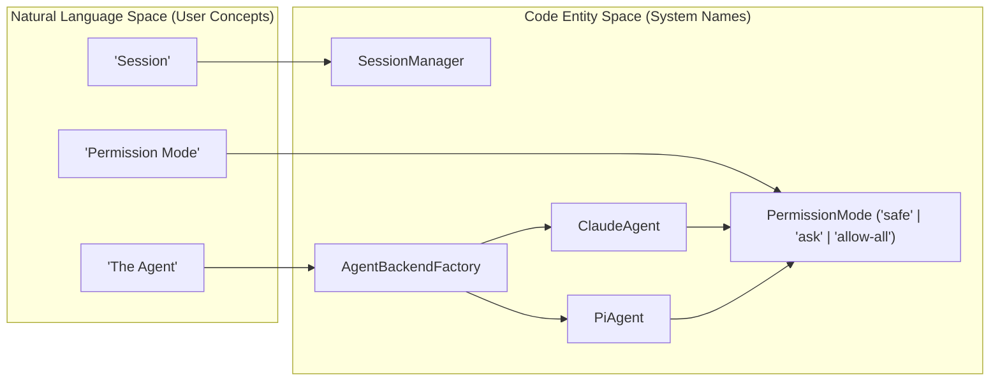
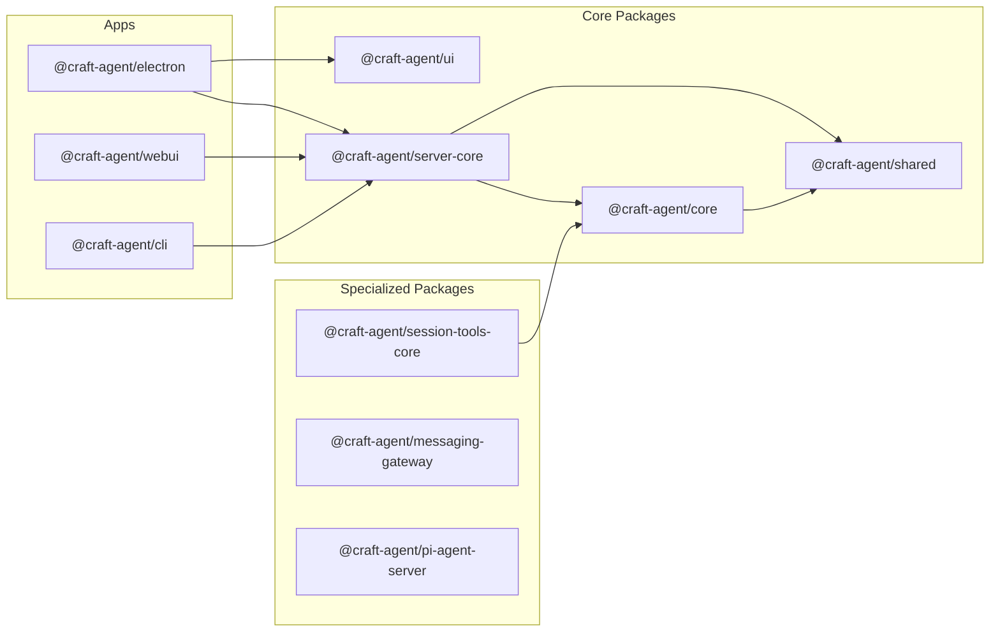
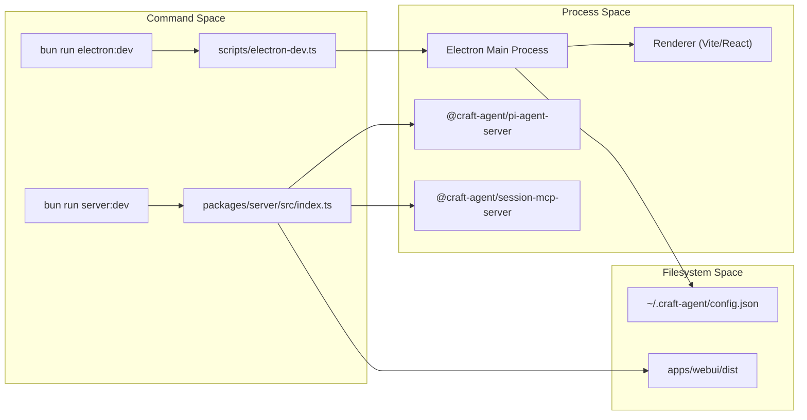
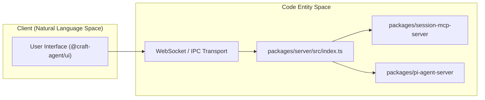
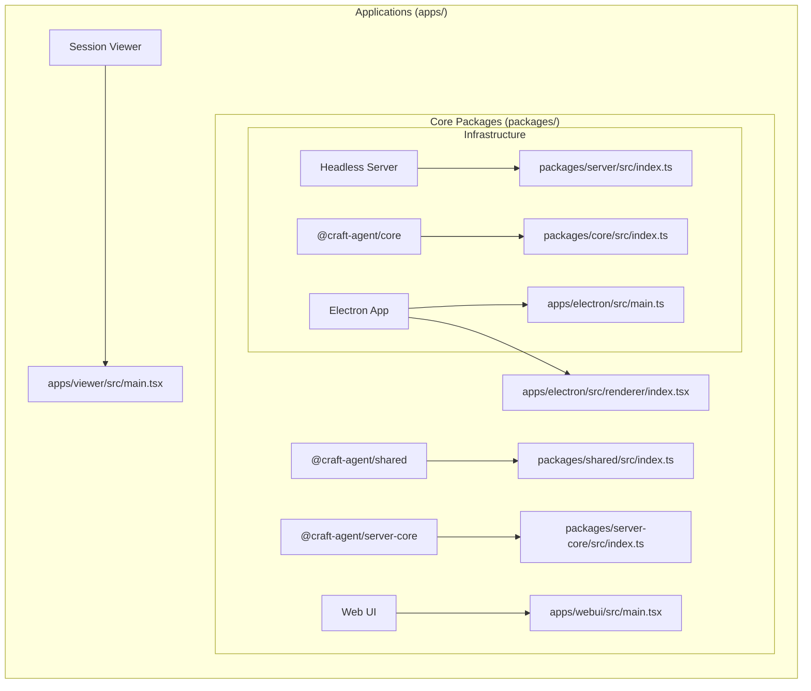
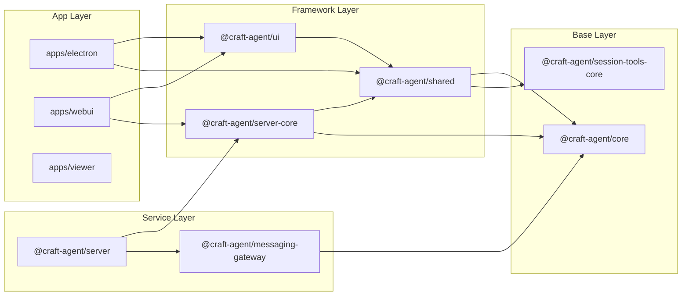
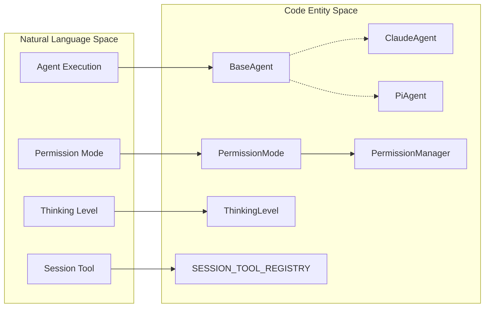
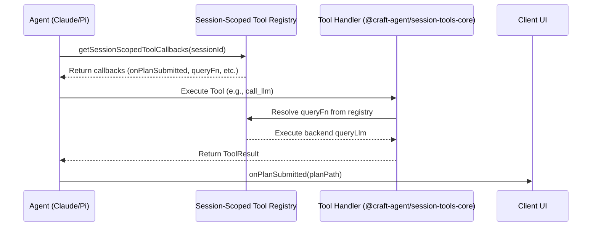
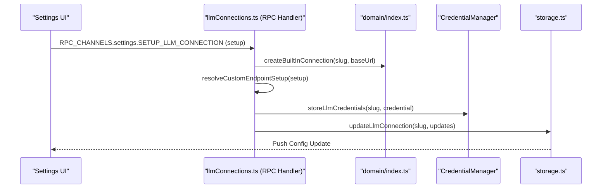
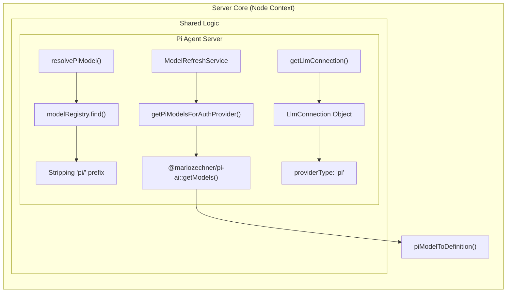

# Craft-Agents-Overview

# Craft Agents: Overview
Relevant source files
- [README.md](https://github.com/craft-ai-agents/craft-agents-oss/blob/8981384b/README.md?plain=1)
- [bun.lock](https://github.com/craft-ai-agents/craft-agents-oss/blob/8981384b/bun.lock)
- [package.json](https://github.com/craft-ai-agents/craft-agents-oss/blob/8981384b/package.json)

Craft Agents is an agent-native software platform designed to provide a document-centric, high-productivity interface for interacting with Large Language Models (LLMs). Unlike standard chat interfaces, Craft Agents focuses on multi-session management, deep tool integration via the Model Context Protocol (MCP), and a robust permission system for autonomous operations.

Built by the team at [craft.do](https://www.craft.do), it serves as a non-CLI alternative to tools like Claude Code, offering a fluid UI for multitasking and connecting to external services like Slack, Linear, and Gmail [README.md14-23](https://github.com/craft-ai-agents/craft-agents-oss/blob/8981384b/README.md?plain=1#L14-L23)

## Key Capabilities

- **Multi-Session Inbox**: A desktop application that organizes agent interactions into statuses like "Todo", "In Progress", and "Done" [README.md86](https://github.com/craft-ai-agents/craft-agents-oss/blob/8981384b/README.md?plain=1#L86-L86)[README.md113-115](https://github.com/craft-ai-agents/craft-agents-oss/blob/8981384b/README.md?plain=1#L113-L115)
- **Multi-Provider Support**: Seamlessly switch between Anthropic (Claude), Google AI Studio, ChatGPT, and GitHub Copilot [README.md88-89](https://github.com/craft-ai-agents/craft-agents-oss/blob/8981384b/README.md?plain=1#L88-L89)
- **MCP & Source Integration**: Connect to any API or service by pasting an OpenAPI spec or an MCP config. Local MCP servers run as subprocesses [README.md29-44](https://github.com/craft-ai-agents/craft-agents-oss/blob/8981384b/README.md?plain=1#L29-L44)
- **Permission Modes**: Three distinct security levels—`safe` (read-only), `ask` (approval required), and `allow-all` (autonomous) [README.md131-135](https://github.com/craft-ai-agents/craft-agents-oss/blob/8981384b/README.md?plain=1#L131-L135)
- **Native Tooling**: Includes built-in support for file diffing, background tasks, and document conversion (PDF, Office, etc.) [README.md96-98](https://github.com/craft-ai-agents/craft-agents-oss/blob/8981384b/README.md?plain=1#L96-L98)

## System Conceptual Map

The following diagram bridges the high-level user concepts to the underlying code entities that implement them.

### Conceptual to Code Bridge: Agent Execution



**Sources:**[README.md131-135](https://github.com/craft-ai-agents/craft-agents-oss/blob/8981384b/README.md?plain=1#L131-L135)[package.json122-125](https://github.com/craft-ai-agents/craft-agents-oss/blob/8981384b/package.json#L122-L125)[package.json136-140](https://github.com/craft-ai-agents/craft-agents-oss/blob/8981384b/package.json#L136-L140)

## Monorepo Organization

The project is structured as a Bun-powered monorepo using workspaces to separate concerns between the user-facing applications and the core logic [package.json18-22](https://github.com/craft-ai-agents/craft-agents-oss/blob/8981384b/package.json#L18-L22)

### Monorepo Structure: Apps and Packages



**Sources:**[package.json18-22](https://github.com/craft-ai-agents/craft-agents-oss/blob/8981384b/package.json#L18-L22)[bun.lock116-125](https://github.com/craft-ai-agents/craft-agents-oss/blob/8981384b/bun.lock#L116-L125)[bun.lock132-140](https://github.com/craft-ai-agents/craft-agents-oss/blob/8981384b/bun.lock#L132-L140)

### Core Workspace Roles

| Workspace | Purpose | Key Dependencies |
| --- | --- | --- |
| `apps/electron` | Main desktop application (React + Electron). | `@craft-agent/server-core`, `@craft-agent/ui` |
| `packages/server-core` | Headless server logic, RPC handlers, and transport. | `@craft-agent/core`, `@craft-agent/shared` |
| `packages/core` | Core types (`Message`, `Session`) and storage abstractions. | `zod`, `uuid` |
| `packages/ui` | Shared React component library and Markdown pipeline. | `shiki`, `framer-motion`, `lucide-react` |
| `packages/shared` | LLM connection management and common utilities. | `@anthropic-ai/claude-agent-sdk` |

For a deeper dive into the directory layout and dependency wiring, see [Monorepo Structure](/craft-ai-agents/craft-agents-oss/1.2-monorepo-structure).

## Getting Started

To begin development, you will need the **Bun** runtime. The repository supports a "One-Line Install" for users, while developers can build from source using standard scripts:

1. `bun install` to fetch dependencies [README.md80](https://github.com/craft-ai-agents/craft-agents-oss/blob/8981384b/README.md?plain=1#L80-L80)
2. `bun run electron:start` to launch the desktop app [README.md81](https://github.com/craft-ai-agents/craft-agents-oss/blob/8981384b/README.md?plain=1#L81-L81)
3. `bun run server:dev` to run the headless server [package.json30](https://github.com/craft-ai-agents/craft-agents-oss/blob/8981384b/package.json#L30-L30)

For detailed setup instructions, environment variable requirements, and platform-specific prerequisites, see [Getting Started](/craft-ai-agents/craft-agents-oss/1.1-getting-started).

---

**Sources:**

- [package.json18-22](https://github.com/craft-ai-agents/craft-agents-oss/blob/8981384b/package.json#L18-L22) - Workspace definitions
- [package.json30-35](https://github.com/craft-ai-agents/craft-agents-oss/blob/8981384b/package.json#L30-L35) - Server build and start scripts
- [README.md14-23](https://github.com/craft-ai-agents/craft-agents-oss/blob/8981384b/README.md?plain=1#L14-L23) - Project motivation and license
- [README.md84-99](https://github.com/craft-ai-agents/craft-agents-oss/blob/8981384b/README.md?plain=1#L84-L99) - Feature list
- [README.md131-135](https://github.com/craft-ai-agents/craft-agents-oss/blob/8981384b/README.md?plain=1#L131-L135) - Permission mode definitions
- [bun.lock116-140](https://github.com/craft-ai-agents/craft-agents-oss/blob/8981384b/bun.lock#L116-L140) - Internal workspace dependency mappings

---

# Getting-Started

# Getting Started
Relevant source files
- [bun.lock](https://github.com/craft-ai-agents/craft-agents-oss/blob/8981384b/bun.lock)
- [package.json](https://github.com/craft-ai-agents/craft-agents-oss/blob/8981384b/package.json)
- [scripts/install-server.sh](https://github.com/craft-ai-agents/craft-agents-oss/blob/8981384b/scripts/install-server.sh)

This page provides technical instructions for setting up the Craft Agents monorepo, configuring the development environment, and launching the various application targets (Electron, WebUI, and Headless Server).

## Prerequisites

The codebase is built using a modern TypeScript stack and requires the following tools:

- **Bun (>= 1.0)**: Used as the primary runtime, package manager, and test runner [scripts/install-server.sh7-36](https://github.com/craft-ai-agents/craft-agents-oss/blob/8981384b/scripts/install-server.sh#L7-L36)
- **Python 3**: Required specifically for running document tool smoke tests (PDF, XLSX, DOCX, etc.) [package.json41](https://github.com/craft-ai-agents/craft-agents-oss/blob/8981384b/package.json#L41-L41)
- **Node.js/npm**: While Bun is the primary driver, some underlying tools like `electron-builder` and `eslint` may utilize Node.js environments [package.json73-103](https://github.com/craft-ai-agents/craft-agents-oss/blob/8981384b/package.json#L73-L103)

## Installation

Craft Agents uses Bun Workspaces to manage dependencies across `apps/` and `packages/`[package.json18-22](https://github.com/craft-ai-agents/craft-agents-oss/blob/8981384b/package.json#L18-L22)

1. **Clone the repository.**
2. **Install dependencies**:

```
bun install
```

This command installs all workspace dependencies and handles `trustedDependencies` such as `electron`, `sharp`, and `koffi`[package.json8-17](https://github.com/craft-ai-agents/craft-agents-oss/blob/8981384b/package.json#L8-L17)
3. **Sync Secrets (Optional)**:
For internal development, a script is provided to sync environment secrets [package.json68](https://github.com/craft-ai-agents/craft-agents-oss/blob/8981384b/package.json#L68-L68)
```
bun run sync-secrets
```

## Environment Variables

The system relies on several environment variables to locate assets and configure security.

| Variable | Description | Default / Example |
| --- | --- | --- |
| `CRAFT_SERVER_TOKEN` | Security token for RPC authentication [scripts/install-server.sh82](https://github.com/craft-ai-agents/craft-agents-oss/blob/8981384b/scripts/install-server.sh#L82-L82) | Generated via `--generate-token` |
| `CRAFT_WEBUI_DIR` | Path to the compiled WebUI static assets [package.json90](https://github.com/craft-ai-agents/craft-agents-oss/blob/8981384b/package.json#L90-L90) | `apps/webui/dist` |
| `CRAFT_BUNDLED_ASSETS_ROOT` | Path to the Electron app root for resource discovery [package.json30](https://github.com/craft-ai-agents/craft-agents-oss/blob/8981384b/package.json#L30-L30) | `$PWD/apps/electron` |
| `CRAFT_DEBUG` | Enables verbose logging and developer tools [package.json30](https://github.com/craft-ai-agents/craft-agents-oss/blob/8981384b/package.json#L30-L30) | `true` |
| `CRAFT_RPC_PORT` | The port the headless server listens on [scripts/install-server.sh93](https://github.com/craft-ai-agents/craft-agents-oss/blob/8981384b/scripts/install-server.sh#L93-L93) | `9100` |

## Development Workflows

The monorepo supports three primary targets: the Electron Desktop app, the WebUI (Browser), and the Headless Server.

### 1. Electron Desktop Application

The Electron app requires a multi-step build process for its `main`, `preload`, and `renderer` processes.

- **Quick Start (Dev Mode)**:

```
bun run electron:dev
```

This executes `scripts/electron-dev.ts` which orchestrates the build and launch [package.json64](https://github.com/craft-ai-agents/craft-agents-oss/blob/8981384b/package.json#L64-L64)
- **Manual Build & Launch**:

```
bun run electron:build  # Builds main, preload, renderer, and assets
bun run electron:start  # Launches the built app
```
[package.json62-63](https://github.com/craft-ai-agents/craft-agents-oss/blob/8981384b/package.json#L62-L63)

### 2. WebUI and Headless Server

To run the browser-based interface, you must start the server and the Vite dev server for the frontend.

- **Server with WebUI**:

```
bun run server:dev:webui
```

This builds the required subprocesses (`session-mcp-server`, `pi-agent-server`), builds the WebUI, and starts the server at `packages/server/src/index.ts`[package.json91](https://github.com/craft-ai-agents/craft-agents-oss/blob/8981384b/package.json#L91-L91)
- **WebUI Frontend Only**:

```
bun run webui:dev
```

Starts the Vite dev server for `apps/webui`[package.json85](https://github.com/craft-ai-agents/craft-agents-oss/blob/8981384b/package.json#L85-L85)

### 3. Headless Server Setup

For server-only deployments, use the provided installation script:

```
bash scripts/install-server.sh
```

This script automates dependency installation, builds subprocesses, and generates a `CRAFT_SERVER_TOKEN`[scripts/install-server.sh54-68](https://github.com/craft-ai-agents/craft-agents-oss/blob/8981384b/scripts/install-server.sh#L54-L68)

## System Architecture & Data Flow

The following diagram illustrates the relationship between the development commands and the resulting process tree.

### Build and Execution Flow



**Sources:**[package.json30](https://github.com/craft-ai-agents/craft-agents-oss/blob/8981384b/package.json#L30-L30)[package.json64](https://github.com/craft-ai-agents/craft-agents-oss/blob/8981384b/package.json#L64-L64)[package.json89-91](https://github.com/craft-ai-agents/craft-agents-oss/blob/8981384b/package.json#L89-L91)[scripts/install-server.sh82-85](https://github.com/craft-ai-agents/craft-agents-oss/blob/8981384b/scripts/install-server.sh#L82-L85)

### Application Connectivity

This diagram maps the logical network connections between components and the specific code entities handling them.



**Sources:**[package.json89-91](https://github.com/craft-ai-agents/craft-agents-oss/blob/8981384b/package.json#L89-L91)[scripts/install-server.sh93-94](https://github.com/craft-ai-agents/craft-agents-oss/blob/8981384b/scripts/install-server.sh#L93-L94)[bun.lock136-140](https://github.com/craft-ai-agents/craft-agents-oss/blob/8981384b/bun.lock#L136-L140)

## Validation and Testing

Before contributing, ensure the environment is correctly configured by running the validation suite:

- **Full Validation**: `bun run validate:dev` (Runs typechecks, shared package tests, and doc-tool smoke tests) [package.json42](https://github.com/craft-ai-agents/craft-agents-oss/blob/8981384b/package.json#L42-L42)
- **Typechecking**: `bun run typecheck:all`[package.json28](https://github.com/craft-ai-agents/craft-agents-oss/blob/8981384b/package.json#L28-L28)
- **Document Tools**: `bun run test:doc-tools` (Requires Python 3) [package.json41](https://github.com/craft-ai-agents/craft-agents-oss/blob/8981384b/package.json#L41-L41)

**Sources:**

- [package.json1-100](https://github.com/craft-ai-agents/craft-agents-oss/blob/8981384b/package.json#L1-L100)
- [scripts/install-server.sh1-107](https://github.com/craft-ai-agents/craft-agents-oss/blob/8981384b/scripts/install-server.sh#L1-L107)
- [bun.lock1-180](https://github.com/craft-ai-agents/craft-agents-oss/blob/8981384b/bun.lock#L1-L180)

---

# Monorepo-Structure

# Monorepo Structure
Relevant source files
- [package.json](https://github.com/craft-ai-agents/craft-agents-oss/blob/8981384b/package.json)
- [packages/core/package.json](https://github.com/craft-ai-agents/craft-agents-oss/blob/8981384b/packages/core/package.json)
- [packages/server-core/package.json](https://github.com/craft-ai-agents/craft-agents-oss/blob/8981384b/packages/server-core/package.json)
- [packages/server/package.json](https://github.com/craft-ai-agents/craft-agents-oss/blob/8981384b/packages/server/package.json)
- [packages/shared/package.json](https://github.com/craft-ai-agents/craft-agents-oss/blob/8981384b/packages/shared/package.json)

The Craft Agents repository is organized as a monorepo managed by **Bun Workspaces**. This architecture allows for a clean separation between high-level user applications and the shared core logic, ensuring that different interfaces (Electron, Web, CLI) leverage the same underlying agent execution engine and storage abstractions.

## Workspace Layout

The repository is divided into two primary directories: `apps/` and `packages/`.

| Directory | Purpose | Key Examples |
| --- | --- | --- |
| `apps/` | Entry points for user-facing products. | `apps/electron`, `apps/webui`, `apps/viewer` |
| `packages/` | Internal libraries and shared services. | `@craft-agent/core`, `@craft-agent/shared`, `@craft-agent/ui` |

The root `package.json` defines these workspaces and manages global scripts for testing and building [package.json18-22](https://github.com/craft-ai-agents/craft-agents-oss/blob/8981384b/package.json#L18-L22)

### Dependency Resolution

Workspace dependencies are wired together using the `workspace:*` protocol. For instance, `@craft-agent/shared` depends on `@craft-agent/core` and `@craft-agent/session-tools-core` directly from the local source [packages/shared/package.json68-69](https://github.com/craft-ai-agents/craft-agents-oss/blob/8981384b/packages/shared/package.json#L68-L69) This allows for real-time type checking and development across the entire stack without needing to publish packages to a registry.

### Source to Code Entity Map: Workspace Entry Points

The following diagram maps the logical system names to their specific entry point files within the monorepo structure.

**Diagram: System Entry Point Mapping**



Sources: [package.json18-22](https://github.com/craft-ai-agents/craft-agents-oss/blob/8981384b/package.json#L18-L22)[packages/core/package.json7-13](https://github.com/craft-ai-agents/craft-agents-oss/blob/8981384b/packages/core/package.json#L7-L13)[packages/shared/package.json7-8](https://github.com/craft-ai-agents/craft-agents-oss/blob/8981384b/packages/shared/package.json#L7-L8)[packages/server/package.json6-9](https://github.com/craft-ai-agents/craft-agents-oss/blob/8981384b/packages/server/package.json#L6-L9)

---

## Package Roles and Responsibilities

### @craft-agent/core

The foundation of the entire system. It defines the fundamental data models (Messages, Turns, Sessions) and the low-level storage abstractions [packages/core/package.json5](https://github.com/craft-ai-agents/craft-agents-oss/blob/8981384b/packages/core/package.json#L5-L5) It is designed to be a "pure" package with minimal external dependencies, providing the base types used by every other package [packages/core/package.json11-12](https://github.com/craft-ai-agents/craft-agents-oss/blob/8981384b/packages/core/package.json#L11-L12)

### @craft-agent/shared

This package contains the primary business logic that is common to both the Electron client and the headless server. It handles:

- **Agent Logic**: Implementation of `ClaudeAgent` and `PiAgent`[packages/shared/package.json16](https://github.com/craft-ai-agents/craft-agents-oss/blob/8981384b/packages/shared/package.json#L16-L16)
- **Authentication**: OAuth flows and credential management [packages/shared/package.json20-22](https://github.com/craft-ai-agents/craft-agents-oss/blob/8981384b/packages/shared/package.json#L20-L22)
- **Configuration**: LLM connection management and storage migrations [packages/shared/package.json23-26](https://github.com/craft-ai-agents/craft-agents-oss/blob/8981384b/packages/shared/package.json#L23-L26)
- **MCP Integration**: Managing Model Context Protocol pools and tool discovery [packages/shared/package.json28](https://github.com/craft-ai-agents/craft-agents-oss/blob/8981384b/packages/shared/package.json#L28-L28)

### @craft-agent/server-core

Provides reusable infrastructure for running a Craft Agent backend [packages/server-core/package.json5](https://github.com/craft-ai-agents/craft-agents-oss/blob/8981384b/packages/server-core/package.json#L5-L5) It encapsulates the `WebSocket` transport layer, RPC handlers for settings and files, and the domain logic for session management [packages/server-core/package.json11-21](https://github.com/craft-ai-agents/craft-agents-oss/blob/8981384b/packages/server-core/package.json#L11-L21)

### @craft-agent/ui

The shared React component library. It contains the UI primitives for the chat interface, including the Markdown rendering pipeline (using `remark`/`rehype`) and the complex `TurnCard` components used in both the Electron app and the WebUI.

Sources: [packages/core/package.json1-13](https://github.com/craft-ai-agents/craft-agents-oss/blob/8981384b/packages/core/package.json#L1-L13)[packages/shared/package.json1-66](https://github.com/craft-ai-agents/craft-agents-oss/blob/8981384b/packages/shared/package.json#L1-L66)[packages/server-core/package.json1-22](https://github.com/craft-ai-agents/craft-agents-oss/blob/8981384b/packages/server-core/package.json#L1-L22)[packages/server/package.json1-32](https://github.com/craft-ai-agents/craft-agents-oss/blob/8981384b/packages/server/package.json#L1-L32)

---

## Internal Dependency Graph

The dependency flow generally moves from specialized applications down to the foundational core.

**Diagram: Dependency Flow and Data Propagation**



### Key Wiring Details

1. **Server Composition**: The `@craft-agent/server` package is a thin wrapper that combines `@craft-agent/server-core` with the `@craft-agent/messaging-gateway` to provide a full-featured headless instance [packages/server/package.json27-31](https://github.com/craft-ai-agents/craft-agents-oss/blob/8981384b/packages/server/package.json#L27-L31)
2. **Shared Logic**: Both the Electron main process and the Server use `@craft-agent/shared` to execute agent turns, ensuring consistent behavior across platforms [packages/shared/package.json15-19](https://github.com/craft-ai-agents/craft-agents-oss/blob/8981384b/packages/shared/package.json#L15-L19)
3. **UI Isolation**: The `@craft-agent/ui` package depends on `@craft-agent/shared` for types and constants but remains agnostic of the transport layer (IPC vs WebSocket).

Sources: [packages/server/package.json27-32](https://github.com/craft-ai-agents/craft-agents-oss/blob/8981384b/packages/server/package.json#L27-L32)[packages/server-core/package.json26-33](https://github.com/craft-ai-agents/craft-agents-oss/blob/8981384b/packages/server-core/package.json#L26-L33)[packages/shared/package.json67-83](https://github.com/craft-ai-agents/craft-agents-oss/blob/8981384b/packages/shared/package.json#L67-L83)[packages/core/package.json1-21](https://github.com/craft-ai-agents/craft-agents-oss/blob/8981384b/packages/core/package.json#L1-L21)

---

# Core-Architecture

# Core Architecture
Relevant source files
- [packages/core/package.json](https://github.com/craft-ai-agents/craft-agents-oss/blob/8981384b/packages/core/package.json)
- [packages/shared/src/agent/claude-agent.ts](https://github.com/craft-ai-agents/craft-agents-oss/blob/8981384b/packages/shared/src/agent/claude-agent.ts)
- [packages/shared/src/protocol/dto.ts](https://github.com/craft-ai-agents/craft-agents-oss/blob/8981384b/packages/shared/src/protocol/dto.ts)

The Craft Agents architecture is designed around a decoupled, multi-process model that separates the **Agent Execution Engine** from the **User Interface**. This separation allows for flexible deployments (Electron Desktop, Web, or CLI) while maintaining a consistent stateful environment for agents through a unified protocol and storage layer.

### System Overview

The system bridges the "Natural Language Space" (user intent) and "Code Entity Space" (tool execution) by routing messages through a centralized `SessionManager` and executing them via specialized agent backends.

#### Component Relationship Diagram

The following diagram illustrates how the core packages and classes interact to process a user request.

**Agent Flow: Request to Execution**

```

```

**Sources:**[packages/shared/src/protocol/dto.ts167-185](https://github.com/craft-ai-agents/craft-agents-oss/blob/8981384b/packages/shared/src/protocol/dto.ts#L167-L185)[packages/shared/src/agent/claude-agent.ts165-180](https://github.com/craft-ai-agents/craft-agents-oss/blob/8981384b/packages/shared/src/agent/claude-agent.ts#L165-L180)

---

### Agent Execution Model

The execution model is centered around the `BaseAgent` abstraction. The system currently supports two primary implementations: `ClaudeAgent` (using the Anthropic SDK) and `PiAgent` (the internal model router). Agents are not just LLM wrappers; they are stateful orchestrators that manage:

- **Permission Modes:** Enforced by the `ModeManager`, controlling whether an agent can execute tools automatically (`allow-all`), must ask (`ask`), or is restricted (`safe`).
- **Thinking Levels:** Managing reasoning effort (e.g., `adaptive` thinking) and token budgets.
- **Tool Use:** Orchestrating calls to Model Context Protocol (MCP) servers and internal session-scoped tools.

For details, see [Agent Execution Engine](/craft-ai-agents/craft-agents-oss/2.1-agent-execution-engine).

**Sources:**[packages/shared/src/agent/claude-agent.ts45-55](https://github.com/craft-ai-agents/craft-agents-oss/blob/8981384b/packages/shared/src/agent/claude-agent.ts#L45-L55)[packages/shared/src/agent/claude-agent.ts135-163](https://github.com/craft-ai-agents/craft-agents-oss/blob/8981384b/packages/shared/src/agent/claude-agent.ts#L135-L163)

---

### LLM Backend Integration

Craft Agents uses a "Connection" abstraction to handle various LLM providers. Instead of hardcoding API keys, the system uses **Connection Slugs** (e.g., `anthropic`, `bedrock`, `custom-pi`) stored in `config.json`.

- **Model Selection:** Supports automatic model tiering (Small/Medium/Large) or explicit user overrides.
- **Provider Catalog:** The `PiAgent` backend provides a unified catalog for internal and external models, including support for custom OpenAI-compatible endpoints.

For details, see [LLM Connections and Model Configuration](/craft-ai-agents/craft-agents-oss/2.2-llm-connections-and-model-configuration).

**Sources:**[packages/shared/src/agent/claude-agent.ts25-26](https://github.com/craft-ai-agents/craft-agents-oss/blob/8981384b/packages/shared/src/agent/claude-agent.ts#L25-L26)[packages/shared/src/agent/claude-agent.ts17-22](https://github.com/craft-ai-agents/craft-agents-oss/blob/8981384b/packages/shared/src/agent/claude-agent.ts#L17-L22)

---

### Session and Workspace Abstractions

A **Session** is the primary isolation boundary for conversation history, tool outputs, and state. A **Workspace** defines the environment (filesystem access, specific MCP tools, and preferences) where these sessions live.

- **Storage Layout:** Everything is persisted under `~/.craft-agent/`, with sessions stored as JSONL files to ensure durability during long-running agent tasks.
- **Context Management:** The `SessionManager` handles the lifecycle of these entities, including branching sessions and managing "Working Directories."

For details, see [Session and Workspace Management](/craft-ai-agents/craft-agents-oss/2.3-session-and-workspace-management).

**Sources:**[packages/shared/src/protocol/dto.ts46-104](https://github.com/craft-ai-agents/craft-agents-oss/blob/8981384b/packages/shared/src/protocol/dto.ts#L46-L104)[packages/shared/src/agent/claude-agent.ts56-58](https://github.com/craft-ai-agents/craft-agents-oss/blob/8981384b/packages/shared/src/agent/claude-agent.ts#L56-L58)

---

### Protocol and Transport Layer

The **Protocol Layer** defines the contract between the frontend and backend using a structured Request/Response and Event-driven pattern.

- **DTOs:** Data Transfer Objects defined in `dto.ts` ensure type safety across the IPC (Electron) and WebSocket (WebUI) boundaries.
- **Streaming:** Agent events (text deltas, tool starts, errors) are streamed in real-time to provide immediate feedback to the user.

For details, see [Protocol and Transport Layer](/craft-ai-agents/craft-agents-oss/2.4-protocol-and-transport-layer).

**Sources:**[packages/shared/src/protocol/dto.ts1-25](https://github.com/craft-ai-agents/craft-agents-oss/blob/8981384b/packages/shared/src/protocol/dto.ts#L1-L25)[packages/shared/src/protocol/dto.ts167-185](https://github.com/craft-ai-agents/craft-agents-oss/blob/8981384b/packages/shared/src/protocol/dto.ts#L167-L185)

---

### System Prompt Construction

The "Intelligence" of the agent is guided by a dynamically constructed system prompt. This prompt is not static; it is assembled at runtime by gathering:

- **Context Files:** Discovery of `AGENTS.md` or `CLAUDE.md` in the current workspace.
- **Environment Metadata:** Injecting current date, OS, and available tools.
- **Permission Context:** Instructions on how the agent should behave based on the active `PermissionMode`.

For details, see [System Prompt and Agent Prompting](/craft-ai-agents/craft-agents-oss/2.5-system-prompt-and-agent-prompting).

**Sources:**[packages/shared/src/agent/claude-agent.ts10-11](https://github.com/craft-ai-agents/craft-agents-oss/blob/8981384b/packages/shared/src/agent/claude-agent.ts#L10-L11)[packages/shared/src/agent/claude-agent.ts27](https://github.com/craft-ai-agents/craft-agents-oss/blob/8981384b/packages/shared/src/agent/claude-agent.ts#L27-L27)

---

### Architecture Mapping: Code to Concept

The following table maps high-level architectural concepts to their primary implementation files in the codebase.

| Concept | Primary Code Entity | File Path |
| --- | --- | --- |
| **Agent Logic** | `ClaudeAgent` | [packages/shared/src/agent/claude-agent.ts](https://github.com/craft-ai-agents/craft-agents-oss/blob/8981384b/packages/shared/src/agent/claude-agent.ts) |
| **Protocol Types** | `SessionEvent`, `Session` | [packages/shared/src/protocol/dto.ts](https://github.com/craft-ai-agents/craft-agents-oss/blob/8981384b/packages/shared/src/protocol/dto.ts) |
| **State Management** | `SessionManager` | (Referenced in [packages/shared/src/protocol/dto.ts](https://github.com/craft-ai-agents/craft-agents-oss/blob/8981384b/packages/shared/src/protocol/dto.ts)) |
| **Safety Engine** | `ModeManager` | [packages/shared/src/agent/mode-manager.ts](https://github.com/craft-ai-agents/craft-agents-oss/blob/8981384b/packages/shared/src/agent/mode-manager.ts) |
| **Storage Logic** | `loadStoredConfig`, `Workspace` | [packages/shared/src/config/storage.ts](https://github.com/craft-ai-agents/craft-agents-oss/blob/8981384b/packages/shared/src/config/storage.ts) |

**Sources:**[packages/shared/src/agent/claude-agent.ts1-20](https://github.com/craft-ai-agents/craft-agents-oss/blob/8981384b/packages/shared/src/agent/claude-agent.ts#L1-L20)[packages/shared/src/protocol/dto.ts46-80](https://github.com/craft-ai-agents/craft-agents-oss/blob/8981384b/packages/shared/src/protocol/dto.ts#L46-L80)

---

# Agent-Execution-Engine

# Agent Execution Engine
Relevant source files
- [packages/shared/src/agent/backend/types.ts](https://github.com/craft-ai-agents/craft-agents-oss/blob/8981384b/packages/shared/src/agent/backend/types.ts)
- [packages/shared/src/agent/base-agent.ts](https://github.com/craft-ai-agents/craft-agents-oss/blob/8981384b/packages/shared/src/agent/base-agent.ts)
- [packages/shared/src/agent/claude-agent.ts](https://github.com/craft-ai-agents/craft-agents-oss/blob/8981384b/packages/shared/src/agent/claude-agent.ts)
- [packages/shared/src/agent/diagnostics.ts](https://github.com/craft-ai-agents/craft-agents-oss/blob/8981384b/packages/shared/src/agent/diagnostics.ts)
- [packages/shared/src/agent/errors.ts](https://github.com/craft-ai-agents/craft-agents-oss/blob/8981384b/packages/shared/src/agent/errors.ts)
- [packages/shared/src/agent/llm-tool.ts](https://github.com/craft-ai-agents/craft-agents-oss/blob/8981384b/packages/shared/src/agent/llm-tool.ts)
- [packages/shared/src/agent/options.ts](https://github.com/craft-ai-agents/craft-agents-oss/blob/8981384b/packages/shared/src/agent/options.ts)
- [packages/shared/src/agent/pi-agent.ts](https://github.com/craft-ai-agents/craft-agents-oss/blob/8981384b/packages/shared/src/agent/pi-agent.ts)
- [packages/shared/src/agent/session-scoped-tool-callback-registry.ts](https://github.com/craft-ai-agents/craft-agents-oss/blob/8981384b/packages/shared/src/agent/session-scoped-tool-callback-registry.ts)
- [packages/shared/src/agent/session-scoped-tools.ts](https://github.com/craft-ai-agents/craft-agents-oss/blob/8981384b/packages/shared/src/agent/session-scoped-tools.ts)
- [packages/shared/src/agent/session-self-management-bindings.ts](https://github.com/craft-ai-agents/craft-agents-oss/blob/8981384b/packages/shared/src/agent/session-self-management-bindings.ts)
- [packages/shared/src/utils/summarize.ts](https://github.com/craft-ai-agents/craft-agents-oss/blob/8981384b/packages/shared/src/utils/summarize.ts)

The Agent Execution Engine is the core component responsible for the lifecycle, orchestration, and execution of AI agents within Craft Agents. It provides a provider-agnostic abstraction layer that allows the system to switch between different LLM backends (like Claude or Pi) while maintaining consistent behavior for tools, permissions, and session management.

## Core Abstraction: BaseAgent

All agent implementations inherit from the `BaseAgent` abstract class. This class centralizes shared logic that is independent of the specific LLM provider, ensuring a unified experience across different backends [packages/shared/src/agent/base-agent.ts162](https://github.com/craft-ai-agents/craft-agents-oss/blob/8981384b/packages/shared/src/agent/base-agent.ts#L162-L162)

The `BaseAgent` delegates specialized tasks to several core modules:

- **PermissionManager**: Handles user approvals for sensitive operations [packages/shared/src/agent/base-agent.ts51](https://github.com/craft-ai-agents/craft-agents-oss/blob/8981384b/packages/shared/src/agent/base-agent.ts#L51-L51)
- **SourceManager**: Manages external data sources and MCP servers [packages/shared/src/agent/base-agent.ts52](https://github.com/craft-ai-agents/craft-agents-oss/blob/8981384b/packages/shared/src/agent/base-agent.ts#L52-L52)
- **UsageTracker**: Tracks token consumption and costs [packages/shared/src/agent/base-agent.ts56](https://github.com/craft-ai-agents/craft-agents-oss/blob/8981384b/packages/shared/src/agent/base-agent.ts#L56-L56)
- **ConfigWatcherManager**: Monitors changes in workspace configuration files [packages/shared/src/agent/base-agent.ts55](https://github.com/craft-ai-agents/craft-agents-oss/blob/8981384b/packages/shared/src/agent/base-agent.ts#L55-L55)

### Natural Language to Code Entity Mapping

The following diagram illustrates how high-level agent concepts map to specific classes and files in the codebase.

**Concept to Entity Bridge**



Sources: [packages/shared/src/agent/base-agent.ts162](https://github.com/craft-ai-agents/craft-agents-oss/blob/8981384b/packages/shared/src/agent/base-agent.ts#L162-L162)[packages/shared/src/agent/claude-agent.ts165](https://github.com/craft-ai-agents/craft-agents-oss/blob/8981384b/packages/shared/src/agent/claude-agent.ts#L165-L165)[packages/shared/src/agent/pi-agent.ts121](https://github.com/craft-ai-agents/craft-agents-oss/blob/8981384b/packages/shared/src/agent/pi-agent.ts#L121-L121)[packages/shared/src/agent/mode-manager.ts52](https://github.com/craft-ai-agents/craft-agents-oss/blob/8981384b/packages/shared/src/agent/mode-manager.ts#L52-L52)[packages/shared/src/agent/thinking-levels.ts70](https://github.com/craft-ai-agents/craft-agents-oss/blob/8981384b/packages/shared/src/agent/thinking-levels.ts#L70-L70)

---

## Agent Implementations

### ClaudeAgent

The `ClaudeAgent` utilizes the `@anthropic-ai/claude-agent-sdk` to run agents natively. It handles the translation between Craft Agents' internal events and the Anthropic SDK's message format [packages/shared/src/agent/claude-agent.ts1](https://github.com/craft-ai-agents/craft-agents-oss/blob/8981384b/packages/shared/src/agent/claude-agent.ts#L1-L1)

- **Config Repair**: It includes a robust `ensureClaudeConfig` utility that repairs `~/.claude.json` corruption (such as UTF-8 BOM issues common on Windows) before starting the SDK subprocess [packages/shared/src/agent/options.ts36](https://github.com/craft-ai-agents/craft-agents-oss/blob/8981384b/packages/shared/src/agent/options.ts#L36-L36)
- **Event Adaptation**: Uses `ClaudeEventAdapter` to map SDK events into `AgentEvent` types [packages/shared/src/agent/claude-agent.ts116](https://github.com/craft-ai-agents/craft-agents-oss/blob/8981384b/packages/shared/src/agent/claude-agent.ts#L116-L116)

### PiAgent

The `PiAgent` acts as a thin RPC client for the `pi-agent-server` subprocess [packages/shared/src/agent/pi-agent.ts4-9](https://github.com/craft-ai-agents/craft-agents-oss/blob/8981384b/packages/shared/src/agent/pi-agent.ts#L4-L9)

- **Subprocess Lifecycle**: It spawns a child process and communicates via JSONL over stdin/stdout [packages/shared/src/agent/pi-agent.ts121-132](https://github.com/craft-ai-agents/craft-agents-oss/blob/8981384b/packages/shared/src/agent/pi-agent.ts#L121-L132)
- **Proxy Tooling**: Because the Pi agent runs in a separate process, it uses a proxy mechanism to route MCP and session-scoped tool calls back to the main process [packages/shared/src/agent/pi-agent.ts65-74](https://github.com/craft-ai-agents/craft-agents-oss/blob/8981384b/packages/shared/src/agent/pi-agent.ts#L65-L74)

---

## Permission Modes

The engine supports three primary permission modes that dictate how tools (especially destructive ones like `bash` or `file_write`) are executed [packages/shared/src/agent/mode-manager.ts52](https://github.com/craft-ai-agents/craft-agents-oss/blob/8981384b/packages/shared/src/agent/mode-manager.ts#L52-L52)

| Mode | Behavior |
| --- | --- |
| **Safe** | Default mode. All potentially harmful tools require explicit user approval via a `PermissionCallback`[packages/shared/src/agent/mode-manager.ts54](https://github.com/craft-ai-agents/craft-agents-oss/blob/8981384b/packages/shared/src/agent/mode-manager.ts#L54-L54) |
| **Ask** | Similar to Safe, but prompts the user for almost every tool interaction to provide maximum oversight. |
| **Allow-All** | Dangerous mode where the agent can execute any tool without confirmation. |

Sources: [packages/shared/src/agent/backend/types.ts64-83](https://github.com/craft-ai-agents/craft-agents-oss/blob/8981384b/packages/shared/src/agent/backend/types.ts#L64-L83)[packages/shared/src/agent/mode-manager.ts45-55](https://github.com/craft-ai-agents/craft-agents-oss/blob/8981384b/packages/shared/src/agent/mode-manager.ts#L45-L55)

---

## Thinking Levels

Thinking levels control the "reasoning" effort of the model. For Claude models, this maps to the `adaptive` thinking type and `effort` levels [packages/shared/src/agent/claude-agent.ts140-163](https://github.com/craft-ai-agents/craft-agents-oss/blob/8981384b/packages/shared/src/agent/claude-agent.ts#L140-L163)

| Thinking Level | Model Configuration |
| --- | --- |
| **Disabled** | `maxThinkingTokens: 0` or `type: 'disabled'`[packages/shared/src/agent/claude-agent.ts147-150](https://github.com/craft-ai-agents/craft-agents-oss/blob/8981384b/packages/shared/src/agent/claude-agent.ts#L147-L150) |
| **Low / Medium / High** | Maps to `low`, `medium`, and `high` effort in the SDK for supported models [packages/shared/src/agent/claude-agent.ts153-158](https://github.com/craft-ai-agents/craft-agents-oss/blob/8981384b/packages/shared/src/agent/claude-agent.ts#L153-L158) |

Sources: [packages/shared/src/agent/thinking-levels.ts70](https://github.com/craft-ai-agents/craft-agents-oss/blob/8981384b/packages/shared/src/agent/thinking-levels.ts#L70-L70)[packages/shared/src/agent/claude-agent.ts135-163](https://github.com/craft-ai-agents/craft-agents-oss/blob/8981384b/packages/shared/src/agent/claude-agent.ts#L135-L163)

---

## Session Lifecycle and Tooling

### Session-Scoped Tools

Tools like `call_llm`, `spawn_session`, and `browser_tool` are scoped to specific sessions. Their callbacks are registered in a central `sessionScopedToolCallbackRegistry`[packages/shared/src/agent/session-scoped-tool-callback-registry.ts85](https://github.com/craft-ai-agents/craft-agents-oss/blob/8981384b/packages/shared/src/agent/session-scoped-tool-callback-registry.ts#L85-L85)

**Tool Execution Data Flow**



Sources: [packages/shared/src/agent/session-scoped-tools.ts1-16](https://github.com/craft-ai-agents/craft-agents-oss/blob/8981384b/packages/shared/src/agent/session-scoped-tools.ts#L1-L16)[packages/shared/src/agent/session-scoped-tool-callback-registry.ts22-82](https://github.com/craft-ai-agents/craft-agents-oss/blob/8981384b/packages/shared/src/agent/session-scoped-tool-callback-registry.ts#L22-L82)[packages/shared/src/agent/llm-tool.ts1-15](https://github.com/craft-ai-agents/craft-agents-oss/blob/8981384b/packages/shared/src/agent/llm-tool.ts#L1-L15)

### Interrupts vs. Aborts

The engine distinguishes between two types of execution stops:

1. **Hard Abort**: Triggered by the user or a system error (e.g., `network_error`). This stops the LLM stream and cleans up resources [packages/shared/src/agent/errors.ts132-140](https://github.com/craft-ai-agents/craft-agents-oss/blob/8981384b/packages/shared/src/agent/errors.ts#L132-L140)
2. **Handoff Interrupt**: Occurs when a tool requires user input (like a permission request or an OAuth flow). The agent's state is preserved, but execution is paused until the `PermissionCallback` or `AuthCallback` returns [packages/shared/src/agent/backend/types.ts67-95](https://github.com/craft-ai-agents/craft-agents-oss/blob/8981384b/packages/shared/src/agent/backend/types.ts#L67-L95)

### Error Diagnostics

When an execution fails, the engine runs `runErrorDiagnostics`. This utility checks for common failure modes like billing issues (HTTP 402), expired tokens, or unreachable MCP servers to provide actionable recovery steps to the user [packages/shared/src/agent/diagnostics.ts25-31](https://github.com/craft-ai-agents/craft-agents-oss/blob/8981384b/packages/shared/src/agent/diagnostics.ts#L25-L31)

Sources: [packages/shared/src/agent/errors.ts39-58](https://github.com/craft-ai-agents/craft-agents-oss/blob/8981384b/packages/shared/src/agent/errors.ts#L39-L58)[packages/shared/src/agent/diagnostics.ts58-118](https://github.com/craft-ai-agents/craft-agents-oss/blob/8981384b/packages/shared/src/agent/diagnostics.ts#L58-L118)

---

# LLM-Connections-and-Model-Configuration

# LLM Connections and Model Configuration
Relevant source files
- [apps/electron/src/renderer/components/automations/AutomationActionRow.tsx](https://github.com/craft-ai-agents/craft-agents-oss/blob/8981384b/apps/electron/src/renderer/components/automations/AutomationActionRow.tsx)
- [apps/electron/src/renderer/components/automations/types.ts](https://github.com/craft-ai-agents/craft-agents-oss/blob/8981384b/apps/electron/src/renderer/components/automations/types.ts)
- [packages/pi-agent-server/src/model-resolution.ts](https://github.com/craft-ai-agents/craft-agents-oss/blob/8981384b/packages/pi-agent-server/src/model-resolution.ts)
- [packages/server-core/src/handlers/rpc/llm-connections.ts](https://github.com/craft-ai-agents/craft-agents-oss/blob/8981384b/packages/server-core/src/handlers/rpc/llm-connections.ts)
- [packages/shared/src/config/__tests__/llm-connections.test.ts](https://github.com/craft-ai-agents/craft-agents-oss/blob/8981384b/packages/shared/src/config/__tests__/llm-connections.test.ts)
- [packages/shared/src/config/llm-connections.ts](https://github.com/craft-ai-agents/craft-agents-oss/blob/8981384b/packages/shared/src/config/llm-connections.ts)
- [packages/shared/src/config/models-pi.ts](https://github.com/craft-ai-agents/craft-agents-oss/blob/8981384b/packages/shared/src/config/models-pi.ts)
- [packages/shared/src/config/models.ts](https://github.com/craft-ai-agents/craft-agents-oss/blob/8981384b/packages/shared/src/config/models.ts)
- [packages/shared/tests/llm-connections.test.ts](https://github.com/craft-ai-agents/craft-agents-oss/blob/8981384b/packages/shared/tests/llm-connections.test.ts)

LLM connections in Craft Agents are named provider configurations that define how the system communicates with AI backends. This system handles provider-specific SDKs, authentication mechanisms, and model selection logic, ensuring that sessions can "lock" to a specific connection while allowing workspaces to define their own defaults [packages/shared/src/config/llm-connections.ts1-7](https://github.com/craft-ai-agents/craft-agents-oss/blob/8981384b/packages/shared/src/config/llm-connections.ts#L1-L7)

## Provider and Connection Architecture

The system distinguishes between a **Provider Type** (the backend implementation) and an **Auth Type** (the credential mechanism).

### Provider Types

- `anthropic`: Direct integration with the Anthropic Messages API using the Claude Agent SDK [packages/shared/src/config/llm-connections.ts44](https://github.com/craft-ai-agents/craft-agents-oss/blob/8981384b/packages/shared/src/config/llm-connections.ts#L44-L44)
- `pi`: Integration with the Pi unified LLM API, supporting over 20 providers (OpenAI, Google, DeepSeek, etc.) via the `@mariozechner/pi-ai` SDK [packages/shared/src/config/llm-connections.ts45](https://github.com/craft-ai-agents/craft-agents-oss/blob/8981384b/packages/shared/src/config/llm-connections.ts#L45-L45)
- `pi_compat`: A specialized mode for custom endpoints (Ollama, self-hosted vLLM) that uses the Pi SDK's streaming adapters [packages/shared/src/config/llm-connections.ts46](https://github.com/craft-ai-agents/craft-agents-oss/blob/8981384b/packages/shared/src/config/llm-connections.ts#L46-L46)

### Authentication Types

The system supports a variety of authentication patterns, from simple keys to complex cloud IAM roles:

- **Token-based**: `api_key`, `api_key_with_endpoint`, `bearer_token`[packages/shared/src/config/llm-connections.ts82-86](https://github.com/craft-ai-agents/craft-agents-oss/blob/8981384b/packages/shared/src/config/llm-connections.ts#L82-L86)
- **OAuth**: Browser-based flows for services like GitHub Copilot or ChatGPT [packages/shared/src/config/llm-connections.ts84](https://github.com/craft-ai-agents/craft-agents-oss/blob/8981384b/packages/shared/src/config/llm-connections.ts#L84-L84)
- **Cloud/Enterprise**: `iam_credentials` (AWS), `service_account_file` (GCP), and `environment` variables [packages/shared/src/config/llm-connections.ts85-88](https://github.com/craft-ai-agents/craft-agents-oss/blob/8981384b/packages/shared/src/config/llm-connections.ts#L85-L88)
- **None**: For local providers like Ollama [packages/shared/src/config/llm-connections.ts89](https://github.com/craft-ai-agents/craft-agents-oss/blob/8981384b/packages/shared/src/config/llm-connections.ts#L89-L89)

### Data Flow: Connection Setup

The following diagram illustrates how a connection setup request flows from the UI through the RPC layer to persistent storage.

**LLM Connection Configuration Flow**



Sources: [packages/server-core/src/handlers/rpc/llm-connections.ts52-145](https://github.com/craft-ai-agents/craft-agents-oss/blob/8981384b/packages/server-core/src/handlers/rpc/llm-connections.ts#L52-L145)[packages/shared/src/config/llm-connections.ts134-181](https://github.com/craft-ai-agents/craft-agents-oss/blob/8981384b/packages/shared/src/config/llm-connections.ts#L134-L181)

## Model Selection and Discovery

Craft Agents employs two distinct modes for managing available models within a connection:

1. **Automatically Synced**: The system fetches the latest model list from the provider (e.g., via Pi SDK's `getModels`) [packages/shared/src/config/llm-connections.ts93](https://github.com/craft-ai-agents/craft-agents-oss/blob/8981384b/packages/shared/src/config/llm-connections.ts#L93-L93)
2. **User-Defined 3-Tier**: The user manually selects a "Best", "Balanced", and "Fast" model, and this list is preserved regardless of provider updates [packages/shared/src/config/llm-connections.ts94](https://github.com/craft-ai-agents/craft-agents-oss/blob/8981384b/packages/shared/src/config/llm-connections.ts#L94-L94)

### Small Model Resolution (`getMiniModel`)

For internal tasks like title generation and summarization, the system uses `getMiniModel()` to find the most efficient available model [packages/shared/tests/llm-connections.test.ts4-6](https://github.com/craft-ai-agents/craft-agents-oss/blob/8981384b/packages/shared/tests/llm-connections.test.ts#L4-L6)

- **Anthropic**: Searches for models containing "haiku" [packages/shared/tests/llm-connections.test.ts26-33](https://github.com/craft-ai-agents/craft-agents-oss/blob/8981384b/packages/shared/tests/llm-connections.test.ts#L26-L33)
- **Pi/OpenAI**: Searches for "mini" or "flash" variants [packages/shared/tests/llm-connections.test.ts37-43](https://github.com/craft-ai-agents/craft-agents-oss/blob/8981384b/packages/shared/tests/llm-connections.test.ts#L37-L43)
- **Denylist**: Explicitly skips models like `codex-mini-latest` which are known to be unstable or restricted in certain auth contexts [packages/shared/src/config/models-pi.ts58-59](https://github.com/craft-ai-agents/craft-agents-oss/blob/8981384b/packages/shared/src/config/models-pi.ts#L58-L59)[packages/shared/tests/llm-connections.test.ts157-168](https://github.com/craft-ai-agents/craft-agents-oss/blob/8981384b/packages/shared/tests/llm-connections.test.ts#L157-L168)

## Pi Provider Catalog

The Pi provider (`pi`) acts as a bridge to many secondary LLMs. Because the Pi SDK (`@mariozechner/pi-ai`) depends on Node.js modules like `stream` that break browser builds, model resolution is handled via dependency injection [packages/shared/src/config/llm-connections.ts10-13](https://github.com/craft-ai-agents/craft-agents-oss/blob/8981384b/packages/shared/src/config/llm-connections.ts#L10-L13)

- **Resolver Registration**: The main process calls `registerPiModelResolver` at startup [packages/shared/src/config/llm-connections.ts32-34](https://github.com/craft-ai-agents/craft-agents-oss/blob/8981384b/packages/shared/src/config/llm-connections.ts#L32-L34)
- **Dynamic Discovery**: Models are fetched using `getPiModelsForAuthProvider(piAuthProvider)`[packages/shared/src/config/models-pi.ts89-91](https://github.com/craft-ai-agents/craft-agents-oss/blob/8981384b/packages/shared/src/config/models-pi.ts#L89-L91)
- **Bedrock Mapping**: AWS Bedrock requires region-prefixed inference profiles (e.g., `us.anthropic...`). The system automatically maps bare Anthropic IDs to these regional variants [packages/shared/src/config/llm-connections.test.ts135-159](https://github.com/craft-ai-agents/craft-agents-oss/blob/8981384b/packages/shared/src/config/llm-connections.test.ts#L135-L159)[packages/shared/src/config/models-pi.ts82-84](https://github.com/craft-ai-agents/craft-agents-oss/blob/8981384b/packages/shared/src/config/models-pi.ts#L82-L84)

**Code Entity Mapping: Pi Model Resolution**



Sources: [packages/shared/src/config/llm-connections.ts24-34](https://github.com/craft-ai-agents/craft-agents-oss/blob/8981384b/packages/shared/src/config/llm-connections.ts#L24-L34)[packages/shared/src/config/models-pi.ts27-40](https://github.com/craft-ai-agents/craft-agents-oss/blob/8981384b/packages/shared/src/config/models-pi.ts#L27-L40)[packages/pi-agent-server/src/model-resolution.ts19-26](https://github.com/craft-ai-agents/craft-agents-oss/blob/8981384b/packages/pi-agent-server/src/model-resolution.ts#L19-L26)

## Custom Endpoints (`pi_compat`)

Custom endpoints allow users to connect to local LLM servers (Ollama, vLLM) or OpenAI-compatible APIs.

- **Protocol Configuration**: Users specify the API protocol (`openai-completions` or `anthropic-messages`) [packages/shared/src/config/llm-connections.ts102](https://github.com/craft-ai-agents/craft-agents-oss/blob/8981384b/packages/shared/src/config/llm-connections.ts#L102-L102)
- **Capability Hints**: Since custom endpoints may not support feature discovery, users can manually flag `supportsImages`[packages/shared/src/config/llm-connections.ts111](https://github.com/craft-ai-agents/craft-agents-oss/blob/8981384b/packages/shared/src/config/llm-connections.ts#L111-L111)
- **Routing**: The `resolveCustomEndpointSetup` utility determines if a custom endpoint requires an API key or can operate with `authType: 'none'`[packages/server-core/src/handlers/rpc/llm-connections.ts111-118](https://github.com/craft-ai-agents/craft-agents-oss/blob/8981384b/packages/server-core/src/handlers/rpc/llm-connections.ts#L111-L118)

## Migration and Backfill

As the connection schema evolves, `storage.ts` performs automatic migrations on startup:

- **Legacy Provider Types**: Older types like `bedrock` or `vertex` are migrated to the unified `pi` provider with appropriate `piAuthProvider` settings [packages/shared/src/config/llm-connections.ts48-49](https://github.com/craft-ai-agents/craft-agents-oss/blob/8981384b/packages/shared/src/config/llm-connections.ts#L48-L49)
- **Mid-Stream Behavior**: Connections created before the introduction of `midStreamBehavior` (steer vs. queue) are backfilled with provider-specific defaults via `resolveMidStreamBehavior`[packages/shared/src/config/llm-connections.ts184-189](https://github.com/craft-ai-agents/craft-agents-oss/blob/8981384b/packages/shared/src/config/llm-connections.ts#L184-L189)

| Field | Description | Default / Migration |
| --- | --- | --- |
| `slug` | Unique ID for the connection | User-defined or auto-generated |
| `providerType` | `anthropic` \| `pi` \| `pi_compat` | Migrated from legacy `type` |
| `authType` | Mechanism for credentials | Determined by `providerType` |
| `midStreamBehavior` | `steer` (interruption) or `queue` | `steer` for Claude, `queue` for others |

Sources: [packages/shared/src/config/llm-connections.ts51-128](https://github.com/craft-ai-agents/craft-agents-oss/blob/8981384b/packages/shared/src/config/llm-connections.ts#L51-L128)[packages/server-core/src/handlers/rpc/llm-connections.ts78-89](https://github.com/craft-ai-agents/craft-agents-oss/blob/8981384b/packages/server-core/src/handlers/rpc/llm-connections.ts#L78-L89)

---

# Session-and-Workspace-Management

# Session and Workspace Management
Relevant source files
- [apps/electron/src/renderer/App.tsx](https://github.com/craft-ai-agents/craft-agents-oss/blob/8981384b/apps/electron/src/renderer/App.tsx)
- [apps/electron/src/renderer/components/app-shell/input/FreeFormInput.tsx](https://github.com/craft-ai-agents/craft-agents-oss/blob/8981384b/apps/electron/src/renderer/components/app-shell/input/FreeFormInput.tsx)
- [apps/electron/src/shared/types.ts](https://github.com/craft-ai-agents/craft-agents-oss/blob/8981384b/apps/electron/src/shared/types.ts)
- [packages/server-core/src/handlers/session-manager-interface.ts](https://github.com/craft-ai-agents/craft-agents-oss/blob/8981384b/packages/server-core/src/handlers/session-manager-interface.ts)
- [packages/server-core/src/sessions/SessionManager.ts](https://github.com/craft-ai-agents/craft-agents-oss/blob/8981384b/packages/server-core/src/sessions/SessionManager.ts)
- [packages/shared/src/config/storage.ts](https://github.com/craft-ai-agents/craft-agents-oss/blob/8981384b/packages/shared/src/config/storage.ts)
- [packages/shared/src/config/validators.ts](https://github.com/craft-ai-agents/craft-agents-oss/blob/8981384b/packages/shared/src/config/validators.ts)
- [packages/shared/src/sessions/index.ts](https://github.com/craft-ai-agents/craft-agents-oss/blob/8981384b/packages/shared/src/sessions/index.ts)
- [packages/shared/src/sessions/storage.ts](https://github.com/craft-ai-agents/craft-agents-oss/blob/8981384b/packages/shared/src/sessions/storage.ts)
- [packages/shared/src/sessions/types.ts](https://github.com/craft-ai-agents/craft-agents-oss/blob/8981384b/packages/shared/src/sessions/types.ts)

Session and workspace management in Craft Agents provides a structured environment for AI interactions, ensuring that conversations (sessions) are isolated, persisted, and scoped to specific local directories (workspaces). This system handles the lifecycle of agents, the persistence of message transcripts in JSONL format, and the configuration of environment-specific tools and models.

## Core Concepts

### Workspaces

A **Workspace** is a directory-scoped environment. It serves as the root for a set of sessions and defines the security boundary for file system access.

- **Storage**: Workspaces are defined in the global `config.json` and typically correspond to a local folder where the agent is allowed to read/write files [packages/shared/src/config/storage.ts58-59](https://github.com/craft-ai-agents/craft-agents-oss/blob/8981384b/packages/shared/src/config/storage.ts#L58-L59)
- **Configuration**: Each workspace can have its own `config.json` (within the workspace directory) containing specific settings for thinking levels, permission modes, and local MCP servers [packages/shared/src/config/storage.ts122-127](https://github.com/craft-ai-agents/craft-agents-oss/blob/8981384b/packages/shared/src/config/storage.ts#L122-L127)

### Sessions

A **Session** (or conversation thread) represents a single interaction stream with an agent.

- **Persistence**: Sessions are stored as a directory containing a `session.jsonl` file [packages/shared/src/sessions/storage.ts5-7](https://github.com/craft-ai-agents/craft-agents-oss/blob/8981384b/packages/shared/src/sessions/storage.ts#L5-L7)
- **Isolation**: Each session maintains its own working directory, enabled tools (sources), and model preferences [packages/shared/src/sessions/types.ts130-147](https://github.com/craft-ai-agents/craft-agents-oss/blob/8981384b/packages/shared/src/sessions/types.ts#L130-L147)

## Storage Layout

The application stores data in the user's home directory under `~/.craft-agent/`.

| File/Directory | Purpose |
| --- | --- |
| `config.json` | Global application state: active workspace, LLM connections, and UI preferences [packages/shared/src/config/storage.ts52-92](https://github.com/craft-ai-agents/craft-agents-oss/blob/8981384b/packages/shared/src/config/storage.ts#L52-L92) |
| `config-defaults.json` | Default settings synced from bundled assets on launch [packages/shared/src/config/storage.ts95-108](https://github.com/craft-ai-agents/craft-agents-oss/blob/8981384b/packages/shared/src/config/storage.ts#L95-L108) |
| `preferences.json` | User-specific identity info (name, timezone, language) [packages/shared/src/config/validators.ts116-123](https://github.com/craft-ai-agents/craft-agents-oss/blob/8981384b/packages/shared/src/config/validators.ts#L116-L123) |
| `workspaces/` | Default location for workspace metadata if not defined elsewhere [packages/shared/src/config/storage.ts6-11](https://github.com/craft-ai-agents/craft-agents-oss/blob/8981384b/packages/shared/src/config/storage.ts#L6-L11) |

### Session Directory Structure

Each session is stored in `{workspaceRootPath}/sessions/{sessionId}/`[packages/shared/src/sessions/storage.ts70-74](https://github.com/craft-ai-agents/craft-agents-oss/blob/8981384b/packages/shared/src/sessions/storage.ts#L70-L74)

| Sub-path | Content |
| --- | --- |
| `session.jsonl` | Line 1: `SessionHeader` (metadata); Lines 2+: `StoredMessage`[packages/shared/src/sessions/types.ts7-10](https://github.com/craft-ai-agents/craft-agents-oss/blob/8981384b/packages/shared/src/sessions/types.ts#L7-L10) |
| `attachments/` | User-uploaded files [packages/shared/src/sessions/storage.ts97-99](https://github.com/craft-ai-agents/craft-agents-oss/blob/8981384b/packages/shared/src/sessions/storage.ts#L97-L99) |
| `plans/` | Markdown files for "Safe Mode" execution plans [packages/shared/src/sessions/storage.ts92-95](https://github.com/craft-ai-agents/craft-agents-oss/blob/8981384b/packages/shared/src/sessions/storage.ts#L92-L95) |
| `data/` | JSON outputs from data transformation tools [packages/shared/src/sessions/storage.ts104-108](https://github.com/craft-ai-agents/craft-agents-oss/blob/8981384b/packages/shared/src/sessions/storage.ts#L104-L108) |
| `downloads/` | Binary files (PDFs, images) retrieved by the agent [packages/shared/src/sessions/storage.ts109-113](https://github.com/craft-ai-agents/craft-agents-oss/blob/8981384b/packages/shared/src/sessions/storage.ts#L109-L113) |

## Session Lifecycle and Management

The `SessionManager` class in `server-core` is the central orchestrator for session operations. It implements the `ISessionManager` interface [packages/server-core/src/handlers/session-manager-interface.ts29-30](https://github.com/craft-ai-agents/craft-agents-oss/blob/8981384b/packages/server-core/src/handlers/session-manager-interface.ts#L29-L30)

### Implementation Diagram: Session Creation and Execution

This diagram shows how the `SessionManager` bridges natural language requests to the code-level `AgentBackend`.

Title: Session Initialization and Backend Mapping

Sources: [packages/server-core/src/sessions/SessionManager.ts45-46](https://github.com/craft-ai-agents/craft-agents-oss/blob/8981384b/packages/server-core/src/sessions/SessionManager.ts#L45-L46)[packages/shared/src/sessions/storage.ts177-191](https://github.com/craft-ai-agents/craft-agents-oss/blob/8981384b/packages/shared/src/sessions/storage.ts#L177-L191)[packages/server-core/src/sessions/SessionManager.ts81-90](https://github.com/craft-ai-agents/craft-agents-oss/blob/8981384b/packages/server-core/src/sessions/SessionManager.ts#L81-L90)

### Key Functions

- **`createSession`**: Initializes the directory structure and generates a human-readable ID (e.g., `250520-swift-river`) [packages/shared/src/sessions/storage.ts165-168](https://github.com/craft-ai-agents/craft-agents-oss/blob/8981384b/packages/shared/src/sessions/storage.ts#L165-L168)
- **`saveSession`**: Serializes the `SessionHeader` and appends new messages to the JSONL file using the `sessionPersistenceQueue` to ensure atomic writes [packages/shared/src/sessions/storage.ts44-59](https://github.com/craft-ai-agents/craft-agents-oss/blob/8981384b/packages/shared/src/sessions/storage.ts#L44-L59)
- **`loadSession`**: Reads the JSONL file, parsing the header for metadata and the subsequent lines into a message array [packages/shared/src/sessions/jsonl.ts43-44](https://github.com/craft-ai-agents/craft-agents-oss/blob/8981384b/packages/shared/src/sessions/jsonl.ts#L43-L44)

## Workspace Switching and Config Management

Workspaces allow users to switch between different projects, each with its own set of allowed directories and tools.

### Workspace Data Flow

This diagram illustrates how global configuration maps to specific `Workspace` entities.

Title: Workspace Configuration Mapping

Sources: [packages/shared/src/config/storage.ts52-60](https://github.com/craft-ai-agents/craft-agents-oss/blob/8981384b/packages/shared/src/config/storage.ts#L52-L60)[packages/core/src/types/index.ts16-17](https://github.com/craft-ai-agents/craft-agents-oss/blob/8981384b/packages/core/src/types/index.ts#L16-L17)[packages/shared/src/sessions/storage.ts5-13](https://github.com/craft-ai-agents/craft-agents-oss/blob/8981384b/packages/shared/src/sessions/storage.ts#L5-L13)

### Workspace Switching Logic

When a user switches workspaces in the UI (via `windowWorkspaceIdAtom` in the Electron renderer [apps/electron/src/renderer/atoms/sessions.ts52](https://github.com/craft-ai-agents/craft-agents-oss/blob/8981384b/apps/electron/src/renderer/atoms/sessions.ts#L52-L52)), the following happens:

1. The `SessionManager` filters the session list to only show sessions where `workspaceRootPath` matches the new workspace [packages/server-core/src/handlers/session-manager-interface.ts44](https://github.com/craft-ai-agents/craft-agents-oss/blob/8981384b/packages/server-core/src/handlers/session-manager-interface.ts#L44-L44)
2. The `PrivilegedExecutionBroker` updates its allowed paths to the new workspace root to maintain security boundaries [packages/server-core/src/sessions/SessionManager.ts22-23](https://github.com/craft-ai-agents/craft-agents-oss/blob/8981384b/packages/server-core/src/sessions/SessionManager.ts#L22-L23)
3. Local MCP sources specific to the new workspace are discovered and initialized [packages/shared/src/config/storage.ts126](https://github.com/craft-ai-agents/craft-agents-oss/blob/8981384b/packages/shared/src/config/storage.ts#L126-L126)

## State Persistence

### JSONL (JSON Lines) Format

Craft Agents uses JSONL for session transcripts to allow for efficient appending of messages without rewriting the entire file.

- **Header**: The first line is a `SessionHeader` containing metadata like `model`, `permissionMode`, and `tokenUsage`[packages/shared/src/sessions/types.ts26-56](https://github.com/craft-ai-agents/craft-agents-oss/blob/8981384b/packages/shared/src/sessions/types.ts#L26-L56)
- **Messages**: Every subsequent line is a `StoredMessage`[packages/shared/src/sessions/types.ts94](https://github.com/craft-ai-agents/craft-agents-oss/blob/8981384b/packages/shared/src/sessions/types.ts#L94-L94)

### Drafts and Unsent State

Input drafts (text currently being typed) and pending attachments are managed primarily in the renderer process via Jotai atoms and `local-storage` to ensure they persist across session switches even if not yet sent to the server [apps/electron/src/renderer/components/app-shell/input/FreeFormInput.tsx19](https://github.com/craft-ai-agents/craft-agents-oss/blob/8981384b/apps/electron/src/renderer/components/app-shell/input/FreeFormInput.tsx#L19-L19)

### Persistence Queue

To prevent race conditions and file corruption during high-frequency updates (e.g., streaming tool outputs), the `sessionPersistenceQueue` serializes all disk I/O for a given session [packages/shared/src/sessions/storage.ts59](https://github.com/craft-ai-agents/craft-agents-oss/blob/8981384b/packages/shared/src/sessions/storage.ts#L59-L59)

Sources:

- `packages/server-core/src/sessions/SessionManager.ts`
- `packages/shared/src/sessions/storage.ts`
- `packages/shared/src/sessions/types.ts`
- `packages/shared/src/config/storage.ts`
- `packages/server-core/src/handlers/session-manager-interface.ts`

---

# Protocol-and-Transport-Layer

# Protocol and Transport Layer
Relevant source files
- [apps/electron/src/transport/__tests__/channel-map-parity.test.ts](https://github.com/craft-ai-agents/craft-agents-oss/blob/8981384b/apps/electron/src/transport/__tests__/channel-map-parity.test.ts)
- [apps/electron/src/transport/channel-map.ts](https://github.com/craft-ai-agents/craft-agents-oss/blob/8981384b/apps/electron/src/transport/channel-map.ts)
- [packages/server-core/package.json](https://github.com/craft-ai-agents/craft-agents-oss/blob/8981384b/packages/server-core/package.json)
- [packages/shared/src/protocol/channels.ts](https://github.com/craft-ai-agents/craft-agents-oss/blob/8981384b/packages/shared/src/protocol/channels.ts)
- [packages/shared/src/protocol/dto.ts](https://github.com/craft-ai-agents/craft-agents-oss/blob/8981384b/packages/shared/src/protocol/dto.ts)
- [packages/shared/src/protocol/routing.ts](https://github.com/craft-ai-agents/craft-agents-oss/blob/8981384b/packages/shared/src/protocol/routing.ts)

The Craft Agents architecture utilizes a unified protocol for communication between the frontend (Electron Renderer or WebUI) and the backend (Electron Main or Standalone Server). This layer abstracts the underlying transport—whether it is Electron's Inter-Process Communication (IPC) or WebSockets—allowing the same application logic to function across desktop and web environments.

## Architecture Overview

The protocol is built on a request-response (RPC) and event-driven (Listener) model. The system distinguishes between **Local Only** operations (e.g., managing native windows, system theme) and **Remote Eligible** operations (e.g., agent chat, file system access in a workspace).

### Communication Paths

1. **Electron IPC Path**: Used by the desktop application. The `ElectronAPI` bridge in the preload script maps function calls to IPC `invoke` or `send` calls [apps/electron/src/transport/channel-map.ts1-6](https://github.com/craft-ai-agents/craft-agents-oss/blob/8981384b/apps/electron/src/transport/channel-map.ts#L1-L6)
2. **WebSocket Path**: Used by the WebUI and remote workspace connections. Commands are serialized into JSON-RPC-like frames and sent over a WebSocket connection managed by `@craft-agent/server-core`[packages/server-core/package.json11](https://github.com/craft-ai-agents/craft-agents-oss/blob/8981384b/packages/server-core/package.json#L11-L11)

### Data Flow Diagram

The following diagram illustrates how a request from the UI reaches the core logic through different transport providers.

**Transport Abstraction Layer**

Sources: `apps/electron/src/transport/channel-map.ts`, `packages/shared/src/protocol/routing.ts`

## Channel Mapping and Routing

The system uses a centralized registry of channel names to ensure consistency between the client and server.

### RPC Channels

Channels are organized by domain namespace in `RPC_CHANNELS`[packages/shared/src/protocol/channels.ts6-20](https://github.com/craft-ai-agents/craft-agents-oss/blob/8981384b/packages/shared/src/protocol/channels.ts#L6-L20) Key namespaces include:

- `sessions:*`: Creating chats, sending messages, and receiving streaming events [packages/shared/src/protocol/channels.ts20-50](https://github.com/craft-ai-agents/craft-agents-oss/blob/8981384b/packages/shared/src/protocol/channels.ts#L20-L50)
- `workspaces:*`: Managing local and remote workspace configurations [packages/shared/src/protocol/channels.ts60-65](https://github.com/craft-ai-agents/craft-agents-oss/blob/8981384b/packages/shared/src/protocol/channels.ts#L60-L65)
- `llmConnections:*`: Configuring API keys and model settings [packages/shared/src/protocol/channels.ts176-188](https://github.com/craft-ai-agents/craft-agents-oss/blob/8981384b/packages/shared/src/protocol/channels.ts#L176-L188)

### Routing Logic

Every channel is classified into one of two categories in the routing table [packages/shared/src/protocol/routing.ts2-9](https://github.com/craft-ai-agents/craft-agents-oss/blob/8981384b/packages/shared/src/protocol/routing.ts#L2-L9):

| Category | Description | Example Channels |
| --- | --- | --- |
| **LOCAL_ONLY** | Fundamentally requires local OS or Electron APIs. Never proxied to remote servers. | `window:openWorkspace`, `theme:getSystemPreference`, `update:check` |
| **REMOTE_ELIGIBLE** | Domain logic that runs on whichever server "owns" the workspace. | `sessions:sendMessage`, `fs:listDirectory`, `LLM_Connection:list` |

Sources: `packages/shared/src/protocol/channels.ts`, `packages/shared/src/protocol/routing.ts`

## Data Transfer Objects (DTOs)

To ensure type safety across the wire, the protocol defines strict DTOs. These types are shared between the server implementation and the client-side API.

### Session DTO

The `Session` interface represents the runtime state of a conversation, extending the core persistence model with UI-specific flags like `isProcessing` and `hasUnread`[packages/shared/src/protocol/dto.ts46-68](https://github.com/craft-ai-agents/craft-agents-oss/blob/8981384b/packages/shared/src/protocol/dto.ts#L46-L68)

### Session Events

The server pushes updates to the client using a discriminated union of `SessionEvent` types [packages/shared/src/protocol/dto.ts167](https://github.com/craft-ai-agents/craft-agents-oss/blob/8981384b/packages/shared/src/protocol/dto.ts#L167-L167):

- `text_delta`: Incremental AI response chunks for streaming [packages/shared/src/protocol/dto.ts168](https://github.com/craft-ai-agents/craft-agents-oss/blob/8981384b/packages/shared/src/protocol/dto.ts#L168-L168)
- `tool_start` / `tool_result`: Lifecycle events for agent tool execution [packages/shared/src/protocol/dto.ts170-171](https://github.com/craft-ai-agents/craft-agents-oss/blob/8981384b/packages/shared/src/protocol/dto.ts#L170-L171)
- `typed_error`: Structured error reporting for the UI [packages/shared/src/protocol/dto.ts173](https://github.com/craft-ai-agents/craft-agents-oss/blob/8981384b/packages/shared/src/protocol/dto.ts#L173-L173)

Sources: `packages/shared/src/protocol/dto.ts`

## Implementation Details

### The ElectronAPI Bridge

In the Electron app, the `CHANNEL_MAP` serves as the single source of truth for mapping high-level API methods to wire-format strings [apps/electron/src/transport/channel-map.ts19](https://github.com/craft-ai-agents/craft-agents-oss/blob/8981384b/apps/electron/src/transport/channel-map.ts#L19-L19)

**Code Entity Mapping: API to IPC**

Sources: `apps/electron/src/transport/channel-map.ts`, `packages/shared/src/protocol/channels.ts`

### Server Transport

The `@craft-agent/server-core` package provides the WebSocket implementation. It handles:

1. **Authentication**: Validating tokens for incoming WebSocket connections.
2. **Codec**: Encoding and decoding the binary or JSON payloads.
3. **Push**: Managing a registry of active connections to broadcast events like `unreadSummaryChanged`[packages/shared/src/protocol/channels.ts24](https://github.com/craft-ai-agents/craft-agents-oss/blob/8981384b/packages/shared/src/protocol/channels.ts#L24-L24)

### Parity Testing

To prevent drift between the frontend interface and the backend handlers, a parity test ensures that every method defined in the `ElectronAPI` interface has a corresponding entry in the `CHANNEL_MAP`[apps/electron/src/transport/__tests__/channel-map-parity.test.ts36-38](https://github.com/craft-ai-agents/craft-agents-oss/blob/8981384b/apps/electron/src/transport/__tests__/channel-map-parity.test.ts#L36-L38) Methods that do not require IPC (e.g., purely local state checks) are explicitly excluded from this requirement [apps/electron/src/transport/__tests__/channel-map-parity.test.ts15-31](https://github.com/craft-ai-agents/craft-agents-oss/blob/8981384b/apps/electron/src/transport/__tests__/channel-map-parity.test.ts#L15-L31)

Sources: `apps/electron/src/transport/__tests__/channel-map-parity.test.ts`, `packages/server-core/package.json`

---

# System-Prompt-and-Agent-Prompting

# System Prompt and Agent Prompting
Relevant source files
- [packages/shared/CLAUDE.md](https://github.com/craft-ai-agents/craft-agents-oss/blob/8981384b/packages/shared/CLAUDE.md?plain=1)
- [packages/shared/src/agent/options.ts](https://github.com/craft-ai-agents/craft-agents-oss/blob/8981384b/packages/shared/src/agent/options.ts)
- [packages/shared/src/prompts/system.ts](https://github.com/craft-ai-agents/craft-agents-oss/blob/8981384b/packages/shared/src/prompts/system.ts)

This page details the construction and injection of system prompts within the Craft Agents ecosystem. The system prompt is a dynamic assembly of global instructions, workspace-specific context, permission constraints, and user preferences that define the agent's behavior and operational boundaries.

## Overview of Prompt Construction

The system prompt is not a static string but a multi-layered composite generated at runtime. The construction process integrates local environment data with global safety and operational rules.

### Data Flow for System Prompt Generation

The following diagram illustrates how various components contribute to the final system prompt sent to the LLM.

**System Prompt Assembly Pipeline**

**Sources:**[packages/shared/src/prompts/system.ts1-180](https://github.com/craft-ai-agents/craft-agents-oss/blob/8981384b/packages/shared/src/prompts/system.ts#L1-L180)[packages/shared/src/agent/mode-types.ts1-20](https://github.com/craft-ai-agents/craft-agents-oss/blob/8981384b/packages/shared/src/agent/mode-types.ts#L1-L20)

---

## Context File Discovery (AGENTS.md / CLAUDE.md)

Craft Agents prioritizes local project context by searching for specific Markdown files in the working directory. This allows developers to provide project-specific rules, folder structures, and tech stacks to the agent.

### Search Strategy

The system looks for files matching `agents.md` or `claude.md` (case-insensitive) [packages/shared/src/prompts/system.ts42](https://github.com/craft-ai-agents/craft-agents-oss/blob/8981384b/packages/shared/src/prompts/system.ts#L42-L42)

1. **Local Context:**`findProjectContextFile` searches the immediate working directory [packages/shared/src/prompts/system.ts63-72](https://github.com/craft-ai-agents/craft-agents-oss/blob/8981384b/packages/shared/src/prompts/system.ts#L63-L72)
2. **Monorepo Context:**`findAllProjectContextFiles` recursively searches for context files across the directory tree, enabling package-specific instructions in monorepos [packages/shared/src/prompts/system.ts102-148](https://github.com/craft-ai-agents/craft-agents-oss/blob/8981384b/packages/shared/src/prompts/system.ts#L102-L148)
3. **Prioritization:** Files are sorted by depth; shallower files (root-level) have higher priority [packages/shared/src/prompts/system.ts131-136](https://github.com/craft-ai-agents/craft-agents-oss/blob/8981384b/packages/shared/src/prompts/system.ts#L131-L136)

### Constraints and Performance

- **Size Limit:** Individual context files are capped at 10KB to prevent prompt bloating [packages/shared/src/prompts/system.ts15](https://github.com/craft-ai-agents/craft-agents-oss/blob/8981384b/packages/shared/src/prompts/system.ts#L15-L15)
- **Quantity Limit:** A maximum of 30 context files are discovered in a single search [packages/shared/src/prompts/system.ts18](https://github.com/craft-ai-agents/craft-agents-oss/blob/8981384b/packages/shared/src/prompts/system.ts#L18-L18)
- **Caching:** Because glob walking is expensive, results are cached in `contextFileCache` with a 5-minute TTL [packages/shared/src/prompts/system.ts80-81](https://github.com/craft-ai-agents/craft-agents-oss/blob/8981384b/packages/shared/src/prompts/system.ts#L80-L81)
- **Exclusions:** Standard directories like `node_modules`, `.git`, and `dist` are ignored during discovery [packages/shared/src/prompts/system.ts24-36](https://github.com/craft-ai-agents/craft-agents-oss/blob/8981384b/packages/shared/src/prompts/system.ts#L24-L36)

**Sources:**[packages/shared/src/prompts/system.ts14-148](https://github.com/craft-ai-agents/craft-agents-oss/blob/8981384b/packages/shared/src/prompts/system.ts#L14-L148)

---

## Permission Mode Injection

The agent's operational "safety level" is strictly enforced via the system prompt. This ensures the LLM understands its boundaries regarding file system access and tool execution.

| Mode | Prompt Impact | Behavior |
| --- | --- | --- |
| `safe` | High restriction | Agent is told it cannot perform destructive actions or access sensitive files. |
| `ask` | Transactional | Agent is instructed to explain its plan and wait for user confirmation for every tool call. |
| `allow-all` | Full autonomy | Agent is given permission to execute sequences of tools without interruption. |

The configuration for these modes is defined in `PERMISSION_MODE_CONFIG` and injected into the core system prompt to ensure the agent's internal "reasoning" aligns with the UI's permission state.

**Sources:**[packages/shared/src/agent/mode-types.ts1-25](https://github.com/craft-ai-agents/craft-agents-oss/blob/8981384b/packages/shared/src/agent/mode-types.ts#L1-L25)[packages/shared/CLAUDE.md22-23](https://github.com/craft-ai-agents/craft-agents-oss/blob/8981384b/packages/shared/CLAUDE.md?plain=1#L22-L23)

---

## Workspace and User Preferences

The prompt is further personalized using workspace-specific settings and global user preferences.

1. **Workspace Preferences:** The function `formatPreferencesForPrompt` extracts settings such as "Preferred Language", "Coding Style", or "Documentation Requirements" from the workspace configuration [packages/shared/src/prompts/system.ts1](https://github.com/craft-ai-agents/craft-agents-oss/blob/8981384b/packages/shared/src/prompts/system.ts#L1-L1)
2. **Feature Flags:** The `FEATURE_FLAGS` object is checked to enable or disable specific prompt sections, such as experimental tool capabilities or new UI features [packages/shared/src/prompts/system.ts8](https://github.com/craft-ai-agents/craft-agents-oss/blob/8981384b/packages/shared/src/prompts/system.ts#L8-L8)
3. **Environment Metadata:** The prompt includes the `APP_VERSION`, current Operating System, and the `APP_ROOT` to give the agent environmental awareness [packages/shared/src/prompts/system.ts6-9](https://github.com/craft-ai-agents/craft-agents-oss/blob/8981384b/packages/shared/src/prompts/system.ts#L6-L9)

**Sources:**[packages/shared/src/prompts/system.ts1-12](https://github.com/craft-ai-agents/craft-agents-oss/blob/8981384b/packages/shared/src/prompts/system.ts#L1-L12)

---

## Technical Implementation: `ClaudeAgent` vs `PiAgent`

The construction logic varies slightly between backend implementations to satisfy specific provider requirements.

### Code Entity Relationship Diagram

This diagram maps the high-level prompting concepts to the specific classes and files that implement them.

**Prompting Implementation Map**

### SDK Integration (Claude Code)

For the `ClaudeAgent`, the system must also manage the underlying `claude` binary configuration.

- **Config Repair:** Before starting the SDK subprocess, `ensureClaudeConfig()` checks `~/.claude.json` for corruption, UTF-8 BOM issues (common on Windows), or empty files that would cause the SDK transport to crash [packages/shared/src/agent/options.ts36-114](https://github.com/craft-ai-agents/craft-agents-oss/blob/8981384b/packages/shared/src/agent/options.ts#L36-L114)
- **Binary Discovery:** The agent uses `setPathToClaudeCodeExecutable` to point to the native binary, which is critical for packaged Electron builds [packages/shared/src/agent/options.ts162-165](https://github.com/craft-ai-agents/craft-agents-oss/blob/8981384b/packages/shared/src/agent/options.ts#L162-L165)

**Sources:**[packages/shared/src/agent/options.ts36-165](https://github.com/craft-ai-agents/craft-agents-oss/blob/8981384b/packages/shared/src/agent/options.ts#L36-L165)[packages/shared/CLAUDE.md29-34](https://github.com/craft-ai-agents/craft-agents-oss/blob/8981384b/packages/shared/CLAUDE.md?plain=1#L29-L34)

---

## Debugging and Utilities

### `print-system-prompt`

To aid in development and debugging, the codebase includes a utility (often invoked via CLI or internal debug logs) that prints the fully assembled system prompt. This allows developers to see exactly what instructions are being sent to the LLM, including:

- Injected `CLAUDE.md` content.
- The current `PERMISSION_MODE`.
- Active `FEATURE_FLAGS`.

### Cache Invalidation

The context file cache can be manually cleared or invalidated for a specific directory using `invalidateContextFileCache(directory)`. This is typically triggered when a user switches workspaces or updates a project context file [packages/shared/src/prompts/system.ts84-92](https://github.com/craft-ai-agents/craft-agents-oss/blob/8981384b/packages/shared/src/prompts/system.ts#L84-L92)

**Sources:**[packages/shared/src/prompts/system.ts74-92](https://github.com/craft-ai-agents/craft-agents-oss/blob/8981384b/packages/shared/src/prompts/system.ts#L74-L92)[packages/shared/src/utils/debug.ts1-10](https://github.com/craft-ai-agents/craft-agents-oss/blob/8981384b/packages/shared/src/utils/debug.ts#L1-L10)

---

# Applications

# Applications
Relevant source files
- [apps/cli/package.json](https://github.com/craft-ai-agents/craft-agents-oss/blob/8981384b/apps/cli/package.json)
- [apps/electron/package.json](https://github.com/craft-ai-agents/craft-agents-oss/blob/8981384b/apps/electron/package.json)
- [apps/viewer/package.json](https://github.com/craft-ai-agents/craft-agents-oss/blob/8981384b/apps/viewer/package.json)
- [apps/webui/package.json](https://github.com/craft-ai-agents/craft-agents-oss/blob/8981384b/apps/webui/package.json)

The Craft Agents monorepo provides multiple user-facing interfaces to interact with the agent core. These range from a feature-rich desktop experience to a lightweight web interface, a terminal-based CLI, and a specialized session viewer for sharing transcripts.

## Application Landscape

The applications are designed to share as much logic as possible through the `@craft-agent/ui` and `@craft-agent/core` packages, while providing platform-specific capabilities (like native file system access in Electron or browser-based accessibility in the WebUI).

### Component-to-Code Mapping

The following diagram illustrates how user-facing application concepts map to specific packages and entry points in the codebase.

"Application Entry Points"

Sources: [apps/electron/package.json18-20](https://github.com/craft-ai-agents/craft-agents-oss/blob/8981384b/apps/electron/package.json#L18-L20)[apps/cli/package.json7-9](https://github.com/craft-ai-agents/craft-agents-oss/blob/8981384b/apps/cli/package.json#L7-L9)[apps/webui/package.json13-15](https://github.com/craft-ai-agents/craft-agents-oss/blob/8981384b/apps/webui/package.json#L13-L15)[apps/viewer/package.json14-16](https://github.com/craft-ai-agents/craft-agents-oss/blob/8981384b/apps/viewer/package.json#L14-L16)

---

## Electron Desktop Application

The primary distribution of Craft Agents is the Electron-based desktop application. It provides the most integrated experience, including local file system indexing, native notifications, and auto-updates.

- **Architecture**: Uses a three-process model (Main, Preload, and Renderer) to ensure security and performance [apps/electron/package.json18-20](https://github.com/craft-ai-agents/craft-agents-oss/blob/8981384b/apps/electron/package.json#L18-L20)
- **Main Process**: Handles native OS integrations, window management, and hosts the `@craft-agent/server-core` instance [apps/electron/package.json41](https://github.com/craft-ai-agents/craft-agents-oss/blob/8981384b/apps/electron/package.json#L41-L41)
- **Renderer**: A React-based UI that consumes the shared `@craft-agent/ui` components and communicates with the main process via an IPC bridge.

For details, see [Electron Desktop Application](/craft-ai-agents/craft-agents-oss/3.1-electron-desktop-application).

---

## WebUI Application

The WebUI is a browser-based version of the Craft Agents interface. It is designed to be served by a headless instance of the server or used in environments where a desktop installation is not possible.

- **Technology Stack**: Built with Vite, React, and Jotai for state management [apps/webui/package.json8-18](https://github.com/craft-ai-agents/craft-agents-oss/blob/8981384b/apps/webui/package.json#L8-L18)
- **Connectivity**: Unlike the Electron app which uses internal IPC, the WebUI connects to the backend via WebSockets to the `@craft-agent/server-core`[apps/webui/package.json14-15](https://github.com/craft-ai-agents/craft-agents-oss/blob/8981384b/apps/webui/package.json#L14-L15)
- **Shared UI**: It mirrors the desktop interface by utilizing the same component library as the Electron renderer.

For details, see [WebUI Application](/craft-ai-agents/craft-agents-oss/3.2-webui-application).

---

## Session Viewer and CLI

Beyond the primary chat interfaces, the repository includes specialized tools for terminal interaction and transcript sharing.

### Application Communication Flow

This diagram shows how different applications interact with the `server-core` logic.

"Application Communication Architecture"

Sources: [apps/cli/package.json18](https://github.com/craft-ai-agents/craft-agents-oss/blob/8981384b/apps/cli/package.json#L18-L18)[apps/electron/package.json78](https://github.com/craft-ai-agents/craft-agents-oss/blob/8981384b/apps/electron/package.json#L78-L78)[apps/webui/package.json14](https://github.com/craft-ai-agents/craft-agents-oss/blob/8981384b/apps/webui/package.json#L14-L14)

### CLI (Command Line Interface)

The `craft-cli` is a terminal client powered by the Bun runtime. It allows developers to interact with the agent server directly from their shell, making it ideal for automation or quick queries [apps/cli/package.json8-12](https://github.com/craft-ai-agents/craft-agents-oss/blob/8981384b/apps/cli/package.json#L8-L12)

### Session Viewer

The Viewer is a lightweight, read-only React application specifically tuned for rendering session transcripts. It features a high-performance Markdown pipeline with Shiki syntax highlighting and GFM support for sharing AI-generated insights [apps/viewer/package.json29-32](https://github.com/craft-ai-agents/craft-agents-oss/blob/8981384b/apps/viewer/package.json#L29-L32)

For details, see [Session Viewer and CLI](/craft-ai-agents/craft-agents-oss/3.3-session-viewer-and-cli).

---

## Summary of Applications

| Application | Path | Runtime | Primary Transport |
| --- | --- | --- | --- |
| **Electron** | `apps/electron` | Node.js / Chromium | IPC / Local Bridge |
| **WebUI** | `apps/webui` | Browser | WebSocket |
| **CLI** | `apps/cli` | Bun | Internal / RPC |
| **Viewer** | `apps/viewer` | Browser | Static / JSON Import |

Sources: [apps/electron/package.json1-5](https://github.com/craft-ai-agents/craft-agents-oss/blob/8981384b/apps/electron/package.json#L1-L5)[apps/webui/package.json1-6](https://github.com/craft-ai-agents/craft-agents-oss/blob/8981384b/apps/webui/package.json#L1-L6)[apps/cli/package.json1-9](https://github.com/craft-ai-agents/craft-agents-oss/blob/8981384b/apps/cli/package.json#L1-L9)[apps/viewer/package.json1-7](https://github.com/craft-ai-agents/craft-agents-oss/blob/8981384b/apps/viewer/package.json#L1-L7)

---

# Electron-Desktop-Application

# Electron Desktop Application
Relevant source files
- [apps/electron/package.json](https://github.com/craft-ai-agents/craft-agents-oss/blob/8981384b/apps/electron/package.json)
- [apps/electron/src/preload/bootstrap.ts](https://github.com/craft-ai-agents/craft-agents-oss/blob/8981384b/apps/electron/src/preload/bootstrap.ts)
- [apps/electron/src/renderer/App.tsx](https://github.com/craft-ai-agents/craft-agents-oss/blob/8981384b/apps/electron/src/renderer/App.tsx)
- [apps/electron/src/renderer/components/app-shell/input/FreeFormInput.tsx](https://github.com/craft-ai-agents/craft-agents-oss/blob/8981384b/apps/electron/src/renderer/components/app-shell/input/FreeFormInput.tsx)
- [apps/electron/src/shared/types.ts](https://github.com/craft-ai-agents/craft-agents-oss/blob/8981384b/apps/electron/src/shared/types.ts)
- [packages/shared/src/config/storage.ts](https://github.com/craft-ai-agents/craft-agents-oss/blob/8981384b/packages/shared/src/config/storage.ts)
- [packages/shared/src/unified-network-interceptor.ts](https://github.com/craft-ai-agents/craft-agents-oss/blob/8981384b/packages/shared/src/unified-network-interceptor.ts)

The Electron application serves as the primary desktop interface for Craft Agents. It utilizes a multi-process architecture to provide a secure, high-performance environment for agent execution and user interaction. The application integrates deeply with the host operating system to provide native capabilities like file system access, auto-updates, and system notifications.

## Architecture Overview

The application follows the standard Electron security model, segregating responsibilities across three distinct process types:

1. **Main Process**: Manages the application lifecycle, native window management, and the local agent server.
2. **Preload Scripts**: Acts as a secure bridge between the privileged Main process and the unprivileged Renderer process.
3. **Renderer Process**: A React-based single-page application (SPA) that provides the user interface.

### Process Interaction Diagram

The following diagram illustrates the relationship between the processes and the communication protocols used.

**Sources:**

- Process entry points: [apps/electron/package.json5](https://github.com/craft-ai-agents/craft-agents-oss/blob/8981384b/apps/electron/package.json#L5-L5)[apps/electron/package.json18-21](https://github.com/craft-ai-agents/craft-agents-oss/blob/8981384b/apps/electron/package.json#L18-L21)
- Preload implementation: [apps/electron/src/preload/bootstrap.ts1-38](https://github.com/craft-ai-agents/craft-agents-oss/blob/8981384b/apps/electron/src/preload/bootstrap.ts#L1-L38)
- Renderer entry: [apps/electron/src/renderer/App.tsx1-54](https://github.com/craft-ai-agents/craft-agents-oss/blob/8981384b/apps/electron/src/renderer/App.tsx#L1-L54)

## The Three-Process Security Model

### Main Process

The Main process ([apps/electron/src/main/index.ts](https://github.com/craft-ai-agents/craft-agents-oss/blob/8981384b/apps/electron/src/main/index.ts)) is the entry point. It is responsible for initializing the `server-core` which handles the business logic of agent execution, storage, and tool handling. It also manages native integrations like `electron-log`[apps/electron/package.json58](https://github.com/craft-ai-agents/craft-agents-oss/blob/8981384b/apps/electron/package.json#L58-L58) and `electron-updater`[apps/electron/package.json59](https://github.com/craft-ai-agents/craft-agents-oss/blob/8981384b/apps/electron/package.json#L59-L59)

### Preload and Bootstrap

The `bootstrap.ts` script [apps/electron/src/preload/bootstrap.ts1-38](https://github.com/craft-ai-agents/craft-agents-oss/blob/8981384b/apps/electron/src/preload/bootstrap.ts#L1-L38) uses `contextBridge` to expose a type-safe `ElectronAPI`[apps/electron/src/shared/types.ts216-250](https://github.com/craft-ai-agents/craft-agents-oss/blob/8981384b/apps/electron/src/shared/types.ts#L216-L250) to the renderer. It handles the transition between local and remote transport modes.

- **Normal Mode**: Uses a `RoutedClient`[apps/electron/src/preload/bootstrap.ts132](https://github.com/craft-ai-agents/craft-agents-oss/blob/8981384b/apps/electron/src/preload/bootstrap.ts#L132-L132) to route requests to the local server or a remote workspace.
- **Thin-Client Mode**: Triggered by `CRAFT_SERVER_URL`, it connects directly to a remote server via `WsRpcClient`[apps/electron/src/preload/bootstrap.ts82-89](https://github.com/craft-ai-agents/craft-agents-oss/blob/8981384b/apps/electron/src/preload/bootstrap.ts#L82-L89)

### Renderer Process

The renderer is a React application bundled with Vite. It uses **Jotai** for atomic state management, particularly for session metadata (`sessionAtomFamily`) and background tasks [apps/electron/src/renderer/App.tsx38-54](https://github.com/craft-ai-agents/craft-agents-oss/blob/8981384b/apps/electron/src/renderer/App.tsx#L38-L54) The `AppShell` component serves as the layout root, while the `event-processor.ts` handles the complex logic of transforming streaming agent events into UI updates [apps/electron/src/renderer/App.tsx11-13](https://github.com/craft-ai-agents/craft-agents-oss/blob/8981384b/apps/electron/src/renderer/App.tsx#L11-L13)

For details on the UI architecture, see [Renderer UI Components](/craft-ai-agents/craft-agents-oss/3.1.1-renderer-ui-components).

**Sources:**

- API Definition: [apps/electron/src/shared/types.ts216-250](https://github.com/craft-ai-agents/craft-agents-oss/blob/8981384b/apps/electron/src/shared/types.ts#L216-L250)
- Transport Logic: [apps/electron/src/preload/bootstrap.ts60-154](https://github.com/craft-ai-agents/craft-agents-oss/blob/8981384b/apps/electron/src/preload/bootstrap.ts#L60-L154)
- State Management: [apps/electron/src/renderer/App.tsx38-54](https://github.com/craft-ai-agents/craft-agents-oss/blob/8981384b/apps/electron/src/renderer/App.tsx#L38-L54)

## Native Integrations and Interceptors

### Unified Network Interceptor

A specialized script, `unified-network-interceptor.ts`, is injected into SDK subprocesses. It patches `globalThis.fetch` to:

- Inject metadata like `_intent` and `_displayName` into tool schemas [packages/shared/src/unified-network-interceptor.ts7-12](https://github.com/craft-ai-agents/craft-agents-oss/blob/8981384b/packages/shared/src/unified-network-interceptor.ts#L7-L12)
- Handle SSE (Server-Sent Events) processing for Anthropic and OpenAI formats [packages/shared/src/unified-network-interceptor.ts10-13](https://github.com/craft-ai-agents/craft-agents-oss/blob/8981384b/packages/shared/src/unified-network-interceptor.ts#L10-L13)
- Enforce proxy settings defined in the application configuration [packages/shared/src/unified-network-interceptor.ts52-98](https://github.com/craft-ai-agents/craft-agents-oss/blob/8981384b/packages/shared/src/unified-network-interceptor.ts#L52-L98)

### Storage and Configuration

The application stores its configuration (connections, workspaces, themes) in `~/.craft-agent/config.json`[packages/shared/src/config/storage.ts94](https://github.com/craft-ai-agents/craft-agents-oss/blob/8981384b/packages/shared/src/config/storage.ts#L94-L94) On launch, it syncs `config-defaults.json` from the bundled assets to the user's config directory to ensure the latest defaults are applied [packages/shared/src/config/storage.ts130-157](https://github.com/craft-ai-agents/craft-agents-oss/blob/8981384b/packages/shared/src/config/storage.ts#L130-L157)

**Sources:**

- Interceptor Logic: [packages/shared/src/unified-network-interceptor.ts1-35](https://github.com/craft-ai-agents/craft-agents-oss/blob/8981384b/packages/shared/src/unified-network-interceptor.ts#L1-L35)
- Config Sync: [packages/shared/src/config/storage.ts130-157](https://github.com/craft-ai-agents/craft-agents-oss/blob/8981384b/packages/shared/src/config/storage.ts#L130-L157)

## Build and Distribution Pipeline

The build process is managed via `esbuild` for Node.js components (Main/Preload) and `Vite` for the Renderer.

| Target | Command | Output |
| --- | --- | --- |
| **Main Process** | `build:main` | `dist/main.cjs` |
| **Preload** | `build:preload` | `dist/bootstrap-preload.cjs` |
| **Renderer** | `build:renderer` | `dist/index.html` + assets |
| **macOS (DMG)** | `dist:mac` | `scripts/build-dmg.sh` |
| **Windows (EXE)** | `dist:win` | `scripts/build-win.ps1` |

The pipeline includes a `build:copy` step [apps/electron/package.json24](https://github.com/craft-ai-agents/craft-agents-oss/blob/8981384b/apps/electron/package.json#L24-L24) that moves bundled assets (like `AGENTS.md` or default themes) into the distribution folder, followed by a `build:validate` step [apps/electron/package.json25](https://github.com/craft-ai-agents/craft-agents-oss/blob/8981384b/apps/electron/package.json#L25-L25) to ensure integrity.

**Sources:**

- Build Scripts: [apps/electron/package.json17-34](https://github.com/craft-ai-agents/craft-agents-oss/blob/8981384b/apps/electron/package.json#L17-L34)
- Asset Management: [packages/shared/src/config/storage.ts135-144](https://github.com/craft-ai-agents/craft-agents-oss/blob/8981384b/packages/shared/src/config/storage.ts#L135-L144)

---

# Renderer-UI-Components

# Renderer UI Components
Relevant source files
- [apps/electron/resources/release-notes/0.8.11.md](https://github.com/craft-ai-agents/craft-agents-oss/blob/8981384b/apps/electron/resources/release-notes/0.8.11.md?plain=1)
- [apps/electron/src/renderer/components/apisetup/ApiKeyInput.tsx](https://github.com/craft-ai-agents/craft-agents-oss/blob/8981384b/apps/electron/src/renderer/components/apisetup/ApiKeyInput.tsx)
- [apps/electron/src/renderer/components/app-shell/AppShell.tsx](https://github.com/craft-ai-agents/craft-agents-oss/blob/8981384b/apps/electron/src/renderer/components/app-shell/AppShell.tsx)
- [apps/electron/src/renderer/components/app-shell/ChatDisplay.follow-ups.ts](https://github.com/craft-ai-agents/craft-agents-oss/blob/8981384b/apps/electron/src/renderer/components/app-shell/ChatDisplay.follow-ups.ts)
- [apps/electron/src/renderer/components/app-shell/ChatDisplay.tsx](https://github.com/craft-ai-agents/craft-agents-oss/blob/8981384b/apps/electron/src/renderer/components/app-shell/ChatDisplay.tsx)
- [apps/electron/src/renderer/components/app-shell/MainContentPanel.tsx](https://github.com/craft-ai-agents/craft-agents-oss/blob/8981384b/apps/electron/src/renderer/components/app-shell/MainContentPanel.tsx)
- [apps/electron/src/renderer/components/app-shell/__tests__/ChatDisplay.follow-ups.test.ts](https://github.com/craft-ai-agents/craft-agents-oss/blob/8981384b/apps/electron/src/renderer/components/app-shell/__tests__/ChatDisplay.follow-ups.test.ts)
- [apps/electron/src/renderer/components/onboarding/CredentialsStep.tsx](https://github.com/craft-ai-agents/craft-agents-oss/blob/8981384b/apps/electron/src/renderer/components/onboarding/CredentialsStep.tsx)
- [apps/electron/src/renderer/components/ui/rich-text-input.tsx](https://github.com/craft-ai-agents/craft-agents-oss/blob/8981384b/apps/electron/src/renderer/components/ui/rich-text-input.tsx)
- [apps/electron/src/renderer/context/AppShellContext.tsx](https://github.com/craft-ai-agents/craft-agents-oss/blob/8981384b/apps/electron/src/renderer/context/AppShellContext.tsx)
- [apps/electron/src/renderer/hooks/useOnboarding.ts](https://github.com/craft-ai-agents/craft-agents-oss/blob/8981384b/apps/electron/src/renderer/hooks/useOnboarding.ts)
- [apps/electron/src/renderer/pages/ChatPage.tsx](https://github.com/craft-ai-agents/craft-agents-oss/blob/8981384b/apps/electron/src/renderer/pages/ChatPage.tsx)
- [apps/electron/src/renderer/pages/settings/AiSettingsPage.tsx](https://github.com/craft-ai-agents/craft-agents-oss/blob/8981384b/apps/electron/src/renderer/pages/settings/AiSettingsPage.tsx)
- [apps/electron/src/renderer/pages/settings/AppSettingsPage.tsx](https://github.com/craft-ai-agents/craft-agents-oss/blob/8981384b/apps/electron/src/renderer/pages/settings/AppSettingsPage.tsx)
- [apps/electron/src/renderer/pages/settings/WorkspaceSettingsPage.tsx](https://github.com/craft-ai-agents/craft-agents-oss/blob/8981384b/apps/electron/src/renderer/pages/settings/WorkspaceSettingsPage.tsx)
- [packages/shared/src/auth/state.ts](https://github.com/craft-ai-agents/craft-agents-oss/blob/8981384b/packages/shared/src/auth/state.ts)

The Electron renderer process hosts a React-based single-page application that serves as the primary interface for Craft Agents. The UI is structured around a multi-panel shell that manages sessions, workspaces, and AI interactions.

## Core Layout and Shell

The `AppShell` component is the root of the UI tree, orchestrating the global navigation state and providing the `AppShellContext` to the rest of the application.

### AppShell Architecture

The shell manages three primary regions:

1. **Left Sidebar (`LeftSidebar`)**: Contains workspace switching, global navigation (Chats, Sources, Skills, Automations), and settings access [apps/electron/src/renderer/components/app-shell/AppShell.tsx76](https://github.com/craft-ai-agents/craft-agents-oss/blob/8981384b/apps/electron/src/renderer/components/app-shell/AppShell.tsx#L76-L76)
2. **Navigator Panel**: Displays lists based on the active navigation (e.g., `SessionList` for chats) [apps/electron/src/renderer/components/app-shell/AppShell.tsx72](https://github.com/craft-ai-agents/craft-agents-oss/blob/8981384b/apps/electron/src/renderer/components/app-shell/AppShell.tsx#L72-L72)
3. **Main Content Area (`MainContentPanel`)**: Renders the detail view for the selected entity, such as `ChatPage` for active sessions [apps/electron/src/renderer/components/app-shell/MainContentPanel.tsx39](https://github.com/craft-ai-agents/craft-agents-oss/blob/8981384b/apps/electron/src/renderer/components/app-shell/MainContentPanel.tsx#L39-L39)

### Data Flow and State Management

The renderer uses **Jotai** for atomic state management and a React Context (`AppShellContext`) to expose IPC-wrapped functions and session data.

| Entity | Implementation | Role |
| --- | --- | --- |
| **State Atom** | `sessionMetaMapAtom` | Stores lightweight metadata for all sessions in the workspace [apps/electron/src/renderer/atoms/sessions.ts89](https://github.com/craft-ai-agents/craft-agents-oss/blob/8981384b/apps/electron/src/renderer/atoms/sessions.ts#L89-L89) |
| **Context** | `AppShellContext` | Provides unified callbacks like `onSendMessage` and `onSelectWorkspace`[apps/electron/src/renderer/context/AppShellContext.tsx33-162](https://github.com/craft-ai-agents/craft-agents-oss/blob/8981384b/apps/electron/src/renderer/context/AppShellContext.tsx#L33-L162) |
| **Navigation** | `NavigationState` | A discriminated union defining the current view (navigator + details) [apps/electron/src/renderer/contexts/NavigationContext.tsx109-116](https://github.com/craft-ai-agents/craft-agents-oss/blob/8981384b/apps/electron/src/renderer/contexts/NavigationContext.tsx#L109-L116) |

**Component Hierarchy Diagram**

Sources: [apps/electron/src/renderer/components/app-shell/AppShell.tsx1-156](https://github.com/craft-ai-agents/craft-agents-oss/blob/8981384b/apps/electron/src/renderer/components/app-shell/AppShell.tsx#L1-L156)[apps/electron/src/renderer/components/app-shell/MainContentPanel.tsx1-60](https://github.com/craft-ai-agents/craft-agents-oss/blob/8981384b/apps/electron/src/renderer/components/app-shell/MainContentPanel.tsx#L1-L60)[apps/electron/src/renderer/context/AppShellContext.tsx1-33](https://github.com/craft-ai-agents/craft-agents-oss/blob/8981384b/apps/electron/src/renderer/context/AppShellContext.tsx#L1-L33)

---

## Chat Interface (`ChatDisplay`)

The `ChatDisplay` is the most complex component in the renderer, responsible for rendering conversation turns and handling streaming AI responses.

### Message Rendering Pipeline

Messages are grouped into "Turns" (User, Assistant, System, or AuthRequest) using `groupMessagesByTurn` from `@craft-agent/ui`[apps/electron/src/renderer/components/app-shell/ChatDisplay.tsx48-64](https://github.com/craft-ai-agents/craft-agents-oss/blob/8981384b/apps/electron/src/renderer/components/app-shell/ChatDisplay.tsx#L48-L64)

- **Assistant Turns**: Rendered via `TurnCard`, which supports streaming markdown and collapsible "thinking" blocks [apps/electron/src/renderer/components/app-shell/ChatDisplay.tsx20-21](https://github.com/craft-ai-agents/craft-agents-oss/blob/8981384b/apps/electron/src/renderer/components/app-shell/ChatDisplay.tsx#L20-L21)
- **Overlays**: `ChatDisplay` manages a stack of overlays for specialized content like code previews (`CodePreviewOverlay`), terminal outputs (`TerminalPreviewOverlay`), and multi-file diffs (`MultiDiffPreviewOverlay`) [apps/electron/src/renderer/components/app-shell/ChatDisplay.tsx28-36](https://github.com/craft-ai-agents/craft-agents-oss/blob/8981384b/apps/electron/src/renderer/components/app-shell/ChatDisplay.tsx#L28-L36)

### Streaming and Event Processing

The renderer listens for agent events via the `window.electronAPI` bridge. When an agent streams a response, the `StreamingMarkdown` component incrementally updates the UI [apps/electron/src/renderer/components/app-shell/ChatDisplay.tsx20](https://github.com/craft-ai-agents/craft-agents-oss/blob/8981384b/apps/electron/src/renderer/components/app-shell/ChatDisplay.tsx#L20-L20)

**Turn Data Flow**

Sources: [apps/electron/src/renderer/components/app-shell/ChatDisplay.tsx131-200](https://github.com/craft-ai-agents/craft-agents-oss/blob/8981384b/apps/electron/src/renderer/components/app-shell/ChatDisplay.tsx#L131-L200)[apps/electron/src/renderer/pages/ChatPage.tsx42-81](https://github.com/craft-ai-agents/craft-agents-oss/blob/8981384b/apps/electron/src/renderer/pages/ChatPage.tsx#L42-L81)

---

## Rich Input and Command System

The `FreeFormInput` (implemented as `RichTextInput`) provides a high-fidelity text area supporting mentions, slash commands, and attachments.

### Input Features

- **Mentions**: Uses `@` for sources/skills and `#` for labels. Parsed via `parseMentions` and `findMentionMatches`[apps/electron/src/renderer/components/ui/rich-text-input.tsx5-14](https://github.com/craft-ai-agents/craft-agents-oss/blob/8981384b/apps/electron/src/renderer/components/ui/rich-text-input.tsx#L5-L14)
- **Smart Paste**: Automatically converts long text pastes (threshold: 100 lines) into file attachments to prevent context window pollution [apps/electron/src/renderer/components/ui/rich-text-input.tsx21](https://github.com/craft-ai-agents/craft-agents-oss/blob/8981384b/apps/electron/src/renderer/components/ui/rich-text-input.tsx#L21-L21)
- **IME Support**: Handles Escape keys during IME composition to avoid accidental message cancellations [apps/electron/src/renderer/components/ui/rich-text-input.tsx37-43](https://github.com/craft-ai-agents/craft-agents-oss/blob/8981384b/apps/electron/src/renderer/components/ui/rich-text-input.tsx#L37-L43)

### Attachment Handling

Attachments are managed as `FileAttachment` objects. The `ChatInputZone` handles local file selection and drag-and-drop, while the `AppShellContext` provides `hydrateDraftAttachments` to read file content from disk before sending to the agent [apps/electron/src/renderer/context/AppShellContext.tsx52-55](https://github.com/craft-ai-agents/craft-agents-oss/blob/8981384b/apps/electron/src/renderer/context/AppShellContext.tsx#L52-L55)

Sources: [apps/electron/src/renderer/components/ui/rich-text-input.tsx45-85](https://github.com/craft-ai-agents/craft-agents-oss/blob/8981384b/apps/electron/src/renderer/components/ui/rich-text-input.tsx#L45-L85)[apps/electron/src/renderer/components/app-shell/ChatDisplay.tsx66-67](https://github.com/craft-ai-agents/craft-agents-oss/blob/8981384b/apps/electron/src/renderer/components/app-shell/ChatDisplay.tsx#L66-L67)

---

## Onboarding and Configuration Flow

The onboarding flow is a state machine managed by the `useOnboarding` hook, guiding users through initial provider setup.

### Onboarding Steps

1. **Provider Selection**: Users choose between Anthropic, OpenAI, or the Craft Agents (Pi) backend [apps/electron/src/renderer/hooks/useOnboarding.ts12-22](https://github.com/craft-ai-agents/craft-agents-oss/blob/8981384b/apps/electron/src/renderer/hooks/useOnboarding.ts#L12-L22)
2. **Credential Entry**: Handled by `ApiKeyInput` (for keys) or `OAuthConnect` (for browser-based flows) [apps/electron/src/renderer/components/onboarding/CredentialsStep.tsx13-19](https://github.com/craft-ai-agents/craft-agents-oss/blob/8981384b/apps/electron/src/renderer/components/onboarding/CredentialsStep.tsx#L13-L19)
3. **Validation**: The `ApiKeyInput` component provides a "validating" state while the main process verifies the connection [apps/electron/src/renderer/components/apisetup/ApiKeyInput.tsx35](https://github.com/craft-ai-agents/craft-agents-oss/blob/8981384b/apps/electron/src/renderer/components/apisetup/ApiKeyInput.tsx#L35-L35)

### LLM Connection Management

Connections are defined in `AiSettingsPage`. Users can configure:

- **Default Models**: Per-connection model lists [apps/electron/src/renderer/pages/settings/AiSettingsPage.tsx63-88](https://github.com/craft-ai-agents/craft-agents-oss/blob/8981384b/apps/electron/src/renderer/pages/settings/AiSettingsPage.tsx#L63-L88)
- **Mid-stream Behavior**: Controls how the agent handles model switching during a session [apps/electron/src/renderer/pages/settings/AiSettingsPage.tsx185](https://github.com/craft-ai-agents/craft-agents-oss/blob/8981384b/apps/electron/src/renderer/pages/settings/AiSettingsPage.tsx#L185-L185)
- **Credential Health**: Displays warnings if keys are corrupted or missing [apps/electron/src/renderer/pages/settings/AiSettingsPage.tsx118-145](https://github.com/craft-ai-agents/craft-agents-oss/blob/8981384b/apps/electron/src/renderer/pages/settings/AiSettingsPage.tsx#L118-L145)

**Connection Configuration Mapping**

| Code Entity | Purpose |
| --- | --- |
| `ApiKeySubmitData` | DTO for connection parameters (API key, base URL, models) [apps/electron/src/renderer/components/apisetup/ApiKeyInput.tsx39-58](https://github.com/craft-ai-agents/craft-agents-oss/blob/8981384b/apps/electron/src/renderer/components/apisetup/ApiKeyInput.tsx#L39-L58) |
| `LlmConnectionSetup` | Final configuration object sent to the main process for persistence [apps/electron/src/renderer/hooks/useOnboarding.ts137-192](https://github.com/craft-ai-agents/craft-agents-oss/blob/8981384b/apps/electron/src/renderer/hooks/useOnboarding.ts#L137-L192) |
| `BASE_SLUG_FOR_METHOD` | Map of setup methods to their default connection ID templates [apps/electron/src/renderer/hooks/useOnboarding.ts94-100](https://github.com/craft-ai-agents/craft-agents-oss/blob/8981384b/apps/electron/src/renderer/hooks/useOnboarding.ts#L94-L100) |

Sources: [apps/electron/src/renderer/hooks/useOnboarding.ts1-91](https://github.com/craft-ai-agents/craft-agents-oss/blob/8981384b/apps/electron/src/renderer/hooks/useOnboarding.ts#L1-L91)[apps/electron/src/renderer/components/apisetup/ApiKeyInput.tsx1-83](https://github.com/craft-ai-agents/craft-agents-oss/blob/8981384b/apps/electron/src/renderer/components/apisetup/ApiKeyInput.tsx#L1-L83)[apps/electron/src/renderer/pages/settings/AiSettingsPage.tsx1-58](https://github.com/craft-ai-agents/craft-agents-oss/blob/8981384b/apps/electron/src/renderer/pages/settings/AiSettingsPage.tsx#L1-L58)

---

## Settings and Workspace Management

The renderer provides three primary settings categories, each mapped to a dedicated page component.

### Page Registry

- **`AppSettingsPage`**: Global settings like notifications, proxy configuration, and auto-update checks [apps/electron/src/renderer/pages/settings/AppSettingsPage.tsx95-115](https://github.com/craft-ai-agents/craft-agents-oss/blob/8981384b/apps/electron/src/renderer/pages/settings/AppSettingsPage.tsx#L95-L115)
- **`AiSettingsPage`**: LLM connections and default thinking levels [apps/electron/src/renderer/pages/settings/AiSettingsPage.tsx12-58](https://github.com/craft-ai-agents/craft-agents-oss/blob/8981384b/apps/electron/src/renderer/pages/settings/AiSettingsPage.tsx#L12-L58)
- **`WorkspaceSettingsPage`**: Workspace-specific identity (name, icon), default permission modes, and local MCP server paths [apps/electron/src/renderer/pages/settings/WorkspaceSettingsPage.tsx51-76](https://github.com/craft-ai-agents/craft-agents-oss/blob/8981384b/apps/electron/src/renderer/pages/settings/WorkspaceSettingsPage.tsx#L51-L76)

### Permission Modes

Workspaces define a `permissionMode` (e.g., `safe`, `ask`, `allow-all`). The `WorkspaceSettingsPage` allows users to configure "Mode Cycling," which restricts the modes available via the `Shift+Tab` keyboard shortcut [apps/electron/src/renderer/pages/settings/WorkspaceSettingsPage.tsx95-98](https://github.com/craft-ai-agents/craft-agents-oss/blob/8981384b/apps/electron/src/renderer/pages/settings/WorkspaceSettingsPage.tsx#L95-L98)

Sources: [apps/electron/src/renderer/pages/settings/AppSettingsPage.tsx1-39](https://github.com/craft-ai-agents/craft-agents-oss/blob/8981384b/apps/electron/src/renderer/pages/settings/AppSettingsPage.tsx#L1-L39)[apps/electron/src/renderer/pages/settings/WorkspaceSettingsPage.tsx1-45](https://github.com/craft-ai-agents/craft-agents-oss/blob/8981384b/apps/electron/src/renderer/pages/settings/WorkspaceSettingsPage.tsx#L1-L45)

---

# WebUI-Application

# WebUI Application
Relevant source files
- [apps/webui/package.json](https://github.com/craft-ai-agents/craft-agents-oss/blob/8981384b/apps/webui/package.json)
- [apps/webui/src/App.tsx](https://github.com/craft-ai-agents/craft-agents-oss/blob/8981384b/apps/webui/src/App.tsx)
- [apps/webui/src/adapter/web-api.ts](https://github.com/craft-ai-agents/craft-agents-oss/blob/8981384b/apps/webui/src/adapter/web-api.ts)
- [apps/webui/src/index.html](https://github.com/craft-ai-agents/craft-agents-oss/blob/8981384b/apps/webui/src/index.html)
- [apps/webui/src/login.html](https://github.com/craft-ai-agents/craft-agents-oss/blob/8981384b/apps/webui/src/login.html)
- [apps/webui/src/main.tsx](https://github.com/craft-ai-agents/craft-agents-oss/blob/8981384b/apps/webui/src/main.tsx)
- [apps/webui/tsconfig.json](https://github.com/craft-ai-agents/craft-agents-oss/blob/8981384b/apps/webui/tsconfig.json)

The WebUI application is a browser-based frontend for Craft Agents, designed to mirror the functionality and aesthetic of the Electron desktop application. It is built using **Vite** and **React**, leveraging a shared component library and a specialized adapter that translates Electron-specific IPC calls into WebSocket-based RPC calls.

## Architecture Overview

The WebUI is architected as a thin wrapper around the Electron renderer's core logic. It reuses the same state management (Jotai), components, and business logic by providing a web-compatible implementation of the `ElectronAPI` interface.

### Component Reuse Strategy

The application achieves near-total parity with the desktop app by:

1. **Shared UI Components**: Using `@craft-agent/ui` for the visual layer [apps/webui/package.json15](https://github.com/craft-ai-agents/craft-agents-oss/blob/8981384b/apps/webui/package.json#L15-L15)
2. **Path Aliasing**: Mapping `@/*` to the Electron renderer's source directory in `tsconfig.json`[apps/webui/tsconfig.json17](https://github.com/craft-ai-agents/craft-agents-oss/blob/8981384b/apps/webui/tsconfig.json#L17-L17)
3. **Lazy Loading**: The `ElectronApp` is loaded only after the environment is polyfilled with the `web-api` adapter [apps/webui/src/App.tsx16-19](https://github.com/craft-ai-agents/craft-agents-oss/blob/8981384b/apps/webui/src/App.tsx#L16-L19)

### Data Flow: Browser to Server

The following diagram illustrates how the WebUI bridges the gap between the browser environment and the headless server.

**WebUI Transport Architecture**

Sources: [apps/webui/src/adapter/web-api.ts14-17](https://github.com/craft-ai-agents/craft-agents-oss/blob/8981384b/apps/webui/src/adapter/web-api.ts#L14-L17)[apps/webui/src/App.tsx112-116](https://github.com/craft-ai-agents/craft-agents-oss/blob/8981384b/apps/webui/src/App.tsx#L112-L116)[apps/webui/src/adapter/web-api.ts7-9](https://github.com/craft-ai-agents/craft-agents-oss/blob/8981384b/apps/webui/src/adapter/web-api.ts#L7-L9)

## Web API Adapter

The `createWebApi` function is the core of the WebUI's compatibility layer. It initializes a `WsRpcClient` and uses `buildClientApi` to construct a proxy object that matches the `ElectronAPI` type [apps/webui/src/adapter/web-api.ts66-85](https://github.com/craft-ai-agents/craft-agents-oss/blob/8981384b/apps/webui/src/adapter/web-api.ts#L66-L85)

### Feature Polyfills

Since many Electron APIs (like native file dialogs or window controls) do not exist in the browser, the adapter provides overrides:

| Electron API | Web Implementation | File Reference |
| --- | --- | --- |
| `openFileDialog` | Creates a hidden `<input type="file">` and returns file names | [apps/webui/src/adapter/web-api.ts23-41](https://github.com/craft-ai-agents/craft-agents-oss/blob/8981384b/apps/webui/src/adapter/web-api.ts#L23-L41) |
| `openUrl` | Uses browser's `window.open` with safety checks | [apps/webui/src/adapter/web-api.ts89-101](https://github.com/craft-ai-agents/craft-agents-oss/blob/8981384b/apps/webui/src/adapter/web-api.ts#L89-L101) |
| `getSystemTheme` | Uses `window.matchMedia('(prefers-color-scheme: dark)')` | [apps/webui/src/adapter/web-api.ts51-53](https://github.com/craft-ai-agents/craft-agents-oss/blob/8981384b/apps/webui/src/adapter/web-api.ts#L51-L53) |
| `switchWorkspace` | Invokes `window:switchWorkspace` RPC to register the client on the server | [apps/webui/src/adapter/web-api.ts147-149](https://github.com/craft-ai-agents/craft-agents-oss/blob/8981384b/apps/webui/src/adapter/web-api.ts#L147-L149) |
| `closeWindow` | No-op (browsers cannot close tabs programmatically in most cases) | [apps/webui/src/adapter/web-api.ts126](https://github.com/craft-ai-agents/craft-agents-oss/blob/8981384b/apps/webui/src/adapter/web-api.ts#L126-L126) |

Sources: [apps/webui/src/adapter/web-api.ts1-178](https://github.com/craft-ai-agents/craft-agents-oss/blob/8981384b/apps/webui/src/adapter/web-api.ts#L1-L178)

## Login and Authentication Flow

The WebUI uses a cookie-based authentication system rather than the Bearer tokens typically used in CLI environments.

1. **Static Login Page**: A standalone `login.html` collects the server token [apps/webui/src/login.html231-236](https://github.com/craft-ai-agents/craft-agents-oss/blob/8981384b/apps/webui/src/login.html#L231-L236)
2. **Credential Exchange**: The login form posts to `/api/auth`, which sets a secure session cookie.
3. **Config Fetching**: Upon loading the main application, `App.tsx` calls `/api/config` to retrieve the WebSocket URL (`wsUrl`) [apps/webui/src/App.tsx75-85](https://github.com/craft-ai-agents/craft-agents-oss/blob/8981384b/apps/webui/src/App.tsx#L75-L85)
4. **WebSocket Upgrade**: The `WsRpcClient` connects to the `wsUrl`. The browser automatically attaches the session cookie to the WebSocket upgrade request, allowing the server to authenticate the connection [apps/webui/src/adapter/web-api.ts7-9](https://github.com/craft-ai-agents/craft-agents-oss/blob/8981384b/apps/webui/src/adapter/web-api.ts#L7-L9)

**Authentication Sequence**

Sources: [apps/webui/src/App.tsx75-87](https://github.com/craft-ai-agents/craft-agents-oss/blob/8981384b/apps/webui/src/App.tsx#L75-L87)[apps/webui/src/adapter/web-api.ts7-9](https://github.com/craft-ai-agents/craft-agents-oss/blob/8981384b/apps/webui/src/adapter/web-api.ts#L7-L9)[apps/webui/src/login.html227-240](https://github.com/craft-ai-agents/craft-agents-oss/blob/8981384b/apps/webui/src/login.html#L227-L240)

## State Management

The WebUI utilizes **Jotai** for atomic state management, shared directly with the Electron renderer.

- **Initialization**: The `Root` component wraps the application in a `JotaiProvider`[apps/webui/src/main.tsx55-57](https://github.com/craft-ai-agents/craft-agents-oss/blob/8981384b/apps/webui/src/main.tsx#L55-L57)
- **Workspace Context**: The `windowWorkspaceIdAtom` is used to track the active workspace, which in turn drives the `ThemeProvider`[apps/webui/src/main.tsx42-49](https://github.com/craft-ai-agents/craft-agents-oss/blob/8981384b/apps/webui/src/main.tsx#L42-L49)
- **Reactivity**: Because the `web-api` adapter implements the same `on...` event subscription patterns as Electron's IPC, Jotai atoms that listen for server-side pushes (like new messages or session updates) function identically in the browser [apps/webui/src/adapter/web-api.ts116-122](https://github.com/craft-ai-agents/craft-agents-oss/blob/8981384b/apps/webui/src/adapter/web-api.ts#L116-L122)

Sources: [apps/webui/src/main.tsx1-60](https://github.com/craft-ai-agents/craft-agents-oss/blob/8981384b/apps/webui/src/main.tsx#L1-L60)[apps/webui/src/adapter/web-api.ts131-140](https://github.com/craft-ai-agents/craft-agents-oss/blob/8981384b/apps/webui/src/adapter/web-api.ts#L131-L140)

## Bootstrapping Process

The entry point for the application is `main.tsx`, which performs the following steps:

1. **i18n Setup**: Initializes internationalization using `setupI18n` with the browser language detector [apps/webui/src/main.tsx15](https://github.com/craft-ai-agents/craft-agents-oss/blob/8981384b/apps/webui/src/main.tsx#L15-L15)
2. **API Injection**: The `App` component fetches configuration, creates the `web-api` adapter, and injects it into `window.electronAPI`[apps/webui/src/App.tsx112-116](https://github.com/craft-ai-agents/craft-agents-oss/blob/8981384b/apps/webui/src/App.tsx#L112-L116)
3. **Renderer Mounting**: Once the API is ready, it uses `React.Suspense` to lazy-load the core `ElectronApp` component [apps/webui/src/App.tsx144-148](https://github.com/craft-ai-agents/craft-agents-oss/blob/8981384b/apps/webui/src/App.tsx#L144-L148)

Sources: [apps/webui/src/main.tsx1-60](https://github.com/craft-ai-agents/craft-agents-oss/blob/8981384b/apps/webui/src/main.tsx#L1-L60)[apps/webui/src/App.tsx63-149](https://github.com/craft-ai-agents/craft-agents-oss/blob/8981384b/apps/webui/src/App.tsx#L63-L149)

---

# Session-Viewer-and-CLI

# Session Viewer and CLI
Relevant source files
- [apps/cli/package.json](https://github.com/craft-ai-agents/craft-agents-oss/blob/8981384b/apps/cli/package.json)
- [apps/cli/src/commands.test.ts](https://github.com/craft-ai-agents/craft-agents-oss/blob/8981384b/apps/cli/src/commands.test.ts)
- [apps/cli/src/index.ts](https://github.com/craft-ai-agents/craft-agents-oss/blob/8981384b/apps/cli/src/index.ts)
- [apps/viewer/package.json](https://github.com/craft-ai-agents/craft-agents-oss/blob/8981384b/apps/viewer/package.json)

The Craft Agents ecosystem includes specialized tools for interacting with and sharing agent sessions outside of the primary Electron or WebUI environments. The **Viewer** is a lightweight React application dedicated to high-fidelity rendering of session transcripts, while the **craft-cli** provides a terminal-based interface for headless server interaction.

## 1. Session Viewer Application

The Viewer app (`apps/viewer`) is designed for viewing and sharing session transcripts. It leverages the shared `@craft-agent/ui` component library to ensure visual parity with the main applications while remaining optimized for read-only consumption.

### Technical Stack and Pipeline

The Viewer utilizes a sophisticated Markdown rendering pipeline to handle the complex outputs generated by LLMs, including mathematical formulas, code blocks, and GitHub Flavored Markdown (GFM).

| Feature | Implementation |
| --- | --- |
| **Markdown Parsing** | `react-markdown`[apps/viewer/package.json29](https://github.com/craft-ai-agents/craft-agents-oss/blob/8981384b/apps/viewer/package.json#L29-L29) |
| **Syntax Highlighting** | `shiki`[apps/viewer/package.json32](https://github.com/craft-ai-agents/craft-agents-oss/blob/8981384b/apps/viewer/package.json#L32-L32) |
| **GFM Support** | `remark-gfm`[apps/viewer/package.json31](https://github.com/craft-ai-agents/craft-agents-oss/blob/8981384b/apps/viewer/package.json#L31-L31) |
| **HTML Handling** | `rehype-raw`[apps/viewer/package.json30](https://github.com/craft-ai-agents/craft-agents-oss/blob/8981384b/apps/viewer/package.json#L30-L30) |
| **Styling** | `tailwindcss` with `@tailwindcss/typography`[apps/viewer/package.json22-34](https://github.com/craft-ai-agents/craft-agents-oss/blob/8981384b/apps/viewer/package.json#L22-L34) |

### Data Flow: Transcript Rendering

The Viewer functions as a standalone web application built with Vite [apps/viewer/package.json36](https://github.com/craft-ai-agents/craft-agents-oss/blob/8981384b/apps/viewer/package.json#L36-L36) It imports core types from `@craft-agent/core` to maintain schema compatibility with session objects [apps/viewer/package.json15](https://github.com/craft-ai-agents/craft-agents-oss/blob/8981384b/apps/viewer/package.json#L15-L15)

**Sources:**

- [apps/viewer/package.json1-38](https://github.com/craft-ai-agents/craft-agents-oss/blob/8981384b/apps/viewer/package.json#L1-L38)

---

## 2. Craft CLI (`craft-cli`)

The `craft-cli` is a terminal client built using the **Bun** runtime [apps/cli/package.json23](https://github.com/craft-ai-agents/craft-agents-oss/blob/8981384b/apps/cli/package.json#L23-L23) It communicates with a running Craft Agent server (typically `@craft-agent/server-core`) via WebSockets [apps/cli/src/index.ts5-8](https://github.com/craft-ai-agents/craft-agents-oss/blob/8981384b/apps/cli/src/index.ts#L5-L8)

### Command Architecture

The CLI uses a custom argument parser `parseArgs` to handle global flags and command-specific parameters [apps/cli/src/index.ts43-158](https://github.com/craft-ai-agents/craft-agents-oss/blob/8981384b/apps/cli/src/index.ts#L43-L158)

#### Global Flags

- `--url`: The WebSocket URL of the server (e.g., `ws://localhost:3000`) [apps/cli/src/index.ts70-72](https://github.com/craft-ai-agents/craft-agents-oss/blob/8981384b/apps/cli/src/index.ts#L70-L72)
- `--token`: Authentication token for the server [apps/cli/src/index.ts73-75](https://github.com/craft-ai-agents/craft-agents-oss/blob/8981384b/apps/cli/src/index.ts#L73-L75)
- `--workspace`: Target workspace ID [apps/cli/src/index.ts76-78](https://github.com/craft-ai-agents/craft-agents-oss/blob/8981384b/apps/cli/src/index.ts#L76-L78)
- `--json`: Enables raw JSON output for scripting [apps/cli/src/index.ts82-84](https://github.com/craft-ai-agents/craft-agents-oss/blob/8981384b/apps/cli/src/index.ts#L82-L84)

### Client-Server Communication

The CLI utilizes a `CliRpcClient` to invoke remote procedures on the server [apps/cli/src/index.ts11](https://github.com/craft-ai-agents/craft-agents-oss/blob/8981384b/apps/cli/src/index.ts#L11-L11)

**CLI to Server Interaction Diagram**

**Sources:**

- [apps/cli/src/index.ts5-8](https://github.com/craft-ai-agents/craft-agents-oss/blob/8981384b/apps/cli/src/index.ts#L5-L8)
- [apps/cli/src/index.ts164-184](https://github.com/craft-ai-agents/craft-agents-oss/blob/8981384b/apps/cli/src/index.ts#L164-L184)
- [apps/cli/package.json16-19](https://github.com/craft-ai-agents/craft-agents-oss/blob/8981384b/apps/cli/package.json#L16-L19)

---

## 3. Implementation Details

### Argument Parsing and Validation

The CLI supports complex command structures, including subcommands for session management and direct agent execution. The parsing logic falls back to environment variables like `CRAFT_SERVER_URL` and `CRAFT_SERVER_TOKEN` if flags are missing [apps/cli/src/index.ts149-156](https://github.com/craft-ai-agents/craft-agents-oss/blob/8981384b/apps/cli/src/index.ts#L149-L156)

**Entity Mapping: CLI Logic to Code**

### Key Functions

- `parseArgs(argv: string[])`: Extracts command-line arguments into a structured `CliArgs` interface [apps/cli/src/index.ts43-158](https://github.com/craft-ai-agents/craft-agents-oss/blob/8981384b/apps/cli/src/index.ts#L43-L158)
- `resolveWorkspace(client, explicit?)`: Automatically selects a workspace if one isn't provided, ensuring the client is bound to the correct context before sending messages [apps/cli/src/index.ts164-184](https://github.com/craft-ai-agents/craft-agents-oss/blob/8981384b/apps/cli/src/index.ts#L164-L184)
- `out(data, jsonMode)`: Standardized output helper that toggles between pretty-printing and raw JSON [apps/cli/src/index.ts190-198](https://github.com/craft-ai-agents/craft-agents-oss/blob/8981384b/apps/cli/src/index.ts#L190-L198)

### Testing

The CLI includes a comprehensive test suite in `apps/cli/src/commands.test.ts` using `bun:test`. It validates:

- Flag parsing (e.g., `--timeout`, `--json`, `--tls-ca`) [apps/cli/src/commands.test.ts23-42](https://github.com/craft-ai-agents/craft-agents-oss/blob/8981384b/apps/cli/src/commands.test.ts#L23-L42)
- Environment variable fallbacks [apps/cli/src/commands.test.ts55-77](https://github.com/craft-ai-agents/craft-agents-oss/blob/8981384b/apps/cli/src/commands.test.ts#L55-L77)
- Subcommand argument isolation (e.g., `session create --mode safe`) [apps/cli/src/commands.test.ts107-116](https://github.com/craft-ai-agents/craft-agents-oss/blob/8981384b/apps/cli/src/commands.test.ts#L107-L116)

**Sources:**

- [apps/cli/src/index.ts43-205](https://github.com/craft-ai-agents/craft-agents-oss/blob/8981384b/apps/cli/src/index.ts#L43-L205)
- [apps/cli/src/commands.test.ts8-154](https://github.com/craft-ai-agents/craft-agents-oss/blob/8981384b/apps/cli/src/commands.test.ts#L8-L154)
- [apps/cli/package.json11-15](https://github.com/craft-ai-agents/craft-agents-oss/blob/8981384b/apps/cli/package.json#L11-L15)

---

# Packages-Shared-Libraries

# Packages: Shared Libraries
Relevant source files
- [packages/core/package.json](https://github.com/craft-ai-agents/craft-agents-oss/blob/8981384b/packages/core/package.json)
- [packages/shared/package.json](https://github.com/craft-ai-agents/craft-agents-oss/blob/8981384b/packages/shared/package.json)
- [packages/ui/package.json](https://github.com/craft-ai-agents/craft-agents-oss/blob/8981384b/packages/ui/package.json)

The Craft Agents codebase is built upon a modular set of internal packages that decouple core logic, UI components, tool definitions, and messaging protocols. These packages allow the same agentic capabilities to be shared across the Electron desktop app, the WebUI, and headless server environments.

### Package Ecosystem Overview

The shared libraries are organized into specialized workspaces, each handling a specific layer of the system.

| Package | Purpose | Primary Exports |
| --- | --- | --- |
| `@craft-agent/core` | Foundational types and storage interfaces. | `Message`, `Session`, `Turn`[packages/core/package.json11-12](https://github.com/craft-ai-agents/craft-agents-oss/blob/8981384b/packages/core/package.json#L11-L12) |
| `@craft-agent/shared` | Business logic, agent orchestration, and auth. | `Agent`, `MCP`, `Auth`, `Protocol`[packages/shared/package.json14-65](https://github.com/craft-ai-agents/craft-agents-oss/blob/8981384b/packages/shared/package.json#L14-L65) |
| `@craft-agent/ui` | React component library and Markdown pipeline. | `SessionViewer`, `TurnCard`, `Markdown`[packages/ui/package.json9-18](https://github.com/craft-ai-agents/craft-agents-oss/blob/8981384b/packages/ui/package.json#L9-L18) |
| `@craft-agent/session-tools-core` | Schema-driven tool framework for agent skills. | Zod-to-JSON schema conversion, tool handlers. |
| `messaging-gateway` | Multi-platform adapter for external chat apps. | Telegram, WhatsApp, Lark integrations. |

### Dependency Graph

The following diagram illustrates how the internal packages relate to each other and the external SDKs they wrap.

**Package Dependency Flow**

Sources: [packages/core/package.json14-17](https://github.com/craft-ai-agents/craft-agents-oss/blob/8981384b/packages/core/package.json#L14-L17)[packages/shared/package.json67-83](https://github.com/craft-ai-agents/craft-agents-oss/blob/8981384b/packages/shared/package.json#L67-L83)[packages/ui/package.json20-22](https://github.com/craft-ai-agents/craft-agents-oss/blob/8981384b/packages/ui/package.json#L20-L22)

---

## [@craft-agent/core: Types and Storage](/craft-ai-agents/craft-agents-oss/4.1-@craft-agentcore:-types-and-storage)

The `@craft-agent/core` package is the bedrock of the monorepo. It defines the universal data structures used by all other packages, ensuring that a `Session` or a `Turn` has a consistent shape whether it is being saved to disk in the Electron app or streamed over a WebSocket to the WebUI.

Key responsibilities:

- **Type Definitions**: Canonical definitions for `Message`, `Session`, and `Turn` objects.
- **Storage Abstractions**: Interfaces for persisting agent state and user preferences.
- **UUID Management**: Standardized session and message tracking using `uuid`.

For details, see [@craft-agent/core: Types and Storage](/craft-ai-agents/craft-agents-oss/4.1-@craft-agentcore:-types-and-storage).

Sources: [packages/core/package.json2-12](https://github.com/craft-ai-agents/craft-agents-oss/blob/8981384b/packages/core/package.json#L2-L12)

---

## [@craft-agent/ui: Component Library](/craft-ai-agents/craft-agents-oss/4.2-@craft-agentui:-component-library)

The `@craft-agent/ui` package provides the visual language for Craft Agents. It is a React-based library that leverages Tailwind CSS and Radix UI to provide high-performance chat interfaces.

Key components include:

- **`SessionViewer`**: The primary container for rendering a full conversation history [packages/ui/package.json12](https://github.com/craft-ai-agents/craft-agents-oss/blob/8981384b/packages/ui/package.json#L12-L12)
- **`TurnCard`**: A specialized component for displaying individual agent "turns," including thought blocks and tool execution results [packages/ui/package.json13](https://github.com/craft-ai-agents/craft-agents-oss/blob/8981384b/packages/ui/package.json#L13-L13)
- **Markdown Pipeline**: A complex rendering engine using `unified`, `remark`, and `rehype` to support GFM, KaTeX math, and Mermaid diagrams [packages/ui/package.json45-51](https://github.com/craft-ai-agents/craft-agents-oss/blob/8981384b/packages/ui/package.json#L45-L51)

For details, see [@craft-agent/ui: Component Library](/craft-ai-agents/craft-agents-oss/4.2-@craft-agentui:-component-library).

Sources: [packages/ui/package.json9-18](https://github.com/craft-ai-agents/craft-agents-oss/blob/8981384b/packages/ui/package.json#L9-L18)[packages/ui/package.json29-57](https://github.com/craft-ai-agents/craft-agents-oss/blob/8981384b/packages/ui/package.json#L29-L57)

---

## [@craft-agent/session-tools-core: Session Tool Framework](/craft-ai-agents/craft-agents-oss/4.3-@craft-agentsession-tools-core:-session-tool-framework)

This package manages the "Skills" and "Tools" that agents use to interact with the world. It uses a schema-driven approach where tools are defined using Zod, which are then automatically converted to JSON schemas for the LLM.

Key features:

- **Tool Handlers**: Logic for executing specific actions like `submit-plan`, `source-test`, or `script-sandbox`.
- **MCP Wrapper**: Integration with the Model Context Protocol (MCP) to allow agents to use external MCP servers as tools.

For details, see [@craft-agent/session-tools-core: Session Tool Framework](/craft-ai-agents/craft-agents-oss/4.3-@craft-agentsession-tools-core:-session-tool-framework).

Sources: [packages/shared/package.json69](https://github.com/craft-ai-agents/craft-agents-oss/blob/8981384b/packages/shared/package.json#L69-L69)[packages/shared/package.json28](https://github.com/craft-ai-agents/craft-agents-oss/blob/8981384b/packages/shared/package.json#L28-L28)

---

## [Messaging Gateway](/craft-ai-agents/craft-agents-oss/4.4-messaging-gateway)

The Messaging Gateway allows Craft Agents to exist outside of the dedicated desktop and web apps. It acts as a normalization layer that converts platform-specific events (from Telegram, WhatsApp, or Lark) into the internal `Message` format.

**Gateway Architecture**

For details, see [Messaging Gateway](/craft-ai-agents/craft-agents-oss/4.4-messaging-gateway).

Sources: [packages/shared/package.json63](https://github.com/craft-ai-agents/craft-agents-oss/blob/8981384b/packages/shared/package.json#L63-L63)

---

# @craft-agent-core-Types-and-Storage

# @craft-agent/core: Types and Storage
Relevant source files
- [apps/electron/resources/release-notes/0.9.2.md](https://github.com/craft-ai-agents/craft-agents-oss/blob/8981384b/apps/electron/resources/release-notes/0.9.2.md?plain=1)
- [apps/electron/src/renderer/event-processor/handlers/text.ts](https://github.com/craft-ai-agents/craft-agents-oss/blob/8981384b/apps/electron/src/renderer/event-processor/handlers/text.ts)
- [packages/core/package.json](https://github.com/craft-ai-agents/craft-agents-oss/blob/8981384b/packages/core/package.json)
- [packages/core/src/types/index.ts](https://github.com/craft-ai-agents/craft-agents-oss/blob/8981384b/packages/core/src/types/index.ts)
- [packages/core/src/types/message.ts](https://github.com/craft-ai-agents/craft-agents-oss/blob/8981384b/packages/core/src/types/message.ts)

The `@craft-agent/core` package serves as the foundational library for the Craft Agents monorepo. It defines the universal domain model used across the Electron app, WebUI, and headless servers. Its primary responsibilities include defining the core message and session schemas, providing storage abstractions for persistence, and exporting utility functions for message manipulation and ID generation.

The package is organized into three primary sub-exports defined in [packages/core/package.json9-13](https://github.com/craft-ai-agents/craft-agents-oss/blob/8981384b/packages/core/package.json#L9-L13):

- **`.` (Main):** Entry point for core logic.
- **`./types`:** Comprehensive TypeScript definitions for the domain model.
- **`./utils`:** Helper functions for common operations like ID generation and data mapping.

## Core Domain Model

The domain model bridges the gap between the runtime execution of agents and the persistent storage on disk. It centers around three main entities: **Sessions**, **Turns**, and **Messages**.

### Message Roles and Structure

Messages are the atomic units of communication. Every message is assigned a `MessageRole` which determines how it is processed by the engine and rendered in the UI [packages/core/src/types/message.ts8-17](https://github.com/craft-ai-agents/craft-agents-oss/blob/8981384b/packages/core/src/types/message.ts#L8-L17)

| Role | Description |
| --- | --- |
| `user` | Input provided by the human user. |
| `assistant` | Responses generated by the AI agent. |
| `tool` | Output from a tool execution (e.g., shell command, file read). |
| `plan` | High-level execution plans generated by the agent. |
| `auth-request` | Interactive requests for user credentials or OAuth flow. |
| `status` / `info` | System-level notifications or state changes. |

### Session and Turn Tracking

A `Session` represents a continuous conversation thread. Each session is identified by a UUID. Within a session, interactions are grouped into `Turns`.

- **Turn ID:** A unique identifier for a single request-response cycle. This is critical for matching streaming `text_delta` events to the correct message bubble in the UI [apps/electron/src/renderer/event-processor/handlers/text.ts24-40](https://github.com/craft-ai-agents/craft-agents-oss/blob/8981384b/apps/electron/src/renderer/event-processor/handlers/text.ts#L24-L40)
- **Parent Tool Use ID:** Used to nest messages that result from specific tool invocations, allowing for hierarchical conversation views.

### Entity Relationship: Natural Language to Code

The following diagram illustrates how natural language concepts (like a "chat history") map to specific TypeScript interfaces and classes in the `@craft-agent/core` package.

**Concept to Entity Mapping**

Sources: [packages/core/src/types/session.ts17-22](https://github.com/craft-ai-agents/craft-agents-oss/blob/8981384b/packages/core/src/types/session.ts#L17-L22)[packages/core/src/types/message.ts233-255](https://github.com/craft-ai-agents/craft-agents-oss/blob/8981384b/packages/core/src/types/message.ts#L233-L255)

## Storage and Persistence

Craft Agents uses a dual-representation strategy for data: **Runtime Objects** (optimized for UI and execution) and **Stored Objects** (optimized for disk space and serialization).

### Message Mapping

The `messageToStored` and `storedToMessage` utilities handle the conversion between these states [packages/core/src/types/index.ts58](https://github.com/craft-ai-agents/craft-agents-oss/blob/8981384b/packages/core/src/types/index.ts#L58-L58)

- **StoredMessage:** Strips transient UI state like `isStreaming` or `isPending` and ensures attachments refer to disk paths rather than base64 strings [packages/core/src/types/message.ts233-246](https://github.com/craft-ai-agents/craft-agents-oss/blob/8981384b/packages/core/src/types/message.ts#L233-L246)
- **StoredAttachment:** Contains metadata such as `storedPath`, `thumbnailPath`, and `mimeType` to allow the system to locate files in the local `~/.craft-agent/` storage directory [packages/core/src/types/message.ts233-246](https://github.com/craft-ai-agents/craft-agents-oss/blob/8981384b/packages/core/src/types/message.ts#L233-L246)

### Data Flow: Message Lifecycle

This diagram tracks a message from its creation in the UI to its persistence on disk.

**Message Persistence Flow**

Sources: [apps/electron/src/renderer/event-processor/handlers/text.ts79-148](https://github.com/craft-ai-agents/craft-agents-oss/blob/8981384b/apps/electron/src/renderer/event-processor/handlers/text.ts#L79-L148)[packages/core/src/types/message-mapper.ts1-58](https://github.com/craft-ai-agents/craft-agents-oss/blob/8981384b/packages/core/src/types/message-mapper.ts#L1-L58)

## Annotations and Context Badges

The core package defines sophisticated types for rich-text interactions, allowing agents to reference specific parts of the workspace or conversation.

### Content Badges

`ContentBadge` objects represent inline UI elements like `@mentions` or `#labels`. They store the `rawText` (e.g., `@linear`) and metadata like `iconDataUrl` to ensure they render correctly even when offline [packages/core/src/types/message.ts84-108](https://github.com/craft-ai-agents/craft-agents-oss/blob/8981384b/packages/core/src/types/message.ts#L84-L108)

### Annotations (V1)

The `AnnotationV1` interface supports anchoring metadata to specific parts of a message or file using `AnnotationSelector`[packages/core/src/types/message.ts204-227](https://github.com/craft-ai-agents/craft-agents-oss/blob/8981384b/packages/core/src/types/message.ts#L204-L227)

- **Selectors:** Support for `text-quote` (exact string match), `text-position` (offsets), and `block` (specific UI elements like code blocks or Mermaid diagrams) [packages/core/src/types/message.ts155-189](https://github.com/craft-ai-agents/craft-agents-oss/blob/8981384b/packages/core/src/types/message.ts#L155-L189)
- **Intent and Status:** Tracks the lifecycle of an annotation (e.g., `pending` -> `resolved`) and its purpose (e.g., `highlight`, `comment`) [packages/core/src/types/message.ts130-135](https://github.com/craft-ai-agents/craft-agents-oss/blob/8981384b/packages/core/src/types/message.ts#L130-L135)

## Workspace and Configuration

The core package defines the structure of the agent's environment via the `Workspace` and `StoredConfig` types [packages/core/src/types/workspace.ts1-14](https://github.com/craft-ai-agents/craft-agents-oss/blob/8981384b/packages/core/src/types/workspace.ts#L1-L14)

- **RemoteServerConfig:** Defines how the core connects to external MCP (Model Context Protocol) servers [packages/core/src/types/workspace.ts9](https://github.com/craft-ai-agents/craft-agents-oss/blob/8981384b/packages/core/src/types/workspace.ts#L9-L9)
- **Auth Metadata:** Handles various authentication modes for tools, including `bearer`, `basic`, and `oauth`[packages/core/src/types/message.ts22-37](https://github.com/craft-ai-agents/craft-agents-oss/blob/8981384b/packages/core/src/types/message.ts#L22-L37) Recent updates (v0.9.2) improved the persistence of authentication states, ensuring `lastTestedAt` timestamps for tools are correctly stored as integers to prevent UI flickering [apps/electron/resources/release-notes/0.9.2.md11](https://github.com/craft-ai-agents/craft-agents-oss/blob/8981384b/apps/electron/resources/release-notes/0.9.2.md?plain=1#L11-L11)

Sources: [packages/core/src/types/message.ts1-255](https://github.com/craft-ai-agents/craft-agents-oss/blob/8981384b/packages/core/src/types/message.ts#L1-L255)[packages/core/src/types/index.ts1-67](https://github.com/craft-ai-agents/craft-agents-oss/blob/8981384b/packages/core/src/types/index.ts#L1-L67)[apps/electron/src/renderer/event-processor/handlers/text.ts1-148](https://github.com/craft-ai-agents/craft-agents-oss/blob/8981384b/apps/electron/src/renderer/event-processor/handlers/text.ts#L1-L148)[apps/electron/resources/release-notes/0.9.2.md1-15](https://github.com/craft-ai-agents/craft-agents-oss/blob/8981384b/apps/electron/resources/release-notes/0.9.2.md?plain=1#L1-L15)

---

# @craft-agent-ui-Component-Library

# @craft-agent/ui: Component Library
Relevant source files
- [packages/ui/package.json](https://github.com/craft-ai-agents/craft-agents-oss/blob/8981384b/packages/ui/package.json)
- [packages/ui/src/components/chat/TurnCard.tsx](https://github.com/craft-ai-agents/craft-agents-oss/blob/8981384b/packages/ui/src/components/chat/TurnCard.tsx)
- [packages/ui/src/components/chat/UserMessageBubble.tsx](https://github.com/craft-ai-agents/craft-agents-oss/blob/8981384b/packages/ui/src/components/chat/UserMessageBubble.tsx)
- [packages/ui/src/components/overlay/GenericOverlay.tsx](https://github.com/craft-ai-agents/craft-agents-oss/blob/8981384b/packages/ui/src/components/overlay/GenericOverlay.tsx)
- [packages/ui/src/components/overlay/PreviewOverlay.tsx](https://github.com/craft-ai-agents/craft-agents-oss/blob/8981384b/packages/ui/src/components/overlay/PreviewOverlay.tsx)

The `@craft-agent/ui` package is a shared React component library designed to provide a consistent visual language and interaction model across all Craft Agents applications (Electron, WebUI, and Viewer) [packages/ui/package.json2-5](https://github.com/craft-ai-agents/craft-agents-oss/blob/8981384b/packages/ui/package.json#L2-L5) It encapsulates the complex logic for session rendering, AI-native interactions like annotations, and a high-performance Markdown pipeline with support for technical content (LaTeX, Mermaid, and syntax highlighting).

## Core Architecture and Design System

The library is built on a modern stack using **Tailwind CSS** for styling and **Framer Motion** for fluid UI transitions [packages/ui/package.json42-53](https://github.com/craft-ai-agents/craft-agents-oss/blob/8981384b/packages/ui/package.json#L42-L53) It follows a "headless" philosophy for complex components while providing highly opinionated, polished UI elements for chat interfaces.

### Markdown Rendering Pipeline

The Markdown implementation is a sophisticated pipeline using `unified`, `remark`, and `rehype`. It is designed to handle standard GitHub Flavored Markdown (GFM) as well as specialized technical blocks.

| Feature | Implementation Entity | Purpose |
| --- | --- | --- |
| **Parser** | `remark-gfm` | Supports tables, task lists, and strikethroughs [packages/ui/package.json49](https://github.com/craft-ai-agents/craft-agents-oss/blob/8981384b/packages/ui/package.json#L49-L49) |
| **Math** | `remark-math` / `rehype-katex` | Renders LaTeX equations using KaTeX [packages/ui/package.json45-50](https://github.com/craft-ai-agents/craft-agents-oss/blob/8981384b/packages/ui/package.json#L45-L50) |
| **Syntax Highlighting** | `shiki` | High-quality, theme-aware code highlighting [packages/ui/package.json51](https://github.com/craft-ai-agents/craft-agents-oss/blob/8981384b/packages/ui/package.json#L51-L51) |
| **Diagrams** | `beautiful-mermaid` | Renders Mermaid diagrams directly in the chat [packages/ui/package.json24](https://github.com/craft-ai-agents/craft-agents-oss/blob/8981384b/packages/ui/package.json#L24-L24) |
| **JSON** | `@uiw/react-json-view` | Interactive explorer for JSON tool outputs [packages/ui/package.json26](https://github.com/craft-ai-agents/craft-agents-oss/blob/8981384b/packages/ui/package.json#L26-L26) |

### The "Turn" Model

The UI centers around the concept of a `Turn`, which represents a single exchange in a conversation.

- **UserMessageBubble**: Displays user input, including @mentions (sources/skills) and file attachments [packages/ui/src/components/chat/UserMessageBubble.tsx4-12](https://github.com/craft-ai-agents/craft-agents-oss/blob/8981384b/packages/ui/src/components/chat/UserMessageBubble.tsx#L4-L12)
- **TurnCard**: The primary container for assistant responses. It handles complex states like "thinking" indicators, tool execution logs, and the annotation overlay [packages/ui/src/components/chat/TurnCard.tsx40-68](https://github.com/craft-ai-agents/craft-agents-oss/blob/8981384b/packages/ui/src/components/chat/TurnCard.tsx#L40-L68)

**Sources:**[packages/ui/package.json20-57](https://github.com/craft-ai-agents/craft-agents-oss/blob/8981384b/packages/ui/package.json#L20-L57)[packages/ui/src/components/chat/TurnCard.tsx1-40](https://github.com/craft-ai-agents/craft-agents-oss/blob/8981384b/packages/ui/src/components/chat/TurnCard.tsx#L1-L40)

---

## Session Visualization

The `SessionViewer` is the top-level component that orchestrates the rendering of an entire conversation history. It consumes `Turn` objects and maps them to specialized UI components based on the message type.

### Component Mapping and Data Flow

The following diagram illustrates how raw session data from `@craft-agent/core` is transformed into visual components within `@craft-agent/ui`.

Title: Session Data to UI Mapping

**Sources:**[packages/ui/src/components/chat/TurnCard.tsx40-68](https://github.com/craft-ai-agents/craft-agents-oss/blob/8981384b/packages/ui/src/components/chat/TurnCard.tsx#L40-L68)[packages/ui/src/components/chat/UserMessageBubble.tsx18-19](https://github.com/craft-ai-agents/craft-agents-oss/blob/8981384b/packages/ui/src/components/chat/UserMessageBubble.tsx#L18-L19)

---

## Annotation and Interaction System

A key feature of the UI library is the ability to annotate AI-generated text. This system allows users to select text within a `TurnCard` and trigger follow-up actions (e.g., "Explain this", "Refactor this").

### Implementation Details

- **Geometry Calculation**: `computeAnnotationOverlayGeometry` calculates the precise pixel coordinates of text selections to place UI "chips" and highlight overlays [packages/ui/src/components/chat/TurnCard.tsx67](https://github.com/craft-ai-agents/craft-agents-oss/blob/8981384b/packages/ui/src/components/chat/TurnCard.tsx#L67-L67)
- **State Machine**: `useAnnotationInteractionController` manages the complex transitions between selecting, hovering, and active annotation modes [packages/ui/src/components/chat/TurnCard.tsx78](https://github.com/craft-ai-agents/craft-agents-oss/blob/8981384b/packages/ui/src/components/chat/TurnCard.tsx#L78-L78)
- **Portals**: When necessary, the annotation island is rendered via a React Portal to escape overflow containers [packages/ui/src/components/chat/TurnCard.tsx62](https://github.com/craft-ai-agents/craft-agents-oss/blob/8981384b/packages/ui/src/components/chat/TurnCard.tsx#L62-L62)

### Annotation Flow

Title: Annotation Interaction Logic

**Sources:**[packages/ui/src/components/chat/TurnCard.tsx52-78](https://github.com/craft-ai-agents/craft-agents-oss/blob/8981384b/packages/ui/src/components/chat/TurnCard.tsx#L52-L78)[packages/ui/src/components/annotations/follow-up-state.ts1-10](https://github.com/craft-ai-agents/craft-agents-oss/blob/8981384b/packages/ui/src/components/annotations/follow-up-state.ts#L1-L10)

---

## Overlay and Preview Components

The library provides a unified system for "Overlays" — full-screen or modal views used to inspect tool outputs, code diffs, or terminal logs.

### PreviewOverlay

The `PreviewOverlay` component serves as the base for all specialized previews [packages/ui/src/components/overlay/PreviewOverlay.tsx2-16](https://github.com/craft-ai-agents/craft-agents-oss/blob/8981384b/packages/ui/src/components/overlay/PreviewOverlay.tsx#L2-L16) It provides:

- **Responsive Layout**: Automatically switches between a centered modal (on desktop) and a full-screen view (on mobile/small windows) [packages/ui/src/components/overlay/PreviewOverlay.tsx93-94](https://github.com/craft-ai-agents/craft-agents-oss/blob/8981384b/packages/ui/src/components/overlay/PreviewOverlay.tsx#L93-L94)
- **Header Badges**: Displays the tool type (e.g., "FileCode") and file path with "Open" actions [packages/ui/src/components/overlay/PreviewOverlay.tsx41-55](https://github.com/craft-ai-agents/craft-agents-oss/blob/8981384b/packages/ui/src/components/overlay/PreviewOverlay.tsx#L41-L55)
- **Error Handling**: An `OverlayErrorBanner` for displaying tool execution failures [packages/ui/src/components/overlay/PreviewOverlay.tsx127-131](https://github.com/craft-ai-agents/craft-agents-oss/blob/8981384b/packages/ui/src/components/overlay/PreviewOverlay.tsx#L127-L131)

### Specialized Overlays

- **GenericOverlay**: A fallback that auto-detects content types (JSON, Markdown, Code) and applies syntax highlighting via `CodeBlock`[packages/ui/src/components/overlay/GenericOverlay.tsx42-63](https://github.com/craft-ai-agents/craft-agents-oss/blob/8981384b/packages/ui/src/components/overlay/GenericOverlay.tsx#L42-L63)
- **Diff Mode**: Supports side-by-side comparison of `originalContent` vs `modifiedContent`[packages/ui/src/components/overlay/GenericOverlay.tsx159-174](https://github.com/craft-ai-agents/craft-agents-oss/blob/8981384b/packages/ui/src/components/overlay/GenericOverlay.tsx#L159-L174)

**Sources:**[packages/ui/src/components/overlay/PreviewOverlay.tsx1-90](https://github.com/craft-ai-agents/craft-agents-oss/blob/8981384b/packages/ui/src/components/overlay/PreviewOverlay.tsx#L1-L90)[packages/ui/src/components/overlay/GenericOverlay.tsx1-40](https://github.com/craft-ai-agents/craft-agents-oss/blob/8981384b/packages/ui/src/components/overlay/GenericOverlay.tsx#L1-L40)

---

## Shared Utilities and Helpers

### Attachment and Badge Rendering

The library includes helpers for rendering rich metadata in the chat:

- **FileBadgeIcon**: Determines the appropriate SVG icon for file attachments based on extension (e.g., TS, PY, RS) [packages/ui/src/components/chat/UserMessageBubble.tsx131-147](https://github.com/craft-ai-agents/craft-agents-oss/blob/8981384b/packages/ui/src/components/chat/UserMessageBubble.tsx#L131-L147)
- **ContentBadges**: Specialized inline badges for `@mentions` like skills (✦), sources (⊕), and context (⚙) [packages/ui/src/components/chat/UserMessageBubble.tsx26-29](https://github.com/craft-ai-agents/craft-agents-oss/blob/8981384b/packages/ui/src/components/chat/UserMessageBubble.tsx#L26-L29)

### Markdown Stripping

For UI elements like tooltips or preview snippets, the library provides `stripMarkdown`, which removes formatting characters while preserving the core text content [packages/ui/src/components/chat/TurnCard.tsx100-124](https://github.com/craft-ai-agents/craft-agents-oss/blob/8981384b/packages/ui/src/components/chat/TurnCard.tsx#L100-L124)

**Sources:**[packages/ui/src/components/chat/UserMessageBubble.tsx24-147](https://github.com/craft-ai-agents/craft-agents-oss/blob/8981384b/packages/ui/src/components/chat/UserMessageBubble.tsx#L24-L147)[packages/ui/src/components/chat/TurnCard.tsx100-124](https://github.com/craft-ai-agents/craft-agents-oss/blob/8981384b/packages/ui/src/components/chat/TurnCard.tsx#L100-L124)

---

# @craft-agent-session-tools-core-Session-Tool-Framework

# @craft-agent/session-tools-core: Session Tool Framework
Relevant source files
- [packages/session-mcp-server/package.json](https://github.com/craft-ai-agents/craft-agents-oss/blob/8981384b/packages/session-mcp-server/package.json)
- [packages/session-tools-core/package.json](https://github.com/craft-ai-agents/craft-agents-oss/blob/8981384b/packages/session-tools-core/package.json)
- [packages/session-tools-core/src/context.ts](https://github.com/craft-ai-agents/craft-agents-oss/blob/8981384b/packages/session-tools-core/src/context.ts)
- [packages/session-tools-core/src/handlers/source-test.ts](https://github.com/craft-ai-agents/craft-agents-oss/blob/8981384b/packages/session-tools-core/src/handlers/source-test.ts)
- [packages/session-tools-core/src/types.ts](https://github.com/craft-ai-agents/craft-agents-oss/blob/8981384b/packages/session-tools-core/src/types.ts)

The `@craft-agent/session-tools-core` package provides a schema-driven framework for defining and executing session-scoped agent tools. It serves as the shared logic layer for tools that interact with the local workspace, source configurations, and session state. By abstracting the execution context, it allows the same tool handlers to run either in-process (within the Electron main process) or out-of-process (via the MCP server) [packages/session-tools-core/src/context.ts4-8](https://github.com/craft-ai-agents/craft-agents-oss/blob/8981384b/packages/session-tools-core/src/context.ts#L4-L8)

## Architecture and Execution Model

The framework is built around a "Context" pattern. Tool handlers do not access global state or file systems directly; instead, they operate on a `SessionToolContext`[packages/session-tools-core/src/context.ts151-190](https://github.com/craft-ai-agents/craft-agents-oss/blob/8981384b/packages/session-tools-core/src/context.ts#L151-L190)

### Context Abstraction

The `SessionToolContext` provides:

- **Session Info**: `sessionId`, `workspacePath`, and paths for plans, sources, and skills [packages/session-tools-core/src/context.ts156-172](https://github.com/craft-ai-agents/craft-agents-oss/blob/8981384b/packages/session-tools-core/src/context.ts#L156-L172)
- **File System**: A `FileSystemInterface` that allows tools to be portable and testable without direct Node.js `fs` dependencies [packages/session-tools-core/src/context.ts69-90](https://github.com/craft-ai-agents/craft-agents-oss/blob/8981384b/packages/session-tools-core/src/context.ts#L69-L90)
- **Callbacks**: A `SessionToolCallbacks` interface for notifying the host application of events like plan submissions or authentication requests [packages/session-tools-core/src/context.ts45-59](https://github.com/craft-ai-agents/craft-agents-oss/blob/8981384b/packages/session-tools-core/src/context.ts#L45-L59)
- **Credential Management**: Access to the `CredentialManagerInterface` for checking, getting, and refreshing tokens [packages/session-tools-core/src/context.ts101-116](https://github.com/craft-ai-agents/craft-agents-oss/blob/8981384b/packages/session-tools-core/src/context.ts#L101-L116)

### Tool Data Flow: Natural Language to Code Entities

The following diagram illustrates how a natural language request from a user is transformed into a tool call and handled by the framework entities.

**Diagram: Tool Execution Flow**

Sources: [packages/session-tools-core/src/handlers/source-test.ts60-142](https://github.com/craft-ai-agents/craft-agents-oss/blob/8981384b/packages/session-tools-core/src/handlers/source-test.ts#L60-L142)[packages/session-tools-core/src/context.ts151-210](https://github.com/craft-ai-agents/craft-agents-oss/blob/8981384b/packages/session-tools-core/src/context.ts#L151-L210)[packages/session-mcp-server/package.json5-10](https://github.com/craft-ai-agents/craft-agents-oss/blob/8981384b/packages/session-mcp-server/package.json#L5-L10)

## Core Tool Handlers

The package contains several critical handlers that manage the lifecycle of workspace configurations and agent planning.

### Source Management: `source_test`

The `handleSourceTest` function is a comprehensive validator for external integrations (Sources). It performs:

1. **Schema Validation**: Ensures `config.json` has required fields [packages/session-tools-core/src/handlers/source-test.ts77-89](https://github.com/craft-ai-agents/craft-agents-oss/blob/8981384b/packages/session-tools-core/src/handlers/source-test.ts#L77-L89)
2. **Icon Handling**: Downloads or validates the source icon [packages/session-tools-core/src/handlers/source-test.ts107-111](https://github.com/craft-ai-agents/craft-agents-oss/blob/8981384b/packages/session-tools-core/src/handlers/source-test.ts#L107-L111)
3. **Connection Testing**: Probes the API or MCP endpoint to verify reachability [packages/session-tools-core/src/handlers/source-test.ts120-135](https://github.com/craft-ai-agents/craft-agents-oss/blob/8981384b/packages/session-tools-core/src/handlers/source-test.ts#L120-L135)
4. **Auto-Activation**: If successful, it can automatically enable the source in the session [packages/session-tools-core/src/handlers/source-test.ts173-182](https://github.com/craft-ai-agents/craft-agents-oss/blob/8981384b/packages/session-tools-core/src/handlers/source-test.ts#L173-L182)

### Planning: `submit_plan`

When an agent generates a plan (usually in Markdown format), it uses the `submit_plan` tool. This invokes the `onPlanSubmitted` callback, which the host application uses to render the plan in the UI and track execution progress [packages/session-tools-core/src/context.ts47-51](https://github.com/craft-ai-agents/craft-agents-oss/blob/8981384b/packages/session-tools-core/src/context.ts#L47-L51)

### Validation: `config_validate`

The `ValidatorInterface` defines methods for validating various parts of the workspace, including sources, skills, permissions, and automations [packages/session-tools-core/src/context.ts127-138](https://github.com/craft-ai-agents/craft-agents-oss/blob/8981384b/packages/session-tools-core/src/context.ts#L127-L138)

| Tool Name | Handler Function | Purpose |
| --- | --- | --- |
| `source_test` | `handleSourceTest` | Comprehensive validation and activation of a source [packages/session-tools-core/src/handlers/source-test.ts60](https://github.com/craft-ai-agents/craft-agents-oss/blob/8981384b/packages/session-tools-core/src/handlers/source-test.ts#L60-L60) |
| `submit_plan` | `callbacks.onPlanSubmitted` | Persists and signals a new agent plan [packages/session-tools-core/src/context.ts51](https://github.com/craft-ai-agents/craft-agents-oss/blob/8981384b/packages/session-tools-core/src/context.ts#L51-L51) |
| `config_validate` | `validators.validateConfig` | Validates the global `config.json`[packages/session-tools-core/src/context.ts128](https://github.com/craft-ai-agents/craft-agents-oss/blob/8981384b/packages/session-tools-core/src/context.ts#L128-L128) |

Sources: [packages/session-tools-core/src/handlers/source-test.ts1-60](https://github.com/craft-ai-agents/craft-agents-oss/blob/8981384b/packages/session-tools-core/src/handlers/source-test.ts#L1-L60)[packages/session-tools-core/src/context.ts40-140](https://github.com/craft-ai-agents/craft-agents-oss/blob/8981384b/packages/session-tools-core/src/context.ts#L40-L140)

## Authentication Framework

The framework handles complex authentication flows (API Keys, OAuth2, PKCE) by emitting `AuthRequest` objects. These requests are intercepted by the host (e.g., Electron) to show native UI prompts [packages/session-tools-core/src/types.ts41-52](https://github.com/craft-ai-agents/craft-agents-oss/blob/8981384b/packages/session-tools-core/src/types.ts#L41-L52)

**Diagram: Authentication Request Mapping**

Sources: [packages/session-tools-core/src/types.ts64-112](https://github.com/craft-ai-agents/craft-agents-oss/blob/8981384b/packages/session-tools-core/src/types.ts#L64-L112)[packages/session-tools-core/src/context.ts54-59](https://github.com/craft-ai-agents/craft-agents-oss/blob/8981384b/packages/session-tools-core/src/context.ts#L54-L59)

### Authentication Types

- **Credential**: Used for static tokens (Bearer, Basic, Custom Headers) [packages/session-tools-core/src/types.ts64-81](https://github.com/craft-ai-agents/craft-agents-oss/blob/8981384b/packages/session-tools-core/src/types.ts#L64-L81)
- **OAuth**: Standard OAuth 2.0 with PKCE [packages/session-tools-core/src/types.ts86-88](https://github.com/craft-ai-agents/craft-agents-oss/blob/8981384b/packages/session-tools-core/src/types.ts#L86-L88)
- **Service-Specific OAuth**: Specialized flows for Google, Slack, and Microsoft that include service-specific scopes (e.g., `gmail`, `outlook`, `messaging`) [packages/session-tools-core/src/types.ts93-112](https://github.com/craft-ai-agents/craft-agents-oss/blob/8981384b/packages/session-tools-core/src/types.ts#L93-L112)

## MCP Server Wrapper

The `@craft-agent/session-mcp-server` package provides a standalone executable that wraps these core tools into a Model Context Protocol (MCP) server [packages/session-mcp-server/package.json5-10](https://github.com/craft-ai-agents/craft-agents-oss/blob/8981384b/packages/session-mcp-server/package.json#L5-L10)

- **Transport**: Uses `stdio` transport to communicate with the agent backend [packages/session-mcp-server/package.json5](https://github.com/craft-ai-agents/craft-agents-oss/blob/8981384b/packages/session-mcp-server/package.json#L5-L5)
- **Bridge**: It implements the `SessionToolContext` by translating function calls into JSON-RPC messages and `__CALLBACK__` messages sent over `stderr`[packages/session-tools-core/src/types.ts158-164](https://github.com/craft-ai-agents/craft-agents-oss/blob/8981384b/packages/session-tools-core/src/types.ts#L158-L164)
- **Build**: Compiled to CommonJS for compatibility with standard Node.js environments [packages/session-mcp-server/package.json6-12](https://github.com/craft-ai-agents/craft-agents-oss/blob/8981384b/packages/session-mcp-server/package.json#L6-L12)

Sources: [packages/session-mcp-server/package.json1-25](https://github.com/craft-ai-agents/craft-agents-oss/blob/8981384b/packages/session-mcp-server/package.json#L1-L25)[packages/session-tools-core/src/context.ts4-8](https://github.com/craft-ai-agents/craft-agents-oss/blob/8981384b/packages/session-tools-core/src/context.ts#L4-L8)

---

# Messaging-Gateway

# Messaging Gateway
Relevant source files
- [packages/messaging-gateway/package.json](https://github.com/craft-ai-agents/craft-agents-oss/blob/8981384b/packages/messaging-gateway/package.json)
- [packages/messaging-whatsapp-worker/package.json](https://github.com/craft-ai-agents/craft-agents-oss/blob/8981384b/packages/messaging-whatsapp-worker/package.json)

The Messaging Gateway is the multi-platform integration layer that allows Craft Agents to communicate across various external messaging services. It provides a unified interface for handling incoming messages from Telegram, Lark (Feishu), and WhatsApp, normalizing them into a standard format for the agent core, and routing agent responses back to the respective platforms.

## Architecture Overview

The gateway operates as a centralized hub within the `@craft-agent/messaging-gateway` package, managing the lifecycle of different platform adapters. While some adapters run in-process (Telegram, Lark), the WhatsApp integration utilizes a dedicated worker subprocess to isolate the complex `Baileys` library and its dependencies.

### Gateway Data Flow

The following diagram illustrates how messages flow from external platforms through the gateway and into the agent core.

**Message Normalization and Routing Flow**

**Sources:**

- [@craft-agent/messaging-gateway/package.json1-27](https://github.com/craft-ai-agents/craft-agents-oss/blob/8981384b/@craft-agent/messaging-gateway/package.json#L1-L27)
- [@craft-agent/messaging-whatsapp-worker/package.json1-22](https://github.com/craft-ai-agents/craft-agents-oss/blob/8981384b/@craft-agent/messaging-whatsapp-worker/package.json#L1-L22)

---

## Platform Integrations

The gateway supports three primary messaging platforms, each implemented with specific SDKs and architectural patterns.

### 1. Telegram (Grammy)

The Telegram integration is built using the `grammy` library. It handles bot token authentication, webhook or long-polling setup, and maps Telegram message objects (text, photos, documents) into the internal agent protocol.

- **Implementation:** Managed within `@craft-agent/messaging-gateway`.
- **Key Dependency:**`grammy`[[packages/messaging-gateway/package.json21](https://github.com/craft-ai-agents/craft-agents-oss/blob/8981384b/[packages/messaging-gateway/package.json#L21-L21)]

### 2. Lark / Feishu (Node SDK)

The Lark integration supports both the international Lark platform and the Chinese Feishu equivalent. It uses the official `@larksuiteoapi/node-sdk` to handle event subscriptions and message sending.

- **Implementation:** Managed within `@craft-agent/messaging-gateway`.
- **Key Dependency:**`@larksuiteoapi/node-sdk`[[packages/messaging-gateway/package.json20](https://github.com/craft-ai-agents/craft-agents-oss/blob/8981384b/[packages/messaging-gateway/package.json#L20-L20)]

### 3. WhatsApp (Baileys Worker)

Due to the resource-intensive nature of the WhatsApp Web bridge (which involves managing socket state and complex encryption), the WhatsApp integration is decoupled into a separate worker package.

- **Worker:**`@craft-agent/messaging-whatsapp-worker` runs a subprocess using the `Baileys` library (`@whiskeysockets/baileys`) [[packages/messaging-whatsapp-worker/package.json16](https://github.com/craft-ai-agents/craft-agents-oss/blob/8981384b/[packages/messaging-whatsapp-worker/package.json#L16-L16)].
- **IPC Contract:** The communication between the main gateway and the WhatsApp worker is governed by a strict protocol defined in `src/protocol.ts`[[packages/messaging-whatsapp-worker/package.json9](https://github.com/craft-ai-agents/craft-agents-oss/blob/8981384b/[packages/messaging-whatsapp-worker/package.json#L9-L9)].
- **Worker Entry Point:** The actual execution logic resides in `src/worker.ts`[[packages/messaging-whatsapp-worker/package.json10](https://github.com/craft-ai-agents/craft-agents-oss/blob/8981384b/[packages/messaging-whatsapp-worker/package.json#L10-L10)].

---

## IPC Protocol and Normalization

A critical role of the gateway is ensuring that the agent core does not need to understand platform-specific schemas.

### protocol.ts IPC Contract

The WhatsApp worker communicates with the main process via a JSON-RPC-like IPC contract. This ensures type safety across the process boundary.

| Message Type | Direction | Description |
| --- | --- | --- |
| `INIT` | Main -> Worker | Initializes the Baileys socket with credentials. |
| `QR_CODE` | Worker -> Main | Sends a base64 QR code for user authentication. |
| `INCOMING_MSG` | Worker -> Main | Normalized message data (text, sender ID). |
| `SEND_MSG` | Main -> Worker | Command to dispatch a message to a specific JID. |

### Message Normalization

Incoming data from all platforms is converted into a standard internal format before reaching the `@craft-agent/server-core`. This normalization includes:

1. **Sender Identification:** Mapping platform-specific IDs (e.g., Telegram ChatID, WhatsApp JID) to a unique `platform_user_id`.
2. **Content Extraction:** Stripping platform-specific formatting and extracting raw text or media attachments.
3. **Context Mapping:** Identifying if the message belongs to an existing session or requires a new session creation.

**Sources:**

- [@craft-agent/messaging-whatsapp-worker/package.json5-11](https://github.com/craft-ai-agents/craft-agents-oss/blob/8981384b/@craft-agent/messaging-whatsapp-worker/package.json#L5-L11)
- [@craft-agent/messaging-gateway/package.json15-18](https://github.com/craft-ai-agents/craft-agents-oss/blob/8981384b/@craft-agent/messaging-gateway/package.json#L15-L18)

---

## Configuration and Lifecycle

The Messaging Gateway is initialized by the `@craft-agent/server-core` during the server bootstrap process.

### Gateway Initialization Sequence

### Dependencies

The gateway relies on several internal workspace packages to function:

- `@craft-agent/core`: Provides shared types for messages and sessions [[packages/messaging-gateway/package.json16](https://github.com/craft-ai-agents/craft-agents-oss/blob/8981384b/[packages/messaging-gateway/package.json#L16-L16)].
- `@craft-agent/shared`: Provides utility functions and logging [[packages/messaging-gateway/package.json19](https://github.com/craft-ai-agents/craft-agents-oss/blob/8981384b/[packages/messaging-gateway/package.json#L19-L19)].
- `@craft-agent/server-core`: Provides the agent execution context [[packages/messaging-gateway/package.json18](https://github.com/craft-ai-agents/craft-agents-oss/blob/8981384b/[packages/messaging-gateway/package.json#L18-L18)].

**Sources:**

- [@craft-agent/messaging-gateway/package.json15-22](https://github.com/craft-ai-agents/craft-agents-oss/blob/8981384b/@craft-agent/messaging-gateway/package.json#L15-L22)
- [@craft-agent/messaging-whatsapp-worker/package.json1-11](https://github.com/craft-ai-agents/craft-agents-oss/blob/8981384b/@craft-agent/messaging-whatsapp-worker/package.json#L1-L11)

---

# Server-Infrastructure

# Server Infrastructure
Relevant source files
- [packages/pi-agent-server/package.json](https://github.com/craft-ai-agents/craft-agents-oss/blob/8981384b/packages/pi-agent-server/package.json)
- [packages/server-core/package.json](https://github.com/craft-ai-agents/craft-agents-oss/blob/8981384b/packages/server-core/package.json)
- [packages/server/package.json](https://github.com/craft-ai-agents/craft-agents-oss/blob/8981384b/packages/server/package.json)

The Craft Agents server infrastructure provides the backend runtime for agent execution, state management, and multi-platform communication. It is designed as a modular system where the core logic is decoupled from specific transport layers, allowing the same backend to power the standalone Bun server, the Electron desktop application, and the WebUI.

### Architectural Overview

The infrastructure is split into three primary packages that handle different aspects of the server lifecycle:

1. **`@craft-agent/server-core`**: The foundational library containing the domain logic, RPC handlers, and transport-agnostic services.
2. **`@craft-agent/server`**: A standalone headless server wrapper that uses `server-core` to provide a network-accessible agent environment via WebSockets.
3. **`@craft-agent/pi-agent-server`**: A specialized, out-of-process server dedicated to the Pi-backend, communicating via JSONL over `stdio`.

### Server Infrastructure Components

The following diagram illustrates how the server packages relate to each other and the external clients.

**Server Package Relationships**

Sources: [`packages/server/package.json27-31](https://github.com/craft-ai-agents/craft-agents-oss/blob/8981384b/`packages/server/package.json#L27-L31)[`packages/server-core/package.json9-21](https://github.com/craft-ai-agents/craft-agents-oss/blob/8981384b/`packages/server-core/package.json#L9-L21)[`packages/pi-agent-server/package.json5-9](https://github.com/craft-ai-agents/craft-agents-oss/blob/8981384b/`packages/pi-agent-server/package.json#L5-L9)

---

## [@craft-agent/server-core: Headless Server](/craft-ai-agents/craft-agents-oss/5.1-@craft-agentserver-core:-headless-server)

The `@craft-agent/server-core` package is the heart of the server-side logic. It is responsible for managing the session lifecycle, coordinating LLM connections, and handling file operations. It provides a reusable infrastructure that can be embedded into different runtimes.

Key responsibilities include:

- **Transport Layer**: Implements the WebSocket server and the codec for the messaging protocol [packages/server-core/package.json11](https://github.com/craft-ai-agents/craft-agents-oss/blob/8981384b/packages/server-core/package.json#L11-L11)
- **RPC Handlers**: Discrete modules that handle specific types of requests, such as `llm-connections`, `settings`, `automations`, and `files`[packages/server-core/package.json13-19](https://github.com/craft-ai-agents/craft-agents-oss/blob/8981384b/packages/server-core/package.json#L13-L19)
- **Domain Services**: Core business logic for managing agent states and workspace interactions [packages/server-core/package.json16-17](https://github.com/craft-ai-agents/craft-agents-oss/blob/8981384b/packages/server-core/package.json#L16-L17)
- **WebUI Serving**: Logic for serving static assets for the browser-based interface [packages/server-core/package.json21](https://github.com/craft-ai-agents/craft-agents-oss/blob/8981384b/packages/server-core/package.json#L21-L21)

For details, see [@craft-agent/server-core: Headless Server](/craft-ai-agents/craft-agents-oss/5.1-@craft-agentserver-core:-headless-server).

Sources: [`packages/server-core/package.json1-38](https://github.com/craft-ai-agents/craft-agents-oss/blob/8981384b/`packages/server-core/package.json#L1-L38)

---

## Standalone Headless Server

The `@craft-agent/server` package provides a standalone binary designed to run in a Bun environment. It acts as a thin wrapper around `@craft-agent/server-core` and integrates the `@craft-agent/messaging-gateway` for multi-platform support (e.g., Telegram, Slack).

| Feature | Description |
| --- | --- |
| **Runtime** | Bun (>=1.0.0) [`packages/server/package.json14](https://github.com/craft-ai-agents/craft-agents-oss/blob/8981384b/`packages/server/package.json#L14-L14) |
| **Binary** | `craft-server`[`packages/server/package.json8](https://github.com/craft-ai-agents/craft-agents-oss/blob/8981384b/`packages/server/package.json#L8-L8) |
| **Entry Point** | `src/index.ts`[`packages/server/package.json6](https://github.com/craft-ai-agents/craft-agents-oss/blob/8981384b/`packages/server/package.json#L6-L6) |
| **Token Auth** | Supports `--generate-token` for secure client access [`packages/server/package.json24](https://github.com/craft-ai-agents/craft-agents-oss/blob/8981384b/`packages/server/package.json#L24-L24) |

For details on running and configuring the standalone server, see [Getting Started](/craft-ai-agents/craft-agents-oss/1.1-getting-started).

Sources: [`packages/server/package.json1-39](https://github.com/craft-ai-agents/craft-agents-oss/blob/8981384b/`packages/server/package.json#L1-L39)

---

## Pi Agent Server

The `@craft-agent/pi-agent-server` is an out-of-process component specifically designed to interface with the Pi-backend. It operates as a separate process to isolate the complex dependencies and resource requirements of the Pi agent core.

Communication between the main server and the Pi Agent Server occurs over `stdio` using JSONL (JSON Lines). This package handles:

- **Model Resolution**: Mapping requests to specific Pi-supported models [`packages/pi-agent-server/package.json17-19](https://github.com/craft-ai-agents/craft-agents-oss/blob/8981384b/`packages/pi-agent-server/package.json#L17-L19)
- **Tool Registration**: Registering session-specific tools that the Pi agent can invoke.
- **Metadata Schema**: Handling Craft-specific metadata within the Pi provider framework.

**Pi Server Interaction Flow**

Sources: [`packages/pi-agent-server/package.json5-10](https://github.com/craft-ai-agents/craft-agents-oss/blob/8981384b/`packages/pi-agent-server/package.json#L5-L10)[`packages/pi-agent-server/package.json17-19](https://github.com/craft-ai-agents/craft-agents-oss/blob/8981384b/`packages/pi-agent-server/package.json#L17-L19)

For details, see [Pi Agent Server](/craft-ai-agents/craft-agents-oss/5.2-pi-agent-server).

---

# @craft-agent-server-core-Headless-Server

# @craft-agent/server-core: Headless Server
Relevant source files
- [packages/server-core/package.json](https://github.com/craft-ai-agents/craft-agents-oss/blob/8981384b/packages/server-core/package.json)
- [packages/server-core/src/handlers/rpc/automations.ts](https://github.com/craft-ai-agents/craft-agents-oss/blob/8981384b/packages/server-core/src/handlers/rpc/automations.ts)
- [packages/server-core/src/handlers/rpc/files.ts](https://github.com/craft-ai-agents/craft-agents-oss/blob/8981384b/packages/server-core/src/handlers/rpc/files.ts)
- [packages/server-core/src/handlers/rpc/llm-connections.ts](https://github.com/craft-ai-agents/craft-agents-oss/blob/8981384b/packages/server-core/src/handlers/rpc/llm-connections.ts)
- [packages/server-core/src/handlers/rpc/settings.ts](https://github.com/craft-ai-agents/craft-agents-oss/blob/8981384b/packages/server-core/src/handlers/rpc/settings.ts)
- [packages/server-core/src/handlers/session-manager-interface.ts](https://github.com/craft-ai-agents/craft-agents-oss/blob/8981384b/packages/server-core/src/handlers/session-manager-interface.ts)
- [packages/server-core/src/sessions/SessionManager.ts](https://github.com/craft-ai-agents/craft-agents-oss/blob/8981384b/packages/server-core/src/sessions/SessionManager.ts)

The `@craft-agent/server-core` package provides the foundational, reusable server infrastructure for the Craft Agent ecosystem. It abstracts the transport layer, RPC handling, session management, and domain logic, allowing it to power both the Electron desktop application and the standalone headless WebSocket server used by the WebUI.

## Purpose and Scope

The server-core acts as the "brain" of the agent host. It manages the lifecycle of agent sessions, handles file system operations within workspace boundaries, orchestrates LLM connections, and provides a unified RPC interface for clients. By decoupling the transport (WebSocket/IPC) from the domain logic, it ensures consistent behavior across different deployment targets.

### Key Responsibilities

- **Transport & Protocol:** Implements a WebSocket-based RPC server with custom codec support for binary data (e.g., file attachments) [packages/server-core/package.json11](https://github.com/craft-ai-agents/craft-agents-oss/blob/8981384b/packages/server-core/package.json#L11-L11)
- **Session Orchestration:** Manages `SessionManager`, which handles the execution of agents (Claude, Pi), tool calling, and persistence [packages/server-core/src/sessions/SessionManager.ts29-136](https://github.com/craft-ai-agents/craft-agents-oss/blob/8981384b/packages/server-core/src/sessions/SessionManager.ts#L29-L136)
- **RPC Handlers:** Provides modular handlers for LLM connections, settings, automations, and file operations [packages/server-core/src/handlers/rpc/index.ts1-21](https://github.com/craft-ai-agents/craft-agents-oss/blob/8981384b/packages/server-core/src/handlers/rpc/index.ts#L1-L21)
- **Static Asset Serving:** Includes infrastructure to serve the WebUI static assets [packages/server-core/package.json21](https://github.com/craft-ai-agents/craft-agents-oss/blob/8981384b/packages/server-core/package.json#L21-L21)

---

## Architecture and Data Flow

The server infrastructure follows a layered architecture where the transport layer routes incoming messages to specific RPC handlers, which then interact with domain services and the `SessionManager`.

### System Component Diagram

This diagram maps the high-level natural language concepts to the specific code entities that implement them.

Title: Server-Core Architecture Mapping

Sources: [packages/server-core/src/transport/index.ts1-10](https://github.com/craft-ai-agents/craft-agents-oss/blob/8981384b/packages/server-core/src/transport/index.ts#L1-L10)[packages/server-core/src/handlers/rpc/llm-connections.ts48-51](https://github.com/craft-ai-agents/craft-agents-oss/blob/8981384b/packages/server-core/src/handlers/rpc/llm-connections.ts#L48-L51)[packages/server-core/src/handlers/rpc/files.ts32-33](https://github.com/craft-ai-agents/craft-agents-oss/blob/8981384b/packages/server-core/src/handlers/rpc/files.ts#L32-L33)[packages/server-core/src/sessions/SessionManager.ts29-105](https://github.com/craft-ai-agents/craft-agents-oss/blob/8981384b/packages/server-core/src/sessions/SessionManager.ts#L29-L105)

---

## Session Management

The `SessionManager` is the central engine for agent interaction. It implements the `ISessionManager` interface, ensuring that different host environments (Electron vs. Headless) provide consistent session behavior.

### Session Lifecycle and Execution Flow

The following diagram illustrates how a message travels from the client through the RPC layer into the execution engine.

Title: Message Execution Flow (Code Entity Space)

Sources: [packages/server-core/src/sessions/SessionManager.ts81-90](https://github.com/craft-ai-agents/craft-agents-oss/blob/8981384b/packages/server-core/src/sessions/SessionManager.ts#L81-L90)[packages/server-core/src/handlers/rpc/settings.ts77-80](https://github.com/craft-ai-agents/craft-agents-oss/blob/8981384b/packages/server-core/src/handlers/rpc/settings.ts#L77-L80)[packages/server-core/src/handlers/session-manager-interface.ts81-90](https://github.com/craft-ai-agents/craft-agents-oss/blob/8981384b/packages/server-core/src/handlers/session-manager-interface.ts#L81-L90)

### Key Methods in `SessionManager`

| Method | Description | Source |
| --- | --- | --- |
| `createSession` | Initializes a new session with workspace-specific defaults. | [packages/server-core/src/handlers/session-manager-interface.ts46](https://github.com/craft-ai-agents/craft-agents-oss/blob/8981384b/packages/server-core/src/handlers/session-manager-interface.ts#L46-L46) |
| `sendMessage` | Primary entry point for user input; triggers agent reasoning. | [packages/server-core/src/handlers/session-manager-interface.ts81-90](https://github.com/craft-ai-agents/craft-agents-oss/blob/8981384b/packages/server-core/src/handlers/session-manager-interface.ts#L81-L90) |
| `updateSessionModel` | Switches the LLM or connection for an active session. | [packages/server-core/src/handlers/session-manager-interface.ts75](https://github.com/craft-ai-agents/craft-agents-oss/blob/8981384b/packages/server-core/src/handlers/session-manager-interface.ts#L75-L75) |
| `respondToPermission` | Handles user "Allow/Deny" responses for tool execution. | [packages/server-core/src/handlers/session-manager-interface.ts107-113](https://github.com/craft-ai-agents/craft-agents-oss/blob/8981384b/packages/server-core/src/handlers/session-manager-interface.ts#L107-L113) |

---

## RPC Handlers

The server logic is partitioned into functional handlers registered during bootstrap.

### LLM Connections (`llm-connections.ts`)

Manages the configuration of AI providers.

- **Setup:**`RPC_CHANNELS.settings.SETUP_LLM_CONNECTION` handles the creation of built-in connections (Anthropic, OpenAI) and custom endpoints [packages/server-core/src/handlers/rpc/llm-connections.ts52-70](https://github.com/craft-ai-agents/craft-agents-oss/blob/8981384b/packages/server-core/src/handlers/rpc/llm-connections.ts#L52-L70)
- **Custom Endpoints:** Supports `pi_compat` for custom Anthropic-style message APIs [packages/server-core/src/handlers/rpc/llm-connections.ts106-118](https://github.com/craft-ai-agents/craft-agents-oss/blob/8981384b/packages/server-core/src/handlers/rpc/llm-connections.ts#L106-L118)
- **Model Fetching:** Integrates with `getModelRefreshService` to update available models from providers [packages/server-core/src/handlers/rpc/llm-connections.ts10](https://github.com/craft-ai-agents/craft-agents-oss/blob/8981384b/packages/server-core/src/handlers/rpc/llm-connections.ts#L10-L10)

### File Operations (`files.ts`)

Provides secure access to the local file system.

- **Path Validation:** All operations use `validateFilePath` against `getWorkspaceAllowedDirs` to prevent directory traversal attacks [packages/server-core/src/handlers/rpc/files.ts37](https://github.com/craft-ai-agents/craft-agents-oss/blob/8981384b/packages/server-core/src/handlers/rpc/files.ts#L37-L37)
- **Binary Support:**`READ_BINARY` and `READ_ATTACHMENT` handle raw data for PDF rendering and agent context [packages/server-core/src/handlers/rpc/files.ts106-118](https://github.com/craft-ai-agents/craft-agents-oss/blob/8981384b/packages/server-core/src/handlers/rpc/files.ts#L106-L118)
- **Image Processing:** Uses `sharp` (via `platform.imageProcessor`) to generate thumbnails and resize images for LLM API limits [packages/server-core/src/handlers/rpc/files.ts86-102](https://github.com/craft-ai-agents/craft-agents-oss/blob/8981384b/packages/server-core/src/handlers/rpc/files.ts#L86-L102)

### Automations (`automations.ts`)

Orchestrates background tasks and scheduled prompts.

- **Config Mutex:** Uses `withConfigMutex` to prevent concurrent writes to `automations.json` from clobbering data [packages/server-core/src/handlers/rpc/automations.ts17-22](https://github.com/craft-ai-agents/craft-agents-oss/blob/8981384b/packages/server-core/src/handlers/rpc/automations.ts#L17-L22)
- **Action Execution:** Supports both `webhook` actions and `prompt` actions (via `SessionManager.executePromptAutomation`) [packages/server-core/src/handlers/rpc/automations.ts109-152](https://github.com/craft-ai-agents/craft-agents-oss/blob/8981384b/packages/server-core/src/handlers/rpc/automations.ts#L109-L152)

---

## Transport and Bootstrapping

The server is initialized via the `bootstrap` module, which wires together the platform services and transport.

### Transport Layer

The `RpcServer` manages client connections. It uses a custom codec to handle `Uint8Array` payloads, which is critical for efficient transfer of file attachments and images between the server and the WebUI [packages/server-core/src/handlers/rpc/files.ts110-112](https://github.com/craft-ai-agents/craft-agents-oss/blob/8981384b/packages/server-core/src/handlers/rpc/files.ts#L110-L112)

### Initialization Sequence

1. **Platform Setup:**`setSessionPlatform` is called to provide logging and image processing implementations [packages/server-core/src/sessions/SessionManager.ts111-114](https://github.com/craft-ai-agents/craft-agents-oss/blob/8981384b/packages/server-core/src/sessions/SessionManager.ts#L111-L114)
2. **Manager Init:**`SessionManager.initialize()` loads existing sessions and watches for config changes [packages/server-core/src/handlers/session-manager-interface.ts35](https://github.com/craft-ai-agents/craft-agents-oss/blob/8981384b/packages/server-core/src/handlers/session-manager-interface.ts#L35-L35)
3. **Handler Registration:** Handlers for `llmConnections`, `files`, `automations`, and `settings` are attached to the `RpcServer`[packages/server-core/src/handlers/rpc/index.ts1-21](https://github.com/craft-ai-agents/craft-agents-oss/blob/8981384b/packages/server-core/src/handlers/rpc/index.ts#L1-L21)

Sources: [packages/server-core/src/transport/index.ts](https://github.com/craft-ai-agents/craft-agents-oss/blob/8981384b/packages/server-core/src/transport/index.ts)[packages/server-core/src/bootstrap/index.ts](https://github.com/craft-ai-agents/craft-agents-oss/blob/8981384b/packages/server-core/src/bootstrap/index.ts)[packages/server-core/src/handlers/rpc/index.ts](https://github.com/craft-ai-agents/craft-agents-oss/blob/8981384b/packages/server-core/src/handlers/rpc/index.ts)

---

# Pi-Agent-Server

# Pi Agent Server
Relevant source files
- [apps/electron/src/renderer/components/automations/AutomationActionRow.tsx](https://github.com/craft-ai-agents/craft-agents-oss/blob/8981384b/apps/electron/src/renderer/components/automations/AutomationActionRow.tsx)
- [apps/electron/src/renderer/components/automations/types.ts](https://github.com/craft-ai-agents/craft-agents-oss/blob/8981384b/apps/electron/src/renderer/components/automations/types.ts)
- [packages/pi-agent-server/package.json](https://github.com/craft-ai-agents/craft-agents-oss/blob/8981384b/packages/pi-agent-server/package.json)
- [packages/pi-agent-server/src/index.ts](https://github.com/craft-ai-agents/craft-agents-oss/blob/8981384b/packages/pi-agent-server/src/index.ts)
- [packages/pi-agent-server/src/model-resolution.ts](https://github.com/craft-ai-agents/craft-agents-oss/blob/8981384b/packages/pi-agent-server/src/model-resolution.ts)

The Pi Agent Server is an out-of-process execution environment for the Pi SDK (`@mariozechner/pi-coding-agent`). It isolates heavy dependencies and ESM-specific modules from the main Electron process, communicating via a line-delimited JSON (JSONL) protocol over `stdio`[packages/pi-agent-server/src/index.ts1-15](https://github.com/craft-ai-agents/craft-agents-oss/blob/8981384b/packages/pi-agent-server/src/index.ts#L1-L15) It handles model resolution, tool execution, and session management for the Pi agent backend.

## Architecture and Data Flow

The server is spawned as a child process by the main Electron process. It wraps the Pi SDK to manage `AgentSession` lifecycles and forwards events back to the UI [packages/pi-agent-server/src/index.ts9-11](https://github.com/craft-ai-agents/craft-agents-oss/blob/8981384b/packages/pi-agent-server/src/index.ts#L9-L11)

### System Communication Map

This diagram bridges the Natural Language concepts of "Agent Requests" to the specific code entities in the Pi Agent Server.

Sources: [packages/pi-agent-server/src/index.ts1-15](https://github.com/craft-ai-agents/craft-agents-oss/blob/8981384b/packages/pi-agent-server/src/index.ts#L1-L15)[packages/pi-agent-server/src/index.ts132-150](https://github.com/craft-ai-agents/craft-agents-oss/blob/8981384b/packages/pi-agent-server/src/index.ts#L132-L150)[packages/pi-agent-server/src/model-resolution.ts19-24](https://github.com/craft-ai-agents/craft-agents-oss/blob/8981384b/packages/pi-agent-server/src/model-resolution.ts#L19-L24)

## Model Resolution and Custom Endpoints

The server implements a multi-tier resolution strategy to map Craft model IDs to Pi SDK model definitions.

### Resolution Logic

The `resolvePiModel` function follows this precedence:

1. **Custom Endpoints**: If `preferCustomEndpoint` is active, it checks the `custom-endpoint` provider first [packages/pi-agent-server/src/model-resolution.ts29-32](https://github.com/craft-ai-agents/craft-agents-oss/blob/8981384b/packages/pi-agent-server/src/model-resolution.ts#L29-L32)
2. **Exact Provider Match**: Performs a lookup using the specific `piAuthProvider` to avoid ambiguity between identical model IDs across different providers (e.g., OpenAI vs. Azure) [packages/pi-agent-server/src/model-resolution.ts38-48](https://github.com/craft-ai-agents/craft-agents-oss/blob/8981384b/packages/pi-agent-server/src/model-resolution.ts#L38-L48)
3. **Global Scan**: Iterates through all registered models in the `PiModelRegistry`[packages/pi-agent-server/src/model-resolution.ts56-61](https://github.com/craft-ai-agents/craft-agents-oss/blob/8981384b/packages/pi-agent-server/src/model-resolution.ts#L56-L61)
4. **Common Fallbacks**: Tries standard providers like `anthropic`, `openai`, and `google`[packages/pi-agent-server/src/model-resolution.ts64-70](https://github.com/craft-ai-agents/craft-agents-oss/blob/8981384b/packages/pi-agent-server/src/model-resolution.ts#L64-L70)

### Custom Endpoint Support

The server can register arbitrary models for custom endpoints (e.g., Local LLMs, OpenRouter).

- **API Types**: Supports `openai-completions` and `anthropic-messages` protocols [packages/pi-agent-server/src/index.ts93-94](https://github.com/craft-ai-agents/craft-agents-oss/blob/8981384b/packages/pi-agent-server/src/index.ts#L93-L94)
- **Normalization**: Model IDs are stripped of the `pi/` prefix before resolution [packages/pi-agent-server/src/model-resolution.ts25-26](https://github.com/craft-ai-agents/craft-agents-oss/blob/8981384b/packages/pi-agent-server/src/model-resolution.ts#L25-L26)

Sources: [packages/pi-agent-server/src/model-resolution.ts19-73](https://github.com/craft-ai-agents/craft-agents-oss/blob/8981384b/packages/pi-agent-server/src/model-resolution.ts#L19-L73)[packages/pi-agent-server/src/index.ts92-94](https://github.com/craft-ai-agents/craft-agents-oss/blob/8981384b/packages/pi-agent-server/src/index.ts#L92-L94)

## Tool Registration and Metadata

Pi Agent Server supports both "Native" tools (implemented within the server) and "Proxy" tools (implemented in the main process).

| Tool Category | Implementation | Description |
| --- | --- | --- |
| **Native Filesystem** | `createReadToolDefinition`, `createWriteToolDefinition`, etc. | Standard Pi SDK tools for file manipulation [packages/pi-agent-server/src/index.ts29-35](https://github.com/craft-ai-agents/craft-agents-oss/blob/8981384b/packages/pi-agent-server/src/index.ts#L29-L35) |
| **Native Web** | `createWebFetchTool`, `createSearchTool` | Tools for browsing and searching the web [packages/pi-agent-server/src/index.ts76-78](https://github.com/craft-ai-agents/craft-agents-oss/blob/8981384b/packages/pi-agent-server/src/index.ts#L76-L78) |
| **Proxy Tools** | `ProxyToolDef` | Tools registered by the main process via the `register_tools` message [packages/pi-agent-server/src/index.ts152-157](https://github.com/craft-ai-agents/craft-agents-oss/blob/8981384b/packages/pi-agent-server/src/index.ts#L152-L157) |

### Craft Metadata Schema

To ensure compatibility with Craft's internal tool ecosystem, the server utilizes `allowCraftMetadataProperties` and `stripCraftMetadata`. This allows the Pi SDK to handle tools that include Craft-specific metadata (like `intent` or `displayName`) without schema validation errors [packages/pi-agent-server/src/index.ts79](https://github.com/craft-ai-agents/craft-agents-oss/blob/8981384b/packages/pi-agent-server/src/index.ts#L79-L79)

Sources: [packages/pi-agent-server/src/index.ts24-36](https://github.com/craft-ai-agents/craft-agents-oss/blob/8981384b/packages/pi-agent-server/src/index.ts#L24-L36)[packages/pi-agent-server/src/index.ts76-80](https://github.com/craft-ai-agents/craft-agents-oss/blob/8981384b/packages/pi-agent-server/src/index.ts#L76-L80)[packages/pi-agent-server/src/index.ts152-157](https://github.com/craft-ai-agents/craft-agents-oss/blob/8981384b/packages/pi-agent-server/src/index.ts#L152-L157)

## Session Lifecycle and Protocol

The server manages sessions through an asynchronous JSONL protocol.

### Inbound Message Handling

The server listens on `stdin` for `InboundMessage` types:

- `init`: Configures the workspace, credentials, and initial model [packages/pi-agent-server/src/index.ts96-119](https://github.com/craft-ai-agents/craft-agents-oss/blob/8981384b/packages/pi-agent-server/src/index.ts#L96-L119)
- `prompt`: Submits a user message with optional system prompt overrides and images [packages/pi-agent-server/src/index.ts135](https://github.com/craft-ai-agents/craft-agents-oss/blob/8981384b/packages/pi-agent-server/src/index.ts#L135-L135)
- `update_runtime_config`: Dynamically changes model or endpoint settings during a session [packages/pi-agent-server/src/index.ts121-130](https://github.com/craft-ai-agents/craft-agents-oss/blob/8981384b/packages/pi-agent-server/src/index.ts#L121-L130)
- `abort`: Stops the current agent execution [packages/pi-agent-server/src/index.ts139](https://github.com/craft-ai-agents/craft-agents-oss/blob/8981384b/packages/pi-agent-server/src/index.ts#L139-L139)

### Session Execution Flow

This diagram maps the code entities involved in a single prompt execution.

Sources: [packages/pi-agent-server/src/index.ts135](https://github.com/craft-ai-agents/craft-agents-oss/blob/8981384b/packages/pi-agent-server/src/index.ts#L135-L135)[packages/pi-agent-server/src/index.ts172-174](https://github.com/craft-ai-agents/craft-agents-oss/blob/8981384b/packages/pi-agent-server/src/index.ts#L172-L174)[packages/pi-agent-server/src/system-prompt-override.ts1-5](https://github.com/craft-ai-agents/craft-agents-oss/blob/8981384b/packages/pi-agent-server/src/system-prompt-override.ts#L1-L5)

## Configuration and Environment

The server requires specific initialization parameters to function within the Craft ecosystem:

- **Workspace Context**: `workspaceRootPath` and `workingDirectory` define the filesystem boundaries [packages/pi-agent-server/src/index.ts102-105](https://github.com/craft-ai-agents/craft-agents-oss/blob/8981384b/packages/pi-agent-server/src/index.ts#L102-L105)
- **Thinking Levels**: Supports mapping Craft thinking levels to Pi-specific configurations via `THINKING_TO_PI`[packages/pi-agent-server/src/index.ts74](https://github.com/craft-ai-agents/craft-agents-oss/blob/8981384b/packages/pi-agent-server/src/index.ts#L74-L74)
- **Authentication**: Handles multiple credential types including `api_key`, `oauth`, and `iam` (for Bedrock) [packages/pi-agent-server/src/index.ts87-90](https://github.com/craft-ai-agents/craft-agents-oss/blob/8981384b/packages/pi-agent-server/src/index.ts#L87-L90)

### Bedrock Integration

Due to bundling constraints in Bun, the Bedrock provider must be pre-registered to prevent failed dynamic imports of `@mariozechner/pi-ai/bedrock-provider`[packages/pi-agent-server/src/index.ts49-56](https://github.com/craft-ai-agents/craft-agents-oss/blob/8981384b/packages/pi-agent-server/src/index.ts#L49-L56)

Sources: [packages/pi-agent-server/src/index.ts49-56](https://github.com/craft-ai-agents/craft-agents-oss/blob/8981384b/packages/pi-agent-server/src/index.ts#L49-L56)[packages/pi-agent-server/src/index.ts74](https://github.com/craft-ai-agents/craft-agents-oss/blob/8981384b/packages/pi-agent-server/src/index.ts#L74-L74)[packages/pi-agent-server/src/index.ts87-90](https://github.com/craft-ai-agents/craft-agents-oss/blob/8981384b/packages/pi-agent-server/src/index.ts#L87-L90)

---

# Sources,-Skills,-and-MCP-Integration

# Sources, Skills, and MCP Integration
Relevant source files
- [apps/electron/resources/docs/sources.md](https://github.com/craft-ai-agents/craft-agents-oss/blob/8981384b/apps/electron/resources/docs/sources.md?plain=1)
- [packages/shared/package.json](https://github.com/craft-ai-agents/craft-agents-oss/blob/8981384b/packages/shared/package.json)
- [packages/shared/src/sources/__tests__/token-refresh-manager.test.ts](https://github.com/craft-ai-agents/craft-agents-oss/blob/8981384b/packages/shared/src/sources/__tests__/token-refresh-manager.test.ts)
- [packages/shared/src/sources/api-tools.ts](https://github.com/craft-ai-agents/craft-agents-oss/blob/8981384b/packages/shared/src/sources/api-tools.ts)
- [packages/shared/src/sources/server-builder.ts](https://github.com/craft-ai-agents/craft-agents-oss/blob/8981384b/packages/shared/src/sources/server-builder.ts)
- [packages/shared/src/sources/token-refresh-manager.ts](https://github.com/craft-ai-agents/craft-agents-oss/blob/8981384b/packages/shared/src/sources/token-refresh-manager.ts)

The Craft Agents ecosystem connects to the external world through a unified interface for data and capabilities. This system abstracts away the differences between local processes, remote REST APIs, and Model Context Protocol (MCP) servers, allowing agents to use them interchangeably as tools.

## Core Concepts: Sources and Skills

The platform distinguishes between **Sources** (external integrations) and **Skills** (user-defined or agent-generated capabilities).

### Sources

A **Source** is a persistent configuration that describes how to connect to an external system. Sources are stored within the workspace in a dedicated directory structure.

- **MCP Sources**: Connect to servers implementing the Model Context Protocol. Supports `stdio` (local subprocess) and `http`/`sse` (remote) transports.
- **API Sources**: Dynamic REST API integrations where the agent makes HTTP requests. The system auto-injects authentication and provides a flexible tool interface.
- **Local Sources**: Direct access to the local filesystem or shell with scoped permissions.

### Skills

**Skills** are modular capabilities that can be shared across agents. While a source provides the *connection*, a skill often provides the *logic* or *patterns* for using those connections effectively.

[packages/shared/src/sources/types.ts1-100](https://github.com/craft-ai-agents/craft-agents-oss/blob/8981384b/packages/shared/src/sources/types.ts#L1-L100)
Sources: `packages/shared/src/sources/types.ts`

---

## The Server-Builder Pattern

The `SourceServerBuilder` class is the central factory for turning static source configurations into live tool-calling interfaces. It separates the concerns of credential retrieval from the construction of the communication transport.

### Implementation Logic

1. **MCP Construction**: For `stdio` transports, it configures the command and environment variables. For `http`/`sse`, it normalizes URLs and layers headers (Static Config -> Credential Store -> OAuth Bearer).
2. **API Construction**: It uses `createApiServer` to generate an in-process MCP server that wraps a REST API. This server exposes a single tool that accepts `path`, `method`, and `params`.

### BuiltServers Data Flow

The `buildAll` method processes an array of `SourceWithCredential` objects and returns a `BuiltServers` manifest containing both remote configurations and instantiated local API servers.

Sources: `packages/shared/src/sources/server-builder.ts`, `packages/shared/src/sources/api-tools.ts`, `packages/shared/src/sources/types.ts`

---

## Credential Management and Token Refresh

Managing secrets and maintaining active sessions is handled by a combination of the `SourceCredentialManager` and the `TokenRefreshManager`.

### Token Refresh Workflow

The `TokenRefreshManager` provides a proactive refresh mechanism to prevent tool-call failures due to expired tokens.

- **Proactive Checking**: The `needsRefresh` method checks if a token is expired or expiring within a 5-minute buffer [packages/shared/src/sources/token-refresh-manager.ts95-106](https://github.com/craft-ai-agents/craft-agents-oss/blob/8981384b/packages/shared/src/sources/token-refresh-manager.ts#L95-L106)
- **Rate Limiting**: It implements an instance-scoped cooldown (default 5 minutes) to prevent infinite refresh loops on failing endpoints [packages/shared/src/sources/token-refresh-manager.ts57-61](https://github.com/craft-ai-agents/craft-agents-oss/blob/8981384b/packages/shared/src/sources/token-refresh-manager.ts#L57-L61)
- **State Sync**: Upon successful refresh, it calls `markSourceAuthenticated` to update the disk state and updates the in-memory `LoadedSource` configuration [packages/shared/src/sources/token-refresh-manager.ts158-162](https://github.com/craft-ai-agents/craft-agents-oss/blob/8981384b/packages/shared/src/sources/token-refresh-manager.ts#L158-L162)

### Supported Refresh Types

| Provider Type | Mechanism |
| --- | --- |
| **Google/Microsoft** | OAuth2 Refresh Token |
| **Slack** | Non-refreshable (Long-lived) |
| **Generic API** | `renew` endpoint (using current access token to fetch a new one) |

[packages/shared/src/sources/token-refresh-manager.ts1-190](https://github.com/craft-ai-agents/craft-agents-oss/blob/8981384b/packages/shared/src/sources/token-refresh-manager.ts#L1-L190)
Sources: `packages/shared/src/sources/token-refresh-manager.ts`, `packages/shared/src/sources/credential-manager.ts`

---

## MCP Integration and Tool Factory

The system uses the `@anthropic-ai/claude-agent-sdk` to bridge external services into the agent's tool-calling space.

### Dynamic API Tools

Instead of requiring a hardcoded tool for every API endpoint, `api-tools.ts` generates a "Universal API Tool".

- **Function**: `createApiServer`[packages/shared/src/sources/api-tools.ts190-200](https://github.com/craft-ai-agents/craft-agents-oss/blob/8981384b/packages/shared/src/sources/api-tools.ts#L190-L200)
- **Schema**: It uses Zod to define a schema accepting `path`, `method`, `params`, and metadata headers.
- **Binary Handling**: It includes `guardLargeResult` to detect and intercept binary or oversized responses before they are sent to the LLM [packages/shared/src/sources/api-tools.ts12-13](https://github.com/craft-ai-agents/craft-agents-oss/blob/8981384b/packages/shared/src/sources/api-tools.ts#L12-L13)

### System Architecture Diagram

Sources: `packages/shared/src/sources/api-tools.ts`, `packages/shared/src/sources/server-builder.ts`, `packages/shared/src/sources/token-refresh-manager.ts`

---

## Configuration and Permissions

Sources are configured via a standard directory structure in the workspace.

### Directory Layout

- `config.json`: Defines the connection type, provider, and metadata (icon, tagline) [apps/electron/resources/docs/sources.md80-89](https://github.com/craft-ai-agents/craft-agents-oss/blob/8981384b/apps/electron/resources/docs/sources.md?plain=1#L80-L89)
- `permissions.json`: Defines security boundaries using regex patterns for MCP tools, API endpoints, or Bash commands [apps/electron/resources/docs/sources.md92-129](https://github.com/craft-ai-agents/craft-agents-oss/blob/8981384b/apps/electron/resources/docs/sources.md?plain=1#L92-L129)
- `guide.md`: A human-readable (and agent-readable) documentation file that explains how to use the source [apps/electron/resources/docs/sources.md133-141](https://github.com/craft-ai-agents/craft-agents-oss/blob/8981384b/apps/electron/resources/docs/sources.md?plain=1#L133-L141)

### Source Testing

The `source_test` tool (implemented in `@craft-agent/session-tools-core`) is used to validate new configurations. It performs:

1. JSON Schema validation of `config.json`.
2. Icon reachability and caching.
3. Connection verification (pinging the MCP server or API base URL).
4. Auto-activation in the current session.

[apps/electron/resources/docs/sources.md142-160](https://github.com/craft-ai-agents/craft-agents-oss/blob/8981384b/apps/electron/resources/docs/sources.md?plain=1#L142-L160)
Sources: `apps/electron/resources/docs/sources.md`

---

# Authentication-and-OAuth

# Authentication and OAuth
Relevant source files
- [apps/electron/src/renderer/components/onboarding/CredentialsStep.tsx](https://github.com/craft-ai-agents/craft-agents-oss/blob/8981384b/apps/electron/src/renderer/components/onboarding/CredentialsStep.tsx)
- [apps/electron/src/renderer/hooks/useOnboarding.ts](https://github.com/craft-ai-agents/craft-agents-oss/blob/8981384b/apps/electron/src/renderer/hooks/useOnboarding.ts)
- [apps/electron/src/renderer/pages/settings/WorkspaceSettingsPage.tsx](https://github.com/craft-ai-agents/craft-agents-oss/blob/8981384b/apps/electron/src/renderer/pages/settings/WorkspaceSettingsPage.tsx)
- [packages/shared/src/auth/__tests__/oauth.test.ts](https://github.com/craft-ai-agents/craft-agents-oss/blob/8981384b/packages/shared/src/auth/__tests__/oauth.test.ts)
- [packages/shared/src/auth/claude-oauth-config.ts](https://github.com/craft-ai-agents/craft-agents-oss/blob/8981384b/packages/shared/src/auth/claude-oauth-config.ts)
- [packages/shared/src/auth/claude-oauth.ts](https://github.com/craft-ai-agents/craft-agents-oss/blob/8981384b/packages/shared/src/auth/claude-oauth.ts)
- [packages/shared/src/auth/claude-token.ts](https://github.com/craft-ai-agents/craft-agents-oss/blob/8981384b/packages/shared/src/auth/claude-token.ts)
- [packages/shared/src/auth/oauth.ts](https://github.com/craft-ai-agents/craft-agents-oss/blob/8981384b/packages/shared/src/auth/oauth.ts)
- [packages/shared/src/auth/state.ts](https://github.com/craft-ai-agents/craft-agents-oss/blob/8981384b/packages/shared/src/auth/state.ts)

This section details the authentication subsystem within Craft Agents, covering the native Claude OAuth implementation, support for external providers (Google, Slack, Microsoft, ChatGPT), and the underlying credential management infrastructure. The system is designed to handle both local development (API keys) and production-grade secure authentication via PKCE (Proof Key for Code Exchange).

## System Architecture

The authentication system bridges the gap between the Electron/Web UI and various LLM providers. It manages the lifecycle of credentials, including generation, storage, validation, and silent refreshing.

### Authentication Data Flow

The following diagram illustrates the flow from a user selecting a provider in the UI to the final storage of secure tokens.

**Sources:**[apps/electron/src/renderer/hooks/useOnboarding.ts63-68](https://github.com/craft-ai-agents/craft-agents-oss/blob/8981384b/apps/electron/src/renderer/hooks/useOnboarding.ts#L63-L68)[packages/shared/src/auth/claude-oauth.ts65-89](https://github.com/craft-ai-agents/craft-agents-oss/blob/8981384b/packages/shared/src/auth/claude-oauth.ts#L65-L89)[packages/shared/src/auth/state.ts120-133](https://github.com/craft-ai-agents/craft-agents-oss/blob/8981384b/packages/shared/src/auth/state.ts#L120-L133)

## Native Claude OAuth (PKCE Flow)

Craft Agents implements a native OAuth flow for Claude using the PKCE extension [packages/shared/src/auth/claude-oauth.ts4-9](https://github.com/craft-ai-agents/craft-agents-oss/blob/8981384b/packages/shared/src/auth/claude-oauth.ts#L4-L9) This allows the desktop application to authenticate securely without shipping a client secret.

### Key Components

- **PKCE Generation**: Uses `node:crypto` to generate a `code_verifier` and a SHA-256 `code_challenge`[packages/shared/src/auth/claude-oauth.ts50-56](https://github.com/craft-ai-agents/craft-agents-oss/blob/8981384b/packages/shared/src/auth/claude-oauth.ts#L50-L56)
- **State Management**: Generates a random `state` parameter to prevent CSRF attacks [packages/shared/src/auth/claude-oauth.ts43-45](https://github.com/craft-ai-agents/craft-agents-oss/blob/8981384b/packages/shared/src/auth/claude-oauth.ts#L43-L45)
- **Token Exchange**: The `exchangeClaudeCode` function takes the authorization code provided by the user and exchanges it for an `accessToken` and `refreshToken`[packages/shared/src/auth/claude-oauth.ts141-216](https://github.com/craft-ai-agents/craft-agents-oss/blob/8981384b/packages/shared/src/auth/claude-oauth.ts#L141-L216)

### Configuration

The OAuth endpoints and client IDs are centralized in `claude-oauth-config.ts`:

| Parameter | Value |
| --- | --- |
| `CLIENT_ID` | `9d1c250a-e61b-44d9-88ed-5944d1962f5e` |
| `AUTH_URL` | `https://claude.ai/oauth/authorize` |
| `TOKEN_URL` | `https://platform.claude.com/v1/oauth/token` |
| `REDIRECT_URI` | `https://console.anthropic.com/oauth/code/callback` |

**Sources:**[packages/shared/src/auth/claude-oauth-config.ts8-36](https://github.com/craft-ai-agents/craft-agents-oss/blob/8981384b/packages/shared/src/auth/claude-oauth-config.ts#L8-L36)

## Token Refresh and Maintenance

To ensure uninterrupted agent operation, the system monitors token expiry and performs silent refreshes.

### Refresh Mutex Logic

To prevent race conditions where multiple components attempt to refresh a token simultaneously, `state.ts` implements a promise-based mutex `refreshInProgress`[packages/shared/src/auth/state.ts98](https://github.com/craft-ai-agents/craft-agents-oss/blob/8981384b/packages/shared/src/auth/state.ts#L98-L98)

**Sources:**[packages/shared/src/auth/state.ts104-180](https://github.com/craft-ai-agents/craft-agents-oss/blob/8981384b/packages/shared/src/auth/state.ts#L104-L180)[packages/shared/src/auth/claude-token.ts78-86](https://github.com/craft-ai-agents/craft-agents-oss/blob/8981384b/packages/shared/src/auth/claude-token.ts#L78-L86)

## Generic OAuth Helpers (CraftOAuth)

For providers beyond Claude (e.g., Pi-supported providers like ChatGPT or GitHub Copilot), the `CraftOAuth` class provides a standardized interface for discovery and registration [packages/shared/src/auth/oauth.ts43-53](https://github.com/craft-ai-agents/craft-agents-oss/blob/8981384b/packages/shared/src/auth/oauth.ts#L43-L53)

- **Metadata Discovery**: Implements RFC 9728 for protected resource discovery and RFC 8414 for authorization server metadata [packages/shared/src/auth/oauth.ts56-67](https://github.com/craft-ai-agents/craft-agents-oss/blob/8981384b/packages/shared/src/auth/oauth.ts#L56-L67)
- **Dynamic Client Registration**: Supports registering the "Claude Code (Craft Agent)" client on-the-fly with the provider [packages/shared/src/auth/oauth.ts70-97](https://github.com/craft-ai-agents/craft-agents-oss/blob/8981384b/packages/shared/src/auth/oauth.ts#L70-L97)
- **Local Callback Server**: Spins up a temporary HTTP server on ports `8914-8924` to capture the OAuth redirect [packages/shared/src/auth/oauth.ts26-28](https://github.com/craft-ai-agents/craft-agents-oss/blob/8981384b/packages/shared/src/auth/oauth.ts#L26-L28)

**Sources:**[packages/shared/src/auth/oauth.ts9-41](https://github.com/craft-ai-agents/craft-agents-oss/blob/8981384b/packages/shared/src/auth/oauth.ts#L9-L41)[packages/shared/src/auth/__tests__/oauth.test.ts65-101](https://github.com/craft-ai-agents/craft-agents-oss/blob/8981384b/packages/shared/src/auth/__tests__/oauth.test.ts#L65-L101)

## Auth State and Onboarding

The UI manages the transition between authentication states through the `useOnboarding` hook and the `CredentialsStep` component.

### Provider Mapping

The system maps UI setup methods to internal connection configurations:

- `anthropic_api_key`: Standard API key storage.
- `claude_oauth`: Native PKCE tokens.
- `pi_chatgpt_oauth`: Pi-proxy based OAuth.
- `pi_copilot_oauth`: GitHub Device Flow [apps/electron/src/renderer/components/onboarding/CredentialsStep.tsx134-195](https://github.com/craft-ai-agents/craft-agents-oss/blob/8981384b/apps/electron/src/renderer/components/onboarding/CredentialsStep.tsx#L134-L195)

### Credential Storage Backends

Credentials are persisted via the `getCredentialManager()`. Depending on the environment, this uses:

1. **Secure Storage**: Electron's `safeStorage` or system keychain.
2. **Environment Variables**: Fallback for headless or CLI environments.
3. **Config Files**: Stored in the `~/.craft-agent/` directory within `storage.ts`[packages/shared/src/config/storage.ts15-22](https://github.com/craft-ai-agents/craft-agents-oss/blob/8981384b/packages/shared/src/config/storage.ts#L15-L22)

**Sources:**[apps/electron/src/renderer/hooks/useOnboarding.ts137-192](https://github.com/craft-ai-agents/craft-agents-oss/blob/8981384b/apps/electron/src/renderer/hooks/useOnboarding.ts#L137-L192)[packages/shared/src/auth/state.ts14-22](https://github.com/craft-ai-agents/craft-agents-oss/blob/8981384b/packages/shared/src/auth/state.ts#L14-L22)

## Migration from Legacy Tokens

As of version 0.3.0, the application no longer supports importing tokens from the Claude CLI/Desktop keychain. If a legacy token is detected, the `performTokenRefresh` function identifies it as an `incompatibleToken` and triggers a `migrationRequired` state, prompting the user to re-authenticate via the native flow [packages/shared/src/auth/state.ts142-163](https://github.com/craft-ai-agents/craft-agents-oss/blob/8981384b/packages/shared/src/auth/state.ts#L142-L163)

**Sources:**[packages/shared/src/auth/state.ts8-12](https://github.com/craft-ai-agents/craft-agents-oss/blob/8981384b/packages/shared/src/auth/state.ts#L8-L12)[packages/shared/src/auth/state.ts186-202](https://github.com/craft-ai-agents/craft-agents-oss/blob/8981384b/packages/shared/src/auth/state.ts#L186-L202)

---

# Automations

# Automations
Relevant source files
- [packages/server-core/src/handlers/rpc/automations.ts](https://github.com/craft-ai-agents/craft-agents-oss/blob/8981384b/packages/server-core/src/handlers/rpc/automations.ts)
- [packages/shared/package.json](https://github.com/craft-ai-agents/craft-agents-oss/blob/8981384b/packages/shared/package.json)

The automation subsystem provides a robust framework for event-driven workflows and scheduled tasks within the Craft Agents environment. It utilizes an orchestrator to manage lifecycle events, a condition engine for filtering, and a secure execution environment for both internal prompt-based actions and external webhook integrations.

## System Overview

The automation system is built around the concept of "Matchers" which listen to specific event types (e.g., file changes, cron schedules, or manual triggers) and execute a sequence of actions if defined conditions are met.

### Core Components

| Component | Responsibility | Key Symbols |
| --- | --- | --- |
| **Orchestrator** | Manages the lifecycle of automation execution and event routing. | `automation-system` |
| **Cron Scheduler** | Handles time-based triggers using `croner` and `cron-matcher`. | `packages/shared/package.json:73-73`() |
| **Condition Engine** | Evaluates boolean logic on event payloads using `filtrex`. | `packages/shared/package.json:74-74`() |
| **History Store** | Persists execution logs and results to `automations-history.jsonl`. | [packages/server-core/src/handlers/rpc/automations.ts5-12](https://github.com/craft-ai-agents/craft-agents-oss/blob/8981384b/packages/server-core/src/handlers/rpc/automations.ts#L5-L12) |
| **Config Resolver** | Locates and validates `automations.json` within workspace roots. | [packages/server-core/src/handlers/rpc/automations.ts31-32](https://github.com/craft-ai-agents/craft-agents-oss/blob/8981384b/packages/server-core/src/handlers/rpc/automations.ts#L31-L32) |

Sources: [packages/shared/package.json61-62](https://github.com/craft-ai-agents/craft-agents-oss/blob/8981384b/packages/shared/package.json#L61-L62)[packages/server-core/src/handlers/rpc/automations.ts1-12](https://github.com/craft-ai-agents/craft-agents-oss/blob/8981384b/packages/server-core/src/handlers/rpc/automations.ts#L1-L12)

## Data Flow: Automation Execution

The following diagram illustrates the flow from an event trigger to the final execution of an action, highlighting the RPC handlers and shared utilities involved.

**Automation Trigger and Execution Path**

Sources: [packages/server-core/src/handlers/rpc/automations.ts98-152](https://github.com/craft-ai-agents/craft-agents-oss/blob/8981384b/packages/server-core/src/handlers/rpc/automations.ts#L98-L152)

## Configuration Management

Automations are defined in an `automations.json` file located in the workspace root. The system uses a mutex-based approach to ensure thread-safe modifications when multiple IPC calls attempt to update the configuration.

### The Config Mutex

To prevent race conditions during read-modify-write cycles, the `withConfigMutex` function serializes access to the configuration file per workspace.

- **Implementation**: `configMutexes` is a `Map<string, Promise<void>>` where the key is the `workspaceRoot`. [packages/server-core/src/handlers/rpc/automations.ts16-22](https://github.com/craft-ai-agents/craft-agents-oss/blob/8981384b/packages/server-core/src/handlers/rpc/automations.ts#L16-L22)
- **Backfilling**: The system automatically generates and persists unique IDs for matchers if they are missing during a write operation. [packages/server-core/src/handlers/rpc/automations.ts45-51](https://github.com/craft-ai-agents/craft-agents-oss/blob/8981384b/packages/server-core/src/handlers/rpc/automations.ts#L45-L51)

Sources: [packages/server-core/src/handlers/rpc/automations.ts14-55](https://github.com/craft-ai-agents/craft-agents-oss/blob/8981384b/packages/server-core/src/handlers/rpc/automations.ts#L14-L55)

## RPC Interface

The server exposes several channels for managing automations via the `registerAutomationsHandlers` function.

| Channel | Description |
| --- | --- |
| `GET` | Loads the `automations.json` for a specific workspace. |
| `TEST` | Executes a dry-run of actions (webhooks or prompts). |
| `SET_ENABLED` | Toggles the `enabled` state of a specific matcher. |
| `GET_HISTORY` | Retrieves logs from `automations-history.jsonl`. |
| `REPLAY` | Re-runs a previous automation execution from history. |

Sources: [packages/server-core/src/handlers/rpc/automations.ts57-68](https://github.com/craft-ai-agents/craft-agents-oss/blob/8981384b/packages/server-core/src/handlers/rpc/automations.ts#L57-L68)

## Action Types and Utilities

### Webhook Actions

Webhook execution is handled by `executeWebhookRequest`. It supports standard HTTP methods and tracks performance metrics like `durationMs`.

- **History**: Results are wrapped into history entries using `createWebhookHistoryEntry`. [packages/server-core/src/handlers/rpc/automations.ts121-130](https://github.com/craft-ai-agents/craft-agents-oss/blob/8981384b/packages/server-core/src/handlers/rpc/automations.ts#L121-L130)

### Prompt Actions

Prompt actions allow the agent to perform tasks automatically.

- **Reference Parsing**: The `parsePromptReferences` utility extracts `@mentions` to identify required sources or skills before execution. [packages/server-core/src/handlers/rpc/automations.ts142](https://github.com/craft-ai-agents/craft-agents-oss/blob/8981384b/packages/server-core/src/handlers/rpc/automations.ts#L142-L142)
- **Execution**: These are routed through `deps.sessionManager.executePromptAutomation`, which initializes a specialized agent session. [packages/server-core/src/handlers/rpc/automations.ts145-152](https://github.com/craft-ai-agents/craft-agents-oss/blob/8981384b/packages/server-core/src/handlers/rpc/automations.ts#L145-L152)

## Code Entity Mapping

The following diagram maps high-level automation concepts to their specific implementations in the codebase.

**Mapping Logic to Code Entities**

Sources: [packages/shared/package.json73-74](https://github.com/craft-ai-agents/craft-agents-oss/blob/8981384b/packages/shared/package.json#L73-L74)[packages/server-core/src/handlers/rpc/automations.ts3-12](https://github.com/craft-ai-agents/craft-agents-oss/blob/8981384b/packages/server-core/src/handlers/rpc/automations.ts#L3-L12)[packages/server-core/src/handlers/rpc/automations.ts31-32](https://github.com/craft-ai-agents/craft-agents-oss/blob/8981384b/packages/server-core/src/handlers/rpc/automations.ts#L31-L32)

---

# Internationalization-(i18n)

# Internationalization (i18n)
Relevant source files
- [packages/shared/src/i18n/locales/de.json](https://github.com/craft-ai-agents/craft-agents-oss/blob/8981384b/packages/shared/src/i18n/locales/de.json)
- [packages/shared/src/i18n/locales/en.json](https://github.com/craft-ai-agents/craft-agents-oss/blob/8981384b/packages/shared/src/i18n/locales/en.json)
- [packages/shared/src/i18n/locales/es.json](https://github.com/craft-ai-agents/craft-agents-oss/blob/8981384b/packages/shared/src/i18n/locales/es.json)
- [packages/shared/src/i18n/locales/hu.json](https://github.com/craft-ai-agents/craft-agents-oss/blob/8981384b/packages/shared/src/i18n/locales/hu.json)
- [packages/shared/src/i18n/locales/ja.json](https://github.com/craft-ai-agents/craft-agents-oss/blob/8981384b/packages/shared/src/i18n/locales/ja.json)
- [packages/shared/src/i18n/locales/pl.json](https://github.com/craft-ai-agents/craft-agents-oss/blob/8981384b/packages/shared/src/i18n/locales/pl.json)
- [packages/shared/src/i18n/locales/zh-Hans.json](https://github.com/craft-ai-agents/craft-agents-oss/blob/8981384b/packages/shared/src/i18n/locales/zh-Hans.json)

The Craft Agents platform implements a comprehensive internationalization (i18n) system to support multiple languages across its user interface. The implementation leverages `react-i18next` for the frontend and maintains a strictly synchronized set of locale files in the shared package.

## Architecture and Data Flow

The i18n system is centralized within the `@craft-agent/shared` package. This ensures that all applications (Electron, WebUI, and Viewer) consume the same translation keys and logic.

### Supported Locales

The system currently supports the following languages, stored as JSON files:

- **English (en)**: The source of truth for all keys [packages/shared/src/i18n/locales/en.json1-150](https://github.com/craft-ai-agents/craft-agents-oss/blob/8981384b/packages/shared/src/i18n/locales/en.json#L1-L150)
- **German (de)**[packages/shared/src/i18n/locales/de.json1-121](https://github.com/craft-ai-agents/craft-agents-oss/blob/8981384b/packages/shared/src/i18n/locales/de.json#L1-L121)
- **Spanish (es)**[packages/shared/src/i18n/locales/es.json1-121](https://github.com/craft-ai-agents/craft-agents-oss/blob/8981384b/packages/shared/src/i18n/locales/es.json#L1-L121)
- **Hungarian (hu)**[packages/shared/src/i18n/locales/hu.json1-122](https://github.com/craft-ai-agents/craft-agents-oss/blob/8981384b/packages/shared/src/i18n/locales/hu.json#L1-L122)
- **Japanese (ja)**[packages/shared/src/i18n/locales/ja.json1-150](https://github.com/craft-ai-agents/craft-agents-oss/blob/8981384b/packages/shared/src/i18n/locales/ja.json#L1-L150)
- **Polish (pl)**[packages/shared/src/i18n/locales/pl.json1-123](https://github.com/craft-ai-agents/craft-agents-oss/blob/8981384b/packages/shared/src/i18n/locales/pl.json#L1-L123)
- **Chinese Simplified (zh-Hans)**[packages/shared/src/i18n/locales/zh-Hans.json1-166](https://github.com/craft-ai-agents/craft-agents-oss/blob/8981384b/packages/shared/src/i18n/locales/zh-Hans.json#L1-L166)

### Integration Logic

The translation process follows a standard React-i18next flow where components use the `useTranslation` hook to access keys. Keys are structured using a dot-notation namespace system (e.g., `automations.statusActive`, `chat.attachFiles`) [packages/shared/src/i18n/locales/en.json101-125](https://github.com/craft-ai-agents/craft-agents-oss/blob/8981384b/packages/shared/src/i18n/locales/en.json#L101-L125)

### i18n System Components

The following diagram illustrates how translation data flows from the locale files to the UI components.

**Translation Resolution Pipeline**

Sources: [packages/shared/src/i18n/locales/en.json1-10](https://github.com/craft-ai-agents/craft-agents-oss/blob/8981384b/packages/shared/src/i18n/locales/en.json#L1-L10)[packages/shared/src/i18n/locales/ja.json1-10](https://github.com/craft-ai-agents/craft-agents-oss/blob/8981384b/packages/shared/src/i18n/locales/ja.json#L1-L10)

## Key Features

### Pluralization

The system supports complex pluralization rules required by different languages (e.g., Polish or Arabic). This is implemented using the `_one`, `_few`, `_many`, and `_other` suffixes in the JSON keys.

| Key | Example (English) | Example (Polish) |
| --- | --- | --- |
| `automations.batchDeleted_one` | "{{count}} automation deleted" | "Usunięto {{count}} automatyzację" |
| `automations.batchDeleted_few` | "{{count}} automations deleted" | "Usunięto {{count}} automatyzacje" |
| `automations.batchDeleted_many` | "{{count}} automations deleted" | "Usunięto {{count}} automatyzacji" |

Sources: [packages/shared/src/i18n/locales/en.json31-34](https://github.com/craft-ai-agents/craft-agents-oss/blob/8981384b/packages/shared/src/i18n/locales/en.json#L31-L34)[packages/shared/src/i18n/locales/pl.json31-34](https://github.com/craft-ai-agents/craft-agents-oss/blob/8981384b/packages/shared/src/i18n/locales/pl.json#L31-L34)

### Variable Interpolation

Translations support dynamic variables using the `{{variableName}}` syntax. For instance, the `chat.clickToOpen` key uses `{{name}}` to inject the name of a specific file or tool [packages/shared/src/i18n/locales/en.json136](https://github.com/craft-ai-agents/craft-agents-oss/blob/8981384b/packages/shared/src/i18n/locales/en.json#L136-L136)

## Maintenance Utilities

To ensure high quality and consistency across translations, the repository includes specialized scripts.

### check-i18n-parity

This script ensures that all locale files are synchronized with `en.json`. It performs the following checks:

1. **Key Existence**: Verifies that every key present in `en.json` also exists in all other language files.
2. **Missing Translations**: Identifies keys that have been added to English but not yet translated into other languages.

### sort-locales

A utility used to maintain the alphabetical order of keys within the JSON files. This prevents merge conflicts and makes it easier for developers to locate specific keys during manual editing.

**Maintenance Workflow**

Sources: [packages/shared/src/i18n/locales/en.json1-50](https://github.com/craft-ai-agents/craft-agents-oss/blob/8981384b/packages/shared/src/i18n/locales/en.json#L1-L50)[packages/shared/src/i18n/locales/de.json1-50](https://github.com/craft-ai-agents/craft-agents-oss/blob/8981384b/packages/shared/src/i18n/locales/de.json#L1-L50)

## Adding New Translations

To add a new language or update existing ones, follow these technical requirements:

1. **Update English First**: Always add the new key to `packages/shared/src/i18n/locales/en.json` first.
2. **Namespace Grouping**: Place the key within the appropriate functional block (e.g., `apiSetup`, `auth`, `automations`, `chat`, `settings`) [packages/shared/src/i18n/locales/en.json2-122](https://github.com/craft-ai-agents/craft-agents-oss/blob/8981384b/packages/shared/src/i18n/locales/en.json#L2-L122)
3. **Plural Handling**: If the count of items is involved, provide all necessary plural forms as required by the target language's grammar [packages/shared/src/i18n/locales/pl.json31-46](https://github.com/craft-ai-agents/craft-agents-oss/blob/8981384b/packages/shared/src/i18n/locales/pl.json#L31-L46)
4. **Run Tooling**: Execute the sort utility to maintain file structure and the parity script to verify completeness across the workspace.

Sources: [packages/shared/src/i18n/locales/en.json1-150](https://github.com/craft-ai-agents/craft-agents-oss/blob/8981384b/packages/shared/src/i18n/locales/en.json#L1-L150)[packages/shared/src/i18n/locales/zh-Hans.json1-166](https://github.com/craft-ai-agents/craft-agents-oss/blob/8981384b/packages/shared/src/i18n/locales/zh-Hans.json#L1-L166)

---

# Build,-CI-CD,-and-Tooling

# Build, CI/CD, and Tooling
Relevant source files
- [apps/electron/package.json](https://github.com/craft-ai-agents/craft-agents-oss/blob/8981384b/apps/electron/package.json)
- [package.json](https://github.com/craft-ai-agents/craft-agents-oss/blob/8981384b/package.json)

This section provides an overview of the infrastructure used to build, validate, and distribute Craft Agents. The monorepo utilizes the **Bun** runtime as its primary package manager and task runner, orchestrating a complex pipeline that spans from cross-platform Electron packaging to automated CI validation.

### Build and CI Ecosystem

The build system is designed to handle multiple targets: the Electron desktop application, the standalone headless server, the WebUI, and various auxiliary workers.

**Sources:**[package.json23-90](https://github.com/craft-ai-agents/craft-agents-oss/blob/8981384b/package.json#L23-L90)[apps/electron/package.json17-37](https://github.com/craft-ai-agents/craft-agents-oss/blob/8981384b/apps/electron/package.json#L17-L37)

---

### Build System and Distribution

The distribution pipeline is split between packaging the desktop client and bundling the server for various architectures.

- **Electron Packaging**: The build process uses a multi-step approach: `electron-build-main.ts` for the Node.js main process, `electron-build-preload.ts` for security bridges, and Vite for the React renderer [package.json56-58](https://github.com/craft-ai-agents/craft-agents-oss/blob/8981384b/package.json#L56-L58) Final artifacts (DMG for macOS, EXE for Windows) are generated via `electron-builder`[package.json73-75](https://github.com/craft-ai-agents/craft-agents-oss/blob/8981384b/package.json#L73-L75)
- **Server Bundling**: The `scripts/build-server.ts` utility creates standalone, cross-platform server bundles for `linux-x64`, `linux-arm64`, and `darwin`[package.json31-35](https://github.com/craft-ai-agents/craft-agents-oss/blob/8981384b/package.json#L31-L35)
- **Asset Management**: Assets are centralized via `CRAFT_BUNDLED_ASSETS_ROOT`, ensuring the server and Electron app share the same resource base for features like PDF processing and local LLM tools [package.json30](https://github.com/craft-ai-agents/craft-agents-oss/blob/8981384b/package.json#L30-L30)

For a deep dive into the packaging logic and platform-specific configurations, see **[Build System and Distribution](/craft-ai-agents/craft-agents-oss/10.1-build-system-and-distribution)**.

---

### Testing and Validation

The project maintains high code quality through a multi-tiered validation pipeline executed via `bun run validate:ci`[package.json43](https://github.com/craft-ai-agents/craft-agents-oss/blob/8981384b/package.json#L43-L43)

- **Unit and Integration Tests**: Primary testing is handled by `bun test`, covering core logic and LLM connection migrations [package.json24-40](https://github.com/craft-ai-agents/craft-agents-oss/blob/8981384b/package.json#L24-L40)
- **Smoke Tests**: A specialized Python-based suite (`test:doc-tools`) validates the agent's ability to interact with various file formats (PDF, XLSX, DOCX) using native tools [package.json41](https://github.com/craft-ai-agents/craft-agents-oss/blob/8981384b/package.json#L41-L41)
- **Static Analysis**: The pipeline includes tiered type-checking (`typecheck:shared`, `typecheck:electron`, `typecheck:all`) and custom ESLint rules to prevent security regressions, such as unauthorized IPC message sending [package.json25-44](https://github.com/craft-ai-agents/craft-agents-oss/blob/8981384b/package.json#L25-L44)
- **i18n Validation**: Scripts ensure parity across all supported locales and verify that new strings are correctly translated [package.json49-52](https://github.com/craft-ai-agents/craft-agents-oss/blob/8981384b/package.json#L49-L52)

For details on the testing strategy and CI workflow definitions, see **[Testing and Validation](/craft-ai-agents/craft-agents-oss/10.2-testing-and-validation)**.

---

### Developer Tooling

The monorepo includes several utilities to streamline local development:

| Tool | Command | Purpose |
| --- | --- | --- |
| **Playground** | `playground:dev` | Launches a Vite-based environment for testing UI components in isolation [package.json80](https://github.com/craft-ai-agents/craft-agents-oss/blob/8981384b/package.json#L80-L80) |
| **System Prompt Preview** | `print:system-prompt` | Renders the final system prompt string sent to LLMs for debugging [package.json71](https://github.com/craft-ai-agents/craft-agents-oss/blob/8981384b/package.json#L71-L71) |
| **Electron Dev Menu** | `electron:dev:menu` | A bash-based CLI menu for launching the app with different flags [package.json66](https://github.com/craft-ai-agents/craft-agents-oss/blob/8981384b/package.json#L66-L66) |
| **Fresh Start** | `fresh-start` | Resets local storage and configuration to a clean state [package.json69](https://github.com/craft-ai-agents/craft-agents-oss/blob/8981384b/package.json#L69-L69) |
| **Log Tailer** | `electron:dev:logs` | Streams Electron main process logs to a separate terminal window [package.json67](https://github.com/craft-ai-agents/craft-agents-oss/blob/8981384b/package.json#L67-L67) |

### Build Pipeline Logic

The following diagram associates the build scripts with their specific output entities in the codebase.

**Sources:**[package.json31-60](https://github.com/craft-ai-agents/craft-agents-oss/blob/8981384b/package.json#L31-L60)[apps/electron/package.json18-23](https://github.com/craft-ai-agents/craft-agents-oss/blob/8981384b/apps/electron/package.json#L18-L23)

**Sources:**

- `package.json`[1-91](https://github.com/craft-ai-agents/craft-agents-oss/blob/8981384b/1-91)
- `apps/electron/package.json`[17-37](https://github.com/craft-ai-agents/craft-agents-oss/blob/8981384b/17-37)

---

# Build-System-and-Distribution

# Build System and Distribution
Relevant source files
- [apps/electron/package.json](https://github.com/craft-ai-agents/craft-agents-oss/blob/8981384b/apps/electron/package.json)
- [package.json](https://github.com/craft-ai-agents/craft-agents-oss/blob/8981384b/package.json)
- [scripts/install-server.sh](https://github.com/craft-ai-agents/craft-agents-oss/blob/8981384b/scripts/install-server.sh)

The Craft Agents monorepo employs a multi-stage build system designed to produce three primary distribution formats: a standalone headless server, a browser-based WebUI, and a cross-platform Electron desktop application. The system leverages Bun for execution and orchestration, `esbuild` for bundling Node.js components, and `electron-builder` for final packaging.

## Build Orchestration Overview

The build process is managed via the root `package.json` scripts, which coordinate the compilation of shared packages, subprocess servers, and application-specific bundles.

### High-Level Build Flow

The following diagram illustrates how source code is transformed into distributable artifacts.

**Figure 1: Source to Distribution Pipeline**

**Sources:**[package.json18-22](https://github.com/craft-ai-agents/craft-agents-oss/blob/8981384b/package.json#L18-L22)[package.json31-35](https://github.com/craft-ai-agents/craft-agents-oss/blob/8981384b/package.json#L31-L35)[package.json56-62](https://github.com/craft-ai-agents/craft-agents-oss/blob/8981384b/package.json#L56-L62)

---

## Server Distribution (`build-server.ts`)

The standalone server is built using `scripts/build-server.ts`. This script produces cross-platform bundles by targeting specific OS/Architecture combinations using Bun's native bundling capabilities.

### Key Build Targets

The build system supports the following platforms:

- **Linux:**`x64` and `arm64` (with optional compression) [package.json32-33](https://github.com/craft-ai-agents/craft-agents-oss/blob/8981384b/package.json#L32-L33)
- **Darwin (macOS):**`x64` and `arm64`[package.json34-35](https://github.com/craft-ai-agents/craft-agents-oss/blob/8981384b/package.json#L34-L35)

### Build Subprocesses

Before the main server is bundled, secondary servers are built to be included as subprocesses:

1. **MCP Server:** Built from `packages/session-mcp-server`[package.json89](https://github.com/craft-ai-agents/craft-agents-oss/blob/8981384b/package.json#L89-L89)
2. **Pi Agent Server:** Built from `packages/pi-agent-server`[package.json89](https://github.com/craft-ai-agents/craft-agents-oss/blob/8981384b/package.json#L89-L89)

**Sources:**[package.json31-35](https://github.com/craft-ai-agents/craft-agents-oss/blob/8981384b/package.json#L31-L35)[package.json89-90](https://github.com/craft-ai-agents/craft-agents-oss/blob/8981384b/package.json#L89-L90)

---

## Electron Packaging Pipeline

The Electron application follows a strict three-process security model, requiring separate build steps for the main process, the preload scripts, and the renderer UI.

### 1. Main Process and Preload

The main process and preload scripts are bundled using `esbuild` to ensure compatibility with the Electron runtime.

- **Main Process:** Bundled from `apps/electron/src/main/index.ts` into `dist/main.cjs`[apps/electron/package.json18](https://github.com/craft-ai-agents/craft-agents-oss/blob/8981384b/apps/electron/package.json#L18-L18) It includes shims for `node-fetch` and `abort-controller`[apps/electron/package.json18-19](https://github.com/craft-ai-agents/craft-agents-oss/blob/8981384b/apps/electron/package.json#L18-L19)
- **Preload Scripts:**`src/preload/bootstrap.ts` (the primary bridge) and `src/preload/browser-toolbar.ts` are bundled into CommonJS format [apps/electron/package.json20-21](https://github.com/craft-ai-agents/craft-agents-oss/blob/8981384b/apps/electron/package.json#L20-L21)
- **Network Interceptor:** A specialized bundle for `unified-network-interceptor.ts` is created to handle traffic inspection [apps/electron/package.json22](https://github.com/craft-ai-agents/craft-agents-oss/blob/8981384b/apps/electron/package.json#L22-L22)

### 2. Renderer and Assets

The UI is built using Vite, targeting a standard web bundle that Electron loads into its renderer windows [apps/electron/package.json23](https://github.com/craft-ai-agents/craft-agents-oss/blob/8981384b/apps/electron/package.json#L23-L23)

### 3. Asset Bundling (`CRAFT_BUNDLED_ASSETS_ROOT`)

The system uses an environment variable, `CRAFT_BUNDLED_ASSETS_ROOT`, to locate resources like icons, localized strings, and internal scripts [package.json30](https://github.com/craft-ai-agents/craft-agents-oss/blob/8981384b/package.json#L30-L30)

- **`copy-assets.ts`:** Copies necessary static resources into the build directory [apps/electron/package.json24](https://github.com/craft-ai-agents/craft-agents-oss/blob/8981384b/apps/electron/package.json#L24-L24)
- **`validate-assets.ts`:** Ensures all required assets are present before packaging [apps/electron/package.json25](https://github.com/craft-ai-agents/craft-agents-oss/blob/8981384b/apps/electron/package.json#L25-L25)

### 4. Final Packaging (`electron-builder`)

Final distribution artifacts (DMG for macOS, EXE for Windows) are generated via `electron-builder` using the configuration in `electron-builder.yml`[package.json73-76](https://github.com/craft-ai-agents/craft-agents-oss/blob/8981384b/package.json#L73-L76)

**Sources:**[apps/electron/package.json18-27](https://github.com/craft-ai-agents/craft-agents-oss/blob/8981384b/apps/electron/package.json#L18-L27)[package.json56-59](https://github.com/craft-ai-agents/craft-agents-oss/blob/8981384b/package.json#L56-L59)[package.json73-76](https://github.com/craft-ai-agents/craft-agents-oss/blob/8981384b/package.json#L73-L76)

---

## Specialized Builds

### WhatsApp Worker (WA-worker)

The messaging gateway requires a specialized build for its WhatsApp integration. The `scripts/build-wa-worker.ts` script compiles the necessary components, which may include WebAssembly (Wasm) modules for handling encrypted communication protocols [package.json60](https://github.com/craft-ai-agents/craft-agents-oss/blob/8981384b/package.json#L60-L60)

### WebUI Distribution

The WebUI is built as a standalone static site using Vite [package.json87](https://github.com/craft-ai-agents/craft-agents-oss/blob/8981384b/package.json#L87-L87) In a production server environment, the server is configured to serve these static files by setting the `CRAFT_WEBUI_DIR` environment variable [package.json90](https://github.com/craft-ai-agents/craft-agents-oss/blob/8981384b/package.json#L90-L90)

**Sources:**[package.json60](https://github.com/craft-ai-agents/craft-agents-oss/blob/8981384b/package.json#L60-L60)[package.json87](https://github.com/craft-ai-agents/craft-agents-oss/blob/8981384b/package.json#L87-L87)[package.json90](https://github.com/craft-ai-agents/craft-agents-oss/blob/8981384b/package.json#L90-L90)

---

## Installation and Setup Scripts

The repository provides automated scripts to prepare environments for distribution or development.

### `install-server.sh`

This script automates the setup of a headless server instance:

1. **Dependency Check:** Verifies Bun installation [scripts/install-server.sh29-33](https://github.com/craft-ai-agents/craft-agents-oss/blob/8981384b/scripts/install-server.sh#L29-L33)
2. **Dependency Installation:** Runs `bun install` with frozen lockfiles [scripts/install-server.sh56](https://github.com/craft-ai-agents/craft-agents-oss/blob/8981384b/scripts/install-server.sh#L56-L56)
3. **Subprocess Compilation:** Triggers the build for MCP and Pi servers [scripts/install-server.sh59](https://github.com/craft-ai-agents/craft-agents-oss/blob/8981384b/scripts/install-server.sh#L59-L59)
4. **Token Generation:** Invokes the server core to generate a unique `CRAFT_SERVER_TOKEN` for RPC authentication [scripts/install-server.sh68](https://github.com/craft-ai-agents/craft-agents-oss/blob/8981384b/scripts/install-server.sh#L68-L68)

### `fresh-start.ts`

Used primarily in development to reset the environment, clear local databases, and optionally regenerate authentication tokens [package.json69-70](https://github.com/craft-ai-agents/craft-agents-oss/blob/8981384b/package.json#L69-L70)

**Sources:**[scripts/install-server.sh1-107](https://github.com/craft-ai-agents/craft-agents-oss/blob/8981384b/scripts/install-server.sh#L1-L107)[package.json69-70](https://github.com/craft-ai-agents/craft-agents-oss/blob/8981384b/package.json#L69-L70)

---

## Build System Entity Mapping

The following diagram maps the logical build stages to the specific scripts and configuration files responsible for them.

**Figure 2: Build System Entity Map**

**Sources:**[package.json31-35](https://github.com/craft-ai-agents/craft-agents-oss/blob/8981384b/package.json#L31-L35)[package.json56-59](https://github.com/craft-ai-agents/craft-agents-oss/blob/8981384b/package.json#L56-L59)[package.json73-76](https://github.com/craft-ai-agents/craft-agents-oss/blob/8981384b/package.json#L73-L76)[apps/electron/package.json18-27](https://github.com/craft-ai-agents/craft-agents-oss/blob/8981384b/apps/electron/package.json#L18-L27)

---

# Testing-and-Validation

# Testing and Validation
Relevant source files
- [apps/cli/src/commands.test.ts](https://github.com/craft-ai-agents/craft-agents-oss/blob/8981384b/apps/cli/src/commands.test.ts)
- [apps/electron/src/renderer/playground/mock-utils.ts](https://github.com/craft-ai-agents/craft-agents-oss/blob/8981384b/apps/electron/src/renderer/playground/mock-utils.ts)
- [apps/electron/src/transport/__tests__/channel-map-parity.test.ts](https://github.com/craft-ai-agents/craft-agents-oss/blob/8981384b/apps/electron/src/transport/__tests__/channel-map-parity.test.ts)
- [package.json](https://github.com/craft-ai-agents/craft-agents-oss/blob/8981384b/package.json)
- [packages/shared/src/agent/backend/__tests__/factory.test.ts](https://github.com/craft-ai-agents/craft-agents-oss/blob/8981384b/packages/shared/src/agent/backend/__tests__/factory.test.ts)
- [packages/shared/src/config/__tests__/llm-connections.test.ts](https://github.com/craft-ai-agents/craft-agents-oss/blob/8981384b/packages/shared/src/config/__tests__/llm-connections.test.ts)
- [packages/shared/tests/llm-connections.test.ts](https://github.com/craft-ai-agents/craft-agents-oss/blob/8981384b/packages/shared/tests/llm-connections.test.ts)

The Craft Agents codebase employs a multi-layered testing and validation strategy designed to ensure reliability across its diverse execution environments (Electron, WebUI, and Headless Server). This strategy combines high-speed unit tests, specialized smoke tests for document processing tools, and rigorous type-checking tiers.

## Core Testing Frameworks

The repository utilizes two primary testing runtimes:

1. **Bun Test**: Used for the vast majority of the TypeScript/JavaScript codebase. It provides high performance and native support for TypeScript [package.json24](https://github.com/craft-ai-agents/craft-agents-oss/blob/8981384b/package.json#L24-L24)
2. **Python Unittest**: Specifically used for "doc-tools" smoke tests, validating the integration with Python-based document processing libraries like `markitdown`[package.json41](https://github.com/craft-ai-agents/craft-agents-oss/blob/8981384b/package.json#L41-L41)

### Unit Testing (Bun)

Unit tests are co-located with the source code or in `tests/` directories within packages. The `test` script in the root `package.json` executes standard `bun test` and specifically searches for `.isolated.ts` files to run them in separate processes, preventing side-effect leakage [package.json24](https://github.com/craft-ai-agents/craft-agents-oss/blob/8981384b/package.json#L24-L24)

Key test suites include:

- **LLM Connections**: Validates provider-aware model resolution (e.g., finding "mini" models for summarization) [packages/shared/tests/llm-connections.test.ts23](https://github.com/craft-ai-agents/craft-agents-oss/blob/8981384b/packages/shared/tests/llm-connections.test.ts#L23-L23)
- **Agent Factory**: Ensures the `createBackend` and `createAgent` functions correctly instantiate `ClaudeAgent` or `PiAgent` based on configuration [packages/shared/src/agent/backend/__tests__/factory.test.ts86-118](https://github.com/craft-ai-agents/craft-agents-oss/blob/8981384b/packages/shared/src/agent/backend/__tests__/factory.test.ts#L86-L118)
- **Storage Migrations**: Verifies that user configuration and session data are correctly migrated across versions [package.json39](https://github.com/craft-ai-agents/craft-agents-oss/blob/8981384b/package.json#L39-L39)

### Doc-Tools Smoke Tests

Because the agent relies on specialized tools for parsing PDF, XLSX, DOCX, and PPTX files, a dedicated suite of Python smoke tests is maintained. These tests ensure that the environment has the necessary dependencies (like `markitdown`) to handle complex document formats [package.json41](https://github.com/craft-ai-agents/craft-agents-oss/blob/8981384b/package.json#L41-L41)

## Validation Tiers

Validation is structured into incremental tiers to balance developer speed with CI/CD rigor.

| Tier | Command | Description |
| --- | --- | --- |
| **Shared** | `typecheck:shared` | Checks core logic in `packages/shared`[package.json26](https://github.com/craft-ai-agents/craft-agents-oss/blob/8981384b/package.json#L26-L26) |
| **Electron** | `typecheck:electron` | Checks the Electron application and its specific APIs [package.json36](https://github.com/craft-ai-agents/craft-agents-oss/blob/8981384b/package.json#L36-L36) |
| **All** | `typecheck:all` | Exhaustive type-check of every package and app in the monorepo [package.json28](https://github.com/craft-ai-agents/craft-agents-oss/blob/8981384b/package.json#L28-L28) |
| **Dev** | `validate:dev` | Runs all type-checks, shared tests, and doc-tool smoke tests [package.json42](https://github.com/craft-ai-agents/craft-agents-oss/blob/8981384b/package.json#L42-L42) |
| **CI** | `validate:ci` | Full `validate:dev` plus i18n parity, sorting, and coverage checks [package.json43](https://github.com/craft-ai-agents/craft-agents-oss/blob/8981384b/package.json#L43-L43) |

### Typecheck Tiers Diagram

The following diagram illustrates how type-checking propagates through the monorepo dependencies.

Sources: [package.json28](https://github.com/craft-ai-agents/craft-agents-oss/blob/8981384b/package.json#L28-L28)[package.json82](https://github.com/craft-ai-agents/craft-agents-oss/blob/8981384b/package.json#L82-L82)[package.json88](https://github.com/craft-ai-agents/craft-agents-oss/blob/8981384b/package.json#L88-L88)

## CI/CD Workflows

Validation is automated via GitHub Actions in two primary workflows:

1. **`validate.yml`**: Triggered on pushes and PRs. It runs the `validate:ci` script, which includes linting, testing, and type-checking [package.json43](https://github.com/craft-ai-agents/craft-agents-oss/blob/8981384b/package.json#L43-L43)
2. **`validate-server.yml`**: Focuses on the headless server build and its integration points.

### Static Analysis and Linting

Beyond standard ESLint, the project uses custom scripts for domain-specific validation:

- **`check-raw-sends.sh`**: A shell script that prevents the use of raw IPC sends in the Electron renderer, enforcing the use of the typed `ElectronAPI`[package.json44](https://github.com/craft-ai-agents/craft-agents-oss/blob/8981384b/package.json#L44-L44)
- **`channel-map-parity.test.ts`**: A runtime contract test that ensures the `CHANNEL_MAP` (defining IPC routes) stays in sync with the `ElectronAPI` TypeScript interface [apps/electron/src/transport/__tests__/channel-map-parity.test.ts36-38](https://github.com/craft-ai-agents/craft-agents-oss/blob/8981384b/apps/electron/src/transport/__tests__/channel-map-parity.test.ts#L36-L38)
- **i18n Validation**: Scripts like `check-i18n-parity.ts` ensure that all supported languages have the same keys as the source locale [package.json49](https://github.com/craft-ai-agents/craft-agents-oss/blob/8981384b/package.json#L49-L49)

## Playground Utility

The `playground:dev` utility provides a sandbox environment for UI development [package.json80](https://github.com/craft-ai-agents/craft-agents-oss/blob/8981384b/package.json#L80-L80) It bypasses the full Electron/Server stack by using `mock-utils.ts` to simulate IPC events and state [apps/electron/src/renderer/playground/mock-utils.ts204-209](https://github.com/craft-ai-agents/craft-agents-oss/blob/8981384b/apps/electron/src/renderer/playground/mock-utils.ts#L204-L209)

### Mocking Architecture

The playground uses a `playgroundMessagingHandle` to drive UI states (like "WhatsApp connected" or "Telegram pairing") without a real backend.

Sources: [apps/electron/src/renderer/playground/mock-utils.ts88-101](https://github.com/craft-ai-agents/craft-agents-oss/blob/8981384b/apps/electron/src/renderer/playground/mock-utils.ts#L88-L101)[apps/electron/src/renderer/playground/mock-utils.ts136-148](https://github.com/craft-ai-agents/craft-agents-oss/blob/8981384b/apps/electron/src/renderer/playground/mock-utils.ts#L136-L148)

## Test Case: LLM Model Resolution

A critical part of the validation strategy is ensuring that the agent uses the correct model for secondary tasks (like title generation). The `getMiniModel` function is heavily tested to ensure it respects provider constraints.

### Model Selection Logic

| Input Provider | Model List | Expected "Mini" |
| --- | --- | --- |
| `anthropic` | `[opus, sonnet, haiku]` | `haiku` |
| `pi` | `[gpt-5, gpt-5-mini]` | `pi/gpt-5-mini` |
| `pi` (w/ `openai-codex` auth) | `[gpt-5, codex-mini]` | `pi/gpt-5` (denies codex-mini) |

Sources: [packages/shared/tests/llm-connections.test.ts26-33](https://github.com/craft-ai-agents/craft-agents-oss/blob/8981384b/packages/shared/tests/llm-connections.test.ts#L26-L33)[packages/shared/tests/llm-connections.test.ts156-168](https://github.com/craft-ai-agents/craft-agents-oss/blob/8981384b/packages/shared/tests/llm-connections.test.ts#L156-L168)

### Model Resolution Flow

This diagram bridges the `LlmProviderType` and the `getMiniModel` logic.

Sources: [packages/shared/tests/llm-connections.test.ts8-17](https://github.com/craft-ai-agents/craft-agents-oss/blob/8981384b/packages/shared/tests/llm-connections.test.ts#L8-L17)[packages/shared/src/config/__tests__/llm-connections.test.ts3-13](https://github.com/craft-ai-agents/craft-agents-oss/blob/8981384b/packages/shared/src/config/__tests__/llm-connections.test.ts#L3-L13)

---

# Glossary

# Glossary
Relevant source files
- [apps/electron/src/renderer/App.tsx](https://github.com/craft-ai-agents/craft-agents-oss/blob/8981384b/apps/electron/src/renderer/App.tsx)
- [apps/electron/src/renderer/components/app-shell/input/FreeFormInput.tsx](https://github.com/craft-ai-agents/craft-agents-oss/blob/8981384b/apps/electron/src/renderer/components/app-shell/input/FreeFormInput.tsx)
- [apps/electron/src/shared/types.ts](https://github.com/craft-ai-agents/craft-agents-oss/blob/8981384b/apps/electron/src/shared/types.ts)
- [package.json](https://github.com/craft-ai-agents/craft-agents-oss/blob/8981384b/package.json)
- [packages/core/package.json](https://github.com/craft-ai-agents/craft-agents-oss/blob/8981384b/packages/core/package.json)
- [packages/messaging-gateway/package.json](https://github.com/craft-ai-agents/craft-agents-oss/blob/8981384b/packages/messaging-gateway/package.json)
- [packages/messaging-whatsapp-worker/package.json](https://github.com/craft-ai-agents/craft-agents-oss/blob/8981384b/packages/messaging-whatsapp-worker/package.json)
- [packages/session-tools-core/package.json](https://github.com/craft-ai-agents/craft-agents-oss/blob/8981384b/packages/session-tools-core/package.json)
- [packages/shared/CLAUDE.md](https://github.com/craft-ai-agents/craft-agents-oss/blob/8981384b/packages/shared/CLAUDE.md?plain=1)
- [packages/shared/package.json](https://github.com/craft-ai-agents/craft-agents-oss/blob/8981384b/packages/shared/package.json)
- [packages/shared/src/agent/backend/types.ts](https://github.com/craft-ai-agents/craft-agents-oss/blob/8981384b/packages/shared/src/agent/backend/types.ts)
- [packages/shared/src/agent/claude-agent.ts](https://github.com/craft-ai-agents/craft-agents-oss/blob/8981384b/packages/shared/src/agent/claude-agent.ts)
- [packages/shared/src/config/storage.ts](https://github.com/craft-ai-agents/craft-agents-oss/blob/8981384b/packages/shared/src/config/storage.ts)
- [packages/shared/src/protocol/dto.ts](https://github.com/craft-ai-agents/craft-agents-oss/blob/8981384b/packages/shared/src/protocol/dto.ts)

This glossary defines codebase-specific terms, jargon, and domain concepts used throughout the Craft Agents repository. It serves as a technical reference for onboarding engineers to understand how abstract concepts map to specific code entities.

## Core Concepts

### Session

The primary isolation boundary for a conversation. A session encapsulates the message history, tool use results, token usage, and workspace-specific context.

- **Implementation**: Represented by the `Session` interface in the protocol layer [packages/shared/src/protocol/dto.ts46-104](https://github.com/craft-ai-agents/craft-agents-oss/blob/8981384b/packages/shared/src/protocol/dto.ts#L46-L104) and `SessionConfig` in storage [packages/shared/src/config/storage.ts4](https://github.com/craft-ai-agents/craft-agents-oss/blob/8981384b/packages/shared/src/config/storage.ts#L4-L4)
- **Data Flow**: Sessions are persisted as JSON files in the `~/.craft-agent/sessions/` directory [packages/shared/src/config/storage.ts56](https://github.com/craft-ai-agents/craft-agents-oss/blob/8981384b/packages/shared/src/config/storage.ts#L56-L56)
- **Key Class**: `SessionManager` (in `server-core`) orchestrates the lifecycle of these objects.

### Workspace

A directory-scoped environment that provides context (files, docs, local MCP servers) to an agent.

- **Implementation**: Defined by the `Workspace` interface [packages/shared/src/config/storage.ts34](https://github.com/craft-ai-agents/craft-agents-oss/blob/8981384b/packages/shared/src/config/storage.ts#L34-L34)
- **Discovery**: Workspaces are discovered in default locations or added manually via the UI [packages/shared/src/config/storage.ts6-11](https://github.com/craft-ai-agents/craft-agents-oss/blob/8981384b/packages/shared/src/config/storage.ts#L6-L11)
- **Code Pointer**: `packages/shared/src/workspaces/storage.ts` handles the CRUD operations for workspace configurations.

### Permission Mode

A security setting that determines how much autonomy the agent has when executing potentially destructive or sensitive tools (e.g., shell commands, file writes).

- **Modes**:

- `safe`: Only read-only tools allowed.
- `ask`: Agent must request permission for sensitive tools [packages/shared/src/agent/backend/types.ts70-83](https://github.com/craft-ai-agents/craft-agents-oss/blob/8981384b/packages/shared/src/agent/backend/types.ts#L70-L83)
- `allow-all`: Full autonomy.
- **Implementation**: Managed by the `ModeManager`[packages/shared/src/agent/claude-agent.ts45-55](https://github.com/craft-ai-agents/craft-agents-oss/blob/8981384b/packages/shared/src/agent/claude-agent.ts#L45-L55)

---

## Technical Terms & Jargon

### MCP (Model Context Protocol)

An open standard that allows agents to connect to external tools and data sources.

- **Usage**: Craft Agents uses an `McpClientPool` to manage multiple MCP server connections [packages/shared/src/agent/claude-agent.ts23](https://github.com/craft-ai-agents/craft-agents-oss/blob/8981384b/packages/shared/src/agent/claude-agent.ts#L23-L23)
- **Code Pointer**: `packages/shared/src/mcp/` contains the pool logic and client implementations.

### Thinking Level

A configuration that controls the "reasoning" effort or token budget allocated to models that support adaptive thinking (like Claude 3.7 Sonnet).

- **Levels**: `off`, `think` (medium), `max`[packages/shared/src/agent/thinking-levels.ts70](https://github.com/craft-ai-agents/craft-agents-oss/blob/8981384b/packages/shared/src/agent/thinking-levels.ts#L70-L70)
- **Logic**: Resolved via `resolveClaudeThinkingOptions` which maps levels to SDK `effort` parameters [packages/shared/src/agent/claude-agent.ts135-163](https://github.com/craft-ai-agents/craft-agents-oss/blob/8981384b/packages/shared/src/agent/claude-agent.ts#L135-L163)

### LLM Connection

An abstraction over provider credentials and API endpoints. It allows the system to use different backends (Anthropic, AWS Bedrock, Google Vertex, or custom OpenAI-compatible endpoints) interchangeably.

- **Implementation**: `LlmConnection` interface [packages/shared/src/config/llm-connections.ts44](https://github.com/craft-ai-agents/craft-agents-oss/blob/8981384b/packages/shared/src/config/llm-connections.ts#L44-L44)
- **Storage**: Stored in `config.json`[packages/shared/src/config/storage.ts52-54](https://github.com/craft-ai-agents/craft-agents-oss/blob/8981384b/packages/shared/src/config/storage.ts#L52-L54)

---

## System Architecture Diagrams

### From User Intent to Code Execution

The following diagram bridges the gap between a user's natural language request and the underlying code entities that process it.

**Natural Language to Code Mapping**

- **Sources**: [apps/electron/src/renderer/components/app-shell/input/FreeFormInput.tsx153](https://github.com/craft-ai-agents/craft-agents-oss/blob/8981384b/apps/electron/src/renderer/components/app-shell/input/FreeFormInput.tsx#L153-L153)[packages/shared/src/agent/claude-agent.ts1-11](https://github.com/craft-ai-agents/craft-agents-oss/blob/8981384b/packages/shared/src/agent/claude-agent.ts#L1-L11)[packages/shared/src/agent/core/pre-tool-use.ts65-69](https://github.com/craft-ai-agents/craft-agents-oss/blob/8981384b/packages/shared/src/agent/core/pre-tool-use.ts#L65-L69)

### Storage and Configuration Hierarchy

This diagram shows how system names for configuration map to specific files and TypeScript interfaces.

**Configuration Entity Mapping**

- **Sources**: [packages/shared/src/config/storage.ts52-92](https://github.com/craft-ai-agents/craft-agents-oss/blob/8981384b/packages/shared/src/config/storage.ts#L52-L92)[packages/shared/src/config/paths.ts18](https://github.com/craft-ai-agents/craft-agents-oss/blob/8981384b/packages/shared/src/config/paths.ts#L18-L18)[packages/shared/src/protocol/dto.ts46-104](https://github.com/craft-ai-agents/craft-agents-oss/blob/8981384b/packages/shared/src/protocol/dto.ts#L46-L104)

---

## Abbreviations Table

| Abbreviation | Full Name | Definition | Code Pointer |
| --- | --- | --- | --- |
| **DTO** | Data Transfer Object | Plain objects used to pass data over the wire (RPC/IPC). | [packages/shared/src/protocol/dto.ts](https://github.com/craft-ai-agents/craft-agents-oss/blob/8981384b/packages/shared/src/protocol/dto.ts) |
| **IPC** | Inter-Process Communication | The mechanism Electron uses to talk between Main and Renderer. | [apps/electron/src/shared/types.ts172-175](https://github.com/craft-ai-agents/craft-agents-oss/blob/8981384b/apps/electron/src/shared/types.ts#L172-L175) |
| **MCP** | Model Context Protocol | Standard for connecting LLMs to external data/tools. | [packages/shared/src/mcp/mcp-pool.ts](https://github.com/craft-ai-agents/craft-agents-oss/blob/8981384b/packages/shared/src/mcp/mcp-pool.ts) |
| **PKCE** | Proof Key for Code Exchange | OAuth flow used for secure Claude/Google authentication. | [packages/shared/src/auth/index.ts](https://github.com/craft-ai-agents/craft-agents-oss/blob/8981384b/packages/shared/src/auth/index.ts) |
| **TTL** | Time To Live | Cache duration for prompt caching or session tokens. | [packages/shared/src/config/storage.ts78](https://github.com/craft-ai-agents/craft-agents-oss/blob/8981384b/packages/shared/src/config/storage.ts#L78-L78) |

---

## Implementation Details

### The Agent "Loop"

The agent operates as an `AsyncGenerator`, yielding `AgentEvent` objects. This allows the UI to stream text deltas and tool status updates in real-time.

1. **Initialization**: `ClaudeAgent` is instantiated with a `Workspace` and `Session`[packages/shared/src/agent/claude-agent.ts165-170](https://github.com/craft-ai-agents/craft-agents-oss/blob/8981384b/packages/shared/src/agent/claude-agent.ts#L165-L170)
2. **Input Processing**: User messages are passed to `chat()`.
3. **Tool Execution**: If the LLM requests a tool, the agent checks `PermissionMode`[packages/shared/src/agent/mode-manager.ts45-55](https://github.com/craft-ai-agents/craft-agents-oss/blob/8981384b/packages/shared/src/agent/mode-manager.ts#L45-L55)
4. **Event Adaptation**: SDK-specific events are mapped to system-wide `AgentEvent` types via `ClaudeEventAdapter`[packages/shared/src/agent/claude-agent.ts115-116](https://github.com/craft-ai-agents/craft-agents-oss/blob/8981384b/packages/shared/src/agent/claude-agent.ts#L115-L116)

**Sources**:

- [packages/shared/src/agent/claude-agent.ts](https://github.com/craft-ai-agents/craft-agents-oss/blob/8981384b/packages/shared/src/agent/claude-agent.ts)
- [packages/shared/src/protocol/dto.ts](https://github.com/craft-ai-agents/craft-agents-oss/blob/8981384b/packages/shared/src/protocol/dto.ts)
- [packages/shared/src/config/storage.ts](https://github.com/craft-ai-agents/craft-agents-oss/blob/8981384b/packages/shared/src/config/storage.ts)
- [apps/electron/src/shared/types.ts](https://github.com/craft-ai-agents/craft-agents-oss/blob/8981384b/apps/electron/src/shared/types.ts)