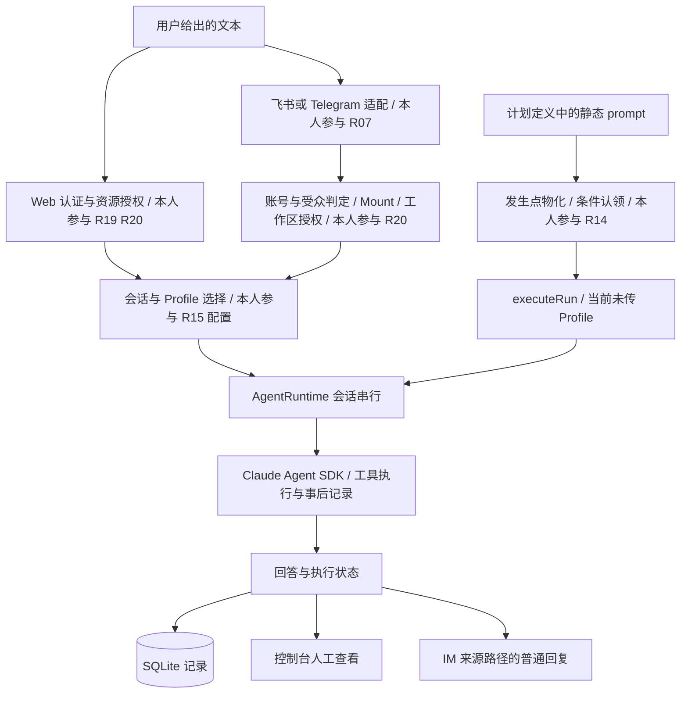

# Clawtide：同一种运营文本，从两个入口进入服务

> 2026-09-19 复审主线。实现快照：`Bluuok/Clawtide@dde300313de851baa953f24f6a0f8c75e9cacd3f`。[完整八模块、五组三档 STAR 与九阶段开发故事](修改/HappyClaw/HappyClaw-故事.md)用于深挖；本文把业务、执行与失败讲成一条连贯主线。[本轮审计](修改/复审-2026-09-19/README.md)记录当前归属与验证口径，2026-09-18 记录保留为历史。

## M1 · 事实与职责

【项目整体架构】自托管数字员工工作站，支持 Web、IM 与计划任务入口。Claude Agent SDK 负责模型—工具循环；应用层管理会话、配置、任务状态和资源归属。

【本人实际参与／用户确认复现】我基于 HappyClaw 参考架构，围绕 R14、R15、R07、R20、R19 五个选点复现并实现 Clawtide 的应用层能力，归属记为 `user_attested_reproduction`。SDK 与上游基础能力保留来源，不认领为独立原创。【演示设计】跨境电商运营用于组织样例；【待确认】真实部署、模型/IM 联调、业务效果和实际开发时间线。实现归属与运行验证分开记录，下文技术结果指机制和代码产物。

## M2 · 贯穿全篇的任务

输入是用户手工提供的一段运营事项：一笔发货延迟、一项库存数量待核实、一条客户问题待回复。输出是待确认事项、建议和信息缺口，不自动退款、补货、改价或通知客户。

【演示设计】先在 Web 或 IM 发送该文本；再把同一段静态文本放进计划任务的 `prompt`，观察按计划生成的执行记录。**定时触发没有自动获得当天的新数据**；没有业务 Adapter，就只能演示“定时处理已给出的文本”，不能称作实时库存监控或动态日报。

使用[演示输入](修改/HappyClaw/fixtures/运营简报-演示输入.md)和[待执行验收清单](修改/HappyClaw/fixtures/演示验收清单.md)。这些文件是样例，不是已完成运行证据。

## M3 · 链路与参数差异

图中“本人参与”依据用户确认的五点复现范围；Claude Agent SDK 是依赖。图是功能分工，不是所有输出都会同时发送到所有地方。定时 notification 当前写任务日志，不能从图中推断自动可靠投递到 IM。

| 入口 | 身份/资源依据 | 配置与会话 | 输出与限制 |
|---|---|---|---|
| Web | 登录用户及工作区归属 | 已绑定或默认 Profile，按实际路径选择 | 聊天事件与记录 |
| IM | senderId 做受众判定；账号拥有者做工作区授权 | Mount 与 Session；绑定 Profile 需有权访问 | 普通回复；发送失败只日志 |
| 定时 | task/workspace 与执行回调 | group 复用、isolated 新建；当前未传 Profile | run 状态与日志；无失租取消闭环 |

相同执行函数只是接缝复用，不是三入口配置一致的证据。特别是 IM 的发送者、渠道账号拥有者、工作区所有者和 Web 登录者不是同一个概念。

## M4 · 五条技术主张如何服务这个任务

### R14 · 调度：先区分发生点与执行

同一计划点被扫描多次，应识别为同一 occurrence；worker 的认领则是另一个状态问题。唯一键与条件 UPDATE 分别处理这两件事，owner/token 用于参与校验的状态更新。更简单的内存锁无法表达持久化发生点；更复杂的多活体系在当前证据下也没有必要包装成已完成。

恢复有两条路径：常规 pump 的 candidates 不扫描 running，因此不会认领过期未启动行；服务启动已调用 recoverOnStart，将符合条件的 running 未启动行释放为 retry_wait。已启动的过期行被标记失败，不自动重做。启动恢复存在，但不等于多实例安全接管。【源码推演】续租失败只停心跳并写日志，没有取消执行器，旧 worker 的外部请求仍可能继续。当前结果是数据库发生点和状态管理，外部动作幂等、完整故障实验与手动再次运行的限制另行验收。

### R15 · Profile：管理配置，不代替授权

局部改动应保持未提交的段，显式空值才清空。创建 Schema 的默认空值不能直接成为 PATCH 的更新值。快照与恢复新版本提供内容历史；恢复范围是四段文本，不是所有配置字段。草稿短语只确认这次发布意图，普通 CRUD 另有入口。

**修正旧联动稿的说法：**Prompt 文本完全可以做 diff；“展示改了什么”和“确认是否执行”是互补步骤，确认短语不能替代差异展示。确认、授权和原子提交也不是同一件事。

### R07 · IM：统一对象，保留不同能力

适配器把账号、发送者和会话定位交给核心；账号/渠道、受众、Mount 与工作区检查在运行前完成。两个真实 SDK 适配与五个骨架分开。连接建立、一次模型往返、可恢复投递应分别验收，不能把一个通过推给全部。

### R20 · 授权：区分动作与请求者

读取、修改、删除是三种动作函数，各自返回 allow/deny。管理员无工作区所有权旁路，Home 禁删。IM 默认装配为 everyone，普通非 Owner 消息可以继续；这不等于把该发送者认证为工作区 Owner。保留命令尚未实现，拒绝分支不执行。

### R19 · 认证：不让模型判断登录身份

Cookie 携带随机 token 与 HMAC 签名，签名验证后仍查 DB 会话。登录计数按账号＋IP、跨 IP 账号累计两层处理，均在进程内。它为管理入口提供身份依据，不证明分布式限流、工具级权限或 OS 隔离。

## M5 · 一段可以口述的主故事

> Clawtide 是我基于 HappyClaw 参考架构、围绕五个选点复现并实现的个人数字员工工作站。我以跨境电商运营事项整理作为演示场景：用户提供订单延迟、库存待核实和客户待回复的文本，通过 Web 或 IM 获得整理建议，也可以把同类静态文本放进定时任务。围绕这个过程，我实现了五层应用能力：调度先物化发生点，再条件认领和记录结果；Profile 支持分段修改与历史恢复；IM 适配保留账号、发送者和会话信息；工作区按资源归属和操作授权；Web 入口用签名、有效会话及登录计数建立身份依据。模型与工具循环使用 Claude Agent SDK。五点共同支撑工作站，但保证各有边界：当前定时入口未注入 Profile，失租还没有中止执行器；飞书和 Telegram 有 SDK 适配，其余渠道是骨架。我能逐点解释实现和失败分支，实际联调结果按运行记录说明。

30 秒讲输入、五点职责和机制产物；90 秒使用上段；3 分钟选择一个选点讲清目标、行动、取舍和失败边界。五点均有本人确认的实现归属，每点的三档连续 STAR 见[完整故事 M5](修改/HappyClaw/HappyClaw-故事.md)。运行记录用于证明具体测试与联调结果，不作为承认五点复现身份的前置门槛。

## M6 · 八轮审查与深挖

| 主问 | 再追问 | 结论 |
|---|---|---|
| 业务数据哪里来？ | 定时会更新库存吗？ | 手工文本；没有 Adapter 不更新 |
| 为什么先物化？ | lease 与唯一键一样吗？ | 发生点与状态持有权分开；启动恢复与常规 pump 分开 |
| 失租会停止吗？ | 外部动作谁去重？ | 当前取消未接线，下游无通用保证 |
| 四段配置解决什么？ | 为什么不做 Prompt diff？ | 局部编辑；diff 与确认互补 |
| 所有编辑都审批吗？ | 发布失败如何回退？ | CRUD 另路；confirmed/publish 非原子窗口 |
| IM 谁是请求者？ | everyone 下是谁授权？ | sender 做准入，账号拥有者做资源授权 |
| 留痕能限制工具吗？ | 哪个执行前拦截？ | PostToolUse 是事后记录，不冒充硬策略 |
| 五点具体负责什么？ | 哪些结果实际运行过？ | 五点复现实现已由本人确认；运行结果按独立记录回答 |

[完整十五题 QA](修改/HappyClaw/HappyClaw-面试QA.md)保留架构、实现、取舍、失败和归属追问。本表是补充挑战，不是已举行八轮候选人口试。

## M7 · 与 Craft 的关系

ThreadCove 关注用户发起研究后的工具、子问题与保存；Clawtide 关注消息/计划怎样进入服务、配置怎样维护、资源属于谁。前者有父取消传播，后者的失租首先只是数据库状态问题。不能为了“从简单到复杂”的故事，把未确认的时间顺序和共用服务编出来。详见[跨项目联动](三项目联动-步6.md)。

## M8 · 复习与下一步

Profile 是声明配置，不是工作流引擎；确认短语是一次意图确认，不替代授权与原子发布；Trace 是记录，不是模型质量评测。SQLite 用于应用状态，不因用了数据库就成为 RAG。

[源码导航](修改/HappyClaw/evidence/源码导航.md) · [原有待补验证](修改/HappyClaw/HappyClaw-源码口径与待补验证.md) · [本轮逐步复审](修改/复审-2026-09-19/README.md)。完整故事按技能保留八模块，并展开九阶段方法论；运行待验证项不升级为已完成结果。
