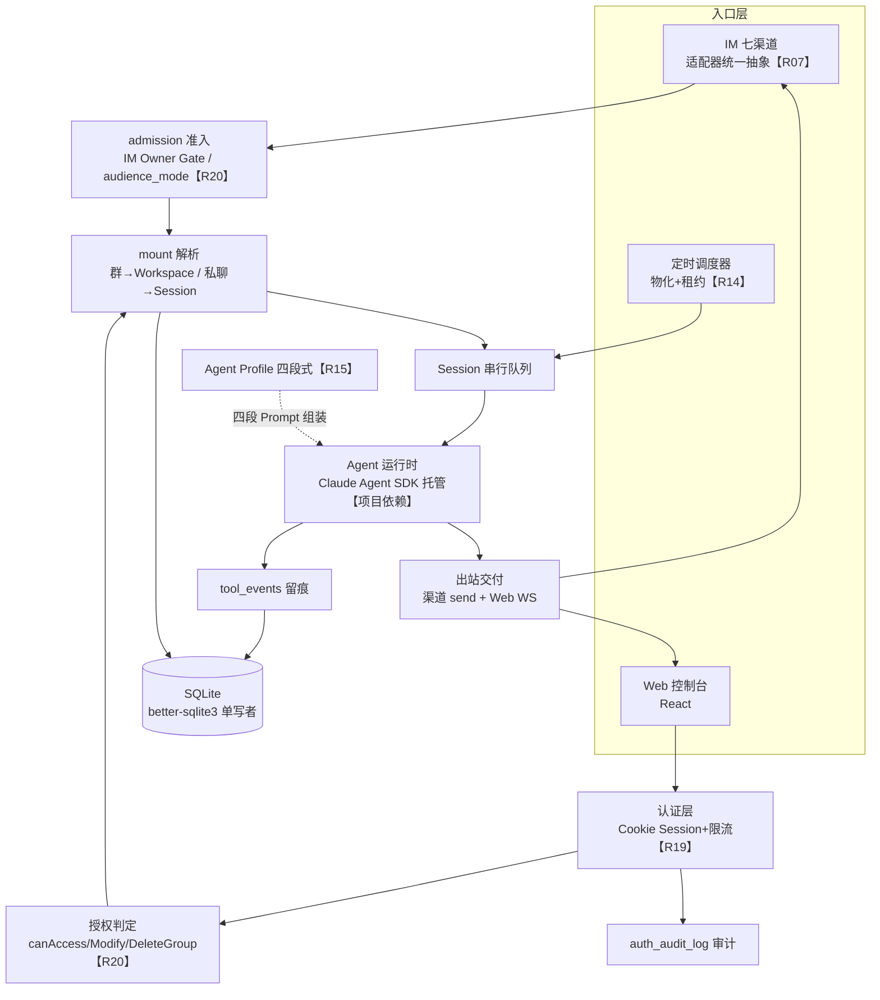

# HappyClaw 项目故事包（面试版 · 八模块骨架 + 九阶段织入）

> 生成：2026-08-30｜依据：`HappyClaw-定稿.md`（口径唯一真相源）+ `HappyClaw-复现文档.md`（机制与测试事实）+ `三项目联动-步6.md`（联动素材）+ skill workflow.md Step 1c / story-methodology.md。
> **结构说明**：按 skill Step 1c 八模块组织；story-methodology 九阶段开发故事主线织入各模块（落点见下表）；文末另附一段连贯「开发故事主线」口述稿。

## 九阶段 × 模块落点交叉表

| 方法论阶段 | 落点 |
| --- | --- |
| 0 问题定义与设计哲学 | M1 事实卡 · M2 业务故事 |
| 1 核心架构决策（骨架） | M3 骨架选型表 · 架构走读 |
| 2 能力分层 | M3 架构图 · M8 速查 |
| 3 逐模块开发顺序与动因 | M5 开发顺序时间线 |
| 4 关键设计决策与反例 | M4 各点第③问 why-not |
| 5 评测与迭代闭环 | M4「评测与迭代闭环」小节 |
| 6 安全与治理 | M4「安全与治理」小节 |
| 7 踩坑与失败恢复 | M4 各点第⑤问失败恢复 |
| 8 落地与演进 | M1 能力边界表 · M7 多项目联动 |

## 真实性标签图例

- 【本人实际参与】：R 点与简历材料支撑的内容——本项目全部自研模块均属此类（个人独立开发）。
- 【项目整体架构】：R 点描述的系统能力，讲机制时用，不等于个人职责声明。
- 【待确认】：材料里没有的细节（起止时间、部署形态），需本人回填。
- 【前沿认知】：方法论认知，项目未实现（LLM 裁判、pass^k 等）。
- 【项目依赖】：第三方（Claude Agent SDK、grammY、飞书 SDK、better-sqlite3 等）。

## 红线（全程生效）

1. 效果全定性，不编造任何指标/数字/百分比/用户量/日期/团队/业务反馈/真实客户。
2. 世界观头罩（全场第一句）：这是**我个人开发的自托管平台**，平台支持多用户多角色的产品形态，跨境电商客服运营是**我给自己配的演示垂直场景**——任何「谁在用」的问题先回这句。
3. Scope Boundary：R19 只管 Web 接入层用户认证（问题槽写「未认证进入」不写「未授权」）；R20 只管授权矩阵；多用户=设计目标口径；无 RAG；「七渠道」=接入覆盖非七份完整对等功能。
4. 未实现不写成已实现；R25 评测底座已换出，评测只保留轻量业务 Review+典型 Case 回归两个轻动作。
5. 执行循环=Claude Agent SDK 托管；不认领框架内部实现。
6. 口述纪律：内部引注（R 编号/防线编号/文件名）只进脑子不进嘴；HappyClaw 的 R 编号与 MiniCode/Craft 各自独立互不映射。

---

## M1 · 项目事实卡（阶段 0 + 阶段 8）

| 字段 | 内容 | 标签 |
| --- | --- | --- |
| 项目名称 | HappyClaw（复现工程名自定） | 【本人实际参与】【待确认：最终仓库名】 |
| 业务用户 | 平台形态上支持多用户多角色；实际使用者=本人部署自用 | 【本人实际参与】 |
| 原工作流与痛点 | 跨境客服/运营的重复动作（巡检/提醒/播报）靠人工按时做、跨时区易漏；客户咨询散落多个 IM 渠道；机器人人设靠散写 prompt 一改就跑偏；管理后台登录裸奔；多人共用工作区权限无分级 | 【本人实际参与】（演示场景与通用痛点） |
| 项目目标 | 把数字员工的人设治理、IM 与定时双入口值守、认证授权与权限保障做成可控、可运行、可信赖的自托管 AI 应用 | 【本人实际参与】 |
| 系统输入 | IM 消息（七渠道）；定时任务（cron/interval/once）；Web 后台操作（登录/配置/人设/权限） | 【本人实际参与】 |
| 核心流程 | 三入口（IM/定时/Web）→ 准入（Owner Gate/audience_mode/认证）→ mount 解析 → 会话串行队列 → Agent SDK 运行 → 出站交付（Web WS+渠道 send），全程留痕 | 【项目整体架构】 |
| 系统输出 | 渠道回复与主动播报；Web 控制台（chat/配置/人设/任务/审计）；tool_events 调用轨迹；auth_audit_log | 【项目整体架构】 |
| 我的实际职责 | 全部自研模块的设计与实现（个人独立开发）；执行循环由 Claude Agent SDK 托管，我在其上做治理与留痕两层 | 【本人实际参与】【项目依赖】 |
| 协作边界 | 无团队——单人开发；「跨境电商」是演示垂直场景，没有真实客户与业务反馈 | 【本人实际参与】 |
| 已知技术与事实 | TypeScript strict / Node≥20 ESM / Hono / better-sqlite3（单写者）/ ws / React 19 / Claude Agent SDK 锁版 / bcrypt(12)+node:crypto；核心表结构与租约 SQL 均已对照参考实现核实 | 【本人实际参与】【项目依赖】 |
| 已知风险/例外 | R14/R20 是 Medium-High 超档点（源码补课带读）；R19 token 自洽链是最致命雷（§5-12 必背）；跨账号密码喷洒是限流盲区（演进方向） | 【本人实际参与】 |
| 已知结果 | 定性：五点机制各自带必备测试（租约竞争双分支/权限矩阵全组合/篡改签名拒绝/限流窗口/确认短语 403 等）；Vitest+CI；ACL-MATRIX 文档 | 【本人实际参与】 |
| 待确认 | 真实起止时间、部署形态细节（部署在哪台机器、跑了多久） | 【待确认】 |

### 能力边界表（阶段 8 · 落地与演进）

| 层级 | 内容 |
| --- | --- |
| 已实现（五点 MUST/MUST-lite） | 七渠道统一抽象（Telegram/飞书真连+五渠道骨架契约测试）；物化调度+SQLite 租约互斥全保真；四段 Profile（append/replace+版本+两阶段确认短语）；Cookie 认证链全保真（bcrypt→token→HMAC→常量时间比较→双名 Cookie→双层限流→审计）；RBAC 三态+admin 无旁路+Owner Gate |
| 理解可扩展（OPTIONAL） | 邀请码注册；AI 局部优化润色；斜杠命令集/流式卡片/Inbox-Outbox 状态机 |
| 前沿认知（未实现） | LLM 裁判/pass^k/基准集（评测方法论）；CSRF token/登录后重生成 session（Web 安全第二层）；分布式限流/验证码；reassign owner 完整机制/对象级授权/运行时多租户硬隔离 |
| 明确不做 | RAG/向量库/任何记忆系统；评测底座；Docker 容器沙箱与第三个 runner 包；MCP 管理/Skills 市场；工具级强制策略引擎（声明式治理+留痕替代）；Provider 负载均衡 |

---

## M2 · 业务故事（阶段 0 展开）

**数字员工的双入口值守是什么日常**：一个数字员工在 IM 里被客户和同事问（被动入口），也要按时主动干活——每天早上异常巡检、库存和汇率到阈值就提醒、定时播报日报（主动入口）。管理后台是配置渠道、人设、权限的入口。

**原来怎么工作、为什么低效/有风险**：客户咨询散落在飞书、WhatsApp、Telegram 等渠道，逐渠道接 SDK，Agent 核心被消息格式、附件、会话模型的差异灌满，加一个渠道伤筋动骨；重复性运营动作靠人盯表按时执行，跨时区易漏做迟做，起多副本部署后同一任务又被重复执行；人设靠散装 prompt，改一句行为跑偏一片、改动即生效没有安全网；后台登录 Cookie 可伪造、接口可被爆破；多角色共用工作区时读/改/删无分级、admin 权限过大无制衡。

**项目改变什么（定性）**：七渠道统一抽象——Agent 核心只面向统一消息模型，新渠道收敛为适配器级改动；物化调度+租约互斥——定时值守安全调度、多实例不重复执行；四段式 Profile——人设结构化、修改走两阶段确认；认证链——后台登录加固+限流防护；三态授权+Owner Gate——读/改/删分级、admin 不旁路所有权、IM 侧身份比对。

**成功长什么样（定性）**：一个 WhatsApp 咨询进来数字员工能回、一个 cron 巡检到点自己跑且两个副本只有一个赢、改人设必须逐字回复确认短语才生效、爆破登录触发双层限流、任何人（含 admin）删不了别人的工作区。

**业务闭环走读（输入→处理→输出→反馈）**：一条 IM 消息到达 → 渠道适配器产出统一消息模型 → 准入层（IM Owner Gate 比对发送者身份/audience_mode 裁决）→ mount 解析（群→工作区、私聊→会话）→ 进入会话串行队列 → Agent SDK 运行（流式产出，工具调用逐笔写 tool_events）→ 出站交付（渠道 send+Web WS 同步）→ 反馈：出站失败有投递状态跟踪，行为变化可沿轨迹归因到具体改动（Profile 版本历史）。

**我的角色与边界**：个人独立开发；跨境电商是我给自己配的演示场景——面试永远这么讲，不编客户、不编业务反馈。

---

## M3 · 架构与数据流（阶段 1 骨架 + 阶段 2 分层）

> 个人项目：图中自研模块均为【本人实际参与·个人独立开发】；Claude Agent SDK 为【项目依赖】——执行循环由 SDK 托管，SDK 托管部分以使用与观测为主；渠道 SDK（grammY/飞书 SDK）同为依赖。

### 输入/输出/状态/异常表

| 维度 | 内容 |
| --- | --- |
| 输入 | IM 消息（统一消息模型：channel/conversation/senderId/text/attachments）；定时任务定义（schedule_type/cron_expr/interval/once）；Web 请求（Cookie 认证） |
| 处理 | 准入（Owner Gate/audience_mode）→ mount 解析 → 串行队列 → SDK 运行（Profile 四段组装系统提示）→ 出站交付；定时侧 pump→物化→租约认领→同一路径 |
| 输出 | 渠道回复/主动播报；Web 流式渲染；tool_events 轨迹；auth_audit_log 审计 |
| 状态 | task_runs 状态机（queued/retry_wait/running/success/failed/missed/cancelled）+租约三字段；Profile 版本历史不可变；user_sessions 会话表 |
| 异常 | 租约过期未开始→可被抢；已开始→判 failed 不复活；心跳续租失败→停工；签名篡改→拒绝；限流触发→审计记录；Owner Gate 不匹配→拒执行且不回执；legacy 归属反解不出→默认拒绝 |

### 骨架选型对比表（阶段 1）

| 决策 | 选了什么 | 放弃了什么 | 为什么 |
| --- | --- | --- | --- |
| HTTP/WS | Hono + 原生 ws（HTTP Upgrade 握手） | Express/Socket.io | 路由族清晰、WS 层可控（流式与重连都在这层） |
| 存储 | better-sqlite3（同步驱动、单连接） | ORM/Redis/Postgres | **单写者是租约互斥原子性的论证地基**；db.ts 唯一入口；自托管部署面最小 |
| Agent 运行 | Node 进程内 SDK，不建容器 runner 包 | Docker 沙箱第三包 | 容器是未选点——引一堆答不住的容器问题；进程内+治理层足够 |
| 认证 | 自写 bcrypt→token→HMAC→比较→Cookie 链 | passport/JWT 库 | 链路自己写才讲得清；JWT 撤销难，opaque token+会话表在自托管场景更可控 |

### 架构走读（一段话）

一条客户咨询从 WhatsApp 进来：渠道适配器把它变成统一消息模型，准入层先比对发送者与工作区绑定的 owner 身份（不匹配就静默拒掉、不回执防探测），mount 解析发现这是某个工作区绑定的群聊，消息排进该会话的串行队列；轮到它时，运行时按当前 Profile 的四段 prompt 组装系统提示，Claude Agent SDK 托管执行循环，期间每次工具调用的入参出参都写进留痕表；产出的回复一路双写——回渠道、推 Web 控制台。同一时间，另一个副本上的调度器也想跑「早上九点的巡检」：两个实例都去抢同一条物化记录的租约，条件更新只让一个赢，另一个继续扫下一条——「宁可错过，不可重复」。

---

## M4 · 技术故事（逐点五问；阶段 4/5/6/7 织入）

> 按 bullet 顺序 R07→R14→R15→R19→R20 展开。

### R07 · 七渠道统一抽象

1. **业务问题**：跨境电商客户咨询散落在飞书、WhatsApp、Telegram 等多个 IM 渠道，逐渠道对接 SDK 使 Agent 核心耦合渠道差异，每扩展一个渠道都要改造一遍接入代码。
2. **机制链**：统一消息模型（conversation{kind,jid,threadId}/senderId/text/attachments）+适配器注册表；**能力矩阵驱动降级**——每个渠道声明式上报能力（媒体收发/话题线程/长消息分片/流式卡片…），上层按能力矩阵决定行为，渠道特有降级在适配器层显式处理（Telegram 4096 长消息分片是样例；微信能力矩阵 supportsGroup=false 对应 iLink 仅 P2P 的真实限制）；真连两渠道（Telegram grammY 长轮询/飞书官方 SDK WebSocket），其余五渠道适配器骨架+契约测试（mock 传输层：真实 payload fixture→断言产出标准统一消息）；mount 解析（群→Workspace、私聊→Session、原生话题→独立 Session）。必备测试：七渠道契约测试各一组（含微信能力断言）、mount 解析表驱动、同序列化键消息保序。
3. **why-not**：为什么不假装「七渠道功能完全一致」？——各渠道能力本就不齐（微信 iLink 仅 P2P、WhatsApp 有风控），按公共能力设计接口、特有能力显式暴露比假装一致诚实且可防守。为什么不照抄参考仓库的文件切分？——统一接口是我显式设计的主张（「设计了 IMChannel 统一接口」），能力矩阵字段自己定，README 写清「统一抽象+能力差异显式声明」。
4. **边界**：接入层解耦——不含消息寻址路由深水区（JID 寻址未选点）；企微/Slack 等未覆盖渠道走外置桥接非原生；「七渠道」指接入覆盖，不是七份完整对等功能。
5. **失败与恢复**：骨架渠道靠契约测试兜底（传输层 mock，不真连也能验证收发映射正确）；能力矩阵让不支持的形态在适配器层显式降级而不是运行时炸。

### R14 · Occurrence Materialization 定时调度器

1. **业务问题**：异常巡检、库存与汇率提醒等重复性动作依赖人工按时执行、跨时区易漏做迟做；自托管部署多副本时定时任务重复执行与并发竞争。
2. **机制链**：**物化**——到期先生成 task_runs 行（occurrence_key 如 taskId:时间 ISO，UNIQUE 约束保证「该跑的一次」只落一条记录），执行只是消费记录，backfill 变扫表、互斥变成对记录抢租约；**认领=条件更新**——UPDATE 带 WHERE（queued/retry_wait 到期，或 running 且租约过期且 started_at 为空），`changes()>0` 者赢（SQLite 单写者保证原子；SELECT 只找候选不参与裁决）；**lease_token 自增整数**——认领+1、完成/判失败再+1 作废一切旧持有者；**心跳续租**——条件更新延长租期，续租失败立刻停工（🔧 租期 10 分钟、心跳≈租期/3，报自己的取值）；**不可重入=两条 SQL 分支**——过期未开始可被抢重跑、过期已开始判 failed 不复活；重启恢复（错过周期的记 missed 推进、once 补跑）；执行与通知分离各有租约（通知失败只重试通知不重跑任务）；pump 循环+防重入布尔。必备测试：同轮次两次认领只有一个赢家、持锁中第二次认领落空、双分支过期、心跳失锁、occurrence_key 幂等、interval<60 被 CHECK 拒、重启恢复。
3. **why-not**：为什么不用分布式锁？——自托管场景部署面小，DB 租约足够且可审计。为什么不直接执行+运行时去重？——直接执行模式下补跑和去重都要运行时猜；物化把「该跑的一次」落成记录，确定性来自数据而不是代码自觉。为什么不引 Redis？——多一个常驻组件就多一片运维追问面，单写者 SQLite 已保证原子。
4. **边界**：最小粒度 60s（粒度决定 DB 写频率，巡检/播报分钟级足够）；长任务撞自身间隔按不可重入语义跳过本轮；调度器解决「什么时候做什么」，不解决「做得好不好」。
5. **失败与恢复**：租约过期的两个分支就是失败恢复的落点——认领了没开跑的可被接管；真跑了一半实例挂了，重启后判 failed 不复活（宁可错过不可重复），错过周期记 missed 并推进计划。

### R15 · Agent Profile 四段式 Prompt

1. **业务问题**：数字员工人设依赖散装 Prompt、缺乏结构化约束、修改无安全确认导致单次改动引发行为失控。
2. **机制链**：IDENTITY/SOUL/AGENTS/TOOLS 四段正交（我是谁/价值观底线/工作规则/工具策略）独立列存储、改一段不动其他段；append/replace 双模式实现于组装层——最终系统提示=[平台固定引导段]⊕profile 四段，replace 只替换可编辑槽位、**平台段永远在最前任何模式都覆盖不掉**（「平台运行时指令不可清除」的代码落点）；版本历史不可变（恢复=写入新版本号）；is_default 部分唯一索引（每人只一个激活默认）；**两阶段 AI 辅助+确认短语**——AI 起草存草稿不生效，用户逐字回复确认短语才发布；发布通道约束是结构性的：Web 必须携带 Cookie 认证中间件解析的会话、IM 必须是入站 admission 链解析的交互会话，**API 不接受调用方自报的 source 字段**，定时任务/子代理等无会话上下文的调用一律 403。必备测试：replace 平台段保护、append 段序、版本恢复产生新版本、is_default 索引冲突、短语不符/过期拒绝、伪造型用例（请求体自带 source 字段）403。
3. **why-not**：AGENTS 段为什么不做成可执行编排引擎？——它是声明性工作规则；可控性来自结构化+审批流，不是假装能编程。为什么单用户也要确认短语？——Agent 不应能未经确认不可逆地修改自己的核心资产，对话里顺手改坏人设的风险与用户数无关。为什么不引 RAG 存规则知识？——知识靠上下文窗口+工具调用（交底口径已备）。
4. **边界**：无 RAG/知识库；技能自动进化未实现（演进方向）；append 累积冗余、replace 易误删——双模式是给不同改动类型的安全档位。
5. **失败与恢复**：短语不符或草稿过期→拒绝发布作废重来；无认证上下文的发布调用（含伪造 source 字段）→403；版本历史不可变→改坏了能回滚到任一历史版本（恢复=新版本写入）。

### R19 · 认证与会话管理

1. **业务问题**：管理后台是配置渠道、人设与权限的入口，登录会话 Cookie 可伪造、登录接口可被爆破导致后台被**未认证**进入。
2. **机制链（单条自洽链，按顺序背）**：bcrypt rounds=12 存密码 → 服务端 `randomBytes(32)` 生成 64 字符 hex **opaque token** 存会话表（30 天）→ 对 token 做 **HMAC-SHA256 签名**作防篡改兜底（Cookie 值=token.sig）→ 校验时拆分、sig 长度必须 64、重算 HMAC、`timingSafeEqual` **常量时间比较**（位置在 HMAC 签名校验步，不是数据库查找）→ **双名 Cookie**（HTTPS 下 `__Host-` 前缀带 Secure；本地 HTTP 退普通名——因为 `__Host-` 强制 Secure）+HttpOnly/SameSite=Strict/Path → **双层限流**：第一层 per-(用户名+IP)、第二层全局 per-用户名（阈值=第一层×4、1 小时固定窗），登录成功只清第一层、全局层故意留到 TTL 自然过期（防借成功登录重置全局计数）→ auth_audit_log 记登录成败/限流。密钥管理：env→0600 持久文件→首次自动生成；轮换=换 key+清会话表全体重登（干净操作）。配套：渠道凭据 AES-256-GCM 加密列、API 对他人资源返回 404。必备测试：篡改签名拒、sig 非 64 拒、未签名旧 Cookie 默认拒收、伪造 `__Host-` 名非 HTTPS 不生效、fake timers 驱动限流窗口边界、Cookie 属性快照。
3. **why-not**：opaque token 和 HMAC 是不是两个并列方案？——**不是**：随机 id 不可预测、有会话表可即时吊销；HMAC 只是防篡改兜底（防有人拼一个不存在的 id 撞会话查找）。各司其职，别讲成二选一。为什么不用 JWT？——自包含但撤销难；服务端会话表在自托管场景可控。为什么 CSFR token 没上？——Web 安全第二层（CSRF/登录后重生成 session）是演进方向：个人自托管后台无并发、无敏感资金操作，先把「你是谁」这层做扎实（SameSite=Strict 是**已有**的，别说「未上」）。
4. **边界**：Scope=Web 接入层用户认证，非 Agent 运行时身份；IM 侧「谁能触发数字员工」走 Owner Gate（R20）——认证与授权分属两层不得混谈。
5. **失败与恢复**：签名篡改/长度不对→直接拒并落审计；限流触发→审计记录 event=rate_limited；密钥泄露→轮换 key+清会话表，一次干净操作恢复安全态。

### R20 · RBAC 三态 + IM Owner Gate

1. **业务问题**：面向多角色共用工作区的授权治理中访问/修改/删除权限无分级规则、管理员权限过大缺乏制衡导致越权操作难防范。
2. **机制链**：**三态函数组** canAccessGroup/canModifyGroup/canDeleteGroup——判定输入是{用户 id, role}×资源{jid, is_home, folder, created_by}：home 组仅 owner 可见可改且**任何人不可删**；IM 组 created_by 命中即放行；legacy 行 created_by 为空→用同 folder 兄弟 home 组反解归属，解不出→**默认拒绝**；Web 组 created_by 相等。**admin 无旁路是结构性事实**——三函数签名收了 role 参数但逻辑完全不使用它（admin 只用于另一道独立闸：Host 执行权限，与所有权判定两套不混）。**IM Owner Gate 判定链**——消息到达→取渠道原生发送者 ID→与工作区绑定渠道账号时写入的 owner_im_id 比对→不匹配拒执行**且不回执（防探测）**；跨渠道身份不归一（按渠道账号各自绑定）。**资源隐藏**：跨 owner 操作一律 404 而非 403（与 R19 共用中间件行为）。必备测试：roles×资源形态×操作全组合矩阵、**显式断言 admin 访问别人组为 false**、legacy 反解成败两分支、Gate 静默拒、Home 删除被任何人拒绝。
3. **why-not**：为什么不做超级管理员模型？——分权模型牺牲 admin 便利换归属确定性；admin 天然绕过一切的话，工作区所有者的数据归属就是空话。分权会不会造成没人管的黑洞？——配套受控所有权转移路径（恢复场景走 reassign owner 而非天然旁路；转移机制完整实现是演进方向）。为什么 IM 授权不走 Web 登录身份？——触发主体是 IM 消息，按渠道身份匹配才对得上「谁在说话」。
4. **边界**：本层职责=授权矩阵（准入级判定）；对象级（行内资源）授权与运行时多租户硬隔离是演进方向；多用户=设计目标口径（授权模型单实例可运行、测试模拟多角色越权验证到工作区/角色级）。
5. **失败与恢复**：legacy 归属反解不出→默认拒绝（deny by default 写在代码里）；Owner Gate 不匹配→静默拒不回执（让探测者拿不到任何信号）。

### 评测与迭代闭环（阶段 5）

- **两个轻动作（用户指示定版）**：典型 Case 回归（改动人设/工具后跑几个代表用例对齐预期——可以是一张 markdown 用例表）+轻量业务 Review（上线前人工过一遍关键业务流程）。不做成代码系统、不进简历。
- **每机制自带验证**：R14 并发用例（认领竞争/双分支过期）、R15 replace 平台段不可清除、R20 越权矩阵用例、R19 篡改与限流窗口——「可信赖」的底气=安全双支柱+留痕+自带验证。
- **诚实交底**：LLM 裁判/pass^k/任务成功率是【前沿认知】，未实现无实测数据；论文数字永不进 bullet。

### 安全与治理（阶段 6）

- **认证（你是谁）**：R19 单条自洽链+密钥 0600+审计日志+Cookie 三属性（HttpOnly/Secure/SameSite=Strict——SameSite 是已有）。
- **授权（你能做什么）**：R20 三态矩阵+admin 结构性无旁路+Owner Gate 静默拒+404 隐藏资源。
- **留痕**：工具调用 tool_events 逐笔入参出参（副作用可追溯）；auth_audit_log 登录轨迹。
- **凭据**：渠道凭据 AES-256-GCM 加密列、主密钥文件 0600、API 只回「已配置与否」不回明文；日志脱敏（token/密钥绝不入日志）。
- **限流说准**：真实双层=「同 IP 定点爆破+换 IP 续爆同一账号」；跨账号密码喷洒是盲区（与分布式限流同一演进方向出口）。

---

## M5 · 我的 STAR 故事

### 开发顺序时间线（阶段 3 · 动因从依赖推断，日期【待确认】）

| 顺序 | 模块 | 进场动因 | 解决什么 | 留下什么边界 |
| --- | --- | --- | --- | --- |
| 1 | 地基（DB/迁移框架/SDK 会话运行/串行队列） | 没有存储与运行底座一切免谈 | 迁移协议+单写者地基+流式会话跑通 | 单写者成为后续租约原子性的论证地基 |
| 2 | R19 认证 | 最独立：后台是所有配置的入口，先锁门 | bcrypt→token→HMAC→比较→Cookie→限流→审计 | 只管 Web 认证；IM 授权留给授权层 |
| 3 | R15 Profile | 数字员工核心资产要有结构化与安全网 | 四段正交+双模式+两阶段确认短语 | 声明性规则非编排引擎；无 RAG |
| 4 | R20 权限 | 多角色形态的归属与分级 | 三态+admin 无旁路+Owner Gate | 准入级授权；对象级/运行时隔离=演进方向 |
| 5 | R14 调度 | 主动入口：起多副本后重复执行 | 物化+租约互斥+心跳+恢复 | 60s 下限；不可重入宁可错过 |
| 6 | R07 渠道接入 | 横切：被动入口的渠道面 | 统一抽象+能力矩阵+真连二渠道 | 接入层解耦；JID 寻址深水区不碰 |

### 五条 STAR（30 秒电梯版 + 90 秒标准版 + 3 分钟深挖指引）

**R07 · 多渠道统一入口**
- 30 秒：「跨境电商客户咨询散落在飞书、WhatsApp、Telegram 等渠道，逐渠道接 SDK 让 Agent 核心耦合渠道差异、加渠道就伤筋动骨。我基于适配器模式设计了 IMChannel 统一接口——七渠道统一抽象与统一收发接口，Agent 核心不感知渠道差异、新渠道收敛为适配器级改动。」
- 90 秒：30 秒版+能力矩阵驱动降级（微信 iLink 仅 P2P、WhatsApp 有风控——特有能力显式暴露不假装一致）+真连两渠道/骨架五渠道契约测试。
- 3 分钟：90 秒版 → M4-R07+防线「七渠道」口径（接入覆盖非对等功能）。
- 第一人称：「接口、能力矩阵、注册表、两个真连适配器和五个骨架都是我写的；各渠道 SDK 只是依赖。」
- 【待确认】：实际验证过的渠道以真实情况为准（建议 Telegram/飞书）。

**R14 · 定时主动入口**
- 30 秒：「巡检、库存汇率提醒这些重复动作靠人工按时执行，跨时区易漏；自托管起多副本后定时任务又会被重复执行。我基于租约互斥与不可重入调度设计了物化调度器——先把『该跑的一次』物化成记录再消费执行，SQLite 租约互斥保证同轮次只有一个实例跑，实现了定时值守的安全调度与多实例互斥。」
- 90 秒：30 秒版+占锁 HOW（条件更新受影响行数定赢家）+lease_token 自增双保险+心跳续租+两条过期分支。
- 3 分钟：90 秒版 → M4-R14+防线 lease HOW 层（§5-6）与多实例口径（§5-2）。
- 第一人称：「物化表结构、认领 SQL、心跳、恢复逻辑全是我写的；『多实例』是自托管部署的通用可用性需求，按这个形态设计并验证。」
- 【待确认】：无关键悬空。

**R15 · 数字员工核心**
- 30 秒：「数字员工人设靠散装 prompt，缺结构化约束、改一句跑偏一片、改动即生效无安全网。我基于四段正交 Prompt 工程设计了 Agent Profile——IDENTITY/SOUL/AGENTS/TOOLS 四段独立配置、append/replace 双模式、两阶段 AI 辅助加确认短语安全流程，实现了人设的可控管理与一致行为。」
- 90 秒：30 秒版+平台段不可清除的组装层实现+确认短语是跨轮安全令牌（单用户也成立）+AGENTS 段=声明性规则非编排引擎。
- 3 分钟：90 秒版 → M4-R15+发布通道结构性约束（403 用例）。
- 第一人称：「四段存储、版本历史、草稿与短语校验、Prompt 组装全是我写的。」
- 【待确认】：无。

**R19 · 后台登录认证**
- 30 秒：「管理后台是配置渠道、人设、权限的入口，登录 Cookie 可伪造、接口可被爆破。我基于 HMAC 签名与双层限流设计了 Cookie Session 认证体系——随机 token 存会话表、HMAC 防篡改兜底、常量时间比较防时序攻击、`__Host-` Secure Cookie、per-IP 加 per-username 双层限流，实现了认证加固与爆破防护。」
- 90 秒：30 秒版按**单条自洽链**顺序展开+密钥管理与轮换（换 key+清会话表）+Cookie 三属性已带。
- 3 分钟：90 秒版 → M4-R19+防线 §5-12（最致命雷：别把 HMAC 和 opaque 当并列方案）。
- 第一人称：「认证链每个环节都是我手写的，没用 passport/JWT——链路自己写才讲得清。」
- 【待确认】：无。

**R20 · 权限治理**
- 30 秒：「多角色共用工作区时读改删没有分级规则、admin 权限过大无制衡。我基于 RBAC 三态模型与渠道身份匹配设计了权限体系——access/modify/delete 三态分离、admin 不自动 bypass 工作区所有权、IM 侧 Owner Gate 渠道身份比对，实现了读改删分级管控可落地与工作区数据归属清晰。」
- 90 秒：30 秒版+admin 无旁路的代码证据（role 参数收而不用）+Owner Gate 判定链（静默拒防探测）+404 隐藏资源。
- 3 分钟：90 秒版 → M4-R20+防线 §5-4/§5-5。
- 第一人称：「三态判定函数、Owner Gate、资源隐藏中间件全是我写的——admin 旁路在代码结构上就不存在。」
- 【待确认】：无。

---

## M6 · 追问树（10 轮 × ≥2 层）

**第 1 轮 · 世界观真实度**
- 主问：「这平台真有人用吗？多用户是不是编的？」
- 二层：「服务了几个租户？」「为什么简历敢写多用户？」
- 简答（头罩）：「这是我个人开发的自托管平台——平台支持多用户多角色的产品形态，跨境客服运营是我给自己配的演示场景。」
- 展开：「多用户是设计目标：授权模型单实例就能跑，我用测试用例模拟多角色越权验证到了工作区/角色级；运行时多租户硬隔离是平台化后的演进方向。」
- 诚实答：绝不暗示有企业在用；这是叙事题，诚实+不心虚即可。

**第 2 轮 · 认证授权分界**
- 主问：「认证和授权你怎么分的？」
- 二层：「IM 里谁都能触发数字员工吗？」「运行时身份管不管？」
- 简答：「认证管『你是谁』（Web 后台登录），授权管『你能做什么』（工作区读写删矩阵+IM Owner Gate）——分属两层，合起来才是完整访问控制。」
- 展开：IM 侧触发走渠道身份比对不走 Web 登录，因为触发主体是 IM 消息；Agent 运行时身份是另一层（未选点），R19 不碰。
- 诚实答：「别把我这块说成安全大而全——我做的是这两道闸。」

**第 3 轮 · 租约 HOW 层**
- 主问：「两个实例同时抢任务，怎么保证只有一个赢？」
- 二层：「SQL 层面怎么做到原子？」「lease_token 为什么要自增？」
- 简答：「条件更新+租期判断：UPDATE 带租约过期条件，受影响行数定赢家——SQLite 单写者保证原子。」
- 展开：SELECT 只找候选不参与裁决；lease_token 认领+1、终结再+1，旧持有者即使活着也写不进去；心跳续租防没跑完被抢，续租失败立刻停工。
- 诚实答：「极端时钟漂移压测没做——原理我讲得清，并发用例在测试套件里验证过。」

**第 4 轮 · Owner Gate 判定链**
- 主问：「IM 侧怎么判定谁有权限触发？」
- 二层：「比对失败之后呢？回错误吗？」「owner 身份从哪来？」
- 简答：「消息到达→取渠道原生发送者 ID→与工作区绑定的 owner_im_id 比对→不匹配拒执行**且不回执**。」
- 展开：不回执是防探测——让试探者拿不到任何信号；owner_im_id 在工作区绑定渠道账号时写入；破坏性命令还有清单+原生 sender 双重约束。
- 诚实答：「跨渠道身份归一没做——同一人跨渠道按渠道账号各自绑定，那是身份系统的课题。」

**第 5 轮 · admin 接管**
- 主问：「admin 不能碰数据，工作区主人失联了谁接管？」
- 二层：「转移机制实现了吗？」「会不会有没人管的黑洞？」
- 简答：「分权的配套是受控所有权转移路径（reassign owner），恢复场景走受控转移而非天然旁路。」
- 展开：「当前实现的是准入级三态判断+初始 owner 绑定；转移机制的完整实现是演进方向。」
- 诚实答：不硬撑「已经实现转移」——按边界答。

**第 6 轮 · Web 安全第二层**
- 主问：「CSRF、session fixation 这些防了吗？」
- 二层：「SameSite 呢？」「分布式限流呢？」
- 简答：「基础 Cookie 三属性已带齐——HttpOnly、Secure、SameSite=Strict；我先解决『你是谁』这一层。」
- 展开：「CSRF token 与登录后重生成 session 是我认知里的第二层，演进方向——个人自托管后台无并发、无敏感资金操作，所以没上；分布式限流、验证码同理。」
- 诚实答：「把没做明说成边界，不说成忘了。」

**第 7 轮 · 多实例真实性**
- 主问：「你真开过很多实例测吗？」
- 二层：「怎么验证互斥的？」
- 简答：「多实例是自托管部署的通用可用性需求——用户为可用性起多副本是真场景，我按这个通用形态设计并验证。」
- 展开：互斥靠 DB 条件更新非应用锁；并发用例在测试套件里验证（同轮次双认领单赢家/持锁二认领落空/双分支过期）。
- 诚实答：「绝不说『我自己开了很多实例玩』。」

**第 8 轮 · 评测真实性**
- 主问：「你凭什么叫『可信赖』？有数据吗？」
- 二层：「LLM 裁判试过吗？」
- 简答：「评测我不做成底座，只保留两个轻动作——典型 Case 回归+轻量业务 Review。」
- 展开：「可信赖=安全双支柱（认证+授权）+全链路留痕（副作用可追溯）+每个机制自带验证（并发用例/越权用例/篡改用例）。」
- 诚实答：「LLM 裁判/pass^k 是前沿认知，未实现、无实测数据——论文数字我只当作认知储备。」

**第 9 轮 · RAG 缺口**
- 主问：「客服不都要知识库吗？你为什么没有 RAG？」
- 二层：「那语义模糊的问题怎么办？」
- 简答：「确定性数据（订单/库存/政策）我用工具调用读 DB/API——有证据链、结论可追溯，不交给模型幻觉。」
- 展开：「语义模糊的开放问答才是向量检索的主场，那是我理解的演进方向（分块/embedding/检索增强），未实现。取舍核心是我重视结论可追溯。」
- 诚实答：「这是场景取舍不是能力缺口——但需要时我知道怎么补。」

**第 10 轮 · React 悬空**
- 主问：「技术栈里写 React，前端做了什么？」
- 二层：「组件封装细节讲一个？」
- 简答：「前端重心是实时状态而非样式：消息流虚拟化长列表、流式输出渲染、断线指数退避重连三件。」
- 展开：围绕「数字员工值守」的实时性诉求组织前端，不做重型组件库叙事。
- 诚实答：「追前端工程细节就承认重心在服务端与机制层。」

---

## M7 · 多项目联动

### 能力演进时间线（本段新增能力）

> MiniCode（实习）=「一个 Agent 怎么干活且可控」；Craft=「一个 Agent 工程怎么扩展、怎么不崩」；**HappyClaw 这一段新增**：IM 七渠道统一入口（适配器）、定时主动值守（物化调度+租约互斥）、人设四段式治理（确认短语）、后台登录认证（Cookie Session+防爆破）、RBAC 分权（三态+admin 不 bypass+Owner Gate）——「一个 Agent 怎么对多角色、可治理、可信任」。【本人实际参与·个人独立开发】

### 方法复用线（本项目的腿）

- **复用线 A（别让 Agent 无限膨胀）**：MiniCode 受控读取（分页/上限）→ **HappyClaw：SDK 托管循环里工具调用留痕——受控可追溯**。口语版：「第一个项目我发现它读文件没节制，给读取上了限制；第三个项目工具是 SDK 提供的，我要管的是每次调用留没留痕、副作用能不能查。」
- **复用线 B（工具：契约→接入→治理）**：MiniCode 自建工具手写契约 → Craft 统一转换接入 → **HappyClaw：SDK 托管工具做 Profile TOOLS 段声明式治理+调用全链路留痕**。口语版：「第三个项目工具干脆是 SDK 给的，我要管的变成『怎么管住它』——哪些能用、每次调用留没留痕。」
- **复用线 C（不可逆变更须人确认）**：MiniCode 写文件出 diff → Craft 工具执行前权限请求 → **HappyClaw：人设修改用跨轮确认短语**（对象是抽象的身份/规则资产，没有自然 diff→用安全令牌）。备答：「diff 能不能用在人设上？硬做就是贴前后两整段 prompt，信息量很低，不如确认短语直接。」

### 本项目视角三分钟段落（联动稿第三段）

> 「第三段是 HappyClaw，难在『Agent 要成为产品，怎么对多角色、可治理、可信任』。我做七渠道统一入口（适配器）、定时主动值守（物化调度+租约互斥）、人设四段式治理（确认短语）、后台登录认证（Cookie Session+防爆破）、RBAC 分权（admin 不自动 bypass 所有权+IM Owner Gate）。教训：多角色产品里，身份和边界必须一进平台就锁死——认证管『你是谁』，授权管『你能做什么』，两者合起来才是可信赖。」

### 交叉追问（≥10 轮，两行体）

1. 「跨境电商数字员工，有真实客户吗？」→（N1 头罩）「我个人开发的自托管平台，跨境客服运营是我给自己配的演示场景；多用户是设计目标，验证到工作区/角色级。」
2. 「三个项目共用了一套底子吧？」→「零共享：第一个项目自己写循环、第三个循环是 SDK 托管的；带走的是方法论，代码一行没带。」
3. 「你就是把 Claude Code 复述了三遍？」→「范式共通，属于我的是每个项目里的取舍——比如 admin 为什么不 bypass、HMAC 为什么和 opaque token 不冲突。」
4. 「三套 R 编号是一套体系吗？」→「内部标签不是体系——同号不同物比比皆是，面试讲实质不讲编号。」
5. 「开源框架做了执行循环，你的增量在哪？」→（N2）「框架管通用执行；我的增量是治理（TOOLS 段声明式策略）和评判（调用留痕、行为变化可归因）两层。」
6. 「Craft 和 HappyClaw 都讲工程质量，差别？」→「Craft 锁数据契约与呈现边界；HappyClaw 锁行为边界与数据归属——一个防『改崩』，一个防『乱动』。」
7. 「确认机制三个项目都不一样，为什么？」→「原则一条（不可逆变更由人确认），对象三种：文件 diff、工具权限请求、人设确认短语——形态随对象变。」
8. 「实习参与和个人独写，信哪个？」→「互补不互贬：实习证明把子系统做扎实，个人项目证明端到端判断力。」
9. 「最不满意哪个？重做改什么？」→（N3）「HappyClaw——重做会先把『认证 vs 授权』的分界想清楚再动手：这次是做到一半才意识到是两层。顺带：第一个项目的双份 Schema 漂移风险当时就知道，没做单一事实源是优先级取舍，现在会改。」
10. 「一句话总结三段？」→「从跑通到工程化再到可治理、可信任——岗位要的全链路，三个切面各做一段。」
11. 「数字员工和聊天机器人差在哪？」→「值守与治理：双入口（消息+定时）、结构化人设、权限与审计——机器人是会话，数字员工是带身份边界和留痕的长期运行体。」

> 红线：三项目非同源——只连能力成长，绝不共享代码库/服务/模型/接口。

---

## M8 · 技术速查表

| 概念 | 朴素类比 | 严格定义 | 在我项目哪里 |
| --- | --- | --- | --- |
| 适配器模式（IMChannel） | 万国插座转换头 | 渠道差异止步于适配器，核心只面向统一消息模型 | im-channel.ts + channels/* |
| 能力矩阵 | 每个渠道的能力清单卡 | 声明式上报（媒体/话题/分片…），上层按能力降级 | 渠道能力声明+契约测试 |
| Occurrence Materialization | 先挂号再看病 | 到期先把「该跑的一次」物化成记录，执行只是消费记录 | task_runs + occurrence_key UNIQUE |
| 租约互斥 | 带租期的门禁卡 | lease_owner/lease_token/lease_expires_at 三字段，条件更新定赢家 | db.ts 认领 SQL |
| lease_token | 门禁卡编号，进门领新的 | 自增整数：认领+1、终结再+1，作废一切旧持有者 | 认领/失败分支 |
| 不可重入 | 宁可错过这班，不挤同一般车 | 过期未开始可被抢；已开始判 failed 不复活 | 两条 SQL 分支+测试 |
| 四段正交 Prompt | 身份证/底线/守则/工具箱四个抽屉 | IDENTITY/SOUL/AGENTS/TOOLS 独立存取互不污染 | agent_profiles 四列 |
| append/replace | 贴便签 vs 换新页 | 组装层语义：平台段永远最前不可覆盖 | prompt-plan.ts |
| 确认短语 | 跨轮安全口令 | AI 起草→用户逐字回复短语才发布；无会话上下文调用 403 | profile_drafts + 通道约束 |
| opaque token | 不能从外形猜内容的门牌号 | randomBytes 随机 id 存服务端会话表，可即时吊销 | user_sessions |
| HMAC | 给门牌号加防伪封条 | HMAC-SHA256(secret, token) 防篡改兜底（非并列方案） | auth.ts |
| 常量时间比较 | 全程匀速检查，不给时序提示 | timingSafeEqual 防时序侧信道；位置=HMAC 校验步 | auth.ts:74 |
| `__Host-` Cookie | 只在 HTTPS+精确域名下生效的名字 | 前缀强制 Secure；本地 HTTP 退双名策略 | config.ts 双名 |
| 双层限流 | 单点盯防+全账号监控 | per-(用户名+IP) + 全局 per-用户名（4×/1h）；成功只清第一层 | auth.ts:126-231 |
| RBAC 三态 | 看/动/扔三种权限分开判 | canAccess/Modify/DeleteGroup 分离判定 | rbac.ts |
| IM Owner Gate | 群门口核对工牌 | 原生发送者 ID 比对 owner_im_id，不匹配静默拒 | owner-gate.ts |
| owner_im_id | 工作区绑定的老板工牌号 | 工作区绑定渠道账号时写入 | channel_accounts |
| tool_events 留痕 | 每次动手都记工作日志 | 工具调用入参/出参逐笔入库，副作用可追溯 | tool_events 表 |
| Audience Mode | 场子对谁开放 | everyone/owner_only 两态准入 | admission 链 |
| mount 解析 | 快递按地址分拣 | 群→Workspace、私聊→Session、原生线程→独立 Session | channel-mounts.ts |

### 边界对照精选

| 边界 | 一句话 |
| --- | --- |
| 认证 vs 授权 | R19 证明「你是谁」，R20 判定「你能做什么」——两层不混谈 |
| 数字员工 vs 聊天机器人 | 双入口值守+结构化人设+权限审计=长期运行的可治理体，不是一问一答 |
| 声明式治理 vs 强制策略引擎 | 我做 TOOLS 段声明+留痕；JS 层 allow/deny 白名单可被绕过，属半成品比缺失更危险 |
| 准入级 vs 对象级授权 | 我实现工作区/角色级判定；行内资源对象级是演进方向 |
| 调度器 vs 质量保障 | 调度器解决「什么时候做什么」；「做得好不好」走轻量 Review+典型 Case 回归 |

---

## 开发故事主线（口述稿 · 第一人称 · 约 780 字）

> 口述纪律：不带任何内部编号与文件名；被追问再进对应模块。

这个项目的想法来自一个很朴素的问题：一个数字员工要长期替人值守，它得先是个「可控的东西」，才谈得上可信赖。跨境电商客服运营是我给自己配的演示场景——真正要解决的是通用的三件事：怎么接进来、怎么自己动、怎么管得住。

架构定得很克制：Hono 加原生 WebSocket、SQLite 单连接、Agent 的执行循环直接用 Claude 的 SDK 托管——我自己写循环不如把通用执行交给框架，我的精力放在框架不管的两层：治理和留痕。不建容器沙箱、不上 Redis，多一个常驻组件就多一片我答不住的追问面。

先做的反而是最独立的认证。管理后台是所有配置的入口，门没锁好后面全白搭。我把登录做成一条链：密码哈希、服务端生成随机会话号、再给会话号加一道防伪签名、比对时用匀速比较不给攻击者时序提示、Cookie 用最严格的前缀、外面再套两层限流——一层盯单点、一层盯全账号。中间我犯过一个表述错误，差点把「随机会话号」和「防伪签名」讲成两个竞争方案，后来想明白了它们各司其职：一个防猜、一个防拼。这道题让我把「为什么这么设计」想得比「怎么实现」还透。

然后是数字员工的核心资产——人设。我把散装 prompt 拆成四个互不污染的抽屉：身份、底线、工作规则、工具策略；改动不能立即生效，AI 先起草、人逐字回复一句确认口令才发布，而且发布通道是结构性的——没有登录会话或者不是真实对话上下文的调用，直接拒绝，谁自称是谁都没用。有一个反面教训在这里：一开始我想把工作规则做成能编排的引擎，后来收住了——声明式的规则加审批流，可控性已经够了，假装能编程只会带来答不住的追问。

权限是做到一半才想清楚的一课：我原把管理员当成万能的，后来意识到「管理员天然绕过一切」和「数据归属清晰」根本不能同时成立，于是把看、改、删拆成三个独立判断，管理员在自己的系统闸里，不碰所有权；IM 这边入口另设一道门，比对消息发送者和工作区绑定的身份，对不上就静默拒绝——连错误都不回，不给探测的人任何信号。

最后是定时值守，也是我最较真的一块：两个副本同时想跑同一个巡检，谁赢？我把「该跑的一次」先写成一条记录，执行变成消费记录，抢的是这条记录的租约——一条条件更新语句，谁改得动谁赢。租期、心跳、过期以后能不能重跑，全写在这几条 SQL 的分支里：宁可错过，不可重复。验证靠测试套件里的并发用例，我没有真开一堆实例去演，但机制的正确性是有用例背的。

现在回头看：能做的——多渠道接入收敛成适配器、定时值守多副本安全、人设改动有安全网、后台有认证、数据有归属。不能做的我也明说：评测我只留了典型用例回归和人工过流程两个轻动作，LLM 裁判那些是认知储备，没实现。如果继续演进，下一块是 Web 安全的第二层和对象级授权。这个项目教会我的是：Agent 变成产品的那天，最难的不是让它聪明，是让它每一件事都有身份、有边界、有记录。
