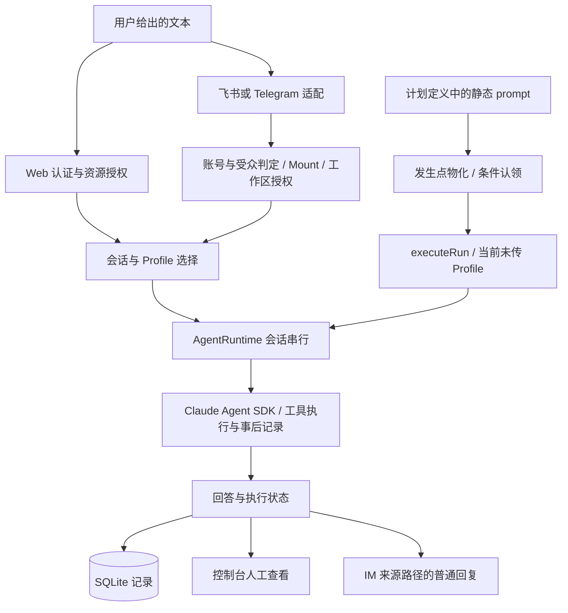

# Clawtide：同一种运营文本，从两个入口进入服务

> 2026-09-18 复审主线。实现快照：`Bluuok/Clawtide@dde300313de851baa953f24f6a0f8c75e9cacd3f`。保留[完整八模块、五组分层口述稿与九阶段索引](修改/HappyClaw/HappyClaw-故事.md)作为深挖资料；根目录本文负责把业务、执行与失败讲成一条连贯主线。

## M1 · 事实与职责

【项目整体架构】自托管数字员工工作站，支持 Web、IM 与计划任务入口。Claude Agent SDK 负责模型—工具循环；应用层管理会话、配置、任务状态和资源归属。

【本人实际参与／材料自述】这是个人项目；【演示设计】跨境电商运营仅用于组织样例；【待确认】逐模块个人改动、真实部署、实际模型与渠道联调记录。不会因为同一用户拥有仓库就把所有模块标成本人从零编写。

## M2 · 贯穿全篇的任务

输入是用户手工提供的一段运营事项：一笔发货延迟、一项库存数量待核实、一条客户问题待回复。输出是待确认事项、建议和信息缺口，不自动退款、补货、改价或通知客户。

【演示设计】先在 Web 或 IM 发送该文本；再把同一段静态文本放进计划任务的 `prompt`，观察按计划生成的执行记录。**定时触发没有自动获得当天的新数据**；没有业务 Adapter，就只能演示“定时处理已给出的文本”，不能称作实时库存监控或动态日报。

使用[演示输入](修改/HappyClaw/fixtures/运营简报-演示输入.md)和[待执行验收清单](修改/HappyClaw/fixtures/演示验收清单.md)。这些文件是样例，不是已完成运行证据。

## M3 · 链路与参数差异

图是功能分工，不是所有输出都会同时发送到所有地方。定时 notification 当前写任务日志，不能从图中推断自动可靠投递到 IM。

| 入口 | 身份/资源依据 | 配置与会话 | 输出与限制 |
|---|---|---|---|
| Web | 登录用户及工作区归属 | 已绑定或默认 Profile，按实际路径选择 | 聊天事件与记录 |
| IM | senderId 做受众判定；账号拥有者做工作区授权 | Mount 与 Session；绑定 Profile 需有权访问 | 普通回复；发送失败只日志 |
| 定时 | task/workspace 与执行回调 | group 复用、isolated 新建；当前未传 Profile | run 状态与日志；无失租取消闭环 |

相同执行函数只是接缝复用，不是三入口配置一致的证据。特别是 IM 的发送者、渠道账号拥有者、工作区所有者和 Web 登录者不是同一个概念。

## M4 · 五条技术主张如何服务这个任务

### R14 · 调度：先区分发生点与执行

同一计划点被扫描多次，应识别为同一 occurrence；worker 的认领则是另一个状态问题。唯一键与条件 UPDATE 分别处理这两件事，owner/token 用于参与校验的状态更新。更简单的内存锁无法表达持久化发生点；更复杂的多活体系在当前证据下也没有必要包装成已完成。

【源码推演】外部动作发出后，旧 worker 失去租约仍可能继续。当前失败续租只停心跳并写日志，没有把取消传给执行器。因此讲“数据库状态校验”，不讲“所有执行恰好一次”。完整 pump 恢复和手动再次运行的边界仍见待补清单。

### R15 · Profile：管理配置，不代替授权

局部改动应保持未提交的段，显式空值才清空。创建 Schema 的默认空值不能直接成为 PATCH 的更新值。快照与恢复新版本提供内容历史；恢复范围是四段文本，不是所有配置字段。草稿短语只确认这次发布意图，普通 CRUD 另有入口。

**修正旧联动稿的说法：**Prompt 文本完全可以做 diff；“展示改了什么”和“确认是否执行”是互补步骤，确认短语不能替代差异展示。确认、授权和原子提交也不是同一件事。

### R07 · IM：统一对象，保留不同能力

适配器把账号、发送者和会话定位交给核心；账号/渠道、受众、Mount 与工作区检查在运行前完成。两个真实 SDK 适配与五个骨架分开。连接建立、一次模型往返、可恢复投递应分别验收，不能把一个通过推给全部。

### R20 · 授权：区分动作与请求者

读取、修改、删除是三种动作函数，各自返回 allow/deny。管理员无工作区所有权旁路，Home 禁删。IM 默认装配为 everyone，普通非 Owner 消息可以继续；这不等于把该发送者认证为工作区 Owner。保留命令尚未实现，拒绝分支不执行。

### R19 · 认证：不让模型判断登录身份

Cookie 携带随机 token 与 HMAC 签名，签名验证后仍查 DB 会话。登录计数按账号＋IP、跨 IP 账号累计两层处理，均在进程内。它为管理入口提供身份依据，不证明分布式限流、工具级权限或 OS 隔离。

## M5 · 一段可以口述的主故事

> 我把 Clawtide 做成个人自托管工作站，想验证消息任务和计划任务怎样进入同一套服务。演示时，我手工提供一段运营事项，让它整理缺失信息和下一步建议，也可以把同样的文本放入定时任务。我的重点不是宣称接入了真实订单，而是让任务先有发生点和状态，配置可以局部维护，入口知道应该访问哪个工作区。调度用唯一键区分重复发生点，再用条件更新认领；Profile 保留分段内容和历史；IM 经过账号、挂载和资源检查后进入运行时。这样能展示输入、处理与结果状态。当前定时路径还没有装配 Profile，失租也没有真正中止执行器，所以我会把这些作为未闭环的接缝说明，而不会称它是生产级自动运营平台。

30 秒讲输入、发生点和结果；90 秒用上段并突出一个本人有 diff 的模块；3 分钟沿该模块的成功与失败分支读代码。五条各自的 30 秒、90 秒、源码展开和个人贡献接口见[完整故事 M5](修改/HappyClaw/HappyClaw-故事.md)。不用每讲一条都重复整段免责话。

## M6 · 八轮审查与深挖

| 主问 | 再追问 | 结论 |
|---|---|---|
| 业务数据哪里来？ | 定时会更新库存吗？ | 手工文本；没有 Adapter 不更新 |
| 为什么先物化？ | lease 与唯一键一样吗？ | 发生点与状态持有权分开 |
| 失租会停止吗？ | 外部动作谁去重？ | 当前取消未接线，下游无通用保证 |
| 四段配置解决什么？ | 为什么不做 Prompt diff？ | 局部编辑；diff 与确认互补 |
| 所有编辑都审批吗？ | 发布失败如何回退？ | CRUD 另路；confirmed/publish 非原子窗口 |
| IM 谁是请求者？ | everyone 下是谁授权？ | sender 做准入，账号拥有者做资源授权 |
| 留痕能限制工具吗？ | 哪个执行前拦截？ | PostToolUse 是事后记录，不冒充硬策略 |
| 验证结果在哪里？ | 哪一段本人修改？ | 展示真实运行记录与 diff，不以测试文件代通过 |

[完整十五题 QA](修改/HappyClaw/HappyClaw-面试QA.md)保留架构、实现、取舍、失败和归属追问。本表是补充挑战，不是已举行八轮候选人口试。

## M7 · 与 Craft 的关系

ThreadCove 关注用户发起研究后的工具、子问题与保存；Clawtide 关注消息/计划怎样进入服务、配置怎样维护、资源属于谁。前者有父取消传播，后者的失租首先只是数据库状态问题。不能为了“从简单到复杂”的故事，把未确认的时间顺序和共用服务编出来。详见[跨项目联动](三项目联动-步6.md)。

## M8 · 复习与下一步

Profile 是声明配置，不是工作流引擎；确认短语是一次意图确认，不替代授权与原子发布；Trace 是记录，不是模型质量评测。SQLite 用于应用状态，不因用了数据库就成为 RAG。

[源码导航](修改/HappyClaw/evidence/源码导航.md) · [十一项待补验证](修改/HappyClaw/HappyClaw-源码口径与待补验证.md) · [本轮逐步复审](修改/复审-2026-09-18/README.md)。旧八模块与九阶段方法仍保留，未完成能力不升级为个人成果。
