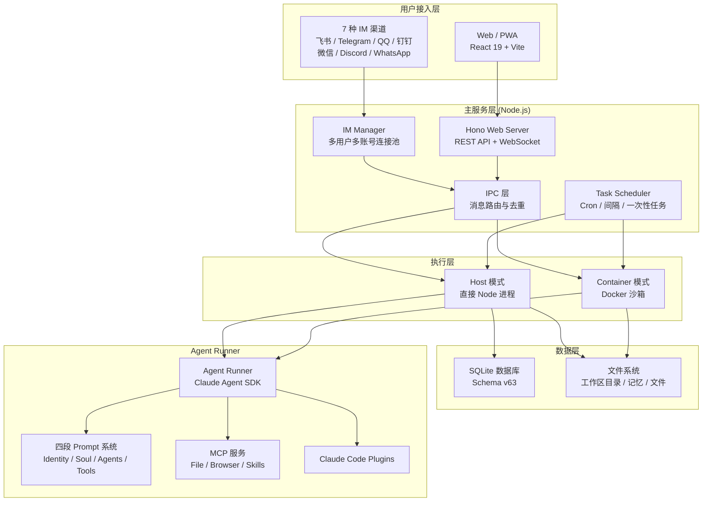

欢迎来到 HappyClaw 的文档。本文从第一性原理出发，回答两个最根本的问题：**HappyClaw 是什么**，以及**为什么需要它**。如果你是第一次接触这个项目，本文会帮你建立完整的认知框架，为后续的安装、配置和深度使用打下基础。

---

## HappyClaw 是什么

HappyClaw 是一个**自托管的、多用户的 AI Agent 工作台**。它把 [Anthropic Claude Agent SDK for TypeScript](https://github.com/anthropics/claude-agent-sdk-typescript) 封装成一个可持续运行的服务，让你和你的团队可以从**浏览器**和**7 种即时通讯渠道**（飞书、Telegram、QQ、钉钉、微信、Discord、WhatsApp）同时使用 Claude Code 的全部能力。

Sources: [README.md](README.md#L1-L20), [package.json](package.json#L2-L4)

### 一个关键区分

HappyClaw **不是一个简单的聊天 API 封装**。它是一个完整的 Agent 运行时平台：

- Agent 运行在真实的 Claude Code 环境中，可以直接读写项目文件、执行终端命令、使用浏览器、调用 MCP 服务、加载 Skills
- 多个独立工作区（Workspace）和会话（Session）之间保持清晰的权限与上下文边界
- 支持宿主机（Host）和 Docker 容器（Container）两种执行模式，分别面向管理员和普通成员

Sources: [README.md](README.md#L22-L30)

### 这样理解更直观

想象你有一个**7×24 小时在线的 Claude Code 开发者**，它驻留在你的服务器上，你可以：

| 场景 | HappyClaw 的做法 |
|------|-----------------|
| 在浏览器中 | 通过 Web 界面发送消息，实时看到流式输出和工具调用轨迹 |
| 在飞书群里 | @机器人 提问，它自动响应，甚至可以在话题中维护独立上下文 |
| 在 Telegram 上 | 私聊或群聊，和你的 Agent 对话 |
| 在 QQ / 钉钉 / 微信 / Discord / WhatsApp | 同样无缝接入 |
| 定时执行 | 设置 Cron 任务，每天自动运行代码审查或数据报告 |
| 多人协作 | 每个用户有自己的工作区、记忆、Skills 和 MCP 配置，彼此隔离 |

---

## 为什么需要 HappyClaw

### 问题：Claude Code 的局限性

Claude Code 本身是一个优秀的终端工具——你可以在终端中启动它，让它帮你写代码、调试、执行命令。但它的使用模式存在几个天然限制：

1. **单用户、单会话**——每次启动都是独立的，无法长期在线
2. **仅限终端**——无法从浏览器或 IM 工具访问
3. **无持久化状态**——对话历史、记忆、配置不会跨会话保留
4. **无权限体系**——谁都可以执行任何操作
5. **无定时任务**——不能按计划自动执行任务

Sources: [README.md](README.md#L27-L34)

### HappyClaw 的解决方案

HappyClaw 围绕 "Agent-first" 理念设计了完整的解决方案：

```text
Agent Profile（身份、四段 Prompt、能力策略）
└── Workspace（文件目录、执行模式、环境变量、渠道挂载）
    ├── Main Session（工作区主会话）
    ├── Runtime Session（独立对话或渠道原生话题）
    ├── Native Context Session（飞书话题等原生线程）
    └── Scheduled Run（定时任务的普通或隔离运行）
```

每一层解决一个具体问题：

- **Agent Profile** 是顶层身份。它定义了 Agent 的名字、个性、使命和可用工具。你可以创建多个 Agent（代码审查员、研究助手、运维机器人），每个拥有独立的 Prompt 和能力配置。
- **Workspace** 是文件与执行隔离边界。每个工作区有自己的目录、环境变量和项目上下文。不同的工作区互不干扰。
- **Runtime Session** 是工作区内的独立对话上下文。同一个工作区可以同时有多段对话，每段对话拥有独立的 Claude 会话状态。
- **Channel Mount** 把 IM 群聊或私聊挂载到具体的工作区或会话，实现跨渠道的统一接入。

Sources: [CLAUDE.md](CLAUDE.md#L27-L43), [docs/agent-first-architecture-plan.md](docs/agent-first-architecture-plan.md#L12-L38)

---

## 核心架构总览

下面这张图展示了 HappyClaw 的整体架构。如果你是第一次接触，建议先看文字说明，再回来看图。



### 架构层解读

| 层级 | 角色 | 核心技术 |
|------|------|---------|
| **用户接入层** | 入口多样性 | React 19、7 种 IM SDK |
| **主服务层** | 路由、编排、调度 | Hono 框架、WebSocket、SQLite |
| **执行层** | 安全隔离与资源管理 | Node 子进程、Docker 容器 |
| **Agent Runner** | 真正的 AI 执行引擎 | Claude Agent SDK、MCP 协议、四段 Prompt |

**关键设计决策**：HappyClaw 没有重新实现 Agent 循环和工具调用。它**直接使用 Anthropic 官方 SDK**，通过版本锁定的 `@anthropic-ai/claude-agent-sdk` 和 `@anthropic-ai/claude-code` 驱动 Agent 执行。这意味着任何 Claude Code 支持的能力（文件读写、终端命令、浏览器、MCP、Sub-agent）在 HappyClaw 中都可以使用。

Sources: [container/agent-runner/package.json](container/agent-runner/package.json#L1-L20), [container/Dockerfile](container/Dockerfile#L1-L30)

---

## 项目结构解读

了解代码布局有助于你快速定位所需内容：

```
happyclaw/
├── src/                          # 主服务后端 (154 个 TypeScript 模块)
│   ├── index.ts                  # 启动入口、消息消费、IPC 编排
│   ├── web.ts                    # Hono HTTP 服务、WebSocket、路由挂载
│   ├── db.ts                     # SQLite 数据库 (Schema v63, 12,000+ 行)
│   ├── container-runner.ts       # Host/Container 双模式执行引擎
│   ├── im-manager.ts             # 7 种 IM 渠道连接池管理
│   ├── task-scheduler.ts         # 定时任务调度器
│   ├── config.ts                 # 系统配置与环境变量
│   ├── routes/                   # Web API 路由 (19 个路由族)
│   ├── feishu.ts / telegram.ts / qq.ts / dingtalk.ts /
│       wechat.ts / discord.ts / whatsapp.ts  # 各渠道实现
│   └── ...                       # 能力治理、安全、计费等模块
├── web/                          # 前端 (React 19 + Vite + Tailwind CSS 4)
│   └── src/
│       ├── App.tsx               # 路由定义
│       ├── pages/                # 18 个页面组件
│       ├── components/           # 通用 UI 组件
│       └── stores/               # Zustand 状态管理
├── container/                    # Docker 容器运行时
│   ├── Dockerfile                # 基于 Node 22 slim，含 Chromium/工具链
│   ├── agent-runner/             # Agent Runner (SDK 执行器)
│   └── entrypoint.sh             # 容器入口脚本
├── config/                       # 系统配置文件
│   ├── mount-allowlist.json      # 目录挂载白名单
│   └── default-groups.json       # 默认工作区配置
├── scripts/                      # 工具脚本
│   ├── builtin-skill-catalog.mjs # 内置 Skills 版本管理
│   └── install-host-tools.sh     # 宿主工具安装
├── shared/                       # 共享类型定义
│   ├── stream-event.ts           # 实时事件流类型 (三方同步)
│   └── channel-prefixes.ts       # 渠道 JID 前缀常量
├── tests/                        # 290+ 个测试文件
│   └── e2e/                      # 端到端测试
└── docs/                         # 技术文档
    ├── API.md                    # Web API 参考
    └── ACL-MATRIX.md             # 权限矩阵
```

Sources: [CLAUDE.md](CLAUDE.md#L46-L108), [src/index.ts](src/index.ts#L1-L200)

### 关键数字

- **154** 个后端 TypeScript 模块
- **~19,700** 行 `src/index.ts`（主编排逻辑）
- **~12,700** 行 `src/db.ts`（数据库 Schema 与迁移）
- **290+** 个测试文件
- **Schema v63**（当前数据库版本）
- **7** 种支持的 IM 渠道
- **2** 种执行模式（Host / Container）

---

## 功能矩阵

HappyClaw 的功能覆盖从 Agent 管理到运维监控的完整生命周期：

| 模块 | 主要能力 | 文档索引 |
|------|---------|---------|
| **Agent** | 对话式创建/编辑、自定义 Agent、头像、四段 Prompt、AI 优化、版本历史与恢复 | [Agent Profile 设计](13-agent-profile-she-ji-yu-si-duan-shi-prompt-gong-cheng) |
| **工作区** | Agent 归属、双执行模式、独立目录、项目环境变量、项目上下文、多会话 | [Agent-First 三层模型](6-agent-first-san-ceng-mo-xing-agent-workspace-runtime-session) |
| **能力治理** | 用户 Skills、系统/用户 MCP、Claude Code Plugins、最终生效预览 | [Skills/MCP/Plugins 分层管理](14-skills-mcp-server-yu-claude-code-plugins-neng-li-fen-ceng-guan-li) |
| **消息渠道** | 7 种渠道、多账号、扫码登录、工作区/会话绑定、原生话题 | [多渠道接入](5-qu-dao-jie-ru-fei-shu-telegram-qq-ding-ding-wei-xin-discord-whatsapp-ji-cheng) |
| **模型提供商** | Anthropic 官方与兼容端点、多 Provider、轮询/加权/故障转移、会话粘性 | [Provider 配置](4-provider-pei-zhi-yu-duo-mo-xing-fu-zai-jun-heng) |
| **定时任务** | Cron、固定间隔、一次性任务、Agent/Script 执行、通知重试 | [定时任务调度器](12-ding-shi-ren-wu-diao-du-qi-cron-jian-ge-yu-ci-xing-ren-wu) |
| **记忆与文件** | 用户全局记忆、工作区记忆、日期记忆、全文搜索、文件上传下载 | 后端 `src/conversation-history.ts` |
| **用量与计费** | Token 分类统计、明细导出、订阅、余额、兑换码与配额 | [用量统计与计费](21-yong-liang-tong-ji-yu-ji-fei-xi-tong-she-ji) |
| **运维与安全** | RBAC、邀请注册、审计日志、运行监控、Docker 镜像管理、备份恢复 | [多租户安全隔离](22-duo-zu-hu-an-quan-ge-chi-host-zhi-xing-quan-xian-zi-yuan-ge-chi-yu-min-gan-cao-zuo-bao-hu) |
| **客户端体验** | 实时流式输出、工具轨迹、Markdown/Mermaid/KaTeX、PWA、响应式布局 | [前端架构](19-react-qian-duan-jia-gou-lu-you-zhuang-tai-guan-li-yu-zu-jian-shu) |

Sources: [README.md](README.md#L36-L57)

---

## 核心设计理念

### 1. Agent-first 产品模型

HappyClaw 的产品层级严格遵循 `Agent → Workspace → Runtime Session` 的三层模型：

- **Agent** 是顶层身份，拥有 Prompt、能力策略和版本管理
- **Workspace** 是执行隔离边界，包含文件目录、环境变量和渠道绑定
- **Runtime Session** 是对话上下文实例，在 Workspace 内创建

这与传统 "Chat Room" 模型有本质区别：**Agent 是长期存在的身份，不随对话结束而消失**。

Sources: [docs/agent-first-architecture-plan.md](docs/agent-first-architecture-plan.md#L12-L38)

### 2. 双模式执行

| 模式 | 适用对象 | 行为 |
|------|---------|------|
| **Host** | 管理员授权的宿主机工作区 | 直接在指定本机目录运行，适合已有代码仓库和本机工具链 |
| **Container** | 普通成员与需要隔离的工作区 | 在非 root Docker 容器中运行，使用独立工作目录和预装工具链 |

普通成员**不能**把容器工作区降级为宿主机执行。Script 定时任务也只允许管理员在有权限的 Host 工作区运行。

Sources: [CLAUDE.md](CLAUDE.md#L112-L128), [src/host-execution-policy.ts](src/host-execution-policy.ts#L1-L30)

### 3. 渠道与上下文分离

HappyClaw 的渠道系统设计遵循一个关键原则：**渠道是接入层，不影响 Agent 的核心逻辑**。这意味着：

- 同一个 Agent 可以同时通过 Web 和 7 种 IM 渠道访问
- 每条消息携带完整的 `ChannelTurnContext`，包含发送者、群聊、话题等元信息
- 工作区绑定只接受群聊，Runtime Session 绑定只接受私聊
- 飞书原生话题拥有独立的 Runtime Session，不会与其他话题混淆

Sources: [src/types.ts](src/types.ts#L53-L99), [CLAUDE.md](CLAUDE.md#L162-L200)

### 4. 四段 Prompt 工程

自定义 Agent 使用四段式 Prompt 结构，这与简单的 "系统提示词" 有本质区别：

| 段落 | 作用 | 是否可为空 |
|------|------|-----------|
| **IDENTITY** | 身份、使命和边界 | 否 |
| **SOUL** | 稳定价值观、判断原则和表达风格 | 是 |
| **AGENTS** | 工作流、输入输出、默认值、分支和失败处理 | 否 |
| **TOOLS** | Skill、MCP 和工具的选择方式与限制 | 是 |

运行时能力不是简单拼接文本，而是经过 `claude-context-resolver` 解析、Effective Skill/MCP Resolver 生成精确清单与 hash 后，再注入到 Agent 的上下文中。

Sources: [CLAUDE.md](CLAUDE.md#L132-L157)

---

## 技术栈总览

| 层次 | 技术选型 | 为什么选择 |
|------|---------|-----------|
| 运行时 | **Node.js 20+**（不使用 Bun） | WebSocket 握手兼容性要求 |
| 后端框架 | **Hono 4.x** | 轻量、TypeScript 优先、中间件生态 |
| 数据库 | **SQLite**（better-sqlite3） | 零运维、单文件部署、嵌入式迁移 |
| 前端 | **React 19 + Vite + Tailwind CSS 4** | 现代、高效、活跃生态 |
| 状态管理 | **Zustand** | 轻量、无 boilerplate |
| Agent SDK | **@anthropic-ai/claude-agent-sdk 0.3.x** | 官方版本锁定，确保兼容性 |
| 容器 | **Docker**（非 root 用户） | 安全隔离、可重现环境 |
| 类型系统 | **TypeScript 5.9** | 全栈类型安全 |
| 测试 | **Vitest** | 与 Vite 生态统一、高性能 |

Sources: [Makefile](Makefile#L7-L11), [package.json](package.json#L1-L30), [container/Dockerfile](container/Dockerfile#L1-L30)

---

## 为什么选择 HappyClaw

### 与其他方案的对比

| 维度 | HappyClaw | Claude Code CLI | 传统 Chat API Wrapper |
|------|-----------|----------------|---------------------|
| 运行模式 | 7×24 服务 | 单次终端会话 | 无状态 API 封装 |
| 多用户 | ✅ 完整 RBAC + 隔离 | ❌ 单用户 | ❌ 通常无 |
| 多渠道 | ✅ Web + 7 种 IM | ❌ 仅终端 | ❌ 通常仅 Web |
| 执行能力 | ✅ 完整 Claude Code 工具链 | ✅ 完整 | ❌ 仅文本对话 |
| 定时任务 | ✅ Cron/间隔/一次性 | ❌ | ❌ |
| 安全隔离 | ✅ Host/Container 双模式 | ❌ 本机权限 | ❌ 无 |
| 持久化记忆 | ✅ 全局/工作区/日期记忆 | ❌ 无 | ❌ 通常无 |
| 可自定义 Agent | ✅ 四段 Prompt + 能力策略 | ❌ 仅 CLI 参数 | ❌ 仅 system prompt |
| 自托管 | ✅ 完全控制数据和配置 | ❌ N/A | ✅ 但功能有限 |

### 适用场景

- **个人开发者**：需要一个 7×24 在线的 AI 编程助手，可以从手机 IM 询问代码问题
- **小团队**：共享一个 Agent 服务，每人拥有独立的工作区和记忆
- **开源项目维护者**：让 Agent 自动处理 Issue 分类、代码审查、文档生成
- **DevOps 团队**：设置定时任务自动执行部署检查、日志分析、报告生成
- **研究团队**：多个 Agent 协作，每个 Agent 负责不同的研究方向

---

## 如何阅读本文档

本文档按照**从入门到深入**的顺序组织：

### 入门路径（推荐新手）

1. **[概述：HappyClaw 是什么与为什么](1-gai-shu-happyclaw-shi-shi-yao-yu-wei-shi-yao)**（当前页）—— 你已经在这里
2. **[快速开始：从零搭建到首次对话](2-kuai-su-kai-shi-cong-ling-da-jian-dao-shou-ci-dui-hua)** —— 安装并体验第一个对话
3. **[系统要求与开发环境搭建](3-xi-tong-yao-qiu-yu-kai-fa-huan-jing-da-jian)** —— 确保环境就绪
4. **[Provider 配置与多模型负载均衡](4-provider-pei-zhi-yu-duo-mo-xing-fu-zai-jun-heng)** —— 配置 AI 模型
5. **[渠道接入](5-qu-dao-jie-ru-fei-shu-telegram-qq-ding-ding-wei-xin-discord-whatsapp-ji-cheng)** —— 连接 IM 渠道

### 深入路径（理解架构）

当你完成入门后，可以按以下顺序深入理解 HappyClaw 的设计：

- **核心架构**：从 [Agent-First 三层模型](6-agent-first-san-ceng-mo-xing-agent-workspace-runtime-session) 开始，理解产品层级
- **执行引擎**：阅读 [Agent Runner 执行引擎](7-agent-runner-zhi-xing-yin-qing-host-mo-shi-yu-container-mo-shi) 了解双模式运行
- **消息路由**：阅读 [多渠道 IM 系统架构](8-duo-qu-dao-im-xi-tong-jia-gou-yu-xiao-xi-lu-you) 了解消息如何流转
- **能力治理**：阅读 [Agent Profile 设计与四段式 Prompt 工程](13-agent-profile-she-ji-yu-si-duan-shi-prompt-gong-cheng) 了解如何创建自定义 Agent

---

## 下一步

现在你已经了解了 HappyClaw 是什么以及为什么需要它，我们建议你继续：

👉 **[快速开始：从零搭建到首次对话](2-kuai-su-kai-shi-cong-ling-da-jian-dao-shou-ci-dui-hua)** —— 跟随步骤安装并启动你的第一个 HappyClaw 实例

如果你已经熟悉了基本概念，也可以直接跳转到你感兴趣的章节：

- [Agent-First 三层模型：Agent → Workspace → Runtime Session](6-agent-first-san-ceng-mo-xing-agent-workspace-runtime-session)
- [多渠道 IM 系统架构与消息路由](8-duo-qu-dao-im-xi-tong-jia-gou-yu-xiao-xi-lu-you)
- [Skills、MCP Server 与 Claude Code Plugins 能力分层管理](14-skills-mcp-server-yu-claude-code-plugins-neng-li-fen-ceng-guan-li)