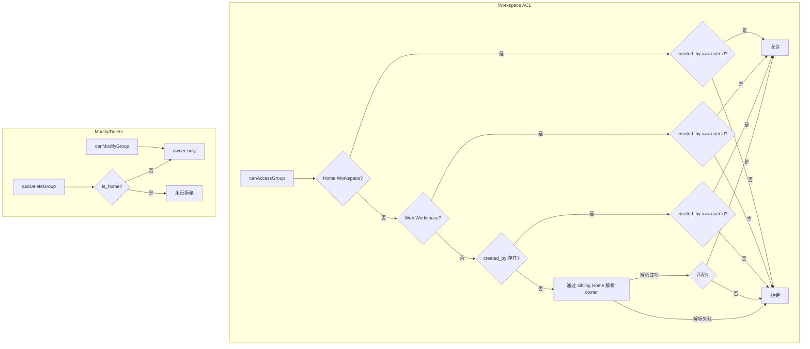

HappyClaw 的认证与授权体系由三个层次构成：**Cookie Session** 层负责用户身份验证与会话生命周期管理，**Permission Middleware** 层在 HTTP 请求路径上进行细粒度权限拦截，**ACL 权限矩阵** 层则深入到工作区、任务、跨群组通信和 IM 命令等资源级操作，确保每一层操作都经过合适的身份与权限校验。整个体系遵循"最小权限"和"资源隔离"原则——admin 角色不自动绕过工作区所有权，查不到的资源与无权访问的资源统一返回 404，防止跨用户枚举。

Sources: [src/auth.ts](src/auth.ts), [src/middleware/auth.ts](src/middleware/auth.ts), [src/permissions.ts](src/permissions.ts), [src/web-context.ts](src/web-context.ts), [docs/ACL-MATRIX.md](docs/ACL-MATRIX.md)

## 一、Cookie Session：无状态验证、HMAC 签名与平滑升级

### 会话令牌的生命周期

会话管理的核心位于 `src/auth.ts`。当用户登录成功时，系统通过 `crypto.randomBytes(32).toString('hex')` 生成一个 64 字符的十六进制随机令牌，该令牌作为 `session.id` 存入 SQLite 的 `user_sessions` 表，同时通过 `Set-Cookie` 响应头下发到浏览器。令牌的默认有效期是 **30 天**，由 `sessionExpiresAt()` 函数计算：

```typescript
export function sessionExpiresAt(): string {
  return new Date(Date.now() + 30 * 24 * 60 * 60 * 1000).toISOString();
}
```

在后续请求中，`authMiddleware` 从 Cookie 头中提取令牌，通过 `getCachedSessionWithUser()` 进行验证——该函数首先检查内存中的 Session 缓存（TTL 30 秒，避免每次请求都查询数据库），缓存未命中时回退到 SQLite 查询。

Sources: [src/auth.ts#L21-L36](src/auth.ts#L21-L36), [src/web-context.ts#L280-L310](src/web-context.ts#L280-L310), [src/routes/auth.ts#L280-L300](src/routes/auth.ts#L280-L300)

### HMAC-SHA256 签名防篡改

为了防止令牌在传输或存储中泄露后被冒用，系统对所有下发的 Session Cookie 进行 **HMAC-SHA256** 签名。签名密钥 `WEB_SESSION_SECRET` 的优先级为：环境变量 `WEB_SESSION_SECRET` > 持久化文件 `data/config/session-secret.key` > 自动生成随机密钥。

```mermaid
flowchart LR
    A[环境变量<br/>WEB_SESSION_SECRET] -->|优先| D[WEB_SESSION_SECRET]
    B[文件<br/>data/config/session-secret.key] -->|次优先| D
    C[自动生成<br/>crypto.randomBytes(32)] -->|最后| D
    D --> E[HMAC-SHA256<br/>signSessionToken]
    E --> F[token.signature]
    F --> G[Set-Cookie]
```

签名过程为 `signSessionToken(token)` 将原始令牌与 HMAC 摘要拼接为 `token.signature` 格式。验证时 `verifySessionToken(signedValue)` 使用 `crypto.timingSafeEqual` 进行常量时间比较，防止时序攻击。Cookie 名称按请求是否使用 HTTPS 动态选择：安全连接使用 `__Host-happyclaw_session`（带 `__Host-` 前缀要求 Secure、Path=/、无 Domain），非安全连接使用 `happyclaw_session`。

Sources: [src/config.ts#L50-L70](src/config.ts#L50-L70), [src/auth.ts#L38-L80](src/auth.ts#L38-L80)

### 遗留未签名 Cookie 的平滑升级

系统支持 **ALLOW_LEGACY_UNSIGNED_COOKIE** 开关以实现从旧版未签名 Cookie 到 HMAC 签名 Cookie 的平滑迁移。当该环境变量设为 `true` 时，`verifySessionToken` 会接受未签名的 64 字符十六进制令牌（与 `generateSessionToken` 格式一致），同时返回 `{ legacy: true }` 标记。`authMiddleware` 检测到该标记后，会自动在响应中注入新的签名 Cookie，实现透明升级，不会中断用户会话。默认情况下该开关为关闭状态，确保签名验证的防护效果。

Sources: [src/auth.ts#L82-L100](src/auth.ts#L82-L100), [src/middleware/auth.ts#L120-L130](src/middleware/auth.ts#L120-L130)

### 多 Cookie 值处理与迁移场景

在 Cookie 新旧交替的迁移窗口期，浏览器可能同时发送旧版和新版两个同名 Cookie。`getAllCookieValues()` 函数遍历原始 Cookie 头的所有值，收集指定名称的所有匹配项，然后 `tryVerifyAny()` 逐一尝试验证，接受第一个有效令牌。这种设计确保切换 Cookie 名称（如从 `happyclaw_session` 变为 `__Host-happyclaw_session`）时不会导致用户掉线。

Sources: [src/middleware/auth.ts#L25-L60](src/middleware/auth.ts#L25-L60)

### 密码哈希与登录限流

密码使用 **bcrypt** 算法，迭代轮数为 12 轮。登录限流采用双层策略：**per-IP** 限制（阈值由系统设置 `maxLoginAttempts` 控制，窗口为 `lockoutMinutes`）和 **per-Username 全局**限制（阈值为 per-IP 的 4 倍，窗口固定 1 小时）。全局限流防止分布式暴力破解，且成功登录后不清除全局计数器，避免攻击者通过已知 IP 登录来重置限流。注册成功同样计入限流，防止同一 IP 批量创建账号。

```typescript
// 双桶限流：per-IP + 全局 per-username
export function checkLoginRateLimit(username, ip, maxAttempts, lockoutMinutes) {
  const ipCheck = checkAttemptRecord(`${username}:${ip}`, maxAttempts, windowMs);
  if (!ipCheck.allowed) return ipCheck;
  const globalMax = maxAttempts * GLOBAL_USERNAME_MULTIPLIER; // 4x
  const globalCheck = checkAttemptRecord(`user:${username}`, globalMax, GLOBAL_USERNAME_WINDOW_MS);
  if (!globalCheck.allowed) return globalCheck;
  return { allowed: true };
}
```

Sources: [src/auth.ts#L120-L180](src/auth.ts#L120-L180), [src/auth.ts#L200-L242](src/auth.ts#L200-L242)

## 二、Permission Middleware：三层拦截体系

认证中间件体系位于 `src/middleware/auth.ts`，在 Hono 框架的请求管道中提供三层拦截能力。

### 第一层：authMiddleware — 身份验证

`authMiddleware` 是几乎所有 API 路由的入口守卫。它的执行顺序为：

1. **Cookie 提取**：从请求头中读取 Secure 和 Plain 两种 Cookie 名称的值
2. **令牌验证**：通过 `tryVerifyAny` 尝试解密并验证 HMAC 签名
3. **Session 数据加载**：从缓存或数据库获取完整的 `UserSessionWithUser` 对象（含用户 ID、角色、权限列表、强制改密码标记等）
4. **过期检查**：`isSessionExpired()` 比对数据库中的 `expires_at` 字段，过期则删除会话
5. **状态检查**：`disabled` 或 `deleted` 状态的账号返回 403
6. **用户注入**：将 `AuthUser` 对象设置到 `c.set('user', ...)`，后续 handler 可通过 `c.get('user')` 获取
7. **强制改密码拦截**：`must_change_password` 标记为 true 时，仅放行 `/api/auth/me`、`/api/auth/password`、`/api/auth/logout`、`/api/auth/profile` 和 `/api/auth/sessions` 等必要路由
8. **最后活跃时间更新**：以 5 分钟为间隔去写数据库，避免高频写入

```mermaid
flowchart TD
    A[HTTP Request] --> B{Cookie 存在?}
    B -->|否| C[401 Unauthorized]
    B -->|是| D{HMAC 签名验证}
    D -->|失败| C
    D -->|成功| E{Session 缓存命中?}
    E -->|否| F[查询 SQLite]
    F --> G{Session 有效?}
    G -->|过期/不存在| C
    G -->|有效| H{用户状态?}
    H -->|disabled/deleted| I[403 Forbidden]
    H -->|active| J{must_change_password?}
    J -->|是且非白名单路由| I
    J -->|否| K[注入 AuthUser 到 context]
    K --> L[更新 last_active_at<br/>5min 去写]
    L --> M[调用 next()]
```

Sources: [src/middleware/auth.ts#L65-L145](src/middleware/auth.ts#L65-L145)

### 第二层：requirePermission — 权限检查

`requirePermission(permission)` 是一个高阶中间件工厂，它在 `authMiddleware` 之后执行，从已经注入的 `AuthUser` 对象中提取权限列表，调用 `hasPermission()` 函数进行判断：

- **admin 角色**自动拥有所有权限，无需逐项检查
- **member 角色**必须在其 `permissions` 数组中包含目标权限

系统定义了 6 个细粒度权限：

| 权限名称 | 用途 | 对应中间件 |
|----------|------|-----------|
| `manage_system_config` | 管理 Provider、系统容量、注册策略、外观等 | `systemConfigMiddleware` |
| `manage_group_env` | 管理工作区环境变量 | `groupEnvMiddleware`（与 `manage_system_config` 二选一） |
| `manage_users` | 创建、禁用、恢复用户，修改角色与权限 | `usersManageMiddleware` |
| `manage_invites` | 管理邀请码 | `inviteManageMiddleware` |
| `view_audit_log` | 查看审计日志 | `auditViewMiddleware` |
| `manage_billing` | 管理计费 | Billing 中间件 |

`requireAnyPermission(permissions)` 则提供"或"的逻辑——用户只需拥有列表中的任意一个权限即可通过。

Sources: [src/middleware/auth.ts#L147-L180](src/middleware/auth.ts#L147-L180), [src/permissions.ts#L1-L60](src/permissions.ts#L1-L60)

### 第三层：adminRoleMiddleware — 角色硬边界

`adminRoleMiddleware` 直接检查 `user.role === 'admin'`，不依赖权限列表。这用于那些需要绝对角色隔离的操作，如 Host 执行模式、系统 MCP 写入等。它和 `requirePermission` 的区别在于：admin 角色是硬编码的，不可通过权限模板分配；而权限是细粒度的，可以通过模板组合赋予 member 角色。

Sources: [src/middleware/auth.ts#L170-L175](src/middleware/auth.ts#L170-L175)

## 三、ACL 权限矩阵：资源级访问控制

### 权限模板与角色默认值

权限管理通过 `permissions.ts` 中的模板系统提供预设配置，方便管理操作：

| 模板键 | 标签 | 角色 | 包含权限 |
|--------|------|------|---------|
| `admin_full` | 管理员（全权限） | admin | 全部 6 个权限 |
| `member_basic` | 普通成员（基础权限） | member | 无 |
| `ops_manager` | 运维管理员（配置+工作区环境） | member | `manage_system_config`, `manage_group_env` |
| `user_admin` | 用户管理员（用户+邀请码+审计） | member | `manage_users`, `manage_invites`, `view_audit_log` |

`normalizePermissions()` 函数对输入的权限数组进行去重和合法性校验，仅保留 `ALL_PERMISSIONS` 中定义的权限。`resolveTemplate()` 则根据模板键返回对应的角色和权限集合，用于邀请码等场景自动分配权限。

Sources: [src/permissions.ts#L6-L56](src/permissions.ts#L6-L56)

### 权限层次全景

整个系统的权限层次从外到内分为 11 个层级，每层对应不同的代码入口和校验方式：

| 层级 | 代码入口 | 含义 |
|------|---------|------|
| Public | 无 `authMiddleware` | 无需登录，如 `/api/health`、`/api/auth/status` |
| Login | `authMiddleware` | 有效登录 Session |
| Access | `canAccessGroup` | 查看和使用工作区（消息、文件） |
| Modify | `canModifyGroup` | 工作区 owner 操作（重命名、切换 Agent、clear） |
| Delete | `canDeleteGroup` | 删除工作区（Home Workspace 不可删除） |
| Host | `hasHostExecutionPermission` | Host 执行模式，仅 admin |
| System | `systemConfigMiddleware` | `manage_system_config` |
| Users | `usersManageMiddleware` | `manage_users` |
| Invites | `inviteManageMiddleware` | `manage_invites` |
| Audit | `auditViewMiddleware` | `view_audit_log` |
| Billing | Billing Middleware | `manage_billing` |
| IM Owner | `owner_im_id` 比对 | 渠道原生 sender 是记录主人 |

Sources: [docs/ACL-MATRIX.md#L1-L40](docs/ACL-MATRIX.md#L1-L40)

### 工作区 ACL：Access、Modify、Delete 三态模型

工作区（Group）是 HappyClaw 中最核心的资源单元。`web-context.ts` 中定义了三个函数，构成工作区 ACL 的完整三态模型：

**`canAccessGroup(user, group)`** — 判断用户能否查看和操作工作区内容：
- Home Workspace：仅 `created_by` 匹配
- Web Workspace（`web:` 前缀）：仅创建者
- IM Chat（如 `feishu:`, `telegram:` 等）：优先使用自身 `created_by`；旧记录没有 owner 时，通过同 folder 的 Home Workspace 解析 owner；解析失败默认拒绝

**`canModifyGroup(user, group)`** — 判断用户能否修改工作区配置：
- 与 `canAccessGroup` 逻辑基本一致，但要求 owner 身份
- 控制"修改"类操作：重命名、切换 Agent、修改执行方式、stop/interrupt、reset-session、clear-history、创建修改 Runtime Session、写入工作区 Skills/MCP、修改群聊绑定等

**`canDeleteGroup(user, group)`** — 判断用户能否删除工作区：
- Home Workspace 永远不可删除
- 其他工作区通过 `canModifyGroup` 判断
- 删除过程会暂停序列化键、停止工作区和 Runner、删除数据库文件和绑定状态



这是一个刻意设计的**去中心化**模型：admin 角色不自动 bypass 工作区所有权。这意味着即使拥有 `manage_system_config` 权限的管理员，也不能读取或修改其他用户工作区中的 Secret、环境变量和运行时能力。资源隔离是水平方向的，而非垂直方向。

Sources: [src/web-context.ts#L340-L415](src/web-context.ts#L340-L415), [docs/ACL-MATRIX.md#L60-L110](docs/ACL-MATRIX.md#L60-L110)

### 环境变量访问的特殊约束

环境变量的读写（`GET|PUT /api/groups/:jid/env`）在 Access 的基础上增加了额外约束：
- 必须通过 Access 检查
- Host Workspace 必须 admin
- 非 admin 必须同时是 owner 且拥有 `manage_group_env` 权限
- admin 仍需先通过工作区 Access，不能借 admin 角色读取其他用户工作区

Sources: [docs/ACL-MATRIX.md#L115-L120](docs/ACL-MATRIX.md#L115-L120)

## 四、跨组通信与任务级 ACL

### 跨群组 IPC 消息授权

`canSendCrossGroupMessage()` 在 `cross-group-acl.ts` 中定义了 Agent IPC 消息的跨工作区发送规则。当 Agent 在运行时需要向另一个工作区发送消息（如 `send_message`、`send_file`）时，主进程会执行此检查：

- **Admin Home** 可以发送到任何工作区
- **同 folder** 的工作区可以互相通信
- **Member Home** 可以发送给同一个用户创建的其他工作区
- 如果目标工作区绑定了 `target_main_jid`（即 IM 渠道绑定到某个源工作区），且该源工作区与发送方同 folder，则允许发送

这种设计确保了 Agent 不能随意跨用户工作区发消息，即使是 admin 的 Agent 也需要通过 Home Workspace 的显式授权。

Sources: [src/cross-group-acl.ts](src/cross-group-acl.ts)

### 定时任务的 IPC/MCP 面授权

`task-acl.ts` 实现了定时任务在 IPC/MCP 面的授权逻辑，与 Web 面的 `canAccessGroup` 保持同源判断。这是为了防止通过 Web 界面无法执行的操作通过 Agent 的 MCP 调用来绕过：

- 允许两条路径：目标工作区是 Agent 自身的工作区目录，或该工作区属主同样拥有目标群组
- `isAdminHome` 不参与工作区范围判定——admin Home Agent 是会接触不可信内容的 LLM，而任务 `prompt` 会按计划重放、以 Bot 身份在目标会话发言、并计费到目标工作区
- 任务 `prompt` 属于用户内容，因此 `list_tasks` 不允许跨租户枚举

```typescript
// task-acl.ts 的核心判断逻辑
export function canIpcActorAccessGroup(sourceFolder, targetJid, deps) {
  const targetGroup = deps.lookupGroup(targetJid);
  if (!targetGroup) return false;
  if (targetGroup.folder === sourceFolder) return true; // 同目录
  const actor = deps.resolveActor();
  if (!actor || actor.status !== 'active') return false;
  return deps.canAccessGroup(
    { id: actor.id, role: actor.role },
    { ...targetGroup, jid: targetJid },
  );
}
```

Sources: [src/task-acl.ts](src/task-acl.ts)

### Owner Gate：IM 渠道的命令授权

对于 IM 渠道（飞书、Telegram、QQ 等），命令授权不经过 Web Middleware，而是使用渠道自身的 sender ID 体系进行 Owner Gate 判断。`owner-gate.ts` 中的 `checkOwnerActive()` 是一个纯函数，专门检查工作区创建者的用户状态是否活跃——当 owner 被管理员禁用或删除时，工作区立即停止响应，无需等待服务重启。

此外，IM 命令的权限矩阵区分了不同操作的安全级别：

| 命令 | 权限要求 |
|------|---------|
| `/list`、`/ls`、`/status`、`/where` | 只读 |
| `/recall`、`/rc` | 只读，带节流 |
| `/clear`、`/bind`、`/unbind`、`/new` | IM Owner |
| `/sw`、`/spawn` | IM Owner |
| `/owner_mention` | 未认领群的 bootstrap，不被 Owner Gate 锁死 |
| `/allow`、`/disallow` | Handler 内检查 IM Owner |

不同 Provider 的原生 sender ID namespace 不得混用。例如 QQ C2C 与 Group 使用不同的 ID 空间；owner 比对必须使用渠道适配器传入的规范化 ID。

Sources: [src/owner-gate.ts](src/owner-gate.ts), [docs/ACL-MATRIX.md#L200-L230](docs/ACL-MATRIX.md#L200-L230)

## 五、Session 状态缓存与性能优化

为了减少每次请求对 SQLite 的查询压力，系统实现了多层缓存：

1. **Session 数据缓存**（`sessionCache`）：TTL 30 秒，存储 `UserSessionWithUser` 完整对象。每次请求优先从缓存读取，缓存未命中时回退到数据库查询并回填缓存
2. **最后活跃时间缓存**（`lastActiveCache`）：5 分钟去写窗口，避免每次请求都写入数据库的 `last_active_at` 字段
3. **缓存失效**：`invalidateSessionCache(sessionId)` 用于登出、修改密码等场景，立即清除指定 session 的缓存；`invalidateUserSessions(userId)` 用于管理员禁用/删除用户时，清除该用户的所有 session 缓存
4. **内存回收**：两个缓存都有独立的定时清理周期，避免内存泄漏

```mermaid
flowchart LR
    A[HTTP Request] --> B[authMiddleware]
    B --> C{Session Cache<br/>有效?}
    C -->|是 30s TTL| D[使用缓存数据]
    C -->|否| E[查询 SQLite]
    E --> F[回填缓存]
    D --> G{last_active<br/>距上次 >5min?}
    G -->|是| H[异步写入 DB]
    G -->|否| I[跳过]
    H --> J[调用 next()]
    I --> J
```

Sources: [src/web-context.ts#L260-L330](src/web-context.ts#L260-L330)

## 六、Public 端点与安全边界

以下端点**不经过** `authMiddleware`，属于 Public 范围：

| 端点 | 方法 | 安全约束 |
|------|------|---------|
| `/api/auth/status` | GET | 仅返回系统是否初始化 |
| `/api/auth/setup` | POST | 仅用户表为空时可用 |
| `/api/auth/login` | POST | 登录限流保护 |
| `/api/auth/register/status` | GET | 无 |
| `/api/auth/register` | POST | 注册策略、邀请码、限流 |
| `/api/auth/avatars/:filename` | GET | 仅允许受管头像路径，无路径遍历 |
| `/api/config/appearance/public` | GET | 只返回公开外观配置 |
| `/api/health` | GET | 不返回敏感运行详情 |

WebSocket 端点 `/ws` **不是** Public——Upgrade 时必须同时通过 Cookie Session 验证与 Origin 校验。连接建立后将认证用户 ID、角色和 Permission 固定到 WebSocket Session 中，每个后续操作仍独立检查目标资源。

Sources: [docs/ACL-MATRIX.md#L42-L52](docs/ACL-MATRIX.md#L42-L52), [docs/ACL-MATRIX.md#L160-L180](docs/ACL-MATRIX.md#L160-L180)

## 七、测试验证要求

任何 ACL 修改至少需要补充以下测试维度，确保安全边界不被意外放宽：

1. Owner 成功操作
2. 非 owner 被拒绝
3. admin 是否应该绕过必须显式测试；默认不绕过
4. Host/Container 执行模式分支
5. 资源不存在与跨用户资源的返回值（统一 404）
6. 多渠道账号不能串用凭据或绑定
7. HTTP、WebSocket、IM、MCP 的同一动作保持一致
8. 失败路径不留下半写绑定、陈旧 Runner 或已推进游标

相关测试文件集中在 `tests/routes-*-acl.test.ts`、`tests/owner-gate.test.ts`、`tests/im-owner-gate.test.ts`、`tests/im-audience-policy.test.ts` 以及 `tests/channel-binding-rest-contract.test.ts` 等。

Sources: [docs/ACL-MATRIX.md#L240-L260](docs/ACL-MATRIX.md#L240-L260)

## 下一步阅读

- [Web API 路由体系与 Hono 框架实践](9-web-api-lu-you-ti-xi-yu-hono-kuang-jia-shi-jian) — 了解认证中间件如何与路由系统整合
- [SQLite 数据库 Schema 与版本化迁移策略](11-sqlite-shu-ju-ku-schema-yu-ban-ben-hua-qian-yi-ce-lue) — 了解 Session 表和用户表的设计
- [多租户安全隔离：Host 执行权限、资源隔离与敏感操作保护](22-duo-zu-hu-an-quan-ge-chi-host-zhi-xing-quan-xian-zi-yuan-ge-chi-yu-min-gan-cao-zuo-bao-hu) — 深入理解资源隔离的完整图景