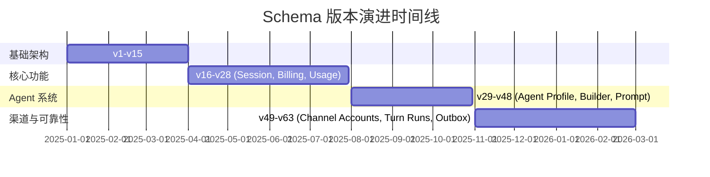

HappyClaw 使用 SQLite 作为唯一持久化存储引擎，单数据库文件承载全部业务数据——从用户认证、消息存储、Agent Profile 到计费用量、IM 渠道路由和定时任务调度。数据库文件位于 `data/db/messages.db`，通过 `STORE_DIR` 配置常量定位。这种单体 SQLite 架构在单机部署场景下消除了对外部数据库的依赖，使得整套系统可以仅凭 `docker run` 或 `npm start` 在几分钟内从零启动。

## 架构概览：单体 SQLite 的策略与代价

选择 SQLite 而非 PostgreSQL/MySQL 是基于 HappyClaw 的部署模型做出的设计决策：单人部署或小团队自托管是主要场景，零运维心智是核心目标。但单体 SQLite 不等于无模式设计——恰恰相反，项目通过一套严谨的版本化迁移体系，在无停机升级的约束下管理着 30+ 张表、数百个字段的演进。

```mermaid
graph TD
    subgraph "初始化流程 (initDatabase)"
        A[打开数据库连接] --> B[PWAGMA busy_timeout=5000]
        B --> C{enforcePreMigrationBackup}
        C -->|schema_version >= 39| D[VACUUM INTO 创建备份]
        C -->|schema_version 未设置| E[跳过备份]
        D --> F[PWAGMA journal_mode=WAL]
        F --> G[reportKnownForeignKeyOrphans]
        G --> H[PWAGMA foreign_keys=ON]
        H --> I[CREATE TABLE IF NOT EXISTS 基础建表]
        I --> J[ensureColumn 逐列补丁]
        J --> K[版本门控数据迁移]
        K --> L[assertSchema 完整性校验]
        L --> M[写入 schema_version]
    end

    subgraph "迁移安全门"
        N[读取 schema_version] --> O{version > current?}
        O -->|是| P[拒绝降级，抛出异常]
        O -->|否| Q{version >= 39?}
        Q -->|是| R[VACUUM INTO 备份 + quick_check 校验]
        Q -->|否| S[直接迁移]
        R -->|备份失败| T[清理 -wal -shm 文件，终止启动]
    end
```



迁移策略的核心洞察是：**SQLite 的 DDL 能力有限——不支持 DROP COLUMN、不支持 ALTER COLUMN 类型修改、ADD COLUMN 必须放在末尾——因此迁移设计必须围绕这些约束展开**。HappyClaw 的应对方案是三条互补的路径：`CREATE TABLE IF NOT EXISTS` 处理新建表、`ensureColumn` 处理新增列、`ALTER TABLE ... RENAME` 事务块处理结构性突破（如移除 UNIQUE 约束或重构复合主键）。Sources: [src/db.ts](src/db.ts#L442-L488), [src/db.ts](src/db.ts#L240-L256)

## 兼容层：Bun 与 Node.js 的双运行时支持

项目通过 `src/sqlite-compat.ts` 抽象层同时支持 Bun 的 `bun:sqlite` 和 Node.js 的 `better-sqlite3`。两者 API 几乎一致（`prepare/run/get/all/exec/transaction`），唯一差异是 `pragma()` 方法——Bun 无此方法，需用 `exec` 替代。这一兼容层使得 HappyClaw 在发展过程中可以自由切换运行时，而数据层代码无需修改。Sources: [src/sqlite-compat.ts](src/sqlite-compat.ts#L1-L23)

## 核心表结构：业务域与数据模型映射

### 领域一：IM 消息与聊天

`chats` 表存储聊天元数据（JID 主键、名称、最后消息时间），`messages` 表承载全部消息内容。messages 表的设计体现了消息在 IM 渠道中的复杂生命周期：它使用复合主键 `(id, chat_jid)`，每条消息携带 `source_kind`（标记来源：`sdk_final`、`user_command`、`scheduled_task_prompt` 等）、`finalization_reason`、`delivery_status`（队列状态机：`queued` → `promoting` → `released`/`cancelled`）等字段。`delivery_*` 字段族构成了一个完整的消息投递状态机，支撑着 FollowUp 队列和卡片操作的异步投递语义。Sources: [src/db.ts](src/db.ts#L489-L520)

### 领域二：定时任务调度

`scheduled_tasks` 表是任务调度的核心，支持 cron、interval 和 once 三种调度类型。其字段设计反映了任务调度在分布式环境中的关键需求：`revision` 和 `updated_at` 提供乐观并发控制，`running_until` 和 `runner_id` 标识当前执行者，`delivery_route_jid` 编码了完整的投递路由（JID 本身已编码 provider、外部聊天 ID、渠道账户和飞书 thread/root 信息）。`task_runs` 表通过 `occurrence_key` 唯一约束保证每次调度只产生一次执行，`idempotency_key` 支持手动触发幂等，`lease_*` 字段族实现工作者租约机制。`task_run_logs` 表则提供轻量级的执行历史视图。Sources: [src/db.ts](src/db.ts#L522-L604)

### 领域三：Agent Profile 与 Prompt 版本管理

`agent_profiles` 表是 Agent 身份系统的核心，存储四段式 Prompt（`identity_prompt`、`soul_prompt`、`agents_prompt`、`tools_prompt`）以及 `runtime_policy` JSON 配置。`identity_hash` 字段是一个重要设计：它对 Prompt 内容 + 运行时策略 + 名称进行哈希，用于快速检测配置变更以触发 SDK session 重建。`agent_profile_prompt_versions` 表实现了 Prompt 版本历史，每次 Profile 更新都会创建快照，支持回滚和变更审计。`agent_builder_drafts` 表则支撑对话式 Agent Builder 的多轮交互编辑流程，`definition_json` 存储完整的构建定义，`assumptions_json` 记录 AI 推理出的假设前提。Sources: [src/db.ts](src/db.ts#L842-L918)

### 领域四：Workspace 与渠道路由

`workspaces` 表定义了一级工作空间，`registered_groups` 表记录所有已注册的聊天组（包括 `web:main` 和 IM 渠道的 JID）。`channel_mounts` 和 `agent_channel_mounts` 表分别表示 Workspace 级和 Agent Profile 级的渠道挂载点，通过 `routing_mode`（`single_session`/`thread_map`）、`reply_policy`、`activation_mode`、`audience_mode` 等字段实现精细化的消息路由策略。`workspace_runtime_sessions` 表存储 SDK 会话恢复元数据，并非产品层面的对话 Session——这一命名区分是经过 v44→v45 迁移后明确化的。Sources: [src/db.ts](src/db.ts#L608-L733)

### 领域五：用户认证与权限

`users` 表的设计体现了多租户需求：`role`（admin/member）、`permissions`（JSON 数组）、`status`（active/disabled）、`must_change_password` 等字段。`user_sessions` 表管理 Web 会话，`auth_audit_log` 记录全部认证事件。`invite_codes` 表支持邀请注册机制，`permission_template` 和 `permissions` 字段允许按邀请码粒度授予权限模板。Sources: [src/db.ts](src/db.ts#L736-L801)

### 领域六：计费与用量

计费子系统包含 `billing_plans`、`user_subscriptions`、`user_balances`、`balance_transactions` 四张核心表，支持多级配额（daily/weekly/monthly token/cost 上限）、`rate_multiplier` 计费倍率、`trial_days` 试用期等机制。`balance_transactions` 的 `idempotency_key` 唯一索引保证了计费操作的幂等性。用量追踪通过 `usage_records`（明细）、`usage_events`（事件账本）、`usage_daily_summary`（预聚合）三层表实现，`event_id` 的唯一索引支持事件级幂等写入。Sources: [src/db.ts](src/db.ts#L921-L1157)

### 领域七：渠道可靠性（v59→v60 新增）

`channel_inbox`、`turn_runs`、`channel_outbox`、`streaming_cards` 四张表构成了渠道可靠性子系统，托管在 `channel-reliability-store.ts` 模块中。`channel_inbox` 实现消息去重接收（通过 `UNIQUE(provider, account_id, external_message_id)`），`turn_runs` 管理 Agent 回合的生命周期，`channel_outbox` 支持分片投递和重试，`streaming_cards` 负责流式卡片的状态追踪。这些表通过外键级联关联（`ON DELETE CASCADE` / `ON DELETE SET NULL`），构成了一个完整的事务边界。Sources: [src/channel-reliability-store.ts](src/channel-reliability-store.ts#L287-L430)

## 版本化迁移策略：三层递进模式

HappyClaw 的迁移系统不是一个独立的迁移框架，而是嵌入在 `initDatabase()` 函数中的声明式代码。它采用三层递进策略：

### 第一层：声明式建表

所有核心表使用 `CREATE TABLE IF NOT EXISTS` 在每次启动时声明。这意味着新表可以随代码部署自动创建，无需人工执行 DDL 脚本。这一层的设计原则是：**建表语句必须始终反映当前期望的最终 Schema**，即使数据库是从零开始的新实例。

### 第二层：逐列补丁

`ensureColumn()` 函数通过 `PRAGMA table_info` 检查列是否存在，仅在缺失时执行 `ALTER TABLE ADD COLUMN`。这是最常用的迁移手段，适用于新增可选列、设置默认值等场景。其设计哲学是**幂等性**：即使同一个列在多个版本中被多次添加，第二次调用也会被 `hasColumn` 短路。Sources: [src/db.ts](src/db.ts#L240-L256)

### 第三层：版本门控数据迁移

对于需要数据转换或结构性突破的迁移，系统通过 `router_state` 表中存储的 `schema_version` 进行比较：

```typescript
const curVer = getRouterStateInternal('schema_version');
if (curVer && parseInt(curVer, 10) < 17) {
  // 执行复合主键重构：事务内 CREATE → INSERT → DROP → RENAME
}
```

```mermaid
graph LR
    subgraph "迁移模式示例"
        A[CREATE TABLE IF NOT EXISTS] --> B[声明式，幂等]
        C[ensureColumn] --> D[ALTER TABLE ADD COLUMN，幂等]
        E[版本门控迁移] --> F[条件判断 → 事务执行]
    end

    subgraph "结构性迁移示例"
        G[registered_groups 移除 UNIQUE(folder)] --> H[CREATE TABLE new]
        H --> I[INSERT INTO new SELECT ...]
        I --> J[DROP TABLE old]
        J --> K[ALTER TABLE new RENAME TO old]
    end

    subgraph "数据迁移示例"
        L[v27→v28: usage_records] --> M[JSON 解析 messages.token_usage]
        M --> N[INSERT INTO usage_records]
        N --> O[逐行迁移历史用量数据]
    end
```

这种模式的关键版本门控包括：
- **v17**: sessions 表复合主键重构——从单列 `(group_folder)` 到 `(group_folder, agent_id)`
- **v24**: 计费系统初始化——为所有现有用户创建免费计划和余额
- **v27**: 钱包计费上线——非管理员用户余额归零，记录迁移事务
- **v28**: 用量历史迁移——从 `messages.token_usage` JSON 解析历史用量数据到 `usage_records`
- **v39**: 用户名小写化——遍历所有混合大小写用户名，冲突行保留原值并记录错误
- **v46**: 移除 workspace 成员表——`DROP TABLE group_members`，清理孤儿投影
- **v48**: Prompt 四段式拆分——将 legacy 单 prompt 拆分为 identity/soul/agents/tools
- **v51**: 用量事件账本——为历史 usage_records 生成 `event_id`，回填 `usage_events`
- **v58**: Feishu 权限策略拆分——`owner_mentioned` → `activation_mode` + `audience_mode`
- **v62**: "Persona" 重命名为 "Proactive"——`interaction_mode` 值迁移
- **v63**: 任务投递路由——新增 `delivery_route_jid` 并从 `chat_jid` 回填

Sources: [src/db.ts](src/db.ts#L1568-L1594), [src/db.ts](src/db.ts#L1629-L1677), [src/db.ts](src/db.ts#L1715-L1756), [src/db.ts](src/db.ts#L1759-L1799), [src/db.ts](src/db.ts#L2094-L2142), [src/db.ts](src/db.ts#L2231-L2271)

## 迁移安全门：备份、校验与降级保护

迁移系统包含三道安全门：

1. **预迁移备份**：`enforcePreMigrationBackup()` 在 schema_version >= 39 时，通过 `VACUUM INTO` 创建一个事务一致的快照，并使用 `PRAGMA quick_check` 验证备份完整性。备份文件路径包含 `{oldVersion}-to-{newVersion}-{timestamp}-{pid}` 标识，支持通过 `HAPPYCLAW_MIGRATION_BACKUP_DIR` 环境变量自定义备份目录。备份失败时，系统会清理残留的 `-wal` 和 `-shm` 文件，并抛出异常阻止启动。Sources: [src/db.ts](src/db.ts#L369-L440)

2. **降级拒绝**：如果现有数据库的 `schema_version` 大于当前代码支持的版本，系统会直接抛出异常，防止代码降级导致数据损坏。Sources: [src/db.ts](src/db.ts#L432-L436)

3. **Schema 完整性断言**：`assertSchema()` 函数在迁移完成后验证核心表是否包含所有必需的列，以及是否包含已被移除的禁止列（如 `trigger_pattern`、`requires_trigger`）。如果断言失败，系统会提示用户删除旧数据库文件并重启。Sources: [src/db.ts](src/db.ts#L258-L277)

## 外键约束的渐进式启用

SQLite 默认关闭外键检查，因此所有 `FOREIGN KEY` 声明在默认情况下都是静默的 no-op。HappyClaw 在启动时尝试启用 `PRAGMA foreign_keys = ON`，然后通过 `PRAGMA foreign_key_check` 检测现有违规数据。如果存在违规，系统会记录警告并**保持外键约束关闭**，以避免阻塞写入。`reportKnownForeignKeyOrphans()` 会预先扫描 `user_balances`、`user_sessions`、`user_subscriptions`、`balance_transactions` 四张表的外键孤立行，仅记录不删除，留给运维人员手动清理。Sources: [src/db.ts](src/db.ts#L460-L487), [src/db.ts](src/db.ts#L298-L357)

## 运行时性能考量

系统通过多种方式优化 SQLite 运行时性能：

- **WAL 模式**：迁移完成后设置 `PRAGMA journal_mode = WAL`，支持并发读写
- **预编译语句缓存**：`stmts()` 函数在首次使用时惰性初始化高频查询的预编译语句，`_newMsgStmtCache` 使用 LRU 策略（Map 插入顺序 + 64 条目上限）缓存不同 JID 数量的批量查询语句
- **索引策略**：每张表都有针对性的索引设计，覆盖查询模式——如 `idx_messages_follow_up_queue(chat_jid, delivery_status, delivery_priority, timestamp, id)` 复合索引支撑 FollowUp 队列的优先级排序查询
- **ID 生成**：消息 ID 使用 `crypto.randomUUID()` 生成，避免 UUID v7 的依赖，但牺牲了时间有序性

Sources: [src/db.ts](src/db.ts#L97-L224), [src/db.ts](src/db.ts#L458)

## 数据备份与恢复工具

项目提供了两个数据管理工具脚本：

- **`scripts/sqlite-snapshot.mjs`**：通过 `better-sqlite3` 的在线备份 API 创建事务一致的快照，使用 `quick_check` 验证完整性，适用于日常备份和迁移前的额外保护
- **`scripts/backup-manifest.mjs`** 和 **`scripts/prepare-backup-tree.mjs`**：管理备份清单和目录结构，支持可重现的恢复流程

Sources: [scripts/sqlite-snapshot.mjs](scripts/sqlite-snapshot.mjs#L1-L84)

## 迁移测试体系

每个关键版本迁移都有独立的测试文件，采用**真实数据库文件操作**的测试方式：在临时目录创建数据库、手动设置旧 schema_version、写入旧格式数据、调用 `initDatabase()` 触发迁移、断言迁移结果。测试覆盖了以下场景：

- **idempotency**：多次启动不会重复迁移或破坏数据
- **ghost cleanup**：孤儿投影行在迁移中被正确清理
- **backup integrity**：备份文件包含正确的 schema_version 和旧表结构
- **rollback safety**：备份失败时启动被阻止

测试文件分布于 `tests/schema-v46-migration.test.ts` 到 `tests/schema-v63-task-delivery-route.test.ts`，覆盖了从 v46 到 v63 的所有关键版本迁移。Sources: [tests/schema-v46-migration.test.ts](tests/schema-v46-migration.test.ts#L1-L168), [tests/db-upgrade-safety.test.ts](tests/db-upgrade-safety.test.ts#L1-L176)

## 当前 Schema 版本与演进方向

当前版本为 **v63**（`CURRENT_SCHEMA_VERSION = 63`）。从版本演进趋势看，每次 schema 变更都对应一个具体的业务需求——没有"预留字段"或"未来可能用到的列"。这种演进模式保证了 Schema 的简洁性和可理解性。



对于希望深入理解数据层的读者，建议首先阅读 [认证与会话管理](10-ren-zheng-yu-hui-hua-guan-li-cookie-session-permission-middleware-yu-acl-quan-xian-ju-zhen) 了解用户认证流程如何与数据库交互，然后阅读 [定时任务调度器](12-ding-shi-ren-wu-diao-du-qi-cron-jian-ge-yu-ci-xing-ren-wu) 了解 `scheduled_tasks` 和 `task_runs` 表在实际调度中的使用方式。