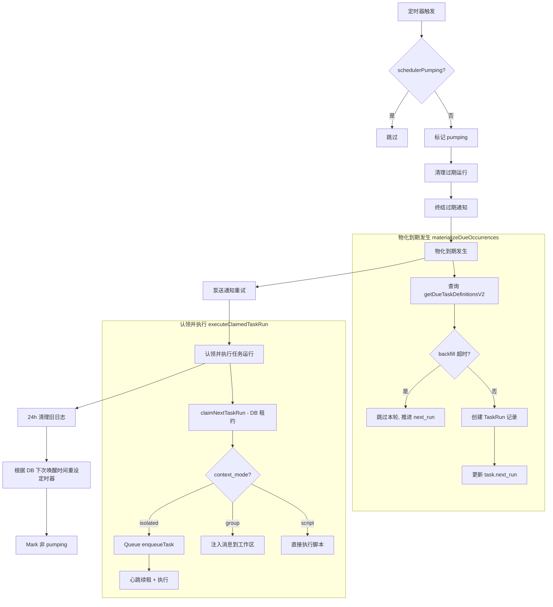
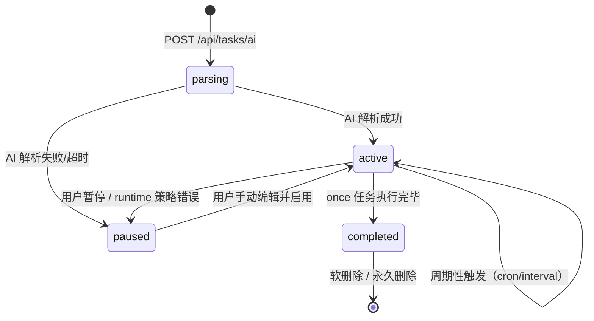
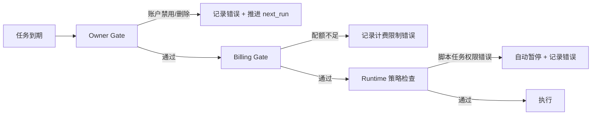

## 概述

HappyClaw 的定时任务调度器（Task Scheduler V2）是一个基于 **Occurrence Materialization（发生物化）** 模式构建的分布式调度引擎。它允许用户创建三种类型的定时任务——Cron 表达式、固定间隔和一次性执行——并将每个调度触发物化为持久化的 `TaskRun` 记录，由调度器通过租约机制安全地消费执行。调度器并非一个外部独立进程，而是嵌入在主服务中的事件驱动循环，通过 `pumpTaskScheduler` 函数定期轮询数据库，发现到期定义、物化发生、认领并执行。这种设计消除了对外部调度依赖（如 cron 守护进程、Redis 队列）的需要，同时通过 SQLite 行级租约保证了多实例安全。

Sources: [task-scheduler.ts](src/task-scheduler.ts#L2729-L2761), [types.ts](src/types.ts#L469-L506)

## 三种调度类型

调度器支持三种 `schedule_type`，每种有对应的 `schedule_value` 语义和校验规则。

| 类型 | 值格式 | 最小/最大间隔 | 计算方式 |
|------|--------|-------------|---------|
| `cron` | 5 段（分 时 日 月 周）或 6 段（含秒）；也支持 `@daily`、`@hourly` 等预定义表达式 | 最小 60 秒（6 段 cron 的秒字段必须解析为单一值） | `cron-parser` 库以 `TIMEZONE` 为时区解析，取下一个匹配时间 |
| `interval` | 毫秒数字符串，如 `"3600000"` | 60,000ms ~ 365天（超过 1 年应使用 cron） | 以 `next_run` 为锚点，计算 `anchor + ceil(elapsed / ms) * ms`，确保时钟漂移不累积误差 |
| `once` | ISO 8601 日期时间字符串（无 Z 后缀则按进程本地时区解释） | 未来 100 年内 | 直接转换为 UTC ISO 字符串，执行后任务状态变为 `completed` |

Cron 表达式的最小频率校验是调度器的一个关键安全设计：`validateCronMinimumInterval` 函数检查 `cron-parser` 解析后秒字段的 `values.length` 是否为 1，若不是则抛出错误，防止毫秒级或秒级高频循环误创建。Interval 类型的 anchor 计算使用了防御性编程——当 `next_run` 损坏为 `NaN`（如手工 SQL 写入导致）时，优雅降级到 `Date.now()` 而非冒泡异常将任务永久卡死在 `runningTaskIds` 集合中。

Sources: [task-scheduler.ts](src/task-scheduler.ts#L547-L624), [schemas.ts](src/schemas.ts#L107-L200), [config.ts](src/config.ts#L36-L41)

## 架构设计：从 V1 日志到 V2 Materialization

### 核心调度循环

调度器的核心是 `pumpTaskScheduler` 函数，它在一个不可重入的互斥锁（`schedulerPumping` 标志）保护下，按固定顺序执行以下步骤：



调度循环的定时器由 `armSchedulerFromStore` 控制，它从两个来源计算下次唤醒时间：`getNextScheduledTaskWakeAt`（任务定义的下次运行）和 `getNextTaskRunWakeAt`（通知重试的下次唤醒），取最小值。同时设置一个 60 秒的 `SCHEDULER_RECONCILE_MS` 安全网，防止时钟跳跃或遗漏的进程内通知导致任务错过触发。每次任务定义变更后，调用 `notifyTaskSchedulerChanged` 立即触发一次额外泵送，确保新创建的/修改的任务能尽快被调度。

Sources: [task-scheduler.ts](src/task-scheduler.ts#L1770-L1867), [config.ts](src/config.ts#L9-L9)

### V2 Materialization 流程

V2 架构的核心转变是将"调度器直接执行任务"改为"调度器物化发生，然后执行器认领发生"。`materializeDueOccurrences` 函数从 DB 查询所有 `next_run <= now` 且 `status = 'active'` 的任务定义，为每个到期任务执行以下逻辑：

1. 检查 `taskBackfillGraceMs` 回填宽限期。如果任务过期超过宽限期，则跳过本轮、推进 `next_run` 前进到下一个周期，避免服务器重启后"风暴式"并发触发所有积压任务
2. 调用 `materializeTaskOccurrence` 创建一条 `TaskRun` 记录（含 `definition_snapshot` 快照——运行时字段的不可变副本，确保队列中的运行不会因编辑而变更行为）
3. 更新 `task.next_run` 到下一个周期（`once` 类型设为 `null`）

执行阶段由 `executeClaimedTaskRun` 处理 `TaskRun` 记录。`claimNextTaskRun` 通过 SQLite 的租约机制（`lease_owner` + `lease_token` + `lease_expires_at`）实现分布式互斥，每个调度器实例只能认领未被其他实例租用的运行。认领后，根据 `context_mode` 分支到三种执行路径。

Sources: [task-scheduler.ts](src/task-scheduler.ts#L2485-L2521), [types.ts](src/types.ts#L540-L550)

## 执行模式：四维组合

调度器支持四种执行维度的组合，定义任务的执行行为和资源隔离策略。

### Agent 执行 vs 脚本执行

| 维度 | Agent 执行 | 脚本执行 |
|------|-----------|---------|
| `execution_type` | `agent` | `script` |
| 入口 | `runTask` → `runHostAgent` / `runContainerAgent` | `runScriptTask` → `runScript` |
| 输出 | 通过 Agent Runner 的 `send_message`/`send_image` IPC 发送 | 直接通过 `sendMessage` 发送 stdout/stderr |
| 权限要求 | 普通用户可创建 | 仅管理员可创建和修改 |
| 执行环境 | 跟随工作区模式（host/container） | 始终在 host 执行（`SCRIPT_TASK_HOST_REQUIRED_ERROR`） |

### Isolated 上下文 vs Group 上下文

| 维度 | Isolated（独立） | Group（群组） |
|------|-----------------|--------------|
| `context_mode` | `isolated` | `group` |
| 执行容器 | 独立虚拟聊天会话（`workspace.jid#task:runId`），不污染主会话 | 作为普通用户消息注入到源工作区聊天 |
| 生命周期 | 运行结束后清理 IPC 命名空间和会话目录 | 通过 GroupQueue 的 `enqueueMessageCheck` 触发消息处理流水线 |
| 适用场景 | 定时提醒、数据抓取、自动化报告 | 需要工作区上下文和 Agent Profile 的交互式任务 |
| 防递归保护 | 无（独立执行，不触发消息处理） | 前置 `SCHEDULED_GROUP_TRIGGER_FRAMING` 框定文本，防止 Agent 递归创建新任务 |

Group 模式的防递归机制是一个精心设计的 Prompt 工程方案：`SCHEDULED_GROUP_TRIGGER_FRAMING` 常量会在任务 prompt 前注入一段框定文本，明确声明"这是定时任务自动触发，不是用户新指令"，并要求 Agent 即使看到「每隔/每天/提醒」等字眼也不应调用 `schedule_task`。这与 global CLAUDE.md 中的守卫规则形成双层防护，防止 `#564` 类型的问题复发。

Sources: [task-scheduler.ts](src/task-scheduler.ts#L1672-L1768), [task-scheduler.ts](src/task-scheduler.ts#L1360-L1670)

## 调度生命周期管理

### 创建与 AI 解析

任务创建有三种入口：REST API（`POST /api/tasks`）、MCP 工具（`schedule_task`）和 AI 自然语言创建（`POST /api/tasks/ai`）。AI 创建流程是前端默认路径，它的设计体现了一个重要的状态机设计：

1. 立即以 `status: 'parsing'` 和占位 schedule 创建任务记录，计入用户容量限制
2. 在后台异步调用 LLM 解析自然语言描述，提取 `prompt`、`schedule_type`、`schedule_value`
3. 解析成功后，通过乐观并发控制（`revision`）更新任务为 `status: 'active'`；如果用户在解析期间已手动编辑了任务，冲突检测会丢弃 AI 解析结果
4. 解析失败或超时时，任务停留在 `paused` 状态，保留用户原始描述作为 prompt，允许手动修正



### 暂停、恢复与手动触发

- **暂停**：设置 `status: 'paused'` 并清除 `next_run`，调度器将跳过 `getDueTasks` 查询
- **恢复**：调用 `computeNextRunForTaskResume` 重新计算 next_run，如果是一次性任务且时间已过则抛出错误拒绝恢复
- **手动触发**：`triggerTaskNow` 创建一个 `trigger_type: 'manual'` 的 TaskRun，不改变 `next_run`，即保持原有调度周期不变。手动触发支持幂等键防止重复创建
- **停止运行中任务**：`cancelTaskRunNow` 先在 DB 层面标记取消（`cancelTaskRun` 防止后续完成写回），再通过 `activeDurableExecutions` 中的 `stop` 回调中止进程级执行器

Sources: [routes/tasks.ts](src/routes/tasks.ts#L183-L315), [routes/tasks.ts](src/routes/tasks.ts#L948-L1169), [task-scheduler.ts](src/task-scheduler.ts#L2872-L2905), [task-scheduler.ts](src/task-scheduler.ts#L2911-L2936)

### 运行租约与心跳机制

V2 使用 SQLite 行的租约字段实现分布式执行互斥。每个 `TaskRun` 记录包含 `lease_owner`、`lease_token`、`lease_expires_at`，调度器通过 `claimNextTaskRun` 的原子 UPDATE ... WHERE 语义认领可执行的运行：

```
UPDATE task_runs SET status = 'queued', lease_owner = ?, lease_token = ?, 
       lease_expires_at = ? 
WHERE status = 'created' AND (lease_expires_at IS NULL OR lease_expires_at < ?)
```

认领成功后，执行器启动一个心跳定时器，以 `TASK_RUN_LEASE_MS / 3`（约 20 秒）的间隔通过 `renewTaskRunLease` 续租。如果续租失败（如其他实例已抢占、进程崩溃），心跳回调触发 `onLeaseLost` 清理函数，终止运行中的子进程并释放资源。这种设计确保进程崩溃后最长 60 秒内租约过期，其他实例可以重新认领执行。

Sources: [task-scheduler.ts](src/task-scheduler.ts#L1908-L1940), [task-scheduler.ts](src/task-scheduler.ts#L1773-L1777)

## 通知系统与耐久重试

任务执行结果需要通知到用户绑定的 IM 渠道。通知系统设计为**与执行分离**的耐久重试子系统：

1. **执行阶段**：Agent 或脚本执行过程中，通过 `sendMessage` 直接发送消息到目标 JID，同时记录 `TaskRunNotificationReceipt`
2. **失败持久化**：如果发送失败（IM 渠道不可用、网络错误等），失败载荷（`TaskRunNotificationPayload`）持久化到 `task_run_notifications` 表，包含完整的重试所需信息
3. **通知重试泵送**：`pumpTaskNotificationRetries` 在每次调度循环中认领待重试的通知，调用 `processClaimedTaskRunNotification` 执行重试发送
4. **通知租约**：通知重试同样使用独立的租约机制（`renewTaskRunNotificationLease`），防止多实例并发发送

通知重试的 `retryPayloadForReceipt` 函数实现了智能裁剪——当 `store_result_and_notify` 类型的通知只对部分渠道失败时，重试载荷只包含失败渠道，避免重复已成功投递的渠道。这种"部分重试"策略在保证送达率的同时最小化了 IM API 的调用量。

Sources: [task-scheduler.ts](src/task-scheduler.ts#L1999-L2081), [task-scheduler.ts](src/task-scheduler.ts#L2666-L2727), [task-notification.ts](src/task-notification.ts#L1-L143)

## 安全与容错设计

### 多层级防护

调度器在任务执行前设置了多层安全检查，按照严格的顺序执行：



Owner Gate 检查工作区所有者是否处于活跃状态（未禁用/未删除），防止已离开用户的定时任务继续消耗资源。Billing Gate 检查计费配额，但仅针对非管理员用户。两层检查都使用**工作区实际所有者**而非任务创建者，确保跨组任务（管理员为成员工作区创建的任务）仍受成员工作区自身配额限制，防止特权提升。

Sources: [task-scheduler.ts](src/task-scheduler.ts#L907-L994)

### 回填宽限期

`taskBackfillGraceMs` 系统设置控制回填宽限期。当服务器长时间停机后重启，大量任务同时到期，`shouldSkipBackfill` 函数检查每个任务的 `next_run` 与当前时间的差值，超过宽限期的任务跳过本轮执行，直接推进到下一个周期。这防止了"重启风暴"——所有积压任务同时触发导致系统过载。宽限期的默认值由系统设置管理，可通过运行时配置调整。

Sources: [task-scheduler.ts](src/task-scheduler.ts#L532-L540)

### 运行 ID 安全

`cleanupIsolatedTaskRun` 函数在清理任务运行环境时，使用严格的正则 `/^[a-zA-Z0-9_-]+$/` 验证 `taskRunId`，防止路径遍历攻击。这是防御性编程的典型实践——虽然当前调用者不会传入恶意 ID，但该 guard 防止未来的代码变更意外引入安全隐患。

Sources: [task-scheduler.ts](src/task-scheduler.ts#L339-L399)

### 优雅关闭

`stopSchedulerLoop` 实现了分级关闭协议：先停止 `schedulerRunning` 标志阻止新任务物化，然后清除定时器，最后在最多 10 秒的窗口内等待所有 `detachedSchedulerWork`（脚本执行、通知重试等独立于 GroupQueue 的工作）完成。如果超时未完成，记录警告但继续关闭——`scheduleSafePrestartRetry` 中的 `countsAsAttempt: false` 参数确保关闭期间的释放不消耗运行的重试预算，下一个进程实例可以安全接手。

Sources: [task-scheduler.ts](src/task-scheduler.ts#L2776-L2804)

## 路由与权限模型

任务相关的 REST API 路由集中在 `routes/tasks.ts`，权限模型遵循多层授权策略：

| 操作 | 权限要求 | 额外检查 |
|------|---------|---------|
| 查看列表 | `canAccessGroup` | Host 模式下仅管理员可见 |
| 创建 | `canAccessGroup` + 容量限制 | 脚本任务仅管理员 |
| 编辑 | `canAccessGroup` + revision 乐观锁 | 运行中不可修改关键字段 |
| 手动运行 | `canAccessGroup` | 脚本任务仅管理员 |
| 停止运行 | `canViewTask` | 脚本任务仅管理员 |
| 删除 | `canAccessGroup` | 脚本任务仅管理员，运行中不可删除 |

`canViewTask` 函数在 REST 层安全地暴露任务：如果是 host 模式任务，非管理员直接返回 `false`；如果任务关联的群组已不存在，仅管理员可查看。`taskPermissions` 函数为前端返回细粒度的操作权限掩码，包括 `can_edit`、`can_run`、`can_pause`、`can_stop`、`can_delete`、`can_restore`，以及 `execution_scope` 和 `risk_level` 标签，使 UI 可以根据权限动态渲染操作按钮。

对于 MCP/IPC 入口的权限检查，`task-acl.ts` 提供了独立的 `canIpcActorManageTask` 和 `canIpcActorAccessGroup` 函数，与 REST 层共享相同的 `canAccessGroup` 底层判断，但通过 `TaskAclDeps` 接口注入依赖保证纯函数可测试性。

Sources: [routes/tasks.ts](src/routes/tasks.ts#L54-L111), [routes/tasks.ts](src/routes/tasks.ts#L183-L600), [task-acl.ts](src/task-acl.ts#L1-L76)

## 任务定义指纹与去重

`task-definition-fingerprint.ts` 实现了内容可寻址的任务去重机制。`buildTaskExecutionFingerprint` 函数将任务的核心定义字段（prompt、schedule、context_mode、execution_type 等）规范化为 JSON 字符串。`findDuplicateActiveAgentTask` 使用该指纹在已有任务中查找完全相同的活跃 Agent 任务，避免 MCP 调用者无意中创建重复任务。指纹的规范化处理包括 `notify_channels` 的排序去重和可选字段的 `null` 统一表示，确保语义相同的不同请求产生相同的指纹。

Sources: [task-definition-fingerprint.ts](src/task-definition-fingerprint.ts#L1-L65)

## 下一步阅读

- 了解任务执行的目标工作区如何在 [Agent-First 三层模型](6-agent-first-san-ceng-mo-xing-agent-workspace-runtime-session) 中定位
- 查看 [Agent Runner 执行引擎](7-agent-runner-zhi-xing-yin-qing-host-mo-shi-yu-container-mo-shi) 了解 isolated 任务如何在容器中执行
- 探索 [Web API 路由体系](9-web-api-lu-you-ti-xi-yu-hono-kuang-jia-shi-jian) 中任务路由的完整实现
- 阅读 [SQLite 数据库 Schema](11-sqlite-shu-ju-ku-schema-yu-ban-ben-hua-qian-yi-ce-lue) 了解 `task_runs` 和 `task_run_notifications` 表的迁移历史