Agent Profile 是 HappyClaw 架构中 Agent 人格与能力的**声明式配置单元**。每个 Agent Profile 定义了一个 Agent 的身份、行为准则、工作流和工具策略——四段式 Prompt 工程正是这套声明体系的语义核心。本文从数据模型出发，依次剖析四段式 Prompt 的组装逻辑、Prompt Plan 在运行时引擎中的注入位置、AI 辅助生成与细化的设计模式、Runtime Policy 的安全约束，以及版本化迁移与审计机制。

## 四段式 Prompt 数据模型

Agent Profile 的 Prompt 部分由四个独立字段构成，每个字段承载明确的语义职责，严格禁止跨段职责重复：

```typescript
interface AgentProfilePrompts {
  identity_prompt: string;  // IDENTITY: 简洁说明"我是谁"、公开角色和核心使命
  soul_prompt: string;      // SOUL: 稳定的价值观、气质、判断原则和沟通风格
  agents_prompt: string;    // AGENTS: 具体工作方式、流程、协作规则、输出偏好和行为边界
  tools_prompt: string;     // TOOLS: 如何选择和使用工具、何时需要确认，以及工具使用限制
  prompt_mode: 'append' | 'replace';  // 追加或替换 Claude Code 原生提示词
}
```

四个字段的设计遵循**正交性约束**：身份判断放 IDENTITY，价值判断放 SOUL，工作规则放 AGENTS，工具策略放 TOOLS。这种拆分防止了旧版系统中常见的"identity_prompt 里塞满操作手册"的问题。`prompt_mode` 字段控制用户段如何与平台内置的 Claude Code 预设提示词相互作用——`append`（默认）将用户 Prompt 追加在平台提示词之前，`replace` 则替换 Claude Code 预设，但平台运行时指令（渠道协议、安全规则、输出契约）始终不可移除。Sources: [src/types.ts](src/types.ts#L289-L297), [src/agent-profile-prompts.ts](src/agent-profile-prompts.ts#L58-L78)

## 组装顺序：四段式 Prompt 的串联

`buildAgentProfilePrompt()` 函数按固定规范顺序将非空段组装为格式化的 Prompt 文本：

```
## IDENTITY
<identity_prompt内容>

## SOUL
<soul_prompt内容>

## AGENTS
<agents_prompt内容>

## TOOLS
<tools_prompt内容>
```

空段被直接跳过，保留的段保持文档边界完整（normalize 仅做类型安全校验，不对内容做 trim 或重写）。这种设计保证了用户编辑时只修改指定段，其他段原文不动。Sources: [src/agent-profile-prompts.ts](src/agent-profile-prompts.ts#L64-L78), [tests/agent-profile-prompts.test.ts](tests/agent-profile-prompts.test.ts#L10-L32)

## Prompt Plan：运行时引擎中的注入点

四段式 Prompt 在运行时引擎中并非直接拼入系统提示词，而是通过 **Prompt Plan** 架构进行结构化组装。`buildHappyClawPromptPlan()` 定义了 Prompt Block 的注入顺序：

```mermaid
flowchart LR
    A["agent-profile<br/>Owner: agent_profile<br/>Scope: main"] --> B["interaction<br/>Owner: platform"]
    B --> C["security-rules<br/>Owner: platform"]
    C --> D["memory-system<br/>Owner: workspace<br/>Conditional"]
    D --> E["agent-builder<br/>Owner: platform<br/>Conditional"]
    E --> F["output<br/>Owner: platform"]
    F --> G["web-fetch<br/>Owner: platform<br/>Conditional"]
    G --> H["background-tasks<br/>Owner: platform<br/>Conditional"]
    H --> I["channel.*<br/>Owner: channel<br/>Conditional"]
    I --> J["delivery-contract<br/>Owner: platform<br/>Conditional"]
```



关键设计要点：

- **Agent Profile 段始终排在最前**——这是用户自定义身份先于平台指令的核心设计，确保 Agent 的自我认知优先建立
- 每个 Prompt Block 携带 `owner`（平台/用户/工作区/渠道）和 `scope`（主Agent/子Agent/两者）标签，支持按角色过滤
- 条件块（memory、web、channel 等）仅在对应能力可用时注入
- Prompt Plan 输出包含 hash 指纹和预估 token 数，运行时引擎以此判断是否需要重建上下文窗口

Sources: [container/agent-runner/src/prompt-plan.ts](container/agent-runner/src/prompt-plan.ts#L146-L267), [tests/agent-runner-prompt-plan.test.ts](tests/agent-runner-prompt-plan.test.ts#L9-L45)

## AI 辅助生成：从自然语言到结构化 Prompt

HappyClaw 提供两阶段 AI 辅助流程，通过 Claude 模型将用户自然语言描述转化为四段式结构：

### 阶段一：草稿生成（Draft Generation）

`generateAgentProfileDraft()` 接收用户一段自然语言描述，将其发送给 Claude 模型，要求返回包含四个 Prompt 段的 JSON 结构：

```
描述: "一个代码审查助手，擅长发现逻辑错误和安全漏洞"
→ 输出:
  name: "Code Review Agent"
  identity_prompt: "我是代码审查助手..."
  soul_prompt: "安全优先，证据驱动..."
  agents_prompt: "审查流程：1) 理解变更上下文 2) 逐行检查..."
  tools_prompt: "使用 git diff 获取变更，用 read 理解上下文..."
```

生成 Prompt 的约束规则包括：
1. **非虚构承诺**：不虚构系统当前不具备的权限、工具或外部账号能力
2. **段间不重复**：同一句约束不能出现在两个段中
3. **IDENTITY 和 AGENTS 必须有实质内容**，SOUL 和 TOOLS 可为空
4. 单段长度上限 20,000 字符，超限直接报错而非静默截断
5. 默认使用中文，用户明确要求时切换语言

### 阶段二：精细化调整（Refinement）

`refineAgentProfilePrompt()` 支持在已有四段 Prompt 基础上进行单段或多段编辑。用户可指定 `section` 参数（identity/soul/agents/tools），AI 默认只修改目标段，仅在确需联动调整时才跨段修改并说明原因。未指定的段原文保留，不 trim 不重写其文档边界。Sources: [src/agent-profile-generator.ts](src/agent-profile-generator.ts#L39-L107), [tests/agent-profile-generator.test.ts](tests/agent-profile-generator.test.ts#L14-L101)

## 草稿发布与版本化审计

### 基于草稿的安全发布流程

Agent Profile 的创建/更新采用**草稿（Draft）→ 确认短语 → 发布（Publish）**三段式流程，确保误操作防护：

```
prepareAgentBuilderDraft()
  → 生成随机确认短语 (如 "确认发布 AGENT-A1B2C3D4")
  → 保存草稿，记录 base_agent_version 和 definition hash

publishAgentBuilderDraft()
  → 验证用户消息精确匹配确认短语
  → 验证目标 Agent 版本与草稿 base_agent_version 一致（防止并发覆盖）
  → 获取 Profile 级锁和 Capability 级锁，防止并发冲突
  → 重新验证所有能力引用（关闭 Skills/MCP 在验证与提交之间的 TOCTOU 窗口）
  → 执行 commit（创建新 Agent 或更新已有 Agent）
```

### 版本化审计

每次 Prompt 变更都会记录到 `agent_profile_prompt_versions` 表中，包含完整的四段内容快照、变更来源（`create`/`update`/`restore`/`migration`）和恢复来源版本号。支持按版本回溯和恢复历史 Prompt。Sources: [src/agent-builder.ts](src/agent-builder.ts#L253-L566), [src/types.ts](src/types.ts#L299-L308)

## 运行时安全策略（Runtime Policy）

Agent Profile 的核心能力治理通过 `AgentProfileRuntimePolicy` 声明式配置，在运行时由 `resolveEffectiveAgentProfile()` 强制执行：

```typescript
interface AgentProfileRuntimePolicy {
  context: {
    source: 'managed' | 'host_claude';  // 上下文来源
    auto_compact_window: number;        // 自动压缩窗口（token数）
    auto_compact_percentage: number;    // 自动压缩阈值百分比
  };
  skills: {
    mode: 'inherit' | 'custom' | 'disabled';
    ids: string[];
    host?: { mode: 'inherit' | 'custom' | 'disabled'; ids: string[] };
  };
  mcp: {
    mode: 'inherit' | 'custom' | 'disabled';
    ids: string[];
  };
}
```

安全策略的执行逻辑遵循**最小权限 + 运行时降级**原则：

1. **角色降级立即生效**：非 admin 用户即使 Profile 中声明了 `host_claude` 上下文或 `host skills`，`resolveEffectiveAgentProfile()` 会在运行时将其强制降级为 `managed` 和 `disabled`，无需重写历史 Profile 数据
2. **引用验证**：`validateRuntimePolicyReferences()` 在编辑时校验 Skills、MCP Server 的存在性，防止引用已删除的能力
3. **Profile 级锁**：`withAgentProfileLocks()` 按 Profile ID 排序获取锁，避免死锁；支持并发草稿的串行化提交
4. **运行时静默（Quiesce）**：发布 Profile 变更时，`quiesceWorkspaceRunnersAroundCommit()` 确保所有关联工作区的运行时在变更前停止，变更后重新发现并停止（关闭 TOCTOU 窗口），并将暂停期间到达的消息排入队列等待恢复

Sources: [src/agent-profile-runtime.ts](src/agent-profile-runtime.ts#L29-L79), [src/agent-profile-policy.ts](src/agent-profile-policy.ts#L67-L134), [src/agent-builder.ts](src/agent-builder.ts#L100-L126)

## 向后兼容与迁移

从旧版单字段 `identity_prompt` 到四段式 Prompt 的迁移通过 `agentProfilePromptsFromLegacy()` 实现：
- 旧版 `identity_prompt` 被无损迁移到 `agents_prompt` 字段（因为旧版提示词通常描述的是操作行为而非身份，映射到 AGENTS 段语义更准确）
- `include_claude_preset` 布尔值映射为 `prompt_mode`：`false` → `replace`，`true` → `append`
- 迁移时通过 `prompt_schema_version: 2` 标记新客户端，`usesFourPartPromptPayload()` 判断是否使用四段式或旧版兼容路径
- 迁移过程记录 `change_source: 'migration'` 到版本历史表，支持审计回查

Sources: [src/agent-profile-prompts.ts](src/agent-profile-prompts.ts#L80-L91), [tests/agent-profile-prompt-migration.test.ts](tests/agent-profile-prompt-migration.test.ts#L51-L88), [src/routes/agent-profiles.ts](src/routes/agent-profiles.ts#L90-L104)

## 能力预览（Capability Preview）

Agent Profile 的编辑界面通过 `buildAgentCapabilityPreview()` 提供**所见即所得**的能力预览，包括：
- Skills 按 `builtin → host → project → managed → workspace → plugin` 六层优先级合并展示
- MCP Server 按 `system → user` 两层合并展示
- 冲突检测（同一 ID 出现在多个层中时标记为冲突）
- 上下文来源预览（`managed` 或 `host_claude`）及 Claude.md/Rules 文件数量统计
- Run Context 快照状态分类，判断当前运行时是否与 Profile 配置一致

预览完全不依赖 Profile 持久化——即使是尚未保存的草稿，也能通过传入 `runtime_policy` 参数预览变更后的能力集。Sources: [src/agent-capability-preview.ts](src/agent-capability-preview.ts#L135-L200), [src/routes/agent-profiles.ts](src/routes/agent-profiles.ts#L210-L313)

## 设计原则总结

| 维度 | 设计选择 | 动机 |
|------|----------|------|
| **Prompt 分拆** | 四段正交职责 | 消除身份描述中混杂操作手册的旧病，精确控制每段变更范围 |
| **注入顺序** | Agent Profile 最先 | 用户定义的身份优先于平台指令，体现 Agent-First 哲学 |
| **AI 生成** | 结构化 JSON 约束 | 确保输出可解析、可校验，段间内容不重复 |
| **安全约束** | 运行时降级而非持久化降级 | 保留编辑体验，同时确保安全策略即时生效 |
| **发布流程** | 草稿 + 确认短语 + 锁 | 防止误操作、并发覆盖和 TOCTOU 窗口 |
| **向后兼容** | 无损迁移 + 版本标记 | 四段式和新客户端共存，旧数据不丢失 |

## 下一步探索

- 理解 Skills、MCP Server 与 Claude Code Plugins 如何通过 Agent Profile 的 Runtime Policy 分层治理：[Skills、MCP Server 与 Claude Code Plugins 能力分层管理](14-skills-mcp-server-yu-claude-code-plugins-neng-li-fen-ceng-guan-li)
- 了解对话式 Agent Builder 如何利用这套四段式 Prompt 工程实现多轮交互创建 Agent：[对话式 Agent Builder：多轮交互创建与编辑 Agent](15-dui-hua-shi-agent-builder-duo-lun-jiao-hu-chuang-jian-yu-bian-ji-agent)
- 查看 Agent Runner 执行引擎如何将 Prompt Plan 注入运行时上下文：[Agent Runner 执行引擎：Host 模式与 Container 模式](7-agent-runner-zhi-xing-yin-qing-host-mo-shi-yu-container-mo-shi)