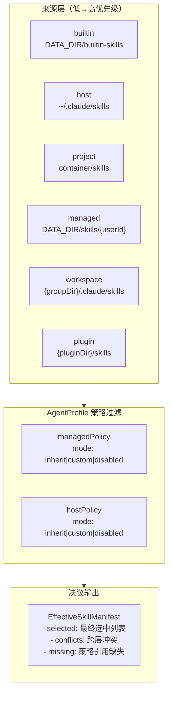
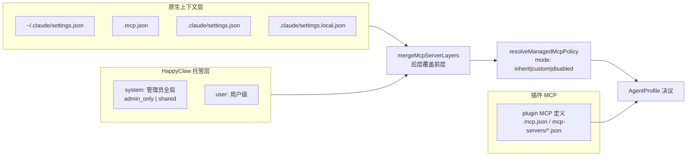
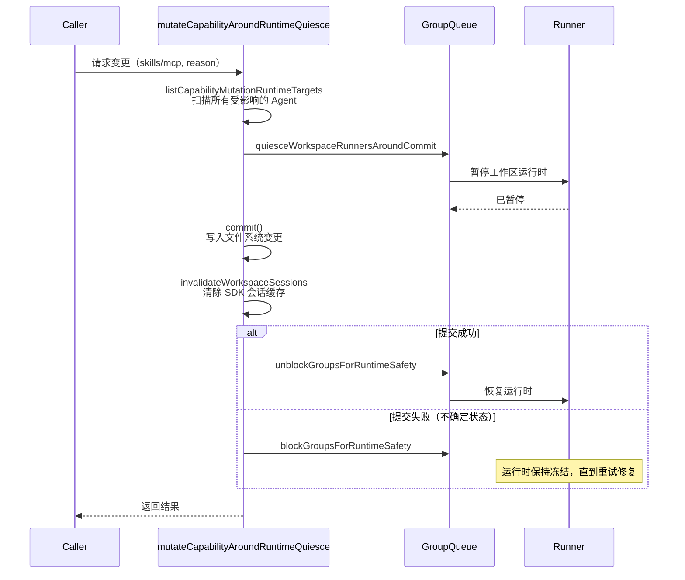

HappyClaw 的 Agent 能力体系由三个独立但协同的子系统构成：**Skills**（技能指令集）、**MCP Server**（模型上下文协议服务）和 **Claude Code Plugins**（插件扩展市场）。三者共享统一的分层治理模型，通过 `AgentProfileRuntimePolicy` 中的 `skills`、`mcp` 策略字段实现每 Agent 维度的精细管控。此架构的核心设计原则是：**来源可追溯、覆盖可预测、运行时安全**。

Source: [types.ts](src/types.ts#L319-L342)

## 三层能力的本质差异

三种能力在职责、来源和生命周期上存在根本性区别：

- **Skills**：以 `SKILL.md` 文件定义的指令集，本质是结构化 Prompt 模板。每个 Skill 是一个目录，包含 `SKILL.md` 和可选的支持文件，通过 frontmatter 声明 `name`、`description`、`allowed-tools` 等元数据。Skills 的优先级叠层（`builtin → host → project → managed → workspace → plugin`）构成完整的覆盖链，高层级同 ID Skill 自动遮蔽低层级。

- **MCP Server**：通过模型上下文协议向 Agent 暴露外部工具/数据源。MCP 的来源分为三层——原生 Claude 上下文层（宿主机 `~/.claude/settings.json`、项目 `.mcp.json`、项目 `.claude/settings.json`）和 HappyClaw 托管层（系统级 + 用户级）。HappyClaw 托管层优先于原生层，确保 `AgentProfile` 策略始终生效。

- **Claude Code Plugins**：来自公开或私有市场的扩展包，包含 `commands/`、`agents/`、`skills/`、`hooks/`、`mcp-servers/` 等子目录，通过不可变快照（content hash 命名）实现版本化管理。每个用户的启用状态以 `plugins.json`（v2 schema）持久化，按需物化到独立 inode 的运行时树。

Source: [effective-skill-resolver.ts](src/effective-skill-resolver.ts#L1-L50), [mcp-context.ts](src/mcp-context.ts#L1-L90), [plugin-manifest.ts](src/plugin-manifest.ts#L1-L60)

## Skills 分层解析引擎

Skills 的分层解析由 `effective-skill-resolver.ts#resolveEffectiveSkills` 实现，其核心算法基于**优先级覆盖 + 策略过滤**的双重模型：



解析过程遵循严格的三段式逻辑：

1. **候选收集**：遍历所有层，扫描每层 `root` 下的子目录，识别包含 `SKILL.md`（启用）或 `SKILL.md.disabled`（禁用）的目录。每个候选获得 `precedence`（层索引）和 `source` 标记。

2. **策略过滤**：`managedPolicy` 和 `hostPolicy` 分别控制 `managed` 和 `host` 来源的 Skills。`disabled` 模式剔除该层所有候选；`custom` 模式仅保留 `ids` 指定的 ID；`inherit` 模式放行全部。禁用/过滤的候选标记 `excludedReason`，不参与后续决议。

3. **优先级裁决**：按 ID 分组后，从同 ID 候选中选择最高优先级的启用项。被遮蔽的候选标记 `shadowed`。冲突列表（`conflicts`）记录所有跨层覆盖的 ID。

`reconcileSessionSkills` 将决议结果物化到会话目录：先隔离旧目录（`orphaned-skills` 时间戳命名），再以 symlink 方式建立新目录。容器模式下，'materializeLinks: false` 仅发布空目录，由 Docker entrypoint 通过只读挂载注入。`hashSkillDirectory` 对整个 Skill 目录做 SHA256 哈希（排除 `.DS_Store`、`.git`、`node_modules` 等），确保定义变更可检测。

Source: [effective-skill-resolver.ts](src/effective-skill-resolver.ts#L50-L341)

## MCP Server 多层合并与策略管理

MCP Server 的治理遵循 "原生上下文 + 托管覆盖" 的双层架构。`loadClaudeContextMcpServers` 按 Claude 原生优先级合并四层来源——宿主机 `~/.claude/settings.json`、项目 `.mcp.json`、项目 `.claude/settings.json`、项目 `.claude/settings.local.json`。HappyClaw 托管层通过 `mergeMcpServerLayers` 叠加在原生层之上，确保 `AgentProfile` 策略始终具备最终决定权。



`StoredMcpServerDefinition` 记录每个 MCP 服务器的 `command`/`args`（本地进程模式）或 `type`/`url`（HTTP/SSE 模式），以及 `enabled`、`importedFromHost`、`memberAccess`（`admin_only` 或 `shared`）等元数据。密钥（`env`、`headers`）分离存储在 `secrets.json`，通过跨进程迁移锁确保并发安全。`buildEffectiveMcpManifest` 对决议后的 MCP 做规范哈希（`canonicalize` 保证键序稳定），为 `ClaudeContextAudit` 提供可验证的运行时快照。

Source: [mcp-context.ts](src/mcp-context.ts#L1-L90), [mcp-utils.ts](src/mcp-utils.ts#L1-L200), [effective-mcp-manifest.ts](src/effective-mcp-manifest.ts#L1-L96)

## Plugin 生态：不可变快照、运行时树与命令扩展

Claude Code Plugins 系统是三者中最复杂的，其架构围绕**不可变快照**和**按人物化**两个核心原则设计：

```mermaid
flowchart TD
    subgraph Import["市场扫描（scanHostMarketplaces）"]
        MP["~/.claude/plugins/marketplaces/..."]
        M["marketplace.json 解析"]
        P["plugin.json 读取"]
        H["内容哈希（SHA256, 排除.git等）"]
    end

    subgraph Catalog["不可变快照目录"]
        CI["catalog/index.json<br/>全量索引"]
        S1["versions/{hash}/<br/>快照副本"]
        S2["versions/{hash2}/<br/>版本历史"]
    end

    subgraph Materialize["运行时物化（materializeUserRuntime）"]
        UT["runtime/{userId}/snapshots/{id}/{mp}/{plugin}/<br/>独立 inode 副本"]
        MK["@happyclaw-runtime-markers<br/>物化验证标记"]
    end

    subgraph Expander["命令扩展（plugin-expander-core）"]
        CI2["command-index<br/>DMI 命令索引"]
        EX["!`bash` 内联执行<br/>宿主机/docker 双模式"]
        SE["崩溃安全哨兵<br/>persistPluginExpansion"]
    end

    Import -->|rename(2) 原子写入| Catalog
    Catalog -->|copyFileSync FICLONE| Materialize
    Materialize -->|loadUserPlugins| SDK["SDK --plugin-dir"]
    Materialize --> CI2
    CI2 -->|resolveCommand| EX
    EX --> SE
```

### Plugin 导入与目录管理

`plugin-importer.ts` 实现三级扫描流程：解析 `marketplace.json` 获取 `plugins[]` 声明（区分 inline 和 remote 来源），读取每个插件目录的 `.claude-plugin/plugin.json`，最后通过 `scanPluginAssets` 统计 `commands/`、`agents/`、`skills/`、`hooks/`、`mcp-servers/` 下的资产。模块级互斥锁（`inFlight`）确保同一时间仅有一个扫描在执行，后续调用者复用同一个 Promise。

`plugin-catalog.ts` 的索引结构使用 `buildFullId`（`{plugin}@{marketplace}`）作为主键，记录每个插件的 `activeSnapshot` 和历史 `snapshots`。`SnapshotMeta` 包含 `contentHash`、`version`、`assetCounts` 等元数据。所有路径段通过 `isValidNameSegment`（`/^[\w.-]+$/`）验证，杜绝路径穿越攻击。

### 运行时树物化

`plugin-materializer.ts` 的 `materializeUserRuntime` 为每个用户构建独立 inode 的运行时树，使用 `copyFileSync` 的 `COPYFILE_FICLONE` 标志（APFS/btrfs/xfs 上实现近乎零成本的 COW 副本）。`RUNTIME_MARKER_VERSION` 机制确保物化策略变更时自动触发重建。`@happyclaw-runtime-markers` 目录名（`@` 不匹配 `NAME_SEGMENT_RE`）避免与插件目录名冲突。

### 命令扩展引擎

`plugin-command-index.ts` 为每个启用插件构建 `commands/*.md` 的索引，提取 YAML frontmatter 中的 `disableModelInvocation` 标志。非 DMI（disable-model-invocation）命令由 SDK 原生处理（`--plugin-dir`）；DMI 命令需由 HappyClaw 的 `plugin-expander-core.ts` 在消息到达 Agent 前完成扩展。

`expandPluginSlashCommandIfNeeded` 实现完整的扩展流水线：解析斜杠命令头 → 查询命令索引 → 解析 frontmatter 和 body → 执行内联 `!`bash 模板（`executeInlineBashHost`/`executeInlineBashDocker`）→ 替换 `${CLAUDE_PLUGIN_ROOT}`、`$ARGUMENTS`、`$1` 等占位符 → 渲染扩展后的 Prompt。内联执行的结果通过 `persistPluginExpansion` 写入消息附件，`plugin-expander-sentinel.ts` 的哨兵机制确保崩溃后可恢复。

Source: [plugin-importer.ts](src/plugin-importer.ts#L1-L200), [plugin-catalog.ts](src/plugin-catalog.ts#L1-L218), [plugin-materializer.ts](src/plugin-materializer.ts#L1-L200), [plugin-expander-core.ts](src/plugin-expander-core.ts#L1-L687), [plugin-command-index.ts](src/plugin-command-index.ts#L1-L383)

## 运行时安全与能力突变管理

三种能力的变更都通过 `capability-runtime-mutation.ts` 的 `mutateCapabilityAroundRuntimeQuiesce` 执行，确保在运行时安全门控下完成原子提交：



此模式确保：Skills 变更只影响引用该 Skills 的 Agent；MCP 变更需扫描所有用户（系统级 MCP 变更影响全局）；任何原子提交失败时，受影响的运行时保持冻结（`runtime-safety gate`），防止在部分更新状态下处理消息。`repairCapabilityRuntimeSafetyBlock` 提供重试修复机制，在下次变更时自动清理残留的 safety gate。

Source: [capability-runtime-mutation.ts](src/capability-runtime-mutation.ts#L1-L201)

## AgentProfile 策略下的统一治理

三种能力在 `AgentProfileRuntimePolicy` 中统一治理，每个 Agent 的 `runtime_policy` 字段独立控制其能力暴露面：

| 策略维度 | 模式选项 | 控制对象 | 运行时安全 |
|----------|---------|---------|-----------|
| `skills.mode` | inherit / custom / disabled | HappyClaw 托管 Skills | `mutateCapabilityAroundRuntimeQuiesce` |
| `skills.host.mode` | inherit / custom / disabled | 宿主机原生 `~/.claude/skills` | 同 skills，仅管理员可用 |
| `mcp.mode` | inherit / custom / disabled | HappyClaw 托管 MCP + 原生层 | `resolveManagedMcpPolicy` + 缺失检测 |

`agent-profile-policy.ts` 的 `resolveEffectiveAgentProfile` 在运行时前做最终的安全裁决：非管理员用户的 `hostSkills` 和 `hostClaudeContext` 被强制降级为 `disabled`，即使持久化的 `AgentProfile` 要求启用。`validateRuntimePolicyReferences` 在编辑时验证所有引用有效，防止保存后出现悬挂引用导致运行时启动失败。

`agent-capability-preview.ts` 的 `buildAgentCapabilityPreview` 为前端提供完整的预检视图，包含 Skills 的层叠关系、MCP 的访问权限、以及 `ClaudeContextAudit` 中的冲突/缺失诊断，让用户在保存前清晰了解变更的影响范围。

Source: [agent-profile-policy.ts](src/agent-profile-policy.ts#L1-L135), [agent-capability-preview.ts](src/agent-capability-preview.ts#L1-L365), [types.ts](src/types.ts#L319-L342)

## 核心设计决策总结

分层覆盖模型（Layered Override Model）是三者共享的架构基石：每个子系统使用相同的 "低层默认 → 高层覆盖" 模式，AgentProfile 策略在顶层做最终裁剪。此模型解决了多来源能力定义的冲突问题，让管理员可以在全局预设（builtin/project）和用户自定义（managed/workspace）之间保持清晰边界。

不可变快照（Immutable Snapshot）是 Plugin 系统的核心安全保证。内容哈希命名保证一旦写入即不可变，`rename(2)` 原子操作确保并发读写安全，独立 inode 的物化策略防止运行时写操作污染共享目录。`@happyclaw-runtime-markers` 的版本化验证机制让物化策略变更时可自动触发重建，无需手动干预。

运行时安全门控（Runtime Safety Gate）是变更操作的最终防线。`mutateCapabilityAroundRuntimeQuiesce` 在不中断已有会话的前提下完成能力变更，任何部分提交失败的场景都通过 safety gate 冻结受影响的工作区，直到重试完成修复。此设计确保了 200+ 个测试用例覆盖的复杂并发场景不会出现静默数据不一致。

---

**下一步阅读建议**：理解三种能力在 Agent 运行时如何被组装和执行，请参考 [Agent Profile 设计与四段式 Prompt 工程](13-agent-profile-she-ji-yu-si-duan-shi-prompt-gong-cheng)。了解它们在 Agent Runner 中的实际运行机制，请阅读 [Agent Runner 执行引擎：Host 模式与 Container 模式](7-agent-runner-zhi-xing-yin-qing-host-mo-shi-yu-container-mo-shi)。关于通过对话式交互创建 Agent 时如何配置这些能力，参见 [对话式 Agent Builder](15-dui-hua-shi-agent-builder-duo-lun-jiao-hu-chuang-jian-yu-bian-ji-agent)。