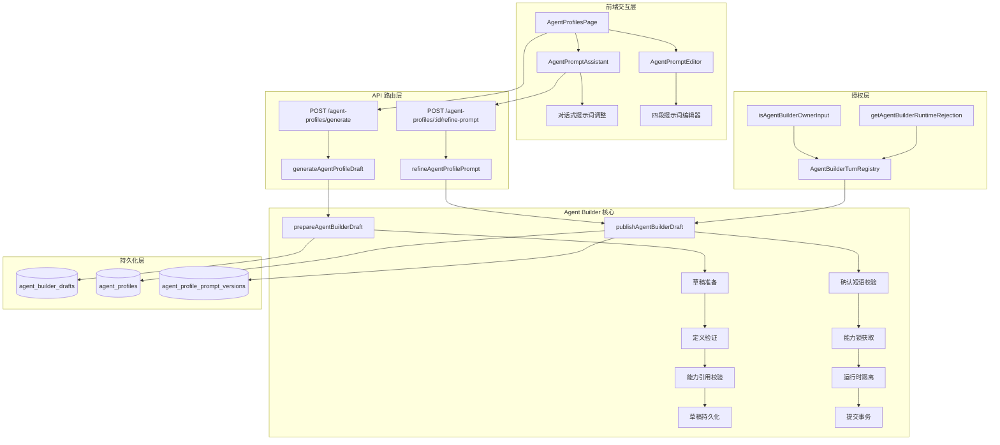
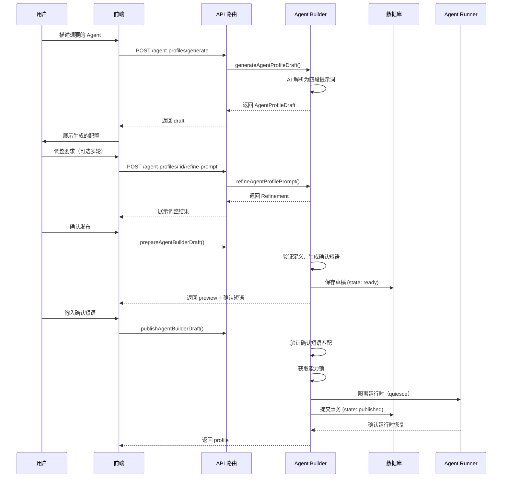
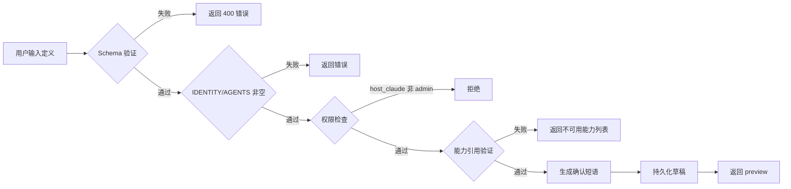
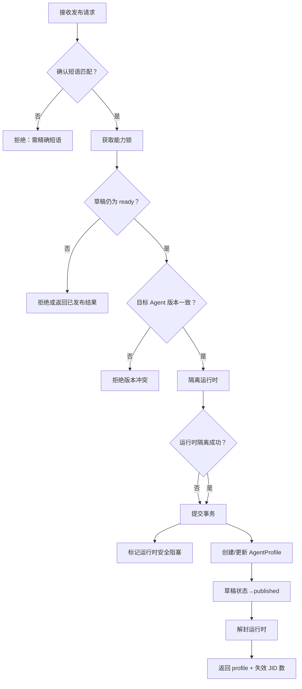
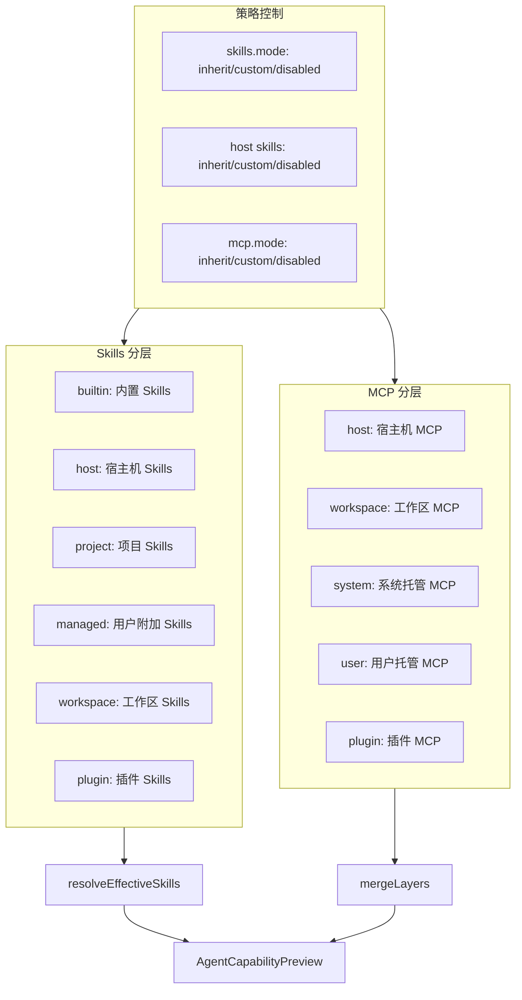
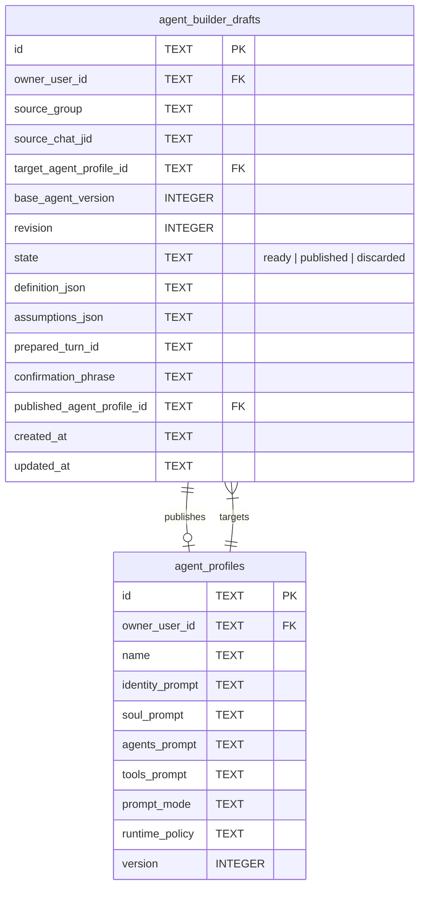

Agent Builder 是 HappyClaw 中一个独特的系统——它允许用户通过**自然语言对话**来创建和编辑 Agent，而不是通过传统的表单填写。用户描述想要的 Agent 行为，AI 生成四段式提示词结构（IDENTITY/SOUL/AGENTS/TOOLS），然后在一个受控的"准备→确认→发布"工作流中完成提交。这个系统将 AI 辅助生成与安全发布流程结合在一起，确保每一次 Agent 变更都经过用户明确确认和版本一致性检查。

## 架构总览

Agent Builder 的架构由三个核心层面构成：**AI 生成层**负责将自然语言解析为结构化提示词，**草稿管理层**负责多轮交互中的版本控制和状态转换，**安全发布层**负责在发布时执行运行时隔离和一致性校验。



Sources: [agent-builder.ts](src/agent-builder.ts#L1-L581), [agent-builder-turn-auth.ts](src/agent-builder-turn-auth.ts#L1-L356)

## 多轮交互工作流

Agent Builder 的核心交互模式是一个**三阶段工作流**：准备（Prepare）→ 确认（Confirm）→ 发布（Publish）。每个阶段都在不同的用户对话轮次中完成，严格的确认短语机制确保发布操作不会在用户不知情的情况下发生。



Sources: [agent-builder.ts](src/agent-builder.ts#L253-L566), [agent-profile-generator.ts](src/agent-profile-generator.ts#L206-L265)

### 阶段一：AI 生成与精炼

用户通过自然语言描述想要的 Agent，系统调用 Claude SDK 将描述解析为结构化的四段提示词。生成 Prompt 要求 AI 严格遵循四段职责分离原则，不虚构系统不存在的权限。

```typescript
// 生成 Prompts 的核心约束
- IDENTITY: 简洁说明"我是谁"、公开角色和核心使命
- SOUL: 稳定的价值观、气质、判断原则和沟通风格  
- AGENTS: 具体工作方式、流程、协作规则、输出偏好和行为边界
- TOOLS: 如何选择和使用工具、何时需要确认，以及工具使用限制
```

精炼（Refinement）阶段支持增量修改——用户可以指定只修改某个特定段落（`identity`/`soul`/`agents`/`tools`），AI 会保留其他段落的原文不动。对话历史最多保留 12 轮，用于上下文理解。

Sources: [agent-profile-generator.ts](src/agent-profile-generator.ts#L39-L107), [schemas.ts](src/schemas.ts#L411-L437)

### 阶段二：草稿准备与确认短语

当用户确认发布时，`prepareAgentBuilderDraft()` 执行完整的验证流程：

1. **Schema 验证**：通过 `AgentProfileCreateSchema`（Zod）校验输入结构，包括 name（≤80 字符）、四段提示词（每段 ≤20,000 字符）、runtime_policy 等
2. **语义验证**：IDENTITY 和 AGENTS 必须有实质内容（非空、非纯空白）
3. **权限验证**：`host_claude` Context 和 Host Skills 仅限 admin 角色
4. **能力引用验证**：自定义 Skills 和 MCP 必须在文件系统和托管层中真实存在
5. **版本一致性**：如果更新已有 Agent，`baseAgentVersion` 必须与当前版本匹配

验证通过后，系统生成一个随机确认短语（格式 `确认发布 AGENT-XXXXXXXX`），将草稿持久化到 `agent_builder_drafts` 表，状态为 `ready`。这个确认短语是发布操作的安全令牌——只有用户在下一条消息中精确输入该短语，发布才能继续。



Sources: [agent-builder.ts](src/agent-builder.ts#L64-L126), [agent-builder.ts](src/agent-builder.ts#L253-L341), [agent-profile-policy.ts](src/agent-profile-policy.ts#L1-L135)

### 阶段三：发布与运行时隔离

`publishAgentBuilderDraft()` 是 Agent Builder 中最复杂的操作，它执行一个**带运行时隔离的分布式事务**：

1. **确认短语验证**：`sourceMessageContent` 必须精确等于草稿中存储的 `confirmation_phrase`，且 `sourceTurnId` 必须与准备时的轮次不同（确保是后续消息）
2. **能力锁获取**：通过 `withCapabilityScopeLocks` 获取系统级和用户级能力锁，防止并发能力变更（如 Skills/MCP 删除）与发布操作冲突
3. **运行时隔离**：如果目标 Agent 有绑定的工作区，调用 `quiesceWorkspaceRunnersAroundCommit()` 暂停工作区的 Agent Runner，确保发布期间运行时不会读取到不一致的配置
4. **事务提交**：在数据库事务内调用 `commitAgentBuilderDraft()`，将草稿状态更新为 `published`，同时创建或更新 `agent_profiles` 记录
5. **运行时恢复**：发布完成后解封工作区运行时，如果有运行时清理失败，调用 `blockGroupsForRuntimeSafety()` 将失败的工作区标记为安全阻塞状态，防止使用不一致的配置运行



Sources: [agent-builder.ts](src/agent-builder.ts#L343-L566), [db.ts](src/db.ts#L7458-L7488)

## 关键数据结构

### AgentBuilderDefinition

这是用户通过对话生成的最终定义，包含 Agent 的完整配置：

```typescript
interface AgentBuilderDefinition extends AgentProfilePrompts {
  name: string;                         // Agent 名称，≤80 字符
  avatar_emoji: string | null;          // 头像 Emoji
  avatar_color: string | null;          // 头像背景色 (#RRGGBB)
  runtime_policy: AgentProfileRuntimePolicy;  // 运行时策略
  // 继承自 AgentProfilePrompts:
  identity_prompt: string;              // IDENTITY 段，≤20,000 字符
  soul_prompt: string;                  // SOUL 段，≤20,000 字符
  agents_prompt: string;                // AGENTS 段，≤20,000 字符
  tools_prompt: string;                 // TOOLS 段，≤20,000 字符
  prompt_mode: 'append' | 'replace';   // 提示词追加/替换模式
}
```

### AgentBuilderDraft

草稿记录完整的多轮交互状态，支持乐观并发控制：

```typescript
interface AgentBuilderDraft {
  id: string;                           // 草稿 ID（与新建 Agent 的 profile_id 相同）
  owner_user_id: string;                // 所有者用户 ID
  source_group: string;                 // 来源工作区
  source_chat_jid: string;              // 来源聊天 JID
  target_agent_profile_id: string | null; // 更新目标（null=新建）
  base_agent_version: number | null;    // 更新时的基础版本
  revision: number;                     // 乐观锁版本号
  state: 'ready' | 'published' | 'discarded'; // 状态机
  definition: AgentBuilderDefinition;   // 完整定义（JSON 序列化）
  assumptions: string[];                // 用户假设/约束
  prepared_turn_id: string | null;      // 准备时的轮次 ID
  confirmation_phrase: string;          // 确认短语
  published_agent_profile_id: string | null; // 发布后的 profile ID
}
```

### AgentProfileRuntimePolicy

控制 Agent 在运行时的能力边界：

```typescript
interface AgentProfileRuntimePolicy {
  context: {
    source: 'managed' | 'host_claude';    // 上下文来源
    auto_compact_window: number;           // 自动压缩窗口（0 或 100000-1000000）
    auto_compact_percentage: number;       // 自动压缩比例（0 或 50-90）
  };
  skills: {
    mode: 'inherit' | 'custom' | 'disabled'; // Skills 模式
    ids: string[];                              // 自定义 Skill ID 列表
    host?: {                                    // 宿主机 Skills（仅 admin）
      mode: 'inherit' | 'custom' | 'disabled';
      ids: string[];
    };
  };
  mcp: {
    mode: 'inherit' | 'custom' | 'disabled'; // MCP 模式
    ids: string[];                              // MCP 引用列表（system:xxx / user:xxx）
  };
}
```

Sources: [types.ts](src/types.ts#L291-L367), [schemas.ts](src/schemas.ts#L286-L384)

## 安全与授权模型

Agent Builder 的授权模型采用**多层次防御**策略，确保只有合法的所有者才能通过对话创建和修改 Agent：

### 运行时拒绝策略

`getAgentBuilderRuntimeRejection()` 在 Agent 运行时层面做第一道防线：

- 定时任务或隔离任务运行中不可用
- 仅限主 Agent（`is_default=true`）的普通对话会话
- 子 Agent（conversation/spawn）不可用

```typescript
// 拒绝条件
if (isScheduledTask || isolatedTaskId) → '不可用于定时/隔离任务'
if (runtimeAgentKind !== 'conversation' || runtimeAgentFolder !== sourceFolder) → '仅限主 Agent 对话'
if (!sourceProfileIsDefault) → '仅主 HappyClaw 可使用'
```

### 所有者输入验证

`isAgentBuilderOwnerInput()` 在消息层面验证输入合法性：

- **Web 端**：直接比较 `sender === ownerUserId`
- **IM 渠道**：通过 `registered_groups.owner_im_id` 和 `owner_claim_source` 进行渠道特定的发送者身份匹配，支持 WhatsApp（JID 规范化）、Telegram、Discord、钉钉、微信、QQ 等渠道

### 确认短语机制

发布操作的核心安全设计——它不是简单的按钮点击，而是一个**跨轮次的安全令牌**：

1. `prepareAgentBuilderDraft()` 生成随机短语（`确认发布 AGENT-${randomBytes(4).toUpperCase()}`）
2. 短语存储在草稿的 `confirmation_phrase` 字段
3. 发布时要求 `sourceTurnId !== prepared_turn_id`（必须是后续轮次）
4. `sourceMessageContent` 必须精确匹配短语（trim 后比较）
5. 草稿有乐观锁（`revision` 字段），并发修改会自动失败

Sources: [agent-builder-turn-auth.ts](src/agent-builder-turn-auth.ts#L28-L51), [agent-builder-turn-auth.ts](src/agent-builder-turn-auth.ts#L202-L226), [agent-builder.ts](src/agent-builder.ts#L307-L310)

## 能力预览系统

`buildAgentCapabilityPreview()` 是 Agent Builder 的配套系统，用于在发布前向用户展示 Agent 将拥有的完整能力集合。它解析 `runtime_policy` 并叠加多个能力层：



预览系统会检测同名 Skill 冲突（按优先级覆盖：builtin → host → project → managed → workspace → plugin），并识别系统 MCP 中仅限 admin 使用的条目。如果用户选择了一个工作区，预览还会包含该工作区的项目级 `.claude/skills` 和 `.mcp.json` 配置。

Sources: [agent-capability-preview.ts](src/agent-capability-preview.ts#L1-L365)

## 数据库持久化

Agent Builder 使用 `agent_builder_drafts` 表持久化草稿状态，与 `agent_profiles` 表通过 `published_agent_profile_id` 关联。草稿的完整定义以 JSON 格式存储在 `definition_json` 列中。



草稿状态机流转为：`ready` → `published`（成功发布）或 `ready` → `discarded`（用户放弃）。`commitAgentBuilderDraft()` 使用数据库事务保证草稿状态更新和 Agent Profile 创建/更新的原子性。

Sources: [db.ts](src/db.ts#L7337-L7488)

## 前端集成

前端 `AgentPromptAssistant` 组件提供了完整的对话式编辑体验。它维护了一个本地消息列表，每次用户的自然语言请求都会调用 `POST /agent-profiles/:id/refine-prompt` 接口，AI 返回完整四段提示词作为候选。用户可以通过"应用"按钮将候选提示词填入编辑器，然后手动保存。

关键的前端交互特性：

- **快速请求模板**：提供"让表达更简洁"、"补充工作边界"、"强化风险意识"等快捷入口
- **对话历史管理**：保留最近 12 轮对话用于上下文理解
- **安全提示**：AI 明确告知用户"不会自动保存"，需要用户主动点击"应用"和"保存"
- **Profile 切换隔离**：切换不同 Agent 时自动清空对话历史

Sources: [AgentPromptAssistant.tsx](web/src/components/agents/AgentPromptAssistant.tsx#L1-L321), [agent-profiles.ts](src/routes/agent-profiles.ts#L189-L424)

## 下一步

Agent Builder 的发布流程与 [Agent Profile 的四段式 Prompt 工程](13-agent-profile-she-ji-yu-si-duan-shi-prompt-gong-cheng) 紧密相连——理解提示词结构的设计原则有助于更好地使用对话式生成功能。发布后的 Agent 通过 [Agent Runner 执行引擎](7-agent-runner-zhi-xing-yin-qing-host-mo-shi-yu-container-mo-shi) 运行，其运行时策略（Skills/MCP 选择）在 [Skills、MCP Server 与 Claude Code Plugins 能力分层管理](14-skills-mcp-server-yu-claude-code-plugins-neng-li-fen-ceng-guan-li) 中有详细说明。