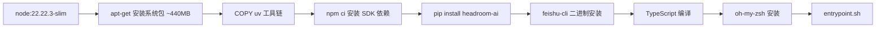
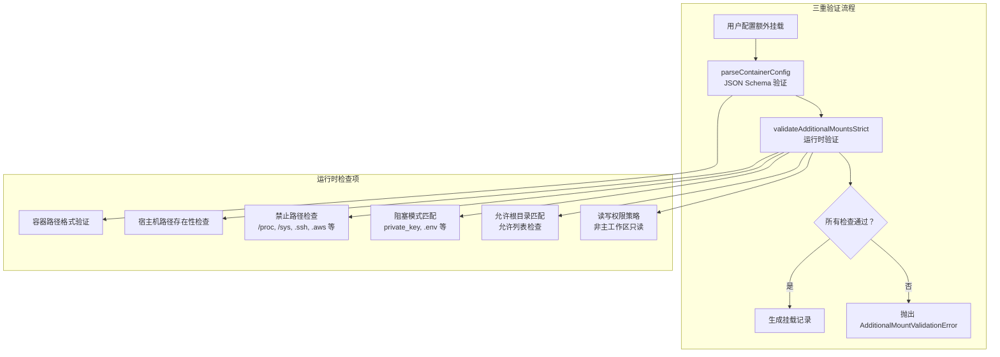
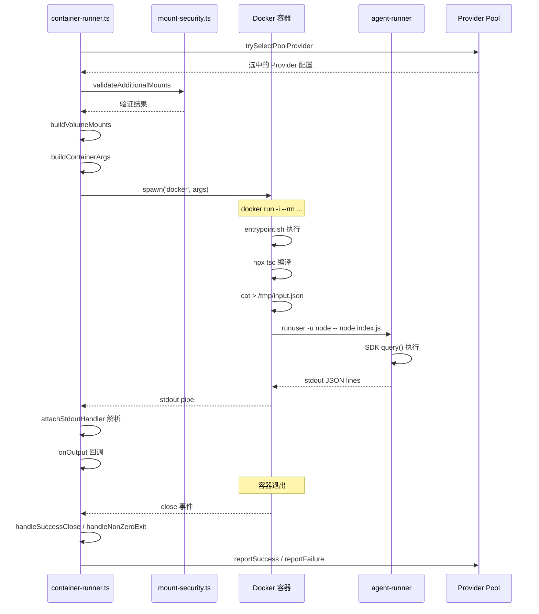
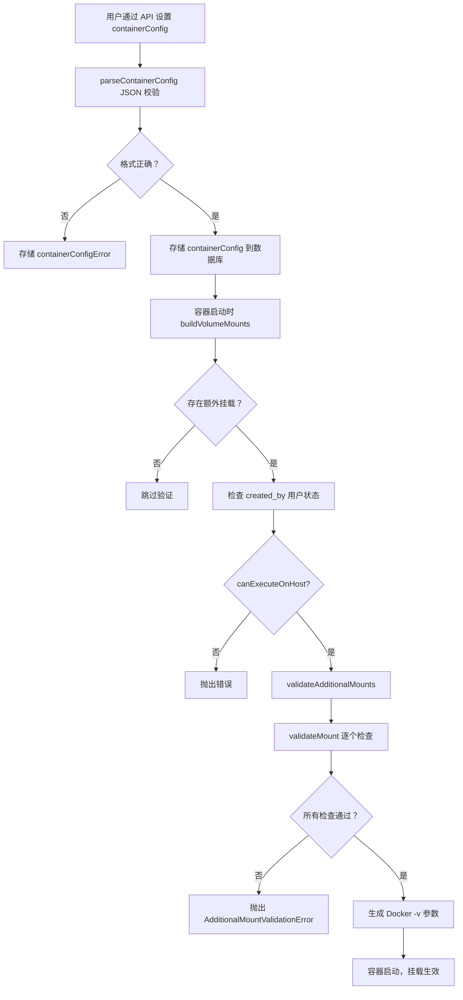

HappyClaw 的 Agent 执行引擎支持两种运行模式：**Host 模式**（宿主机直跑）和 **Container 模式**（Docker 容器隔离）。容器模式是默认的安全执行路径，它将每个 Agent 会话封装在独立的 Docker 容器中，通过 Linux 命名空间实现进程级隔离，并通过精心设计的卷挂载系统实现受控的数据交换。本文深入剖析容器的镜像构建、卷挂载架构、安全隔离策略和运行时生命周期。

## 架构概览

容器执行环境的架构围绕一个核心原则设计：**容器是无状态的执行沙箱，所有持久化状态由宿主机管理**。每个 `docker run` 调用生成的容器在 Agent 完成交互后即被销毁（`--rm` 标志），用户数据、会话状态、内存文件均通过挂载卷暴露给容器。

```mermaid
flowchart TB
    subgraph Host["宿主机（HappyClaw 后端）"]
        CR[container-runner.ts] --> |1. 构建挂载列表| VM[buildVolumeMounts]
        VM --> |2. 生成 docker run 参数| DC[buildContainerArgs]
        DC --> |3. spawn docker| DOCKER[docker run -i --rm]
        MS[mount-security.ts] --> |启动时验证额外挂载| VM
        HEP[host-execution-policy.ts] --> |检查管理员权限| VM
    end

    subgraph Docker["Docker 容器"]
        EP[entrypoint.sh] --> |4. 修复权限| RC[chown / chmod]
        RC --> |5. 加载环境变量| ENV[source /workspace/env-dir/env]
        ENV --> |6. 编译 TS 源码| TSC[npx tsc]
        TSC --> |7. 读取 stdin 输入| STDIN[cat > /tmp/input.json]
        STDIN --> |8. 启动 agent-runner| AR[node /tmp/dist/index.js]
        AR --> |9. 输出 JSON 到 stdout| OUT[stdout JSON lines]
    end

    subgraph Volumes["卷挂载（宿主机 → 容器）"]
        V1[/workspace/group - 工作组数据]
        V2[/workspace/global - 用户全局内存]
        V3[/workspace/memory - 会话内存]
        V4[/workspace/ipc - IPC 通信目录]
        V5[/workspace/extra - 额外持久化目录]
        V6[/home/node/.claude - 会话配置]
        V7[/workspace/effective-skills - Skills 只读挂载]
        V8[/workspace/env-dir - 环境变量文件]
        V9[/workspace/plugins - 插件只读挂载]
    end

    DOCKER -.-> |--rm 容器退出后销毁| DOCKER
    OUT --> |10. stdout 解析| CR
```

容器执行的核心流程：`container-runner.ts` 中的 `runContainerAgent` 函数首先调用 `buildVolumeMounts` 构建完整的挂载列表，经过 `mount-security.ts` 的安全验证后，通过 `buildContainerArgs` 生成 `docker run` 命令参数。容器启动后，`entrypoint.sh` 执行权限修复和环境初始化，然后编译 TypeScript 源码、读取 stdin 中的输入 JSON，最后以 `node` 用户身份启动 agent-runner 进程。agent-runner 的输出通过 stdout 以 JSON lines 格式流式返回，由宿主机端的 `attachStdoutHandler` 解析。

Sources: [container-runner.ts](src/container-runner.ts#L1520-L1560), [entrypoint.sh](container/entrypoint.sh#L1-L10)

## 可复现的 Docker 镜像构建

容器镜像基于 `node:22.22.3-slim` 构建，采用多阶段设计确保构建的可复现性。所有依赖均通过摘要哈希（SHA256）锁定版本，避免上游包发布漂移导致的构建不一致。

### 镜像层结构



每一层都经过精心排序以最大化缓存命中率。系统包层（~440MB）放在最前面，因为它是变化最少的层——后续的 `apt-get` 变动不会频繁触发。`uv` 工具链通过 `COPY --from=` 从不可变摘要引用复制，避免了 `apt-get` 层变更时连带失效。SDK 依赖通过 `npm ci` 锁定，强制 `package.json` 和 `package-lock.json` 一致。

Sources: [Dockerfile](container/Dockerfile#L1-L40)

### 版本锁定策略

镜像中关键依赖的版本锁定方式体现了 HappyClaw 对构建可复现性的严格要求：

| 组件 | 锁定方式 | 验证机制 |
|---|---|---|
| 基础镜像 | `node:22.22.3-slim@sha256:e...` | Docker 摘要验证 |
| uv 工具链 | `ghcr.io/astral-sh/uv:0.11.16@sha256:4...` | 双重摘要验证 |
| npm 依赖 | `package-lock.json` + `npm ci` | `npm ci` 拒绝 lockfile 漂移 |
| headroom-ai | `==0.27.0` 版本锁定 | `headroom --version` |
| feishu-cli | `v1.35.0` + SHA256 校验和 | `sha256sum -c` + `feishu-cli --version` |
| oh-my-zsh | Git commit SHA + SHA256 | `sha256sum -c` |

feishu-cli 的安装过程特别值得关注：它根据 `TARGETARCH` 构建参数选择 amd64 或 arm64 架构的二进制，并通过 `sha256sum -c` 验证下载完整性。如果哈希不匹配，构建立即失败——这种设计防止了中间人攻击或不完整下载导致的安全问题。

Sources: [Dockerfile](container/Dockerfile#L60-L100)

### 构建网络策略

`build.sh` 脚本默认使用 `--network=host` 来避免 Docker 默认桥接网络（8.8.8.8 DNS）在 VPN/隧道环境中不可靠的问题。当构建环境使用受限的 rootless BuildKit 时（host 网络需要额外授权），脚本会优雅降级为重试默认桥接网络：

```bash
BUILD_NETWORK="${BUILD_NETWORK:-host}"
if ! docker build --network="${BUILD_NETWORK}" -t "${IMAGE_NAME}:${TAG}" .; then
  if [ "${BUILD_NETWORK}" = "host" ]; then
    docker build -t "${IMAGE_NAME}:${TAG}" .
  fi
fi
```

Sources: [build.sh](container/build.sh#L1-L44)

## 卷挂载架构

容器模式的灵魂在于卷挂载系统。`buildVolumeMounts` 函数根据工作组属性、Agent Profile 策略、用户权限等因素，动态构建一个完整的挂载列表。每个挂载点都有明确的读写策略和语义角色。

### 核心挂载点

| 容器路径 | 宿主机源路径 | 读写权限 | 用途 |
|---|---|---|---|
| `/workspace/group` | `data/groups/{folder}` | 读写 | 工作组工作目录，Agent 的 CWD |
| `/workspace/global` | `data/groups/user-global/{userId}` | 主工作区读写，非主工作区只读 | 用户全局内存文件 |
| `/workspace/memory` | `data/memory/{folder}` | 主工作区读写，非主工作区只读 | 会话内存持久化 |
| `/workspace/ipc` | `data/ipc/{folder}` | 读写 | IPC 通信目录（含 messages、tasks、input、agents 子目录） |
| `/workspace/extra` | `data/extra/{folder}` | 读写 | 用户额外持久化目录（npm 全局包等） |
| `/home/node/.claude` | `data/sessions/{folder}/.claude` | 读写 | Claude Code 会话配置、settings.json |
| `/home/node/.claude.json` | `data/config/container-claude-json.json` | 只读 | 精简版 Claude 身份文件 |
| `/workspace/effective-skills/{id}` | `data/skills/{userId}/{id}` 等 | 只读 | 每个选中的 Skill 独立只读挂载 |
| `/workspace/env-dir` | `data/env/{folder}/...` | 只读 | 环境变量文件 |
| `/workspace/plugins` | `data/runtime/{userId}` | 只读 | Claude Code 插件 |
| `/workspace/project` | 项目根目录 | 读写 | 仅 Admin Home 工作区挂载 |

Sources: [container-runner.ts](src/container-runner.ts#L1090-L1500)

### IPC 目录架构

IPC 目录是容器与宿主机之间异步通信的桥梁。每个工作组拥有独立的 IPC 命名空间，子 Agent 和隔离任务则拥有更深层的隔离子目录：

```
data/ipc/{groupFolder}/
├── messages/          # 消息 IPC（发消息到 IM）
├── tasks/             # 任务 IPC（创建子任务）
├── input/             # 输入 IPC（接收外部输入）
└── agents/
    └── {agentId}/     # 子 Agent 的 IPC 命名空间
        ├── messages/
        ├── tasks/
        └── input/
```

所有 IPC 子目录使用 `0o777` 权限，确保宿主机端（agent 用户，uid 1002）和容器端（node 用户，uid 1000）都能读写。

Sources: [container-runner.ts](src/container-runner.ts#L1320-L1340)

### 会话目录与 .claude.json 处理

`.claude.json` 文件承载 Claude Code 的 deviceId（用户身份标识）。HappyClaw 采用两层策略确保身份一致性：

1. **宿主机层**：`~/.claude.json` 包含完整的 SDK 配置，包括 `cachedGrowthBookFeatures`（含 `tengu_bridge_repl_v2` 等 feature flags）和 `oauthAccount`。
2. **容器层**：`getContainerClaudeJsonPath()` 剥离 feature flags 和 OAuth 凭据，生成精简版容器 `.claude.json`。这是必要的，因为 SDK 初始化时会根据 feature flags 尝试建立 bridge 连接，在容器网络环境中无法完成会导致进程挂起。

```typescript
function getContainerClaudeJsonPath(): string {
  const hostJson = JSON.parse(fs.readFileSync(getHostClaudeJsonPath(), 'utf-8'));
  const stripped = { ...hostJson };
  delete stripped.cachedGrowthBookFeatures;
  delete stripped.oauthAccount;
  stripped.autoUpdates = false;
  // ...写入精简版 JSON
}
```

容器内实际的 `.claude.json` 位于会话目录中，是一个 symlink 指向容器内部的精简版。宿主机侧通过 `ensureSymlinkTo` 维护这个链接关系。

Sources: [container-runner.ts](src/container-runner.ts#L70-L140)

### settings.json 管理

`ensureSettingsJson` 函数负责维护会话目录中的 `settings.json`，这是 Claude Code 的核心配置文件。它采用"投影合并"策略：

1. 读取当前会话 `settings.json`
2. 读取前一次 HappyClaw 写入的投影文件 `.happyclaw-native-settings.json`
3. 从当前设置中移除前一次投影的设置（还原用户手动修改的部分）
4. 叠加新的基础设置（MCP servers、环境变量等）
5. 强制注入 `REQUIRED_SETTINGS_ENV`（如 `CLAUDE_CODE_DISABLE_ATTACHMENTS: '1'`）

```typescript
const REQUIRED_SETTINGS_ENV: Record<string, string> = {
  CLAUDE_CODE_EXPERIMENTAL_AGENT_TEAMS: '0',
  CLAUDE_CODE_ADDITIONAL_DIRECTORIES_CLAUDE_MD: '1',
  CLAUDE_CODE_DISABLE_AUTO_MEMORY: '0',
  CLAUDE_CODE_DISABLE_ATTACHMENTS: '1',
};
```

`CLAUDE_CODE_DISABLE_ATTACHMENTS=1` 的设定尤为关键：SDK 默认会在每次 `query()` 时动态注入 `token_usage`、`changed_files` 等 20+ 种附件消息，这些消息不持久化到 JSONL 但会导致跨进程的消息前缀不匹配，使 prompt cache 永远失效。禁用后，历史消息的缓存前缀跨 `query()` 保持一致，实现 1M 上下文下的增量缓存命中。

Sources: [container-runner.ts](src/container-runner.ts#L200-L280)

## 安全隔离体系

容器执行环境的安全隔离分为三个层次：**所有权验证**（谁能执行容器）、**挂载控制**（容器能访问哪些宿主机路径）和**运行时防护**（容器内进程如何降权）。

### 所有权验证：Host Execution Policy

`host-execution-policy.ts` 定义了容器执行和宿主机挂载的前提条件。只有状态为 `active` 的 `admin` 角色用户才能执行容器和配置额外挂载。这是一个**实时权限**——每次执行前都从数据库重新读取用户记录，而非缓存工作区创建时的权限快照：

```typescript
export function canExecuteOnHost(
  owner: (Pick<User, 'role' | 'status'> & { id?: string }) | null | undefined,
): boolean {
  return (
    owner?.role === 'admin' &&
    owner.status === 'active' &&
    (!owner.id || !revokingHostPrivilegeUserIds.has(owner.id))
  );
}
```

此外，系统支持动态撤销权限：`beginHostPrivilegeRevocation` 将用户 ID 加入撤销集合，正在运行的容器完成后、新容器启动时立即生效。

Sources: [host-execution-policy.ts](src/host-execution-policy.ts#L1-L30)

### 挂载控制：Mount Allowlist 三重验证

`mount-security.ts` 实现了分层挂载安全策略，在**工作区创建时**和**每次容器启动前**都进行验证，确保持久化的配置不会被视为永久的授权许可。



**第一层：JSON Schema 验证** — `parseContainerConfig` 解析用户配置的 `container_config` 对象，验证字段完整性（仅允许 `version`、`timeout`、`additionalMounts` 三个字段），每个额外挂载条目必须包含 `hostPath`、`containerPath` 和可选的 `readonly`。容器路径不得超过 512 字符，不能包含控制字符或路径遍历（`..`），不能使用保留组件（如 `.npm-global`）。

**第二层：运行时路径验证** — `validateMount` 展开和规范化路径，检查：
- 宿主机路径必须是绝对路径且存在
- 硬禁止路径（`/proc`、`/sys`、`/dev`、Docker 套接字、`~/.ssh`、`~/.aws` 等 20+ 个敏感系统路径）
- 阻塞模式匹配（`credentials`、`.env`、`.netrc`、`id_rsa` 等敏感模式）
- 必须落在允许根目录列表中

**第三层：权限策略** — 即使路径在允许根目录内，还需检查：
- 非主工作区（`isMain=false`）默认只读（`nonMainReadOnly: true`）
- 允许根目录自身可能仅允许只读挂载（`allowReadWrite: false`）

默认的 `mount-allowlist.json` 允许完整的 `~` 目录访问，这适合单用户部署场景。生产环境应限制到特定项目目录。

Sources: [mount-security.ts](src/mount-security.ts#L1-L712), [mount-allowlist.json](config/mount-allowlist.json#L1-L12)

### 运行时防护：entrypoint.sh 的权限降级

`entrypoint.sh` 实现了关键的运行时安全策略：

1. **umask 0000**：容器内创建的文件默认可写，确保宿主机端（agent 用户，uid 1002）能删除/修改容器创建的文件
2. **chown 修复**：以 root 身份运行 `chown -R node:node` 修复挂载卷的权限，解决 rootless podman 中 uid 映射导致的 EACCES 错误
3. **git 安全目录**：`git config --global --add safe.directory '*'` 绕过 CVE-2022-24765 所有权检查
4. **runuser 降权**：`runuser -u node -- node /tmp/dist/index.js` 从 root 降权到 node 用户执行 agent-runner
5. **EXIT trap 清理**：`chmod -R a+rwX` 修复 Claude Code 创建的 `0600` 权限文件，确保宿主机可读

```bash
# 关键的安全降权流程
umask 0000                    # 1. 放宽 umask
chown -R node:node ...        # 2. 修复卷权限（root 身份）
runuser -u node -- node ...   # 3. 降权执行 agent-runner
trap cleanup EXIT             # 4. 退出时修复权限
```

Sources: [entrypoint.sh](container/entrypoint.sh#L1-L103)

## 入口点与运行时初始化

`entrypoint.sh` 的执行顺序决定了容器的行为模式。理解它有助于排查容器启动失败的问题。

### 环境变量注入

容器通过 `/workspace/env-dir/env` 文件加载环境变量，这些文件由宿主机在启动前生成，包含 Provider API 密钥、模型配置等敏感信息。`env` 文件使用 `0o600` 权限保护，通过只读挂载注入容器。

关键环境变量包括：

| 环境变量 | 值 | 用途 |
|---|---|---|
| `CLAUDE_CONFIG_DIR` | `/home/node/.claude` | 避免 CLI 尝试写入只读的 `.claude.json` |
| `IS_SANDBOX` | `1` | 允许 `--dangerously-skip-permissions`（Claude Code 2.1.114+ 要求） |
| `PATH` | `/app/node_modules/.bin:...` | 确保 SDK 自带的 `claude` CLI 在 PATH 首位 |
| `TZ` | `Asia/Shanghai` 等 | 容器时区 |
| `ANTHROPIC_API_KEY` / `ANTHROPIC_AUTH_TOKEN` | Provider 配置 | LLM API 认证 |

特别的，`npm prefix` 被重定向到 `/workspace/extra/.npm-global`，使容器内 `npm install -g` 安装的包持久化到宿主机，避免每次容器重建后重新安装。

Sources: [entrypoint.sh](container/entrypoint.sh#L28-L60)

### Skills 物化

`entrypoint.sh` 的 Skills 物化流程确保了容器每次启动时都能获得正确的 Skill 集合：

```bash
# 重建 Skills 目录，防止旧容器遗留的目录幸存
mkdir -p /home/node/.claude/skills
find /home/node/.claude/skills -mindepth 1 -maxdepth 1 -exec rm -rf -- {} +
if [ -d /workspace/effective-skills ]; then
  for skill in /workspace/effective-skills/*/; do
    if [ -f "${skill}SKILL.md" ]; then
      name=$(basename "$skill")
      ln -sfn "$skill" "/home/node/.claude/skills/$name"
    fi
  done
fi
```

每个 Skill 通过独立的只读卷挂载到 `/workspace/effective-skills/{id}`，entrypoint 通过符号链接将这些 Skill 注册到 Claude Code 的 Skills 目录。`SKILL.md` 文件的存在性检查确保了只有完整有效的 Skill 被注册。

Sources: [entrypoint.sh](container/entrypoint.sh#L62-L75)

### 类型重编译

容器每次启动时都会重新编译 TypeScript 源码，这允许 `agent-runner/src` 源码通过热挂载机制（`src` 目录从宿主机挂载到 `/app/src`）实现零启动延迟的代码更新：

```bash
cd /app && npx tsc --outDir /tmp/dist 2>&1 >&2
ln -s /app/node_modules /tmp/dist/node_modules
ln -s /app/prompts /tmp/prompts
chmod -R a-w /tmp/dist
```

编译输出到 `/tmp/dist` 而非容器镜像内的 `/app/dist`，因为镜像构建时编译的可能是旧版本代码。`chmod -R a-w` 确保运行时不可意外修改编译产物。

Sources: [entrypoint.sh](container/entrypoint.sh#L78-L82)

## 容器执行生命周期

`runContainerAgent` 函数管理容器的完整生命周期，包含 Provider 管理、超时控制、输出解析和故障恢复。

### 执行流程



### Provider 故障恢复

容器执行中最重要的故障恢复机制是 Provider 故障处理。当 agent-runner 报告 Provider 故障时，系统会：

1. 将故障 Provider 加入隔离名单（`providerPool.reportFailure`）
2. 根据故障类型判断是否可重试（`applyProviderFailureDisposition`）
3. 如果是终端故障（池耗尽），标记 `providerFailureTerminal` 并停止重试
4. 如果是维护期间故障且输入已完成（`healthyInputTurnCompleted`），静默隔离

`runAgentWithModelFallback` 包装函数为定时任务提供了跨 Provider 重试能力：当第一个 Provider 失败且非终端时，使用下一个健康的 Provider 重新执行整个输入。

Sources: [container-runner.ts](src/container-runner.ts#L1900-L2100)

### 超时控制

每个容器有独立的超时设置，来源优先级为：工作区自定义 `containerConfig.timeout` > 系统全局 `containerTimeout`。超时处理采用两阶段策略：

1. **优雅停止**：`docker stop {containerName}`，给容器 15 秒的 SIGTERM 窗口
2. **强制终止**：如果优雅停止失败或超时，`container.kill('SIGKILL')`

```typescript
const killOnTimeout = () => {
  timedOut = true;
  execFile('docker', ['stop', containerName], { timeout: 15000 }, (err) => {
    if (err) {
      container.kill('SIGKILL');
    }
  });
};
```

Sources: [container-runner.ts](src/container-runner.ts#L1780-L1800)

## 额外挂载的完整工作流

理解额外挂载（`additionalMounts`）从配置到生效的完整链路，有助于排查挂载相关的问题。



关键的设计决策：**每次容器启动时重新验证，而非仅在工作区创建时验证**。这意味着即使管理员在创建额外挂载后降权为普通用户，已持久化的挂载配置也会在下次容器启动时被拒绝。

Sources: [mount-security.ts](src/mount-security.ts#L600-L712)

## 与 Host 模式的对比

容器模式与 Host 模式（宿主机直跑）在多个维度上存在根本差异：

| 维度 | 容器模式 | Host 模式 |
|---|---|---|
| 进程隔离 | Docker 容器命名空间 | 宿主机进程 |
| 文件系统隔离 | 挂载卷，受 mount-allowlist 约束 | 直接访问宿主机文件系统 |
| 权限模型 | node 用户（uid 1000）+ entrypoint 降权 | 宿主机 agent 用户（uid 1002） |
| 依赖管理 | 镜像内置 Chromium、Python、uv 等 | 依赖宿主机已安装的工具 |
| 启动速度 | 秒级（镜像拉取 + 容器创建） | 毫秒级（进程 fork） |
| 资源隔离 | cgroups 可限制内存/CPU | 无隔离 |
| 持久化 | 挂载卷，容器销毁后数据保留 | 直接写入宿主机文件系统 |
| 安全风险 | 低（即使容器被攻破，挂载卷受控） | 中（Agent 直接访问宿主机文件） |

Host 模式仅限管理员使用，且需要 `canExecuteOnHost` 的实时权限检查。容器模式是默认的、推荐的安全执行路径。

Sources: [host-execution-policy.ts](src/host-execution-policy.ts#L1-L30), [container-runner.ts](src/container-runner.ts#L1-L3021)

## 总结

HappyClaw 的 Docker 容器执行环境通过三层安全体系（所有权验证、挂载控制、运行时降权）和精心设计的卷挂载架构，实现了安全的 Agent 执行沙箱。容器模式的核心设计哲学是"无状态执行、有状态存储"——容器本身不保存任何持久化数据，所有状态通过挂载卷由宿主机管理，确保了即使容器被攻破，攻击面也严格受控。

镜像构建的可复现性设计（SHA256 锁定所有依赖、分层优化缓存、构建网络策略）确保了不同环境下的构建一致性，而 IPC 目录架构和 Skills 物化机制则保证了容器内外的无缝协作。

---

**进一步阅读**：
- [Agent Runner 执行引擎：Host 模式与 Container 模式](7-agent-runner-zhi-xing-yin-qing-host-mo-shi-yu-container-mo-shi) — 两种执行模式的完整对比
- [运行时 IPC 协议：Agent Runner 与主进程通信机制](17-yun-xing-shi-ipc-xie-yi-agent-runner-yu-zhu-jin-cheng-tong-xin-ji-zhi) — 容器与宿主机间的 IPC 细节
- [多租户安全隔离：Host 执行权限、资源隔离与敏感操作保护](22-duo-zu-hu-an-quan-ge-chi-host-zhi-xing-quan-xian-zi-yuan-ge-chi-yu-min-gan-cao-zuo-bao-hu) — 更广泛的安全隔离策略