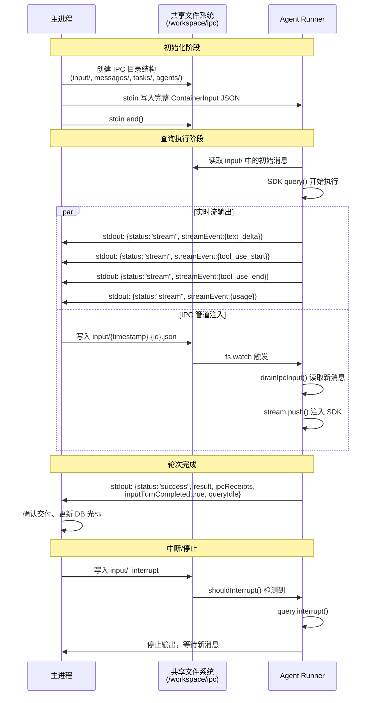

HappyClaw 的 Agent Runner（无论是容器模式还是 Host 模式）与主进程之间通过**文件系统 IPC（Inter-Process Communication）**协议进行通信。这套协议的核心设计原则是：**零网络依赖、原子写入保障、可恢复的交付语义**。Runner 与主进程不共享内存空间，也不通过 HTTP/gRPC 进行通信，而是通过绑定到容器内 `/workspace/ipc` 目录的共享卷来实现双向消息交换。这在容器化环境中避免了复杂的网络配置，在 Host 模式下则直接复用同一文件系统。

Sources: [container-runner.ts](src/container-runner.ts#L1328-L1347), [ipc-delivery.ts](container/agent-runner/src/ipc-delivery.ts#L1-L10)

## IPC 目录结构与命名空间隔离

协议的基础是精心设计的目录命名空间。每个 Group（工作区）在 `data/ipc/{group.folder}/` 下拥有独立的 IPC 根目录，内部再按子目录划分功能区域：

```
data/ipc/{group.folder}/
├── input/          ← 主进程 → Runner 的输入通道
├── messages/       ← Runner → 主进程的 send_message 输出
├── tasks/          ← Runner → 主进程的 Task 操作输出
└── agents/         ← Conversation Agent 的子 IPC 命名空间
    └── {agentId}/
        ├── input/
        ├── messages/
        └── tasks/
```

当 Conversation Agent 或 Isolated Task 运行时，命名空间会进一步隔离。Agent 的 IPC 目录位于 `data/ipc/{group.folder}/agents/{agentId}/`，而 Isolated Task 则位于 `data/ipc/{group.folder}/tasks-run/{taskRunId}/`。这种设计确保多个并发运行的子 Agent 不会互相干扰，同时主 Agent 的 IPC 通道始终稳定可用。

Sources: [container-runner.ts](src/container-runner.ts#L1324-L1344), [container-runner.ts](src/container-runner.ts#L2226-L2244)

## IPC 输入协议：主进程 → Runner

### 输入文件格式

主进程通过向 `input/` 目录写入 JSON 文件来向 Runner 发送消息。每个文件代表一条用户输入，采用以下格式：

```json
{
  "type": "message",
  "text": "用户消息内容",
  "images": [{"data": "base64编码数据", "mimeType": "image/jpeg"}],
  "queryRunId": "当前查询的运行时标识",
  "sourceJid": "消息来源的 JID",
  "channelContext": { "provider": "feishu", "sourceJid": "feishu:xxx", ... },
  "taskId": "关联的定时任务 ID",
  "receipt": {
    "deliveryId": "交付唯一标识",
    "chatJid": "对话 JID",
    "coveredCursors": [],
    "cursor": { "timestamp": "...", "id": "..." }
  }
}
```

写入过程采用**原子两阶段写入**：先写入 `.tmp` 临时文件，再 `rename` 为目标文件。这确保 Runner 在读取时永远不会看到不完整的输入。`receipt` 字段是 IPC 交付承诺的核心——它携带了鼠标光标信息，使得主进程能够精确追踪哪些消息已被 Runner 确认消费。

Sources: [group-queue.ts](src/group-queue.ts#L1497-L1530), [ipc-delivery.ts](container/agent-runner/src/ipc-delivery.ts#L7-L28)

### 控制信号量（Sentinels）

除了消息文件，输入目录还支持三个特殊信号量文件，用于控制 Runner 的生命周期：

| 信号量文件 | 用途 | 触发时机 |
|---|---|---|
| `_close` | 立即关闭 Runner | 用户停止、会话结束 |
| `_drain` | 完成当前查询后优雅退出 | Provider 切换、OAuth 刷新 |
| `_interrupt` | 中断当前查询但不退出 | 用户点击"停止"、发送新消息 |

`_close` 信号量在 Runner 的 `waitForIpcMessage()` 空闲等待循环中被检测到，触发进程立即退出。`_drain` 则不同，它只在当前 SDK 查询完成后才被检查，实现"一问一答"语义——确保 Runner 不会在模型正在生成回复时被强行终止。`_interrupt` 信号量最为精细，它让 Runner 调用 `query.interrupt()` 中止当前 SDK 查询，但保持进程存活，随后可以继续接收新的 IPC 输入。

Sources: [index.ts](container/agent-runner/src/index.ts#L1301-L1350), [group-queue.ts](src/group-queue.ts#L1800-L1880)

### 输入轮询与事件驱动

Runner 使用 `fs.watch()` 对输入目录进行事件驱动的文件监听，同时以 5 秒为间隔的回退轮询作为可靠性保障。这是因为 Docker 的 bind mount（尤其在 macOS 的 virtiofs 上）可能无法可靠地触发所有文件系统事件。`createIpcWatcher()` 函数封装了这种双重策略：

```typescript
// 事件驱动监听（主路径）
watcher = fs.watch(IPC_INPUT_DIR, () => { debouncedDetect(); });

// 回退轮询（可靠性保障）
fallbackTimer = setInterval(() => { onFileDetected(); }, IPC_FALLBACK_POLL_MS);
```

两种路径都经过 50ms 的去抖合并，防止批量写入时触发过多检测循环。

Sources: [index.ts](container/agent-runner/src/index.ts#L1450-L1495)

### 输入批处理与排序

`drainIpcInput()` 函数负责读取并消费输入目录中的所有 JSON 文件。读取后，消息通过 `orderIpcInputMessages()` 进行排序——当所有消息都携带 `receipt` 时，使用数据库光标（`cursor.timestamp` + `cursor.id`）作为权威排序依据，而非文件名顺序。这是因为在并发写入场景下，文件名的创建时间戳可能颠倒，而数据库光标提供了全局一致的顺序。

```typescript
export function orderIpcInputMessages(messages: IpcInputMessage[]): IpcInputMessage[] {
  if (messages.length < 2 || messages.some((m) => !m.receipt)) return [...messages];
  return [...messages].sort((a, b) => {
    // 按 cursor 的 timestamp + id 字典序排序
  });
}
```

Sources: [ipc-delivery.ts](container/agent-runner/src/ipc-delivery.ts#L30-L53)

## IPC 输出协议：Runner → 主进程

### stdout 帧协议

Runner 的输出通过标准输出（stdout）以帧协议传输。每帧由一对标记分隔：

```
---HAPPYCLAW_OUTPUT_START---
{"status":"success","result":"...","inputTurnId":"..."}
---HAPPYCLAW_OUTPUT_END---
```

主进程的 `attachStdoutHandler()` 使用括号深度感知的 JSON 解析器来提取帧内容。这意味着即使 Agent 的回复文本中包含了 `---HAPPYCLAW_OUTPUT_START---` 字面量，解析器也不会被欺骗——它通过匹配 `{` 和 `}` 的嵌套深度来定位 JSON 对象的真实边界，而非扫描结束标记。

Sources: [agent-output-parser.ts](src/agent-output-parser.ts#L1-L80), [index.ts](container/agent-runner/src/index.ts#L835-L845)

### ContainerOutput 信道

每个输出帧是一个 `ContainerOutput` 对象，支持多种信道类型：

| 字段 | 类型 | 说明 |
|---|---|---|
| `status` | `'success' \| 'error' \| 'stream' \| 'closed'` | 输出状态 |
| `result` | `string \| null` | 最终回复文本 |
| `streamEvent` | `StreamEvent` | 实时流事件（工具调用、进度等） |
| `ipcReceipts` | `Array` | IPC 交付确认回执 |
| `inputTurnCompleted` | `boolean` | 当前输入轮次是否已完成 |
| `queryIdle` | `boolean` | 查询是否已无更多待处理输入 |
| `pendingBgTasks` | `number` | 未完成的后台任务数 |
| `providerFailure` | `boolean` | Provider 是否失败 |

`streamEvent` 字段是实时流事件的核心载体，它携带 `text_delta`、`tool_use_start`、`tool_use_end`、`tool_result` 等事件类型，用于在 IM 卡片或 Web 端实时渲染 Agent 的思考过程与工具调用轨迹。`ipcReceipts` 是 Runner 对主进程 IPC 交付承诺的确认，包含 `deliveryId` 和 `cursor`，主进程据此更新数据库中的光标位置。

Sources: [container-runner.ts](src/container-runner.ts#L400-L450), [stream-event.ts](shared/stream-event.ts#L1-L100)

## IPC 交付轮次追踪（IpcTurnDeliveryTracker）

`IpcTurnDeliveryTracker` 是 Runner 端管理 IPC 交付状态的核心组件。它维护了一个**多轮次队列**，因为 Runner 在一个 SDK 查询期间可能接收多个 IPC 输入——例如用户在前一条消息的回复生成过程中又发送了一条新消息。

```typescript
class IpcTurnDeliveryTracker {
  readonly unacknowledgedMessages: IpcInputMessage[];  // 未确认的所有消息
  private readonly turns: IpcInputMessage[][];          // 按轮次分组的消息
}
```

关键机制：

1. **`acceptTurn(messages)`**：接受一组新的 IPC 输入，追加到轮次队列末尾。当新消息到达时（通过 `pollIpcDuringQuery` 管道注入），如果当前没有正在进行的轮次，新消息立即成为当前轮次并激活输入。

2. **`completeNextTurn()`**：当前 SDK 轮次完成时调用，将当前轮次的消息从 `unacknowledgedMessages` 中移除，并返回所有 `receipt` 用于回执确认。该函数仅在 `inputTurnCompleted === true` 且没有 pending 后台任务时才会被调用。

3. **`cancelCurrentTurn()`**：中断时调用，将当前轮次的消息从追踪器中移除但不确认（这些消息可以被重新注入到下一次查询中）。

4. **`hasPendingTurns`**：判断是否还有未完成的轮次。当此值为 `true` 时，即使当前 SDK 结果已经完成，Runner 也不会关闭流——它会保持连接，等待后续轮次的结果。

这个设计实现了"持续会话"（warm runner）的核心能力：Runner 进程在多个用户输入轮次之间保持存活，SDK 上下文（包括对话历史、工具注册状态）得以复用，避免了每次轮次都重新初始化的冷启动开销。

Sources: [ipc-delivery.ts](container/agent-runner/src/ipc-delivery.ts#L120-L270)

## 实时流管道（StreamEventProcessor）

`StreamEventProcessor` 负责将 SDK 的原生事件流转换为 HappyClaw 的 `StreamEvent` 格式，并实时通过 `writeOutput()` 以 `status: 'stream'` 帧发送给主进程。它处理了以下关键转换：

- **文本缓冲**：`text_delta` 和 `thinking_delta` 事件以 100ms / 200 字符的阈值批量刷新，避免高频小帧导致主进程过载。`thinking_tokens` 的刷新频率降低到 2 秒一次，因为推理过程中的 token 计数可能每秒到达数千次。

- **工具调用追踪**：`tool_use_start` / `tool_use_end` 事件携带工具名称、输入摘要、结果摘要，并支持嵌套工具（Skill 内部调用的工具）和子 Agent（Task 工具）的上下文关联。

- **Workflow 动态投影**：Claude Code 的 Workflow 执行状态通过 `task_progress` 和 `task_notification` 事件实时更新，投射为 `WorkflowRunSnapshot` 结构，供前端展示多 Agent 协作的完整进度。

- **后台任务管理**：`pendingSdkTasks` 集合追踪所有未完成的 SDK 任务（Bash 后台任务、异步 Agent 等）。当 `pendingBgTasks > 0` 时，Runner 不会将当前结果标记为 final，而是等待所有后台任务完成后才提交最终的 `inputTurnCompleted`。

Sources: [stream-processor.ts](container/agent-runner/src/stream-processor.ts#L1-L200)

## 主进程侧：GroupQueue 与 IPC 交付路由

主进程的 `GroupQueue` 是 IPC 通信的调度中心。它负责管理每个 Group 的 Runner 生命周期，并通过 `sendMessage()` 方法向活跃 Runner 写入 IPC 输入文件。

### 写入流程

`sendMessage()` 的写入流程有严格的顺序保障：

1. **身份验证**：检查消息的 Feishu CLI Bot 身份是否与当前 Runner 启动时注入的身份一致。如果不一致，不会写入 IPC 文件，而是触发 `_drain` 信号量让当前 Runner 优雅退出，然后启动携带正确 Bot 身份的新 Runner。

2. **准入检查**：调用 `beforePublish` 回调，进行 Turn 栅栏、卡片预留等前置检查。如果准入被拒绝，整个 IPC 写入被取消，不会在磁盘上留下任何痕迹。

3. **原子写入**：先写入 `.tmp` 文件，再 `rename` 为目标文件。重命名成功标志着消息已对 Runner 可见，此时任何后续错误都不能回滚。

4. **交付注册**：将 `receipt` 注册到 `pendingIpcDeliveries` Map 中，键为 `deliveryId`。这些未确认的交付承诺在 Runner 确认或进程退出后由恢复逻辑处理。

5. **查询状态更新**：如果当前没有活跃查询，将 `queryInFlight` 置为 `true` 并生成新的 `queryId`，然后触发 `onQueryStart` 回调以便前端实时更新运行状态。

### 交付确认与恢复

Runner 在每个 `ContainerOutput` 中携带 `ipcReceipts` 数组。主进程在处理输出时，会从 `pendingIpcDeliveries` 中移除已确认的 `deliveryId`，并更新数据库光标。如果 Runner 进程异常退出（崩溃、OOM 等），`recoverUnacknowledgedIpcDeliveries()` 会：

1. 收集所有未确认的 `pendingIpcDeliveries`
2. 删除磁盘上对应的 IPC 文件（避免重复处理）
3. 调用 `onUnacknowledgedIpcDeliveries` 回调，将消息回滚到数据库光标位置
4. 重新触发 `processGroupMessages`，从数据库重新读取消息

这个机制保证了**至少一次交付语义**——消息要么被 Runner 完整处理并确认，要么在故障后重新从数据库读取。

Sources: [group-queue.ts](src/group-queue.ts#L1400-L1600), [group-queue.ts](src/group-queue.ts#L1690-L1780)

## 输出路由（HostIpcOutputRouter）

当 Host 模式下的 Runner 调用 `send_message` 工具时，输出需要被路由到正确的 IM 渠道。`routeHostIpcOutput()` 函数根据输入上下文进行路由决策：

```typescript
function routeHostIpcOutput(input, activeTurnOutputs): HostIpcOutputRoute {
  if (!input.authorized) return { path: 'rejected' };
  if (input.scheduledTask || input.interactionMode === 'proactive' || ...) {
    return { path: 'separate_provider' };  // 独立投递
  }
  // 尝试投影到当前活跃的 Turn 输出
  return { path: 'primary_projection', ... };
}
```

Conversation Agent 的 `send_message` 输出尤其需要特殊处理——它的 `chatJid` 可能是 IM 渠道的原生 JID，而路由表是以 Web 会话的虚拟 JID 注册的。`resolveIpcImRoute()` 首先通过 `getAgentChatJid()` 解析 Agent 的规范 Web JID，然后使用该 JID 查找活跃路由。

Sources: [host-ipc-output-router.ts](src/host-ipc-output-router.ts#L1-L126), [ipc-delivery-routing.ts](src/ipc-delivery-routing.ts#L1-L51)

## 启动恢复（IpcDeliveryRecovery）

当主进程启动时，`discardStartupTypedIpcDeliveries()` 扫描所有 Group 的 IPC 输入目录，发现上次运行残留的未处理 IPC 消息。这些消息的 `receipt` 被收集并传递给 `beforeDiscard` 回调，该回调将光标回滚到数据库，确保这些消息不会丢失。然后磁盘上的残留文件被删除，避免重复处理。

扫描范围特意排除 Task Run 的 IPC 命名空间，因为定时任务的交付记录是独立的，不应通过数据库光标协议回放。

Sources: [ipc-delivery-recovery.ts](src/ipc-delivery-recovery.ts#L1-L123)

## 去重机制（IpcSendDeduplicator）

在重试场景中，`createIpcSendDeduplicator()` 防止主进程向 Runner 发送重复的 IPC 消息。它基于 `(sourceGroup, chatJid, text 的 MD5 哈希)` 计算唯一键，并在 10 分钟内保留已发送记录。当检测到重试周期内的重复消息时，去重器会阻止它被写入 IPC 输入目录。

Sources: [ipc-send-dedup.ts](src/ipc-send-dedup.ts#L1-L67)

## 协议全景图



## 可靠性设计总结

IPC 协议的可靠性建立在三个关键设计上：

1. **原子写入**：所有文件写入都经过 `.tmp` → `rename` 两阶段，确保 Runner 不会读到不完整的消息。主进程在 `rename` 成功后即认为消息已交付，不依赖 Runner 的即时读取。

2. **交付确认与光标回滚**：每个 IPC 消息携带 `receipt`（包含 `deliveryId` 和 `cursor`），Runner 在健康完成轮次后通过 `ipcReceipts` 确认。主进程维护 `pendingIpcDeliveries` 集合，在 Runner 异常退出后将未确认的消息回滚到数据库，从数据库重新读取。

3. **Receiver 侧幂等与排序**：Runner 的 `drainIpcInput()` 在读取时遇到解析失败的文件会直接删除（防止残损文件阻塞后续处理），`orderIpcInputMessages()` 使用数据库光标保证全局一致的消息顺序，即使文件名顺序在并发写入下不可靠。

Sources: [ipc-delivery.ts](container/agent-runner/src/ipc-delivery.ts#L30-L53), [group-queue.ts](src/group-queue.ts#L1497-L1530), [ipc-delivery-recovery.ts](src/ipc-delivery-recovery.ts#L1-L123)

## 延伸阅读

- 理解 IPC 承载的实时事件流格式：[StreamEvent 实时事件流系统：从前端到 Runner 端到端同步](18-streamevent-shi-shi-shi-jian-liu-xi-tong-cong-qian-duan-dao-runner-duan-dao-duan-tong-bu)
- 理解 IPC 的两种运行模式：[Agent Runner 执行引擎：Host 模式与 Container 模式](7-agent-runner-zhi-xing-yin-qing-host-mo-shi-yu-container-mo-shi)
- 理解 IPC 消息在 IM 渠道中的投影：[多渠道 IM 系统架构与消息路由](8-duo-qu-dao-im-xi-tong-jia-gou-yu-xiao-xi-lu-you)
- 理解 Isolated Task 的 IPC 命名空间管理：[Docker 容器执行环境：挂载、安全隔离与镜像构建](16-docker-rong-qi-zhi-xing-huan-jing-gua-zai-an-quan-ge-chi-yu-jing-xiang-gou-jian)