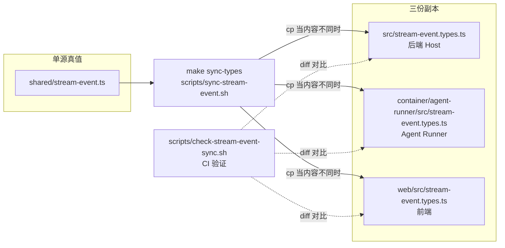
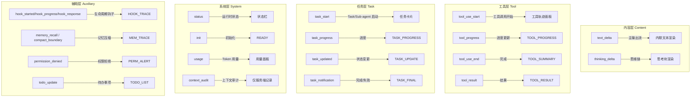
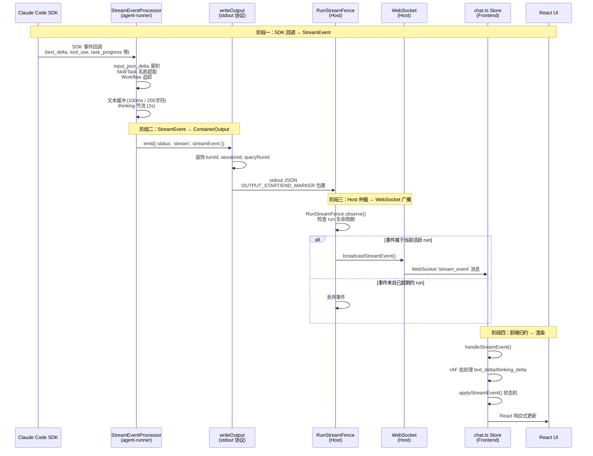
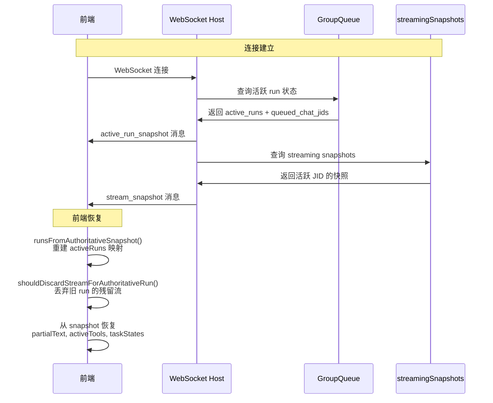

StreamEvent 是 HappyClaw 的核心实时事件总线，它定义了一个跨前端 (Web)、后端 (Host) 和 Agent Runner 三层的统一事件协议，用于将 Claude Code SDK 的流式输出实时、无损、有状态地同步到用户界面。这个系统解决的核心问题是如何在分布式架构中，将 SDK 内部的异步事件流（文本增量、思维链、工具调用、子任务、Workflow 编排等）以毫秒级延迟、精确的 run 生命周期归属和可恢复的断线重连语义，传送到浏览器和 IM 卡片。

## 架构概览：三层三副本的同步契约

StreamEvent 系统的设计遵循一个严格的"单源真值"原则：**类型定义只存在于 `shared/stream-event.ts`，构建步骤将其机械地复制到三个消费方**。任何对事件协议的修改都必须编辑共享源文件，然后运行 `make build` 或 `make sync-types` 触发同步。`scripts/check-stream-event-sync.sh` 在 CI 中验证所有副本的一致性，确保三个子项目绝不会出现类型定义漂移。

Sources: [shared/stream-event.ts](shared/stream-event.ts#L1-L10), [scripts/check-stream-event-sync.sh](scripts/check-stream-event-sync.sh#L1-L50), [scripts/sync-stream-event.sh](scripts/sync-stream-event.sh#L1-L46)



三个副本服务于不同的运行时上下文：

- **Agent Runner** (`container/agent-runner/src/`) — 事件的**生产者**。运行在 Docker 容器或 Host 进程中，直接驱动 Claude Code SDK，将 SDK 的原始回调转换为结构化的 `StreamEvent`，通过 stdout 的 JSON 标记协议发送给 Host。
- **后端 Host** (`src/`) — 事件的**路由与仲裁者**。接收来自 Agent Runner 的 `ContainerOutput`，提取 `streamEvent`，通过 `RunStreamFence` 进行 run 生命周期仲裁，剔除超期或错序的事件，然后通过 WebSocket 广播给前端，同时维护 `streamingSnapshots` 用于断线重连恢复。
- **前端** (`web/src/`) — 事件的**消费者**。通过 WebSocket 接收 `stream_event` 消息，在 `chat.ts` store 中进行 requestAnimationFrame 批处理、状态机归约、子任务追踪和 UI 渲染。

## 事件类型体系：24 种事件的语义分层

StreamEvent 系统定义了 24 种事件类型，按照语义分为五个层级，每一层对应 UI 中不同的可视化区域：



| 层级 | 事件类型 | UI 呈现 | 重要性 |
|------|---------|---------|--------|
| 内容层 | `text_delta`, `thinking_delta` | 内联文本、思考块 | 主输出流，用户可见 |
| 工具层 | `tool_use_start`, `tool_use_end`, `tool_progress`, `tool_result` | 工具轨迹面板、进度条 | 展示 Agent 正在做什么 |
| 任务层 | `task_start`, `task_progress`, `task_updated`, `task_notification` | 任务卡片、Workflow 可视化 | 子任务编排的核心 |
| 系统层 | `status`, `init`, `usage`, `context_audit` | 状态栏、用量面板 | 运行状态监控 |
| 辅助层 | `hook_*`, `memory_recall`, `compact_boundary`, `permission_denied`, `todo_update`, `notification`, `prompt_suggestion`, `raw_sdk_event` | 轨迹日志、通知 | 调试和辅助信息 |

每个事件还携带三个元数据字段来控制其呈现方式：

- **`agentScope`**: `'main'` | `'task'` | `'subagent'` | `'system'` — 标识事件是哪个运行时角色产生的，用于前端将事件路由到正确的渲染上下文。
- **`displayLevel`**: `'primary'` | `'detail'` | `'debug'` — 标识事件的 UI 优先级。`primary` 事件直接内联渲染，`detail` 进入轨迹面板，`debug` 仅在开发者调试模式可见。
- **`queryRunId`**: 精确的 GroupQueue 查询尝试 ID，用于 `RunStreamFence` 的 run 生命周期仲裁。

Sources: [shared/stream-event.ts](shared/stream-event.ts#L12-L31), [shared/stream-event.ts](shared/stream-event.ts#L34-L38)

## 事件流管道：从 SDK 到浏览器的四段旅程

一个 StreamEvent 从产生到渲染在用户屏幕上，经历四个清晰分界的阶段：



### 阶段一：StreamEventProcessor — SDK 事件流的智能归约

`container/agent-runner/src/stream-processor.ts` 中的 `StreamEventProcessor` 是整个系统的第一道关。它是一个 2000+ 行的状态机，负责将 SDK 原始回调转换为结构化的 `StreamEvent`。其核心职责包括：

**文本缓冲与节流**：`text_delta` 和 `thinking_delta` 在 SDK 中可能以高频帧到达（特别是 thinking 阶段）。处理器维护两个缓冲区，每 100ms 或累积 200 字符刷新一次文本输出，而 thinking 状态则每 2 秒才发送一次 token 状态心跳，避免高频 thinking 帧打爆 WebSocket 和卡片渲染。

**工具输入累积**：SDK 通过 `input_json_delta` 增量传递工具参数。处理器为 `Skill`、`Task`、`AskUserQuestion`、`TodoWrite` 等特殊工具维护各自的输入累积缓冲区，等到 `content_block_stop` 时才解析完整的 JSON 输入，提取 `skillName`、`taskDescription`、`team_name` 等关键元数据。

**Workflow 追踪**：Claude Code 的 Workflow 编排（多 Agent 协作）通过 `task_progress` 事件携带累积的阶段快照。处理器维护 `workflowRunsByToolUseId` 映射，将 SDK 的增量进度更新合并到 `WorkflowRunSnapshot` 中，使得前端可以实时展示 Workflow 的 Agent 执行状态矩阵。

**后台任务管理**：`pendingSdkTasks` 集合追踪所有尚未 settle 的 SDK 后台任务（如 `run_in_background: true` 的 Bash 或异步 Agent）。当输入 turn 完成但仍有后台任务未结束时，处理器不会关闭流，而是等待最终的任务通知或超时。

Sources: [container/agent-runner/src/stream-processor.ts](container/agent-runner/src/stream-processor.ts#L1-L200), [container/agent-runner/src/index.ts](container/agent-runner/src/index.ts#L1800-L1850)

### 阶段二：ContainerOutput 协议 — stdout 上的 JSON 标记

Agent Runner 与 Host 之间通过一个简单的 stdin/stdout 协议通信。`ContainerOutput` 是一个联合类型，其中 `status: 'stream'` 的变体携带 `streamEvent` 字段：

```typescript
// container/agent-runner/src/types.ts (简化)
export interface ContainerOutput {
  status: 'success' | 'error' | 'stream' | 'closed';
  result: string | null;
  newSessionId?: string;
  streamEvent?: StreamEvent;  // 流式事件的载体
  turnId?: string;
  inputTurnId?: string;       // 不可变的输入 turn 标识
  ipcReceipts?: IpcDeliveryReceipt[];
  // ... 更多字段
}
```

`writeOutput()` 函数将每个 `ContainerOutput` 序列化为 JSON，并用 `OUTPUT_START_MARKER` / `OUTPUT_END_MARKER` 包裹，写入 stdout。Host 端的 `agent-output-parser.ts` 通过解析这些标记来重建对象流。这种设计使得 Agent Runner 和 Host 可以是完全独立的进程（甚至跨越 Docker 容器边界），通信协议仅依赖标准 I/O。

重要的是，`emit()` 函数在输出前会调用 `outputCorrelation.correlate()` 来装饰每个事件，注入 `turnId`、`sessionId` 和 `queryRunId` 等溯源字段，确保事件在 Host 端可以被精确地归属于特定的输入 turn 和 run 尝试。

Sources: [container/agent-runner/src/index.ts](container/agent-runner/src/index.ts#L830-L850), [container/agent-runner/src/types.ts](container/agent-runner/src/types.ts#L230-L285)

### 阶段三：RunStreamFence — 精确的 Run 生命周期仲裁

Host 端的 `broadcastStreamEvent()` 函数是事件进入前端的最后一道关卡。在广播之前，它通过 `RunStreamFence` 进行严格的 run 生命周期仲裁：

```typescript
// src/run-stream-fence.ts (核心逻辑)
const decision = event.queryRunId
  ? streamRunFence.observeExact(snapshotJid, event.queryRunId, event.turnId)
  : streamRunFence.observe(snapshotJid, event.turnId);
if (!decision.accepted) {
  // 丢弃来自超期 run 的事件
  return;
}
```

`RunStreamFence` 解决了分布式系统中一个关键时序问题：**当 run A 被 run B 取代后，A 的延迟回调如何不被误认为是 B 的输出**。它维护一个 `activeRuns` 映射（runtime JID → runId），以及一个 `turnOwners` 缓存（runtime JID → turnId → runId）。`observeExact()` 只接受来自当前活跃 run 的事件；`observe()` 则通过 `turnId` 的归属缓存来推断，确保即使没有 `queryRunId` 的遗留事件也能被正确归属。

此外，`broadcastStreamEvent()` 还会对 `context_audit` 事件做特殊处理——它**不会**将上下文审计信息广播到前端 WebSocket，而是记录到服务端的 `runContextSnapshot` 中，并输出服务端警告日志。这是有意为之的安全边界：审计信息包含宿主路径、Prompt 接线和框架术语，不应暴露给最终用户。

Sources: [src/run-stream-fence.ts](src/run-stream-fence.ts#L1-L84), [src/web.ts](src/web.ts#L2803-L2870)

### 阶段四：前端 store — rAF 批处理与状态机归约

前端 `web/src/stores/chat.ts` 中的 `handleStreamEvent()` 是事件消费的最终入口。它采用多层设计来处理不同优先级的事件：

**rAF 批处理**：`text_delta` 和 `thinking_delta` 是最高频的事件类型。前端为每个对话/Agent 维护一个 `pendingDeltas` 映射，累积文本增量后通过 `requestAnimationFrame` 调度一次批量更新。这避免了在渲染帧中间被高频 delta 事件打断，确保 UI 流畅。

**`applyStreamEvent()` 纯函数归约器**：这是一个共享的状态机归约函数，同时服务于主对话和 SDK 子任务（Task）的 streaming。它根据 `eventType` 分派到不同的处理分支：

- `text_delta` / `thinking_delta`：累积到 `partialText` / `thinkingText`，维护 thinking 状态转换
- `tool_use_start` / `tool_use_end`：管理 `activeTools` 数组，追踪工具运行时长
- `task_*`：通过 `updateTaskRuntime()` 更新 `taskStates` 中的子任务运行时状态
- `status`：处理 `interrupted` 和 `idle` 等生命周期信号

**SDK Task 生命周期管理**：`handleStreamEvent()` 中有一个专门的子任务追踪系统。它维护 `sdkTasks`、`sdkTaskAliases` 和 `completedSdkTaskIds` 三个数据结构，通过 `resolveOrBindTaskId()` 将 SDK 内部 taskId 映射到前端一致的 toolUseId。当 `task_notification` 到达时，系统会触发 `finalizeSdkTask()` 清理任务状态，并自动关闭任务标签页（`SDK_TASK_AUTO_CLOSE_MS` = 5 秒后）。

Sources: [web/src/stores/chat.ts](web/src/stores/chat.ts#L1060-L1120), [web/src/stores/chat.ts](web/src/stores/chat.ts#L1320-L1520), [web/src/stores/chat.ts](web/src/stores/chat.ts#L2460-L2700)

## 断线重连：streamingSnapshots 与生命周期恢复

StreamEvent 系统的一个关键设计目标是**断线重连后恢复实时流状态**。前端 WebSocket 可能因为网络波动、页面刷新或服务端重启而断开，重新连接后用户期望看到正在进行的 Agent 输出。这通过两个机制实现：



**服务端快照 (`streamingSnapshots`)**：`broadcastStreamEvent()` 在每次广播事件的同时，调用 `updateStreamingSnapshot()` 更新 `streamingSnapshots` 映射。这个映射以 runtime JID 为键，存储当前流的最新投影（partialText、thinkingText、activeTools、recentEvents、traceEvents、taskStates 等）。快照有 30 分钟的 TTL，超时后自动清理。

**WebSocket 连接时的主动推送**：新 WebSocket 连接建立时，服务端会立即推送两条消息：`active_run_snapshot`（包含所有正在进行的 run 的 JID、runId、阶段）和 `stream_snapshot`（包含每个活跃 JID 的当前流状态）。前端通过 `shouldDiscardStreamForAuthoritativeRun()` 判断新的授权快照是否与本地状态冲突——如果 runId 不同，则丢弃本地残留的旧流状态。

**前端 `run-lifecycle.ts`**：前端维护 `ClientActiveRuns` 映射，用于跟踪每个 runtime JID 的当前活跃 run。`shouldApplyRunScopedPayload()` 函数确保只有属于当前 run 的事件才能被应用到 streaming 状态。这防止了重连后旧 run 的延迟事件污染新 run 的 UI。

Sources: [src/web.ts](src/web.ts#L1400-L1550), [web/src/stores/run-lifecycle.ts](web/src/stores/run-lifecycle.ts#L1-L108), [web/src/stores/chat.ts](web/src/stores/chat.ts#L2473-L2560)

## 输出协调器：TurnOutputCoordinator 与文本投影

在 `src/turn-output-coordinator.ts` 中，`TurnOutputCoordinator` 是一个纯归约器，为每个用户输入 turn 维护一个独立的输出协调状态。它解决了"**模型先输出文本，然后决定调用工具——此时之前输出的文本只是过程叙述，应从最终答案中移除**"这一关键语义问题。

工作原理：

1. 当 `text_delta` 到达且没有 `parentToolUseId` 时，文本被累积到当前 `activeMessage` 中
2. 如果 `tool_use_start` 到达且没有 `parentToolUseId`，标记 `activeMessage.hasTopLevelTool = true`
3. 当 `message_stop` 到达时：
   - 如果 `hasTopLevelTool === true`：将文本移入 `narrationSegments`（叙述段），清空 `answerCandidate`
   - 如果 `hasTopLevelTool === false`：将文本设为 `answerCandidate`
4. `visibleAnswerText` 访问器提供"实时预览"：如果当前消息是纯文本（无工具调用），立即展示；如果后续发现工具调用，自动回滚

这种设计模式使得前端可以在模型还在思考时就展示文本预览，但一旦模型决定调用工具，之前的过程叙述立即被替换，最终用户看到的是干净的、仅包含工具调用结果和最终总结的消息。

Sources: [src/turn-output-coordinator.ts](src/turn-output-coordinator.ts#L1-L200)

## 事件路由与去重

StreamEvent 系统还包含两个关键的保障机制：

**IPC 输出路由 (`host-ipc-output-router.ts`)**：`routeHostIpcOutput()` 函数决定 Agent Runner 的 `send_message` IPC 请求应该走哪条路径：是纳入当前 turn 的主投影（primary_projection），还是走独立的 provider 消息（separate_provider），或者被拒绝（rejected）。这个路由决策基于 `deliveryRole`（`'progress' | 'final' | 'separate'`）和 `authorized` 标志。

**IPC 发送去重 (`ipc-send-dedup.ts`)**：`createIpcSendDeduplicator()` 创建一个基于 MD5 哈希的去重器，用于检测和抑制重试期间的重复 IPC 消息。它使用 `key = sourceGroup|chatJid|md5(text)` 的哈希键，并检查该键是否在 10 分钟 TTL 内且当前处于重试状态。这防止了 Agent Runner 在发生网络故障后重试时，向用户重复发送相同的消息。

Sources: [src/host-ipc-output-router.ts](src/host-ipc-output-router.ts#L1-L126), [src/ipc-send-dedup.ts](src/ipc-send-dedup.ts#L1-L67)

## 总结：StreamEvent 系统的设计原则

StreamEvent 系统的架构反映了几条清晰的设计原则：

1. **单源真值，机械复制**：类型定义只存在于 `shared/`，构建步骤机械地复制到三个子项目，CI 确保一致性。这避免了手动同步导致的类型漂移。

2. **分层职责，清晰边界**：Agent Runner 负责 SDK 事件归约和上下文注入，Host 负责 Run 生命周期仲裁和 WebSocket 广播，前端负责 rAF 批处理和 UI 渲染——每一层只做自己的事。

3. **精确的 Run 生命周期**：`RunStreamFence` 确保每个事件精确归属于其所属的 run 尝试，分布式系统中的延迟、重试、超期等问题都被优雅处理。

4. **可恢复性优先**：`streamingSnapshots` 和断线重连协议确保用户在任何时候刷新页面，都能看到正在进行的 Agent 输出的完整状态。

5. **安全边界**：`context_audit` 事件被拦截在服务端，不进入前端 WebSocket；`channelTurnContext` 经过清洗才传入 Agent Runner——路径、凭据、框架术语都不会泄漏到用户可见的层次。

Sources: [Makefile](Makefile#L38-L39), [Makefile](Makefile#L148-L149), [Makefile](Makefile#L203-L204)

---

**下一步阅读建议**：理解 StreamEvent 后，可以继续探索 [Agent Runner 执行引擎：Host 模式与 Container 模式](7-agent-runner-zhi-xing-yin-qing-host-mo-shi-yu-container-mo-shi) 了解事件的生产者，或者 [实时流式输出与工具轨迹展示](20-shi-shi-liu-shi-shu-chu-yu-gong-ju-gui-ji-zhan-shi) 了解前端如何将这些事件渲染为可见的 UI 组件。