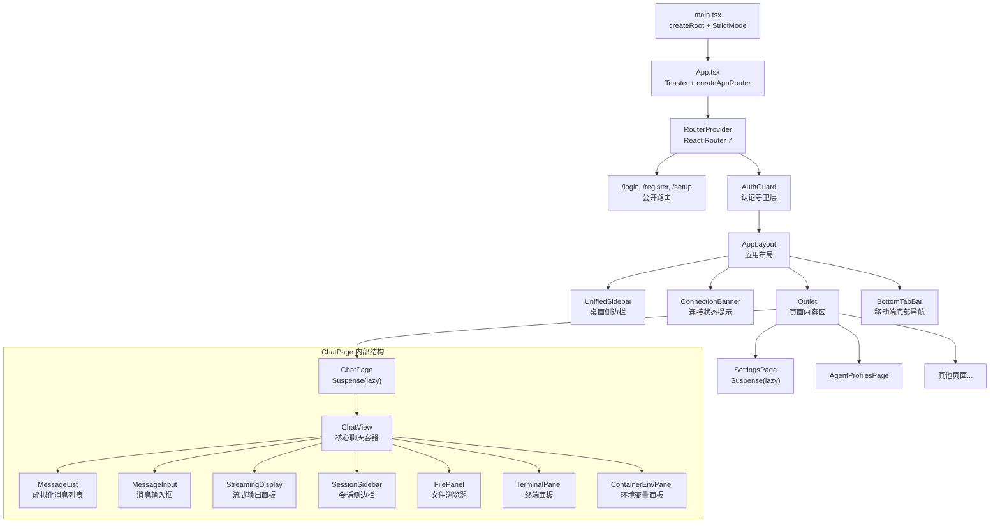

HappyClaw 的前端采用 **React 19 + TypeScript + Vite 6** 技术栈，以 **Zustand 5** 作为单一状态管理方案，**React Router 7** 负责路由编排，**Tailwind CSS 4** 配合 **shadcn/ui** 提供组件基础。整个架构围绕"Agent-First"理念设计——导航以 Agent 为中心组织工作区，实时事件流通过 WebSocket 从后端驱动前端状态更新，确保用户在多设备、多工作区场景下的操作连贯性。

Sources: [web/package.json](web/package.json#L1-L61), [web/vite.config.ts](web/vite.config.ts#L1-L49)

---

## 路由体系：双模式适配与按需加载

### 路由创建策略

路由系统在 `App.tsx` 中通过 `createRoutesFromElements` 声明式定义，随后由 `createAppRouter` 工厂函数根据运行环境选择路由模式。核心逻辑在 `shouldUseHashRouter` 函数中：当检测到 iOS 设备以 PWA 独立模式运行时，启用 `createHashRouter`，否则使用标准的 `createBrowserRouter`。这一设计解决了 iOS Safari 中 PWA 离线缓存与 URL 重定向的兼容性问题。

```typescript
export function shouldUseHashRouter(): boolean {
  return isStandaloneMode() && isIOSDevice();
}
```

Sources: [web/src/App.tsx](web/src/App.tsx#L1-L205), [web/src/utils/url.ts](web/src/utils/url.ts#L25-L33)

### 路由层级结构

路由分为三个层级：

| 层级 | 路由路径 | 守卫 | 说明 |
|------|---------|------|------|
| **公开路由** | `/login`, `/register`, `/setup` | 无 | 认证前页面，`/setup` 为系统初始化向导 |
| **半保护路由** | `/setup/providers`, `/setup/channels` | `AuthGuard` | 管理员首次使用的 Provider 和渠道配置流程 |
| **全保护路由** | `/chat/:groupFolder?`, `/settings`, `/agent-profiles`, `/tasks`, `/usage`, `/billing`, `/monitor`, `/users` 等 | `AuthGuard` + `AppLayout` | 需要完整认证，所有页面共享统一的侧边栏和底部导航布局 |

`AuthGuard` 组件承担了多维度的访问控制：认证状态检查、系统初始化状态检测、密码变更强制跳转、管理员首次配置引导（`needsSetup`）、基于 `Permission` 枚举的细粒度权限校验。当认证超时（12秒未响应）时，显示带有"刷新页面"和"去登录页"操作按钮的友好错误页面。

Sources: [web/src/components/auth/AuthGuard.tsx](web/src/components/auth/AuthGuard.tsx#L1-L109), [web/src/App.tsx](web/src/App.tsx#L43-L117)

### 懒加载与代码分割

所有非核心页面（ChatPage、SettingsPage、AgentProfilesPage、TasksPage、BillingPage、UsagePage）均通过 `React.lazy()` + `Suspense` 实现按需加载。`UsagePage` 在加载期间显示专用的骨架屏组件 `UsageRouteFallback`，其余页面使用 `fallback={null}` 避免闪烁。`ChatPage` 是唯一一个直接通过 `import()` 动态导入的页面，其余页面通过默认导出配合 `lazy` 导入。

```typescript
const ChatPage = lazy(() =>
  import('./pages/ChatPage').then((m) => ({ default: m.ChatPage })),
);
```

Sources: [web/src/App.tsx](web/src/App.tsx#L13-L42)

---

## 状态管理：Zustand 模块化分层

HappyClaw 选用 **Zustand 5** 而非 Redux 或 Context API，核心考量在于：无需 Provider 包裹、TypeScript 类型推导无缝、按需订阅避免不必要的重渲染。整个前端状态被切分为约 15 个独立的 Store，每个管理一个明确的功能域。

### Store 全景

```
stores/
├── auth.ts          # 认证状态、用户信息、权限查询、主题外观配置
├── chat.ts          # 消息、流式渲染、会话、子 Agent、队列——最复杂的 Store (~4400行)
├── groups.ts        # 工作区列表、Runner 状态
├── run-lifecycle.ts # 查询生命周期（纯函数工具集，无状态）
├── billing.ts       # 计费计划、订阅、余额、交易记录、额度检查
├── files.ts         # 文件浏览、上传、删除、目录创建
├── container-env.ts # 容器环境变量配置
├── tasks.ts         # 定时任务管理
├── users.ts         # 用户管理（管理员面板）
├── agent-profiles.ts# Agent Profile 编辑与版本管理
├── skills.ts        # 技能库
├── plugins.ts       # 插件管理
├── mcp-servers.ts   # MCP Server 配置
├── monitor.ts       # 系统监控面板
└── usage.ts         # 用量统计
```

### 核心模式：Store 内聚 + 跨 Store 引用

每个 Store 通过 `create<State>()` 定义，内部封装 API 请求逻辑和状态变更。跨 Store 的协作通过 `getState()` 方法而非事件总线实现，例如 auth store 在登出时调用 `useUsageStore.getState().reset()` 和 `clearMessageSnapshotCache()` 清理用户数据：

```typescript
logout: async () => {
  await api.post('/api/auth/logout');
  useUsageStore.getState().reset();
  await clearMessageSnapshotCache();
  set({ authenticated: false, user: null, ... });
},
```

Sources: [web/src/stores/auth.ts](web/src/stores/auth.ts#L1-L282), [web/src/stores/chat.ts](web/src/stores/chat.ts#L1-L200)

### 渲染优化：细粒度选择器

`chat.ts` Store 是性能优化的重点。在 `ChatView` 组件中，每个属性通过独立的 selector 从 Store 中提取，确保只有依赖的数据变化才触发重渲染：

```typescript
const group = useChatStore((s) => s.groups[groupJid]);
const groupMessages = useChatStore((s) => s.messages[groupJid]);
const isWaiting = useChatStore((s) => !!s.waiting[groupJid]);
const mainInterrupted = useChatStore((s) => !!s.streaming[groupJid]?.interrupted);
```

对于数组类型的选择器，使用空引用的常量值避免每次渲染生成新引用：

```typescript
const EMPTY_AGENTS: import('../../types').AgentInfo[] = [];
const agents = useChatStore((s) => s.agents[groupJid] ?? EMPTY_AGENTS);
```

Sources: [web/src/components/chat/ChatView.tsx](web/src/components/chat/ChatView.tsx#L82-L100)

### 流式渲染状态模型

`chat.ts` Store 中定义了多个相互关联的状态结构来管理实时流式输出：

```
StreamingState (按 chatJid 索引)
├── turnId / sessionId        # 当前 Turn 标识
├── partialText               # 已累积的文本片段
├── thinkingText              # 思考过程文本
├── isThinking                # 是否处于思考阶段
├── activeTools[]             # 当前活跃的工具调用
├── recentEvents[]            # 最近的流式事件（工具、技能、Hook 等）
├── traceEvents[]             # 追踪事件（含作用域和层级信息）
├── taskStates{}              # 子任务运行时状态
├── contextAudit              # 上下文审计信息
└── agentStreaming{}          # 子 Agent 的独立流式状态（按 agentId 索引）
```

流式状态的生命周期由 `run-lifecycle.ts` 中的纯函数管理，通过 `runId` 匹配确保 WebSocket 重连后的状态一致性：

```typescript
export function shouldApplyRunScopedPayload(
  current: ClientActiveRuns, chatJid: string, runId?: string
): boolean {
  return !!runId && current[chatJid]?.runId === runId;
}
```

Sources: [web/src/stores/chat.ts](web/src/stores/chat.ts#L105-L140), [web/src/stores/run-lifecycle.ts](web/src/stores/run-lifecycle.ts#L1-L108)

---

## 组件树：从根到叶的层次结构

### 顶层架构



### 布局组件

**AppLayout** 是整个应用的布局容器，在桌面端渲染 `UnifiedSidebar`，移动端渲染 `BottomTabBar`，中间为 `Outlet` 渲染当前路由页面。布局内部集成了：

- **WebSocket 连接管理**：在 `AppLayout` 挂载时建立连接，并在整个应用生命周期内保持
- **全局事件监听**：`runner_state`、`run_started`、`run_finished`、`active_run_snapshot`、`group_created`、`agent_status` 等 WebSocket 事件
- **主题系统**：通过 `useTheme` Hook 应用并持久化主题偏好
- **路由恢复**：通过 `useRouteRestore` Hook 在 PWA 重启时恢复上次访问的路由
- **未读计数**：将未读回复数显示在 `document.title` 中

侧边栏的折叠状态由 `userCollapsed` 控制，在非聊天路由下强制折叠，用户可通过 `Cmd+B` / `Ctrl+B` 快捷键切换。

Sources: [web/src/components/layout/AppLayout.tsx](web/src/components/layout/AppLayout.tsx#L1-L178), [web/src/components/layout/UnifiedSidebar.tsx](web/src/components/layout/UnifiedSidebar.tsx#L1-L442)

### 导航系统

桌面端导航通过 `filterNavItems` 函数根据 `billingEnabled` 状态动态过滤导航项，基础导航项包括：

| 路径 | 图标 | 标签 | 条件 |
|------|------|------|------|
| `/chat` | MessageCircle | 工作台 | 始终显示 |
| `/agent-profiles` | Bot | Agent | 始终显示 |
| `/capabilities` | Puzzle | 能力库 | 始终显示 |
| `/tasks` | Clock4 | 任务 | 始终显示 |
| `/usage` | BarChart3 | 用量 | 桌面端可见 |
| `/billing` | Wallet | 账单 | 仅 billingEnabled 时显示 |
| `/settings` | Settings | 设置 | 始终显示 |

移动端底部导航栏隐藏了 `/usage` 入口，并集成了 `useScrollDirection` Hook 实现滚动时自动隐藏标签文字以节省空间。

Sources: [web/src/components/layout/nav-items.ts](web/src/components/layout/nav-items.ts#L1-L32), [web/src/components/layout/BottomTabBar.tsx](web/src/components/layout/BottomTabBar.tsx#L1-L49)

### ChatPage 组件深度解析

**ChatPage** 是前端最复杂的页面，需要同时处理路由参数解析、工作区选择、消息列表、流式渲染、子 Agent 会话管理、文件操作、终端交互等多个维度。其核心组件 `ChatView` 接收 `groupJid` 作为参数，内部通过细粒度 Zustand 选择器获取数据。

**URL 驱动的会话管理**：
- URL 参数 `?agent=` 控制子 Agent 的会话切换
- URL 参数 `?sessions=1` 在移动端触发会话侧边栏显示
- `getWorkspaceLastAgent` / `setWorkspaceLastAgent` 记住用户在每个工作区中最后访问的子 Agent

**消息列表虚拟化**：使用 `@tanstack/react-virtual` 的 `useVirtualizer` 实现消息列表的虚拟滚动，支持 >1000 条消息的高效渲染。消息条目按日期分组，中间插入日期分隔线，并支持 system message 的解析渲染。

**流式输出渲染**：`StreamingDisplay` 组件负责渲染实时流式输出，包含：
- 思考过程渲染（"已思考 Xs" 计时器）
- 活动工具调用卡片（含本地计时器）
- 子 Agent 运行状态折叠块
- 任务运行状态追踪
- 轮询式 askUserQuestion 交互卡片

Sources: [web/src/pages/ChatPage.tsx](web/src/pages/ChatPage.tsx#L1-L409), [web/src/components/chat/ChatView.tsx](web/src/components/chat/ChatView.tsx#L1-L1285), [web/src/components/chat/MessageList.tsx](web/src/components/chat/MessageList.tsx#L1-L772)

---

## 实时通信架构

### WebSocket 事件系统

`WsManager` 类封装了 WebSocket 连接的生命周期管理，采用发布-订阅模式：

```
WsManager
├── connect()              # 建立连接，自动处理协议（ws/wss）
├── disconnect()           # 断开连接
├── send(data)             # 发送 JSON 消息
├── on(type, handler)      # 订阅事件，返回取消订阅函数
├── setupNetworkListeners()# 监听 online/offline 事件
└── 重连策略               # 指数退避：1s → 2s → 4s → ... → 30s
```

连接关闭时，根据状态码决定行为：`1008`（Policy Violation）和 `4001`（自定义认证错误）直接跳转到登录页；其余情况触发指数退避重连。网络恢复时立即重连并重置退避计时器。

### 事件流与状态同步

```
后端 WebSocket 事件流 ────────────────────→ 前端 WsManager
                                                    │
                    ┌───────────────────────────────┤
                    │                               │
                    ▼                               ▼
            AppLayout 监听器                 ChatView 监听器
                    │                               │
                    ▼                               ▼
            groupsStore / chatStore          chatStore.handleStreamEvent()
            billingStore 等                   chatStore.handleWsNewMessage()
                                              chatStore.handleStreamSnapshot()
```

关键事件类型及其处理路径：

| 事件类型 | 触发时机 | 处理目标 |
|---------|---------|---------|
| `runner_state` | Runner 状态变化 | `groupsStore.setRunnerState` + `chatStore.handleRunnerState` |
| `run_started` | 新查询开始 | 同上，同时设置 `running` 状态 |
| `run_finished` | 查询完成 | `chatStore.handleRunFinished` |
| `active_run_snapshot` | 重连后快照同步 | `chatStore.handleActiveRunSnapshot` |
| `stream_event` | 实时流式输出 | `chatStore.handleStreamEvent`（逐 token 增量更新） |
| `stream_snapshot` | 重连后流式状态恢复 | `chatStore.handleStreamSnapshot` |
| `new_message` | 新消息产生 | `chatStore.handleWsNewMessage` |
| `billing_update` | 计费更新 | `billingStore.handleBillingUpdate` |
| `group_created` | 定时任务创建新工作区 | `groupsStore.loadGroups` + `tasksStore.loadTasks` |
| `agent_status` | 子 Agent 状态变化 | `chatStore.handleAgentStatus` |

Sources: [web/src/api/ws.ts](web/src/api/ws.ts#L1-L126), [web/src/components/layout/AppLayout.tsx](web/src/components/layout/AppLayout.tsx#L62-L130)

---

## API 客户端层

`api/client.ts` 提供了统一的 HTTP 请求封装，核心特性包括：

- **自动超时**：默认 8 秒，文件上传请求根据文件大小动态计算（20KB/s 保守估计，最少 120 秒，最多 10 分钟）
- **自动重定向**：401 响应触发 `/login` 跳转，`PASSWORD_CHANGE_REQUIRED` 错误码（403）触发 `/settings` 跳转
- **路径处理**：通过 `withBasePath` 自动添加 `APP_BASE` 前缀，支持反向代理部署场景
- **FormData 处理**：自动识别 `FormData` 请求体，跳过 `Content-Type` 设置让浏览器自动添加 `multipart/boundary`
- **凭证携带**：所有请求使用 `credentials: 'include'` 确保 Cookie Session 自动传递

```typescript
export const api = {
  get: <T>(path: string) => apiFetch<T>(path),
  post: <T>(path: string, body?: unknown, timeoutMs?: number) => apiFetch<T>(path, { method: 'POST', ... }),
  put: <T>(path: string, body?: unknown) => apiFetch<T>(path, { method: 'PUT', ... }),
  patch: <T>(path: string, body?: unknown) => apiFetch<T>(path, { method: 'PATCH', ... }),
  delete: <T>(path: string) => apiFetch<T>(path, { method: 'DELETE' }),
  uploadFiles: <T>(path: string, files: FileList, extraFields?: Record<string, string>) => ...,
};
```

Sources: [web/src/api/client.ts](web/src/api/client.ts#L1-L91)

---

## 主题与外观系统

主题系统通过 `useTheme` Hook 实现，核心机制是 `useSyncExternalStore`——这是 React 18 中专门用于外部 store 订阅的 Hook，确保在并发渲染模式下也能正确读取和订阅 `localStorage` 的变化。

```
主题配置项（localStorage 持久化）
├── happyclaw-theme          # light | dark | system（默认 light）
├── happyclaw-color-scheme   # default | orange | neutral（默认 orange）
└── happyclaw-font-style     # default | anthropic
```

主题变更通过操作 `document.documentElement` 的 CSS class 实现，配合 Tailwind 的 `dark:` 变体，同时同步更新 `<meta name="theme-color">` 以适配浏览器地址栏颜色。

Sources: [web/src/hooks/useTheme.ts](web/src/hooks/useTheme.ts#L1-L129)

---

## 组件库与样式体系

### shadcn/ui 组件

前端使用 shadcn/ui 作为基础组件库，这些组件构建在 Radix UI 原语之上，提供可访问性（ARIA）支持。已使用的组件包括：

```
alert-dialog, badge, button, card, checkbox, dialog,
dropdown-menu, input, label, popover, select, sheet,
skeleton, sonner (toast), switch, tabs, textarea, tooltip
```

### 自定义业务组件

在 shadcn/ui 基础上，项目构建了丰富的业务组件层：

- **聊天相关**：`MessageBubble`、`MessageInput`、`MessageList`、`StreamingDisplay`、`SessionSidebar`、`ToolActivityCard`、`WorkflowRunCard`、`TodoProgressPanel`、`MermaidDiagram`、`MarkdownRenderer`、`ImageLightbox`
- **Agent 管理**：`AgentGovernanceSection`、`AgentPromptAssistant`、`AgentPromptEditor`、`AgentPromptVersionHistory`、`AgentSkillsPolicyEditor`、`EffectiveCapabilitiesPreview`
- **设置页面**：`ProviderList`、`ProviderEditor`、`ChannelAccountsManager`、`AppearanceSection`、`SecuritySection`、`BindingsSection`
- **通用组件**：`ErrorBoundary`（Class Component）、`EmojiAvatar`、`LoadingSpinner`、`SkeletonCardList`、`ConfirmDialog`、`PromptDialog`、`BugReportDialog`

Sources: [web/src/components/ui/](web/src/components/ui/), [web/src/components/chat/](web/src/components/chat/), [web/src/components/common/](web/src/components/common/)

---

## 架构决策要点

### 为什么选择 Zustand 而非 Redux？

Zustand 的按需订阅机制天然适配实时流式场景——`ChatView` 从 `chatStore` 中独立选择 `streaming[groupJid]`，当后端推送新的 `stream_event` 时，只有依赖该字段的 `StreamingDisplay` 组件会重渲染，而 `MessageList`、`MessageInput` 等不受影响。Redux 的 dispatch → reducer 模式在这个场景下需要额外的 selector 优化和 `React.memo` 显式优化。

### 为什么采用双路由模式？

iOS PWA 在独立模式下使用 `BrowserRouter` 会导致 URL 路径与服务器端路径冲突，当用户刷新页面时，Safari 会尝试向服务器请求 `/chat/my-folder` 路径，而非由前端路由接管。`HashRouter` 通过 `#` 前缀将路由信息保留在客户端，避免了对服务器的回退请求。

### 为什么在 AppLayout 中建立 WebSocket 而非 ChatPage？

WebSocket 连接不仅用于聊天消息的实时推送，还承载了 `runner_state`（影响侧边栏运行状态指示器）、`billing_update`（影响导航栏账单入口显示）、`group_created`（影响侧边栏和任务列表刷新）等全局事件。在 `AppLayout` 中建立连接确保了这些全局状态在任何页面下都能及时更新。

Sources: [web/src/components/layout/AppLayout.tsx](web/src/components/layout/AppLayout.tsx#L44-L56)

---

## 下一步阅读

- [实时流式输出与工具轨迹展示](20-shi-shi-liu-shi-shu-chu-yu-gong-ju-gui-ji-zhan-shi) —— 深入 `StreamingDisplay` 和 `ToolActivityCard` 的渲染机制
- [Web API 路由体系与 Hono 框架实践](9-web-api-lu-you-ti-xi-yu-hono-kuang-jia-shi-jian) —— 了解前端 API 调用的后端路由对应关系
- [StreamEvent 实时事件流系统：从前端到 Runner 端到端同步](18-streamevent-shi-shi-shi-jian-liu-xi-tong-cong-qian-duan-dao-runner-duan-dao-duan-tong-bu) —— 掌握 WebSocket 事件的完整链路
- [认证与会话管理：Cookie Session、Permission Middleware 与 ACL 权限矩阵](10-ren-zheng-yu-hui-hua-guan-li-cookie-session-permission-middleware-yu-acl-quan-xian-ju-zhen) —— 理解 `AuthGuard` 背后的服务端认证机制