本指南将带你从一台裸机环境出发，完成 HappyClaw 的安装、启动、初始配置，并在 Web 界面上创建第一个工作区、发起首次对话。目标读者是初次接触 HappyClaw 的开发者，不要求具备 Claude Code 或 AI Agent 系统的使用经验。

## 整体启动流程

HappyClaw 的启动流程分为三个清晰的阶段：**环境准备** → **服务启动** → **Web 向导配置**。下图展示从克隆仓库到首次对话的完整路径：

```mermaid
flowchart LR
    A["git clone"] --> B["make start"]
    B --> C["自动安装依赖"]
    C --> D["编译后端 + Web + Agent Runner"]
    D --> E["构建 Docker 镜像<br/>（如果 Docker 可用）"]
    E --> F["启动 Node 服务<br/>localhost:3000"]
    F --> G["浏览器访问<br/>首次向导"]
    G --> H["创建管理员账号"]
    H --> I["配置 Claude Provider"]
    I --> J["（可选）接入消息渠道"]
    J --> K["创建工作区"]
    K --> L["发送第一条消息"]
```



整个流程中，**只有 Web 向导需要手动操作**，安装和构建步骤全部由 `make start` 自动完成。服务启动后，浏览器打开 `http://localhost:3000` 即可看到向导页面。

Sources: [Makefile](Makefile#L50-L67), [README.md](README.md#L210-L227)

## 环境要求

在开始之前，确保你的机器满足以下条件：

| 依赖 | 最低版本 | 说明 |
|------|----------|------|
| **操作系统** | macOS / Linux | Windows 推荐使用 WSL2 |
| **Node.js** | >= 20 | 推荐使用 CI 同款的 Node.js 22 |
| **npm** | 随 Node.js 附带 | 包管理工具 |
| **GNU Make** | 系统自带或通过包管理器安装 | 构建入口 |
| **Docker** | 可选 | 普通成员和容器模式工作区需要；仅使用管理员 Host 模式可以不安装 |

**重要提示**：HappyClaw 只使用原生 Node.js 工具链（npm / npx / tsx / node），**不支持 Bun**。原因在于主服务的 WebSocket 握手依赖 `@hono/node-server` 的 `server.on('upgrade')` 事件，Bun 的 HTTP server 不触发该事件，会导致前端实时流式卡片和通知全部失效。

macOS 用户可以使用 [OrbStack](https://orbstack.dev/) 或 Docker Desktop，Linux 用户使用 Docker Engine。如果你不打算让普通成员使用容器执行模式，完全可以在没有 Docker 的环境下运行，仅管理员 Host 模式已经足够。

Sources: [README.md](README.md#L200-L208), [Makefile](Makefile#L8-L16)

## 安装与启动

### 克隆仓库

```bash
git clone https://github.com/riba2534/happyclaw.git
cd happyclaw
```

### 一键启动（生产模式）

```bash
make start
```

`make start` 会自动完成以下步骤：

1. **检测依赖** — 检查 `node_modules` 是否过期，按需执行 `npm install`
2. **安装 Host 工具** — 下载 `feishu-cli` 等外部工具，刷新内置 Skills 缓存
3. **构建 Docker 镜像** — 如果 Docker 可用，调用 `container/build.sh` 构建 `happyclaw-agent:latest` 镜像
4. **同步共享类型** — 检查 `shared/` 目录下的类型定义是否同步到 `src/`、`web/` 和 `container/agent-runner/`
5. **编译后端** — 使用 `tsc` 编译 TypeScript 为 `dist/index.js`
6. **编译前端** — 使用 `vite build` 构建 Web 静态资源
7. **编译 Agent Runner** — 编译容器内执行的 Agent 执行器
8. **启动服务** — 前台运行 `node dist/index.js`，监听端口 3000

首次启动需要几分钟完成依赖安装和编译。过程中如果看到 `BUILD` 相关的日志输出，属于正常现象。

Sources: [Makefile](Makefile#L50-L67), [Makefile](Makefile#L78-L84), [Makefile](Makefile#L179-L199)

### 开发模式

如果你打算修改代码，推荐使用开发模式：

```bash
make dev
```

开发模式同时启动后端（tsx 直跑 TypeScript）和前端（Vite 热更新代理）：

- Web 前端开发服务器：`http://localhost:5173`
- API / WebSocket 后端：`http://localhost:3000`

前端开发服务器会自动将 API 请求代理到后端，无需手动配置跨域。

Sources: [Makefile](Makefile#L22-L28), [README.md](README.md#L229-L237)

### 验证服务状态

启动后，打开浏览器访问 `http://localhost:3000`，如果看到 HappyClaw 的引导页面，说明服务已正常运行。也可以使用命令行验证：

```bash
make status
```

该命令会检查端口占用、健康状态（`/api/health` 接口）、日志文件和 Docker 容器状态。

Sources: [Makefile](Makefile#L125-L144)

## 首次配置向导（Web）

首次访问 `http://localhost:3000` 时，系统检测到尚无用户存在，会引导你进入初始设置流程。该流程分为三个步骤。

### 步骤一：创建管理员账号

在向导页面中填写用户名和密码，点击"创建账号并下一步"。

| 字段 | 要求 | 说明 |
|------|------|------|
| **用户名** | 3-32 位字母、数字或下划线 | 不区分大小写，存储时自动转为小写 |
| **密码** | 至少 8 位 | 使用 bcrypt 加密存储 |

提交后，系统会：

1. 在 SQLite 数据库中创建第一个管理员用户
2. 自动创建该用户的主工作区（Home Workspace），执行模式为 `host`
3. 自动登录并设置会话 Cookie
4. 返回 `setupStatus` 指示当前 Provider 和渠道的配置状态

如果已经有用户存在，`/api/auth/setup` 接口会返回 403 错误，页面会跳转到登录页。

Sources: [src/routes/auth.ts](src/routes/auth.ts#L140-L231), [web/src/pages/SetupPage.tsx](web/src/pages/SetupPage.tsx#L1-L207)

### 步骤二：配置 Claude Provider

创建管理员账号后，自动跳转到 Provider 配置页面。HappyClaw 支持两种接入方式：

**方式一：Anthropic 官方**

| 子方式 | 配置方式 | 适用场景 |
|--------|----------|----------|
| **Claude OAuth** | 一键登录，跳转 Anthropic 完成授权 | 推荐方式，无需手动管理 API Key |
| **Setup Token** | 输入 Claude Code 的 setup token | 已拥有 Claude Code 账号 |
| **API Key** | 直接输入 Anthropic API Key | 已有 API Key，需要精细控制 |

**方式二：第三方兼容端点**

填写 API Endpoint、Auth Token 和模型名称。系统会自动预填 Claude Code 兼容的环境变量，包括主模型映射、上下文窗口、自动压缩和超时设置。高级设置中可以查看和编辑所有预填值，也可以增加自定义 Header 等环境变量。

**负载均衡策略**（配置多个 Provider 后生效）：

| 策略 | 行为 |
|------|------|
| **Round Robin** | 在健康 Provider 之间轮询分配新会话 |
| **Weighted Round Robin** | 按权重分配新会话 |
| **Failover** | 优先使用主 Provider，故障时自动切换到备用 |

配置完成后点击"下一步"，系统会验证 Provider 连通性。如果跳过 Provider 配置，后续将无法发起 Agent 对话。

Sources: [web/src/pages/SetupProvidersPage.tsx](web/src/pages/SetupProvidersPage.tsx#L1-L80), [src/routes/auth.ts](src/routes/auth.ts#L106-L129)

### 步骤三：接入消息渠道（可选）

HappyClaw 支持 7 种消息渠道，你可以在此步骤中接入，也可以选择"稍后设置"跳过。

| 渠道 | 接入方式 | 主要能力 |
|------|----------|----------|
| **飞书** | App ID / App Secret，WebSocket | 流式卡片、图片与文件、Reaction、群聊 @ 控制、话题映射 |
| **Telegram** | Bot Token，Long Polling | Markdown/HTML、长消息分片、图片与文件、代理配置 |
| **QQ** | App ID / App Secret，WebSocket | 私聊、群聊 @Bot、图片消息、配对码绑定 |
| **钉钉** | Client ID / Client Secret，Stream | AI Card 流式回复、图片与文件、群聊 @ 控制 |
| **微信** | Web 界面扫码，iLink | 二维码授权、媒体收发、Typing、断线恢复 |
| **Discord** | Bot Token，Gateway | 私聊与服务器频道路由、多账号隔离、频道信息查询 |
| **WhatsApp** | Web 界面扫码，Baileys | 二维码登录、文本与媒体、会话持久化、断线恢复 |

每个用户可以为同一渠道创建多个 Bot 账号，每个账号可以设置默认工作区，再按群聊、私聊或原生话题覆盖绑定目标。

点击"完成并进入 HappyClaw"进入主工作台。

Sources: [README.md](README.md#L129-L161), [web/src/pages/SetupChannelsPage.tsx](web/src/pages/SetupChannelsPage.tsx#L1-L63)

## 第一次对话

### 进入工作台

设置完成后，默认进入聊天页面。左侧是会话列表，右侧是对话区域。如果你是第一次使用，系统已自动为你创建了一个主工作区（名字为 `main`）。

### 选择或创建工作区

工作区是 Agent 执行的文件和上下文隔离边界。在左侧面板顶部的下拉菜单中，可以：

- 选择现有的 `main` 工作区直接开始对话
- 点击"新建工作区"创建新的工作区，需要选择归属的 Agent 和执行模式

### 发送第一条消息

在底部的输入框中输入消息，按回车发送。HappyClaw 会：

1. 将消息存入 SQLite 数据库
2. 通过 Agent Runner 调用 Claude SDK
3. Claude Agent 在指定的工作区目录中执行
4. 响应以流式方式实时返回前端

如果看到 Agent 的实时打字效果和工具调用轨迹，说明系统运行正常。

### 理解 Agent → Workspace → Session 三层模型

HappyClaw 使用统一的三层层级来组织所有交互：

```
Agent（身份、提示词、Skills、MCP）
└── Workspace（项目目录、执行模式、环境变量、渠道挂载）
    ├── Main Session（工作区主会话）
    ├── Runtime Session（独立对话或渠道原生话题）
    └── Scheduled Run（定时任务的普通或隔离运行）
```

- **Agent** 保存长期身份和能力策略。主 HappyClaw Agent 始终存在，你也可以创建代码审查、研究、运维等自定义 Agent。
- **Workspace** 是私有的文件与执行隔离边界。创建时必须选择 Agent，后续可以迁移归属。
- **Runtime Session** 是工作区内的一段独立对话上下文，不是另一个顶层 Agent。

深入了解这一架构，请阅读 [Agent-First 三层模型：Agent → Workspace → Runtime Session](6-agent-first-san-ceng-mo-xing-agent-workspace-runtime-session)。

Sources: [README.md](README.md#L73-L98)

## 常见问题与排查

### 端口被占用

如果你已经有一个 HappyClaw 实例在运行，或者 3000 端口被其他程序占用，`make start` 会报错退出。此时可以：

```bash
# 停止已有进程
make stop

# 或使用自定义端口
WEB_PORT=8080 make start
```

### Docker 不可用

如果系统没有安装 Docker，启动时会看到 `Docker 镜像不存在` 的警告，但不会阻断启动。缺少 Docker 不影响管理员使用 Host 模式执行，仅普通成员无法使用容器模式。

### 如何重置管理员密码

如果忘记密码，可以使用内置的 reset 脚本：

```bash
npm run reset:admin -- admin newpassword123
```

该脚本会重置指定用户为管理员角色、更新密码、清除所有活跃会话（强制重新登录）。如果该用户不存在，会直接创建一个新的管理员账号。

Sources: [src/reset-admin.ts](src/reset-admin.ts#L1-L57)

### 环境变量参考

HappyClaw 优先通过 Web 设置管理配置，不要求维护大量环境变量。以下为少数可选的环境变量：

| 变量 | 默认值 | 说明 |
|------|--------|------|
| `WEB_PORT` | `3000` | Web、REST API 与 WebSocket 端口 |
| `WEB_SESSION_SECRET` | 自动生成并持久化 | Web 登录会话签名密钥 |
| `CONTAINER_IMAGE` | `happyclaw-agent:latest` | Agent 容器镜像 |
| `CONTAINER_TIMEOUT` | `1800000` | 容器硬超时（毫秒） |
| `MAX_FILE_SIZE_MB` | `50` | 入站文件大小上限（MB） |
| `CORS_ALLOWED_ORIGINS` | 仅 localhost | 公网部署的 WebSocket Origin 白名单 |
| `TRUST_PROXY` | `false` | 位于可信反向代理后时设为 `true` |

Provider 与渠道凭据建议只在 Web 设置中填写。它们使用 AES-256-GCM 加密存储，相关 API 只返回是否已配置，不返回密钥明文。

Sources: [src/config.ts](src/config.ts#L1-L104), [README.md](README.md#L270-L287)

### 数据目录结构

所有持久化运行数据默认位于 `data/` 目录下，不要提交到 Git：

```
data/
├── db/messages.db     # SQLite 主数据库
├── config/            # 加密配置、密钥与系统设置
├── groups/            # 工作区目录和项目文件
├── memory/            # 日期记忆
├── sessions/          # 主会话与 Runtime Session 的 Claude 数据
├── ipc/               # Runner 输入、工具请求和回执
├── skills/            # 用户 Skills
├── builtin-skills/    # 固定版本内置 Skills 清单
├── mcp-servers/       # 用户 MCP 配置
├── plugins/           # Plugin catalog、用户状态与运行快照
└── extra/             # Container 工作区持久工具数据
```

迁移实例时优先使用 `make backup` 和 `make restore`，不要手动复制文件。

Sources: [README.md](README.md#L289-L308)

## 项目结构速览

```
happyclaw/
├── src/                         # 主服务：路由、调度、渠道、权限与持久化
├── web/                         # React 19 Web / PWA 前端
├── container/
│   └── agent-runner/            # Host/Container 共用的 Agent 执行器
├── shared/                      # 主服务与前端/Runner 共享的事件类型源
├── scripts/                     # 构建、校验、备份和恢复脚本
├── tests/                       # 后端、前端契约、迁移与安全回归测试
├── docs/                        # API、权限与设计文档
├── config/                      # 默认配置模板和安全策略
├── Makefile                     # 统一开发、构建和运维入口
└── data/                        # 本地运行数据，不进入 Git
```

这种结构反映了系统的三个核心隔离层：**主服务**（src/，处理认证、路由、渠道连接、Provider 池、持久化）、**Agent 执行器**（container/agent-runner/，运行 Claude Agent SDK）、**前端**（web/，提供用户界面）。

Sources: [README.md](README.md#L381-L395)

## 下一步

至此，你已经完成了 HappyClaw 从零搭建到首次对话的全流程。接下来可以根据你的需求选择阅读方向：

- **配置更多 Provider 与负载均衡** → [Provider 配置与多模型负载均衡](4-provider-pei-zhi-yu-duo-mo-xing-fu-zai-jun-heng)
- **接入消息渠道** → [渠道接入：飞书、Telegram、QQ、钉钉、微信、Discord、WhatsApp 集成](5-qu-dao-jie-ru-fei-shu-telegram-qq-ding-ding-wei-xin-discord-whatsapp-ji-cheng)
- **理解 Agent-First 架构** → [Agent-First 三层模型：Agent → Workspace → Runtime Session](6-agent-first-san-ceng-mo-xing-agent-workspace-runtime-session)
- **了解 Host 与 Container 执行模式** → [Agent Runner 执行引擎：Host 模式与 Container 模式](7-agent-runner-zhi-xing-yin-qing-host-mo-shi-yu-container-mo-shi)
- **系统要求与开发环境搭建** → [系统要求与开发环境搭建](3-xi-tong-yao-qiu-yu-kai-fa-huan-jing-da-jian)