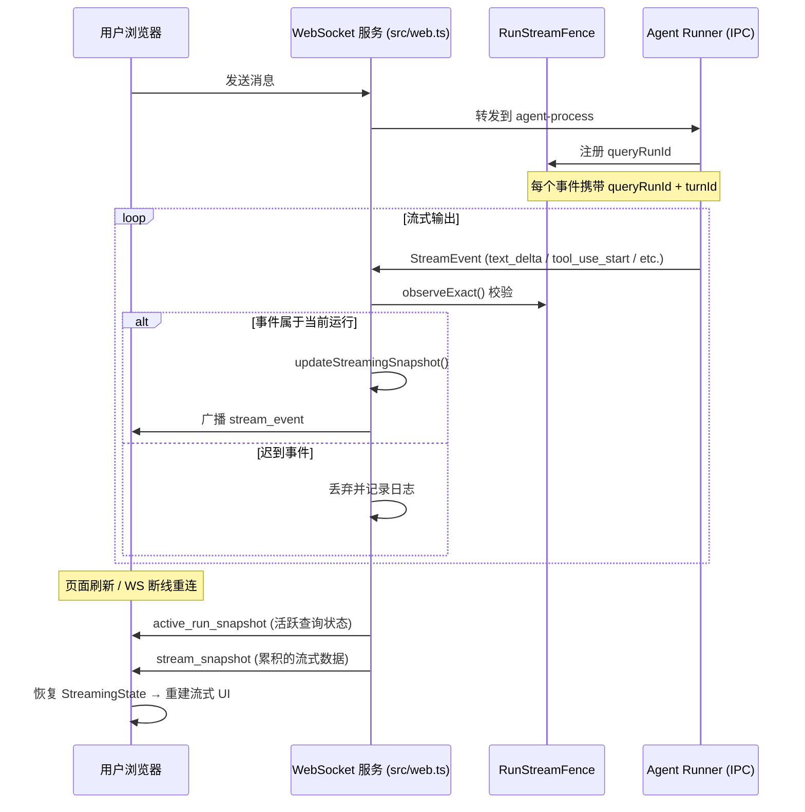

用户发送一条消息后，Agent 的推理过程并非瞬间完成——它需要经历思考、调用工具、读取文件、执行代码等一系列步骤，最终生成回复。**实时流式输出与工具轨迹展示**系统，正是将这些中间状态以低延迟、高可读性的方式呈现给用户，让黑盒推理变得透明可追踪。

这套系统的核心挑战在于：如何在 Browser ↔ WebSocket ↔ Agent Runner 三端之间，保证事件的实时性、顺序性、完整性和断线恢复能力，同时以清晰的视觉层次区分"思考中""工具调用中""已生成文本"等不同阶段。

---

## 端到端事件流架构

整个流式输出系统建立在统一的 **StreamEvent 类型系统**之上，从前端到后端再到 Runner 使用同一份类型定义，确保事件契约严格一致。



流式事件的核心链路包含三个关键阶段：

**第一阶段：事件生产与投递**。Agent Runner 在执行过程中，通过 IPC 协议将推理过程中的每一步以 StreamEvent 格式发送给主进程。每个事件都携带 `queryRunId`（标识所属的查询尝试）和 `turnId`（标识一次完整的用户回合）。主进程收到后，首先通过 `RunStreamFence` 进行生命周期校验，确保迟到事件不会污染新运行的 UI 状态。

Sources: [shared/stream-event.ts](shared/stream-event.ts#L1-L397), [src/run-stream-fence.ts](src/run-stream-fence.ts#L1-L84)

**第二阶段：服务端快照累积**。通过 `broadcastStreamEvent()` 函数，事件被广播到所有有权限的 WebSocket 客户端，同时调用 `updateStreamingSnapshot()` 将事件增量合并到服务端内存快照中。快照维护了 `partialText`、`thinkingText`、`activeTools`、`taskStates` 等关键字段，用于断线重连时的状态恢复。

Sources: [src/web.ts](src/web.ts#L2803-L2866)

**第三阶段：前端状态管理与渲染**。前端通过 `chat.ts` 的 Zustand store 接收 WebSocket 推送的 `stream_event` 消息，由 `applyStreamEvent()` 函数将事件逐步应用到 `StreamingState` 对象中。`StreamingDisplay` 组件从 store 中读取状态，实时渲染思考块、工具卡片、文本流、任务面板等 UI 元素。

Sources: [web/src/stores/chat.ts](web/src/stores/chat.ts#L500-L699), [web/src/components/chat/StreamingDisplay.tsx](web/src/components/chat/StreamingDisplay.tsx#L1-L1240)

---

## StreamEvent 类型系统

StreamEvent 是贯穿整个系统的数据契约，定义在 `shared/stream-event.ts` 中，并通过构建步骤同步到三个位置：主进程、Agent Runner 容器和前端的 Web 应用。这一设计保证了类型定义在跨进程通信中的一致性。

**事件类型矩阵**：系统定义了 25 种事件类型，按功能可分为以下类别：

| 类别 | 事件类型 | 用途 | 显示层级 |
|------|---------|------|---------|
| **文本推理** | `text_delta`, `thinking_delta` | 流式输出文本和思考过程 | `primary` |
| **工具调用** | `tool_use_start`, `tool_use_end`, `tool_progress`, `tool_result` | 工具生命周期管理 | `primary` |
| **Hook 钩子** | `hook_started`, `hook_progress`, `hook_response` | 自定义钩子执行跟踪 | `detail` |
| **任务管理** | `task_start`, `task_progress`, `task_updated`, `task_notification` | SDK Task 和 Sub-agent 状态 | `detail` |
| **系统状态** | `status`, `init`, `usage` | 运行状态和用量报告 | `detail` |
| **诊断审计** | `context_audit`, `raw_sdk_event`, `compact_boundary` | 上下文调试信息 | `debug` |
| **用户交互** | `permission_denied`, `prompt_suggestion`, `memory_recall` | 权限提示和记忆召回 | `primary` |
| **数据更新** | `todo_update`, `notification` | TODO 列表和通知 | `detail` |

每个事件都包含 `eventType`、`agentScope`（标识事件来源：`main` / `task` / `subagent` / `system`）和 `displayLevel`（控制 UI 展示优先级：`primary` 直接展示、`detail` 在详情面板展示、`debug` 只在开发者模式下展示）。这种分层设计允许同一个事件流同时服务于普通用户和高级调试需求。

Sources: [shared/stream-event.ts](shared/stream-event.ts#L1-L120)

**工具轨迹的完整字段**：涉及工具调用的事件携带了丰富的上下文信息：

- `toolName` 和 `toolUseId` 标识工具的唯一身份
- `parentToolUseId` 和 `isNested` 支持嵌套工具调用的父子关系建模
- `skillName` 区分是普通工具还是技能调用
- `toolInputSummary` 提供工具输入的可读摘要
- `elapsedSeconds` 允许后端主动推送已用时间，无需前端自行计时
- `toolResult` 携带工具执行结果（截断和清理后的安全版本）

Sources: [shared/stream-event.ts](shared/stream-event.ts#L220-L280)

---

## 后端广播管道：RunStreamFence 与快照系统

后端广播管道是流式系统的中枢，承担着事件校验、生命周期管理和断线恢复三大职责。

**RunStreamFence 生命周期守卫**：当用户连续发送多条消息时，Agent Runner 可能产生"迟到事件"——前一次查询的延迟事件在第二次查询已启动后才到达。`RunStreamFence` 通过维护 `activeRuns` 映射和 `turnOwners` 映射来解决这个问题。`activeRuns` 记录当前活跃的 `jid → runId` 映射；`turnOwners` 则记录每个 `turnId` 首次出现时的 `runId` 归属。当迟到事件到达时，`observeExact()` 方法会校验其 `runId` 是否与当前活跃的 `runId` 一致，不一致则直接丢弃。这种设计确保了即使 `turnId` 跨查询复用，事件也不会错误地归属到错误的查询尝试。

Sources: [src/run-stream-fence.ts](src/run-stream-fence.ts#L1-L84)

**服务端快照累积**：`updateStreamingSnapshot()` 函数在内存中维护了一个 `streamingSnapshots` 映射，键为 `jid`（含 `#agent:` 后缀），值为累积的 `StreamingSnapshotEntry` 对象。该函数为每个事件类型定义了不同的累积逻辑：

- `text_delta` 和 `thinking_delta` 追加到 `partialText` 和 `thinkingText`，各有截断上限（主文本 16000 字符，思考文本 8000 字符）
- `tool_use_start` 向 `activeTools` 数组添加新工具条目，并记录启动时间戳
- `tool_use_end` 从 `activeTools` 中移除对应工具
- `tool_progress` 更新现有工具的 `toolInputSummary` 和 `elapsedSeconds`
- `status` 事件中的 `idle` 状态会清理快照，`interrupted` 状态会设置 tombstone 防止迟到事件重建快照

快照还包含 `todos`、`systemStatus`、`activeHook` 等字段，完整覆盖了流式 UI 所需的所有状态维度。

Sources: [src/web.ts](src/web.ts#L2564-L2800)

**WebSocket 连接恢复**：当客户端断线重连时，后端在 `connection` 事件处理中执行两步恢复：首先发送 `active_run_snapshot`，包含所有活跃查询的 `runId`、`chatJid` 和阶段信息，让前端能够判断哪些对话还在等待回复；然后发送 `stream_snapshot`，包含每个活跃查询的累积流式数据，让前端能够无缝恢复流式 UI 而不会丢失已输出的内容。

Sources: [src/web.ts](src/web.ts#L1412-L1530)

---

## 前端状态管理：Zustand Store 中的流式处理

前端 chat store 维护了 `StreamingState` 对象和 `applyStreamEvent()` 函数，构成了流式状态管理的核心。

**StreamingState 数据结构**：每个活跃对话（通过 `groupJid` 或 `agentId` 标识）对应一个 `StreamingState` 实例，其中包含：

```typescript
interface StreamingState {
  turnId?: string;
  sessionId?: string;
  partialText: string;        // 已生成的回复文本
  thinkingText: string;       // 推理过程文本
  isThinking: boolean;        // 是否正在推理中
  thinkingStartedAt?: number; // 推理开始时间戳
  thinkingDurationMs?: number;// 推理持续时长（结束时记录）
  activeTools: Array<{        // 当前正在执行的工具
    toolName: string;
    toolUseId: string;
    startTime: number;
    toolInputSummary?: string;
    parentToolUseId?: string | null;
    isNested?: boolean;
    skillName?: string;
    toolInput?: Record<string, unknown>;
  }>;
  activeHook: { hookName: string; hookEvent: string } | null;
  systemStatus: string | null;
  recentEvents: StreamingTimelineEvent[];   // 最近事件日志
  traceEvents: StreamingTraceEvent[];       // 详细轨迹事件
  taskStates: Record<string, StreamingTaskRuntimeState>; // SDK Task 状态
  todos?: Array<{ id: string; content: string; status: string }>;
  interrupted?: boolean;  // 是否被中断（冻结状态）
}
```

Source: [web/src/stores/chat.ts](web/src/stores/chat.ts#L200-L400)

**applyStreamEvent 事件处理**：`applyStreamEvent()` 函数是状态更新的核心，它接受一个事件和当前状态，返回新的状态对象。每个事件类型都有对应的处理逻辑：

- `text_delta`：追加到 `partialText`，标记 `isThinking = false`，记录思考结束时间
- `thinking_delta`：追加到 `thinkingText`，标记 `isThinking = true`，记录思考开始时间
- `tool_use_start`：将工具添加到 `activeTools` 数组，推送到 `recentEvents` 日志
- `tool_use_end`：从 `activeTools` 中移除工具，在 `recentEvents` 记录完成时间和耗时
- `tool_progress`：更新工具的状态信息（`elapsedSeconds`、`toolInputSummary` 等）
- `task_start` / `task_progress` / `task_notification`：更新 `taskStates` 中的 SDK Task 状态
- `status` 中的 `idle` 和 `interrupted`：触发特殊的清理或冻结逻辑

Sources: [web/src/stores/chat.ts](web/src/stores/chat.ts#L1300-L1700)

**两阶段中断处理**：中断处理采用了"先冻结，后清理"的两阶段策略。当收到 `status:interrupted` 事件时，系统会冻结当前 `StreamingState`（保留已输出的文本和工具轨迹，但清除活动指示器），然后等待对应的 `new_message`（`interrupt_partial` 类型）到达。如果 10 秒内未收到最终消息，回退计时器会强制清除冻结状态，确保 UI 不会永久卡在"中断中"状态。

Sources: [web/src/stores/chat.ts](web/src/stores/chat.ts#L2800-L2999)

**rAF 批处理优化**：`text_delta` 和 `thinking_delta` 这类高频事件（每 200ms 可能产生多个）通过 `requestAnimationFrame` 批处理机制合并更新。事件先累积到 `pendingDeltas` 缓冲区，在下一个动画帧统一刷新到 store，避免频繁的 React 渲染造成性能问题。flush 时还会将积累的文本通过 `applyStreamEvent` 一次性应用到状态中，保证文本的连续性。

Sources: [web/src/stores/chat.ts](web/src/stores/chat.ts#L2500-L2600)

**sessionStorage 持久化**：流式状态还通过 `sessionStorage` 持久化，`saveStreamingToSession()` 函数以 500ms 的 trailing-edge 防抖将状态保存到浏览器 sessionStorage。页面刷新后，通过 `restoreStreamingFromSession()` 恢复，确保用户刷新页面时不会丢失已流式输出的内容。这种设计比服务端快照恢复更快（无需等待 WebSocket 重连），提供了更顺畅的页面刷新体验。

Sources: [web/src/stores/chat.ts](web/src/stores/chat.ts#L600-L800)

---

## 前端渲染组件：可视化流式输出

前端渲染层由 `StreamingDisplay` 组件及其子组件构成，负责将流式状态转化为可读的 UI。

**StreamingDisplay 主组件**：这是流式输出的顶层容器，根据 `displayMode` 和 `interactionMode` 决定渲染样式。在 `assistant` 模式下，组件渲染为包含头像、发送者名称、卡片背景的完整聊天气泡样式；在 `proactive` 模式下，仅渲染一个简洁的处理指示器。组件内部通过 `streaming` 状态对象判断是否有数据需要展示，在没有流式数据且不处于等待状态时返回 null，避免不必要的 DOM 元素。

Sources: [web/src/components/chat/StreamingDisplay.tsx](web/src/components/chat/StreamingDisplay.tsx#L900-L1240)

**StreamingContent 内部组件**：这是流式内容的实际渲染区域，按照固定顺序展示多个视觉区块：

1. **系统状态栏**：显示 `systemStatus` 文本，如"正在处理…"、"正在整理上下文…"
2. **推理思考块**：当 `isThinking = true` 时显示可折叠的思考面板，包含思考动画和累积的 `thinkingText`。思考结束时自动折叠，并显示"已思考 Xs"的时长标签，消除了思考块在完成时从展开到折叠的视觉跳跃
3. **工具活动卡片**：遍历 `activeTools`，为每个工具渲染 `ToolActivityCard` 组件
4. **TODO 进度面板**：显示 `todos` 列表的完成进度条和状态
5. **SDK Task / Sub-agent 运行时状态**：遍历 `taskStates`，根据任务类型渲染为 `WorkflowRunCard`（Claude Code Workflow）或 `SdkTaskRuntimeBlock`
6. **权限拒绝提示**：将 `permission_denied` 事件以红色警示卡片突出显示，不隐藏在 trace 面板中
7. **Trace 面板**：按类别分组展示详细的轨迹事件（Tools、Hooks、Memory、Task 等），默认折叠，面向高级用户
8. **Hook 指示器**：显示当前正在执行的 Hook 名称
9. **部分文本**：在 `assistant` 模式下显示已生成的 `partialText`，通过 `MarkdownRenderer` 渲染为富文本

Sources: [web/src/components/chat/StreamingDisplay.tsx](web/src/components/chat/StreamingDisplay.tsx#L400-L800)

**ToolActivityCard 工具轨迹卡片**：每个正在执行的工具渲染为一个精简的卡片，包含：

- 旋转的加载图标（indicating 工具正在执行）
- 工具名称（如果是 Skill 调用，显示技能名称而非"Skill"）
- 已用时间（秒，通过 `setInterval` 每秒更新本地计时器）
- 工具参数摘要（根据工具类型智能提取关键参数）：`Read`/`Write`/`Edit` 工具显示 `path`，`Bash` 工具显示 `cmd`，`Grep` 工具显示 `pattern`，`Agent` 工具显示 `task`

工具卡片还支持嵌套显示：当 `isNested = true` 时，卡片左侧添加缩进和边框线，清晰展示父子工具调用的层级关系。

Sources: [web/src/components/chat/ToolActivityCard.tsx](web/src/components/chat/ToolActivityCard.tsx#L1-L80)

**TaskAgentBlock 子 Agent 块**：DB 持久化的子 Agent 以独立的折叠块展示，视觉风格与推理思考块一致。根据 Agent 状态（`running` / `completed` / `error`）动态切换边框颜色和背景色。运行中的 Agent 自动展开，完成后自动折叠。内部包含 Agent 的 prompt 预览、流式状态（思考动画、工具卡片、部分文本）和结果摘要。

Sources: [web/src/components/chat/StreamingDisplay.tsx](web/src/components/chat/StreamingDisplay.tsx#L1-L200)

**WorkflowRunCard 工作流卡片**：用于展示 Claude Code 动态 Workflow 的完整执行过程。卡片包含工作流摘要、状态指示器、阶段（Phase）分组和 Agent 列表。每个 Agent 行展示状态图标、名称、Token 消耗、耗时，并可通过 `<details>` 元素展开查看模型信息、工具调用次数、任务摘要和结果预览。工作流完成后自动折叠，消除了视觉空间占用。

Sources: [web/src/components/chat/WorkflowRunCard.tsx](web/src/components/chat/WorkflowRunCard.tsx#L1-L374)

**TodoProgressPanel TODO 进度面板**：当 Agent 执行过程中产生 TODO 更新时，渲染为包含进度条和待办事项列表的面板。已完成的事项显示为带有删除线的文本，进行中的事项以蓝色高亮显示，待处理的事项显示为普通文本。进度条实时反映完成比例，为用户提供任务执行进度的直观感知。

Sources: [web/src/components/chat/TodoProgressPanel.tsx](web/src/components/chat/TodoProgressPanel.tsx#L1-L66)

---

## MessageBubble 中的流式产物展示

当流式输出完成后，最终生成的回复消息以 `MessageBubble` 组件展示。该组件与流式组件在视觉上保持一致性，确保用户在"流式输出中 → 已完成的回复"这一过渡中获得连贯的体验。

**推理思考的持久化**：Agent 的思考过程不会在流式结束后消失。`chat.ts` 维护了一个 `pendingThinking` 映射，在流式过程中累积思考文本，当收到 `sdk_final` 或 `new_message` 时，将思考文本转移到 `thinkingCache` 中，以 `messageId` 为键持久化。`MessageBubble` 中的 `ReasoningBlock` 组件读取这些缓存，以可折叠的推理块呈现，与流式阶段的思考块样式一致。思考时长信息也通过 `thinkingDurationCache` 单独持久化，在 `ReasoningBlock` 中显示"已思考 Xs"的标签。

Sources: [web/src/components/chat/MessageBubble.tsx](web/src/components/chat/MessageBubble.tsx#L1-L200), [web/src/stores/chat.ts](web/src/stores/chat.ts#L1800-L1900)

**Token 用量展示**：`TokenUsageDisplay` 组件解析 `token_usage` JSON 字段，展示主模型、输入/输出 Token 数量、缓存命中/写入、推理 Token 等详细信息。当有 Workflow 子 Agent 时，还会汇总展示所有子 Agent 的 Token 消耗。Tooltip 形式的展示让信息在需要时可见，但不会干扰主要阅读体验。

Sources: [web/src/components/chat/MessageBubble.tsx](web/src/components/chat/MessageBubble.tsx#L100-L200)

**Workflow 运行记录**：已完成的工作流运行记录以 `workflow_runs` 字段携带在消息中。`MessageBubble` 在渲染已完成的消息时，会展示这些 `WorkflowRunCard`，让用户即使在消息发送后也能回顾工作流的完整执行过程，包括每个子 Agent 的任务摘要和结果。

Sources: [web/src/components/chat/MessageBubble.tsx](web/src/components/chat/MessageBubble.tsx#L400-L600)

---

## 断线重连与状态恢复

流式系统对网络波动和页面刷新提供了多层次的状态恢复机制，确保用户不会因为临时断线而丢失已看到的输出内容。

**服务端恢复路径**：WebSocket 重连后，后端首先推送 `active_run_snapshot`，包含所有活跃查询的 `runId` 和阶段状态。接着推送 `stream_snapshot`，包含每个 JID 的累积流式数据。前端收到后，通过 `shouldApplyRunScopedPayload()` 和 `shouldDiscardStreamForAuthoritativeRun()` 等函数判断是否应该应用快照数据，确保不会错误地恢复已经被新查询取代的旧状态。

Sources: [src/web.ts](src/web.ts#L1453-L1530), [web/src/stores/run-lifecycle.ts](web/src/stores/run-lifecycle.ts#L1-L108)

**前端本地恢复路径**：除了服务端快照，前端还将流式状态保存到 `sessionStorage`。页面刷新后，`restoreStreamingFromSession()` 函数在 Zustand store 初始化时恢复状态，比等待 WebSocket 重连和快照推送更快，提供了更流畅的刷新体验。恢复后，状态通过 `isStaleStreaming()` 函数检查是否已过期（超过 30 秒），避免恢复过时的僵尸状态。

Sources: [web/src/stores/chat.ts](web/src/stores/chat.ts#L600-L800)

**Stale Waiting 检测**：`shouldRecoverStaleWaiting()` 函数用于检测卡住的等待状态。如果某个对话等待超过 60 秒（无流式数据时）或 180 秒（有流式数据时），且没有活跃的 `activeRun`，前端会判定为"僵尸等待"状态，允许用户自由发送新消息而不必等待永远不来的回复。

Sources: [web/src/components/chat/StreamingDisplay.tsx](web/src/components/chat/StreamingDisplay.tsx#L1-L50)

---

## 总结

实时流式输出与工具轨迹展示系统，通过三个核心设计原则实现了透明、可恢复的 Agent 推理体验：

**统一事件契约**：`StreamEvent` 类型系统作为跨三端（Browser ↔ WebSocket ↔ Runner）的数据契约，定义了 25 种事件类型，涵盖文本推理、工具调用、任务管理、系统状态等所有维度。`displayLevel` 分层设计允许同一事件流同时服务于普通用户和调试需求。

**精确生命周期管理**：`RunStreamFence` 和 `turnId` 机制确保每个事件精确归属于正确的查询尝试，杜绝迟到事件污染 UI。两阶段中断处理（冻结 → 清理）和 rAF 批处理优化在用户体验和性能之间取得平衡。

**多层恢复机制**：服务端快照、前端 sessionStorage 持久化、Stale Waiting 检测三层恢复机制，让用户在网络波动、页面刷新等场景下都能获得无缝的流式体验，不会丢失已输出的内容或陷入卡死的等待状态。