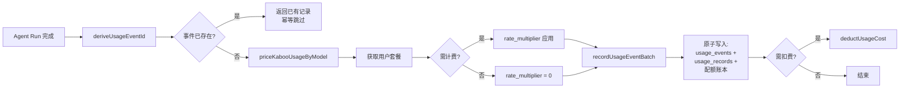
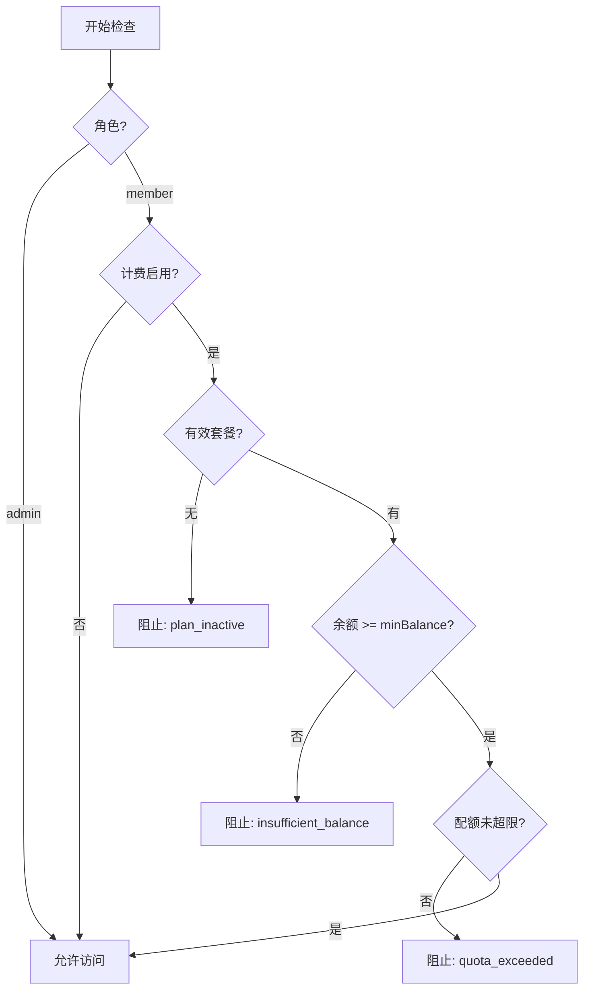
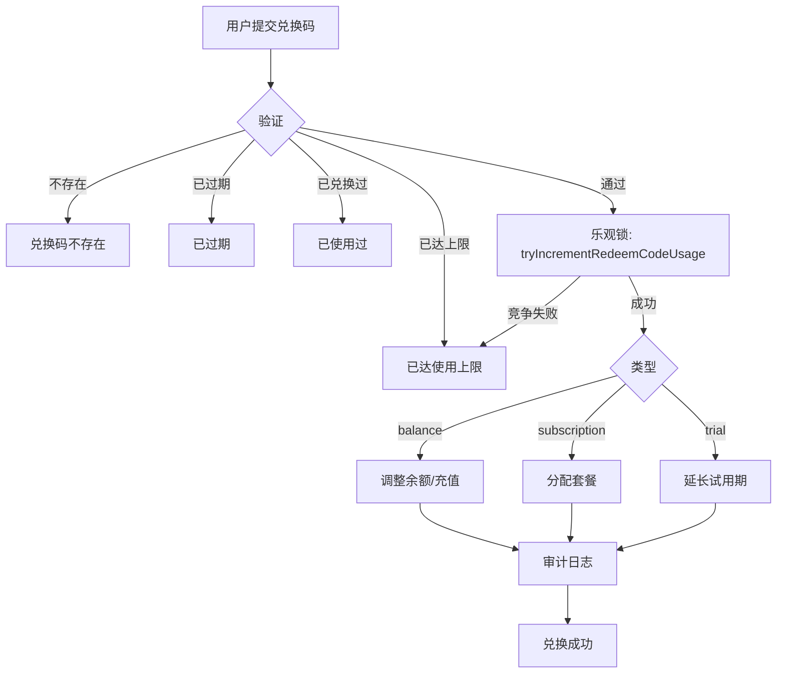

HappyClaw 的用量统计与计费系统是一个**余额优先（wallet-first）**的多层架构，覆盖从 Token 级定价、事件级计费、额度检查到管理员后台的完整链路。其核心设计原则包括：确定性定价（Kaboo 对齐）、事件幂等性（replay-safe）、多窗口配额（日/周/月）以及 LRU 缓存加速热路径。

## 架构总览

整个计费体系分为四层：**定价引擎**（Kaboo Pricing）负责将原始 Token 消耗映射为美元费用；**用量服务**（Usage Service）负责事件录入、价格计算与余额扣减的原子化提交；**计费核心**（Billing Core）负责套餐管理、余额钱包、额度检查与兑换码；**API 层**（Routes）分别面向普通用户和管理员暴露不同粒度的计费能力。

```mermaid
flowchart TD
    subgraph "定价层"
        K[Kaboo Pricing<br/>kaboo-pricing.ts]
        K --> |确定性定价| P[价格矩阵<br/>KABOO_MODEL_PRICING]
        P --> |最长匹配| M[模型定价查找]
    end

    subgraph "用量服务层"
        U[Usage Service<br/>usage-service.ts]
        U --> |事件录入| DB[(SQLite)]
        U --> |价格计算| K
        DB --> |幂等检查| U
    end

    subgraph "计费核心层"
        B[Billing Core<br/>billing.ts]
        B --> |套餐管理| BP[BillingPlan]
        B --> |额度检查| QC[QuotaCheck]
        B --> |钱包操作| BAL[UserBalance]
        B --> |兑换码| RC[RedeemCode]
    end

    subgraph "API 层"
        BR[Routes / Billing<br/>routes/billing.ts]
        UR[Routes / Usage<br/>routes/usage.ts]
        BR --> |用户端| UAPI[/my/*]
        BR --> |管理端| AAPI[/admin/*]
        UR --> |用量分析| STATS[/stats]
    end

    subgraph "前端展示"
        FU[Feishu Usage Display<br/>feishu-usage-display.ts]
        FE[Web Frontend<br/>web/src/stores/usage]
    end

    U --> B
    B --> BP
    B --> BAL
    B --> QC
    B --> RC
    BR --> B
    UR --> DB
    FU --> K
    FE --> UR
```

Sources: [src/billing.ts](src/billing.ts#L1-L988), [src/kaboo-pricing.ts](src/kaboo-pricing.ts#L1-L349), [src/usage-service.ts](src/usage-service.ts#L1-L243)

## 计费开关与系统配置

计费系统通过 `billingEnabled` 配置项全局开关。当计费关闭时，所有用户（包括 member 角色）无限制使用。开关状态由 `getSystemSettings()` 读取，该函数基于文件 mtime 自动缓存失效，无需手动维护缓存。

```typescript
// 核心开关函数
export function isBillingEnabled(): boolean {
  return getSystemSettings().billingEnabled === true;
}
```

关键配置项定义在 `BillingSettingsSchema` 中，并通过 `billingRoutes.put('/admin/config')` 管理：

| 配置项 | 类型 | 默认值 | 说明 |
|--------|------|--------|------|
| `billingEnabled` | boolean | `false` | 全局计费开关 |
| `billingMinStartBalanceUsd` | number | `0.01` | 最低启动余额 |
| `billingCurrency` | string | `"USD"` | 展示货币单位 |
| `billingCurrencyRate` | number | `1` | 货币汇率系数 |

**权限隔离**：计费配置与系统配置独立管理，`manage_system_config` 权限不授予计费控制权，需独立的 `manage_billing` 权限。

Sources: [src/billing.ts](src/billing.ts#L44-L51), [src/routes/billing.ts](src/routes/billing.ts#L67-L132)

## 套餐（BillingPlan）与订阅（Subscription）管理

### 套餐体系

每个 `BillingPlan` 定义了一套完整的资源配额与费用规则：

```
BillingPlan {
  id, name, description, tier          // 基本信息与层级
  monthly_cost_usd, display_price      // 价格展示
  rate_multiplier                      // 费用倍率（默认 1.0）
  
  // 多窗口配额（null = 无限）
  monthly_token_quota, monthly_cost_quota
  weekly_token_quota, weekly_cost_quota
  daily_token_quota, daily_cost_quota
  
  // 资源限制
  max_groups, max_im_channels, max_mcp_servers
  max_storage_mb, max_concurrent_containers
  
  trial_days, allow_overage, features  // 试用与特性
  is_default, is_active                // 状态标记
}
```

Tier 层级约定：`0=免费`，`10=基础`，`20=专业`，`30=企业`。

### 订阅生命周期

```mermaid
stateDiagram-v2
    [*] --> active: assignPlan()
    active --> expired: 到期
    active --> cancelled: cancelSubscription()
    cancelled --> active: 重新分配
    expired --> [*]
    
    state active {
        [*] --> trial: trial_days > 0
        trial --> active: 试用到期
    }
```

`getUserEffectivePlan()` 是核心查询函数：优先返回用户活跃订阅关联的套餐，若无订阅则回退到 `is_default=true` 的默认套餐。这种设计确保系统始终存在一个可用套餐，避免新用户无套餐可用。

```typescript
export function getUserEffectivePlan(userId: string): 
  { plan: BillingPlan; subscription: UserSubscription } | null {
  const sub = getUserActiveSubscription(userId);
  if (sub) return { plan: sub.plan, subscription: sub };
  const defaultPlan = getDefaultBillingPlan();
  if (!defaultPlan) return null;
  return { plan: defaultPlan, subscription: fallbackSub };
}
```

**订阅到期**：通过定时任务 `checkAndExpireSubscriptions()` 定期扫描过期订阅并标记为 `expired` 状态。该函数由 `task-scheduler.ts` 调度执行。

Sources: [src/billing.ts](src/billing.ts#L55-L132), [src/billing.ts](src/billing.ts#L854-L864), [src/types.ts](src/types.ts#L1026-L1068)

## 定价引擎：Kaboo Pricing

### 设计原则

定价模块 `kaboo-pricing.ts` 的定位是**确定性定价引擎**——同样的模型名加同样的 Token 用量，无论何时何地计算，都产出完全一致的美分价格。该模块的定价数据源与 Kaboo 后端数据库迁移文件对齐（`000002_seed_pricing`, `000030_anthropic_reasoning_shadow_pricing`, `000034_seed_2026_model_prices`）。

### 五类 Token 定价

系统支持 Claude 的五类 Token 独立定价，每类 Token 按每百万（per million tokens）计价：

| Token 类别 | 说明 | 典型价格（Claude Sonnet 4） |
|-----------|------|---------------------------|
| `inputTokens` | 输入 Token | $3/MTok |
| `outputTokens` | 输出 Token | $15/MTok |
| `cacheReadInputTokens` | 缓存读取 | $0.30/MTok |
| `cacheCreationInputTokens` | 缓存写入 | $3.75/MTok |
| `reasoningTokens` | 推理 Token | $15/MTok |

### 模型匹配算法

模型名匹配采用**最长子串匹配（longest-substring matching）**，不区分大小写，忽略通配符 `%`：

```typescript
// 匹配逻辑示意
export function matchKabooModelPricing(modelName: string): KabooModelPricing | undefined {
  const lower = modelName.toLowerCase();
  let matched, bestLength = 0;
  for (const candidate of KABOO_MODEL_PRICING) {
    const pattern = candidate.pattern.toLowerCase().replace(/%+$/, '');
    if (pattern.length > bestLength && lower.includes(pattern)) {
      matched = candidate;
      bestLength = pattern.length;
    }
  }
  return matched;
}
```

例如 `provider/CLAUDE-OPUS-4-5-20251101:beta` 匹配到 `claude-opus-4-5%`（最长 V = 16 字符），而非更短的 `claude-opus-4%`（V = 12）。未匹配到的模型统一回退到 **Claude Sonnet fallback** 作为兜底定价。

### 价格计算与舍入

价格计算在美分（cents）级别做一次舍入，避免浮点误差累积：

```typescript
export function estimateKabooModelCostCents(modelName, rawUsage): number {
  const costUSD = /* 五类 Token 求和 */;
  return Math.round(costUSD * 100);  // 仅在美分舍入一次
}

export function kabooCostCentsToUSD(costCents: number): number {
  return costCents / 100;  // 除法仅做单位转换，不再舍入
}
```

这种 **"先乘 100 舍入，再除 100 转 USD"** 的模式确保了存储和账单共享同一个边界。

### 多模型事件归因

当一次 Agent Run 调用多个模型时，`priceKabooUsageByModel()` 负责将总 Token 消耗按模型拆分并分别定价。重要设计：**优先使用 `modelUsage` 逐模型数据**，只有在 `modelUsage` 缺失时才回退到根级 Token 汇总并归入 `unknown` 模型。这样确保了事件、模型、配额和账单四个账本始终共享完全相同的 Token 基础。

Sources: [src/kaboo-pricing.ts](src/kaboo-pricing.ts#L1-L349), [tests/kaboo-pricing.test.ts](tests/kaboo-pricing.test.ts#L1-L214)

## 用量事件记录与计费

### 事件录入流程

`recordUsageEvent()` 是用量计费的**唯一入口函数**，流程如下：



关键设计决策：

1. **事件幂等性**：每个 `eventId` 在 `usage_events` 表中唯一。重复提交同 `eventId` 直接返回已有记录，不重复计费、不重复扣减配额。`deriveUsageEventId()` 提供向后兼容：优先使用显式传入的 `eventId`，否则从参数哈希派生。

2. **SDK 美元估计不参与事件身份**：`deriveUsageEventId()` 的哈希计算中，`costUSD` 字段被显式排除。因为 SDK 报告的美元估计值不是权威计费来源，不应影响事件的重放标识。

3. **零成本事件仍然统计**：管理员或计费关闭时仍然记录完整 Token 用量，只是 `billedCostUSD` 为零。这确保了 Token 级配额统计数据对所有角色都可见。

### 价格桶（Pricing Bucket）

Kaboo 使用 **UTC 30 分钟窗口**作为价格桶（pricing bucket）。每个价格桶内的同模型 Token 先汇总，再计算美分价格，然后取增量作为本次事件的成本。这种设计解决了小批量 API 调用间的美分进位问题：

```typescript
// 获取当前桶内已有总量
const previous = getUsagePricingBucketTotals({ userId, groupFolder, source, model, createdAt });
// 计算加上本次后的桶总价
const nextCostCents = estimateKabooModelCostCents(model, previous + current);
// 增量 = 新总价 - 旧总价，即为本次应计费金额
const incrementalCostUSD = kabooCostCentsToUSD(Math.max(0, nextCostCents - previousCostCents));
```

### 费用倍率（Rate Multiplier）

每个套餐可以定义 `rate_multiplier`，默认 1.0。系统计费时，`providerEstimatedCostUSD` 保持为 Kaboo 定价的原始估计值，而 `billedCostUSD` 乘以倍率。这种分离使得管理员可以观察到实际的 Provider 成本，而对用户收取经过倍率调整后的费用。

Sources: [src/usage-service.ts](src/usage-service.ts#L1-L243), [src/db.ts](src/db.ts#L3336-L3403), [tests/usage-accounting.test.ts](tests/usage-accounting.test.ts#L1-L711)

## 额度检查与访问控制

### 三窗口检查

额度检查 `checkQuota()` 支持**日、周、月**三个时间窗口，每个窗口可独立配置费用上限和 Token 上限：

```typescript
// 检查顺序：daily → weekly → monthly（首个超限即返回）
const dailyExceeded = checkWindow(dailyCost, plan.daily_cost_quota, 
                                   dailyTokens, plan.daily_token_quota, 'daily', ...);
if (dailyExceeded) return dailyExceeded;
// daily 未超限 → 检查 weekly
// weekly 未超限 → 检查 monthly
```

**警告百分比**：当所有窗口都未超限时，计算最高使用率百分比（如 `monthlyCost / monthly_cost_quota` 的百分比），返回给前端作为用量预警。

### 访问控制链

`checkBillingAccess()` 是完整的访问控制检查，顺序如下：



### 资源限制

除了费用和 Token 配额，套餐还支持多种资源限制：

| 限制函数 | 对应套餐字段 | 场景 |
|---------|------------|------|
| `checkGroupLimit` | `max_groups` | 工作区数量上限 |
| `checkImChannelLimit` | `max_im_channels` | IM 通道数上限 |
| `checkMcpServerLimit` | `max_mcp_servers` | MCP Server 数上限 |
| `checkStorageLimit` | `max_storage_mb` | 存储空间上限 |
| `getUserConcurrentContainerLimit` | `max_concurrent_containers` | 并发容器数上限 |

### 缓存机制

计费系统维护两个 LRU 缓存（`_quotaCache` 和 `_accessCache`），缓存 TTL 为 30 秒，最大容量 500 条。缓存键为用户 ID，使用 Map 的插入顺序实现 LRU 淘汰。当用户订阅、余额或配额发生变更时，通过 `invalidateUserBillingCache(userId)` 或 `invalidateAllBillingCaches()` 手动失效缓存。

Sources: [src/billing.ts](src/billing.ts#L179-L470), [src/billing.ts](src/billing.ts#L137-L177), [src/billing.ts](src/billing.ts#L474-L575)

## 余额钱包与交易

### 余额管理

每个用户拥有一张余额表 `UserBalance`，记录 `balance_usd`、`total_deposited_usd`、`total_consumed_usd`。余额可通过以下方式变更：

| 操作 | 函数 | 金额方向 | 说明 |
|------|------|---------|------|
| 管理员充值 | `applyAdminBalanceAdjustment` | 正数 | 附带审计日志与访问过渡日志 |
| 管理员扣减 | `applyAdminBalanceAdjustment` | 负数 | 同充值，支持幂等键 |
| 用量扣费 | `deductUsageCost` | 负数 | 由 `recordUsageEvent` 触发 |
| 兑换码充值 | `redeemCode` (type=balance) | 正数 | 通过兑换码充值 |

### 扣费流程

`deductUsageCost()` 在 `recordUsageEvent()` 之后调用，但仅在以下条件全部满足时执行：
- 计费已启用（`isBillingEnabled()`）
- 用户角色非 admin
- 用户有效套餐存在
- `billedCostUSD > 0`

扣费使用 `adjustUserBalance()` 并传入 `eventId` 作为幂等键，确保同一事件不会重复扣费。余额允许为负（`allowNegative: true`），避免因余额不足导致扣费失败。

### 交易审计

所有余额变更记录在 `balance_transactions` 表中，携带完整的元数据：

```typescript
interface BalanceTransaction {
  type: 'deposit' | 'deduction' | 'refund' | 'adjustment' | 'redeem';
  reference_type: 'usage_event' | 'redeem_code' | 'admin_adjust' | ...;
  idempotency_key: string | null;   // 幂等键
  source: 'usage_charge' | 'redeem_code' | 'admin_manual_recharge' | ...;
  operator_type: 'system' | 'admin' | 'user';
}
```

此外，`logBillingAudit()` 记录所有计费管理事件（套餐变更、订阅分配、余额调整、钱包状态变更等），形成完整的审计追踪。

Sources: [src/billing.ts](src/billing.ts#L577-L706), [src/types.ts](src/types.ts#L1070-L1127)

## 兑换码系统

兑换码（Redeem Code）支持三种类型：

| 类型 | `type` 值 | 效果 |
|------|----------|------|
| 余额充值 | `balance` | 向用户钱包增加指定金额（`value_usd`） |
| 套餐激活 | `subscription` | 为用户分配指定套餐（`plan_id` + `duration_days`） |
| 试用延长 | `trial` | 延长当前套餐的试用期（`duration_days`） |

### 兑换流程



兑换码使用**乐观锁**（`tryIncrementRedeemCodeUsage`）确保并发安全，在 SQLite 层面通过原子 UPDATE 递增 `used_count`，只有 `used_count < max_uses` 时更新成功。

Sources: [src/billing.ts](src/billing.ts#L708-L850)

## API 路由体系

### 用户端 API（`/api/billing/my/*`）

| 端点 | 方法 | 说明 |
|------|------|------|
| `/api/billing/plans` | GET | 获取可用套餐列表 |
| `/api/billing/my/subscription` | GET | 当前订阅与套餐详情 |
| `/api/billing/my/balance` | GET | 当前余额 |
| `/api/billing/my/usage` | GET | 当月用量 + 历史趋势 |
| `/api/billing/my/transactions` | GET | 交易记录（分页） |
| `/api/billing/my/quota` | GET | 当前配额状态（日/周/月） |
| `/api/billing/my/access` | GET | 完整访问控制状态 |
| `/api/billing/my/redeem` | POST | 使用兑换码 |
| `/api/billing/my/usage/daily` | GET | 日用量历史（图表用） |
| `/api/billing/status` | GET | 计费状态与货币设置 |

### 管理端 API（`/api/billing/admin/*`）

所有管理端点需要 `manage_billing` 权限。

| 端点 | 方法 | 说明 |
|------|------|------|
| `/admin/config` | GET/PUT | 计费系统配置 |
| `/admin/plans` | GET/POST | 套餐列表/创建 |
| `/admin/plans/:id` | PATCH/DELETE | 更新/删除套餐 |
| `/admin/users` | GET | 全部用户计费概览 |
| `/admin/users/:id/detail` | GET | 用户计费详情（扁平结构） |
| `/admin/users/:id/assign-plan` | POST | 为用户分配套餐 |
| `/admin/users/:id/adjust-balance` | POST | 调整用户余额 |
| `/admin/users/:id/cancel-subscription` | POST | 取消用户订阅 |
| `/admin/users/batch-assign-plan` | POST | 批量分配套餐 |
| `/admin/redeem-codes` | GET/POST | 兑换码列表/创建 |
| `/admin/redeem-codes/:code` | DELETE | 删除兑换码 |
| `/admin/redeem-codes/export` | GET | CSV 导出兑换码 |
| `/admin/redeem-codes/:code/usage` | GET | 兑换码使用详情 |
| `/admin/audit-log` | GET | 计费审计日志 |
| `/admin/revenue` | GET | 收入汇总 |
| `/admin/revenue/trend` | GET | 月度收入趋势 |

### 用量分析 API（`/api/usage/*`）

| 端点 | 方法 | 说明 |
|------|------|------|
| `/api/usage/stats` | GET | 用量统计汇总（含 breakdown & daily） |
| `/api/usage/models` | GET | 可用模型过滤列表 |
| `/api/usage/filters` | GET | 过滤条件（models/agents/workspaces） |
| `/api/usage/records` | GET | 用量记录分页 |
| `/api/usage/export.csv` | GET | CSV 导出（上限 10,000 行） |
| `/api/usage/users` | GET | 用量用户列表（admin 可见全部） |

用量 API 通过 `queryContext()` 处理日期范围，支持 `days`、`from`/`to` 参数，日期范围限制最长 365 天。`resolveUserId()` 确保非 admin 用户只能查看自己的用量。

Sources: [src/routes/billing.ts](src/routes/billing.ts#L1-L847), [src/routes/usage.ts](src/routes/usage.ts#L1-L246)

## 前端集成

### 计费导航可见性

前端通过 `filterNavItems(billingEnabled)` 动态控制计费页面的导航可见性。当计费关闭时，账单入口不在主导航中显示；计费开启时仅显示用户端 `/billing` 入口。

### 用量展示标准化

前端和后端（飞书卡片）共享统一的 Token 用量展示逻辑：

- **五类合计**：所有 Token 类别（input/output/cacheRead/cacheCreation/reasoning）汇总显示总量
- **非零展示**：仅显示 > 0 的 Token 类别，避免展示零值干扰
- **未上报处理**：当所有类别为零时，显示 "Token 未上报" 而非 "0 tokens"
- **格式化**：超过 1000 的 Token 数以 K 为单位（如 `126.5K tokens`）

```typescript
// 飞书卡片中的标准展示格式
export function formatFeishuUsageNote(usage): string {
  // 输出如: 💰 126.5K tokens（输入 1.0K · 输出 500 · 缓存读取 100.0K · 缓存写入 25.0K）· $1.2346 · 2.5s · 3 turns
}
```

### 前端用量 Store

前端 `useUsageStore` 管理用量查询状态，支持 `buildUsageQueryParams()` 构建查询参数、`normalizeUsageResponse()` 标准化响应数据。`DEFAULT_QUERY` 默认查询最近 7 天数据。

Sources: [tests/frontend-billing-navigation.test.ts](tests/frontend-billing-navigation.test.ts#L1-L18), [src/feishu-usage-display.ts](src/feishu-usage-display.ts#L1-L74), [tests/usage-display-formatting.test.ts](tests/usage-display-formatting.test.ts#L1-L175), [tests/frontend-usage-experience.test.ts](tests/frontend-usage-experience.test.ts#L1-L337)

## 数据模型与 Schema 迁移

### 核心表结构

| 表名 | 用途 | 关键字段 |
|------|------|---------|
| `billing_plans` | 套餐定义 | `id, name, tier, 各类配额, rate_multiplier, 资源限制` |
| `user_subscriptions` | 用户订阅记录 | `user_id, plan_id, status, started_at, expires_at, trial_ends_at` |
| `user_balances` | 用户余额 | `balance_usd, total_deposited_usd, total_consumed_usd` |
| `balance_transactions` | 余额变更流水 | `type, amount_usd, balance_after, reference_type, reference_id, idempotency_key` |
| `usage_events` | 用量事件（一次 Run） | `event_id, user_id, provider_estimated_cost_usd, billed_cost_usd` |
| `usage_records` | 逐模型用量明细 | `event_id, user_id, model, 五类 Token, cost_usd, created_at` |
| `monthly_usage` | 月度汇总（配额用） | `user_id, month, total_cost_usd, message_count` |
| `daily_usage` | 日度汇总（配额用） | `user_id, date, total_cost_usd, message_count` |
| `redeem_codes` | 兑换码 | `code, type, value_usd, plan_id, max_uses, used_count` |
| `redeem_code_usage` | 兑换码使用记录 | `code, user_id, redeemed_at` |
| `billing_audit_log` | 计费审计日志 | `event_type, user_id, actor_id, details` |

### Schema 迁移

用量系统在 Schema v51 中引入了 `usage_events` 表，并完成了对旧版 `usage_records` 中遗留数据的回填。迁移逻辑在 `db.ts` 的 `initDatabase()` 中自动执行，通过 `router_state` 跟踪版本号。

迁移（v50 → v51）的关键操作：
1. 创建 `usage_events` 表
2. 为 `usage_records` 中 `event_id = NULL` 的旧记录生成 `legacy:${id}` 格式的事件 ID
3. 将 `cost_usd` 回填为 `provider_estimated_cost_usd`
4. 支持幂等修复（部分升级场景下可能已有列但未回填数据）

Sources: [tests/schema-v51-usage.test.ts](tests/schema-v51-usage.test.ts#L1-L118), [src/db.ts](src/db.ts#L3247-L3450)

## 运维与监控

### 月度用量漂移校正

`reconcileMonthlyUsage()` 是一个周期性安全网函数，用于检测并修复 `monthly_usage` 与 `daily_usage` 汇总之间的漂移。当漂移超过 $0.01 时，自动将月度记录修正为日度汇总的精确值。该函数由定时任务调度器定期执行。

### 缓存失效策略

| 事件 | 缓存操作 |
|------|---------|
| 套餐分配/取消 | `invalidateUserBillingCache(userId)` |
| 余额调整 | `invalidateUserBillingCache(userId)` |
| 套餐更新/删除 | `invalidateAllBillingCaches()` |
| 计费配置更新 | `invalidateAllBillingCaches()` |
| 订阅到期 | `invalidateAllBillingCaches()` |

### 审计日志

所有计费事件通过 `logBillingAudit()` 记录到 `billing_audit_log` 表，事件类型包括：

`plan_created`, `plan_updated`, `plan_deleted`, `subscription_assigned`, `subscription_cancelled`, `subscription_expired`, `balance_adjusted`, `manual_recharge`, `manual_deduct`, `balance_deducted`, `code_created`, `code_redeemed`, `code_deleted`, `wallet_blocked`, `wallet_unblocked`, `quota_exceeded`, `billing_settings_updated`

Sources: [src/billing.ts](src/billing.ts#L866-L910), [src/billing.ts](src/billing.ts#L137-L177), [src/types.ts](src/types.ts#L1153-L1179)

## 设计要点总结

1. **余额优先模式**：wallet-first 设计，用户必须先有余额才能使用，避免先消费后欠费的风险
2. **确定性定价**：Kaboo 对齐的定价矩阵，所有计算在美分级别舍入一次，确保价格可复现
3. **事件幂等性**：通过 `eventId` 唯一标识每次 Agent Run，重放安全
4. **多窗口配额**：日/周/月三层额度检查，先到先停
5. **LRU 缓存加速**：30s TTL 的缓存确保热路径性能，同时避免配置变更后的脏读
6. **完整的审计追踪**：所有计费管理操作记录审计日志，支持事后追溯
7. **权限隔离**：计费管理与系统配置权限分离，遵循最小权限原则
8. **Schema 版本化迁移**：用量相关的 Schema 变更通过版本化迁移管理，兼容旧数据