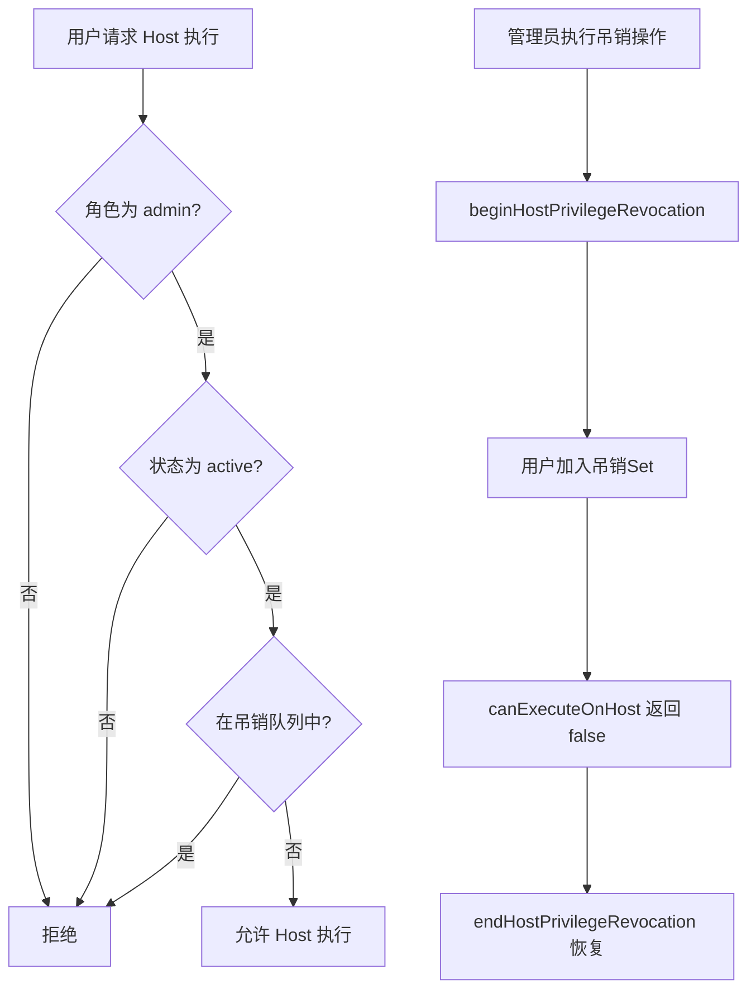
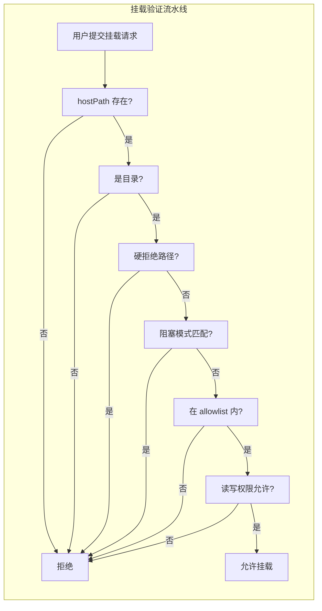
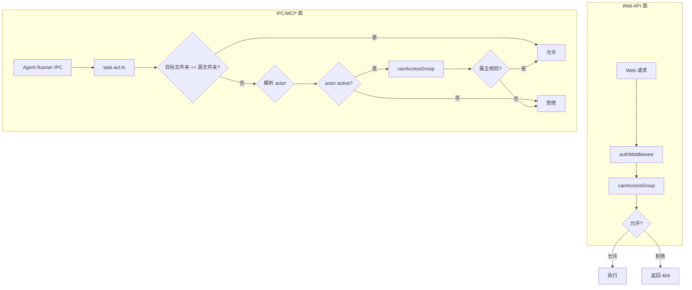

多租户安全隔离是 HappyClaw 的架构基石，它决定了"谁能在宿主机上执行代码"、"工作区之间的数据如何隔离"以及"敏感操作如何进行保护"。系统的多层次安全模型从 Host 执行权限、文件系统挂载、跨组消息路由、定时任务授权、URL 安全、文件路径防护等多个维度构建防御纵深，核心原则是**权限必须实时验证、持久化数据不构成授权凭据、admin 角色不自动绕过工作区所有权**。

## Host 执行权限：实时活性授权

Host 执行是 HappyClaw 中权限等级最高的操作——它允许 Agent 在宿主机上直接运行 Shell 命令、访问本地文件系统、调用宿主机工具链。这一权限不是持久化的属性，而是每次执行时实时验证的活性授权。

`canExecuteOnHost()` 函数是 Host 执行权限的唯一判定入口，要求用户同时满足三个条件：`role === 'admin'`、`status === 'active'`，且不在权限吊销队列中。这与工作区访问权限（`canAccessGroup`）完全正交——即使某个用户拥有某个工作区的访问权，也不代表他可以以 Host 模式执行。`HOST_EXECUTION_FORBIDDEN_ERROR` 的错误消息清晰地表明："Host execution requires a currently active administrator owner"。

系统还提供了 `beginHostPrivilegeRevocation()` / `endHostPrivilegeRevocation()` 这对接口，用于在管理员角色变更或账户禁用时，即时吊销其 Host 权限，无需等待进程重启。`revokingHostPrivilegeUserIds` 是一个内存中的 Set，在管理员从 admin 降级为 member 或账户被禁用时，由路由层调用 `beginHostPrivilegeRevocation` 将用户 ID 加入其中，所有后续的 `canExecuteOnHost` 查询都会返回 false，直到 `endHostPrivilegeRevocation` 显式恢复。

这一设计背后的核心原则是：**Host 权限是活的，永不应从持久化 row 中继承**。`resolveEffectiveAgentProfile()` 函数在解析 Agent Profile 的执行策略时，会重新从数据库查询当前用户，而不是信任 profile 中存储的历史配置。如果用户不再是 active admin，Host 上下文源（`host_claude`）会被降级为 `managed`，Host Skills 会被强制设为 `disabled`，确保角色降级即时生效，无需重写每一个历史 profile。

Sources: [host-execution-policy.ts](src/host-execution-policy.ts#L1-L30), [agent-profile-runtime.ts](src/agent-profile-runtime.ts#L29-L79), [agent-profile-policy.ts](src/agent-profile-policy.ts#L37-L56)

## 挂载安全：三层防御的主机目录访问控制

当 Host 工作区或 Docker 容器需要挂载宿主机目录时，HappyClaw 通过三层安全模型进行保护，确保只有受信路径才能暴露给工作区。

### 第一层：部署级 Allowlist

`config/mount-allowlist.json` 是部署管理员控制的准入名单，定义了哪些宿主机根目录可以被挂载、是否允许读写、以及哪些路径模式被全局阻止。默认配置允许 `~`（用户 home 目录）的读写访问，但生产部署应将其收窄到特定项目目录。

Allowlist 的加载采用**自动重载机制**：`loadMountAllowlist()` 通过文件 inode、mtime、大小和 SHA256 摘要的组合签名检测文件变化，发现文件更新后自动重新加载，无需重启服务。如果文件不存在或格式无效，系统会 fail-closed——所有挂载请求被拒绝，直到有效的 allowlist 恢复。

Sources: [config/mount-allowlist.json](config/mount-allowlist.json#L1-L12), [mount-security.ts](src/mount-security.ts#L125-L175)

### 第二层：硬拒绝路径与阻塞模式

即使某个路径在 allowlist 的白名单内，系统也会检查它是否属于**硬拒绝路径**（`hardDeniedHostPath`），包括：

| 类别 | 路径/模式 | 原因 |
|------|----------|------|
| 系统核心 | `/proc`, `/sys`, `/dev`, `/run`, `/var/run` | 容器逃逸风险 |
| Docker 守护进程 | `/var/lib/docker`, `/var/lib/containerd`, `/var/lib/containers` | 容器操控 |
| 应用数据 | `DATA_DIR`（`data/`） | 多租户数据隔离 |
| 项目敏感 | `.env`, `.git` | 凭据泄露 |
| 用户凭据 | `~/.ssh`, `~/.gnupg`, `~/.aws`, `~/.azure`, `~/.gcloud`, `~/.kube`, `~/.docker`, `~/.claude` | 云服务与基础设施凭据 |
| 容器 Socket | `docker.sock`, `podman.sock`, `containerd.sock`, `cri-dockerd.sock` | 容器逃逸 |

此外，系统维护了一个**默认阻塞模式列表**（`DEFAULT_BLOCKED_PATTERNS`），包含 `.ssh`, `.gnupg`, `.gpg`, `.aws`, `.azure`, `.gcloud`, `.kube`, `.docker`, `.claude`, `credentials`, `.env`, `.netrc`, `.npmrc`, `.pypirc`, `id_rsa`, `id_ed25519`, `private_key`, `.secret` 等模式。`matchesBlockedPattern()` 函数会遍历路径的每个组件进行匹配，在 macOS/Windows 的大小写不敏感文件系统上还会进行小写转换。

Sources: [mount-security.ts](src/mount-security.ts#L26-L51, L247-L287, L195-L212)

### 第三层：挂载验证与读写权限控制

`validateMount()` 函数对每个挂载请求执行完整的验证流水线，包括路径存在性检查、目录类型验证、硬拒绝路径检测、阻塞模式匹配、allowlist 准入判定，以及读写权限的最终确认。

读写权限的控制尤为精细：
- **非主工作区（non-main）**：如果 `nonMainReadOnly` 为 true，则所有非主工作区的读写请求都会被拒绝
- **Allowlist 根目录级别**：每个 `AllowedRoot` 条目独立控制 `allowReadWrite`，即使某个路径在 allowlist 内，其根目录声明为只读时，读写请求也会被拒绝
- **最具体路径优先**：`findAllowedRoot()` 选择最长匹配的根目录，防止宽泛的可写根目录覆盖更具体的只读根目录

`validateAdditionalMountsStrict()` 是原子化的严格验证器，用于工作区创建和容器启动的挂载点验证。它在验证失败时抛出 `AdditionalMountValidationError`，确保调用方绝不会部分应用无效的挂载配置。

Sources: [mount-security.ts](src/mount-security.ts#L458-L571, L597-L712)

## 定时任务：无 Admin 旁路的工作区隔离

定时任务（Scheduled Tasks）的授权模型是 HappyClaw 安全架构中最精妙的设计之一。其核心原则是：**定时任务的 IPC/MCP 面授权与 Web 面同源，admin 角色不提供全局旁路**。

`task-acl.ts` 中的 `canIpcActorAccessGroup()` 和 `canIpcActorManageTask()` 函数定义了任务授权的两条路径：
1. 目标组是 Agent 自身的工作区文件夹（`group_folder === sourceFolder`）
2. 工作区属主同样拥有目标群组（通过 `canAccessGroup` 验证）

`isAdminHome` 在任务授权中**故意不出现**。原因在代码注释中明确定义：admin Home Agent 是一个会接触不可信内容的 LLM，而定时任务的 `prompt` 会被按计划重放、以 Bot 身份在目标会话发言、并计费到目标工作区。如果存在全局旁路，注入的内容可以跨租户种植、重写或立即执行定时任务。

Script 任务（`execution_type === 'script'`）有额外的限制：仅允许在 Host 模式的管理员工作区中执行。`getScriptTaskHostExecutionError()` 函数检查任务的 `execution_mode` 必须是 `host`，且目标工作区的 `executionMode` 也必须是 `host`，否则返回错误信息。

`list_tasks` 不允许跨租户枚举，因为任务的 `prompt` 属于用户内容。`schedule_task`、`pause_task`、`resume_task`、`cancel_task`、`update_task`、`run_task_now`、`stop_task_run`、`restore_task` 等所有面操作都经过同源授权判定。

Sources: [task-acl.ts](src/task-acl.ts#L1-L76), [script-task-policy.ts](src/script-task-policy.ts#L1-L40), [ACL-MATRIX.md](docs/ACL-MATRIX.md#L230-L248)

## 跨组消息授权：IPC 路由安全

在 IM 多租户环境中，一个 Agent 运行时的 IPC 消息可能被路由到不同的群组。`canSendCrossGroupMessage()` 函数是跨组消息的授权网关，其判定逻辑如下：

1. **Admin Home**：可以发送到任何群组（但仅限 admin Home Agent——这是 `isAdminHome` 保留的唯一用途）
2. **同文件夹**：非 Home 群组只能发送到共享同一 `folder` 的目标群组
3. **同创建者**：Member Home 可以发送到同一 `created_by` 创建的群组
4. **IM 渠道绑定回源**：`target_main_jid` 绑定到源工作区的 IM 渠道可达——这解决了 Agent Runner 重写 `ctx.chatJid` 为 IM 源后，非 Home 子工作区的 `send_file`/`send_image`/`send_message` 可能被拒绝的问题

`registered_groups` 表的 `created_by` 字段是工作区隔离的核心标识。`canAccessGroup()` 对所有角色（包括 admin）使用同一规则：
- Home Workspace：仅 `created_by`
- Web Workspace：仅创建者
- IM Chat：优先使用自身 `created_by`；旧记录无 owner 时，通过同 folder 的 Home Workspace 解析 owner

`owner-gate.ts` 中的 `checkOwnerActive()` 函数提供了运行时层面的群组 owner 活性检查。如果一个群组的 `created_by` 对应的用户被禁用或删除，该群组必须立即停止响应——否则 Bot 会在下次服务重启前持续工作。该函数返回 `{ allowed: true }` 或 `{ allowed: false, reason: 'inactive_owner', status }`，在消息处理管道的入口处进行拦截。

Sources: [cross-group-acl.ts](src/cross-group-acl.ts#L1-L36), [owner-gate.ts](src/owner-gate.ts#L1-L30), [ACL-MATRIX.md](docs/ACL-MATRIX.md#L70-L97)

## 群组广播与受众策略

`group-broadcast-acl.ts` 实现了群组广播消息的接收者限制。`getGroupAllowedUserIds()` 函数通过缓存（10 秒 TTL）解析群组的 `created_by`，将广播消息限定在创建者本人可见。对于虚拟 JID（包含 `#agent:` 或 `#task:` 分隔符），系统会剥离分隔符部分，基于基础 JID 进行查询。

`im-audience-policy.ts` 中的受众策略提供了更细粒度的消息可见性控制：
- `audience_mode=everyone`：所有群组成员可以触发 Bot 响应
- `audience_mode=owner_only`：只有 `owner_im_id` 可以触发
- `activation_mode=always`：无需 @ 即可激活
- `activation_mode=when_mentioned`：需要首次 @，原生话题激活后可继续
- `activation_mode=disabled`：DM 和群聊都停止响应

受众策略与激活方式是独立维度。Legacy `owner_mentioned` 读取时会自动规范化为 `audience_mode=owner_only + activation_mode=when_mentioned`。

Sources: [group-broadcast-acl.ts](src/group-broadcast-acl.ts#L1-L44), [im-audience-policy.ts](src/im-audience-policy.ts#L1-L55)

## 文件系统安全：路径遍历防护与系统路径保护

`file-manager.ts` 实现了多层文件系统安全机制，防止用户通过路径遍历攻击访问受限文件。

`validateAndResolvePath()` 函数的核心逻辑：
1. 使用 `path.normalize()` 规范化用户提供的相对路径
2. 通过 `path.resolve()` 解析为绝对路径
3. 使用 `path.relative()` 检查解析后的路径是否在根目录内——如果 `relative.startsWith('..')`，则抛出路径遍历异常
4. 符号链接检查：沿路径向上遍历，找到最近的已存在祖先，验证其 `realpath` 仍在根目录内。这防止了"父级是 symlink、末级还不存在"的绕过场景

系统路径（`logs`, `CLAUDE.md`, `.claude`, `conversations`）被标记为不可删除，在大小写不敏感的文件系统（macOS/Windows）上使用小写比较以避免误判。

`MAX_FILE_SIZE` 统一由 `config.ts` 定义，默认为 50MB，覆盖 Web 文件面板上传和 IM 渠道收文件。`http-upload-policy.ts` 进一步限制了头像上传（3MB）和技能包上传（10MB），并通过 Hono 的 `bodyLimit` 中间件在请求体层面进行拦截。

Sources: [file-manager.ts](src/file-manager.ts#L62-L100), [config.ts](src/config.ts#L25-L33), [http-upload-policy.ts](src/http-upload-policy.ts#L1-L27)

## URL 安全与 SSRF 防护

`url-safety.ts` 实现了 SSRF（服务端请求伪造）防护，拒绝用户提交的 URL 指向内网或 cloud-metadata 地址。

`validateSafeHttpsUrl()` 函数执行三层检查：
1. HTTPS 协议强制（除非显式允许 HTTP）
2. URL 长度限制（默认 2000 字符）
3. Hostname 内网地址检测

`isPrivateHostname()` 函数覆盖了广泛的内网地址范围，包括：
- IPv4：127.0.0.0/8 (loopback), 10.0.0.0/8, 172.16.0.0/12, 192.168.0.0/16, 169.254.0.0/16 (link-local, 含 cloud-metadata 169.254.169.254), 0.0.0.0
- IPv6：::1 (loopback), fc00::/7 (ULA), fe80::/10 (link-local), ::ffff:x.x.x.x (IPv4-mapped), 2002::/16 (6to4)
- DNS 域名：localhost 及 *.localhost 变体

对于 DNS rebinding 攻击，`assertResolvesToPublicAddress()` 函数执行实时的 DNS 解析，验证解析出的每一个 IP 地址都是公网地址。`resolvePublicAddresses()` 返回精确的 IP 列表，供调用方直接连接，避免 TOCTOU 窗口。

`safe-git-proxy.ts` 实现了更高级的防护——`startPinnedHttpsProxy()` 创建一个本地 loopback 的 CONNECT 代理，在连接时刻解析目标 hostname，验证所有解析地址为公网地址，然后直接连接 IP 字面量。Git 的标准证书验证仍然通过隧道进行，但 DNS rebinding 无法将 socket 重定向到内网地址。`buildPinnedGitEnvironment()` 同时清除了所有可能绕过代理的 Git 配置（`GIT_CONFIG_PARAMETERS`、`NO_PROXY` 等），确保传输路径完全受控。

Sources: [url-safety.ts](src/url-safety.ts#L1-L174), [safe-git-proxy.ts](src/safe-git-proxy.ts#L1-L226)

## 权限层次与角色模型

HappyClaw 的权限模型分为九个层次，从无需登录的 Public 到需要 `manage_billing` 的计费管理：

| 层次 | 代码入口 | 判定依据 |
|------|---------|---------|
| Public | 无 `authMiddleware` | 无需登录 |
| Login | `authMiddleware` | 有效 Cookie Session |
| Access | `canAccessGroup` | `created_by` 或同 folder owner |
| Modify | `canModifyGroup` | owner-only |
| Delete | `canDeleteGroup` | owner + 非 Home |
| Host | `canExecuteOnHost` | active admin |
| System | `manage_system_config` | Permission 检查 |
| Users | `manage_users` | Permission 检查 |
| IM Owner | `owner_im_id` 比对 | 渠道原生 sender ID |

`permissions.ts` 定义了六个系统级 Permission（`manage_system_config`, `manage_group_env`, `manage_users`, `manage_invites`, `view_audit_log`, `manage_billing`）和四个预定义模板（`admin_full`、`member_basic`、`ops_manager`、`user_admin`）。admin 角色自动拥有所有 Permission，但**不自动绕过工作区所有权**——这是权限模型的核心边界。

`capability-lock.ts` 实现了 Agent 能力变更的序列化锁。`withCapabilityScopeLocks()` 按字典序获取锁，确保跨 system + user 作用域的操作不会与单作用域变更死锁。这防止了并发的能力修改操作（如 Agent Profile 更新与插件安装）导致的数据竞争。

Sources: [ACL-MATRIX.md](docs/ACL-MATRIX.md#L1-L50), [permissions.ts](src/permissions.ts#L1-L84), [capability-lock.ts](src/capability-lock.ts#L1-L61)

## IM 上下文隔离与所有者生命周期

`im-context-isolation.ts` 实现了飞书用户的自动上下文隔离特性。当用户启用 `autoIsolateContext` 后，系统会自动为每个未绑定的群组创建独立的 Agent 绑定，将不同群组的对话上下文隔离开来。禁用该特性时，系统会清理之前自动创建的 Agent 绑定。

`clearTargetAgentBindingsForDeletedAgents()` 确保当 Agent 被删除时，所有引用该 Agent 的群组绑定被自动清除，避免悬空引用。

`group-owner.ts` 中的 `claimOwner()`、`releaseOwner()`、`addToAllowlist()`、`removeFromAllowlist()` 实现了 IM 群组所有者的生命周期管理。关键不变量的维护被集中到这些纯函数中，避免了之前 8+ 个手写调用点中的复制粘贴错误。`persistGroupUpdate()` 将数据库写入和内存缓存更新绑定为原子操作，确保群组状态在两者之间保持一致。

`agent-builder-turn-auth.ts` 中的 `getAgentBuilderRuntimeRejection()` 函数确保 Agent Builder（对话式 Agent 创建器）仅在主 Agent 的普通会话中可用，定时任务、隔离任务、子 Agent 会话都不能使用 Builder。

Sources: [im-context-isolation.ts](src/im-context-isolation.ts#L1-L103), [group-owner.ts](src/group-owner.ts#L1-L147), [agent-builder-turn-auth.ts](src/agent-builder-turn-auth.ts#L28-L51)

## 安全设计原则总结

HappyClaw 的多租户安全隔离可以归纳为以下核心原则：

1. **实时活性授权**：Host 执行权限、owner 状态、角色均在执行时刻从数据库重新查询，持久化数据不构成授权凭据
2. **Admin 不自动绕过工作区所有权**：admin 角色可以管理系统配置，但不能读取其他用户的工作区数据、环境变量或 Secret
3. **Fail-closed**：配置缺失、格式错误、路径不存在时，系统拒绝而非放宽权限
4. **最小特权**：定时任务授权、跨组消息路由、挂载权限均采用白名单模式
5. **防御纵深**：URL 安全同时检查字面量和 DNS 解析结果；文件系统同时检查路径遍历和符号链接；挂载安全同时检查 allowlist、硬拒绝路径和阻塞模式
6. **原子化变更**：能力锁定、挂载验证、群组状态更新均采用原子操作，防止部分应用导致的安全漏洞

下一步，建议阅读 [Web API 路由体系与 Hono 框架实践](9-web-api-lu-you-ti-xi-yu-hono-kuang-jia-shi-jian) 了解路由层如何实现这些安全策略，或阅读 [认证与会话管理：Cookie Session、Permission Middleware 与 ACL 权限矩阵](10-ren-zheng-yu-hui-hua-guan-li-cookie-session-permission-middleware-yu-acl-quan-xian-ju-zhen) 深入了解认证与会话安全的具体实现。