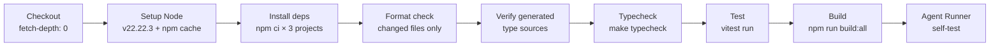
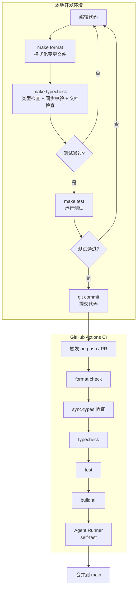

HappyClaw 是一个横跨三个独立 TypeScript 子项目（后端主服务、Web 前端、Agent Runner）的复杂工程。本文档系统化梳理从代码编写到合并的完整质量保障链路：类型检查的层叠结构、测试体系的组织范式、CI 管线的验证关卡，以及提交前的本地检查清单。

## 类型检查：三层项目 + 跨项目同步验证

项目由三个独立的 TypeScript 编译单元组成，每个拥有独立的 `tsconfig.json`，但共享严格的类型安全基线。

**三层编译单元对比**

| 子项目 | 配置文件 | 严格模式 | 额外约束 | 编译产出 |
|--------|----------|----------|----------|----------|
| 后端主服务 | `tsconfig.json` | `strict: true` | `target: ES2022`, `module: NodeNext` | `dist/` |
| Web 前端 | `web/tsconfig.json` | `strict: true` | `noUnusedLocals`, `noUnusedParameters`, `noFallthroughCasesInSwitch` | Vite 构建 |
| Agent Runner | `container/agent-runner/tsconfig.json` | `strict: true` | `target: ES2022`, `incremental: true` | `dist/` |

三者均启用 `strict: true`、`skipLibCheck: true` 和 `incremental: true`，确保基础类型安全并加速重复编译。Web 前端额外启用了 `noUnusedLocals` 和 `noUnusedParameters`，约束更严格。前端使用 `module: ESNext` + `moduleResolution: bundler`，与后端的 `NodeNext` 模式区分开。

Sources: [tsconfig.json](tsconfig.json#L1-L20), [web/tsconfig.json](web/tsconfig.json#L1-L28), [container/agent-runner/tsconfig.json](container/agent-runner/tsconfig.json#L1-L17)

**跨项目类型同步机制**：`shared/` 目录是三个子项目共享类型的唯一真相源。`make sync-types` 调用 `scripts/sync-stream-event.sh`，将 `shared/stream-event.ts`、`shared/image-detector.ts`、`shared/channel-prefixes.ts` 以内容差异检测的方式复制到各子项目的对应位置。复制仅在内容不一致时执行，避免触发不必要的增量编译。

Sources: [scripts/sync-stream-event.sh](scripts/sync-stream-event.sh#L1-L46)

**类型检查的完整执行链**通过 `make typecheck` 触发，其执行顺序为：

1. **类型同步**：`make sync-types`，确保共享类型副本一致
2. **三层并行类型检查**：`tsc --noEmit` 分别对后端、Web 前端、Agent Runner 执行
3. **StreamEvent 同步校验**：`scripts/check-stream-event-sync.sh` 验证所有共享类型副本内容完全一致，差异即报错
4. **Prompt 文件引用校验**：`scripts/check-agent-runner-prompts.sh` 扫描 Agent Runner 源码中所有 `.md` 文件引用，确保对应文件在 `container/agent-runner/prompts/` 目录中真实存在，将容器运行时的 `ENOENT` 崩溃提前到开发阶段捕获
5. **文档一致性检查**：`npm run docs:check`（`scripts/check-docs.mjs`）校验代码仓库中所有 Markdown 文件的链接有效性、内联路径存在性、Makefile 目标引用正确性以及 API 文档路由索引完整性

Sources: [Makefile](Makefile#L153-L160), [scripts/check-stream-event-sync.sh](scripts/check-stream-event-sync.sh#L1-L50), [scripts/check-agent-runner-prompts.sh](scripts/check-agent-runner-prompts.sh#L1-L158), [scripts/check-docs.mjs](scripts/check-docs.mjs#L1-L158)

## 测试体系：Vitest 驱动的三层测试策略

项目使用 **Vitest** 作为测试框架，共约 **290 个测试文件**，覆盖后端业务逻辑、前端组件渲染和集成场景。

**Vitest 配置要点**

```typescript
// vitest.config.ts
export default defineConfig({
  test: {
    exclude: ['**/node_modules/**', '**/dist/**', 'data/**', '.claude/**'],
  },
});
```

关键设计决策：`data/` 目录存放用户工作区（.gitignore 已忽略），其中可能包含嵌套项目的 `node_modules` 和独立测试套件。Vitest 不遵循 `.gitignore`，因此必须显式排除 `data/`，避免误将用户工作区中的测试文件纳入执行范围。

Sources: [vitest.config.ts](vitest.config.ts#L1-L12)

**测试文件组织模式**

测试文件位于 `tests/` 目录（后端）和 `web/tests/` 目录（前端），命名规范为 `{module-name}.test.ts` 或 `.test.tsx`。典型测试文件遵循以下模式：

**后端测试模式**——使用 `vi.mock` 隔离依赖、`vi.hoisted` 提升 mock 工厂函数、临时文件系统模拟运行时目录：

```typescript
// 创建临时目录模拟运行时文件系统
const root = fs.mkdtempSync(path.join(os.tmpdir(), 'agent-builder-'));
const storeDir = path.join(root, 'store');
// 通过 vi.mock 替换配置模块
vi.mock('../src/config.js', async (importOriginal) => ({
  ...((await importOriginal()) as Record<string, unknown>),
  STORE_DIR: storeDir,
}));
```

Sources: [tests/agent-builder.test.ts](tests/agent-builder.test.ts#L1-L50)

**前端测试模式**——使用 `renderToStaticMarkup`（ReactDOM Server）渲染组件并验证输出 DOM 结构，不依赖浏览器运行时：

```typescript
const html = renderToStaticMarkup(
  <MarkdownRenderer content={markdown} groupJid="test-group#agent:worker" />,
);
const src = html.match(/]+src="([^"]+)"/)?.[1];
```

Sources: [web/tests/MarkdownRenderer.test.tsx](web/tests/MarkdownRenderer.test.tsx#L1-L30)

**测试执行入口**

| 命令 | 用途 | 执行方式 |
|------|------|----------|
| `npm test` | 开发模式（watch） | `vitest` |
| `npm test -- --run` | CI 模式（单次执行） | `vitest run` |
| `make test` | 等同 `npm test -- --run` | `vitest run` |
| `npm run self-test:agent-runner` | Agent Runner 集成自测 | `tsx scripts/self-test-agent-runner.ts` |

Sources: [package.json](package.json#L13-L14)

## CI 管线：GitHub Actions 多阶段验证

CI 配置文件位于 `.github/workflows/ci.yml`，在 **pull_request** 和 **push 到 main 分支** 时触发，运行于 `ubuntu-24.04`，超时 20 分钟。



**每个阶段的设计意图与约束**

- **Checkout with `fetch-depth: 0`**：完整拉取历史，供 `check-format-changed.mjs` 计算 `FORMAT_BASE_REF`（默认使用 `origin/main` 的 merge-base），确保格式检查仅针对本次变更的文件。
- **Setup Node 多缓存路径**：`cache-dependency-path` 包含三个 lockfile（`package-lock.json`、`web/package-lock.json`、`container/agent-runner/package-lock.json`），确保三方依赖缓存独立。
- **Format check**：`npm run format:check` 使用 `scripts/check-format-changed.mjs`，通过 `FORMAT_BASE_REF` 环境变量获取对比基准，仅对增删改的文件执行 Prettier 检查。支持扩展名：`.ts`、`.tsx`、`.js`、`.jsx`、`.json`、`.md`、`.css`、`.html`、`.yaml`、`.yml` 等。
- **Verify generated type sources**：先执行 `make sync-types` 同步类型，然后用 `git diff --exit-code` 确保同步脚本未产生未被提交的差异，最后用 `prettier --check` 验证类型文件格式。
- **Typecheck**：完整执行 `make typecheck`，包含三层类型检查、StreamEvent 同步校验、Prompt 引用校验和文档一致性检查。
- **Test & Build**：`npm test -- --run` 运行全部测试，`npm run build:all` 并行编译三个子项目，最后执行 Agent Runner 自测确认容器运行时可用。

Sources: [.github/workflows/ci.yml](.github/workflows/ci.yml#L1-L57)

## 提交规范与本地检查清单

**代码格式化**使用 Prettier，配置仅含 `singleQuote: true`。格式化按需执行：

| 命令 | 作用 |
|------|------|
| `npm run format` | 格式化全部 `src/**/*.ts` |
| `npm run format:check` | 仅检查变更文件格式（同 CI 逻辑） |
| `make format` | 等同 `npm run format` |
| `make format-check` | 等同 `npm run format:check` |

Sources: [.prettierrc](.prettierrc#L1-L4), [package.json](package.json#L17-L18), [scripts/check-format-changed.mjs](scripts/check-format-changed.mjs#L1-L83)

**提交前本地检查清单**——建议在提交代码前依次执行以下命令，确保 CI 绿色通过：

```bash
# 1. 格式化代码
make format

# 2. 全量类型检查（含同步校验、文档检查）
make typecheck

# 3. 运行全部测试
make test

# 4. 完整编译（确认构建无错误）
npm run build:all
```

`make typecheck` 集成了五项检查，是**最关键的本地验证步骤**。如果 typecheck 通过，CI 中 format check 之后的几乎所有阶段都可以顺利通过——剩下的唯一变量是 CI 环境中的 `npm ci` 依赖一致性。

**关键设计原则**
- **类型同步必须是显式操作**：`shared/` 的变更不会自动传播到各子项目，必须执行 `make sync-types` 或 `make build`。CI 中的 `git diff --exit-code` 步骤确保同步结果已被提交，防止未同步的共享类型进入 main 分支。
- **格式检查仅针对变更文件**：`check-format-changed.mjs` 通过 `FORMAT_BASE_REF` 计算变更文件集合，避免全量格式化引入无关的 diff。
- **Prompt 引用检查是运行时安全网**：Agent Runner 在模块加载时通过 `readFileSync` 读取 prompt 文件，容器启动后若文件缺失将直接崩溃。`check-agent-runner-prompts.sh` 使用四种正则模式覆盖所有可能的引用形式，并设置"未捕获的 .md 字面量必须显式豁免"的守卫规则，防止新增引用模式被遗漏。

## 从开发到合并的完整工作流



## 核心理念

HappyClaw 的开发工作流体现了"**把运行时错误提前到编译时，把编译时错误提前到开发时**"的工程哲学。三层类型检查消除跨项目类型不一致，Prompt 引用校验消除容器运行时崩溃，文档一致性检查防止文档与代码脱节。CI 管线不是本地检查的替代品，而是安全网——确保即使本地遗漏了某个检查环节，main 分支的质量仍然可控。

---

**下一步建议**：理解了这个工作流之后，可以继续了解 [Docker 容器执行环境](16-docker-rong-qi-zhi-xing-huan-jing-gua-zai-an-quan-ge-chi-yu-jing-xiang-gou-jian) 中容器构建与镜像版本管理的自动化逻辑，或 [运行时 IPC 协议](17-yun-xing-shi-ipc-xie-yi-agent-runner-yu-zhu-jin-cheng-tong-xin-ji-zhi) 中类型定义如何在 Host 和 Container 模式之间保持一致。