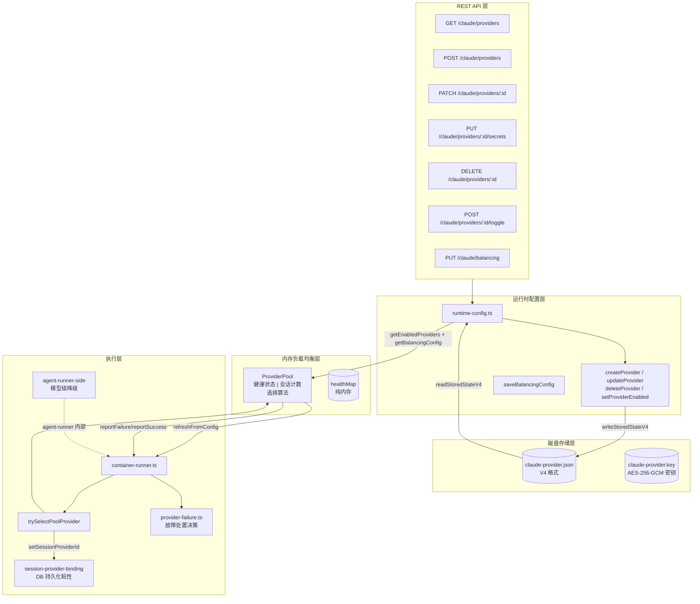
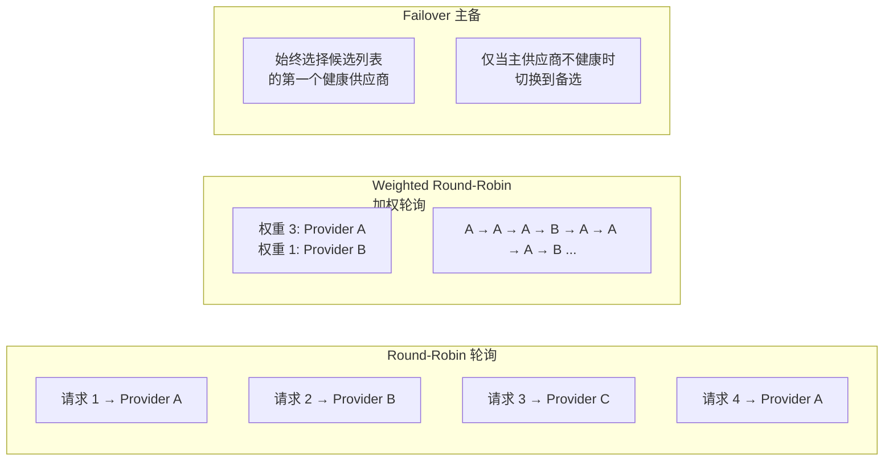

HappyClaw 的 Provider 系统是连接 Claude Code 执行引擎与底层模型 API 的核心枢纽。它不仅要管理多个 API 供应商的凭据，还承担着请求分发、健康追踪、故障转移和会话粘性等关键职责。本章将深入剖析这套系统的架构设计、配置方式和运行时行为。

## 架构概览：从 V3 到 V4 的统一供应商模型

HappyClaw 的 Provider 配置经历了多次迭代，当前使用的是 **V4 统一供应商模型**（`StoredClaudeProviderConfigV4`），它将官方 Claude 和第三方供应商统一为同一数据结构，每个供应商的 secrets 独立加密存储。V4 之前的版本（V1/V2/V3）在首次读取时会自动迁移到 V4 格式，这一过程对用户完全透明。



Sources: [runtime-config.ts](src/runtime-config.ts#L416-L436), [provider-pool.ts](src/provider-pool.ts#L1-L15)

## V4 供应商数据模型

V4 模型的核心是 `UnifiedProvider` 接口，它统一了官方和第三方两种供应商类型：

| 字段 | 类型 | 说明 |
|------|------|------|
| `id` | `string` | 唯一标识符，由 `crypto.randomBytes(8)` 生成 hex 字符串 |
| `name` | `string` | 可读名称，最长 64 字符 |
| `type` | `'official' \| 'third_party'` | 供应商类型 |
| `enabled` | `boolean` | 是否启用 |
| `weight` | `number` (1-100) | 权重，用于加权轮询策略 |
| `anthropicBaseUrl` | `string` | API 端点地址 |
| `anthropicAuthToken` | `string` | 第三方认证令牌（Bearer token） |
| `anthropicModel` | `string` | 模型名称，支持 `[1m]` 后缀表示百万上下文 |
| `anthropicApiKey` | `string` | Anthropic API Key（官方供应商使用） |
| `claudeCodeOauthToken` | `string` | Claude Code OAuth 令牌 |
| `claudeOAuthCredentials` | `object \| null` | 完整的 OAuth 凭据（含 accessToken、refreshToken、expiresAt、scopes） |
| `customEnv` | `Record<string, string>` | 自定义环境变量 |
| `updatedAt` | `string` | ISO 8601 时间戳 |

磁盘上每个供应商的 secrets 字段（`anthropicAuthToken`、`anthropicApiKey`、`claudeCodeOauthToken`、`claudeOAuthCredentials`）被封装为 `EncryptedSecrets` 结构，使用 **AES-256-GCM** 对称加密，密钥文件存储在 `data/config/claude-provider.key` 中。配置文件本身以 0o600 权限写入，防止同一主机上其他用户读取密文+密钥组合。

```typescript
interface StoredProviderV4 {
  id: string;
  name: string;
  type: 'official' | 'third_party';
  enabled: boolean;
  weight: number;
  anthropicBaseUrl: string;
  anthropicModel: string;
  secrets: EncryptedSecrets;   // 独立加密
  customEnv?: Record<string, string>;
  updatedAt: string;
}
```

V4 配置文件的根结构还包含 `balancing` 字段，用于存储负载均衡策略的全局配置：

```typescript
interface StoredClaudeProviderConfigV4 {
  version: 4;
  providers: StoredProviderV4[];
  balancing: BalancingConfig;
  updatedAt: string;
}
```

系统最多支持 **20 个供应商**（`MAX_PROVIDERS = 20`），且至少需要保留一个供应商。当删除最后一个启用的供应商时，系统会自动启用第一个剩余的供应商。

Sources: [runtime-config.ts](src/runtime-config.ts#L416-L436), [runtime-config.ts](src/runtime-config.ts#L438-L466), [runtime-config.ts](src/runtime-config.ts#L1348-L1370)

## ProviderPool：内存中的负载均衡器

`ProviderPool` 是运行时的核心组件，负责在多个启用的供应商之间分发请求。它运行在 HappyClaw 主进程的内存中，通过 `refreshFromConfig()` 方法与磁盘上的 V4 配置同步。

### 三种负载均衡策略



| 策略 | 枚举值 | 适用场景 |
|------|--------|----------|
| **轮询 (Round-Robin)** | `'round-robin'` | 各供应商性能相同，无特殊偏好 |
| **加权轮询 (Weighted Round-Robin)** | `'weighted-round-robin'` | 供应商容量/成本不同，按权重分配 |
| **主备 (Failover)** | `'failover'` | 主供应商优先，故障时自动切换 |

选择算法在 `ProviderPool.selectProvider()` 中实现。它首先过滤出 `enabled=true` 且健康状态为 `healthy` 的候选供应商，然后根据策略选择：

- **轮询**：维护 `roundRobinIndex` 计数器，依次选择候选列表中的下一个
- **加权轮询**：将计数器映射到权重累积区间，按权重比例分配请求
- **主备**：始终返回候选列表的第一个（即 `candidates[0]`）

如果所有候选供应商都不可用，系统会回退到第一个启用的供应商（或第一个成员），并记录警告日志。

Sources: [provider-pool.ts](src/provider-pool.ts#L48-L126), [provider-pool.ts](src/provider-pool.ts#L30-L43)

### 健康追踪与自动恢复

每个供应商在 `healthMap` 中维护一个 `ProviderHealthStatus` 状态：

```typescript
interface ProviderHealthStatus {
  profileId: string;
  healthy: boolean;
  consecutiveErrors: number;
  lastErrorAt: number | null;
  lastSuccessAt: number | null;
  unhealthySince: number | null;
  activeSessionCount: number;
}
```

健康状态转换遵循以下规则：

- **标记为不健康**：当 `consecutiveErrors >= unhealthyThreshold`（默认 3 次）时，`healthy` 置为 `false`，记录 `unhealthySince` 时间戳
- **即时标记**：`reportFailure(profileId, true)` 会跳过递增过程，直接使错误计数达到阈值（用于流式处理中检测到 `providerFailure` 事件时）
- **自动恢复**：`refreshRecoveryState()` 方法在每次 `selectProvider()` 调用前执行，检查不健康的供应商是否已超过 `recoveryIntervalMs`（默认 5 分钟）的恢复窗口，如果已超时则重置为健康
- **成功上报**：`reportSuccess()` 重置错误计数并将 `healthy` 置为 `true`

健康状态是纯内存的，不持久化到磁盘。这意味着 HappyClaw 进程重启后，所有供应商的初始状态都是健康的。

Sources: [provider-pool.ts](src/provider-pool.ts#L128-L170), [provider-pool.ts](src/provider-pool.ts#L67-L97)

### 会话计数与会话粘性

`ProviderPool` 维护每个供应商的 `activeSessionCount`，通过 `acquireSession()`/`releaseSession()` 在容器执行前后增减。但更重要的是，**会话粘性**（Session Stickiness）在数据库层面实现，而非 ProviderPool 自身。

`container-runner.ts` 中的 `trySelectPoolProvider()` 函数实现了完整的供应商选择逻辑，它优先考虑会话粘性：

1. **环境变量覆盖**：如果 group 的 `containerEnvConfig` 包含了 `anthropicApiKey`、`anthropicAuthToken` 或 `anthropicBaseUrl`，则跳过 ProviderPool，直接使用环境变量中的配置
2. **一次性覆盖**：`switchProvider()` 设置的 `providerOverrides` 映射，消费后立即删除
3. **粘性绑定**：如果数据库中存在 `session_provider_id` 绑定（通过 `getSessionProviderId()` 获取），且该供应商仍处于启用且健康状态，则优先重用该供应商
4. **单供应商简化**：如果只有一个启用的供应商，直接返回（此时 ProviderPool 的选择算法不生效）
5. **多供应商负载均衡**：调用 `providerPool.selectProvider()` 进行选择，并通过 `setSessionProviderId()` 更新绑定

粘性绑定的意义在于：当一个 Claude 会话产生了 thinking blocks（思维链块），这些块的签名依赖于特定的 OAuth 账号或 API Key。如果下一次请求被路由到不同的供应商，Claude SDK 会报 "Invalid signature in thinking block" 错误。粘性绑定防止了这种跨供应商的会话恢复问题。

```typescript
// 粘性路径的核心逻辑（简化）
if (enabledProviders.length > 1 && boundId) {
  if (enabledProviders.some(p => p.id === boundId)) {
    const boundHealth = providerPool.getHealthStatus(boundId);
    if (boundHealth.healthy) {
      // 重用绑定的供应商
      return resolveProviderById(boundId);
    }
  }
}
```

当供应商切换发生时（如粘性供应商不健康、被覆盖或已删除），系统会清除旧的 Claude session（`deleteSession()`），然后立即重新绑定新选择的供应商，确保下一次执行仍然保持粘性。

Sources: [container-runner.ts](src/container-runner.ts#L716-L901), [provider-switch-session.test.ts](tests/provider-switch-session.test.ts#L1-L88)

## 故障处置：从 Provider 失败到用户可见提示

当一次模型调用失败时，HappyClaw 不会立即放弃。它通过两层决策机制来判断如何响应：

### 第一层：ProviderPool 健康上报

`container-runner.ts` 在执行容器后，根据结果类型更新 ProviderPool 健康状态：

- **providerFailure 事件**：调用 `providerPool.reportFailure(profileId, true)` 即时标记为不健康
- **成功或正常关闭**：调用 `providerPool.reportSuccess(profileId)` 重置健康状态
- **API 错误**（如认证失败、超时）：调用 `providerPool.reportFailure(profileId)` 递增错误计数

### 第二层：故障处置决策

`resolveProviderFailureDisposition()` 函数判断是否还有其他健康的供应商可以重试：

```typescript
function resolveProviderFailureDisposition(
  selectedProfileId: string | null,
  health: ProviderFailureHealth[],
): ProviderFailureDisposition {
  const retryElsewhere = selectedProfileId !== null &&
    health.some(candidate => 
      candidate.profileId !== selectedProfileId && candidate.healthy
    );
  return {
    retryElsewhere,
    terminal: !retryElsewhere,
  };
}
```

- **`retryElsewhere = true`**：存在其他健康的供应商，主进程会重新调度输入到新供应商
- **`terminal = true`**：所有供应商都已耗尽，用户会看到 `⚠️ 当前模型服务额度已用尽或暂时不可用` 的提示

Sources: [provider-failure.ts](src/provider-failure.ts#L1-L37), [container-runner.ts](src/container-runner.ts#L1970-L2020)

### 模型级降级（Agent Runner 侧）

除了供应商级别的故障转移，HappyClaw 还支持模型级别的降级。这发生在 `container/agent-runner/src/provider-fallback.ts` 中，由 agent-runner 进程内部处理：

- **账户级限制**（如 session 用尽、月度配额耗尽）：触发 `provider_failure` 动作，上报给主进程
- **模型级限制**（如 Opus 额度用完、Fable 5 限制）：触发 `model_fallback` 动作，切换到备用模型

`ProviderFallbackModelState` 类维护了模型降级的状态。一旦激活了降级，后续所有请求都使用 fallback model，直到进程生命周期结束。这样避免了每次请求都尝试主模型并失败的开销。

主进程侧的 `applyFallbackModelToEnvLines()` 函数负责将降级后的模型名称注入到容器环境变量中，而 `runAgentWithModelFallback()` 函数则协调了完整的重试流程：当检测到模型级限制时，重写容器输入并重新执行，而不是简单地失败。

Sources: [container/agent-runner/src/provider-fallback.ts](src/container/agent-runner/src/provider-fallback.ts#L120-L250), [container-runner.ts](src/container-runner.ts#L947-L1000)

## Secrets 管理：安全存储 API 凭据

所有 API 凭据在磁盘上都是加密存储的。HappyClaw 使用 **AES-256-GCM** 认证加密模式，确保即使配置文件被泄露，攻击者也无法解密凭据内容。

加密流程：
1. 从 `data/config/claude-provider.key` 读取 32 字节密钥（首次自动生成）
2. 生成 12 字节随机 IV
3. 使用 `crypto.createCipheriv('aes-256-gcm', key, iv)` 加密 JSON 序列化后的 secrets
4. 获取 16 字节认证标签（auth tag），确保密文完整性
5. 将 IV、tag 和密文分别 Base64 编码后存储

```typescript
interface EncryptedSecrets {
  iv: string;    // 12 字节 IV，Base64 编码
  tag: string;   // 16 字节认证标签，Base64 编码
  data: string;  // 加密后的密文，Base64 编码
}
```

配置文件写入使用 `writeSecretFile()` 函数，通过 `fs.openSync()` 以 0o600 权限创建临时文件，然后 `rename` 并再次 `chmod`，防止 APFS 文件系统上 mode 不跟随 inode 的边界情况。

Sources: [runtime-config.ts](src/runtime-config.ts#L19-L65), [runtime-config.ts](src/runtime-config.ts#L560-L580)

## API 路由：供应商 CRUD 操作

供应商配置通过 REST API 进行管理，所有端点都需要 `authMiddleware` 和 `systemConfigMiddleware` 权限：

| 方法 | 路径 | 功能 |
|------|------|------|
| GET | `/claude/providers` | 列出所有供应商，包含健康状态和负载均衡配置 |
| POST | `/claude/providers` | 创建新供应商 |
| PATCH | `/claude/providers/:id` | 更新非密钥字段（名称、URL、模型、权重、环境变量） |
| PUT | `/claude/providers/:id/secrets` | 更新密钥字段（auth token、api key、OAuth 凭据） |
| DELETE | `/claude/providers/:id` | 删除供应商 |
| POST | `/claude/providers/:id/toggle` | 切换启用/禁用状态 |
| PUT | `/claude/balancing` | 更新负载均衡策略配置 |

创建第三方供应商时，Schema 验证要求至少提供 `anthropicBaseUrl` 或 `anthropicAuthToken` 之一：

```typescript
.superRefine((data, ctx) => {
  if (data.type === 'third_party' && 
      !data.anthropicBaseUrl?.trim() && 
      !data.anthropicAuthToken?.trim()) {
    ctx.addIssue({
      code: z.ZodIssueCode.custom,
      path: ['anthropicBaseUrl'],
      message: '第三方供应商需要提供 Base URL 或 Auth Token',
    });
  }
});
```

当更新启用的供应商时，系统会执行 `mutateClaudeConfigForAllGroups()` 流程，确保所有运行中的 workspace 能够安全地切换到新配置。如果协议字段（Base URL 或模型）发生变化，系统会清除受影响的 sticky session 绑定，防止旧会话使用新端点导致的签名错误。

Sources: [routes/config.ts](src/routes/config.ts#L830-L1268), [schemas.ts](src/schemas.ts#L1012-L1085)

## 第三方供应商配置：模型与上下文窗口

对于第三方供应商，HappyClaw 支持百万上下文（1M context）窗口。通过模型名称的 `[1m]` 后缀来标识：

```
glm-5.2[1m]   → 模型名称为 "glm-5.2"，启用百万上下文
MiniMax-M3    → 模型名称为 "MiniMax-M3"，使用默认 200K 上下文
```

前端工具函数 `buildDefaultProviderEnv()` 根据模型和上下文设置生成默认环境变量：

| 环境变量 | 200K 上下文 | 1M 上下文 |
|----------|------------|-----------|
| `ANTHROPIC_DEFAULT_OPUS_MODEL` | 模型名 | 模型名 + `[1m]` |
| `ANTHROPIC_DEFAULT_SONNET_MODEL` | 模型名 | 模型名 + `[1m]` |
| `ANTHROPIC_DEFAULT_HAIKU_MODEL` | 模型名 | 模型名 + `[1m]` |
| `CLAUDE_CODE_AUTO_COMPACT_WINDOW` | `200000` | `1000000` |
| `CLAUDE_CODE_DISABLE_NONESSENTIAL_TRAFFIC` | `1` | `1` |
| `CLAUDE_CODE_EFFORT_LEVEL` | `max` | `max` |
| `CLAUDE_CODE_NO_FLICKER` | `1` | `1` |
| `API_TIMEOUT_MS` | `3000000` | `3000000` |

这些环境变量可以通过供应商的 `customEnv` 字段进行个性化覆盖，但有一些关键限制：`ANTHROPIC_BASE_URL`、`ANTHROPIC_AUTH_TOKEN`、`ANTHROPIC_MODEL` 等核心字段由供应商配置统一管理，不允许通过 `customEnv` 单独覆盖，确保配置的一致性。Workspace 级别的环境变量覆盖也被阻止，防止一个 workspace 静默改变整个供应商的行为。

Sources: [web/src/utils/provider-model.ts](web/src/utils/provider-model.ts#L1-L60), [runtime-config.ts](src/runtime-config.ts#L280-L300)

## 配置迁移：从 V3 到 V4 的自动升级

当系统从旧版本升级时，V4 配置文件的首次读取会触发自动迁移。`readStoredStateV4()` 函数检查配置文件的 `version` 字段：

- **version === 4**：直接解析，无需迁移
- **version === 3**：读取 V3 状态，通过 `migrateV3toV4()` 转换为 V4 格式，自动写回磁盘
- **version === 2** 或更低：先归一化为 V3 格式，再迁移到 V4

迁移过程的关键逻辑：
1. 官方凭据（`anthropicApiKey`、`claudeCodeOauthToken`、`claudeOAuthCredentials`）映射为 `type: 'official'` 的供应商
2. 每个第三方 profile 映射为 `type: 'third_party'` 的供应商
3. 如果存在旧版 `provider-pool.json`（pool 模式），则迁移其 `members` 的 `enabled`/`weight` 设置以及 `strategy`/`unhealthyThreshold`/`recoveryIntervalMs` 到新的 `BalancingConfig`
4. 确保至少有一个供应商处于启用状态

迁移是**惰性**的（lazy migration）：仅在首次读取 V4 配置时执行，后续读取直接使用 V4 格式。

Sources: [runtime-config.ts](src/runtime-config.ts#L1148-L1295)

## 配置最佳实践

### 多供应商负载均衡场景

推荐配置一个官方 Claude 供应商 + 多个第三方供应商，使用 `weighted-round-robin` 策略按比例分配流量：

```
供应商 A (官方 Claude)  weight: 3  → 接收 60% 请求
供应商 B (第三方 GLM)   weight: 1  → 接收 20% 请求
供应商 C (第三方 Qwen)  weight: 1  → 接收 20% 请求
```

### 主备切换场景

对于高可用性要求，使用 `failover` 策略，同时配置多个供应商。当主供应商不可用时，自动切换到备选：

```
供应商 A (主力)  → 正常时始终使用
供应商 B (备用)  → 仅当 A 不健康时使用
供应商 C (冷备)  → 仅当 A 和 B 都不健康时使用
```

### 会话粘性注意事项

- 修改供应商的 `anthropicBaseUrl` 或 `anthropicModel` 时，系统会自动清除该供应商的会话绑定
- 单供应商模式下没有粘性成本（隐式粘性）
- 如果用户遇到 "Invalid signature in thinking block" 错误，通常是因为多个供应商之间的会话被错误地交叉恢复

### 故障恢复时间

默认的 `recoveryIntervalMs` 为 5 分钟（300,000ms），`unhealthyThreshold` 为 3 次连续错误。可以根据供应商的稳定性调整这些参数：

| 参数 | 建议值 | 场景 |
|------|--------|------|
| `unhealthyThreshold` | 1-3 | 快速失败（对不稳定供应商敏感） |
| `unhealthyThreshold` | 5-10 | 容忍瞬时错误 |
| `recoveryIntervalMs` | 60,000-300,000 | 快速恢复 vs 避免频繁切换 |

Sources: [provider-pool.ts](src/provider-pool.ts#L30-L43)

## 进阶阅读

了解 Provider 配置后，可以继续探索以下主题：

- [Agent-First 三层模型：Agent → Workspace → Runtime Session](6-agent-first-san-ceng-mo-xing-agent-workspace-runtime-session) — 了解 Provider 选择如何与 Agent Profile 和 Workspace 交互
- [Agent Runner 执行引擎：Host 模式与 Container 模式](7-agent-runner-zhi-xing-yin-qing-host-mo-shi-yu-container-mo-shi) — 深入理解 Provider 配置在容器执行中的完整生命周期
- [Web API 路由体系与 Hono 框架实践](9-web-api-lu-you-ti-xi-yu-hono-kuang-jia-shi-jian) — 查看 Provider 配置 API 的完整实现
- [用量统计与计费系统设计](21-yong-liang-tong-ji-yu-ji-fei-xi-tong-she-ji) — 了解不同供应商的用量追踪机制