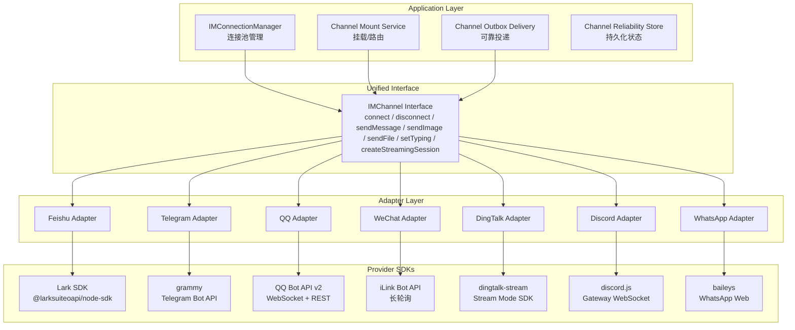
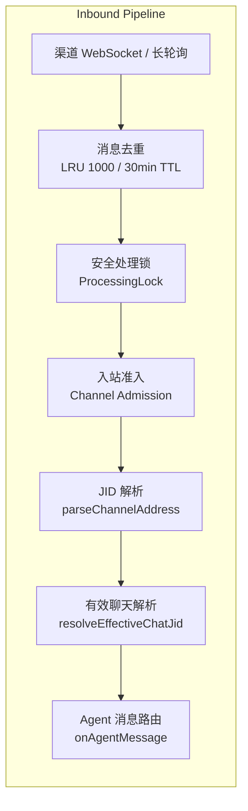

HappyClaw 支持通过统一抽象层接入七大 IM 渠道，包括飞书、Telegram、QQ、钉钉、微信、Discord 和 WhatsApp。这套架构将渠道特定的协议差异封装在适配器层，使上层业务逻辑（消息路由、Agent 执行、卡片渲染）无需关心底层是 WebSocket 还是长轮询、是 REST API 还是 SDK 原生调用。本文档面向中级开发者，深入解析渠道接入的架构设计、每个渠道的技术实现细节、配置方式以及最佳实践。

## 架构总览：统一 IM 渠道抽象层

HappyClaw 的渠道系统采用**适配器模式**，所有渠道都实现同一个 `IMChannel` 接口，由 `IMConnectionManager` 统一管理连接池。这套架构的核心设计原则是：**渠道差异在适配器层终结，上层零感知**。



**核心文件**：
- `src/im-channel.ts`：统一接口定义 + 七个渠道的适配器工厂函数（约 1346 行）
- `src/im-manager.ts`：连接池管理器，管理每个用户的渠道连接生命周期（约 2188 行）
- `src/im-channel-capabilities.ts`：渠道能力声明矩阵
- `src/channel-address.ts`：JID 地址解析系统
- `src/channel-conversation-kind.ts`：会话类型分类（私聊/群聊）
- `src/channel-admission.ts`：入站准入控制与配对逻辑
- `src/channel-reliability-store.ts`：可靠投递持久化存储层
- `src/channel-outbox-delivery.ts`：出站消息可靠投递引擎
- `src/channel-mount-service.ts`：渠道挂载服务（绑定工作区/会话）

Sources: [im-channel.ts](src/im-channel.ts#L1-L1346), [im-manager.ts](src/im-manager.ts#L1-L2188), [im-channel-capabilities.ts](src/im-channel-capabilities.ts#L1-L118)

## 统一 IMChannel 接口

`IMChannel` 接口定义在 `src/im-channel.ts` 第 170-219 行，是所有渠道适配器必须实现的核心契约。它包含以下方法：

```typescript
interface IMChannel {
  readonly channelType: string;           // 渠道标识：feishu / telegram / qq / wechat / dingtalk / discord / whatsapp
  connect(opts: IMChannelConnectOpts): Promise<boolean>;  // 建立连接
  disconnect(): Promise<void>;            // 断开连接
  logout?(): Promise<void>;               // 撤销授权（QR/会话渠道支持）
  sendMessage(chatId, text, localImagePaths?, options?): Promise<void>;  // 发送文本消息
  sendFile?(chatId, filePath, fileName): Promise<void>;  // 发送文件
  sendImage?(chatId, imageBuffer, mimeType, caption?, fileName?): Promise<void>;  // 发送图片
  setTyping(chatId, isTyping, leaseId?): Promise<void>;  // 输入状态指示
  clearAckReaction?(chatId, inputMessageId): Promise<void>;  // 清除确认反应
  isConnected(): boolean;                 // 连接状态检查
  syncGroups?(): Promise<void>;           // 同步群组列表
  createStreamingSession?(chatId, onCardCreated?, lifecycle?): Promise<StreamingSession | undefined>;  // 创建流式会话
  reconcileStreamingCard?(input): Promise<...>;  // 恢复中断的流式卡片
  getChatInfo?(chatId): Promise<...>;     // 获取聊天信息
  executeFeishuCapability?(context, request): Promise<...>;  // 飞书特有能力
}
```

每个渠道适配器都是一个工厂函数，接收渠道特定的配置对象，返回一个实现了 `IMChannel` 接口的对象。适配器内部持有渠道连接实例（`FeishuConnection`、`TelegramConnection` 等），将对 `IMChannel` 的调用转发到底层连接。

`IMChannelConnectOpts` 回调集（第 84-168 行）定义了所有渠道共享的事件回调，包括新聊天通知、消息接收、配对尝试、命令处理、群组事件、消息过滤等。每个渠道适配器根据自己的能力选择性地传递这些回调给底层连接。

Sources: [im-channel.ts](src/im-channel.ts#L170-L219), [im-channel.ts](src/im-channel.ts#L84-L168)

## 渠道地址系统（JID）

HappyClaw 使用统一的 JID（Jabber ID）格式来标识所有渠道的聊天会话。JID 格式为：

```
{provider}:{externalChatId}[#{fragment}[#{fragment}]]
```

其中 `provider` 是渠道类型（feishu/telegram/qq/wechat/dingtalk/discord/whatsapp），`externalChatId` 是渠道原生的聊天 ID，`fragment` 用于携带额外的元数据如 `account:id`、`thread:xxx`、`root:xxx`。

渠道前缀映射定义在 `shared/channel-prefixes.ts`：

| 渠道 | 前缀 | 示例 |
|------|------|------|
| 飞书 | `feishu:` | `feishu:oc_xxx#account:abc123` |
| Telegram | `telegram:` | `telegram:-1001234567890` (群聊为负数) |
| QQ | `qq:` | `qq:c2c:openid` 或 `qq:group:guild_id` |
| 微信 | `wechat:` | `wechat:wxid_xxx` |
| 钉钉 | `dingtalk:` | `dingtalk:c2c:uid` 或 `dingtalk:conversationId` |
| Discord | `discord:` | `discord:dm:userid` 或 `discord:channelid` |
| WhatsApp | `whatsapp:` | `whatsapp:number@s.whatsapp.net` 或 `whatsapp:group@g.us` |

`parseChannelAddress()` 函数（`src/channel-address.ts` 第 27-48 行）解析 JID 字符串，提取 provider、externalChatId、channelAccountId、threadId 和 rootMessageId。`scopeChannelJid()` 用于为 JID 添加或替换 account 作用域，实现多账号隔离。`toProviderJid()` 和 `extractProviderTarget()` 用于在调用渠道 SDK 前移除 HappyClaw 内部片段。

会话类型分类（`src/channel-conversation-kind.ts`）通过 `resolveChannelConversationKind()` 函数判断 JID 对应的是私聊还是群聊。不同渠道的判定规则各不相同：
- 飞书：依赖 `chat_mode` 元数据（p2p/group/topic），不靠 JID 猜测
- Telegram：通过聊天 ID 的正负号判断（正数=私聊，负数=群聊）
- QQ：通过 `c2c:` / `group:` 前缀判断
- 钉钉：通过 `c2c:` 前缀判断
- Discord：通过 `dm:` 前缀判断
- WhatsApp：通过 `@s.whatsapp.net`（私聊）或 `@g.us`（群聊）后缀判断
- 微信：当前仅支持 P2P

Sources: [channel-prefixes.ts](shared/channel-prefixes.ts#L1-L19), [channel-address.ts](src/channel-address.ts#L1-L115), [channel-conversation-kind.ts](src/channel-conversation-kind.ts#L1-L91)

## 渠道能力矩阵

不同 IM 平台的能力差异很大。`IM_CHANNEL_CAPABILITIES` 声明表（`src/im-channel-capabilities.ts` 第 13-91 行）以声明式方式记录了每个渠道支持的能力，供上层决策使用：

| 能力 | 飞书 | 钉钉 | Telegram | QQ | 微信 | Discord | WhatsApp |
|------|:----:|:----:|:--------:|:--:|:----:|:-------:|:--------:|
| 绑定工作区 | ✅ | ✅ | ✅ | ✅ | ✅ | ✅ | ✅ |
| 绑定会话 | ✅ | ✅ | ✅ | ✅ | ✅ | ✅ | ✅ |
| 线程映射 | ✅ | ❌ | ✅ | ❌ | ❌ | ❌ | ❌ |
| 激活模式 | ✅ | ✅ | ❌ | ❌ | ❌ | ✅ | ✅ |
| Owner 提及 | ✅ | ✅ | ✅ | ✅ | ❌ | ✅ | ✅ |
| 流式更新 | ✅ | ✅ | ❌ | ✅ | ❌ | ✅ | ❌ |
| 文件发送 | ✅ | ✅ | ✅ | ✅ | ❌ | ✅ | ✅ |

**关键能力说明**：
- **线程映射**：飞书和 Telegram 原生支持消息线程/主题，消息可以回复到特定子对话中
- **激活模式**：支持群聊中通过 `@提及` 或 `owner_mentioned` 模式激活 Bot 响应
- **流式更新**：支持在 Agent 生成过程中实时更新消息内容，而非等待完整输出
- **Owner 提及**：支持在群聊中仅响应群主/管理员的 @提及

Sources: [im-channel-capabilities.ts](src/im-channel-capabilities.ts#L13-L91)

## 各渠道技术实现详解

### 飞书（Feishu）

飞书是 HappyClaw 功能最完善的渠道，支持流式卡片、能力 API、消息富文本等高级特性。实现代码在 `src/feishu.ts`（约 3692 行）。

**连接方式**：使用 `@larksuiteoapi/node-sdk` SDK，通过 App ID + App Secret 获取 tenant_access_token，建立与飞书服务器的 HTTPS 连接。Webhook 接收事件通知。

**流式卡片系统**（`src/feishu-streaming-card.ts`，约 3698 行）采用三级降级链路：
- **Level 0（流式模式）**：使用飞书 `cardElement.content()` 原生打字机效果，70ms/字符的刷新率，支持 text 轨道（300ms 刷新）和辅助轨道（800ms 刷新）的双轨刷新
- **Level 1（CardKit v1）**：`card.update()` 全量 JSON 替换，刷新间隔 ≥1000ms
- **Level 2（Legacy）**：`im.message.create` + `im.message.patch` 传统消息编辑

卡片构建器（`src/feishu-cards/builder.ts`）根据 Agent 回复状态（running/done/warning/error）渲染不同颜色的头部，包含正文块、元数据行（模型、耗时、Token 用量）、思考面板和工具调用面板。卡片内容支持自动分片，约 45 元素时自动开启多卡，单个卡片 30K 字符的实时元素预算。

**能力 API**（`src/feishu-capability.ts`）：飞书 Bot 可以通过 `executeFeishuCapability()` 接口执行频道级操作，包括获取聊天信息、列出成员、获取用户信息、获取历史记录、发送卡片、添加/移除反应、编辑/撤回消息等。这些操作是 credential-free 的，直接使用 Bot 的身份认证。

**消息处理流程**：入站消息经过 `feishu-mention-gate.ts` 的 @提及门控、`feishu-conversation-policy.ts` 的会话策略、`feishu-rich-content.ts` 的富文本内容增强，再通过 `channel-admission.ts` 的准入控制进入消息路由管道。

Sources: [feishu.ts](src/feishu.ts#L1-L3692), [feishu-streaming-card.ts](src/feishu-streaming-card.ts#L1-L3698), [feishu-cards/builder.ts](src/feishu-cards/builder.ts#L1-L328), [feishu-capability.ts](src/feishu-capability.ts#L1-L768)

### Telegram

Telegram 渠道使用 `grammy` 库（Telegram Bot API 的 Node.js 封装），通过长轮询（Long Polling）接收更新。代码在 `src/telegram.ts`（约 1719 行）。

**连接方式**：Bot Token 认证，支持通过 `proxyUrl` 配置 HTTP 代理。`grammy` 的 Bot 实例启动长轮询，定期调用 `getUpdates` 获取新消息。

**配对机制**（`src/telegram-pairing.ts`）：Telegram 使用配对码机制将渠道聊天绑定到 HappyClaw 用户。`generatePairingCode()` 生成 6 字符大写字母数字配对码（5 分钟有效期，单次使用），用户在 Telegram 中发送 `/pair <code>` 命令完成绑定。配对码使用 `crypto.randomBytes` 生成，消除了模数偏差。

**消息发送**：支持文本消息（含图片内联）、文件发送、图片发送。流式更新不支持，因为 Telegram Bot API 不支持编辑消息的实时流式效果。

**话题支持**：Telegram 群组的原生话题（Topics）功能通过 `onNativeContextDetected` 回调检测，支持将消息路由到对应的话题子对话。

**Typing 指示器**：使用 `TypingLeaseExpiry` 机制管理输入状态的生命周期，多个并发输入可以共享同一聊天中的 typing 指示器。Lease 最大持有时间为 1 小时，防止崩溃导致指示器永久卡住。

Sources: [telegram.ts](src/telegram.ts#L1-L1719), [telegram-pairing.ts](src/telegram-pairing.ts#L1-L87), [im-channel.ts](src/im-channel.ts#L480-L538)

### QQ

QQ 渠道使用 QQ Bot API v2 协议，代码在 `src/qq.ts`（约 2148 行）。

**连接方式**：通过 App ID + App Secret 获取 OAuth access_token（自动刷新，5 分钟缓冲期），然后建立 WebSocket 连接接收事件。WebSocket 支持自动重连（最多 100 次尝试，之后进入 5 分钟长尾保活模式），并带有 60 秒看门狗定时器防止死连接。

**协议细节**：
- Token URL：`https://bots.qq.com/app/getAppAccessToken`
- API Base：`https://api.sgroup.qq.com`
- 消息分割：5000 字符限制，代码块感知分割

**C2C 流式消息**（`src/qq-streaming-card.ts`，约 594 行）：QQ 支持 C2C（私聊）场景下的流式消息，使用 `POST /v2/users/{openid}/stream_messages` 端点，`input_mode: "replace"` 模式，每个 chunk 完整替换消息内容。流式会话生命周期为 `idle → streaming → completed / aborted`。如果流式 API 失败，自动降级为普通消息发送。

**重连策略**：`src/qq-reconnect.ts` 实现了智能重连，包含瞬态错误检测、分类关闭码、退避延迟和快速断开阈值（连续 3 次 5 秒内断开触发更保守的策略）。

Sources: [qq.ts](src/qq.ts#L1-L2148), [qq-streaming-card.ts](src/qq-streaming-card.ts#L1-L594), [qq-reconnect.ts](src/qq-reconnect.ts)

### 钉钉（DingTalk）

钉钉渠道使用 `dingtalk-stream` SDK 的 Stream 模式，代码在 `src/dingtalk.ts`（约 2457 行）。

**连接方式**：通过 Client ID + Client Secret 建立 WebSocket 长连接，订阅 `TOPIC_ROBOT` 主题接收机器人消息。Stream 模式的优点是不需要公网 Webhook 地址。

**流式 AI 卡片**（`src/dingtalk-streaming-card.ts`，约 891 行）：钉钉 AI 卡片 API 生命周期：
1. `POST /v1.0/card/instances` → 创建卡片实例
2. `POST /v1.0/card/instances/deliver` → 投递到用户/群聊
3. `PUT /v1.0/card/instances` → 切换为 INPUTING 状态
4. `PUT /v1.0/card/streaming` → 流式内容刷新（500ms 节流）
5. `PUT /v1.0/card/streaming` → `isFinalize=true` 最后帧
6. `PUT /v1.0/card/instances` → 切换为 FINISHED 状态

钉钉支持两种流式模式：`card`（AI 卡片流式）和 `text`（纯文本模式），可通过 `streamingMode` 配置切换。

**消息处理**：支持群聊 @提及过滤、消息去重（LRU 1000 / 30 分钟 TTL）、回复消息解析（`src/dingtalk-reply-parser.ts`）、文件/图片下载。

Sources: [dingtalk.ts](src/dingtalk.ts#L1-L2457), [dingtalk-streaming-card.ts](src/dingtalk-streaming-card.ts#L1-L891)

### 微信（WeChat）

微信渠道使用 iLink Bot API 协议，代码在 `src/wechat.ts`（约 1550 行）。

**连接方式**：采用长轮询（Long Polling）机制接收消息，通过 `getUpdates` 端点拉取消息。基础 URL 为 `https://ilinkai.weixin.qq.com`，CDN 地址为 `https://novac2c.cdn.weixin.qq.com/c2c`。

**扫码登录**（`src/wechat-onboarding.ts`，约 187 行）：微信 Bot 的授权流程通过二维码完成。前端调用 API 生成二维码（`startWeChatQrOnboarding`），然后轮询扫码状态（`pollWeChatQrStatus`），状态包括：`wait`（等待扫码）、`scaned`（已扫码）、`need_verifycode`（需要验证码）、`confirmed`（确认成功）、`expired`（过期）。验证码通过 `verifyCode` 字段返回，需要用户输入二次确认。

**消息加密**：微信的图片消息经过 AES 加密，使用 `src/wechat-crypto.ts` 的解密逻辑处理。`src/wechat-http.ts` 管理 HTTP 请求调度器，支持代理配置。

**能力限制**：微信渠道当前仅支持 P2P 私聊，不支持群聊。不支持文件发送，不支持流式更新，不支持 Owner 提及。消息分割限制为 2000 字符。由于 iLink 协议的限制，微信 Bot 的可用功能相对较少。

Sources: [wechat.ts](src/wechat.ts#L1-L1550), [wechat-onboarding.ts](src/wechat-onboarding.ts#L1-L187), [wechat-crypto.ts](src/wechat-crypto.ts), [wechat-http.ts](src/wechat-http.ts)

### Discord

Discord 渠道使用 `discord.js` 库，通过 Gateway WebSocket 连接接收事件，代码在 `src/discord.ts`（约 1236 行）。

**连接方式**：Bot Token 认证，需要 `GatewayIntentBits` 权限声明（包括 `MessageContent`、`Guilds`、`GuildMessages`、`DirectMessages` 等），以及 `Partials` 处理部分通道类型。

**消息格式**：Discord 消息限制 2000 字符，长消息自动分割，支持代码块感知分割（避免在代码块中间截断）。支持附件处理（图片转 base64、文件保存到磁盘）。

**流式编辑**（`src/discord-streaming-edit.ts`，约 697 行）：通过编辑消息实现流式输出。生命周期：
1. `channel.send()` → 创建初始占位消息
2. `message.edit()` → 节流失更新（500ms）
3. 最终内容超过 2000 字符时自动分割为多条消息

流式编辑可通过 `streamingMode` 配置为 `'edit'` 或 `'off'` 控制。

**Discord 特有扩展**：`DiscordChannelExtensions` 接口提供了 `getDiscordHistory()`、`getDiscordChannelInfo()`、`getDiscordGuildInfo()` 三个 Discord 特定方法，通过 `isDiscordChannel()` 类型守卫进行安全访问。

**Typing 指示器**：Discord 的 typing 指示器持续 10 秒，需要每 9 秒重复发送以保持显示。

Sources: [discord.ts](src/discord.ts#L1-L1236), [discord-streaming-edit.ts](src/discord-streaming-edit.ts#L1-L697), [im-channel.ts](src/im-channel.ts#L1020-L1198)

### WhatsApp

WhatsApp 渠道使用 `baileys` 库（逆向 WhatsApp Web 协议的开源实现），代码在 `src/whatsapp.ts`（约 1388 页）。

**连接方式**：使用 `makeWASocket` 建立 WebSocket 长连接到 Meta 服务器，通过 `useMultiFileAuthState` 持久化登录态（多文件 auth state，存储在 `authDir` 目录下）。

**QR 登录**：WhatsApp 的授权通过二维码完成。`qrcode` 库将 QR 串渲染为 PNG data URL，前端可直接通过 `` 展示。连接状态包括：`connecting` → `qr` → `connected` → `disconnected` / `logged_out`。

**自动重连**：被 Meta 主动断开（非 `logged_out` 状态）时，延迟 3 秒自动重连。`onConnectionUpdate` 回调将状态变化推送到上层。

**消息格式**：文本消息限制 4096 字符，内联图片（base64）仅限 5MB 以内用于 Vision API。支持文件发送。

**风险提示**：Baileys 是逆向 WhatsApp Web 协议的社区方案，封号率随 Meta 风控收紧而上升。商用场景应使用官方 Cloud API。

Sources: [whatsapp.ts](src/whatsapp.ts#L1-L1388), [im-channel.ts](src/im-channel.ts#L1200-L1345)

## 消息路由与可靠投递

### 入站路由

入站消息经过一系列处理阶段后进入 Agent 处理管道：



处理流程的关键组件：
- **消息去重**：每个渠道都有独立的 LRU 去重缓存（`createDedupCache`），基于消息 ID 去重，1000 条容量，30 分钟 TTL
- **安全处理锁**（`src/im-safety/processing-lock.ts` 和 `stale-detector.ts`）：防止并发处理和过期消息处理
- **入站准入**（`src/channel-admission.ts`）：检查聊天是否已授权、是否处于配对流程、`/pair` 命令处理
- **有效聊天解析**：通过 `resolveEffectiveChatJid` 回调将 IM chatJid 解析为绑定目标 JID（工作区主对话或 conversation agent）
- **群组消息过滤**：通过 `shouldProcessGroupMessage` 回调决定是否处理未被 @提及的群消息

Sources: [channel-admission.ts](src/channel-admission.ts#L1-L132), [im-safety/index.ts](src/im-safety/index.ts)

### 出站可靠投递

`ChannelReliabilityStore`（`src/channel-reliability-store.ts`，约 2492 行）提供了消息出站的持久化保证。出站消息经过以下状态机：

```
pending → claimed → uploading → uploaded → sending → delivered
                                               ↓
                                           uncertain → (重试)
                                               ↓
                                             failed
```

**核心概念**：
- **ChannelOutboxItem**：出站消息的持久化记录，包含 provider、accountId、sourceJid、kind（text/image/file/card/mutation）、payload、idempotencyKey 等
- **ChannelDeliveryReceipt**：投递确认，包含 providerMessageId 和可选的 providerUploadKey
- **ChannelPhysicalDelivery**：物理投递接口，支持 `single`（单阶段投递）和 `upload_then_send`（先上传后发送）两种模式
- **ChannelDeliveryProcessCrash**：故障注入信号，用于测试崩溃恢复
- **DefinitiveChannelDeliveryError**：提供者明确拒绝的错误，可以设置 `retryAt` 调度重试

**恢复机制**（`src/channel-reliability-recovery.ts`，约 252 行）：启动时和定期执行恢复遍历，检查所有非终态的流式卡片记录。对于飞书卡片，通过 `reconcileInterruptedStreamingCard` 重新连接中断的卡片流。

**出站投递协调**（`src/channel-outbox-delivery.ts`，约 413 行）：`DeliverChannelOutboxInput` 封装了一次投递的所有上下文，包括路由快照、turnRunId、顺序号、载荷、幂等键、租约等。`deliverChannelOutbox` 函数负责执行投递并管理状态转换。

Sources: [channel-reliability-store.ts](src/channel-reliability-store.ts#L1-L2492), [channel-outbox-delivery.ts](src/channel-outbox-delivery.ts#L1-L413), [channel-reliability-recovery.ts](src/channel-reliability-recovery.ts#L1-L252)

## 连接池管理

`IMConnectionManager`（`src/im-manager.ts`）管理所有用户的渠道连接实例。每个用户可以有多个渠道连接（如同时连接飞书和 Telegram），每个渠道连接对应一个 `IMChannel` 实例。

**关键特性**：
- `UserIMConnection` 结构：`{ userId, channels: Map<string, IMChannel> }`，每个用户一个连接管理器
- 连接的创建、启动、断开、重载通过 `connectFeishu()`、`connectTelegram()`、`connectQQ()`、`connectWeChat()`、`connectDingTalk()`、`connectDiscord()`、`connectWhatsApp()` 方法管理
- `reloadChannelAccount()` 支持热重载账号配置，先断开再重新连接
- 每个渠道的配置通过 `runtime-config.ts` 持久化，通过 `saveUserFeishuConfig()`、`getUserFeishuConfig()` 等函数存取

**连接配置类型**：
- 飞书：`{ appId, appSecret, enabled? }` — 通过 `FeishuConnectConfig`
- Telegram：`{ botToken, proxyUrl?, enabled? }` — 通过 `TelegramConnectConfig`
- QQ：`{ appId, appSecret, enabled? }` — 通过 `QQConnectConfig`
- 微信：`{ botToken, ilinkBotId, baseUrl?, cdnBaseUrl?, getUpdatesBuf?, bypassProxy?, enabled? }` — 通过 `WeChatConnectConfig`
- 钉钉：`{ clientId, clientSecret, enabled?, streamingMode? }` — 通过 `DingTalkConnectConfig`
- Discord：`{ botToken, enabled?, streamingMode? }` — 通过 `DiscordConnectConfig`
- WhatsApp：`{ accountId?, phoneNumber?, authDir?, enabled? }` — 通过 `WhatsAppConnectConfig`

**凭证验证**（`src/channel-account-connectivity.ts`，约 198 行）：`testChannelAccountCredentials()` 函数支持验证各渠道的凭证有效性：
- 飞书：调用 Lark SDK 验证 appId + appSecret
- Telegram：`GET /bot{token}/getMe` 验证 botToken
- QQ：`POST /app/getAppAccessToken` 验证 appId + appSecret
- 微信：调用 iLink API 验证（需特殊处理超时）

Sources: [im-manager.ts](src/im-manager.ts#L1-L2188), [channel-account-connectivity.ts](src/channel-account-connectivity.ts#L1-L198)

## 渠道挂载服务

`ChannelMountService`（`src/channel-mount-service.ts`，约 653 行）管理渠道聊天与工作区/会话的绑定关系。核心功能包括：

- **挂载解析**：根据渠道类型、聊天 JID、当前绑定状态，解析出目标工作区和路由模式
- **默认挂载恢复**：`restoreDefaultChannelMount()` 在账号创建或聊天注册时自动建立默认绑定
- **原生上下文升级**：`upgradeNativeContextMount()` 检测并升级飞书话题/线程等原生上下文
- **线程映射**：`resolveThreadMapMount()` 在飞书和 Telegram 的话题场景中建立线程到工作区的映射

**路由模式**：支持 `main`（主对话）、`agent`（Agent 会话）和 `mirror`（镜像模式，回复同时发送到源和目标）。

Sources: [channel-mount-service.ts](src/channel-mount-service.ts#L1-L653)

## 配置与快速开始

### 飞书配置

1. 在[飞书开放平台](https://open.feishu.cn)创建企业自建应用
2. 获取 App ID 和 App Secret
3. 配置权限：`im:message`、`im:resource`、`drive:drive` 等
4. 在 HappyClaw 管理后台添加飞书渠道账号，填入 App ID 和 App Secret

### Telegram 配置

1. 在 [@BotFather](https://t.me/BotFather) 创建机器人，获取 Bot Token
2. 在 HappyClaw 管理后台添加 Telegram 渠道账号，填入 Bot Token
3. （可选）配置 `proxyUrl` 用于代理环境
4. 用户在 Telegram 中向 Bot 发送 `/pair <code>` 完成配对

### QQ 配置

1. 在 [QQ 开放平台](https://q.qq.com) 创建机器人
2. 获取 App ID 和 App Secret
3. 配置 WebSocket 事件回调地址
4. 在 HappyClaw 管理后台添加 QQ 渠道账号

### 钉钉配置

1. 在[钉钉开放平台](https://open.dingtalk.com)创建机器人
2. 选择 Stream 模式接入，获取 Client ID 和 Client Secret
3. 配置消息接收模式为 Stream
4. 在 HappyClaw 管理后台添加钉钉渠道账号

### 微信配置

1. 通过微信 iLink 平台注册 Bot
2. 获取 Bot Token 和 iLink Bot ID
3. 在 HappyClaw 管理后台扫描二维码完成授权
4. 注意：微信 Bot 目前仅支持 P2P 私聊

### Discord 配置

1. 在 [Discord Developer Portal](https://discord.com/developers/applications) 创建应用
2. 创建 Bot，获取 Bot Token
3. 配置 Bot 权限（`MessageContent Intent`、`Send Messages` 等）
4. 邀请 Bot 到服务器
5. 在 HappyClaw 管理后台添加 Discord 渠道账号
6. 可选配置 `streamingMode: 'edit'` 启用流式编辑

### WhatsApp 配置

1. HappyClaw 使用 Baileys 库（WhatsApp Web 协议）
2. 在管理后台添加 WhatsApp 渠道账号
3. 使用二维码扫码登录（状态流转：connecting → qr → connected）
4. **注意**：商用场景建议使用官方 WhatsApp Cloud API

## 阅读路径建议

完成本文档后，建议按以下顺序深入阅读：

1. **[Agent-First 三层模型：Agent → Workspace → Runtime Session](6-agent-first-san-ceng-mo-xing-agent-workspace-runtime-session)** — 理解渠道消息如何路由到 Agent 执行
2. **[多渠道 IM 系统架构与消息路由](8-duo-qu-dao-im-xi-tong-jia-gou-yu-xiao-xi-lu-you)** — 深入理解消息路由的完整链路
3. **[StreamEvent 实时事件流系统](18-streamevent-shi-shi-shi-jian-liu-xi-tong-cong-qian-duan-dao-runner-duan-dao-duan-tong-bu)** — 了解流式卡片的前端同步机制
4. **[认证与会话管理：Cookie Session、Permission Middleware 与 ACL 权限矩阵](10-ren-zheng-yu-hui-hua-guan-li-cookie-session-permission-middleware-yu-acl-quan-xian-ju-zhen)** — 理解渠道账号的安全鉴权