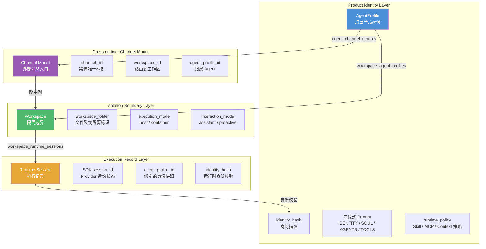
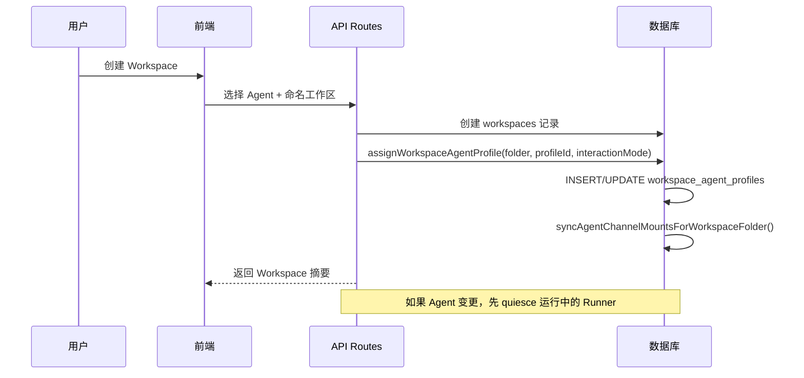
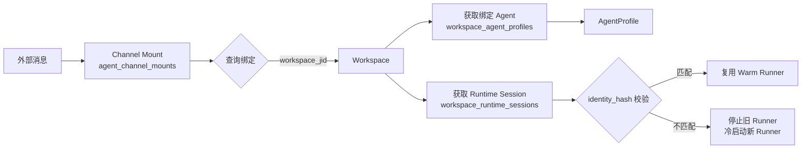
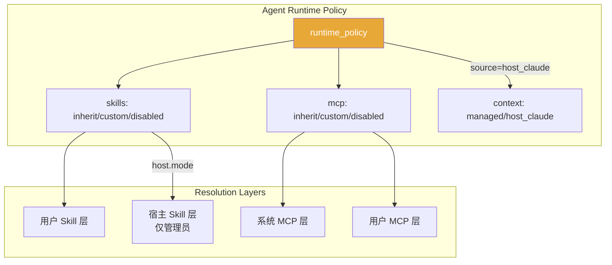

HappyClaw 的架构核心围绕一个明确的层级原则：**Agent 是顶层产品身份，Workspace 是隔离边界，Runtime Session 是执行记录**。这三层各自承担不同职责，通过持久化绑定关系形成完整的执行链路。本文档从数据模型、生命周期和运行时一致性三个维度展开说明。

## 架构全景



上图展示的三层关系是产品模型的核心：Agent 拥有 Workspace，Workspace 包含 Runtime Session，Channel Mount 作为跨层入口将外部消息路由到正确的 Workspace。Sources: [docs/agent-first-architecture-plan.md](docs/agent-first-architecture-plan.md#L1-L40)

## Layer 1: Agent — 顶层产品身份

Agent 是 HappyClaw 中最顶层的产品概念，代表一个**可被用户创建、编辑和切换的运行时身份**。它不是对话记录，也不是任务单元——它是策略和身份的拥有者。

### 核心数据模型

Agent 在数据库中对应 `agent_profiles` 表，其核心字段包括：

| 字段类别 | 字段 | 说明 |
|---------|------|------|
| 身份标识 | `id`, `owner_user_id`, `name` | 唯一标识、所属用户、显示名称 |
| 四段式 Prompt | `identity_prompt`, `soul_prompt`, `agents_prompt`, `tools_prompt` | 分别对应 IDENTITY（我是谁）、SOUL（价值观与风格）、AGENTS（工作规则与流程）、TOOLS（工具使用策略） |
| 提示词模式 | `prompt_mode` | `append`（追加在 Claude Code 原生提示词后）或 `replace`（替换原生提示词，但平台运行时指令不可移除） |
| 运行时策略 | `runtime_policy` | 包含 context（上下文来源：managed/host_claude）、skills（技能选择策略）、mcp（MCP 服务器选择策略） |
| 身份指纹 | `identity_hash` | 基于 prompt 内容 + runtime_policy + name 计算出的 SHA-256 哈希，用于运行时身份一致性校验 |
| 版本控制 | `version` | 每次更新递增，配合 `agent_profile_prompt_versions` 表实现历史版本回溯 |

Agent 的 `runtime_policy` 是一个三权分立的策略对象：
- **context.source**：决定上下文来源是系统托管（`managed`）还是宿主机的 Claude Code 配置（`host_claude`），后者仅限管理员使用
- **skills**：选择用户 Skill 的继承/自定义/禁用策略，以及宿主 Skill 的独立策略
- **mcp**：选择 MCP Server 的继承/自定义/禁用策略

所有非管理员用户在运行时会被强制降级：`host_claude` 上下文源降级为 `managed`，宿主 Skills 强制禁用，以确保多租户安全。Sources: [src/types.ts](src/types.ts#L261-L340), [src/agent-profile-runtime.ts](src/agent-profile-runtime.ts#L14-L62)

### 四段式 Prompt 工程

Agent 的提示词采用四段式结构，每个段落在最终合成提示词中按固定顺序排列：

```text
## IDENTITY
[简洁定义"我是谁"——角色、使命和能力边界]

## SOUL
[稳定的价值观、气质、判断原则和沟通风格]

## AGENTS
[具体工作方式、流程、协作规则、输出偏好和行为边界]

## TOOLS
[如何选择和使用工具、何时需要确认，以及工具使用限制]
```

当 `prompt_mode = 'append'` 时，最终系统提示词为：
```
Claude Code 原生预设 + Agent 四段式 Prompt + 工作区/上下文提示词 + 消息历史
```

当 `prompt_mode = 'replace'` 时，Claude Code 原生预设被替换，但平台运行时指令（如 IM 渠道消息格式、内存管理指令）始终存在且不可移除。Sources: [src/agent-profile-prompts.ts](src/agent-profile-prompts.ts#L1-L92), [docs/agent-first-architecture-plan.md](docs/agent-first-architecture-plan.md#L140-L161)

## Layer 2: Workspace — 隔离边界

Workspace 是从 Agent 派生的**运行时隔离边界**，负责文件系统隔离、执行模式选择和会话管理。每个用户可以有多个 Workspace，但每个 Workspace 必须绑定一个 Agent。

### 核心数据模型

Workspace 在数据库中对应 `workspaces` 表，并通过 `workspace_agent_profiles` 表与 Agent 建立绑定关系：

| 表 | 关键字段 | 职责 |
|---|---------|------|
| `workspaces` | `jid`, `folder`, `owner_user_id`, `name`, `status`, `is_home` | 工作区基础记录 |
| `workspace_agent_profiles` | `group_folder`, `agent_profile_id`, `interaction_mode` | Agent ↔ Workspace 绑定，以及交互模式 |

`workspace_agent_profiles` 是连接 Layer 1 和 Layer 2 的关键桥梁。它记录了：
- **哪个 Workspace 绑定到哪个 Agent**
- **交互模式**（`interaction_mode`）：`assistant`（标准 AI 助手模式，回复可见）或 `proactive`（主动模式，仅生命周期边界对外可见）

Workspace 的 `folder` 字段是一个经过严格校验的持久化标识符，正则约束为 `/^[A-Za-z0-9][A-Za-z0-9._-]{0,127}$/`，确保其在文件系统路径中安全可用。Sources: [src/workspace-folder.ts](src/workspace-folder.ts#L1-L22), [src/db.ts](src/db.ts#L684-L718)

### 工作区绑定生命周期

当用户通过前端创建新 Workspace 时，必须选择一个已加载的 Agent。以下是绑定流程：



如果 Agent 被删除，必须先将其下所有 Workspace 迁移到其他 Agent。默认 Agent 不可删除，确保总有兜底绑定。Sources: [src/db.ts](src/db.ts#L7786-L7862), [src/routes/workspaces.ts](src/routes/workspaces.ts#L1-L100)

## Layer 3: Runtime Session — 执行记录

Runtime Session 是 Workspace 内部的具体执行记录，代表**一次 SDK/provider 会话的续约状态**。它不是用户可见的产品会话（product Session），而是底层运行时元数据。

### 核心数据模型

Runtime Session 存储在 `workspace_runtime_sessions` 表中：

| 字段 | 说明 |
|------|------|
| `group_folder` | 所属工作区文件夹 |
| `runtime_agent_id` | 运行时 Agent 标识（主会话为 `''`，子 Agent 为具体 ID） |
| `workspace_jid` | 所属工作区 JID |
| `sdk_session_id` | Claude Code SDK 的会话 ID，用于续约 |
| `provider_id` | 当前使用的 Provider |
| `agent_profile_id` | 绑定时 AgentProfile 的 ID（快照引用） |
| `agent_profile_version` | 绑定时 AgentProfile 的版本号 |
| `identity_hash` | 绑定时 AgentProfile 的 identity_hash |

每个 Workspace 默认有一个主 Runtime Session（`runtime_agent_id = ''`）。额外的 Runtime Session 可能存在于：
- **spawned sub-agents**：并行执行的子 Agent
- **scheduled tasks**：定时任务
- **channel-specific conversations**：特定渠道的独立会话

Runtime Session 的 `identity_hash` 字段是实现**运行时身份一致性校验**的关键：每次执行时，Runner 会比对当前 AgentProfile 的 identity_hash 与 Session 中记录的 identity_hash，如果不一致则触发冷启动，避免陈旧的运行时状态处理身份已变更的消息。Sources: [src/db.ts](src/db.ts#L699-L718), [src/run-context-snapshot.ts](src/run-context-snapshot.ts#L1-L80)

### 三层关系的数据流

```
AgentProfile (id, identity_hash, version)
    │
    │ workspace_agent_profiles (group_folder → agent_profile_id)
    ▼
Workspace (jid, folder, execution_mode)
    │
    │ workspace_runtime_sessions (workspace_jid → session)
    ▼
Runtime Session (group_folder, runtime_agent_id, sdk_session_id, identity_hash)
```

当一条消息进入系统时，路由链路如下：



Sources: [docs/agent-first-architecture-plan.md](docs/agent-first-architecture-plan.md#L40-L80)

## 身份一致性：运行时安全的核心保障

Agent-First 模型中最关键的运行时保障是**身份一致性**。当 Agent 的 prompt、runtime_policy 或名称发生变更时，所有正在运行的 Workspace 必须立即感知。

### identity_hash 计算

`computeAgentProfileIdentityHash` 函数基于以下输入生成 SHA-256 哈希：
- 四段式 Prompt 内容（IDENTITY + SOUL + AGENTS + TOOLS）
- prompt_mode（append/replace）
- runtime_policy（context + skills + mcp 策略）
- Agent 名称

任何上述字段的变更都会导致 identity_hash 变化，从而触发运行时重载。Sources: [src/db.ts](src/db.ts#L7055-L7100)

### 运行时静默（Runtime Quiesce）

当 Agent 配置变更时，系统通过 `quiesceWorkspaceRunnersAroundCommit` 机制确保安全切换：

```typescript
// 简化流程
1. 收集所有受影响的 Runtime JID
2. 暂停这些 JID 的消息队列（新消息被排队）
3. 强制停止正在运行的 Runner（保留排队中的工作）
4. 执行数据库提交（更新 AgentProfile）
5. 再次收集可能的 Runtime JID（包括新发现的）
6. 再次停止新发现的 Runner
7. 恢复消息队列（消息被路由到新冷启动的 Runner）
```

这种 pre-commit + post-commit 的双重停止策略确保了**无竞态条件**——即使在提交过程中有新的 Runner 启动，也会在 post-commit 阶段被捕获并停止。Sources: [src/agent-profile-runtime.ts](src/agent-profile-runtime.ts#L237-L344)

### 锁机制

AgentProfile 的变更通过 `withAgentProfileLocks` 实现序列化。多个锁始终按字典序获取，避免死锁。引用计数确保锁在无持有者时自动清理。Sources: [src/agent-profile-runtime.ts](src/agent-profile-runtime.ts#L106-L158)

## 提示词合成：跨层协作

最终的运行时提示词由多个层级共同合成，每个层级有其固定的位置和职责：

| 层级 | 内容 | 来源 | 可移除 |
|------|------|------|--------|
| 平台运行时指令 | IM 渠道格式、内存管理、安全策略 | 系统硬编码 | 否 |
| Claude Code 原生预设 | Claude Code 默认行为指南 | SDK 内置 | 条件性（prompt_mode=replace） |
| Agent 四段式 Prompt | IDENTITY + SOUL + AGENTS + TOOLS | `agent_profiles` 表 | 否（可清空但不可跳过） |
| Workspace 上下文 | 当前工作区文件结构、项目说明 | 动态生成 | 否 |
| 渠道上下文 | 当前消息的渠道来源、发送者信息 | `ChannelTurnContext` | 否 |
| 消息历史 | 当前会话的对话记录 | `messages` 表 | 否 |

当 `prompt_mode = 'replace'` 时，Claude Code 原生预设被替换为 Agent 的 Prompt，但**平台运行时指令始终保留**，确保渠道兼容性和系统安全。Sources: [src/agent-profile-prompts.ts](src/agent-profile-prompts.ts#L55-L92), [docs/agent-first-architecture-plan.md](docs/agent-first-architecture-plan.md#L140-L160)

## 能力治理：跨层策略解析

Agent 的 `runtime_policy` 控制着三层模型中的能力可见性：



`effective-skill-resolver.ts` 和 `effective-mcp-manifest.ts` 负责将 Agent 的策略与用户实际的 Skill/MCP 目录进行合并，生成运行时可见的能力清单。名称冲突在执行前会被检测并报告。Sources: [src/agent-capability-preview.ts](src/agent-capability-preview.ts#L1-L80), [src/agent-profile-policy.ts](src/agent-profile-policy.ts#L1-L80)

## 交互模式：Assistant 与 Proactive

Workspace 的 `interaction_mode` 定义了用户与 Agent 之间的交互契约：

| 模式 | 说明 | 适用场景 | 响应可见性 |
|------|------|---------|-----------|
| `assistant` | 标准问答模式，每次用户输入触发一次完整回复 | 通用对话、代码审查、问题解答 | SDK 最终输出可见 |
| `proactive` | 主动推送模式，Agent 可主动发送消息 | 监控告警、定时报告、事件通知 | 仅生命周期边界可见（requesting/idle/interrupted） |

Proactive 模式下的消息输出使用 `native` 呈现方式，绕过 SDK 的最终答案协调器，直接通过渠道的原生消息接口发送。这种设计的目的是确保主动消息的持久性不受 SDK 会话状态影响。Sources: [src/workspace-interaction-runtime.ts](src/workspace-interaction-runtime.ts#L1-L158)

## 与旧模型的兼容性

在迁移到 Agent-First 模型之前，系统使用 `registered_groups` 作为顶层容器，`agents` 表作为对话/任务模型。迁移过程中，以下兼容性映射保持同步：

| 旧概念 | 新概念 | 同步机制 |
|--------|--------|---------|
| `registered_groups` | `workspaces` | 启动时自动同步 |
| `agents`（对话/任务） | `agent_profiles`（顶层身份）+ `agents`（子 Agent） | 两表共存，职责分离 |
| 旧 `identity_prompt` + `include_claude_preset` | 四段式 Prompt + `prompt_mode` | `agentProfilePromptsFromLegacy()` 迁移函数 |

`agent_channel_mounts` 表是渠道绑定的新规范，与旧的 `registered_groups` 中的 `target_agent_id`、`target_main_jid` 字段保持双向同步，直到所有读取方完成迁移。Sources: [docs/agent-first-architecture-plan.md](docs/agent-first-architecture-plan.md#L80-L140)

## 总结

Agent-First 三层模型的核心原则可以概括为：

1. **Agent 是产品身份的边界**——它拥有 Prompt、策略和渠道绑定，是用户所能感知和操作的顶层实体
2. **Workspace 是运行时的边界**——它提供文件系统隔离、执行模式选择和会话管理，是 Agent 能力的实际承载者
3. **Runtime Session 是执行记录的边界**——它保存 SDK/provider 续约状态，并通过 identity_hash 确保运行时身份一致性
4. **Channel Mount 是跨层入口**——它将外部消息路由到正确的 Agent → Workspace → Session 链路

这三层模型的分离设计使得 HappyClaw 能够支持多 Agent、多 Workspace、多渠道的复杂场景，同时保持运行时身份一致性这一关键安全边界。理解这三层的关系是掌握 HappyClaw 架构的起点。

### 继续阅读

- [Agent Runner 执行引擎：Host 模式与 Container 模式](7-agent-runner-zhi-xing-yin-qing-host-mo-shi-yu-container-mo-shi) — 深入了解 Agent 如何在 Workspace 中执行
- [Agent Profile 设计与四段式 Prompt 工程](13-agent-profile-she-ji-yu-si-duan-shi-prompt-gong-cheng) — 学习如何设计和优化 Agent 的提示词
- [多渠道 IM 系统架构与消息路由](8-duo-qu-dao-im-xi-tong-jia-gou-yu-xiao-xi-lu-you) — 了解消息如何从 Channel Mount 路由到 Workspace Session