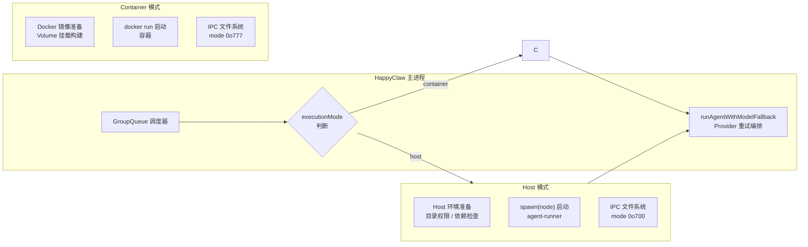
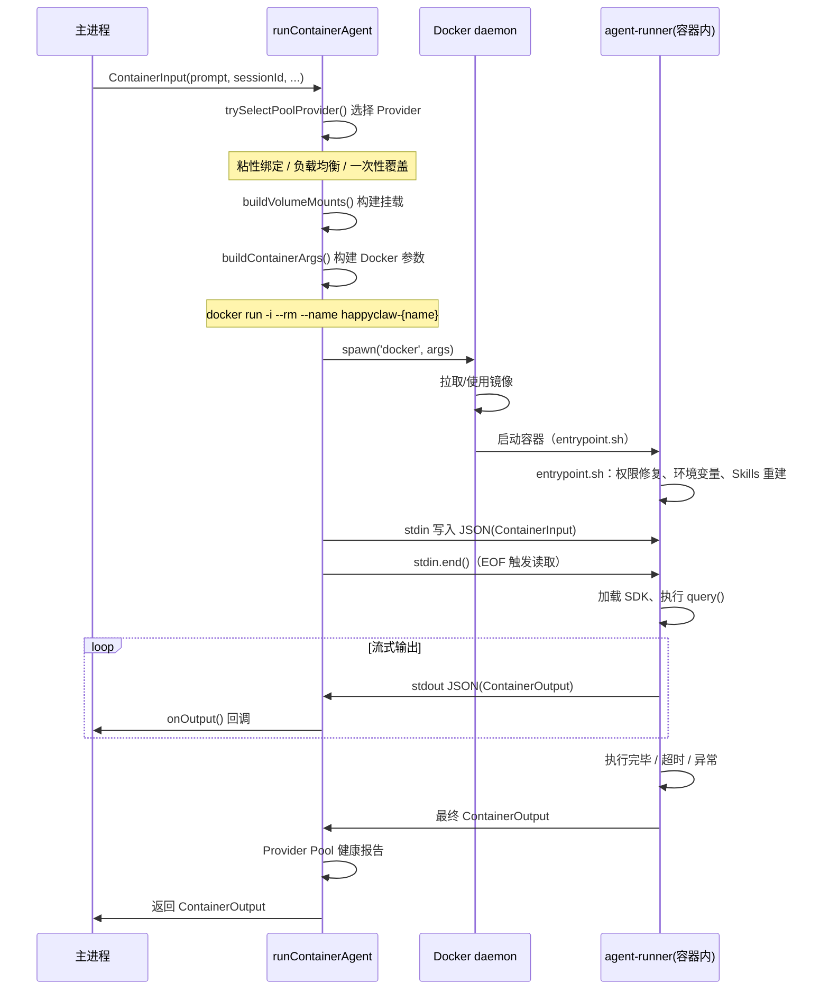
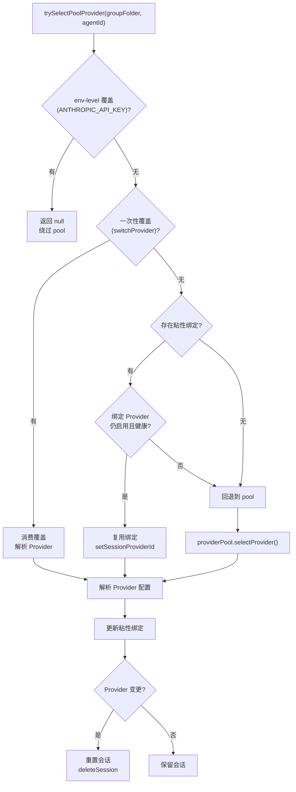

HappyClaw 的 Agent Runner 执行引擎是承载 Claude Code SDK 运行的执行层，负责将用户输入转化为 Agent 推理过程并输出结果。整个引擎围绕两种执行模式设计——**Container 模式**（Docker 容器隔离执行）和 **Host 模式**（宿主机直接执行）——通过统一的 `ContainerInput`/`ContainerOutput` 协议和 `runAgentWithModelFallback` 编排层，实现两种模式在语义上的完全等价。

## 双模式架构总览

执行引擎的核心决策点在 `index.ts` 中，由 `group.executionMode` 字段控制。新建工作区时，系统自动检测 `docker info` 可用性来决定默认模式；管理员可在 Web 面板中手动切换。两种模式共享同一套输入输出协议、Provider 选择逻辑、IPC 通信机制和超时管理，区别仅在于进程创建方式和文件系统隔离策略。



Sources: [index.ts](src/index.ts#L8666-L8734), [types.ts](src/types.ts#L37-L149)

## 执行模式选择策略

`executionMode` 的决策链路贯穿工作区生命周期。新建工作区时，`isDockerAvailable()` 执行 `docker info --timeout 10s` 检测 Docker 守护进程是否可达，可达则默认 `container`，否则降级为 `host`。管理员用户可在 Web 面板 `/groups/:id` 接口中通过 `execution_mode` 字段手动切换模式，但受以下约束：

- **Host 模式权限门禁**：只有 `role === 'admin'` 且 `status === 'active'` 的用户才能切换到 Host 模式。权限在每次执行时实时检查，而非创建时授权——`canExecuteOnHost()` 每次从数据库读取当前用户记录，确保角色变更立即生效。`beginHostPrivilegeRevocation`/`endHostPrivilegeRevocation` 进一步提供运行时撤销机制，在管理员删除操作期间封锁 Host 执行权限。
- **Container 模式专属功能**：`initSourcePath`（初始化时复制目录）和 `initGitUrl`（初始化时 Clone Git 仓库）仅在 Container 模式下可用，Host 模式的工作目录由 `customCwd` 指定。
- **additionalMounts 限制**：额外的宿主机目录挂载仅 Container 模式支持，且受 `mount-allowlist.json` 白名单约束。

Sources: [config.ts](src/config.ts#L94-L103), [host-execution-policy.ts](src/host-execution-policy.ts#L18-L29), [routes/groups.ts](src/routes/groups.ts#L597-L609)

## Container 模式：Docker 隔离执行

Container 模式是 HappyClaw 的默认执行方式，也是功能最完整的模式。`runContainerAgent()` 函数负责全部执行流程，从 Volume 挂载构建到 Docker 容器生命周期管理。

### Volume 挂载体系

`buildVolumeMounts()` 构建完整的挂载映射，是容器模式最复杂的部分，涉及 10 余类挂载路径：

| 挂载路径（宿主机） | 容器内路径 | 权限 | 用途 |
|---|---|---|---|
| `data/groups/{folder}/` | `/workspace/group` | 读写 | 工作区目录（非 Admin Home 无 project 挂载） |
| `data/groups/user-global/{ownerId}/` | `/workspace/global` | 只读/读写 | 用户全局记忆目录 |
| `data/memory/{folder}/` | `/workspace/memory` | 只读/读写 | 工作区记忆目录 |
| `data/sessions/{folder}/.claude/` | `/home/node/.claude` | 读写 | Claude 会话目录（settings.json、会话历史） |
| `data/ipc/{folder}/` | `/workspace/ipc` | 读写（mode 0o777） | IPC 通信目录 |
| `data/extra/{folder}/` | `/workspace/extra` | 读写 | 持久化工作区额外目录 |
| `data/config/container-claude-json.json` | `/home/node/.claude.json` | 只读 | 精简版 Claude 身份配置 |
| `data/config/user-cli/{ownerId}/feishu-cli/` | `/home/node/.feishu-cli` | 读写 | 飞书 CLI 持久化状态 |
| `data/{runtime}/{ownerId}/` | `/workspace/plugins` | 只读 | Claude Code 插件运行时 |
| `container/agent-runner/src/` | `/app/src` | 只读 | agent-runner 源码热挂载 |
| 用户 Skills 目录 | `/workspace/effective-skills/{skillId}/` | 只读 | 每个 Skill 独立只读挂载 |
| 额外配置的 additionalMounts | `/workspace/extra/{name}` | 按配置 | 用户自定义挂载 |

挂载构建的关键细节：

1. **`.claude.json` 精简处理**：宿主机 `~/.claude.json` 中的 `cachedGrowthBookFeatures` 包含 `tengu_bridge_repl_v2` 等 feature flags，SDK 初始化时会尝试建立 bridge 连接，在容器网络环境中无法完成导致进程挂起。`getContainerClaudeJsonPath()` 剥离该字段后生成精简版，同时剥离 `oauthAccount` 避免容器内走错误的 OAuth 认证路径。

2. **Skills 只读挂载**：每个被选中的 Skill 独立以只读方式挂载到 `/workspace/effective-skills/{skillId}/`，容器 entrypoint 会从该目录重建 `/home/node/.claude/skills/` 的符号链接结构。这种设计确保容器重启后不会残留旧容器的 Skill 目录。

3. **IPC 目录权限**：Container 模式下 IPC 目录使用 `0o777` 权限，因为容器内 `node` 用户（uid 1000）和宿主机 `agent` 用户（uid 1002）需要共同读写该目录。

4. **环境文件隔离**：Provider 凭据通过 `writeContainerEnvFile()` 写入独立的 `env` 文件，挂载到 `/workspace/env-dir/env`，避免凭据出现在 `docker inspect` 或 `/proc` 进程列表等可见位置。

Sources: [container-runner.ts](src/container-runner.ts#L1050-L1508), [container-runner.ts](src/container-runner.ts#L144-L173)

### Docker 容器生命周期

`runContainerAgent()` 的执行流程如下：



Docker 容器使用 `--rm` 自动清理，每次执行都是全新的容器实例。容器名称格式为 `happyclaw-{safeName}{agentSuffix}-{timestamp}`，其中 `safeName` 经过 sanitize 处理（替换非字母数字字符）。超时管理通过 `setTimeout` 实现，`docker stop` 先尝试优雅停止，超时 15 秒后 `SIGKILL` 强制终止。

Sources: [container-runner.ts](src/container-runner.ts#L1535-L2011), [container-runner.ts](src/container-runner.ts#L1511-L1533)

### 容器 Entrypoint 的职责

`container/entrypoint.sh` 在容器启动时执行一系列初始化：

1. **umask 修复**：`umask 0000` 确保容器内创建的文件可被宿主机写入
2. **目录权限修复**：`chown -R node:node` 修复挂载卷的 uid 不匹配问题（尤其 rootless podman 的 uid 映射）
3. **Git 安全目录**：`git config --global safe.directory '*'` 绕过 CVE-2022-24765 所有权检查
4. **环境变量注入**：source `/workspace/env-dir/env` 加载 Provider 凭据
5. **PATH 扩展**：将 `/app/node_modules/.bin` 加入 PATH，确保 `which claude` 可找到 CLI
6. **CLAUDE_CONFIG_DIR 设定**：指向 `/home/node/.claude`（可写会话目录），避免只读挂载的 `.claude.json` 导致 SDK 写入失败
7. **npm 全局持久化**：`prefix` 指向 `/workspace/extra/.npm-global`，使容器内 `npm install -g` 的包跨容器持久化
8. **Skills 重建**：从 `/workspace/effective-skills/*/` 重建 `/home/node/.claude/skills/` 的符号链接
9. **TypeScript 编译**：`npx tsc --outDir /tmp/dist` 编译热挂载的 agent-runner 源码
10. **stdin 缓冲**：`cat > /tmp/input.json` 等待 EOF 后写入文件，再以 `node /tmp/dist/index.js < /tmp/input.json` 执行
11. **退出清理**：`trap cleanup EXIT` 修复进程退出后的文件权限

Sources: [entrypoint.sh](container/entrypoint.sh#L1-L103), [Dockerfile](container/Dockerfile#L1-L199)

## Host 模式：宿主机直接执行

Host 模式在宿主机上直接 `spawn(node)` 启动 agent-runner 进程，适用于无法运行 Docker 的环境。`runHostAgent()` 的执行流程与 Container 模式高度对称，但有几个关键差异。

### 安全边界与权限检查

Host 模式的安全模型建立在**实时权限检查**之上。每次执行前，`canExecuteOnHost()` 从数据库读取当前用户记录，验证 `role === 'admin' && status === 'active'`。这意味着一份持久化的 Host 工作区配置本身不是授权凭证——管理员降级为成员后，后续所有 Host 执行立即被阻止。

```typescript
// 执行时实时检查，非创建时授权
export function canExecuteOnHost(
  owner: (Pick<User, 'role' | 'status'> & { id?: string }) | null | undefined,
): boolean {
  return (
    owner?.role === 'admin' &&
    owner.status === 'active' &&
    (!owner.id || !revokingHostPrivilegeUserIds.has(owner.id))
  );
}
```

Sources: [host-execution-policy.ts](src/host-execution-policy.ts#L18-L29), [index.ts](src/index.ts#L8695-L8708)

### 目录结构与权限

Host 模式使用 `mode 0o700` 而非 Container 模式的 `0o777`，因为宿主机上不需要跨用户共享：

| 目录 | 用途 | 权限 |
|---|---|---|
| `data/ipc/{folder}/messages/` | IPC 消息管道 | 0o700 |
| `data/ipc/{folder}/tasks/` | 任务管道 | 0o700 |
| `data/ipc/{folder}/input/` | 输入管道 | 0o700 |
| `data/ipc/{folder}/agents/` | 子 Agent 通信 | 0o700 |
| `data/sessions/{folder}/.claude/` | 会话目录 | 自动创建 |

### 工作目录与 customCwd

Host 模式支持 `customCwd` 字段，允许管理员将工作目录指向宿主机任意路径。该路径会经过 `mount-allowlist.json` 白名单校验，确保不会指向系统敏感目录。默认工作目录为 `data/groups/{folder}/`。

### 依赖管理与自动编译

Host 模式需要 agent-runner 的编译产物和依赖在宿主机上可用。`runHostAgent()` 执行前进行三重检查：

1. **依赖完整性**：检查 `@anthropic-ai/claude-agent-sdk` 等核心依赖的 `package.json` 是否存在
2. **编译产物**：检查 `container/agent-runner/dist/index.js` 是否存在
3. **增量编译**：比较 `src/` 目录和 `dist/index.js` 的 mtime，若源码更新则自动执行 `npm run build`

### 环境变量隔离

Host 模式下，Provider 配置通过环境变量注入子进程。关键处理包括：

- **清除继承的 Provider 环境**：`clearInheritedClaudeProviderEnv()` 删除从父进程继承的 `ANTHROPIC_API_KEY` 等变量，确保 Provider 切换生效
- **XPC_FLAGS 剥离**：macOS 上 `XPC_FLAGS=0x2` 会从 launchd 泄漏到子进程，导致 CFNetwork 的 DNS 解析和系统 CA 证书验证失败。Host 模式下该变量被显式删除
- **IS_SANDBOX=1**：Claude Code 2.1.114+ 需要此环境变量才允许 `--dangerously-skip-permissions`
- **CLAUDE_CONFIG_DIR**：指向会话目录，确保 `.claude.json` 的写入不依赖宿主机主目录权限

Sources: [container-runner.ts](src/container-runner.ts#L2116-L2919), [container-runner.ts](src/container-runner.ts#L2317-L2550)

## Provider 选择与粘性绑定

两种模式共享同一套 Provider 选择逻辑 `trySelectPoolProvider()`，该函数实现了三层选择策略：

**第一层：一次性覆盖**。`switchProvider()` 设置的临时覆盖，消费后立即删除，用于手动切换 Provider 的场景。

**第二层：粘性绑定**。每个会话（sessionId）可以绑定一个 Provider。当同一个会话的后续请求到达时，优先使用绑定的 Provider，避免 Thinking Block 签名不匹配导致的 400 错误。粘性绑定仅在绑定 Provider 仍然健康且已启用时生效。

**第三层：负载均衡**。当无粘性绑定或绑定 Provider 不可用时，从 Provider Pool 中按权重选择。`providerPool.selectProvider()` 基于配置的负载均衡策略分配。



Provider 切换时，`willClearSessionOnProviderSwitch()` 提供预测能力——编排层可在构建 prompt 之前预测 Provider 切换是否会导致会话重置，从而提前注入最近对话历史，避免新 Provider 打开空会话。

Sources: [container-runner.ts](src/container-runner.ts#L785-L899), [container-runner.ts](src/container-runner.ts#L726-L769)

## Provider 失败重试与编排层

`runAgentWithModelFallback()` 是两种模式的通用编排层，负责 Provider 失败时的重试逻辑。其行为因执行场景而异：

- **交互式对话**：`maxAttempts = 1`，无重试。Provider 失败后由 GroupQueue 和 IPC 恢复机制在上层处理，避免在用户已看到部分输出后重放冷启动 prompt。
- **定时任务**：`maxAttempts = getEnabledProviders().length`，按需重试。每次重试使用相同的 prompt 但不同的 Provider，直到耗尽所有可用 Provider 或遇到 `providerFailureTerminal`。

重试过程中，编排层会跟踪 `inputTurnCompleted` 状态——如果 Provider 在用户输入轮次完成后才失败（如后续 maintenance query 失败），则不会触发重放，避免重复副作用。

Sources: [container-runner.ts](src/container-runner.ts#L2931-L3020)

## 统一输入输出协议

两种模式通过 `ContainerInput` 和 `ContainerOutput` 接口实现协议统一。agent-runner 进程通过 stdin 接收 JSON 格式的 `ContainerInput`，通过 stdout 以 marker 包裹的 JSON 行输出 `ContainerOutput`。

`ContainerInput` 的核心字段：

| 字段 | 类型 | 说明 |
|---|---|---|
| `prompt` | `string` | 用户输入/系统 prompt |
| `sessionId` | `string?` | Claude 会话 ID，用于继续对话 |
| `groupFolder` | `string` | 工作区文件夹名 |
| `chatJid` | `string` | 会话 JID（如 `web:uuid`） |
| `interactionMode` | `InteractionMode?` | 交互模式（assistant/proactive/task） |
| `agentProfile` | `object?` | Agent Profile 配置（identity、runtime policy） |
| `plugins` | `array?` | Claude Code 插件列表 |
| `contextAudit` | `ClaudeContextAudit?` | 运行时上下文审计信息 |
| `skillManifest` | `object?` | 有效 Skill 清单 |

`ContainerOutput` 的核心字段：

| 字段 | 类型 | 说明 |
|---|---|---|
| `status` | `'success' \| 'error' \| 'stream' \| 'closed'` | 执行状态 |
| `result` | `string?` | 输出文本 |
| `newSessionId` | `string?` | 新的会话 ID |
| `providerFailure` | `boolean?` | Provider 是否失败 |
| `providerFailureTerminal` | `boolean?` | 是否耗尽所有 Provider |
| `streamEvent` | `StreamEvent?` | 流式事件 |

Sources: [container-runner.ts](src/container-runner.ts#L328-L399), [container-runner.ts](src/container-runner.ts#L400-L425)

## 总结：模式对比与选型建议

| 维度 | Container 模式 | Host 模式 |
|---|---|---|
| **隔离性** | 完整 Docker 容器隔离（文件系统、网络、进程） | 共享宿主机进程空间 |
| **安全性** | 默认安全，无需额外配置 | 需要管理员权限，实时权限检查 |
| **工具链** | 内置 Chromium、Python、ffmpeg、feishu-cli 等 | 依赖宿主机安装的工具链 |
| **持久化** | npm 全局包通过 extra 目录持久化 | 共享宿主机 node_modules |
| **文件权限** | entrypoint 自动修复 uid 不匹配 | 宿主机原生权限 |
| **启动速度** | 容器启动 ~1-3s | 进程启动 ~0.1s |
| **资源消耗** | 额外容器内存 ~100MB | 无额外开销 |
| **适用场景** | 生产部署、多租户、安全敏感环境 | 开发调试、Docker 不可用环境 |

两种模式通过统一的 `AgentRunner` 类型签名（`typeof runContainerAgent | typeof runHostAgent`）和 `runAgentWithModelFallback` 编排层，实现了执行语义的完全等价。上层调度器（GroupQueue、任务调度器）无需关心执行模式，只需调用 `runAgentWithModelFallback(runFn, ...)` 即可。

Sources: [container-runner.ts](src/container-runner.ts#L2921-L2922)

## 延伸阅读

- [Docker 容器执行环境：挂载、安全隔离与镜像构建](16-docker-rong-qi-zhi-xing-huan-jing-gua-zai-an-quan-ge-chi-yu-jing-xiang-gou-jian) — 深入了解容器镜像构建和挂载安全策略
- [运行时 IPC 协议：Agent Runner 与主进程通信机制](17-yun-xing-shi-ipc-xie-yi-agent-runner-yu-zhu-jin-cheng-tong-xin-ji-zhi) — 了解 agent-runner 与主进程的 IPC 通信细节
- [多租户安全隔离：Host 执行权限、资源隔离与敏感操作保护](22-duo-zu-hu-an-quan-ge-chi-host-zhi-xing-quan-xian-zi-yuan-ge-chi-yu-min-gan-cao-zuo-bao-hu) — 深入安全模型
- [Provider 配置与多模型负载均衡](4-provider-pei-zhi-yu-duo-mo-xing-fu-zai-jun-heng) — 了解 Provider Pool 配置