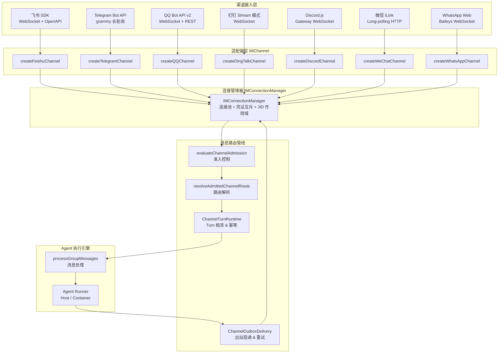
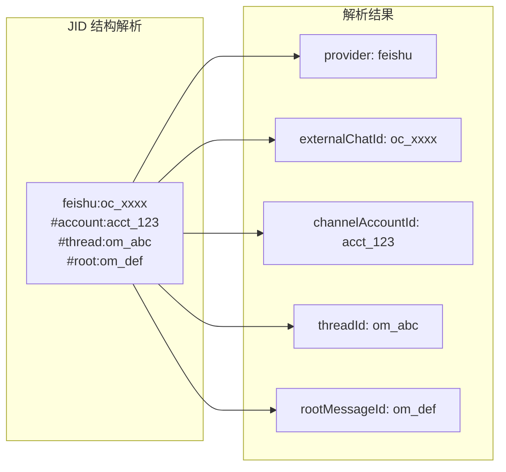
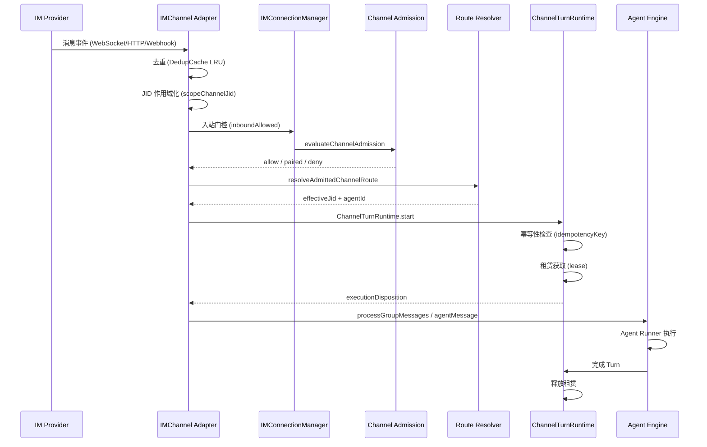
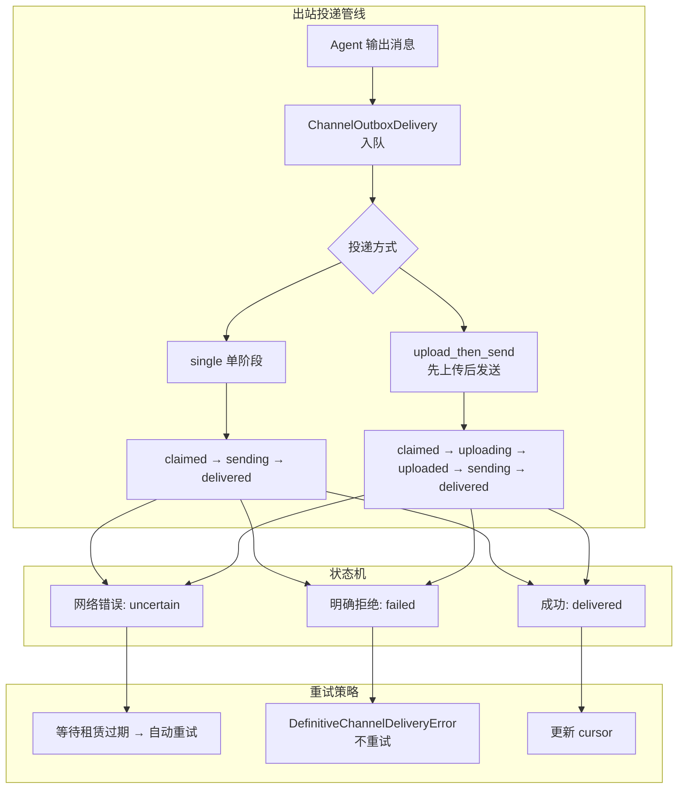
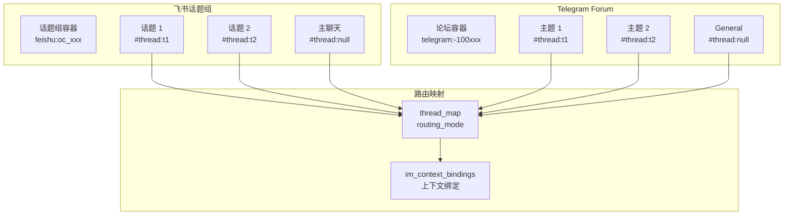
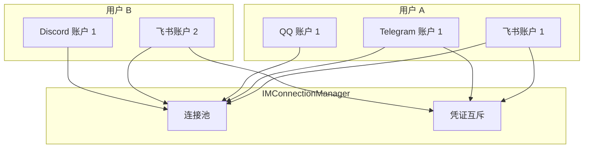
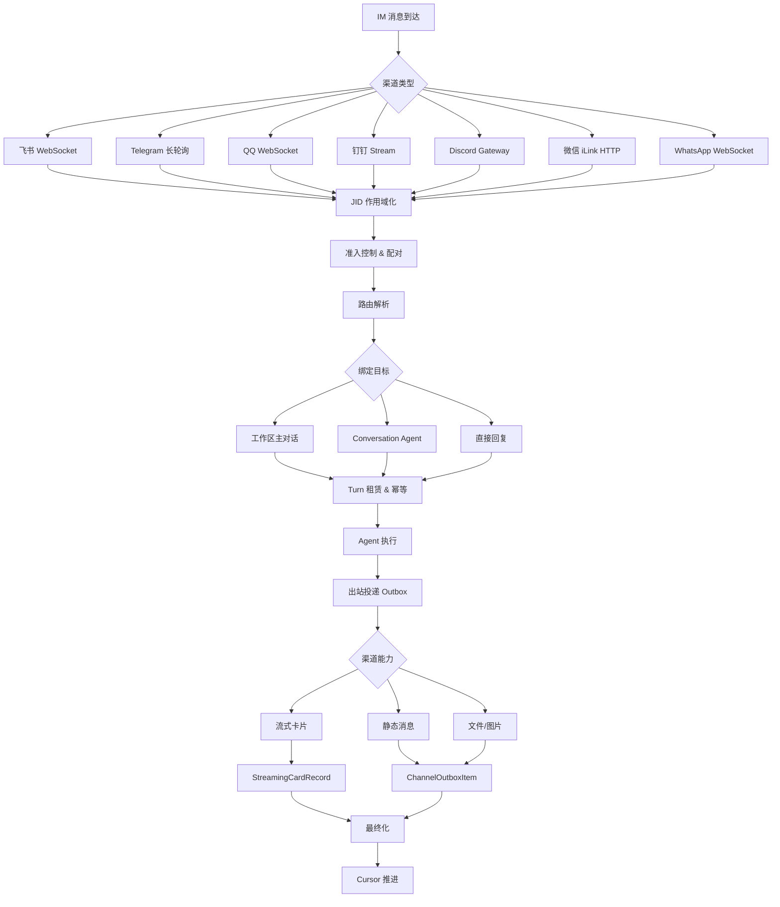

## 架构概览

HappyClaw 的 IM 系统是一个**渠道无关的抽象层**，它将七个不同的即时通讯平台——飞书、Telegram、QQ、钉钉、微信、Discord、WhatsApp——统一到一个通用的接口体系之下。系统的核心设计原则是：**每个渠道的具体差异（传输协议、消息格式、认证方式、流式能力）被封装在各自的适配器中，上层路由逻辑和 Agent 执行引擎只与统一的 `IMChannel` 接口交互**。

Sources: [im-channel.ts](src/im-channel.ts#L1-L75), [im-manager.ts](src/im-manager.ts#L1-L78), [channel-admission.ts](src/channel-admission.ts#L1-L132)

## 渠道地址系统（JID）

每个 IM 消息在系统内部被赋予一个**渠道级联标识符（JID）**，结构为 `{provider}:{externalChatId}#account:{channelAccountId}#thread:{threadId}#root:{rootMessageId}`。这个 JID 同时承载了渠道类型、外部聊天标识、账户作用域和原生上下文信息，使路由决策可以在不查询数据库的情况下完成。

`parseChannelAddress` 负责将 JID 解析为结构化对象，`scopeChannelJid` 为历史无作用域 JID 添加账户范围，`toProviderJid` 则在调用渠道 SDK 前剥离系统内部片段。`channelConversationJid` 返回稳定的对话级 JID（不含 thread/root），用于持久化绑定和会话所有权判断。

Sources: [channel-prefixes.ts](src/channel-prefixes.ts#L1-L19), [channel-address.ts](src/channel-address.ts#L1-L115), [shared/channel-prefixes.ts](shared/channel-prefixes.ts#L1-L19)

## 渠道能力矩阵

不同 IM 平台的能力差异显著。系统通过 `ImChannelCapabilities` 接口标准化描述每个渠道的能力集，路由逻辑据此决定是否启用特定功能：

| 能力维度 | 飞书 | 钉钉 | Telegram | QQ | 微信 | Discord | WhatsApp |
|---------|------|------|----------|-----|------|---------|----------|
| 工作区绑定 | ✓ | ✓ | ✓ | ✓ | ✓ | ✓ | ✓ |
| 会话绑定 | ✓ | ✓ | ✓ | ✓ | ✓ | ✓ | ✓ |
| 话题映射 (thread_map) | ✓ | ✗ | ✓ | ✗ | ✗ | ✗ | ✗ |
| 激活模式 (activation_modes) | ✓ | ✓ | ✗ | ✗ | ✗ | ✓ | ✓ |
| Owner 提及 | ✓ | ✓ | ✓ | ✓ | ✗ | ✓ | ✓ |
| 流式更新 | ✓ | ✓ | ✗ | ✓ | ✗ | ✓ | ✗ |
| 文件发送 | ✓ | ✓ | ✓ | ✓ | ✗ | ✓ | ✓ |

流式更新能力是区分渠道体验的关键维度：飞书、钉钉、QQ、Discord 支持实时卡片更新，Telegram 和 WhatsApp 仅支持静态消息推送，微信则因协议限制两种能力均不支持。

Sources: [im-channel-capabilities.ts](src/im-channel-capabilities.ts#L1-L117)

## 连接管理

`IMConnectionManager` 是全局连接池，以 `(userId, channelType, accountId)` 为维度管理所有 IM 连接实例。每个用户可拥有多个独立渠道的连接，同一渠道类型下可通过 `channelAccountId` 支持多账户。

**连接生命周期**遵循严格的加锁协议：`withUserLock` 确保同一用户的所有连接操作串行化，`withChannelLock` 对同一 `(userId, channelType)` 的操作串行化。`sealedUsers` 机制在用户被禁用或删除后阻止新连接创建，同时允许现有连接完成正在进行的消息投递。

**凭证互斥**是连接管理的关键安全约束：`credentialClaims` 确保同一份 Bot 凭证（如相同的飞书 AppId、Telegram Bot Token）**只能被一个账户拥有**，防止多账户竞争同一事件流导致消息重复或丢失。

Sources: [im-manager.ts](src/im-manager.ts#L194-L310)

## 消息入站管线

一条 IM 消息从进入系统到触发 Agent 执行，经过以下阶段：

**准入控制**由 `evaluateChannelAdmission` 实现：对于未配对的聊天，它会拦截 `/pair` 命令并触发配对流程；对于已授权聊天，`isChatAuthorized` 回调验证是否已在 `registered_groups` 中注册。配对成功后，`resolveAdmittedChannelRoute` 根据绑定关系解析目标 JID。

**Turn 租赁**由 `ChannelTurnRuntime` 管理：每个入站消息生成一个唯一的 `runId`（基于 `idempotencyKey` 的 SHA-256 摘要），通过 SQLite 持久化租赁状态。租赁过期时间默认 45 秒，心跳间隔 12 秒，确保进程崩溃后租赁能被其他进程回收。

Sources: [channel-turn-runtime.ts](src/channel-turn-runtime.ts#L1-L161), [channel-admission.ts](src/channel-admission.ts#L1-L132), [im-utils.ts](src/im-utils.ts#L71-L141)

## 出站投递与可靠性

出站投递是 IM 系统中最复杂的部分，因为**一旦消息发送到 IM 平台，就无法撤回**。系统采用 outbox 模式确保投递的可靠性：

`ChannelPhysicalDelivery` 定义了两种投递模式：`single` 单阶段投递和 `upload_then_send`（先上传媒体文件到 CDN，再发送消息引用上传结果）。投递过程中每个阶段都在 SQLite 中持久化状态，进程崩溃后通过 `reconcileExpiredChannelOutbox` 恢复。

投递结果的分类至关重要：
- **delivered**：收到 provider 的消息 ID，确认投递成功
- **uncertain**：网络错误或超时，不确定消息是否已送达（不自动重试，防止重复投递）
- **failed**：provider 明确拒绝（如格式错误、权限不足），不重试
- **retry_wait**：限流响应，等待指定时间后重试

Sources: [channel-outbox-delivery.ts](src/channel-outbox-delivery.ts#L1-L413), [channel-reliability-store.ts](src/channel-reliability-store.ts#L1-L150)

## 会话所有权与回复路由

IM 消息的回复路由需要解决一个核心问题：**当 Web 端和 IM 端的消息同时到达时，回复应该发送到哪里？**

`resolveStickyChannelOwner` 实现了稳定的会话所有权：一旦一个会话被某个 IM 渠道"认领"，后续回复都优先回到该渠道。所有权的判断粒度是**对话级**（provider + externalChatId + channelAccountId），而非线程级，以避免同一对话内不同线程的回复混淆。

在 `processGroupMessages` 中，系统会检查待处理消息的来源：如果所有消息都来自同一个 IM 渠道，`incomingImOwner` 被设置为该渠道的 JID；如果包含 Web 消息，则 IM 回复被抑制，只回复到 Web 端。

`replySourceImJid` 通过 `setSessionChannelOwnerOnce` 持久化到 SQLite，确保进程重启后回复路由仍然正确。

Sources: [channel-session-owner.ts](src/channel-session-owner.ts#L1-L36), [index.ts](src/index.ts#L5096-L5167), [reply-delivery.ts](src/reply-delivery.ts#L1-L171)

## 原生上下文与话题映射

飞书话题组和 Telegram Forum 是**原生上下文**（native context）的典型代表：一个容器（workspace）可以拥有多个独立的子对话，每个子对话都有自己的消息历史，但共享同一个 Agent 会话。

`isNativeContextContainer` 判断一个 JID 是否属于原生上下文容器。飞书渠道通过 `resolveFeishuConversationPlan` 生成话题计划，决定消息是否属于独立上下文（`independentContext`）。`buildNativeThreadRouteJid` 将基础 JID 与 thread/root 片段组合，确保每个子对话有唯一的 JID。

Sources: [channel-native-context.ts](src/channel-native-context.ts#L1-L48), [feishu-conversation-policy.ts](src/feishu-conversation-policy.ts#L1-L215), [channel-mount-service.ts](src/channel-mount-service.ts#L119-L156)

## 渠道账户系统

渠道账户（Channel Account）是系统的**多租户基石**。每个账户封装了一组独立的平台凭证（如飞书 AppId/AppSecret、Telegram Bot Token），并拥有自己的 `owner_user_id`。

账户的启用/禁用状态控制消息入站门控：`inboundAllowed` 检查账户的 `enabled` 状态和用户的 `active` 状态。`testChannelAccountCredentials` 为每个渠道提供独立的凭证验证逻辑，确保连接配置在保存前正确。

历史 JID（无账户作用域）通过 `channel-account-routing.ts` 中的 `resolveChannelAccountFallbackWorkspace` 和 `applyChannelAccountRegistrationFallback` 自动关联到默认账户。

Sources: [channel-account-connectivity.ts](src/channel-account-connectivity.ts#L1-L198), [channel-account-routing.ts](src/channel-account-routing.ts#L1-L48)

## 启动恢复与可靠性调停

系统启动时，`reconcileChannelReliabilityPass` 执行三项关键恢复操作：

1. **流式卡片恢复**：对所有非终结状态的流式卡片，尝试通过对应 Bot 的 `reconcileStreamingCard` 方法进行调停，将其标记为中断状态
2. **已投递效果中断**：`interruptChannelTurnRunsWithDeliveredEffects` 关闭"投递后崩溃"窗口——如果某个 Turn 的 outbox 已被确认送达但 Turn 本身未完成，将其标记为 `interrupted`，防止重复执行
3. **过期租赁回收**：`interruptExpiredChannelTurnRuns` 回收所有租赁过期的 Turn，释放被死进程占用的资源

恢复过程分为 `startup` 和 `live` 两种模式。Startup 模式在入站消息恢复前执行，可以处理所有非终结行；Live 模式仅处理 `createdBefore` 时间戳之前的行，避免影响正在进行的正常 Turn。

Sources: [channel-reliability-recovery.ts](src/channel-reliability-recovery.ts#L1-L252)

## 出站作用域与 IPC 关联

Agent Runner 在容器/Host 模式下执行时，通过 IPC 协议与主进程通信。`ActiveChannelOutboxScopeRegistry` 建立了运行时的出站作用域映射：以 `folder` 为键，记录当前 Turn 的路由快照（provider、accountId、chatId、threadId、rootId）。

当 Runner 通过 IPC 发送 `send_message` 请求时，主进程的 IPC Watcher 查找 `activeImReplyRoutes` 获取当前 IM 回复目标 JID，然后通过 `ActiveChannelOutboxScopeRegistry` 解析出站作用域，确保回复消息写入正确的渠道账户和原生上下文。

`syntheticChannelProviderAck` 为那些不返回消息 ID 的遗留 API 提供确定性确认，使得 outbox 状态机可以正常推进。

Sources: [channel-outbox-runtime-scope.ts](src/channel-outbox-runtime-scope.ts#L1-L176), [index.ts](src/index.ts#L5140-L5167)

## 路径总结

## 下一步阅读

- [Agent Runner 执行引擎：Host 模式与 Container 模式](7-agent-runner-zhi-xing-yin-qing-host-mo-shi-yu-container-mo-shi) — 深入了解 Agent 如何消费 IM 消息并产生回复
- [渠道接入：飞书、Telegram、QQ、钉钉、微信、Discord、WhatsApp 集成](5-qu-dao-jie-ru-fei-shu-telegram-qq-ding-ding-wei-xin-discord-whatsapp-ji-cheng) — 每个渠道的具体配置指南
- [Agent-First 三层模型：Agent → Workspace → Runtime Session](6-agent-first-san-ceng-mo-xing-agent-workspace-runtime-session) — 理解工作区与 IM 绑定的关系
- [运行时 IPC 协议：Agent Runner 与主进程通信机制](17-yun-xing-shi-ipc-xie-yi-agent-runner-yu-zhu-jin-cheng-tong-xin-ji-zhi) — IPC 消息如何通过 IM 渠道投递