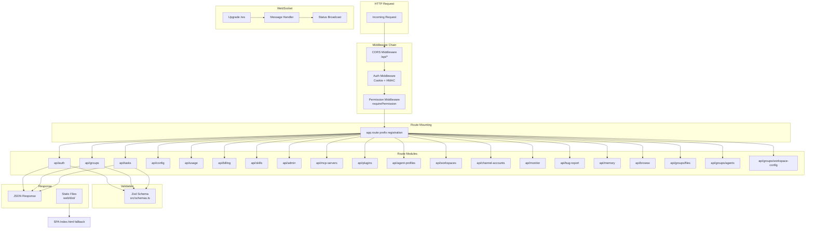

HappyClaw 的 Web API 基于 **Hono v4.x** 框架构建，这是一个轻量、高性能、TypeScript 优先的 Web 框架。整个 API 层承载着前端 SPA 的 REST 请求、WebSocket 实时通信、静态资源服务以及认证授权等核心职责。本文从路由挂载模式、中间件链、请求验证、错误处理、WebSocket 集成、服务器生命周期和测试策略七个维度，系统性地拆解这一架构。

## 路由挂载模式：分层注册与路径前缀

API 路由的注册集中在 `src/web.ts` 中，采用 `app.route(prefix, router)` 模式将各领域模块的路由器挂载到 `/api/*` 路径下。这种设计带来了清晰的模块边界：每个路由文件（如 `routes/auth.ts`、`routes/groups.ts`）各自创建 `new Hono<{ Variables: Variables }>()` 实例，独立定义内部路径，再由主应用统一聚合。

```typescript
// src/web.ts 中的路由挂载清单
app.route('/api/auth', authRoutes);
app.route('/api/groups', groupRoutes);
app.route('/api/groups', fileRoutes);       // 文件路由也挂载在 /api/groups 下
app.route('/api/memory', memoryRoutes);
app.route('/api/config', configRoutes);
app.route('/api/tasks', tasksRoutes);
app.route('/api/skills', skillsRoutes);
app.route('/api/admin', adminRoutes);
app.route('/api/browse', browseRoutes);
app.route('/api/mcp-servers', mcpServersRoutes);
app.route('/api/plugins', pluginsRoutes);
app.route('/api/agent-profiles', agentProfileRoutes);
app.route('/api/workspaces', workspaceRoutes);
app.route('/api/groups', agentRoutes);          // 工作区会话路由
app.route('/api/groups', workspaceConfigRoutes); // 工作区配置路由
app.route('/api', monitorRoutes);               // 监控路由无子路径前缀
app.route('/api/usage', usageRoutes);
app.route('/api/billing', billingRoutes);
app.route('/api/bug-report', bugReportRoutes);
app.route('/api/channel-accounts', channelAccountRoutes);
```

一个值得注意的架构决策是**多个路由器共享同一前缀**：`/api/groups` 同时挂载了 `groupRoutes`、`fileRoutes`、`agentRoutes` 和 `workspaceConfigRoutes` 四个独立路由器。这些路由器内部通过精细化路径区分（如 `/api/groups/:jid/files/*`、`/api/groups/:jid/agent-profiles` 等），Hono 的路由匹配机制能正确处理这种重叠。这种设计避免了单一路由器文件膨胀到数千行，同时保持了 URL 空间的逻辑一致性。

路由文件本身也遵循一致的内部模式：每个文件导出 `new Hono<{ Variables: Variables }>()` 实例，在其中定义 `router.get('/path', ...)`、`router.post('/path', ...)` 等处理函数。以 `routes/auth.ts` 为例，它定义了 `/status`、`/setup`、`/login`、`/register`、`/logout`、`/me`、`/profile`、`/password`、`/sessions`、`/avatar` 等端点，完整覆盖了用户认证生命周期的所有操作。

Sources: [src/web.ts](src/web.ts#L251-L270), [src/routes/auth.ts](src/routes/auth.ts#L134-L853), [src/routes/groups.ts](src/routes/groups.ts#L467-L1694)

## 中间件链：两层认证体系

API 的安全体系由**两层中间件**构成，部署在认证和授权两个维度上。

### 第一层：会话认证中间件 (`authMiddleware`)

`authMiddleware` 是守卫所有 API 端点的第一道防线。它从 HTTP 请求的 `Cookie` 头中提取 session token，依次进行四步验证：

1. **Cookie 提取**：优先尝试 `__Host-happyclaw_session`（安全前缀），回退到 `happyclaw_session`（明文前缀）。`getAllCookieValues()` 函数处理浏览器可能发送重复 cookie 的边界情况
2. **HMAC 签名验证**：`tryVerifyAny()` 调用 `verifySessionToken()` 验证 HMAC-SHA256 签名，防止 token 被篡改。同时支持旧版未签名 cookie 的平滑迁移——检测到旧格式时自动签发新签名 cookie
3. **会话有效性检查**：从缓存中查询 session 对应的用户信息，检查是否过期、是否被禁用或删除
4. **强制改密拦截**：如果用户被标记为 `must_change_password`，则仅放行 `/api/auth/me`、`/api/auth/password`、`/api/auth/logout` 等必要端点，其他所有请求返回 403

验证通过后，中间件将用户信息注入到 Hono 的 `c.set('user', ...)` 上下文中，后续路由处理函数可通过 `c.get('user')` 获取当前认证用户。同时，中间件以 5 分钟为间隔低频率更新 `last_active_at` 时间戳。

```typescript
// src/middleware/auth.ts 中的核心认证流程
export const authMiddleware = async (c: any, next: any) => {
  const cookieHeader = c.req.header('cookie');
  // 提取并验证 cookie 值...
  const user = { id, username, role, permissions, ... };
  c.set('user', user as AuthUser);
  c.set('sessionId', token);
  // 检查强制改密...
  await next();
};
```

### 第二层：权限中间件 (`requirePermission`)

在认证通过的基础上，`requirePermission` 和 `requireAnyPermission` 提供了细粒度的权限控制。HappyClaw 定义了六大权限枚举：`manage_system_config`、`manage_group_env`、`manage_users`、`manage_invites`、`view_audit_log`、`manage_billing`，通过 `hasPermission()` 函数对比用户权限集合与请求所需权限。

框架还预置了几个角色模板：`admin_full`（管理员全权限）、`member_basic`（普通成员无权限）、`ops_manager`（运维管理员）、`user_admin`（用户管理员），方便快速分配。

```typescript
// 路由层使用示例
export const requirePermission = (permission: Permission) => async (c, next) => {
  const user = c.get('user') as AuthUser;
  if (!hasPermission(user, permission)) {
    return c.json({ error: `Forbidden: ${permission} required` }, 403);
  }
  await next();
};
```

这种两层设计使得路由处理函数可以非常简洁：认证层统一处理 cookie 解析和会话管理，权限层按需声明最小权限要求。例如 `admin.ts` 中的用户管理端点使用 `usersManageMiddleware`（即 `requirePermission('manage_users')`），而计费管理端点使用 `requirePermission('manage_billing')`。

Sources: [src/middleware/auth.ts](src/middleware/auth.ts#L1-L187), [src/permissions.ts](src/permissions.ts#L1-L84), [src/routes/admin.ts](src/routes/admin.ts#L1-L80)

## 请求验证：Zod Schema 驱动的类型安全

HappyClaw 使用 **Zod** 进行请求体验证，所有 API Schema 定义在 `src/schemas.ts` 中（约 1155 行）。这一做法带来了三重收益：

1. **运行时验证**：自动拒绝格式错误的请求体，返回清晰的错误描述
2. **TypeScript 类型推导**：`z.infer<typeof Schema>` 可直接生成类型定义，避免手动维护类型接口
3. **统一的错误格式**：通过 `validation.error.format()` 生成标准化错误报告

```typescript
// 典型的路由处理函数中的验证模式
app.post('/api/messages', authMiddleware, async (c) => {
  const body = await c.req.json().catch(() => ({}));
  const validation = MessageCreateSchema.safeParse(body);
  if (!validation.success) {
    return c.json(
      { error: 'Invalid request body', details: validation.error.format() },
      400,
    );
  }
  const { chatJid, agentId, content, attachments, followUpBehavior } = validation.data;
  // ...
});
```

Schema 文件覆盖了所有 API 端点的输入验证，包括消息创建、用户注册/登录、工作区管理、任务调度、渠道账户配置、系统设置、计费管理等。字段级别的约束（如 `MAX_TASK_PROMPT_LENGTH = 16384`）在 Schema 中直接声明，确保前后端校验逻辑一致。

Sources: [src/schemas.ts](src/schemas.ts#L1-L100), [src/web.ts](src/web.ts#L274-L290)

## 静态资源与 SPA 路由

Hono 的 `serveStatic` 中间件负责提供前端构建产物。静态文件服务分为两个层级：

```typescript
// 带 content hash 的资源：浏览器缓存一年
app.use('/assets/*', /* Cache-Control: immutable */, serveStatic({ root: './web/dist' }));

// SPA 回退和其他资源：禁止缓存
app.use('/*', /* Cache-Control: no-store */, serveStatic({
  root: './web/dist',
  rewriteRequestPath: (p) => {
    if (p.startsWith('/api') || p.startsWith('/ws')) return p;
    if (p.match(/\.\w+$/)) return p;  // 文件扩展名直接返回
    return '/index.html';              // 无扩展名路径 → SPA 回退
  },
}));
```

第一层针对 `/assets/*` 路径的静态资源（Webpack/Vite 构建产物通常包含 content hash），设置 `max-age=31536000, immutable` 实现长期缓存。第二层处理所有其他路径，通过 `rewriteRequestPath` 实现了 SPA fallback：无文件扩展名的路径统一返回 `/index.html`，让前端路由接管导航。同时 `/api` 和 `/ws` 路径被明确排除，避免干扰 API 路由和 WebSocket 升级。

Sources: [src/web.ts](src/web.ts#L1243-L1280)

## CORS 策略：纵深防御

HappyClaw 的 CORS 配置有三个层次，兼顾开发便利性和生产安全：

```typescript
app.use('/api/*', cors({
  origin: (origin) => isAllowedOrigin(origin),
  credentials: true,
}));
```

`isAllowedOrigin()` 函数按优先级判断：环境变量 `CORS_ALLOWED_ORIGINS='*'` 允许所有来源（关闭 CSRF 防御）；默认允许 `localhost` 和 `127.0.0.1` 的任意端口（可通过 `CORS_ALLOW_LOCALHOST=false` 关闭）；自定义白名单支持逗号分隔的多个来源。这种设计在开发阶段无需额外配置即可工作，生产部署时通过设置白名单获得安全保护。

此外，**WebSocket 升级路径**也实现了独立的 Origin 校验，作为 SameSite=Strict Cookie 的纵深防御层。当检测到跨站 Origin 且不在白名单中时，拒绝 WebSocket 升级请求并记录日志。

Sources: [src/web.ts](src/web.ts#L197-L247), [src/web.ts](src/web.ts#L1294-L1350)

## WebSocket 集成：实时通信架构

WebSocket 的实现不依赖 Hono 内置的 WS 支持，而是直接使用 `ws` 库与 Node.js HTTP 服务器集成。`setupWebSocket()` 函数在 `server.on('upgrade')` 事件中拦截 WebSocket 升级请求，依次执行：

1. **路径校验**：仅允许 `/ws` 路径的升级请求
2. **Origin 校验**：同源放行，跨站来源需在白名单中
3. **Cookie 认证**：复用 HTTP 的 `getAllCookieValues()` 和 `tryVerifyAny()` 函数，验证 session token 的 HMAC 签名和数据库状态
4. **强制改密拦截**：`must_change_password` 的用户不能通过 WebSocket 发送指令

连接建立后，每个客户端的状态（`sessionId`、`userId`、`role`）被记录在 `wsClients` Map 中。WebSocket 消息协议支持多种消息类型：`send_message`（发送消息）、`stream_event`（接收实时事件流）、`terminal_*`（终端操作）、`run_*`（运行状态推送）等。

```typescript
// WebSocket 消息处理的典型模式
ws.on('message', (data) => {
  const msg = JSON.parse(data.toString()) as WsMessageIn;
  switch (msg.type) {
    case 'send_message':
      // 注入消息到队列，触发 agent 处理
      break;
    case 'terminal_input':
      // 写入终端 pty
      break;
    // ...
  }
});
```

WebSocket 连接还负责推送**运行状态广播**：每 5 秒广播一次 `broadcastStatus`（包含所有工作区的运行状态），`broadcastRunStarted`/`broadcastRunFinished` 在每次 agent 执行开始/结束时推送，使前端能够实时更新 UI 状态。

Sources: [src/web.ts](src/web.ts#L1294-L1450), [src/web.ts](src/web.ts#L3147-L3275)

## 服务器生命周期：启动与关闭

服务器的启动过程由 `startWebServer(webDeps)` 函数管理。它接收一个 `WebDeps` 接口（依赖注入容器），完成以下步骤：

1. **依赖注入**：将 `webDeps` 设置到模块级变量和共享状态中，同时注入 `config` 和 `channel-accounts` 路由的依赖
2. **HTTP 服务器启动**：使用 `@hono/node-server` 的 `serve()` 函数，监听 `WEB_PORT`（默认 3000）。设置 `requestTimeout: 10min` 以支持大文件上传，`headersTimeout: 60s` 防御慢速连接攻击
3. **WebSocket 服务器初始化**：在 HTTP 服务器上附加 WebSocket upgrade handler
4. **回调注册**：注册容器退出回调（终端清理）、runner 状态变化回调（前端状态同步）

```typescript
export function startWebServer(webDeps: WebDeps): void {
  deps = webDeps;
  setWebDeps(webDeps);
  injectConfigDeps(webDeps);
  injectChannelAccountDeps(webDeps);
  injectMonitorDeps({ broadcastDockerBuildLog, broadcastDockerBuildComplete });

  httpServer = serve({
    fetch: app.fetch,
    port: WEB_PORT,
    serverOptions: { requestTimeout: 10 * 60 * 1000, headersTimeout: 60 * 1000 },
  }, (info) => { logger.info({ port: info.port }, 'Web server started'); });

  wss = setupWebSocket(httpServer);
  // 注册回调...
}
```

关闭过程由 `shutdownWebServer()` 处理：先清除状态广播定时器，然后关闭所有 WebSocket 连接，最后关闭 HTTP 服务器。这种优雅关闭确保在容器环境中不会丢失正在处理的消息。

### 测试友好设计

`createAppForTest(webDeps)` 工厂函数允许测试环境在不启动 HTTP 服务器和 WebSocket 的情况下，直接使用 `app.request()` 模拟 HTTP 请求。测试集成代码中通过 `web.createAppForTest({...})` 传入 mock 依赖，然后调用 `app.request('POST', '/api/messages', ...)` 即可验证路由行为。这使得路由层的集成测试可以高速运行，无需网络层开销。

Sources: [src/web.ts](src/web.ts#L3147-L3275), [tests/routes-messages-acl.test.ts](tests/routes-messages-acl.test.ts#L156-L158)

## 路由层架构总览

以下图表展示了完整的路由层架构：



## 路由文件规模与复杂度

从代码量可以直观看出各路由模块的复杂度分布：

| 路由模块 | 文件 | 代码行数 | 核心职责 |
|---------|------|---------|---------|
| config | `routes/config.ts` | 4512 | 系统配置、渠道配置、Provider 管理 |
| groups | `routes/groups.ts` | 2432 | 工作区 CRUD、权限管理、代理配置 |
| agents | `routes/agents.ts` | 2004 | Agent 会话管理、语境绑定、挂载管理 |
| skills | `routes/skills.ts` | 1623 | 技能安装、查询、同步、管理 |
| tasks | `routes/tasks.ts` | 1205 | 定时任务 CRUD、执行、日志 |
| admin | `routes/admin.ts` | 1078 | 用户管理、邀请码、审计日志 |
| files | `routes/files.ts` | 1021 | 文件浏览、上传、下载、预览 |
| channel-accounts | `routes/channel-accounts.ts` | 1266 | 多渠道账户配置与验证 |
| auth | `routes/auth.ts` | 886 | 登录注册、密码管理、会话管理 |
| monitor | `routes/monitor.ts` | 642 | 系统监控、版本检查、容器管理 |
| workspace-config | `routes/workspace-config.ts` | 674 | 工作区 Skills/MCP 配置 |
| billing | `routes/billing.ts` | 846 | 计费计划、订阅管理、账单 |
| **总 HTTP 路由层** | **核心文件** | **27,903** | **完整 API 层** |

Sources: 统计基于 `wc -l` 命令输出

## 架构原则与最佳实践

HappyClaw 的路由体系遵循以下设计原则：

**单一职责的模块拆分**。每个路由文件专注于一个领域，从 `auth.ts` 的认证流到 `billing.ts` 的计费管理，模块边界清晰。共享逻辑（认证、权限、验证）通过中间件和独立模块复用，避免重复代码。

**依赖注入而非全局状态**。`WebDeps` 接口定义了路由层所需的全部外部依赖（队列、广播、会话管理），通过 `setWebDeps()` 和 `getWebDeps()` 在启动时注入。这种设计在测试时极为关键——`createAppForTest()` 可以传入 mock 依赖，实现完全隔离的单元测试。

**深度防御的安全策略**。从 CORS 源校验到 HMAC 签名的 session cookie，从两层中间件认证到 WebSocket 升级的独立 Origin 检查，每一层都有明确的安全职责。即使同一层被绕过（如 CORS 不覆盖 WebSocket），后续层仍能提供保护。

**类型安全贯穿始终**。Hono 的 `{ Variables: Variables }` 泛型确保中间件注入的类型在路由处理函数中正确推导；Zod schema 的 `z.infer` 提供请求体的类型安全；`serveStatic` 和 `cors` 等内置中间件也遵循相同的类型约定。

## 延伸阅读

- 关于认证机制的详细实现，参见 [认证与会话管理：Cookie Session、Permission Middleware 与 ACL 权限矩阵](10-ren-zheng-yu-hui-hua-guan-li-cookie-session-permission-middleware-yu-acl-quan-xian-ju-zhen)
- 路由层操作的数据库层详解，参见 [SQLite 数据库 Schema 与版本化迁移策略](11-sqlite-shu-ju-ku-schema-yu-ban-ben-hua-qian-yi-ce-lue)
- 前端如何消费这些 API，参见 [React 前端架构：路由、状态管理与组件树](19-react-qian-duan-jia-gou-lu-you-zhuang-tai-guan-li-yu-zu-jian-shu)
- 实时事件流如何贯穿前后端，参见 [StreamEvent 实时事件流系统：从前端到 Runner 端到端同步](18-streamevent-shi-shi-shi-jian-liu-xi-tong-cong-qian-duan-dao-runner-duan-dao-duan-tong-bu)