# MiniCode-概览

# MiniCode 概览
相关源文件
- [ARCHITECTURE.md](https://github.com/LiuMengxuan04/MiniCode/blob/57cd741d/ARCHITECTURE.md?plain=1)
- [ARCHITECTURE_ZH.md](https://github.com/LiuMengxuan04/MiniCode/blob/57cd741d/ARCHITECTURE_ZH.md?plain=1)
- [README.md](https://github.com/LiuMengxuan04/MiniCode/blob/57cd741d/README.md?plain=1)
- [README.zh-CN.md](https://github.com/LiuMengxuan04/MiniCode/blob/57cd741d/README.zh-CN.md?plain=1)
- [docs/index.html](https://github.com/LiuMengxuan04/MiniCode/blob/57cd741d/docs/index.html)
- [docs/logo.svg](https://github.com/LiuMengxuan04/MiniCode/blob/57cd741d/docs/logo.svg)

MiniCode 是一个轻量级、终端优先的编码助手，专为本地开发工作流设计。它提供了 **model-tool-model** 代理循环的参考实现，在紧凑且可读的代码库中提供类似 Claude Code 的体验 [README.md26-28](https://github.com/LiuMengxuan04/MiniCode/blob/57cd741d/README.md?plain=1#L26-L28) 该系统构建为快速、简单且高效，使其成为学习 agentic 架构或构建自定义终端开发工具的理想平台 [README.md21](https://github.com/LiuMengxuan04/MiniCode/blob/57cd741d/README.md?plain=1#L21-L21)[README.md115-121](https://github.com/LiuMengxuan04/MiniCode/blob/57cd741d/README.md?plain=1#L115-L121)

### 核心能力

MiniCode 通过一个实用的代理循环来运作，管理编码任务的完整生命周期：

- **工作区感知**：检查本地文件和目录结构，为模型提供上下文 [README.md32-35](https://github.com/LiuMengxuan04/MiniCode/blob/57cd741d/README.md?plain=1#L32-L35)
- **工具执行**：执行用于文件操作的内置工具（`read_file`、`edit_file`、`patch_file`、`modify_file`）、Shell 命令（`run_command`）和网络搜索 [README.md124-129](https://github.com/LiuMengxuan04/MiniCode/blob/57cd741d/README.md?plain=1#L124-L129)[ARCHITECTURE.md47](https://github.com/LiuMengxuan04/MiniCode/blob/57cd741d/ARCHITECTURE.md?plain=1#L47-L47)
- **安全与审查**：实现"写入前审查"流程，确保所有文件修改通过统一 diff 在提交到磁盘前得到批准 [README.md130-131](https://github.com/LiuMengxuan04/MiniCode/blob/57cd741d/README.md?plain=1#L130-L131)[ARCHITECTURE.md62](https://github.com/LiuMengxuan04/MiniCode/blob/57cd741d/ARCHITECTURE.md?plain=1#L62-L62)
- **可扩展性**：支持 **Model Context Protocol (MCP)** 用于动态工具加载，以及通过 `SKILL.md` 文件定义的本地 **Skills** 系统用于特定领域的指令 [README.md129](https://github.com/LiuMengxuan04/MiniCode/blob/57cd741d/README.md?plain=1#L129-L129)[ARCHITECTURE.md49-50](https://github.com/LiuMengxuan04/MiniCode/blob/57cd741d/ARCHITECTURE.md?plain=1#L49-L50)
- **上下文管理**：通过 provider 用量驱动的上下文计算、旧轮次的自动压缩以及将过大的工具结果存储到磁盘来自动管理 token 限制 [README.md127-128](https://github.com/LiuMengxuan04/MiniCode/blob/57cd741d/README.md?plain=1#L127-L128)[README.md131](https://github.com/LiuMengxuan04/MiniCode/blob/57cd741d/README.md?plain=1#L131-L131)

有关设置环境和运行第一次会话的指南，请参阅 **[入门指南](/LiuMengxuan04/MiniCode/1.1-getting-started)**。

---

### 系统架构

MiniCode 的架构分为几个不同的子系统，通过中央代理循环进行协调。以下图表说明了自然语言请求如何转换为具体的代码操作。

**从意图到行动：代码实体映射**

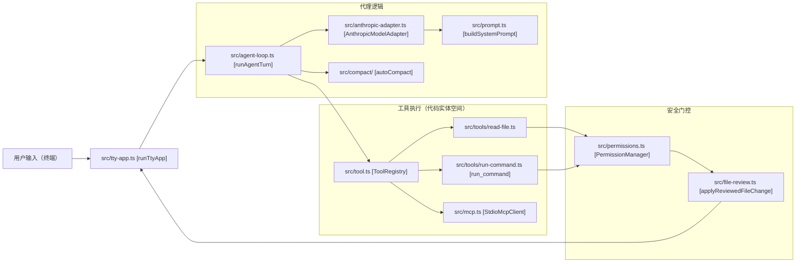
```mermaid
flowchart LR
    User["用户输入（终端）"]
    TUI["src/tty-app.ts #91;runTtyApp#93;"]
    subgraph subGraph2 ["安全门控"]
        Perms["src/permissions.ts #91;PermissionManager#93;"]
        Review["src/file-review.ts #91;applyReviewedFileChange#93;"]
    end
    subgraph subGraph1 ["工具执行（代码实体空间）"]
        Registry["src/tool.ts #91;ToolRegistry#93;"]
        Files["src/tools/read-file.ts"]
        Shell["src/tools/run-command.ts #91;run_command#93;"]
        MCP["src/mcp.ts #91;StdioMcpClient#93;"]
    end
    subgraph subGraph0 ["代理逻辑"]
        Loop["src/agent-loop.ts #91;runAgentTurn#93;"]
        Adapter["src/anthropic-adapter.ts #91;AnthropicModelAdapter#93;"]
        Prompt["src/prompt.ts #91;buildSystemPrompt#93;"]
        Compact["src/compact/ #91;autoCompact#93;"]
    end
    User --> TUI
    TUI --> Loop
    Loop --> Adapter
    Adapter --> Prompt
    Loop --> Compact
    Loop --> Registry
    Registry --> Files
    Registry --> Shell
    Registry --> MCP
    Files --> Perms
    Shell --> Perms
    Perms --> Review
    Review --> TUI
```

**来源：**[README.md32-40](https://github.com/LiuMengxuan04/MiniCode/blob/57cd741d/README.md?plain=1#L32-L40)[ARCHITECTURE.md42-63](https://github.com/LiuMengxuan04/MiniCode/blob/57cd741d/ARCHITECTURE.md?plain=1#L42-L63)[ARCHITECTURE_ZH.md44-65](https://github.com/LiuMengxuan04/MiniCode/blob/57cd741d/ARCHITECTURE_ZH.md?plain=1#L44-L65)

---

### 关键子系统

#### 1. 代理循环

MiniCode 的核心是多轮工具调用循环。它管理对话状态，通过 `AnthropicModelAdapter` 向 LLM 发送上下文，并分派模型请求的工具调用 [ARCHITECTURE.md45](https://github.com/LiuMengxuan04/MiniCode/blob/57cd741d/ARCHITECTURE.md?plain=1#L45-L45)[ARCHITECTURE.md53](https://github.com/LiuMengxuan04/MiniCode/blob/57cd741d/ARCHITECTURE.md?plain=1#L53-L53) 它继续迭代，直到模型提供最终响应或通过 `ask_user` 请求用户干预 [README.md124-129](https://github.com/LiuMengxuan04/MiniCode/blob/57cd741d/README.md?plain=1#L124-L129)

#### 2. 工具与 MCP

MiniCode 配备了一套强大的内置工具，用于文件系统操作（如 `edit_file`、`grep_files`）和系统交互（`run_command`）[ARCHITECTURE.md47](https://github.com/LiuMengxuan04/MiniCode/blob/57cd741d/ARCHITECTURE.md?plain=1#L47-L47) 除了内置工具，它还通过 `stdio` 或 HTTP 与 **Model Context Protocol (MCP)** 服务器集成，将远程 MCP 工具包装成本地工具定义 [ARCHITECTURE.md50-52](https://github.com/LiuMengxuan04/MiniCode/blob/57cd741d/ARCHITECTURE.md?plain=1#L50-L52)

#### 3. 安全与权限

安全性由 `PermissionManager` 处理，它控制对敏感路径和命令的访问 [ARCHITECTURE.md58](https://github.com/LiuMengxuan04/MiniCode/blob/57cd741d/ARCHITECTURE.md?plain=1#L58-L58) 任何文件修改都会通过 `src/file-review.ts` 触发基于 TUI 的 diff 审查，用户必须明确批准更改后才能提交 [ARCHITECTURE.md62](https://github.com/LiuMengxuan04/MiniCode/blob/57cd741d/ARCHITECTURE.md?plain=1#L62-L62)

#### 4. 终端用户界面 (TUI)

界面是一个全屏终端应用程序，提供可滚动的对话记录、命令菜单（斜杠命令如 `/ls`、`/grep`、`/resume`）和交互式批准对话框 [README.md125](https://github.com/LiuMengxuan04/MiniCode/blob/57cd741d/README.md?plain=1#L125-L125)[README.md171-182](https://github.com/LiuMengxuan04/MiniCode/blob/57cd741d/README.md?plain=1#L171-L182) 它处理复杂渲染，包括 ANSI 样式和后台 Shell 任务跟踪 [ARCHITECTURE.md63](https://github.com/LiuMengxuan04/MiniCode/blob/57cd741d/ARCHITECTURE.md?plain=1#L63-L63)[ARCHITECTURE.md51](https://github.com/LiuMengxuan04/MiniCode/blob/57cd741d/ARCHITECTURE.md?plain=1#L51-L51)

**子系统关系图**

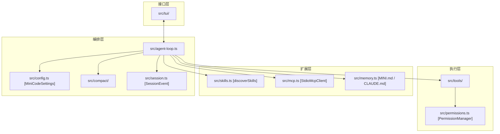
```mermaid
flowchart TD
    subgraph subGraph3 ["执行层"]
        Tools["src/tools/"]
        Perms["src/permissions.ts #91;PermissionManager#93;"]
    end
    subgraph subGraph2 ["扩展层"]
        Skills["src/skills.ts #91;discoverSkills#93;"]
        MCP["src/mcp.ts #91;StdioMcpClient#93;"]
        Memory["src/memory.ts #91;MINI.md / CLAUDE.md#93;"]
    end
    subgraph subGraph1 ["编排层"]
        Loop["src/agent-loop.ts"]
        Config["src/config.ts #91;MiniCodeSettings#93;"]
        Context["src/compact/"]
        Session["src/session.ts #91;SessionEvent#93;"]
    end
    subgraph subGraph0 ["接口层"]
        TUI["src/tui/"]
    end
    TUI <--> Loop
    Loop --> Config
    Loop --> Tools
    Loop --> Skills
    Loop --> MCP
    Loop --> Context
    Loop --> Session
    Loop --> Memory
    Tools --> Perms
```

**来源：**[README.md122-132](https://github.com/LiuMengxuan04/MiniCode/blob/57cd741d/README.md?plain=1#L122-L132)[ARCHITECTURE.md42-63](https://github.com/LiuMengxuan04/MiniCode/blob/57cd741d/ARCHITECTURE.md?plain=1#L42-L63)[ARCHITECTURE_ZH.md44-65](https://github.com/LiuMengxuan04/MiniCode/blob/57cd741d/ARCHITECTURE_ZH.md?plain=1#L44-L65)

---

### 设计理念与路线图

MiniCode 被有意设计为小型且"可 hack"的。它优先考虑最有价值的执行模式（如目录感知、安全写入流程和长会话可用性），而不是带有大量依赖项的"平台"方法 [ARCHITECTURE.md8-18](https://github.com/LiuMengxuan04/MiniCode/blob/57cd741d/ARCHITECTURE.md?plain=1#L8-L18)[ARCHITECTURE.md27](https://github.com/LiuMengxuan04/MiniCode/blob/57cd741d/ARCHITECTURE.md?plain=1#L27-L27)

该项目保持了轻量级的 Claude Code 风格区分：前台工具执行和后台 Shell 任务 [ARCHITECTURE.md86](https://github.com/LiuMengxuan04/MiniCode/blob/57cd741d/ARCHITECTURE.md?plain=1#L86-L86) 未来开发专注于更丰富的项目记忆、更强的 UI 组件化，以及在多种语言实现中保持兼容性，包括 Rust（`MiniCode-rs`）、Python（`MiniCode-Python`）和 Java（`MiniCode4j`）[README.md101-106](https://github.com/LiuMengxuan04/MiniCode/blob/57cd741d/README.md?plain=1#L101-L106)[ARCHITECTURE.md91-98](https://github.com/LiuMengxuan04/MiniCode/blob/57cd741d/ARCHITECTURE.md?plain=1#L91-L98)

有关这些约束和项目未来的深入探讨，请参阅 **[设计原则与路线图](/LiuMengxuan04/MiniCode/1.2-design-principles-and-roadmap)**。

**来源：**

- [README.md1-185](https://github.com/LiuMengxuan04/MiniCode/blob/57cd741d/README.md?plain=1#L1-L185)
- [ARCHITECTURE.md1-98](https://github.com/LiuMengxuan04/MiniCode/blob/57cd741d/ARCHITECTURE.md?plain=1#L1-L98)
- [ARCHITECTURE_ZH.md1-100](https://github.com/LiuMengxuan04/MiniCode/blob/57cd741d/ARCHITECTURE_ZH.md?plain=1#L1-L100)

---

# 入门指南
相关源文件
- [README.md](https://github.com/LiuMengxuan04/MiniCode/blob/57cd741d/README.md?plain=1)
- [USAGE.md](https://github.com/LiuMengxuan04/MiniCode/blob/57cd741d/USAGE.md?plain=1)
- [USAGE_ZH.md](https://github.com/LiuMengxuan04/MiniCode/blob/57cd741d/USAGE_ZH.md?plain=1)
- [bin/minicode](https://github.com/LiuMengxuan04/MiniCode/blob/57cd741d/bin/minicode)
- [src/config.ts](https://github.com/LiuMengxuan04/MiniCode/blob/57cd741d/src/config.ts)
- [src/file-review.ts](https://github.com/LiuMengxuan04/MiniCode/blob/57cd741d/src/file-review.ts)
- [src/install.ts](https://github.com/LiuMengxuan04/MiniCode/blob/57cd741d/src/install.ts)
- [src/manage-cli.ts](https://github.com/LiuMengxuan04/MiniCode/blob/57cd741d/src/manage-cli.ts)
- [src/mcp.ts](https://github.com/LiuMengxuan04/MiniCode/blob/57cd741d/src/mcp.ts)
- [src/skills.ts](https://github.com/LiuMengxuan04/MiniCode/blob/57cd741d/src/skills.ts)
- [src/tui/input.ts](https://github.com/LiuMengxuan04/MiniCode/blob/57cd741d/src/tui/input.ts)

本页面提供安装、配置和启动 MiniCode 的技术细节。它涵盖交互式安装过程、配置文件层级以及双模式执行逻辑（TTY vs. Pipe）。

## 安装与初始设置

MiniCode 被设计为轻量级终端助手。安装过程专注于设置持久化的全局配置目录和启动器脚本，使 `minicode` 命令可在系统范围内使用。

### 交互式安装程序

安装由 `src/install.ts` 驱动。当用户通过 `npm run install-local` [package.json14](https://github.com/LiuMengxuan04/MiniCode/blob/57cd741d/package.json#L14-L14) 运行安装程序时，会发生以下序列：

1. **环境探测**：安装程序使用 `loadEffectiveSettings` [src/install.ts52](https://github.com/LiuMengxuan04/MiniCode/blob/57cd741d/src/install.ts#L52-L52) 加载任何现有设置
2. **用户输入**：使用 `askRequired` [src/install.ts60-73](https://github.com/LiuMengxuan04/MiniCode/blob/57cd741d/src/install.ts#L60-L73) 提示输入模型名称、`ANTHROPIC_BASE_URL` 和 `ANTHROPIC_AUTH_TOKEN`。如果 token 已存在，它会提供"已保存"提示 [src/install.ts34-37](https://github.com/LiuMengxuan04/MiniCode/blob/57cd741d/src/install.ts#L34-L37)
3. **持久化**：经过验证的设置通过 `saveMiniCodeSettings` [src/install.ts79-86](https://github.com/LiuMengxuan04/MiniCode/blob/57cd741d/src/install.ts#L79-L86) 写入 `~/.mini-code/settings.json`
4. **启动器创建**：它在 `~/.local/bin/minicode`（或由 `MINI_CODE_BIN_DIR` 指定的目录）生成一个指向仓库入口点的 bash 脚本 [src/install.ts89-102](https://github.com/LiuMengxuan04/MiniCode/blob/57cd741d/src/install.ts#L89-L102)

### 启动器机制

`bin/minicode` 处的启动器是一个 shell 脚本，使用 `node` 和 `tsx` 直接从 `src/index.ts` 执行 TypeScript 源代码，确保开发更改可以立即反映，无需手动构建步骤 [bin/minicode1-7](https://github.com/LiuMengxuan04/MiniCode/blob/57cd741d/bin/minicode#L1-L7)

**安装流程：代码实体映射**

```

```

**来源：** [src/install.ts39-126](https://github.com/LiuMengxuan04/MiniCode/blob/57cd741d/src/install.ts#L39-L126)[bin/minicode1-8](https://github.com/LiuMengxuan04/MiniCode/blob/57cd741d/bin/minicode#L1-L8)[src/config.ts190-201](https://github.com/LiuMengxuan04/MiniCode/blob/57cd741d/src/config.ts#L190-L201)[package.json14](https://github.com/LiuMengxuan04/MiniCode/blob/57cd741d/package.json#L14-L14)

## 配置系统

MiniCode 采用多层配置策略。设置以特定优先级顺序合并，允许全局默认值、项目特定覆盖和环境变量注入。

### 配置层级

`src/config.ts` 中的 `loadEffectiveSettings` 函数从四个主要来源聚合设置 [src/config.ts173-188](https://github.com/LiuMengxuan04/MiniCode/blob/57cd741d/src/config.ts#L173-L188)：

1. **Claude 设置**：`~/.claude/settings.json`（通过 `CLAUDE_SETTINGS_PATH` [src/config.ts45](https://github.com/LiuMengxuan04/MiniCode/blob/57cd741d/src/config.ts#L45-L45)）
2. **全局 MCP**：`~/.mini-code/mcp.json`（通过 `MINI_CODE_MCP_PATH` [src/config.ts42](https://github.com/LiuMengxuan04/MiniCode/blob/57cd741d/src/config.ts#L42-L42)）
3. **项目 MCP**：`./.mcp.json`（通过 `PROJECT_MCP_PATH` [src/config.ts46](https://github.com/LiuMengxuan04/MiniCode/blob/57cd741d/src/config.ts#L46-L46)）
4. **MiniCode 设置**：`~/.mini-code/settings.json`（文件配置的最高优先级，通过 `MINI_CODE_SETTINGS_PATH` [src/config.ts39](https://github.com/LiuMengxuan04/MiniCode/blob/57cd741d/src/config.ts#L39-L39)）

### 运行时配置解析

代理使用的最终 `RuntimeConfig` [src/config.ts24-32](https://github.com/LiuMengxuan04/MiniCode/blob/57cd741d/src/config.ts#L24-L32) 在 `loadRuntimeConfig` 中解析。该函数将有效设置与 `process.env` 合并，赋予环境变量（如 `MINI_CODE_MODEL` 和 `ANTHROPIC_AUTH_TOKEN`）最高优先级 [src/config.ts203-238](https://github.com/LiuMengxuan04/MiniCode/blob/57cd741d/src/config.ts#L203-L238)

| 变量/键 | 来源优先级 | 描述 |
| --- | --- | --- |
| `model` | `env.MINI_CODE_MODEL` > `settings.json` > `env.ANTHROPIC_MODEL` | LLM 模型标识符 [src/config.ts210-213](https://github.com/LiuMengxuan04/MiniCode/blob/57cd741d/src/config.ts#L210-L213) |
| `baseUrl` | `env.ANTHROPIC_BASE_URL` > `settings.json` | API 端点（默认为 `https://api.anthropic.com`）[src/config.ts215-216](https://github.com/LiuMengxuan04/MiniCode/blob/57cd741d/src/config.ts#L215-L216) |
| `mcpServers` | 从 Project > Global > Claude 合并 | MCP 服务器配置映射 [src/config.ts139-171](https://github.com/LiuMengxuan04/MiniCode/blob/57cd741d/src/config.ts#L139-L171) |

### MCP Token 管理

MCP 服务器的身份验证 token 存储在 `mcp-tokens.json` 中 [src/config.ts43](https://github.com/LiuMengxuan04/MiniCode/blob/57cd741d/src/config.ts#L43-L43) 这些通过 `readMcpTokensFile` 和 `saveMcpTokensFile` [src/config.ts48-70](https://github.com/LiuMengxuan04/MiniCode/blob/57cd741d/src/config.ts#L48-L70) 管理，由 `minicode mcp login` 和 `logout` 命令使用 [src/manage-cli.ts169-202](https://github.com/LiuMengxuan04/MiniCode/blob/57cd741d/src/manage-cli.ts#L169-L202)

**配置数据流**

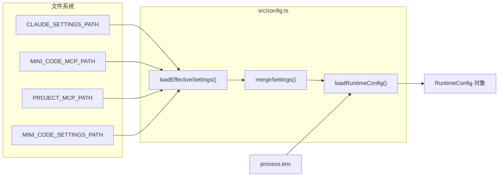
```mermaid
flowchart LR
    ENV["process.env"]
    RC["RuntimeConfig 对象"]
    subgraph ConfigLogic ["src/config.ts"]
        Merge["mergeSettings()"]
        LoadEff["loadEffectiveSettings()"]
        LoadRun["loadRuntimeConfig()"]
    end
    subgraph FileSystem ["文件系统"]
        CS["CLAUDE_SETTINGS_PATH"]
        GM["MINI_CODE_MCP_PATH"]
        PM["PROJECT_MCP_PATH"]
        MS["MINI_CODE_SETTINGS_PATH"]
    end
    CS --> LoadEff
    GM --> LoadEff
    PM --> LoadEff
    MS --> LoadEff
    LoadEff --> Merge
    Merge --> LoadRun
    ENV --> LoadRun
    LoadRun --> RC
```

**来源：** [src/config.ts6-46](https://github.com/LiuMengxuan04/MiniCode/blob/57cd741d/src/config.ts#L6-L46)[src/config.ts139-188](https://github.com/LiuMengxuan04/MiniCode/blob/57cd741d/src/config.ts#L139-L188)[src/config.ts203-238](https://github.com/LiuMengxuan04/MiniCode/blob/57cd741d/src/config.ts#L203-L238)[src/manage-cli.ts169-202](https://github.com/LiuMengxuan04/MiniCode/blob/57cd741d/src/manage-cli.ts#L169-L202)

## 执行模式：TTY vs. Pipe

入口点 `src/index.ts` 通过检查 `process.stdin.isTTY` 和 `process.stdout.isTTY` 来确定接口类型。

### TTY 模式（交互式）

在标准终端中启动时，MiniCode 提供交互式 TUI。

- **界面**：提示使用 `renderInputPrompt` [src/tui/input.ts8-18](https://github.com/LiuMengxuan04/MiniCode/blob/57cd741d/src/tui/input.ts#L8-L18) 渲染
- **样式**：使用 ANSI 转义序列进行加粗和着色（如 `GREEN`、`YELLOW`、`REVERSE`）以区分提示和用户输入 [src/tui/input.ts1-6](https://github.com/LiuMengxuan04/MiniCode/blob/57cd741d/src/tui/input.ts#L1-L6)
- **状态栏**：显示命令提示，如 `/help`、`Esc` 清除和 `Ctrl+C` 退出 [src/tui/input.ts14](https://github.com/LiuMengxuan04/MiniCode/blob/57cd741d/src/tui/input.ts#L14-L14)

### Pipe 模式（非交互式）

当被重定向或通过管道传输时，MiniCode 回退到非 TTY 接口。

- **输入**：通过标准 readline 风格循环处理 `stdin` 中的行。
- **斜杠命令**：支持本地命令如 `/tools` 或 `/exit`，即使在非交互模式下也可作为管理 CLI 或直接输入的一部分 [src/manage-cli.ts13-25](https://github.com/LiuMengxuan04/MiniCode/blob/57cd741d/src/manage-cli.ts#L13-L25)

### 首次运行导览

1. **目录创建**：系统确保 `MINI_CODE_DIR`（默认为 `~/.mini-code`）存在 [src/config.ts36-38](https://github.com/LiuMengxuan04/MiniCode/blob/57cd741d/src/config.ts#L36-L38)
2. **设置初始化**：`loadRuntimeConfig` 验证模型和身份验证（`ANTHROPIC_AUTH_TOKEN` 或 `ANTHROPIC_API_KEY`）是否存在 [src/config.ts230-238](https://github.com/LiuMengxuan04/MiniCode/blob/57cd741d/src/config.ts#L230-L238)
3. **MCP 初始化**：从作用域配置文件中加载 MCP 服务器 [src/config.ts118-123](https://github.com/LiuMengxuan04/MiniCode/blob/57cd741d/src/config.ts#L118-L123) 协议协商（如 `content-length` vs `newline-json`）在服务器启动期间处理 [src/mcp.ts62-69](https://github.com/LiuMengxuan04/MiniCode/blob/57cd741d/src/mcp.ts#L62-L69)
4. **工具注册**：注册内置工具和 MCP 提供的工具。MCP 工具使用 Zod 模式进行命名空间化和验证 [src/mcp.ts5-8](https://github.com/LiuMengxuan04/MiniCode/blob/57cd741d/src/mcp.ts#L5-L8)

**来源：** [src/config.ts36-46](https://github.com/LiuMengxuan04/MiniCode/blob/57cd741d/src/config.ts#L36-L46)[src/config.ts203-238](https://github.com/LiuMengxuan04/MiniCode/blob/57cd741d/src/config.ts#L203-L238)[src/tui/input.ts1-18](https://github.com/LiuMengxuan04/MiniCode/blob/57cd741d/src/tui/input.ts#L1-L18)[src/mcp.ts62-120](https://github.com/LiuMengxuan04/MiniCode/blob/57cd741d/src/mcp.ts#L62-L120)[src/manage-cli.ts13-25](https://github.com/LiuMengxuan04/MiniCode/blob/57cd741d/src/manage-cli.ts#L13-L25)

---

# 设计原则与路线图
相关源文件
- [CLAUDE_CODE_PATTERNS.md](https://github.com/LiuMengxuan04/MiniCode/blob/57cd741d/CLAUDE_CODE_PATTERNS.md?plain=1)
- [CLAUDE_CODE_PATTERNS_ZH.md](https://github.com/LiuMengxuan04/MiniCode/blob/57cd741d/CLAUDE_CODE_PATTERNS_ZH.md?plain=1)
- [CONTRIBUTING.md](https://github.com/LiuMengxuan04/MiniCode/blob/57cd741d/CONTRIBUTING.md?plain=1)
- [CONTRIBUTING_ZH.md](https://github.com/LiuMengxuan04/MiniCode/blob/57cd741d/CONTRIBUTING_ZH.md?plain=1)
- [ROADMAP.md](https://github.com/LiuMengxuan04/MiniCode/blob/57cd741d/ROADMAP.md?plain=1)
- [ROADMAP_ZH.md](https://github.com/LiuMengxuan04/MiniCode/blob/57cd741d/ROADMAP_ZH.md?plain=1)

MiniCode 被有意设计为轻量级、可读且可扩展的终端编码助手。其主要目标是保留 Claude Code 的核心架构本质，同时保持足够小的代码库，以便个人开发者可以学习、修改和扩展。它优先考虑"模型-工具-模型"执行循环和健壮的安全边界，而非功能膨胀 [ROADMAP.md58-62](https://github.com/LiuMengxuan04/MiniCode/blob/57cd741d/ROADMAP.md?plain=1#L58-L62)

## 核心设计原则

MiniCode 的架构由几个关键原则指导，这些原则将其与更大的"一体化"代理平台区分开来。

### 1. 轻量级且可追溯

MiniCode 旨在降低概念开销。从用户操作到模型请求、工具执行和 UI 更新的流程设计为直接且易于追溯 [CONTRIBUTING.md15-21](https://github.com/LiuMengxuan04/MiniCode/blob/57cd741d/CONTRIBUTING.md?plain=1#L15-L21) 它避免重型抽象、深度间接或框架重写 [CONTRIBUTING.md22-23](https://github.com/LiuMengxuan04/MiniCode/blob/57cd741d/CONTRIBUTING.md?plain=1#L22-L23)

### 2. 与 Claude Code 对齐

MiniCode 遵循 Claude Code 的设计方向。这意味着采用类似的架构理念和心智模型，而非发明无关的模式 [CONTRIBUTING.md24-34](https://github.com/LiuMengxuan04/MiniCode/blob/57cd741d/CONTRIBUTING.md?plain=1#L24-L34) 关键共享模式包括：

- **代理循环**：上下文组装、模型调用和工具执行的持续循环 [CLAUDE_CODE_PATTERNS.md7-15](https://github.com/LiuMengxuan04/MiniCode/blob/57cd741d/CLAUDE_CODE_PATTERNS.md?plain=1#L7-L15)
- **工具作为协议**：通过一致的接口和验证模式处理所有工具（本地或 MCP 支持）[CLAUDE_CODE_PATTERNS.md42-49](https://github.com/LiuMengxuan04/MiniCode/blob/57cd741d/CLAUDE_CODE_PATTERNS.md?plain=1#L42-L49)
- **集成权限**：命令和文件修改的安全检查是执行路径的一部分 [CLAUDE_CODE_PATTERNS.md66-69](https://github.com/LiuMengxuan04/MiniCode/blob/57cd741d/CLAUDE_CODE_PATTERNS.md?plain=1#L66-L69)
- **上下文压缩**：利用结构化计算和确定性"剪切"策略来保持长会话可用性 [CLAUDE_CODE_PATTERNS.md100-107](https://github.com/LiuMengxuan04/MiniCode/blob/57cd741d/CLAUDE_CODE_PATTERNS.md?plain=1#L100-L107)
- **Provider 用量作为真相**：优先使用 API 报告的实际 token 用量而非本地估计 [CLAUDE_CODE_PATTERNS.md110-113](https://github.com/LiuMengxuan04/MiniCode/blob/57cd741d/CLAUDE_CODE_PATTERNS.md?plain=1#L110-L113)
- **后台任务**：区分前台工具执行和长时间运行的后台 Shell 任务 [CLAUDE_CODE_PATTERNS.md156-159](https://github.com/LiuMengxuan04/MiniCode/blob/57cd741d/CLAUDE_CODE_PATTERNS.md?plain=1#L156-L159)
- **过大结果处理**：将大型工具输出移出提示并放入本地存储以保护上下文窗口 [CLAUDE_CODE_PATTERNS.md134-142](https://github.com/LiuMengxuan04/MiniCode/blob/57cd741d/CLAUDE_CODE_PATTERNS.md?plain=1#L134-L142)

### 3. 安全与人机协作

安全不是可选的。MiniCode 为以下内容强制执行严格边界：

- **文件修改**：所有写入都通过使用统一 diff 的批准和审查边界 [CONTRIBUTING.md60-64](https://github.com/LiuMengxuan04/MiniCode/blob/57cd741d/CONTRIBUTING.md?plain=1#L60-L64)
- **命令执行**：风险操作需要通过 `PermissionManager` 明确用户批准 [CONTRIBUTING.md64-65](https://github.com/LiuMengxuan04/MiniCode/blob/57cd741d/CONTRIBUTING.md?plain=1#L64-L65)
- **路径访问**：操作仅限于授权目录 [CONTRIBUTING.md62-63](https://github.com/LiuMengxuan04/MiniCode/blob/57cd741d/CONTRIBUTING.md?plain=1#L62-L63)

### 4. 通过 MCP 和 Skills 可扩展

MiniCode 使用轻量级方法而非重型插件系统：

- **Model Context Protocol (MCP)**：用于从外部服务器动态注入能力 [CLAUDE_CODE_PATTERNS.md76-79](https://github.com/LiuMengxuan04/MiniCode/blob/57cd741d/CLAUDE_CODE_PATTERNS.md?plain=1#L76-L79)
- **Skills**：在 `.mini-code/skills` 或 `.claude/skills` 目录中定义的轻量级工作流扩展 [CLAUDE_CODE_PATTERNS.md88-93](https://github.com/LiuMengxuan04/MiniCode/blob/57cd741d/CLAUDE_CODE_PATTERNS.md?plain=1#L88-L93)

**来源：** [CONTRIBUTING.md9-35](https://github.com/LiuMengxuan04/MiniCode/blob/57cd741d/CONTRIBUTING.md?plain=1#L9-L35)[CLAUDE_CODE_PATTERNS.md1-187](https://github.com/LiuMengxuan04/MiniCode/blob/57cd741d/CLAUDE_CODE_PATTERNS.md?plain=1#L1-L187)

---

## 系统架构：从自然语言到代码实体

以下图表说明了 MiniCode 如何弥合高层用户意图与特定代码实现之间的差距。

### 数据流：用户意图到工具执行

此图表显示自然语言请求如何通过系统实体移动。

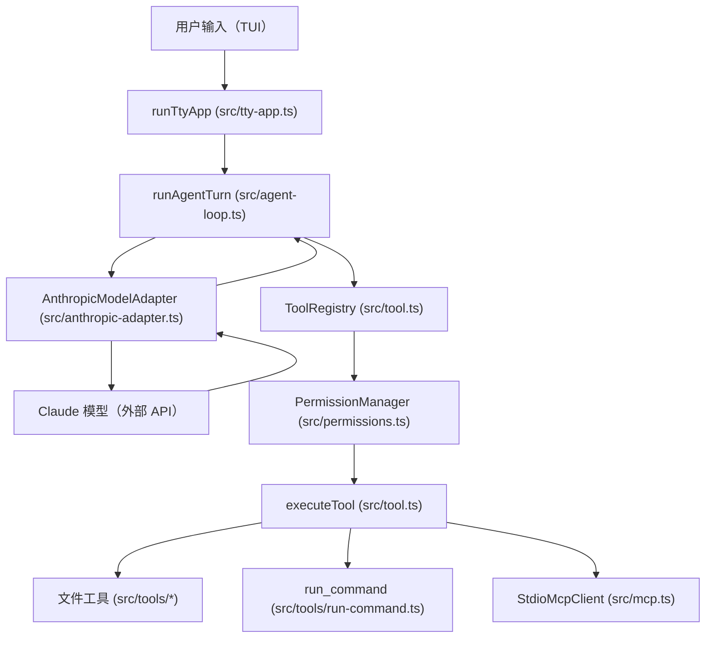
```mermaid
flowchart TD
    User["用户输入（TUI）"]
    App["runTtyApp (src/tty-app.ts)"]
    Loop["runAgentTurn (src/agent-loop.ts)"]
    Adapter["AnthropicModelAdapter (src/anthropic-adapter.ts)"]
    Model["Claude 模型（外部 API）"]
    Registry["ToolRegistry (src/tool.ts)"]
    Perms["PermissionManager (src/permissions.ts)"]
    ToolExec["executeTool (src/tool.ts)"]
    Files["文件工具 (src/tools/*)"]
    Shell["run_command (src/tools/run-command.ts)"]
    MCP["StdioMcpClient (src/mcp.ts)"]
    User --> App
    App --> Loop
    Loop --> Adapter
    Adapter --> Model
    Model --> Adapter
    Adapter --> Loop
    Loop --> Registry
    Registry --> Perms
    Perms --> ToolExec
    ToolExec --> Files
    ToolExec --> Shell
    ToolExec --> MCP
```

**来源：** [CLAUDE_CODE_PATTERNS.md7-53](https://github.com/LiuMengxuan04/MiniCode/blob/57cd741d/CLAUDE_CODE_PATTERNS.md?plain=1#L7-L53)[ROADMAP.md34-38](https://github.com/LiuMengxuan04/MiniCode/blob/57cd741d/ROADMAP.md?plain=1#L34-L38)

### 实体映射：自然语言概念与代码符号

此表格将概念性的"自然语言空间"想法映射到实现中使用的特定"代码实体空间"符号。

| 自然语言概念 | 代码实体/符号 | 文件位置 |
| --- | --- | --- |
| **"大脑"循环** | `runAgentTurn` | [src/agent-loop.ts](https://github.com/LiuMengxuan04/MiniCode/blob/57cd741d/src/agent-loop.ts) |
| **安全门卫** | `PermissionManager` | [src/permissions.ts](https://github.com/LiuMengxuan04/MiniCode/blob/57cd741d/src/permissions.ts) |
| **访问控制** | `ensurePathAccess`、`ensureCommand`、`ensureEdit` | [src/permissions.ts](https://github.com/LiuMengxuan04/MiniCode/blob/57cd741d/src/permissions.ts) |
| **文件审查** | `applyReviewedFileChange`、`buildUnifiedDiff` | [src/file-review.ts](https://github.com/LiuMengxuan04/MiniCode/blob/57cd741d/src/file-review.ts) |
| **外部插件** | `StdioMcpClient`、`mcp__server__tool` | [src/mcp.ts](https://github.com/LiuMengxuan04/MiniCode/blob/57cd741d/src/mcp.ts) |
| **工作流扩展** | `discoverSkills`、`load_skill` | [src/skills.ts](https://github.com/LiuMengxuan04/MiniCode/blob/57cd741d/src/skills.ts) |
| **终端 UI** | `runTtyApp`、`renderPanel`、`renderBanner` | [src/tty-app.ts](https://github.com/LiuMengxuan04/MiniCode/blob/57cd741d/src/tty-app.ts)[src/tui/chrome.ts](https://github.com/LiuMengxuan04/MiniCode/blob/57cd741d/src/tui/chrome.ts) |
| **上下文记忆** | `autoCompact`、`manualCompact` | [src/compact/index.ts](https://github.com/LiuMengxuan04/MiniCode/blob/57cd741d/src/compact/index.ts) |
| **Token 统计** | `recordProviderUsage`、`getAccountingResult` | [src/compact/index.ts](https://github.com/LiuMengxuan04/MiniCode/blob/57cd741d/src/compact/index.ts) |

**来源：** [CLAUDE_CODE_PATTERNS.md34-107](https://github.com/LiuMengxuan04/MiniCode/blob/57cd741d/CLAUDE_CODE_PATTERNS.md?plain=1#L34-L107)[ROADMAP.md11-32](https://github.com/LiuMengxuan04/MiniCode/blob/57cd741d/ROADMAP.md?plain=1#L11-L32)

---

## 路线图

路线图优先处理 MiniCode 与生产级运行时（如 Claude Code）之间最显著的差距。

### P0：关键运行时稳定性

- **模型感知上下文管理**：（已实现）基于 provider 用量、上下文窗口配置和两种互补的自动上下文压缩策略实现 token 统计：**Snip 压缩**（确定性移除）和**上下文折叠**（模型生成的摘要）[ROADMAP.md11-33](https://github.com/LiuMengxuan04/MiniCode/blob/57cd741d/ROADMAP.md?plain=1#L11-L33)
- **API 弹性**：（已实现）`AnthropicModelAdapter` 中 `429` 和 `5xx` 错误的指数退避和重试逻辑，包括遵守 `Retry-After` 头 [ROADMAP.md34-39](https://github.com/LiuMengxuan04/MiniCode/blob/57cd741d/ROADMAP.md?plain=1#L34-L39)
- **会话持久化**：（已实现）使用 append-only JSONL 和 `parentUuid` 树结构在 `~/.mini-code/projects/` 中按工作目录保存会话，支持分支 [ROADMAP.md40-43](https://github.com/LiuMengxuan04/MiniCode/blob/57cd741d/ROADMAP.md?plain=1#L40-L43)
- **多语言实现**：维护 Python（`MiniCode-Python`）和 Rust（`MiniCode-rs`）的配套版本以增强教育价值 [ROADMAP.md44-64](https://github.com/LiuMengxuan04/MiniCode/blob/57cd741d/ROADMAP.md?plain=1#L44-L64)

### P1：增强能力

- **分层记忆**：（已实现）支持全局（`MINI.md`）、项目和嵌套记忆层次，兼容 `CLAUDE.md` 并通过 `/init` 自动项目初始化 [ROADMAP.md67-77](https://github.com/LiuMengxuan04/MiniCode/blob/57cd741d/ROADMAP.md?plain=1#L67-L77)
- **更强的 Provider 抽象**：明确支持 OpenAI 兼容端点、OpenRouter 和 LiteLLM 风格网关 [ROADMAP.md78-88](https://github.com/LiuMengxuan04/MiniCode/blob/57cd741d/ROADMAP.md?plain=1#L78-L88)
- **任务跟踪**：用于多步骤执行跟踪的轻量级内置工具，防止代理在复杂任务中失去焦点 [ROADMAP.md89-94](https://github.com/LiuMengxuan04/MiniCode/blob/57cd741d/ROADMAP.md?plain=1#L89-L94)
- **子代理**：支持 `.claude/agents` 允许主代理委托专业子任务 [ROADMAP.md95-99](https://github.com/LiuMengxuan04/MiniCode/blob/57cd741d/ROADMAP.md?plain=1#L95-L99)

### P2：优化与完善

- **选择性工具扩展**：添加高价值的内置工具（会话/记忆/上下文管理）同时保持轻量级特性 [ROADMAP.md101-120](https://github.com/LiuMengxuan04/MiniCode/blob/57cd741d/ROADMAP.md?plain=1#L101-L120)
- **Notebook 支持**：支持编辑 Jupyter notebook，对终端工作流有用但次要 [ROADMAP.md123-125](https://github.com/LiuMengxuan04/MiniCode/blob/57cd741d/ROADMAP.md?plain=1#L123-L125)
- **评估基础设施**：用于可重复代理评估的基准测试工具和结构化跟踪捕获 [ROADMAP.md131-140](https://github.com/LiuMengxuan04/MiniCode/blob/57cd741d/ROADMAP.md?plain=1#L131-L140)
- **提示缓存**：一旦统计成熟，探索缓存策略以减少延迟和成本 [ROADMAP.md141-143](https://github.com/LiuMengxuan04/MiniCode/blob/57cd741d/ROADMAP.md?plain=1#L141-L143)

**来源：** [ROADMAP.md9-143](https://github.com/LiuMengxuan04/MiniCode/blob/57cd741d/ROADMAP.md?plain=1#L9-L143)

---

## 实现范围

MiniCode 有意排除某些复杂功能以保持可维护性：

| 已包含（当前） | 已排除（计划或超出范围） |
| --- | --- |
| `model -> tool -> model` 框架 [CLAUDE_CODE_PATTERNS.md18-20](https://github.com/LiuMengxuan04/MiniCode/blob/57cd741d/CLAUDE_CODE_PATTERNS.md?plain=1#L18-L20) | 重型规划子系统 [ROADMAP.md91-93](https://github.com/LiuMengxuan04/MiniCode/blob/57cd741d/ROADMAP.md?plain=1#L91-L93) |
| 统一工具协议 [CLAUDE_CODE_PATTERNS.md52-53](https://github.com/LiuMengxuan04/MiniCode/blob/57cd741d/CLAUDE_CODE_PATTERNS.md?plain=1#L52-L53) | 机械追求完整工具数量对等 [ROADMAP.md118-120](https://github.com/LiuMengxuan04/MiniCode/blob/57cd741d/ROADMAP.md?plain=1#L118-L120) |
| 路径/命令权限 [CLAUDE_CODE_PATTERNS.md71-73](https://github.com/LiuMengxuan04/MiniCode/blob/57cd741d/CLAUDE_CODE_PATTERNS.md?plain=1#L71-L73) | 框架重型重写 [CONTRIBUTING.md22-23](https://github.com/LiuMengxuan04/MiniCode/blob/57cd741d/CONTRIBUTING.md?plain=1#L22-L23) |
| 本地 skills 和 MCP [CLAUDE_CODE_PATTERNS.md80-97](https://github.com/LiuMengxuan04/MiniCode/blob/57cd741d/CLAUDE_CODE_PATTERNS.md?plain=1#L80-L97) | 隐藏魔法或深度间接 [CONTRIBUTING.md75-80](https://github.com/LiuMengxuan04/MiniCode/blob/57cd741d/CONTRIBUTING.md?plain=1#L75-L80) |
| 统一 Diff 审查 [CLAUDE_CODE_PATTERNS.md72](https://github.com/LiuMengxuan04/MiniCode/blob/57cd741d/CLAUDE_CODE_PATTERNS.md?plain=1#L72-L72) | 不相关的终端代理发明 [CONTRIBUTING.md34-35](https://github.com/LiuMengxuan04/MiniCode/blob/57cd741d/CONTRIBUTING.md?plain=1#L34-L35) |
| Provider 报告的 token 用量 [CLAUDE_CODE_PATTERNS.md115-117](https://github.com/LiuMengxuan04/MiniCode/blob/57cd741d/CLAUDE_CODE_PATTERNS.md?plain=1#L115-L117) | 仅估计的 token 统计 [CLAUDE_CODE_PATTERNS.md112-113](https://github.com/LiuMengxuan04/MiniCode/blob/57cd741d/CLAUDE_CODE_PATTERNS.md?plain=1#L112-L113) |

**来源：** [CLAUDE_CODE_PATTERNS.md1-187](https://github.com/LiuMengxuan04/MiniCode/blob/57cd741d/CLAUDE_CODE_PATTERNS.md?plain=1#L1-L187)[CONTRIBUTING.md11-35](https://github.com/LiuMengxuan04/MiniCode/blob/57cd741d/CONTRIBUTING.md?plain=1#L11-L35)[ROADMAP.md89-120](https://github.com/LiuMengxuan04/MiniCode/blob/57cd741d/ROADMAP.md?plain=1#L89-L120)
# 核心代理循环
相关源文件
- [ARCHITECTURE.md](https://github.com/LiuMengxuan04/MiniCode/blob/57cd741d/ARCHITECTURE.md?plain=1)
- [ARCHITECTURE_ZH.md](https://github.com/LiuMengxuan04/MiniCode/blob/57cd741d/ARCHITECTURE_ZH.md?plain=1)
- [src/agent-loop.ts](https://github.com/LiuMengxuan04/MiniCode/blob/57cd741d/src/agent-loop.ts)
- [src/index.ts](https://github.com/LiuMengxuan04/MiniCode/blob/57cd741d/src/index.ts)

**核心代理循环**是 MiniCode 的核心执行引擎。它协调大语言模型（LLM）与工具执行环境之间的迭代循环。该循环使代理能够推理任务、调用工具来观察或修改文件系统，并根据工具输出调整其行动，直到最终解决方案达成。

该循环设计为具有弹性，能够处理常见的 LLM 失败模式，如空响应、"思考"阶段期间的 token 限制耗尽以及工具错误的恢复。它还集成了上下文管理功能，以保持对话在模型限制范围内。

### 高级架构

该循环通过向 `ModelAdapter` 传递一个不断增长的 `ChatMessage` 对象列表来运行。适配器与 LLM API（通常是 Anthropic）通信，并返回一个 `AgentStep`，其中包含文本响应或一组工具调用。

#### 循环组件关系

下图说明了核心循环如何将高级意图（自然语言空间）桥接到具体的系统操作（代码实体空间）。

标题：代理循环组件交互

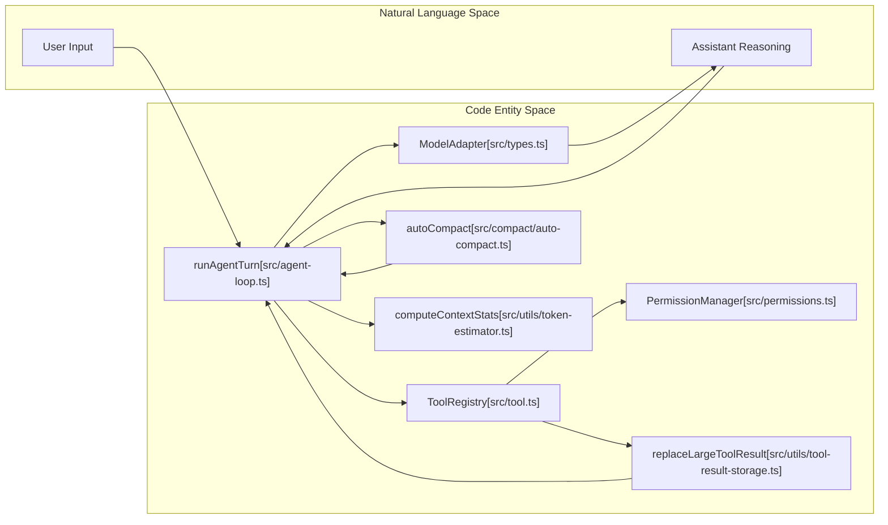
```mermaid
flowchart LR
    subgraph CodeEntitySpace ["Code Entity Space"]
        Loop["runAgentTurn#91;src/agent-loop.ts#93;"]
        Adapter["ModelAdapter#91;src/types.ts#93;"]
        Registry["ToolRegistry#91;src/tool.ts#93;"]
        Perms["PermissionManager#91;src/permissions.ts#93;"]
        Compactor["autoCompact#91;src/compact/auto-compact.ts#93;"]
        Stats["computeContextStats#91;src/utils/token-estimator.ts#93;"]
        Storage["replaceLargeToolResult#91;src/utils/tool-result-storage.ts#93;"]
    end
    subgraph NaturalLanguageSpace ["Natural Language Space"]
        UserPrompt["User Input"]
        AssistantReasoning["Assistant Reasoning"]
    end
    UserPrompt --> Loop
    Loop --> Adapter
    Adapter --> AssistantReasoning
    AssistantReasoning --> Loop
    Loop --> Registry
    Registry --> Perms
    Registry --> Storage
    Storage --> Loop
    Loop --> Stats
    Loop --> Compactor
    Compactor --> Loop
```

Sources: [src/agent-loop.ts112-130](https://github.com/LiuMengxuan04/MiniCode/blob/57cd741d/src/agent-loop.ts#L112-L130)[src/types.ts88-90](https://github.com/LiuMengxuan04/MiniCode/blob/57cd741d/src/types.ts#L88-L90)[src/compact/auto-compact.ts11-20](https://github.com/LiuMengxuan04/MiniCode/blob/57cd741d/src/compact/auto-compact.ts#L11-L20)[src/utils/token-estimator.ts22](https://github.com/LiuMengxuan04/MiniCode/blob/57cd741d/src/utils/token-estimator.ts#L22-L22)[src/utils/tool-result-storage.ts55-57](https://github.com/LiuMengxuan04/MiniCode/blob/57cd741d/src/utils/tool-result-storage.ts#L55-L57)

---

### 关键组件

#### 1. Agent Turn Orchestrator

`src/agent-loop.ts` 中的 `runAgentTurn` 函数管理单个多步骤交互的状态。它跟踪空响应的重试次数（`emptyResponseRetryCount`）并处理"思考"中断。它管理"进度"更新和"最终"答案之间的转换，确保工具结果被正确格式化为下一次迭代的 `tool_result` 消息。[src/agent-loop.ts112-138](https://github.com/LiuMengxuan04/MiniCode/blob/57cd741d/src/agent-loop.ts#L112-L138)

详情请参见[代理轮次生命周期](/LiuMengxuan04/MiniCode/2.1-agent-turn-lifecycle)。

#### 2. Model Adapter

`ModelAdapter` 接口抽象了特定的 LLM 提供商。虽然 `AnthropicModelAdapter` 是主要实现 [src/anthropic-adapter.ts25-26](https://github.com/LiuMengxuan04/MiniCode/blob/57cd741d/src/anthropic-adapter.ts#L25-L26)，但系统还包括用于离线测试的 `MockModelAdapter`。[src/mock-model.ts24-25](https://github.com/LiuMengxuan04/MiniCode/blob/57cd741d/src/mock-model.ts#L24-L25) 适配器负责 `next(messages)` 调用，返回结构化的 `AgentStep`。[src/types.ts88-90](https://github.com/LiuMengxuan04/MiniCode/blob/57cd741d/src/types.ts#L88-L90)

详情请参见[模型适配器与 API 集成](/LiuMengxuan04/MiniCode/2.2-model-adapter-and-api-integration)。

#### 3. 系统提示词构建

在循环开始之前，会生成一个系统提示词来定义代理的能力。该提示词使用 `src/prompt.ts` 中的 `buildSystemPrompt` 构建，整合了权限上下文、发现的 skills 和活动的 MCP 服务器。[src/index.ts85-93](https://github.com/LiuMengxuan04/MiniCode/blob/57cd741d/src/index.ts#L85-L93)

详情请参见[系统提示词构建](/LiuMengxuan04/MiniCode/2.3-system-prompt-construction)。

#### 4. 上下文压缩

MiniCode 采用多层策略来管理模型的上下文窗口：

- **精简压缩**：通过 `snipCompactConversation` 确定性地移除中间历史记录以保护文件编辑和错误 [src/agent-loop.ts182-190](https://github.com/LiuMengxuan04/MiniCode/blob/57cd741d/src/agent-loop.ts#L182-L190)[src/compact/snipCompact.ts19-21](https://github.com/LiuMengxuan04/MiniCode/blob/57cd741d/src/compact/snipCompact.ts#L19-L21)
- **微压缩**：在 50% 利用率时对旧工具结果进行轻量级清理 [src/agent-loop.ts197-201](https://github.com/LiuMengxuan04/MiniCode/blob/57cd741d/src/agent-loop.ts#L197-L201)[src/compact/microcompact.ts10](https://github.com/LiuMengxuan04/MiniCode/blob/57cd741d/src/compact/microcompact.ts#L10-L10)
- **上下文折叠**：识别对话中可摘要的跨度，使用 `applyContextCollapseIfNeeded` 将其替换为摘要 [src/agent-loop.ts203-210](https://github.com/LiuMengxuan04/MiniCode/blob/57cd741d/src/agent-loop.ts#L203-L210)[src/compact/context-collapse.ts12-17](https://github.com/LiuMengxuan04/MiniCode/blob/57cd741d/src/compact/context-collapse.ts#L12-L17)
- **自动压缩**：当上下文利用率达到临界水平（85%）时触发基于 LLM 的摘要生成 [src/agent-loop.ts222-227](https://github.com/LiuMengxuan04/MiniCode/blob/57cd741d/src/agent-loop.ts#L222-L227)[src/compact/auto-compact.ts11](https://github.com/LiuMengxuan04/MiniCode/blob/57cd741d/src/compact/auto-compact.ts#L11-L11)

详情请参见[上下文压缩](/LiuMengxuan04/MiniCode/2.4-context-compaction)。

---

### 执行周期

该循环遵循严格的顺序以确保安全性和正确性：

1. **Token 估算**：使用 `computeContextStats` 计算当前使用量 [src/agent-loop.ts179](https://github.com/LiuMengxuan04/MiniCode/blob/57cd741d/src/agent-loop.ts#L179-L179)
2. **推理前压缩**：应用 `snipCompactConversation`、`microcompact` 和 `applyContextCollapseIfNeeded` 来准备消息列表 [src/agent-loop.ts181-218](https://github.com/LiuMengxuan04/MiniCode/blob/57cd741d/src/agent-loop.ts#L181-L218)
3. **模型推理**：调用 `args.model.next(modelMessages)` 获取 `AgentStep` [src/agent-loop.ts237](https://github.com/LiuMengxuan04/MiniCode/blob/57cd741d/src/agent-loop.ts#L237-L237)
4. **步骤处理**：

- **助手消息**：如果模型返回文本，则通过 `onAssistantMessage` 处理 [src/agent-loop.ts314-316](https://github.com/LiuMengxuan04/MiniCode/blob/57cd741d/src/agent-loop.ts#L314-L316)
- **工具调用**：如果模型返回 `tool_calls`，循环遍历每个调用 [src/agent-loop.ts430-435](https://github.com/LiuMengxuan04/MiniCode/blob/57cd741d/src/agent-loop.ts#L430-L435)
5. **执行与存储**：捕获工具结果，大输出可能通过 `replaceLargeToolResult` 卸载到本地存储 `~/.mini-code/tool-results/` [src/agent-loop.ts469-474](https://github.com/LiuMengxuan04/MiniCode/blob/57cd741d/src/agent-loop.ts#L469-L474)[src/ARCHITECTURE.md74-75](https://github.com/LiuMengxuan04/MiniCode/blob/57cd741d/src/ARCHITECTURE.md?plain=1#L74-L75)
6. **反馈循环**：结果被追加到消息历史，循环继续直到完成或达到 `maxSteps` [src/agent-loop.ts174](https://github.com/LiuMengxuan04/MiniCode/blob/57cd741d/src/agent-loop.ts#L174-L174)

#### 数据流：从意图到执行

下图展示了工具调用如何从模型通过适配器和循环进入实际执行。

标题：工具执行数据流

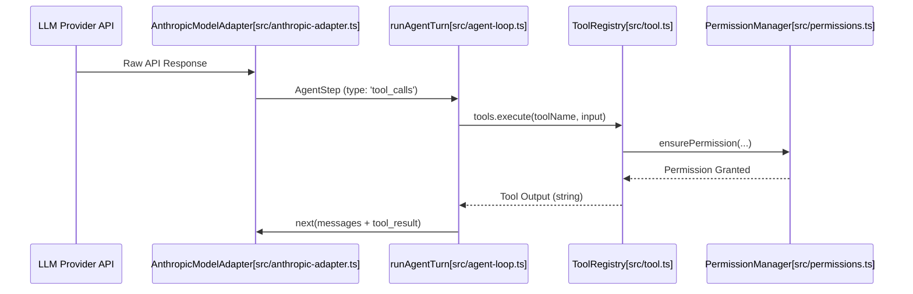
```mermaid
sequenceDiagram
    participant M as LLM Provider API
    participant A as AnthropicModelAdapter[src/anthropic-adapter.ts]
    participant L as runAgentTurn[src/agent-loop.ts]
    participant T as ToolRegistry[src/tool.ts]
    participant P as PermissionManager[src/permissions.ts]
    M->>A: Raw API Response
    A->>L: AgentStep (type: 'tool_calls')
    L->>T: tools.execute(toolName, input)
    T->>P: ensurePermission(...)
    P-->>T: Permission Granted
    T-->>L: Tool Output (string)
    L->>A: next(messages + tool_result)
```

Sources: [src/agent-loop.ts237-240](https://github.com/LiuMengxuan04/MiniCode/blob/57cd741d/src/agent-loop.ts#L237-L240)[src/agent-loop.ts430-440](https://github.com/LiuMengxuan04/MiniCode/blob/57cd741d/src/agent-loop.ts#L430-L440)[src/types.ts69-87](https://github.com/LiuMengxuan04/MiniCode/blob/57cd741d/src/types.ts#L69-L87)[src/agent-loop.ts480-485](https://github.com/LiuMengxuan04/MiniCode/blob/57cd741d/src/agent-loop.ts#L480-L485)

### 弹性与错误处理

该循环包含处理长时间运行代理任务中经常出现的边缘情况的特定逻辑：

| 功能 | 实现 | 目的 |
| --- | --- | --- |
| **空响应重试** | `emptyResponseRetryCount` | 如果模型在工具执行后返回无内容，则重试模型最多 3 次 [src/agent-loop.ts255-265](https://github.com/LiuMengxuan04/MiniCode/blob/57cd741d/src/agent-loop.ts#L255-L265) |
| **可恢复思考** | `isRecoverableThinkingStop` | 检测模型是否在"思考"块期间遇到 `max_tokens` 或 `pause_turn`，并提示其继续 [src/agent-loop.ts92-110](https://github.com/LiuMengxuan04/MiniCode/blob/57cd741d/src/agent-loop.ts#L92-L110) |
| **诊断** | `formatDiagnostics` | 将 `stop_reason` 和 `block_types` 附加到内部日志以帮助调试模型截断 [src/agent-loop.ts70-90](https://github.com/LiuMengxuan04/MiniCode/blob/57cd741d/src/agent-loop.ts#L70-L90) |
| **上下文监控** | `computeContextStats` | 计算 token 使用量并在接近限制时触发警告或压缩 [src/agent-loop.ts179-180](https://github.com/LiuMengxuan04/MiniCode/blob/57cd741d/src/agent-loop.ts#L179-L180) |
| **预算强制执行** | `applyToolResultBudget` | 截断超出大小限制的工具结果以防止上下文溢出 [src/agent-loop.ts462-468](https://github.com/LiuMengxuan04/MiniCode/blob/57cd741d/src/agent-loop.ts#L462-L468) |

Sources: [src/agent-loop.ts70-110](https://github.com/LiuMengxuan04/MiniCode/blob/57cd741d/src/agent-loop.ts#L70-L110)[src/agent-loop.ts179-180](https://github.com/LiuMengxuan04/MiniCode/blob/57cd741d/src/agent-loop.ts#L179-L180)[src/agent-loop.ts255-265](https://github.com/LiuMengxuan04/MiniCode/blob/57cd741d/src/agent-loop.ts#L255-L265)[src/utils/tool-result-storage.ts24-29](https://github.com/LiuMengxuan04/MiniCode/blob/57cd741d/src/utils/tool-result-storage.ts#L24-L29)

---

# 代理轮次生命周期
相关源文件
- [src/agent-loop.ts](https://github.com/LiuMengxuan04/MiniCode/blob/57cd741d/src/agent-loop.ts)
- [src/background-tasks.ts](https://github.com/LiuMengxuan04/MiniCode/blob/57cd741d/src/background-tasks.ts)
- [src/mcp-status.ts](https://github.com/LiuMengxuan04/MiniCode/blob/57cd741d/src/mcp-status.ts)
- [src/types.ts](https://github.com/LiuMengxuan04/MiniCode/blob/57cd741d/src/types.ts)

**代理轮次生命周期**是指 MiniCode 中的执行循环，其中模型的意图被转换为具体操作（工具调用或消息），结果被反馈以维持上下文。此生命周期主要由 `src/agent-loop.ts` 中的 `runAgentTurn` 函数管理 [[src/agent-loop.ts:112-130]]()。

## `runAgentTurn` 编排

`runAgentTurn` 函数是 MiniCode 的核心引擎。它管理单个用户交互中的一系列"步骤"，允许代理思考、调用工具、处理结果并继续，直到达到最终答案或达到限制 [[src/agent-loop.ts:174-174]]()。

### 核心执行流程

1. **上下文维护**：在每个步骤开始时，循环执行几个维护任务：

- **精简压缩**：检查对话是否超出模型的上下文窗口，必要时截断旧消息 [[src/agent-loop.ts:182-194]]()。
- **微压缩**：清理并减小消息历史中先前工具结果的大小 [[src/agent-loop.ts:196-201]]()。
- **上下文折叠**：将长文本块折叠为标记以节省 token [[src/agent-loop.ts:203-218]]()。
- **自动压缩**：在轮次的第一个步骤，如果上下文 token 处于"临界"或"阻塞"水平，则触发基于 LLM 的摘要生成 [[src/agent-loop.ts:222-237]]()。
2. **模型推理**：循环调用 `args.model.next(modelMessages)` 获取下一个 `AgentStep` [[src/agent-loop.ts:241-241]]()。
3. **步骤分类**：响应被分类为 `assistant` 消息（文本）或 `tool_calls` [[src/types.ts:69-86]]()。
4. **工具执行**：如果存在工具调用，则使用 `ToolRegistry` 查找并执行请求的工具 [[src/agent-loop.ts:406-435]]()。
5. **反馈循环**：工具结果（或错误消息）作为 `tool_result` 角色追加到 `messages` 数组 [[src/agent-loop.ts:466-472]]()。
6. **继续**：循环重复直到模型提供最终响应或达到 `maxSteps` 限制 [[src/agent-loop.ts:174-174]]()。

### 代理轮次状态机

下图说明了 `runAgentTurn` 如何根据 `ModelAdapter` 输出在不同的状态之间转换。

**图 1: runAgentTurn 逻辑流程**

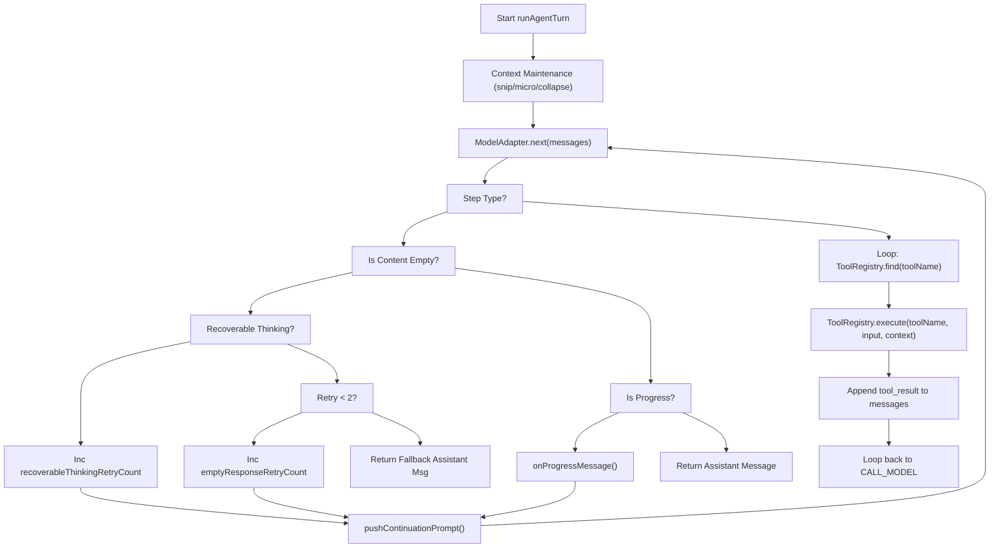
```mermaid
flowchart TD
    START["Start runAgentTurn"]
    MAINT["Context Maintenance (snip/micro/collapse)"]
    CALL_MODEL["ModelAdapter.next(messages)"]
    TYPE_CHECK["Step Type?"]
    EMPTY_CHECK["Is Content Empty?"]
    RECOVER_THINKING["Recoverable Thinking?"]
    RETRY_THINK["Inc recoverableThinkingRetryCount"]
    CONT_PROMPT["pushContinuationPrompt()"]
    EMPTY_RETRY["Retry < 2?"]
    INC_EMPTY["Inc emptyResponseRetryCount"]
    TERM_EMPTY["Return Fallback Assistant Msg"]
    PROGRESS_CHECK["Is Progress?"]
    ON_PROGRESS["onProgressMessage()"]
    TERM_FINAL["Return Assistant Message"]
    DISPATCH_TOOLS["Loop: ToolRegistry.find(toolName)"]
    EXEC_TOOL["ToolRegistry.execute(toolName, input, context)"]
    TOOL_RESULT["Append tool_result to messages"]
    NEXT_STEP["Loop back to CALL_MODEL"]
    START --> MAINT
    MAINT --> CALL_MODEL
    CALL_MODEL --> TYPE_CHECK
    TYPE_CHECK --> EMPTY_CHECK
    EMPTY_CHECK --> RECOVER_THINKING
    RECOVER_THINKING --> RETRY_THINK
    RETRY_THINK --> CONT_PROMPT
    CONT_PROMPT --> CALL_MODEL
    RECOVER_THINKING --> EMPTY_RETRY
    EMPTY_RETRY --> INC_EMPTY
    INC_EMPTY --> CONT_PROMPT
    EMPTY_RETRY --> TERM_EMPTY
    EMPTY_CHECK --> PROGRESS_CHECK
    PROGRESS_CHECK --> ON_PROGRESS
    ON_PROGRESS --> CONT_PROMPT
    PROGRESS_CHECK --> TERM_FINAL
    TYPE_CHECK --> DISPATCH_TOOLS
    DISPATCH_TOOLS --> EXEC_TOOL
    EXEC_TOOL --> TOOL_RESULT
    TOOL_RESULT --> NEXT_STEP
```

Sources: `<FileRef file-url="https://github.com/LiuMengxuan04/MiniCode/blob/57cd741d/src/agent-loop.ts#L112-L515" min=112 max=515 file-path="src/agent-loop.ts">Hii</FileRef>`, `<FileRef file-url="https://github.com/LiuMengxuan04/MiniCode/blob/57cd741d/src/types.ts#L69-L86" min=69 max=86 file-path="src/types.ts">Hii</FileRef>`

## 消息组装与协议

MiniCode 使用结构化方法来区分中间更新和最终答案。这确保 UI 在长时间运行任务期间保持响应。

### 协议标记

- **进度更新**：如果 `next.kind` 是 `'progress'`，则该消息被视为状态更新，轮次继续 [[src/agent-loop.ts:250-264]]()。
- **思考块**：如果提供商返回内部推理，则存储在 `assistant_thinking` 消息中 [[src/agent-loop.ts:163-172]]() 并与步骤关联 [[src/types.ts:74-74]]()。
- **最终答案**：标准助手消息（非空、非进度）终止循环并返回给调用者 [[src/agent-loop.ts:365-368]]()。

### 消息角色

系统利用 `src/types.ts` 中定义的几个专门角色来跟踪状态：

| 角色 | 描述 |
| --- | --- |
| `system` | 基本指令和环境上下文 [[src/types.ts:24-24]]()。 |
| `assistant_thinking` | 包含内部模型推理块 [[src/types.ts:26-26]]()。 |
| `assistant_progress` | 不终止轮次的中级状态更新 [[src/types.ts:28-28]]()。 |
| `assistant_tool_call` | 模型执行特定工具的请求 [[src/types.ts:29-34]]()。 |
| `tool_result` | 工具执行的输出（stdout/stderr/error）[[src/types.ts:35-41]]()。 |
| `context_summary` | 在基于 LLM 的压缩期间使用的截断对话历史摘要 [[src/types.ts:42-47]]()。 |
| `snip_boundary` | 指示消息被移除以适应上下文窗口的标记 [[src/types.ts:48-55]]()。 |

Sources: `<FileRef file-url="https://github.com/LiuMengxuan04/MiniCode/blob/57cd741d/src/types.ts#L23-L55" min=23 max=55 file-path="src/types.ts">Hii</FileRef>`, `<FileRef file-url="https://github.com/LiuMengxuan04/MiniCode/blob/57cd741d/src/agent-loop.ts#L163-L172" min=163 max=172 file-path="src/agent-loop.ts">Hii</FileRef>`, `<FileRef file-url="https://github.com/LiuMengxuan04/MiniCode/blob/57cd741d/src/agent-loop.ts#L466-L472" min=466 max=472 file-path="src/agent-loop.ts">Hii</FileRef>`

## 工具调度与上下文

当模型发出 `tool_calls` 时，`runAgentTurn` 遍历它们并针对 `ToolRegistry` 执行。

1. **查找**：循环使用 `args.tools.find(call.toolName)` 找到工具定义 [[src/agent-loop.ts:407-407]]()。
2. **上下文注入**：为每个工具提供 `ToolContext`，包含当前 `cwd`、`PermissionManager` 和处理输出的方法 [[src/agent-loop.ts:417-422]]()。
3. **大结果处理**：工具输出根据预算进行检查。如果太大，它们存储在 `ContentReplacementState` 中并替换为指针以节省 token [[src/agent-loop.ts:446-455]]()。

**图 2：工具执行上下文**

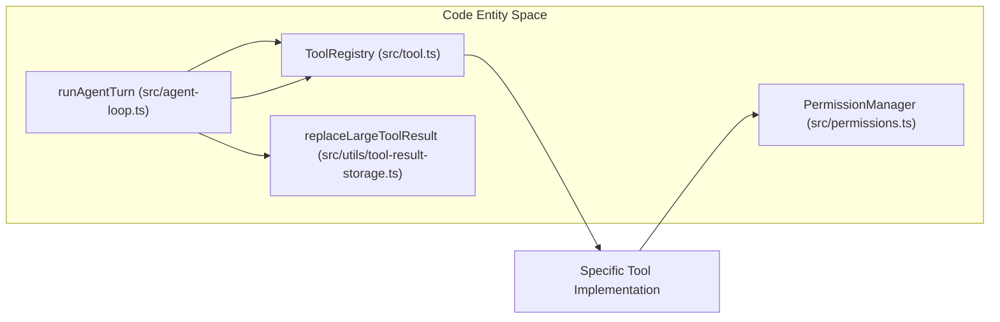
```mermaid
flowchart LR
    TOOL_IMPL["Specific Tool Implementation"]
    subgraph subGraph0 ["Code Entity Space"]
        RAT["runAgentTurn (src/agent-loop.ts)"]
        TR["ToolRegistry (src/tool.ts)"]
        PM["PermissionManager (src/permissions.ts)"]
        TRS["replaceLargeToolResult (src/utils/tool-result-storage.ts)"]
    end
    RAT --> TR
    RAT --> TR
    TR --> TOOL_IMPL
    TOOL_IMPL --> PM
    RAT --> TRS
```

Sources: `<FileRef file-url="https://github.com/LiuMengxuan04/MiniCode/blob/57cd741d/src/agent-loop.ts#L406-L455" min=406 max=455 file-path="src/agent-loop.ts">Hii</FileRef>`, `<FileRef file-url="https://github.com/LiuMengxuan04/MiniCode/blob/57cd741d/src/tool.ts#L91-L124" min=91 max=124 file-path="src/tool.ts">Hii</FileRef>`, `<FileRef file-url="https://github.com/LiuMengxuan04/MiniCode/blob/57cd741d/src/utils/tool-result-storage.ts#L114-L124" min=114 max=124 file-path="src/utils/tool-result-storage.ts">Hii</FileRef>`

## 处理边缘情况

### 可恢复停止

MiniCode 识别"可恢复的思考停止"，即模型在完成思考过程之前暂停（例如由于 `max_tokens` 或 `pause_turn` 信号）。

- **检测**：通过 `isRecoverableThinkingStop` 检查 [[src/agent-loop.ts:92-110]]()。
- **恢复**：如果停止原因是 `max_tokens` 或 `pause_turn` 且模型处于 `thinking` 块中，循环注入继续提示：*"Your previous response hit max_tokens during thinking... Resume immediately"* [[src/agent-loop.ts:289-293]]()。

### 空响应

如果模型返回空字符串：

1. **重试**：循环通过发送用户消息请求模型继续来进行最多 2 次重试 [[src/agent-loop.ts:316-324]]()。
2. **回退**：如果重试失败，它通过 `formatDiagnostics` 生成诊断消息（例如"Model returned an empty response, turn stopped"）并优雅地终止轮次 [[src/agent-loop.ts:331-360]]()。

### 终止条件

当满足以下条件时轮次终止：

1. 模型返回非空的 `assistant` 消息且未标记为 `progress` [[src/agent-loop.ts:365-368]]()。
2. 达到 `maxSteps` 限制（防止无限循环）[[src/agent-loop.ts:174-174]]()。
3. 发生不可恢复的空响应 [[src/agent-loop.ts:331-360]]()。

Sources: `<FileRef file-url="https://github.com/LiuMengxuan04/MiniCode/blob/57cd741d/src/agent-loop.ts#L31-L110" min=31 max=110 file-path="src/agent-loop.ts">Hii</FileRef>`, `<FileRef file-url="https://github.com/LiuMengxuan04/MiniCode/blob/57cd741d/src/agent-loop.ts#L174-L515" min=174 max=515 file-path="src/agent-loop.ts">Hii</FileRef>`

---

# 模型适配器与 API 集成
相关源文件
- [src/anthropic-adapter.ts](https://github.com/LiuMengxuan04/MiniCode/blob/57cd741d/src/anthropic-adapter.ts)
- [src/mock-model.ts](https://github.com/LiuMengxuan04/MiniCode/blob/57cd741d/src/mock-model.ts)
- [src/utils/errors.ts](https://github.com/LiuMengxuan04/MiniCode/blob/57cd741d/src/utils/errors.ts)
- [test/anthropic-thinking-roundtrip.test.ts](https://github.com/LiuMengxuan04/MiniCode/blob/57cd741d/test/anthropic-thinking-roundtrip.test.ts)

模型适配器层抽象了大语言模型（LLM）通信的复杂性，为代理循环提供与不同后端交互的统一接口。主要实现是 `AnthropicModelAdapter`，它处理内部聊天消息到 Anthropic 兼容负载的转换，管理 token 限制，并通过指数退避实现强大的错误恢复。

## AnthropicModelAdapter

`AnthropicModelAdapter` [src/anthropic-adapter.ts292](https://github.com/LiuMengxuan04/MiniCode/blob/57cd741d/src/anthropic-adapter.ts#L292-L292) 实现了 `ModelAdapter` 接口 [src/types.ts4](https://github.com/LiuMengxuan04/MiniCode/blob/57cd741d/src/types.ts#L4-L4) 它负责编排单个模型请求的生命周期，从负载构建到响应解析。

### 消息转换管道

MiniCode 在内部使用标准化的 `ChatMessage` 格式。适配器使用 `toAnthropicMessages` [src/anthropic-adapter.ts234-290](https://github.com/LiuMengxuan04/MiniCode/blob/57cd741d/src/anthropic-adapter.ts#L234-L290) 将这些转换为 Anthropic Messages API 所需的具体嵌套结构

1. **系统提示词提取**：所有 `role: 'system'` 的消息被过滤并用双换行符连接 [src/anthropic-adapter.ts238-241](https://github.com/LiuMengxuan04/MiniCode/blob/57cd741d/src/anthropic-adapter.ts#L238-L241)
2. **角色映射**：

- `user` 消息通过 `toTextBlock` 映射到 Anthropic `user` 角色和文本块 [src/anthropic-adapter.ts248-251](https://github.com/LiuMengxuan04/MiniCode/blob/57cd741d/src/anthropic-adapter.ts#L248-L251)
- `assistant_thinking` 块（用于具有内部推理的模型如 Claude 3.7 或 DeepSeek）被保留并作为 `assistant` 内容块推送 [src/anthropic-adapter.ts253-258](https://github.com/LiuMengxuan04/MiniCode/blob/57cd741d/src/anthropic-adapter.ts#L253-L258)
- `assistant` 和 `assistant_progress` 映射到 Anthropic `assistant` 角色，进度消息通过 `toAssistantText` 包装在 `<progress>` 标签中 [src/anthropic-adapter.ts210-218](https://github.com/LiuMengxuan04/MiniCode/blob/57cd741d/src/anthropic-adapter.ts#L210-L218)[src/anthropic-adapter.ts260-267](https://github.com/LiuMengxuan04/MiniCode/blob/57cd741d/src/anthropic-adapter.ts#L260-L267)
- `assistant_tool_call` 映射到 `tool_use` 内容块 [src/anthropic-adapter.ts269-277](https://github.com/LiuMengxuan04/MiniCode/blob/57cd741d/src/anthropic-adapter.ts#L269-L277)
- `context_summary` 作为 `user` 消息注入，带有 `buildAnthropicSnipBoundaryText` 的特定标题和边界文本 [src/anthropic-adapter.ts279-284](https://github.com/LiuMengxuan04/MiniCode/blob/57cd741d/src/anthropic-adapter.ts#L279-L284)
- `tool_result` 映射到 `user` 消息内的 `tool_result` 块，包括 `is_error` 状态 [src/anthropic-adapter.ts286-290](https://github.com/LiuMengxuan04/MiniCode/blob/57cd741d/src/anthropic-adapter.ts#L286-L290)
3. **消息合并**：具有相同角色的相邻块通过 `pushAnthropicMessage` 合并为具有多个内容块的单个 `AnthropicMessage` [src/anthropic-adapter.ts220-232](https://github.com/LiuMengxuan04/MiniCode/blob/57cd741d/src/anthropic-adapter.ts#L220-L232)

### 数据流：从内部空间到外部空间

The following diagram illustrates how internal code entities are mapped to the Anthropic API structure, specifically highlighting the handling of thinking blocks and tool lifecycle.

**图：消息实体映射**

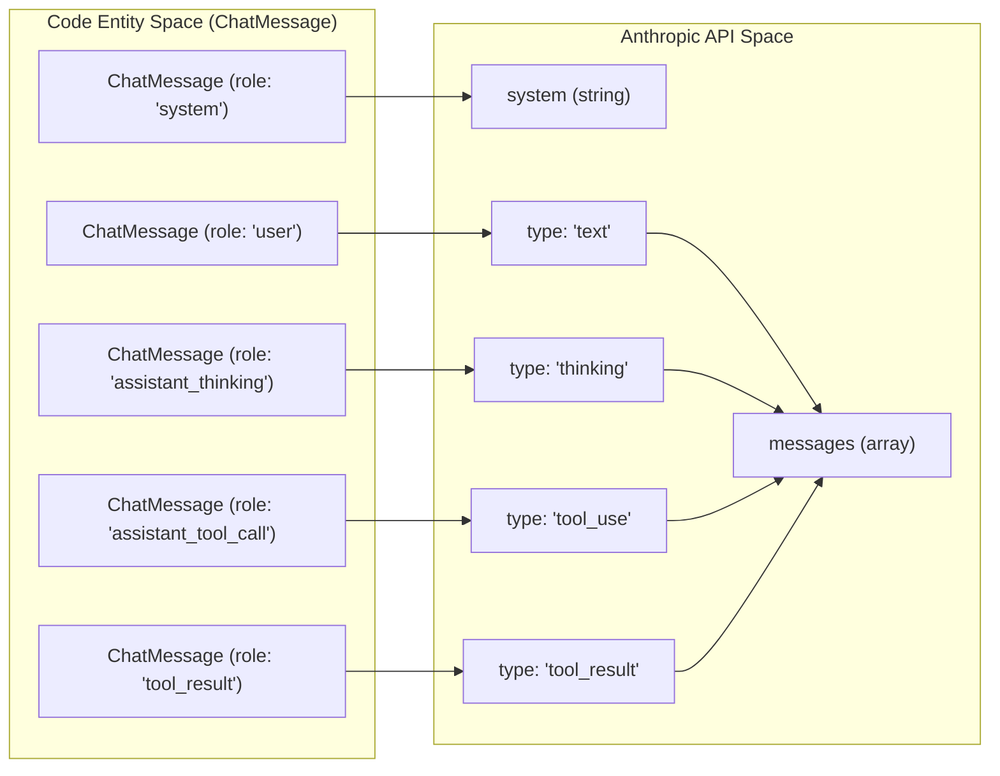
```mermaid
flowchart LR
    subgraph subGraph1 ["Anthropic API Space"]
        S["system (string)"]
        M["messages (array)"]
        TH["type: 'thinking'"]
        TU["type: 'tool_use'"]
        TR["type: 'tool_result'"]
        TX["type: 'text'"]
    end
    subgraph subGraph0 ["Code Entity Space (ChatMessage)"]
        A["ChatMessage (role: 'system')"]
        B["ChatMessage (role: 'user')"]
        C["ChatMessage (role: 'assistant_thinking')"]
        D["ChatMessage (role: 'assistant_tool_call')"]
        E["ChatMessage (role: 'tool_result')"]
    end
    A --> S
    B --> TX
    C --> TH
    D --> TU
    E --> TR
    TX --> M
    TH --> M
    TU --> M
    TR --> M
```

Sources: [src/anthropic-adapter.ts18-34](https://github.com/LiuMengxuan04/MiniCode/blob/57cd741d/src/anthropic-adapter.ts#L18-L34)[src/anthropic-adapter.ts234-290](https://github.com/LiuMengxuan04/MiniCode/blob/57cd741d/src/anthropic-adapter.ts#L234-L290)[src/types.ts2-9](https://github.com/LiuMengxuan04/MiniCode/blob/57cd741d/src/types.ts#L2-L9)

## Token 限制管理

MiniCode 根据模型字符串动态计算最大输出 token，以防止 API 错误并优化上下文使用。

- **解析逻辑**：适配器内调用 `resolveMaxOutputTokens` 函数 [src/anthropic-adapter.ts11](https://github.com/LiuMengxuan04/MiniCode/blob/57cd741d/src/anthropic-adapter.ts#L11-L11) 来确定 API 调用的 `max_tokens` 参数。
- **DeepSeek 处理**：存在针对 `deepseek-v4-flash` 或 `deepseek-reasoner` 等模型的特定逻辑，这些模型可能需要更大的输出窗口用于思考块 [test/anthropic-thinking-roundtrip.test.ts66-71](https://github.com/LiuMengxuan04/MiniCode/blob/57cd741d/test/anthropic-thinking-roundtrip.test.ts#L66-L71)

Sources: [src/anthropic-adapter.ts11](https://github.com/LiuMengxuan04/MiniCode/blob/57cd741d/src/anthropic-adapter.ts#L11-L11)[test/anthropic-thinking-roundtrip.test.ts65-71](https://github.com/LiuMengxuan04/MiniCode/blob/57cd741d/test/anthropic-thinking-roundtrip.test.ts#L65-L71)

## 重试与退避逻辑

适配器实现逻辑来处理临时网络问题和速率限制（HTTP 429/5xx）。

1. **重试资格**：只有状态码 429 和 500-599 通过 `shouldRetryStatus` 触发重试 [src/anthropic-adapter.ts50-52](https://github.com/LiuMengxuan04/MiniCode/blob/57cd741d/src/anthropic-adapter.ts#L50-L52)
2. **退避计算**：`getRetryDelayMs` [src/anthropic-adapter.ts68-78](https://github.com/LiuMengxuan04/MiniCode/blob/57cd741d/src/anthropic-adapter.ts#L68-L78) 使用指数退避：

- 基础延迟从 `BASE_RETRY_DELAY_MS`（500ms）开始 [src/anthropic-adapter.ts15](https://github.com/LiuMengxuan04/MiniCode/blob/57cd741d/src/anthropic-adapter.ts#L15-L15)
- 每次尝试加倍，上限为 `MAX_RETRY_DELAY_MS`（8000ms）[src/anthropic-adapter.ts16-75](https://github.com/LiuMengxuan04/MiniCode/blob/57cd741d/src/anthropic-adapter.ts#L16-L75)
- 添加 25% 的抖动以防止同步重试高峰 [src/anthropic-adapter.ts76-77](https://github.com/LiuMengxuan04/MiniCode/blob/57cd741d/src/anthropic-adapter.ts#L76-L77)
3. **响应头解析**：如果 API 提供 `retry-after` 响应头，适配器尝试通过 `parseRetryAfterMs` 将其解析为秒或日期字符串 [src/anthropic-adapter.ts54-66](https://github.com/LiuMengxuan04/MiniCode/blob/57cd741d/src/anthropic-adapter.ts#L54-L66)
4. **可配置限制**：重试限制从 `MINI_CODE_MAX_RETRIES` 环境变量获取，默认为 `DEFAULT_MAX_RETRIES`（4）[src/anthropic-adapter.ts42-48](https://github.com/LiuMengxuan04/MiniCode/blob/57cd741d/src/anthropic-adapter.ts#L42-L48)

Sources: [src/anthropic-adapter.ts14-78](https://github.com/LiuMengxuan04/MiniCode/blob/57cd741d/src/anthropic-adapter.ts#L14-L78)

## 响应解析与错误处理

适配器处理原始 API 响应以提取内容或有意义的错误消息。

- **助手文本解析**：`parseAssistantText` 函数 [src/anthropic-adapter.ts153-187](https://github.com/LiuMengxuan04/MiniCode/blob/57cd741d/src/anthropic-adapter.ts#L153-L187) 查找特定的类 XML 标签（`<final>`、`<progress>`）或括号标记（`[FINAL]`、`[PROGRESS]`）来分类助手的响应。
- **思考块检测**：适配器通过 `isThinkingBlock` [src/anthropic-adapter.ts149-151](https://github.com/LiuMengxuan04/MiniCode/blob/57cd741d/src/anthropic-adapter.ts#L149-L151) 识别 `thinking` 和 `redacted_thinking` 块以支持具有内部推理的模型。这确保思考签名在工具使用轮次中被保留 [test/anthropic-thinking-roundtrip.test.ts17-104](https://github.com/LiuMengxuan04/MiniCode/blob/57cd741d/test/anthropic-thinking-roundtrip.test.ts#L17-L104)
- **错误提取**：`extractErrorMessage` [src/anthropic-adapter.ts92-131](https://github.com/LiuMengxuan04/MiniCode/blob/57cd741d/src/anthropic-adapter.ts#L92-L131) 遍历响应 JSON 以找到最具描述性的错误字符串，必要时回退到 HTTP 状态码。
- **使用量归一化**：`normalizeAnthropicUsage` [src/anthropic-adapter.ts193-208](https://github.com/LiuMengxuan04/MiniCode/blob/57cd741d/src/anthropic-adapter.ts#L193-L208) 将标准输入/输出 token 与缓存创建和缓存读取 token 聚合，以 `ProviderUsage` 格式提供总 token 计数。

Sources: [src/anthropic-adapter.ts92-208](https://github.com/LiuMengxuan04/MiniCode/blob/57cd741d/src/anthropic-adapter.ts#L92-L208)[test/anthropic-thinking-roundtrip.test.ts16-104](https://github.com/LiuMengxuan04/MiniCode/blob/57cd741d/test/anthropic-thinking-roundtrip.test.ts#L16-L104)

## MockModelAdapter

对于离线测试和本地开发，MiniCode 提供了 `MockModelAdapter` [src/mock-model.ts24](https://github.com/LiuMengxuan04/MiniCode/blob/57cd741d/src/mock-model.ts#L24-L24) 此适配器通过检查消息历史来模拟模型行为。

### 模拟交互逻辑

模拟适配器将特定的斜杠命令解释为工具调用，以允许在没有 API 密钥的情况下测试工具注册表和代理循环。

**图：模拟响应调度**

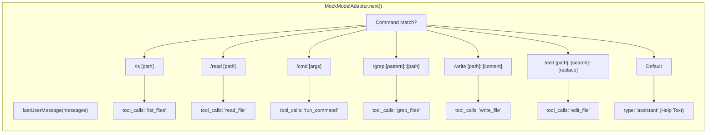
```mermaid
flowchart LR
    subgraph MockModelAdapter_next_ ["MockModelAdapter.next()"]
        INPUT["lastUserMessage(messages)"]
        LS["/ls #91;path#93;"]
        T_LS["tool_calls: 'list_files'"]
        READ["/read #91;path#93;"]
        T_READ["tool_calls: 'read_file'"]
        CMD["/cmd #91;args#93;"]
        T_CMD["tool_calls: 'run_command'"]
        GREP["/grep #91;pattern#93;::#91;path#93;"]
        T_GREP["tool_calls: 'grep_files'"]
        WRITE["/write #91;path#93;::#91;content#93;"]
        T_WRITE["tool_calls: 'write_file'"]
        EDIT["/edit #91;path#93;::#91;search#93;::#91;replace#93;"]
        T_EDIT["tool_calls: 'edit_file'"]
        OTHER["Default"]
        ASSISTANT["type: 'assistant' (Help Text)"]
        PARSE["Command Match?"]
    end
    LS --> T_LS
    READ --> T_READ
    CMD --> T_CMD
    GREP --> T_GREP
    WRITE --> T_WRITE
    EDIT --> T_EDIT
    OTHER --> ASSISTANT
    PARSE --> LS
    PARSE --> READ
    PARSE --> CMD
    PARSE --> GREP
    PARSE --> WRITE
    PARSE --> EDIT
    PARSE --> OTHER
```

- **状态感知**：它使用 `lastToolMessage` [src/mock-model.ts8-10](https://github.com/LiuMengxuan04/MiniCode/blob/57cd741d/src/mock-model.ts#L8-L10) 和 `extractLatestAssistantCall` [src/mock-model.ts12-22](https://github.com/LiuMengxuan04/MiniCode/blob/57cd741d/src/mock-model.ts#L12-L22) 来提供上下文感知响应。例如，如果最后一个工具调用是 `list_files`，它返回一条消息"目录内容如下："然后是工具输出 [src/mock-model.ts28-34](https://github.com/LiuMengxuan04/MiniCode/blob/57cd741d/src/mock-model.ts#L28-L34)
- **斜杠命令模拟**：它通过将 `/ls`、`/grep`、`/read`、`/edit` 和 `/cmd` 等本地快捷方式转换为 `tool_calls` 步骤来实现 [src/mock-model.ts65-162](https://github.com/LiuMengxuan04/MiniCode/blob/57cd741d/src/mock-model.ts#L65-L162)

Sources: [src/mock-model.ts3-179](https://github.com/LiuMengxuan04/MiniCode/blob/57cd741d/src/mock-model.ts#L3-L179)

---

# 系统提示词构建
相关源文件
- [.gitignore](https://github.com/LiuMengxuan04/MiniCode/blob/57cd741d/.gitignore)
- [src/config.ts](https://github.com/LiuMengxuan04/MiniCode/blob/57cd741d/src/config.ts)
- [src/init.ts](https://github.com/LiuMengxuan04/MiniCode/blob/57cd741d/src/init.ts)
- [src/manage-cli.ts](https://github.com/LiuMengxuan04/MiniCode/blob/57cd741d/src/manage-cli.ts)
- [src/mcp.ts](https://github.com/LiuMengxuan04/MiniCode/blob/57cd741d/src/mcp.ts)
- [src/memory.ts](https://github.com/LiuMengxuan04/MiniCode/blob/57cd741d/src/memory.ts)
- [src/prompt.ts](https://github.com/LiuMengxuan04/MiniCode/blob/57cd741d/src/prompt.ts)
- [src/skills.ts](https://github.com/LiuMengxuan04/MiniCode/blob/57cd741d/src/skills.ts)
- [test/memory.test.ts](https://github.com/LiuMengxuan04/MiniCode/blob/57cd741d/test/memory.test.ts)

系统提示词是定义 MiniCode 身份、行为约束和可用上下文的基础指令集。构建过程主要由 `src/prompt.ts` 中的 `buildSystemPrompt` 处理，它动态组装一个多部分字符串，向 LLM 通知其环境信息，包括活动的 MCP 服务器、发现的 skills 和项目特定的"记忆"文件（如 `MINI.md` 或 `CLAUDE.md`）。

## buildSystemPrompt 函数

`buildSystemPrompt` 函数是生成系统消息的中央入口点。它接受当前工作目录、权限摘要以及关于 skills 和 MCP 服务器的可选元数据 [src/prompt.ts5-11](https://github.com/LiuMengxuan04/MiniCode/blob/57cd741d/src/prompt.ts#L5-L11)

### 数据流与组装

提示词被构建为字符串数组（`parts`），在过程结束时用双换行符连接 [src/prompt.ts13-97](https://github.com/LiuMengxuan04/MiniCode/blob/57cd741d/src/prompt.ts#L13-L97)

1. **身份与默认值**：将角色设置为"mini-code"并建立"工具优先"理念，优先选择文件操作和 shell 命令而非理论建议 [src/prompt.ts14-20](https://github.com/LiuMengxuan04/MiniCode/blob/57cd741d/src/prompt.ts#L14-L20)
2. **交互协议**：定义使用 `<progress>` 和 `<final>` 标签的结构化响应协议来管理多轮工具执行，并强制使用 `ask_user` 进行澄清 [src/prompt.ts21-31](https://github.com/LiuMengxuan04/MiniCode/blob/57cd741d/src/prompt.ts#L21-L31)
3. **权限上下文**：注入由 `PermissionManager` 提供允许或拒绝的路径和命令的当前状态 [src/prompt.ts33-35](https://github.com/LiuMengxuan04/MiniCode/blob/57cd741d/src/prompt.ts#L33-L35)
4. **技能发现**：列出在 `.mini-code/skills` 或 `.claude/skills` 中找到的 skills 名称和描述 [src/prompt.ts37-46](https://github.com/LiuMengxuan04/MiniCode/blob/57cd741d/src/prompt.ts#L37-L46)
5. **MCP 状态**：追加配置的模型上下文协议服务器状态，包括工具计数、资源能力和连接状态 [src/prompt.ts48-90](https://github.com/LiuMengxuan04/MiniCode/blob/57cd741d/src/prompt.ts#L48-L90)
6. **指令文件（记忆）**：调用 `loadMemory` 扫描、解析并追加来自 `MINI.md` 和 `CLAUDE.md` 等指令文件的内容 [src/prompt.ts92-95](https://github.com/LiuMengxuan04/MiniCode/blob/57cd741d/src/prompt.ts#L92-L95)

### 系统提示词组装逻辑

下图说明了各种代码实体和文件系统对象如何贡献最终的系统字符串。

**图：系统提示词组合**

```

```

**来源：**[src/prompt.ts5-98](https://github.com/LiuMengxuan04/MiniCode/blob/57cd741d/src/prompt.ts#L5-L98)[src/memory.ts234-235](https://github.com/LiuMengxuan04/MiniCode/blob/57cd741d/src/memory.ts#L234-L235)

---

## 技能与 MCP 集成

系统提示词作为代理的发现机制，使其知道哪些专门工作流（Skills）和外部工具（MCP）可用。

### 技能摘要

提示词包含通过 `SkillSummary[]` [src/prompt.ts37-46](https://github.com/LiuMengxuan04/MiniCode/blob/57cd741d/src/prompt.ts#L37-L46) 提供的可用技能列表。这通知模型其调用 `load_skill` 的能力，当用户请求与特定工作流描述匹配时 [src/prompt.ts24](https://github.com/LiuMengxuan04/MiniCode/blob/57cd741d/src/prompt.ts#L24-L24) 技能由 `discoverSkills` 发现，它扫描包括项目本地和全局用户目录的多个根目录 [src/skills.ts108-126](https://github.com/LiuMengxuan04/MiniCode/blob/57cd741d/src/skills.ts#L108-L126)

### MCP 服务器提示

如果 MCP 服务器已连接，`buildSystemPrompt` 会添加特定的"能力提示"。这些提示指示模型如何使用带前缀的工具名称（例如 `mcp__server__tool`），以及是否使用 `read_mcp_resource` 等资源特定工具或 `get_mcp_prompt` 等提示特定工具，基于服务器报告的能力 [src/prompt.ts67-89](https://github.com/LiuMengxuan04/MiniCode/blob/57cd741d/src/prompt.ts#L67-L89)

| 提示部分 | 源实体 | 目的 |
| --- | --- | --- |
| **可用技能** | `SkillSummary[]` | 通知模型它可以加载的 `.md` 工作流文件。 |
| **已配置的 MCP 服务器** | `McpServerSummary[]` | 显示外部集成的工具计数和连接状态。 |
| **能力提示** | `server.resourceCount`、`server.promptCount` | 动态建议模型在支持的情况下使用 MCP 资源/提示工具。 |

**来源：**[src/prompt.ts37-90](https://github.com/LiuMengxuan04/MiniCode/blob/57cd741d/src/prompt.ts#L37-L90)[src/mcp.ts51-60](https://github.com/LiuMengxuan04/MiniCode/blob/57cd741d/src/mcp.ts#L51-L60)[src/skills.ts6-11](https://github.com/LiuMengxuan04/MiniCode/blob/57cd741d/src/skills.ts#L6-L11)

---

## 记忆与指令文件

MiniCode 支持分层指令文件（主要是 `MINI.md` 和 `CLAUDE.md`）。这些由 `memory.ts` 子系统解析并注入到系统提示词中。

### 解析与继承

`discoverInstructionFiles` 函数实现了向上遍历的解析策略 [src/memory.ts130-145](https://github.com/LiuMengxuan04/MiniCode/blob/57cd741d/src/memory.ts#L130-L145)：

1. **全局级别**：检查 `~/.mini-code/` 中的 `MINI.md` 或 `CLAUDE.md` 以及 `~/.mini-code/rules/` 中的全局规则 [src/memory.ts150-168](https://github.com/LiuMengxuan04/MiniCode/blob/57cd741d/src/memory.ts#L150-L168)
2. **项目级别**：从项目根目录向下遍历到当前工作目录，收集 `MINI.md`、`MINI.local.md` 和 `.mini-code/rules/` 等文件 [src/memory.ts171-186](https://github.com/LiuMengxuan04/MiniCode/blob/57cd741d/src/memory.ts#L171-L186)
3. **去重**：具有相同内容的文件通过 `contentHash` 去重，靠近 `cwd` 的版本优先 [src/memory.ts117-128](https://github.com/LiuMengxuan04/MiniCode/blob/57cd741d/src/memory.ts#L117-L128)[src/memory.ts32-35](https://github.com/LiuMengxuan04/MiniCode/blob/57cd741d/src/memory.ts#L32-L35)

### 文件包含（@语法）

记忆文件支持指令语法 `@path/to/file.md`，允许一个指令文件包含另一个 [src/memory.ts30](https://github.com/LiuMengxuan04/MiniCode/blob/57cd741d/src/memory.ts#L30-L30) `resolveIncludes` 函数递归处理这些指令，同时使用 `visited` Set 防止循环，并通过 `isUnsafeIncludePath` 确保路径安全 [src/memory.ts64-115](https://github.com/LiuMengxuan04/MiniCode/blob/57cd741d/src/memory.ts#L64-L115)

**图：指令文件解析**

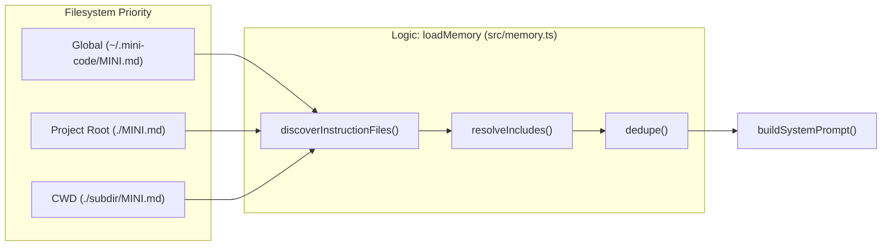
```mermaid
flowchart LR
    BSP["buildSystemPrompt()"]
    subgraph subGraph1 ["Filesystem Priority"]
        F1["Global (~/.mini-code/MINI.md)"]
        F2["Project Root (./MINI.md)"]
        F3["CWD (./subdir/MINI.md)"]
    end
    subgraph subGraph0 ["Logic: loadMemory (src/memory.ts)"]
        D1["discoverInstructionFiles()"]
        D2["resolveIncludes()"]
        D3["dedupe()"]
    end
    F1 --> D1
    F2 --> D1
    F3 --> D1
    D1 --> D2
    D2 --> D3
    D3 --> BSP
```

**来源：**[src/memory.ts70-188](https://github.com/LiuMengxuan04/MiniCode/blob/57cd741d/src/memory.ts#L70-L188)[src/prompt.ts92-95](https://github.com/LiuMengxuan04/MiniCode/blob/57cd741d/src/prompt.ts#L92-L95)

---

## 响应协议强制执行

系统提示词的一个关键部分是"结构化响应协议" [src/prompt.ts25-31](https://github.com/LiuMengxuan04/MiniCode/blob/57cd741d/src/prompt.ts#L25-L31) 本节强制执行模型应如何传达其状态：

- **`<progress>`**：如果模型打算在同一逻辑任务中继续更多工具调用，则必须使用 [src/prompt.ts26](https://github.com/LiuMengxuan04/MiniCode/blob/57cd741d/src/prompt.ts#L26-L26)
- **`<final>`**：仅当任务完成且控制权返回给用户时必须使用 [src/prompt.ts27](https://github.com/LiuMengxuan04/MiniCode/blob/57cd741d/src/prompt.ts#L27-L27)
- **`ask_user`**：模型明确禁止以纯文本形式提问澄清问题；它必须使用 `ask_user` 工具，这会结束轮次并等待用户输入 [src/prompt.ts21-28](https://github.com/LiuMengxuan04/MiniCode/blob/57cd741d/src/prompt.ts#L21-L28)
- **工具行为**：为 `read_file`（处理 `TRUNCATED: yes` 头部）和 `load_skill`（在遵循匹配工作流之前调用它）等工具提供特定说明 [src/prompt.ts23-24](https://github.com/LiuMengxuan04/MiniCode/blob/57cd741d/src/prompt.ts#L23-L24)

此强制执行确保代理循环可以正确解析模型的意图，并确定是继续执行还是等待用户输入。

**来源：**[src/prompt.ts21-31](https://github.com/LiuMengxuan04/MiniCode/blob/57cd741d/src/prompt.ts#L21-L31)

---

## 上下文压缩

## 相关源文件
- [eslint.config.js](https://github.com/LiuMengxuan04/MiniCode/blob/57cd741d/eslint.config.js)
- [package-lock.json](https://github.com/LiuMengxuan04/MiniCode/blob/57cd741d/package-lock.json)
- [package.json](https://github.com/LiuMengxuan04/MiniCode/blob/57cd741d/package.json)
- [src/compact/auto-compact.ts](https://github.com/LiuMengxuan04/MiniCode/blob/57cd741d/src/compact/auto-compact.ts)
- [src/compact/compact.ts](https://github.com/LiuMengxuan04/MiniCode/blob/57cd741d/src/compact/compact.ts)
- [src/compact/constants.ts](https://github.com/LiuMengxuan04/MiniCode/blob/57cd741d/src/compact/constants.ts)
- [src/compact/context-collapse.ts](https://github.com/LiuMengxuan04/MiniCode/blob/57cd741d/src/compact/context-collapse.ts)
- [src/compact/manual-compact.ts](https://github.com/LiuMengxuan04/MiniCode/blob/57cd741d/src/compact/manual-compact.ts)
- [src/compact/microcompact.ts](https://github.com/LiuMengxuan04/MiniCode/blob/57cd741d/src/compact/microcompact.ts)
- [src/compact/prompt.ts](https://github.com/LiuMengxuan04/MiniCode/blob/57cd741d/src/compact/prompt.ts)
- [src/compact/snipCompact.ts](https://github.com/LiuMengxuan04/MiniCode/blob/57cd741d/src/compact/snipCompact.ts)
- [src/utils/context.ts](https://github.com/LiuMengxuan04/MiniCode/blob/57cd741d/src/utils/context.ts)
- [src/utils/model-context.ts](https://github.com/LiuMengxuan04/MiniCode/blob/57cd741d/src/utils/model-context.ts)
- [src/utils/token-estimator.ts](https://github.com/LiuMengxuan04/MiniCode/blob/57cd741d/src/utils/token-estimator.ts)
- [test/auto-compact.test.ts](https://github.com/LiuMengxuan04/MiniCode/blob/57cd741d/test/auto-compact.test.ts)
- [test/compact.test.ts](https://github.com/LiuMengxuan04/MiniCode/blob/57cd741d/test/compact.test.ts)
- [test/context-collapse.test.ts](https://github.com/LiuMengxuan04/MiniCode/blob/57cd741d/test/context-collapse.test.ts)
- [test/microcompact.test.ts](https://github.com/LiuMengxuan04/MiniCode/blob/57cd741d/test/microcompact.test.ts)
- [test/model-context.test.ts](https://github.com/LiuMengxuan04/MiniCode/blob/57cd741d/test/model-context.test.ts)
- [test/provider-usage-ingestion.test.ts](https://github.com/LiuMengxuan04/MiniCode/blob/57cd741d/test/provider-usage-ingestion.test.ts)
- [test/run-tests.mjs](https://github.com/LiuMengxuan04/MiniCode/blob/57cd741d/test/run-tests.mjs)
- [test/snip-compact.test.ts](https://github.com/LiuMengxuan04/MiniCode/blob/57cd741d/test/snip-compact.test.ts)
- [test/token-estimator.test.ts](https://github.com/LiuMengxuan04/MiniCode/blob/57cd741d/test/token-estimator.test.ts)

`src/compact/` 中的上下文压缩子系统负责管理 Agent 的消息历史，确保其保持在模型的上下文限制内。它采用多层级方法：**微压缩** 用于清理臃肿的工具结果，**上下文折叠** 用于生成摘要视图，**剪裁压缩** 用于激进截断，以及**自动压缩** 用于在高利用率时对历史进行摘要。

## Token 估算与模型注册表

在压缩发生之前，系统必须估算当前的上下文使用量。这由 `src/utils/token-estimator.ts` 和 `src/utils/model-context.ts` 处理。

### 模型上下文窗口注册表

系统维护一个模型能力注册表 `MODEL_CONTEXT_RULES`[src/utils/model-context.ts19-120](https://github.com/LiuMengxuan04/MiniCode/blob/57cd741d/src/utils/model-context.ts#L19-L120) The function `getModelContextWindow`[src/utils/model-context.ts122-139](https://github.com/LiuMengxuan04/MiniCode/blob/57cd741d/src/utils/model-context.ts#L122-L139) 规范化模型名称，返回包含以下内容的 `ModelContextWindow` 对象：

- `contextWindow`：支持的总 token 数。
- `outputReserve`：为模型响应保留的 token 数。
- `effectiveInput`：历史可用的空间 (`contextWindow - outputReserve`).

### Token 估算逻辑

由于精确的分词因模型而异，MiniCode 使用基于字符数和角色特定比率的启发式方法，定义在 `CHARS_PER_TOKEN`[src/utils/token-estimator.ts34-44](https://github.com/LiuMengxuan04/MiniCode/blob/57cd741d/src/utils/token-estimator.ts#L34-L44)

| 角色 | 每 Token 字符数 |
| --- | --- |
| `system` | 3.5 |
| `user` | 3.0 |
| `assistant` | 3.5 |
| `assistant_thinking` | 3.0 |
| `assistant_tool_call` | 2.5 |
| `tool_result` | 2.0 |
| `context_summary` | 3.5 |

系统优先使用实际的 `providerUsage` 数据 [src/utils/token-estimator.ts92-103](https://github.com/LiuMengxuan04/MiniCode/blob/57cd741d/src/utils/token-estimator.ts#L92-L103)`tokenCountWithEstimation`[src/utils/token-estimator.ts125-156](https://github.com/LiuMengxuan04/MiniCode/blob/57cd741d/src/utils/token-estimator.ts#L125-L156) uses the latest exact count from the provider and adds estimated tokens for subsequent "tail" messages. `computeContextStats`[src/utils/token-estimator.ts177-206](https://github.com/LiuMengxuan04/MiniCode/blob/57cd741d/src/utils/token-estimator.ts#L177-L206) 根据 `THRESHOLDS` 计算 `utilization` 并分配 `warningLevel`（normal、warning、critical 或 blocked）[src/compact/constants.ts1-5](https://github.com/LiuMengxuan04/MiniCode/blob/57cd741d/src/compact/constants.ts#L1-L5)

**来源：**[src/utils/model-context.ts19-139](https://github.com/LiuMengxuan04/MiniCode/blob/57cd741d/src/utils/model-context.ts#L19-L139)[src/utils/token-estimator.ts34-206](https://github.com/LiuMengxuan04/MiniCode/blob/57cd741d/src/utils/token-estimator.ts#L34-L206)[src/compact/constants.ts1-5](https://github.com/LiuMengxuan04/MiniCode/blob/57cd741d/src/compact/constants.ts#L1-L5)

## 压缩策略

MiniCode 实现了四个不同的上下文管理层。

### 1. 微压缩

`microcompact`[src/compact/microcompact.ts6-50](https://github.com/LiuMengxuan04/MiniCode/blob/57cd741d/src/compact/microcompact.ts#L6-L50) 在利用率超过 50% 时触发 (`MICROCOMPACT_UTILIZATION`) [src/compact/constants.ts2](https://github.com/LiuMengxuan04/MiniCode/blob/57cd741d/src/compact/constants.ts#L2-L2) It identifies "compactable" tool results (e.g., large file reads) and replaces their content with a `CLEAR_MARKER`[src/utils/token-estimator.ts46](https://github.com/LiuMengxuan04/MiniCode/blob/57cd741d/src/utils/token-estimator.ts#L46-L46) preserving only the `RETENTION.KEEP_RECENT_TOOL_RESULTS` (default: 3) [src/compact/constants.ts21](https://github.com/LiuMengxuan04/MiniCode/blob/57cd741d/src/compact/constants.ts#L21-L21)

### 2. 上下文折叠

`applyContextCollapseIfNeeded`[src/compact/context-collapse.ts285-350](https://github.com/LiuMengxuan04/MiniCode/blob/57cd741d/src/compact/context-collapse.ts#L285-L350) 在 75% 利用率时触发 [src/compact/constants.ts13](https://github.com/LiuMengxuan04/MiniCode/blob/57cd741d/src/compact/constants.ts#L13-L13) 与修改会话历史的标准压缩不同，折叠创建一个 "投影" [src/compact/context-collapse.ts201-250](https://github.com/LiuMengxuan04/MiniCode/blob/57cd741d/src/compact/context-collapse.ts#L201-L250) It replaces spans of messages with summaries in the model's view while keeping the original transcript intact for the user. It uses `projectCollapsedView`[src/compact/context-collapse.ts201-250](https://github.com/LiuMengxuan04/MiniCode/blob/57cd741d/src/compact/context-collapse.ts#L201-L250) to generate the message array for the LLM.

### 3. 剪裁压缩

`snipCompactConversation`[src/compact/snipCompact.ts282-355](https://github.com/LiuMengxuan04/MiniCode/blob/57cd741d/src/compact/snipCompact.ts#L282-L355) is a fallback that triggers at 70% utilization [src/compact/constants.ts7](https://github.com/LiuMengxuan04/MiniCode/blob/57cd741d/src/compact/constants.ts#L7-L7) if other methods are insufficient. 它执行 "硬" 删除不是 "受保护" 的中间范围消息（例如文件编辑或重要错误） [src/compact/snipCompact.ts210-235](https://github.com/LiuMengxuan04/MiniCode/blob/57cd741d/src/compact/snipCompact.ts#L210-L235) 受保护的工具包括 `edit_file`、`patch_file` 和 `write_file`[src/compact/snipCompact.ts51-57](https://github.com/LiuMengxuan04/MiniCode/blob/57cd741d/src/compact/snipCompact.ts#L51-L57)

### 4. 自动压缩

`autoCompact`[src/compact/auto-compact.ts45-82](https://github.com/LiuMengxuan04/MiniCode/blob/57cd741d/src/compact/auto-compact.ts#L45-L82) 在 85% 利用率时触发 (`AUTOCOMPACT_UTILIZATION`) [src/compact/constants.ts3](https://github.com/LiuMengxuan04/MiniCode/blob/57cd741d/src/compact/constants.ts#L3-L3) It uses the model to summarize old history. If it fails 3 times consecutively (`MAX_AUTOCOMPACT_FAILURES`), it disables itself [src/compact/auto-compact.ts71-73](https://github.com/LiuMengxuan04/MiniCode/blob/57cd741d/src/compact/auto-compact.ts#L71-L73) 也可以通过 `/compact` 斜杠命令手动调用压缩 [src/compact/manual-compact.ts12-35](https://github.com/LiuMengxuan04/MiniCode/blob/57cd741d/src/compact/manual-compact.ts#L12-L35)

**来源：**[src/compact/microcompact.ts6-50](https://github.com/LiuMengxuan04/MiniCode/blob/57cd741d/src/compact/microcompact.ts#L6-L50)[src/compact/context-collapse.ts201-350](https://github.com/LiuMengxuan04/MiniCode/blob/57cd741d/src/compact/context-collapse.ts#L201-L350)[src/compact/snipCompact.ts282-355](https://github.com/LiuMengxuan04/MiniCode/blob/57cd741d/src/compact/snipCompact.ts#L282-L355)[src/compact/auto-compact.ts45-82](https://github.com/LiuMengxuan04/MiniCode/blob/57cd741d/src/compact/auto-compact.ts#L45-L82)[src/compact/constants.ts1-33](https://github.com/LiuMengxuan04/MiniCode/blob/57cd741d/src/compact/constants.ts#L1-L33)[src/compact/manual-compact.ts12-35](https://github.com/LiuMengxuan04/MiniCode/blob/57cd741d/src/compact/manual-compact.ts#L12-L35)

## 压缩算法

核心逻辑位于 `compactConversation`[src/compact/compact.ts124-198](https://github.com/LiuMengxuan04/MiniCode/blob/57cd741d/src/compact/compact.ts#L124-L198)

### 保留边界算法

`findRetentionBoundary`[src/compact/compact.ts58-86](https://github.com/LiuMengxuan04/MiniCode/blob/57cd741d/src/compact/compact.ts#L58-L86) determines where the "tail" (retained messages) begins:

1. 向后扫描，累积 token，直到达到 `RETENTION.MAX_KEEP_TOKENS` (40,000) [src/compact/compact.ts64-74](https://github.com/LiuMengxuan04/MiniCode/blob/57cd741d/src/compact/compact.ts#L64-L74)
2. 确保至少保留 `RETENTION.MIN_KEEP_MESSAGES`（6）条消息 [src/compact/compact.ts77-78](https://github.com/LiuMengxuan04/MiniCode/blob/57cd741d/src/compact/compact.ts#L77-L78)
3. Calls `alignBoundaryToApiRound`[src/compact/compact.ts46-56](https://github.com/LiuMengxuan04/MiniCode/blob/57cd741d/src/compact/compact.ts#L46-L56) to ensure an `assistant_tool_call` and its `tool_result` are never separated [src/compact/compact.ts85](https://github.com/LiuMengxuan04/MiniCode/blob/57cd741d/src/compact/compact.ts#L85-L85) It uses `groupMessagesByApiRound`[src/compact/compact.ts11-44](https://github.com/LiuMengxuan04/MiniCode/blob/57cd741d/src/compact/compact.ts#L11-L44) to identify these atomic blocks.

### 摘要生成

边界前的消息通过 `messagesToText` 转换为文本[src/compact/compact.ts88-122](https://github.com/LiuMengxuan04/MiniCode/blob/57cd741d/src/compact/compact.ts#L88-L122) 此文本与 `buildCompactSummaryPrompt` 构建的提示一起发送给模型[src/compact/prompt.ts1-21](https://github.com/LiuMengxuan04/MiniCode/blob/57cd741d/src/compact/prompt.ts#L1-L21) 结果通过 `parseSummaryFromResponse` 解析[src/compact/prompt.ts23-38](https://github.com/LiuMengxuan04/MiniCode/blob/57cd741d/src/compact/prompt.ts#L23-L38)

### CompressionResult（压缩结果）

成功后，系统返回一个 `CompressionResult`[src/compact/compact.ts188-194](https://github.com/LiuMengxuan04/MiniCode/blob/57cd741d/src/compact/compact.ts#L188-L194) 包含：

- `messages`：新数组（System + `context_summary` + `messagesToKeep`） [src/compact/compact.ts180-184](https://github.com/LiuMengxuan04/MiniCode/blob/57cd741d/src/compact/compact.ts#L180-L184)
- `removedCount`：压缩的消息数 [src/compact/compact.ts191](https://github.com/LiuMengxuan04/MiniCode/blob/57cd741d/src/compact/compact.ts#L191-L191)
- `tokensBefore` / `tokensAfter`：TUI 的统计数据 [src/compact/compact.ts192-193](https://github.com/LiuMengxuan04/MiniCode/blob/57cd741d/src/compact/compact.ts#L192-L193)

**来源：**[src/compact/compact.ts11-198](https://github.com/LiuMengxuan04/MiniCode/blob/57cd741d/src/compact/compact.ts#L11-L198)[src/compact/prompt.ts1-38](https://github.com/LiuMengxuan04/MiniCode/blob/57cd741d/src/compact/prompt.ts#L1-L38)[src/compact/constants.ts20-25](https://github.com/LiuMengxuan04/MiniCode/blob/57cd741d/src/compact/constants.ts#L20-L25)

## 数据流图

### 上下文生命周期与压缩触发

此图说明了系统如何监控利用率并选择策略。

标题：压缩触发流程

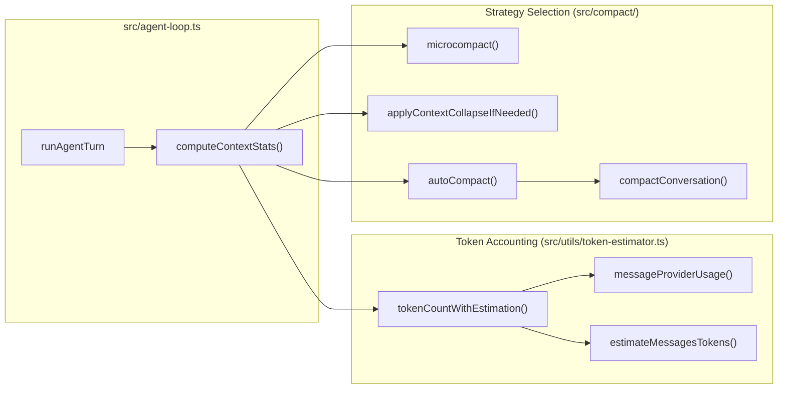
```mermaid
flowchart LR
    subgraph subGraph2 ["Token Accounting (src/utils/token-estimator.ts)"]
        G["tokenCountWithEstimation()"]
        H["messageProviderUsage()"]
        I["estimateMessagesTokens()"]
    end
    subgraph subGraph1 ["Strategy Selection (src/compact/)"]
        C["microcompact()"]
        D["applyContextCollapseIfNeeded()"]
        E["autoCompact()"]
        F["compactConversation()"]
    end
    subgraph src_agent_loop_ts ["src/agent-loop.ts"]
        A["runAgentTurn"]
        B["computeContextStats()"]
    end
    A --> B
    B --> C
    B --> D
    B --> E
    E --> F
    B --> G
    G --> H
    G --> I
```

Sources: [src/compact/auto-compact.ts45-82](https://github.com/LiuMengxuan04/MiniCode/blob/57cd741d/src/compact/auto-compact.ts#L45-L82)[src/compact/microcompact.ts6-13](https://github.com/LiuMengxuan04/MiniCode/blob/57cd741d/src/compact/microcompact.ts#L6-L13)[src/utils/token-estimator.ts125-206](https://github.com/LiuMengxuan04/MiniCode/blob/57cd741d/src/utils/token-estimator.ts#L125-L206)[src/compact/compact.ts124-160](https://github.com/LiuMengxuan04/MiniCode/blob/57cd741d/src/compact/compact.ts#L124-L160)

### 消息保留与组装

此图展示了 `compactConversation` 如何划分消息数组。

标题：上下文组装与保留

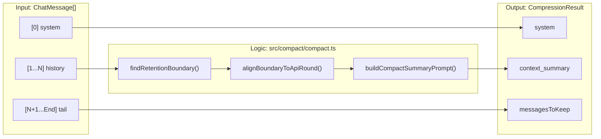
```mermaid
flowchart LR
    subgraph subGraph2 ["Output: CompressionResult"]
        R1["system"]
        R2["context_summary"]
        R3["messagesToKeep"]
    end
    subgraph subGraph1 ["Logic: src/compact/compact.ts"]
        B["findRetentionBoundary()"]
        A["alignBoundaryToApiRound()"]
        P["buildCompactSummaryPrompt()"]
    end
    subgraph subGraph0 ["Input: ChatMessage#91;#93;"]
        M1["#91;0#93; system"]
        M2["#91;1...N#93; history"]
        M3["#91;N+1...End#93; tail"]
    end
    M2 --> B
    B --> A
    A --> P
    M1 --> R1
    P --> R2
    M3 --> R3
```

Sources: [src/compact/compact.ts124-198](https://github.com/LiuMengxuan04/MiniCode/blob/57cd741d/src/compact/compact.ts#L124-L198)[src/compact/compact.ts46-86](https://github.com/LiuMengxuan04/MiniCode/blob/57cd741d/src/compact/compact.ts#L46-L86)[src/compact/prompt.ts1-21](https://github.com/LiuMengxuan04/MiniCode/blob/57cd741d/src/compact/prompt.ts#L1-L21)

---

## 工具系统

## 相关源文件
- [ARCHITECTURE.md](https://github.com/LiuMengxuan04/MiniCode/blob/57cd741d/ARCHITECTURE.md?plain=1)
- [src/tool.ts](https://github.com/LiuMengxuan04/MiniCode/blob/57cd741d/src/tool.ts)
- [src/tools/index.ts](https://github.com/LiuMengxuan04/MiniCode/blob/57cd741d/src/tools/index.ts)

MiniCode 中的工具系统为 Agent 提供了一个统一的接口来与外部世界交互。 它管理从本地文件系统操作和 Shell 执行到远程模型上下文协议（MCP）服务的能力注册表。 每个工具都受严格契约约束，确保类型安全、权限检查和一致的错误处理。

## 工具定义与注册表

工具系统的基础是 `ToolDefinition` 接口和 `ToolRegistry` 类。

### ToolDefinition 契约

系统中的每个工具必须实现 `ToolDefinition<TInput>` 接口 [src/tool.ts27-33](https://github.com/LiuMengxuan04/MiniCode/blob/57cd741d/src/tool.ts#L27-L33) 此契约要求：

- **`name`**：工具的唯一标识符（例如 `read_file`、`run_command`）。
- **`description`**：解释 Agent 何时以及如何使用工具的自然语言文本。
- **`inputSchema`**：工具参数的 JSON Schema 表示，发送给 LLM 以指导其生成 [src/tool.ts30](https://github.com/LiuMengxuan04/MiniCode/blob/57cd741d/src/tool.ts#L30-L30)
- **`schema`**：Zod 验证器，在调用 `run` 函数之前用于在运行时解析和验证工具参数 [src/tool.ts31](https://github.com/LiuMengxuan04/MiniCode/blob/57cd741d/src/tool.ts#L31-L31)
- **`run`**：执行逻辑并返回 `ToolResult` 的异步函数[src/tool.ts32](https://github.com/LiuMengxuan04/MiniCode/blob/57cd741d/src/tool.ts#L32-L32)

### ToolRegistry（工具注册表）

The `ToolRegistry`[src/tool.ts40](https://github.com/LiuMengxuan04/MiniCode/blob/57cd741d/src/tool.ts#L40-L40) acts as the central repository for all available tools. It handles:

1. **注册**：存储内置工具、发现的技能和动态加载的 MCP 工具 [src/tool.ts76-85](https://github.com/LiuMengxuan04/MiniCode/blob/57cd741d/src/tool.ts#L76-L85)
2. **执行**：在执行前通过针对 Zod schema 验证输入来安全调用工具 [src/tool.ts95-124](https://github.com/LiuMengxuan04/MiniCode/blob/57cd741d/src/tool.ts#L95-L124)
3. **元数据**：跟踪 MCP 服务器状态和可用技能以构建系统提示 [src/tool.ts61-67](https://github.com/LiuMengxuan04/MiniCode/blob/57cd741d/src/tool.ts#L61-L67)

### 工具执行流程

下图说明了工具调用如何从模型空间（自然语言/JSON）进入代码实体空间（逻辑/文件系统）。

**工具执行生命周期**

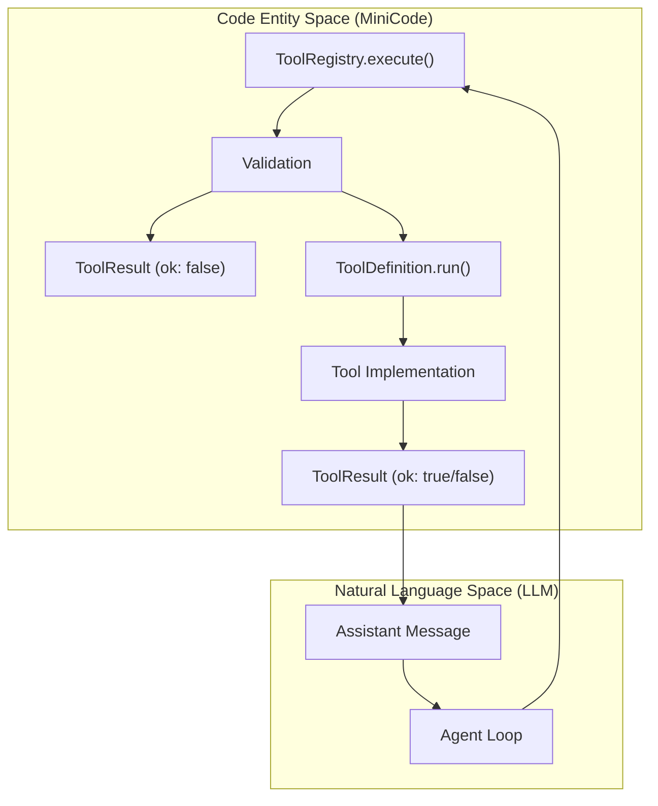
```mermaid
flowchart TD
    subgraph subGraph1 ["Code Entity Space (MiniCode)"]
        C["ToolRegistry.execute()"]
        D["Validation"]
        E["ToolResult (ok: false)"]
        F["ToolDefinition.run()"]
        G["Tool Implementation"]
        H["ToolResult (ok: true/false)"]
    end
    subgraph subGraph0 ["Natural Language Space (LLM)"]
        A["Assistant Message"]
        B["Agent Loop"]
    end
    A --> B
    B --> C
    C --> D
    D --> E
    D --> F
    F --> G
    G --> H
    H --> A
```

**来源：**[src/tool.ts95-124](https://github.com/LiuMengxuan04/MiniCode/blob/57cd741d/src/tool.ts#L95-L124)[src/tool.ts27-33](https://github.com/LiuMengxuan04/MiniCode/blob/57cd741d/src/tool.ts#L27-L33)[src/tool.ts6-9](https://github.com/LiuMengxuan04/MiniCode/blob/57cd741d/src/tool.ts#L6-L9)

---

## 工具类别

MiniCode 将其工具分为三个主要功能区域。虽然 `ToolRegistry` 统一对待它们，但它们的实现复杂度和对系统的影响程度差异很大。

### 内置文件与搜索工具

这些工具提供核心的 "类 IDE" 能力。 They are initialized via `createDefaultToolRegistry`[src/tools/index.ts42-66](https://github.com/LiuMengxuan04/MiniCode/blob/57cd741d/src/tools/index.ts#L42-L66) and include operations for reading, writing, and searching files. 这些工具确保路径不会逃逸工作区，并受到 `PermissionManager` 的适当限制。

- **包含的工具**： `list_files`, `grep_files`, `read_file`, `write_file`, `modify_file`, `edit_file`, `patch_file`[src/tools/index.ts51-57](https://github.com/LiuMengxuan04/MiniCode/blob/57cd741d/src/tools/index.ts#L51-L57)

For details, see [Built-in File and Search Tools](/LiuMengxuan04/MiniCode/3.1-built-in-file-and-search-tools).

### Shell 执行工具

The `run_command` tool [src/tools/run-command.ts14](https://github.com/LiuMengxuan04/MiniCode/blob/57cd741d/src/tools/run-command.ts#L14-L14) allows the agent to execute arbitrary bash commands. 这是一个强大的工具，支持同步执行和长期运行的后台任务，由 `BackgroundTaskResult` 类型表示 [src/tool.ts11-18](https://github.com/LiuMengxuan04/MiniCode/blob/57cd741d/src/tool.ts#L11-L18)

For details, see [Shell Execution Tool](/LiuMengxuan04/MiniCode/3.2-shell-execution-tool).

### Web、技能与交互工具

此类别包括用于外部信息检索的工具 (`web_search`, `web_fetch`), dynamic context expansion via `load_skill`[src/tools/load-skill.ts10](https://github.com/LiuMengxuan04/MiniCode/blob/57cd741d/src/tools/load-skill.ts#L10-L10) 以及通过 `ask_user` 实现的人机交互[src/tools/ask-user.ts6](https://github.com/LiuMengxuan04/MiniCode/blob/57cd741d/src/tools/ask-user.ts#L6-L6)

For details, see [Web, Skills, and Interaction Tools](/LiuMengxuan04/MiniCode/3.3-web-skills-and-interaction-tools).

---

## MCP 集成

工具系统通过模型上下文协议（MCP）可扩展。在工具注册表初始化期间，系统执行两步过程：

1. **默认注册**：内置工具立即注册 in `createDefaultToolRegistry`[src/tools/index.ts49-65](https://github.com/LiuMengxuan04/MiniCode/blob/57cd741d/src/tools/index.ts#L49-L65)
2. **Hydration**: The `hydrateMcpTools` function [src/tools/index.ts68-80](https://github.com/LiuMengxuan04/MiniCode/blob/57cd741d/src/tools/index.ts#L68-L80) connects to external `~/.mini-code/mcp.json` 中定义的 MCP 服务器。 the configuration, discovers their tools via `createMcpBackedTools`[src/mcp.ts73](https://github.com/LiuMengxuan04/MiniCode/blob/57cd741d/src/mcp.ts#L73-L73) and injects them into the `ToolRegistry`[src/tool.ts76-85](https://github.com/LiuMengxuan04/MiniCode/blob/57cd741d/src/tool.ts#L76-L85)

**注册表组装概述**

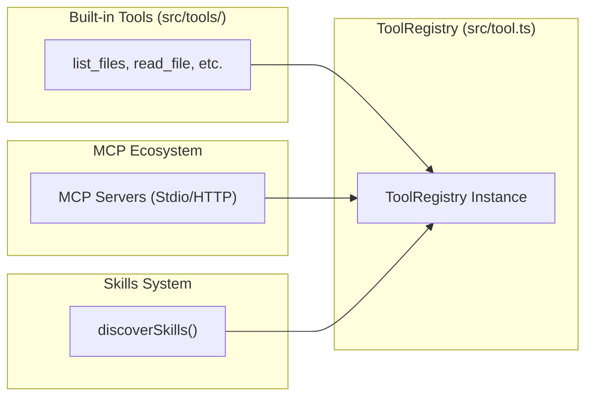
```mermaid
flowchart LR
    subgraph subGraph3 ["Skills System"]
        SK["discoverSkills()"]
    end
    subgraph subGraph2 ["MCP Ecosystem"]
        MS["MCP Servers (Stdio/HTTP)"]
    end
    subgraph subGraph1 ["Built-in Tools (src/tools/)"]
        BI["list_files, read_file, etc."]
    end
    subgraph subGraph0 ["ToolRegistry (src/tool.ts)"]
        TR["ToolRegistry Instance"]
    end
    BI --> TR
    MS --> TR
    SK --> TR
```

**来源：**[src/tools/index.ts42-80](https://github.com/LiuMengxuan04/MiniCode/blob/57cd741d/src/tools/index.ts#L42-L80)[src/tool.ts76-85](https://github.com/LiuMengxuan04/MiniCode/blob/57cd741d/src/tool.ts#L76-L85)

## 工具生命周期管理

注册表支持 "销毁器" 模式来清理资源。 当 MCP 服务器连接或后台进程启动时，"销毁器"（异步函数）被添加到注册表 [src/tool.ts87-89](https://github.com/LiuMengxuan04/MiniCode/blob/57cd741d/src/tool.ts#L87-L89) Calling `ToolRegistry.dispose()`[src/tool.ts126-128](https://github.com/LiuMengxuan04/MiniCode/blob/57cd741d/src/tool.ts#L126-L128) ensures that all external connections and child processes are cleanly terminated when the session ends.

**来源：**

- [src/tool.ts1-130](https://github.com/LiuMengxuan04/MiniCode/blob/57cd741d/src/tool.ts#L1-L130)
- [src/tools/index.ts1-81](https://github.com/LiuMengxuan04/MiniCode/blob/57cd741d/src/tools/index.ts#L1-L81)
- [ARCHITECTURE.md45-52](https://github.com/LiuMengxuan04/MiniCode/blob/57cd741d/ARCHITECTURE.md?plain=1#L45-L52)

---

## 内置文件与搜索工具

## 相关源文件
- [src/file-review.ts](https://github.com/LiuMengxuan04/MiniCode/blob/57cd741d/src/file-review.ts)
- [src/install.ts](https://github.com/LiuMengxuan04/MiniCode/blob/57cd741d/src/install.ts)
- [src/tools/edit-file.ts](https://github.com/LiuMengxuan04/MiniCode/blob/57cd741d/src/tools/edit-file.ts)
- [src/tools/grep-files.ts](https://github.com/LiuMengxuan04/MiniCode/blob/57cd741d/src/tools/grep-files.ts)
- [src/tools/list-files.ts](https://github.com/LiuMengxuan04/MiniCode/blob/57cd741d/src/tools/list-files.ts)
- [src/tools/modify-file.ts](https://github.com/LiuMengxuan04/MiniCode/blob/57cd741d/src/tools/modify-file.ts)
- [src/tools/patch-file.ts](https://github.com/LiuMengxuan04/MiniCode/blob/57cd741d/src/tools/patch-file.ts)
- [src/tools/read-file.ts](https://github.com/LiuMengxuan04/MiniCode/blob/57cd741d/src/tools/read-file.ts)
- [src/tools/write-file.ts](https://github.com/LiuMengxuan04/MiniCode/blob/57cd741d/src/tools/write-file.ts)
- [src/tui/input.ts](https://github.com/LiuMengxuan04/MiniCode/blob/57cd741d/src/tui/input.ts)
- [src/workspace.ts](https://github.com/LiuMengxuan04/MiniCode/blob/57cd741d/src/workspace.ts)

内置文件与搜索工具为 Agent 提供在受限工作区内探索、读取和修改文件系统的基本能力。 这些工具通过基于工作区根目录解析路径并通过 "写入前审查" 流程限制所有破坏性操作来实现安全优先原则。

## 路径解析与工作区安全

所有文件工具使用 `resolveToolPath` 来确保请求的路径不会逃逸指定的工作区。 此函数作为文件系统访问的主要安全边界。

### 路径解析逻辑

1. **规范化**：`targetPath` 使用 `path.resolve` 相对于 `context.cwd` 解析[src/workspace.ts9](https://github.com/LiuMengxuan04/MiniCode/blob/57cd741d/src/workspace.ts#L9-L9)
2. **权限检查**：如果上下文中存在 `PermissionManager`，它使用特定意图调用 `ensurePathAccess` (e.g., `'read'`, `'write'`, `'list'`, `'search'`) [src/workspace.ts26](https://github.com/LiuMengxuan04/MiniCode/blob/57cd741d/src/workspace.ts#L26-L26)
3. **后备边界检查**：如果没有权限管理器处于活动状态，它手动验证解析的路径相对于工作区根目录 and does not contain `..` escapes [src/workspace.ts11-21](https://github.com/LiuMengxuan04/MiniCode/blob/57cd741d/src/workspace.ts#L11-L21)

**数据流：路径解析**

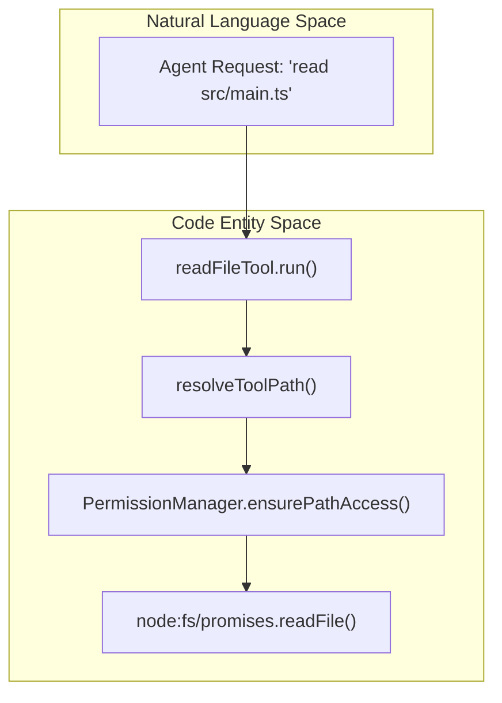
```mermaid
flowchart TD
    subgraph subGraph1 ["Code Entity Space"]
        B["readFileTool.run()"]
        C["resolveToolPath()"]
        D["PermissionManager.ensurePathAccess()"]
        E["node:fs/promises.readFile()"]
    end
    subgraph subGraph0 ["Natural Language Space"]
        A["Agent Request: 'read src/main.ts'"]
    end
    A --> B
    B --> C
    C --> D
    D --> E
```

Sources: [src/workspace.ts4-28](https://github.com/LiuMengxuan04/MiniCode/blob/57cd741d/src/workspace.ts#L4-L28)[src/tools/read-file.ts33-35](https://github.com/LiuMengxuan04/MiniCode/blob/57cd741d/src/tools/read-file.ts#L33-L35)

---

## 读取与发现工具

这些工具允许 Agent 检查项目结构和内容而不修改文件。

### list_files（列出文件）

列出相对于工作区根目录的目录内容。 限制为前 200 个条目以防止上下文窗口溢出 [src/tools/list-files.ts26-27](https://github.com/LiuMengxuan04/MiniCode/blob/57cd741d/src/tools/list-files.ts#L26-L27)

- **输入**： Optional `path`[src/tools/list-files.ts16-17](https://github.com/LiuMengxuan04/MiniCode/blob/57cd741d/src/tools/list-files.ts#L16-L17)
- **输出**： 条目列表，前缀为 `dir` 或 `file`[src/tools/list-files.ts27](https://github.com/LiuMengxuan04/MiniCode/blob/57cd741d/src/tools/list-files.ts#L27-L27)

### read_file（读取文件）

读取带内置分页的 UTF-8 文本文件。

- **分页**： Uses `offset` and `limit` to handle large files [src/tools/read-file.ts30-31](https://github.com/LiuMengxuan04/MiniCode/blob/57cd741d/src/tools/read-file.ts#L30-L31)
- **限制**： 默认限制为 8,000 个字符；最大为 20,000 [src/tools/read-file.ts12-13](https://github.com/LiuMengxuan04/MiniCode/blob/57cd741d/src/tools/read-file.ts#L12-L13)
- **元数据**： 返回包含 `TOTAL_CHARS`、`OFFSET`、`END` 和 `TRUNCATED` 状态的头部，以指导 Agent 在后续调用中的行为 [src/tools/read-file.ts41-50](https://github.com/LiuMengxuan04/MiniCode/blob/57cd741d/src/tools/read-file.ts#L41-L50)

### grep_files（搜索文件）

使用 `ripgrep`（`rg`）搜索模式。

- **实现**： Spawns a `rg` process with `-n` (line numbers) and `--no-heading`[src/tools/grep-files.ts30](https://github.com/LiuMengxuan04/MiniCode/blob/57cd741d/src/tools/grep-files.ts#L30-L30)
- **范围**： 如果没有提供路径，默认为当前目录 [src/tools/grep-files.ts33-35](https://github.com/LiuMengxuan04/MiniCode/blob/57cd741d/src/tools/grep-files.ts#L33-L35)
- **执行**： 使用 `execFile`，缓冲区限制为 1MB [src/tools/grep-files.ts37-40](https://github.com/LiuMengxuan04/MiniCode/blob/57cd741d/src/tools/grep-files.ts#L37-L40)

Sources: [src/tools/list-files.ts10-34](https://github.com/LiuMengxuan04/MiniCode/blob/57cd741d/src/tools/list-files.ts#L10-L34)[src/tools/read-file.ts15-57](https://github.com/LiuMengxuan04/MiniCode/blob/57cd741d/src/tools/read-file.ts#L15-L57)[src/tools/grep-files.ts14-47](https://github.com/LiuMengxuan04/MiniCode/blob/57cd741d/src/tools/grep-files.ts#L14-L47)

---

## 写入与编辑工具（写入前审查）

所有修改文件系统的工具（`write_file`、`edit_file`、`patch_file`、`modify_file`）遵循强制的 "写入前审查" 流程。 They do not write directly to disk but instead delegate to `applyReviewedFileChange`.

| 工具 | 用途 | 机制 |
| --- | --- | --- |
| `write_file` | 创建或覆盖文件。 | Passes full content to review flow [src/tools/write-file.ts28](https://github.com/LiuMengxuan04/MiniCode/blob/57cd741d/src/tools/write-file.ts#L28-L28) |
| `modify_file` | 用审查后的内容替换文件。 | Identical to `write_file`, used to signal intent to change existing content [src/tools/modify-file.ts12-13](https://github.com/LiuMengxuan04/MiniCode/blob/57cd741d/src/tools/modify-file.ts#L12-L13) |
| `edit_file` | 替换单个精确字符串。 | Performs `string.replace` or `split/join` before review [src/tools/edit-file.ts44-46](https://github.com/LiuMengxuan04/MiniCode/blob/57cd741d/src/tools/edit-file.ts#L44-L46) |
| `patch_file` | 应用多个替换。 | Iterates through an array of search/replace pairs [src/tools/patch-file.ts55-72](https://github.com/LiuMengxuan04/MiniCode/blob/57cd741d/src/tools/patch-file.ts#L55-L72) |

### 审查流程

`src/file-review.ts` 中的 `applyReviewedFileChange` 函数管理文件修改的生命周期：

1. **加载现有**：获取当前文件内容 using `loadExistingFile`[src/file-review.ts52](https://github.com/LiuMengxuan04/MiniCode/blob/57cd741d/src/file-review.ts#L52-L52)
2. **差异生成**：使用 `diff` 库中的 `createTwoFilesPatch` 生成统一差异 [src/file-review.ts16-24](https://github.com/LiuMengxuan04/MiniCode/blob/57cd741d/src/file-review.ts#L16-L24)
3. **权限门控**：调用 `context.permissions.ensureEdit(targetPath, diff)`。这会阻塞执行直到用户在 TUI 中批准差异 [src/file-review.ts61](https://github.com/LiuMengxuan04/MiniCode/blob/57cd741d/src/file-review.ts#L61-L61)
4. **提交**：批准后，如有必要，使用 `mkdir` 创建目录并写入文件 [src/file-review.ts63-64](https://github.com/LiuMengxuan04/MiniCode/blob/57cd741d/src/file-review.ts#L63-L64)

**数据流：写入前审查**

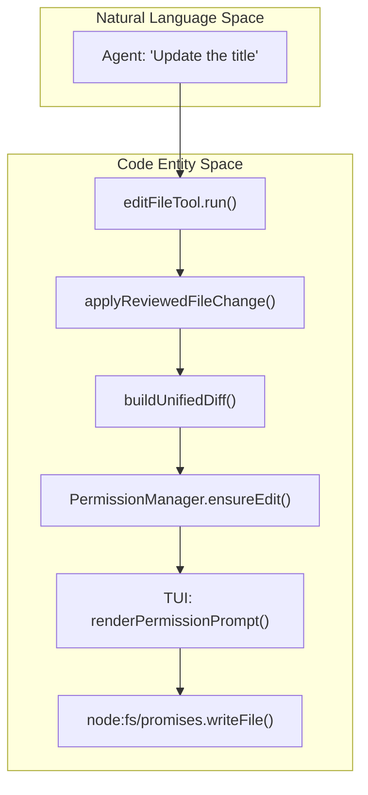
```mermaid
flowchart TD
    subgraph subGraph1 ["Code Entity Space"]
        B["editFileTool.run()"]
        C["applyReviewedFileChange()"]
        D["buildUnifiedDiff()"]
        E["PermissionManager.ensureEdit()"]
        F["TUI: renderPermissionPrompt()"]
        G["node:fs/promises.writeFile()"]
    end
    subgraph subGraph0 ["Natural Language Space"]
        A["Agent: 'Update the title'"]
    end
    A --> B
    B --> C
    C --> D
    D --> E
    E --> F
    F --> G
```

Sources: [src/file-review.ts46-70](https://github.com/LiuMengxuan04/MiniCode/blob/57cd741d/src/file-review.ts#L46-L70)[src/tools/edit-file.ts14-50](https://github.com/LiuMengxuan04/MiniCode/blob/57cd741d/src/tools/edit-file.ts#L14-L50)[src/tools/patch-file.ts18-84](https://github.com/LiuMengxuan04/MiniCode/blob/57cd741d/src/tools/patch-file.ts#L18-L84)[src/tools/write-file.ts11-30](https://github.com/LiuMengxuan04/MiniCode/blob/57cd741d/src/tools/write-file.ts#L11-L30)[src/tools/modify-file.ts11-30](https://github.com/LiuMengxuan04/MiniCode/blob/57cd741d/src/tools/modify-file.ts#L11-L30)

---

## 技术细节：实现辅助

### 差异生成

`buildUnifiedDiff` 函数创建标准补丁格式。 它包含 3 行上下文 [src/file-review.ts23](https://github.com/LiuMengxuan04/MiniCode/blob/57cd741d/src/file-review.ts#L23-L23) 并剥离前导分隔符行以保持 TUI 输出紧凑 [src/file-review.ts27-31](https://github.com/LiuMengxuan04/MiniCode/blob/57cd741d/src/file-review.ts#L27-L31)

### 错误处理

系统使用 `isEnoentError` 来区分缺失文件和其他文件系统错误 [src/file-review.ts38-40](https://github.com/LiuMengxuan04/MiniCode/blob/57cd741d/src/file-review.ts#L38-L40) 例如，如果文件不存在，`loadExistingFile` 返回空字符串，允许 "编辑" 作为 "创建" [src/file-review.ts34-44](https://github.com/LiuMengxuan04/MiniCode/blob/57cd741d/src/file-review.ts#L34-L44)

### 多重替换逻辑

在 `patch_file` 中，工具在继续之前验证每个 `search` 字符串是否存在于当前内容中。 如果 `replacements` 数组中的任何单个 `search` 字符串未找到，整个操作在将任何更改发送到审查流程之前失败并返回 `ok: false` [src/tools/patch-file.ts56-61](https://github.com/LiuMengxuan04/MiniCode/blob/57cd741d/src/tools/patch-file.ts#L56-L61) 它跟踪每个索引使用的是 `replaceAll` 还是 `replaceOnce`，以在最终工具输出中提供摘要 [src/tools/patch-file.ts63-82](https://github.com/LiuMengxuan04/MiniCode/blob/57cd741d/src/tools/patch-file.ts#L63-L82)

### 安装和环境设置

`src/install.ts` 脚本自动化设置 `minicode` 启动器并确保环境变量 like `ANTHROPIC_MODEL` and `ANTHROPIC_BASE_URL` 持久化到 `settings.json`[src/install.ts79-86](https://github.com/LiuMengxuan04/MiniCode/blob/57cd741d/src/install.ts#L79-L86) 它还处理在用户本地 bin 目录中创建启动器脚本 [src/install.ts94-102](https://github.com/LiuMengxuan04/MiniCode/blob/57cd741d/src/install.ts#L94-L102)

Sources: [src/file-review.ts7-44](https://github.com/LiuMengxuan04/MiniCode/blob/57cd741d/src/file-review.ts#L7-L44)[src/tools/patch-file.ts50-83](https://github.com/LiuMengxuan04/MiniCode/blob/57cd741d/src/tools/patch-file.ts#L50-L83)[src/install.ts39-121](https://github.com/LiuMengxuan04/MiniCode/blob/57cd741d/src/install.ts#L39-L121)

---

## Shell 执行工具

## 相关源文件
- [src/background-tasks.ts](https://github.com/LiuMengxuan04/MiniCode/blob/57cd741d/src/background-tasks.ts)
- [src/mcp-status.ts](https://github.com/LiuMengxuan04/MiniCode/blob/57cd741d/src/mcp-status.ts)
- [src/permissions.ts](https://github.com/LiuMengxuan04/MiniCode/blob/57cd741d/src/permissions.ts)
- [src/tools/run-command.ts](https://github.com/LiuMengxuan04/MiniCode/blob/57cd741d/src/tools/run-command.ts)

`run_command` 工具是 Agent 与主机操作系统交互的主要机制。 它提供受控接口来执行 Shell 命令、管理后台进程，并通过命令白名单和权限检查来强制执行安全策略。

## 核心实现：run_command

该工具在 `src/tools/run-command.ts` 中定义为 `runCommandTool`[src/tools/run-command.ts154](https://github.com/LiuMengxuan04/MiniCode/blob/57cd741d/src/tools/run-command.ts#L154-L154) 它通过 `inputSchema` 接受命令字符串、可选参数和可选工作目录[src/tools/run-command.ts158-169](https://github.com/LiuMengxuan04/MiniCode/blob/57cd741d/src/tools/run-command.ts#L158-L169)

### 命令规范化和解析

为处理不同的模型输出（例如提供像 `"git status"` 这样的完整字符串与结构化参数），该工具使用 `normalizeCommandInput`[src/tools/run-command.ts111-131](https://github.com/LiuMengxuan04/MiniCode/blob/57cd741d/src/tools/run-command.ts#L111-L131)

1. **结构化检查**：如果模型提供了 `args`，它会修整命令并直接使用它们 [src/tools/run-command.ts115-120](https://github.com/LiuMengxuan04/MiniCode/blob/57cd741d/src/tools/run-command.ts#L115-L120)
2. **字符串拆分**：如果只提供 `command` 字符串，`splitCommandLine` 将其解析为命令和参数数组，遵守单/双引号和反斜杠转义 [src/tools/run-command.ts57-109](https://github.com/LiuMengxuan04/MiniCode/blob/57cd741d/src/tools/run-command.ts#L57-L109)

### 分类和安全

命令被分类到不同类别以确定所需的权限级别：

| 类别 | 描述 | 示例 |
| --- | --- | --- |
| **只读命令** | 不修改状态的可观察性工具。 | `ls`, `grep`, `pwd`, `cat`, `du`, `find`, `rg`[src/tools/run-command.ts12-30](https://github.com/LiuMengxuan04/MiniCode/blob/57cd741d/src/tools/run-command.ts#L12-L30) |
| **开发命令** | 可能修改状态但常见的标准开发工具。 | `git`, `npm`, `node`, `python3`, `bun`, `pytest`[src/tools/run-command.ts32-41](https://github.com/LiuMengxuan04/MiniCode/blob/57cd741d/src/tools/run-command.ts#L32-L41) |
| **Unknown/Shell** | Anything not in the allowlist or containing shell operators. | `rm -rf`, `curl`, `bash -c "..."` |

**来源：**[src/tools/run-command.ts12-45](https://github.com/LiuMengxuan04/MiniCode/blob/57cd741d/src/tools/run-command.ts#L12-L45)[src/tools/run-command.ts191-209](https://github.com/LiuMengxuan04/MiniCode/blob/57cd741d/src/tools/run-command.ts#L191-L209)

## 执行逻辑流程

该工具区分简单二进制执行和 Shell 包装执行（用于管道或环境变量）。

### 逻辑流程图：自然语言到代码实体

此图说明了用户的命令请求如何由 `run_command` 的内部逻辑处理。

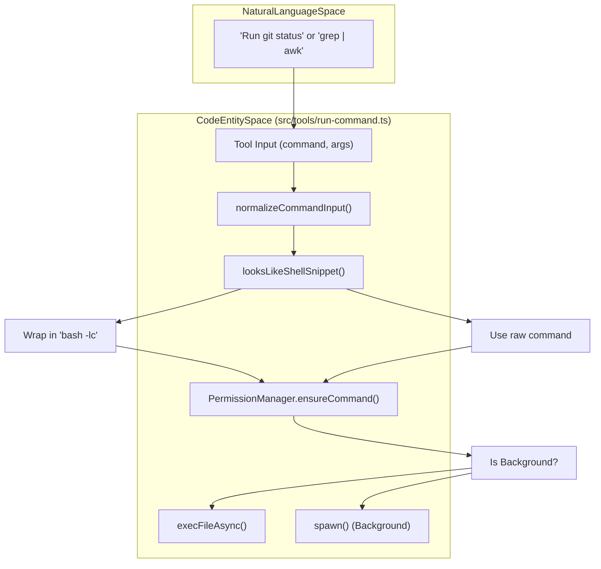
```mermaid
flowchart TD
    ShellWrap["Wrap in 'bash -lc'"]
    Direct["Use raw command"]
    RunType["Is Background?"]
    subgraph subGraph1 ["CodeEntitySpace (src/tools/run-command.ts)"]
        Input["Tool Input (command, args)"]
        Norm["normalizeCommandInput()"]
        SnippetCheck["looksLikeShellSnippet()"]
        PermCheck["PermissionManager.ensureCommand()"]
        ExecFile["execFileAsync()"]
        Spawn["spawn() (Background)"]
    end
    subgraph NaturalLanguageSpace
        UserRequest["'Run git status' or 'grep | awk'"]
    end
    UserRequest --> Input
    Input --> Norm
    Norm --> SnippetCheck
    SnippetCheck --> ShellWrap
    SnippetCheck --> Direct
    ShellWrap --> PermCheck
    Direct --> PermCheck
    PermCheck --> RunType
    RunType --> Spawn
    RunType --> ExecFile
```

**来源：**[src/tools/run-command.ts111-131](https://github.com/LiuMengxuan04/MiniCode/blob/57cd741d/src/tools/run-command.ts#L111-L131)[src/tools/run-command.ts133-139](https://github.com/LiuMengxuan04/MiniCode/blob/57cd741d/src/tools/run-command.ts#L133-L139)[src/tools/run-command.ts188-210](https://github.com/LiuMengxuan04/MiniCode/blob/57cd741d/src/tools/run-command.ts#L188-L210)[src/tools/run-command.ts212-242](https://github.com/LiuMengxuan04/MiniCode/blob/57cd741d/src/tools/run-command.ts#L212-L242)

## Shell 片段检测

该工具通过扫描特殊字符自动检测命令是否需要 Shell 环境： `|`, `&`, `;`, `<`, `>`, `(`, `)`, `$`, ``` using `looksLikeShellSnippet`[src/tools/run-command.ts133-139](https://github.com/LiuMengxuan04/MiniCode/blob/57cd741d/src/tools/run-command.ts#L133-L139)

如果检测到，命令通过 `bash -lc` 执行，以确保 Shell 特性（如管道或变量扩展）和用户配置文件可用 [src/tools/run-command.ts193-196](https://github.com/LiuMengxuan04/MiniCode/blob/57cd741d/src/tools/run-command.ts#L193-L196)

## 后台任务

MiniCode 通过 `&` 操作符支持长时间运行的进程（例如启动开发服务器）。

1. **检测**： `isBackgroundShellSnippet` 检查命令是否以 `&` 结尾（但不是 `&&`） [src/tools/run-command.ts141-149](https://github.com/LiuMengxuan04/MiniCode/blob/57cd741d/src/tools/run-command.ts#L141-L149)
2. **生成**： 进程使用 `spawn` 启动，`detached: true` 和 `stdio: 'ignore'`[src/tools/run-command.ts212-217](https://github.com/LiuMengxuan04/MiniCode/blob/57cd741d/src/tools/run-command.ts#L212-L217)
3. **注册**： 进程 ID（PID）和命令详情存储在 `tasks` Map 中 within `src/background-tasks.ts`[src/background-tasks.ts9](https://github.com/LiuMengxuan04/MiniCode/blob/57cd741d/src/background-tasks.ts#L9-L9)[src/background-tasks.ts43-59](https://github.com/LiuMengxuan04/MiniCode/blob/57cd741d/src/background-tasks.ts#L43-L59)
4. **跟踪**： `registerBackgroundShellTask` 生成唯一的 `taskId`（例如 `shell_k3j1_...`）并将状态标记为 `running`[src/background-tasks.ts11-13](https://github.com/LiuMengxuan04/MiniCode/blob/57cd741d/src/background-tasks.ts#L11-L13)[src/background-tasks.ts48-57](https://github.com/LiuMengxuan04/MiniCode/blob/57cd741d/src/background-tasks.ts#L48-L57)

### 后台任务状态管理

系统通过在 `refreshRecord` 中使用 `process.kill(pid, 0)` 轮询其 PID 来跟踪后台进程的生命周期以检查是否存在[src/background-tasks.ts15-41](https://github.com/LiuMengxuan04/MiniCode/blob/57cd741d/src/background-tasks.ts#L15-L41)

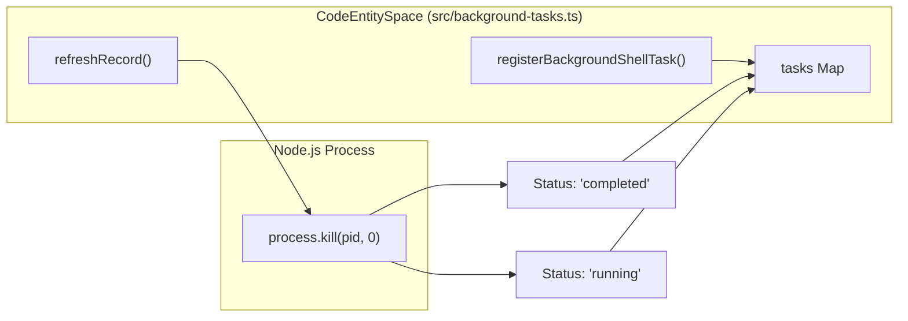
```mermaid
flowchart LR
    StatusComp["Status: 'completed'"]
    StatusRun["Status: 'running'"]
    subgraph subGraph1 ["Node.js Process"]
        Kill0["process.kill(pid, 0)"]
    end
    subgraph subGraph0 ["CodeEntitySpace (src/background-tasks.ts)"]
        Register["registerBackgroundShellTask()"]
        Refresh["refreshRecord()"]
        TasksMap["tasks Map"]
    end
    Register --> TasksMap
    Refresh --> Kill0
    Kill0 --> StatusComp
    Kill0 --> StatusRun
    StatusComp --> TasksMap
    StatusRun --> TasksMap
```

**来源：**[src/background-tasks.ts15-41](https://github.com/LiuMengxuan04/MiniCode/blob/57cd741d/src/background-tasks.ts#L15-L41)[src/background-tasks.ts43-59](https://github.com/LiuMengxuan04/MiniCode/blob/57cd741d/src/background-tasks.ts#L43-L59)

## 权限强制

`run_command` 工具与 `PermissionManager` 交互以控制执行 [src/tools/run-command.ts204-209](https://github.com/LiuMengxuan04/MiniCode/blob/57cd741d/src/tools/run-command.ts#L204-L209)

- **只读**： `READONLY_COMMANDS` 中的命令如果工具确定它们是安全的，通常会执行而不提示 [src/tools/run-command.ts207-209](https://github.com/LiuMengxuan04/MiniCode/blob/57cd741d/src/tools/run-command.ts#L207-L209)
- **开发/未知**： `DEVELOPMENT_COMMANDS` 或未知命令触发 `ensureCommand`. 如果命令未知，会向用户提供 `forcePromptReason` [src/tools/run-command.ts198-206](https://github.com/LiuMengxuan04/MiniCode/blob/57cd741d/src/tools/run-command.ts#L198-L206)
- **Shell 片段**： 任何被识别为 Shell 片段的命令都会触发权限检查，因为管道的完整范围无法静态分析 [src/tools/run-command.ts207-209](https://github.com/LiuMengxuan04/MiniCode/blob/57cd741d/src/tools/run-command.ts#L207-L209)
- **危险签名**： `PermissionManager` 使用 `classifyDangerousCommand` 来识别即使在允许的二进制文件中的危险模式, 例如 `git reset --hard` 或 `npm publish`[src/permissions.ts86-136](https://github.com/LiuMengxuan04/MiniCode/blob/57cd741d/src/permissions.ts#L86-L136)

**来源：**[src/tools/run-command.ts12-45](https://github.com/LiuMengxuan04/MiniCode/blob/57cd741d/src/tools/run-command.ts#L12-L45)[src/tools/run-command.ts198-209](https://github.com/LiuMengxuan04/MiniCode/blob/57cd741d/src/tools/run-command.ts#L198-L209)[src/permissions.ts86-136](https://github.com/LiuMengxuan04/MiniCode/blob/57cd741d/src/permissions.ts#L86-L136)

---

## Web、技能与交互工具

## 相关源文件
- [src/tools/ask-user.ts](https://github.com/LiuMengxuan04/MiniCode/blob/57cd741d/src/tools/ask-user.ts)
- [src/tools/load-skill.ts](https://github.com/LiuMengxuan04/MiniCode/blob/57cd741d/src/tools/load-skill.ts)
- [src/tools/web-fetch.ts](https://github.com/LiuMengxuan04/MiniCode/blob/57cd741d/src/tools/web-fetch.ts)
- [src/tools/web-search.ts](https://github.com/LiuMengxuan04/MiniCode/blob/57cd741d/src/tools/web-search.ts)
- [src/utils/web.ts](https://github.com/LiuMengxuan04/MiniCode/blob/57cd741d/src/utils/web.ts)

本页面涵盖 MiniCode 中的专业工具，这些工具将 Agent 的能力扩展到本地文件系统之外。 这包括用于外部上下文的 Web 搜索和获取、用于加载复杂工作流的技能系统，以及与用户的结构化交互。

## Web 工具

MiniCode 提供两个用于与公共 Web 交互的主要工具：`web_search` 和 `web_fetch`。 这些工具由 `src/utils/web.ts` 中的强大实用程序层支持，处理提供商故障转移、重试逻辑和内容提取。

### Web 搜索（`web_search`）

`web_search` 工具允许 Agent 查询本地工作区中不可用的互联网信息 [src/tools/web-search.ts12-15](https://github.com/LiuMengxuan04/MiniCode/blob/57cd741d/src/tools/web-search.ts#L12-L15) 它支持按允许或阻止的域进行过滤，但不能同时指定两者 [src/tools/web-search.ts41-53](https://github.com/LiuMengxuan04/MiniCode/blob/57cd741d/src/tools/web-search.ts#L41-L53)

**实现细节：**

- **提供商：** 系统使用优先级列表的提供商： `duckduckgo-lite` 然后是 `sogou` 作为后备 [src/utils/web.ts142-144](https://github.com/LiuMengxuan04/MiniCode/blob/57cd741d/src/utils/web.ts#L142-L144)
- **数据流：** 该工具调用 `searchDuckDuckGoLite`[src/tools/web-search.ts56-61](https://github.com/LiuMengxuan04/MiniCode/blob/57cd741d/src/tools/web-search.ts#L56-L61) 它迭代提供商直到找到结果或全部失败 [src/utils/web.ts144-173](https://github.com/LiuMengxuan04/MiniCode/blob/57cd741d/src/utils/web.ts#L144-L173)
- **输出：** 返回格式化的结果列表，包括标题、URL 和摘要 [src/tools/web-search.ts70-82](https://github.com/LiuMengxuan04/MiniCode/blob/57cd741d/src/tools/web-search.ts#L70-L82)

### Web 获取（`web_fetch`）

一旦识别到相关 URL，`web_fetch` 用于获取页面的完整内容 [src/tools/web-fetch.ts12-13](https://github.com/LiuMengxuan04/MiniCode/blob/57cd741d/src/tools/web-fetch.ts#L12-L13)

**内容处理：**

- **可读性提取：** 对于 HTML 内容，系统使用 `extractReadableText` 去除样板，使用 `extractTitle` 获取页面标题 [src/utils/web.ts234-235](https://github.com/LiuMengxuan04/MiniCode/blob/57cd741d/src/utils/web.ts#L234-L235)
- **截断：** 为管理上下文窗口限制，输出被截断为默认 12,000 个字符 [src/tools/web-fetch.ts31-32](https://github.com/LiuMengxuan04/MiniCode/blob/57cd741d/src/tools/web-fetch.ts#L31-L32)
- **重定向：** 该实用程序自动跟随 HTTP 重定向 [src/utils/web.ts208](https://github.com/LiuMengxuan04/MiniCode/blob/57cd741d/src/utils/web.ts#L208-L208) 并处理 HTML 级别的 meta-refresh via `extractHtmlRedirectUrl`[src/utils/web.ts217-224](https://github.com/LiuMengxuan04/MiniCode/blob/57cd741d/src/utils/web.ts#L217-L224)

### 健壮性和重试逻辑

`fetchWithRetry` 函数提供对临时网络问题的弹性 [src/utils/web.ts65-72](https://github.com/LiuMengxuan04/MiniCode/blob/57cd741d/src/utils/web.ts#L65-L72)

- **可重试错误：** 它识别特定的网络代码 (e.g., `ETIMEDOUT`, `ECONNRESET`, `ENOTFOUND`, `UND_ERR_CONNECT_TIMEOUT`) [src/utils/web.ts32-41](https://github.com/LiuMengxuan04/MiniCode/blob/57cd741d/src/utils/web.ts#L32-L41) 以及 HTTP 状态码（429、5xx）作为可重试的 [src/utils/web.ts22-24](https://github.com/LiuMengxuan04/MiniCode/blob/57cd741d/src/utils/web.ts#L22-L24)
- **退避：** 使用指数退避： `300 * Math.pow(2, attempt)` milliseconds [src/utils/web.ts94-103](https://github.com/LiuMengxuan04/MiniCode/blob/57cd741d/src/utils/web.ts#L94-L103)
- **超时：** 默认每个请求超时 12 秒 [src/utils/web.ts15](https://github.com/LiuMengxuan04/MiniCode/blob/57cd741d/src/utils/web.ts#L15-L15)

**Web 工具执行流程**

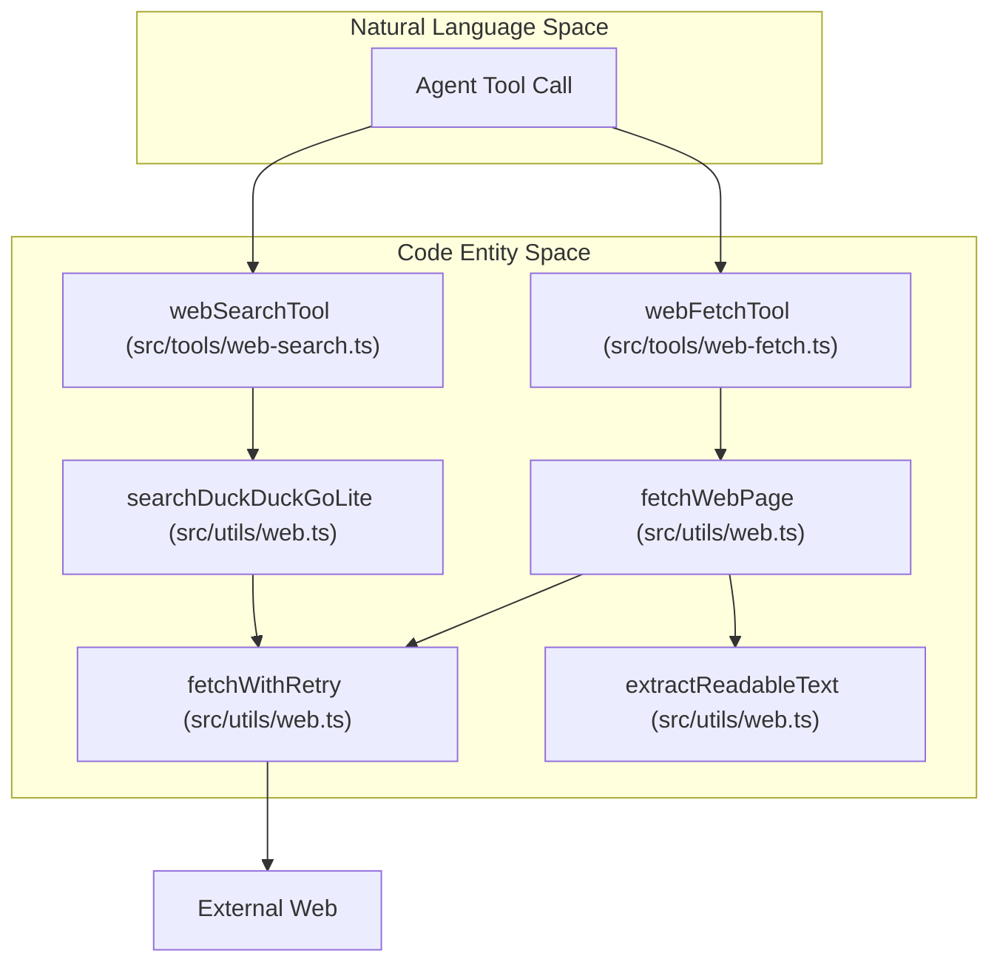
```mermaid
flowchart TD
    H["External Web"]
    subgraph subGraph1 ["Code Entity Space"]
        B["webSearchTool (src/tools/web-search.ts)"]
        C["webFetchTool (src/tools/web-fetch.ts)"]
        D["searchDuckDuckGoLite (src/utils/web.ts)"]
        E["fetchWebPage (src/utils/web.ts)"]
        F["fetchWithRetry (src/utils/web.ts)"]
        G["extractReadableText (src/utils/web.ts)"]
    end
    subgraph subGraph0 ["Natural Language Space"]
        A["Agent Tool Call"]
    end
    A --> B
    A --> C
    B --> D
    C --> E
    D --> F
    E --> F
    E --> G
    F --> H
```

Sources: [src/utils/web.ts13-42](https://github.com/LiuMengxuan04/MiniCode/blob/57cd741d/src/utils/web.ts#L13-L42)[src/utils/web.ts65-127](https://github.com/LiuMengxuan04/MiniCode/blob/57cd741d/src/utils/web.ts#L65-L127)[src/tools/web-search.ts54-61](https://github.com/LiuMengxuan04/MiniCode/blob/57cd741d/src/tools/web-search.ts#L54-L61)[src/tools/web-fetch.ts29-32](https://github.com/LiuMengxuan04/MiniCode/blob/57cd741d/src/tools/web-fetch.ts#L29-L32)

## 技能工具（`load_skill`）

`load_skill` 工具允许 Agent 动态地将 "技能"（预定义的工作流或文档）注入到其当前上下文中。 这对于遵循 `SKILL.md` 文件中定义的项目特定复杂程序至关重要 [src/tools/load-skill.ts12-13](https://github.com/LiuMengxuan04/MiniCode/blob/57cd741d/src/tools/load-skill.ts#L12-L13)

- **发现：** 该工具依赖 `loadSkill` 实用程序 (imported from `src/skills.ts`) 根据提供的名称查找技能文件 [src/tools/load-skill.ts25](https://github.com/LiuMengxuan04/MiniCode/blob/57cd741d/src/tools/load-skill.ts#L25-L25)
- **注入：** 执行时，它返回技能文件的完整文本，包括其名称、来源和路径，有效地使指令进入对话历史供 Agent 遵循 [src/tools/load-skill.ts33-42](https://github.com/LiuMengxuan04/MiniCode/blob/57cd741d/src/tools/load-skill.ts#L33-L42)

**技能加载架构**

```mermaid
flowchart LR
    subgraph subGraph1 ["Code Entity Space"]
        B["createLoadSkillTool (src/tools/load-skill.ts)"]
        C["loadSkill (src/skills.ts)"]
        D[".mini-code/skills/*.md"]
    end
    subgraph subGraph0 ["Natural Language Space"]
        A["Workflow Instruction"]
    end
    A --> B
    B --> C
    C --> D
```

Sources: [src/tools/load-skill.ts9-45](https://github.com/LiuMengxuan04/MiniCode/blob/57cd741d/src/tools/load-skill.ts#L9-L45)[src/tools/load-skill.ts25](https://github.com/LiuMengxuan04/MiniCode/blob/57cd741d/src/tools/load-skill.ts#L25-L25)

## 交互工具（`ask_user`）

`ask_user` 工具是一种专门的交互机制，暂停 Agent 的执行循环以等待人工输入 [src/tools/ask-user.ts9-11](https://github.com/LiuMengxuan04/MiniCode/blob/57cd741d/src/tools/ask-user.ts#L9-L11)

与立即向模型返回数据的其他工具不同，`ask_user` 设置一个特定标志：

- **`awaitUser: true`**： 当 `run` 方法返回此标志时，Agent 循环终止当前回合并等待用户通过 TUI 提供响应 [src/tools/ask-user.ts27-28](https://github.com/LiuMengxuan04/MiniCode/blob/57cd741d/src/tools/ask-user.ts#L27-L28)
- **目的：** 用于在继续任务之前澄清模糊的指令或请求缺失的信息（例如凭据、特定偏好）。

| 功能 | `ask_user` 实现 |
| --- | --- |
| **输入模式** | Object with a single `question` string [src/tools/ask-user.ts14-18](https://github.com/LiuMengxuan04/MiniCode/blob/57cd741d/src/tools/ask-user.ts#L14-L18) |
| **验证** | Zod schema ensures `question` is non-empty [src/tools/ask-user.ts19-21](https://github.com/LiuMengxuan04/MiniCode/blob/57cd741d/src/tools/ask-user.ts#L19-L21) |
| **返回值** | Returns the question as output and sets `awaitUser` to `true`[src/tools/ask-user.ts24-28](https://github.com/LiuMengxuan04/MiniCode/blob/57cd741d/src/tools/ask-user.ts#L24-L28) |

Sources: [src/tools/ask-user.ts8-30](https://github.com/LiuMengxuan04/MiniCode/blob/57cd741d/src/tools/ask-user.ts#L8-L30)

---

# 权限与安全
相关源文件
- [ARCHITECTURE.md](https://github.com/LiuMengxuan04/MiniCode/blob/57cd741d/ARCHITECTURE.md?plain=1)
- [CLAUDE_CODE_PATTERNS.md](https://github.com/LiuMengxuan04/MiniCode/blob/57cd741d/CLAUDE_CODE_PATTERNS.md?plain=1)
- [CLAUDE_CODE_PATTERNS_ZH.md](https://github.com/LiuMengxuan04/MiniCode/blob/57cd741d/CLAUDE_CODE_PATTERNS_ZH.md?plain=1)
- [src/permissions.ts](https://github.com/LiuMengxuan04/MiniCode/blob/57cd741d/src/permissions.ts)
- [src/tools/run-command.ts](https://github.com/LiuMengxuan04/MiniCode/blob/57cd741d/src/tools/run-command.ts)

MiniCode 实现了一个强大的安全模型，旨在为智能体提供足够的自主性以提高工作效率，同时确保用户对敏感操作的掌控权。安全架构建立在三个核心支柱之上：路径访问控制、命令执行审批，以及所有文件系统修改的强制"写入前审查"流程。

该系统遵循最小权限原则，危险操作或越界文件访问会触发交互式权限提示。这些决策可以针对单个实例、单次智能体轮次授予，也可以持久化保存以在可信环境中减少摩擦。

### 核心安全架构

安全模型弥合了智能体意图（自然语言/工具调用）与本地系统完整性之间的差距。下图说明了 `PermissionManager` 和 `file-review` 子系统如何控制敏感操作的访问。

**安全强制流程**

```mermaid
flowchart TD
    Diff["TUI Diff View"]
    Write["FileSystem Write"]
    subgraph subGraph1 ["Code Entity Space (src/)"]
        PM["PermissionManager (src/permissions.ts)"]
        FR["File Review (src/file-review.ts)"]
        Workspace["Workspace (src/workspace.ts)"]
        RC["runCommandTool (src/tools/run-command.ts)"]
    end
    subgraph subGraph0 ["Natural Language Space"]
        User["User Intent"]
        Model["Claude Model"]
    end
    User --> Model
    Model --> RC
    RC --> PM
    PM --> Workspace
    PM --> FR
    FR --> Diff
    Diff --> Write
```

Sources: [src/permissions.ts156-178](https://github.com/LiuMengxuan04/MiniCode/blob/57cd741d/src/permissions.ts#L156-L178)[src/file-review.ts46-70](https://github.com/LiuMengxuan04/MiniCode/blob/57cd741d/src/file-review.ts#L46-L70)[src/tools/run-command.ts154-175](https://github.com/LiuMengxuan04/MiniCode/blob/57cd741d/src/tools/run-command.ts#L154-L175)[src/workspace.ts1-20](https://github.com/LiuMengxuan04/MiniCode/blob/57cd741d/src/workspace.ts#L1-L20)

### 权限管理

`src/permissions.ts` 中的 `PermissionManager` 类是所有安全相关决策的中心权威。它维护会话级权限和存储在 `permissions.json` 中的持久化规则的状态。

- **路径访问**：使用 `ensurePathAccess`[src/permissions.ts246-270](https://github.com/LiuMengxuan04/MiniCode/blob/57cd741d/src/permissions.ts#L246-L270) 验证智能体不会访问允许的工作区或特定额外目录之外的文件
- **命令安全**：拦截 shell 命令。它使用 `classifyDangerousCommand`[src/permissions.ts86-136](https://github.com/LiuMengxuan04/MiniCode/blob/57cd741d/src/permissions.ts#L86-L136) 专门识别"危险"命令（如 `git reset --hard`、`npm publish`，或通过 `node` 或 `bash` 执行任意脚本），通过 `ensureCommand`[src/permissions.ts272-315](https://github.com/LiuMengxuan04/MiniCode/blob/57cd741d/src/permissions.ts#L272-L315) 强制用户提示
- **决策持久化**：用户可以选择 `allow_always` 或 `deny_always`，管理器通过 `writePermissionStore`[src/permissions.ts151-154](https://github.com/LiuMengxuan04/MiniCode/blob/57cd741d/src/permissions.ts#L151-L154) 将其序列化到 `PERMISSIONS_PATH`[src/permissions.ts53-54](https://github.com/LiuMengxuan04/MiniCode/blob/57cd741d/src/permissions.ts#L53-L54)
- **轮次作用域**：管理器支持通过 `beginTurn` 和 `endTurn`[src/permissions.ts212-221](https://github.com/LiuMengxuan04/MiniCode/blob/57cd741d/src/permissions.ts#L212-L221) 在单次轮次后过期的临时授权，甚至支持 `allow_all_turn` 用于广泛的临时信任 [src/permissions.ts10](https://github.com/LiuMengxuan04/MiniCode/blob/57cd741d/src/permissions.ts#L10-L10)

有关决策类型和持久化的详细信息，请参见[权限管理器](/LiuMengxuan04/MiniCode/4.1-permission-manager)。

**命令分类逻辑**

| 命令 | 条件 | 识别的风险 |
| --- | --- | --- |
| `git` | `reset --hard`、`clean`、`push -f` | 数据丢失或远程历史重写 [src/permissions.ts90-119](https://github.com/LiuMengxuan04/MiniCode/blob/57cd741d/src/permissions.ts#L90-L119) |
| `npm` | `publish` | 外部注册表修改 [src/permissions.ts121-123](https://github.com/LiuMengxuan04/MiniCode/blob/57cd741d/src/permissions.ts#L121-L123) |
| `bash`/`sh` | 任意 | 任意代码执行 [src/permissions.ts129-130](https://github.com/LiuMengxuan04/MiniCode/blob/57cd741d/src/permissions.ts#L129-L130) |
| `node`/`python3`/`bun` | 任意 | 任意代码执行 [src/permissions.ts126-128](https://github.com/LiuMengxuan04/MiniCode/blob/57cd741d/src/permissions.ts#L126-L128) |

Sources: [src/permissions.ts86-136](https://github.com/LiuMengxuan04/MiniCode/blob/57cd741d/src/permissions.ts#L86-L136)[src/permissions.ts181-206](https://github.com/LiuMengxuan04/MiniCode/blob/57cd741d/src/permissions.ts#L181-L206)[src/tools/run-command.ts12-41](https://github.com/LiuMengxuan04/MiniCode/blob/57cd741d/src/tools/run-command.ts#L12-L41)

### 写入前审查流程

MiniCode 不允许智能体静默覆盖文件。无论通过 `write_file`、`patch_file` 还是 `edit_file` 进行的每次修改，都必须经过 `src/file-review.ts` 中的文件审查子系统。

1. **差异生成**：系统使用 `buildUnifiedDiff`[src/file-review.ts7-32](https://github.com/LiuMengxuan04/MiniCode/blob/57cd741d/src/file-review.ts#L7-L32) 计算 `previousContent` 和 `nextContent` 之间的统一差异
2. **用户审查**：此差异在 TUI 中展示，使用户能够准确看到被添加或删除的行。
3. **门控应用**：函数 `applyReviewedFileChange` 调用 `context.permissions.ensureEdit`，在用户提供 `PermissionDecision` 之前阻止执行[src/file-review.ts46-62](https://github.com/LiuMengxuan04/MiniCode/blob/57cd741d/src/file-review.ts#L46-L62)

有关差异引擎和 TUI 集成的详细信息，请参见[文件审查和差异流程](/LiuMengxuan04/MiniCode/4.2-file-review-and-diff-flow)。

### 子系统交互

安全模型深度集成到 `ToolContext` 中。当工具被执行时，它会收到对活动 `PermissionManager` 的引用。`run_command` 工具专门使用它来控制非只读命令[src/tools/run-command.ts207-209](https://github.com/LiuMengxuan04/MiniCode/blob/57cd741d/src/tools/run-command.ts#L207-L209)

**工具-权限关联**

```mermaid
classDiagram
    class PermissionManager {
        +ensurePathAccess(path, intent)
        +ensureCommand(command, args)
        +ensureEdit(targetPath, diff)
        -classifyDangerousCommand(cmd, args)
    }
    class ToolContext {
        +PermissionManager permissions
    }
    class FileReview {
        +buildUnifiedDiff(path, before, after)
        +applyReviewedFileChange(context, path, target, next)
    }
    class RunCommandTool {
        +run(input, context)
    }
    ToolContext --> PermissionManager
    FileReview ..> PermissionManager
    RunCommandTool ..> PermissionManager
```

Sources: [src/permissions.ts156-175](https://github.com/LiuMengxuan04/MiniCode/blob/57cd741d/src/permissions.ts#L156-L175)[src/file-review.ts46-61](https://github.com/LiuMengxuan04/MiniCode/blob/57cd741d/src/file-review.ts#L46-L61)[src/tools/run-command.ts203-209](https://github.com/LiuMengxuan04/MiniCode/blob/57cd741d/src/tools/run-command.ts#L203-L209)[src/tool.ts1-15](https://github.com/LiuMengxuan04/MiniCode/blob/57cd741d/src/tool.ts#L1-L15)

---

### Child Pages

- [权限管理器](/LiuMengxuan04/MiniCode/4.1-permission-manager) — 详细介绍 `PermissionManager`：路径验证、命令模式和 `permissions.json` 模式。
- [文件审查和差异流程](/LiuMengxuan04/MiniCode/4.2-file-review-and-diff-flow) — 解释 `Review-Before-Write` 子系统：`buildUnifiedDiff` 实现和 TUI 审批门控。

---

# 权限管理器
相关源文件
- [src/config.ts](https://github.com/LiuMengxuan04/MiniCode/blob/57cd741d/src/config.ts)
- [src/manage-cli.ts](https://github.com/LiuMengxuan04/MiniCode/blob/57cd741d/src/manage-cli.ts)
- [src/mcp.ts](https://github.com/LiuMengxuan04/MiniCode/blob/57cd741d/src/mcp.ts)
- [src/permissions.ts](https://github.com/LiuMengxuan04/MiniCode/blob/57cd741d/src/permissions.ts)
- [src/skills.ts](https://github.com/LiuMengxuan04/MiniCode/blob/57cd741d/src/skills.ts)
- [src/tools/run-command.ts](https://github.com/LiuMengxuan04/MiniCode/blob/57cd741d/src/tools/run-command.ts)

`PermissionManager` 是 MiniCode 安全性的中心权威。 它管理文件系统访问权限、验证 shell 命令执行，并通过多层级审批系统控制文件修改。 它支持会话级缓存、持久化用户偏好和细粒度的"危险命令"分类。

## 核心职责

`PermissionManager` 类 [src/permissions.ts156-178](https://github.com/LiuMengxuan04/MiniCode/blob/57cd741d/src/permissions.ts#L156-L178) 管理三类主要请求：

1. **路径访问**：确保智能体仅读取或列出其被授权访问的目录。
2. **命令执行**：根据白名单、黑名单和"危险"模式验证 shell 命令。
3. **编辑操作**：通过"写入前审查"流程控制文件写入。

### 决策类型

当请求权限时，系统使用 `PermissionDecision` 类型 [src/permissions.ts6-14](https://github.com/LiuMengxuan04/MiniCode/blob/57cd741d/src/permissions.ts#L6-L14) 来确定用户响应的范围：

- `allow_once`：仅允许此特定调用。
- `allow_always`：允许并持久化到 `permissions.json`。
- `allow_turn`：允许在当前智能体轮次的剩余时间内。
- `allow_all_turn`：允许在当前轮次内的所有后续编辑。
- `deny_once`：阻止此操作一次。
- `deny_always`：永久阻止此操作。
- `deny_with_feedback`：阻止操作并向模型提供解释原因的字符串。

Sources: [src/permissions.ts6-40](https://github.com/LiuMengxuan04/MiniCode/blob/57cd741d/src/permissions.ts#L6-L40)[src/permissions.ts156-178](https://github.com/LiuMengxuan04/MiniCode/blob/57cd741d/src/permissions.ts#L156-L178)

## 架构和数据流

下图说明了 `PermissionManager` 如何桥接高级工具请求和底层持久化层之间的差距。

### 权限请求流程

```mermaid
flowchart TD
    subgraph subGraph2 ["Persistence: src/config.ts"]
        PJSON["permissions.json"]
    end
    subgraph subGraph1 ["Code Entity Space: src/permissions.ts"]
        PM["PermissionManager Class"]
        EP["ensurePathAccess()"]
        EC["ensureCommand()"]
        EE["ensureEdit()"]
        CDC["classifyDangerousCommand()"]
        PPH["PermissionPromptHandler"]
    end
    subgraph subGraph0 ["Natural Language Space"]
        User["User (TUI)"]
        Model["Claude Model"]
    end
    Model --> PM
    PM --> EP
    PM --> EC
    PM --> EE
    EC --> CDC
    EP --> PPH
    EC --> PPH
    EE --> PPH
    PPH --> User
    User --> PJSON
    PJSON --> PM
```

Sources: [src/permissions.ts156-206](https://github.com/LiuMengxuan04/MiniCode/blob/57cd741d/src/permissions.ts#L156-L206)[src/permissions.ts38-40](https://github.com/LiuMengxuan04/MiniCode/blob/57cd741d/src/permissions.ts#L38-L40)[src/permissions.ts53](https://github.com/LiuMengxuan04/MiniCode/blob/57cd741d/src/permissions.ts#L53-L53)[src/permissions.ts251-460](https://github.com/LiuMengxuan04/MiniCode/blob/57cd741d/src/permissions.ts#L251-L460)

## 实现细节

### Persistence and Initialization

Permissions are persisted in `permissions.json` located in the `MINI_CODE_DIR`[src/permissions.ts53](https://github.com/LiuMengxuan04/MiniCode/blob/57cd741d/src/permissions.ts#L53-L53) Upon instantiation, the `PermissionManager` calls `initialize()`[src/permissions.ts180-206](https://github.com/LiuMengxuan04/MiniCode/blob/57cd741d/src/permissions.ts#L180-L206) which reads the `PermissionStore`[src/permissions.ts42-49](https://github.com/LiuMengxuan04/MiniCode/blob/57cd741d/src/permissions.ts#L42-L49) from disk using `readPermissionStore`[src/permissions.ts138-149](https://github.com/LiuMengxuan04/MiniCode/blob/57cd741d/src/permissions.ts#L138-L149) and populates internal `Set` objects for O(1) lookups.

### Path Access Control

The `ensurePathAccess` function [src/permissions.ts251-314](https://github.com/LiuMengxuan04/MiniCode/blob/57cd741d/src/permissions.ts#L251-L314) validates if a target path is within the workspace root or an explicitly allowed directory.

- **Normalization**: All paths are resolved via `normalizePath`[src/permissions.ts55-57](https://github.com/LiuMengxuan04/MiniCode/blob/57cd741d/src/permissions.ts#L55-L57)
- **Validation**: It uses `isWithinDirectory`[src/permissions.ts59-67](https://github.com/LiuMengxuan04/MiniCode/blob/57cd741d/src/permissions.ts#L59-L67) to check if a path is a child of the `workspaceRoot`.
- **Automatic Allowance**: Paths inside the `workspaceRoot` are typically allowed unless they hit a denylist.

### Command Validation and Dangerous Commands

The `ensureCommand` function [src/permissions.ts316-391](https://github.com/LiuMengxuan04/MiniCode/blob/57cd741d/src/permissions.ts#L316-L391) handles shell execution requests. It distinguishes between standard commands and those classified as "dangerous" by `classifyDangerousCommand`[src/permissions.ts86-136](https://github.com/LiuMengxuan04/MiniCode/blob/57cd741d/src/permissions.ts#L86-L136)

The `run_command` tool in [src/tools/run-command.ts175-244](https://github.com/LiuMengxuan04/MiniCode/blob/57cd741d/src/tools/run-command.ts#L175-L244) specifically checks if a command is in the `READONLY_COMMANDS` or `DEVELOPMENT_COMMANDS` allowlists [src/tools/run-command.ts12-45](https://github.com/LiuMengxuan04/MiniCode/blob/57cd741d/src/tools/run-command.ts#L12-L45) If a command is unknown or a complex shell snippet (detected via `looksLikeShellSnippet`[src/tools/run-command.ts133-139](https://github.com/LiuMengxuan04/MiniCode/blob/57cd741d/src/tools/run-command.ts#L133-L139)), it triggers `ensureCommand` with a `forcePromptReason`[src/tools/run-command.ts198-209](https://github.com/LiuMengxuan04/MiniCode/blob/57cd741d/src/tools/run-command.ts#L198-L209)

| Category | Command Examples | Reason for Danger |
| --- | --- | --- |
| **Git Destructive** | `git reset --hard`, `git clean` | Can discard local uncommitted work [src/permissions.ts91-97](https://github.com/LiuMengxuan04/MiniCode/blob/57cd741d/src/permissions.ts#L91-L97) |
| **Git Remote** | `git push --force` | Rewrites remote history [src/permissions.ts114-118](https://github.com/LiuMengxuan04/MiniCode/blob/57cd741d/src/permissions.ts#L114-L118) |
| **Registry** | `npm publish` | Affects external registries [src/permissions.ts121-123](https://github.com/LiuMengxuan04/MiniCode/blob/57cd741d/src/permissions.ts#L121-L123) |
| **Execution** | `node`, `python3`, `bash`, `sh`, `bun` | Executes arbitrary local code [src/permissions.ts125-133](https://github.com/LiuMengxuan04/MiniCode/blob/57cd741d/src/permissions.ts#L125-L133) |

### Edit Gating

The `ensureEdit` function [src/permissions.ts393-460](https://github.com/LiuMengxuan04/MiniCode/blob/57cd741d/src/permissions.ts#L393-L460) is specifically for file modifications. It supports a "Turn" scope via `allow_all_turn`[src/permissions.ts10](https://github.com/LiuMengxuan04/MiniCode/blob/57cd741d/src/permissions.ts#L10-L10) allowing a user to approve all edits for a single model response (e.g., when the model generates a multi-file refactor).

Sources: [src/permissions.ts53-149](https://github.com/LiuMengxuan04/MiniCode/blob/57cd741d/src/permissions.ts#L53-L149)[src/permissions.ts251-460](https://github.com/LiuMengxuan04/MiniCode/blob/57cd741d/src/permissions.ts#L251-L460)[src/tools/run-command.ts12-209](https://github.com/LiuMengxuan04/MiniCode/blob/57cd741d/src/tools/run-command.ts#L12-L209)

## State Management and Lifecycle

The `PermissionManager` maintains session-volatile state alongside persistent state to minimize redundant prompts during a single run.

### Lifecycle Diagram

```mermaid
sequenceDiagram
    participant AL as "AgentLoop (src/agent-loop.ts)"
    participant PM as "PermissionManager (src/permissions.ts)"
    participant TUI as "TUI Handler (src/tty-app.ts)"
    AL->>PM: "beginTurn()"
    Note over PM: "Clears turnAllowedEdits"
    AL->>PM: "ensureEdit(filePath)"
    PM->>PM: "Check sessionAllowedEdits"
    PM-->>TUI: "PermissionPromptHandler(request)"
    TUI-->>PM: "allow_all_turn"
    Note over PM: "Sets turnAllowAllEdits = true"
    PM-->>AL: "true (Allowed)"
    AL->>PM: "endTurn()"
    Note over PM: "Resets turn state"
```

Sources: [src/permissions.ts212-220](https://github.com/LiuMengxuan04/MiniCode/blob/57cd741d/src/permissions.ts#L212-L220)

## Summary of Key Functions

| Function | File:Lines | Description |
| --- | --- | --- |
| `normalizePath` | [src/permissions.ts55-57](https://github.com/LiuMengxuan04/MiniCode/blob/57cd741d/src/permissions.ts#L55-L57) | Resolves relative paths to absolute paths for comparison. |
| `isWithinDirectory` | [src/permissions.ts59-67](https://github.com/LiuMengxuan04/MiniCode/blob/57cd741d/src/permissions.ts#L59-L67) | Boolean check for path containment logic. |
| `classifyDangerousCommand` | [src/permissions.ts86-136](https://github.com/LiuMengxuan04/MiniCode/blob/57cd741d/src/permissions.ts#L86-L136) | Heuristic-based classification of high-risk shell commands. |
| `readPermissionStore` | [src/permissions.ts138-149](https://github.com/LiuMengxuan04/MiniCode/blob/57cd741d/src/permissions.ts#L138-L149) | Loads the JSON store from `PERMISSIONS_PATH`. |
| `ensurePathAccess` | [src/permissions.ts251-314](https://github.com/LiuMengxuan04/MiniCode/blob/57cd741d/src/permissions.ts#L251-L314) | Entry point for filesystem access validation. |
| `ensureCommand` | [src/permissions.ts316-391](https://github.com/LiuMengxuan04/MiniCode/blob/57cd741d/src/permissions.ts#L316-L391) | Entry point for shell command validation. |
| `ensureEdit` | [src/permissions.ts393-460](https://github.com/LiuMengxuan04/MiniCode/blob/57cd741d/src/permissions.ts#L393-L460) | Entry point for file write/modification validation. |
| `getSummary` | [src/permissions.ts222-249](https://github.com/LiuMengxuan04/MiniCode/blob/57cd741d/src/permissions.ts#L222-L249) | Returns a string array describing active permissions for the system prompt. |

Sources: [src/permissions.ts55-460](https://github.com/LiuMengxuan04/MiniCode/blob/57cd741d/src/permissions.ts#L55-L460)

---

# 文件审查和差异流程
相关源文件
- [src/file-review.ts](https://github.com/LiuMengxuan04/MiniCode/blob/57cd741d/src/file-review.ts)
- [src/install.ts](https://github.com/LiuMengxuan04/MiniCode/blob/57cd741d/src/install.ts)
- [src/tui/chrome.ts](https://github.com/LiuMengxuan04/MiniCode/blob/57cd741d/src/tui/chrome.ts)
- [src/tui/input.ts](https://github.com/LiuMengxuan04/MiniCode/blob/57cd741d/src/tui/input.ts)

**写入前审查**子系统确保智能体提出的所有文件修改都是透明且授权的。 该系统通过生成人类可读的统一差异，并在支持基于 TUI 手动审批的权限层后面控制写入，弥合了智能体内部生成逻辑与物理文件系统之间的差距。

## 审查管道概述

当工具（如 `write_file`）尝试修改文件时，它不会直接写入磁盘。 相反，它通过 `src/file-review.ts` 路由更改。 此模块将提议的内容与现有文件状态进行比较以生成差异，然后传递给 `PermissionManager`。

### 逻辑流程：文件更改审批

下图说明了从工具调用到最终磁盘写入的顺序。

**图1：文件修改流程**

```mermaid
sequenceDiagram
    participant Tool as "writeFileTool (src/tools/write-file.ts)"
    participant FR as "applyReviewedFileChange (src/file-review.ts)"
    participant Diff as "buildUnifiedDiff (src/file-review.ts)"
    participant PM as "PermissionManager (src/permissions.ts)"
    participant FS as "Node.js fs/promises"
    Tool->>FR: "applyReviewedFileChange(context, path, target, content)"
    FR->>FR: "loadExistingFile(targetPath)"
    FR->>Diff: "buildUnifiedDiff(filePath, previousContent, nextContent)"
    Diff-->>FR: "unifiedDiffString"
    FR->>PM: "ensureEdit(targetPath, diff)"
    Note over PM: "TUI renders diff for user approval"
    PM-->>FR: "Permission Granted"
    FR->>FS: "mkdir(dirname, recursive: true)"
    FR->>FS: "writeFile(targetPath, nextContent, 'utf8')"
    FR-->>Tool: "ToolResult (ok: true)"
```

**来源：**[src/file-review.ts46-70](https://github.com/LiuMengxuan04/MiniCode/blob/57cd741d/src/file-review.ts#L46-L70)[src/file-review.ts7-32](https://github.com/LiuMengxuan04/MiniCode/blob/57cd741d/src/file-review.ts#L7-L32)

## 使用 buildUnifiedDiff 生成差异

`buildUnifiedDiff` 函数负责创建标准的"统一差异"格式，清晰显示添加和删除的内容。 它使用 `diff` 库的 `createTwoFilesPatch` 方法 [src/file-review.ts16-24](https://github.com/LiuMengxuan04/MiniCode/blob/57cd741d/src/file-review.ts#L16-L24)

### 实现细节

- **上下文：** 差异生成器配置为 `{ context: 3 }`，这意味着它在每次更改周围包含3行未更改的代码，以向用户提供情境上下文 [src/file-review.ts23](https://github.com/LiuMengxuan04/MiniCode/blob/57cd741d/src/file-review.ts#L23-L23)
- **路径标签：** 差异标记为 `a/`（原始）和 `b/`（提议）前缀，以遵循标准的 git 风格约定 [src/file-review.ts17-18](https://github.com/LiuMengxuan04/MiniCode/blob/57cd741d/src/file-review.ts#L17-L18)
- **优化：** 如果内容相同，函数返回一条表示无更改的短字符串，防止不必要的 UI 噪音 [src/file-review.ts12-14](https://github.com/LiuMengxuan04/MiniCode/blob/57cd741d/src/file-review.ts#L12-L14)
- **清理：** 它去除前导分隔符行 (`===...`) often generated by diffing libraries to keep the TUI output compact [src/file-review.ts27-30](https://github.com/LiuMengxuan04/MiniCode/blob/57cd741d/src/file-review.ts#L27-L30)

**来源：**[src/file-review.ts7-32](https://github.com/LiuMengxuan04/MiniCode/blob/57cd741d/src/file-review.ts#L7-L32)

## 写入门控：applyReviewedFileChange

`applyReviewedFileChange` 函数是任何想要持久化文件更改的工具的主要入口点。 它通过以下步骤强制执行"写入前审查"策略：

1. **状态比较：** 它使用 `loadExistingFile` 如果文件不存在（`ENOENT`），则默认为空字符串 [src/file-review.ts34-44](https://github.com/LiuMengxuan04/MiniCode/blob/57cd741d/src/file-review.ts#L34-L44)
2. **无操作检查：** 如果 `nextContent` 与 `previousContent` 匹配，它会立即返回成功的 `ToolResult`，而不会触发权限提示 [src/file-review.ts53-58](https://github.com/LiuMengxuan04/MiniCode/blob/57cd741d/src/file-review.ts#L53-L58)
3. **权限请求：** 它调用 `context.permissions.ensureEdit(targetPath, diff)`。这是一个阻塞调用，触发 TUI 或 CLI 审批流程 [src/file-review.ts61](https://github.com/LiuMengxuan04/MiniCode/blob/57cd741d/src/file-review.ts#L61-L61)
4. **原子持久化：** 权限授予后，它使用 `mkdir({ recursive: true })` 并使用 UTF-8 编码写入文件 [src/file-review.ts63-64](https://github.com/LiuMengxuan04/MiniCode/blob/57cd741d/src/file-review.ts#L63-L64)

**来源：**[src/file-review.ts46-70](https://github.com/LiuMengxuan04/MiniCode/blob/57cd741d/src/file-review.ts#L46-L70)[src/file-review.ts34-44](https://github.com/LiuMengxuan04/MiniCode/blob/57cd741d/src/file-review.ts#L34-L44)

## TUI 渲染和 Chrome

TUI 使用 ANSI 实用函数和布局逻辑向用户展示差异。 `src/tui/chrome.ts` 模块提供渲染这些审批的视觉框架。

### 视觉表示和布局

差异在由 渲染的面板中展示。函数[src/tui/chrome.ts201-230](https://github.com/LiuMengxuan04/MiniCode/blob/57cd741d/src/tui/chrome.ts#L201-L230) 该函数计算终端宽度并换行，以确保差异无论终端大小如何都保持可读 [src/tui/chrome.ts209-211](https://github.com/LiuMengxuan04/MiniCode/blob/57cd741d/src/tui/chrome.ts#L209-L211)

**图2：TUI 组件映射**

```mermaid
flowchart LR
    subgraph subGraph1 ["Code Entity Space"]
        Colors["ANSI Constants (src/tui/chrome.ts)"]
        InputRender["renderInputPrompt (src/tui/input.ts)"]
        PanelRender["renderPanel (src/tui/chrome.ts)"]
        GREEN["GREEN (Line 11)"]
        YELLOW["YELLOW (Line 12)"]
        RED["RED (Line 13)"]
        BOLD["BOLD (Line 16)"]
    end
    subgraph subGraph0 ["Natural Language Space"]
        UserDiff["Human Readable Diff"]
        DiffLines["Line Prefixes (+, -, @@)"]
        Prompt["Input Prompt"]
    end
    Colors --> GREEN
    Colors --> YELLOW
    Colors --> RED
    Colors --> BOLD
    InputRender --> Colors
    PanelRender --> Colors
    UserDiff --> PanelRender
    DiffLines --> PanelRender
    Prompt --> InputRender
```

**来源：**[src/tui/chrome.ts8-22](https://github.com/LiuMengxuan04/MiniCode/blob/57cd741d/src/tui/chrome.ts#L8-L22)[src/tui/input.ts1-18](https://github.com/LiuMengxuan04/MiniCode/blob/57cd741d/src/tui/input.ts#L1-L18)[src/tui/chrome.ts201-230](https://github.com/LiuMengxuan04/MiniCode/blob/57cd741d/src/tui/chrome.ts#L201-L230)

### 处理终端输出

虽然 `src/file-review.ts` 生成原始差异文本，但 TUI 层负责最终显示。

- **统一格式：** 来自 `buildUnifiedDiff` 的原始输出遵循 `diff` 库结构 [src/file-review.ts16-24](https://github.com/LiuMengxuan04/MiniCode/blob/57cd741d/src/file-review.ts#L16-L24)
- **提示样式：** TUI 提供视觉提示，如 `mini-code>` 和 `prompt` 标签，使用 `YELLOW`、`BOLD` 和 `GREEN` 样式来区分系统请求和用户输入 [src/tui/input.ts13-17](https://github.com/LiuMengxuan04/MiniCode/blob/57cd741d/src/tui/input.ts#L13-L17)
- **显示宽度：** 为了正确处理差异中的 Unicode 字符（如 CJK 字符），系统使用 (like CJK characters) correctly in diffs, the system uses `charDisplayWidth` 和 `stringDisplayWidth` 来计算精确的终端列使用 [src/tui/chrome.ts28-57](https://github.com/LiuMengxuan04/MiniCode/blob/57cd741d/src/tui/chrome.ts#L28-L57)

**图3：从工具到磁盘的数据流**

```mermaid
flowchart LR
    subgraph subGraph1 ["Code Entity Space"]
        WF["writeFileTool (src/tools/write-file.ts)"]
        ARFC["applyReviewedFileChange (src/file-review.ts)"]
        BUD["buildUnifiedDiff (src/file-review.ts)"]
        LEF["loadExistingFile (src/file-review.ts)"]
    end
    subgraph subGraph0 ["Natural Language Space"]
        Change["Code Change Request"]
    end
    Change --> WF
    WF --> ARFC
    ARFC --> LEF
    ARFC --> BUD
```

**来源：**[src/file-review.ts7-70](https://github.com/LiuMengxuan04/MiniCode/blob/57cd741d/src/file-review.ts#L7-L70)[src/tui/chrome.ts28-57](https://github.com/LiuMengxuan04/MiniCode/blob/57cd741d/src/tui/chrome.ts#L28-L57)[src/tui/input.ts8-18](https://github.com/LiuMengxuan04/MiniCode/blob/57cd741d/src/tui/input.ts#L8-L18)

---

# MCP 集成
相关源文件
- [src/background-tasks.ts](https://github.com/LiuMengxuan04/MiniCode/blob/57cd741d/src/background-tasks.ts)
- [src/config.ts](https://github.com/LiuMengxuan04/MiniCode/blob/57cd741d/src/config.ts)
- [src/manage-cli.ts](https://github.com/LiuMengxuan04/MiniCode/blob/57cd741d/src/manage-cli.ts)
- [src/mcp-status.ts](https://github.com/LiuMengxuan04/MiniCode/blob/57cd741d/src/mcp-status.ts)
- [src/mcp.ts](https://github.com/LiuMengxuan04/MiniCode/blob/57cd741d/src/mcp.ts)
- [src/skills.ts](https://github.com/LiuMengxuan04/MiniCode/blob/57cd741d/src/skills.ts)

模型上下文协议（MCP）子系统允许 MiniCode 通过连接外部工具服务器来扩展其原生能力。该架构使 Agent 能够通过标准化的 JSON-RPC 接口与专业 API、数据库和本地服务进行交互。MiniCode 动态发现并将这些外部能力包装到核心工具注册表中，使它们对 LLM 来说与内置工具无法区分。

### 系统概述

MiniCode 作为 MCP 主机运行，管理多个 MCP 客户端的生命周期。每个客户端连接到服务器——通过标准输入/输出（stdio）或 HTTP 流——并协商工具、资源和提示等能力。

#### 数据流：自然语言到代码实体

下图说明了用户的自然语言请求如何触发 MCP 提供工具的发现和执行。

**MCP 工具解析管道**

```mermaid
flowchart TD
    User["User Request"]
    AgentLoop["src/agent-loop.ts: runAgentTurn"]
    ToolResult["src/mcp.ts: formatToolCallResult"]
    subgraph subGraph0 ["MCP Subsystem"]
        ToolRegistry["src/tool.ts: ToolDefinition"]
        McpClient["src/mcp.ts: StdioMcpClient"]
        ExternalServer["External MCP Server"]
    end
    User --> AgentLoop
    AgentLoop --> ToolRegistry
    ToolRegistry --> McpClient
    McpClient --> ExternalServer
    ExternalServer --> ToolResult
    ToolResult --> AgentLoop
```

**来源：**[src/mcp.ts149-183](https://github.com/LiuMengxuan04/MiniCode/blob/57cd741d/src/mcp.ts#L149-L183)[src/mcp.ts11-18](https://github.com/LiuMengxuan04/MiniCode/blob/57cd741d/src/mcp.ts#L11-L18)

---

### 核心组件

#### 1. MCP 客户端

MiniCode 支持不同的传输协议来与服务器通信。该系统使用存储在 `~/.mini-code/mcp-protocol-cache.json` 的协议缓存机制，通过记住服务器偏好 `content-length` 帧还是 `newline-json` 来加速后续连接[src/mcp.ts65-71](https://github.com/LiuMengxuan04/MiniCode/blob/57cd741d/src/mcp.ts#L65-L71)

- **StdioMcpClient**: 使用 `spawn` 生成子进程并通过 `stdin`/`stdout` 进行通信[src/mcp.ts1-4](https://github.com/LiuMengxuan04/MiniCode/blob/57cd741d/src/mcp.ts#L1-L4)
- **StreamableHttpMcpClient**: 通过 HTTP 与远程服务器连接，支持服务器发送事件（SSE）或流式响应。
- **工具包装**: 通过 `sanitizeToolSegment` 使用模式 `mcp__<server_name>__<tool_name>` 对从 MCP 服务器发现的每个工具进行重命名，以防止与内置工具冲突 [src/mcp.ts111-118](https://github.com/LiuMengxuan04/MiniCode/blob/57cd741d/src/mcp.ts#L111-L118)

有关协议协商和帧处理的深入探讨，请参阅**[MCP 客户端架构](/LiuMengxuan04/MiniCode/5.1-mcp-client-architecture)**。

#### 2. 服务器管理

该系统支持全局（用户级）和项目级 MCP 配置。CLI 提供命令来管理这些服务器，包括通过 bearer token 对基于 HTTP 的服务器进行身份验证。

- **配置**: 服务器使用 `McpServerConfig` 类型在 `mcp.json` 文件中定义 [src/config.ts13-22](https://github.com/LiuMengxuan04/MiniCode/blob/57cd741d/src/config.ts#L13-L22) MiniCode 从 `~/.claude/settings.json`、全局 `mcp.json`（`MINI_CODE_MCP_PATH`）和项目级 `.mcp.json`（`PROJECT_MCP_PATH`）合并设置 [src/config.ts42-46](https://github.com/LiuMengxuan04/MiniCode/blob/57cd741d/src/config.ts#L42-L46)[src/config.ts173-188](https://github.com/LiuMengxuan04/MiniCode/blob/57cd741d/src/config.ts#L173-L188)
- **状态跟踪**: 系统通过 `McpServerSummary` 监控每个连接的健康状态，报告如 `connected`、`connecting` 或 `error` 等状态[src/mcp.ts51-60](https://github.com/LiuMengxuan04/MiniCode/blob/57cd741d/src/mcp.ts#L51-L60) 这些被聚合成 `McpStatusSummary` 用于高层监控 [src/mcp-status.ts3-35](https://github.com/LiuMengxuan04/MiniCode/blob/57cd741d/src/mcp-status.ts#L3-L35)
- **CLI 管理**: 如 `minicode mcp add` 和 `minicode mcp login` 等命令允许用户配置服务器并通过 `saveMcpTokensFile` 将凭据存储在 `mcp-tokens.json` 中[src/config.ts43-70](https://github.com/LiuMengxuan04/MiniCode/blob/57cd741d/src/config.ts#L43-L70)[src/manage-cli.ts109-186](https://github.com/LiuMengxuan04/MiniCode/blob/57cd741d/src/manage-cli.ts#L109-L186)

有关 CLI 命令和配置合并的详细信息，请参阅**[MCP 服务器管理 CLI](/LiuMengxuan04/MiniCode/5.2-mcp-server-management-cli)**。

---

### MCP 能力映射

该集成将 MCP 特定的概念映射到 MiniCode 内部的 `ToolDefinition` 结构。

| MCP 概念 | MiniCode 实体 | 实现细节 |
| --- | --- | --- |
| **工具** | `ToolDefinition` | 使用 `mcp__` 前缀包装；模式通过 `normalizeInputSchema` 规范化[src/mcp.ts120-131](https://github.com/LiuMengxuan04/MiniCode/blob/57cd741d/src/mcp.ts#L120-L131) |
| **资源** | `read_resource` 工具 | 资源（URI）通过专门的读取工具暴露并由 `formatReadResourceResult` 格式化[src/mcp.ts185-232](https://github.com/LiuMengxuan04/MiniCode/blob/57cd741d/src/mcp.ts#L185-L232) |
| **提示** | `get_prompt` 工具 | 服务器定义的模板通过 `formatPromptResult` 获取并注入到上下文中[src/mcp.ts234-277](https://github.com/LiuMengxuan04/MiniCode/blob/57cd741d/src/mcp.ts#L234-L277) |
| **状态** | `McpServerSummary` | 系统提示词的聚合指标 [src/mcp.ts51-60](https://github.com/LiuMengxuan04/MiniCode/blob/57cd741d/src/mcp.ts#L51-L60) |

**MCP 实体架构**

```mermaid
classDiagram
    class McpServerSummary {
        +string name
        +string status
        +number toolCount
    }
    class JsonRpcMessage {
        +string jsonrpc
        +number id
        +string method
        +params unknown
    }
    class McpToolDescriptor {
        +string name
        +string description
        +Record inputSchema
    }
    class McpStatusSummary {
        +number total
        +number connected
        +number toolCount
    }
    McpServerSummary --> McpToolDescriptor
    McpToolDescriptor ..> JsonRpcMessage
    McpStatusSummary ..> McpServerSummary
```

**来源：**[src/mcp.ts11-43](https://github.com/LiuMengxuan04/MiniCode/blob/57cd741d/src/mcp.ts#L11-L43)[src/mcp.ts51-60](https://github.com/LiuMengxuan04/MiniCode/blob/57cd741d/src/mcp.ts#L51-L60)[src/mcp-status.ts3-9](https://github.com/LiuMengxuan04/MiniCode/blob/57cd741d/src/mcp-status.ts#L3-L9)


---

### 与 Agent 循环的集成

在系统提示词构建期间，Agent 会被告知所有活动的 MCP 服务器及其可用工具。这使 LLM 能够在第一轮开始前了解其能力的全部范围。

如果服务器连接失败，错误会通过 `formatChildProcessError` 捕获——该函数处理特定错误如缺失命令的 `ENOENT`——并报告给 Agent，以便向用户解释这一限制 [src/mcp.ts73-102](https://github.com/LiuMengxuan04/MiniCode/blob/57cd741d/src/mcp.ts#L73-L102) Timeouts during initialization are governed by `MCP_INITIALIZE_TIMEOUT_MS` (10 seconds) [src/mcp.ts63-64](https://github.com/LiuMengxuan04/MiniCode/blob/57cd741d/src/mcp.ts#L63-L64)

**来源：**[src/mcp.ts51-60](https://github.com/LiuMengxuan04/MiniCode/blob/57cd741d/src/mcp.ts#L51-L60)[src/mcp.ts73-102](https://github.com/LiuMengxuan04/MiniCode/blob/57cd741d/src/mcp.ts#L73-L102)[src/mcp.ts63-64](https://github.com/LiuMengxuan04/MiniCode/blob/57cd741d/src/mcp.ts#L63-L64)

---

# MCP 客户端架构
相关源文件
- [src/config.ts](https://github.com/LiuMengxuan04/MiniCode/blob/57cd741d/src/config.ts)
- [src/manage-cli.ts](https://github.com/LiuMengxuan04/MiniCode/blob/57cd741d/src/manage-cli.ts)
- [src/mcp.ts](https://github.com/LiuMengxuan04/MiniCode/blob/57cd741d/src/mcp.ts)
- [src/skills.ts](https://github.com/LiuMengxuan04/MiniCode/blob/57cd741d/src/skills.ts)

MiniCode 中的模型上下文协议（MCP）集成允许 Agent 通过连接外部服务器来动态扩展其能力。核心实现位于 `src/mcp.ts` 中，提供了一个处理协议协商、传输管理和工具包装的健壮 JSON-RPC 客户端。

## 架构概述

MiniCode 实现了一个支持多种传输机制和协议帧样式的客户端架构。它充当协调器，在内部 `ToolDefinition` 接口和外部 MCP JSON-RPC 2.0 规范之间进行转换。

### 数据流和组件交互

下图说明请求如何从 Agent 循环通过 MCP 客户端流向外部服务器进程。

**MCP 请求生命周期**

```mermaid
flowchart TD
    subgraph subGraph2 ["Response Processing"]
        F["Protocol Handler"]
        G["PendingRequest Resolver"]
        H["ToolResult"]
    end
    subgraph subGraph1 ["External Process"]
        D["MCP Server"]
        E["JSON-RPC Response"]
    end
    subgraph subGraph0 ["MiniCode Internal"]
        A["Agent Loop (src/agent-loop.ts)"]
        B["McpClient (src/mcp.ts)"]
        C["Transport (Stdio/HTTP)"]
    end
    A --> B
    B --> C
    C --> D
    D --> E
    E --> F
    F --> G
    G --> H
    H --> A
```

来源: [src/mcp.ts11-18](https://github.com/LiuMengxuan04/MiniCode/blob/57cd741d/src/mcp.ts#L11-L18)[src/mcp.ts45-49](https://github.com/LiuMengxuan04/MiniCode/blob/57cd741d/src/mcp.ts#L45-L49)[src/mcp.ts149-183](https://github.com/LiuMengxuan04/MiniCode/blob/57cd741d/src/mcp.ts#L149-L183)


---

## 客户端实现

MiniCode 为不同的通信渠道提供客户端逻辑，主要针对本地进程执行和远程 HTTP 端点。

### 1. StdioMcpClient

`StdioMcpClient` 是最常见的实现，用于本地服务器。它将服务器作为子进程生成并通过标准输入/输出进行通信。

- **进程管理**: 使用 `node:child_process.spawn` 启动服务器 [src/mcp.ts1](https://github.com/LiuMengxuan04/MiniCode/blob/57cd741d/src/mcp.ts#L1-L1)
- **错误处理**: 捕获 `stderr` 以在服务器启动失败或崩溃时通过 `formatChildProcessError` 提供详细的诊断信息[src/mcp.ts73-102](https://github.com/LiuMengxuan04/MiniCode/blob/57cd741d/src/mcp.ts#L73-L102)
- **生命周期**: 管理 `ChildProcessWithoutNullStreams` 实例并确保在断开连接时进行清理。

来源: [src/mcp.ts1](https://github.com/LiuMengxuan04/MiniCode/blob/57cd741d/src/mcp.ts#L1-L1)[src/mcp.ts73-102](https://github.com/LiuMengxuan04/MiniCode/blob/57cd741d/src/mcp.ts#L73-L102)

### 2. StreamableHttpMcpClient

用于远程服务器或通过网络运行的服务器。它使用 HTTP POST 请求发送 JSON-RPC 负载并支持流式响应。此客户端通过 `readMcpTokensFile` 从 `mcp-tokens.json` 读取 bearer token 来处理身份验证[src/config.ts48-62](https://github.com/LiuMengxuan04/MiniCode/blob/57cd741d/src/config.ts#L48-L62)

来源: [src/config.ts48-62](https://github.com/LiuMengxuan04/MiniCode/blob/57cd741d/src/config.ts#L48-L62)[src/mcp.ts6-7](https://github.com/LiuMengxuan04/MiniCode/blob/57cd741d/src/mcp.ts#L6-L7)

---

## 协议协商和帧处理

MCP 服务器可能使用不同的方法来分隔 JSON 消息。MiniCode 实现了自动协商和缓存机制来处理这种多样性。

### 帧类型

MiniCode 支持在 `JsonRpcProtocol` 类型中定义的三种帧协议 [src/mcp.ts62](https://github.com/LiuMengxuan04/MiniCode/blob/57cd741d/src/mcp.ts#L62-L62):

1. **`content-length`**: 使用 `Content-Length: X\r\n\r\n` 头（类似于 LSP）。
2. **`newline-json`**: 每个 JSON 消息在一行上，用 `\n` 分隔。
3. **`streamable-http`**: 标准基于 HTTP 的通信。

来源: [src/mcp.ts62](https://github.com/LiuMengxuan04/MiniCode/blob/57cd741d/src/mcp.ts#L62-L62)

### 协商逻辑

首次连接到服务器时，MiniCode 尝试检测协议：

1. **缓存检查**: 首先检查位于 `~/.mini-code/mcp-protocol-cache.json` 的 `MCP_PROTOCOL_CACHE_PATH`[src/mcp.ts65-71](https://github.com/LiuMengxuan04/MiniCode/blob/57cd741d/src/mcp.ts#L65-L71)
2. **探测**: 如果未缓存，发送 `initialize` 请求并探测响应格式，使用 `MCP_INITIALIZE_PROBE_TIMEOUT_MS`（1200ms）进行初始检测 [src/mcp.ts64](https://github.com/LiuMengxuan04/MiniCode/blob/57cd741d/src/mcp.ts#L64-L64)
3. **持久化**: 成功识别协议后，将其保存到缓存以加速未来连接。

来源: [src/mcp.ts63-71](https://github.com/LiuMengxuan04/MiniCode/blob/57cd741d/src/mcp.ts#L63-L71)

---

## 工具包装和命名

为防止不同 MCP 服务器和内置工具之间的命名冲突，MiniCode 对注册工具使用结构化命名约定。

### 命名约定

每个 MCP 工具使用模式在 MiniCode 工具注册表中注册：
`mcp__[server_name]__[tool_name]`

`sanitizeToolSegment` 函数确保服务器和工具名称被转换为小写字母数字格式，其中不合规的字符被下划线替换 [src/mcp.ts111-118](https://github.com/LiuMengxuan04/MiniCode/blob/57cd741d/src/mcp.ts#L111-L118)

来源: [src/mcp.ts111-118](https://github.com/LiuMengxuan04/MiniCode/blob/57cd741d/src/mcp.ts#L111-L118)

### 模式转换

客户端通过 `normalizeInputSchema` 将 MCP `inputSchema` 转换为与 Agent 期望兼容的格式[src/mcp.ts120-131](https://github.com/LiuMengxuan04/MiniCode/blob/57cd741d/src/mcp.ts#L120-L131) 如果工具缺少模式，默认使用允许额外属性的对象[src/mcp.ts127-130](https://github.com/LiuMengxuan04/MiniCode/blob/57cd741d/src/mcp.ts#L127-L130)

来源: [src/mcp.ts120-131](https://github.com/LiuMengxuan04/MiniCode/blob/57cd741d/src/mcp.ts#L120-L131)

---

## 资源和提示辅助函数

除工具外，MCP 服务器可以提供**资源**（静态数据）和**提示**（可重用模板）。MiniCode 通过专门的辅助函数暴露这些，将原始 JSON-RPC 结果格式化为人类可读的 `ToolResult` 对象。

### 结果格式化器

| 函数 | 用途 |
| --- | --- |
| `formatToolCallResult` | 处理 `content` 块（文本/资源）和 `isError` 标志 [src/mcp.ts149-183](https://github.com/LiuMengxuan04/MiniCode/blob/57cd741d/src/mcp.ts#L149-L183) |
| `formatReadResourceResult` | 格式化资源的 URI、MIME 类型和文本/ blob 内容 [src/mcp.ts185-232](https://github.com/LiuMengxuan04/MiniCode/blob/57cd741d/src/mcp.ts#L185-L232) |
| `formatPromptResult` | 格式化提示的描述和消息列表（角色/内容） [src/mcp.ts234-278](https://github.com/LiuMengxuan04/MiniCode/blob/57cd741d/src/mcp.ts#L234-L278) |

**代码实体映射：结果格式化**

```mermaid
flowchart LR
    subgraph subGraph2 ["MiniCode Tool System"]
        TR["ToolResult { ok, output }"]
    end
    subgraph subGraph1 ["Formatting Logic (src/mcp.ts)"]
        FTCR["formatToolCallResult"]
        FRRR["formatReadResourceResult"]
        FPR["formatPromptResult"]
    end
    subgraph subGraph0 ["MCP JSON-RPC Output"]
        RAW["Raw JSON Response"]
    end
    RAW --> FTCR
    RAW --> FRRR
    RAW --> FPR
    FTCR --> TR
    FRRR --> TR
    FPR --> TR
```

来源: [src/mcp.ts149-183](https://github.com/LiuMengxuan04/MiniCode/blob/57cd741d/src/mcp.ts#L149-L183)[src/mcp.ts185-232](https://github.com/LiuMengxuan04/MiniCode/blob/57cd741d/src/mcp.ts#L185-L232)[src/mcp.ts234-278](https://github.com/LiuMengxuan04/MiniCode/blob/57cd741d/src/mcp.ts#L234-L278)

---

## 状态汇总

MiniCode 提供实用程序来聚合所有已配置 MCP 服务器的状态。`McpServerSummary` 类型跟踪各个连接的健康状态和能力 [src/mcp.ts51-60](https://github.com/LiuMengxuan04/MiniCode/blob/57cd741d/src/mcp.ts#L51-L60)

此摘要包括：

- 服务器 `name` 和用于启动它的 `command` [src/mcp.ts52-53](https://github.com/LiuMengxuan04/MiniCode/blob/57cd741d/src/mcp.ts#L52-L53)
- 连接 `status`（connecting、connected、error 或 disabled） [src/mcp.ts54](https://github.com/LiuMengxuan04/MiniCode/blob/57cd741d/src/mcp.ts#L54-L54)
- 已发现工具、资源和提示的聚合计数 [src/mcp.ts55-59](https://github.com/LiuMengxuan04/MiniCode/blob/57cd741d/src/mcp.ts#L55-L59)

来源: [src/mcp.ts51-60](https://github.com/LiuMengxuan04/MiniCode/blob/57cd741d/src/mcp.ts#L51-L60)


---

## 实现细节：待处理请求

`McpClient` 维护一个内部 `PendingRequest` 对象映射，以处理 JSON-RPC 的异步特性 [src/mcp.ts45-49](https://github.com/LiuMengxuan04/MiniCode/blob/57cd741d/src/mcp.ts#L45-L49)

- **ID 追踪**: 每个请求被分配一个唯一的数字 ID [src/mcp.ts13](https://github.com/LiuMengxuan04/MiniCode/blob/57cd741d/src/mcp.ts#L13-L13)
- **超时**: 初始握手强制执行 `MCP_INITIALIZE_TIMEOUT_MS`（10 秒） [src/mcp.ts63](https://github.com/LiuMengxuan04/MiniCode/blob/57cd741d/src/mcp.ts#L63-L63)
- **解析**: 当服务器消息到达时，客户端将响应中的 `id` 与 `PendingRequest` 映射中的 `resolve` 或 `reject` 函数匹配。

**代码实体映射：内部请求追踪**

```mermaid
flowchart LR
    subgraph subGraph1 ["JsonRpcMessage (src/mcp.ts)"]
        JRM["JsonRpcMessage"]
        JID["id: number"]
        JRES["result: unknown"]
        JERR["error: { code, message }"]
    end
    subgraph subGraph0 ["PendingRequest Type (src/mcp.ts)"]
        PR["PendingRequest"]
        RES["resolve: (value: unknown) => void"]
        REJ["reject: (error: Error) => void"]
        TO["timeout: NodeJS.Timeout"]
    end
    PR --> RES
    PR --> REJ
    PR --> TO
    JRM --> JID
    JRM --> JRES
    JRM --> JERR
    JID --> PR
```

来源: [src/mcp.ts11-18](https://github.com/LiuMengxuan04/MiniCode/blob/57cd741d/src/mcp.ts#L11-L18)[src/mcp.ts45-49](https://github.com/LiuMengxuan04/MiniCode/blob/57cd741d/src/mcp.ts#L45-L49)[src/mcp.ts63](https://github.com/LiuMengxuan04/MiniCode/blob/57cd741d/src/mcp.ts#L63-L63)


---

# MCP 服务器管理 CLI
相关源文件
- [src/cli-commands.ts](https://github.com/LiuMengxuan04/MiniCode/blob/57cd741d/src/cli-commands.ts)
- [src/config.ts](https://github.com/LiuMengxuan04/MiniCode/blob/57cd741d/src/config.ts)
- [src/manage-cli.ts](https://github.com/LiuMengxuan04/MiniCode/blob/57cd741d/src/manage-cli.ts)
- [src/mcp.ts](https://github.com/LiuMengxuan04/MiniCode/blob/57cd741d/src/mcp.ts)
- [src/skills.ts](https://github.com/LiuMengxuan04/MiniCode/blob/57cd741d/src/skills.ts)

MCP 服务器管理 CLI 在 `minicode mcp` 下提供一组子命令来管理模型上下文协议（MCP）服务器配置。它处理服务器定义的生命周期，包括添加、删除和列出服务器，以及管理远程服务器的身份验证令牌。管理逻辑主要在 `src/manage-cli.ts` 中实现[src/manage-cli.ts83-206](https://github.com/LiuMengxuan04/MiniCode/blob/57cd741d/src/manage-cli.ts#L83-L206) utilizing the configuration utilities defined in `src/config.ts`[src/config.ts1-10](https://github.com/LiuMengxuan04/MiniCode/blob/57cd741d/src/config.ts#L1-L10)

## 命令架构

CLI 遵循解析"范围"（用户级或项目级）然后是子命令特定参数的模式。

### 作用域机制

MiniCode 支持两种配置作用域 [src/config.ts34](https://github.com/LiuMengxuan04/MiniCode/blob/57cd741d/src/config.ts#L34-L34):

1. **用户作用域**: 存储在 `~/.mini-code/mcp.json` 中的全局配置[src/config.ts42](https://github.com/LiuMengxuan04/MiniCode/blob/57cd741d/src/config.ts#L42-L42)
2. **项目作用域**: 存储在当前工作目录中作为 `.mcp.json` 的本地配置[src/config.ts46](https://github.com/LiuMengxuan04/MiniCode/blob/57cd741d/src/config.ts#L46-L46)

The `parseScope` function in `src/manage-cli.ts` detects the `--project` flag to determine which file path to target [src/manage-cli.ts27-38](https://github.com/LiuMengxuan04/MiniCode/blob/57cd741d/src/manage-cli.ts#L27-L38) If present, it returns `scope: 'project'`; otherwise, it defaults to `user`[src/manage-cli.ts32-37](https://github.com/LiuMengxuan04/MiniCode/blob/57cd741d/src/manage-cli.ts#L32-L37)

### 命令到实体映射

下图说明 CLI 子命令如何映射到内部函数和配置文件。

**CLI 命令流程**

```mermaid
flowchart LR
    subgraph subGraph1 ["Logic_&_Config #91;src/config.ts#93;"]
        G["getMcpConfigPath"]
        H[".mcp.json"]
        I["MINI_CODE_MCP_PATH"]
        J["MINI_CODE_MCP_TOKENS_PATH"]
    end
    subgraph subGraph0 ["CLI_Interface #91;src/manage-cli.ts#93;"]
        A["minicode mcp"]
        B["handleMcpCommand"]
        C["loadScopedMcpServers"]
        D["saveScopedMcpServers"]
        E["saveScopedMcpServers"]
        F["saveMcpTokensFile"]
    end
    A --> B
    B --> C
    B --> D
    B --> E
    B --> F
    C --> G
    D --> G
    E --> G
    G --> H
    G --> I
    F --> J
```

**来源：**[src/manage-cli.ts83-206](https://github.com/LiuMengxuan04/MiniCode/blob/57cd741d/src/manage-cli.ts#L83-L206)[src/config.ts111-137](https://github.com/LiuMengxuan04/MiniCode/blob/57cd741d/src/config.ts#L111-L137)[src/config.ts64-70](https://github.com/LiuMengxuan04/MiniCode/blob/57cd741d/src/config.ts#L64-L70)


## 配置结构

MCP servers are defined using the `McpServerConfig` type [src/config.ts13-22](https://github.com/LiuMengxuan04/MiniCode/blob/57cd741d/src/config.ts#L13-L22) These configurations are stored within a top-level `mcpServers` object in JSON files [src/config.ts134](https://github.com/LiuMengxuan04/MiniCode/blob/57cd741d/src/config.ts#L134-L134)

### McpServerConfig 字段

| 字段 | 类型 | 描述 |
| --- | --- | --- |
| `command` | `string` | 用于 stdio 服务器的可执行文件 [src/config.ts14](https://github.com/LiuMengxuan04/MiniCode/blob/57cd741d/src/config.ts#L14-L14) |
| `args` | `string[]` | 传递给命令的参数 [src/config.ts15](https://github.com/LiuMengxuan04/MiniCode/blob/57cd741d/src/config.ts#L15-L15) |
| `env` | `Record<string, string \| number>` | 服务器进程的环境变量 [src/config.ts16](https://github.com/LiuMengxuan04/MiniCode/blob/57cd741d/src/config.ts#L16-L16) |
| `url` | `string` | 远程服务器的端点 [src/config.ts17](https://github.com/LiuMengxuan04/MiniCode/blob/57cd741d/src/config.ts#L17-L17) |
| `protocol` | `string` | 协议提示: `auto`、`content-length`、`newline-json` 或 `streamable-http`[src/config.ts21](https://github.com/LiuMengxuan04/MiniCode/blob/57cd741d/src/config.ts#L21-L21) |
| `headers` | `Record<string, string \| number>` | 远程服务器的 HTTP 头 [src/config.ts18](https://github.com/LiuMengxuan04/MiniCode/blob/57cd741d/src/config.ts#L18-L18) |

**来源：**[src/config.ts13-22](https://github.com/LiuMengxuan04/MiniCode/blob/57cd741d/src/config.ts#L13-L22)[src/manage-cli.ts118-147](https://github.com/LiuMengxuan04/MiniCode/blob/57cd741d/src/manage-cli.ts#L118-L147)

## 服务器管理操作

### 添加服务器

`add` 子命令支持本地 stdio 服务器和远程 HTTP 服务器 [src/manage-cli.ts109-151](https://github.com/LiuMengxuan04/MiniCode/blob/57cd741d/src/manage-cli.ts#L109-L151)

- **本地服务器**: `minicode mcp add <name> -- <command> [args...]`
- **远程服务器**: `minicode mcp add <name> --url <endpoint> --protocol streamable-http`

The implementation ensures that `--url` and a local command are mutually exclusive [src/manage-cli.ts128-130](https://github.com/LiuMengxuan04/MiniCode/blob/57cd741d/src/manage-cli.ts#L128-L130) It uses `takeRepeatOption`[src/manage-cli.ts51-64](https://github.com/LiuMengxuan04/MiniCode/blob/57cd741d/src/manage-cli.ts#L51-L64) and `parseEnvPairs`[src/manage-cli.ts66-81](https://github.com/LiuMengxuan04/MiniCode/blob/57cd741d/src/manage-cli.ts#L66-L81) to parse multiple `--env` or `--header` flags [src/manage-cli.ts120-121](https://github.com/LiuMengxuan04/MiniCode/blob/57cd741d/src/manage-cli.ts#L120-L121)

### 身份验证（登录/登出）

MiniCode 将 MCP 服务器的 Bearer token 与主配置分开管理，以避免将机密提交到版本控制的 `.mcp.json` 文件。令牌存储在 `MINI_CODE_MCP_TOKENS_PATH` 定义的路径中[src/config.ts43](https://github.com/LiuMengxuan04/MiniCode/blob/57cd741d/src/config.ts#L43-L43)

- **登录**: `minicode mcp login <name> --token <value>` 使用 `saveMcpTokensFile` 更新令牌映射[src/manage-cli.ts169-186](https://github.com/LiuMengxuan04/MiniCode/blob/57cd741d/src/manage-cli.ts#L169-L186)
- **登出**: `minicode mcp logout <name>` 从令牌文件中删除条目 [src/manage-cli.ts188-202](https://github.com/LiuMengxuan04/MiniCode/blob/57cd741d/src/manage-cli.ts#L188-L202)

**来源：**[src/manage-cli.ts169-202](https://github.com/LiuMengxuan04/MiniCode/blob/57cd741d/src/manage-cli.ts#L169-L202)[src/config.ts64-70](https://github.com/LiuMengxuan04/MiniCode/blob/57cd741d/src/config.ts#L64-L70)

## 配置合并和可见性

虽然 `manage-cli.ts` 处理这些文件的修改，但 TUI 和 Agent 使用合并的结果。可以通过 TUI 中的 `/mcp` 斜杠命令检查 MCP 服务器的当前状态 [src/cli-commands.ts211-232](https://github.com/LiuMengxuan04/MiniCode/blob/57cd741d/src/cli-commands.ts#L211-L232)

**合并顺序（从低优先级到高优先级）：**

1. **Claude Desktop 设置**: `CLAUDE_SETTINGS_PATH`（`~/.claude/settings.json`） [src/config.ts176](https://github.com/LiuMengxuan04/MiniCode/blob/57cd741d/src/config.ts#L176-L176)
2. **全局 MiniCode MCP**: `MINI_CODE_MCP_PATH`（`~/.mini-code/mcp.json`） [src/config.ts177](https://github.com/LiuMengxuan04/MiniCode/blob/57cd741d/src/config.ts#L177-L177)
3. **项目 MCP**: `PROJECT_MCP_PATH`（当前目录中的 `.mcp.json`） [src/config.ts178](https://github.com/LiuMengxuan04/MiniCode/blob/57cd741d/src/config.ts#L178-L178)
4. **MiniCode 设置**: `MINI_CODE_SETTINGS_PATH`（`~/.mini-code/settings.json`） [src/config.ts179](https://github.com/LiuMengxuan04/MiniCode/blob/57cd741d/src/config.ts#L179-L179)

The `loadEffectiveSettings` function aggregates these sources using `mergeSettings` to provide a unified view of active servers [src/config.ts173-188](https://github.com/LiuMengxuan04/MiniCode/blob/57cd741d/src/config.ts#L173-L188)`mergeSettings` specifically handles deep merging of `env` and `headers` records [src/config.ts139-171](https://github.com/LiuMengxuan04/MiniCode/blob/57cd741d/src/config.ts#L139-L171)

**数据流：MCP 状态报告**

```mermaid
flowchart TD
    subgraph subGraph2 ["MCP_Client #91;src/mcp.ts#93;"]
        MSUM["McpServerSummary"]
    end
    subgraph subGraph1 ["State_Resolution #91;src/config.ts#93;"]
        LES["loadEffectiveSettings()"]
        MS["mcpServers Object"]
    end
    subgraph subGraph0 ["CLI_Commands #91;src/cli-commands.ts#93;"]
        SC["/mcp Command"]
        TR["ToolRegistry.getMcpServers()"]
        ST["/status Command"]
        RC["loadRuntimeConfig()"]
    end
    SC --> TR
    ST --> RC
    RC --> LES
    LES --> MS
    TR --> MSUM
    MS --> MSUM
```

**来源：**[src/cli-commands.ts211-243](https://github.com/LiuMengxuan04/MiniCode/blob/57cd741d/src/cli-commands.ts#L211-L243)[src/config.ts173-201](https://github.com/LiuMengxuan04/MiniCode/blob/57cd741d/src/config.ts#L173-L201)[src/mcp.ts51-60](https://github.com/LiuMengxuan04/MiniCode/blob/57cd741d/src/mcp.ts#L51-L60)

---

# 技能系统

## 相关源文件
- [src/config.ts](https://github.com/LiuMengxuan04/MiniCode/blob/57cd741d/src/config.ts)
- [src/manage-cli.ts](https://github.com/LiuMengxuan04/MiniCode/blob/57cd741d/src/manage-cli.ts)
- [src/mcp.ts](https://github.com/LiuMengxuan04/MiniCode/blob/57cd741d/src/mcp.ts)
- [src/skills.ts](https://github.com/LiuMengxuan04/MiniCode/blob/57cd741d/src/skills.ts)
- [src/tools/load-skill.ts](https://github.com/LiuMengxuan04/MiniCode/blob/57cd741d/src/tools/load-skill.ts)

MiniCode 的技能系统提供了一种通过基于 Markdown 的工作流定义来扩展 Agent 行为的机制。与 MCP 工具提供可执行代码不同，技能是一种"软"能力：由 `SKILL.md` 文件组成，为 LLM 提供专业化指令、领域知识或复杂任务的逐步程序。

### 系统架构

该系统通过扫描特定的目录结构来查找技能定义。每个技能由包含 `SKILL.md` 文件的目录标识 [src/skills.ts86-87](https://github.com/LiuMengxuan04/MiniCode/blob/57cd741d/src/skills.ts#L86-L87) 然后将这些技能作为可用能力列表呈现在系统提示词中。如果 Agent 确定某个技能与用户请求相关，它会指示调用 `load_skill` 工具将完整内容注入到上下文 [src/tools/load-skill.ts11-13](https://github.com/LiuMengxuan04/MiniCode/blob/57cd741d/src/tools/load-skill.ts#L11-L13)

**技能到代码映射**

```mermaid
flowchart LR
    subgraph subGraph2 ["Code Entity Space (src/tools/load-skill.ts)"]
        H["createLoadSkillTool (Function)"]
    end
    subgraph subGraph1 ["Code Entity Space (src/skills.ts)"]
        D["SkillSummary (Type)"]
        E["LoadedSkill (Type)"]
        F["discoverSkills (Function)"]
        G["extractDescription (Function)"]
    end
    subgraph subGraph0 ["Natural Language Space (Skills)"]
        A["SKILL.md File"]
        B["Workflow Instructions"]
        C["Skill Description"]
    end
    A --> B
    A --> C
    A --> D
    B --> E
    C --> G
    F --> D
    H --> E
```

Sources: [src/skills.ts6-15](https://github.com/LiuMengxuan04/MiniCode/blob/57cd741d/src/skills.ts#L6-L15)[src/skills.ts24-47](https://github.com/LiuMengxuan04/MiniCode/blob/57cd741d/src/skills.ts#L24-L47)[src/skills.ts108-126](https://github.com/LiuMengxuan04/MiniCode/blob/57cd741d/src/skills.ts#L108-L126)[src/tools/load-skill.ts9-45](https://github.com/LiuMengxuan04/MiniCode/blob/57cd741d/src/tools/load-skill.ts#L9-L45)

---

### 技能发现与加载

MiniCode 实现了分层发现流程，在项目本地和用户全局目录中查找技能。这允许开发者共享项目特定的工作流（如特定的 PR 审查流程），同时维护个人通用技能库。

- **优先级顺序**：系统先检查 `.mini-code/skills`（项目），然后是 `~/.mini-code/skills`（用户），最后检查兼容性遗留的 `.claude/skills` 路径 [src/skills.ts49-68](https://github.com/LiuMengxuan04/MiniCode/blob/57cd741d/src/skills.ts#L49-L68)
- **延迟加载**：为节省上下文 token，仅将发现的技能的名称和描述呈现给模型。完整内容仅在模型调用 `load_skill` 工具时检索 [src/tools/load-skill.ts11-13](https://github.com/LiuMengxuan04/MiniCode/blob/57cd741d/src/tools/load-skill.ts#L11-L13) 这会调用 `loadSkill` 函数 [src/skills.ts128-154](https://github.com/LiuMengxuan04/MiniCode/blob/57cd741d/src/skills.ts#L128-L154)
- **解析**：`extractDescription` 函数解析 `SKILL.md` markdown，跳过标题以找到第一个描述性段落作为摘要 [src/skills.ts24-47](https://github.com/LiuMengxuan04/MiniCode/blob/57cd741d/src/skills.ts#L24-L47)

有关发现算法和 `SKILL.md` 文件结构的详细信息，请参阅 [技能发现与加载](/LiuMengxuan04/MiniCode/6.1-skill-discovery-and-loading)。

Sources: [src/skills.ts49-68](https://github.com/LiuMengxuan04/MiniCode/blob/57cd741d/src/skills.ts#L49-L68)[src/skills.ts128-154](https://github.com/LiuMengxuan04/MiniCode/blob/57cd741d/src/skills.ts#L128-L154)[src/skills.ts24-47](https://github.com/LiuMengxuan04/MiniCode/blob/57cd741d/src/skills.ts#L24-L47)[src/tools/load-skill.ts9-45](https://github.com/LiuMengxuan04/MiniCode/blob/57cd741d/src/tools/load-skill.ts#L9-L45)

---

### 技能管理

MiniCode 提供了 CLI 接口和内部 API 来管理技能的生命周期。这包括从外部目录安装新技能、删除已管理技能以及列出可用能力。

**技能管理流程**

```mermaid
sequenceDiagram
    participant CLI as "CLI (minicode skills)"
    participant SM as "src/skills.ts"
    participant FS as "Filesystem"
    CLI->>SM: installSkill(sourcePath, scope)
    SM->>FS: Read SKILL.md from source
    SM->>SM: extractDescription()
    SM->>FS: Write to .mini-code/skills/[name]/SKILL.md
    CLI->>SM: removeManagedSkill(name, scope)
    SM->>FS: rm -rf [targetPath]
```

- **作用域**：技能可以在 `user` 级别（持久化在 `~/.mini-code/skills`）或 `project` 级别（持久化在 `[cwd]/.mini-code/skills`）管理 [src/skills.ts22](https://github.com/LiuMengxuan04/MiniCode/blob/57cd741d/src/skills.ts#L22-L22)[src/skills.ts70-74](https://github.com/LiuMengxuan04/MiniCode/blob/57cd741d/src/skills.ts#L70-L74)
- **安装**：`installSkill` 函数处理技能名称的规范化，如果没有提供则从目录路径推断名称，并确保目标目录结构正确创建 [src/skills.ts156-200](https://github.com/LiuMengxuan04/MiniCode/blob/57cd741d/src/skills.ts#L156-L200)
- **CLI 命令**：用户通过 `minicode skills add`、`minicode skills remove` 和 `minicode skills list` 与这些函数交互 [src/manage-cli.ts22-24](https://github.com/LiuMengxuan04/MiniCode/blob/57cd741d/src/manage-cli.ts#L22-L24)

有关 CLI 命令和安装逻辑的详细信息，请参阅 [技能管理 CLI](/LiuMengxuan04/MiniCode/6.2-skills-management-cli)。

Sources: [src/skills.ts156-200](https://github.com/LiuMengxuan04/MiniCode/blob/57cd741d/src/skills.ts#L156-L200)[src/skills.ts202-218](https://github.com/LiuMengxuan04/MiniCode/blob/57cd741d/src/skills.ts#L202-L218)[src/manage-cli.ts208-235](https://github.com/LiuMengxuan04/MiniCode/blob/57cd741d/src/manage-cli.ts#L208-L235)

---

### 核心实体概要

| 实体 | 类型 | 职责 |
| --- | --- | --- |
| `SkillSummary` | 类型 | 用于发现的最小元数据（名称、描述、来源） [src/skills.ts6-11](https://github.com/LiuMengxuan04/MiniCode/blob/57cd741d/src/skills.ts#L6-L11) |
| `LoadedSkill` | 类型 | 包含原始 Markdown 内容的完整技能数据 [src/skills.ts13-15](https://github.com/LiuMengxuan04/MiniCode/blob/57cd741d/src/skills.ts#L13-L15) |
| `discoverSkills` | 函数 | 扫描所有配置的根目录以查找可用技能 [src/skills.ts108-126](https://github.com/LiuMengxuan04/MiniCode/blob/57cd741d/src/skills.ts#L108-L126) |
| `loadSkill` | 函数 | 根据名称检索特定技能的完整内容 [src/skills.ts128-154](https://github.com/LiuMengxuan04/MiniCode/blob/57cd741d/src/skills.ts#L128-L154) |
| `installSkill` | 函数 | 将技能复制到托管目录结构中 [src/skills.ts156-200](https://github.com/LiuMengxuan04/MiniCode/blob/57cd741d/src/skills.ts#L156-L200) |
| `removeManagedSkill` | 函数 | 从项目或用户作用域删除技能目录 [src/skills.ts202-218](https://github.com/LiuMengxuan04/MiniCode/blob/57cd741d/src/skills.ts#L202-L218) |
| `handleSkillsCommand` | 函数 | 将 CLI 参数分派到相应的技能管理函数 [src/manage-cli.ts208-235](https://github.com/LiuMengxuan04/MiniCode/blob/57cd741d/src/manage-cli.ts#L208-L235) |
| `createLoadSkillTool` | 函数 | 创建 Agent 用于获取完整技能内容的 `load_skill` 工具 [src/tools/load-skill.ts9-45](https://github.com/LiuMengxuan04/MiniCode/blob/57cd741d/src/tools/load-skill.ts#L9-L45) |

Sources: [src/skills.ts6-15](https://github.com/LiuMengxuan04/MiniCode/blob/57cd741d/src/skills.ts#L6-L15)[src/skills.ts108-126](https://github.com/LiuMengxuan04/MiniCode/blob/57cd741d/src/skills.ts#L108-L126)[src/skills.ts128-154](https://github.com/LiuMengxuan04/MiniCode/blob/57cd741d/src/skills.ts#L128-L154)[src/skills.ts156-200](https://github.com/LiuMengxuan04/MiniCode/blob/57cd741d/src/skills.ts#L156-L200)[src/skills.ts202-218](https://github.com/LiuMengxuan04/MiniCode/blob/57cd741d/src/skills.ts#L202-L218)[src/manage-cli.ts208-235](https://github.com/LiuMengxuan04/MiniCode/blob/57cd741d/src/manage-cli.ts#L208-L235)[src/tools/load-skill.ts9-45](https://github.com/LiuMengxuan04/MiniCode/blob/57cd741d/src/tools/load-skill.ts#L9-L45)

---

# 技能发现与加载

## 相关源文件
- [src/config.ts](https://github.com/LiuMengxuan04/MiniCode/blob/57cd741d/src/config.ts)
- [src/init.ts](https://github.com/LiuMengxuan04/MiniCode/blob/57cd741d/src/init.ts)
- [src/manage-cli.ts](https://github.com/LiuMengxuan04/MiniCode/blob/57cd741d/src/manage-cli.ts)
- [src/mcp.ts](https://github.com/LiuMengxuan04/MiniCode/blob/57cd741d/src/mcp.ts)
- [src/memory.ts](https://github.com/LiuMengxuan04/MiniCode/blob/57cd741d/src/memory.ts)
- [src/skills.ts](https://github.com/LiuMengxuan04/MiniCode/blob/57cd741d/src/skills.ts)
- [src/tools/load-skill.ts](https://github.com/LiuMengxuan04/MiniCode/blob/57cd741d/src/tools/load-skill.ts)
- [test/memory.test.ts](https://github.com/LiuMengxuan04/MiniCode/blob/57cd741d/test/memory.test.ts)

MiniCode 的技能系统允许 Agent 发现并加载存储在 Markdown 文件中的专业化工作流或指令。这种机制使 Agent 能够根据项目特定需求或用户定义的最佳实践调整其行为，而不会使初始系统提示词膨胀。

## 技能发现流程

技能发现是扫描特定文件系统位置以查找包含 `SKILL.md` 文件的目录的过程。这由 [src/skills.ts108-126](https://github.com/LiuMengxuan04/MiniCode/blob/57cd741d/src/skills.ts#L108-L126) 中的 `discoverSkills` 函数处理。

### 优先级顺序和来源

MiniCode 扫描四个不同位置来查找技能，按范围（用户 vs. 项目）和兼容性（MiniCode 原生 vs. Claude Code 兼容）分类。发现顺序决定了当两个技能同名时哪个技能优先。

| 优先级 | 来源 | 目录路径 |
| --- | --- | --- |
| 1 | `project` | `{cwd}/.mini-code/skills/` |
| 2 | `user` | `~/.mini-code/skills/` |
| 3 | `compat_project` | `{cwd}/.claude/skills/` |
| 4 | `compat_user` | `~/.claude/skills/` |

`getSkillRoots` 函数定义这些路径 [src/skills.ts49-68](https://github.com/LiuMengxuan04/MiniCode/blob/57cd741d/src/skills.ts#L49-L68) 在发现期间，系统使用名为 `byName` 的 `Map` 来确保高优先级技能（如项目特定）覆盖低优先级同名技能（如全局用户技能）[src/skills.ts109-118](https://github.com/LiuMengxuan04/MiniCode/blob/57cd741d/src/skills.ts#L109-L118)

### SKILL.md 解析

对于通过 `readdir` [src/skills.ts78-82](https://github.com/LiuMengxuan04/MiniCode/blob/57cd741d/src/skills.ts#L78-L82) 在技能根目录中找到的每个子目录，系统尝试读取 `SKILL.md` 文件 [src/skills.ts86-89](https://github.com/LiuMengxuan04/MiniCode/blob/57cd741d/src/skills.ts#L86-L89)

- **名称**：从目录名称派生 [src/skills.ts91](https://github.com/LiuMengxuan04/MiniCode/blob/57cd741d/src/skills.ts#L91-L91)
- **描述**：使用 `extractDescription` [src/skills.ts24-47](https://github.com/LiuMengxuan04/MiniCode/blob/57cd741d/src/skills.ts#L24-L47) 从内容中提取。它跳过 Markdown 标题（以 `#` 开头的行）并找到第一个非空段落作为 Agent 工具上下文的摘要 [src/skills.ts32-44](https://github.com/LiuMengxuan04/MiniCode/blob/57cd741d/src/skills.ts#L32-L44)

**技能发现流程**
下图说明了 `discoverSkills` 如何将文件系统（代码实体空间）桥接到 Agent 的感知（自然语言空间）。

标题：技能发现数据流

```mermaid
flowchart TD
    subgraph subGraph2 ["NaturalLanguageSpace (Agent Context)"]
        F["SkillSummary#91;#93;"]
        G["buildSystemPrompt"]
    end
    subgraph subGraph1 ["Logic (src/skills.ts)"]
        C["discoverSkills"]
        D["extractDescription"]
        E["Map byName"]
    end
    subgraph subGraph0 ["CodeEntitySpace (Filesystem)"]
        A1[".mini-code/skills/refactor/SKILL.md"]
        A2["~/.mini-code/skills/test-gen/SKILL.md"]
        B["listSkillDirs"]
    end
    A1 --> B
    A2 --> B
    B --> C
    C --> D
    D --> E
    E --> F
    F --> G
```

Sources: [src/skills.ts24-47](https://github.com/LiuMengxuan04/MiniCode/blob/57cd741d/src/skills.ts#L24-L47)[src/skills.ts76-106](https://github.com/LiuMengxuan04/MiniCode/blob/57cd741d/src/skills.ts#L76-L106)[src/skills.ts108-126](https://github.com/LiuMengxuan04/MiniCode/blob/57cd741d/src/skills.ts#L108-L126)[src/prompt.ts50-59](https://github.com/LiuMengxuan04/MiniCode/blob/57cd741d/src/prompt.ts#L50-L59)

## 通过 `load_skill` 加载技能

虽然发现使 Agent 意识到技能的存在，但为节省 token，技能的完整内容不会立即注入到系统提示词中。相反，Agent 被系统提示词指示在识别到相关工作流时调用 `load_skill` 工具，或者当用户指定技能名称时。

### `load_skill` 工具

`load_skill` 工具定义在 [src/tools/load-skill.ts9-45](https://github.com/LiuMengxuan04/MiniCode/blob/57cd741d/src/tools/load-skill.ts#L9-L45) 它充当 LLM 请求和文件系统内容之间的桥梁。

1. **输入验证**：该工具使用 Zod schema 确保 `name` 是非空字符串 [src/tools/load-skill.ts21-23](https://github.com/LiuMengxuan04/MiniCode/blob/57cd741d/src/tools/load-skill.ts#L21-L23)
2. **解析**：它调用 `loadSkill` 函数 [src/skills.ts128-154](https://github.com/LiuMengxuan04/MiniCode/blob/57cd741d/src/skills.ts#L128-L154) 该函数遍历优先级的 `SkillSourceRoot` 列表，直到找到匹配的目录并读取 `SKILL.md` 文件 [src/skills.ts137-148](https://github.com/LiuMengxuan04/MiniCode/blob/57cd741d/src/skills.ts#L137-L148)
3. **上下文注入**：如果找到，工具返回一个格式化字符串，包含技能名称、来源、路径和完整 Markdown 内容 [src/tools/load-skill.ts33-42](https://github.com/LiuMengxuan04/MiniCode/blob/57cd741d/src/tools/load-skill.ts#L33-L42)

### 与系统提示词集成

`src/prompt.ts` 中的 `buildSystemPrompt` 函数汇编可用技能列表。如果发现技能，它会将技能名称和描述附加到提示词 [src/prompt.ts51-56](https://github.com/LiuMengxuan04/MiniCode/blob/57cd741d/src/prompt.ts#L51-L56) 如果未找到技能，它会明确注明"none discovered" [src/prompt.ts58](https://github.com/LiuMengxuan04/MiniCode/blob/57cd741d/src/prompt.ts#L58-L58)

标题：技能加载序列

```mermaid
sequenceDiagram
    participant A as "Agent (LLM)"
    participant T as "createLoadSkillTool (run)"
    participant S as "loadSkill (src/skills.ts)"
    participant FS as "Filesystem (readFile)"
    Note over A: Sees "refactor" skill in prompt
    A->>T: run({ name: "refactor" })
    T->>S: loadSkill(cwd, "refactor")
    S->>FS: readFile(".../refactor/SKILL.md")
    FS-->>S: Markdown Content
    S-->>T: LoadedSkill Object
    T-->>A: [Full Content...]"
    Note over A: Follows detailed workflow
```

Sources: [src/tools/load-skill.ts24-43](https://github.com/LiuMengxuan04/MiniCode/blob/57cd741d/src/tools/load-skill.ts#L24-L43)[src/skills.ts128-154](https://github.com/LiuMengxuan04/MiniCode/blob/57cd741d/src/skills.ts#L128-L154)[src/prompt.ts50-59](https://github.com/LiuMengxuan04/MiniCode/blob/57cd741d/src/prompt.ts#L50-L59)

## 实现细节

### 关键数据结构

系统使用两个主要类型来管理技能数据：

- `SkillSummary`：用于发现和系统提示词。包含元数据（`name`、`description`、`path`、`source`）但不包含文件内容 [src/skills.ts6-11](https://github.com/LiuMengxuan04/MiniCode/blob/57cd741d/src/skills.ts#L6-L11)
- `LoadedSkill`：扩展 `SkillSummary` 以包含完整的 `content` 字符串 [src/skills.ts13-15](https://github.com/LiuMengxuan04/MiniCode/blob/57cd741d/src/skills.ts#L13-L15)

### 文件路径解析

系统依赖 `getSkillRoots` 提供一致的搜索顺序 [src/skills.ts49-68](https://github.com/LiuMengxuan04/MiniCode/blob/57cd741d/src/skills.ts#L49-L68) 这确保开发者可以通过在项目的 `.mini-code/skills` 文件夹中放置同名目录来覆盖全局"用户"技能。

| 函数 | 角色 | 来源 |
| --- | --- | --- |
| `discoverSkills` | 扫描所有根目录并返回去重的摘要列表。 | [src/skills.ts108](https://github.com/LiuMengxuan04/MiniCode/blob/57cd741d/src/skills.ts#L108-L108) |
| `loadSkill` | 在根目录中搜索特定名称并返回完整内容。 | [src/skills.ts128](https://github.com/LiuMengxuan04/MiniCode/blob/57cd741d/src/skills.ts#L128-L128) |
| `extractDescription` | 解析 Markdown 以找到人类可读的摘要。 | [src/skills.ts24](https://github.com/LiuMengxuan04/MiniCode/blob/57cd741d/src/skills.ts#L24-L24) |
| `installSkill` | 将 `SKILL.md` 从源路径复制到托管根目录。 | [src/skills.ts156](https://github.com/LiuMengxuan04/MiniCode/blob/57cd741d/src/skills.ts#L156-L156) |
| `removeManagedSkill` | 从托管根目录删除技能目录。 | [src/skills.ts202](https://github.com/LiuMengxuan04/MiniCode/blob/57cd741d/src/skills.ts#L202-L202) |

### 管理 CLI 集成

`src/manage-cli.ts` 中的 `minicode skills` 命令为这些操作提供用户界面：

- `list`：调用 `discoverSkills` 并打印所有发现技能的名称、描述和路径 [src/manage-cli.ts218-226](https://github.com/LiuMengxuan04/MiniCode/blob/57cd741d/src/manage-cli.ts#L218-L226)
- `add`：使用 `installSkill` 将新技能导入用户或项目作用域 [src/manage-cli.ts228-246](https://github.com/LiuMengxuan04/MiniCode/blob/57cd741d/src/manage-cli.ts#L228-L246)
- `remove`：使用 `removeManagedSkill` 从指定作用域删除技能 [src/manage-cli.ts248-261](https://github.com/LiuMengxuan04/MiniCode/blob/57cd741d/src/manage-cli.ts#L248-L261)

Sources: [src/skills.ts6-20](https://github.com/LiuMengxuan04/MiniCode/blob/57cd741d/src/skills.ts#L6-L20)[src/skills.ts24-68](https://github.com/LiuMengxuan04/MiniCode/blob/57cd741d/src/skills.ts#L24-L68)[src/skills.ts108-154](https://github.com/LiuMengxuan04/MiniCode/blob/57cd741d/src/skills.ts#L108-L154)[src/skills.ts156-218](https://github.com/LiuMengxuan04/MiniCode/blob/57cd741d/src/skills.ts#L156-L218)[src/manage-cli.ts208-265](https://github.com/LiuMengxuan04/MiniCode/blob/57cd741d/src/manage-cli.ts#L208-L265)

---

# 技能管理 CLI
## 相关源文件
- [src/cli-commands.ts](https://github.com/LiuMengxuan04/MiniCode/blob/57cd741d/src/cli-commands.ts)
- [src/config.ts](https://github.com/LiuMengxuan04/MiniCode/blob/57cd741d/src/config.ts)
- [src/manage-cli.ts](https://github.com/LiuMengxuan04/MiniCode/blob/57cd741d/src/manage-cli.ts)
- [src/mcp.ts](https://github.com/LiuMengxuan04/MiniCode/blob/57cd741d/src/mcp.ts)
- [src/skills.ts](https://github.com/LiuMengxuan04/MiniCode/blob/57cd741d/src/skills.ts)

技能管理 CLI 在 `minicode skills` 下提供一组子命令，用于发现、安装和删除 Agent 技能。这些技能是基于 Markdown 的定义（`SKILL.md`），通过 `load_skill` 工具加载时提供专业化指令或上下文来扩展 Agent 的能力。

## 命令概览

技能管理的 CLI 入口点在 `src/manage-cli.ts` 中定义，它将请求分派到 `src/skills.ts` 中的底层逻辑。

| 命令 | 描述 | 作用域支持 |
| --- | --- | --- |
| `list` | 列出所有搜索路径中发现的所有技能及其描述和路径。 | N/A (Global scan) |
| `add` | 通过将 `SKILL.md` 文件复制到托管目录来安装新技能。 | `--project` or User (default) |
| `remove` | 从托管目录删除先前安装的技能。 | `--project` or User (default) |

Sources: [src/manage-cli.ts22-24](https://github.com/LiuMengxuan04/MiniCode/blob/57cd741d/src/manage-cli.ts#L22-L24)[src/manage-cli.ts208-261](https://github.com/LiuMengxuan04/MiniCode/blob/57cd741d/src/manage-cli.ts#L208-L261)

## 技能作用域和存储

MiniCode 区分 **用户**（全局）和 **项目**（本地）作用域。`getManagedSkillRoot` 函数根据提供的 `SkillScope` 确定技能的物理存储位置[src/skills.ts70-74](https://github.com/LiuMengxuan04/MiniCode/blob/57cd741d/src/skills.ts#L70-L74)

| 作用域 | 文件系统路径 | 用途 |
| --- | --- | --- |
| **项目** | `<CWD>/.mini-code/skills/` | 当前仓库特定的技能。 |
| **用户** | `~/.mini-code/skills/` | 所有项目可用的全局技能。 |

此外，`discoverSkills` 扫描"兼容性"路径以支持 Claude 的遗留配置：

- `<CWD>/.claude/skills/` (`compat_project`) [src/skills.ts60-62](https://github.com/LiuMengxuan04/MiniCode/blob/57cd741d/src/skills.ts#L60-L62)
- `~/.claude/skills/` (`compat_user`) [src/skills.ts64-66](https://github.com/LiuMengxuan04/MiniCode/blob/57cd741d/src/skills.ts#L64-L66)

Sources: [src/skills.ts49-68](https://github.com/LiuMengxuan04/MiniCode/blob/57cd741d/src/skills.ts#L49-L68)[src/skills.ts70-74](https://github.com/LiuMengxuan04/MiniCode/blob/57cd741d/src/skills.ts#L70-L74)

## 实现细节

### 技能发现

`discoverSkills` 函数聚合 `getSkillRoots`[src/skills.ts49-68](https://github.com/LiuMengxuan04/MiniCode/blob/57cd741d/src/skills.ts#L49-L68) 定义的所有可能根目录的技能。它使用以技能名称为键的 `Map` 来确保如果名称冲突，高优先级来源（项目 > 用户 > 兼容）覆盖低优先级来源 [src/skills.ts108-118](https://github.com/LiuMengxuan04/MiniCode/blob/57cd741d/src/skills.ts#L108-L118) 结果列表用于填充 `/skills` 斜杠命令输出 [src/cli-commands.ts197-209](https://github.com/LiuMengxuan04/MiniCode/blob/57cd741d/src/cli-commands.ts#L197-L209)

### 安装流程

`installSkill` 函数处理 `minicode skills add` 的逻辑。它执行以下步骤：

1. **源解析**：解析提供的路径以找到 `SKILL.md` 文件。它可以接受包含该文件的目录或直接指向该文件的路径 [src/skills.ts163-183](https://github.com/LiuMengxuan04/MiniCode/blob/57cd741d/src/skills.ts#L163-L183)
2. **名称推断**：如果 CLI [src/manage-cli.ts237](https://github.com/LiuMengxuan04/MiniCode/blob/57cd741d/src/manage-cli.ts#L237-L237) 未提供 `--name`，则从 `SKILL.md` 文件的父目录推断技能名称 [src/skills.ts174-179](https://github.com/LiuMengxuan04/MiniCode/blob/57cd741d/src/skills.ts#L174-L179)
3. **持久化**：使用 `mkdir` 创建目标目录结构并将内容写入托管根目录 [src/skills.ts190-194](https://github.com/LiuMengxuan04/MiniCode/blob/57cd741d/src/skills.ts#L190-L194)

### 删除流程

`removeManagedSkill` 函数针对托管根目录（用户或项目）中的特定目录。它使用带有 `{ recursive: true }` 的 `rm` 来删除整个技能文件夹 [src/skills.ts202-212](https://github.com/LiuMengxuan04/MiniCode/blob/57cd741d/src/skills.ts#L202-L212)

## 数据流图

### CLI 到代码实体的映射

此图将 CLI 命令映射到 `src/skills.ts` 中定义的内部函数和类型。

**CLI 命令映射**

```mermaid
flowchart LR
    subgraph CodeEntitySpace_src_skills_ts_ ["CodeEntitySpace(src/skills.ts)"]
        fn_add["installSkill()"]
        fn_rm["removeManagedSkill()"]
        fn_list["discoverSkills()"]
        type_summary["SkillSummary(Type)"]
    end
    subgraph NaturalLanguageCLI
        A["minicode_skills_add"]
        B["minicode_skills_remove"]
        C["minicode_skills_list"]
    end
    A --> fn_add
    B --> fn_rm
    C --> fn_list
    fn_list --> type_summary
    fn_add -.-> type_summary
```

Sources: [src/manage-cli.ts208-261](https://github.com/LiuMengxuan04/MiniCode/blob/57cd741d/src/manage-cli.ts#L208-L261)[src/skills.ts6-11](https://github.com/LiuMengxuan04/MiniCode/blob/57cd741d/src/skills.ts#L6-L11)[src/skills.ts108](https://github.com/LiuMengxuan04/MiniCode/blob/57cd741d/src/skills.ts#L108-L108)[src/skills.ts156](https://github.com/LiuMengxuan04/MiniCode/blob/57cd741d/src/skills.ts#L156-L156)[src/skills.ts202](https://github.com/LiuMengxuan04/MiniCode/blob/57cd741d/src/skills.ts#L202-L202)

### 技能安装流程

下图说明了当用户通过 CLI 添加技能时的数据流。

**技能安装流程**

```mermaid
sequenceDiagram
    participant CLI as "handleSkillsCommand(src/manage-cli.ts)"
    participant Core as "installSkill(src/skills.ts)"
    participant FS as "Node.js_fs/promises"
    CLI->>Core: "call_with_sourcePath_name_scope"
    Core->>FS: "readdir(sourcePath)"
    FS-->>Core: "entries(find_SKILL.md)"
    Core->>FS: "readFile(SKILL.md)"
    FS-->>Core: "content"
    Core->>Core: "getManagedSkillRoot(scope)"
    Core->>FS: "mkdir(targetDir,recursive)"
    Core->>FS: "writeFile(targetPath,content)"
    Core-->>CLI: "{name,targetPath}"
    CLI->>CLI: "console.log('Installed...')"
```

Sources: [src/manage-cli.ts233-247](https://github.com/LiuMengxuan04/MiniCode/blob/57cd741d/src/manage-cli.ts#L233-L247)[src/skills.ts156-200](https://github.com/LiuMengxuan04/MiniCode/blob/57cd741d/src/skills.ts#L156-L200)

### 技能描述提取

此图说明了 `extractDescription` 函数如何将原始 Markdown 内容转换为 CLI 友好的摘要。

**描述提取过程**

```mermaid
flowchart TD
    subgraph CodeEntitySpace_src_skills_ts_ ["CodeEntitySpace(src/skills.ts)"]
        fn_ext["extractDescription()"]
        regex["replace_backticks_and_newlines"]
    end
    subgraph NaturalLanguageSpace
        MD["Markdown_Content"]
        DESC["Short_Description"]
    end
    MD --> fn_ext
    fn_ext --> regex
    regex --> DESC
```

Sources: [src/skills.ts24-47](https://github.com/LiuMengxuan04/MiniCode/blob/57cd741d/src/skills.ts#L24-L47)

## 关键函数和类型

### 类型

- `SkillSummary`：用于列出和发现的技能的轻量级表示。包含 `name`、`description`、`path` 和 `source`[src/skills.ts6-11](https://github.com/LiuMengxuan04/MiniCode/blob/57cd741d/src/skills.ts#L6-L11)
- `LoadedSkill`：扩展 `SkillSummary` 添加 `SKILL.md` 文件的完整 Markdown `content` [src/skills.ts13-15](https://github.com/LiuMengxuan04/MiniCode/blob/57cd741d/src/skills.ts#L13-L15)
- `SkillScope`：联合类型 `'user' | 'project'`[src/skills.ts22](https://github.com/LiuMengxuan04/MiniCode/blob/57cd741d/src/skills.ts#L22-L22)

### 函数

- `extractDescription(markdown: string)`：解析 `SKILL.md` 文件的第一个非标题行以在 CLI 列表中提供摘要。它剥离反引号并处理不同的换行格式 [src/skills.ts24-47](https://github.com/LiuMengxuan04/MiniCode/blob/57cd741d/src/skills.ts#L24-L47)
- `listSkillDirs(root: SkillSourceRoot)`：扫描特定根目录中包含 `SKILL.md` 文件的子目录 [src/skills.ts76-106](https://github.com/LiuMengxuan04/MiniCode/blob/57cd741d/src/skills.ts#L76-L106)
- `loadSkill(cwd, name)`：跨所有根目录专门搜索并加载单个技能，返回 `LoadedSkill` 对象 [src/skills.ts128-154](https://github.com/LiuMengxuan04/MiniCode/blob/57cd741d/src/skills.ts#L128-L154) 这被 Agent 用于将内容注入到对话上下文中。
- `discoverSkills(cwd)`：编排扫描所有四个优先级根目录（项目、用户、兼容项目、兼容用户）以返回去重的可用技能列表 [src/skills.ts108-126](https://github.com/LiuMengxuan04/MiniCode/blob/57cd741d/src/skills.ts#L108-L126)

Sources: [src/skills.ts6-154](https://github.com/LiuMengxuan04/MiniCode/blob/57cd741d/src/skills.ts#L6-L154)[src/cli-commands.ts197-209](https://github.com/LiuMengxuan04/MiniCode/blob/57cd741d/src/cli-commands.ts#L197-L209)

---

# 终端用户界面（TUI）
相关源文件
- [src/tty-app.ts](https://github.com/LiuMengxuan04/MiniCode/blob/57cd741d/src/tty-app.ts)
- [src/tui/index.ts](https://github.com/LiuMengxuan04/MiniCode/blob/57cd741d/src/tui/index.ts)
- [src/ui.ts](https://github.com/LiuMengxuan04/MiniCode/blob/57cd741d/src/ui.ts)

终端用户界面（TUI）提供全屏交互体验，用于与 Agent 协作。它通过管理备用终端屏幕来提供稳定布局，包括状态横幅、可滚动会话记录、当前工具面板和交互式命令提示符。

## 概述

TUI 旨在处理复杂交互，包括 Assistant 响应的实时流式输出、工具执行进度，以及针对敏感操作（如文件写入或 Shell 命令）的阻塞式权限对话框。它采用响应式渲染模型，其中 `ScreenState`[src/tty-app.ts113-135](https://github.com/LiuMengxuan04/MiniCode/blob/57cd741d/src/tty-app.ts#L113-L135) 由事件（输入、Agent 回调或计时器）更新，整个屏幕使用 ANSI 转义序列重绘到 `process.stdout`。

### 高层组件关系

下图展示了 TUI 如何桥接用户输入与底层 Agent 循环之间的鸿沟。

**TUI 系统映射**

```mermaid
flowchart TD
    subgraph subGraph1 ["Code Entity Space (System Implementation)"]
        APP["runTtyApp (src/tty-app.ts)"]
        STATE["ScreenState (src/tty-app.ts)"]
        CHROME["renderPanel / renderBanner (src/tui/chrome.ts)"]
        TRANS_RENDER["renderTranscript (src/tui/transcript.ts)"]
        PARSER["parseInputChunk (src/tui/input-parser.ts)"]
    end
    subgraph subGraph0 ["Natural Language Space (User Interaction)"]
        UI["User Input & Slash Commands"]
        TRANS["Session Transcript"]
        PROMPT["Permission Prompts"]
    end
    UI --> PARSER
    PARSER --> APP
    APP --> STATE
    STATE --> CHROME
    STATE --> TRANS_RENDER
    TRANS_RENDER --> TRANS
    CHROME --> PROMPT
```

**来源：**[src/tty-app.ts113-135](https://github.com/LiuMengxuan04/MiniCode/blob/57cd741d/src/tty-app.ts#L113-L135)[src/tui/index.ts1-16](https://github.com/LiuMengxuan04/MiniCode/blob/57cd741d/src/tui/index.ts#L1-L16)[src/tty-app.ts37-60](https://github.com/LiuMengxuan04/MiniCode/blob/57cd741d/src/tty-app.ts#L37-L60)

## TUI 应用编排

编排层以 `runTtyApp` 为中心，管理 TUI 会话的生命周期。它通过 `enterAlternateScreen`[src/tui/index.ts13](https://github.com/LiuMengxuan04/MiniCode/blob/57cd741d/src/tui/index.ts#L13-L13) 将终端初始化为备用屏幕模式，隐藏光标 [src/tui/index.ts13](https://github.com/LiuMengxuan04/MiniCode/blob/57cd741d/src/tui/index.ts#L13-L13) 并进入处理 `ParsedInputEvent` 对象的异步事件循环 [src/tty-app.ts37](https://github.com/LiuMengxuan04/MiniCode/blob/57cd741d/src/tty-app.ts#L37-L37)

主要职责包括：

- **状态管理**：维护 `ScreenState`，跟踪 `transcript` 条目、`input` 缓冲区、`historyIndex` 以及防止并发 Agent 轮次的 `isBusy` 标志 [src/tty-app.ts113-135](https://github.com/LiuMengxuan04/MiniCode/blob/57cd741d/src/tty-app.ts#L113-L135)
- **Agent 集成**：与 `runAgentTurn`[src/tty-app.ts4](https://github.com/LiuMengxuan04/MiniCode/blob/57cd741d/src/tty-app.ts#L4-L4) 集成，在 Agent 生命周期中更新 UI。TUI 管理表示对话流程的 `TranscriptEntry` 对象 [src/tty-app.ts58](https://github.com/LiuMengxuan04/MiniCode/blob/57cd741d/src/tty-app.ts#L58-L58)
- **阻塞对话框**：当工具需要权限时（例如通过 `PermissionManager`），应用填充 `pendingApproval`[src/tty-app.ts126](https://github.com/LiuMengxuan04/MiniCode/blob/57cd741d/src/tty-app.ts#L126-L126)，由 `PendingApproval` 类型定义的状态 [src/tty-app.ts93-101](https://github.com/LiuMengxuan04/MiniCode/blob/57cd741d/src/tty-app.ts#L93-L101) 会暂停 Agent 循环并将输入焦点转移到审批 UI 逻辑。

详见 [TUI 应用编排](/LiuMengxuan04/MiniCode/7.1-tui-app-orchestration)。

**来源：**[src/tty-app.ts1-135](https://github.com/LiuMengxuan04/MiniCode/blob/57cd741d/src/tty-app.ts#L1-L135)[src/tui/index.ts1-16](https://github.com/LiuMengxuan04/MiniCode/blob/57cd741d/src/tui/index.ts#L1-L16)[src/tty-app.ts93-101](https://github.com/LiuMengxuan04/MiniCode/blob/57cd741d/src/tty-app.ts#L93-L101)

## 渲染与界面组件

视觉布局使用"界面组件"（Chrome）元素构建，这些可复用的 UI 组件处理 ANSI 样式、边框和基于 `process.stdout.rows` 的响应式尺寸调整。

| 组件 | 功能 | 文件引用 |
| --- | --- | --- |
| `renderBanner` | 显示 CWD、MCP 状态和会话统计（消息/技能计数）。 | [src/tui/index.ts3](https://github.com/LiuMengxuan04/MiniCode/blob/57cd741d/src/tui/index.ts#L3-L3)[src/tty-app.ts174-181](https://github.com/LiuMengxuan04/MiniCode/blob/57cd741d/src/tty-app.ts#L174-L181) |
| `renderPanel` | 绘制带标题和换行正文文本的盒子容器。 | [src/tui/index.ts6](https://github.com/LiuMengxuan04/MiniCode/blob/57cd741d/src/tui/index.ts#L6-L6) |
| `renderTranscript` | 渲染用户、Assistant 和工具条目的可滚动历史记录。 | [src/tui/index.ts14](https://github.com/LiuMengxuan04/MiniCode/blob/57cd741d/src/tui/index.ts#L14-L14) |
| `renderPermissionPrompt` | 显示用于批准或拒绝操作的专用面板，包括差异预览。 | [src/tui/index.ts7](https://github.com/LiuMengxuan04/MiniCode/blob/57cd741d/src/tui/index.ts#L7-L7)[src/tty-app.ts48](https://github.com/LiuMengxuan04/MiniCode/blob/57cd741d/src/tty-app.ts#L48-L48) |

渲染管道在 `getTranscriptBodyLines`[src/tty-app.ts197-213](https://github.com/LiuMengxuan04/MiniCode/blob/57cd741d/src/tty-app.ts#L197-L213) 中通过减去标题、提示符和页脚部分的高度来计算记录可用的垂直空间。它还通过 `getMaxTranscriptScrollOffset`[src/tty-app.ts215-220](https://github.com/LiuMengxuan04/MiniCode/blob/57cd741d/src/tty-app.ts#L215-L220) 管理滚动偏移量

**视觉组装流程**

```mermaid
flowchart LR
    S["ScreenState (src/tty-app.ts)"]
    B["renderBanner (src/tui/chrome.ts)"]
    T["renderTranscript (src/tui/transcript.ts)"]
    TP["renderToolPanel (src/tui/chrome.ts)"]
    P["renderPanel (src/tui/chrome.ts)"]
    OUT["process.stdout.write"]
    S --> B
    S --> T
    S --> TP
    S --> P
    B --> OUT
    T --> OUT
    TP --> OUT
    P --> OUT
```

详见 [TUI 渲染和 Chrome](/LiuMengxuan04/MiniCode/7.2-tui-rendering-and-chrome)。

**来源：**[src/tty-app.ts197-220](https://github.com/LiuMengxuan04/MiniCode/blob/57cd741d/src/tty-app.ts#L197-L220)[src/tui/index.ts1-16](https://github.com/LiuMengxuan04/MiniCode/blob/57cd741d/src/tui/index.ts#L1-L16)[src/tty-app.ts44-57](https://github.com/LiuMengxuan04/MiniCode/blob/57cd741d/src/tty-app.ts#L44-L57)

## 输入处理与历史

TUI 绕过标准行缓冲输入以捕获原始按键，启用 Tab 自动补全、历史导航和鼠标滚轮滚动等功能。

- **输入解析**：`parseInputChunk`[src/tty-app.ts37](https://github.com/LiuMengxuan04/MiniCode/blob/57cd741d/src/tty-app.ts#L37-L37) 将原始终端转义序列转换为高级 `ParsedInputEvent` 对象。
- **斜杠命令**：输入缓冲区检查 `SLASH_COMMANDS`[src/tty-app.ts6](https://github.com/LiuMengxuan04/MiniCode/blob/57cd741d/src/tty-app.ts#L6-L6) 中定义的模式。使用 `findMatchingSlashCommands`[src/tty-app.ts7](https://github.com/LiuMengxuan04/MiniCode/blob/57cd741d/src/tty-app.ts#L7-L7) 进行匹配，可通过 `renderSlashMenu`[src/tty-app.ts49](https://github.com/LiuMengxuan04/MiniCode/blob/57cd741d/src/tty-app.ts#L49-L49) 在菜单中呈现
- **本地工具快捷方式**：如 `/ls` 或 `/read` 等命令通过 `parseLocalToolShortcut`[src/tty-app.ts11](https://github.com/LiuMengxuan04/MiniCode/blob/57cd741d/src/tty-app.ts#L11-L11) 和 `tryHandleLocalCommand`[src/tty-app.ts8](https://github.com/LiuMengxuan04/MiniCode/blob/57cd741d/src/tty-app.ts#L8-L8) 作为本地工具快捷方式处理
- **历史持久化**：用户命令通过 `loadHistoryEntries` 和 `saveHistoryEntries`[src/tty-app.ts10](https://github.com/LiuMengxuan04/MiniCode/blob/57cd741d/src/tty-app.ts#L10-L10) 管理。TUI 使用存储在 `ScreenState`[src/tty-app.ts122-124](https://github.com/LiuMengxuan04/MiniCode/blob/57cd741d/src/tty-app.ts#L122-L124) 中的 `historyIndex` 和 `historyDraft` 实现标准历史导航

详见 [输入解析与历史](/LiuMengxuan04/MiniCode/7.3-input-parsing-and-history)。

**来源：**[src/tty-app.ts6-37](https://github.com/LiuMengxuan04/MiniCode/blob/57cd741d/src/tty-app.ts#L6-L37)[src/tty-app.ts113-135](https://github.com/LiuMengxuan04/MiniCode/blob/57cd741d/src/tty-app.ts#L113-L135)

---

# TUI 应用编排
相关源文件
- [src/cli-commands.ts](https://github.com/LiuMengxuan04/MiniCode/blob/57cd741d/src/cli-commands.ts)
- [src/local-tool-shortcuts.ts](https://github.com/LiuMengxuan04/MiniCode/blob/57cd741d/src/local-tool-shortcuts.ts)
- [src/tty-app.ts](https://github.com/LiuMengxuan04/MiniCode/blob/57cd741d/src/tty-app.ts)
- [test/local-tool-shortcuts.test.ts](https://github.com/LiuMengxuan04/MiniCode/blob/57cd741d/test/local-tool-shortcuts.test.ts)

终端用户界面（TUI）编排层负责管理 MiniCode 的全屏交互会话。它处理"自然语言空间"（用户输入和 Assistant 响应）与"代码实体空间"（工具执行和文件修改）之间的转换。该系统的核心是 `runTtyApp` 函数，它管理事件驱动的循环、终端状态和 Agent 轮次的异步生命周期。

## 主事件循环

`src/tty-app.ts` 中的 `runTtyApp` 函数初始化终端环境并进入持久循环以处理用户输入和模型输出。它使用"备用屏幕"缓冲区来提供全屏体验，而不会弄乱标准滚动历史。

### 实现细节

1. **初始化**：应用调用 `enterAlternateScreen()` 和 `hideCursor()` 来准备终端 [src/tty-app.ts500-502](https://github.com/LiuMengxuan04/MiniCode/blob/57cd741d/src/tty-app.ts#L500-L502)
2. **状态管理**：它维护一个 `ScreenState` 对象，跟踪当前 `input` 缓冲区、`transcript` 历史、`isBusy` 标志（表示正在进行的 Agent 轮次）以及用于权限提示的 `pendingApproval` [src/tty-app.ts113-135](https://github.com/LiuMengxuan04/MiniCode/blob/57cd741d/src/tty-app.ts#L113-L135)
3. **输入处理**：原始终端块通过 `parseInputChunk` 管道传输，以识别按键、转义序列和鼠标事件 [src/tty-app.ts518-521](https://github.com/LiuMengxuan04/MiniCode/blob/57cd741d/src/tty-app.ts#L518-L521)

### 自然语言到代码实体的映射

此图说明了 TUI 中的用户意图如何被分派到特定的代码实体。

**用户交互分派**

```mermaid
flowchart LR
    subgraph subGraph1 ["Code Entity Space (Logic & Execution)"]
        RAP["runTtyApp #91;src/tty-app.ts#93;"]
        PIC["parseInputChunk #91;src/tui/input-parser.ts#93;"]
        THC["tryHandleLocalCommand #91;src/cli-commands.ts#93;"]
        PTS["parseLocalToolShortcut #91;src/local-tool-shortcuts.ts#93;"]
        RAT["runAgentTurn #91;src/agent-loop.ts#93;"]
    end
    subgraph subGraph0 ["Natural Language Space (User Input)"]
        UI["Terminal Input Buffer"]
        SC["Slash Commands (/help, /status)"]
        TS["Tool Shortcuts (/ls, /read)"]
    end
    UI --> PIC
    PIC --> RAP
    RAP --> THC
    RAP --> PTS
    RAP --> RAT
```

**来源：**[src/tty-app.ts113-135](https://github.com/LiuMengxuan04/MiniCode/blob/57cd741d/src/tty-app.ts#L113-L135)[src/tty-app.ts518-521](https://github.com/LiuMengxuan04/MiniCode/blob/57cd741d/src/tty-app.ts#L518-L521)[src/cli-commands.ts167-173](https://github.com/LiuMengxuan04/MiniCode/blob/57cd741d/src/cli-commands.ts#L167-L173)[src/local-tool-shortcuts.ts17-134](https://github.com/LiuMengxuan04/MiniCode/blob/57cd741d/src/local-tool-shortcuts.ts#L17-L134)[src/tty-app.ts538-615](https://github.com/LiuMengxuan04/MiniCode/blob/57cd741d/src/tty-app.ts#L538-L615)

---

## ScreenState 与渲染

TUI 使用响应式风格的渲染方法。每当 `ScreenState` 发生变化时，`render()` 函数被调用以重绘整个屏幕 [src/tty-app.ts466-498](https://github.com/LiuMengxuan04/MiniCode/blob/57cd741d/src/tty-app.ts#L466-L498)

| 状态属性 | 描述 | 来源 |
| --- | --- | --- |
| `isBusy` | 布尔标志，在 Agent 思考或工具运行时禁用用户输入。 | [src/tty-app.ts128](https://github.com/LiuMengxuan04/MiniCode/blob/57cd741d/src/tty-app.ts#L128-L128) |
| `transcript` | 表示会话历史的 `TranscriptEntry` 对象数组。 | [src/tty-app.ts116](https://github.com/LiuMengxuan04/MiniCode/blob/57cd741d/src/tty-app.ts#L116-L116) |
| `pendingApproval` | 包含 `PermissionRequest` 的临时对象，在解决前阻止循环。 | [src/tty-app.ts126](https://github.com/LiuMengxuan04/MiniCode/blob/57cd741d/src/tty-app.ts#L126-L126) |
| `cursorOffset` | 输入字符串中用于文本编辑的光标当前位置。 | [src/tty-app.ts115](https://github.com/LiuMengxuan04/MiniCode/blob/57cd741d/src/tty-app.ts#L115-L115) |
| `contextStats` | 通过 `computeContextStats` 跟踪令牌使用和上下文窗口利用率。 | [src/tty-app.ts129](https://github.com/LiuMengxuan04/MiniCode/blob/57cd741d/src/tty-app.ts#L129-L129)[src/tty-app.ts65](https://github.com/LiuMengxuan04/MiniCode/blob/57cd741d/src/tty-app.ts#L65-L65) |

`TranscriptEntry` 类型定义了会话提要中所有出现项的结构，包括用户消息、Assistant 响应、进度更新和工具执行日志 [src/tty-app.ts58](https://github.com/LiuMengxuan04/MiniCode/blob/57cd741d/src/tty-app.ts#L58-L58)

**来源：**[src/tty-app.ts113-135](https://github.com/LiuMengxuan04/MiniCode/blob/57cd741d/src/tty-app.ts#L113-L135)[src/tty-app.ts466-498](https://github.com/LiuMengxuan04/MiniCode/blob/57cd741d/src/tty-app.ts#L466-L498)[src/tty-app.ts58](https://github.com/LiuMengxuan04/MiniCode/blob/57cd741d/src/tty-app.ts#L58-L58)

---

## Agent 轮次回调

当用户提交消息时，`runTtyApp` 调用 `runAgentTurn`[src/tty-app.ts538-615](https://github.com/LiuMengxuan04/MiniCode/blob/57cd741d/src/tty-app.ts#L538-L615)。为了保持 TUI 响应性并提供实时反馈，它传递几个在 Agent 进展时更新 `ScreenState` 的回调。

### 生命周期回调

- **`onToolStart`**：当模型决定使用工具时调用。它更新 `state.activeTool` 和 `state.status` 以显示当前正在执行的工具 [src/tty-app.ts566-574](https://github.com/LiuMengxuan04/MiniCode/blob/57cd741d/src/tty-app.ts#L566-L574)
- **`onToolResult`**：工具完成后调用。它将 `tool` 条目追加到记录并用成功/错误状态更新 `recentTools` 列表 [src/tty-app.ts576-590](https://github.com/LiuMengxuan04/MiniCode/blob/57cd741d/src/tty-app.ts#L576-L590)
- **`onAssistantMessage`**：当模型返回文本响应时调用。这会将 `assistant` 条目添加到记录中 [src/tty-app.ts553-564](https://github.com/LiuMengxuan04/MiniCode/blob/57cd741d/src/tty-app.ts#L553-L564)

**来源：**[src/tty-app.ts553-590](https://github.com/LiuMengxuan04/MiniCode/blob/57cd741d/src/tty-app.ts#L553-L590)[src/agent-loop.ts4](https://github.com/LiuMengxuan04/MiniCode/blob/57cd741d/src/agent-loop.ts#L4-L4)

---

## 权限提示阻塞

MiniCode 在异步循环中实现了权限的同步式阻塞 UI。当工具需要用户批准时（例如 `run_command` 或 `modify_file`），`PermissionManager` 触发一个被 TUI 捕获的请求。

**权限流程编排**

```mermaid
sequenceDiagram
    participant AL as runAgentTurn [src/agent-loop.ts]
    participant PM as PermissionManager [src/permissions.ts]
    participant TTY as runTtyApp [src/tty-app.ts]
    participant UI as ui.ts [src/ui.ts]
    participant User
    AL->>PM: requestPermission(req)
    PM->>TTY: trigger onPermissionRequest callback
    Note over TTY: Set state.pendingApproval
    TTY->>UI: renderPermissionPrompt(req)
    Note over TTY: Loop waits for User Input (Y/N/A)
    User->>TTY: Presses 'y'
    TTY->>PM: resolve(allow_once)
    PM->>AL: return PermissionResult
```

`PendingApproval` 类型跟踪权限对话框的滚动偏移量和选择索引，允许用户在做出决定前滚动浏览大型差异或多选提示 [src/tty-app.ts93-101](https://github.com/LiuMengxuan04/MiniCode/blob/57cd741d/src/tty-app.ts#L93-L101) 导航函数如 `scrollPendingApprovalBy` 和 `movePendingApprovalSelection` 管理提示内的交互 [src/tty-app.ts239-277](https://github.com/LiuMengxuan04/MiniCode/blob/57cd741d/src/tty-app.ts#L239-L277)

**来源：**[src/tty-app.ts93-101](https://github.com/LiuMengxuan04/MiniCode/blob/57cd741d/src/tty-app.ts#L93-L101)[src/tty-app.ts239-277](https://github.com/LiuMengxuan04/MiniCode/blob/57cd741d/src/tty-app.ts#L239-L277)[src/permissions.ts14-17](https://github.com/LiuMengxuan04/MiniCode/blob/57cd741d/src/permissions.ts#L14-L17)

---

## 斜杠命令与快捷方式

TUI 在将输入模式发送到 Agent 循环之前拦截它们。

### 斜杠命令

`/exit`、`/model` 和 `/status` 等命令由 `tryHandleLocalCommand`[src/cli-commands.ts167-173](https://github.com/LiuMengxuan04/MiniCode/blob/57cd741d/src/cli-commands.ts#L167-L173) 处理。这些命令通常执行副作用（如通过 `saveMiniCodeSettings`[src/cli-commands.ts7](https://github.com/LiuMengxuan04/MiniCode/blob/57cd741d/src/cli-commands.ts#L7-L7) 保存设置）或返回即时系统信息而不调用 LLM [src/cli-commands.ts234-243](https://github.com/LiuMengxuan04/MiniCode/blob/57cd741d/src/cli-commands.ts#L234-L243)

### 本地工具快捷方式

MiniCode 允许"高级用户"绕过 LLM 并使用 `parseLocalToolShortcut`[src/local-tool-shortcuts.ts17-134](https://github.com/LiuMengxuan04/MiniCode/blob/57cd741d/src/local-tool-shortcuts.ts#L17-L134) 解析的简写语法直接调用工具

- `/ls [path]` 映射到 `list_files`[src/local-tool-shortcuts.ts18-24](https://github.com/LiuMengxuan04/MiniCode/blob/57cd741d/src/local-tool-shortcuts.ts#L18-L24)
- `/grep <pattern>::[path]` 映射到 `grep_files`[src/local-tool-shortcuts.ts26-37](https://github.com/LiuMengxuan04/MiniCode/blob/57cd741d/src/local-tool-shortcuts.ts#L26-L37)
- `/read <path>` 映射到 `read_file`[src/local-tool-shortcuts.ts39-46](https://github.com/LiuMengxuan04/MiniCode/blob/57cd741d/src/local-tool-shortcuts.ts#L39-L46)
- `/write <path>::<content>` 映射到 `write_file`[src/local-tool-shortcuts.ts48-61](https://github.com/LiuMengxuan04/MiniCode/blob/57cd741d/src/local-tool-shortcuts.ts#L48-L61)
- `/modify <path>::<content>` 映射到 `modify_file`[src/local-tool-shortcuts.ts63-76](https://github.com/LiuMengxuan04/MiniCode/blob/57cd741d/src/local-tool-shortcuts.ts#L63-L76)
- `/edit <path>::<search>::<replace>` 映射到 `edit_file`[src/local-tool-shortcuts.ts78-93](https://github.com/LiuMengxuan04/MiniCode/blob/57cd741d/src/local-tool-shortcuts.ts#L78-L93)
- `/patch <path>::<search1>::<replace1>...` 映射到 `patch_file`[src/local-tool-shortcuts.ts109-131](https://github.com/LiuMengxuan04/MiniCode/blob/57cd741d/src/local-tool-shortcuts.ts#L109-L131)
- `/cmd [cwd::]<command>` 映射到 `run_command`[src/local-tool-shortcuts.ts95-107](https://github.com/LiuMengxuan04/MiniCode/blob/57cd741d/src/local-tool-shortcuts.ts#L95-L107)

当检测到快捷方式时，`runTtyApp` 直接执行工具并将结果添加到记录中，就像用户手动执行了操作一样 [src/tty-app.ts640-660](https://github.com/LiuMengxuan04/MiniCode/blob/57cd741d/src/tty-app.ts#L640-L660)

**来源：**[src/cli-commands.ts19-155](https://github.com/LiuMengxuan04/MiniCode/blob/57cd741d/src/cli-commands.ts#L19-L155)[src/cli-commands.ts167-248](https://github.com/LiuMengxuan04/MiniCode/blob/57cd741d/src/cli-commands.ts#L167-L248)[src/local-tool-shortcuts.ts17-134](https://github.com/LiuMengxuan04/MiniCode/blob/57cd741d/src/local-tool-shortcuts.ts#L17-L134)[src/tty-app.ts640-660](https://github.com/LiuMengxuan04/MiniCode/blob/57cd741d/src/tty-app.ts#L640-L660)

---

# TUI 渲染和 Chrome

相关源文件
- [src/tui/chrome.ts](https://github.com/LiuMengxuan04/MiniCode/blob/57cd741d/src/tui/chrome.ts)
- [src/tui/markdown.ts](https://github.com/LiuMengxuan04/MiniCode/blob/57cd741d/src/tui/markdown.ts)
- [src/tui/screen.ts](https://github.com/LiuMengxuan04/MiniCode/blob/57cd741d/src/tui/screen.ts)
- [src/tui/transcript.ts](https://github.com/LiuMengxuan04/MiniCode/blob/57cd741d/src/tui/transcript.ts)
- [src/tui/types.ts](https://github.com/LiuMengxuan04/MiniCode/blob/57cd741d/src/tui/types.ts)
- [test/context-badge.test.ts](https://github.com/LiuMengxuan04/MiniCode/blob/57cd741d/test/context-badge.test.ts)
- [test/transcript-cjk-selection.test.ts](https://github.com/LiuMengxuan04/MiniCode/blob/57cd741d/test/transcript-cjk-selection.test.ts)
- [test/transcript-wrapping.test.ts](https://github.com/LiuMengxuan04/MiniCode/blob/57cd741d/test/transcript-wrapping.test.ts)

MiniCode 中的 TUI（终端用户界面）渲染系统负责将 Agent 会话的内部状态转换为结构化的全屏视觉体验。它利用 ANSI 转义序列进行样式设置、自定义 Unicode 宽度计算以实现布局精度，以及"界面组件"架构将屏幕划分为横幅、记录和页脚等功能区域。

## 视觉流水线与布局

渲染管道集中在 `src/tui/chrome.ts`，它提供高级函数来绘制界面的结构元素。布局基于 `process.stdout.columns` 和 `process.stdout.rows` 动态计算 [src/tui/chrome.ts209](https://github.com/LiuMengxuan04/MiniCode/blob/57cd741d/src/tui/chrome.ts#L209-L209)

### 组件架构

| 组件 | 功能 | 描述 |
| --- | --- | --- |
| **横幅** | `renderBanner` | 显示 MiniCode 徽标、当前工作区路径、活动权限和 MCP 连接状态。 |
| **面板** | `renderPanel` | 用于显示带可选标题的结构化信息的通用带边框容器 [src/tui/chrome.ts201-208](https://github.com/LiuMengxuan04/MiniCode/blob/57cd741d/src/tui/chrome.ts#L201-L208) |
| **工具面板** | `renderToolPanel` | 用于显示活动工具执行或后台任务结果的专用面板。 |
| **上下文徽章** | `renderContextBadge` | 使用基于块的进度条和颜色编码的警告级别可视化模型上下文窗口利用率 [src/tui/chrome.ts232-245](https://github.com/LiuMengxuan04/MiniCode/blob/57cd741d/src/tui/chrome.ts#L232-L245) |
| **页脚** | `renderFooterBar` | 显示会话统计（令牌、成本）和可用的键盘快捷键。 |
| **权限提示** | `renderPermissionPrompt` | 用于请求用户批准敏感操作或文件编辑的阻塞覆盖层。 |

### 渲染数据流

下图说明了会话数据如何流入 TUI 界面组件。

**TUI 组件数据流**

```mermaid
flowchart LR
    J["Terminal_Buffer"]
    subgraph src_tui_chrome_ts ["src/tui/chrome.ts"]
        E["renderBanner()"]
        F["renderPanel()"]
        G["renderToolPanel()"]
        H["renderPermissionPrompt()"]
        I["renderFooterBar()"]
        Y["renderContextBadge()"]
    end
    subgraph Session_State
        A["RuntimeConfig"]
        B["TranscriptEntry#91;#93;"]
        C["PermissionRequest"]
        D["BackgroundTaskResult#91;#93;"]
        Z["ContextStats"]
    end
    A --> E
    A --> I
    B --> F
    C --> H
    D --> G
    Z --> Y
    E --> J
    F --> J
    G --> J
    H --> J
    I --> J
    Y --> E
```

**来源：**[src/tui/chrome.ts201-245](https://github.com/LiuMengxuan04/MiniCode/blob/57cd741d/src/tui/chrome.ts#L201-L245)[src/tui/types.ts1-27](https://github.com/LiuMengxuan04/MiniCode/blob/57cd741d/src/tui/types.ts#L1-L27)

## 核心渲染工具

为了确保在不同终端模拟器和字体集之间保持一致的布局，MiniCode 实现了考虑 ANSI 代码和宽 Unicode 字符的自定义字符串操作工具。

### Unicode 和 ANSI 处理

- **`stripAnsi`**：使用正则表达式 `/\u001b\[[0-9;]*m/g` 移除 ANSI 转义序列以计算文本的真实长度 [src/tui/chrome.ts24-26](https://github.com/LiuMengxuan04/MiniCode/blob/57cd741d/src/tui/chrome.ts#L24-L26)
- **`charDisplayWidth`**：确定字符占用 1 列还是 2 列。它特别处理 CJK（中文、日文、韩文）字符和表情符号，通过检查 Unicode 范围，如韩文字母（`0xac00` 到 `0xd7a3`）、各种 CJK 符号/区块以及表情符号范围如 `0x1f300` 到 `0x1faf6`[src/tui/chrome.ts28-53](https://github.com/LiuMengxuan04/MiniCode/blob/57cd741d/src/tui/chrome.ts#L28-L53)
- **`stringDisplayWidth`**：通过在剥离 ANSI 代码后对各个字符宽度求和来计算字符串的总视觉宽度 [src/tui/chrome.ts55-57](https://github.com/LiuMengxuan04/MiniCode/blob/57cd741d/src/tui/chrome.ts#L55-L57)

### 布局辅助函数

- **`truncatePathMiddle`**：通过保留开头和结尾同时在中间插入省略号来缩短文件路径，用于在横幅中显示长路径 [src/tui/chrome.ts80-107](https://github.com/LiuMengxuan04/MiniCode/blob/57cd741d/src/tui/chrome.ts#L80-L107)
- **`panelRow`**：格式化带边框面板内的单行，处理左/右对齐和填充 [src/tui/chrome.ts157-170](https://github.com/LiuMengxuan04/MiniCode/blob/57cd741d/src/tui/chrome.ts#L157-L170)
- **`wrapPanelBodyLine`**：通过遍历字符并检查 `charDisplayWidth` 来实现面板内文本的自动换行，确保内容不会溢出边框 [src/tui/chrome.ts176-199](https://github.com/LiuMengxuan04/MiniCode/blob/57cd741d/src/tui/chrome.ts#L176-L199)

Sources: [src/tui/chrome.ts24-199](https://github.com/LiuMengxuan04/MiniCode/blob/57cd741d/src/tui/chrome.ts#L24-L199)

## 专用 UI 组件

### 记录渲染

记录是用户与 Assistant 之间交互的主要提要，在 `src/tui/transcript.ts` 中管理。

- **条目类型**：记录处理 `TranscriptEntry` 中定义的 `user`、`assistant`、`progress` 和 `tool` 条目类型 [src/tui/transcript.ts136-170](https://github.com/LiuMengxuan04/MiniCode/blob/57cd741d/src/tui/transcript.ts#L136-L170)[src/tui/types.ts1-27](https://github.com/LiuMengxuan04/MiniCode/blob/57cd741d/src/tui/types.ts#L1-L27)
- **Markdown 支持**：内容通过 `renderMarkdownish` 传递，它为标题（`#`、`##`、`###`）、代码块（使用 `DIM` 样式）和粗体文本应用 ANSI 样式 [src/tui/markdown.ts8-63](https://github.com/LiuMengxuan04/MiniCode/blob/57cd741d/src/tui/markdown.ts#L8-L63)
- **着色**：TUI 使用一组常量 ANSI 代码进行样式设置，例如标题用 `CYAN`[src/tui/markdown.ts3](https://github.com/LiuMengxuan04/MiniCode/blob/57cd741d/src/tui/markdown.ts#L3-L3)、项目符号用 `YELLOW`[src/tui/markdown.ts4](https://github.com/LiuMengxuan04/MiniCode/blob/57cd741d/src/tui/markdown.ts#L4-L4) 和内联代码用 `MAGENTA`[src/tui/markdown.ts5](https://github.com/LiuMengxuan04/MiniCode/blob/57cd741d/src/tui/markdown.ts#L5-L5)
- **工具输出管理**：工具结果通过 `previewToolBody` 预览，它会截断大输出（例如 `read_file` 限制为 1000 个字符/20 行）以保持 TUI 性能 [src/tui/transcript.ts118-134](https://github.com/LiuMengxuan04/MiniCode/blob/57cd741d/src/tui/transcript.ts#L118-L134)
- **选择和高亮**：系统通过 `highlightRange` 支持记录中的文本选择，它使用 `REVERSE` ANSI 代码来视觉反转所选文本 [src/tui/transcript.ts49-109](https://github.com/LiuMengxuan04/MiniCode/blob/57cd741d/src/tui/transcript.ts#L49-L109)

### 上下文徽章渲染

`renderContextBadge` 函数创建 LLM 上下文窗口使用率的可视化指示器 [src/tui/chrome.ts232-245](https://github.com/LiuMengxuan04/MiniCode/blob/57cd741d/src/tui/chrome.ts#L232-L245)

- **可视化表示**：它使用块字符（`\u2593` 表示填充，`\u2591` 表示空）来可视化利用率百分比 [test/context-badge.test.ts15-16](https://github.com/LiuMengxuan04/MiniCode/blob/57cd741d/test/context-badge.test.ts#L15-L16)
- **警告级别**：徽章颜色根据 `warningLevel` 变化：`GREEN` 表示正常，`YELLOW` 表示警告，`RED` 表示严重，`BRIGHT_RED` 表示阻塞 [src/tui/chrome.ts241-242](https://github.com/LiuMengxuan04/MiniCode/blob/57cd741d/src/tui/chrome.ts#L241-L242)
- **计费来源**：显示令牌计数的来源，例如 `provider_usage_plus_estimate` 的 `usage+est`[test/context-badge.test.ts62](https://github.com/LiuMengxuan04/MiniCode/blob/57cd741d/test/context-badge.test.ts#L62-L62)

### 权限提示与差异着色

当 Agent 请求敏感操作时，系统会生成一个高可见性 UI 块。

- **操作选择**：可用决策（允许、拒绝、始终允许）使用 `colorBadge` 显示为高亮徽章，它结合颜色和 `BOLD` 样式 [src/tui/chrome.ts109-115](https://github.com/LiuMengxuan04/MiniCode/blob/57cd741d/src/tui/chrome.ts#L109-L115)

### 斜杠菜单

`renderSlashMenu` 函数在用户以 `/` 开始一行时提供可用本地命令（例如 `/ls`、`/grep`）的可视化列表。它使用 `joinSegmentsWithinWidth` 管理水平空间以确保菜单适应终端宽度 [src/tui/chrome.ts117-147](https://github.com/LiuMengxuan04/MiniCode/blob/57cd741d/src/tui/chrome.ts#L117-L147)

**实体映射：UI 到代码**

```mermaid
classDiagram
    class Chrome_ts {
        +renderBanner()
        +renderPanel()
        +renderPermissionPrompt()
        +renderSlashMenu()
        +renderFooterBar()
        +renderContextBadge()
        +stringDisplayWidth()
    }
    class Transcript_ts {
        +renderTranscript()
        +renderTranscriptEntry()
        +previewToolBody()
        +highlightRange()
        +extractSelectedText()
    }
    class Markdown_ts {
        +renderMarkdownish()
    }
    class Screen_ts {
        +enterAlternateScreen()
        +exitAlternateScreen()
        +clearScreen()
        +hideCursor()
        +showCursor()
    }
    Chrome_ts ..> Markdown_ts
    Transcript_ts ..> Markdown_ts
    Transcript_ts ..> Chrome_ts
    Transcript_ts ..> Chrome_ts
```

Sources: [src/tui/chrome.ts201-245](https://github.com/LiuMengxuan04/MiniCode/blob/57cd741d/src/tui/chrome.ts#L201-L245)[src/tui/transcript.ts2-200](https://github.com/LiuMengxuan04/MiniCode/blob/57cd741d/src/tui/transcript.ts#L2-L200)[src/tui/markdown.ts8-63](https://github.com/LiuMengxuan04/MiniCode/blob/57cd741d/src/tui/markdown.ts#L8-L63)[test/context-badge.test.ts15-62](https://github.com/LiuMengxuan04/MiniCode/blob/57cd741d/test/context-badge.test.ts#L15-L62)

## 屏幕管理

TUI 在终端的**备用屏幕缓冲区**中运行，以避免弄乱用户的标准滚动历史。这些低级操作在 `src/tui/screen.ts` 中定义。

- **`enterAlternateScreen`**：发送转义序列 `\x1b[?1049h` 切换缓冲区并启用鼠标跟踪（模式 1000、1002、1006）[src/tui/screen.ts3-26](https://github.com/LiuMengxuan04/MiniCode/blob/57cd741d/src/tui/screen.ts#L3-L26)
- **`exitAlternateScreen`**：发送 `\x1b[?1049l`，禁用鼠标跟踪，并恢复原始屏幕缓冲区 [src/tui/screen.ts4-30](https://github.com/LiuMengxuan04/MiniCode/blob/57cd741d/src/tui/screen.ts#L4-L30)
- **`clearScreen`**：使用"软"重绘（`\x1b[H\x1b[J`）将光标移动到原点并清除视图，与完全重置相比减少闪烁 [src/tui/screen.ts32-35](https://github.com/LiuMengxuan04/MiniCode/blob/57cd741d/src/tui/screen.ts#L32-L35)
- **光标可见性**：提供 `hideCursor`（`[?25l`）和 `showCursor`（`[?25h`）以在渲染期间管理终端光标 [src/tui/screen.ts14-20](https://github.com/LiuMengxuan04/MiniCode/blob/57cd741d/src/tui/screen.ts#L14-L20)
**来源：**[src/tui/screen.ts1-35](https://github.com/LiuMengxuan04/MiniCode/blob/57cd741d/src/tui/screen.ts#L1-L35)[src/tui/transcript.ts49-109](https://github.com/LiuMengxuan04/MiniCode/blob/57cd741d/src/tui/transcript.ts#L49-L109)

---

# 输入解析与历史
相关源文件
- [src/history.ts](https://github.com/LiuMengxuan04/MiniCode/blob/57cd741d/src/history.ts)
- [src/local-tool-shortcuts.ts](https://github.com/LiuMengxuan04/MiniCode/blob/57cd741d/src/local-tool-shortcuts.ts)
- [src/tui/input-parser.ts](https://github.com/LiuMengxuan04/MiniCode/blob/57cd741d/src/tui/input-parser.ts)
- [test/input-parser.test.ts](https://github.com/LiuMengxuan04/MiniCode/blob/57cd741d/test/input-parser.test.ts)
- [test/local-tool-shortcuts.test.ts](https://github.com/LiuMengxuan04/MiniCode/blob/57cd741d/test/local-tool-shortcuts.test.ts)
- [test/mouse-release-selection.test.ts](https://github.com/LiuMengxuan04/MiniCode/blob/57cd741d/test/mouse-release-selection.test.ts)
- [test/windows-clipboard-encoding.test.ts](https://github.com/LiuMengxuan04/MiniCode/blob/57cd741d/test/windows-clipboard-encoding.test.ts)

本页面涵盖处理原始终端输入的机制、本地工具快捷方式的专用语法以及用户会话历史的持久化。这些组件通过将低级终端字节流桥接到高级 Agent 操作来确保流畅的交互体验。

## 原始输入解析

`src/tui/input-parser.ts` 模块负责将原始终端转义序列和字节块转换为结构化的 `ParsedInputEvent` 对象 [src/tui/input-parser.ts16-39](https://github.com/LiuMengxuan04/MiniCode/blob/57cd741d/src/tui/input-parser.ts#L16-L39)。这允许 TUI 响应复杂的输入，如鼠标滚轮事件、修饰键（Ctrl/Meta）和多字节 Unicode 字符。

### 关键实现细节

- **CRLF 规范化**：解析器将 `\r` 和 `\n`（及其组合）都作为单个 `return` 键事件处理 [src/tui/input-parser.ts240-255](https://github.com/LiuMengxuan04/MiniCode/blob/57cd741d/src/tui/input-parser.ts#L240-L255)
- **转义序列缓冲**：由于转义序列（以 `\u001b` 开头）可能以多个块到达，`maybeNeedMoreForEscapeSequence` 确定解析器是否应在尝试解析序列之前等待更多数据 [src/tui/input-parser.ts61-77](https://github.com/LiuMengxuan04/MiniCode/blob/57cd741d/src/tui/input-parser.ts#L61-L77)
- **鼠标支持**：解析器检测 XTerm 风格的鼠标报告序列（SGR 和正常）以触发 `wheel` 事件（用于滚动会话提要）或 `mouse` 事件（用于选择）[src/tui/input-parser.ts79-122](https://github.com/LiuMengxuan04/MiniCode/blob/57cd741d/src/tui/input-parser.ts#L79-L122)
- **控制字符**：常见控制字符通过 `CTRL_CHAR_TO_NAME` 映射映射到它们的字母等价物并带有 `ctrl: true` 标志（例如，`\u0001` 变为带 `ctrl: true` 的 `a`）[src/tui/input-parser.ts51-59](https://github.com/LiuMengxuan04/MiniCode/blob/57cd741d/src/tui/input-parser.ts#L51-L59)[src/tui/input-parser.ts269-276](https://github.com/LiuMengxuan04/MiniCode/blob/57cd741d/src/tui/input-parser.ts#L269-L276)
- **输入分块**：`parseInputChunk` 维护一个 `previousRest` 字符串以处理跨不同读取缓冲区分割的多字节字符或转义序列 [src/tui/input-parser.ts211-216](https://github.com/LiuMengxuan04/MiniCode/blob/57cd741d/src/tui/input-parser.ts#L211-L216)
- **粘贴检测**：`isMultilinePasteChunk` 识别块是否包含内部换行符 [src/tui/input-parser.ts46-48](https://github.com/LiuMengxuan04/MiniCode/blob/57cd741d/src/tui/input-parser.ts#L46-L48)。如果检测到，`parseInputChunk` 将换行符视为字面 `text` 事件而不是 `return` 键，以防止意外提交不完整的粘贴代码 [src/tui/input-parser.ts241-243](https://github.com/LiuMengxuan04/MiniCode/blob/57cd741d/src/tui/input-parser.ts#L241-L243)

### 输入解析流程

下图说明了原始终端字节如何转换为 TUI 编排使用的结构化事件。

**终端输入转换**

```mermaid
flowchart LR
    subgraph Code_Entity_Space
        Raw["Raw Buffer / String"]
        PC["parseInputChunk()"]
        MN["maybeNeedMoreForEscapeSequence()"]
        PES["parseEscapeSequence()"]
        PIE["ParsedInputEvent"]
        K["Key Events (up, down, escape, etc)"]
        T["Text Input"]
        W["Mouse Wheel (up/down)"]
        M["Mouse (press/release/drag)"]
        subgraph Natural_Language_User_Space
            User["User Interaction (Keys/Mouse)"]
        end
    end
    Raw --> PC
    PC --> MN
    MN --> Raw
    MN --> PES
    PES --> PIE
    PIE --> K
    PIE --> T
    PIE --> W
    PIE --> M
```

Sources: [src/tui/input-parser.ts16-44](https://github.com/LiuMengxuan04/MiniCode/blob/57cd741d/src/tui/input-parser.ts#L16-L44)[src/tui/input-parser.ts61-209](https://github.com/LiuMengxuan04/MiniCode/blob/57cd741d/src/tui/input-parser.ts#L61-L209)[src/tui/input-parser.ts211-285](https://github.com/LiuMengxuan04/MiniCode/blob/57cd741d/src/tui/input-parser.ts#L211-L285)

## 本地工具快捷方式

MiniCode 支持允许用户直接执行内置工具的专用语法。这在 `src/local-tool-shortcuts.ts` 中实现，允许高级用户绕过自然语言描述来执行常见文件系统任务 [src/local-tool-shortcuts.ts1-134](https://github.com/LiuMengxuan04/MiniCode/blob/57cd741d/src/local-tool-shortcuts.ts#L1-L134)

### 支持的语法

快捷方式使用分隔符 `::` 分隔路径、搜索模式和替换文本等参数。

| 命令 | 工具名称 | 语法示例 |
| --- | --- | --- |
| `/ls` | `list_files` | `/ls [path]`[src/local-tool-shortcuts.ts18-24](https://github.com/LiuMengxuan04/MiniCode/blob/57cd741d/src/local-tool-shortcuts.ts#L18-L24) |
| `/read` | `read_file` | `/read <path>`[src/local-tool-shortcuts.ts39-46](https://github.com/LiuMengxuan04/MiniCode/blob/57cd741d/src/local-tool-shortcuts.ts#L39-L46) |
| `/grep` | `grep_files` | `/grep <pattern>::[path]`[src/local-tool-shortcuts.ts26-37](https://github.com/LiuMengxuan04/MiniCode/blob/57cd741d/src/local-tool-shortcuts.ts#L26-L37) |
| `/cmd` | `run_command` | `/cmd [cwd::]<command> [args...]`[src/local-tool-shortcuts.ts95-107](https://github.com/LiuMengxuan04/MiniCode/blob/57cd741d/src/local-tool-shortcuts.ts#L95-L107) |
| `/write` | `write_file` | `/write <path>::<content>`[src/local-tool-shortcuts.ts48-61](https://github.com/LiuMengxuan04/MiniCode/blob/57cd741d/src/local-tool-shortcuts.ts#L48-L61) |
| `/modify` | `modify_file` | `/modify <path>::<content>`[src/local-tool-shortcuts.ts63-76](https://github.com/LiuMengxuan04/MiniCode/blob/57cd741d/src/local-tool-shortcuts.ts#L63-L76) |
| `/edit` | `edit_file` | `/edit <path>::<search>::<replace>`[src/local-tool-shortcuts.ts78-93](https://github.com/LiuMengxuan04/MiniCode/blob/57cd741d/src/local-tool-shortcuts.ts#L78-L93) |
| `/patch` | `patch_file` | `/patch <path>::<s1>::<r1>::<s2>::<r2>`[src/local-tool-shortcuts.ts109-131](https://github.com/LiuMengxuan04/MiniCode/blob/57cd741d/src/local-tool-shortcuts.ts#L109-L131) |

### 快捷方式执行流程

当用户输入以 `/` 开头的字符串时，TUI 通过 `parseLocalToolShortcut` 检查它是否匹配本地工具快捷方式。如果匹配，生成的 `LocalToolShortcut` 对象用于直接调用相应的工具 [src/local-tool-shortcuts.ts17-134](https://github.com/LiuMengxuan04/MiniCode/blob/57cd741d/src/local-tool-shortcuts.ts#L17-L134)

**快捷方式解析逻辑**

```mermaid
flowchart TD
    subgraph Code_Entity_Space
        PTS["parseLocalToolShortcut()"]
        LTS["LocalToolShortcut Object"]
        TN["'read_file'"]
        TI["{ path: 'src/main.ts' }"]
    end
    subgraph Natural_Language_Space
        Input["User String: '/read src/main.ts'"]
    end
    Input --> PTS
    PTS --> LTS
    LTS --> TN
    LTS --> TI
```

Sources: [src/local-tool-shortcuts.ts1-15](https://github.com/LiuMengxuan04/MiniCode/blob/57cd741d/src/local-tool-shortcuts.ts#L1-L15)[src/local-tool-shortcuts.ts17-134](https://github.com/LiuMengxuan04/MiniCode/blob/57cd741d/src/local-tool-shortcuts.ts#L17-L134)

## 会话历史

MiniCode 将用户命令历史持久化以通过 `up` 和 `down` 箭头键进行导航。这由 `src/history.ts` 管理。

### 持久化机制

- **存储位置**：历史记录以换行分隔的 JSON 文件形式存储在 `MINI_CODE_HISTORY_PATH`[src/history.ts2](https://github.com/LiuMengxuan04/MiniCode/blob/57cd741d/src/history.ts#L2-L2)[src/history.ts53](https://github.com/LiuMengxuan04/MiniCode/blob/57cd741d/src/history.ts#L53-L53)
- **数据结构**：每行是一个包含 `display` 文本、`timestamp`、`project`（CWD）和 `sessionId` 的 `HistoryEntry`[src/history.ts4-9](https://github.com/LiuMengxuan04/MiniCode/blob/57cd741d/src/history.ts#L4-L9)
- **保留期**：系统最多保留 500 个条目 [src/history.ts11](https://github.com/LiuMengxuan04/MiniCode/blob/57cd741d/src/history.ts#L11-L11)。当超过此限制时，文件被截断以仅保留最近 500 行 [src/history.ts59-67](https://github.com/LiuMengxuan04/MiniCode/blob/57cd741d/src/history.ts#L59-L67)

### 关键函数

- **`loadHistoryEntries()`**：读取历史文件，将每行解析为 JSON，并返回一个字符串数组，表示过去命令的 `display` 内容 [src/history.ts13-32](https://github.com/LiuMengxuan04/MiniCode/blob/57cd741d/src/history.ts#L13-L32)。它会优雅地跳过格式错误的行 [src/history.ts25-26](https://github.com/LiuMengxuan04/MiniCode/blob/57cd741d/src/history.ts#L25-L26)
- **`saveHistoryEntries(entries, cwd, sessionId)`**：将新条目与现有条目进行比较以避免重复，将新条目追加到历史文件，并在文件过大时触发截断逻辑 [src/history.ts34-71](https://github.com/LiuMengxuan04/MiniCode/blob/57cd741d/src/history.ts#L34-L71)

Sources: [src/history.ts1-71](https://github.com/LiuMengxuan04/MiniCode/blob/57cd741d/src/history.ts#L1-L71)

---

# 配置与基础设施

## 配置与基础设施
相关源文件
- [package.json](https://github.com/LiuMengxuan04/MiniCode/blob/57cd741d/package.json)
- [src/compact/constants.ts](https://github.com/LiuMengxuan04/MiniCode/blob/57cd741d/src/compact/constants.ts)
- [src/config.ts](https://github.com/LiuMengxuan04/MiniCode/blob/57cd741d/src/config.ts)
- [src/manage-cli.ts](https://github.com/LiuMengxuan04/MiniCode/blob/57cd741d/src/manage-cli.ts)
- [src/mcp.ts](https://github.com/LiuMengxuan04/MiniCode/blob/57cd741d/src/mcp.ts)
- [src/skills.ts](https://github.com/LiuMengxuan04/MiniCode/blob/57cd741d/src/skills.ts)
- [test/run-tests.mjs](https://github.com/LiuMengxuan04/MiniCode/blob/57cd741d/test/run-tests.mjs)
- [tsconfig.json](https://github.com/LiuMengxuan04/MiniCode/blob/57cd741d/tsconfig.json)

MiniCode 的**配置与基础设施**层负责系统启动方式、从多个来源解析配置，以及与外部语言特定子模块的集成。它确保智能体无论在全局还是项目特定上下文中运行，都能获得正确的模型参数、API 凭证和工具定义。

### 配置系统

MiniCode 采用多层配置策略，从全局用户目录、项目特定文件和环境变量中合并设置。系统定义了用于持久化存储的 `MiniCodeSettings` 类型 [src/config.ts6-11](https://github.com/LiuMengxuan04/MiniCode/blob/57cd741d/src/config.ts#L6-L11) 以及智能体循环使用的最终解析状态的 `RuntimeConfig` 类型 [src/config.ts24-32](https://github.com/LiuMengxuan04/MiniCode/blob/57cd741d/src/config.ts#L24-L32)

配置通过 `loadEffectiveSettings` [src/config.ts173-188](https://github.com/LiuMengxuan04/MiniCode/blob/57cd741d/src/config.ts#L173-L188) 加载，按照特定优先级顺序合并多个文件：

1. **Claude Desktop 设置**: `CLAUDE_SETTINGS_PATH`（`~/.claude/settings.json`） [src/config.ts45](https://github.com/LiuMengxuan04/MiniCode/blob/57cd741d/src/config.ts#L45-L45)
2. **全局 MCP 配置**: `MINI_CODE_MCP_PATH` (`~/.mini-code/mcp.json`) [src/config.ts42](https://github.com/LiuMengxuan04/MiniCode/blob/57cd741d/src/config.ts#L42-L42)
3. **项目 MCP 配置**: `PROJECT_MCP_PATH` (`./.mcp.json`) 当前工作目录中的 [src/config.ts46](https://github.com/LiuMengxuan04/MiniCode/blob/57cd741d/src/config.ts#L46-L46)
4. **MiniCode 用户设置**: `MINI_CODE_SETTINGS_PATH` (`~/.mini-code/settings.json`) [src/config.ts39](https://github.com/LiuMengxuan04/MiniCode/blob/57cd741d/src/config.ts#L39-L39)

最终解析在 `loadRuntimeConfig` [src/config.ts203-238](https://github.com/LiuMengxuan04/MiniCode/blob/57cd741d/src/config.ts#L203-L238) 中完成，应用**环境变量**覆盖，如 `MINI_CODE_MODEL`、`ANTHROPIC_API_KEY` 或 `ANTHROPIC_AUTH_TOKEN` [src/config.ts210-222](https://github.com/LiuMengxuan04/MiniCode/blob/57cd741d/src/config.ts#L210-L222)

有关合并逻辑、文件模式和权限持久化的深入探讨，请参阅 **[配置系统](/LiuMengxuan04/MiniCode/8.1-configuration-system)**。

来源： [src/config.ts6-46](https://github.com/LiuMengxuan04/MiniCode/blob/57cd741d/src/config.ts#L6-L46)[src/config.ts173-188](https://github.com/LiuMengxuan04/MiniCode/blob/57cd741d/src/config.ts#L173-L188)[src/config.ts203-238](https://github.com/LiuMengxuan04/MiniCode/blob/57cd741d/src/config.ts#L203-L238)

### 基础设施与子模块

该代码库构建为 TypeScript ESM 包 [package.json5](https://github.com/LiuMengxuan04/MiniCode/blob/57cd741d/package.json#L5-L5) 它使用专用主目录 `MINI_CODE_DIR`，默认为 `~/.mini-code`，除非被 `MINI_CODE_HOME` 环境变量覆盖 [src/config.ts36-38](https://github.com/LiuMengxuan04/MiniCode/blob/57cd741d/src/config.ts#L36-L38)

基础设施支持通过模型上下文协议（MCP）进行动态工具扩展，具有 `McpServerConfig` 的特定类型 [src/config.ts13-22](https://github.com/LiuMengxuan04/MiniCode/blob/57cd741d/src/config.ts#L13-L22) 以及在 `mcp-tokens.json` 中管理认证令牌的辅助函数[src/config.ts43](https://github.com/LiuMengxuan04/MiniCode/blob/57cd741d/src/config.ts#L43-L43)[src/config.ts48-70](https://github.com/LiuMengxuan04/MiniCode/blob/57cd741d/src/config.ts#L48-L70)

**项目基础设施组件:**

- **入口点**：主要 CLI 入口点在 `package.json` 中定义为 `minicode`，指向 `./bin/minicode`[package.json6-8](https://github.com/LiuMengxuan04/MiniCode/blob/57cd741d/package.json#L6-L8)
- **构建与测试**：使用 `tsx` 执行 [package.json24](https://github.com/LiuMengxuan04/MiniCode/blob/57cd741d/package.json#L24-L24) 和自定义测试运行器 `test/run-tests.mjs`[test/run-tests.mjs1-33](https://github.com/LiuMengxuan04/MiniCode/blob/57cd741d/test/run-tests.mjs#L1-L33)
- **作用域配置**：通过 `McpConfigScope` 支持 MCP 服务器的 `user` 和 `project` 作用域，允许工具本地化到特定仓库 [src/config.ts34](https://github.com/LiuMengxuan04/MiniCode/blob/57cd741d/src/config.ts#L34-L34)[src/config.ts111-116](https://github.com/LiuMengxuan04/MiniCode/blob/57cd741d/src/config.ts#L111-L116)
- **外部子模块**：项目通过 Git 子模块集成外部实现，位于 `external/` 目录下，包括 `MiniCode-rs` 和 `MiniCode-Python`。

有关构建设置、入口点执行和子模块初始化的详细信息，请参阅 **[项目设置与外部子模块](/LiuMengxuan04/MiniCode/8.2-project-setup-and-external-submodules)**。

来源： [src/config.ts34-43](https://github.com/LiuMengxuan04/MiniCode/blob/57cd741d/src/config.ts#L34-L43)[src/config.ts111-116](https://github.com/LiuMengxuan04/MiniCode/blob/57cd741d/src/config.ts#L111-L116)[package.json1-28](https://github.com/LiuMengxuan04/MiniCode/blob/57cd741d/package.json#L1-L28)[test/run-tests.mjs1-33](https://github.com/LiuMengxuan04/MiniCode/blob/57cd741d/test/run-tests.mjs#L1-L33)

### 配置流程：从文件到运行时

下图说明了各种文件实体如何被解析为系统使用的 `RuntimeConfig`。

**配置解析图**

```mermaid
flowchart LR
    subgraph subGraph1 ["Code Entities (Code Space)"]
        loadEffectiveSettings["loadEffectiveSettings()"]
        loadRuntimeConfig["loadRuntimeConfig()"]
        MiniCodeSettings["type MiniCodeSettings"]
        RuntimeConfig["type RuntimeConfig"]
        mergeSettings["mergeSettings()"]
    end
    subgraph subGraph0 ["File System (Natural Language Space)"]
        USER_JSON["MINI_CODE_SETTINGS_PATH (~/.mini-code/settings.json)"]
        MCP_JSON["MINI_CODE_MCP_PATH (~/.mini-code/mcp.json)"]
        PROJ_JSON["PROJECT_MCP_PATH (./.mcp.json)"]
        ENV_VARS["Process Environment Variables (e.g. ANTHROPIC_API_KEY)"]
    end
    USER_JSON --> loadEffectiveSettings
    MCP_JSON --> loadEffectiveSettings
    PROJ_JSON --> loadEffectiveSettings
    loadEffectiveSettings --> mergeSettings
    mergeSettings --> MiniCodeSettings
    MiniCodeSettings --> loadRuntimeConfig
    ENV_VARS --> loadRuntimeConfig
    loadRuntimeConfig --> RuntimeConfig
```

来源： [src/config.ts6-32](https://github.com/LiuMengxuan04/MiniCode/blob/57cd741d/src/config.ts#L6-L32)[src/config.ts36-46](https://github.com/LiuMengxuan04/MiniCode/blob/57cd741d/src/config.ts#L36-L46)[src/config.ts139-171](https://github.com/LiuMengxuan04/MiniCode/blob/57cd741d/src/config.ts#L139-L171)[src/config.ts173-188](https://github.com/LiuMengxuan04/MiniCode/blob/57cd741d/src/config.ts#L173-L188)[src/config.ts203-238](https://github.com/LiuMengxuan04/MiniCode/blob/57cd741d/src/config.ts#L203-L238)

### 基础设施布局

此图将物理项目结构映射到核心基础设施职责，包括外部子模块。

**项目基础设施地图**

```mermaid
flowchart LR
    subgraph subGraph2 ["External Submodules"]
        RS["external/MiniCode-rs"]
        PY["external/MiniCode-Python"]
    end
    subgraph subGraph1 ["Home Directory Entities"]
        DIR_HOME["MINI_CODE_DIR (~/.mini-code)"]
        PERM["permissions.json"]
        HIST["history.jsonl"]
        TOKENS["mcp-tokens.json"]
    end
    subgraph subGraph0 ["Entry Points & Config"]
        CONFIG["src/config.ts"]
        BIN["bin/minicode"]
        PKG["package.json"]
    end
    PKG --> BIN
    BIN --> CONFIG
    CONFIG --> DIR_HOME
    DIR_HOME --> PERM
    DIR_HOME --> HIST
    DIR_HOME --> TOKENS
    RS -.-> CONFIG
    PY -.-> CONFIG
```

来源： [src/config.ts36-43](https://github.com/LiuMengxuan04/MiniCode/blob/57cd741d/src/config.ts#L36-L43)[package.json6-8](https://github.com/LiuMengxuan04/MiniCode/blob/57cd741d/package.json#L6-L8)

---

**子页面:**

- [配置系统](/LiuMengxuan04/MiniCode/8.1-configuration-system) — `MiniCodeSettings`、`RuntimeConfig` 和多层合并逻辑的详细信息。
- [项目设置与外部子模块](/LiuMengxuan04/MiniCode/8.2-project-setup-and-external-submodules) — 构建脚本、CLI 入口点以及外部语言子模块的集成。

---

# 配置系统
相关源文件
- [.gitignore](https://github.com/LiuMengxuan04/MiniCode/blob/57cd741d/.gitignore)
- [src/config.ts](https://github.com/LiuMengxuan04/MiniCode/blob/57cd741d/src/config.ts)
- [src/manage-cli.ts](https://github.com/LiuMengxuan04/MiniCode/blob/57cd741d/src/manage-cli.ts)
- [src/mcp.ts](https://github.com/LiuMengxuan04/MiniCode/blob/57cd741d/src/mcp.ts)
- [src/prompt.ts](https://github.com/LiuMengxuan04/MiniCode/blob/57cd741d/src/prompt.ts)
- [src/skills.ts](https://github.com/LiuMengxuan04/MiniCode/blob/57cd741d/src/skills.ts)

MiniCode 配置系统管理智能体运行所需的各种设置、环境变量和模型上下文协议（MCP）服务器定义。它采用多层合并策略，支持全局默认值、项目特定覆盖和运行时环境变量注入。

## 数据结构

配置由两个主要的 TypeScript 类型管理：`MiniCodeSettings`，代表磁盘上的持久化状态，`RuntimeConfig`，代表应用程序执行期间使用的完全解析状态。

### MiniCodeSettings

此类型定义 JSON 配置文件结构。 [src/config.ts6-11](https://github.com/LiuMengxuan04/MiniCode/blob/57cd741d/src/config.ts#L6-L11)

| 属性 | 类型 | 描述 |
| --- | --- | --- |
| `env` | `Record<string, string \| number>` | Custom environment variables to be injected. |
| `model` | `string` | Anthropic 模型标识符（例如 `claude-3-5-sonnet-20241022`）。 |
| `maxOutputTokens` | `number` | 单次模型响应中允许的最大 token 数。 |
| `mcpServers` | `Record<string, McpServerConfig>` | MCP 服务器名称到其执行配置的映射。 |

### RuntimeConfig

`RuntimeConfig` 是所有合并和环境变量评估完成后的"真相来源"。 [src/config.ts24-32](https://github.com/LiuMengxuan04/MiniCode/blob/57cd741d/src/config.ts#L24-L32)

| 属性 | 类型 | 描述 |
| --- | --- | --- |
| `model` | `string` | 已解析的模型名称。 |
| `baseUrl` | `string` | API 端点（默认为 `https://api.anthropic.com`）。 |
| `authToken` | `string` | 用于认证的 Bearer 令牌。 |
| `apiKey` | `string` | 用于认证的 API 密钥。 |
| `maxOutputTokens` | `number` | 已解析的最大输出 token 数。 |
| `mcpServers` | `Record<string, McpServerConfig>` | 最终的活动 MCP 服务器集合。 |
| `sourceSummary` | `string` | 配置来源的摘要字符串。 |

### McpServerConfig

定义 MCP 服务器应如何启动或连接，包括支持 `content-length`、`newline-json` 和 `streamable-http` 等多种协议。 [src/config.ts13-22](https://github.com/LiuMengxuan04/MiniCode/blob/57cd741d/src/config.ts#L13-L22)

**来源：**[src/config.ts6-32](https://github.com/LiuMengxuan04/MiniCode/blob/57cd741d/src/config.ts#L6-L32)

## 文件系统位置

MiniCode 在用户主文件夹内的专用目录中存储其配置和状态，同时也尊重标准 Claude CLI 路径以保持兼容性。基础目录可以使用 `MINI_CODE_HOME` 环境变量覆盖。 [src/config.ts36-38](https://github.com/LiuMengxuan04/MiniCode/blob/57cd741d/src/config.ts#L36-L38)

| 常量 | 路径 | 用途 |
| --- | --- | --- |
| `MINI_CODE_DIR` | `~/.mini-code` | MiniCode 数据的主目录。 [src/config.ts36-38](https://github.com/LiuMengxuan04/MiniCode/blob/57cd741d/src/config.ts#L36-L38) |
| `MINI_CODE_SETTINGS_PATH` | `~/.mini-code/settings.json` | 主要用户级设置。 [src/config.ts39](https://github.com/LiuMengxuan04/MiniCode/blob/57cd741d/src/config.ts#L39-L39) |
| `MINI_CODE_HISTORY_PATH` | `~/.mini-code/history.jsonl` | 持久化的会话历史。 [src/config.ts40](https://github.com/LiuMengxuan04/MiniCode/blob/57cd741d/src/config.ts#L40-L40) |
| `MINI_CODE_PERMISSIONS_PATH` | `~/.mini-code/permissions.json` | 持久化的工具/路径权限。 [src/config.ts41](https://github.com/LiuMengxuan04/MiniCode/blob/57cd741d/src/config.ts#L41-L41) |
| `MINI_CODE_MCP_PATH` | `~/.mini-code/mcp.json` | 全局 MCP 服务器定义。 [src/config.ts42](https://github.com/LiuMengxuan04/MiniCode/blob/57cd741d/src/config.ts#L42-L42) |
| `MINI_CODE_MCP_TOKENS_PATH` | `~/.mini-code/mcp-tokens.json` | MCP 服务器的认证令牌。 [src/config.ts43](https://github.com/LiuMengxuan04/MiniCode/blob/57cd741d/src/config.ts#L43-L43) |
| `MINI_CODE_PROJECTS_DIR` | `~/.mini-code/projects` | 项目特定元数据的目录。 [src/config.ts44](https://github.com/LiuMengxuan04/MiniCode/blob/57cd741d/src/config.ts#L44-L44) |
| `CLAUDE_SETTINGS_PATH` | `~/.claude/settings.json` | 共享的 Claude 设置。 [src/config.ts45](https://github.com/LiuMengxuan04/MiniCode/blob/57cd741d/src/config.ts#L45-L45) |
| `PROJECT_MCP_PATH` | `./.mcp.json` | 项目特定的 MCP 服务器。 [src/config.ts46](https://github.com/LiuMengxuan04/MiniCode/blob/57cd741d/src/config.ts#L46-L46) |

**来源：**[src/config.ts36-46](https://github.com/LiuMengxuan04/MiniCode/blob/57cd741d/src/config.ts#L36-L46)

## 配置合并层级

MiniCode 在加载设置时采用特定的优先级顺序。较低级别被较高级别覆盖。逻辑在 `loadEffectiveSettings` 和 `loadRuntimeConfig` 中实现。

### 合并顺序（从最低到最高优先级）

1. **Claude 设置**：`~/.claude/settings.json` 中的基础默认值。 [src/config.ts176](https://github.com/LiuMengxuan04/MiniCode/blob/57cd741d/src/config.ts#L176-L176)
2. **全局 MCP**：`~/.mini-code/mcp.json` 中定义的 MCP 服务器。 [src/config.ts177](https://github.com/LiuMengxuan04/MiniCode/blob/57cd741d/src/config.ts#L177-L177)
3. **项目 MCP**：当前工作目录的 `./.mcp.json` 中定义的 MCP 服务器。 [src/config.ts178](https://github.com/LiuMengxuan04/MiniCode/blob/57cd741d/src/config.ts#L178-L178)
4. **MiniCode 设置**：`~/.mini-code/settings.json` 中的用户特定设置。 [src/config.ts179](https://github.com/LiuMengxuan04/MiniCode/blob/57cd741d/src/config.ts#L179-L179)
5. **环境变量**：通过 `process.env` 提供的覆盖值。 [src/config.ts207](https://github.com/LiuMengxuan04/MiniCode/blob/57cd741d/src/config.ts#L207-L207)

### 配置解析流程

下图说明了原始文件数据如何被转换为智能体循环使用的 `RuntimeConfig`。

**图：配置解析管道**

```mermaid
flowchart LR
    subgraph subGraph1 ["Code Entity Space (src/config.ts)"]
        F["readSettingsFile()"]
        G["readMcpConfigFile()"]
        H["mergeSettings()"]
        I["loadEffectiveSettings()"]
        J["loadRuntimeConfig()"]
        K["RuntimeConfig Object"]
    end
    subgraph subGraph0 ["Natural Language Space (Files/Env)"]
        A[".claude/settings.json"]
        B["~/.mini-code/mcp.json"]
        C[".mcp.json (Project)"]
        D["~/.mini-code/settings.json"]
        E["process.env"]
    end
    A --> F
    D --> F
    B --> G
    C --> G
    F --> I
    G --> I
    I --> H
    H --> J
    E --> J
    J --> K
```

**来源：**[src/config.ts139-188](https://github.com/LiuMengxuan04/MiniCode/blob/57cd741d/src/config.ts#L139-L188)[src/config.ts203-240](https://github.com/LiuMengxuan04/MiniCode/blob/57cd741d/src/config.ts#L203-L240)

## 环境变量覆盖

系统查找特定的环境变量来覆盖基于文件的设置。这些在 `loadRuntimeConfig` 内部进行评估。 [src/config.ts203-240](https://github.com/LiuMengxuan04/MiniCode/blob/57cd741d/src/config.ts#L203-L240)

| 环境变量 | 代码引用 | 描述 |
| --- | --- | --- |
| `MINI_CODE_MODEL` | [src/config.ts211](https://github.com/LiuMengxuan04/MiniCode/blob/57cd741d/src/config.ts#L211-L211) | LLM 模型的主要覆盖值。 |
| `ANTHROPIC_MODEL` | [src/config.ts213](https://github.com/LiuMengxuan04/MiniCode/blob/57cd741d/src/config.ts#L213-L213) | 如果未在其他地方设置，则作为备用模型名称。 |
| `ANTHROPIC_BASE_URL` | [src/config.ts216](https://github.com/LiuMengxuan04/MiniCode/blob/57cd741d/src/config.ts#L216-L216) | 覆盖 API 基础 URL。 |
| `ANTHROPIC_API_KEY` | [src/config.ts218](https://github.com/LiuMengxuan04/MiniCode/blob/57cd741d/src/config.ts#L218-L218) | Anthropic 的主要 API 密钥。 |
| `ANTHROPIC_AUTH_TOKEN` | [src/config.ts217](https://github.com/LiuMengxuan04/MiniCode/blob/57cd741d/src/config.ts#L217-L217) | 用于代理/认证层的 Bearer 令牌。 |
| `MINI_CODE_MAX_OUTPUT_TOKENS` | [src/config.ts220-222](https://github.com/LiuMengxuan04/MiniCode/blob/57cd741d/src/config.ts#L220-L222) | 限制响应长度。在 `process.env` 和 `effectiveSettings` 中检查。 |

**来源：**[src/config.ts203-229](https://github.com/LiuMengxuan04/MiniCode/blob/57cd741d/src/config.ts#L203-L229)

## 实现细节

### 合并逻辑

`mergeSettings` 函数对 `mcpServers` 执行深度合并。它确保单个服务器的嵌套属性（如 `env` 和 `headers`）被合并而不是覆盖。 [src/config.ts139-171](https://github.com/LiuMengxuan04/MiniCode/blob/57cd741d/src/config.ts#L139-L171)

### 错误处理

MiniCode 使用 `src/utils/errors.ts` 中的 `isEnoentError` 来优雅地处理缺失的配置文件。 [src/config.ts4](https://github.com/LiuMengxuan04/MiniCode/blob/57cd741d/src/config.ts#L4-L4) 如果文件未找到（`ENOENT`），`readSettingsFile` 或 `readMcpConfigFile` 等函数返回空对象而不是抛出异常，允许合并管道继续。 [src/config.ts77-79](https://github.com/LiuMengxuan04/MiniCode/blob/57cd741d/src/config.ts#L77-L79)[src/config.ts103-105](https://github.com/LiuMengxuan04/MiniCode/blob/57cd741d/src/config.ts#L103-L105)

### MCP 令牌管理

特定 MCP 服务器的认证令牌（通常用于 Bearer 认证）单独存储在 `mcp-tokens.json` 中，并通过 `readMcpTokensFile` 和 `saveMcpTokensFile` 管理。 [src/config.ts48-70](https://github.com/LiuMengxuan04/MiniCode/blob/57cd741d/src/config.ts#L48-L70) 这些被加载到内存中并按名称与特定服务器关联。 [src/manage-cli.ts181-183](https://github.com/LiuMengxuan04/MiniCode/blob/57cd741d/src/manage-cli.ts#L181-L183)

### 协议缓存

MCP 服务器协议偏好（例如 `content-length` 与 `newline-json`）缓存在 `~/.mini-code/mcp-protocol-cache.json` 中，以通过避免重复协议协商来加速后续初始化。 [src/mcp.ts65-69](https://github.com/LiuMengxuan04/MiniCode/blob/57cd741d/src/mcp.ts#L65-L69)

**图：MCP 配置的数据流**

```mermaid
sequenceDiagram
    participant CLI as "src/manage-cli.ts"
    participant CFG as "src/config.ts"
    participant DISK as "File System"
    CLI->>CFG: "getMcpConfigPath(scope)"
    CFG->>DISK: "readMcpConfigFile(path)"
    DISK-->>CFG: JSON Content
    CFG-->>CLI: "Record<string, McpServerConfig>"
    Note over CLI: User modifies servers via 'mcp add/remove'
    CLI->>CFG: "saveScopedMcpServers(scope, servers)"
    CFG->>DISK: "mkdir(recursive)"
    CFG->>DISK: "writeFile(targetPath, JSON)"
```

**来源：**[src/config.ts111-137](https://github.com/LiuMengxuan04/MiniCode/blob/57cd741d/src/config.ts#L111-L137)[src/mcp.ts65-69](https://github.com/LiuMengxuan04/MiniCode/blob/57cd741d/src/mcp.ts#L65-L69)[src/manage-cli.ts83-206](https://github.com/LiuMengxuan04/MiniCode/blob/57cd741d/src/manage-cli.ts#L83-L206)

---

# 项目设置与外部子模块

## 项目设置与外部子模块
相关源文件
- [.gitmodules](https://github.com/LiuMengxuan04/MiniCode/blob/57cd741d/.gitmodules)
- [bin/minicode](https://github.com/LiuMengxuan04/MiniCode/blob/57cd741d/bin/minicode)
- [package.json](https://github.com/LiuMengxuan04/MiniCode/blob/57cd741d/package.json)
- [src/compact/constants.ts](https://github.com/LiuMengxuan04/MiniCode/blob/57cd741d/src/compact/constants.ts)
- [test/run-tests.mjs](https://github.com/LiuMengxuan04/MiniCode/blob/57cd741d/test/run-tests.mjs)
- [tsconfig.json](https://github.com/LiuMengxuan04/MiniCode/blob/57cd741d/tsconfig.json)

本节详细介绍了 MiniCode 的基础架构，包括 Node.js 构建配置、执行入口点以及通过 Git 子模块集成外部语言特定组件。

## 包配置与构建设置

MiniCode 是一个设计用于在 Node.js 环境中运行的 TypeScript 项目。它使用 `tsx` 对 TypeScript 文件进行即时执行，在开发过程中绕过传统的手动构建步骤。

### 依赖管理

项目在 `package.json` 中定义其依赖和元数据[package.json1-28](https://github.com/LiuMengxuan04/MiniCode/blob/57cd741d/package.json#L1-L28)

| 属性 | 值 | 描述 |
| --- | --- | --- |
| `name` | `mini-code` | 项目标识符 [package.json2](https://github.com/LiuMengxuan04/MiniCode/blob/57cd741d/package.json#L2-L2) |
| `type` | `module` | 指定使用 ES 模块 (ESM) [package.json5](https://github.com/LiuMengxuan04/MiniCode/blob/57cd741d/package.json#L5-L5) |
| `bin` | `{"minicode": "./bin/minicode"}` | 将命令名映射到入口点脚本 [package.json6-8](https://github.com/LiuMengxuan04/MiniCode/blob/57cd741d/package.json#L6-L8) |
| `dependencies` | `diff`, `zod` | 用于差异化和模式验证的核心运行时库 [package.json16-19](https://github.com/LiuMengxuan04/MiniCode/blob/57cd741d/package.json#L16-L19) |
| `devDependencies` | `tsx`, `typescript`, `eslint` | 用于执行、类型检查和代码检查的工具 [package.json20-27](https://github.com/LiuMengxuan04/MiniCode/blob/57cd741d/package.json#L20-L27) |

### TypeScript 配置

`tsconfig.json` 文件定义了智能体的编译边界和目标环境 [tsconfig.json1-15](https://github.com/LiuMengxuan04/MiniCode/blob/57cd741d/tsconfig.json#L1-L15) 它以 `ES2022` 为目标，使用 `NodeNext` 进行模块解析以确保与现代 Node.js ESM 功能的兼容性 [tsconfig.json3-5](https://github.com/LiuMengxuan04/MiniCode/blob/57cd741d/tsconfig.json#L3-L5) 源文件位于 `src` 目录中，输出（如果编译）指向 `dist`[tsconfig.json10-11](https://github.com/LiuMengxuan04/MiniCode/blob/57cd741d/tsconfig.json#L10-L11)

### 构建和测试脚本

以下脚本在 `package.json` 中定义[package.json9-15](https://github.com/LiuMengxuan04/MiniCode/blob/57cd741d/package.json#L9-L15):

- **`npm run dev`**: 使用 `tsx` 执行主入口点 `src/index.ts`[package.json10](https://github.com/LiuMengxuan04/MiniCode/blob/57cd741d/package.json#L10-L10)
- **`npm run check`**: 以 `noEmit` 模式运行 TypeScript 编译器 (`tsc`) 执行静态类型分析 [package.json11](https://github.com/LiuMengxuan04/MiniCode/blob/57cd741d/package.json#L11-L11)
- **`npm run lint`**: 在 `src` 和 `test` 目录上执行 ESLint [package.json12](https://github.com/LiuMengxuan04/MiniCode/blob/57cd741d/package.json#L12-L12)
- **`npm test`**: 运行自定义测试运行器 `test/run-tests.mjs`[package.json13](https://github.com/LiuMengxuan04/MiniCode/blob/57cd741d/package.json#L13-L13)
- **`npm run install-local`**: 运行本地安装脚本 `src/install.ts`[package.json14](https://github.com/LiuMengxuan04/MiniCode/blob/57cd741d/package.json#L14-L14)

**项目基础设施概览**

```mermaid
flowchart TD
    subgraph Execution_Pipeline
        TSX["tsx (Runtime)"]
        NODE["Node.js Engine"]
    end
    subgraph Development_Environment
        TS["src/**/*.ts"]
        TC["tsconfig.json"]
        PK["package.json"]
    end
    subgraph Entrypoints
        BIN["bin/minicode"]
        CLI["src/index.ts"]
    end
    TS --> TSX
    TC --> TSX
    PK --> TSX
    TSX --> NODE
    BIN --> CLI
```

来源：[package.json1-28](https://github.com/LiuMengxuan04/MiniCode/blob/57cd741d/package.json#L1-L28)[tsconfig.json1-15](https://github.com/LiuMengxuan04/MiniCode/blob/57cd741d/tsconfig.json#L1-L15)[bin/minicode1-8](https://github.com/LiuMengxuan04/MiniCode/blob/57cd741d/bin/minicode#L1-L8)

## `minicode` 入口点

用户与系统交互的主要方式是通过 `bin/minicode` bash 脚本。此脚本充当包装器，设置环境并确保 TypeScript 源代码正确执行。

### 脚本实现

脚本执行以下步骤：

1. **环境设置**： 使用 `set -euo pipefail` 进行健壮的错误处理 [bin/minicode2](https://github.com/LiuMengxuan04/MiniCode/blob/57cd741d/bin/minicode#L2-L2)
2. **路径解析**： 通过定位脚本自己的目录 (`SCRIPT_DIR`) 并向上移动一级来计算 `PROJECT_DIR` [bin/minicode4-5](https://github.com/LiuMengxuan04/MiniCode/blob/57cd741d/bin/minicode#L4-L5)
3. **执行**： 在 `node_modules` 中调用 `node` 执行 `tsx` CLI，将 `src/index.ts` 作为目标并转发所有命令行参数 (`$@`) [bin/minicode7](https://github.com/LiuMengxuan04/MiniCode/blob/57cd741d/bin/minicode#L7-L7)

此入口点在 `package.json` 的 `bin` 字段下注册，允许在安装时链接到用户路径 [package.json6-8](https://github.com/LiuMengxuan04/MiniCode/blob/57cd741d/package.json#L6-L8)

### 测试基础设施

测试通过 `test/run-tests.mjs` 执行，它扫描 `test/` 目录中以 `.test.ts` 结尾的文件[test/run-tests.mjs8-12](https://github.com/LiuMengxuan04/MiniCode/blob/57cd741d/test/run-tests.mjs#L8-L12) 然后使用 `--test` 标志生成 Node.js 进程，导入 `tsx` 来处理 TypeScript 文件 [test/run-tests.mjs19-23](https://github.com/LiuMengxuan04/MiniCode/blob/57cd741d/test/run-tests.mjs#L19-L23)

来源：[bin/minicode1-8](https://github.com/LiuMengxuan04/MiniCode/blob/57cd741d/bin/minicode#L1-L8)[package.json6-8](https://github.com/LiuMengxuan04/MiniCode/blob/57cd741d/package.json#L6-L8)[test/run-tests.mjs1-33](https://github.com/LiuMengxuan04/MiniCode/blob/57cd741d/test/run-tests.mjs#L1-L33)

## 外部子模块

MiniCode 通过作为 Git 子模块管理的专用外部仓库扩展其功能。这些子模块提供语言特定的支持和替代 UI 实现。

### 子模块定义

子模块在 `.gitmodules` 文件中跟踪 [.gitmodules1-11](https://github.com/LiuMengxuan04/MiniCode/blob/57cd741d/.gitmodules#L1-L11)

| 子模块路径 | 仓库 URL | 用途 |
| --- | --- | --- |
| `external/MiniCode-rs` | `https://github.com/harkerhand/MiniCode-rs.git` | 基于 Rust 的扩展或性能关键组件 [.gitmodules1-3](https://github.com/LiuMengxuan04/MiniCode/blob/57cd741d/.gitmodules#L1-L3) |
| `external/MiniCode-Python` | `https://github.com/QUSETIONS/MiniCode-Python.git` | 基于 Python 的工具和集成脚本 [.gitmodules4-6](https://github.com/LiuMengxuan04/MiniCode/blob/57cd741d/.gitmodules#L4-L6) |
| `external/MiniCode4j` | `https://github.com/hobbescalvin414-tech/minicode4j.git` | 基于 Java 的集成，特别跟踪 `feat/default-ts-ui` 分支 [.gitmodules7-10](https://github.com/LiuMengxuan04/MiniCode/blob/57cd741d/.gitmodules#L7-L10) |

### 初始化和维护

因为这些是 Git 子模块，它们不会通过标准的 `git clone` 自动下载。开发者必须使用以下命令初始化它们：

```
git submodule update --init --recursive
```

这些目录旨在供核心智能体用于特定任务，例如专业代码分析或执行语言特定逻辑。

**代码实体映射：子模块集成**

```mermaid
flowchart TD
    PK["package.json"]
    subgraph Git_Management
        GM[".gitmodules"]
    end
    subgraph External_Submodules
        RS["external/MiniCode-rs"]
        PY["external/MiniCode-Python"]
        J4["external/MiniCode4j"]
    end
    subgraph MiniCode_Core
        IDX["src/index.ts"]
        INS["src/install.ts"]
    end
    PK --> INS
    PK --> IDX
    GM --> RS
    GM --> PY
    GM --> J4
```

来源：[.gitmodules1-11](https://github.com/LiuMengxuan04/MiniCode/blob/57cd741d/.gitmodules#L1-L11)[package.json1-28](https://github.com/LiuMengxuan04/MiniCode/blob/57cd741d/package.json#L1-L28)[bin/minicode1-8](https://github.com/LiuMengxuan04/MiniCode/blob/57cd741d/bin/minicode#L1-L8)

---

# 会话管理
相关源文件
- [src/session.ts](https://github.com/LiuMengxuan04/MiniCode/blob/57cd741d/src/session.ts)
- [test/session.test.ts](https://github.com/LiuMengxuan04/MiniCode/blob/57cd741d/test/session.test.ts)

MiniCode 提供了一个强大的会话管理系统，旨在持久化对话历史、通过分支（forking）支持非线性工作流程，并通过压缩管理上下文限制。会话以仅追加的事件流形式存储为 JSONL 格式，实现高效写入和历史重建。

## 概述

MiniCode 中的每个交互都与一个 `sessionId`[src/session.ts38](https://github.com/LiuMengxuan04/MiniCode/blob/57cd741d/src/session.ts#L38-L38) 这些会话以当前工作目录（`cwd`）为作用域，确保对话历史按项目组织 [src/session.ts49-55](https://github.com/LiuMengxuan04/MiniCode/blob/57cd741d/src/session.ts#L49-L55) 该系统支持恢复之前的对话、创建全新开始，以及"分支"探索替代路径而不丢失原始上下文。

### 核心能力

| 功能 | 描述 |
| --- | --- |
| **持久化** | 自动将每条消息、工具调用和结果保存到本地 `.jsonl` 文件 [src/session.ts218-250](https://github.com/LiuMengxuan04/MiniCode/blob/57cd741d/src/session.ts#L218-L250) |
| **分支** | 通过 `forkSession` 创建新的会话 ID，同时继承父会话的消息历史[src/session.ts351-378](https://github.com/LiuMengxuan04/MiniCode/blob/57cd741d/src/session.ts#L351-L378) |
| **压缩** | 通过总结旧消息并在流中标记 `compact_boundary` 或 `snip_boundary` 标记来管理大型上下文 [src/session.ts260-295](https://github.com/LiuMengxuan04/MiniCode/blob/57cd741d/src/session.ts#L260-L295) |
| **清理** | 自动删除超过 30 天的会话文件以节省磁盘空间 [src/session.ts380-403](https://github.com/LiuMengxuan04/MiniCode/blob/57cd741d/src/session.ts#L380-L403) |

## 会话架构

会话系统桥接了**自然语言空间**（用户/助手消息）和**代码实体空间**（持久存储和事件追踪）之间的鸿沟。

### 会话数据流

下图展示了 `AgentLoop` 中的 `ChatMessage` 对象如何转换为用于存储的 `SessionEvent` 信封。

**图表：会话事件转换**

```mermaid
flowchart TD
    subgraph subGraph1 ["Code Entity Space (Disk)"]
        B["wrapEvent() #91;src/session.ts:82#93;"]
        C["SessionEvent #91;src/session.ts:33#93;"]
        D["saveSession() #91;src/session.ts:218#93;"]
        E["projectDir() #91;.mini-code/projects/...#93;"]
    end
    subgraph subGraph0 ["Natural Language Space (Memory)"]
        A["ChatMessage #91;src/types.ts#93;"]
    end
    A --> B
    B --> C
    C --> D
    D --> E
```

**来源：**[src/session.ts61-74](https://github.com/LiuMengxuan04/MiniCode/blob/57cd741d/src/session.ts#L61-L74)[src/session.ts82-104](https://github.com/LiuMengxuan04/MiniCode/blob/57cd741d/src/session.ts#L82-L104)[src/session.ts218-250](https://github.com/LiuMengxuan04/MiniCode/blob/57cd741d/src/session.ts#L218-L250)[src/config.js12](https://github.com/LiuMengxuan04/MiniCode/blob/57cd741d/src/config.js#L12-L12)

### 会话树结构

会话并非严格线性的。通过使用 `parentUuid` 和 `logicalParentUuid`，MiniCode 可以重建交互树，允许用户从任意时间点"分支"对话。

**图表：分支与世系逻辑**

```mermaid
flowchart LR
    subgraph subGraph1 ["Session B (Fork)"]
        F1["Event 4 (parentUuid: 002)"]
        F2["Event 5"]
    end
    subgraph subGraph0 ["Session A (Original)"]
        E1["Event 1 #91;uuid: 001#93;"]
        E2["Event 2 #91;uuid: 002#93;"]
        E3["Event 3 #91;uuid: 003#93;"]
    end
    E1 --> E2
    E2 --> E3
    E2 -.-> F1
    F1 --> F2
```

**来源：**[src/session.ts33-47](https://github.com/LiuMengxuan04/MiniCode/blob/57cd741d/src/session.ts#L33-L47)[src/session.ts351-378](https://github.com/LiuMengxuan04/MiniCode/blob/57cd741d/src/session.ts#L351-L378)

## 详细子系统

### 会话存储和 JSONL 格式

MiniCode 使用仅追加的 JSONL 格式来确保数据完整性，即使进程崩溃也不会丢失数据。`.jsonl` 文件中的每一行都是一个包含 `uuid`、`timestamp` 和 `message` 载荷的 `SessionEvent` [src/session.ts33-47](https://github.com/LiuMengxuan04/MiniCode/blob/57cd741d/src/session.ts#L33-L47) 该子系统还处理 `compact_boundary` 和 `snip_boundary` 事件，这些事件标记了为适应模型限制而被截断或总结的上下文位置 [src/session.ts260-295](https://github.com/LiuMengxuan04/MiniCode/blob/57cd741d/src/session.ts#L260-L295) 它区分 `loadSession`（返回活动的 `ChatMessage` 对象）和 `loadTranscript`（返回包含元数据的完整历史） [src/session.ts252-258](https://github.com/LiuMengxuan04/MiniCode/blob/57cd741d/src/session.ts#L252-L258)

有关详情，请参阅 [会话存储和 JSONL 格式](/LiuMengxuan04/MiniCode/9.1-session-storage-and-jsonl-format)。

### 会话生命周期命令

用户通过 CLI 参数和 TUI 斜杠命令与会话系统交互。

- **CLI 参数**：`--resume` 恢复上一个会话，而 `--fork` 创建一个副本 [src/session.ts351](https://github.com/LiuMengxuan04/MiniCode/blob/57cd741d/src/session.ts#L351-L351)
- **斜杠命令**：`/new` 重置状态，`/resume` 通过 `listSessions` 打开会话选择器，`/rename` 更新会话的显示标题 [src/session.ts326-349](https://github.com/LiuMengxuan04/MiniCode/blob/57cd741d/src/session.ts#L326-L349)

会话选择器 UI 允许用户浏览项目历史，显示从第一条用户消息或手动重命名中提取的标题 [src/session.ts169-188](https://github.com/LiuMengxuan04/MiniCode/blob/57cd741d/src/session.ts#L169-L188)

有关详情，请参阅 [会话生命周期命令](/LiuMengxuan04/MiniCode/9.2-session-lifecycle-commands)。

## 实现细节

### 文件位置

会话存储在全局 MiniCode 目录中（通常为 `~/.mini-code/projects/`）。目录名称通过 `projectDirName` 从项目绝对路径派生，以避免冲突。 [src/session.ts49-55](https://github.com/LiuMengxuan04/MiniCode/blob/57cd741d/src/session.ts#L49-L55)

### 元数据和过期

- **标题**：通过 `extractTitleFromEvents` 提取，优先使用手动重命名而非第一条用户消息 [src/session.ts169-188](https://github.com/LiuMengxuan04/MiniCode/blob/57cd741d/src/session.ts#L169-L188)
- **清理**：`cleanupExpiredSessions` 扫描项目目录并删除 `mtime` 超过 30 天的文件 [src/session.ts380-403](https://github.com/LiuMengxuan04/MiniCode/blob/57cd741d/src/session.ts#L380-L403)
- **上下文折叠**：系统通过 `appendContextCollapseSpan` 跨会话重载跟踪 UI 折叠状态（例如隐藏的工具结果）[src/session.ts311-324](https://github.com/LiuMengxuan04/MiniCode/blob/57cd741d/src/session.ts#L311-L324)

**来源：**[src/session.ts49-59](https://github.com/LiuMengxuan04/MiniCode/blob/57cd741d/src/session.ts#L49-L59)[src/session.ts169-188](https://github.com/LiuMengxuan04/MiniCode/blob/57cd741d/src/session.ts#L169-L188)[src/session.ts311-324](https://github.com/LiuMengxuan04/MiniCode/blob/57cd741d/src/session.ts#L311-L324)[src/session.ts380-403](https://github.com/LiuMengxuan04/MiniCode/blob/57cd741d/src/session.ts#L380-L403)

---

# 会话存储和 JSONL 格式
相关源文件
- [src/session.ts](https://github.com/LiuMengxuan04/MiniCode/blob/57cd741d/src/session.ts)
- [src/utils/tool-result-storage.ts](https://github.com/LiuMengxuan04/MiniCode/blob/57cd741d/src/utils/tool-result-storage.ts)
- [test/session.test.ts](https://github.com/LiuMengxuan04/MiniCode/blob/57cd741d/test/session.test.ts)
- [test/tool-result-storage.test.ts](https://github.com/LiuMengxuan04/MiniCode/blob/57cd741d/test/tool-result-storage.test.ts)

MiniCode 实现了一个强大的会话持久化层，专为长时间运行的智能体工作流而设计。它利用仅追加的 **JSON Lines (JSONL)** 格式来确保数据完整性并允许高效的会话分支（forking）。

## JSONL 事件流

会话存储为 `.jsonl` 文件中的离散事件序列。这种仅追加的方法可在崩溃时防止数据丢失，并提供智能体推理和工具使用的完整审计跟踪。

### SessionEvent 结构

会话文件中的每一行都是一个序列化的 `SessionEvent` 对象 [src/session.ts33-47](https://github.com/LiuMengxuan04/MiniCode/blob/57cd741d/src/session.ts#L33-L47) 这个信封包含元数据，使 MiniCode 能够重建对话状态及其与其他会话的关系。

| 字段 | 类型 | 描述 |
| --- | --- | --- |
| `type` | `EventType` | 事件类型（例如 `user`、`assistant`、`tool_call`、`compact_boundary`、`snip_boundary`） [src/session.ts22](https://github.com/LiuMengxuan04/MiniCode/blob/57cd741d/src/session.ts#L22-L22) |
| `message` | `ChatMessage` | 实际传输给 LLM 或从 LLM 接收的有效载荷 [src/session.ts35](https://github.com/LiuMengxuan04/MiniCode/blob/57cd741d/src/session.ts#L35-L35) |
| `uuid` | `string` | 事件的唯一标识符，通常映射到 `ChatMessage.id`[src/session.ts76-80](https://github.com/LiuMengxuan04/MiniCode/blob/57cd741d/src/session.ts#L76-L80) |
| `parentUuid` | `string \| null` | 流中前一个事件的 UUID [src/session.ts40](https://github.com/LiuMengxuan04/MiniCode/blob/57cd741d/src/session.ts#L40-L40) |
| `logicalParentUuid` | `string \| null` | 用于分支，追踪分割前的原始消息索引 [src/session.ts41](https://github.com/LiuMengxuan04/MiniCode/blob/57cd741d/src/session.ts#L41-L41) |
| `timestamp` | `string` | 事件创建的 ISO 8601 时间戳 [src/session.ts37](https://github.com/LiuMengxuan04/MiniCode/blob/57cd741d/src/session.ts#L37-L37) |
| `snipMetadata` | `SnipBoundaryMetadata` | 上下文剪枝期间移除消息的元数据 [src/session.ts44](https://github.com/LiuMengxuan04/MiniCode/blob/57cd741d/src/session.ts#L44-L44) |

### 角色到事件类型的映射

`roleToType` 函数将内部的 `ChatMessage` 角色映射到对应的存储事件类型。 [src/session.ts61-74](https://github.com/LiuMengxuan04/MiniCode/blob/57cd741d/src/session.ts#L61-L74)

**来源：**[src/session.ts22-47](https://github.com/LiuMengxuan04/MiniCode/blob/57cd741d/src/session.ts#L22-L47)[src/session.ts61-80](https://github.com/LiuMengxuan04/MiniCode/blob/57cd741d/src/session.ts#L61-L80)

## 数据流和存储位置

会话按项目的当前工作目录（`cwd`）组织。系统将项目的绝对路径转换为消毒后的目录名称，创建项目特定的存储文件夹。 [src/session.ts49-51](https://github.com/LiuMengxuan04/MiniCode/blob/57cd741d/src/session.ts#L49-L51)

### Directory Structure

```
~/.minicode/projects/
  └── path-to-project-directory/
      ├── session-id-1.jsonl
      ├── session-id-2.jsonl
      └── ...
```

### 存储交互图

下图展示了 `saveSession` 函数 [src/session.ts218-223](https://github.com/LiuMengxuan04/MiniCode/blob/57cd741d/src/session.ts#L218-L223) 如何与文件系统交互并处理消息持久化。

**标题：会话持久化流程**

```mermaid
flowchart TD
    JSONL[".jsonl File"]
    subgraph subGraph1 ["Code Entity Space (src/session.ts)"]
        saveSession["saveSession()"]
        readExisting["readExistingEventUuids()"]
        wrapEvent["wrapEvent()"]
        appendFile["node:fs/promises.appendFile()"]
    end
    subgraph subGraph0 ["Natural Language Space"]
        UserMsg["User Message"]
        AssistantMsg["Assistant Message"]
    end
    UserMsg --> saveSession
    AssistantMsg --> saveSession
    saveSession --> readExisting
    readExisting -.-> saveSession
    saveSession --> wrapEvent
    wrapEvent --> appendFile
    appendFile --> JSONL
```

**来源：**[src/session.ts49-59](https://github.com/LiuMengxuan04/MiniCode/blob/57cd741d/src/session.ts#L49-L59)[src/session.ts218-247](https://github.com/LiuMengxuan04/MiniCode/blob/57cd741d/src/session.ts#L218-L247)

## 分支和父树结构

MiniCode 通过 `forkSession` 函数支持非线性对话历史记录。 [src/session.ts413-418](https://github.com/LiuMengxuan04/MiniCode/blob/57cd741d/src/session.ts#L413-L418) 这会创建一个新会话，继承父会话到特定点为止的历史记录。

1. 1. **新身份**：生成新的会话 ID。
2. 2. **父链接**：`logicalParentUuid` 设置为原始会话的最后一条消息，以维护树结构。 [src/session.ts41](https://github.com/LiuMengxuan04/MiniCode/blob/57cd741d/src/session.ts#L41-L41)
3. 3. **仅追加分支**：新会话开始自己的 JSONL 流，保持父文件的完整性。

`loadTranscript` 函数可以通过沿着 UUID 指针回溯对话树来重建特定分支的历史记录。 [src/session.ts446-455](https://github.com/LiuMengxuan04/MiniCode/blob/57cd741d/src/session.ts#L446-L455)

**来源：**[src/session.ts41](https://github.com/LiuMengxuan04/MiniCode/blob/57cd741d/src/session.ts#L41-L41)[src/session.ts413-418](https://github.com/LiuMengxuan04/MiniCode/blob/57cd741d/src/session.ts#L413-L418)[src/session.ts446-455](https://github.com/LiuMengxuan04/MiniCode/blob/57cd741d/src/session.ts#L446-L455)

## 压缩和边界标记

为了管理 LLM 的上下文窗口，MiniCode 在流中插入特殊标记，指示历史记录被总结、截断或视觉折叠的位置。

- **压缩边界**：通过 `appendCompactBoundary` 插入[src/session.ts346-350](https://github.com/LiuMengxuan04/MiniCode/blob/57cd741d/src/session.ts#L346-L350) 它存储 `compactMetadata`，包括触发原因（例如达到 85% 上下文）和压缩前后的 token 计数。 [src/session.ts43](https://github.com/LiuMengxuan04/MiniCode/blob/57cd741d/src/session.ts#L43-L43)
- **剪切边界**：当消息被移除以释放空间时创建。 [src/session.ts365-370](https://github.com/LiuMengxuan04/MiniCode/blob/57cd741d/src/session.ts#L365-L370) 它包含 `SnipBoundaryMetadata`，列出被清除的确切 `removedMessageIds`、数量和释放的 token。 [src/session.ts24-31](https://github.com/LiuMengxuan04/MiniCode/blob/57cd741d/src/session.ts#L24-L31)
- **上下文折叠**：记录在 TUI 视图中被折叠的特定文本范围，以保持界面整洁。 [src/session.ts45](https://github.com/LiuMengxuan04/MiniCode/blob/57cd741d/src/session.ts#L45-L45)

### 大型工具结果处理

对于极大的工具输出，MiniCode 通过将原始输出持久化到 `~/.minicode/tool-results/` 中的单独文本文件来避免 JSONL 流膨胀。[src/utils/tool-result-storage.ts48-50](https://github.com/LiuMengxuan04/MiniCode/blob/57cd741d/src/utils/tool-result-storage.ts#L48-L50) 然后 `SessionEvent` 存储包含预览和文件路径的替换消息。 [src/utils/tool-result-storage.ts120-140](https://github.com/LiuMengxuan04/MiniCode/blob/57cd741d/src/utils/tool-result-storage.ts#L120-L140)

**来源：**[src/session.ts24-45](https://github.com/LiuMengxuan04/MiniCode/blob/57cd741d/src/session.ts#L24-L45)[src/session.ts346-370](https://github.com/LiuMengxuan04/MiniCode/blob/57cd741d/src/session.ts#L346-L370)[src/utils/tool-result-storage.ts48-140](https://github.com/LiuMengxuan04/MiniCode/blob/57cd741d/src/utils/tool-result-storage.ts#L48-L140)

## 加载逻辑：会话 vs. 转录本

MiniCode 区分加载原始事件流和加载聊天转录本供模型使用。

| 函数 | 用途 |
| --- | --- |
| `loadSession` | 返回用于 UI 的 `ChatMessage` 对象数组。它过滤掉系统提示并解包事件信封 [src/session.ts258-262](https://github.com/LiuMengxuan04/MiniCode/blob/57cd741d/src/session.ts#L258-L262) |
| `loadTranscript` | 重建完整的 `SessionEvent` 流，包括边界和思考块等元数据标记，用于模型上下文 [src/session.ts446-455](https://github.com/LiuMengxuan04/MiniCode/blob/57cd741d/src/session.ts#L446-L455) |

**来源：**[src/session.ts258-262](https://github.com/LiuMengxuan04/MiniCode/blob/57cd741d/src/session.ts#L258-L262)[src/session.ts446-455](https://github.com/LiuMengxuan04/MiniCode/blob/57cd741d/src/session.ts#L446-L455)

## 维护和清理

为防止 `~/.minicode` 目录无限增长，系统对会话文件实施 30 天过期策略。

### cleanupExpiredSessions

The `cleanupExpiredSessions` function [src/session.ts505](https://github.com/LiuMengxuan04/MiniCode/blob/57cd741d/src/session.ts#L505-L505) performs the following:

1. 1. **项目扫描**：扫描 `MINI_CODE_PROJECTS_DIR` 内的所有项目目录。[src/session.ts507-511](https://github.com/LiuMengxuan04/MiniCode/blob/57cd741d/src/session.ts#L507-L511)
2. 2. **过期检查**：检查每个 `.jsonl` 文件的 `mtime`（修改时间）。 [src/session.ts517](https://github.com/LiuMengxuan04/MiniCode/blob/57cd741d/src/session.ts#L517-L517)
3. 3. **删除**：删除超过 30 天未修改的文件。 [src/session.ts521-524](https://github.com/LiuMengxuan04/MiniCode/blob/57cd741d/src/session.ts#L521-L524)
4. 4. **清理**：删除空的项目目录。 [src/session.ts531-532](https://github.com/LiuMengxuan04/MiniCode/blob/57cd741d/src/session.ts#L531-L532)

**标题：会话生命周期管理**

```mermaid
sequenceDiagram
    participant CLI as src/tty-app.ts
    participant SS as src/session.ts
    participant FS as node:fs/promises
    CLI->>SS: cleanupExpiredSessions()
    SS->>FS: readdir(MINI_CODE_PROJECTS_DIR)
    FS-->>SS: List of projects
    SS->>FS: readdir(projectDir)
    SS->>FS: stat(filePath)
    FS-->>SS: mtime
    SS->>FS: unlink(filePath)
    SS->>FS: rmdir(projectDir) if empty
```

**来源：**[src/session.ts505-534](https://github.com/LiuMengxuan04/MiniCode/blob/57cd741d/src/session.ts#L505-L534)

---

# 会话生命周期命令
相关源文件
- [src/cli-commands.ts](https://github.com/LiuMengxuan04/MiniCode/blob/57cd741d/src/cli-commands.ts)
- [src/index.ts](https://github.com/LiuMengxuan04/MiniCode/blob/57cd741d/src/index.ts)
- [src/tty-app.ts](https://github.com/LiuMengxuan04/MiniCode/blob/57cd741d/src/tty-app.ts)

MiniCode 中的会话管理允许用户持久化对话历史、恢复之前的工作，并通过分支创建新的上下文。这些操作通过 CLI 参数和 TUI 中的交互式斜杠命令暴露。

## 命令概览

MiniCode 提供了一套命令来管理会话的整个生命周期，从创建到压缩和重命名。

| 命令 | 用法 | 描述 |
| --- | --- | --- |
| `/resume` | `/resume [id]` | 通过交互式选择器或特定 ID 恢复保存的会话。 |
| `/new` | `/new` | 清除当前上下文并开始全新会话。 |
| `/fork` | `/fork` | 从当前状态分支创建新会话。 |
| `/rename` | `/rename <name>` | 为当前会话分配自定义名称。 |
| `/compact` | `/compact` | 手动触发上下文压缩以释放 token。 |
| `/collapse` | `/collapse` | 将旧上下文投影到总结中而不删除转录本行。 |
| `/snip` | `/snip` | 移除上下文的安全中间段，无需模型调用。 |

Sources: [src/cli-commands.ts61-79](https://github.com/LiuMengxuan04/MiniCode/blob/57cd741d/src/cli-commands.ts#L61-L79)[src/cli-commands.ts131-144](https://github.com/LiuMengxuan04/MiniCode/blob/57cd741d/src/cli-commands.ts#L131-L144)

## 会话恢复和选择器

启动 MiniCode 时，可以使用 `--resume` 标志返回最近的会话或打开会话选择器。在 TUI 内部，`/resume` 命令触发相同的逻辑。

### 会话选择器 UI

会话选择器在 `src/tty-app.ts` 的 `ScreenState` 中管理。它显示 `SessionMeta` 对象列表，包括由 `formatRelativeTime` 计算的相对时间戳。

- **过滤**：默认显示当前项目的会话。`allProjects` 切换允许通过 `listAllProjects` 查看其他目录的会话。
- **导航**：用户使用方向键导航，这会更新 `SessionPicker` 状态中的 `selectedIndex`。
- **选择**：按 Enter 键解析选择器并触发 `loadSession`。

### 数据流：恢复会话

下图说明了从选择器到加载会话的转换过程。

**会话恢复序列**

```mermaid
sequenceDiagram
    participant U as "User"
    participant T as "runTtyApp (src/tty-app.ts)"
    participant S as "session.ts (src/session.ts)"
    participant H as "history.ts (src/history.ts)"
    U->>T: "Input /resume"
    T->>S: "listSessions(cwd)"
    S-->>T: "Array<SessionMeta>"
    T->>T: "Set state.sessionPicker"
    U->>T: "Select Session ID"
    T->>S: "loadSession(sessionId)"
    S-->>T: "{ messages, alreadySavedCount }"
    T->>S: "loadTranscript(sessionId)"
    S-->>T: "Array<TranscriptEntry>"
    T->>H: "loadHistoryEntries(sessionId)"
    T->>T: "Update ScreenState & render()"
```

Sources: [src/tty-app.ts103-111](https://github.com/LiuMengxuan04/MiniCode/blob/57cd741d/src/tty-app.ts#L103-L111)[src/tty-app.ts143-152](https://github.com/LiuMengxuan04/MiniCode/blob/57cd741d/src/tty-app.ts#L143-L152)[src/session.ts22-29](https://github.com/LiuMengxuan04/MiniCode/blob/57cd741d/src/session.ts#L22-L29)[src/session.ts33](https://github.com/LiuMengxuan04/MiniCode/blob/57cd741d/src/session.ts#L33-L33)[src/index.ts32-43](https://github.com/LiuMengxuan04/MiniCode/blob/57cd741d/src/index.ts#L32-L43)

## 分支和新建会话

### /new

`/new` 命令调用 `clearSession` 来重置内部消息缓冲区并生成新的唯一 `sessionId`。这实际上会启动一个全新的 JSONL 事件流。
Sources: [src/cli-commands.ts71-74](https://github.com/LiuMengxuan04/MiniCode/blob/57cd741d/src/cli-commands.ts#L71-L74)[src/session.ts23](https://github.com/LiuMengxuan04/MiniCode/blob/57cd741d/src/session.ts#L23-L23)

### /fork

`/fork` 命令允许用户分支当前对话。在实现层面，`forkSession` 创建一个新的会话文件，其中 `parentUuid` 指向原始会话。这在新会话的时间线中保留到分支点为止的历史记录，而不会修改原始会话。
Sources: [src/cli-commands.ts76-79](https://github.com/LiuMengxuan04/MiniCode/blob/57cd741d/src/cli-commands.ts#L76-L79)[src/session.ts31](https://github.com/LiuMengxuan04/MiniCode/blob/57cd741d/src/session.ts#L31-L31)[src/index.ts45-54](https://github.com/LiuMengxuan04/MiniCode/blob/57cd741d/src/index.ts#L45-L54)

## 会话元数据和重命名

会话存储时包含工作目录（`cwd`）和时间戳等元数据。`/rename` 命令更新会话的显示名称，使其在选择器中更容易识别。

- **实现**：`renameSession(sessionId, newName)` 修改会话存储中的元数据头。
- **项目范围**：选择器使用 `listAllProjects` 聚合来自不同工作区的会话。

Sources: [src/cli-commands.ts66-69](https://github.com/LiuMengxuan04/MiniCode/blob/57cd741d/src/cli-commands.ts#L66-L69)[src/session.ts25](https://github.com/LiuMengxuan04/MiniCode/blob/57cd741d/src/session.ts#L25-L25)[src/session.ts33](https://github.com/LiuMengxuan04/MiniCode/blob/57cd741d/src/session.ts#L33-L33)

## 后台任务追踪

MiniCode 追踪在后台继续运行的 shell 命令。此状态通过 `BackgroundTaskRecord` 维护，在会话交互中可见。


**后台任务状态管理**

```mermaid
flowchart TD
    subgraph subGraph1 ["Natural Language Space"]
        RUNNING["'running' status"]
        COMPLETED["'completed' status"]
        FAILED["'failed' status"]
    end
    subgraph subGraph0 ["Code Entity Space"]
        RT["registerBackgroundShellTask (src/background-tasks.ts)"]
        LBT["listBackgroundTasks (src/background-tasks.ts)"]
        GR["refreshRecord (src/background-tasks.ts)"]
        TSK["tasks: Map"]
    end
    RT --> TSK
    LBT --> GR
    GR --> RUNNING
    GR --> COMPLETED
    GR --> FAILED
    TSK -.-> GR
```

- **持久化**：虽然会话存储了命令已运行的*事实*，但实时状态（PID 检查）由 `refreshRecord` 使用 `process.kill(pid, 0)` 执行。
- **状态更新**：如果进程不再存在（`ESRCH`），状态会从 `running` 过渡到 `completed`。

Sources: [src/background-tasks.ts5-13](https://github.com/LiuMengxuan04/MiniCode/blob/57cd741d/src/background-tasks.ts#L5-L13)[src/background-tasks.ts15-41](https://github.com/LiuMengxuan04/MiniCode/blob/57cd741d/src/background-tasks.ts#L15-L41)[src/background-tasks.ts43-59](https://github.com/LiuMengxuan04/MiniCode/blob/57cd741d/src/background-tasks.ts#L43-L59)

## 上下文管理命令

这些命令与 `src/compact/` 子系统接口，以管理 LLM 的上下文窗口。

**上下文管理数据流**

```mermaid
flowchart LR
    subgraph subGraph2 ["Session Persistence (src/session.ts)"]
        ABC["appendCompactBoundary"]
        ACC["appendContextCollapseSpan"]
        ASB["appendSnipBoundary"]
    end
    subgraph subGraph1 ["Context Subsystem"]
        MC["manualCompact (src/compact/manual-compact.js)"]
        AC["applyContextCollapseIfNeeded (src/compact/context-collapse.js)"]
        SC["snipCompactConversation (src/compact/snipCompact.js)"]
    end
    subgraph subGraph0 ["TUI Command Handling (src/tty-app.ts)"]
        SL["Slash Command Input"]
    end
    SL --> MC
    SL --> AC
    SL --> SC
    MC --> ABC
    AC --> ACC
    SC --> ASB
```

1. 1. **/compact**：触发 `manualCompact`。它将当前对话发送给模型以生成摘要，然后将总结的消息替换为 `CompressionResult`。
2. 2. **/collapse**：使用 `applyContextCollapseIfNeeded` 和 `appendContextCollapseSpan`。这将转录本的段落投影到 UI 中的摘要，同时在可能的情况下维护底层消息完整性。
3. 3. **/snip**：调用 `snipCompactConversation` 和 `appendSnipBoundary` 来移除被认为是"安全"的对话中间段（例如旧的工具输出），无需模型调用。

Sources: [src/tty-app.ts66-73](https://github.com/LiuMengxuan04/MiniCode/blob/57cd741d/src/tty-app.ts#L66-L73)[src/cli-commands.ts131-144](https://github.com/LiuMengxuan04/MiniCode/blob/57cd741d/src/cli-commands.ts#L131-L144)[src/session.ts26-28](https://github.com/LiuMengxuan04/MiniCode/blob/57cd741d/src/session.ts#L26-L28)[src/index.ts173-210](https://github.com/LiuMengxuan04/MiniCode/blob/57cd741d/src/index.ts#L173-L210)

---

# 术语表
相关源文件
- [ARCHITECTURE.md](https://github.com/LiuMengxuan04/MiniCode/blob/57cd741d/ARCHITECTURE.md?plain=1)
- [CLAUDE_CODE_PATTERNS.md](https://github.com/LiuMengxuan04/MiniCode/blob/57cd741d/CLAUDE_CODE_PATTERNS.md?plain=1)
- [CLAUDE_CODE_PATTERNS_ZH.md](https://github.com/LiuMengxuan04/MiniCode/blob/57cd741d/CLAUDE_CODE_PATTERNS_ZH.md?plain=1)
- [README.md](https://github.com/LiuMengxuan04/MiniCode/blob/57cd741d/README.md?plain=1)
- [src/agent-loop.ts](https://github.com/LiuMengxuan04/MiniCode/blob/57cd741d/src/agent-loop.ts)
- [src/compact/compact.ts](https://github.com/LiuMengxuan04/MiniCode/blob/57cd741d/src/compact/compact.ts)
- [src/config.ts](https://github.com/LiuMengxuan04/MiniCode/blob/57cd741d/src/config.ts)
- [src/manage-cli.ts](https://github.com/LiuMengxuan04/MiniCode/blob/57cd741d/src/manage-cli.ts)
- [src/mcp.ts](https://github.com/LiuMengxuan04/MiniCode/blob/57cd741d/src/mcp.ts)
- [src/skills.ts](https://github.com/LiuMengxuan04/MiniCode/blob/57cd741d/src/skills.ts)
- [src/types.ts](https://github.com/LiuMengxuan04/MiniCode/blob/57cd741d/src/types.ts)

本术语表定义了 MiniCode 代码库的核心技术术语、领域概念和架构组件。它作为新加入工程师理解源代码中使用的特定术语的参考。

## 核心智能体概念

### Agent Turn（智能体轮次）

`runAgentTurn` 函数的单次执行周期。它涉及将当前消息历史发送给模型，接收响应，并在返回控制给用户或请求更多信息之前可能执行多个工具调用。

- **实现**：`runAgentTurn` in [src/agent-loop.ts112-130](https://github.com/LiuMengxuan04/MiniCode/blob/57cd741d/src/agent-loop.ts#L112-L130)
- **关键行为**：处理空响应、可恢复的思考暂停和跨多步骤的工具执行循环。 [src/agent-loop.ts92-110](https://github.com/LiuMengxuan04/MiniCode/blob/57cd741d/src/agent-loop.ts#L92-L110)[src/agent-loop.ts174-250](https://github.com/LiuMengxuan04/MiniCode/blob/57cd741d/src/agent-loop.ts#L174-L250)

### Model Adapter（模型适配器）

允许 MiniCode 与不同 LLM 提供商（例如 Anthropic）或用于测试的模拟提供程序通信的抽象层。

- **接口**：`ModelAdapter` in [src/types.ts88-90](https://github.com/LiuMengxuan04/MiniCode/blob/57cd741d/src/types.ts#L88-L90)
- **实现**： `AnthropicModelAdapter` in [src/anthropic-adapter.ts](https://github.com/LiuMengxuan04/MiniCode/blob/57cd741d/src/anthropic-adapter.ts) and `MockModelAdapter` in [src/mock-model.ts](https://github.com/LiuMengxuan04/MiniCode/blob/57cd741d/src/mock-model.ts)
- **Sources**: [src/types.ts88-90](https://github.com/LiuMengxuan04/MiniCode/blob/57cd741d/src/types.ts#L88-L90)[ARCHITECTURE.md53-57](https://github.com/LiuMengxuan04/MiniCode/blob/57cd741d/ARCHITECTURE.md?plain=1#L53-L57)

### Tool Registry（工具注册表）

管理所有可用能力（内置工具、MCP 工具和技能）的中央容器。它处理工具查找和执行。

- **类**：`ToolRegistry` in [src/tool.ts1-10](https://github.com/LiuMengxuan04/MiniCode/blob/57cd741d/src/tool.ts#L1-L10)
- **函数**：`execute`、`find`、`addTools`。
- **Sources**: [ARCHITECTURE.md46-47](https://github.com/LiuMengxuan04/MiniCode/blob/57cd741d/ARCHITECTURE.md?plain=1#L46-L47)

### System Prompt（系统提示词）

在每个会话开始时提供给 LLM 的基础指令集。它动态构建以包含工作区上下文、可用工具和权限状态。

- **构建**：`buildSystemPrompt` in [src/prompt.ts](https://github.com/LiuMengxuan04/MiniCode/blob/57cd741d/src/prompt.ts)
- **Sources**: [ARCHITECTURE.md45](https://github.com/LiuMengxuan04/MiniCode/blob/57cd741d/ARCHITECTURE.md?plain=1#L45-L45)

---

## 上下文管理与压缩

### Provider Usage（提供商使用量）

LLM 提供商报告的 token 使用量的真实来源。MiniCode 优先使用此数据而非本地估计。

- **类型**：`ProviderUsage` in [src/types.ts1-6](https://github.com/LiuMengxuan04/MiniCode/blob/57cd741d/src/types.ts#L1-L6)
- **过期逻辑**：使用量在压缩后通过 `markProviderUsageStale` 标记为"过期"，以防止旧总数破坏当前上下文统计。 [src/types.ts10-11](https://github.com/LiuMengxuan04/MiniCode/blob/57cd741d/src/types.ts#L10-L11)[src/compact/compact.ts145-148](https://github.com/LiuMengxuan04/MiniCode/blob/57cd741d/src/compact/compact.ts#L145-L148)
- **Sources**: [src/types.ts1-12](https://github.com/LiuMengxuan04/MiniCode/blob/57cd741d/src/types.ts#L1-L12)[CLAUDE_CODE_PATTERNS.md113-118](https://github.com/LiuMengxuan04/MiniCode/blob/57cd741d/CLAUDE_CODE_PATTERNS.md?plain=1#L113-L118)

### Context Stats（上下文统计）

跟踪 token 使用量和上下文窗口利用率的 数据结构，区分提供商报告的总计和本地尾部估计。

- **阈值**：定义不同压缩策略的利用率级别（例如，`AUTOCOMPACT_UTILIZATION` 为 0.85）。 [src/compact/constants.ts1-5](https://github.com/LiuMengxuan04/MiniCode/blob/57cd741d/src/compact/constants.ts#L1-L5)
- **Sources**: [src/compact/constants.ts1-33](https://github.com/LiuMengxuan04/MiniCode/blob/57cd741d/src/compact/constants.ts#L1-L33)[CLAUDE_CODE_PATTERNS.md108-118](https://github.com/LiuMengxuan04/MiniCode/blob/57cd741d/CLAUDE_CODE_PATTERNS.md?plain=1#L108-L118)

### Auto-Compact（自动压缩）

当上下文利用率达到关键级别时触发基于 LLM 的摘要的机制。

- **触发**：在利用率达到 85% 时的智能体轮次开始时检查。 [src/agent-loop.ts222-226](https://github.com/LiuMengxuan04/MiniCode/blob/57cd741d/src/agent-loop.ts#L222-L226)[src/compact/constants.ts3](https://github.com/LiuMengxuan04/MiniCode/blob/57cd741d/src/compact/constants.ts#L3-L3)
- **结果**：生成包含 `context_summary` 消息的 `CompressionResult`。 [src/types.ts92-98](https://github.com/LiuMengxuan04/MiniCode/blob/57cd741d/src/types.ts#L92-L98)[src/compact/compact.ts173-178](https://github.com/LiuMengxuan04/MiniCode/blob/57cd741d/src/compact/compact.ts#L173-L178)
- **Sources**: [src/compact/constants.ts1-5](https://github.com/LiuMengxuan04/MiniCode/blob/57cd741d/src/compact/constants.ts#L1-L5)[src/types.ts92-98](https://github.com/LiuMengxuan04/MiniCode/blob/57cd741d/src/types.ts#L92-L98)[ARCHITECTURE.md56](https://github.com/LiuMengxuan04/MiniCode/blob/57cd741d/ARCHITECTURE.md?plain=1#L56-L56)

### Snip Compact（剪切压缩）

确定性中间历史移除策略，保护文件编辑和错误轮次，同时移除安全的中间消息。

- **实现**：`snipCompactConversation` 逻辑 referenced in [ARCHITECTURE.md56](https://github.com/LiuMengxuan04/MiniCode/blob/57cd741d/ARCHITECTURE.md?plain=1#L56-L56)
- **配置**：目标 60% 使用率，保留最近的 12 条消息。 [src/compact/constants.ts8-10](https://github.com/LiuMengxuan04/MiniCode/blob/57cd741d/src/compact/constants.ts#L8-L10)
- **Sources**: [src/compact/constants.ts7-11](https://github.com/LiuMengxuan04/MiniCode/blob/57cd741d/src/compact/constants.ts#L7-L11)[CLAUDE_CODE_PATTERNS.md105-107](https://github.com/LiuMengxuan04/MiniCode/blob/57cd741d/CLAUDE_CODE_PATTERNS.md?plain=1#L105-L107)

### Microcompact（微型压缩）

在智能体轮次的每一步运行的轻量级清理过程。它在 50% 利用率时触发以清除旧的工具结果。

- **触发**：`MICROCOMPACT_UTILIZATION` 常量。 [src/compact/constants.ts2](https://github.com/LiuMengxuan04/MiniCode/blob/57cd741d/src/compact/constants.ts#L2-L2)
- **Sources**: [src/compact/constants.ts1-5](https://github.com/LiuMengxuan04/MiniCode/blob/57cd741d/src/compact/constants.ts#L1-L5)

### Tool Result Storage（工具结果存储）

将过大工具输出卸载到磁盘的系统，以防止它们填满上下文窗口。

- **机制**：使用 `replaceLargeToolResult` 用预览和本地路径替换完整内容。 [src/agent-loop.ts27-29](https://github.com/LiuMengxuan04/MiniCode/blob/57cd741d/src/agent-loop.ts#L27-L29)[ARCHITECTURE.md74](https://github.com/LiuMengxuan04/MiniCode/blob/57cd741d/ARCHITECTURE.md?plain=1#L74-L74)
- **Sources**: [ARCHITECTURE.md55](https://github.com/LiuMengxuan04/MiniCode/blob/57cd741d/ARCHITECTURE.md?plain=1#L55-L55)[CLAUDE_CODE_PATTERNS.md139-143](https://github.com/LiuMengxuan04/MiniCode/blob/57cd741d/CLAUDE_CODE_PATTERNS.md?plain=1#L139-L143)

---

## 工具与扩展

### MCP（模型上下文协议）

允许 MiniCode 连接到提供额外工具、资源和提示的外部服务器的开放标准。

- **实现**：通过 `JsonRpcProtocol` 处理 stdio 和 HTTP 服务器。 [src/mcp.ts62](https://github.com/LiuMengxuan04/MiniCode/blob/57cd741d/src/mcp.ts#L62-L62)
- **配置**：作用域包括 'user' 和 'project'。 [src/config.ts34](https://github.com/LiuMengxuan04/MiniCode/blob/57cd741d/src/config.ts#L34-L34)
- **Sources**: [ARCHITECTURE.md50](https://github.com/LiuMengxuan04/MiniCode/blob/57cd741d/ARCHITECTURE.md?plain=1#L50-L50)[CLAUDE_CODE_PATTERNS.md81-83](https://github.com/LiuMengxuan04/MiniCode/blob/57cd741d/CLAUDE_CODE_PATTERNS.md?plain=1#L81-L83)

### Skill（技能）

在 `SKILL.md` 文件中定义的可重用指令集或领域特定知识。

- **发现**：`discoverSkills` 扫描 `.mini-code/skills` 和 `.claude/skills`。 [src/skills.ts108-111](https://github.com/LiuMengxuan04/MiniCode/blob/57cd741d/src/skills.ts#L108-L111)[ARCHITECTURE.md49](https://github.com/LiuMengxuan04/MiniCode/blob/57cd741d/ARCHITECTURE.md?plain=1#L49-L49)
- **加载**：通过 `load_skill` 工具注入到上下文中。 [ARCHITECTURE.md47](https://github.com/LiuMengxuan04/MiniCode/blob/57cd741d/ARCHITECTURE.md?plain=1#L47-L47)
- **Sources**: [src/skills.ts1-154](https://github.com/LiuMengxuan04/MiniCode/blob/57cd741d/src/skills.ts#L1-L154)[ARCHITECTURE.md49](https://github.com/LiuMengxuan04/MiniCode/blob/57cd741d/ARCHITECTURE.md?plain=1#L49-L49)[CLAUDE_CODE_PATTERNS.md95-97](https://github.com/LiuMengxuan04/MiniCode/blob/57cd741d/CLAUDE_CODE_PATTERNS.md?plain=1#L95-L97)

### Background Task（后台任务）

通过 `run_command` 启动的与主进程分离的 shell 命令。

- **注册表**：`src/background-tasks.ts` 管理跨单轮次存活的 shell 任务。 [ARCHITECTURE.md51](https://github.com/LiuMengxuan04/MiniCode/blob/57cd741d/ARCHITECTURE.md?plain=1#L51-L51)
- **Sources**: [ARCHITECTURE.md51](https://github.com/LiuMengxuan04/MiniCode/blob/57cd741d/ARCHITECTURE.md?plain=1#L51-L51)[CLAUDE_CODE_PATTERNS.md160-163](https://github.com/LiuMengxuan04/MiniCode/blob/57cd741d/CLAUDE_CODE_PATTERNS.md?plain=1#L160-L163)

---

## 安全与界面

### Permission Manager（权限管理器）

负责对路径和命令强制执行安全边界的子系统。

- **实现**：`src/permissions.ts` 处理白名单/黑名单和用户批准。 [ARCHITECTURE.md58](https://github.com/LiuMengxuan04/MiniCode/blob/57cd741d/ARCHITECTURE.md?plain=1#L58-L58)
- **Sources**: [ARCHITECTURE.md58](https://github.com/LiuMengxuan04/MiniCode/blob/57cd741d/ARCHITECTURE.md?plain=1#L58-L58)[CLAUDE_CODE_PATTERNS.md71-73](https://github.com/LiuMengxuan04/MiniCode/blob/57cd741d/CLAUDE_CODE_PATTERNS.md?plain=1#L71-L73)

### Review-Before-Write（写入前审查）

文件修改作为统一 diff 呈现给用户批准的安全流程。

- **实现**：`src/file-review.ts` 管理 diff 生成和写入门控。 [ARCHITECTURE.md62](https://github.com/LiuMengxuan04/MiniCode/blob/57cd741d/ARCHITECTURE.md?plain=1#L62-L62)
- **Sources**: [ARCHITECTURE.md62](https://github.com/LiuMengxuan04/MiniCode/blob/57cd741d/ARCHITECTURE.md?plain=1#L62-L62)[CLAUDE_CODE_PATTERNS.md71-73](https://github.com/LiuMengxuan04/MiniCode/blob/57cd741d/CLAUDE_CODE_PATTERNS.md?plain=1#L71-L73)

---

## 技术映射：自然语言到代码

### 图表 1：请求处理管道

此图将用户请求的逻辑流程映射到处理每个阶段的具体代码实体。

```mermaid
flowchart LR
    User["User Input"]
    TtyApp["tty-app.ts: runTtyApp"]
    CLI["tty-app.ts: handleSlashCommand"]
    subgraph subGraph0 ["Execution Loop"]
        Loop["agent-loop.ts: runAgentTurn"]
        AutoCompact["compact/auto-compact.ts: autoCompact"]
        SnipCompact["compact/snipCompact.ts: snipCompactConversation"]
        Adapter["anthropic-adapter.ts: AnthropicModelAdapter"]
        Registry["tool.ts: ToolRegistry.execute"]
        Storage["tool-result-storage.ts: replaceLargeToolResult"]
        Perms["permissions.ts: PermissionManager"]
    end
    User --> TtyApp
    TtyApp --> CLI
    TtyApp --> Loop
    Loop --> AutoCompact
    Loop --> SnipCompact
    Loop --> Adapter
    Adapter --> Registry
    Registry --> Storage
    Registry --> Perms
```

**Sources**: [src/agent-loop.ts112-130](https://github.com/LiuMengxuan04/MiniCode/blob/57cd741d/src/agent-loop.ts#L112-L130)[ARCHITECTURE.md43-63](https://github.com/LiuMengxuan04/MiniCode/blob/57cd741d/ARCHITECTURE.md?plain=1#L43-L63)[src/compact/constants.ts1-5](https://github.com/LiuMengxuan04/MiniCode/blob/57cd741d/src/compact/constants.ts#L1-L5)

### 图表 2：消息类型层次结构

此图说明了 `src/types.ts` 中 `ChatMessage` 联合类型如何表示不同的对话状态。

```mermaid
flowchart LR
    CM["ChatMessage (src/types.ts)"]
    RoleU["role: 'user'"]
    RoleTR["role: 'tool_result'"]
    RoleCS["role: 'context_summary'"]
    RoleSB["role: 'snip_boundary'"]
    subgraph subGraph0 ["Metadata Inclusion"]
        RoleA["role: 'assistant'"]
        RoleTC["role: 'assistant_tool_call'"]
        RoleAT["role: 'assistant_thinking'"]
        Usage["ProviderUsageMetadata"]
        Thinking["ProviderThinkingBlock"]
    end
    CM --> RoleU
    CM --> RoleA
    CM --> RoleTC
    CM --> RoleTR
    CM --> RoleCS
    CM --> RoleSB
    CM --> RoleAT
    RoleA --> Usage
    RoleTC --> Usage
    RoleAT --> Thinking
```

**Sources**: [src/types.ts23-56](https://github.com/LiuMengxuan04/MiniCode/blob/57cd741d/src/types.ts#L23-L56)[CLAUDE_CODE_PATTERNS.md35-37](https://github.com/LiuMengxuan04/MiniCode/blob/57cd741d/CLAUDE_CODE_PATTERNS.md?plain=1#L35-L37)

---

## 术语表

| 术语 | 代码指针 | 定义 |
| --- | --- | --- |
| **ChatMessage** | `ChatMessage` | 对话历史中所有可能的角色消息的联合类型。 [src/types.ts23-56](https://github.com/LiuMengxuan04/MiniCode/blob/57cd741d/src/types.ts#L23-L56) |
| **ProviderUsage** | `ProviderUsage` | 包含 API 提供商的输入、输出和总 token 的对象。 [src/types.ts1-6](https://github.com/LiuMengxuan04/MiniCode/blob/57cd741d/src/types.ts#L1-L6) |
| **Context Summary** | `context_summary` | 用于存储自动压缩步骤输出的消息角色。 [src/types.ts43-47](https://github.com/LiuMengxuan04/MiniCode/blob/57cd741d/src/types.ts#L43-L47) |
| **Snip Boundary** | `snip_boundary` | 标记消息被确定性移除的消息角色。 [src/types.ts49-55](https://github.com/LiuMengxuan04/MiniCode/blob/57cd741d/src/types.ts#L49-L55) |
| **Thinking Block** | `ProviderThinkingBlock` | Internal chain-of-thought data from the model, preserved across tool turns. [src/types.ts14-17](https://github.com/LiuMengxuan04/MiniCode/blob/57cd741d/src/types.ts#L14-L17) |
| **Agent Step** | `AgentStep` | 单次模型交互的结果，可以是文本或工具调用。 [src/types.ts69-87](https://github.com/LiuMengxuan04/MiniCode/blob/57cd741d/src/types.ts#L69-L87) |
| **Compression Result** | `CompressionResult` | 摘要任务的输出，包括新摘要和释放的 token 计数。 [src/types.ts92-98](https://github.com/LiuMengxuan04/MiniCode/blob/57cd741d/src/types.ts#L92-L98) |
| **McpServerConfig** | `McpServerConfig` | MCP 服务器的配置，包括命令、参数和协议。 [src/config.ts13-22](https://github.com/LiuMengxuan04/MiniCode/blob/57cd741d/src/config.ts#L13-L22) |
| **SkillSummary** | `SkillSummary` | 发现技能的元数据，包括其名称和源路径。 [src/skills.ts6-11](https://github.com/LiuMengxuan04/MiniCode/blob/57cd741d/src/skills.ts#L6-L11) |

**Sources**: [src/types.ts1-98](https://github.com/LiuMengxuan04/MiniCode/blob/57cd741d/src/types.ts#L1-L98)[src/config.ts13-22](https://github.com/LiuMengxuan04/MiniCode/blob/57cd741d/src/config.ts#L13-L22)[src/skills.ts6-11](https://github.com/LiuMengxuan04/MiniCode/blob/57cd741d/src/skills.ts#L6-L11)[ARCHITECTURE.md53-56](https://github.com/LiuMengxuan04/MiniCode/blob/57cd741d/ARCHITECTURE.md?plain=1#L53-L56)