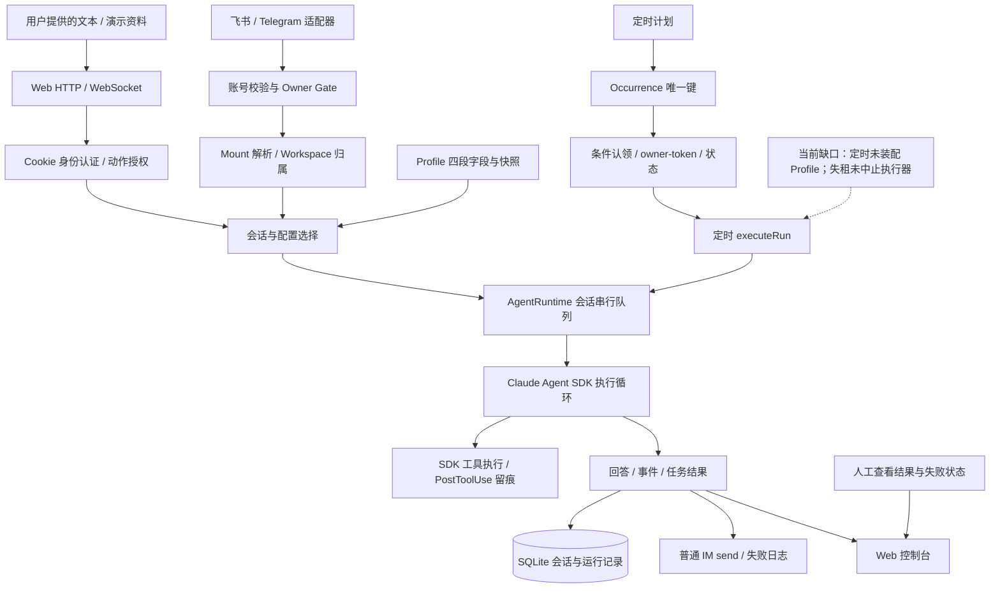

# HappyClaw / Clawtide 项目故事

> 当前实现：`Bluuok/Clawtide@dde300313de851baa953f24f6a0f8c75e9cacd3f`；修订：2026-09-17。
> 结构采用 `.claude/skills/paidgroup-agent-resume-skill/references/happyclaw/workflow.md` 的八模块，并将 `references/story-methodology.md` 的九阶段主线织入。与 `HappyClaw-定稿.md`、简历片段、QA 共用同一组主张。

**阅读顺序：**先读 M1 定位与 M5 开场，再选一个 M4 技术故事深入；M6/M7 用于追问。不把整份文档当连续背诵稿。

**事实标签：**【项目整体架构】表示当前源码可核查的行为；【本人实际参与】只用于原材料已自述的个人项目身份，不推导全部代码为本人独立编写；【待确认】表示个人贡献、测试运行和部署尚缺独立记录；【演示设计】表示本轮为说明场景新写的样例，非历史业务事实。文档里的技术问题是源码发现或测试设计，不虚构本人遭遇过的生产事故。

## M1 · 项目事实卡

| 项目 | 当前说法与证据等级 |
|---|---|
| 名称 | 【项目整体架构】Clawtide；HappyClaw 是参考架构来源，二者不是同一版本 |
| 目标 | 【项目整体架构】自托管数字员工工作站；消息和定时任务都有入口，管理侧维护配置和资源归属 |
| 场景 | 【本人实际参与／原材料自述】个人项目；跨境电商运营是演示垂直场景，不是客户、店铺或营收证明 |
| 用户与部署 | 【待确认】实际部署机器、运行时长、实际使用者；不把支持多用户写成拥有大量用户 |
| 输入 | 【项目整体架构】Web文本、渠道消息、定时prompt、Profile字段；不是已接入ERP或订单数据库 |
| 输出 | 【项目整体架构】模型回答、会话/任务记录、IM普通回复；通知日志不等于可靠IM投递 |
| 核心对象 | 【项目整体架构】Profile、Workspace、Session、scheduled_tasks、task_runs；不同对象承担不同职责 |
| 我的职责 | 【待确认】以本人实际提交和演示确定；不沿用“全部模块从零独立研发”的旧结论 |
| 依赖 | 【项目依赖】Claude Agent SDK负责模型—工具循环；Hono、better-sqlite3、grammY、飞书SDK等是依赖，不冒领内部实现 |
| 结果 | 【项目整体架构】源码和对应测试定义存在；【待确认】本人的运行报告、真实模型、IM整链与故障联调 |
| 主要限制 | 【项目整体架构】调度失租中止未接线、定时Profile未注入、五个渠道是骨架、无完整outbox，草稿发布存在非原子窗口 |

### 三个项目对象不要混淆

Profile是“如何描述这个数字员工”，Workspace是“资源属于谁”，Session是“这次对话如何运行”。Profile四段Prompt不能替代Workspace授权；Session串行队列也不能替代调度发生点去重。执行循环由SDK负责，应用负责入口和数据状态。[E03–E05、E10、E18]

## M2 · 业务故事：从运营演示出发，而不是虚构客户

【演示设计】把场景收窄到“运营事项整理与定时处理”：用户手工提供一段包含订单延迟、库存待确认和客户待回复事项的脱敏文本，数字员工输出按优先级整理的待办和缺失信息。消息入口方便随时询问；定时入口让同类任务按计划产生执行记录。这里演示的是工作台和治理方式，不是实时库存监控、自动退款或实际跨境客服系统。

这类任务需要解决的工程问题比较明确：同一计划点重复扫描时，不应重复产生相同发生点；不同渠道要保留账号和会话身份；配置局部改动不应抹掉其他字段；操作别人的工作区应该被拒绝。成功标准不是“模型回答看上去不错”，而是同时能检查输入、目标资源、执行状态和失败结果。

【项目整体架构】普通IM链路是：适配器产出统一消息 → 账号与渠道检查 → Owner Gate → 挂载解析与工作区授权 → 会话定位 → SDK执行 → 原渠道回复。定时链路是：扫描计划 → 插入发生点 → 条件认领 → 执行回调 → 任务终态/日志。两者共用执行函数，但不应画成参数完全一致：当前定时回调没有传Profile提示词，通知也只落控制台任务日志。[E01、E02、E07、E19]

**演示与验收分开：**`fixtures/运营简报-演示输入.md` 是新写的样例；`fixtures/演示验收清单.md` 是待执行步骤。它们不是已跑通记录，不写入简历结果数字。

## M3 · 架构、选型与数据流

【项目整体架构】下图展示源码中的主链及明确缺口；本人修改节点需凭提交另行标注，不默认把整张图标为本人独立完成。

| 层 | 实际选型 / 对象 | 为什么合理 | 不能据此推出 |
|---|---|---|---|
| 服务 | TypeScript、Node.js、Hono | 与现有SDK/IM生态及类型契约一致，路由层薄 | 这是实际栈，不证明本人比较过所有语言或框架 |
| 状态 | better-sqlite3、任务/身份/配置表 | 本地持久化、唯一键和条件更新便于表达状态 | 单写者不等于所有多步操作天然原子，也不等于分布式安全 |
| Agent | Claude Agent SDK + AgentRuntime | 复用SDK执行循环，应用管理会话与入口 | 非自研完整推理框架；PostToolUse记录不是执行前权限拦截 |
| IM | ImChannelAdapter、统一入站对象 | 将渠道格式与账号、会话定位分开 | 七个类型值不等于七个真实连接 |
| 配置 | 四段Profile、快照、草稿确认 | 便于局部编辑和内容回看 | 非可执行工作流或完整事务发布 |
| 控制台 | React、WebSocket | 展示会话、任务与配置，复用服务端入口 | Web“能看到”不等于外部动作已可靠投递 |

| 入口 | 输入 | 主要处理 | 输出 / 状态 | 失败边界 |
|---|---|---|---|---|
| Web | Cookie、sessionId、文本 | 用户认证、资源归属、会话执行 | 事件与聊天记录 | 会话失效或资源不属于用户时拒绝；部署条件单独验收 |
| IM | accountId、senderId、conversation | Gate → mount → 工作区 → session | 普通回复与Web事件 | everyone普通消息可放行；无有效挂载拒绝；出站失败写日志 |
| 定时 | task定义和时间点 | 物化 → 认领 → start → executeRun | task_runs终态及日志 | 不保证失租即时中止，不自动补齐Profile与可靠IM通知 |
| Profile草稿 | JSON、登录用户、确认短语 | 状态/归属/过期/短语检查 | 发布回调与Profile变化 | 先confirmed后publish，回调失败存在不一致窗口 |

**架构走读：**先确定“谁从哪个入口请求什么资源”，再决定会话和配置，最后才调用SDK。调度器解决“这次计划发生点由谁处理”，入口授权解决“请求者是否有权访问目标资源”。数据库状态不是外部动作的真相；草稿确认也不是所有写动作的统一审批门。把这些边界分开，比把它们统称为安全或治理更清楚。

## M4 · 五个技术故事

### R14 · 发生点去重与任务认领

**问题与产物。**【项目整体架构】到点直接调用模型会把“扫描行为”和“执行行为”耦合。当前先插入带occurrence_key的task_runs，再由claimOne执行条件更新。输入是任务和时间点，输出是可跟踪的run及其状态。主证据：E01、E02；测试定义：E13。

**关键决策。**一个唯一键约束的是同一发生点不要被重复建行；owner/token约束的是谁能更新执行状态。Clawtide在认领路径使用单条条件UPDATE，上游评审引用的事务式查询/更新是另一版本。不要为了迎合评审把这里的真实实现改写成不存在的事务。

**为什么不只用内存锁。**内存锁只能约束当前实例内的代码；数据库唯一键和条件更新能表达存储层的规则。但这只是必要组成，并不证明整个调度系统已经支持多进程任意故障恢复。

**失败与当前缺口。**旧worker外部请求已发出后，数据库token无法把请求撤回。当前续租失败只停心跳并写日志；候选扫描也未覆盖running状态的过期未启动行。通知当前只是任务日志，不是外部补投。因此“失租即停”“安全多活”“恰好一次”全部从故事中删除。[E02]

**下一步有边界的验收。**用真实pump驱动未启动过期行，再模拟续租失败并观察执行器是否停止；使用独立数据库连接/进程，而不是只调用两次claimOne。测试应分别判断DB状态、外部调用次数、漏执行与恢复，不把它们合并成一个成功数。

### R15 · 局部配置编辑与草稿确认

**问题与产物。**【项目整体架构】四段Prompt分别保存身份、原则、工作规则和工具策略；PATCH不传某字段应保留，显式空字符串才应清空。当前单独的segmentsPatchSchema不带创建默认值，toSegmentPatch只转发已提供字段；存储层保留旧字段，快照用于历史回看与恢复新版本。[E03–E05、E14]

**最适合深讲的细节。**不是“我用了Prompt工程”，而是“创建Schema的默认空值不能直接复用给PATCH，否则只改一段可能清空其余段”。这能连接实际输入、Schema、持久化和回归。是否为本人修复过的故障，需用实际diff确认，不能因代码注释描述过就说自己经历过。

**确认边界。**草稿确认从Web登录上下文取得userId，检查所有者、过期和短语；直接CRUD另有路径，并非所有修改强制经过草稿。当前草稿入口接收JSON，不能把它称为完整AI生成器。[E05]

**失败与取舍。**confirmDraft先把草稿标confirmed再执行publish回调，回调失败时状态可能已经消耗；update/restore的快照与更新也不能笼统称为原子事务。模式字段在组装中主要是标记，hash只覆盖四段。平台固定前导文本并不保证模型永不违反规则。[E03、E04]

### R07 · 两个真实SDK适配，而不是七渠道包装

**问题与产物。**【项目整体架构】用ImChannelAdapter统一生命周期与发送接口，入站对象保留channel、accountId、conversation、senderId、messageId。装配端对飞书和Telegram使用真实SDK适配，其他五个仍是无SDK骨架；能力表表达声明，不自动证明附件、流式卡片等能力均已兑现。[E06、E08、E09]

**执行顺序。**先核对账号和渠道，再做Owner Gate；读取mount并核对工作区归属后才解析/分配会话，避免拒绝请求先留下Session。通过后调用runtime，回复仍回原渠道。[E07]

**失败与降级。**无挂载、错误账号或外来工作区不执行；outbound send失败会记日志，没有持久化outbox。介绍只到已核实链路，不把messageId字段存在说成入站幂等，也不把连接建立说成完整回话成功。

### R20 · 资源动作授权与受众策略

**问题与产物。**【项目整体架构】管理员可以管理系统，并不天然拥有别人的工作区。canAccessGroup、canModifyGroup、canDeleteGroup是三个动作检查，分别返回allow/deny；Home任何人都不能删除，遗留归属无法解析时拒绝。[E10]

**IM不是另一套“管理员万能”。**checkOwnerGate分别处理disabled、保留命令、Owner与普通受众；owner_only非Owner拒绝，everyone普通消息继续。server当前未给入口注入audienceMode，因此默认everyone。/bind与/unbind还没有真正的命令实现，连Owner也静默丢弃。[E08、E11、E15]

**取舍与失败。**静默只适用于当前拒绝分支，内部理由留日志；它降低可见反馈，不等于完全无法探测。应用工作区授权也不能替代工具访问限制或操作系统沙箱。面试时先指出当前生效路径，而不是照着Owner Gate名字猜行为。

### R19 · 签名核验、DB会话与两层账号计数

**问题与产物。**【项目整体架构】随机token在DB中关联用户和有效期，HMAC让客户端携带的token可校验完整性；签名通过后仍需查有效会话。常量时间比较只用于签名比较，不是DB查询。[E12]

**限流的具体形状。**第一层是username:ip，第二层是跨IP的user:username，两者都在进程内Map。成功登录只清第一层，第二层按自身时间窗消退；不是纯IP限流，更不是多副本共享服务。[E16、E17]

**部署与失败。**HTTPS/HTTP使用不同Cookie名称；Secure、HttpOnly和SameSite各有自己的作用。当前核验的安全请求判定仅看socket加密，不能把注释中的TRUST_PROXY当成已实现反代识别。进程重启丢失限流计数、单IP跨账户喷洒、TLS终止后的Cookie行为，分别属于后续验收。[E12、E16]

## M5 · 我的故事：开场与五条分层讲法

以下口述稿以“个人项目+当前实现”为基础，不含虚构客户或生产事故。回答“具体哪段是你做的”时必须补真实提交/演示；没有证据的模块可以讲源码理解，不能冒充本人实现。

### 项目开场（约90秒练习稿）

Clawtide是我基于HappyClaw参考架构做的个人数字员工项目。我把跨境电商运营作为演示场景，但没有声称它已经服务真实店铺。想解决的不是再做一个聊天框，而是消息和定时任务怎样进入受管理的执行链。项目用Node和Hono承载服务，SQLite保存任务、配置与权限数据，模型—工具循环交给Claude Agent SDK。我的介绍重点放在三个问题：任务怎样有明确的发生点和状态；数字员工配置怎样局部维护并保留历史；不同入口怎样判断身份与资源归属。当前代码有两个真实IM SDK适配，其余渠道是骨架；调度器能做发生点去重与条件认领，但失租中止和一些恢复路径还没有闭环。我的具体贡献会用实际文件、diff和验证记录说明，不把参考项目和SDK内部实现算作个人全部自研。

### R14 · 任务物化与条件认领

**30秒摘要**

这一块把“计划到点”和“实际执行”分开：先用发生点唯一键建run，再以条件UPDATE认领，最后按owner/token写回状态。它让重复扫描和执行结果能被区分；我不会因此宣称外部动作恰好一次。

**90秒讲法**

任务可靠性不能只看定时器能不能触发。当前实现先将计划发生点物化成task_runs，用occurrence_key防止同一个时点重复建行，再通过状态条件和changes裁决认领。启动与结束更新带owner/token，这样旧持有者不能随意覆盖新状态。更简单的内存锁不覆盖数据库层竞争，但当前机制也还不是完整多活系统：续租失败没有真正中止执行器，通知只是写日志。我会展示对应SQL和测试定义，再用实际运行记录说明本人完成了哪部分，而不把方法存在等同于所有异常都已验证。

**3分钟源码展开路线**

按“计划定义—发生点—认领—开始—外部动作—写回—通知”走一次，展示唯一键和条件UPDATE；随后插入三个故障时点：认领后退出、外部动作成功但写回前退出、续租失败旧执行仍在跑。逐个说明数据库条件能阻止什么、不能阻止什么。再看candidates与claimOne的接线，解释为什么直接单测通过不等于pump能够自动回收。最后给出待补的独立连接/进程验证及外部幂等策略，不编造已跑结果。

**“你具体做了什么”回答接口：** 我在这一块实际负责的是［真实文件/提交与改动］，已有参考机制是［真实上游范围］，AI参与了［实际方式］，我复核并验证了［真实用例与结果］。没有做过的环节不填入，改讲项目机制；这些方括号只属于准备区，不进入简历。

### R15 · Profile局部修改

**30秒摘要**

Profile把身份、原则、工作规则和工具偏好分开存。PATCH未传字段保留，传空值才清空；修改前保留快照，恢复生成新版本。草稿有确认入口，但它不是所有修改统一审批，更不是硬权限。

**90秒讲法**

这里最具体的问题是局部编辑：创建接口可以给空默认值，但PATCH不能把未传字段也变成空字符串。当前单独定义PATCH Schema，再按undefined选择需要更新的字段，存储层保留其他段。历史快照让内容变化可以回看，恢复作为新版本保留过程。草稿确认从登录上下文获取用户，而不是信任客户端伪造source。不过直接CRUD与草稿发布是两条路径，发布回调失败也存在状态窗口。我会围绕这个输入语义和边界解释，而不是泛称实现了完整Agent治理或自动进化。

**3分钟源码展开路线**

先展示只改soul的请求与显式清空soul的请求，追踪segmentsPatchSchema、toSegmentPatch和store.update；看其他字段、版本和旧快照应怎样变化。再走createDraft到confirmDraft的成功、错误短语、过期和publish抛错四个分支，区分状态门和事务。最后比较buildSystemPrompt与执行入口的调用：固定前导块、mode标记、四段hash，以及定时入口未装配Profile的当前限制。

**“你具体做了什么”回答接口：** 我在这一块实际负责的是［真实文件/提交与改动］，已有参考机制是［真实上游范围］，AI参与了［实际方式］，我复核并验证了［真实用例与结果］。没有做过的环节不填入，改讲项目机制；这些方括号只属于准备区，不进入简历。

### R07 · IM适配与接入

**30秒摘要**

入口用统一消息对象保存账号、发送者和会话定位，再做挂载与权限检查，最后交给runtime。飞书和Telegram有真实SDK适配，其他是骨架；连接、完整回复和可靠投递是三种不同完成度。

**90秒讲法**

逐个机器人直接调用模型，会重复写身份和会话逻辑。Clawtide把渠道格式放到适配器，核心接收统一InboundMessage；随后先核对account与channel，检查mount和工作区归属，再解析Session。这样新渠道首先要满足明确的消息契约，而不是侵入Agent核心。这个统一接口不意味着各渠道功能相同，五个骨架也不算真实接通。出站目前调用send，失败写日志，没有完整outbox。我会展示本人实际修改的一条接入链及对应运行记录，而不拿七渠道类型表代替联调。

**3分钟源码展开路线**

用一个群消息或话题消息追踪channel/accountId/conversation/senderId/messageId；解释默认受众、mount目标和实际workspace actor。插入无挂载、跨所有权和Profile不匹配的失败输入，检查Session是否已被创建。最后看回原渠道的send与错误日志，对照三个验收层级：连接、模型往返、持久化投递；没有证据的层级明确保留。

**“你具体做了什么”回答接口：** 我在这一块实际负责的是［真实文件/提交与改动］，已有参考机制是［真实上游范围］，AI参与了［实际方式］，我复核并验证了［真实用例与结果］。没有做过的环节不填入，改讲项目机制；这些方括号只属于准备区，不进入简历。

### R20 · 授权与受众策略

**30秒摘要**

工作区权限按所有者和动作判断，管理员没有默认旁路，Home禁止删除。IM入口按audience_mode决定普通消息，拒绝分支才静默；默认everyone不能被讲成默认只允许Owner。

**90秒讲法**

登录成功只说明知道请求者身份，不说明可以操作所有资源。这里把读取、修改和删除分成独立检查，普通资源看created_by，遗留数据解析不出归属就拒绝，Home任何人都不能删。IM还要处理原生senderId和受众模式：owner_only与everyone不同，保留管理命令当前全部不执行。这种分层便于检查每个入口，但它不是工具级沙箱。我会用允许/拒绝矩阵和入口顺序说明范围，而不是把RBAC、Owner Gate、容器隔离混成一项安全成果。

**3分钟源码展开路线**

准备Owner/member/admin与Home/普通/遗留资源的矩阵，跟进decide如何处理access/modify/delete。然后用普通文本、/bind、/unbind三类消息对照everyone/owner_only/disabled。重点追踪真实server的默认值，而不只演示可注入的测试策略。最后分开解释浏览器身份、渠道发送者、渠道账号拥有者和工作区所有者，指出代码层权限与运行环境限制的边界。

**“你具体做了什么”回答接口：** 我在这一块实际负责的是［真实文件/提交与改动］，已有参考机制是［真实上游范围］，AI参与了［实际方式］，我复核并验证了［真实用例与结果］。没有做过的环节不填入，改讲项目机制；这些方括号只属于准备区，不进入简历。

### R19 · 认证与限流

**30秒摘要**

Cookie携带随机token和HMAC签名，签名核验后仍要查DB有效会话。限流按账号+IP和跨IP账号两层累计，成功只清第一层；两层都是内存计数，不是分布式限流。

**90秒讲法**

Web认证这里不是让模型判断身份，而是应用先验证签名和DB会话。HMAC防的是携带值篡改，不是加密token，timingSafeEqual也只在签名比较上使用。登录限流用两个Map区分账号+IP的局部尝试和跨IP账号累计，成功登录不清第二层，避免重置全部失败记录。但进程重启和多实例共享未被这两个Map解决，也没有纯IP限制。部署时还要看HTTPS Cookie与代理边界。我会展示实际分支，不把这套机制概括成后台绝对安全。

**3分钟源码展开路线**

先走合法签名+有效DB会话，再走签名错误、签名正确但会话被删除、会话过期三个分支；指出每步的数据来源。接着模拟多个IP访问同一账号与同一IP访问多个账号，解释两个Map覆盖与盲区。最后对照安全请求判定和Cookie名称/属性，讨论TLS终止及HTTP/WebSocket的一致性验收。实际部署数据与测试结果必须由记录提供，不现场编数字。

**“你具体做了什么”回答接口：** 我在这一块实际负责的是［真实文件/提交与改动］，已有参考机制是［真实上游范围］，AI参与了［实际方式］，我复核并验证了［真实用例与结果］。没有做过的环节不填入，改讲项目机制；这些方括号只属于准备区，不进入简历。

## M6 · 对抗追问树：八轮

每轮包含主问题、why追问和失败/个人责任追问。它们是练习树，不表示已经对候选人完成口试。

| 轮次 | 主问题 | Why追问与简答 | 再追问：失败 / 个人责任 | 不确定时的诚实降级 |
|---|---|---|---|---|
| 1 业务 | 为什么是数字员工而不是聊天Bot？ | 消息与计划两种触发加配置、资源和任务状态 | 有真实店铺吗？没有记录就只说演示 | 定位为自托管Agent工作站 |
| 2 调度 | occurrence和lease解决同一问题吗？ | 一个去重发生点，一个限制状态持有者 | 外部接口重复怎么办？当前无端到端保证 | 只讲DB唯一键与条件更新 |
| 3 恢复 | 为什么不全量自动重试？ | 已开始任务副作用不明，重跑可能重复 | 失租会真的abort吗？当前未接线 | 明确说存在恢复缺口 |
| 4 配置 | 为什么四段而不是一段Prompt？ | 局部字段与快照可以维护 | 未传字段与空值怎么区分？找PATCH链 | 讲清数据结构，不升格策略引擎 |
| 5 渠道 | 七个渠道都能用吗？ | 公共契约不等于七套真实实现 | 你哪条完整往返跑过？拿记录 | 区分SDK适配、连接、整链 |
| 6 授权 | 为什么admin不能删别人的工作区？ | 系统管理与数据所有权分离 | everyone下非Owner呢？普通消息可放行 | 不声称默认Owner-only |
| 7 认证 | HMAC能解决登录的所有问题吗？ | 完整性、会话存活和传输条件分开 | 多实例限流呢？内存Map不共享 | 只讲当前单进程实现 |
| 8 质量 | 如何证明改动真的有效？ | 输入、状态、拒绝与回归分别对照 | 哪些你运行过？哪些只读测试？分开回答 | 没有运行记录就不说通过 |

深入回答分别见 `HappyClaw-面试QA.md`；每轮可以沿证据导航打开实际代码，不用继续背抽象术语。

## M7 · 与已修改 Craft 的能力联动

【材料对照】上轮ThreadCove简历侧重研究取材、受限委派、有界历史、后端适配与执行记录；本轮Clawtide侧重计划发生点、Profile变更、IM接入及资源授权。只连接能力差异与方法复用，不虚构共享数据库、服务、代码或真实开发时间线。Craft正文保持不变。

| 对照面 | ThreadCove（以上轮已修订材料为准） | Clawtide（当前核验） |
|---|---|---|
| 主要任务 | 用户发起的研究与取材 | 消息/计划驱动的数字员工任务 |
| 执行治理 | 受限子代理、预算、父任务取消 | 会话串行、发生点/租约状态；失租取消仍有缺口 |
| 上下文 | 特定后端的字符预算历史桥接 | Profile声明配置；不能与历史预算合并计为同一种能力 |
| 状态 | 会话JSONL、稳定消息ID与检查点 | SQLite任务、配置、身份和会话记录 |
| 入口 | 桌面/Web工作台 | Web、飞书/Telegram与计划任务 |
| 边界 | 不是完整研究质量闭环 | 不是完整可靠调度/投递或运行时沙箱 |

**联合介绍的展开稿：**我的项目可以从两个不同问题来理解。ThreadCove关心一次研究任务如何取得资料、按边界委派并保留执行记录；Clawtide关心任务怎样从消息和计划进入服务、配置怎样维护、资源应该归谁。我没有把它们做成一个共享数据或共享运行时的平台，也不需要这样包装。真正可以复用的是方法：先把输入和状态区分开，再定义哪些行为可以自动发生，哪些需要用户确认，失败时哪一层能恢复。比如ThreadCove的父任务取消是执行控制问题，Clawtide的lease_token是数据库状态控制问题；名字都与可靠性有关，保证却不一样。面试时我会挑一个本人实际修改并验证过的模块，展示输入、实现、失败和结果，而不是把两个项目的全部能力罗列成个人成果。

### 十轮跨项目追问

| 问题 | 回答边界 |
|---|---|
| 1 两个项目有什么区别？ | 一个研究执行工作台，一个消息/计划服务；分别展示最强真实模块 |
| 2 Session和任务run一样吗？ | Session承载会话，run记录一次计划执行；不能互换 |
| 3 取消与失去租约一样吗？ | 前者要终止执行，后者首先是状态持有权变化；必须有接线才关联 |
| 4 为什么一个JSONL一个SQLite？ | 解释各自记录与查询形态；不编造本人做过的性能对比 |
| 5 两者都叫上下文工程吗？ | 历史预算和Profile组装是不同对象，分别说实现 |
| 6 两者都多Agent吗？ | ThreadCove有受限委派；Clawtide本轮不据多个Profile声称多Agent协作 |
| 7 哪个实现了完整评测？ | 不把测试定义、日志和小演示当模型质量评测系统 |
| 8 哪个更安全？ | 不做无条件评级，逐项说明工具、入口、资源和进程边界 |
| 9 复用了代码吗？ | 未有实际共享证据，不说共享代码；只说方法可迁移 |
| 10 哪个最能说明你的贡献？ | 以真实diff、演示和本人解释能力决定，而不是按平台体量决定 |

## M8 · 概念速查：只保留容易混淆的边界

| 概念 | 通俗理解 | 严格定义与本项目落点 |
|---|---|---|
| occurrence / run | 日历上的一次发生与执行记录 | 当前发生点以唯一键进入task_runs，不是所有请求都有同一种幂等语义 |
| lease / token | 临时持有权及其版本 | owner/token保护参与校验的DB更新，不替外部服务撤销旧动作 |
| 事务 / 条件UPDATE | 一组同生共死 vs 一次带条件改写 | claimOne用单条条件改写；其他多步配置发布不能因此免事务 |
| Profile / Workflow | 工作说明书 vs 真正执行流程 | 四段Prompt是配置；SDK循环和应用状态机才执行动作 |
| 审批 / 授权 | 确认某次变更 vs 是否有权操作 | 草稿短语与Web/Workspace权限分开，普通CRUD不是草稿审批 |
| 认证 / 授权 / 准入 | 你是谁 / 能做什么 / 消息能否进入 | AuthService、RBAC、Owner Gate各有边界 |
| 能力声明 / 实现 | 菜单与真的能点的菜 | CAPABILITY_PRESETS不证明所有渠道功能兑现；以适配代码与联调为准 |
| Trace / Eval | 过程记录与质量判定 | 日志能帮助定位，不等于结论正确性评测或LLM裁判 |
| RAG / 普通上下文 | 先检索知识再提供给模型 vs 直接给文本 | 本轮没有可证明向量检索链；Profile和会话记录不自动成为RAG |
| DB / 知识库 | 存业务状态与存检索知识 | SQLite用于任务和配置身份等，不因用了DB就称知识库 |
| Runtime / 沙箱 | 执行入口与强隔离环境 | AgentRuntime是SDK封装，不能仅凭命名宣称Docker/OS沙箱 |
| 通知日志 / 可靠投递 | 写下结果与确保送达 | 当前notification写日志；完整outbox和外部幂等未核实实现 |

## 九阶段主线与阅读位置

| 阶段 | 本版落点 |
|---|---|
| 0 问题定义 | M1/M2：个人自托管、运营演示、明确不做真实业务集成 |
| 1 骨架选型 | M3：SDK执行循环与应用入口/状态分工 |
| 2 能力分层 | M3/M8：配置、身份、资源、执行、记录分别建模 |
| 3 模块顺序 | 先说明资源/会话，再渠道或调度，最后贯通；这是结构依赖解释，实际开发时间线待确认 |
| 4 设计反例 | M4：内存锁、单段Prompt、逐渠道直接调模型等方案取舍 |
| 5 验证迭代 | M6：确定性分支优先，运行证据与测试定义分开 |
| 6 安全治理 | M4 R20/R19：身份、动作和入口，而非万能“安全”标签 |
| 7 失败恢复 | M4 R14/R15：失租/恢复/发布失败窗口；不伪造已修复 |
| 8 落地演进 | M1限制与待补验证文件；演进项不进入已实现成果 |

**源码导航：**`evidence/源码导航.md`。**十五个核心问题：**`HappyClaw-面试QA.md`。**需要真实运行的清单：**`HappyClaw-源码口径与待补验证.md`。