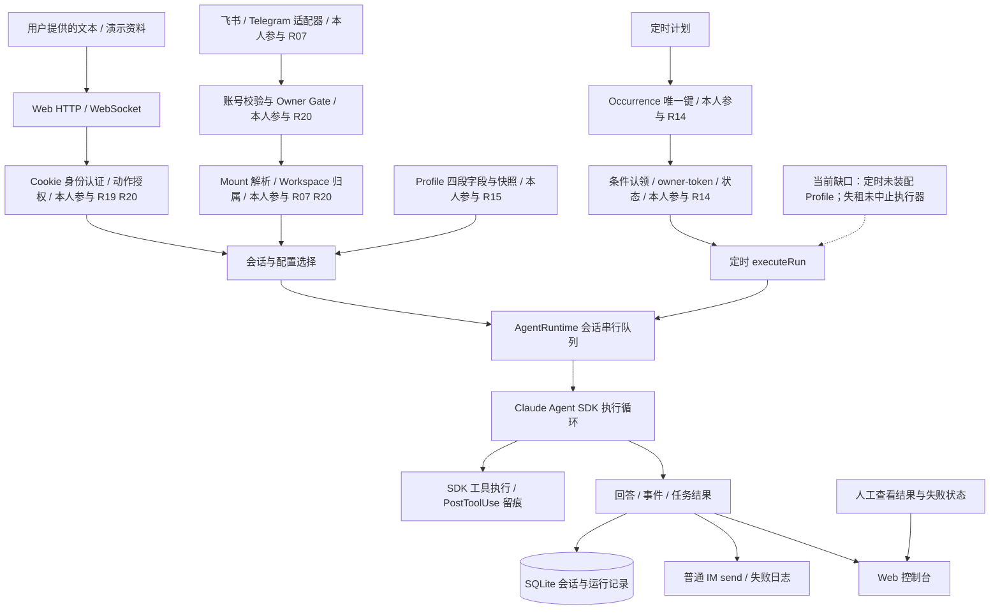
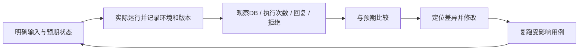

# HappyClaw / Clawtide 项目故事

> 当前实现：`Bluuok/Clawtide@dde300313de851baa953f24f6a0f8c75e9cacd3f`；修订：2026-09-19。本轮归属与验证口径见[复审记录](../复审-2026-09-19/README.md)，旧日期审计保留为历史。
> 结构采用 `.claude/skills/paidgroup-agent-resume-skill/references/happyclaw/workflow.md` 的八模块，并将 `references/story-methodology.md` 的九阶段主线织入。与 `HappyClaw-定稿.md`、简历片段、QA 共用同一组主张。

**阅读顺序：**先读 M1 定位与 M5 开场，再选一个 M4 技术故事深入；M6/M7 用于追问。不把整份文档当连续背诵稿。

**事实与归属统一说明：**【本人实际参与／用户确认复现】用户已确认基于 HappyClaw 参考架构，围绕 R14、R15、R07、R20、R19 五点复现并实现 Clawtide，记为 `user_attested_reproduction`；第一人称讲述据此成立，不要求先提供独立提交才能承认职责。【项目整体架构】指固定源码可核查的机制，SDK 与上游基础能力保留来源。【待确认】仅用于具体运行结果、真实部署、历史开发时间线及未提供的协作细节。【演示设计】是说明场景的人工样例。下文结果指技术产物，不虚构生产事故、已跑演示、测试通过或业务收益。

**选点与模板适配：**五点由用户明确选定，默认 Plan H 仅适用于尚未选择方案时，因此不存在默认方案冲突。组合相当于数字员工方向以 R19 替代 R23 的范围；保留多用户工作站定位，不加入多租户运行时隔离。R/Q/W 仍作索引：R14→Q14.1–.3/W11，R15→Q15.1–.3/W12，R07→Q07.1–.3/W04、W07，R20→Q20.1–.3/W09、W21，R19→Q19.1–.3/W09；具体实现以 E 证据为准，模板与固定源码冲突时按用户要求适配。

## M1 · 项目事实卡

| 项目 | 当前说法与证据等级 |
|---|---|
| 名称 | 【项目整体架构】Clawtide；HappyClaw 是参考架构来源，二者不是同一版本 |
| 目标 | 【项目整体架构】自托管数字员工工作站；消息和定时任务都有入口，管理侧维护配置和资源归属 |
| 场景 | 【本人实际参与／原材料自述】个人项目；跨境电商运营是演示垂直场景，不是客户、店铺或营收证明 |
| 用户与部署 | 【待确认】实际部署机器、运行时长、实际使用者；不把支持多用户写成拥有大量用户 |
| 输入 | 【项目整体架构】Web文本、渠道消息、定时prompt、Profile字段；不是已接入ERP或订单数据库 |
| 输出 | 【项目整体架构】模型回答、会话/任务记录、IM普通回复；通知日志不等于可靠IM投递 |
| 核心对象 | 【项目整体架构】Profile、Workspace、Session、scheduled_tasks、task_runs；不同对象承担不同职责 |
| 我的职责 | 【本人实际参与／用户确认复现】围绕五点复现并实现调度、Profile、IM适配、资源授权及Web认证；参考架构与SDK基础能力不归为独立原创 |
| 依赖 | 【项目依赖】Claude Agent SDK负责模型—工具循环；Hono、better-sqlite3、grammY、飞书SDK等是依赖，不冒领内部实现 |
| 结果 | 【项目整体架构】源码和对应测试定义存在；【待确认】本人的运行报告、真实模型、IM整链与故障联调 |
| 主要限制 | 【项目整体架构】调度失租中止未接线、定时Profile未注入、五个渠道是骨架、无完整outbox，草稿发布存在非原子窗口 |
| 原工作方式与目标 | 【演示设计】零散运营文本需要人工整理；目标是让输入进入明确的会话/计划记录，并让配置与资源动作可检查 |
| 协作边界 | 【本人实际参与】负责五点应用层复现与实现；【项目依赖】复用开源基座和SDK；【待确认】具体AI辅助方式、其他协作者与历史分工 |

### 三个项目对象不要混淆

Profile是“如何描述这个数字员工”，Workspace是“资源属于谁”，Session是“这次对话如何运行”。Profile四段Prompt不能替代Workspace授权；Session串行队列也不能替代调度发生点去重。执行循环由SDK负责，应用负责入口和数据状态。[E03–E05、E10、E18]

## M2 · 业务故事：从运营演示出发，而不是虚构客户

【演示设计】把场景收窄到“运营事项整理与定时处理”：用户手工提供一段包含订单延迟、库存待确认和客户待回复事项的脱敏文本，数字员工输出按优先级整理的待办和缺失信息。消息入口方便随时询问；定时入口让同类任务按计划产生执行记录。这里演示的是工作台和治理方式，不是实时库存监控、自动退款或实际跨境客服系统。

这类任务需要解决的工程问题比较明确：同一计划点重复扫描时，不应重复产生相同发生点；不同渠道要保留账号和会话身份；配置局部改动不应抹掉其他字段；操作别人的工作区应该被拒绝。成功标准不是“模型回答看上去不错”，而是同时能检查输入、目标资源、执行状态和失败结果。

【项目整体架构】普通IM链路是：适配器产出统一消息 → 账号与渠道检查 → Owner Gate → 挂载解析与工作区授权 → 会话定位 → SDK执行 → 原渠道回复。定时链路是：扫描计划 → 插入发生点 → 条件认领 → 执行回调 → 任务终态/日志。两者共用执行函数，但不应画成参数完全一致：当前定时回调没有传Profile提示词，通知也只落控制台任务日志。[E01、E02、E07、E19]

**演示与验收分开：**`fixtures/运营简报-演示输入.md` 是既有人工演示样例；`fixtures/演示验收清单.md` 是待执行步骤。它们不是已跑通记录，不写入简历结果数字。

## M3 · 架构、选型与数据流

【项目整体架构】下图展示源码中的主链及明确缺口；【本人参与】依据用户确认的五点复现范围标在应用层节点，SDK执行循环不标为本人实现。

| 层 | 实际选型 / 对象 | 为什么合理 | 不能据此推出 |
|---|---|---|---|
| 服务 | TypeScript、Node.js、Hono | 与现有SDK/IM生态及类型契约一致，路由层薄 | 这是实际栈，不证明本人比较过所有语言或框架 |
| 状态 | better-sqlite3、任务/身份/配置表 | 本地持久化、唯一键和条件更新便于表达状态 | 单写者不等于所有多步操作天然原子，也不等于分布式安全 |
| Agent | Claude Agent SDK + AgentRuntime | 复用SDK执行循环，应用管理会话与入口 | 非自研完整推理框架；PostToolUse记录不是执行前权限拦截 |
| IM | ImChannelAdapter、统一入站对象 | 将渠道格式与账号、会话定位分开 | 七个类型值不等于七个真实连接 |
| 配置 | 四段Profile、快照、草稿确认 | 便于局部编辑和内容回看 | 非可执行工作流或完整事务发布 |
| 控制台 | React、WebSocket | 展示会话、任务与配置，复用服务端入口 | Web“能看到”不等于外部动作已可靠投递 |

| 入口 | 输入 | 主要处理 | 输出 / 状态 | 失败边界 |
|---|---|---|---|---|
| Web | Cookie、sessionId、文本 | 用户认证、资源归属、会话执行 | 事件与聊天记录 | 会话失效或资源不属于用户时拒绝；部署条件单独验收 |
| IM | accountId、senderId、conversation | Gate → mount → 工作区 → session | 普通回复与Web事件 | everyone普通消息可放行；无有效挂载拒绝；出站失败写日志 |
| 定时 | task定义和时间点 | 物化 → 认领 → start → executeRun | task_runs终态及日志 | 不保证失租即时中止，不自动补齐Profile与可靠IM通知 |
| Profile草稿 | JSON、登录用户、确认短语 | 状态/归属/过期/短语检查 | 发布回调与Profile变化 | 先confirmed后publish，回调失败存在不一致窗口 |

**架构走读：**先确定“谁从哪个入口请求什么资源”，再决定会话和配置，最后才调用SDK。调度器解决“这次计划发生点由谁处理”，入口授权解决“请求者是否有权访问目标资源”。数据库状态不是外部动作的真相；草稿确认也不是所有写动作的统一审批门。把这些边界分开，比把它们统称为安全或治理更清楚。

## M4 · 五个技术故事

### R14 · 发生点去重与任务认领

**问题与产物。**【项目整体架构】到点直接调用模型会把“扫描行为”和“执行行为”耦合。当前先插入带occurrence_key的task_runs，再由claimOne执行条件更新。输入是任务和时间点，输出是可跟踪的run及其状态。主证据：E01、E02；测试定义：E13。

**关键决策。**一个唯一键约束的是同一发生点不要被重复建行；owner/token约束的是谁能更新执行状态。Clawtide在认领路径使用单条条件UPDATE，上游评审引用的事务式查询/更新是另一版本。不要为了迎合评审把这里的真实实现改写成不存在的事务。

**为什么不只用内存锁。**内存锁只能约束当前实例内的代码；数据库唯一键和条件更新能表达存储层的规则。但这只是必要组成，并不证明整个调度系统已经支持多进程任意故障恢复。

**恢复分支与失败边界。**常规pump的candidates只扫描queued/retry_wait，不会将running过期未启动行送入claimOne；服务启动已调用recoverOnStart，将符合条件的running未启动行释放为retry_wait。已启动的过期行由failExpiredStartedTaskRuns标为failed，不自动重做。启动恢复是现有机制，但其释放未按失活实例区分，不能推导为多实例安全接管。旧worker的外部请求也不能靠数据库token撤回：续租失败只停心跳和写日志，没有取消执行器。通知仅写任务日志。[E02、E19；固定源码task-scheduler.ts:630–674、server.ts:290]

**下一步有边界的验收。**用真实pump驱动未启动过期行，再模拟续租失败并观察执行器是否停止；使用独立数据库连接/进程，而不是只调用两次claimOne。测试应分别判断DB状态、外部调用次数、漏执行与恢复，不把它们合并成一个成功数。

### R15 · 局部配置编辑与草稿确认

**问题与产物。**【项目整体架构】四段Prompt分别保存身份、原则、工作规则和工具策略；PATCH不传某字段应保留，显式空字符串才应清空。当前单独的segmentsPatchSchema不带创建默认值，toSegmentPatch只转发已提供字段；存储层保留旧字段，快照用于历史回看与恢复新版本。[E03–E05、E14]

**最适合深讲的细节。**“创建Schema的默认空值不能直接复用给PATCH，否则只改一段可能清空其余段”连接输入、Schema、持久化和回归。我在复现实现中负责这条配置链；这是可以解释的设计问题，不据代码注释编成亲历的生产事故。

**确认边界。**草稿确认从Web登录上下文取得userId，检查所有者、过期和短语；直接CRUD另有路径，并非所有修改强制经过草稿。当前草稿入口接收JSON，不能把它称为完整AI生成器。[E05]

**失败与取舍。**confirmDraft先把草稿标confirmed再执行publish回调，回调失败时状态可能已经消耗；update/restore的快照与更新也不能笼统称为原子事务。模式字段在组装中主要是标记，hash只覆盖四段。平台固定前导文本并不保证模型永不违反规则。[E03、E04]

### R07 · 两个真实SDK适配，而不是七渠道包装

**问题与产物。**【项目整体架构】用ImChannelAdapter统一生命周期与发送接口，入站对象保留channel、accountId、conversation、senderId、messageId。装配端对飞书和Telegram使用真实SDK适配，其他五个仍是无SDK骨架；能力表表达声明，不自动证明附件、流式卡片等能力均已兑现。[E06、E08、E09]

**执行顺序。**先核对账号和渠道，再做Owner Gate；读取mount并核对工作区归属后才解析/分配会话，避免拒绝请求先留下Session。通过后调用runtime，回复仍回原渠道。[E07]

**失败与降级。**无挂载、错误账号或外来工作区不执行；outbound send失败会记日志，没有持久化outbox。介绍只到已核实链路，不把messageId字段存在说成入站幂等，也不把连接建立说成完整回话成功。

### R20 · 资源动作授权与受众策略

**问题与产物。**【项目整体架构】管理员可以管理系统，并不天然拥有别人的工作区。canAccessGroup、canModifyGroup、canDeleteGroup是三个动作检查，分别返回allow/deny；Home任何人都不能删除，遗留归属无法解析时拒绝。[E10]

**IM不是另一套“管理员万能”。**checkOwnerGate分别处理disabled、保留命令、Owner与普通受众；owner_only非Owner拒绝，everyone普通消息继续。server当前未给入口注入audienceMode，因此默认everyone。/bind与/unbind还没有真正的命令实现，连Owner也静默丢弃。[E08、E11、E15]

**取舍与失败。**静默只适用于当前拒绝分支，内部理由留日志；它降低可见反馈，不等于完全无法探测。应用工作区授权也不能替代工具访问限制或操作系统沙箱。面试时先指出当前生效路径，而不是照着Owner Gate名字猜行为。

### R19 · 签名核验、DB会话与两层账号计数

**问题与产物。**【项目整体架构】随机token在DB中关联用户和有效期，HMAC让客户端携带的token可校验完整性；签名通过后仍需查有效会话。常量时间比较只用于签名比较，不是DB查询。[E12]

**限流的具体形状。**第一层是username:ip，第二层是跨IP的user:username，两者都在进程内Map。成功登录只清第一层，第二层按自身时间窗消退；不是纯IP限流，更不是多副本共享服务。[E16、E17]

**部署与失败。**HTTPS/HTTP使用不同Cookie名称；Secure、HttpOnly和SameSite各有自己的作用。Cookie的Secure判定仍只看socket是否加密；限流IP提取已在TRUST_PROXY=true时使用XFF，两个函数的代理行为必须分别说明。进程重启丢失限流计数、单IP跨账户喷洒、TLS终止后的Cookie行为，分别属于后续验收。[E12、E16]

## M5 · 我的故事：开场与五条分层讲法

以下第一人称均承接 M1 的【本人实际参与／用户确认复现】，介绍实际五点的应用层实现；“结果”指机制产物。三档按约 30 秒、90 秒、3 分钟组织，实际时长随语速调整。深讲稿采用情境、目标、行动、取舍、产物与边界的连续叙述；真实运行状态统一见审计，不把准备稿当作已举行的口试。

### 项目开场（约90秒）

Clawtide 是我基于 HappyClaw 参考架构、围绕五个选点复现并实现的个人数字员工工作站。我以跨境电商运营事项整理作为演示场景：用户提供订单延迟、库存待核实和客户待回复的文本，通过 Web 或 IM 获得整理建议，也可以把同类静态文本放进定时任务。围绕这个过程，我实现了五层应用能力：调度先物化发生点，再条件认领和记录结果；Profile 支持分段修改与历史恢复；IM 适配保留账号、发送者和会话信息；工作区按资源归属和操作授权；Web 入口用签名、有效会话及登录计数建立身份依据。模型与工具循环使用 Claude Agent SDK。五点共同支撑工作站，但保证各有边界：当前定时入口未注入 Profile，失租还没有中止执行器；飞书和 Telegram 有 SDK 适配，其余渠道是骨架。我能逐点解释实现和失败分支，实际联调结果按运行记录说明。

### R14 · 任务物化与条件认领

**30秒摘要**

运营事项需要按计划处理时，我希望同一个发生点有唯一记录，执行状态也能追踪。我在复现中用 occurrence 唯一键物化 run，以条件 UPDATE 认领，再带 owner/token 写回。技术产物是发生点去重和受条件保护的状态链；外部动作恰好一次不在这个保证内。

**90秒讲法**

我负责复现实现的调度部分，解决的是“计划到点”和“本次执行”混在一起后难以追踪的问题。以定时整理运营文本为例，同一计划点可能被多次扫描，但应对应同一个发生点记录。我先用 occurrence_key 将它物化为 task_runs，再通过条件 UPDATE 和受影响行数裁决认领，开始、续租和结束按 owner/token 校验。这样数据库能区分定义、发生点和执行状态，比进程内锁多一层持久化约束。恢复方面，服务启动已释放未启动的 running 行，但常规 pump 不会扫描这些行；已启动过期则标失败。这里的技术结果是状态机制可定位，不能把它扩大成完整多活恢复；尤其续租失败没有取消执行器，外部动作仍需要自己的幂等与执行控制。

**3分钟讲法（STAR 口述稿）**

我在复现 Clawtide 时，把定时处理运营文本作为调度的说明场景。这里首先要回答的不是模型能不能生成一段建议，而是同一个计划时点被扫描两次时，系统怎样知道这是一件事，以及某次执行开始后应该把结果记在哪里。我的目标是把计划定义、发生点和执行状态分开，让后续查看与失败分析有明确对象。

我实现的链路先把到期发生点写入任务运行表，用任务和计划时间组成的唯一键约束重复建行，然后才进入认领。认领由一条带状态条件的更新裁决，以受影响行数判断是否成功，读取候选本身不代表拿到了执行权。这样重复扫描与两个执行者竞争分别由不同机制处理，不需要把一次查询误当成锁。

获得认领后，开始、续租和结束更新携带持有者与令牌条件。它的作用是约束参与校验的数据库写回，避免旧持有者随意覆盖状态。相较只在内存中放一个执行标记，这些规则能持久化；代价是必须理解状态转换和过期条件，不能因为数据库单写者就断言所有多步操作都天然原子。

恢复也分两条路径。服务启动会调用恢复函数，把符合条件、已经认领但尚未启动的运行行释放回重试队列；已经启动且租约过期的行则标记失败，避免对不明副作用直接重做。常规扫描只选排队和等待重试的行，所以不会自动把仍处于运行状态的过期未启动行送去认领。这是当前接线的具体限制，不是完全没有恢复。

我会用一个反例解释保证范围：外部请求已经发出，旧执行者随后失去租约。即使它不能正常写回，外部请求也不会被数据库撤回。当前续租失败只停心跳并记录日志，没有中止执行器；启动释放也没有构成安全多活协议。通知部分写的是任务日志，与向飞书可靠投递是两条路径。

这部分交付形成了可追踪的发生点、条件认领和终态记录链。验收应分别观察数据库状态、外部调用次数和恢复是否发生，不能用一个成功数代替。我的下一步会围绕独立连接下的竞争、启动恢复和失租执行继续这几类输入设计故障实验，再决定是否补取消传播与下游幂等；这些属于待验证或后续改进。

**本人贡献与追问入口：**我负责本选点的应用层复现实现，能按上述对象、输入和状态解释代码；对应证据与测试定义见 M4 和 QA Q14.1–.3。是否实际执行过某项验收，按独立运行记录回答。

### R15 · Profile 局部修改与历史维护

**30秒摘要**

数字员工规则混成整段文本时，局部更新容易覆盖其他内容。我负责复现实现四段 Profile、PATCH 字段保留和内容快照，恢复也生成新版本，形成可局部维护和回看的配置链。草稿短语只确认该入口的发布意图，配置文本本身不承担硬权限。

**90秒讲法**

我负责的 Profile 部分，目标是让数字员工配置可以局部修改，并能看回历史。身份、原则、工作规则和工具偏好分别保存，组装时进入系统提示词。最关键的输入语义是：PATCH 没传字段要保留，显式空字符串才清空。所以我把创建默认值与更新 Schema 分开，只转发真正提供的字段，再由存储层保留其他段。修改保留内容快照，恢复作为新版本。这样产物是字段更新与历史维护链，不只是一个 Prompt 编辑框。草稿入口还检查登录者、所有者、过期和确认短语，但普通 CRUD 走另一条路径，先确认再发布也有失败窗口。定时入口目前没有装配 Profile，因此我讲配置能力时会同时指出调用接线的范围。

**3分钟讲法（STAR 口述稿）**

我负责复现实现 Profile 时，关注的是数字员工配置怎样成为能维护的应用对象。身份、原则、工作规则和工具偏好可能分别调整。如果每次都让用户提交整段文本，改一个地方时就容易带走其他内容，也很难说明某次恢复到底恢复了什么。我的目标是把局部修改和历史内容组织清楚。

实现上，我把四段文本独立保存，组装系统提示词时按固定顺序放在平台前导文本之后。这里的分段是数据结构与维护约定，工作规则仍然是声明式文本，不会因为叫作某个规则段就变成可执行工作流。平台前导文字也只是传给模型的约束描述，不能代替应用的资源授权或工具执行前检查。

最值得展开的细节是创建与更新的输入语义。创建可以给缺失字段空默认值，但局部更新不能照搬，否则只提交一段时，其他未传字段可能也变成空字符串。我在这条链中使用独立的更新校验结构，只转发实际提供的键，存储层保留旧字段；用户显式提交空字符串时才清空。这样“没有修改”和“主动清空”有了不同含义。

历史方面，修改前保留四段内容快照，恢复时创建新版本，而不是抹掉当前记录。这个选择让回退本身也可解释，但快照只覆盖四段，不能说它恢复了模式和所有运行配置。文本当然可以做差异展示；差异展示回答改了什么，确认短语回答是否确认本次发布，两者是互补关系。

草稿确认是另一条需要单独说明的路径。入口从已认证的用户上下文取身份，再检查草稿归属、状态、有效期和短语。直接创建与修改并不统一经过草稿。当前先把草稿标成已确认，再调用发布回调，因此回调失败可能留下草稿已消耗而配置未发布的窗口；草稿由客户端提交，也不能说这个入口已经自动生成配置。

最终交付是局部字段维护、历史快照、恢复新版本和限定入口的确认机制。验证时应对照未传字段、主动清空、恢复内容和发布失败后的状态。执行接线还要另看：当前定时入口未传入这套提示词，所以配置存在并不等于三端行为一致。后续改进应围绕可恢复发布状态与调用参数展开，不能只靠强化提示词解决这些工程问题。

**本人贡献与追问入口：**我负责本选点的应用层复现实现，能按上述对象、输入和状态解释代码；对应证据与测试定义见 M4 和 QA Q15.1–.3。是否实际执行过某项验收，按独立运行记录回答。

### R07 · IM 适配与会话接入

**30秒摘要**

用户从不同 IM 提交运营文本时，账号和会话定位不能跟着渠道格式各写一套。我负责复现实现适配接口与统一入站对象，让消息经过挂载和授权后进入 runtime。产物是飞书、Telegram 的 SDK 适配及共用接入链；另外五个渠道保持骨架。

**90秒讲法**

我负责的 IM 选点，是把渠道格式与核心会话处理分开。以运营事项整理为例，用户可能在私聊、群或话题中发文本，系统必须保留来自哪个渠道、哪个账号、哪个发送者和会话位置。我通过 ImChannelAdapter 统一生命周期与发送接口，用 InboundMessage 传这些字段，核心先检查账号、受众、挂载和工作区，再解析 Session 并进入 runtime。这样新增适配器有明确消息契约，拒绝输入也不会因为提前分配会话留下额外状态。当前飞书和 Telegram 装配真实 SDK，其他五个是骨架。这个产物说明接入代码路径存在；连接成功、一轮模型回复和崩溃后可靠补投是不同验收，现有 send 失败只记日志，不能把接口统一说成七渠道完整上线。

**3分钟讲法（STAR 口述稿）**

我在复现数字员工工作站的消息入口时，用用户从飞书或 Telegram 发来运营事项作为说明场景。不同渠道有群、私聊和话题等概念，如果每个机器人都直接调用模型，账号校验、资源定位和会话选择就会重复散落在各处。我的目标是让渠道负责解释原生消息，应用核心负责决定这条消息进入哪个资源和会话。

我实现的适配层用统一接口描述启动、停止、发送和能力声明，入站对象保留渠道、账号、发送者、会话信息及消息编号。这些字段不是为了凑一个公共类型：渠道和账号用于核对接入实例，原生发送者用于受众判断，会话和话题信息用于定位挂载目标。显示名不能代替身份，消息编号存在也不代表已经做了去重。

消息进入核心后，先检查账号存在且渠道一致，再经过受众判断，然后读取持久化挂载。目标工作区存在、渠道账号所属用户有访问权之后，才解析或分配会话。通过这条链再调用运行时，结果从原渠道的发送接口返回。这个顺序把资源拒绝放在会话分配之前，避免无效挂载只因收到消息就留下会话副作用。

不同会话形态也有不同定位。直接或话题绑定可以指向特定会话，群路径则复用或创建工作区会话；绑定的配置还要按入口检查。这里我复用的是入口契约与应用处理，不是承诺所有渠道行为完全一样。公共能力表必须与实际适配代码对照，不能把声明支持附件或流式输出就当成完成了相应功能。

当前产物中，飞书和 Telegram 使用真实 SDK 适配，另外五个渠道是无 SDK 骨架。我会把代码适配、连接建立、真实消息完成模型往返和可靠投递分开回答。举例说，模型已经给出结果，但发送接口失败，当前只记录出站错误，并没有持久化补投队列；不能为了补发而直接把模型任务整体重跑。

这条选点的技术结果是渠道格式、账号会话信息和统一执行入口之间有明确接缝，新增渠道首先需要满足契约，再完成真实联调。验收应覆盖错误账号、无挂载、跨归属、话题定位与出站失败。若后续要跨重启补投，需要单独设计投递状态、重复处理和权限，而不是把现有消息编号或普通回复包装成可靠消息系统。

**本人贡献与追问入口：**我负责本选点的应用层复现实现，能按上述对象、输入和状态解释代码；对应证据与测试定义见 M4 和 QA Q07.1–.3。是否实际执行过某项验收，按独立运行记录回答。

### R20 · 资源动作授权与受众策略

**30秒摘要**

管理角色和工作区所有者混用，会让入口不知道谁能操作资源。我负责复现实现读、改、删三类授权与 IM 准入，形成所有权检查、Home 禁删及拒绝后不执行的分支。当前 IM 默认 everyone，普通消息准入后仍按渠道账号所属用户检查资源访问。

**90秒讲法**

我负责的授权部分，解决的是“能管理系统”与“拥有这份工作区数据”不能混为一谈。实现里读取、修改、删除分别调用授权函数，普通资源根据归属判断，遗留数据无法确定归属就拒绝，Home 不能删除，管理员也没有所有权旁路。IM 还多一层原生发送者与 audience_mode 的准入判断。我把这层与后续工作区授权分开：server 当前默认 everyone，非 Owner 普通消息可以继续，但目标工作区访问检查使用渠道账号所属用户，不能把发送者自动当成资源 Owner。拒绝分支发生在会话分配和执行之前，/bind 与 /unbind 只是保留命令。技术产物是动作检查与入口顺序；它没有构成工具级权限或运行时隔离，当前选点也不包含那些能力。

**3分钟讲法（STAR 口述稿）**

我负责复现实现工作区授权时，要解决的是同一个系统里存在多种身份，但它们不能自动互相代替。管理员可以管理服务，工作区所有者拥有具体资源，渠道账号有所属用户，收到消息时还存在一个原生发送者。能给机器人发消息不等于成为工作区数据的所有者。我的目标是让入口判断使用的身份和操作对象都明确。

资源侧，我把读取、修改和删除分成三个独立检查，再交给统一决策逻辑。普通工作区依据记录中的创建归属判断，遗留记录需要解析已有归属，无法确定时拒绝。Home 只让所属用户读改，并禁止任何人删除。这里不是三种返回状态：三个操作最终仍然返回允许或拒绝；角色参数也没有提供管理员绕过所有权的通道。

这种设计的取舍是系统管理权限与业务数据权限分开，操作其他人的工作区不能只凭管理角色。它增加了明确传递用户与目标资源的要求，但也让允许和拒绝可以按矩阵解释。我能逐项回答所有者、普通成员和管理员面对普通、Home、遗留资源时采用什么判断，而不用笼统地说系统有权限管理。

IM 入口还有受众策略。我在讲实现时会先指出实际装配：当前服务没有注入受众模式回调，因此默认 everyone，普通非 Owner 消息可以继续；如果采用 owner_only，非 Owner 普通消息才会被拒绝。禁用模式和保留管理命令先处理，绑定与解绑命令当前对所有人都不执行，不能从命令名称推断已经完成绑定功能。

通过准入后，系统读取挂载，确认工作区存在，再以渠道账号所属用户检查访问权，之后才分配会话。这并不是把消息发送者认证成工作区 Owner，而是渠道入口在配置的资源范围内提供服务。无效挂载或跨归属请求被提前拒绝，减少了不应产生的会话状态；静默拒绝也只是当前分支的反馈选择，内部仍需要日志帮助排查。

最终交付是资源动作函数、归属判定和消息准入到执行的顺序。检验时应同时看允许矩阵、默认策略和拒绝前是否产生副作用。everyone 会让非 Owner 普通消息进入后续处理，因此暴露哪些数据与工具还需要另外审视。我的范围是应用资源授权，不能把它与容器、文件系统或模型工具权限拼成一套已经完成的隔离系统。

**本人贡献与追问入口：**我负责本选点的应用层复现实现，能按上述对象、输入和状态解释代码；对应证据与测试定义见 M4 和 QA Q20.1–.3。是否实际执行过某项验收，按独立运行记录回答。

### R19 · 会话认证与登录尝试约束

**30秒摘要**

Web 管理入口需要先知道用户身份，再处理资源。我负责复现实现随机会话 token、HMAC 核验和有效会话查库，并按账号加 IP、跨 IP 账号两层记录登录失败。产物是失效会话拒绝和账号尝试约束；签名不加密 Cookie，进程内计数也不等于分布式限流。

**90秒讲法**

我负责复现实现的 Web 认证，目标是让管理请求在进入资源操作前有确定的身份依据。随机 token 对应数据库会话，Cookie 携带 token 与 HMAC 签名；应用先验证完整性，再查会话及用户，签名正确但会话删除或过期仍拒绝。服务端会话便于撤销，但要承担查库和部署状态管理。登录失败计数则分 username:ip 和跨 IP 的 user:username 两层，成功登录只清第一层，第二层按自己的窗口保留。技术结果是签名、会话存活与账号尝试分别检查。两层都在进程内，且没有纯 IP 维度；安全 Cookie 判定只看 socket 加密，而限流 IP 提取在 TRUST_PROXY 开启时会读 XFF，不能把两个函数的代理行为混在一起。

**3分钟讲法（STAR 口述稿）**

我在复现工作站的 Web 管理入口时，首先要让应用知道请求来自哪个登录用户，再把身份交给工作区授权。这里的任务与模型回答无关：无论用户修改配置还是查看任务，模型都不应该参与判断登录身份。我的目标是把客户端携带值的完整性、服务端会话是否有效和反复尝试登录这三个问题分别处理。

实现中，随机令牌标识数据库里的会话，数据库保存关联用户和有效期。浏览器的 Cookie 携带令牌与签名，应用使用服务端密钥生成的消息认证码核验完整性，再查询会话和用户。签名合法但会话被删除或过期，仍然不能通过。因此它不是无状态认证，也不能说只要签名正确用户就永久有效；保留数据库会话的好处是可以控制存活与撤销。

签名比较使用常量时间比较，但这个性质只属于签名比较步骤，不包括后面的数据库查询。签名也没有加密令牌，更不会阻止一个完整有效的 Cookie 被窃取后使用。不同机制的作用要分别说明：HttpOnly 限制脚本读取，Secure 限制安全传输，SameSite 约束跨站携带；这些属性和应用授权不是同一层保证。

登录尝试方面，我用账号加来源地址作为第一层键，再用账号作为第二层键跨地址累计失败。成功登录只清第一层，第二层按自身时间窗口保留，避免一次成功就清掉账号的全部累计记录。这个选择关注局部重复尝试和换地址访问同一账号，但没有独立的纯地址计数；一个地址轮流尝试很多账号仍有覆盖盲区。

两层计数都保存在进程内，所以重启会丢失，多实例也不会自然共享。部署判断也要按函数区分：当前 Cookie 的安全请求判定只看底层连接是否加密，而用于限流的地址提取在开启可信代理选项时会读取转发头中的地址。不能因为一个函数未接反代协议判断，就把所有代理支持都说成不存在，更不能据注释认定配置正确。

这部分技术产物是签名核验、有效会话查询、两层账号计数和不同传输条件下的 Cookie 分支。验收应分别覆盖伪造签名、已删除或过期会话、跨地址累计、成功后的计数以及代理部署行为。共享限流和更完整的传输验收属于后续工作；Web 身份认证不扩大成 Agent 运行时身份或全面安全审计结果。

**本人贡献与追问入口：**我负责本选点的应用层复现实现，能按上述对象、输入和状态解释代码；对应证据与测试定义见 M4 和 QA Q19.1–.3。是否实际执行过某项验收，按独立运行记录回答。

## M6 · 对抗追问树：八轮

每轮都有主问、两层递进追问、简答、展开答与不确定时的回答。题源为所选五点、固定源码和运营演示场景，不假设具体 JD；这是准备材料，不是已执行模拟面试。

### 第1轮 · 业务判断与数据质量

**主问：**为什么做数字员工工作站？→ **追问一：**用户原来怎样处理事项，系统改变什么？→ **追问二：**库存数字来源不明时，会自动给补货结论吗？

**简答：**消息与计划触发需要会话、配置、资源和任务记录；演示只整理用户提供的事项。

**展开答：**原流程假设是人工读零散文本、归纳待办；工作站把输入放入可定位的会话或计划记录，输出建议和缺失信息。没有业务 Adapter 就没有实时库存来源，模型也不能把“库存待核实”改造成已核实事实。人工应回看输入、确认关键信息后决定动作，实际生产使用与收益不由演示推出。

**不确定时：**“我没有这项外部数据接入和业务结果记录，目前能解释的是文本整理场景与应用状态链。”

### 第2轮 · 架构与调度认领

**主问：**为什么先物化再执行？→ **追问一：**唯一键与 lease 各解决什么？→ **追问二：**两个 worker 先后读到同一候选，谁执行？

**简答：**唯一键去重发生点；条件 UPDATE 的受影响行数裁决认领。

**展开答：**计划定义可以重复使用，一个时点对应一个 occurrence/run。读到候选不等于获得执行权，带状态条件的更新成功才算认领，后续开始与写回还要带 owner/token。内存锁只约束一个进程；持久化条件规则也不能替代外部幂等。证据见 E01/E02、Q14.1/.2。

**不确定时：**“我先按实际 SQL 解释条件与 changes，不把单连接的顺序调用说成多进程竞争验证。”

### 第3轮 · 崩溃与执行恢复

**主问：**进程退出后任务怎样恢复？→ **追问一：**启动恢复与常规 pump 是否相同？→ **追问二：**旧执行者失租后外部动作会停止吗？

**简答：**启动释放未启动的运行行；常规扫描不覆盖 running；失租取消仍未接线。

**展开答：**server 已调用 recoverOnStart，将符合条件的 running 未启动行释放到 retry_wait。已经启动的过期行标失败，避免盲目重做副作用。常规 candidates 只选 queued/retry_wait，因此 claim 的过期未启动分支不会由该扫描自动触达。启动释放本身也不是按实例存活证明接管。心跳失败只停计时器和写日志，执行器仍可能继续。见 Q14.3。

**不确定时：**“我能区分现有恢复分支；多实例安全、外部调用次数和完整故障行为需要独立实验，不能承诺。”

### 第4轮 · Profile 设计与发布失败

**主问：**为什么分段维护配置？→ **追问一：**未传字段和空字符串有何区别？→ **追问二：**确认后发布抛错，原子性在哪里？

**简答：**分段服务局部更新与历史回看；草稿确认与原子发布是不同问题。

**展开答：**PATCH 只转发实际提供字段，避免创建默认值清空其他段；显式空值用于主动清空。快照恢复生成新版本，但范围仅四段。草稿入口检查用户、状态、过期和短语，CRUD 另路；先 confirmed 再 publish 会留下失败窗口。差异展示与确认互补，Prompt 不代替权限。见 Q15.1–.3。

**不确定时：**“我负责这条配置维护链，不能把未验证的生成能力、事务发布或三入口策略一致性算进结果。”

### 第5轮 · 渠道边界与会话状态

**主问：**统一接口后七个渠道都能用吗？→ **追问一：**群、话题如何定位 Session？→ **追问二：**消息被拒绝或回复失败时留下什么？

**简答：**两个真实 SDK 适配、五个骨架；挂载与资源检查先于会话分配，出站失败记日志。

**展开答：**统一对象保留渠道、账号、发送者、会话与消息编号，direct/thread 和 group 按实际挂载定位。错误账号、无挂载或无工作区访问权时不进入后续执行。通过后才调用 runtime 并回原渠道；send 失败不自动重跑模型，也没有持久化 outbox。适配代码、连接、模型往返与可靠投递分开验收。见 Q07.1–.3。

**不确定时：**“五点复现实现已确认；具体哪条真实渠道完成过往返，我按运行记录回答，不拿适配器数量代替。”

### 第6轮 · 身份与资源权限

**主问：**管理员为什么不能任意操作工作区？→ **追问一：**everyone 下非 Owner 为什么能进入？→ **追问二：**之后谁的身份做资源授权？

**简答：**管理角色不绕过资源所有权；sender 做准入，渠道账号所属用户做工作区访问检查。

**展开答：**读、改、删三个函数返回 allow/deny，Home 禁删，归属无法解析就拒绝。当前 server 默认 everyone，普通非 Owner 消息可以继续，不代表被认证成工作区 Owner；挂载目标仍受账号所属用户的访问权约束。保留命令不执行。运行期工具范围和操作系统隔离属于另外的能力。见 Q20.1–.3。

**不确定时：**“我能说明应用授权矩阵与实际入口身份，但不会把这条选点称为完整多租户运行时。”

### 第7轮 · Web 认证与部署边界

**主问：**为什么签名之后还查会话？→ **追问一：**两层限流是否纯 IP 或跨实例？→ **追问二：**反代下 Cookie 和限流 IP 用同一判定吗？

**简答：**签名检查完整性，查库判断存活；计数按账号维度，两个代理判定函数行为不同。

**展开答：**被删除或过期的会话即使签名正确也拒绝。第一层 username:ip，第二层跨 IP 的 user:username，成功只清第一层；两层都是内存 Map，没有纯 IP 限制。Cookie 安全请求判定只看 socket；clientIp 在 TRUST_PROXY 开启时读取 XFF。签名不加密，常量时间比较仅用于签名。见 Q19.1–.3。

**不确定时：**“没有实际 TLS/浏览器记录时，我只说明分支与部署假设，不承诺反代已经配置正确。”

### 第8轮 · 个人贡献、验证与复盘

**主问：**这五点具体是你做的吗？→ **追问一：**复用基座与本人实现怎样划分？→ **追问二：**有什么实际验证结果，下一步如何选？

**简答：**我基于开源参考架构围绕五点复现并实现应用层；SDK 基础能力保留归属，运行证据另列。

**展开答：**我能够展示五点的输入对象、代码机制、产物和边界，而不是只复述平台功能。检查材料先对齐固定源码，再对每条结果定位实际运行记录；测试定义与演示样例不等于通过。下一步优先检查入口到执行的接线和失败分支，例如启动恢复、失租继续、PATCH 保留与拒绝前状态，而非先增加渠道数量。M5 是第一人称讲稿，审计记录当前验证状态。

**不确定时：**“我的五点复现职责已确认；这项具体运行结果目前没有可提供记录，所以不说通过，先给出可复验输入与观察项。”

## M7 · 与已修改 Craft 的能力联动

【本人实际参与／用户确认复现】两个项目均按用户选点复现并实现；这里对照能力差异与方法复用，不虚构共享数据库、服务、代码或真实开发时间线。ThreadCove侧重研究取材、受限委派、有界历史、后端适配与执行记录；Clawtide侧重计划发生点、Profile变更、IM接入、资源授权和Web认证。

| 对照面 | ThreadCove（以上轮已修订材料为准） | Clawtide（当前核验） |
|---|---|---|
| 主要任务 | 用户发起的研究与取材 | 消息/计划驱动的数字员工任务 |
| 执行治理 | 受限子代理、预算、父任务取消 | 会话串行、发生点/租约状态；失租取消仍有缺口 |
| 上下文 | 特定后端的字符预算历史桥接 | Profile声明配置；不能与历史预算合并计为同一种能力 |
| 状态 | 会话JSONL、稳定消息ID与检查点 | SQLite任务、配置、身份和会话记录 |
| 入口 | 桌面/Web工作台 | Web、飞书/Telegram与计划任务 |
| 边界 | 不是完整研究质量闭环 | 不是完整可靠调度/投递或运行时沙箱 |

**能力演进线（方法维度，不代表真实开发先后）：**从研究任务的输入与工具边界，扩展到消息/计划入口、配置变更和资源归属；再用相同的状态与证据方法检查各自失败分支。真实日期和开发先后待确认。

**联合介绍（约3分钟练习稿）：**

我的项目经历可以从两个不同的工程问题来理解。ThreadCove关注一次研究任务怎样取得资料、按边界委派子问题并保留执行记录；Clawtide关注任务怎样从消息和计划进入服务、数字员工配置怎样维护，以及资源和登录身份如何判断。我基于开源参考架构，围绕各自选点复现并实现应用层，模型和工具循环依赖的基础能力保留来源。

研究任务让我把输入、工具、子任务和保存的产物分开。消息与计划工作站则增加了不同入口的身份、发生点和配置版本问题。这些能力可以组成一条学习与方法演进线，但不代表两个项目真的共享服务，也不代表它们按照这个顺序开发。面试中我会用实际对象说明差别，例如一个会话可以承载多轮消息，一次计划运行记录则对应具体发生点，不能仅因为都叫任务就互换。

我最希望展示的是状态边界意识。研究侧的父取消传播属于执行控制；Clawtide的租约令牌首先限制数据库状态写回。两者都与可靠性有关，但只有把取消传给执行器，才有机会影响正在发生的动作。Clawtide目前启动恢复已接线，常规扫描与失租取消仍有不同限制，所以我不会把另一项目的控制机制借来补齐它的故事。

配置也有类似区别。历史预算是在限制注入的会话内容，Profile是在维护数字员工的声明配置。结构化保存让问题容易定位，却不能直接证明模型回答更正确。只有把输入、实现路径、确定性状态与实际结果分开，才能说明一项修改到底解决了什么。测试定义、日志和演示样例各自有用，但都不能单独冒充完整质量评测。

这些经历对Agent应用岗位的价值，是我能把一个产品动作追到入口、状态、执行和结果，再解释其中的取舍与失败边界。介绍时我可以分别深入两个项目的核心选点，明确哪些是本人复现实现、哪些是依赖、哪些结果已有记录，而不是靠平台功能数量证明能力。后续改进也会先解决已识别的接线与恢复问题，再决定是否扩展新的渠道或工具。

### 十轮跨项目追问

| 问题 | 回答边界 |
|---|---|
| 1 两个项目有什么区别？ | 一个研究执行工作台，一个消息/计划服务；分别沿本人已确认的选点展示机制 |
| 2 Session和任务run一样吗？ | Session承载会话，run记录一次计划执行；不能互换 |
| 3 取消与失去租约一样吗？ | 前者要终止执行，后者首先是状态持有权变化；必须有接线才关联 |
| 4 为什么一个JSONL一个SQLite？ | 解释各自记录与查询形态；不编造本人做过的性能对比 |
| 5 两者都叫上下文工程吗？ | 历史预算和Profile组装是不同对象，分别说实现 |
| 6 两者都多Agent吗？ | ThreadCove有受限委派；Clawtide本轮不据多个Profile声称多Agent协作 |
| 7 哪个实现了完整评测？ | 不把测试定义、日志和小演示当模型质量评测系统 |
| 8 哪个更安全？ | 不做无条件评级，逐项说明工具、入口、资源和进程边界 |
| 9 复用了代码吗？ | 未有实际共享证据，不说共享代码；只说方法可迁移 |
| 10 哪个最能说明你的贡献？ | 两者选点复现均已确认；按岗位选最相关的机制深讲，具体运行结果另举记录 |

## M8 · 概念速查：类比、定义与实际落点

本表中的【方法论概念】用于解释边界，不因出现术语就增加已实现能力。

| 概念 | 通俗理解 | 严格定义与本项目落点 |
|---|---|---|
| occurrence / run | 日历上的一次发生与执行记录 | 【项目实现】发生点以唯一键进入 task_runs；接口重试、工具重试不自动共享此语义 |
| lease / token | 临时持有权及其版本 | 【项目实现】owner/token 保护参与校验的 DB 更新，不撤回已发出的外部动作 |
| 事务 / 条件 UPDATE | 一组同生共死与一次带条件改写 | 【项目实现】claimOne 用单条条件改写；多步配置发布仍需单独考虑原子性 |
| Agent / Runtime | 执行任务的主体与承载执行的环境 | 【项目依赖】SDK负责模型—工具循环；【项目实现】AgentRuntime封装会话执行，不等于OS沙箱 |
| Skill / Workflow / Tool / MCP | 操作知识、执行步骤、动作接口、能力连接协议 | 【方法论概念】Skill组织知识与步骤，Workflow规定流程，Tool提供动作契约，MCP连接能力；本轮只认领所选五点，不追加未核实的Skill/MCP平台建设，Profile不是可执行Workflow |
| Prompt / Schema / 规则判断 / 人工复核 | 工作说明、表格格式、硬条件、人的决定 | 【项目实现】Profile提供文本，Schema检查请求结构，所有权函数给出allow/deny，草稿短语确认发布意图；人工查看结果不等于完整人工接管系统 |
| 认证 / 授权 / 准入 | 你是谁、能做什么、消息能否进入 | 【项目实现】AuthService、工作区动作检查、Owner Gate分别处理；不同入口不存在统一不变的用户身份 |
| Trace / Eval / Bad Case | 过程记录、评价标准、失败样本 | 【项目实现】会话及任务日志帮助定位；【方法论概念】Eval依据标准判断，Bad Case用于回归；当前测试定义与待执行清单不等于已建成模型质量评测闭环 |
| RAG / Deep Research / 普通上下文 | 查资料后回答、多步调查、直接给材料 | 【方法论概念】RAG检索证据辅助生成，Deep Research组织多步取材与综合；Clawtide本轮没有对应已核实链路，Profile和静态文本只是普通上下文 |
| API / RPA Worker | 按接口办事与操作界面办事 | 【项目实现】应用路由与IM SDK接口；【未实现于本轮范围】ERP/订单Adapter、RPA浏览器操作和外部业务自动执行，不将消息接入改称业务系统集成 |
| 任务状态机 / 重试 / 人工交接 | 进度表、再试一次、交给人处理 | 【项目实现】run状态与启动恢复；重试范围受状态和副作用限制；人工查看日志是当前出口，不是持久化工单或完整handoff |
| 数据仓库 / 知识库 / 向量检索 / 业务DB | 分析资料库、可引用知识、相似度查找、应用账本 | 【项目实现】SQLite存任务、配置、身份和会话；本轮不认领数仓、知识摄取、向量索引与检索建设 |
| 能力声明 / 实现 | 菜单与实际可提供的服务 | 【项目实现】capabilities是声明，飞书/Telegram有SDK适配，其余五个骨架；联调结果仍需运行记录 |
| 通知日志 / 可靠投递 | 记下结果与确保送达 | 【项目实现】notification写任务日志；outbox、跨重启补投和外部幂等不能由字段名称推出 |

## 九阶段主线与阅读位置

这是按 Agent 设计方法论组织的说明顺序，不是本人实际开发日期或事故时间线。五点职责均承接用户确认的复现范围；阶段产物含“已实现代码对象”和“本次说明/待执行设计”，分别标明。

| 阶段 | 对应模块 | 讲述产物 |
|---|---|---|
| 0 问题定义 | M1/M2 | 定位、演示输入、目标与不做清单 |
| 1 骨架选型 | M3 | 架构图、数据流与方案取舍 |
| 2 能力分层 | M3/M8 | 五层职责与接口表 |
| 3 模块顺序 | M4/M5/M7 | 结构依赖、进场动因与边界 |
| 4 设计反例 | M4/M6 | 五点决策与why-not |
| 5 验证迭代 | M4/M6 | 验收信号、证据分层与待执行迭代 |
| 6 安全治理 | M3/M4/M6 | 身份/资源/动作边界与防护范围 |
| 7 失败恢复 | M4/M6 | 源码失败路径、现有响应与待补措施 |
| 8 落地演进 | M1/M7 | 当前能力、可扩展项与前沿认知 |

### 阶段0 · 问题定义与设计哲学

**问题：**用户从消息和计划两类触发提交任务时，怎样知道输入去了哪个会话、配置如何维护、资源由谁操作？

**决策：**以自托管数字员工工作站为定位，用手工运营文本整理说明产品动作。演示让人确认待办与缺失信息；定时处理的仍是已给出的文本。

**产物：**M1事实卡、M2输入—处理—输出—人工反馈主线与五点简历。取舍是不把应用平台能力直接写成商家运营成果；不做清单包括实时库存监控、自动退款、自动改价及未接入的订单系统。

**证据/边界：**E01–E12支撑应用对象与入口；样例是【演示设计】，没有客户、营收和真实部署推论。用户范围覆盖五点复现实现，运行结果单独核查。

### 阶段1 · 核心架构决策

**问题：**模型循环和应用管理应放在哪里？不同入口共享哪一层？

**决策：**复用Claude Agent SDK执行循环，应用承担入口、会话、配置与持久状态。与逐个机器人直接调模型相比，统一运行入口复用会话处理；与重写完整Agent框架相比，把实现重点留给五个应用问题。这是对当前设计的取舍解释，不虚构历史选型实验。

**产物：**M3架构图及入口表：Web经认证和资源授权，IM经账号、准入、挂载和资源检查，计划经发生点和认领，再进入执行回调；结果分别形成聊天事件、普通回复或任务状态。

**证据/边界：**E07/E18/E19。共享runtime不等于参数相同；定时入口未装配Profile，调度notification也没有接上普通IM回复链。

### 阶段2 · 能力分层与接口

**问题：**怎样避免把所有能力都叫作“Agent治理”？

**决策：**按五层地图说明对象与接口，应用实现、SDK依赖与未实现能力分别归属。

| 方法论层 | 本项目职责与对象 | 接口或交接点 | 归属与边界 |
|---|---|---|---|
| 核心执行 | 会话串行、任务发生点与run状态 | runtime.sendMessage、executeRun、owner/token写回 | 五点覆盖调度接线；模型—工具循环依赖SDK |
| 工具与能力 | IM消息规范化和发送契约 | ImChannelAdapter、InboundMessage、manager.send | R07应用适配；无订单/库存业务Adapter |
| 上下文与记忆 | Profile分段内容和配置版本 | buildSystemPrompt、PATCH、快照恢复 | R15配置维护；不冒称长期记忆或RAG |
| 评测与迭代 | 代码证据、测试定义、待执行用例 | E索引、输入/状态/失败观察项 | 当前准备材料，不是已运行评测系统 |
| 安全与治理 | Web身份、工作区动作、IM准入 | resolveUser、canAccess/Modify/Delete、Owner Gate | R19/R20应用层；不包含运行时沙箱 |

**产物：**此表与M8术语速查形成能力归属表；Profile/Workspace/Session分别代表声明配置、资源归属、会话运行。

**证据/边界：**E03–E12/E18/E19。层间接口存在不证明所有入口采用同一配置或权限参数。

### 阶段3 · 模块进场动因与结构依赖

**问题：**这些模块为什么需要彼此，而不是孤立列五个技术词？

**决策：**先说明资源与会话对象，再解释身份和入口，随后解释配置变更与计划执行，最后看输出和失败；这只是结构依赖顺序。

| 模块 | 进场动因 | 形成的产物 | 留下的边界 |
|---|---|---|---|
| 工作区/会话 | 消息必须知道访问什么资源、进入哪次对话 | 归属检查与会话定位 | 不自动提供工具级隔离 |
| Web身份/IM准入 | 浏览器用户与渠道发送者来源不同 | 认证、受众和后续授权分支 | everyone默认需单独解释 |
| Profile | 规则需要局部维护和历史回看 | 字段更新、快照、恢复与草稿确认 | 定时入口当前未装配 |
| 调度 | 一个计划点需要单独记录执行 | occurrence、认领、运行状态与启动恢复 | 常规pump接管和失租取消限制 |
| 输出/记录 | 用户需要检查回答和失败 | 普通IM回复、任务日志、控制台查看 | 日志不等于可靠投递 |

**证据/边界：**M3数据流与M4源码对象支持依赖关系；【待确认】真实开发日期、先后顺序和亲历故障，不根据依赖表生成虚构时间线。

### 阶段4 · 关键设计决策与反例

**问题：**为什么不用更简单或更强的方案？

**决策与产物：**把五点都落到一个可回答的why-not，作为M4/M5深讲的提纲。

| 选点 | 当前方案 | 候选反例与取舍 |
|---|---|---|
| R14 | 唯一键物化 + 条件认领 | 内存锁不表达持久化发生点；当前也未实现完整多活与外部exactly-once |
| R15 | 四段字段 + 独立PATCH + 内容快照 | 整体覆盖不利于局部修改；更强的事务发布需要单独补齐 |
| R07 | 适配接口 + 核心入站链 | 每渠道直调模型会重复身份会话逻辑；统一类型不抹平能力差异 |
| R20 | 所有权与动作独立判断 | admin万能旁路混淆管理与资源；当前应用检查不承担OS隔离 |
| R19 | 签名 + 服务端会话 + 两层计数 | 只验签不能表达会话撤销；进程内方案不承担多实例共享限流 |

**证据/边界：**按各点E证据与Q问答说明现有行为；取舍不是声称做过未提供记录的性能实验或生产对照。

### 阶段5 · 评测与迭代

**问题：**如何证明机制有效，同时区分结构存在和实际通过？

**决策：**先检查确定性输入、状态与拒绝分支，再单列真实模型/IM往返。模型答案质量不由类型检查、日志存在或静态样例代替。

**产物：【待执行验收设计】**

| 选点 | 确定性信号 | 不能替代的验收 |
|---|---|---|
| R14 | occurrence行数、claim受影响行数、owner/token、恢复后状态 | 独立进程故障、失租后实际外部动作 |
| R15 | 未传保留、空串清空、内容快照、新版本和发布失败状态 | 三入口真实Profile装配与模型行为 |
| R07 | 账号/挂载检查顺序、会话位置、出站错误记录 | 真实渠道连接、模型往返、跨重启补投 |
| R20 | 角色/归属/动作矩阵、Home禁删、默认everyone | 工具执行权限与运行环境隔离 |
| R19 | 签名拒绝、DB存活、两层计数与到期 | 浏览器Cookie、TLS终止、多实例部署 |

**证据/边界：**E13–E17是测试定义，fixture是待执行样例；本次未运行。任何通过数、延迟或成功率必须来自带版本和环境的输出，目前不提供虚构指标。

### 阶段6 · 安全与治理

**问题：**身份、资源、动作、策略与审计分别在哪条路径？

**决策：**Web认证先确定浏览器用户，工作区函数判断资源动作；IM使用sender做准入，再按渠道账号所属用户授权挂载工作区。模型文本不承担这些硬判断。

**产物：**M3的入口边界图加以下策略/风险对照。

| 输入或风险 | 当前机制 | 范围 |
|---|---|---|
| Cookie被篡改、会话已删除 | HMAC后查有效DB会话 | 不解决有效Cookie窃取与所有传输问题 |
| 跨归属工作区动作 | 所有权检查、Home禁删、无admin旁路 | 应用资源层，不是文件/容器沙箱 |
| 非Owner消息 | audience_mode与后续资源检查 | 默认everyone普通消息可继续，保留命令不执行 |
| 重复登录失败 | username:ip与user:username计数 | 进程内，无独立纯IP维度 |
| Prompt规则被忽略 | 配置文本与事后记录 | 不是注入防护证明，也不是工具执行前强制拦截 |

**证据/边界：**R19归Web认证，R20归准入和资源动作；R23运行时权限、网络白名单、凭据代理等不在本轮实现主张。相关日志用于诊断，不升级为完整安全审计。

### 阶段7 · 失败路径与恢复

**问题：**失败之后哪一层已经响应，哪一层仍然缺失？

**决策：**只讲源码可推导的反例，不写成亲历生产事故；把现有恢复与拟议修复分别列出。

| 现象（源码推演） | 根因/现有响应 | 待补措施与防复发观察 |
|---|---|---|
| 认领后未启动进程退出 | 启动recoverOnStart释放符合条件的running行 | 常规pump不扫描running；多实例需明确归属和存活前提 |
| 旧执行者续租失败仍继续 | 心跳停止、日志记录，取消未传执行器 | 补取消传播后观察外部调用次数；下游幂等另行设计 |
| 已启动行租约过期 | 标failed而非自动重做，副作用状态不明 | 按业务代价决定人工检查和重跑策略 |
| 草稿确认后发布抛错 | confirmed先写，publish后失败 | 可恢复状态或事务方案属于改进；检查草稿与配置是否一致 |
| 模型已回复但IM发送失败 | 记录错误，无持久化outbox | 独立投递状态与重试，避免重跑模型混淆责任 |

**产物与证据：**该表是M4失败边界的统一索引，E02/E04/E05/E07/E19支持现状；拟议措施不是已完成修复或已通过实验。

### 阶段8 · 当前落地与演进

**问题：**现在能介绍什么，下一步如何扩展而不改变归属？

**决策：**按当前实现、理解可扩展、前沿认知分层；继续保持五点核心，不用平台总功能量替代本人讲解。

| 层次 | 内容 |
|---|---|
| 【本人实际参与／项目实现】 | 五点应用层复现实现：任务物化与条件认领、Profile维护、两渠道SDK适配、资源动作与准入、Web会话与登录计数 |
| 【理解可扩展／待实现或待验证】 | 定时Profile接线、失租取消、常规pump恢复覆盖、可恢复发布、持久化投递、可信代理部署与共享限流 |
| 【前沿认知／不计实现】 | 更强运行时隔离、注入防护、模型质量评测、RAG/Deep Research与业务RPA；须有独立实现和验收才能升级 |

**产物与证据/边界：**技术简历写当前机制，M5讲本人复现过程与取舍，QA承接追问；部署、真实用户和业务指标仍以独立记录为准。跨项目只讲方法与能力成长，不编共享系统。

**源码导航：**[证据入口](evidence/源码导航.md)。**十五个核心问题：**[面试QA](HappyClaw-面试QA.md)。**历史待验证项：**[源码口径与待补验证](HappyClaw-源码口径与待补验证.md)。**当前归属与验证：**[2026-09-19复审](../复审-2026-09-19/README.md)。
